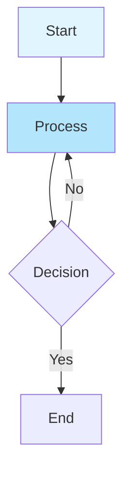

# CLAUDE.md

This file provides guidance to Claude Code (claude.ai/code) when working with code in this repository.

## Development Commands

**IMPORTANT: This project uses Yarn, not NPM**

```bash
# Development server with Turbopack
yarn run dev

# Build for production with Turbopack
yarn run build

# Start production server
yarn run start

# Lint code
yarn run lint

# Type check
yarn run type-check

# Install dependencies
yarn install

# Add dependencies
yarn add <package>

# Add dev dependencies
yarn add --dev <package>
```

## Architecture

This is a Next.js 15.5 blog application using the App Router architecture with MDX support for content creation.

### Core Technologies

- **Next.js 15.5** with App Router
- **React 19.1** with TypeScript
- **MDX** for markdown content with React components
- **Tailwind CSS v4** for styling
- **Turbopack** for fast development builds

### Project Structure

```
src/
  app/                    # Next.js App Router pages
    layout.tsx           # Root layout with Geist fonts
    page.tsx             # Homepage
    globals.css          # Global styles with CSS variables
```

### Key Configuration

- **MDX Integration**: Next.js configured to handle `.md` and `.mdx` files as pages via `@next/mdx`
- **Styling**: Tailwind CSS v4 with custom CSS variables for theming
- **Fonts**: Geist Sans and Geist Mono loaded via `next/font/google`
- **TypeScript**: Strict mode enabled with path aliases (`@/*` -> `./src/*`)

### Styling System

- Uses CSS custom properties for theming with automatic dark mode support
- Tailwind CSS configured through PostCSS with `@tailwindcss/postcss`
- Color scheme: `--background` and `--foreground` variables with media query dark mode

### Content Strategy

The application is set up to handle MDX content, suggesting this will be a content-focused blog where markdown files can contain React components.

### MDX Error Handling

The project includes enhanced error handling for MDX compilation errors:

- **Component**: `src/components/mdx/MDXContent.tsx`
- **Features**:
  - Displays detailed error messages with line and column numbers
  - Shows source code context around the error (3 lines before/after)
  - Highlights the exact line where the error occurred
  - Provides helpful troubleshooting tips
  - Links to official MDX troubleshooting documentation

**Error Display Includes**:
- Error location (line and column number)
- Error message and reason
- Source code context with line numbers
- Common issue suggestions
- Visual indicators for the error line (→ marker)

**Example Error Output**:
```
→  142 | <Component?>
   143 | </Component>
```
Error: Unexpected character `?` (U+003F) in name
Line 142, Column 12

This makes debugging MDX syntax errors much easier during development.

## Custom Extensions & Plugins

### Admonition Plugin

- **Primary Location**: `src/extensions/admonitions/index.ts` (TypeScript source)
- **Working Configuration**: Uses `./remark-admonitions.mjs` in `next.config.ts`
- **Issue**: Next.js MDX cannot directly load TypeScript files for remark plugins
- **Current Solution**: Use the `.mjs` file which mirrors the TypeScript implementation
- **IMPORTANT**: TypeScript extensions work for components but not for remark/rehype plugins in Next.js MDX configuration

The admonition plugin supports the following syntax in MDX files:

```markdown
:::note
Content here
:::

:::tip{title="Custom Title"}
Content with custom title
:::
```

Supported types: `note`, `tip`, `info`, `warning`, `danger`

### MDX Plugin Integration

- Custom plugins should be referenced directly by their TypeScript file paths
- Next.js handles TypeScript compilation automatically
- No need to create separate JavaScript versions for custom extensions

### Mermaid Diagram Support

The project includes full support for Mermaid diagrams, optimized for both Next.js preview and Vercel deployment.

#### Implementation Details

- **Package**: `mermaid@^11.11.0`
- **Component**: `src/components/mdx/Mermaid.tsx`
- **Rendering Strategy**: Client-side only (prevents SSR issues)
- **Deployment**: Fully compatible with Vercel serverless environment

#### Key Features

1. **SSR-Safe**: Uses `'use client'` directive and dynamic imports
2. **Hydration Handling**: Proper `isMounted` state prevents hydration mismatches
3. **Error Boundaries**: Clear error messages with diagram source display
4. **Loading States**: Progressive loading UI for better user experience
5. **Dark Mode**: Compatible with theme switching
6. **Custom Styling**: Integrates with Tailwind CSS and supports custom fonts

#### Usage in MDX Files

**Method 1: Native Markdown code blocks (Recommended)**
````markdown

````

This is the preferred method as it follows standard Markdown conventions and doesn't require importing the component.

**Method 2: Using Mermaid component with children**
```mdx
import Mermaid from '@/components/mdx/Mermaid';

<Mermaid>
{`
graph TD
    A[Start] --> B[Process]
    B --> C{Decision}
    C -->|Yes| D[End]
    C -->|No| B
`}
</Mermaid>
```

**Method 3: Using chart prop**
```mdx
<Mermaid chart="graph LR; A --> B --> C" />
```

#### Why This Approach Works for Vercel

1. **Client-Side Rendering**: No server-side diagram generation needed
2. **Dynamic Import**: Mermaid library loaded only when needed
3. **No Build Dependencies**: Avoids serverless function size limits
4. **Hydration Safety**: Prevents React hydration errors
5. **No External Plugins**: Direct mermaid library usage (no `mdx-mermaid` dependency issues)

#### Supported Diagram Types

Mermaid supports many diagram types including:
- Flowcharts (`graph`, `flowchart`)
- Sequence diagrams (`sequenceDiagram`)
- Class diagrams (`classDiagram`)
- State diagrams (`stateDiagram`)
- Entity Relationship (`erDiagram`)
- User Journey (`journey`)
- Gantt charts (`gantt`)
- Pie charts (`pie`)
- Git graphs (`gitGraph`)
- And more...

#### Configuration

The Mermaid rendering is handled through:
- Custom `code` component override in `src/components/mdx-components.tsx`
- Automatically detects `language-mermaid` class on code blocks
- The Mermaid component is also available for direct import
- No remark/rehype plugins required in MDX configuration

**How it works:**
1. MDX/Markdown parses ` ```mermaid ` blocks as code with `className="language-mermaid"`
2. Custom `code` component checks for `language-mermaid` class
3. If found, renders using the Mermaid component instead of regular code block
4. Otherwise, renders as normal syntax-highlighted code

#### Troubleshooting

- If diagrams don't render, check browser console for syntax errors
- Mermaid syntax errors will display error message with source code
- Native markdown syntax (` ```mermaid `) is recommended and requires no imports
- Component syntax requires importing `Mermaid` from `@/components/mdx/Mermaid`
