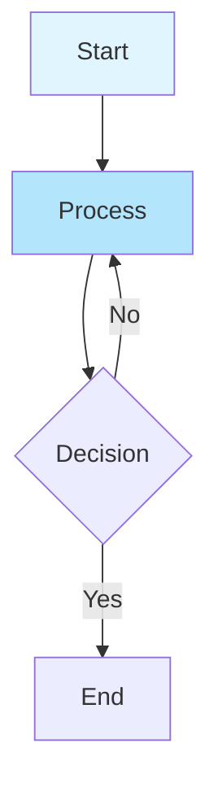

# CLAUDE.md

本文件为 Claude Code (claude.ai/code) 在处理此仓库代码时提供指南。

## 开发命令

**重要提示：本项目使用 Yarn，而非 NPM**

```bash
# 使用 Turbopack 启动开发服务器
yarn run dev

# 使用 Turbopack 构建生产版本
yarn run build

# 启动生产服务器
yarn run start

# 代码 Lint 检查
yarn run lint

# 类型检查
yarn run type-check

# 安装依赖
yarn install

# 添加依赖
yarn add <package>

# 添加开发依赖
yarn add --dev <package>
```

## 架构

这是一个基于 Next.js 15.5 的博客应用，使用 App Router 架构，并支持 MDX 内容创作。

### 核心技术

- **Next.js 15.5**：使用 App Router
- **React 19.1**：使用 TypeScript
- **MDX**：用于编写包含 React 组件的 Markdown 内容
- **Tailwind CSS v4**：用于样式设计
- **Turbopack**：用于快速开发构建

### 项目结构

```
src/
  app/                    # Next.js App Router 页面
    layout.tsx           # 根布局（包含 Geist 字体）
    page.tsx             # 首页
    globals.css          # 全局样式（包含 CSS 变量）
```

### 关键配置

- **MDX 集成**：Next.js 配置为通过 `@next/mdx` 处理 `.md` 和 `.mdx` 文件作为页面
- **样式**：Tailwind CSS v4，配合自定义 CSS 变量用于主题设置
- **字体**：通过 `next/font/google` 加载 Geist Sans 和 Geist Mono
- **TypeScript**：启用严格模式，并配置了路径别名 (`@/*` -> `./src/*`)

### 样式系统

- 使用 CSS 自定义属性进行主题设置，自动支持暗黑模式
- 通过 `@tailwindcss/postcss` 配置 PostCSS 使用 Tailwind CSS
- 配色方案：使用 `--background` 和 `--foreground` 变量，配合媒体查询实现暗黑模式

### 内容策略

应用配置为处理 MDX 内容，表明这是一个以内容为中心的博客，Markdown 文件中可以包含 React 组件。

### MDX 错误处理

项目包含增强的 MDX 编译错误处理机制：

- **组件**：`src/components/mdx/MDXContent.tsx`
- **功能**：
  - 显示包含行号和列号的详细错误信息
  - 显示错误周围的源代码上下文（前后各 3 行）
  - 高亮显示发生错误的具体行
  - 提供有用的故障排除提示
  - 链接到官方 MDX 故障排除文档

**错误显示包含**：

- 错误位置（行号和列号）
- 错误信息和原因
- 带行号的源代码上下文
- 常见问题建议
- 错误行视觉指示器（→ 标记）

**错误输出示例**：

```
→  142 | <Component?>
   143 | </Component>
```

Error: Unexpected character `?` (U+003F) in name
Line 142, Column 12

这使得开发过程中调试 MDX 语法错误变得更加容易。

## MDX 语法注意事项

### 1. 标签闭合

MDX 要求所有 JSX/HTML 标签必须严格闭合，包括空元素。

- ❌ **错误**：使用 `<br>`, `<hr>`, ``
- ✅ **正确**：使用 `<br />`, `<hr />`, ``

### 2. 花括号转义

MDX 将花括号 `{` 和 `}` 视为 JavaScript 表达式的开始。如果在普通文本中直接使用它们（尤其是在标题或段落开头），可能会导致编译错误或被误解析为变量。

- ❌ **错误**：`# {Project Name}` (会被尝试解析为 JS 表达式)
- ✅ **正确**：
  - 使用反斜杠转义：`\{Project Name\}`
  - 使用行内代码：`` `{Project Name}` ``
  - 使用 HTML 实体：`&#123;Project Name&#125;`
  - 作为字符串表达式：`{' {Project Name} '}`

## 自定义扩展与插件

### Admonition（提示框）插件

- **主要位置**：`src/extensions/admonitions/index.ts` (TypeScript 源码)
- **工作配置**：在 `next.config.ts` 中使用 `./remark-admonitions.mjs`
- **问题**：Next.js MDX 无法直接加载 TypeScript 编写的 remark 插件
- **当前方案**：使用与 TypeScript 实现对应的 `.mjs` 文件
- **重要**：TypeScript 扩展适用于组件，但不适用于 Next.js MDX 配置中的 remark/rehype 插件

Admonition 插件在 MDX 文件中支持以下语法：

```markdown
:::note
这里是内容
:::

:::tip{title="自定义标题"}
带有自定义标题的内容
:::
```

支持的类型：`note`（笔记）, `tip`（提示）, `info`（信息）, `warning`（警告）, `danger`（危险）

### MDX 插件集成

- 自定义插件应直接通过其 TypeScript 文件路径引用
- Next.js 会自动处理 TypeScript 编译
- 无需为自定义扩展创建单独的 JavaScript 版本

### Mermaid 图表支持

项目包含对 Mermaid 图表的全面支持，针对 Next.js 预览和 Vercel 部署进行了优化。

#### 实现细节

- **包**：`mermaid@^11.11.0`
- **组件**：`src/components/mdx/Mermaid.tsx`
- **渲染策略**：仅客户端渲染（防止 SSR 问题）
- **部署**：完全兼容 Vercel Serverless 环境

#### 关键特性

1. **SSR 安全**：使用 `'use client'` 指令和动态导入
2. **水合处理**：正确的 `isMounted` 状态防止水合不匹配
3. **错误边界**：清晰的错误信息和图表源码显示
4. **加载状态**：渐进式加载 UI，提升用户体验
5. **暗黑模式**：兼容主题切换
6. **自定义样式**：集成 Tailwind CSS 并支持自定义字体

#### 在 MDX 文件中使用

**方法 1：原生 Markdown 代码块（推荐）**

````markdown

````

这是首选方法，因为它遵循标准 Markdown 惯例，且无需导入组件。

**方法 2：使用包含子元素的 Mermaid 组件**

```mdx
import Mermaid from '@/components/mdx/Mermaid';

<Mermaid>
  {`
graph TD
    A[Start] --> B[Process]
    B --> C{Decision}
    C -->|Yes| D[End]
    C -->|No| B
`}
</Mermaid>
```

**方法 3：使用 chart 属性**

```mdx
<Mermaid chart="graph LR; A --> B --> C" />
```

#### 为什么这种方法适用于 Vercel

1. **客户端渲染**：无需服务端生成图表
2. **动态导入**：仅在需要时加载 Mermaid 库
3. **无构建依赖**：避免 Serverless 函数大小限制
4. **水合安全**：防止 React 水合错误
5. **无外部插件**：直接使用 mermaid 库（无 `mdx-mermaid` 依赖问题）

#### 支持的图表类型

Mermaid 支持多种图表类型，包括：

- 流程图 (`graph`, `flowchart`)
- 时序图 (`sequenceDiagram`)
- 类图 (`classDiagram`)
- 状态图 (`stateDiagram`)
- 实体关系图 (`erDiagram`)
- 用户旅程图 (`journey`)
- 甘特图 (`gantt`)
- 饼图 (`pie`)
- Git 图 (`gitGraph`)
- 等等...

#### 配置

Mermaid 渲染通过以下方式处理：

- `src/components/mdx-components.tsx` 中的自定义 `code` 组件覆盖
- 自动检测代码块上的 `language-mermaid` 类
- Mermaid 组件也可直接导入使用
- MDX 配置中无需 remark/rehype 插件

**工作原理：**

1. MDX/Markdown 将 ` ```mermaid ` 块解析为带有 `className="language-mermaid"` 的代码
2. 自定义 `code` 组件检查 `language-mermaid` 类
3. 如果找到，使用 Mermaid 组件渲染，而不是普通代码块
4. 否则，渲染为普通语法高亮代码

#### 故障排除

- 如果图表未渲染，请检查浏览器控制台是否有语法错误
- Mermaid 语法错误会显示带有源代码的错误信息
- 推荐使用原生 markdown 语法 (` ```mermaid `)，无需导入
- 组件语法需要从 `@/components/mdx/Mermaid` 导入 `Mermaid`

## 代码生成规范

### 编程语言要求

**所有代码示例必须使用 TypeScript**

- ✅ 使用带有完整类型注解的 TypeScript 语法
- ✅ 包含数据结构的接口/类型定义
- ✅ 使用现代 ES6+ 特性（箭头函数、解构、async/await）
- ✅ 遵循 TypeScript 最佳实践和严格模式
- ❌ 除非特别要求，否则**不要**使用 Python、JavaScript（无类型）或其他语言

### 类型安全标准

1. **函数签名**

   ```typescript
   // ✅ 正确 - 完整的类型注解
   function processData(input: string, options: ProcessOptions): Promise<Result> {
     // 实现
   }

   // ❌ 错误 - 缺少类型
   function processData(input, options) {
     // 实现
   }
   ```

2. **接口定义**

   ```typescript
   // ✅ 正确 - 清晰的数据结构
   interface User {
     id: string;
     name: string;
     email: string;
     createdAt: Date;
   }

   interface ProcessOptions {
     timeout?: number;
     retries?: number;
   }
   ```

3. **避免 `any` 类型**

   ```typescript
   // ✅ 正确 - 使用具体类型或泛型
   function parseJSON<T>(data: string): T {
     return JSON.parse(data);
   }

   // ❌ 错误 - 使用 any
   function parseJSON(data: string): any {
     return JSON.parse(data);
   }
   ```

### 代码风格指南

- **缩进**：4 个空格（不是 tab）
- **引号**：字符串使用单引号 `'`
- **分号**：始终使用分号
- **变量声明**：使用 `const` 和 `let`，绝不使用 `var`
- **函数**：回调函数优先使用箭头函数
- **字符串**：插值使用模板字符串

### 示例模板

**基础函数**

```typescript
function functionName(param1: string, param2: number): ReturnType {
  const result = processLogic(param1, param2);
  return result;
}
```

**异步函数**

```typescript
async function fetchData(url: string): Promise<Data> {
  const response = await fetch(url);
  const data: Data = await response.json();
  return data;
}
```

**类定义**

```typescript
class ServiceName {
  private config: Config;

  constructor(config: Config) {
    this.config = config;
  }

  public async execute(input: Input): Promise<Output> {
    // 实现
    return output;
  }
}
```

**泛型函数**

```typescript
function mapArray<T, U>(items: T[], mapper: (item: T) => U): U[] {
  return items.map(mapper);
}
```

### 何时使用其他语言

仅在以下情况使用非 TypeScript 语言：

- 上下文明确要求（例如："写一个 Python 脚本"）
- 展示语言对比
- 使用特定语言特性（例如：Python 装饰器，Rust 所有权）
- 配置文件（JSON, YAML 等）

---

**最后更新**：2025-12-25
