# Agent2Agent (A2A) Protocol 完整教程

> 本教程基于 A2A 官方规范，详细介绍 Agent2Agent 协议的核心概念、技术架构和实现指南，并与 MCP (Model Context Protocol) 进行深入对比

## 目录

- [1. A2A Protocol 简介](#1-a2a-protocol-简介)
- [2. 核心概念](#2-核心概念)
- [3. 系统架构](#3-系统架构)
- [4. 协议工作流程](#4-协议工作流程)
- [5. Agent Card 详解](#5-agent-card-详解)
- [6. Task 生命周期](#6-task-生命周期)
- [7. 通信模式](#7-通信模式)
- [8. 实现指南](#8-实现指南)
- [9. A2A vs MCP 深度对比](#9-a2a-vs-mcp-深度对比)
- [10. 实战示例](#10-实战示例)
- [11. 最佳实践](#11-最佳实践)

---

## 1. A2A Protocol 简介

### 1.1 什么是 A2A Protocol?

**Agent2Agent (A2A) Protocol** 是由 **Google 开发**并于 **2025 年 6 月捐赠给 Linux Foundation** 的开放标准协议，旨在**实现 AI Agent 之间的无缝通信和协作**。

### 1.2 发展历程

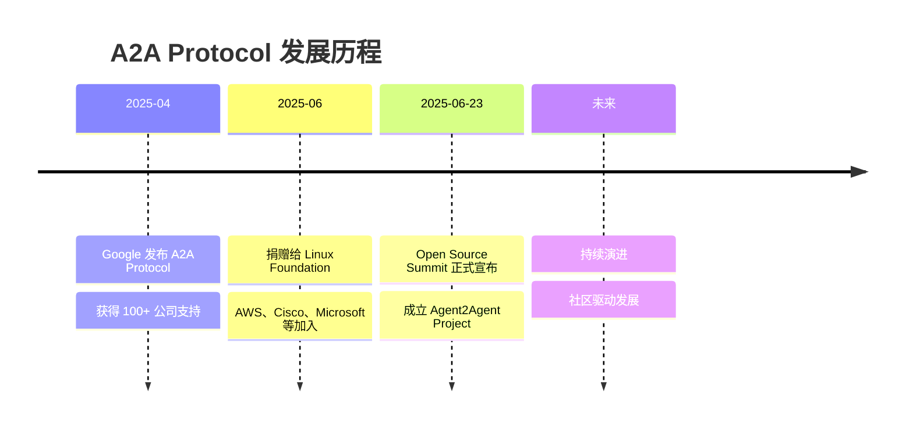

### 1.3 核心价值主张

**A2A 解决的核心问题：Agent 孤岛**

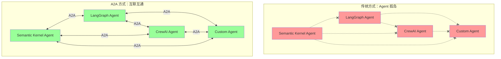

### 1.4 核心特性

| 特性                | 说明                               |
| ------------------- | ---------------------------------- |
| 🌐 **开放标准**     | Linux Foundation 托管，社区驱动    |
| 🔗 **跨平台互操作** | 不同框架的 Agent 可以无缝通信      |
| 🔒 **企业级安全**   | OAuth 2.0、API Key、OpenID Connect |
| 📡 **异步通信**     | 支持长时间运行的任务               |
| 🎯 **任务导向**     | 基于 Task 的工作流管理             |
| 🔍 **能力发现**     | 通过 Agent Card 自动发现能力       |
| 🌊 **流式传输**     | Server-Sent Events (SSE) 实时更新  |

### 1.5 设计原则

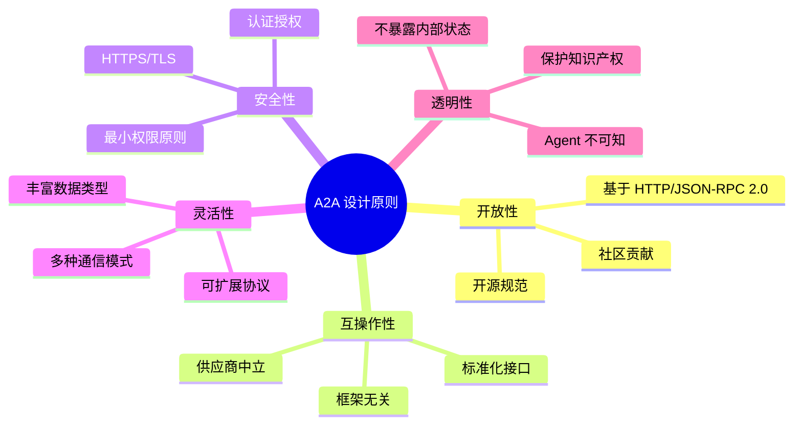

---

## 2. 核心概念

### 2.1 基本术语

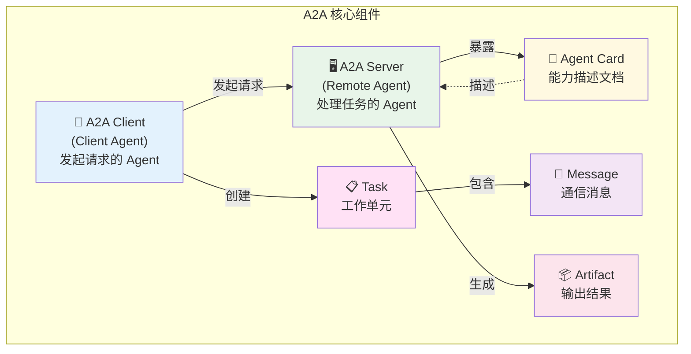

#### **A2A Client（客户端 Agent）**

- 代表用户或其他系统发起请求
- 可以是应用程序、服务或另一个 AI Agent
- 负责发现和连接到 Remote Agent

#### **A2A Server（远程 Agent）**

- 暴露 A2A 兼容的 HTTP 端点
- 处理任务并提供响应
- 可以是任何框架构建的 Agent

#### **Agent Card（Agent 名片）**

- JSON 格式的元数据文档
- 描述 Agent 的身份、能力、技能
- 通常位于 `/.well-known/agent-card.json`

#### **Task（任务）**

- A2A 管理的基本工作单元
- 拥有唯一 ID 和明确的生命周期
- 可以是短暂或长时间运行

#### **Message（消息）**

- Task 内的通信回合
- 拥有角色（"user" 或 "agent"）
- 包含一个或多个 Part

#### **Artifact（产出物）**

- Agent 作为任务结果生成的输出
- 可以是文档、图像、结构化数据等
- 由多个 Part 组成

### 2.2 协议层次结构

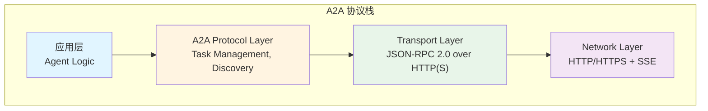

### 2.3 三大核心机制

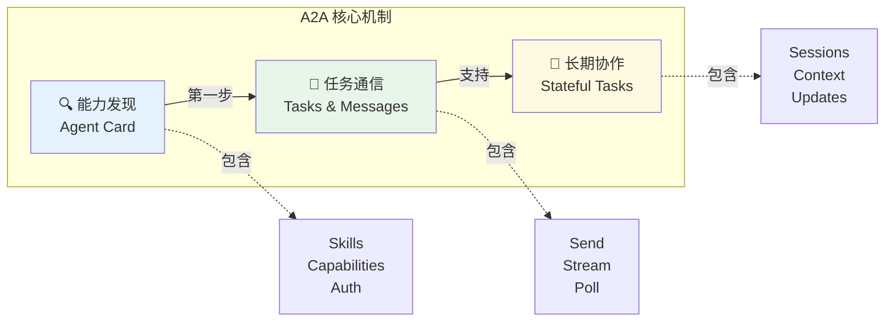

---

## 3. 系统架构

### 3.1 整体架构图

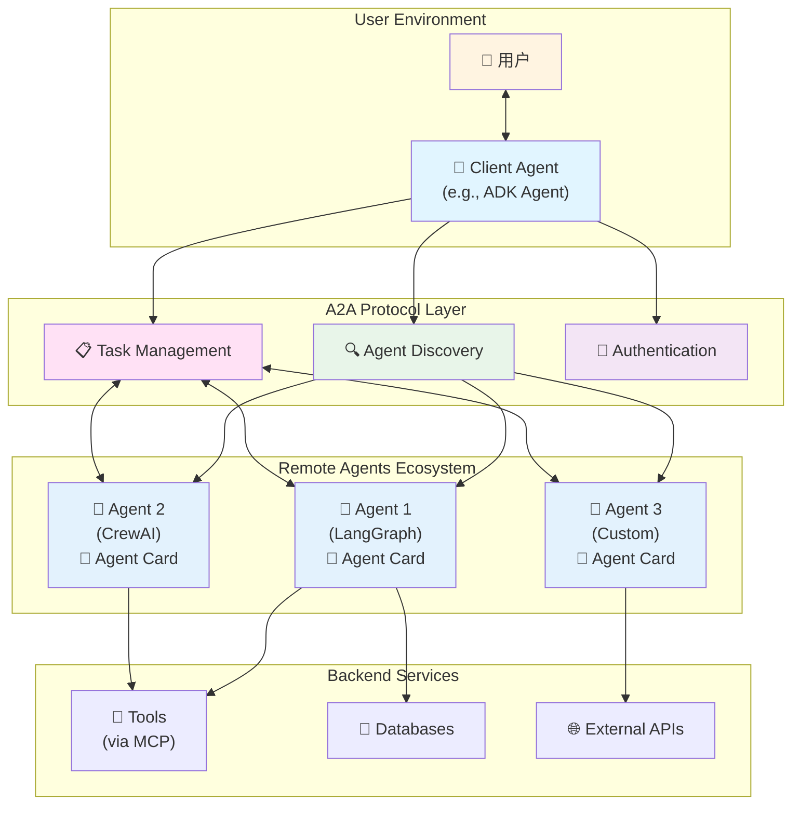

### 3.2 Client-Server 架构

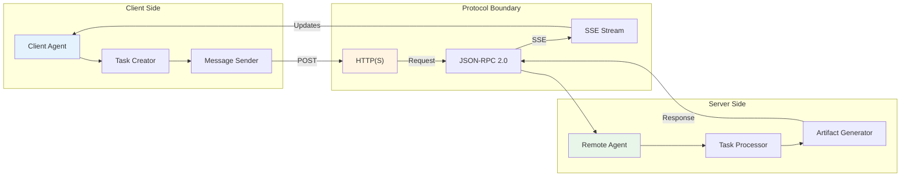

### 3.3 多 Agent 协作架构

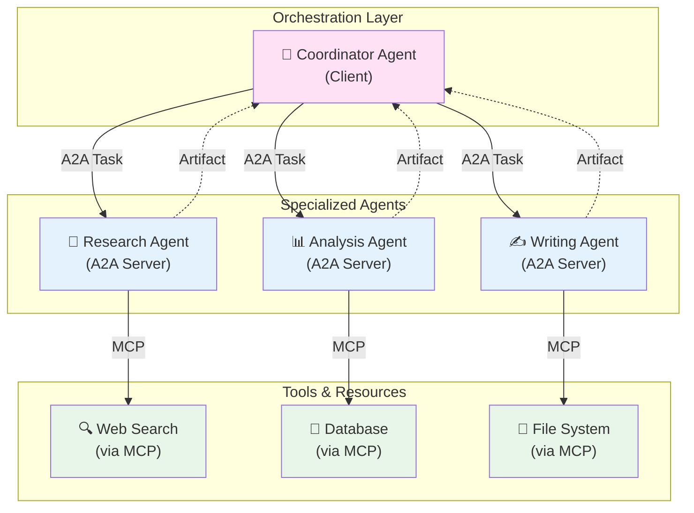

---

## 4. 协议工作流程

### 4.1 完整交互流程

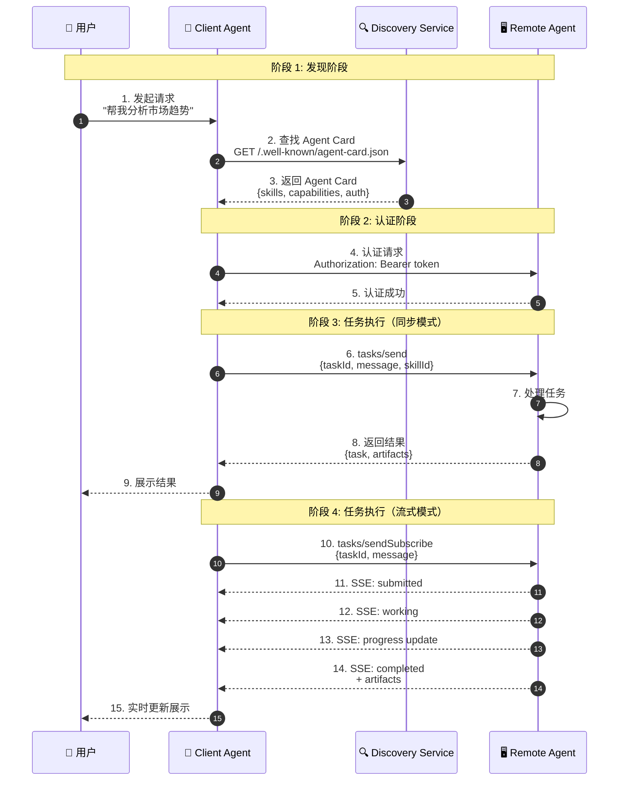

### 4.2 Agent Discovery 流程

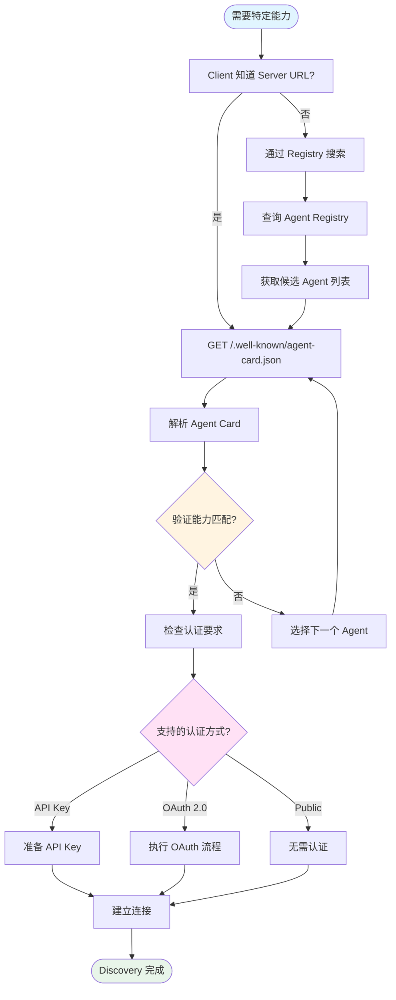

### 4.3 Task 执行流程

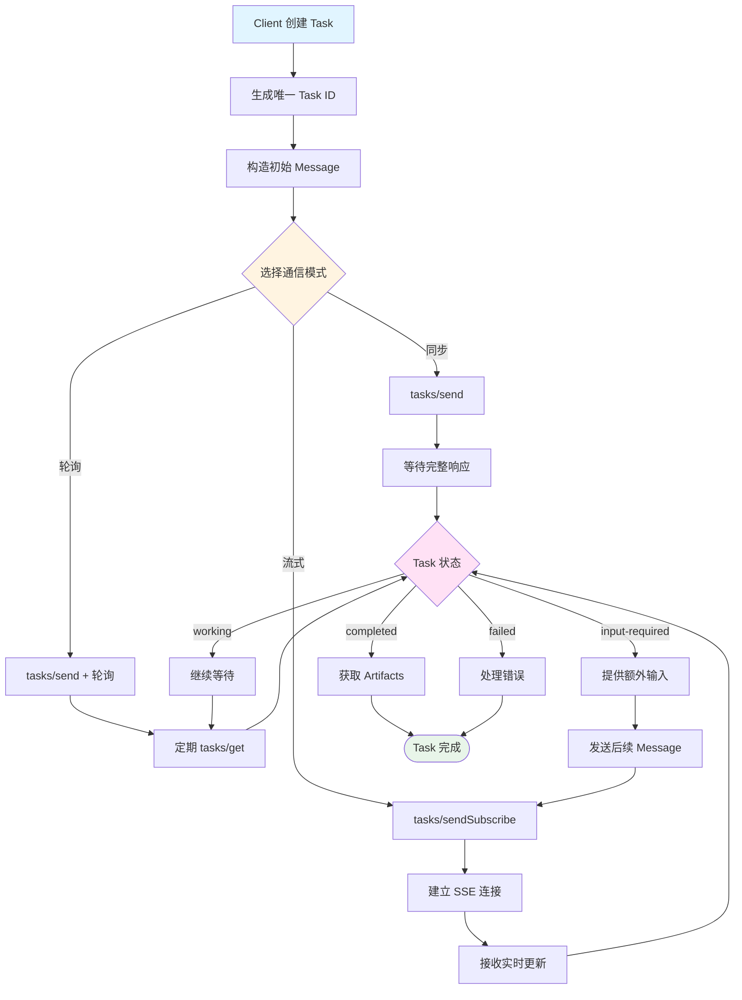

### 4.4 三种通信模式对比

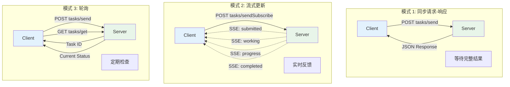

---

## 5. Agent Card 详解

### 5.1 Agent Card 结构

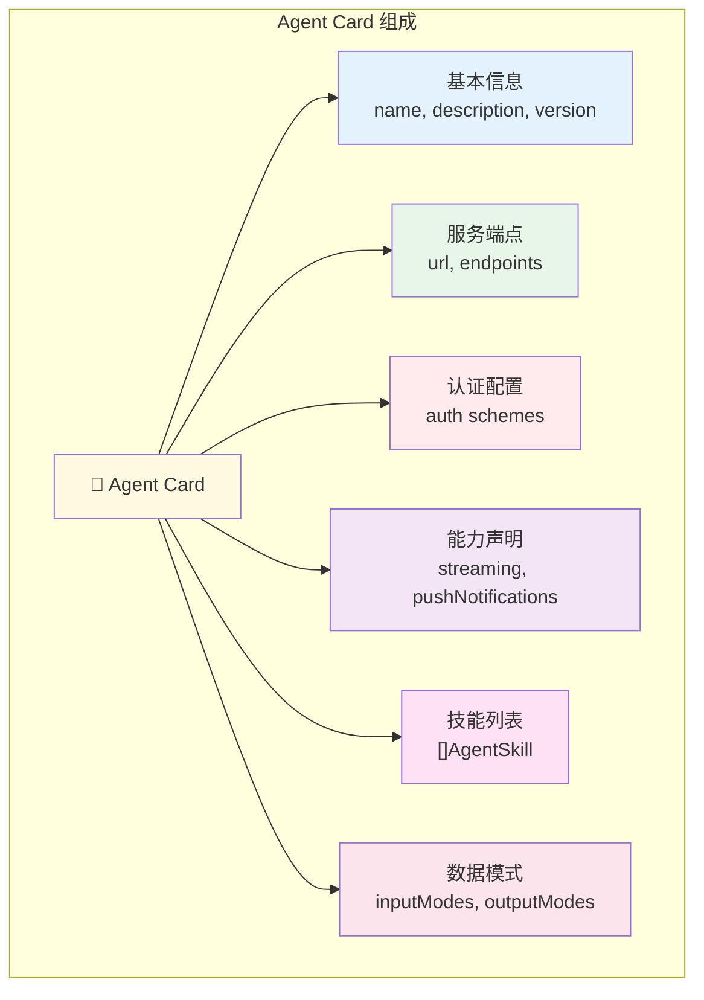

### 5.2 完整 Agent Card 示例

```json
{
  "name": "Market Analysis Agent",
  "description": "Specialized agent for financial market analysis",
  "version": "1.2.0",
  "url": "https://api.example.com/agents/market-analyzer",

  "auth": {
    "type": "oauth2",
    "flows": {
      "clientCredentials": {
        "tokenUrl": "https://auth.example.com/token",
        "scopes": {
          "read:data": "Read market data",
          "analyze": "Perform analysis"
        }
      }
    }
  },

  "capabilities": {
    "streaming": true,
    "pushNotifications": false
  },

  "defaultInputModes": ["text/plain", "application/json"],
  "defaultOutputModes": ["text/plain", "application/json", "image/png"],

  "skills": [
    {
      "id": "trend_analysis",
      "name": "Trend Analysis",
      "description": "Analyze market trends based on historical data",
      "tags": ["analysis", "trends", "forecasting"],
      "examples": ["Analyze Bitcoin price trends", "What's the trend for tech stocks?"],
      "inputModes": ["text/plain"],
      "outputModes": ["application/json", "image/png"]
    },
    {
      "id": "risk_assessment",
      "name": "Risk Assessment",
      "description": "Evaluate investment risk levels",
      "tags": ["risk", "assessment", "portfolio"],
      "examples": ["Assess risk of my portfolio", "Risk level for TSLA stock?"],
      "inputModes": ["application/json"],
      "outputModes": ["application/json"]
    }
  ],

  "contact": "[email protected]",
  "license": "Apache-2.0"
}
```

### 5.3 AgentSkill 详解

```typescript
interface AgentSkill {
  // 唯一标识符
  id: string;

  // 技能名称
  name: string;

  // 详细描述
  description: string;

  // 标签（用于搜索和分类）
  tags?: string[];

  // 使用示例
  examples?: string[];

  // 支持的输入格式
  inputModes?: string[]; // e.g., ["text/plain", "application/json"]

  // 支持的输出格式
  outputModes?: string[]; // e.g., ["application/json", "image/png"]
}
```

---

## 6. Task 生命周期

### 6.1 Task 状态机

```mermaid
stateDiagram-v2
    [*] --> submitted: 创建 Task

    submitted --> working: Agent 开始处理
    submitted --> rejected: Agent 拒绝

    working --> input-required: 需要更多信息
    working --> completed: 成功完成
    working --> failed: 处理失败
    working --> canceled: 用户取消

    input-required --> working: 提供输入后继续
    input-required --> canceled: 用户取消

    completed --> [*]
    failed --> [*]
    rejected --> [*]
    canceled --> [*]

    note right of submitted
        初始状态
        Task 已提交
    end note

    note right of working
        Agent 正在处理
        可能需要时间
    end note

    note right of input-required
        暂停状态
        等待用户输入
    end note

    note left of completed
        终态：成功
        Artifacts 可用
    end note

    note left of failed
        终态：失败
        包含错误信息
    end note
```

### 6.2 Task 对象结构

```typescript
interface Task {
  // 唯一标识符
  id: string;

  // 当前状态
  status:
    | 'submitted'
    | 'working'
    | 'input-required'
    | 'completed'
    | 'failed'
    | 'rejected'
    | 'canceled';

  // 消息历史
  messages: Message[];

  // 生成的产出物
  artifacts?: Artifact[];

  // 元数据
  metadata?: {
    sessionId?: string;
    context?: string;
    createdAt: string;
    updatedAt: string;
  };

  // 错误信息（如果失败）
  error?: {
    code: string;
    message: string;
    details?: any;
  };
}
```

### 6.3 Task 生命周期示例

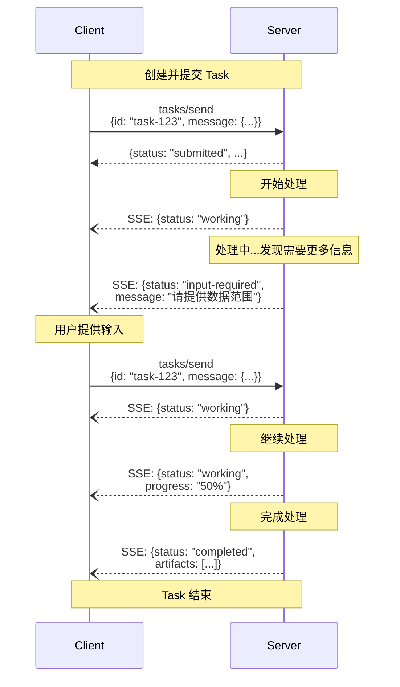

---

## 7. 通信模式

### 7.1 JSON-RPC 2.0 基础

A2A 使用 **JSON-RPC 2.0** 作为消息格式：

```json
// 请求格式
{
  "jsonrpc": "2.0",
  "method": "tasks/send",
  "params": {
    "message": {
      "role": "user",
      "parts": [
        {
          "type": "text",
          "text": "Analyze recent market trends"
        }
      ]
    },
    "skillId": "trend_analysis"
  },
  "id": "req-001"
}

// 响应格式
{
  "jsonrpc": "2.0",
  "result": {
    "id": "task-123",
    "status": "completed",
    "artifacts": [...]
  },
  "id": "req-001"
}

// 错误格式
{
  "jsonrpc": "2.0",
  "error": {
    "code": -32602,
    "message": "Invalid parameters",
    "data": {
      "details": "Missing required field: skillId"
    }
  },
  "id": "req-001"
}
```

### 7.2 核心 RPC 方法

| 方法                  | 用途                      | 响应类型  |
| --------------------- | ------------------------- | --------- |
| `tasks/send`          | 发送消息，创建或继续 Task | 同步 JSON |
| `tasks/sendSubscribe` | 发送消息并订阅更新        | SSE 流    |
| `tasks/get`           | 获取 Task 当前状态        | 同步 JSON |
| `tasks/cancel`        | 取消正在进行的 Task       | 同步 JSON |

### 7.3 Server-Sent Events (SSE) 流式传输

```
// SSE 响应示例
HTTP/1.1 200 OK
Content-Type: text/event-stream
Cache-Control: no-cache
Connection: keep-alive

event: update
data: {"jsonrpc":"2.0","result":{"status":"submitted"},"id":"req-001"}

event: update
data: {"jsonrpc":"2.0","result":{"status":"working"},"id":"req-001"}

event: update
data: {"jsonrpc":"2.0","result":{"status":"working","progress":"Processing..."},"id":"req-001"}

event: update
data: {"jsonrpc":"2.0","result":{"status":"completed","artifacts":[...]},"id":"req-001"}
```

---

## 8. 实现指南

### 8.1 快速开始：创建 A2A Server

#### 环境准备

```bash
# Python
pip install google-a2a

# 或从源码安装
git clone https://github.com/a2aproject/A2A.git
cd A2A/python
pip install -e .
```

#### 最小化 Server 实现（Python）

```python
from google_a2a import A2AServer, AgentCard, AgentSkill, Task
from fastapi import FastAPI
import uvicorn

app = FastAPI()

# 1. 定义 Agent Skill
weather_skill = AgentSkill(
    id='get_weather',
    name='Get Weather',
    description='Get current weather for a city',
    tags=['weather', 'forecast'],
    examples=['weather in Tokyo', 'current weather']
)

# 2. 创建 Agent Card
agent_card = AgentCard(
    name='Weather Agent',
    description='Provides weather information',
    version='1.0.0',
    url='http://localhost:8000',
    default_input_modes=['text/plain'],
    default_output_modes=['text/plain', 'application/json'],
    capabilities={'streaming': True},
    skills=[weather_skill]
)

# 3. 初始化 A2A Server
a2a_server = A2AServer(app, agent_card)

# 4. 实现任务处理器
@a2a_server.handle_task
async def handle_weather_task(task: Task):
    """处理天气查询任务"""
    # 获取用户消息
    user_message = task.messages[-1]
    query = user_message.parts[0].text

    # 模拟天气 API 调用
    weather_data = {
        "location": query,
        "temperature": 25,
        "condition": "Sunny",
        "humidity": 60
    }

    # 返回结果
    return {
        "status": "completed",
        "artifacts": [
            {
                "type": "text",
                "text": f"Weather in {query}: {weather_data['condition']}, {weather_data['temperature']}°C"
            },
            {
                "type": "data",
                "data": weather_data
            }
        ]
    }

# 5. 启动服务器
if __name__ == "__main__":
    uvicorn.run(app, host="0.0.0.0", port=8000)
```

#### Agent Card 端点

Server 会自动暴露 Agent Card：

```bash
# 获取 Agent Card
curl http://localhost:8000/.well-known/agent-card.json
```

### 8.2 创建 A2A Client

```python
from google_a2a import A2AClient
import asyncio

async def main():
    # 1. 创建 Client
    client = A2AClient()

    # 2. 发现 Agent（获取 Agent Card）
    agent_url = "http://localhost:8000"
    agent_card = await client.discover(agent_url)

    print(f"发现 Agent: {agent_card.name}")
    print(f"可用技能: {[skill.name for skill in agent_card.skills]}")

    # 3. 发送任务（同步模式）
    task = await client.send_task(
        agent_url=agent_url,
        skill_id="get_weather",
        message="What's the weather in Tokyo?"
    )

    print(f"Task Status: {task.status}")
    print(f"Result: {task.artifacts[0].text}")

    # 4. 发送任务（流式模式）
    async for update in client.send_task_streaming(
        agent_url=agent_url,
        skill_id="get_weather",
        message="Weather forecast for next week"
    ):
        print(f"Status: {update.status}")
        if update.status == "completed":
            print(f"Final Result: {update.artifacts}")

asyncio.run(main())
```

### 8.3 实现流式响应

```python
@a2a_server.handle_task_streaming
async def handle_analysis_task(task: Task):
    """支持流式更新的分析任务"""

    # 发送初始状态
    yield {
        "status": "working",
        "message": "开始分析..."
    }

    # 模拟长时间运行的任务
    import asyncio

    for progress in range(0, 101, 20):
        await asyncio.sleep(1)  # 模拟处理时间

        yield {
            "status": "working",
            "message": f"分析进度: {progress}%"
        }

    # 完成并返回结果
    yield {
        "status": "completed",
        "artifacts": [
            {
                "type": "text",
                "text": "分析完成！"
            }
        ]
    }
```

---

## 9. A2A vs MCP 深度对比

### 9.1 核心定位差异

```mermaid
graph TB
    subgraph "MCP: Agent ↔ Tool 通信"
        LLM1["🤖 AI Agent/LLM"]
        MCP_Layer["MCP Protocol"]
        Tools["🔧 Tools & Resources"]

        LLM1 <-->|MCP| MCP_Layer
        MCP_Layer <--> Tools

        Tools_Ex["工具示例:<br/>· 文件系统<br/>· 数据库<br/>· API 端点<br/>· 搜索引擎"]
        Tools -.-> Tools_Ex
    end

    subgraph "A2A: Agent ↔ Agent 通信"
        Agent1["🤖 Client Agent"]
        A2A_Layer["A2A Protocol"]
        Agent2["🤖 Remote Agent"]

        Agent1 <-->|A2A| A2A_Layer
        A2A_Layer <--> Agent2

        Agent_Ex["Agent 特点:<br/>· 自主决策<br/>· 复杂推理<br/>· 状态管理<br/>· 长期协作"]
        Agent2 -.-> Agent_Ex
    end

    subgraph "协同工作"
        Combined["🤖 Client Agent"]
        Combined -->|A2A| RemoteAgents["🤖 Other Agents"]
        Combined -->|MCP| LocalTools["🔧 Local Tools"]

        RemoteAgents -->|MCP| RemoteTools["🔧 Their Tools"]
    end

    style LLM1 fill:#e3f2fd
    style Agent1 fill:#e3f2fd
    style Combined fill:#ffe1f5
    style Tools fill:#e8f5e9
    style Agent2 fill:#e3f2fd
```

### 9.2 详细对比表

| 维度           | MCP                        | A2A                        |
| -------------- | -------------------------- | -------------------------- |
| **发起方**     | Anthropic (2024-11)        | Google (2025-04)           |
| **现状**       | Anthropic 维护             | Linux Foundation 托管      |
| **核心目标**   | AI ↔ 工具连接              | Agent ↔ Agent 协作         |
| **通信对象**   | Agent 与结构化工具         | 独立的自主 Agent           |
| **交互模式**   | 工具调用（函数式）         | 任务协作（对话式）         |
| **状态管理**   | 无状态（工具无记忆）       | 有状态（Task 生命周期）    |
| **复杂度**     | 简单、同步                 | 复杂、异步                 |
| **用例**       | 数据访问、API 调用         | 多 Agent 工作流            |
| **传输协议**   | stdio、Streamable HTTP     | HTTP(S) + JSON-RPC 2.0     |
| **能力发现**   | 服务器声明 Tools/Resources | Agent Card + Skills        |
| **认证**       | 可选                       | 必须（OAuth 2.0、API Key） |
| **流式传输**   | SSE（可选）                | SSE（核心功能）            |
| **长时间任务** | 不支持                     | 原生支持（异步、轮询）     |
| **互操作性**   | 跨 LLM 平台                | 跨 Agent 框架              |

### 9.3 使用场景对比

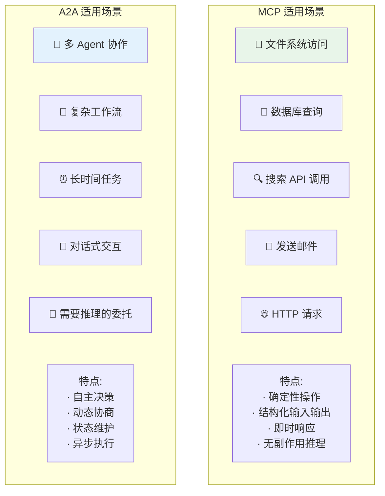

### 9.4 协议栈对比

```mermaid
graph TB
    subgraph "MCP 协议栈"
        M_App["Application Logic"]
        M_Protocol["MCP Protocol"]
        M_Transport["Transport: stdio / Streamable HTTP"]
        M_Message["JSON-RPC 2.0"]

        M_App --> M_Protocol
        M_Protocol --> M_Transport
        M_Transport --> M_Message
    end

    subgraph "A2A 协议栈"
        A_Agent["Agent Logic"]
        A_Protocol["A2A Protocol (Tasks, Skills, Card)"]
        A_Transport["HTTP(S) + SSE"]
        A_Message["JSON-RPC 2.0"]

        A_Agent --> A_Protocol
        A_Protocol --> A_Transport
        A_Transport --> A_Message
    end

    Note["共同点:<br/>都使用 JSON-RPC 2.0<br/>都支持 HTTP 传输<br/>都支持 SSE 流式"]

    style M_App fill:#e8f5e9
    style A_Agent fill:#e3f2fd
```

### 9.5 何时使用 MCP vs A2A

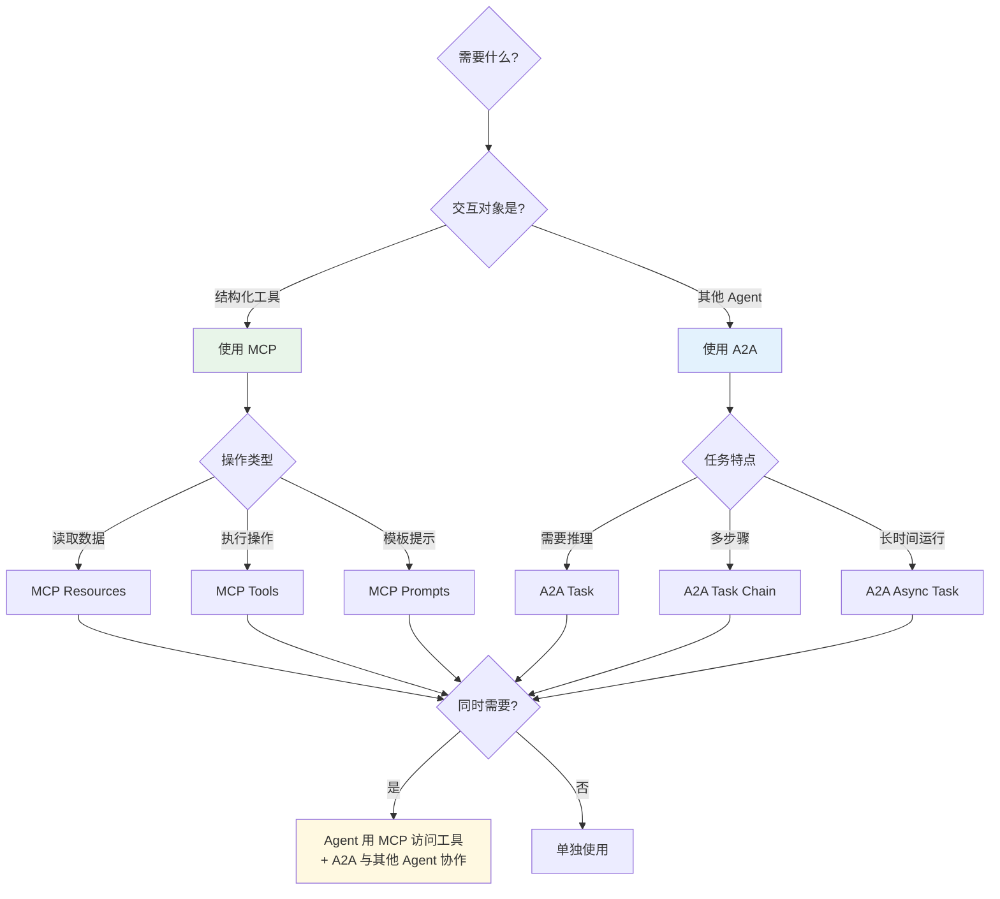

### 9.6 MCP 与 A2A 协同工作

**官方建议**：使用 **MCP 连接工具，A2A 连接 Agent**

```mermaid
graph TB
    User["👤 用户"] --> ClientAgent["🤖 Client Agent"]

    ClientAgent -->|A2A| RemoteAgent1["🤖 Research Agent"]
    ClientAgent -->|A2A| RemoteAgent2["🤖 Analysis Agent"]

    ClientAgent -->|MCP| LocalTools["🔧 Local Tools<br/>Files, DB, APIs"]

    RemoteAgent1 -->|MCP| Tools1["🔧 Search Tools"]
    RemoteAgent2 -->|MCP| Tools2["🔧 Data Tools"]

    style User fill:#fff4e1
    style ClientAgent fill:#ffe1f5
    style RemoteAgent1 fill:#e3f2fd
    style RemoteAgent2 fill:#e3f2fd
    style LocalTools fill:#e8f5e9
    style Tools1 fill:#e8f5e9
    style Tools2 fill:#e8f5e9
```

**实际案例**：

```python
# Client Agent 同时使用 MCP 和 A2A

# 1. 使用 MCP 访问本地工具
from mcp import Client as MCPClient

mcp_client = MCPClient()
files = await mcp_client.list_resources()  # MCP

# 2. 使用 A2A 委托给远程 Agent
from google_a2a import A2AClient

a2a_client = A2AClient()
analysis_result = await a2a_client.send_task(
    agent_url="https://analysis-agent.com",
    skill_id="deep_analysis",
    message={"data": files}
)  # A2A

# 3. 使用 MCP 保存结果到数据库
await mcp_client.call_tool(
    name="save_to_db",
    arguments={"data": analysis_result}
)  # MCP
```

---

## 10. 实战示例

### 10.1 示例 1：多 Agent 协作系统

**场景**：构建一个新闻分析系统，包含 3 个专门的 Agent

```python
# Coordinator Agent (Client)
from google_a2a import A2AClient

class NewsAnalysisCoordinator:
    def __init__(self):
        self.a2a_client = A2AClient()
        self.agents = {
            "scraper": "http://scraper-agent.com",
            "analyzer": "http://analyzer-agent.com",
            "summarizer": "http://summarizer-agent.com"
        }

    async def analyze_topic(self, topic: str):
        """协调多个 Agent 完成新闻分析"""

        # 步骤 1: 使用 Scraper Agent 获取新闻
        print(f"📰 Fetching news about: {topic}")
        scrape_task = await self.a2a_client.send_task(
            agent_url=self.agents["scraper"],
            skill_id="scrape_news",
            message=f"Find latest news about {topic}"
        )
        news_articles = scrape_task.artifacts[0].data

        # 步骤 2: 使用 Analyzer Agent 分析情感
        print("🔍 Analyzing sentiment...")
        analysis_task = await self.a2a_client.send_task(
            agent_url=self.agents["analyzer"],
            skill_id="sentiment_analysis",
            message={"articles": news_articles}
        )
        sentiment_data = analysis_task.artifacts[0].data

        # 步骤 3: 使用 Summarizer Agent 生成报告
        print("📝 Generating summary...")
        summary_task = await self.a2a_client.send_task_streaming(
            agent_url=self.agents["summarizer"],
            skill_id="create_report",
            message={
                "articles": news_articles,
                "sentiment": sentiment_data
            }
        )

        async for update in summary_task:
            if update.status == "working":
                print(f"   Progress: {update.message}")
            elif update.status == "completed":
                return update.artifacts[0].text
```

### 10.2 示例 2：Scraper Agent Server

```python
# Scraper Agent (Server)
from google_a2a import A2AServer, AgentCard, AgentSkill
from fastapi import FastAPI
import httpx

app = FastAPI()

scraper_skill = AgentSkill(
    id='scrape_news',
    name='News Scraper',
    description='Scrape latest news articles from various sources',
    tags=['news', 'scraping', 'web'],
    examples=['Find news about AI', 'Latest tech news']
)

agent_card = AgentCard(
    name='News Scraper Agent',
    description='Specialized agent for scraping news websites',
    version='1.0.0',
    url='http://scraper-agent.com',
    default_input_modes=['text/plain'],
    default_output_modes=['application/json'],
    capabilities={'streaming': False},
    skills=[scraper_skill]
)

a2a_server = A2AServer(app, agent_card)

@a2a_server.handle_task
async def scrape_news(task):
    query = task.messages[-1].parts[0].text

    # 模拟新闻抓取
    articles = [
        {
            "title": f"Article about {query} #1",
            "url": "https://news.com/article1",
            "content": "...",
            "published": "2025-11-07"
        },
        {
            "title": f"Article about {query} #2",
            "url": "https://news.com/article2",
            "content": "...",
            "published": "2025-11-06"
        }
    ]

    return {
        "status": "completed",
        "artifacts": [
            {
                "type": "data",
                "data": articles
            }
        ]
    }
```

### 10.3 示例 3：与 MCP 集成

```python
# Analyzer Agent 同时使用 A2A 和 MCP
from google_a2a import A2AServer, AgentCard
from mcp import Client as MCPClient
from fastapi import FastAPI

app = FastAPI()
a2a_server = A2AServer(app, agent_card)
mcp_client = MCPClient()

@a2a_server.handle_task_streaming
async def analyze_with_tools(task):
    articles = task.messages[-1].parts[0].data["articles"]

    yield {
        "status": "working",
        "message": "连接到分析工具..."
    }

    # 使用 MCP 调用本地分析工具
    analysis_results = []

    for i, article in enumerate(articles):
        yield {
            "status": "working",
            "message": f"分析文章 {i+1}/{len(articles)}"
        }

        # MCP Tool 调用
        sentiment = await mcp_client.call_tool(
            name="sentiment_analyzer",
            arguments={"text": article["content"]}
        )

        analysis_results.append({
            "article": article["title"],
            "sentiment": sentiment.content[0].text
        })

    yield {
        "status": "completed",
        "artifacts": [
            {
                "type": "data",
                "data": analysis_results
            }
        ]
    }
```

---

## 11. 最佳实践

### 11.1 Agent Card 设计

#### ✅ DO（推荐）

```json
{
  "name": "Data Analysis Agent",
  "description": "Performs statistical analysis on datasets",

  // 明确的技能定义
  "skills": [
    {
      "id": "regression_analysis",
      "name": "Regression Analysis",
      "description": "Perform linear and polynomial regression analysis on numerical data",
      "tags": ["statistics", "regression", "forecasting"],
      "examples": [
        "Analyze sales trend over time",
        "Predict future revenue based on historical data"
      ],
      "inputModes": ["application/json"],
      "outputModes": ["application/json", "image/png"]
    }
  ],

  // 清晰的认证要求
  "auth": {
    "type": "oauth2",
    "flows": {
      "clientCredentials": {
        "tokenUrl": "https://auth.example.com/token",
        "scopes": {
          "read:data": "Read access to datasets",
          "analyze": "Permission to run analysis"
        }
      }
    }
  }
}
```

#### ❌ DON'T（避免）

```json
{
  "name": "Agent", // ❌ 名称太泛
  "description": "Does stuff", // ❌ 描述不清楚

  "skills": [
    {
      "id": "skill1", // ❌ ID 不具描述性
      "name": "Skill", // ❌ 名称泛泛
      "description": "Does things" // ❌ 没有说明能做什么
    }
  ]
}
```

### 11.2 错误处理

```python
@a2a_server.handle_task
async def handle_task_with_errors(task):
    try:
        # 处理任务
        result = await process_task(task)

        return {
            "status": "completed",
            "artifacts": [result]
        }

    except ValueError as e:
        # 参数错误
        return {
            "status": "failed",
            "error": {
                "code": "INVALID_INPUT",
                "message": str(e),
                "details": {
                    "expected": "JSON object with 'data' field",
                    "received": task.messages[-1].parts[0]
                }
            }
        }

    except TimeoutError:
        # 超时错误
        return {
            "status": "failed",
            "error": {
                "code": "TIMEOUT",
                "message": "Task execution exceeded time limit",
                "details": {"timeout": "30s"}
            }
        }

    except Exception as e:
        # 未预期的错误
        return {
            "status": "failed",
            "error": {
                "code": "INTERNAL_ERROR",
                "message": "An unexpected error occurred",
                "details": {"error_type": type(e).__name__}
            }
        }
```

### 11.3 安全最佳实践

```python
from fastapi import Header, HTTPException
from jose import jwt, JWTError

# 1. 实现认证中间件
@app.middleware("http")
async def verify_authentication(request, call_next):
    # 检查 Authorization header
    auth_header = request.headers.get("authorization")

    if not auth_header:
        raise HTTPException(status_code=401, detail="Missing authentication")

    try:
        # 验证 JWT Token
        token = auth_header.replace("Bearer ", "")
        payload = jwt.decode(token, SECRET_KEY, algorithms=["HS256"])
        request.state.user = payload

    except JWTError:
        raise HTTPException(status_code=401, detail="Invalid token")

    return await call_next(request)

# 2. 实现权限检查
@a2a_server.handle_task
async def handle_task_with_authorization(task, request):
    user = request.state.user
    skill_id = task.messages[-1].parts[0].skill_id

    # 检查用户是否有权限使用此技能
    if skill_id not in user.get("allowed_skills", []):
        return {
            "status": "rejected",
            "error": {
                "code": "FORBIDDEN",
                "message": f"User not authorized to use skill: {skill_id}"
            }
        }

    # 继续处理...
```

### 11.4 性能优化

```python
# 1. 实现任务缓存
from functools import lru_cache
import hashlib

class TaskCache:
    def __init__(self):
        self.cache = {}

    def get_cache_key(self, task):
        # 基于任务内容生成唯一键
        content = str(task.messages[-1].parts[0])
        return hashlib.md5(content.encode()).hexdigest()

    async def get_or_execute(self, task, handler):
        cache_key = self.get_cache_key(task)

        if cache_key in self.cache:
            return self.cache[cache_key]

        result = await handler(task)
        self.cache[cache_key] = result
        return result

cache = TaskCache()

@a2a_server.handle_task
async def cached_task_handler(task):
    return await cache.get_or_execute(task, process_task)

# 2. 实现并发处理
import asyncio

@a2a_server.handle_task_streaming
async def parallel_processing(task):
    items = task.messages[-1].parts[0].data["items"]

    yield {"status": "working", "message": "Starting parallel processing"}

    # 并发处理多个项目
    results = await asyncio.gather(
        *[process_item(item) for item in items]
    )

    yield {
        "status": "completed",
        "artifacts": [{"type": "data", "data": results}]
    }
```

---

## 总结

### A2A Protocol 的核心价值

1. **Agent 互操作性**：打破不同框架之间的壁垒
2. **企业级安全**：OAuth 2.0、细粒度权限控制
3. **异步协作**：支持长时间运行的复杂任务
4. **开放标准**：Linux Foundation 托管，社区驱动
5. **与 MCP 互补**：完整的 Agent 生态系统

### A2A vs MCP 总结

| 方面       | MCP          | A2A            |
| ---------- | ------------ | -------------- |
| **定位**   | Agent ↔ Tool | Agent ↔ Agent  |
| **复杂度** | 简单、同步   | 复杂、异步     |
| **用途**   | 工具访问     | Agent 协作     |
| **建议**   | 用于本地工具 | 用于远程 Agent |

### 下一步行动

1. ✅ 访问 [A2A 官网](https://a2a-protocol.org)
2. ✅ 查看 [GitHub 仓库](https://github.com/a2aproject/A2A)
3. ✅ 尝试 [Python 教程](https://a2a-protocol.org/latest/tutorials/python/)
4. ✅ 加入 [Linux Foundation 社区](https://www.linuxfoundation.org/)

### 参考资源

- 📘 [A2A 规范](https://a2a-protocol.org/latest/specification/)
- 🐍 [Python SDK](https://github.com/a2aproject/A2A/tree/main/python)
- 💬 [GitHub Discussions](https://github.com/a2aproject/A2A/discussions)
- 🎓 [Google Codelabs](https://codelabs.developers.google.com/intro-a2a-purchasing-concierge)
- 🌐 [Linux Foundation 公告](https://www.linuxfoundation.org/press/linux-foundation-launches-the-agent2agent-protocol-project-to-enable-secure-intelligent-communication-between-ai-agents)

---

**本教程基于 A2A Protocol 官方文档整理，最后更新：2025-11**
**支持方：Google、AWS、Microsoft、Salesforce、SAP、ServiceNow、Cisco 等 100+ 公司**
