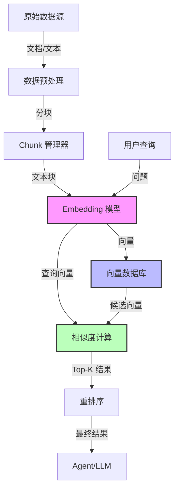
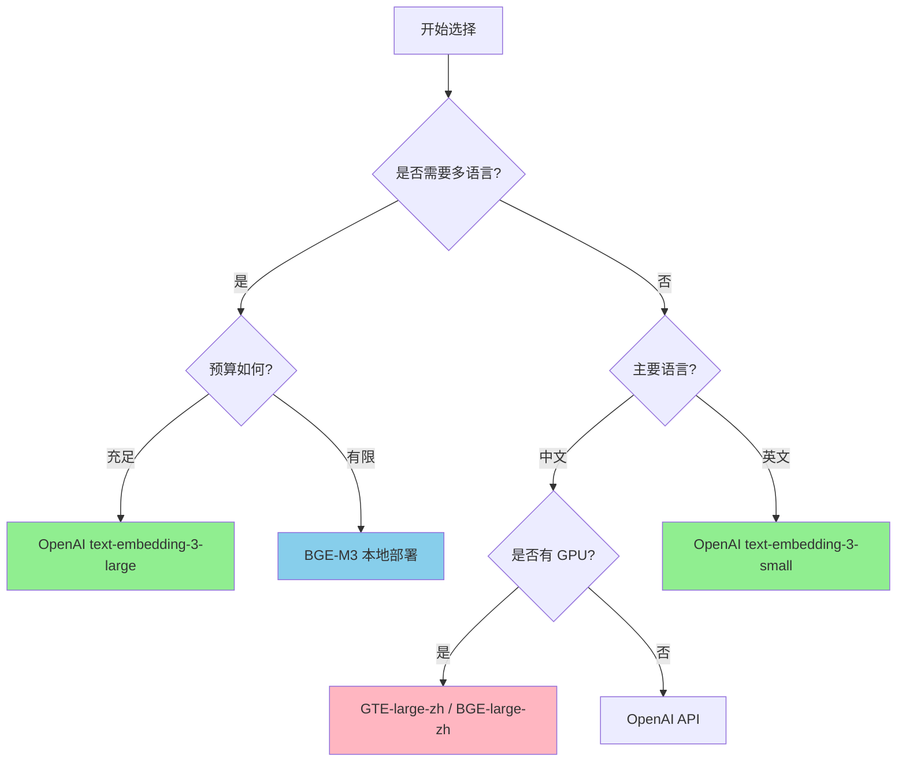
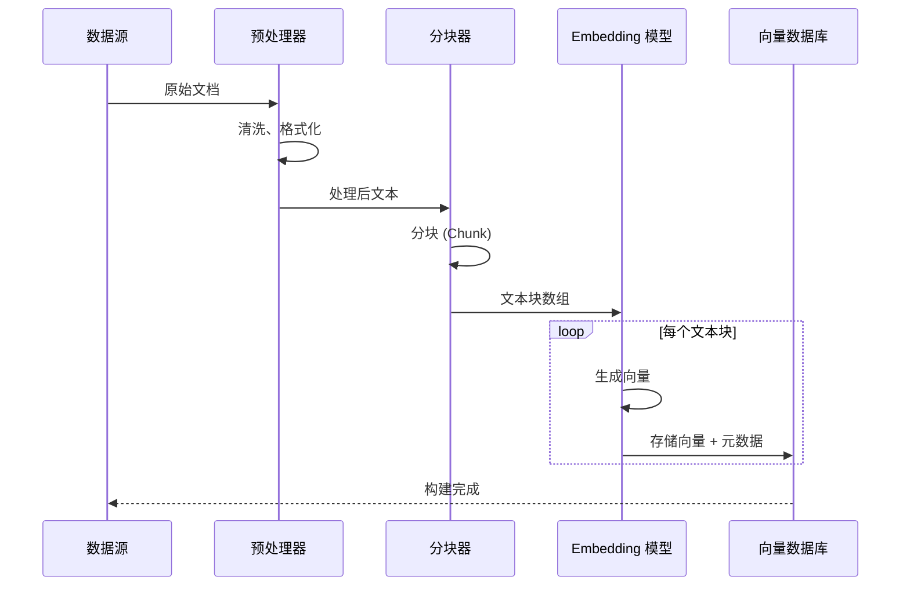
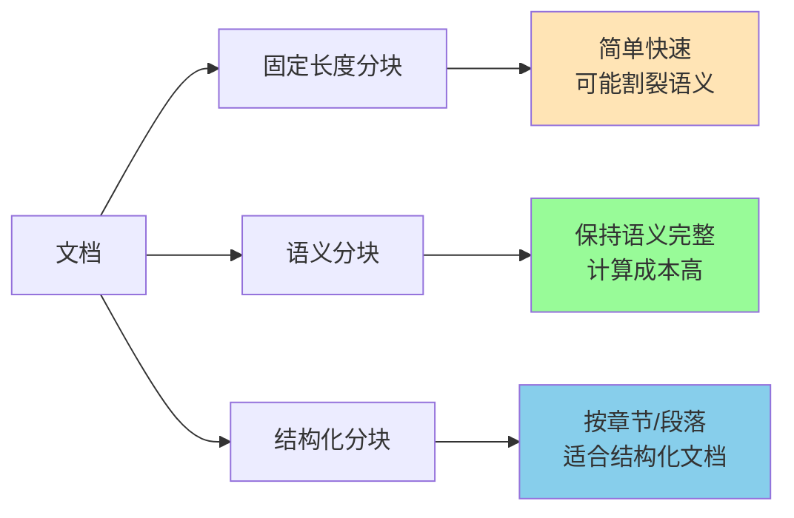
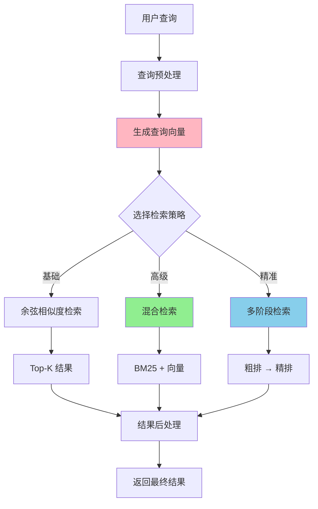
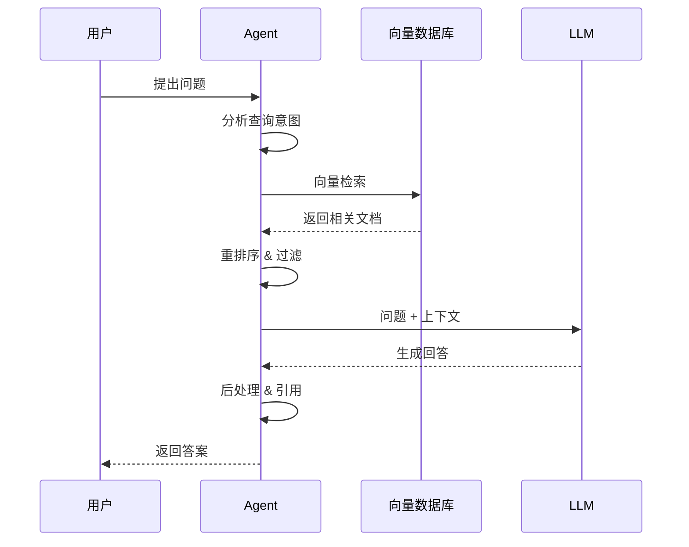
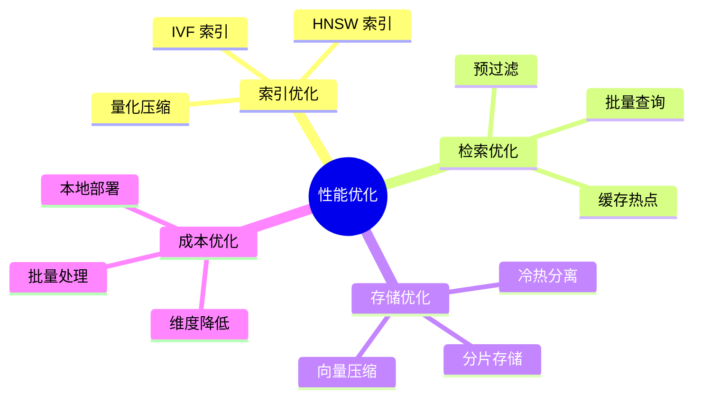

# Agent 开发中的 Embeddings 完整指南

## 目录

1. [Embeddings 基础概念](#embeddings-基础概念)
2. [向量数据库架构](#向量数据库架构)
3. [不同 Embeddings 模型对比](#不同-embeddings-模型对比)
4. [构建向量数据流程](#构建向量数据流程)
5. [向量搜索实现](#向量搜索实现)
6. [实践案例](#实践案例)
7. [性能优化](#性能优化)

---

## Embeddings 基础概念

### 什么是 Embeddings？

Embeddings 是将文本、图像等非结构化数据转换为高维向量的技术。在 Agent 开发中，Embeddings 主要用于：

- **语义检索**：根据语义相似度而非关键词匹配
- **知识库构建**：将文档转换为可检索的向量
- **上下文增强**：为 LLM 提供相关背景信息
- **记忆系统**：存储和检索对话历史

### 核心原理

```
文本数据 → Embedding 模型 → 向量表示 → 向量数据库 → 相似度检索
```

---

## 向量数据库架构

### 整体架构图



### 关键组件

| 组件               | 功能                   | 常用技术                           |
| ------------------ | ---------------------- | ---------------------------------- |
| **数据预处理**     | 清洗、分块、元数据提取 | LangChain, LlamaIndex              |
| **Embedding 模型** | 文本向量化             | OpenAI, Cohere, BGE, GTE           |
| **向量数据库**     | 存储和检索向量         | Pinecone, Chroma, Weaviate, Qdrant |
| **相似度计算**     | 计算向量距离           | Cosine, Euclidean, Dot Product     |

---

## 不同 Embeddings 模型对比

### 主流模型对比表

| 模型                               | 维度 | 多语言 | 最大长度    | 适用场景       | 调用方式 |
| ---------------------------------- | ---- | ------ | ----------- | -------------- | -------- |
| **OpenAI text-embedding-3-small**  | 1536 | ✅     | 8191 tokens | 通用、成本敏感 | API      |
| **OpenAI text-embedding-3-large**  | 3072 | ✅     | 8191 tokens | 高精度需求     | API      |
| **Cohere embed-multilingual-v3.0** | 1024 | ✅     | 512 tokens  | 多语言、分类   | API      |
| **BAAI/bge-large-zh-v1.5**         | 1024 | 🇨🇳     | 512 tokens  | 中文优化       | 本地部署 |
| **BAAI/bge-m3**                    | 1024 | ✅     | 8192 tokens | 多语言、长文本 | 本地部署 |
| **Alibaba GTE-large-zh**           | 1024 | 🇨🇳     | 512 tokens  | 中文检索       | 本地部署 |

### 模型选择流程图



---

## 构建向量数据流程

### 完整流程图



### 代码示例：数据处理与向量化

```typescript
import { ChromaClient } from 'chromadb';
import { OpenAIEmbeddings } from '@langchain/openai';

// 1. 文档分块策略
interface ChunkConfig {
  chunkSize: number;
  chunkOverlap: number;
  separators: string[];
}

function chunkDocument(text: string, config: ChunkConfig): string[] {
  const chunks: string[] = [];
  let start = 0;

  while (start < text.length) {
    const end = Math.min(start + config.chunkSize, text.length);
    chunks.push(text.slice(start, end));
    start += config.chunkSize - config.chunkOverlap;
  }

  return chunks;
}

// 2. 向量化与存储
async function buildVectorStore(
  documents: Array<{
    content: string;
    metadata: Record<string, any>;
  }>,
) {
  const client = new ChromaClient();
  const collection = await client.createCollection({
    name: 'knowledge_base',
    metadata: { 'hnsw:space': 'cosine' },
  });

  const embeddings = new OpenAIEmbeddings({
    modelName: 'text-embedding-3-small',
  });

  for (const doc of documents) {
    // 分块
    const chunks = chunkDocument(doc.content, {
      chunkSize: 512,
      chunkOverlap: 50,
      separators: ['\n\n', '\n', '。', '！', '？'],
    });

    // 批量向量化
    const vectors = await embeddings.embedDocuments(chunks);

    // 存储到向量数据库
    await collection.add({
      ids: chunks.map((_, i) => `${doc.metadata.id}_${i}`),
      embeddings: vectors,
      documents: chunks,
      metadatas: chunks.map(() => doc.metadata),
    });
  }
}
```

### 分块策略对比



---

## 向量搜索实现

### 搜索流程架构



### 代码示例：多种检索策略

```typescript
// 1. 基础向量检索
async function basicVectorSearch(query: string, topK: number = 5) {
  const collection = await client.getCollection({ name: 'knowledge_base' });
  const queryVector = await embeddings.embedQuery(query);

  const results = await collection.query({
    queryEmbeddings: [queryVector],
    nResults: topK,
  });

  return results;
}

// 2. 混合检索 (向量 + 关键词)
async function hybridSearch(query: string, topK: number = 5) {
  // 向量检索
  const vectorResults = await basicVectorSearch(query, topK * 2);

  // BM25 关键词检索 (简化示例)
  const keywordResults = await keywordSearch(query, topK * 2);

  // 融合排序 (RRF - Reciprocal Rank Fusion)
  const merged = mergeResults(vectorResults, keywordResults, topK);

  return merged;
}

// 3. 带过滤的检索
async function filteredSearch(query: string, filters: Record<string, any>, topK: number = 5) {
  const queryVector = await embeddings.embedQuery(query);

  const results = await collection.query({
    queryEmbeddings: [queryVector],
    nResults: topK,
    where: filters, // 例如: { category: "technical", date: { $gte: "2024-01-01" } }
  });

  return results;
}
```

### 相似度计算方法

| 方法           | 公式                        | 取值范围 | 适用场景               |
| -------------- | --------------------------- | -------- | ---------------------- |
| **余弦相似度** | cos(θ) = A·B / (\|A\|\|B\|) | [-1, 1]  | 通用、不受向量长度影响 |
| **欧氏距离**   | √Σ(ai - bi)²                | [0, ∞)   | 关注绝对差异           |
| **点积**       | Σ(ai × bi)                  | (-∞, ∞)  | 归一化向量时等同余弦   |

---

## 实践案例

### 案例：构建智能文档问答系统

```typescript
class DocumentQASystem {
  private vectorStore: ChromaClient;
  private embeddings: OpenAIEmbeddings;
  private llm: ChatOpenAI;

  async initialize() {
    // 1. 加载文档
    const docs = await this.loadDocuments('./knowledge_base');

    // 2. 构建向量库
    await this.buildVectorStore(docs);

    console.log('✅ 向量库构建完成');
  }

  async query(question: string): Promise<string> {
    // 1. 检索相关文档
    const relevantDocs = await this.hybridSearch(question, 3);

    // 2. 构建上下文
    const context = relevantDocs.map((doc) => doc.content).join('\n\n');

    // 3. 生成回答
    const prompt = `基于以下上下文回答问题：
    
上下文：
${context}

问题：${question}

回答：`;

    const response = await this.llm.invoke(prompt);
    return response.content;
  }
}
```

### RAG 工作流程



---

## 性能优化

### 优化策略图



### 关键优化技术

#### 1. 向量维度优化

```typescript
// OpenAI 支持维度裁剪
const embeddings = new OpenAIEmbeddings({
  modelName: 'text-embedding-3-large',
  dimensions: 1024, // 原始 3072 → 裁剪至 1024
});
```

#### 2. 批量处理

```typescript
// 批量向量化提升吞吐量
async function batchEmbedding(texts: string[], batchSize: number = 100) {
  const results = [];

  for (let i = 0; i < texts.length; i += batchSize) {
    const batch = texts.slice(i, i + batchSize);
    const vectors = await embeddings.embedDocuments(batch);
    results.push(...vectors);
  }

  return results;
}
```

#### 3. 缓存策略

```typescript
class CachedEmbeddings {
  private cache = new Map<string, number[]>();

  async embed(text: string): Promise<number[]> {
    const cacheKey = hashString(text);

    if (this.cache.has(cacheKey)) {
      return this.cache.get(cacheKey)!;
    }

    const vector = await this.embeddings.embedQuery(text);
    this.cache.set(cacheKey, vector);
    return vector;
  }
}
```

### 性能基准参考

| 操作           | QPS     | 延迟 (P95) | 优化建议 |
| -------------- | ------- | ---------- | -------- |
| **单次向量化** | 100-500 | 50-200ms   | 批量处理 |
| **向量检索**   | 1000+   | 10-50ms    | 索引优化 |
| **混合检索**   | 200-500 | 50-150ms   | 并行执行 |

---

## 最佳实践总结

### ✅ 推荐做法

1. **分块策略**：512-1024 tokens，重叠 10-20%
2. **元数据设计**：包含来源、时间、分类等可过滤字段
3. **多阶段检索**：粗排（Top-100）→ 精排（Top-5）
4. **监控指标**：检索延迟、召回率、相关性评分

### ❌ 常见陷阱

1. 分块过大导致语义分散
2. 忽略元数据过滤造成性能浪费
3. 单一检索策略召回率低
4. 未设置缓存导致重复计算

### 🔧 调试技巧

```typescript
// 评估检索质量
async function evaluateRetrieval(query: string, expectedDocs: string[]) {
  const results = await vectorSearch(query, 10);
  const resultIds = results.map((r) => r.id);

  // 计算召回率
  const recall = expectedDocs.filter((id) => resultIds.includes(id)).length / expectedDocs.length;

  console.log(`召回率: ${(recall * 100).toFixed(2)}%`);

  // 检查排序质量
  const mrr = calculateMRR(resultIds, expectedDocs);
  console.log(`MRR: ${mrr.toFixed(3)}`);
}
```

---

## 参考资源

- **OpenAI Embeddings Guide**: https://platform.openai.com/docs/guides/embeddings
- **Chroma Documentation**: https://docs.trychroma.com/
- **LangChain Vector Stores**: https://js.langchain.com/docs/modules/data_connection/vectorstores/
- **MTEB Leaderboard**: https://huggingface.co/spaces/mteb/leaderboard

---

## 总结

Embeddings 是构建智能 Agent 的核心技术。选择合适的模型、设计合理的分块策略、实现高效的检索机制，能够显著提升 Agent 的知识理解和问答能力。

**关键要点**：

- 根据业务需求选择 Embedding 模型
- 实现多阶段检索提升准确率
- 利用元数据过滤优化性能
- 持续监控和优化检索质量
