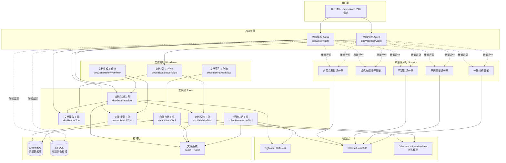
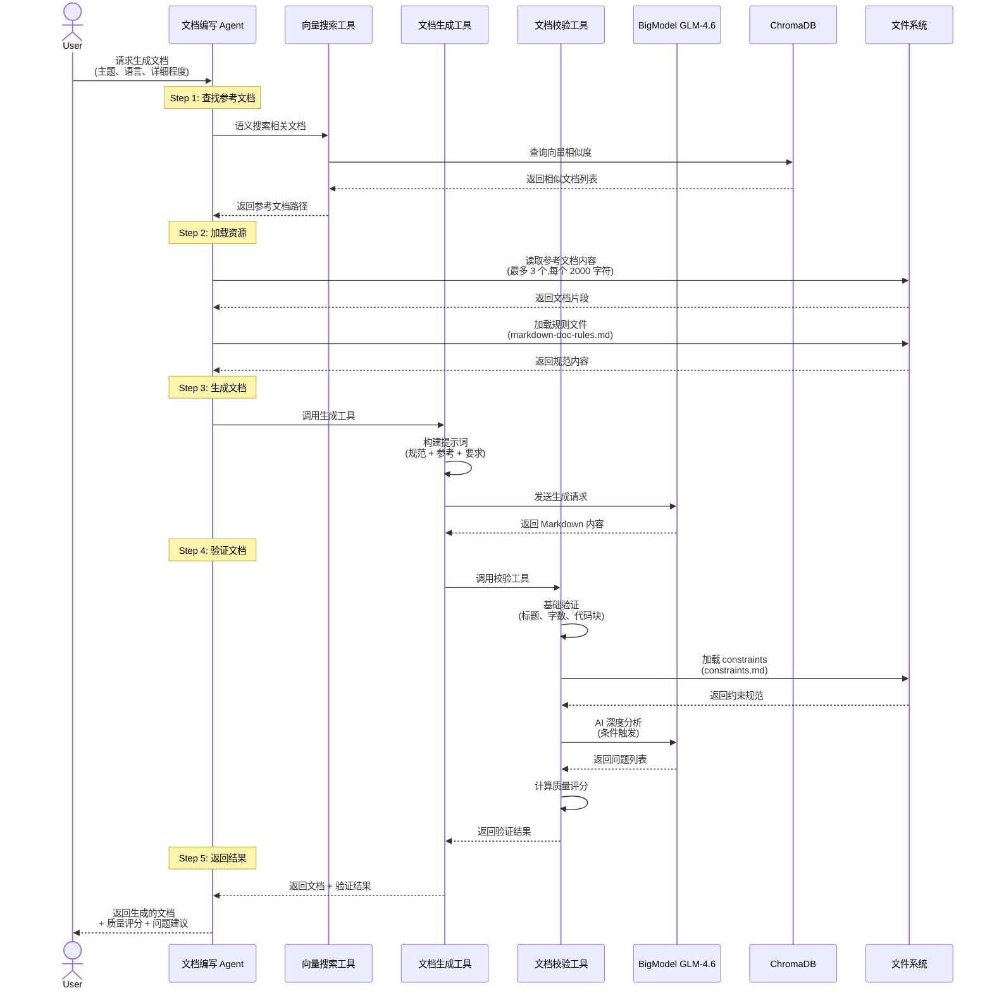
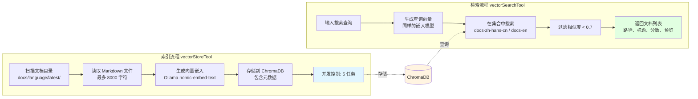

# AI 驱动的技术文档生成与校验系统

## 系统概述

这是一个基于 Mastra 框架构建的智能文档处理系统，利用大语言模型（LLM）实现技术文档的自动生成、智能校验和语义检索。系统通过 Agent 协作模式，将文档的创建和质量把控解耦，确保生成的文档符合严格的技术规范。

### 核心特性

- **智能文档生成**：基于主题和参考文档自动生成结构化的 Markdown 技术文档
- **多维度质量校验**：结合规则引擎和 AI 深度分析，提供详细的问题定位和修改建议
- **语义搜索支持**：基于向量数据库的文档索引和相似度搜索
- **多语言支持**：支持中英文文档的生成、翻译和校验
- **质量评分系统**：从完整性、格式、可读性、示例质量、一致性五个维度评估文档质量

---

## 系统架构

### 整体架构图



### 架构层次说明

#### 1. 用户层

- 接收用户的文档生成、校验、索引等需求
- 支持 CLI、API 等多种交互方式

#### 2. Agent 层

系统采用多 Agent 协作模式，实现职责分离：

**文档编写 Agent (docWriterAgent)**

- 职责：文档生成、翻译、索引管理
- 使用模型：BigModel GLM-4.6
- 配置工具：docReader、docGenerator、vectorSearch
- 评分器采样率：50%-100%（生成时部分采样以提高性能）

**文档校验 Agent (docValidatorAgent)**

- 职责：文档验证、质量评估、反馈建议
- 使用模型：Ollama Llama3.2:1b
- 配置工作流：docValidationWorkflow
- 评分器采样率：100%（校验时全面检查）

#### 3. 工具层 (Tools)

系统核心功能的原子化实现：

- **docReaderTool**：读取和解析文档，支持相对/绝对路径
- **docGeneratorTool**：调用 LLM 生成文档，内置基础校验
- **docValidatorTool**：5 步验证流程（解析 → 基础验证 → 加载规范 →AI 分析 → 评分）
- **vectorSearchTool**：基于语义相似度的文档检索
- **vectorStoreTool**：批量索引文档到向量数据库
- **rulesSummarizerTool**：将规则文件总结为 Context Engineering 格式

#### 4. 工作流层 (Workflows)

编排多个工具形成完整业务流程：

- **docGenerationWorkflow**：分析需求 → 向量搜索 → 生成草稿 → 验证优化 → 评分
- **docValidationWorkflow**：读取文档 → 执行校验 → 返回详细问题列表
- **docIndexingWorkflow**：扫描文档 → 提取内容 → 生成向量 → 存储索引

#### 5. 质量评分层 (Scorers)

多维度评估文档质量，所有评分器使用 Ollama Llama3.2:1b 作为判断器：

| 评分器                    | 评估维度   | 评分标准                                   |
| ------------------------- | ---------- | ------------------------------------------ |
| contentCompletenessScorer | 内容完整性 | 必需章节、信息详细程度、示例完整性         |
| formatComplianceScorer    | 格式合规性 | 标题层级、代码块标注、Frontmatter          |
| readabilityScorer         | 可读性     | 语言清晰度、技术表达准确性、结构合理性     |
| exampleQualityScorer      | 示例质量   | 示例完整性、可运行性、场景覆盖、注释清晰度 |
| consistencyScorer         | 一致性     | 风格一致性、术语统一性、格式规范性         |

#### 6. 模型层

支持多种 LLM 和嵌入模型：

- **BigModel GLM-4.6**：用于文档生成、翻译、规则总结等复杂任务
- **Ollama Llama3.2:1b**：用于快速验证、质量评分等轻量级任务
- **Ollama nomic-embed-text**：用于生成文档向量嵌入

通过 `model-presets.ts` 统一管理，支持在 BigModel 和 Ollama 之间快速切换。

#### 7. 存储层

- **ChromaDB**：向量数据库，存储文档嵌入向量用于语义搜索
- **LibSQL**：存储可观测性数据、评分记录、Agent 记忆
- **文件系统**：存储原始文档（docs/）和规则文件（rules/）

---

## 核心流程

### 1. 文档生成流程



#### 流程详解

**Step 1: 向量搜索参考文档**

- 使用向量搜索工具查找语义相关的现有文档
- 基于 ChromaDB 的相似度检索，默认阈值 0.7
- 帮助生成器理解已有文档的风格和术语

**Step 2: 加载资源**

```typescript
// 加载参考文档（最多 3 个，每个截取 2000 字符）
references = await loadReferences(input.referenceFilePaths);

// 加载规则文件
rules = await loadRules('markdown'); // 读取 rules/markdown-doc-rules.md
```

**Step 3: 构建提示词并生成**

```typescript
prompt = `
你是一名资深技术文档编写专家。

任务说明:
- 文档主题: ${topic}
- 输出语言: ${language}
- 细节程度: ${detailLevel}

文档规范:
${rules}

参考文档:
${referenceSnippets}

输出要求:
1. 仅返回 Markdown 内容
2. 包含合适的标题层级、段落、列表、代码示例
3. 严格遵循上述规范
`;
```

**Step 4: 多层次验证**
生成器内部自动调用校验工具进行验证：

- 基础验证：标题、字数、代码块、链接
- AI 深度分析：仅当 errorCount < 3 且 length > 200 时触发
- 质量评分：根据错误和警告数量计算分数

**Step 5: 返回结果**

```typescript
{
  success: true,
  content: "生成的 Markdown 内容",
  metadata: {
    docType: "markdown",
    language: "zh-hans-cn",
    generatedAt: "2025-11-13T10:00:00Z",
    referenceCount: 2,
    wordCount: 1523
  },
  validation: {
    isValid: true,
    errors: [],
    warnings: [...],
    suggestions: [...],
    score: 0.95
  }
}
```

---

### 2. 文档校验流程

```mermaid
flowchart TD
    Start([输入 Markdown 文档]) --> Parse[Step 1: 解析文档结构]

    Parse --> ExtractFM[提取 Frontmatter]
    Parse --> ExtractBody[提取正文内容]

    ExtractFM --> Analyze[Step 2: 分析文档统计]
    ExtractBody --> Analyze

    Analyze --> Stats[统计字数、标题数<br/>代码块数、链接数]

    Stats --> BasicCheck[Step 3: 基础验证]

    BasicCheck --> CheckWord{字数 ≥ 120?}
    CheckWord -->|否| AddWarning1[添加警告:<br/>字数不足]
    CheckWord -->|是| CheckTitle{有标题?}

    AddWarning1 --> CheckTitle
    CheckTitle -->|否| AddError1[添加错误:<br/>缺少标题]
    CheckTitle -->|是| CheckCode{有代码块?}

    AddError1 --> CheckCode
    CheckCode -->|否| AddWarning2[添加警告:<br/>建议添加示例]
    CheckCode -->|是| CheckFM{需要 Frontmatter?}

    AddWarning2 --> CheckFM
    CheckFM -->|是| ValidateFM[验证 Frontmatter<br/>必需字段]
    CheckFM -->|否| LoadRules[Step 4: 加载规范文件]

    ValidateFM --> LoadRules

    LoadRules --> Cache{缓存有效?<br/>TTL: 5 min}
    Cache -->|是| UseCache[使用缓存的<br/>constraints]
    Cache -->|否| ReadFile[读取<br/>constraints.md]

    ReadFile --> UpdateCache[更新缓存]
    UpdateCache --> AICheck[Step 5: AI 深度分析]
    UseCache --> AICheck

    AICheck --> Condition{errorCount < 3<br/>且 length > 200<br/>且 constraints 存在?}

    Condition -->|否| Skip[跳过 AI 分析]
    Condition -->|是| Truncate[智能截断文本<br/>constraints: 1400 字符<br/>content: 1700 字符]

    Truncate --> BuildPrompt[构建 AI 提示词]
    BuildPrompt --> CallLLM[调用 LLM<br/>Ollama Llama3.2]
    CallLLM --> ParseJSON[解析 JSON 响应]
    ParseJSON --> AddIssues[添加 AI 发现的问题]

    Skip --> Calculate[计算质量评分]
    AddIssues --> Calculate

    Calculate --> Formula[score = 1 - errorCount × 0.15<br/>- warningCount × 0.05]

    Formula --> Summary[生成问题摘要]

    Summary --> Result{{"返回验证结果<br/>- issues: 问题列表<br/>- summary: 统计和评分<br/>- stats: 文档统计"}}

    Result --> End([结束])

    style Start fill:#e1f5ff
    style End fill:#e1f5ff
    style AddError1 fill:#ffe1e1
    style AddWarning1 fill:#fff4e1
    style AddWarning2 fill:#fff4e1
    style Result fill:#e1ffe1
```



#### 5 步验证流程详解

**Step 1: 解析文档结构**

```typescript
// 提取 Frontmatter（如果存在）
function extractFrontmatter(markdown: string) {
  if (!markdown.startsWith('---\n')) {
    return { frontmatter: null, body: markdown };
  }

  const endIndex = markdown.indexOf('\n---', 4);
  const frontmatterBlock = markdown.slice(4, endIndex).trim();
  const body = markdown.slice(endIndex + 4);

  // 解析 YAML 格式的 Frontmatter
  const frontmatter = parseFrontmatter(frontmatterBlock);

  return { frontmatter, body };
}
```

**Step 2: 文档统计分析**

````typescript
const stats = {
  wordCount: 1523, // 去除 HTML 标签后的单词数
  headingCount: 8, // 标题数量（# 开头的行）
  codeBlockCount: 4, // 代码块数量（``` 配对）
  linkCount: 12, // Markdown 链接数量
  frontmatterPresent: true, // 是否包含 Frontmatter
};
````

**Step 3: 基础验证规则**

| 验证项      | 类型       | 条件               | 建议修改                                           |
| ----------- | ---------- | ------------------ | -------------------------------------------------- |
| 字数检查    | warning    | wordCount < 120    | 增加内容至至少 120 字，可添加详细说明、示例        |
| 标题检查    | error      | headingCount < 1   | 必须包含标题（# 一级标题 或 ## 二级标题）          |
| 代码示例    | warning    | codeBlockCount < 1 | 建议添加至少一个代码示例，使用 \`\`\`language 语法 |
| Frontmatter | error      | 缺少必需字段       | 添加 title、description 等必需字段                 |
| 链接完整性  | suggestion | linkCount = 0      | 建议添加相关文档链接或外部资源                     |

**Step 4: 加载文档规范**

系统使用缓存机制优化性能：

```typescript
const CONSTRAINTS_CACHE_TTL_MS = 5 * 60 * 1000; // 5 分钟缓存

async function loadConstraints() {
  // 检查缓存是否有效
  if (cachedConstraints && Date.now() - cachedConstraints.fetchedAt < TTL) {
    return cachedConstraints.content;
  }

  // 读取 rules/constraints.md
  const content = await fs.readFile(CONSTRAINTS_FILE, 'utf-8');

  // 更新缓存
  cachedConstraints = { content, fetchedAt: Date.now() };
  return content;
}
```

**Step 5: AI 深度分析**

条件触发机制避免不必要的 LLM 调用：

```typescript
if (errorCount < 3 && content.length > 200 && constraints) {
  // 智能截断以控制 token 成本
  const constraintSnippet = buildConstraintSnippet(constraints, 1400);
  const contentSnippet = buildContentSnippet(content, 1700);

  // 调用 LLM 进行深度分析
  const issues = await performLLMValidation(contentSnippet, language, constraintSnippet);

  // 返回格式化的问题列表
  return issues.map((issue) => ({
    type: 'error' | 'warning' | 'suggestion',
    line: 估计的行号,
    column: 1,
    content: '问题所在的文本片段',
    howToFix: '具体的修改建议',
    violatedRule: '违反的规则名称',
  }));
}
```

#### 验证结果示例

````json
{
  "success": true,
  "issues": [
    {
      "type": "warning",
      "line": 1,
      "column": 1,
      "content": "# 快速开始指南...",
      "howToFix": "当前字数 98，建议增加到至少 120 字。可以添加更详细的说明、示例或使用场景。",
      "violatedRule": "文档字数规范：技术文档应包含充足的信息量"
    },
    {
      "type": "error",
      "line": 15,
      "column": 1,
      "content": "...调用 API 接口即可...",
      "howToFix": "代码示例缺少语言标注，应使用 ```javascript 而非 ```",
      "violatedRule": "代码块规范：必须标注语言类型"
    }
  ],
  "summary": {
    "totalIssues": 2,
    "errorCount": 1,
    "warningCount": 1,
    "suggestionCount": 0,
    "score": 0.8,
    "isValid": false
  },
  "stats": {
    "wordCount": 98,
    "headingCount": 3,
    "codeBlockCount": 2,
    "linkCount": 4,
    "frontmatterPresent": false
  }
}
````

---

### 3. 向量索引和检索流程



#### 索引实现细节

**文档元数据结构**

```typescript
{
  docId: string,              // 文档唯一标识
  language: 'zh-hans-cn' | 'en',  // 文档语言
  title: string,              // 从 Frontmatter 提取的标题
  label: string,              // 文档标签
  categoryType: 'api' | 'guide' | 'tutorial' | 'reference',  // 文档类型
  filePath: string            // 文件相对路径
}
```

**类别自动推断规则**

```typescript
function inferCategory(filePath: string): CategoryType {
  const path = filePath.toLowerCase();

  if (
    path.includes('api') ||
    path.includes('graphql') ||
    path.includes('admin') ||
    path.includes('ajax')
  ) {
    return 'api';
  }
  if (path.includes('theme') || path.includes('app')) {
    return 'guide';
  }
  if (path.includes('tutorial') || path.includes('getting-started')) {
    return 'tutorial';
  }
  if (path.includes('reference')) {
    return 'reference';
  }
  return 'guide'; // 默认类型
}
```

**并发索引实现**

```typescript
import { createPipe } from '@mastra/core';

// 创建并发管道，同时处理 5 个文档
const indexPipe = createPipe({
  concurrency: 5,
  process: async (filePath) => {
    const content = await readDocument(filePath);
    const embedding = await generateEmbedding(content);
    await storeToChromaDB(embedding, metadata);
  },
});

// 批量处理文档
await indexPipe.run(allDocuments);
```

#### 检索实现细节

**搜索参数**

```typescript
{
  query: string,                    // 搜索查询（自然语言）
  language?: 'zh-hans-cn' | 'en',   // 限定语言
  limit: number = 5,                // 返回数量
  similarityThreshold: number = 0.7  // 相似度阈值（0-1）
}
```

**检索流程**

```typescript
async function vectorSearch(params) {
  // 1. 生成查询向量
  const queryEmbedding = await embedText(params.query);

  // 2. 选择集合
  const collection = params.language ? `docs-${params.language}` : 'docs-all';

  // 3. 执行向量搜索（查询 limit*2 个结果，至少 10 个）
  const results = await chromaDB.query({
    collection,
    embedding: queryEmbedding,
    nResults: Math.max(params.limit * 2, 10),
  });

  // 4. 过滤低相似度结果
  const filtered = results.filter((r) => r.score >= params.similarityThreshold);

  // 5. 截取前 limit 个结果
  return filtered.slice(0, params.limit).map((r) => ({
    filePath: r.metadata.filePath,
    title: r.metadata.title,
    score: r.score,
    preview: r.content.slice(0, 200),
    metadata: { language: r.metadata.language },
  }));
}
```

**检索结果示例**

```json
{
  "success": true,
  "results": [
    {
      "filePath": "docs/zh-hans-cn/latest/api/rest-api-guide.md",
      "title": "REST API 使用指南",
      "score": 0.89,
      "preview": "本文档介绍如何使用 REST API 进行开发。REST API 提供了一套标准的 HTTP 接口，支持 GET、POST、PUT、DELETE 等操作...",
      "metadata": { "language": "zh-hans-cn" }
    },
    {
      "filePath": "docs/zh-hans-cn/latest/api/authentication.md",
      "title": "API 身份验证",
      "score": 0.82,
      "preview": "所有 API 请求都需要进行身份验证。我们支持两种验证方式：API Key 和 OAuth 2.0...",
      "metadata": { "language": "zh-hans-cn" }
    }
  ],
  "total": 2
}
```

---

## 关键技术实现

### 1. Context Engineering：Constraints 格式

系统使用 **Constraints 格式**来优化 LLM 提示词，这是一种专门为 AI 设计的规范表达方式。

#### Constraints 文件结构

```markdown
# 文档编写约束 (Constraints)

## 🔴 关键约束 (CRITICAL)

### 禁用词汇

- ❌ 必须不得 (MUST NOT) 使用竞对品牌名称
- ❌ 必须不得 (MUST NOT) 使用竞对专有术语

### 内容原创性

- ✅ 必须 (MUST) 确保文档结构原创性
- ✅ 必须 (MUST) 单个段落雷同内容不超过 1/3

## 🟡 重要约束 (IMPORTANT)

### 中文标点符号

- ✅ 应该 (SHOULD) 使用全角标点符号（，。？！）
- ✅ 应该 (SHOULD) 并列词语使用全角顿号（、）
- ✅ 应该 (SHOULD) 使用全角引号（" "），内层用单引号（' '）

### 句式与表达

- ✅ 应该 (SHOULD) 使用全角句号（。）结束句子
- ❌ 不应该 (SHOULD NOT) "一逗到底"
- ❌ 不应该 (SHOULD NOT) 在标题末尾使用点号

## 🟢 建议约束 (RECOMMENDED)

### 可读性与结构

- 💡 推荐 (RECOMMENDED) 优先使用列表代替分号连接
- 💡 推荐 (RECOMMENDED) 使用平静、客观的语气
- 💡 推荐 (RECOMMENDED) 避免过多使用感叹号
```

#### 为什么使用 Constraints 格式？

**传统方式 vs Constraints 方式**

传统提示词：

```
你需要遵循以下规范：
1. 文档规范文件 1 的完整内容（5000 字）...
2. 文档规范文件 2 的完整内容（3000 字）...
3. 标点符号规范的完整内容（2000 字）...

请检查文档...
```

问题：

- Token 消耗大（10000+ tokens）
- LLM 难以抓住重点
- 响应时间长
- 成本高

Constraints 方式：

```
## 🔴 关键约束 (CRITICAL)
- ❌ 必须不得 (MUST NOT) 使用竞对品牌
- ✅ 必须 (MUST) 确保原创性

## 🟡 重要约束 (IMPORTANT)
- ✅ 应该 (SHOULD) 使用全角标点
- ❌ 不应该 (SHOULD NOT) 一逗到底

请检查文档...
```

优势：

- Token 消耗小（约 1400 字符）
- 优先级清晰（🔴🟡🟢）
- 关键词明确（MUST / SHOULD / RECOMMENDED）
- 每条约束独立、具体、可验证
- LLM 理解更准确

#### 生成 Constraints 的工具

系统提供 `rulesSummarizerTool` 将原始规则文件自动总结为 Constraints 格式：

```typescript
// 1. 扫描 rules/ 目录，读取所有 .md 文件
const ruleFiles = await scanRulesDirectory();

// 2. 使用 LLM 按照 Context Engineering 最佳实践总结
const constraints = await summarizeRules({
  prompt: `
将以下技术文档规范总结为 Constraints 格式。

要求:
- 使用清晰的层级结构
- 按优先级分级: 🔴 CRITICAL / 🟡 IMPORTANT / 🟢 RECOMMENDED
- 使用关键词: 必须(MUST) / 不得(MUST NOT) / 应该(SHOULD)
- 每条约束应独立、具体、可验证
- 控制在 200-300 行

规则内容:
${ruleFiles.join('\n\n')}
  `,
});

// 3. 输出到 rules/constraints.md
await fs.writeFile('rules/constraints.md', constraints);
```

调用方式：

```bash
# API 方式
curl -X POST http://localhost:4112/api/rules/summarize

# 或直接调用工具
await rulesSummarizerTool.execute()
```

---

### 2. 智能文本截断策略

在 AI 深度分析时，系统使用智能截断策略平衡准确性和性能：

#### 截断 Constraints（约束规范）

```typescript
const MAX_CONSTRAINT_PROMPT_LENGTH = 1400;

function buildConstraintSnippet(raw: string, limit: number) {
  if (raw.length <= limit) return raw;

  const lines = raw.split('\n');
  const prioritized: string[] = []; // 优先保留的行
  const fallback: string[] = []; // 备选行

  // 优先保留标题、列表项、编号项
  for (const line of lines) {
    const trimmed = line.trim();
    if (
      /^#{1,3}\s+/.test(trimmed) || // 标题
      /^- /.test(trimmed) || // 列表项
      /^\d+\./.test(trimmed)
    ) {
      // 编号项
      prioritized.push(line);
    } else {
      fallback.push(line);
    }
  }

  // 组合并截断
  const combined = [...prioritized, ...fallback];
  const snippet: string[] = [];
  let length = 0;

  for (const line of combined) {
    length += line.length + 1;
    if (length > limit) break;
    snippet.push(line);
  }

  return `${snippet.join('\n')}\n...（其余规范内容请参见 rules/constraints.md）`;
}
```

**策略优势**：

- 保留关键结构（标题、列表）
- 保证 token 成本可控
- 提示 LLM 完整内容位置

#### 截断文档内容

```typescript
const MAX_CONTENT_PROMPT_LENGTH = 1700;

function buildContentSnippet(content: string, limit: number) {
  if (content.length <= limit) return content;

  // 保留头部 60% 和尾部 40%
  const headLength = Math.floor(limit * 0.6);
  const tailLength = limit - headLength;

  const head = content.slice(0, headLength);
  const tail = content.slice(-tailLength);

  return `
${head}
...
【原文剩余 ${content.length - limit} 字符已截断，仅保留尾部关键信息】
${tail}
  `.trim();
}
```

**策略优势**：

- 头部包含标题、简介等关键信息
- 尾部包含总结、链接等补充信息
- 明确标注截断位置和长度

---

### 3. 性能优化机制

#### 缓存机制

```typescript
// Constraints 文件缓存（5 分钟 TTL）
let cachedConstraints: {
  content: string;
  fetchedAt: number;
} | null = null;

const CONSTRAINTS_CACHE_TTL_MS = 5 * 60 * 1000; // 5 分钟

async function loadConstraints() {
  if (cachedConstraints && Date.now() - cachedConstraints.fetchedAt < CONSTRAINTS_CACHE_TTL_MS) {
    return cachedConstraints.content; // 使用缓存
  }

  const content = await fs.readFile(CONSTRAINTS_FILE, 'utf-8');
  cachedConstraints = { content, fetchedAt: Date.now() };
  return content;
}
```

**优势**：

- 减少文件 I/O 操作
- 降低磁盘读取延迟
- 5 分钟 TTL 平衡实时性和性能

#### 条件触发 AI 分析

```typescript
// 只有在基础错误不多且内容足够长时才调用 LLM
const errorCount = allIssues.filter((i) => i.type === 'error').length;

if (errorCount < 3 && content.length > 200 && constraints) {
  // 执行 AI 深度分析
  const llmIssues = await performLLMValidation(content, language, constraints);
  allIssues.push(...llmIssues);
} else {
  // 跳过 AI 分析
  console.log('⏭️ 跳过 AI 深度分析');
  if (errorCount >= 3) {
    console.log('原因: 基础错误较多，建议先修复基础问题');
  }
}
```

**优势**：

- 避免不必要的 LLM 调用
- 节省 API 成本
- 提高响应速度
- 基础错误多时，AI 分析价值有限

#### 并发控制

```typescript
import { createPipe } from '@mastra/core';

// 向量索引时并发处理 5 个文档
const indexPipe = createPipe({
  concurrency: 5,
  process: async (filePath) => {
    const content = await readDocument(filePath);
    const embedding = await generateEmbedding(content);
    await storeToChromaDB(embedding, metadata);
  },
});

await indexPipe.run(allDocuments);
```

**优势**：

- 加速批量索引
- 避免过多并发导致资源耗尽
- 平衡速度和稳定性

---

### 4. 模型选择策略

系统通过 `model-presets.ts` 统一管理模型配置，支持快速切换：

```typescript
// 模型配置 1: BigModel GLM
const glmModal = {
  documentGenerationModel: () => bigmodel('glm-4.6'),
  translationModel: () => bigmodel('glm-4.6'),
  ruleSummarizationModel: () => bigmodel('glm-4.6'),
  validationModel: () => bigmodel('glm-4.6'),
  quickCheckModel: () => bigmodel('glm-4.6'),
};

// 模型配置 2: Ollama 本地模型
const ollamaModal = {
  documentGenerationModel: () => ollama('llama3.2:1b'),
  translationModel: () => ollama('llama3.2:1b'),
  ruleSummarizationModel: () => ollama('llama3.2:1b'),
  validationModel: () => ollama('llama3.2:1b'),
  quickCheckModel: () => ollama('llama3.2:1b'),
};

// 当前使用的模型配置（一键切换）
const currentModel = ollamaModal;

export const {
  documentGenerationModel,
  translationModel,
  ruleSummarizationModel,
  validationModel,
  quickCheckModel,
} = currentModel;
```

**模型选择建议**：

| 任务类型 | 推荐模型           | 原因                         |
| -------- | ------------------ | ---------------------------- |
| 文档生成 | BigModel GLM-4.6   | 需要强大的理解和生成能力     |
| 文档翻译 | BigModel GLM-4.6   | 需要准确的语义理解和术语翻译 |
| 规则总结 | BigModel GLM-4.6   | 需要提炼和总结能力           |
| 文档校验 | Ollama Llama3.2:1b | 快速验证，成本低             |
| 质量评分 | Ollama Llama3.2:1b | 简单的二分类任务             |

---

## 使用示例

### 示例 1: 生成技术文档

```typescript
import { docWriterAgent } from './agents/doc-writer-agent';

// 请求生成 API 文档
const result = await docWriterAgent.generate([
  {
    role: 'user',
    content: `
请生成一份关于"用户认证 API"的技术文档。

要求:
- 语言: 中文
- 详细程度: 详细
- 包含代码示例
- 参考已有的 REST API 文档风格
    `,
  },
]);

console.log(result.text);
// 输出生成的 Markdown 文档

// 检查验证结果
if (result.metadata?.validation) {
  const { isValid, errors, warnings, score } = result.metadata.validation;
  console.log(`文档质量评分: ${score * 100}/100`);
  console.log(`错误: ${errors.length}, 警告: ${warnings.length}`);
}
```

### 示例 2: 校验现有文档

```typescript
import { docValidationWorkflow } from './workflows/doc-validation-workflow';

// 校验指定文档
const validationResult = await docValidationWorkflow.execute({
  triggerData: {
    filePath: 'docs/zh-hans-cn/latest/api/authentication.md',
    language: 'zh-hans-cn',
    options: {
      requireFrontmatter: true,
      minWordCount: 150,
    },
  },
});

// 输出详细的问题列表
validationResult.issues.forEach((issue) => {
  const icon = issue.type === 'error' ? '❌' : issue.type === 'warning' ? '⚠️' : '💡';
  console.log(`${icon} [行 ${issue.line}] ${issue.content}`);
  console.log(`   如何修改: ${issue.howToFix}`);
  console.log(`   违反规则: ${issue.violatedRule}`);
});

// 输出质量评分
const { summary } = validationResult;
console.log(`\n质量评分: ${summary.score * 100}/100`);
console.log(`文档状态: ${summary.isValid ? '有效✅' : '需要修复❌'}`);
```

### 示例 3: 批量索引文档

```typescript
import { vectorStoreTool } from './tools/vector-store-tool';

// 索引所有中文文档
const indexResult = await vectorStoreTool.execute({
  context: {
    language: 'zh-hans-cn',
    forceReindex: false, // 只索引新文档
  },
  runtimeContext: new RuntimeContext(),
});

console.log(`总文档数: ${indexResult.total}`);
console.log(`索引成功: ${indexResult.indexed}`);
console.log(`跳过: ${indexResult.skipped}`);
```

### 示例 4: 语义搜索文档

```typescript
import { vectorSearchTool } from './tools/vector-search-tool';

// 搜索与"API 认证"相关的文档
const searchResult = await vectorSearchTool.execute({
  context: {
    query: '如何实现 API 身份认证和授权？',
    language: 'zh-hans-cn',
    limit: 5,
    similarityThreshold: 0.7,
  },
  runtimeContext: new RuntimeContext(),
});

// 输出搜索结果
searchResult.results.forEach((doc, index) => {
  console.log(`\n${index + 1}. ${doc.title} (相似度: ${doc.score.toFixed(2)})`);
  console.log(`   路径: ${doc.filePath}`);
  console.log(`   预览: ${doc.preview}`);
});
```

### 示例 5: 生成 Constraints 规范

```bash
# 启动 API 服务器
pnpm api-server

# 调用规则总结接口
curl -X POST http://localhost:4112/api/rules/summarize

# 响应示例
{
  "success": true,
  "message": "规则总结完成",
  "preview": "# 文档编写约束 (Constraints)\n\n## 🔴 关键约束 (CRITICAL)...",
  "stats": {
    "totalLines": 245,
    "totalCharacters": 8532,
    "sectionCount": 12
  }
}
```

---

## 系统配置

### 环境变量

```bash
# BigModel API 配置
BIGMODEL_API_KEY=your_api_key_here
BIGMODEL_MODEL=glm-4.6

# API 服务器配置
API_PORT=4112

# ChromaDB 配置（可选，默认 http://localhost:8000）
CHROMA_DB_URL=http://localhost:8000
```

### 启动命令

```json
{
  "scripts": {
    "dev": "mastra dev", // 启动开发服务器
    "build": "mastra build", // 构建生产版本
    "start": "mastra start", // 启动生产服务器
    "api-server": "tsx src/mastra/api/server.ts", // 启动 API 服务器
    "init-vector-store": "tsx scripts/init-vector-store.ts", // 初始化向量数据库
    "check-chromadb": "tsx scripts/check-chromadb.ts" // 检查 ChromaDB 状态
  }
}
```

### 依赖包

```json
{
  "dependencies": {
    "@mastra/core": "^0.2.0", // Mastra 核心框架
    "@mastra/memory": "^0.2.0", // Agent 记忆系统
    "@mastra/libsql": "^0.2.0", // LibSQL 存储
    "@mastra/evals": "^0.2.0", // 评估和评分系统
    "ai": "^3.0.0", // Vercel AI SDK
    "chromadb": "^1.8.0", // ChromaDB 客户端
    "ollama-ai-provider-v2": "^0.1.0", // Ollama 模型提供商
    "zod": "^3.22.0" // 类型验证库
  }
}
```

---

## 最佳实践

### 1. 文档生成最佳实践

**提供高质量的参考文档**

```typescript
// ✅ 好的做法：提供多个相关参考文档
await docGeneratorTool.execute({
  context: {
    topic: '用户认证 API',
    referenceFilePaths: [
      'docs/zh-hans-cn/latest/api/rest-api-guide.md',
      'docs/zh-hans-cn/latest/api/oauth-guide.md',
      'docs/zh-hans-cn/latest/api/api-keys.md',
    ],
  },
});

// ❌ 不好的做法：没有提供参考文档
await docGeneratorTool.execute({
  context: {
    topic: '用户认证 API',
  },
});
```

**使用向量搜索自动查找参考**

```typescript
// 1. 先搜索相关文档
const searchResult = await vectorSearchTool.execute({
  context: { query: '用户认证 API', limit: 3 },
});

// 2. 使用搜索结果作为参考
const references = searchResult.results.map((r) => r.filePath);

// 3. 生成文档
await docGeneratorTool.execute({
  context: {
    topic: '用户认证 API',
    referenceFilePaths: references,
  },
});
```

### 2. 文档校验最佳实践

**先修复基础错误，再进行 AI 深度分析**

```typescript
// 第一次校验
const result1 = await docValidatorTool.execute({
  context: { content: originalContent },
});

if (result1.summary.errorCount > 0) {
  // 修复基础错误（标题、Frontmatter 等）
  const fixedContent = fixBasicErrors(originalContent, result1.issues);

  // 第二次校验（触发 AI 深度分析）
  const result2 = await docValidatorTool.execute({
    context: { content: fixedContent },
  });
}
```

**定期更新 Constraints 文件**

```bash
# 当 rules/ 目录下的规则文件更新后
curl -X POST http://localhost:4112/api/rules/summarize

# 清除缓存（重启应用）
pkill -f "mastra dev" && pnpm dev
```

### 3. 向量索引最佳实践

**增量索引策略**

```typescript
// 日常更新：只索引新文档
await vectorStoreTool.execute({
  context: {
    language: 'zh-hans-cn',
    forceReindex: false, // 跳过已索引的文档
  },
});

// 完全重建：定期全量索引（如每周一次）
await vectorStoreTool.execute({
  context: {
    language: 'zh-hans-cn',
    forceReindex: true, // 重新索引所有文档
  },
});
```

**指定文件索引**

```typescript
// 只索引特定文件（适用于单个文档更新）
await vectorStoreTool.execute({
  context: {
    filePaths: ['docs/zh-hans-cn/latest/api/new-feature.md'],
    forceReindex: true,
  },
});
```

### 4. 模型切换最佳实践

**开发环境使用 Ollama（快速迭代）**

```typescript
// src/mastra/providers/model-presets.ts
const currentModel = ollamaModal; // 本地模型，无需 API Key，响应快
```

**生产环境使用 BigModel（高质量）**

```typescript
// src/mastra/providers/model-presets.ts
const currentModel = glmModal; // 云端模型，质量高，适合生产
```

### 5. 性能优化最佳实践

**批量操作使用工作流**

```typescript
// ✅ 好的做法：使用 workflow 批量处理
await docIndexingWorkflow.execute({
  triggerData: { language: 'zh-hans-cn' },
});

// ❌ 不好的做法：循环调用工具
for (const file of files) {
  await vectorStoreTool.execute({ context: { filePaths: [file] } });
}
```

**合理设置相似度阈值**

```typescript
// 精确搜索：高阈值（0.8-1.0）
const exactResults = await vectorSearchTool.execute({
  context: {
    query: 'REST API 认证',
    similarityThreshold: 0.85, // 只返回高度相关的结果
  },
});

// 探索搜索：低阈值（0.5-0.7）
const exploratoryResults = await vectorSearchTool.execute({
  context: {
    query: 'API',
    similarityThreshold: 0.6, // 返回更多相关结果
  },
});
```

---

## 总结

### 系统亮点

1. **模块化设计**：Agent、Tool、Workflow 清晰分离，易于扩展和维护
2. **智能协作**：文档编写 Agent 和校验 Agent 分工明确，职责解耦
3. **多维度验证**：基础规则 + AI 深度分析，确保文档质量
4. **语义检索**：基于向量数据库的智能文档搜索，提升生成质量
5. **性能优化**：缓存、条件触发、并发控制、智能截断
6. **灵活配置**：支持多种 LLM 模型切换，适应不同场景

### 技术栈总结

| 层次       | 技术选型                           | 作用                             |
| ---------- | ---------------------------------- | -------------------------------- |
| 框架       | Mastra                             | Agent 编排、工具管理、工作流引擎 |
| LLM        | BigModel GLM-4.6 / Ollama Llama3.2 | 文档生成、验证、评分             |
| 向量数据库 | ChromaDB                           | 文档向量存储和检索               |
| 嵌入模型   | Ollama nomic-embed-text            | 生成文本向量                     |
| 存储       | LibSQL                             | 可观测性数据、评分记录           |
| 类型验证   | Zod                                | 输入输出 schema 验证             |
| 文件系统   | Node.js fs                         | 文档和规则文件存储               |

### 适用场景

- ✅ 技术文档自动生成（API 文档、开发指南、教程）
- ✅ 文档质量自动化检查（CI/CD 集成）
- ✅ 大规模文档库的语义检索
- ✅ 多语言文档翻译和校验
- ✅ 文档规范的智能化管理

### 未来扩展方向

1. **支持更多文档格式**：PDF、Docx、HTML 等
2. **增强翻译能力**：保持格式一致性、术语库管理
3. **实时协作校验**：编辑器插件、实时反馈
4. **文档版本管理**：变更追踪、差异对比
5. **知识图谱构建**：文档间关联关系、概念提取

---

## 附录

### 核心文件路径速查

| 文件类型         | 路径                                        |
| ---------------- | ------------------------------------------- |
| 主配置           | `src/mastra/index.ts`                       |
| 文档编写 Agent   | `src/mastra/agents/doc-writer-agent.ts`     |
| 文档校验 Agent   | `src/mastra/agents/doc-validator-agent.ts`  |
| 文档生成工具     | `src/mastra/tools/doc-generator-tool.ts`    |
| 文档校验工具     | `src/mastra/tools/doc-validator-tool.ts`    |
| 向量搜索工具     | `src/mastra/tools/vector-search-tool.ts`    |
| 向量存储工具     | `src/mastra/tools/vector-store-tool.ts`     |
| 规则总结工具     | `src/mastra/tools/rules-summarizer-tool.ts` |
| 质量评分器       | `src/mastra/scorers/doc-quality-scorer.ts`  |
| 模型配置         | `src/mastra/providers/model-presets.ts`     |
| API 服务器       | `src/mastra/api/server.ts`                  |
| Constraints 文件 | `rules/constraints.md`                      |

### API 接口速查

```bash
# 获取规则信息
GET http://localhost:4112/api/rules/info

# 生成 Constraints 文件
POST http://localhost:4112/api/rules/summarize
```

### 常见问题排查

**Q1: AI 深度分析一直被跳过？**

- 检查基础错误是否 ≥ 3 个
- 检查文档内容长度是否 > 200 字符
- 检查 `rules/constraints.md` 文件是否存在

**Q2: 向量搜索返回结果为空？**

- 检查 ChromaDB 是否启动（`http://localhost:8000`）
- 检查文档是否已索引（运行 `pnpm init-vector-store`）
- 降低相似度阈值（如 0.5）

**Q3: 文档生成质量不高？**

- 提供更多高质量的参考文档
- 使用 BigModel GLM-4.6 而非 Ollama
- 优化 `rules/markdown-doc-rules.md` 规则文件

**Q4: LLM 调用超时？**

- 检查网络连接
- 检查 API Key 是否正确
- 考虑切换到 Ollama 本地模型

---

**文档生成时间**: 2025-11-13
**系统版本**: 1.0.0
**技术栈**: Mastra + BigModel/Ollama + ChromaDB
