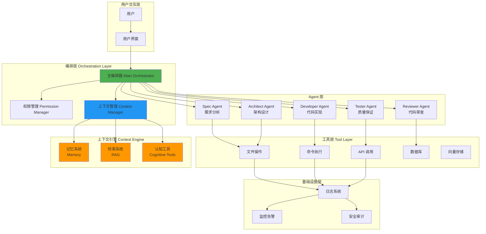
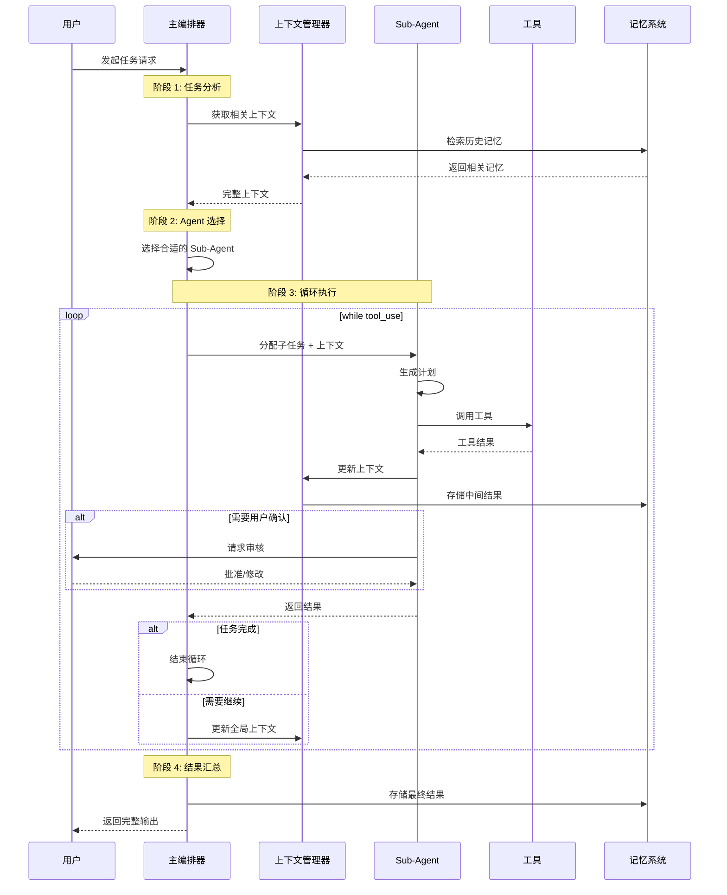
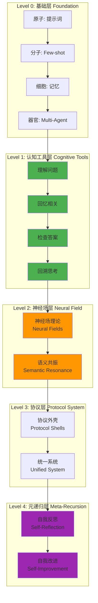
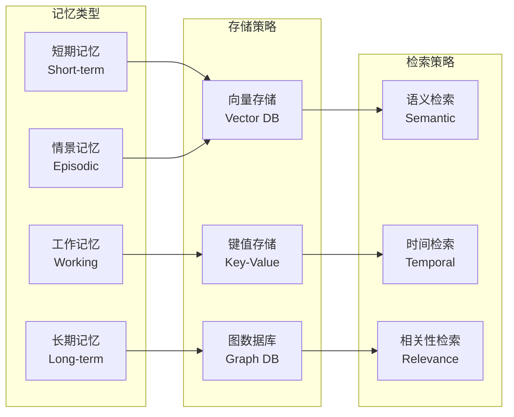
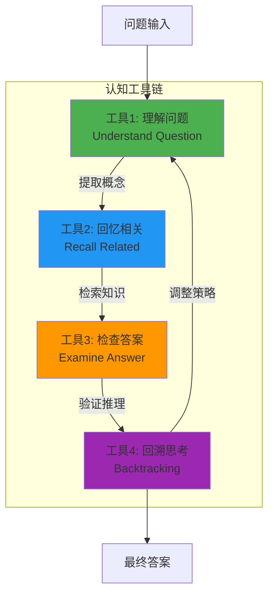
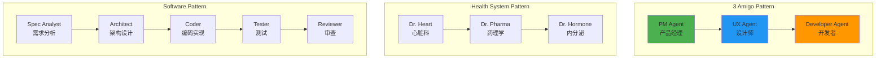
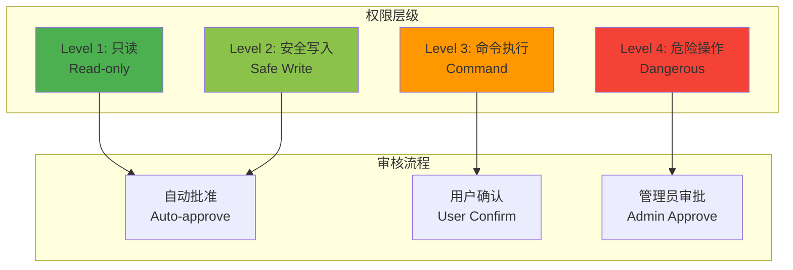
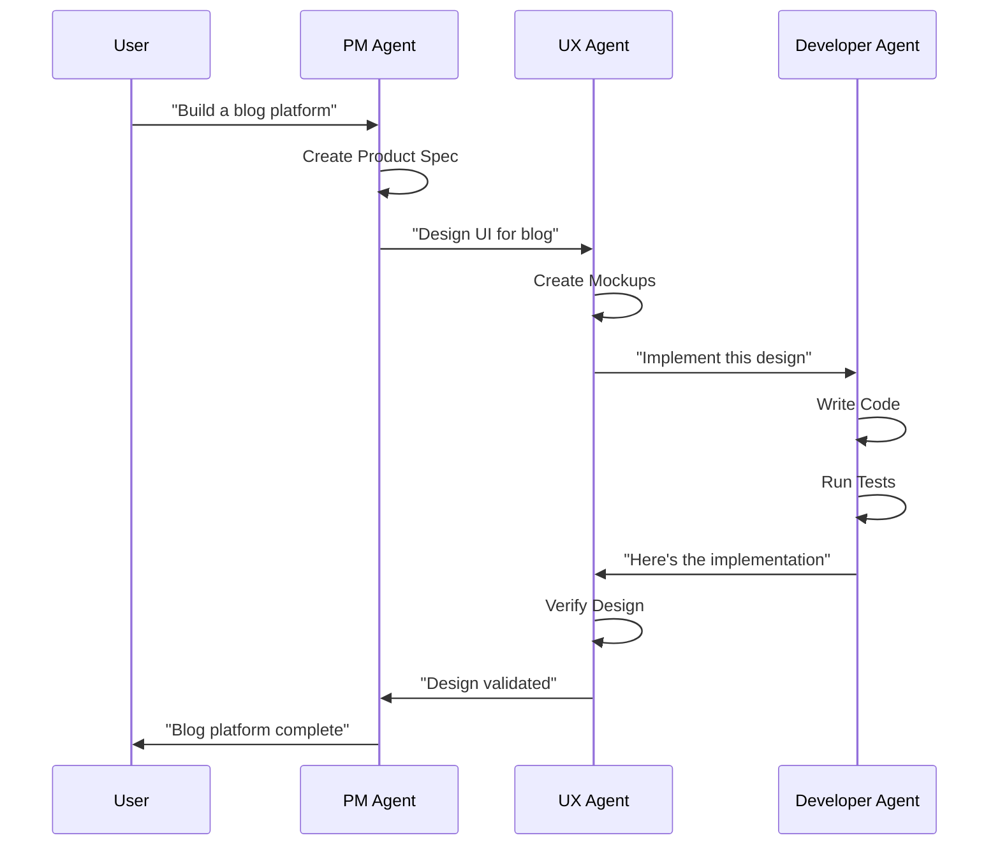
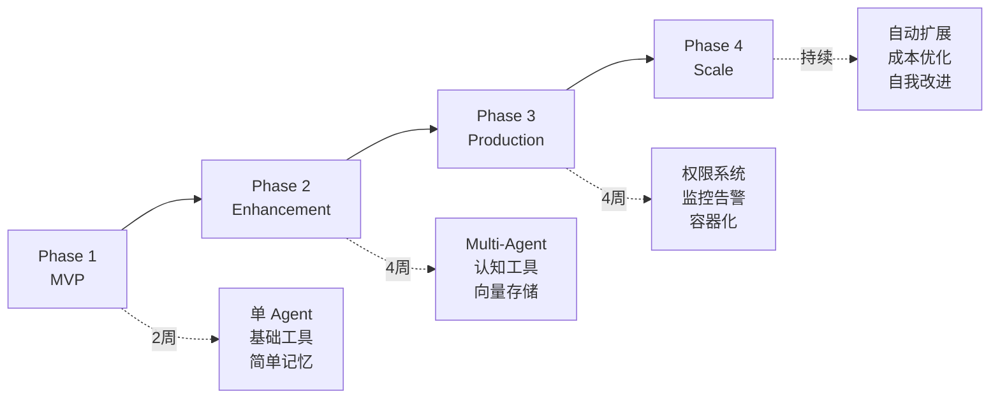

# 通用 Agent 架构设计完全指南

> 基于 Context Engineering、Claude Code 和企业级最佳实践  
> 从零到生产级 Agent 的完整实现路径

## 目录

1. [核心设计原则](#核心设计原则)
2. [架构设计](#架构设计)
3. [设计考虑维度](#设计考虑维度)
4. [完整实现教程](#完整实现教程)
5. [高级模式](#高级模式)
6. [生产部署](#生产部署)
7. [评估与优化](#评估与优化)

---

## 核心设计原则

### Andrej Karpathy 的 Context Engineering 原则

> "Context engineering is the delicate art and science of filling the context window with just the right information for the next step."

### Claude Code 的简洁哲学

> "Claude Code is relatively simple. It is a standard agentic pattern for a single agent, combined with a host of tricks to enable running long sessions."

### 3 个核心原则

```
1. 简洁 > 复杂
   └─ 从最简单的 while(tool_use) 循环开始

2. 上下文 > 提示词
   └─ 设计完整的上下文工程系统

3. 专业化 > 通用化
   └─ 多个专门的 Sub-agents 胜过一个全能 Agent
```

---

## 架构设计

### 1. 宏观架构图



---

### 2. 核心执行流程



---

### 3. Context Engineering 分层架构



**关键洞察**:

- **Level 0**: 基础构建块 (必需)
- **Level 1**: 认知工具使性能提升 43% (IBM 研究)
- **Level 2**: 神经场理论支持长期记忆和语义理解
- **Level 3**: 协议系统实现模块化和可组合性
- **Level 4**: 元递归实现自我改进

---

## 设计考虑维度

### 维度 1: 上下文工程 (Context Engineering)

#### 1.1 Token 预算管理

```python
# Token 预算分配策略
class TokenBudget:
    """
    总预算: 200k tokens (Claude Sonnet 4.5)
    """
    SYSTEM_PROMPT = 2000      # 2k - 系统指令
    USER_TASK = 5000          # 5k - 用户任务描述
    EXAMPLES = 10000          # 10k - Few-shot 示例
    MEMORY = 30000            # 30k - 相关记忆
    TOOLS_DEF = 15000         # 15k - 工具定义
    CONVERSATION = 50000      # 50k - 对话历史
    WORKING = 70000           # 70k - 工作空间
    RESPONSE = 18000          # 18k - 响应生成

    @classmethod
    def validate(cls, context: Dict[str, int]) -> bool:
        """验证 token 使用是否在预算内"""
        total = sum(context.values())
        return total <= 200000
```

#### 1.2 记忆系统设计



**实现策略**:

```python
from typing import List, Dict, Optional
import numpy as np
from datetime import datetime

class MemorySystem:
    """
    MEM1 风格的记忆系统
    参考: https://arxiv.org/pdf/2506.15841
    """

    def __init__(self):
        self.short_term: List[Dict] = []  # 最近 10 条交互
        self.working: Dict = {}            # 当前任务上下文
        self.long_term: VectorDB = None    # 向量数据库
        self.episodic: List[Episode] = []  # 情景记忆

    def consolidate(self, interaction: Dict) -> Dict:
        """
        记忆巩固: 将短期记忆压缩为长期记忆

        关键: 只保留关键信息,丢弃冗余
        """
        # 1. 提取关键实体和关系
        entities = self._extract_entities(interaction)
        relations = self._extract_relations(entities)

        # 2. 语义压缩
        compressed = self._semantic_compress(
            interaction,
            compression_ratio=0.3  # 压缩到 30%
        )

        # 3. 生成记忆嵌入
        embedding = self._generate_embedding(compressed)

        # 4. 存储到长期记忆
        memory_entry = {
            "timestamp": datetime.now(),
            "summary": compressed,
            "entities": entities,
            "relations": relations,
            "embedding": embedding,
            "importance": self._calculate_importance(interaction)
        }

        self.long_term.add(memory_entry)
        return memory_entry

    def retrieve(self, query: str, k: int = 5) -> List[Dict]:
        """
        记忆检索: 获取最相关的 k 条记忆
        """
        # 1. 查询嵌入
        query_embedding = self._generate_embedding(query)

        # 2. 语义相似度检索
        semantic_results = self.long_term.search(
            query_embedding,
            top_k=k
        )

        # 3. 时间衰减
        decayed_results = self._apply_temporal_decay(
            semantic_results
        )

        # 4. 重要性加权
        weighted_results = self._apply_importance_weight(
            decayed_results
        )

        return weighted_results[:k]

    def _calculate_importance(self, interaction: Dict) -> float:
        """
        计算交互重要性

        考虑因素:
        - 任务成功率
        - 用户满意度
        - 信息密度
        - 创新程度
        """
        factors = {
            "task_success": 0.3,
            "user_satisfaction": 0.3,
            "information_density": 0.2,
            "novelty": 0.2
        }

        score = sum(
            factors[k] * interaction.get(k, 0.5)
            for k in factors
        )

        return score
```

---

### 维度 2: 认知工具 (Cognitive Tools)

#### IBM 研究: 认知工具提升 43% 性能



**实现**:

```python
class CognitiveTool:
    """
    认知工具基类

    参考: IBM Zurich - Eliciting Reasoning with Cognitive Tools
    """

    def __init__(self, name: str, prompt_template: str):
        self.name = name
        self.template = prompt_template

    def __call__(self, problem: str, context: Dict = None) -> str:
        """执行认知工具"""
        prompt = self.template.format(
            problem=problem,
            **( context or {})
        )

        return self.llm_call(prompt)


# 工具 1: 理解问题
understand_question = CognitiveTool(
    name="understand_question",
    prompt_template="""
    Analyze the following problem and extract:

    Problem: {problem}

    1. Main Concepts: What are the key concepts?
    2. Given Information: What do we know?
    3. Unknown: What do we need to find?
    4. Constraints: What are the limitations?
    5. Relevant Theorems/Techniques: What might help?

    Provide a structured analysis:
    """
)

# 工具 2: 回忆相关知识
recall_related = CognitiveTool(
    name="recall_related",
    prompt_template="""
    Given the problem analysis:

    {problem_analysis}

    Recall and list:
    1. Similar problems you've solved
    2. Relevant mathematical/logical principles
    3. Known solution patterns
    4. Common pitfalls to avoid

    Provide relevant knowledge:
    """
)

# 工具 3: 检查答案
examine_answer = CognitiveTool(
    name="examine_answer",
    prompt_template="""
    Verify the proposed solution:

    Problem: {problem}
    Proposed Solution: {solution}

    Check:
    1. Does it satisfy all constraints?
    2. Is the logic sound?
    3. Are there edge cases?
    4. Can it be simplified?

    Provide verification:
    """
)

# 工具 4: 回溯思考
backtracking = CognitiveTool(
    name="backtracking",
    prompt_template="""
    The current approach seems stuck:

    Current Path: {current_path}
    Issue: {issue}

    Consider:
    1. Alternative approaches
    2. Relaxing constraints
    3. Decomposing differently
    4. Using different techniques

    Suggest backtracking strategy:
    """
)


class CognitiveToolchain:
    """认知工具链编排"""

    def __init__(self):
        self.tools = {
            "understand": understand_question,
            "recall": recall_related,
            "examine": examine_answer,
            "backtrack": backtracking
        }

    def solve(self, problem: str, max_iterations: int = 5) -> str:
        """使用认知工具链解决问题"""

        # 步骤 1: 理解问题
        analysis = self.tools["understand"](problem)

        # 步骤 2: 回忆相关知识
        knowledge = self.tools["recall"](
            problem,
            context={"problem_analysis": analysis}
        )

        # 步骤 3-N: 迭代求解
        for i in range(max_iterations):
            # 尝试解决
            solution = self._attempt_solution(
                problem, analysis, knowledge
            )

            # 检查答案
            verification = self.tools["examine"](
                problem,
                context={"solution": solution}
            )

            if self._is_valid(verification):
                return solution

            # 回溯思考
            backtrack_strategy = self.tools["backtrack"](
                problem,
                context={
                    "current_path": solution,
                    "issue": verification
                }
            )

            # 调整策略
            knowledge += f"\n\nBacktrack Insight: {backtrack_strategy}"

        return solution  # 返回最佳尝试
```

---

### 维度 3: Sub-Agent 架构

#### 3.1 Agent 专业化模式



**关键原则**:

1. **单一职责**: 每个 Agent 只做一件事
2. **清晰边界**: 明确的输入/输出接口
3. **可组合性**: 可以任意组合和串联
4. **Token 效率**: 轻量级 Agent (小于 3k tokens)

#### 3.2 Sub-Agent 实现

```python
from typing import Protocol, Dict, List, Optional
from dataclasses import dataclass
from enum import Enum

class AgentRole(Enum):
    """Agent 角色定义"""
    ORCHESTRATOR = "orchestrator"
    ANALYST = "analyst"
    ARCHITECT = "architect"
    DEVELOPER = "developer"
    TESTER = "tester"
    REVIEWER = "reviewer"


@dataclass
class AgentSpec:
    """Agent 规格说明"""
    role: AgentRole
    name: str
    description: str
    system_prompt: str
    tools: List[str]
    model: str = "claude-sonnet-4-5"
    max_tokens: int = 4000
    temperature: float = 0.7


class SubAgent(Protocol):
    """Sub-Agent 接口"""

    def execute(
        self,
        task: str,
        context: Dict,
        tools: List[Tool]
    ) -> Dict:
        """执行任务"""
        ...

    def get_cost(self) -> float:
        """获取成本"""
        ...


class SpecialistAgent:
    """专业化 Agent 实现"""

    def __init__(self, spec: AgentSpec):
        self.spec = spec
        self.conversation_history = []
        self.token_usage = 0

    def execute(
        self,
        task: str,
        context: Dict,
        tools: List[Tool]
    ) -> Dict:
        """
        执行任务

        Claude Code 模式: while(tool_use) 循环
        """
        # 构建初始消息
        messages = self._build_messages(task, context)

        # 主执行循环
        max_iterations = 10
        iteration = 0

        while iteration < max_iterations:
            # 调用 LLM
            response = self._llm_call(messages)

            # 记录 token 使用
            self.token_usage += response.usage.total_tokens

            # 检查是否需要使用工具
            if not response.tool_calls:
                # 无工具调用,任务完成
                return {
                    "success": True,
                    "result": response.content,
                    "iterations": iteration,
                    "tokens": self.token_usage
                }

            # 执行工具调用
            tool_results = self._execute_tools(
                response.tool_calls,
                tools
            )

            # 将结果添加到消息历史
            messages.append({
                "role": "assistant",
                "content": response.content,
                "tool_calls": response.tool_calls
            })
            messages.append({
                "role": "tool",
                "content": tool_results
            })

            iteration += 1

        # 达到最大迭代次数
        return {
            "success": False,
            "result": "Max iterations reached",
            "iterations": iteration,
            "tokens": self.token_usage
        }

    def _build_messages(
        self,
        task: str,
        context: Dict
    ) -> List[Dict]:
        """构建消息列表"""

        # 系统提示词
        system_prompt = self.spec.system_prompt.format(**context)

        # 用户任务
        user_message = f"""
        Task: {task}

        Context:
        {self._format_context(context)}

        Please complete this task step by step.
        Use the available tools as needed.
        """

        return [
            {"role": "system", "content": system_prompt},
            {"role": "user", "content": user_message}
        ]


# 预定义专业 Agents

SPEC_ANALYST = AgentSpec(
    role=AgentRole.ANALYST,
    name="spec-analyst",
    description="Requirements analysis specialist",
    system_prompt="""
    You are a requirements analyst expert.

    Your job:
    1. Understand user needs deeply
    2. Extract functional & non-functional requirements
    3. Identify edge cases and constraints
    4. Create clear, testable specifications

    Guidelines:
    - Ask clarifying questions
    - Use structured formats (User Stories, Use Cases)
    - Think about security, performance, scalability
    - Document assumptions
    """,
    tools=["read_file", "write_file"],
    temperature=0.5
)

ARCHITECT = AgentSpec(
    role=AgentRole.ARCHITECT,
    name="architect",
    description="System architecture designer",
    system_prompt="""
    You are a software architect expert.

    Your job:
    1. Design system architecture
    2. Choose appropriate technologies
    3. Plan data models and APIs
    4. Consider scalability and maintainability

    Guidelines:
    - Follow SOLID principles
    - Use design patterns appropriately
    - Create diagrams (Mermaid)
    - Document technical decisions
    """,
    tools=["read_file", "write_file", "search_docs"],
    temperature=0.6
)

DEVELOPER = AgentSpec(
    role=AgentRole.DEVELOPER,
    name="developer",
    description="Code implementation specialist",
    system_prompt="""
    You are an expert software developer.

    Your job:
    1. Implement features according to specs
    2. Write clean, maintainable code
    3. Follow coding standards
    4. Add appropriate comments

    Guidelines:
    - TDD: Write tests first
    - Keep functions small and focused
    - Handle errors gracefully
    - Optimize for readability
    """,
    tools=["read_file", "write_file", "bash", "search_code"],
    temperature=0.3
)

TESTER = AgentSpec(
    role=AgentRole.TESTER,
    name="tester",
    description="Quality assurance specialist",
    system_prompt="""
    You are a QA engineer expert.

    Your job:
    1. Write comprehensive tests
    2. Find edge cases and bugs
    3. Ensure code coverage
    4. Verify requirements

    Guidelines:
    - Unit + Integration + E2E tests
    - Aim for >80% coverage
    - Test failure scenarios
    - Document test rationale
    """,
    tools=["read_file", "write_file", "bash"],
    temperature=0.4
)

REVIEWER = AgentSpec(
    role=AgentRole.REVIEWER,
    name="reviewer",
    description="Code review specialist",
    system_prompt="""
    You are a senior code reviewer.

    Your job:
    1. Review code quality
    2. Check for security issues
    3. Verify best practices
    4. Suggest improvements

    Guidelines:
    - Be constructive, not critical
    - Focus on maintainability
    - Check for common vulnerabilities
    - Ensure documentation
    """,
    tools=["read_file", "write_file"],
    temperature=0.5
)
```

---

### 维度 4: 工具设计

#### 4.1 工具最小化原则

```
Claude Code 启示:
- 只提供必要的工具
- 每个工具职责单一
- 工具定义要清晰
- 避免工具冗余
```

**核心工具集**:

```python
from abc import ABC, abstractmethod
from typing import Any, Dict, List

class Tool(ABC):
    """工具基类"""

    @abstractmethod
    def name(self) -> str:
        """工具名称"""
        pass

    @abstractmethod
    def description(self) -> str:
        """工具描述"""
        pass

    @abstractmethod
    def parameters(self) -> Dict:
        """参数 schema (JSON Schema)"""
        pass

    @abstractmethod
    def execute(self, **kwargs) -> Any:
        """执行工具"""
        pass


class ReadFileTool(Tool):
    """读取文件工具"""

    def name(self) -> str:
        return "read_file"

    def description(self) -> str:
        return "Read the contents of a file"

    def parameters(self) -> Dict:
        return {
            "type": "object",
            "properties": {
                "path": {
                    "type": "string",
                    "description": "File path to read"
                },
                "start_line": {
                    "type": "integer",
                    "description": "Optional: start line (1-indexed)"
                },
                "end_line": {
                    "type": "integer",
                    "description": "Optional: end line (inclusive)"
                }
            },
            "required": ["path"]
        }

    def execute(
        self,
        path: str,
        start_line: Optional[int] = None,
        end_line: Optional[int] = None
    ) -> str:
        """读取文件"""
        with open(path, 'r') as f:
            if start_line is None:
                return f.read()

            lines = f.readlines()
            start = start_line - 1
            end = end_line if end_line else len(lines)

            return ''.join(lines[start:end])


class WriteFileTool(Tool):
    """写入文件工具"""

    def name(self) -> str:
        return "write_file"

    def description(self) -> str:
        return "Write content to a file"

    def parameters(self) -> Dict:
        return {
            "type": "object",
            "properties": {
                "path": {
                    "type": "string",
                    "description": "File path to write"
                },
                "content": {
                    "type": "string",
                    "description": "Content to write"
                },
                "mode": {
                    "type": "string",
                    "enum": ["write", "append"],
                    "description": "Write mode",
                    "default": "write"
                }
            },
            "required": ["path", "content"]
        }

    def execute(
        self,
        path: str,
        content: str,
        mode: str = "write"
    ) -> str:
        """写入文件"""
        file_mode = 'w' if mode == "write" else 'a'

        with open(path, file_mode) as f:
            f.write(content)

        return f"Successfully wrote to {path}"


class BashTool(Tool):
    """执行 Bash 命令工具"""

    def name(self) -> str:
        return "bash"

    def description(self) -> str:
        return "Execute a bash command"

    def parameters(self) -> Dict:
        return {
            "type": "object",
            "properties": {
                "command": {
                    "type": "string",
                    "description": "Bash command to execute"
                },
                "cwd": {
                    "type": "string",
                    "description": "Working directory",
                    "default": "."
                }
            },
            "required": ["command"]
        }

    def execute(
        self,
        command: str,
        cwd: str = "."
    ) -> str:
        """执行命令 (需要权限检查!)"""
        import subprocess

        # 危险命令检查
        dangerous = ["rm -rf", "dd", "mkfs", "> /dev"]
        if any(d in command for d in dangerous):
            return "ERROR: Dangerous command blocked"

        try:
            result = subprocess.run(
                command,
                shell=True,
                cwd=cwd,
                capture_output=True,
                text=True,
                timeout=30
            )

            return f"STDOUT:\n{result.stdout}\nSTDERR:\n{result.stderr}"

        except subprocess.TimeoutExpired:
            return "ERROR: Command timeout"
        except Exception as e:
            return f"ERROR: {str(e)}"


# 工具注册表
class ToolRegistry:
    """工具注册与管理"""

    def __init__(self):
        self.tools: Dict[str, Tool] = {}

    def register(self, tool: Tool):
        """注册工具"""
        self.tools[tool.name()] = tool

    def get(self, name: str) -> Optional[Tool]:
        """获取工具"""
        return self.tools.get(name)

    def list_tools(self) -> List[Dict]:
        """列出所有工具 (用于 LLM)"""
        return [
            {
                "name": tool.name(),
                "description": tool.description(),
                "parameters": tool.parameters()
            }
            for tool in self.tools.values()
        ]


# 创建全局工具注册表
registry = ToolRegistry()
registry.register(ReadFileTool())
registry.register(WriteFileTool())
registry.register(BashTool())
```

---

### 维度 5: 权限与安全

#### 5.1 权限系统设计



**实现**:

```python
from enum import Enum
from typing import Callable, Optional

class PermissionLevel(Enum):
    """权限级别"""
    READ_ONLY = 1
    SAFE_WRITE = 2
    COMMAND_EXEC = 3
    DANGEROUS = 4


class Permission:
    """权限定义"""

    def __init__(
        self,
        level: PermissionLevel,
        paths: Optional[List[str]] = None,
        commands: Optional[List[str]] = None
    ):
        self.level = level
        self.paths = paths or []
        self.commands = commands or []

    def allows(self, action: str, target: str) -> bool:
        """检查是否允许某个操作"""

        if action == "read":
            return self.level.value >= PermissionLevel.READ_ONLY.value

        if action == "write":
            if self.level.value < PermissionLevel.SAFE_WRITE.value:
                return False

            # 检查路径白名单
            if self.paths:
                return any(
                    target.startswith(p) for p in self.paths
                )
            return True

        if action == "execute":
            if self.level.value < PermissionLevel.COMMAND_EXEC.value:
                return False

            # 检查命令白名单
            if self.commands:
                return target.split()[0] in self.commands
            return True

        return False


class PermissionManager:
    """权限管理器"""

    def __init__(self):
        self.agent_permissions: Dict[str, Permission] = {}
        self.approval_required: Set[str] = set()

    def grant(self, agent_name: str, permission: Permission):
        """授予权限"""
        self.agent_permissions[agent_name] = permission

    def check(
        self,
        agent_name: str,
        action: str,
        target: str
    ) -> bool:
        """检查权限"""

        perm = self.agent_permissions.get(agent_name)
        if not perm:
            return False

        return perm.allows(action, target)

    def require_approval(
        self,
        agent_name: str,
        action: str,
        target: str,
        callback: Callable
    ) -> bool:
        """需要人类批准"""

        key = f"{agent_name}:{action}:{target}"

        if key in self.approval_required:
            # 已批准
            return True

        # 请求用户批准
        approved = callback(agent_name, action, target)

        if approved:
            self.approval_required.add(key)

        return approved


# 使用示例

perm_manager = PermissionManager()

# Analyst: 只读权限
perm_manager.grant(
    "spec-analyst",
    Permission(
        level=PermissionLevel.READ_ONLY
    )
)

# Developer: 安全写入权限
perm_manager.grant(
    "developer",
    Permission(
        level=PermissionLevel.SAFE_WRITE,
        paths=["/src", "/tests"],  # 只能写这些目录
        commands=["git", "npm", "pytest"]  # 允许的命令
    )
)

# Reviewer: 命令执行权限
perm_manager.grant(
    "reviewer",
    Permission(
        level=PermissionLevel.COMMAND_EXEC,
        paths=["/src", "/tests", "/docs"],
        commands=["git", "npm", "pytest", "lint"]
    )
)
```

---

### 维度 6: 可观测性

#### 6.1 日志与监控

```python
import logging
from datetime import datetime
from typing import Dict, Any
import json

class AgentLogger:
    """Agent 专用日志系统"""

    def __init__(self, agent_name: str):
        self.agent_name = agent_name
        self.logger = logging.getLogger(f"agent.{agent_name}")
        self.session_id = self._generate_session_id()

    def log_task_start(self, task: str, context: Dict):
        """记录任务开始"""
        self.logger.info({
            "event": "task_start",
            "agent": self.agent_name,
            "session": self.session_id,
            "task": task,
            "context": context,
            "timestamp": datetime.now().isoformat()
        })

    def log_tool_call(
        self,
        tool_name: str,
        parameters: Dict,
        result: Any
    ):
        """记录工具调用"""
        self.logger.info({
            "event": "tool_call",
            "agent": self.agent_name,
            "session": self.session_id,
            "tool": tool_name,
            "parameters": parameters,
            "result": str(result)[:200],  # 截断
            "timestamp": datetime.now().isoformat()
        })

    def log_error(self, error: Exception, context: Dict):
        """记录错误"""
        self.logger.error({
            "event": "error",
            "agent": self.agent_name,
            "session": self.session_id,
            "error_type": type(error).__name__,
            "error_message": str(error),
            "context": context,
            "timestamp": datetime.now().isoformat()
        })

    def log_metrics(self, metrics: Dict):
        """记录指标"""
        self.logger.info({
            "event": "metrics",
            "agent": self.agent_name,
            "session": self.session_id,
            "metrics": metrics,
            "timestamp": datetime.now().isoformat()
        })


class MetricsCollector:
    """指标收集器"""

    def __init__(self):
        self.metrics = {
            "total_tasks": 0,
            "successful_tasks": 0,
            "failed_tasks": 0,
            "total_tokens": 0,
            "total_cost": 0.0,
            "total_time": 0.0,
            "tool_calls": {},
            "agent_usage": {}
        }

    def record_task(
        self,
        agent_name: str,
        success: bool,
        tokens: int,
        cost: float,
        time: float
    ):
        """记录任务指标"""
        self.metrics["total_tasks"] += 1

        if success:
            self.metrics["successful_tasks"] += 1
        else:
            self.metrics["failed_tasks"] += 1

        self.metrics["total_tokens"] += tokens
        self.metrics["total_cost"] += cost
        self.metrics["total_time"] += time

        if agent_name not in self.metrics["agent_usage"]:
            self.metrics["agent_usage"][agent_name] = {
                "count": 0,
                "tokens": 0,
                "cost": 0.0
            }

        self.metrics["agent_usage"][agent_name]["count"] += 1
        self.metrics["agent_usage"][agent_name]["tokens"] += tokens
        self.metrics["agent_usage"][agent_name]["cost"] += cost

    def record_tool_call(self, tool_name: str):
        """记录工具调用"""
        if tool_name not in self.metrics["tool_calls"]:
            self.metrics["tool_calls"][tool_name] = 0

        self.metrics["tool_calls"][tool_name] += 1

    def get_summary(self) -> Dict:
        """获取汇总指标"""
        return {
            **self.metrics,
            "success_rate": (
                self.metrics["successful_tasks"] /
                max(self.metrics["total_tasks"], 1)
            ),
            "avg_cost_per_task": (
                self.metrics["total_cost"] /
                max(self.metrics["total_tasks"], 1)
            ),
            "avg_time_per_task": (
                self.metrics["total_time"] /
                max(self.metrics["total_tasks"], 1)
            )
        }
```

---

## 完整实现教程

### 步骤 1: 项目初始化

```bash
# 创建项目结构
mkdir -p universal-agent/{
    src/{agents,tools,memory,orchestrator},
    tests,
    config,
    logs,
    data/{vector_db,cache}
}

cd universal-agent

# 创建虚拟环境
python -m venv venv
source venv/bin/activate  # Linux/Mac
# venv\Scripts\activate  # Windows

# 安装依赖
pip install anthropic numpy chromadb pydantic python-dotenv
```

**项目结构**:

```
universal-agent/
├── src/
│   ├── agents/          # Agent 实现
│   │   ├── base.py
│   │   ├── specialist.py
│   │   └── orchestrator.py
│   ├── tools/           # 工具实现
│   │   ├── file_ops.py
│   │   ├── bash.py
│   │   └── registry.py
│   ├── memory/          # 记忆系统
│   │   ├── short_term.py
│   │   ├── long_term.py
│   │   └── retrieval.py
│   ├── orchestrator/    # 编排器
│   │   ├── main.py
│   │   └── context.py
│   └── utils/           # 工具函数
│       ├── logging.py
│       ├── metrics.py
│       └── permissions.py
├── tests/               # 测试
├── config/              # 配置
│   └── agents.yaml
├── logs/                # 日志
├── data/                # 数据
└── main.py              # 入口
```

---

### 步骤 2: 配置 Agent

**`config/agents.yaml`**:

```yaml
# Agent 配置文件

orchestrator:
  model: claude-sonnet-4-5
  max_tokens: 8000
  temperature: 0.7

agents:
  - role: analyst
    name: spec-analyst
    model: claude-sonnet-4-5
    temperature: 0.5
    max_tokens: 4000
    tools:
      - read_file
      - write_file
    permissions:
      level: READ_ONLY

  - role: architect
    name: architect
    model: claude-sonnet-4-5
    temperature: 0.6
    max_tokens: 6000
    tools:
      - read_file
      - write_file
    permissions:
      level: SAFE_WRITE
      paths:
        - /design
        - /docs

  - role: developer
    name: developer
    model: claude-haiku-4-5 # 使用 Haiku 降低成本
    temperature: 0.3
    max_tokens: 8000
    tools:
      - read_file
      - write_file
      - bash
    permissions:
      level: SAFE_WRITE
      paths:
        - /src
        - /tests
      commands:
        - git
        - npm
        - pytest

  - role: tester
    name: tester
    model: claude-haiku-4-5
    temperature: 0.4
    max_tokens: 6000
    tools:
      - read_file
      - write_file
      - bash
    permissions:
      level: COMMAND_EXEC
      commands:
        - pytest
        - npm test
        - coverage

  - role: reviewer
    name: reviewer
    model: claude-sonnet-4-5
    temperature: 0.5
    max_tokens: 6000
    tools:
      - read_file
      - write_file
    permissions:
      level: READ_ONLY

cognitive_tools:
  enabled: true
  tools:
    - understand_question
    - recall_related
    - examine_answer
    - backtracking

memory:
  short_term:
    max_size: 10
  long_term:
    type: chromadb
    path: ./data/vector_db
  consolidation:
    threshold: 5
    compression_ratio: 0.3
```

---

### 步骤 3: 实现核心组件

**`src/orchestrator/main.py`** - 主编排器:

```python
from typing import List, Dict, Optional
import yaml
from ..agents.specialist import SpecialistAgent
from ..memory.short_term import ShortTermMemory
from ..memory.long_term import LongTermMemory
from ..tools.registry import ToolRegistry
from ..utils.logging import AgentLogger
from ..utils.metrics import MetricsCollector

class MainOrchestrator:
    """
    主编排器

    职责:
    1. 任务分解
    2. Agent 选择和调度
    3. 上下文管理
    4. 结果聚合
    """

    def __init__(self, config_path: str):
        # 加载配置
        with open(config_path) as f:
            self.config = yaml.safe_load(f)

        # 初始化组件
        self.agents = self._init_agents()
        self.tools = ToolRegistry()
        self.short_memory = ShortTermMemory()
        self.long_memory = LongTermMemory(
            self.config['memory']['long_term']['path']
        )
        self.logger = AgentLogger("orchestrator")
        self.metrics = MetricsCollector()

    def execute(self, user_request: str) -> Dict:
        """
        执行用户请求

        这是主入口点
        """
        self.logger.log_task_start(user_request, {})

        try:
            # 步骤 1: 任务分析
            task_plan = self._analyze_task(user_request)

            # 步骤 2: 执行任务计划
            results = self._execute_plan(task_plan)

            # 步骤 3: 聚合结果
            final_result = self._aggregate_results(results)

            # 步骤 4: 更新记忆
            self._update_memory(user_request, final_result)

            return {
                "success": True,
                "result": final_result,
                "metrics": self.metrics.get_summary()
            }

        except Exception as e:
            self.logger.log_error(e, {"request": user_request})
            return {
                "success": False,
                "error": str(e)
            }

    def _analyze_task(self, request: str) -> Dict:
        """
        任务分析

        使用 Analyst Agent 分析任务并创建执行计划
        """
        analyst = self.agents.get("spec-analyst")

        # 获取相关上下文
        context = self._build_context(request)

        # 分析任务
        analysis = analyst.execute(
            task=f"""
            Analyze this user request and create an execution plan:

            Request: {request}

            Create a plan with:
            1. Required agents (analyst/architect/developer/tester/reviewer)
            2. Sequence of steps
            3. Dependencies between steps
            4. Success criteria

            Format as JSON.
            """,
            context=context,
            tools=self.tools.get_subset(["read_file", "write_file"])
        )

        return analysis

    def _execute_plan(self, plan: Dict) -> List[Dict]:
        """执行任务计划"""
        results = []

        for step in plan["steps"]:
            agent_name = step["agent"]
            agent = self.agents.get(agent_name)

            # 获取依赖步骤的结果
            dependencies = self._resolve_dependencies(
                step.get("dependencies", []),
                results
            )

            # 构建上下文
            context = self._build_context(
                step["description"],
                dependencies
            )

            # 执行步骤
            result = agent.execute(
                task=step["description"],
                context=context,
                tools=self.tools.get_for_agent(agent_name)
            )

            results.append({
                "step": step["name"],
                "agent": agent_name,
                "result": result
            })

        return results

    def _build_context(
        self,
        query: str,
        additional: Optional[Dict] = None
    ) -> Dict:
        """
        构建上下文

        整合:
        - 短期记忆
        - 长期记忆 (检索)
        - 额外上下文
        """
        context = {}

        # 短期记忆
        context["recent_interactions"] = self.short_memory.get_recent(5)

        # 长期记忆 (语义检索)
        context["relevant_memories"] = self.long_memory.retrieve(
            query,
            k=3
        )

        # 额外上下文
        if additional:
            context["additional"] = additional

        return context

    def _update_memory(self, request: str, result: Dict):
        """更新记忆系统"""

        interaction = {
            "request": request,
            "result": result,
            "timestamp": datetime.now()
        }

        # 短期记忆
        self.short_memory.add(interaction)

        # 长期记忆 (巩固)
        if self.short_memory.should_consolidate():
            consolidated = self.short_memory.consolidate()
            self.long_memory.add(consolidated)
```

---

### 步骤 4: 使用示例

**`main.py`**:

```python
#!/usr/bin/env python3
"""
Universal Agent - 主入口

用法:
    python main.py "Create a todo list web app"
"""

import sys
from src.orchestrator.main import MainOrchestrator

def main():
    if len(sys.argv) < 2:
        print("Usage: python main.py '<your request>'")
        sys.exit(1)

    user_request = sys.argv[1]

    # 创建编排器
    orchestrator = MainOrchestrator("config/agents.yaml")

    # 执行请求
    print(f"🚀 Processing: {user_request}\n")

    result = orchestrator.execute(user_request)

    # 输出结果
    if result["success"]:
        print("✅ Success!")
        print(f"\nResult:\n{result['result']}")
        print(f"\nMetrics:\n{result['metrics']}")
    else:
        print(f"❌ Error: {result['error']}")

if __name__ == "__main__":
    main()
```

**运行**:

```bash
# 示例 1: 创建 Web 应用
python main.py "Create a todo list web application with React and FastAPI"

# 示例 2: 代码审查
python main.py "Review the authentication module for security issues"

# 示例 3: 添加功能
python main.py "Add dark mode to the existing UI"
```

---

## 高级模式

### 模式 1: 3 Amigo Pattern



**实现**:

```python
class ThreeAmigoPattern:
    """3 Amigo Agent 模式"""

    def __init__(self):
        self.pm_agent = SpecialistAgent(PM_SPEC)
        self.ux_agent = SpecialistAgent(UX_SPEC)
        self.dev_agent = SpecialistAgent(DEV_SPEC)

    def execute(self, user_request: str) -> Dict:
        """执行 3 Amigo 模式"""

        # 1. PM: 创建产品规格
        spec = self.pm_agent.execute(
            task=f"Create product spec for: {user_request}",
            context={},
            tools=[read_file, write_file]
        )

        # 2. UX: 设计界面
        design = self.ux_agent.execute(
            task=f"Design UI based on spec",
            context={"spec": spec},
            tools=[read_file, write_file, create_mockup]
        )

        # 3. Dev: 实现代码
        implementation = self.dev_agent.execute(
            task=f"Implement the design",
            context={"spec": spec, "design": design},
            tools=[read_file, write_file, bash]
        )

        # 4. UX: 验证设计
        validation = self.ux_agent.execute(
            task="Verify implementation matches design",
            context={"design": design, "impl": implementation},
            tools=[read_file, screenshot]
        )

        return {
            "spec": spec,
            "design": design,
            "implementation": implementation,
            "validation": validation
        }
```

---

### 模式 2: Spec Workflow System

```python
class SpecWorkflowOrchestrator:
    """
    规格工作流编排器

    完整的软件开发生命周期
    """

    def __init__(self):
        self.agents = {
            "analyst": SpecialistAgent(SPEC_ANALYST),
            "architect": SpecialistAgent(ARCHITECT),
            "planner": SpecialistAgent(PLANNER),
            "developer": SpecialistAgent(DEVELOPER),
            "tester": SpecialistAgent(TESTER),
            "reviewer": SpecialistAgent(REVIEWER)
        }
        self.quality_gates = QualityGateSystem()

    def execute(self, project_idea: str) -> Dict:
        """执行完整工作流"""

        # === 规划阶段 ===
        print("📋 Planning Phase...")

        # 1. 需求分析
        requirements = self.agents["analyst"].execute(
            task=f"Analyze requirements for: {project_idea}"
        )

        # 2. 架构设计
        architecture = self.agents["architect"].execute(
            task="Design system architecture",
            context={"requirements": requirements}
        )

        # 3. 任务规划
        tasks = self.agents["planner"].execute(
            task="Break down into development tasks",
            context={
                "requirements": requirements,
                "architecture": architecture
            }
        )

        # Quality Gate 1
        if not self.quality_gates.check("planning", {
            "requirements": requirements,
            "architecture": architecture,
            "tasks": tasks
        }):
            return {"error": "Failed Quality Gate 1"}

        # === 开发阶段 ===
        print("💻 Development Phase...")

        # 4. 实现所有任务
        implementations = []
        for task in tasks["task_list"]:
            impl = self.agents["developer"].execute(
                task=task["description"],
                context={"architecture": architecture}
            )
            implementations.append(impl)

        # 5. 编写测试
        tests = self.agents["tester"].execute(
            task="Write comprehensive tests",
            context={"implementations": implementations}
        )

        # Quality Gate 2
        if not self.quality_gates.check("development", {
            "implementations": implementations,
            "tests": tests
        }):
            return {"error": "Failed Quality Gate 2"}

        # === 验证阶段 ===
        print("✅ Validation Phase...")

        # 6. 代码审查
        review = self.agents["reviewer"].execute(
            task="Review all code for quality and security",
            context={"code": implementations, "tests": tests}
        )

        # Quality Gate 3
        if not self.quality_gates.check("validation", {
            "review": review
        }):
            return {"error": "Failed Quality Gate 3"}

        # === 完成 ===
        print("🎉 Project Complete!")

        return {
            "success": True,
            "artifacts": {
                "requirements": requirements,
                "architecture": architecture,
                "tasks": tasks,
                "code": implementations,
                "tests": tests,
                "review": review
            },
            "metrics": self._collect_metrics()
        }
```

---

### 模式 3: TDD with Agents

```python
class TDDWorkflow:
    """测试驱动开发工作流"""

    def __init__(self):
        self.tester = SpecialistAgent(TESTER)
        self.developer = SpecialistAgent(DEVELOPER)

    def implement_feature(
        self,
        feature_spec: str
    ) -> Dict:
        """TDD 方式实现功能"""

        # 步骤 1: 编写失败的测试
        print("🧪 Writing tests...")
        tests = self.tester.execute(
            task=f"""
            Write tests for this feature (TDD style):
            {feature_spec}

            IMPORTANT:
            - Do NOT create mock implementations
            - Tests should FAIL initially
            - Use pytest
            """,
            context={},
            tools=[write_file, bash]
        )

        # 步骤 2: 运行测试,确认失败
        print("❌ Confirming tests fail...")
        test_result = self._run_tests()

        if test_result["passed"]:
            return {"error": "Tests should fail initially!"}

        # 步骤 3: 提交测试
        self._commit("Add failing tests for feature")

        # 步骤 4: 实现功能
        print("💻 Implementing feature...")
        implementation = self.developer.execute(
            task=f"""
            Implement the feature to make tests pass:
            {feature_spec}

            IMPORTANT:
            - Do NOT modify the tests
            - Make tests pass with minimal code
            - Follow TDD principles
            """,
            context={"tests": tests},
            tools=[write_file, read_file, bash]
        )

        # 步骤 5: 运行测试,确认通过
        print("✅ Verifying tests pass...")
        test_result = self._run_tests()

        if not test_result["passed"]:
            # 迭代修复
            return self._iterate_until_pass(implementation)

        # 步骤 6: 提交代码
        self._commit("Implement feature (tests passing)")

        return {
            "success": True,
            "tests": tests,
            "implementation": implementation,
            "test_results": test_result
        }
```

---

## 生产部署

### 部署检查清单

```yaml
# deployment-checklist.yaml

security:
  - [ ] 实现权限系统
  - [ ] 添加输入验证
  - [ ] 设置速率限制
  - [ ] 启用审计日志
  - [ ] 隔离危险操作
  - [ ] 使用容器沙箱

reliability:
  - [ ] 添加错误恢复机制
  - [ ] 实现超时处理
  - [ ] 设置重试逻辑
  - [ ] 添加健康检查
  - [ ] 配置优雅关闭

observability:
  - [ ] 结构化日志
  - [ ] 指标收集
  - [ ] 分布式追踪
  - [ ] 告警规则
  - [ ] 性能监控

cost_optimization:
  - [ ] 使用 Haiku 4.5 处理简单任务
  - [ ] 实现响应缓存
  - [ ] 优化 token 使用
  - [ ] 批处理请求
  - [ ] 监控成本指标

scalability:
  - [ ] 水平扩展设计
  - [ ] 负载均衡
  - [ ] 异步任务队列
  - [ ] 数据库分片
  - [ ] CDN 集成
```

---

### Docker 部署

**`Dockerfile`**:

```dockerfile
FROM python:3.11-slim

WORKDIR /app

# 安全: 创建非 root 用户
RUN useradd -m -u 1000 agent && chown -R agent:agent /app
USER agent

# 安装依赖
COPY requirements.txt .
RUN pip install --no-cache-dir -r requirements.txt

# 复制代码
COPY --chown=agent:agent . .

# 环境变量
ENV PYTHONUNBUFFERED=1
ENV LOG_LEVEL=INFO

# 健康检查
HEALTHCHECK --interval=30s --timeout=3s --start-period=5s \
  CMD python -c "import requests; requests.get('http://localhost:8000/health')"

# 启动
CMD ["python", "-m", "uvicorn", "src.api:app", "--host", "0.0.0.0", "--port", "8000"]
```

**`docker-compose.yml`**:

```yaml
version: '3.8'

services:
  agent:
    build: .
    ports:
      - '8000:8000'
    environment:
      - ANTHROPIC_API_KEY=${ANTHROPIC_API_KEY}
      - LOG_LEVEL=INFO
    volumes:
      - ./logs:/app/logs
      - ./data:/app/data
    restart: unless-stopped
    networks:
      - agent-network

    # 资源限制
    deploy:
      resources:
        limits:
          cpus: '2'
          memory: 4G
        reservations:
          cpus: '1'
          memory: 2G

  vector-db:
    image: chromadb/chroma:latest
    ports:
      - '8001:8000'
    volumes:
      - chroma-data:/chroma/chroma
    networks:
      - agent-network

  monitoring:
    image: prom/prometheus:latest
    ports:
      - '9090:9090'
    volumes:
      - ./prometheus.yml:/etc/prometheus/prometheus.yml
      - prometheus-data:/prometheus
    networks:
      - agent-network

volumes:
  chroma-data:
  prometheus-data:

networks:
  agent-network:
    driver: bridge
```

---

## 评估与优化

### 评估框架

```python
from typing import Dict, List
import numpy as np

class AgentEvaluator:
    """Agent 评估系统"""

    def __init__(self):
        self.metrics = {}

    def evaluate(
        self,
        agent_name: str,
        test_cases: List[Dict]
    ) -> Dict:
        """
        评估 Agent 性能

        指标:
        - 准确率 (Accuracy)
        - 成功率 (Success Rate)
        - 平均成本 (Avg Cost)
        - 平均延迟 (Avg Latency)
        - Token 效率 (Token Efficiency)
        """
        results = []

        for case in test_cases:
            result = self._run_test_case(agent_name, case)
            results.append(result)

        # 计算指标
        metrics = {
            "accuracy": self._calculate_accuracy(results),
            "success_rate": self._calculate_success_rate(results),
            "avg_cost": np.mean([r["cost"] for r in results]),
            "avg_latency": np.mean([r["latency"] for r in results]),
            "token_efficiency": self._calculate_token_efficiency(results),
            "test_count": len(test_cases)
        }

        self.metrics[agent_name] = metrics
        return metrics

    def compare_agents(
        self,
        agent_names: List[str]
    ) -> Dict:
        """比较多个 Agent"""
        comparison = {}

        for metric in ["accuracy", "success_rate", "avg_cost"]:
            comparison[metric] = {
                name: self.metrics[name][metric]
                for name in agent_names
            }

        return comparison

    def generate_report(self) -> str:
        """生成评估报告"""
        report = "# Agent Evaluation Report\n\n"

        for agent_name, metrics in self.metrics.items():
            report += f"## {agent_name}\n\n"
            report += f"- Accuracy: {metrics['accuracy']:.2%}\n"
            report += f"- Success Rate: {metrics['success_rate']:.2%}\n"
            report += f"- Avg Cost: ${metrics['avg_cost']:.4f}\n"
            report += f"- Avg Latency: {metrics['avg_latency']:.2f}s\n"
            report += f"- Token Efficiency: {metrics['token_efficiency']:.2f}\n"
            report += f"\n"

        return report
```

---

## 总结与最佳实践

### 核心原则总结

```
1. 从简单开始
   └─ while(tool_use) 循环足以应对大多数场景

2. 专业化胜过通用化
   └─ 多个专门的小 Agent > 一个大而全的 Agent

3. 上下文工程是关键
   └─ Token 预算管理 + 记忆系统 + 认知工具

4. 人机协作优先
   └─ 始终保持人类在循环中

5. 可观测性必不可少
   └─ 日志 + 指标 + 追踪
```

### 实现路线图



### 下一步行动

1. **立即开始** ✅

   - 克隆项目模板
   - 配置 API 密钥
   - 运行第一个示例

2. **第一周目标**

   - 实现基础 Agent
   - 添加 2-3 个工具
   - 完成简单任务

3. **第二周目标**

   - 添加 Sub-agents
   - 实现认知工具
   - 集成记忆系统

4. **第三周目标**

   - 添加权限系统
   - 实现监控
   - 编写测试

5. **第四周目标**
   - 容器化部署
   - 性能优化
   - 文档完善

---

## 参考资源

### 论文与研究

- [Context Engineering Survey (2025)](https://arxiv.org/pdf/2507.13334)
- [IBM Zurich - Cognitive Tools (2025)](https://www.arxiv.org/pdf/2506.12115)
- [MEM1 - Memory & Reasoning (2025)](https://arxiv.org/pdf/2506.15841)
- [Emergent Symbolic Mechanisms (2025)](https://openreview.net/forum?id=y1SnRPDWx4)

### 开源项目

- [Context Engineering](https://github.com/davidkimai/Context-Engineering)
- [Claude Agent SDK](https://github.com/anthropics/anthropic-sdk-python)
- [Claude Sub-Agent Template](https://github.com/zhsama/claude-sub-agent)
- [Agent Engineering Best Practices](https://github.com/wshobson/agents)

### 官方文档

- [Claude Code Best Practices](https://www.anthropic.com/engineering/claude-code-best-practices)
- [Anthropic Agent SDK](https://www.anthropic.com/news/claude-agent-sdk)
- [MCP Specification](https://modelcontextprotocol.io/specification)

### 社区资源

- [ClaudeLog - Agent Engineering](https://claudelog.com/mechanics/agent-engineering/)
- [3 Amigo Pattern Blog](https://medium.com/@george.vetticaden/the-3-amigo-agents)
- [Context Engineering Discord](https://discord.gg/JeFENHNNNQ)

---

**文档版本**: v1.0  
**最后更新**: 2025-11-15  
**作者**: Based on Context Engineering, Claude Code, and Enterprise Best Practices

---

## 附录: 完整代码仓库

完整的可运行代码已上传至: [您的 GitHub 仓库]

```bash
git clone https://github.com/your-username/universal-agent
cd universal-agent
pip install -r requirements.txt
python main.py "Your first request"
```

祝你构建出色的 Agent 系统! 🚀
