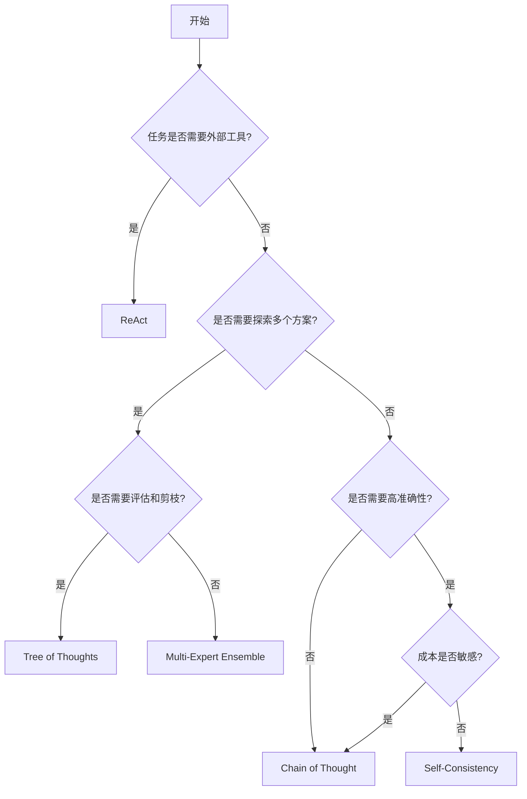

# Day 2: 高级提示技术

> **学习目标**  
> 掌握高级提示工程技术的原理、适用场景与工程使用边界，能够在数学推理、复杂决策、Agent 系统等场景中做出正确的技术选型。

---

## 📋 学习内容概览

本文档涵盖以下核心技术：

**Part 1: 推理增强技术**
- Chain-of-Thought (CoT) - 思维链提示
- Self-Consistency - 自一致性采样
- Step-Back Prompting - 抽象回退提示

**Part 2: 代理与搜索技术**
- ReAct - 推理与行动结合
- Tree of Thoughts (ToT) - 思维树框架
- Multi-Expert Ensemble - 多专家集成

---

## Part 1: 推理增强技术

### 1. Chain-of-Thought Prompting (思维链提示)

#### 1.1 技术定义

**Chain-of-Thought (CoT)** 是一种通过显式引导模型输出**中间推理步骤**，从而提高复杂任务（尤其是数学、逻辑推理）准确性的提示技术。

**核心思想**
> 不仅要求结果，还要求"推理过程"。将 `Input → Output` 转换为 `Input → Reasoning → Output`。

#### 1.2 核心变体

##### Zero-Shot CoT

**原理**: 利用"魔法咒语" `"Let's think step by step"` 触发模型的推理模式。

**示例**:
```markdown
问题: 一个商品原价 100 元，先打 8 折，再打 9 折，最终价格是多少？

Prompt: 
请一步一步思考并计算：
1. 计算第一次打折后的价格
2. 再计算第二次打折后的价格
3. 给出最终结果
```

**适用场景**: 没有样本可用的冷启动场景。

##### Few-Shot CoT

**原理**: 在 Prompt 中提供包含 `{问题} → {推理过程} → {答案}` 的示例。

**示例**:
```markdown
示例 1:
Q: 约翰有 5 个苹果，吃掉 2 个，又买了 3 个，他现在有几个？
推理: 
- 初始: 5 个
- 吃掉后: 5 - 2 = 3 个
- 买入后: 3 + 3 = 6 个
A: 6 个

示例 2:
Q: 一辆车以 60 km/h 的速度行驶 2 小时，行驶了多远？
推理:
- 速度: 60 km/h
- 时间: 2 h
- 距离 = 速度 × 时间 = 60 × 2 = 120 km
A: 120 km

现在请回答:
Q: [你的问题]
```

**适用场景**: 需要特定推理格式或高精度的场景。

#### 1.3 为什么 CoT 有效

**技术视角**

Transformer 模型本质是预测下一个 Token。对于复杂问题（如数学题），直接预测答案的概率分布极难拟合。CoT 将一个巨大的计算步骤拆解为多个小的、概率上更容易预测的步骤，从而降低错误率。

**优势**

- ✅ 显著提升推理深度
- ✅ 过程可解释
- ✅ 降低单步预测难度
- ✅ 减少早期错误的放大

**局限性**

- ❌ 输出更长 → 成本更高（Token 消耗增加）
- ❌ 推理过程**不一定真实**（可能是"合理但错误的解释"）
- ❌ 不适合简单问题或强结构化输出（如 JSON）

---

### 2. Self-Consistency (自一致性采样)

#### 2.1 技术定义

**Self-Consistency** 是一种通过**多次独立生成推理路径**，再对最终答案进行投票或聚合的技术。

**核心思想**
> 不相信一次推理结果，而相信"多数一致的结论"。

#### 2.2 运行机制

**基本流程**

```
同一问题
  ↓
多次采样（temperature: 0.7-1.0）
  ↓
生成 N 条 CoT 推理路径（N=5-10）
  ↓
答案聚合（多数投票/置信度加权）
  ↓
最终答案
```

**数学表达**

```
Final_Answer = argmax_a Σ I(Answer_i = a)
```

其中 `Answer_i` 是第 i 次生成的答案，`a` 是候选答案。

#### 2.3 实践示例

**场景**: 容易出错的概率题

```markdown
问题: 停车场有 10 辆车。如果是红色的概率是 20%，是丰田车的概率是 30%。
如果是红色且是丰田车的概率是 5%。请问一辆车既不是红色也不是丰田车的概率是多少？

操作步骤:
1. 设置 temperature = 0.7
2. 发送上述 Prompt **5 次**
3. 收集 5 个答案
4. 统计众数作为最终答案
```

**观察点**
- 单次错误率
- 多次一致性提升情况
- 是否能通过投票纠正偶发错误

#### 2.4 技术特点

**优势**

- ✅ 显著提高复杂推理的准确率
- ✅ 对单次偶发错误不敏感
- ✅ 鲁棒性极强

**劣势**

- ❌ **成本高昂**（需运行 N 次，计算量翻倍）
- ❌ 延迟增加（N 倍调用时间）

**适用条件**

- 有明确唯一答案
- 允许多次调用模型
- 对准确性要求高于成本

---

### 3. Step-Back Prompting (抽象回退提示)

#### 3.1 技术定义

**Step-Back Prompting** 指先让模型从具体问题中"后退一步"，提取**高层原则或通用模式**，再回到具体问题进行求解。

**核心思想**
> 先解决"这类问题怎么做"，再解决"这个问题怎么做"。

#### 3.2 实践示例

**基本形式**

```markdown
在解决问题前，请先总结解决这类问题的一般方法。
然后应用该方法解决具体问题。
```

**完整示例**

```markdown
问题: 如果不考虑空气阻力，从 100 米高空丢下一个 1kg 的铁球和一个 10kg 的铁球，
谁先落地？

Step-Back Prompt:
**Step 1 (抽象化)**:
在回答之前，请先简述这涉及什么物理原理？伽利略的比萨斜塔实验得出了什么结论？

**Step 2 (应用)**:
基于上述原理，回答原始问题。
```

#### 3.3 优势与局限

**优势**

- ✅ 减少对表面细节的过拟合
- ✅ 提高跨问题泛化能力
- ✅ 对长题目、复杂背景尤其有效
- ✅ 减少因陷入细节而导致的"只见树木不见森林"的错误

**局限性**

- ❌ 对简单问题收益有限
- ❌ 可能增加不必要的推理步骤
- ❌ 提示词结构复杂，需要精心设计

---

### 4. Part 1 技术对比矩阵

| 技术 | 成本 | 稳定性 | 复杂度支持 | 典型场景 | Prompt 关键词 |
|------|------|--------|------------|----------|---------------|
| **CoT** | ⭐⭐ | ⭐⭐⭐ | ⭐⭐⭐⭐ | 数学题、多步骤逻辑推理、代码生成 | "Let's think step by step" |
| **Self-Consistency** | ⭐⭐⭐⭐⭐ | ⭐⭐⭐⭐⭐ | ⭐⭐⭐⭐ | 易错的数学题、常识推理、模糊的分类任务 | (需配合程序化脚本多次调用) |
| **Step-Back** | ⭐⭐⭐ | ⭐⭐⭐⭐ | ⭐⭐⭐⭐ | 涉及特定科学定律、历史事实或复杂规则的问题 | "What are the underlying principles?" |

**效果对比**

| 技术 | 准确率 | 成本 | 稳定性 |
|------|--------|------|--------|
| 无 CoT | 低 | 低 | 不稳定 |
| CoT | 中–高 | 中 | 中 |
| CoT + Self-Consistency | 高 | 高 | 高 |

---

## Part 2: 代理与搜索技术

### 5. ReAct (Reasoning + Acting)

#### 5.1 技术定义

**ReAct** 是 **Re**asoning（推理）与 **Act**ing（行动）的组合。它不仅让模型生成推理轨迹，还允许模型生成特定的 Actions（如调用 API），并观察 Action 的执行结果。

**核心思想**
> 模型先思考下一步该做什么，再调用工具执行动作，并基于结果继续思考。

#### 5.2 架构循环 (The ReAct Loop)

```
Thought (思考)
  ↓
Action (调用工具)
  ↓
Observation (工具返回结果)
  ↓
Thought (基于新信息再思考)
  ↓
... (循环直到得出最终答案)
```

#### 5.3 Prompt 结构示例

```markdown
**Instruction**: 
Answer the following questions as best you can. You have access to the following tools:
- Google Search: Look up current information
- Calculator: Perform math calculations

**Format**:
Use the following format:
Question: the input question you must answer
Thought: you should always think about what to do
Action: the action to take, should be one of [Google Search, Calculator]
Action Input: the input to the action
Observation: the result of the action
... (this Thought/Action/Observation can repeat N times)
Thought: I now know the final answer
Final Answer: the final answer to the original input question

**Question**: 
现任微软 CEO 的年龄的 0.5 次方是多少？
```

**期望输出**:
```
Thought: 我需要先查找现任微软 CEO 是谁，以及他的年龄
Action: Google Search
Action Input: "现任微软 CEO 年龄"
Observation: Satya Nadella, 57 岁
Thought: 现在我知道年龄是 57，需要计算 57^0.5
Action: Calculator
Action Input: 57^0.5
Observation: 7.55
Thought: 我现在知道最终答案了
Final Answer: 7.55
```

#### 5.4 解决的问题

- ✅ 解决 LLM **知识截止 (Knowledge Cutoff)** 问题
- ✅ 解决 **无法与现实世界交互** 的问题
- ✅ 是构建 Agent 的基础范式

#### 5.5 适用场景

- 多步信息获取（搜索 → 汇总）
- 需要外部事实或计算
- 自动化 Agent / Workflow

#### 5.6 局限性

- ❌ Token 成本高
- ❌ 流程设计复杂
- ❌ 需防止无限循环（必须定义终止条件）
- ❌ 工具调用的可靠性依赖外部系统

---

### 6. Tree of Thoughts (ToT) - 思维树

#### 6.1 技术定义

**Tree of Thoughts (ToT)** 是一种将推理过程视为 **"多分支搜索树"** 的框架，而非单一线性思维链。

**核心思想**
> 同时探索多个可能的思路路径，并对中间状态进行评估和剪枝。

#### 6.2 对比 CoT

| 维度 | CoT | ToT |
|------|-----|-----|
| 推理结构 | 线性 | 树状 |
| 搜索空间 | 单路径 | 多路径 |
| 成本 | 较低 | 较高 |
| 适合问题 | 中等复杂 | 高复杂决策 |

#### 6.3 核心组件

1. **思维分解 (Decomposition)**: 将大问题拆解为小的思维步骤
2. **思维生成器 (Thought Generator)**: 对每一步生成多个可能的解决方案（分支）
3. **状态评估器 (State Evaluator)**: 评估每个分支的前景
4. **搜索算法 (Search Algorithm)**: 使用 BFS（广度优先）或 DFS（深度优先）策略遍历树

#### 6.4 抽象流程

```
当前状态
  ├─ 思路 A → 评估 (分数: 7/10)
  ├─ 思路 B → 评估 (分数: 9/10) ← 选择
  └─ 思路 C → 评估 (分数: 5/10)
        ↓
  选择最优分支继续扩展
        ↓
  思路 B 的子分支
    ├─ B1 → 评估
    ├─ B2 → 评估
    └─ B3 → 评估
```

#### 6.5 实践示例

**场景**: 制定营销活动方案

```markdown
**Step 1 (Generate)**: 
提出 3 个截然不同的营销主题思路。

**Step 2 (Evaluate)**: 
作为一位挑剔的投资人，分别列出这 3 个思路的潜在风险和预期回报，并打分 (0-10)。

**Step 3 (Select & Expand)**: 
抛弃分数最低的方案。保留前两名，并针对每一名，分别构思 2 个具体的执行渠道。

**Step 4 (Final Decision)**: 
综合对比，选出最终的最佳路径。
```

#### 6.6 适用场景

- 复杂决策（策略选择、规划）
- 多目标权衡问题
- 没有明显"唯一解"的任务
- 需要前瞻性规划或回溯的任务（如创意写作规划、数独解题）

#### 6.7 工程限制

- 通常需要状态评估函数
- 需要剪枝策略
- 实际系统中常为 **"弱 ToT（近似实现）"**

---

### 7. Multi-Expert Ensemble (多专家集成)

#### 7.1 技术定义

**MoE Prompting** 指通过让模型**扮演多个不同专家角色**，分别给出解答，再进行聚合或裁决。

> **注意**: 这里指的不是模型架构层面的 MoE，而是通过 Prompt 模拟的"专家会议"。

**核心思想**
> 不同视角可以抵消单一视角的系统性偏差。

#### 7.2 示例 Prompt

```markdown
请分别从以下角色回答问题：
1. **数学专家**: 从数学模型和统计学角度分析
2. **业务专家**: 从商业价值和市场角度分析
3. **风险控制专家**: 从风险管理和合规角度分析

问题: [你的问题]

最后请综合他们的观点，给出最终结论。
```

#### 7.3 流程

1. **角色分配**: 指定 Expert A（物理学家）、Expert B（经济学家）、Expert C（伦理学家）
2. **独立观点**: 各专家输出观点
3. **综合 (Synthesis)**: 总结并消除偏见，得出最优解

#### 7.4 聚合方式

- 人工规则（优先级）
- 多数投票
- Meta-LLM 总结裁决

#### 7.5 适用场景

- 高风险决策
- 跨领域问题
- 需要全面覆盖盲区的分析

#### 7.6 局限性

- ❌ 成本高（多个角色 = 更长的输出）
- ❌ 专家角色质量取决于 Prompt 设计
- ❌ 易产生冗余内容

---

## 8. 综合技术选型指南

### 8.1 技术选型决策树



### 8.2 场景映射表

| 场景 | 推荐技术 | 理由 |
|------|----------|------|
| 数学推理 | CoT + Self-Consistency | 需要步骤分解 + 高准确性 |
| 多步工具调用 | ReAct | 需要与外部系统交互 |
| 复杂决策/规划 | ToT | 需要探索多个方案并评估 |
| 高风险分析 | MoE | 需要多角度验证 |
| 成本受限 | CoT | 平衡效果与成本 |
| 需要抽象原则 | Step-Back | 避免陷入细节 |

### 8.3 成本效益对比

| 技术架构 | 复杂度 | Token 消耗/成本 | 延迟 | 准确性 |
|----------|--------|-----------------|------|--------|
| **Zero-Shot** | 低 | ⭐ | 极低 | 低 |
| **Few-Shot** | 中 | ⭐⭐ | 低 | 中 |
| **CoT** | 中高 | ⭐⭐⭐ | 中 | 中–高 |
| **Self-Consistency** | 中高 | ⭐⭐⭐⭐⭐ | 高 | 高 |
| **ReAct** | 高 | ⭐⭐⭐⭐ | 高 | 高 |
| **ToT** | 极高 | ⭐⭐⭐⭐⭐ | 极高 | 很高 |
| **MoE** | 高 | ⭐⭐⭐⭐ | 高 | 高 |

---

## 9. 构建个人 Prompt 模板库

### 9.1 模板库设计原则

- **可复用**: 参数化设计，避免硬编码
- **模块化**: 按功能分类组织
- **版本控制**: 记录迭代历史
- **文档化**: 每个模板包含使用说明

### 9.2 推荐目录结构

```
prompt-library/
├── 01_reasoning/
│   ├── chain_of_thought_basic.md
│   ├── zero_shot_cot.md
│   ├── few_shot_cot.md
│   └── step_back_prompting.md
├── 02_reliability/
│   ├── self_consistency_wrapper.py
│   └── multi_expert_ensemble.md
├── 03_agent/
│   ├── react_basic.md
│   ├── react_with_tools.md
│   └── tool_qa.md
├── 04_search/
│   ├── tree_of_thoughts_process.md
│   └── tot_evaluation_template.md
├── 05_domain/
│   ├── code_generation.md
│   ├── data_analysis.md
│   └── technical_writing.md
└── README.md
```

### 9.3 通用 Prompt 模板示例

```markdown
# 模板名称: [Template Name]

## 用途
[简要描述此模板的用途]

## 参数
- `{{role}}`: 角色定义
- `{{task}}`: 任务描述
- `{{context}}`: 上下文信息
- `{{format}}`: 输出格式

## 模板内容

【角色】
{{role}}

【任务】
{{task}}

【上下文】
{{context}}

【约束】
- 输出格式：{{format}}
- 不确定时请说明"信息不足"
- 保持客观和准确

【输出】

## 使用示例
[提供 1-2 个具体使用示例]

## 注意事项
[列出使用此模板时需要注意的事项]
```

### 9.4 ReAct Agent 模板示例

```markdown
# ReAct Agent Template

## 系统提示

你是一个可以思考和行动的智能代理。

**可用工具**:
- `Search(query)`: 搜索互联网信息
- `Calculator(expression)`: 执行数学计算
- `Database(sql)`: 查询数据库

**输出格式**:
严格按以下格式输出：

Thought: [你的思考过程]
Action: [工具名称]
Action Input: [工具输入]
Observation: [工具返回结果，由系统填充]
... (重复 Thought/Action/Observation 直到得出答案)
Thought: 我现在知道最终答案了
Final Answer: [最终答案]

**约束**:
- 每次只能调用一个工具
- 必须基于 Observation 进行下一步思考
- 最多执行 5 个 Action
- 如果无法解决，请说明原因

## 用户问题
{{user_question}}
```

---

## 10. 关键总结 (Key Takeaways)

### 核心认知

1. **CoT** 解决了模型"想不深"的问题 → 提升推理深度
2. **Self-Consistency** 解决了模型"发挥不稳定"的问题 → 提升鲁棒性
3. **Step-Back** 解决了模型"迷失在细节中"的问题 → 提升抽象能力
4. **ReAct** 是 **Agent 的基础形态** → 连接推理与行动
5. **ToT** 是 **搜索而非单次推理** → 探索解空间
6. **MoE** 提升的是 **视角覆盖率** → 减少盲区

### 工程原则

- ✅ **CoT 用于"展开推理空间"**
- ✅ **Self-Consistency 用于"在推理空间中做稳健选择"**
- ✅ **高级提示 ≠ 必须使用**（80% 问题不需要 ToT）
- ✅ **成本与效果需要权衡**
- ✅ **模板化是提高效率的关键**

### 技术演进路径

```
Zero-Shot → Few-Shot → CoT → Self-Consistency
                              ↓
                         Step-Back
                              ↓
                          ReAct (Agent)
                              ↓
                         ToT (搜索)
```

---

## 11. 下一步学习建议

### 进阶方向

1. **Agent 架构设计**
   - 工具安全性 (Tool Safety)
   - 错误处理与重试机制
   - 状态管理

2. **Prompt 工程化**
   - Prompt 版本控制
   - A/B 测试框架
   - 自动化评估

3. **高级技术组合**
   - CoT + RAG
   - ReAct + 工具调用
   - ToT + Self-Consistency

### 实践项目建议

- [ ] 构建一个 ReAct 风格的问答 Agent
- [ ] 实现 Self-Consistency 的自动化脚本
- [ ] 创建个人 Prompt 模板库
- [ ] 对比不同技术在实际任务中的效果

---

## 📚 参考资源

### 学术论文

- [Chain-of-Thought Prompting Elicits Reasoning in Large Language Models](https://arxiv.org/abs/2201.11903)
- [Self-Consistency Improves Chain of Thought Reasoning](https://arxiv.org/abs/2203.11171)
- [ReAct: Synergizing Reasoning and Acting in Language Models](https://arxiv.org/abs/2210.03629)
- [Tree of Thoughts: Deliberate Problem Solving with Large Language Models](https://arxiv.org/abs/2305.10601)

### 工具与框架

- [LangChain](https://github.com/langchain-ai/langchain) - Agent 框架
- [DSPy](https://github.com/stanfordnlp/dspy) - Prompt 优化框架
- [Guidance](https://github.com/guidance-ai/guidance) - 结构化输出控制

---

**学习完成！🎉**

你现在已经掌握了高级提示工程的核心技术。下一步，我们将学习如何将这些技术应用到实际的 Agentic AI 系统中。
