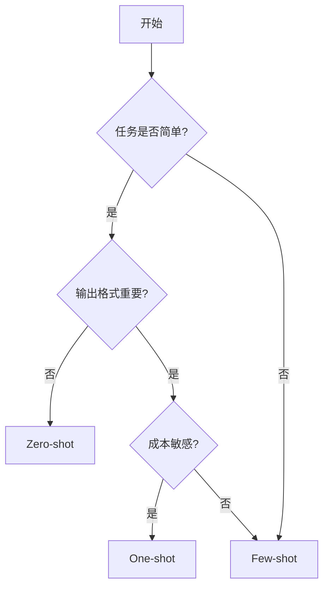

# Day 1: LLM 基础与 Prompt Engineering 入门

> **学习目标**  
> 在一天内建立对 LLM 工作原理、Prompt Engineering 核心概念以及常见提示技术的工程级理解，并能够在实际任务中正确选择与应用。

---

## 📅 学习计划概览

- **上午任务 (2小时)**: LLM 基础理论与配置参数
- **下午任务 (1.5小时)**: 提示技术实践
- **晚上任务 (0.5小时)**: 总结与场景映射

---

## 🌅 上午任务：LLM 基础理论

### 1. LLM 的基本工作原理

#### 1.1 Transformer 架构概览

**核心理念**  
LLM（大语言模型）通常基于 **Transformer** 架构，这是一种专为序列数据设计的深度学习架构。

**主要组件**

```
┌─────────────────────────────────┐
│   Token Embedding Layer        │  ← 将文本转换为向量
├─────────────────────────────────┤
│   Multi-Head Self-Attention    │  ← 计算 token 间关系
├─────────────────────────────────┤
│   Feed-Forward Network          │  ← 非线性变换
├─────────────────────────────────┤
│   Layer Normalization           │  ← 稳定训练
└─────────────────────────────────┘
```

**架构特点**

| 特性 | 说明 | 优势 |
|------|------|------|
| 并行计算 | 不依赖顺序处理 | 训练速度快 |
| 注意力机制 | 动态建模 token 关系 | 长距离依赖建模 |
| 可扩展性 | 支持大规模预训练 | 涌现能力 |

> 💡 **核心洞察**  
> Transformer 的革命性在于：**通过注意力机制建模 token 之间的关系，而非顺序依赖**，这使得模型能够并行处理并捕获长距离语义关联。

---

#### 1.2 Token：最小处理单元

**什么是 Token？**

LLM 不直接处理"词"或"句子"，而是将文本分解为 **token**（最小处理单元）。

**Token 的类型**

- **子词 (Subword)**: `"playing"` → `["play", "ing"]`
- **字符片段**: `"AI"` → `["A", "I"]` 或 `["AI"]`
- **特殊符号**: `<BOS>`, `<EOS>`, `<PAD>`

**实际示例**

```python
# 使用 tiktoken (OpenAI 的 tokenizer)
import tiktoken

encoder = tiktoken.get_encoding("cl100k_base")
text = "I love AI!"

tokens = encoder.encode(text)
print(tokens)  # [40, 3021, 15592, 0]

# 解码回文本
decoded = encoder.decode(tokens)
print(decoded)  # "I love AI!"
```

**为什么重要？**

- **成本计算**: API 按 token 计费
- **上下文限制**: 模型有 token 窗口限制（如 GPT-4: 8K/32K/128K）
- **性能优化**: 减少 token 数量可降低延迟

---

#### 1.3 注意力机制 (Attention Mechanism)

**核心作用**

在生成下一个 token 时，**动态计算历史 token 的重要性权重**。

**工作原理（简化版）**

```
输入序列: ["The", "cat", "sat", "on", "the", "mat"]
                                              ↑
                                         当前位置

注意力权重分布:
The  → 0.05
cat  → 0.35  ← 高权重（主语）
sat  → 0.10
on   → 0.05
the  → 0.40  ← 高权重（指代关系）
mat  → 0.05
```

**实际效果**

- ✅ 模型能"关注"关键信息（如主语、宾语）
- ✅ 长上下文中仍可保持关联（如代词指代）
- ✅ 支持多头注意力（Multi-Head），捕获不同类型的关系

**技术细节**

```python
# 简化的注意力计算公式
Attention(Q, K, V) = softmax(Q·K^T / √d_k) · V

# Q: Query（查询）
# K: Key（键）
# V: Value（值）
# d_k: 缩放因子
```

---

### 2. Prompt Engineering vs Context Engineering

#### 2.1 核心概念对比

| 维度 | Prompt Engineering | Context Engineering |
|------|-------------------|---------------------|
| **控制对象** | 行为 | 信息 |
| **解决问题** | 怎么答 | 基于什么答 |
| **对幻觉影响** | 间接（约束输出格式） | 直接（提供事实依据） |
| **工程位置** | 指令层 | 数据层 |
| **典型技术** | Few-shot, CoT | RAG, 工具调用 |

---

#### 2.2 Prompt Engineering

**关注点**: 模型**如何回答**

**解决的问题**

- 行为约束（如：不使用被动语态）
- 输出结构（如：JSON 格式）
- 语气与风格（如：专业/友好）

**技术示例**

```markdown
❌ 弱 Prompt:
"分析这个数据"

✅ 强 Prompt:
**Role**: Senior Data Analyst
**Task**: Analyze Q3 sales data
**Output Format**: 
{
  "trend": "string",
  "top_products": ["array"],
  "recommendations": ["array"]
}
**Constraints**: Use only data provided, no assumptions.
```

---

#### 2.3 Context Engineering

**关注点**: 模型**基于什么信息回答**

**解决的问题**

- 减少幻觉（Hallucination）
- 提供事实依据
- 实时信息注入

**常见方式**

1. **文档注入**
   ```
   Context: """
   [公司内部文档内容]
   """
   Question: 我们的退货政策是什么？
   ```

2. **RAG (Retrieval-Augmented Generation)**
   ```
   检索相关文档 → 注入 Context → LLM 生成答案
   ```

3. **工具/API 输出回灌**
   ```python
   # 1. LLM 生成 SQL
   sql = llm.generate("查询上月销售额")
   
   # 2. 执行查询
   result = database.execute(sql)
   
   # 3. 回灌结果
   answer = llm.generate(f"基于数据 {result}，总结销售情况")
   ```

---

### 3. 基本配置参数 (Generation Settings)

#### 3.1 Temperature (温度)

**作用**: 控制输出的随机性/创造性

**数值范围**: 0.0 ~ 2.0（通常使用 0.0 ~ 1.0）

**推荐理解**

| 温度值 | 特性 | 适用场景 |
|--------|------|----------|
| 0.0 ~ 0.3 | 确定性强、可复现 | 代码生成、数据提取 |
| 0.4 ~ 0.7 | 平衡 | 通用对话、问答 |
| 0.8 ~ 1.0+ | 创造性高、多样性 | 创意写作、头脑风暴 |

**技术原理**

```python
# 温度调整 logits（未归一化的概率）
adjusted_logits = original_logits / temperature

# temperature ↓ → 概率分布更尖锐（确定性↑）
# temperature ↑ → 概率分布更平坦（随机性↑）
```

---

#### 3.2 Top-K Sampling

**作用**: 仅从概率最高的 K 个 token 中采样

**示例**

```
原始概率分布:
token_1: 0.40
token_2: 0.30
token_3: 0.15
token_4: 0.10
token_5: 0.05

Top-K=2 → 仅从 [token_1, token_2] 中采样
```

**优势**

- ✅ 限制低质量 token
- ✅ 提高输出稳定性

**劣势**

- ❌ 固定 K 值不适应动态场景

---

#### 3.3 Top-P (Nucleus Sampling)

**作用**: 从累计概率 ≥ P 的 token 集合中采样

**示例**

```
Top-P=0.9

累计概率:
token_1: 0.40 → 累计 0.40
token_2: 0.30 → 累计 0.70
token_3: 0.15 → 累计 0.85
token_4: 0.10 → 累计 0.95 ← 超过 0.9，停止

采样范围: [token_1, token_2, token_3, token_4]
```

**特点**

- ✅ 自适应（高确定性时选择少，低确定性时选择多）
- ✅ 当前主流推荐（OpenAI 默认使用）

---

#### 3.4 Token Limits

**控制内容**

- **Max Tokens**: 最大输出长度
- **Context Window**: 输入+输出总长度限制

**实际影响**

| 参数 | 影响 | 最佳实践 |
|------|------|----------|
| 输出长度 | 成本、延迟 | 设置合理上限（如摘要任务：200 tokens） |
| 上下文窗口 | 信息完整性 | 监控 token 使用率，避免截断 |

**成本计算示例**

```python
# GPT-4 定价（示例）
input_cost = 0.03 / 1000  # $0.03 per 1K tokens
output_cost = 0.06 / 1000  # $0.06 per 1K tokens

# 单次请求成本
input_tokens = 500
output_tokens = 200

total_cost = (input_tokens * input_cost) + (output_tokens * output_cost)
# = (500 * 0.00003) + (200 * 0.00006)
# = $0.027
```

---

## 🌤️ 下午任务：提示技术实践

### 4. Zero-shot Prompting (零样本)

#### 定义

**不提供任何示例**，仅通过指令描述任务。

#### 技术示例

```markdown
请将以下文本分类为：正面、负面、中性。

文本: "这个产品质量一般，价格偏高。"
```

#### 适用场景

| 场景类型 | 说明 |
|----------|------|
| ✅ 简单任务 | 情感分类、关键词提取 |
| ✅ 语义明确 | 指令无歧义 |
| ✅ 通用能力 | 模型预训练已覆盖 |

#### 优势与劣势

**优势**

- 成本最低（token 消耗少）
- 速度最快
- 适合探索阶段

**劣势**

- 输出格式不稳定
- 复杂任务表现差

---

### 5. One-shot Prompting (单样本)

#### 定义

提供 **1 个示例** 作为参考。

#### 技术示例

```markdown
示例:
输入: "今天下雨了。"
输出: {"weather": "rainy", "sentiment": "neutral"}

请按相同格式处理:
输入: "阳光明媚,心情愉悦。"
```

#### 适用场景

| 场景类型 | 说明 |
|----------|------|
| ✅ 格式对齐 | 需要特定 JSON/XML 结构 |
| ✅ 模式稳定 | 输入输出关系明确 |
| ✅ 成本敏感 | 比 Few-shot 更经济 |

#### 工程实践

```python
# 模板化 One-shot Prompt
TEMPLATE = """
Example:
Input: {example_input}
Output: {example_output}

Now process:
Input: {user_input}
"""

prompt = TEMPLATE.format(
    example_input="Cancel my order #12345",
    example_output='{"action": "cancel_order", "order_id": "12345"}',
    user_input="Refund order #67890"
)
```

---

### 6. Few-shot Prompting (少样本)

#### 定义

提供 **多个示例（通常 2-5 个）**。

#### 技术示例

```markdown
示例 1:
Q: 苹果是什么?
A: 水果

示例 2:
Q: 汽车是什么?
A: 交通工具

示例 3:
Q: Python 是什么?
A: 编程语言

请回答:
Q: Docker 是什么?
```

#### 适用场景

| 场景类型 | 说明 |
|----------|------|
| ✅ 复杂模式 | 需要学习输入输出映射 |
| ✅ 分类任务 | 多类别分类 |
| ✅ 风格统一 | 保持输出一致性 |

#### 示例数量选择策略

```
任务复杂度 → 示例数量
├─ 简单格式转换: 1-2 个
├─ 多类别分类: 每类 1-2 个
├─ 复杂推理: 3-5 个
└─ 边界情况: 包含异常示例
```

#### 工程最佳实践

```python
# 动态 Few-shot 示例选择（基于相似度）
from sklearn.metrics.pairwise import cosine_similarity

def select_examples(user_query, example_pool, k=3):
    """选择与用户查询最相似的 k 个示例"""
    similarities = cosine_similarity(
        [embed(user_query)],
        [embed(ex['query']) for ex in example_pool]
    )[0]
    
    top_k_indices = similarities.argsort()[-k:][::-1]
    return [example_pool[i] for i in top_k_indices]
```

---

## 🌙 晚上任务：总结与场景映射

### 7. 提示技术适用场景总结

#### 对比矩阵

| 技术 | 成本 | 稳定性 | 复杂度支持 | 典型场景 |
|------|------|--------|------------|----------|
| **Zero-shot** | ⭐ | ⭐⭐ | ⭐ | 简单分类、通用问答 |
| **One-shot** | ⭐⭐ | ⭐⭐⭐ | ⭐⭐ | 格式化输出、API 调用 |
| **Few-shot** | ⭐⭐⭐ | ⭐⭐⭐⭐⭐ | ⭐⭐⭐⭐ | 复杂分类、风格迁移 |

#### 决策树



---

### 8. 常见故障模式与修正策略

#### 故障模式表

| 故障模式 | 表现特征 | 技术归因 | 修正策略 |
|----------|----------|----------|----------|
| **模糊指令** | 输出随机性高 | Logits 分布过于平坦 | 引入 Few-shot 示例 |
| **负向约束陷阱** | 频繁违反"禁止"指令 | 注意力机制关注出现的 token | 改为正向指令 |
| **上下文过载** | 关键信息被忽略 | "Lost in the Middle" 现象 | 核心指令置于开头/结尾 |
| **工具幻觉** | 调用不存在的 API | 过度拟合工具模式 | 提供严格的 API Schema |

#### 实战案例：负向约束陷阱

```markdown
❌ 错误示例:
"不要使用被动语态，不要超过 100 字。"

✅ 正确示例:
"请使用主动语态，控制在 100 字以内。"
```

---

## 🎯 关键认知总结 (Key Takeaways)

### 核心原则

1. **LLM 的本质**: Token 级概率预测模型
2. **工程分离**: Prompt 决定行为，Context 决定事实
3. **参数理解**: 控制的是"输出行为"，不是模型能力
4. **示例权衡**: 数量越多越稳定，但成本越高
5. **工程优先级**:
   - 明确指令（动词具体化）
   - 结构化输出（JSON/XML）
   - 最小可用示例集（成本优化）

---

### 技术债务警示

> ⚠️ **常见反模式**
> 
> - 过度依赖高 temperature（应优先优化 Prompt）
> - 忽略 token 成本（应监控并优化）
> - 缺少输出验证（应实现 Schema 校验）

---

## 📚 进阶学习路径

### 下一步建议

#### 1. Prompt 模板化

```python
# 将 Prompt 抽象为可复用模板
class PromptTemplate:
    def __init__(self, template: str):
        self.template = template
    
    def format(self, **kwargs) -> str:
        return self.template.format(**kwargs)

# 使用示例
sql_template = PromptTemplate("""
Schema: {schema}
Task: {task}
Output: SQL query only
""")

prompt = sql_template.format(
    schema="users(id, name, email)",
    task="Find all users registered in 2024"
)
```

#### 2. 引入 Context Engineering

```python
# RAG 基础实现
def rag_query(question: str):
    # 1. 检索相关文档
    docs = vector_db.search(question, top_k=3)
    
    # 2. 构建 Context
    context = "\n".join([doc.content for doc in docs])
    
    # 3. 生成答案
    prompt = f"""
    Context: {context}
    
    Question: {question}
    
    Answer based only on the context above.
    """
    
    return llm.generate(prompt)
```

#### 3. 多步 Prompt (Chain-of-Thought)

```markdown
Let's solve this step by step:

1. **Understand the problem**: [问题分析]
2. **Identify key information**: [关键信息提取]
3. **Apply reasoning**: [推理过程]
4. **Verify the answer**: [验证]
5. **Final answer**: [最终答案]
```

#### 4. Prompt 评审与测试机制

```python
# 自动化 Prompt 测试
test_cases = [
    {"input": "...", "expected_output": "..."},
    {"input": "...", "expected_output": "..."},
]

def evaluate_prompt(prompt_template, test_cases):
    results = []
    for case in test_cases:
        output = llm.generate(prompt_template.format(**case['input']))
        score = similarity(output, case['expected_output'])
        results.append(score)
    
    return sum(results) / len(results)
```

---

## 🔗 参考资源

### 推荐阅读

- [OpenAI Prompt Engineering Guide](https://platform.openai.com/docs/guides/prompt-engineering)
- [Anthropic Prompt Engineering Tutorial](https://docs.anthropic.com/claude/docs/prompt-engineering)
- [Weak vs. Perfect Prompt: Python Example](https://www.youtube.com/shorts/mUxWL9748BE)

### 工具推荐

- **Tokenizer**: [tiktoken](https://github.com/openai/tiktoken)
- **Prompt 管理**: [LangChain](https://github.com/langchain-ai/langchain)
- **测试框架**: [PromptFoo](https://github.com/promptfoo/promptfoo)

---

## ✅ 今日学习检查清单

- [ ] 理解 Transformer 架构的核心组件
- [ ] 掌握 Token 的概念及其对成本的影响
- [ ] 区分 Prompt Engineering 与 Context Engineering
- [ ] 熟悉 temperature, top-K, top-P 参数的作用
- [ ] 实践 Zero-shot, One-shot, Few-shot 提示技术
- [ ] 能够根据任务选择合适的提示策略
- [ ] 识别并修正常见的 Prompt 反模式

---

**恭喜完成 Day 1 学习！🎉**

明天我们将深入学习：
- Chain-of-Thought (CoT) 推理
- ReAct 模式
- 工具调用 (Function Calling)
- Agent 架构基础
