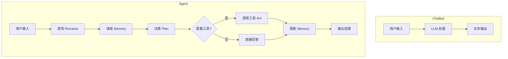
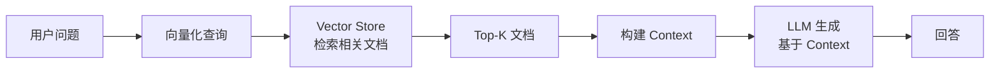
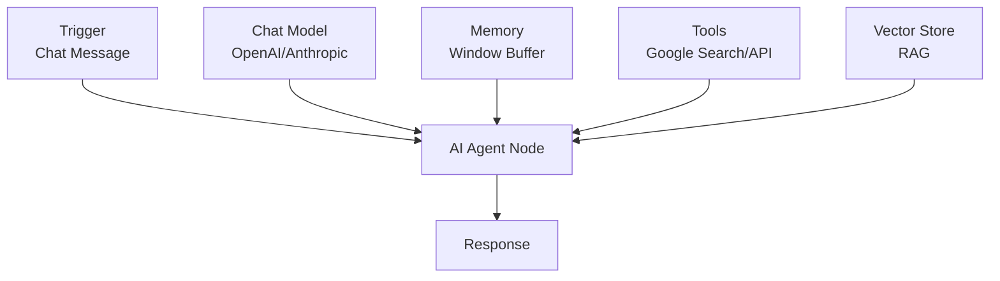
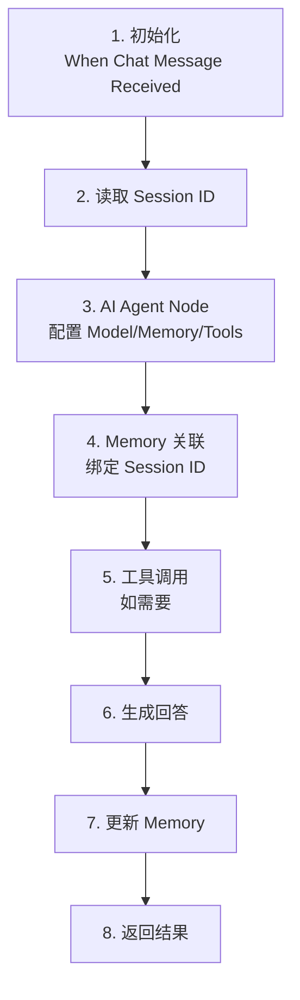
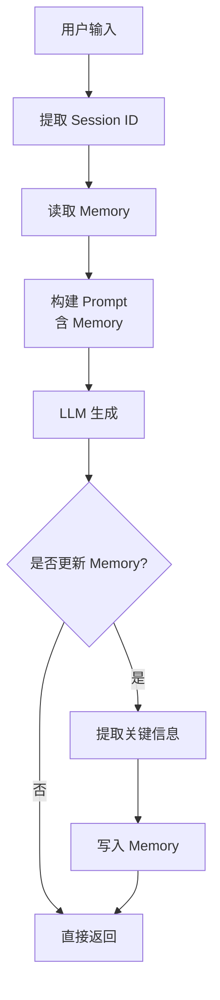

# AI Agent 定义与 Memory：从无状态对话到自适应智能体

## 目录

1. [引言：关键转折点](#1-引言关键转折点)
2. [AI Agent 核心定义](#2-ai-agent-核心定义)
3. [Agent Memory 系统](#3-agent-memory-系统)
4. [RAG 检索增强生成](#4-rag-检索增强生成)
5. [Vector Store 向量数据库](#5-vector-store-向量数据库)
6. [n8n 中的 Agent 实现](#6-n8n-中的-agent-实现)
7. [Memory 系统实践](#7-memory-系统实践)
8. [Vector Store 选型](#8-vector-store-选型)
9. [最佳实践](#9-最佳实践)
10. [进阶方向](#10-进阶方向)

---

## 1. 引言：关键转折点

### 1.1 学习目标


> **"会编排 Workflow 的 AI" → "会持续记忆、可演化的 AI Agent"**

核心不是"能跑一个 Agent",而是**真正理解 Agent 为什么需要 Memory,以及 Memory、RAG、Vector Store 之间的结构关系**。

### 1.2 四个核心问题

1. **什么才是真正的 AI Agent**
2. **Memory 在 Agent 中扮演什么角色**
3. **RAG 与 Memory 的边界和协作关系**
4. **Vector Store 为什么是 Agent 的基础设施**

### 1.3 技术价值

- **持久性**: 赋予 AI 持久性(Memory)
- **知识增强**: 外部知识库(RAG)
- **自适应**: 从"健忘"的对话框到能够自我进化的智能系统
- **工程化**: 理解生产级 Agent 的架构设计

---

## 2. AI Agent 核心定义

### 2.1 从系统角度定义 AI Agent

一个完整的 AI Agent 至少具备以下能力:

| 能力 | 说明 | 技术实现 |
|------|------|----------|
| **目标(Goal)** | 知道自己要完成什么 | System Prompt, Task Definition |
| **感知(Perceive)** | 接收用户输入/环境信息 | Input Processing, Context Understanding |
| **决策(Plan)** | 推理下一步行动 | LLM Reasoning, ReAct, Plan-and-Execute |
| **行动(Act)** | 调用工具/执行操作 | Tool Calling, API Integration |
| **记忆(Memory)** | 保留长期或短期信息 | Memory System, State Management |

### 2.2 Chatbot vs Agent



**关键区别**:

| 维度 | Chatbot | Agent |
|------|---------|-------|
| **状态** | 无状态 | 有状态 |
| **对话模式** | 一次性对话 | 可持续演化 |
| **工具使用** | 不能 | 能够调用工具 |
| **记忆能力** | 无记忆 | 有记忆系统 |
| **决策能力** | 简单响应 | 复杂规划 |
| **自主性** | 被动 | 主动 |

### 2.3 Agent 的配置维度

在工程实现中,Agent 的"配置"通常包含:

```typescript
interface AgentConfig {
  systemPrompt: string;           // 角色与边界
  tools: Tool[];                  // Tool / Action 列表
  memoryStrategy: MemoryConfig;   // Memory 策略
  ragDataSource?: RAGConfig;      // RAG 数据源
  decisionMode: 'ReAct' | 'PlanAndExecute';  // 决策方式
  model: ModelConfig;             // LLM 配置
}

interface Tool {
  name: string;
  description: string;
  parameters: ParameterSchema;
  execute: (params: any) => Promise<any>;
}
```

**在 n8n 中的体现**:

- **配置核心**: 模型选择(Model)、提示词策略(Prompt Strategy)、工具集(Tools)
- **自主性**: Agent 会根据用户的意图,决定是直接回答,还是先去调用工具获取信息

---

## 3. Agent Memory 系统

### 3.1 为什么 Agent 需要 Memory

**没有 Memory 的 Agent**:

- ❌ 每次都是"失忆状态"
- ❌ 无法理解上下文演进
- ❌ 无法个性化或长期优化
- ❌ 无法基于历史改进决策

**Memory 让 Agent 能够**:

- ✅ 记住用户偏好
- ✅ 记住历史决策
- ✅ 基于过去经验改进行为
- ✅ 提供个性化服务
- ✅ 跨会话保持连贯性

### 3.2 Memory 的分类

#### 按时间维度分类

| 类型 | 作用 | 存储内容 | 生命周期 |
|------|------|----------|----------|
| **Short-term Memory** | 当前对话上下文 | 最近几轮对话 | 单次会话 |
| **Long-term Memory** | 跨会话知识与偏好 | 用户偏好、关键信息 | 持久化 |
| **Episodic Memory** | 关键事件记录 | 重要交互历史 | 长期 |
| **Semantic Memory** | 抽象后的知识 | 提炼的概念和规则 | 长期 |

#### n8n 中的 Memory 类型

| Memory 类型 | 说明 | 适用场景 |
|-------------|------|----------|
| **Window Buffer Memory** | 保留最近几轮的对话 | 短时上下文,单次会话 |
| **Motorhead Memory** | 外部数据库存储 | 跨会话长效记忆 |
| **Redis Memory** | Redis 存储 | 高性能,分布式场景 |
| **In-Memory Store** | 内存存储 | 快速原型,临时数据 |

### 3.3 Memory 的工程现实

> **大多数 Agent = Short-term + Long-term Memory 的组合。**

```typescript
interface MemorySystem {
  shortTerm: {
    type: 'WindowBuffer';
    windowSize: number;  // 保留最近 N 轮对话
    messages: Message[];
  };
  longTerm: {
    type: 'Database' | 'Redis' | 'VectorStore';
    storage: StorageBackend;
    indexBy: 'userId' | 'sessionId';
  };
}
```

### 3.4 Memory 的成本考虑

**Token 消耗**:

- Memory 节点会消耗 Token
- 每一轮对话都会将历史记录重新发给 LLM
- 在长对话中,合理设置 `Window Size`(如只保留最近 5 轮)是平衡成本与表现的关键

**优化策略**:

```typescript
// 策略 1: 限制窗口大小
const memoryConfig = {
  windowSize: 5,  // 只保留最近 5 轮
  maxTokens: 2000  // 限制总 token 数
};

// 策略 2: 摘要化历史
const summarizeHistory = async (messages: Message[]) => {
  if (messages.length > 10) {
    const summary = await llm.summarize(messages.slice(0, -5));
    return [summary, ...messages.slice(-5)];
  }
  return messages;
};

// 策略 3: 选择性记忆
const shouldStore = (message: Message) => {
  return message.containsPreference || 
         message.containsDecision || 
         message.isImportant;
};
```

---

## 4. RAG 检索增强生成

### 4.1 RAG 的本质

RAG 的目标是:

> **让模型"查资料再回答",而不是"凭记忆编"。**



### 4.2 RAG ≠ Memory

RAG 更像是:

- **外部知识增强**: 提供事实依据
- **可更新、可替换的数据源**: 知识库可以独立更新
- **静态知识**: 不会因为对话而改变

### 4.3 RAG vs Memory 的边界

| 维度 | RAG | Memory |
|------|-----|--------|
| **是否长期** | 否(数据源) | 是(状态) |
| **是否个性化** | 弱 | 强 |
| **是否写入** | 通常不写 | 会写 |
| **主要作用** | 提供事实 | 提供上下文 |
| **更新频率** | 批量更新 | 实时更新 |
| **数据来源** | 外部文档 | 对话历史 |

**结论**:

> **RAG 是 Agent 的"知识外挂",Memory 是 Agent 的"大脑延续"。**

### 4.4 RAG 在 Agent 中的作用

```typescript
// RAG 增强的 Agent
interface RAGAgent extends Agent {
  knowledgeBase: VectorStore;
  
  async answer(question: string): Promise<string> {
    // 1. 检索相关文档
    const docs = await this.knowledgeBase.search(question, topK: 3);
    
    // 2. 读取 Memory
    const memory = await this.memory.load();
    
    // 3. 构建 Prompt
    const prompt = `
      用户问题: ${question}
      
      相关资料:
      ${docs.map(d => d.content).join('\n\n')}
      
      历史对话:
      ${memory}
      
      请基于以上资料和历史对话回答问题。
    `;
    
    // 4. LLM 生成
    return await this.llm.generate(prompt);
  }
}
```

**RAG 是 Agent 的"大脑图书馆"**: 没有 RAG 的 Agent 只是在空谈,有了向量库,它才真正具备了处理专业领域问题的能力。

---

## 5. Vector Store 向量数据库

### 5.1 什么是 Vector Store

Vector Store 是用于:

- **存储 embedding 向量**: 将文本转换为数学向量
- **支持相似度检索**: 基于向量距离查找相似内容
- **支撑 RAG 与 Memory 的基础设施**: 语义搜索的基础

```typescript
interface VectorStore {
  // 添加文档
  addDocuments(docs: Document[]): Promise<void>;
  
  // 相似度搜索
  similaritySearch(query: string, k: number): Promise<Document[]>;
  
  // 删除文档
  delete(ids: string[]): Promise<void>;
  
  // 更新文档
  update(id: string, doc: Document): Promise<void>;
}

interface Document {
  id: string;
  content: string;
  metadata: Record<string, any>;
  embedding?: number[];  // 向量表示
}
```

### 5.2 为什么不能只用数据库

**传统 DB**:

- ❌ 精确匹配
- ❌ 不支持语义相似度
- ❌ 无法理解"苹果"和"iPhone"的关系
- ❌ 关键词搜索,容易遗漏

**Vector Store**:

- ✅ 语义检索
- ✅ 模糊匹配
- ✅ 非结构化数据友好
- ✅ 理解概念相似性

**示例对比**:

```typescript
// 传统数据库查询
SELECT * FROM documents 
WHERE content LIKE '%苹果%';
// 只能找到包含"苹果"字样的文档

// Vector Store 查询
vectorStore.similaritySearch("苹果");
// 可以找到:
// - "iPhone 13 Pro"
// - "Mac Studio"
// - "Apple Watch"
// - "水果店"
```

### 5.3 Embedding 向量化

```typescript
// Embedding 过程
const text = "人工智能正在改变世界";

// 1. 文本 → 向量
const embedding = await embeddingModel.embed(text);
// embedding: [0.123, -0.456, 0.789, ..., 0.234]  // 1536 维向量

// 2. 存储到 Vector Store
await vectorStore.add({
  id: "doc1",
  content: text,
  embedding: embedding
});

// 3. 查询
const query = "AI 的影响";
const queryEmbedding = await embeddingModel.embed(query);
const results = await vectorStore.search(queryEmbedding, topK: 3);
```

---

## 6. n8n 中的 Agent 实现

### 6.1 n8n 中 Agent 的架构

在 n8n 中,Agent 通常由以下组件组合而成:



**n8n 本身负责**:

- 流程编排
- 状态管理
- 工具执行
- 数据传递

### 6.2 AI Agent 节点配置

一个完整的 n8n AI Agent 工作流通常包含四个关键的子组件连接到 Agent 节点:

```typescript
interface N8NAgentConfig {
  // 1. Chat Model
  model: {
    provider: 'OpenAI' | 'Anthropic' | 'Ollama';
    modelName: string;
    temperature: number;
  };
  
  // 2. Memory
  memory: {
    type: 'WindowBuffer' | 'Motorhead' | 'Redis';
    sessionId: string;  // 关键!
    windowSize?: number;
  };
  
  // 3. Tools
  tools: Array<{
    name: string;
    description: string;
    node: string;  // n8n 节点引用
  }>;
  
  // 4. System Prompt
  systemMessage: string;
}
```

### 6.3 实现步骤



**关键配置点**:

1. **初始化**: 使用 `When Chat Message Received` 作为触发器
2. **记忆关联**: 在 Agent 节点的 Memory 选项中指定 `Session ID`,确保不同用户的记忆不混淆
3. **Prompt 设定**: 在 System Message 中定义 Agent 的性格和记忆使用规则

**System Message 示例**:

```
你是一个专业的技术顾问助手。

重要规则:
1. 你必须参考之前的对话内容来回答
2. 记住用户的偏好和背景信息
3. 如果用户之前提到过相关信息,要主动引用
4. 保持对话的连贯性和个性化

当前用户信息会在对话历史中提供。
```

---

## 7. Memory 系统实践

### 7.1 最小可用 Memory (MVP)

最简单的 Memory 方案:

```typescript
// 数据结构
interface UserMemory {
  userId: string;
  memory: string;  // 摘要化的信息
  lastUpdated: Date;
}

// 示例
const memory: UserMemory = {
  userId: "123",
  memory: "用户偏好技术类回答,偏好简洁。是一名前端工程师,关注 React 和 TypeScript。",
  lastUpdated: new Date()
};
```

**存储方式**:

- 使用数据库 / KV Store
- 以 userId 作为 key
- 存储摘要化对话信息

### 7.2 Memory 写入与读取时机

**工程关键点**:

> **不是所有对话都写 Memory**

**只记录**:

- ✅ 偏好
- ✅ 决策结果
- ✅ 关键信息
- ❌ 普通闲聊
- ❌ 重复信息

**原则**:

> **Memory 要"少而精",不是日志。**

```typescript
// Memory 更新策略
const shouldUpdateMemory = (message: Message): boolean => {
  // 检查是否包含关键信息
  const keywords = ['偏好', '喜欢', '不喜欢', '需要', '目标'];
  const containsKeyInfo = keywords.some(k => message.content.includes(k));
  
  // 检查是否是重要决策
  const isDecision = message.type === 'decision';
  
  // 检查是否是新信息
  const isNewInfo = !existingMemory.includes(message.summary);
  
  return containsKeyInfo || isDecision || isNewInfo;
};
```

### 7.3 构建带记忆的对话 Agent

#### 基础流程



#### 实现示例

```typescript
// 完整的 Memory Agent 实现
class MemoryAgent {
  private llm: LLM;
  private memoryStore: MemoryStore;
  
  async chat(userId: string, message: string): Promise<string> {
    // 1. 读取 Memory
    const memory = await this.memoryStore.load(userId);
    
    // 2. 构建 Prompt
    const prompt = `
      用户记忆:
      ${memory}
      
      当前对话:
      用户: ${message}
      
      请基于用户记忆回答,并在回答中体现你对用户的了解。
    `;
    
    // 3. LLM 生成
    const response = await this.llm.generate(prompt);
    
    // 4. 判断是否更新 Memory
    if (this.shouldUpdateMemory(message, response)) {
      const newInfo = await this.extractKeyInfo(message, response);
      await this.memoryStore.update(userId, newInfo);
    }
    
    return response;
  }
  
  private async extractKeyInfo(message: string, response: string): Promise<string> {
    const extractPrompt = `
      从以下对话中提取需要记住的关键信息:
      
      用户: ${message}
      助手: ${response}
      
      只提取偏好、决策、重要背景信息。用一句话概括。
    `;
    
    return await this.llm.generate(extractPrompt);
  }
}
```

### 7.4 实践案例：个性化调研助理

**场景**: 用户分多次告知自己的职业、兴趣和需求

**对话示例**:

```
第 1 轮:
用户: 我是一名前端工程师
Agent: 了解了,你是前端工程师。有什么我可以帮助你的吗?
[Memory 更新: "用户是前端工程师"]

第 2 轮:
用户: 我最近在学习 TypeScript
Agent: 很好!TypeScript 对前端工程师来说是很重要的技能。
[Memory 更新: "用户是前端工程师,正在学习 TypeScript"]

第 3 轮:
用户: 有什么好的学习资源推荐吗?
Agent: 基于你刚才提到的工程师背景和 TypeScript 学习需求,我建议...
[使用 Memory 提供个性化建议]
```

**技术点**: 通过 `Session ID` 将 Webhook 传入的标识与内存节点绑定

**Session ID 的重要性**: 在 n8n 生产环境中,必须通过前端传递唯一的 `Session ID`,否则 Agent 会把所有用户的对话混在一起,造成隐私泄露。

---

## 8. Vector Store 选型

### 8.1 常见 Vector Store 对比

| 方案 | 特点 | 适用场景 | 优点 | 缺点 |
|------|------|----------|------|------|
| **FAISS** | 本地、高性能 | 原型开发,本地部署 | 速度快,免费 | 需要自己管理 |
| **Chroma** | 简单、适合原型 | 快速原型,小规模 | 易用,开源 | 扩展性有限 |
| **Pinecone** | 云托管、易用 | 生产环境,大规模数据 | 全托管,速度极快,支持高度扩展 | 免费额度有限 |
| **Weaviate** | 功能全面 | 企业级应用 | 功能强大,可扩展 | 配置复杂 |
| **PGVector** | 与 Postgres 集成 | 已有数据库用户 | 直接在 PostgreSQL 中存储向量,方便管理 | 需要 SQL 基础 |
| **Supabase (pgvector)** | PostgreSQL + 向量 | 全栈应用 | 数据库+向量一体化 | 性能不如专用向量库 |
| **Qdrant** | 开源、高性能 | 开源优先,本地部署 | 数据隐私性高,适合敏感信息 | 需要自行维护服务器 |
| **In-Memory Store** | n8n 内置 | 快速原型,小数据集 | 零配置,直接在 n8n 内部运行 | 工作流重启后数据丢失,不支持持久化 |

### 8.2 选型建议(工程视角)

```typescript
interface VectorStoreSelection {
  scenario: string;
  recommendation: string;
  reason: string;
}

const selections: VectorStoreSelection[] = [
  {
    scenario: '原型/学习',
    recommendation: 'Chroma / FAISS / In-Memory',
    reason: '快速上手,零成本,适合实验'
  },
  {
    scenario: '内部工具',
    recommendation: 'PGVector / Supabase',
    reason: '与现有数据库集成,统一管理'
  },
  {
    scenario: '生产环境',
    recommendation: 'Pinecone / Weaviate',
    reason: '稳定可靠,性能优秀,专业支持'
  },
  {
    scenario: '数据敏感',
    recommendation: 'Chroma / Qdrant (自托管)',
    reason: '完全控制,数据不出本地'
  },
  {
    scenario: '大规模',
    recommendation: 'Pinecone / Weaviate',
    reason: '支持水平扩展,高并发'
  }
];
```

### 8.3 n8n 集成示例

```typescript
// Pinecone 集成示例
const pineconeConfig = {
  apiKey: process.env.PINECONE_API_KEY,
  environment: 'us-west1-gcp',
  indexName: 'my-knowledge-base'
};

// 添加文档
await pinecone.upsert({
  vectors: [
    {
      id: 'doc1',
      values: embedding,
      metadata: {
        text: 'document content',
        source: 'manual'
      }
    }
  ]
});

// 查询
const results = await pinecone.query({
  vector: queryEmbedding,
  topK: 3,
  includeMetadata: true
});
```

---

## 9. 最佳实践

### 9.1 核心原则

#### 原则 1: Agent 的本质是"有记忆的执行体"

```
Agent = LLM + Memory + Tools + Orchestration
```

#### 原则 2: Memory ≠ RAG,两者协作而非替代

```
Memory: 个性化上下文,会话状态
RAG: 外部知识,事实依据
```

#### 原则 3: Vector Store 是 Agent 的基础设施

```
没有 Vector Store → 无法实现高效 RAG
没有 RAG → Agent 只能"空谈"
```

#### 原则 4: 好的 Memory 策略决定 Agent 上限

```
Memory 设计 = 性能 + 成本 + 用户体验 的平衡
```

#### 原则 5: Agent 工程 = Prompt + Memory + Tools + Flow

```
系统设计 > 单点优化
```

### 9.2 Memory 设计模式

```typescript
// 模式 1: 分层 Memory
interface LayeredMemory {
  immediate: Message[];      // 最近 3 轮
  session: Summary;          // 本次会话摘要
  longTerm: UserProfile;     // 长期用户画像
}

// 模式 2: 选择性 Memory
const memoryFilter = {
  storePreferences: true,
  storeDecisions: true,
  storeSmallTalk: false,
  storeSensitiveInfo: false
};

// 模式 3: 摘要化 Memory
const summarizeOldMessages = async (messages: Message[]) => {
  if (messages.length > 20) {
    const oldMessages = messages.slice(0, -10);
    const summary = await llm.summarize(oldMessages);
    return [summary, ...messages.slice(-10)];
  }
  return messages;
};
```

### 9.3 性能优化

```typescript
// 1. Token 优化
const optimizeMemory = {
  windowSize: 5,           // 限制窗口
  maxTokens: 2000,         // 限制总量
  summarizeThreshold: 10   // 超过阈值摘要化
};

// 2. 缓存策略
const cache = new Map<string, Embedding>();
const getEmbedding = async (text: string) => {
  if (cache.has(text)) {
    return cache.get(text);
  }
  const embedding = await embeddingModel.embed(text);
  cache.set(text, embedding);
  return embedding;
};

// 3. 批量处理
const batchSize = 100;
const batches = chunkArray(documents, batchSize);
for (const batch of batches) {
  await vectorStore.addDocuments(batch);
}
```

---

## 10. 进阶方向

### 10.1 下一步学习

你现在已经具备:

- ✅ Agent 的完整概念模型
- ✅ Memory / RAG / Vector Store 的边界认知
- ✅ 在 n8n 中实现"有状态 Agent"的基础能力

**自然演进方向**:

- 多 Tool Agent
- 长期 Memory 策略
- Agent 行为优化
- Custom Tools 开发

### 10.2 高级 Agent 模式

```typescript
// 1. Multi-Tool Agent
interface MultiToolAgent {
  tools: {
    search: GoogleSearchTool;
    database: DatabaseTool;
    api: CustomAPITool;
    calculator: CalculatorTool;
  };
  
  async execute(task: string): Promise<Result> {
    const plan = await this.plan(task);
    for (const step of plan) {
      const tool = this.selectTool(step);
      await tool.execute(step.params);
    }
  }
}

// 2. Hierarchical Agent
interface HierarchicalAgent {
  coordinator: Agent;
  specialists: {
    research: ResearchAgent;
    writing: WritingAgent;
    coding: CodingAgent;
  };
}

// 3. Self-Improving Agent
interface SelfImprovingAgent extends Agent {
  feedback: FeedbackSystem;
  
  async learn(interaction: Interaction): Promise<void> {
    const feedback = await this.feedback.evaluate(interaction);
    if (feedback.shouldUpdate) {
      await this.updateStrategy(feedback);
    }
  }
}
```

### 10.3 实战项目方向

```typescript
interface AdvancedProject {
  name: string;
  complexity: 'medium' | 'high' | 'expert';
  technologies: string[];
}

const projects: AdvancedProject[] = [
  {
    name: '个性化学习助手',
    complexity: 'medium',
    technologies: ['Memory', 'RAG', 'Progress Tracking']
  },
  {
    name: '企业知识库问答',
    complexity: 'high',
    technologies: ['Vector Store', 'RAG', 'Multi-Source']
  },
  {
    name: '自主研究 Agent',
    complexity: 'expert',
    technologies: ['Multi-Tool', 'Planning', 'Self-Reflection']
  }
];
```

---

## 参考资源

### 官方文档

- n8n AI Agents: https://docs.n8n.io/integrations/builtin/cluster-nodes/root-nodes/n8n-nodes-langchain.agent/
- LangChain Memory: https://python.langchain.com/docs/modules/memory/
- Vector Databases: https://www.pinecone.io/learn/vector-database/

### 学习资源

- n8n AI Workflows: https://n8n.io/workflows/ai/
- LangChain Documentation: https://python.langchain.com/
- Pinecone Documentation: https://docs.pinecone.io/

---

## 总结

**核心收获**:

1. ✅ Agent 的本质是"有记忆的执行体"
2. ✅ Memory ≠ RAG,两者协作而非替代
3. ✅ Vector Store 是 Agent 的基础设施
4. ✅ 好的 Memory 策略决定 Agent 上限
5. ✅ Agent 工程 = Prompt + Memory + Tools + Flow

**关键转变**:

从"线性自动化"到"自适应智能体",你已经跨越了关键门槛。通过赋予 AI 持久性(Memory)和外部知识库(RAG),Agent 不再是一个"健忘"的对话框,而是一个能够自我进化的智能系统。

准备好开发 Custom Tools,让你的 AI 能够操作你自己的数据库或 API,执行真正的"动作"了吗? 🚀
