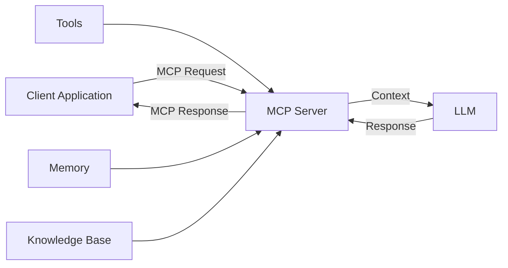
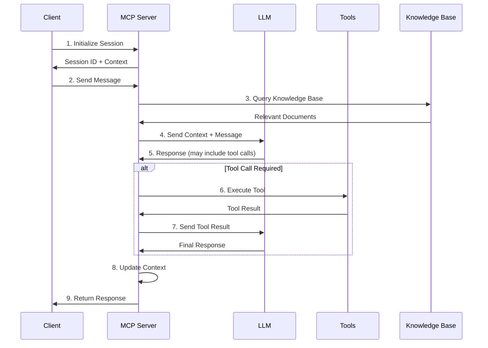
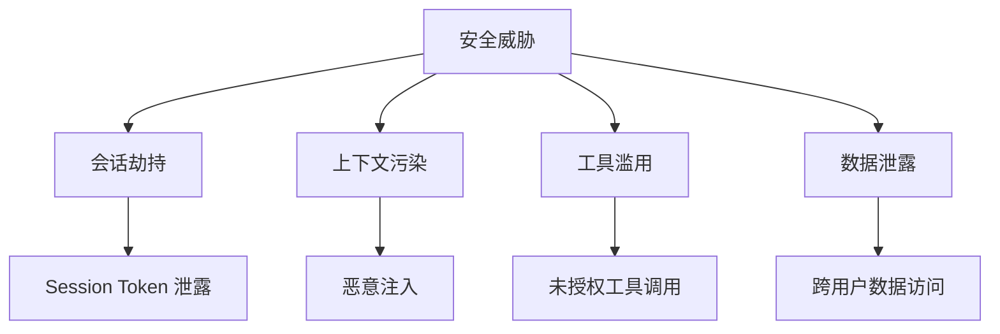
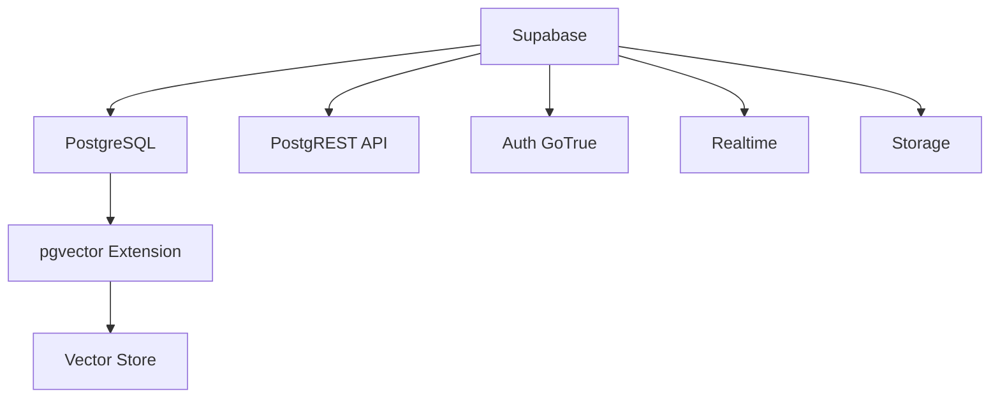
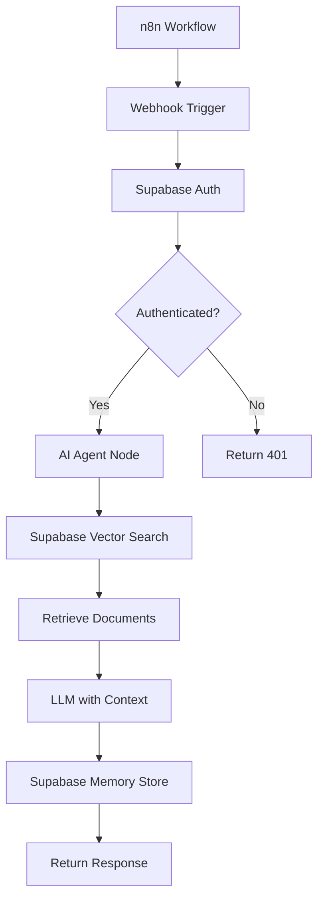
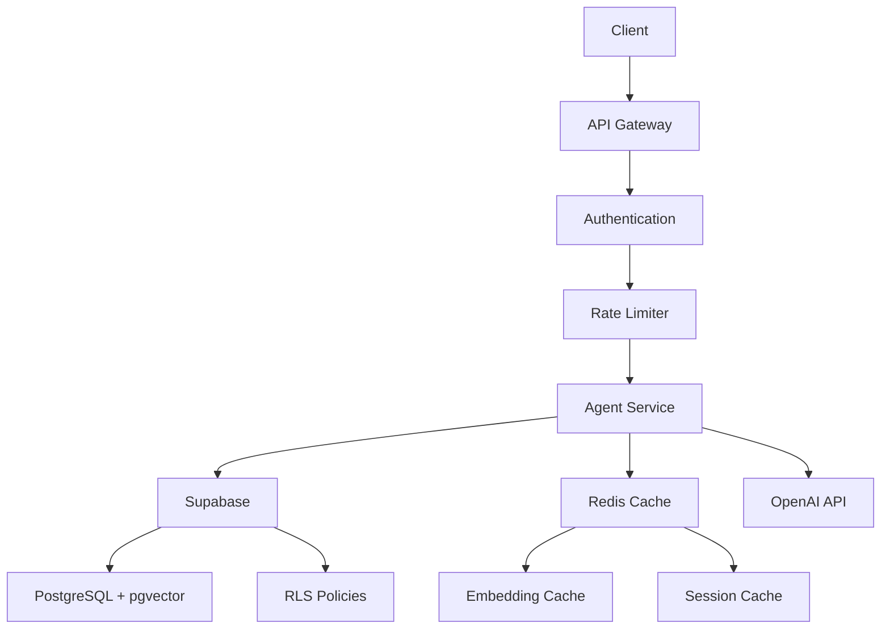

# MCP 集成与 Supabase：构建可扩展的 AI Agent 基础设施

## 目录

1. [引言](#1-引言)
2. [Model Context Protocol (MCP) 基础](#2-model-context-protocol-mcp-基础)
3. [MCP 交互序列](#3-mcp-交互序列)
4. [MCP 安全实践](#4-mcp-安全实践)
5. [Supabase 基础](#5-supabase-基础)
6. [行级安全 (RLS)](#6-行级安全-rls)
7. [向量相似性搜索](#7-向量相似性搜索)
8. [Supabase 作为 Vector Store](#8-supabase-作为-vector-store)
9. [Supabase + n8n 集成](#9-supabase--n8n-集成)
10. [最佳实践](#10-最佳实践)

---

## 1. 引言

### 1.1 学习目标

> **从单机 Agent 到生产级分布式 AI 系统**

本章重点：
- 理解 MCP 协议如何标准化 AI 上下文交互
- 掌握 Supabase 作为 Vector Store 的配置
- 实现安全的多租户 Agent 系统
- 构建可扩展的 RAG 架构

### 1.2 为什么需要 MCP 和 Supabase

**问题场景**：

```typescript
// 没有标准协议的困境
const agent1 = new OpenAIAgent({ context: openAIFormat });
const agent2 = new AnthropicAgent({ context: anthropicFormat });
const agent3 = new CustomAgent({ context: customFormat });
// 每个 Agent 都有自己的上下文格式 ❌
```

**MCP 解决方案**：

```typescript
// 统一的上下文协议
const agent1 = new Agent({ contextProtocol: MCP });
const agent2 = new Agent({ contextProtocol: MCP });
// 所有 Agent 使用相同的上下文标准 ✅
```

**Supabase 价值**：

- ✅ PostgreSQL + pgvector 一体化
- ✅ 内置认证和行级安全
- ✅ 实时订阅功能
- ✅ 开源且可自托管

---

## 2. Model Context Protocol (MCP) 基础

### 2.1 什么是 MCP

MCP (Model Context Protocol) 是一个**标准化协议**，用于：

- 定义 AI 模型与外部系统的上下文交互
- 统一不同 LLM 提供商的接口
- 规范化工具调用和结果返回
- 管理会话状态和上下文传递



### 2.2 MCP 核心概念

#### 2.2.1 上下文 (Context)

```typescript
interface MCPContext {
  // 会话标识
  sessionId: string;
  
  // 用户信息
  user: {
    id: string;
    metadata?: Record<string, any>;
  };
  
  // 对话历史
  messages: Message[];
  
  // 系统状态
  state?: Record<string, any>;
  
  // 可用工具
  tools?: Tool[];
  
  // 知识库引用
  knowledgeBase?: {
    type: string;
    config: Record<string, any>;
  };
}
```

#### 2.2.2 消息格式

```typescript
interface MCPMessage {
  role: 'system' | 'user' | 'assistant' | 'tool';
  content: string | ContentBlock[];
  metadata?: {
    timestamp: string;
    toolCalls?: ToolCall[];
    citations?: Citation[];
  };
}

interface ContentBlock {
  type: 'text' | 'image' | 'tool_result';
  data: any;
}
```

#### 2.2.3 工具定义

```typescript
interface MCPTool {
  name: string;
  description: string;
  parameters: {
    type: 'object';
    properties: Record<string, ParameterSchema>;
    required?: string[];
  };
  execute: (params: any) => Promise<ToolResult>;
}

interface ToolResult {
  success: boolean;
  data?: any;
  error?: string;
  metadata?: Record<string, any>;
}
```

### 2.3 MCP vs 传统 API

| 维度 | 传统 API | MCP |
|------|---------|-----|
| **标准化** | 各家不同 | 统一协议 |
| **上下文管理** | 手动管理 | 协议内置 |
| **工具调用** | 自定义格式 | 标准化 |
| **状态管理** | 需自行实现 | 内置支持 |
| **互操作性** | 低 | 高 |

---

## 3. MCP 交互序列

### 3.1 完整交互流程



### 3.2 会话初始化

```typescript
// 1. 客户端请求
const initRequest: MCPInitRequest = {
  userId: 'user123',
  metadata: {
    platform: 'web',
    language: 'zh-CN'
  }
};

// 2. 服务器响应
const initResponse: MCPInitResponse = {
  sessionId: 'session_abc123',
  context: {
    user: { id: 'user123' },
    messages: [],
    state: {},
    availableTools: ['search', 'calculator']
  },
  expiresAt: '2026-01-23T00:00:00Z'
};
```

### 3.3 消息交互

```typescript
// 客户端发送消息
const messageRequest: MCPMessageRequest = {
  sessionId: 'session_abc123',
  message: {
    role: 'user',
    content: '帮我搜索最新的 AI 新闻'
  }
};

// 服务器处理流程
async function handleMessage(request: MCPMessageRequest): Promise<MCPMessageResponse> {
  // 1. 加载上下文
  const context = await loadContext(request.sessionId);
  
  // 2. RAG 检索
  const relevantDocs = await knowledgeBase.search(request.message.content);
  
  // 3. 构建 LLM Prompt
  const prompt = buildPrompt({
    context,
    message: request.message,
    documents: relevantDocs
  });
  
  // 4. LLM 推理
  const llmResponse = await llm.generate(prompt);
  
  // 5. 工具调用（如需要）
  if (llmResponse.toolCalls) {
    const toolResults = await executeTools(llmResponse.toolCalls);
    const finalResponse = await llm.generate({
      ...prompt,
      toolResults
    });
    
    // 6. 更新上下文
    await updateContext(request.sessionId, {
      messages: [...context.messages, request.message, finalResponse],
      state: { lastToolUsed: toolResults[0].toolName }
    });
    
    return {
      message: finalResponse,
      metadata: {
        toolsUsed: toolResults.map(r => r.toolName),
        citations: relevantDocs.map(d => d.source)
      }
    };
  }
  
  // 7. 直接返回
  await updateContext(request.sessionId, {
    messages: [...context.messages, request.message, llmResponse]
  });
  
  return { message: llmResponse };
}
```

### 3.4 工具调用序列

```typescript
// LLM 决定调用工具
const toolCall: ToolCall = {
  id: 'call_123',
  name: 'search',
  parameters: {
    query: '最新 AI 新闻',
    limit: 5
  }
};

// 执行工具
async function executeTool(call: ToolCall): Promise<ToolResult> {
  const tool = tools.find(t => t.name === call.name);
  
  try {
    const result = await tool.execute(call.parameters);
    return {
      id: call.id,
      success: true,
      data: result,
      metadata: {
        executionTime: Date.now(),
        toolName: call.name
      }
    };
  } catch (error) {
    return {
      id: call.id,
      success: false,
      error: error.message
    };
  }
}
```

---

## 4. MCP 安全实践

### 4.1 安全威胁模型



### 4.2 核心安全措施

#### 4.2.1 会话认证

```typescript
interface SecureSession {
  sessionId: string;
  userId: string;
  token: string;  // JWT Token
  expiresAt: Date;
  permissions: Permission[];
}

// 验证会话
async function validateSession(sessionId: string, token: string): Promise<boolean> {
  try {
    // 1. 验证 JWT
    const payload = jwt.verify(token, process.env.JWT_SECRET);
    
    // 2. 检查会话是否存在
    const session = await sessionStore.get(sessionId);
    if (!session) return false;
    
    // 3. 检查是否过期
    if (session.expiresAt < new Date()) {
      await sessionStore.delete(sessionId);
      return false;
    }
    
    // 4. 验证用户匹配
    return session.userId === payload.userId;
  } catch (error) {
    return false;
  }
}
```

#### 4.2.2 上下文隔离

```typescript
// 确保用户只能访问自己的上下文
async function loadContext(sessionId: string, userId: string): Promise<MCPContext> {
  const session = await sessionStore.get(sessionId);
  
  // 验证所有权
  if (session.userId !== userId) {
    throw new Error('Unauthorized: Session does not belong to user');
  }
  
  return session.context;
}

// 数据库层面的隔离
const query = `
  SELECT * FROM sessions 
  WHERE session_id = $1 AND user_id = $2
`;
```

#### 4.2.3 工具权限控制

```typescript
interface ToolPermission {
  toolName: string;
  allowedRoles: string[];
  rateLimit?: {
    maxCalls: number;
    windowMs: number;
  };
}

// 检查工具权限
async function checkToolPermission(
  userId: string, 
  toolName: string
): Promise<boolean> {
  const user = await getUser(userId);
  const toolConfig = toolPermissions.find(t => t.toolName === toolName);
  
  if (!toolConfig) return false;
  
  // 1. 角色检查
  if (!toolConfig.allowedRoles.includes(user.role)) {
    return false;
  }
  
  // 2. 速率限制
  if (toolConfig.rateLimit) {
    const callCount = await rateLimiter.getCount(userId, toolName);
    if (callCount >= toolConfig.rateLimit.maxCalls) {
      return false;
    }
  }
  
  return true;
}
```

#### 4.2.4 输入验证

```typescript
// 防止 Prompt Injection
function sanitizeInput(input: string): string {
  // 1. 移除潜在的系统指令
  const systemPatterns = [
    /ignore previous instructions/gi,
    /system:/gi,
    /\[SYSTEM\]/gi
  ];
  
  let sanitized = input;
  systemPatterns.forEach(pattern => {
    sanitized = sanitized.replace(pattern, '');
  });
  
  // 2. 限制长度
  const maxLength = 10000;
  if (sanitized.length > maxLength) {
    sanitized = sanitized.substring(0, maxLength);
  }
  
  return sanitized;
}

// 参数验证
function validateToolParameters(
  toolName: string, 
  params: any
): boolean {
  const tool = tools.find(t => t.name === toolName);
  if (!tool) return false;
  
  // 使用 JSON Schema 验证
  const valid = ajv.validate(tool.parameters, params);
  return valid;
}
```

### 4.3 安全配置示例

```typescript
const securityConfig = {
  // 会话配置
  session: {
    tokenExpiry: 3600,  // 1 小时
    maxConcurrentSessions: 5,
    requireRefresh: true
  },
  
  // 速率限制
  rateLimit: {
    global: {
      maxRequests: 100,
      windowMs: 60000  // 1 分钟
    },
    perUser: {
      maxRequests: 50,
      windowMs: 60000
    }
  },
  
  // 工具安全
  tools: {
    requireExplicitPermission: true,
    logAllCalls: true,
    sandboxExecution: true
  },
  
  // 数据安全
  data: {
    encryptAtRest: true,
    encryptInTransit: true,
    enableAuditLog: true
  }
};
```

---

## 5. Supabase 基础

### 5.1 什么是 Supabase

Supabase 是一个**开源的 Firebase 替代方案**，基于：

- **PostgreSQL**: 强大的关系型数据库
- **PostgREST**: 自动生成 RESTful API
- **GoTrue**: 用户认证
- **Realtime**: WebSocket 实时订阅
- **Storage**: 文件存储
- **pgvector**: 向量扩展



### 5.2 核心优势

| 特性 | 说明 | AI Agent 价值 |
|------|------|---------------|
| **PostgreSQL** | 成熟的关系型数据库 | 可靠的数据存储 |
| **pgvector** | 向量扩展 | 原生向量搜索 |
| **RLS** | 行级安全 | 多租户隔离 |
| **实时订阅** | WebSocket 支持 | 实时 Agent 交互 |
| **开源** | 可自托管 | 数据主权 |

### 5.3 快速开始

```typescript
// 1. 安装
npm install @supabase/supabase-js

// 2. 初始化
import { createClient } from '@supabase/supabase-js';

const supabase = createClient(
  'https://your-project.supabase.co',
  'your-anon-key'
);

// 3. 基础操作
// 插入数据
const { data, error } = await supabase
  .from('messages')
  .insert({
    user_id: 'user123',
    content: 'Hello, Agent!',
    created_at: new Date()
  });

// 查询数据
const { data: messages } = await supabase
  .from('messages')
  .select('*')
  .eq('user_id', 'user123')
  .order('created_at', { ascending: false })
  .limit(10);

// 实时订阅
const channel = supabase
  .channel('messages')
  .on('postgres_changes', 
    { event: 'INSERT', schema: 'public', table: 'messages' },
    (payload) => {
      console.log('New message:', payload.new);
    }
  )
  .subscribe();
```

---

## 6. 行级安全 (RLS)

### 6.1 什么是 RLS

Row Level Security (RLS) 是 PostgreSQL 的安全特性，允许在**数据库层面**控制用户对行的访问权限。

```sql
-- 没有 RLS 的问题
SELECT * FROM messages;
-- 返回所有用户的消息 ❌

-- 有 RLS 的效果
SELECT * FROM messages;
-- 只返回当前用户的消息 ✅
```

### 6.2 为什么 Agent 需要 RLS

**场景**: 多用户 Agent 系统

```typescript
// 没有 RLS - 需要手动过滤
const messages = await db.query(`
  SELECT * FROM messages 
  WHERE user_id = $1
`, [userId]);
// 容易出错，可能泄露数据 ❌

// 有 RLS - 数据库自动过滤
const messages = await supabase
  .from('messages')
  .select('*');
// 数据库保证只返回当前用户数据 ✅
```

### 6.3 RLS 策略配置

#### 6.3.1 启用 RLS

```sql
-- 1. 创建表
CREATE TABLE messages (
  id UUID PRIMARY KEY DEFAULT uuid_generate_v4(),
  user_id UUID NOT NULL REFERENCES auth.users(id),
  content TEXT NOT NULL,
  created_at TIMESTAMP WITH TIME ZONE DEFAULT NOW()
);

-- 2. 启用 RLS
ALTER TABLE messages ENABLE ROW LEVEL SECURITY;

-- 3. 创建策略
-- 用户只能查看自己的消息
CREATE POLICY "Users can view own messages"
  ON messages
  FOR SELECT
  USING (auth.uid() = user_id);

-- 用户只能插入自己的消息
CREATE POLICY "Users can insert own messages"
  ON messages
  FOR INSERT
  WITH CHECK (auth.uid() = user_id);

-- 用户只能更新自己的消息
CREATE POLICY "Users can update own messages"
  ON messages
  FOR UPDATE
  USING (auth.uid() = user_id);

-- 用户只能删除自己的消息
CREATE POLICY "Users can delete own messages"
  ON messages
  FOR DELETE
  USING (auth.uid() = user_id);
```

#### 6.3.2 复杂策略示例

```sql
-- Agent 会话表
CREATE TABLE agent_sessions (
  id UUID PRIMARY KEY DEFAULT uuid_generate_v4(),
  user_id UUID NOT NULL REFERENCES auth.users(id),
  session_data JSONB,
  created_at TIMESTAMP WITH TIME ZONE DEFAULT NOW(),
  expires_at TIMESTAMP WITH TIME ZONE,
  is_active BOOLEAN DEFAULT true
);

ALTER TABLE agent_sessions ENABLE ROW LEVEL SECURITY;

-- 策略 1: 用户只能访问自己的活跃会话
CREATE POLICY "Users can view own active sessions"
  ON agent_sessions
  FOR SELECT
  USING (
    auth.uid() = user_id 
    AND is_active = true 
    AND expires_at > NOW()
  );

-- 策略 2: 管理员可以查看所有会话
CREATE POLICY "Admins can view all sessions"
  ON agent_sessions
  FOR SELECT
  USING (
    EXISTS (
      SELECT 1 FROM user_roles
      WHERE user_id = auth.uid() AND role = 'admin'
    )
  );
```

### 6.4 RLS 在 Agent 中的应用

```typescript
// Agent Memory 表结构
interface AgentMemory {
  id: string;
  user_id: string;
  session_id: string;
  memory_type: 'short_term' | 'long_term';
  content: string;
  metadata: Record<string, any>;
  created_at: Date;
}

// SQL 定义
const createMemoryTable = `
  CREATE TABLE agent_memory (
    id UUID PRIMARY KEY DEFAULT uuid_generate_v4(),
    user_id UUID NOT NULL REFERENCES auth.users(id),
    session_id TEXT NOT NULL,
    memory_type TEXT NOT NULL CHECK (memory_type IN ('short_term', 'long_term')),
    content TEXT NOT NULL,
    metadata JSONB DEFAULT '{}',
    created_at TIMESTAMP WITH TIME ZONE DEFAULT NOW()
  );

  ALTER TABLE agent_memory ENABLE ROW LEVEL SECURITY;

  -- RLS 策略
  CREATE POLICY "Users can manage own memory"
    ON agent_memory
    FOR ALL
    USING (auth.uid() = user_id)
    WITH CHECK (auth.uid() = user_id);
`;

// 应用层使用
class SupabaseMemoryStore {
  async saveMemory(sessionId: string, content: string, type: string) {
    // RLS 自动确保只能写入当前用户的数据
    const { data, error } = await supabase
      .from('agent_memory')
      .insert({
        session_id: sessionId,
        memory_type: type,
        content: content
      });
    
    return data;
  }
  
  async loadMemory(sessionId: string) {
    // RLS 自动过滤，只返回当前用户的数据
    const { data } = await supabase
      .from('agent_memory')
      .select('*')
      .eq('session_id', sessionId)
      .order('created_at', { ascending: false });
    
    return data;
  }
}
```

---

## 7. 向量相似性搜索

### 7.1 pgvector 扩展

```sql
-- 1. 启用 pgvector 扩展
CREATE EXTENSION IF NOT EXISTS vector;

-- 2. 创建向量表
CREATE TABLE documents (
  id UUID PRIMARY KEY DEFAULT uuid_generate_v4(),
  user_id UUID REFERENCES auth.users(id),
  content TEXT NOT NULL,
  embedding vector(1536),  -- OpenAI embedding 维度
  metadata JSONB DEFAULT '{}',
  created_at TIMESTAMP WITH TIME ZONE DEFAULT NOW()
);

-- 3. 创建向量索引（提升查询性能）
CREATE INDEX ON documents 
USING ivfflat (embedding vector_cosine_ops)
WITH (lists = 100);
```

### 7.2 相似度搜索方法

```sql
-- 余弦相似度 (Cosine Similarity)
SELECT 
  id, 
  content,
  1 - (embedding <=> '[0.1, 0.2, ...]'::vector) AS similarity
FROM documents
ORDER BY embedding <=> '[0.1, 0.2, ...]'::vector
LIMIT 5;

-- 欧氏距离 (L2 Distance)
SELECT 
  id, 
  content,
  embedding <-> '[0.1, 0.2, ...]'::vector AS distance
FROM documents
ORDER BY embedding <-> '[0.1, 0.2, ...]'::vector
LIMIT 5;

-- 内积 (Inner Product)
SELECT 
  id, 
  content,
  (embedding <#> '[0.1, 0.2, ...]'::vector) * -1 AS score
FROM documents
ORDER BY embedding <#> '[0.1, 0.2, ...]'::vector
LIMIT 5;
```

### 7.3 向量操作符

| 操作符 | 说明 | 用途 |
|--------|------|------|
| `<->` | L2 距离 | 欧氏距离 |
| `<#>` | 内积 | 点积相似度 |
| `<=>` | 余弦距离 | 余弦相似度 |

### 7.4 实现 RAG 检索

```typescript
import { createClient } from '@supabase/supabase-js';
import OpenAI from 'openai';

const supabase = createClient(SUPABASE_URL, SUPABASE_KEY);
const openai = new OpenAI({ apiKey: OPENAI_API_KEY });

class SupabaseRAG {
  // 添加文档
  async addDocument(content: string, metadata: Record<string, any> = {}) {
    // 1. 生成 embedding
    const embeddingResponse = await openai.embeddings.create({
      model: 'text-embedding-3-small',
      input: content
    });
    
    const embedding = embeddingResponse.data[0].embedding;
    
    // 2. 存储到 Supabase
    const { data, error } = await supabase
      .from('documents')
      .insert({
        content,
        embedding,
        metadata
      });
    
    if (error) throw error;
    return data;
  }
  
  // 相似度搜索
  async search(query: string, topK: number = 5) {
    // 1. 查询向量化
    const embeddingResponse = await openai.embeddings.create({
      model: 'text-embedding-3-small',
      input: query
    });
    
    const queryEmbedding = embeddingResponse.data[0].embedding;
    
    // 2. 向量搜索
    const { data, error } = await supabase.rpc('match_documents', {
      query_embedding: queryEmbedding,
      match_threshold: 0.7,
      match_count: topK
    });
    
    if (error) throw error;
    return data;
  }
}

// 创建匹配函数
const createMatchFunction = `
CREATE OR REPLACE FUNCTION match_documents(
  query_embedding vector(1536),
  match_threshold float,
  match_count int
)
RETURNS TABLE (
  id uuid,
  content text,
  metadata jsonb,
  similarity float
)
LANGUAGE sql STABLE
AS $$
  SELECT
    id,
    content,
    metadata,
    1 - (embedding <=> query_embedding) AS similarity
  FROM documents
  WHERE 1 - (embedding <=> query_embedding) > match_threshold
  ORDER BY embedding <=> query_embedding
  LIMIT match_count;
$$;
`;
```

---

## 8. Supabase 作为 Vector Store

### 8.1 完整表结构设计

```sql
-- 1. 文档表
CREATE TABLE knowledge_base (
  id UUID PRIMARY KEY DEFAULT uuid_generate_v4(),
  user_id UUID REFERENCES auth.users(id),
  title TEXT,
  content TEXT NOT NULL,
  embedding vector(1536),
  metadata JSONB DEFAULT '{}',
  source TEXT,
  created_at TIMESTAMP WITH TIME ZONE DEFAULT NOW(),
  updated_at TIMESTAMP WITH TIME ZONE DEFAULT NOW()
);

-- 2. 启用 RLS
ALTER TABLE knowledge_base ENABLE ROW LEVEL SECURITY;

CREATE POLICY "Users can manage own knowledge"
  ON knowledge_base
  FOR ALL
  USING (auth.uid() = user_id)
  WITH CHECK (auth.uid() = user_id);

-- 3. 创建索引
CREATE INDEX idx_knowledge_base_user ON knowledge_base(user_id);
CREATE INDEX idx_knowledge_base_embedding ON knowledge_base 
USING ivfflat (embedding vector_cosine_ops)
WITH (lists = 100);

-- 4. 创建搜索函数
CREATE OR REPLACE FUNCTION search_knowledge_base(
  query_embedding vector(1536),
  user_filter uuid,
  match_threshold float DEFAULT 0.7,
  match_count int DEFAULT 5
)
RETURNS TABLE (
  id uuid,
  title text,
  content text,
  metadata jsonb,
  similarity float
)
LANGUAGE sql STABLE
AS $$
  SELECT
    id,
    title,
    content,
    metadata,
    1 - (embedding <=> query_embedding) AS similarity
  FROM knowledge_base
  WHERE 
    user_id = user_filter
    AND 1 - (embedding <=> query_embedding) > match_threshold
  ORDER BY embedding <=> query_embedding
  LIMIT match_count;
$$;
```

### 8.2 TypeScript 集成

```typescript
import { createClient, SupabaseClient } from '@supabase/supabase-js';
import OpenAI from 'openai';

interface Document {
  id?: string;
  title?: string;
  content: string;
  metadata?: Record<string, any>;
  source?: string;
}

interface SearchResult {
  id: string;
  title: string;
  content: string;
  metadata: Record<string, any>;
  similarity: number;
}

class SupabaseVectorStore {
  private supabase: SupabaseClient;
  private openai: OpenAI;
  
  constructor(supabaseUrl: string, supabaseKey: string, openaiKey: string) {
    this.supabase = createClient(supabaseUrl, supabaseKey);
    this.openai = new OpenAI({ apiKey: openaiKey });
  }
  
  // 添加文档
  async addDocuments(documents: Document[]): Promise<void> {
    for (const doc of documents) {
      // 生成 embedding
      const embedding = await this.generateEmbedding(doc.content);
      
      // 插入数据库
      const { error } = await this.supabase
        .from('knowledge_base')
        .insert({
          title: doc.title,
          content: doc.content,
          embedding,
          metadata: doc.metadata || {},
          source: doc.source
        });
      
      if (error) throw error;
    }
  }
  
  // 相似度搜索
  async similaritySearch(
    query: string, 
    topK: number = 5,
    threshold: number = 0.7
  ): Promise<SearchResult[]> {
    // 1. 查询向量化
    const queryEmbedding = await this.generateEmbedding(query);
    
    // 2. 获取当前用户 ID
    const { data: { user } } = await this.supabase.auth.getUser();
    if (!user) throw new Error('User not authenticated');
    
    // 3. 执行搜索
    const { data, error } = await this.supabase.rpc('search_knowledge_base', {
      query_embedding: queryEmbedding,
      user_filter: user.id,
      match_threshold: threshold,
      match_count: topK
    });
    
    if (error) throw error;
    return data as SearchResult[];
  }
  
  // 删除文档
  async deleteDocument(id: string): Promise<void> {
    const { error } = await this.supabase
      .from('knowledge_base')
      .delete()
      .eq('id', id);
    
    if (error) throw error;
  }
  
  // 更新文档
  async updateDocument(id: string, content: string): Promise<void> {
    const embedding = await this.generateEmbedding(content);
    
    const { error } = await this.supabase
      .from('knowledge_base')
      .update({
        content,
        embedding,
        updated_at: new Date().toISOString()
      })
      .eq('id', id);
    
    if (error) throw error;
  }
  
  // 生成 embedding
  private async generateEmbedding(text: string): Promise<number[]> {
    const response = await this.openai.embeddings.create({
      model: 'text-embedding-3-small',
      input: text
    });
    
    return response.data[0].embedding;
  }
}
```

### 8.3 批量导入优化

```typescript
class OptimizedVectorStore extends SupabaseVectorStore {
  // 批量添加（性能优化）
  async addDocumentsBatch(documents: Document[], batchSize: number = 10): Promise<void> {
    // 1. 批量生成 embeddings
    const contents = documents.map(d => d.content);
    const embeddings = await this.generateEmbeddingsBatch(contents);
    
    // 2. 准备数据
    const records = documents.map((doc, i) => ({
      title: doc.title,
      content: doc.content,
      embedding: embeddings[i],
      metadata: doc.metadata || {},
      source: doc.source
    }));
    
    // 3. 分批插入
    for (let i = 0; i < records.length; i += batchSize) {
      const batch = records.slice(i, i + batchSize);
      const { error } = await this.supabase
        .from('knowledge_base')
        .insert(batch);
      
      if (error) throw error;
    }
  }
  
  // 批量生成 embeddings
  private async generateEmbeddingsBatch(texts: string[]): Promise<number[][]> {
    const response = await this.openai.embeddings.create({
      model: 'text-embedding-3-small',
      input: texts
    });
    
    return response.data.map(d => d.embedding);
  }
}
```

---

## 9. Supabase + n8n 集成

### 9.1 架构设计



### 9.2 n8n 工作流配置

#### 9.2.1 认证节点

```javascript
// Webhook 节点 - 接收请求
// 输入: { userId, sessionId, message }

// HTTP Request 节点 - 验证用户
const options = {
  method: 'POST',
  url: 'https://your-project.supabase.co/auth/v1/user',
  headers: {
    'apikey': '{{$env.SUPABASE_KEY}}',
    'Authorization': 'Bearer {{$json.token}}'
  }
};

return options;
```

#### 9.2.2 向量搜索节点

```javascript
// Supabase 节点 - 向量搜索
const userId = $json.userId;
const query = $json.message;

// 1. 生成 query embedding (使用 OpenAI 节点)
const embeddingResponse = await $httpRequest({
  method: 'POST',
  url: 'https://api.openai.com/v1/embeddings',
  headers: {
    'Authorization': 'Bearer {{$env.OPENAI_API_KEY}}',
    'Content-Type': 'application/json'
  },
  body: {
    model: 'text-embedding-3-small',
    input: query
  }
});

const queryEmbedding = embeddingResponse.data[0].embedding;

// 2. 调用 Supabase RPC
const searchResults = await $httpRequest({
  method: 'POST',
  url: 'https://your-project.supabase.co/rest/v1/rpc/search_knowledge_base',
  headers: {
    'apikey': '{{$env.SUPABASE_KEY}}',
    'Authorization': 'Bearer {{$env.SUPABASE_KEY}}',
    'Content-Type': 'application/json'
  },
  body: {
    query_embedding: queryEmbedding,
    user_filter: userId,
    match_threshold: 0.7,
    match_count: 5
  }
});

return searchResults;
```

#### 9.2.3 Memory 存储节点

```javascript
// Function 节点 - 保存对话到 Memory
const userId = $('Webhook').item.json.userId;
const sessionId = $('Webhook').item.json.sessionId;
const userMessage = $('Webhook').item.json.message;
const agentResponse = $('AI Agent').item.json.output;

// 构建 memory 记录
const memoryRecord = {
  user_id: userId,
  session_id: sessionId,
  memory_type: 'short_term',
  content: JSON.stringify({
    user: userMessage,
    assistant: agentResponse,
    timestamp: new Date().toISOString()
  }),
  metadata: {
    model: 'gpt-4',
    tokens: $('AI Agent').item.json.usage?.total_tokens
  }
};

// Supabase 节点 - 插入 memory
return {
  method: 'POST',
  url: 'https://your-project.supabase.co/rest/v1/agent_memory',
  headers: {
    'apikey': '{{$env.SUPABASE_KEY}}',
    'Authorization': 'Bearer {{$env.SUPABASE_KEY}}',
    'Content-Type': 'application/json',
    'Prefer': 'return=representation'
  },
  body: memoryRecord
};
```

### 9.3 完整示例工作流

```json
{
  "name": "Supabase RAG Agent",
  "nodes": [
    {
      "name": "Webhook",
      "type": "n8n-nodes-base.webhook",
      "parameters": {
        "path": "agent-chat",
        "responseMode": "responseNode",
        "options": {}
      }
    },
    {
      "name": "Validate User",
      "type": "n8n-nodes-base.httpRequest",
      "parameters": {
        "url": "={{$env.SUPABASE_URL}}/auth/v1/user",
        "authentication": "genericCredentialType",
        "options": {}
      }
    },
    {
      "name": "Generate Query Embedding",
      "type": "@n8n/n8n-nodes-langchain.embeddingsOpenAi",
      "parameters": {
        "model": "text-embedding-3-small"
      }
    },
    {
      "name": "Vector Search",
      "type": "n8n-nodes-base.supabase",
      "parameters": {
        "operation": "executeQuery",
        "query": "SELECT * FROM search_knowledge_base(...)"
      }
    },
    {
      "name": "AI Agent",
      "type": "@n8n/n8n-nodes-langchain.agent",
      "parameters": {
        "promptType": "define",
        "text": "={{$json.message}}"
      }
    },
    {
      "name": "Save Memory",
      "type": "n8n-nodes-base.supabase",
      "parameters": {
        "operation": "insert",
        "table": "agent_memory"
      }
    },
    {
      "name": "Respond",
      "type": "n8n-nodes-base.respondToWebhook",
      "parameters": {
        "respondWith": "json",
        "responseBody": "={{$json}}"
      }
    }
  ],
  "connections": {
    "Webhook": {
      "main": [[{ "node": "Validate User" }]]
    },
    "Validate User": {
      "main": [[{ "node": "Generate Query Embedding" }]]
    },
    "Generate Query Embedding": {
      "main": [[{ "node": "Vector Search" }]]
    },
    "Vector Search": {
      "main": [[{ "node": "AI Agent" }]]
    },
    "AI Agent": {
      "main": [[{ "node": "Save Memory" }]]
    },
    "Save Memory": {
      "main": [[{ "node": "Respond" }]]
    }
  }
}
```

---

## 10. 最佳实践

### 10.1 性能优化

#### 10.1.1 向量索引优化

```sql
-- 选择合适的索引类型
-- IVFFlat: 速度快，精度略低
CREATE INDEX idx_embedding_ivfflat ON documents 
USING ivfflat (embedding vector_cosine_ops)
WITH (lists = 100);

-- HNSW: 速度更快，内存占用更高
CREATE INDEX idx_embedding_hnsw ON documents 
USING hnsw (embedding vector_cosine_ops);

-- 调整 lists 参数
-- lists = sqrt(总行数) 是一个好的起点
-- 例如: 10000 行 → lists = 100
```

#### 10.1.2 查询优化

```typescript
// 1. 使用连接池
const supabase = createClient(url, key, {
  db: {
    pool: {
      min: 2,
      max: 10
    }
  }
});

// 2. 批量操作
async function batchInsert(documents: Document[], batchSize = 100) {
  for (let i = 0; i < documents.length; i += batchSize) {
    const batch = documents.slice(i, i + batchSize);
    await supabase.from('documents').insert(batch);
  }
}

// 3. 使用 select 限制返回字段
const { data } = await supabase
  .from('documents')
  .select('id, content, similarity')  // 只选择需要的字段
  .limit(5);
```

### 10.2 安全最佳实践

```typescript
// 1. 环境变量管理
const config = {
  supabaseUrl: process.env.SUPABASE_URL!,
  supabaseAnonKey: process.env.SUPABASE_ANON_KEY!,  // 前端使用
  supabaseServiceKey: process.env.SUPABASE_SERVICE_KEY!  // 后端使用，绕过 RLS
};

// 2. 使用 Service Key 时要小心
const adminClient = createClient(
  config.supabaseUrl,
  config.supabaseServiceKey  // 绕过 RLS，谨慎使用
);

// 3. 验证用户输入
function validateInput(input: string): boolean {
  if (input.length > 10000) return false;
  if (containsMaliciousPatterns(input)) return false;
  return true;
}

// 4. 限制 API 调用
const rateLimiter = new RateLimiter({
  maxRequests: 100,
  windowMs: 60000
});
```

### 10.3 成本优化

```typescript
// 1. Embedding 缓存
class CachedEmbeddingGenerator {
  private cache = new Map<string, number[]>();
  
  async generate(text: string): Promise<number[]> {
    const hash = createHash('sha256').update(text).digest('hex');
    
    if (this.cache.has(hash)) {
      return this.cache.get(hash)!;
    }
    
    const embedding = await openai.embeddings.create({
      model: 'text-embedding-3-small',
      input: text
    });
    
    const result = embedding.data[0].embedding;
    this.cache.set(hash, result);
    return result;
  }
}

// 2. 文档分块策略
function chunkDocument(content: string, maxChunkSize = 500): string[] {
  const sentences = content.split(/[.!?]+/);
  const chunks: string[] = [];
  let currentChunk = '';
  
  for (const sentence of sentences) {
    if ((currentChunk + sentence).length > maxChunkSize) {
      chunks.push(currentChunk.trim());
      currentChunk = sentence;
    } else {
      currentChunk += ' ' + sentence;
    }
  }
  
  if (currentChunk) chunks.push(currentChunk.trim());
  return chunks;
}

// 3. 定期清理过期数据
const cleanupOldMemory = `
  DELETE FROM agent_memory
  WHERE created_at < NOW() - INTERVAL '30 days'
  AND memory_type = 'short_term';
`;
```

### 10.4 监控和调试

```typescript
// 1. 查询性能监控
async function monitoredSearch(query: string) {
  const startTime = Date.now();
  
  try {
    const results = await vectorStore.search(query);
    const duration = Date.now() - startTime;
    
    console.log(`Search completed in ${duration}ms`);
    
    if (duration > 1000) {
      console.warn('Slow query detected:', { query, duration });
    }
    
    return results;
  } catch (error) {
    console.error('Search failed:', error);
    throw error;
  }
}

// 2. 向量质量检查
async function checkEmbeddingQuality(text: string) {
  const embedding = await generateEmbedding(text);
  
  // 检查向量范数
  const norm = Math.sqrt(embedding.reduce((sum, val) => sum + val * val, 0));
  
  if (Math.abs(norm - 1.0) > 0.1) {
    console.warn('Embedding norm is unusual:', norm);
  }
  
  return embedding;
}
```

### 10.5 架构建议



**关键点**：

1. **分层架构**: API Gateway → 认证 → 限流 → 业务逻辑
2. **缓存策略**: Redis 缓存 embeddings 和会话
3. **数据库优化**: 合理的索引 + RLS 策略
4. **监控告警**: 性能监控 + 错误追踪

---

## 总结

### 核心要点

1. **MCP 标准化**: 统一 AI 上下文交互协议
2. **Supabase 优势**: PostgreSQL + pgvector + RLS 一体化
3. **RLS 安全**: 数据库层面的多租户隔离
4. **向量搜索**: 语义检索的基础设施
5. **n8n 集成**: 低代码构建生产级 Agent

### 技术栈总结

```typescript
const agentStack = {
  protocol: 'MCP',
  database: 'Supabase (PostgreSQL + pgvector)',
  security: 'RLS + JWT',
  orchestration: 'n8n',
  llm: 'OpenAI',
  embedding: 'text-embedding-3-small'
};
```

### 下一步

- 实践 Supabase + n8n 集成
- 构建多租户 Agent 系统
- 优化向量搜索性能
- 探索 Edge Functions 部署

---

**学习资源**：

- [MCP 官方文档](https://modelcontextprotocol.io)
- [Supabase 文档](https://supabase.com/docs)
- [pgvector GitHub](https://github.com/pgvector/pgvector)
- [n8n 文档](https://docs.n8n.io)
