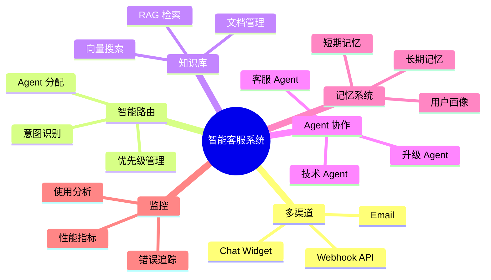
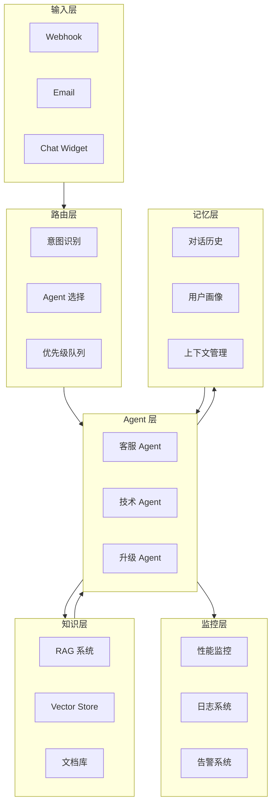
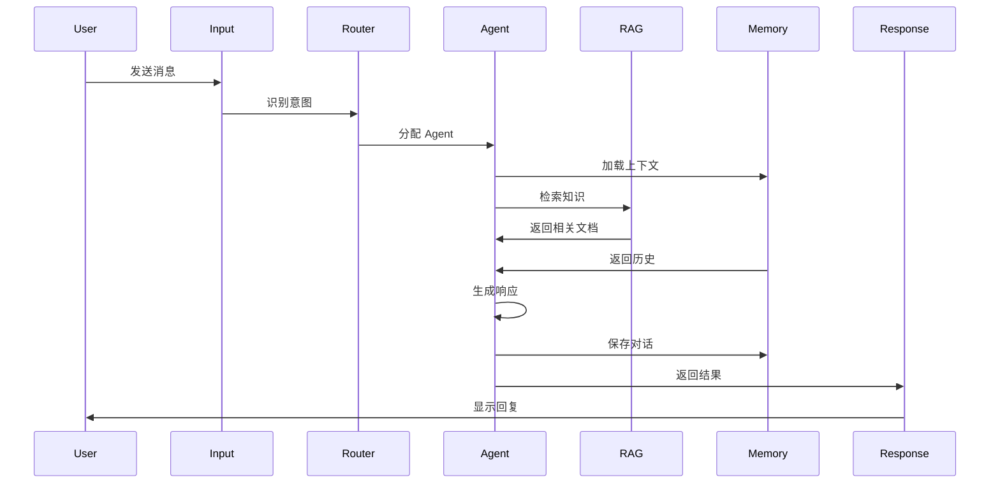
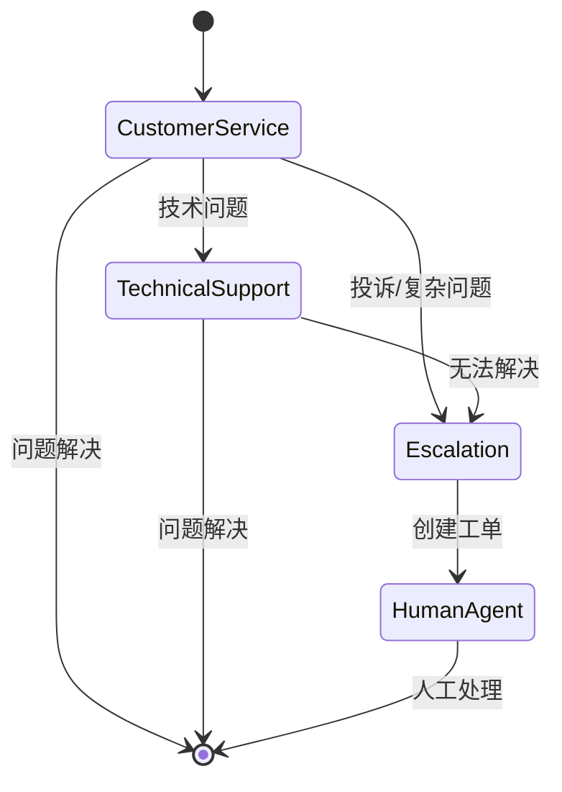
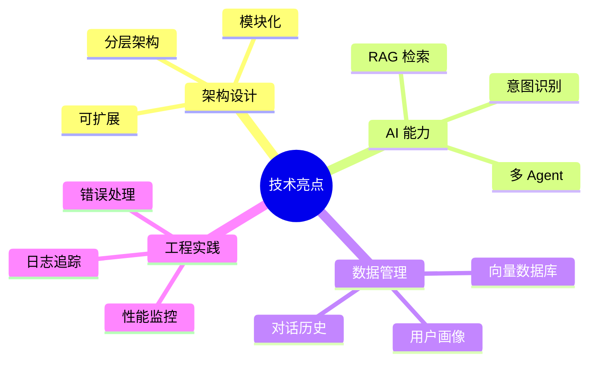

# 完整的 Agentic AI 应用：构建生产级多 Agent 客服系统

## 目录

1. [项目概述](#1-项目概述)
2. [系统架构](#2-系统架构)
3. [多渠道输入](#3-多渠道输入)
4. [智能路由系统](#4-智能路由系统)
5. [RAG 知识库集成](#5-rag-知识库集成)
6. [多 Agent 协作](#6-多-agent-协作)
7. [记忆管理](#7-记忆管理)
8. [性能监控](#8-性能监控)
9. [完整实现](#9-完整实现)
10. [测试与优化](#10-测试与优化)

---

## 1. 项目概述

### 1.1 项目目标

构建一个**生产级智能客服系统**，具备：

- ✅ 多渠道接入（Webhook、Email、Chat）
- ✅ 智能意图识别和路由
- ✅ RAG 知识库（Supabase）
- ✅ 多 Agent 协作
- ✅ 对话记忆管理
- ✅ 性能监控和日志

### 1.2 系统特性



### 1.3 技术栈

```typescript
const techStack = {
  platform: 'n8n',
  ai: {
    llm: 'OpenAI GPT-4',
    embedding: 'text-embedding-3-small'
  },
  database: {
    vector: 'Supabase (pgvector)',
    cache: 'Redis',
    storage: 'PostgreSQL'
  },
  monitoring: {
    metrics: 'Prometheus',
    logging: 'Winston',
    tracing: 'Sentry'
  }
};
```

---

## 2. 系统架构

### 2.1 整体架构



### 2.2 数据流



---

## 3. 多渠道输入

### 3.1 Webhook 输入

```javascript
// Webhook 节点配置
{
  "name": "Webhook Input",
  "type": "n8n-nodes-base.webhook",
  "parameters": {
    "path": "customer-support",
    "httpMethod": "POST",
    "responseMode": "responseNode",
    "authentication": "headerAuth"
  }
}

// 数据标准化
const webhookData = {
  channel: 'webhook',
  userId: $json.body.userId,
  message: $json.body.message,
  metadata: {
    source: 'api',
    timestamp: new Date().toISOString(),
    sessionId: $json.body.sessionId
  }
};
```

### 3.2 Email 输入

```javascript
// Email Trigger 节点
{
  "name": "Email Input",
  "type": "n8n-nodes-base.emailReadImap",
  "parameters": {
    "mailbox": "INBOX",
    "format": "simple",
    "options": {
      "allowUnauthorizedCerts": false
    }
  }
}

// Email 数据标准化
const emailData = {
  channel: 'email',
  userId: extractUserId($json.from),
  message: $json.text,
  metadata: {
    source: 'email',
    subject: $json.subject,
    from: $json.from,
    timestamp: $json.date
  }
};
```

### 3.3 统一数据格式

```typescript
interface UnifiedMessage {
  channel: 'webhook' | 'email' | 'chat';
  userId: string;
  message: string;
  metadata: {
    source: string;
    timestamp: string;
    sessionId?: string;
    [key: string]: any;
  };
}

// Function 节点 - 数据标准化
function normalizeInput(input: any): UnifiedMessage {
  const channel = input.channel || detectChannel(input);
  
  return {
    channel,
    userId: extractUserId(input),
    message: extractMessage(input),
    metadata: {
      source: channel,
      timestamp: new Date().toISOString(),
      ...extractMetadata(input)
    }
  };
}
```

---

## 4. 智能路由系统

### 4.1 意图识别

```javascript
// Code 节点 - 意图识别
const OpenAI = require('openai');
const openai = new OpenAI({ apiKey: process.env.OPENAI_API_KEY });

const message = $('Normalize Input').item.json.message;

const response = await openai.chat.completions.create({
  model: 'gpt-4-turbo-preview',
  messages: [
    {
      role: 'system',
      content: `你是一个意图分类器。分析用户消息并返回以下之一：
      
- general_inquiry: 一般咨询
- technical_support: 技术支持
- billing: 账单问题
- complaint: 投诉
- escalation: 需要人工介入

只返回分类名称，不要其他内容。`
    },
    {
      role: 'user',
      content: message
    }
  ],
  temperature: 0.3
});

const intent = response.choices[0].message.content.trim();

// 计算优先级
const priority = calculatePriority(intent, message);

return [{
  json: {
    ...$input.item.json,
    intent,
    priority,
    classification: {
      intent,
      confidence: 0.9,
      timestamp: new Date().toISOString()
    }
  }
}];
```

### 4.2 Agent 路由规则

```javascript
// Switch 节点 - Agent 路由
const routingRules = {
  general_inquiry: 'Customer Service Agent',
  technical_support: 'Technical Support Agent',
  billing: 'Customer Service Agent',
  complaint: 'Escalation Agent',
  escalation: 'Escalation Agent'
};

const intent = $json.intent;
const selectedAgent = routingRules[intent] || 'Customer Service Agent';

return [{
  json: {
    ...$json,
    assignedAgent: selectedAgent,
    routingDecision: {
      intent,
      agent: selectedAgent,
      timestamp: new Date().toISOString()
    }
  }
}];
```

### 4.3 优先级队列

```javascript
// Function 节点 - 优先级管理
const Redis = require('ioredis');
const redis = new Redis(process.env.REDIS_URL);

const priority = $json.priority;
const messageId = $json.metadata.sessionId;

// 添加到优先级队列
await redis.zadd(
  'support_queue',
  priority,
  JSON.stringify({
    messageId,
    userId: $json.userId,
    intent: $json.intent,
    timestamp: Date.now()
  })
);

// 获取队列位置
const position = await redis.zrank('support_queue', messageId);

return [{
  json: {
    ...$json,
    queueInfo: {
      position: position + 1,
      priority,
      estimatedWait: calculateWaitTime(position)
    }
  }
}];
```

---

## 5. RAG 知识库集成

### 5.1 Supabase 配置

```sql
-- 创建知识库表
CREATE TABLE knowledge_base (
  id UUID PRIMARY KEY DEFAULT uuid_generate_v4(),
  title TEXT NOT NULL,
  content TEXT NOT NULL,
  category TEXT,
  embedding vector(1536),
  metadata JSONB DEFAULT '{}',
  created_at TIMESTAMP WITH TIME ZONE DEFAULT NOW(),
  updated_at TIMESTAMP WITH TIME ZONE DEFAULT NOW()
);

-- 启用 RLS
ALTER TABLE knowledge_base ENABLE ROW LEVEL SECURITY;

-- 创建向量索引
CREATE INDEX idx_kb_embedding ON knowledge_base 
USING ivfflat (embedding vector_cosine_ops)
WITH (lists = 100);

-- 创建搜索函数
CREATE OR REPLACE FUNCTION search_knowledge_base(
  query_embedding vector(1536),
  match_threshold float DEFAULT 0.7,
  match_count int DEFAULT 5
)
RETURNS TABLE (
  id uuid,
  title text,
  content text,
  category text,
  similarity float
)
LANGUAGE sql STABLE
AS $$
  SELECT
    id,
    title,
    content,
    category,
    1 - (embedding <=> query_embedding) AS similarity
  FROM knowledge_base
  WHERE 1 - (embedding <=> query_embedding) > match_threshold
  ORDER BY embedding <=> query_embedding
  LIMIT match_count;
$$;
```

### 5.2 RAG 检索实现

```javascript
// Code 节点 - RAG 检索
const { createClient } = require('@supabase/supabase-js');
const OpenAI = require('openai');

const supabase = createClient(
  process.env.SUPABASE_URL,
  process.env.SUPABASE_KEY
);
const openai = new OpenAI({ apiKey: process.env.OPENAI_API_KEY });

const userMessage = $('Router').item.json.message;

// 1. 生成查询向量
const embeddingResponse = await openai.embeddings.create({
  model: 'text-embedding-3-small',
  input: userMessage
});

const queryEmbedding = embeddingResponse.data[0].embedding;

// 2. 向量搜索
const { data: documents, error } = await supabase.rpc('search_knowledge_base', {
  query_embedding: queryEmbedding,
  match_threshold: 0.7,
  match_count: 3
});

if (error) throw error;

// 3. 构建上下文
const context = documents.map(doc => ({
  title: doc.title,
  content: doc.content,
  similarity: doc.similarity
}));

return [{
  json: {
    ...$input.item.json,
    ragContext: {
      documents: context,
      query: userMessage,
      retrievedAt: new Date().toISOString()
    }
  }
}];
```

### 5.3 知识库管理

```javascript
// 添加文档到知识库
async function addToKnowledgeBase(document) {
  // 生成 embedding
  const embeddingResponse = await openai.embeddings.create({
    model: 'text-embedding-3-small',
    input: document.content
  });
  
  const embedding = embeddingResponse.data[0].embedding;
  
  // 插入数据库
  const { data, error } = await supabase
    .from('knowledge_base')
    .insert({
      title: document.title,
      content: document.content,
      category: document.category,
      embedding: embedding,
      metadata: document.metadata
    });
  
  return data;
}

// 批量导入
async function batchImport(documents) {
  for (const doc of documents) {
    await addToKnowledgeBase(doc);
    await sleep(100); // 避免速率限制
  }
}
```

---

## 6. 多 Agent 协作

### 6.1 客服 Agent

```javascript
// Code 节点 - 客服 Agent
const customerServiceAgent = async (input) => {
  const { message, ragContext, conversationHistory } = input;
  
  const systemPrompt = `你是一个专业的客服代表。

知识库内容：
${ragContext.documents.map(d => `- ${d.title}: ${d.content}`).join('\n')}

对话历史：
${conversationHistory.slice(-5).map(m => `${m.role}: ${m.content}`).join('\n')}

职责：
- 回答一般性问题
- 提供产品信息
- 处理简单的账户问题
- 如果问题复杂，建议转接技术支持

保持友好、专业、简洁。`;

  const response = await openai.chat.completions.create({
    model: 'gpt-4-turbo-preview',
    messages: [
      { role: 'system', content: systemPrompt },
      { role: 'user', content: message }
    ],
    tools: [
      {
        type: 'function',
        function: {
          name: 'escalate_to_technical',
          description: '将问题升级到技术支持',
          parameters: {
            type: 'object',
            properties: {
              reason: { type: 'string' }
            }
          }
        }
      }
    ]
  });
  
  return response.choices[0].message;
};
```

### 6.2 技术支持 Agent

```javascript
// Code 节点 - 技术支持 Agent
const technicalSupportAgent = async (input) => {
  const { message, ragContext, userInfo } = input;
  
  const systemPrompt = `你是一个技术支持专家。

用户信息：
- 产品版本：${userInfo.productVersion}
- 操作系统：${userInfo.os}
- 最近错误：${userInfo.recentErrors}

技术文档：
${ragContext.documents.map(d => d.content).join('\n\n')}

职责：
- 诊断技术问题
- 提供解决方案
- 收集错误日志
- 创建技术工单

可用工具：
- check_system_status: 检查系统状态
- create_ticket: 创建技术工单
- run_diagnostic: 运行诊断`;

  const tools = [
    {
      type: 'function',
      function: {
        name: 'check_system_status',
        description: '检查系统和服务状态',
        parameters: {
          type: 'object',
          properties: {
            service: { type: 'string' }
          }
        }
      }
    },
    {
      type: 'function',
      function: {
        name: 'create_ticket',
        description: '创建技术支持工单',
        parameters: {
          type: 'object',
          properties: {
            title: { type: 'string' },
            description: { type: 'string' },
            severity: { type: 'string', enum: ['low', 'medium', 'high', 'critical'] }
          },
          required: ['title', 'description', 'severity']
        }
      }
    }
  ];
  
  const response = await openai.chat.completions.create({
    model: 'gpt-4-turbo-preview',
    messages: [
      { role: 'system', content: systemPrompt },
      { role: 'user', content: message }
    ],
    tools
  });
  
  return response.choices[0].message;
};
```

### 6.3 升级 Agent

```javascript
// Code 节点 - 升级 Agent
const escalationAgent = async (input) => {
  const { message, conversationHistory, sentiment } = input;
  
  const systemPrompt = `你是一个升级处理专家。

对话历史：
${conversationHistory.map(m => `${m.role}: ${m.content}`).join('\n')}

情绪分析：${sentiment}

职责：
- 评估是否需要人工介入
- 安抚客户情绪
- 收集完整信息
- 创建升级工单

判断标准：
- 客户情绪负面
- 问题复杂度高
- 涉及退款/赔偿
- 多次未解决`;

  const response = await openai.chat.completions.create({
    model: 'gpt-4-turbo-preview',
    messages: [
      { role: 'system', content: systemPrompt },
      { role: 'user', content: message }
    ],
    tools: [
      {
        type: 'function',
        function: {
          name: 'create_escalation',
          description: '创建人工介入工单',
          parameters: {
            type: 'object',
            properties: {
              priority: { type: 'string', enum: ['normal', 'high', 'urgent'] },
              summary: { type: 'string' },
              customerMood: { type: 'string' }
            },
            required: ['priority', 'summary']
          }
        }
      }
    ]
  });
  
  return response.choices[0].message;
};
```

### 6.4 Agent 协作流程



---

## 7. 记忆管理

### 7.1 对话历史存储

```sql
-- 对话历史表
CREATE TABLE conversations (
  id UUID PRIMARY KEY DEFAULT uuid_generate_v4(),
  user_id TEXT NOT NULL,
  session_id TEXT NOT NULL,
  role TEXT NOT NULL CHECK (role IN ('user', 'assistant', 'system')),
  content TEXT NOT NULL,
  metadata JSONB DEFAULT '{}',
  created_at TIMESTAMP WITH TIME ZONE DEFAULT NOW()
);

CREATE INDEX idx_conversations_session ON conversations(session_id, created_at);
CREATE INDEX idx_conversations_user ON conversations(user_id, created_at DESC);
```

### 7.2 记忆加载

```javascript
// Function 节点 - 加载对话历史
const { createClient } = require('@supabase/supabase-js');
const supabase = createClient(process.env.SUPABASE_URL, process.env.SUPABASE_KEY);

const userId = $json.userId;
const sessionId = $json.metadata.sessionId;

// 加载最近对话
const { data: history } = await supabase
  .from('conversations')
  .select('*')
  .eq('session_id', sessionId)
  .order('created_at', { ascending: true })
  .limit(20);

// 加载用户画像
const { data: profile } = await supabase
  .from('user_profiles')
  .select('*')
  .eq('user_id', userId)
  .single();

return [{
  json: {
    ...$json,
    conversationHistory: history || [],
    userProfile: profile || {},
    memoryLoaded: true
  }
}];
```

### 7.3 用户画像

```typescript
interface UserProfile {
  userId: string;
  preferences: {
    language: string;
    communicationStyle: string;
    topics: string[];
  };
  history: {
    totalInteractions: number;
    lastInteraction: string;
    commonIssues: string[];
  };
  sentiment: {
    overall: 'positive' | 'neutral' | 'negative';
    recentTrend: number;
  };
  metadata: {
    tier: 'free' | 'pro' | 'enterprise';
    accountAge: number;
    [key: string]: any;
  };
}

// 更新用户画像
async function updateUserProfile(userId: string, interaction: any) {
  const profile = await loadProfile(userId);
  
  profile.history.totalInteractions++;
  profile.history.lastInteraction = new Date().toISOString();
  
  // 更新情绪趋势
  const sentiment = await analyzeSentiment(interaction.message);
  profile.sentiment.recentTrend = calculateTrend(profile.sentiment, sentiment);
  
  await saveProfile(userId, profile);
}
```

### 7.4 记忆保存

```javascript
// Function 节点 - 保存对话
const saveConversation = async (data) => {
  const { userId, sessionId, userMessage, assistantMessage } = data;
  
  // 保存用户消息
  await supabase.from('conversations').insert({
    user_id: userId,
    session_id: sessionId,
    role: 'user',
    content: userMessage,
    metadata: {
      timestamp: new Date().toISOString(),
      channel: data.channel
    }
  });
  
  // 保存助手回复
  await supabase.from('conversations').insert({
    user_id: userId,
    session_id: sessionId,
    role: 'assistant',
    content: assistantMessage,
    metadata: {
      agent: data.assignedAgent,
      intent: data.intent,
      timestamp: new Date().toISOString()
    }
  });
  
  // 更新用户画像
  await updateUserProfile(userId, {
    message: userMessage,
    response: assistantMessage,
    intent: data.intent
  });
};
```

---

## 8. 性能监控

### 8.1 指标收集

```javascript
// Function 节点 - 收集指标
const collectMetrics = (executionData) => {
  const metrics = {
    // 性能指标
    performance: {
      totalDuration: Date.now() - executionData.startTime,
      ragRetrievalTime: executionData.ragTime,
      agentProcessingTime: executionData.agentTime,
      databaseTime: executionData.dbTime
    },
    
    // 使用指标
    usage: {
      tokensUsed: executionData.tokensUsed,
      documentsRetrieved: executionData.documentsCount,
      agentType: executionData.assignedAgent
    },
    
    // 质量指标
    quality: {
      intent: executionData.intent,
      confidence: executionData.confidence,
      userSatisfaction: executionData.satisfaction
    },
    
    // 业务指标
    business: {
      channel: executionData.channel,
      resolved: executionData.resolved,
      escalated: executionData.escalated
    }
  };
  
  return metrics;
};
```

### 8.2 日志系统

```javascript
// Winston 日志配置
const winston = require('winston');

const logger = winston.createLogger({
  level: 'info',
  format: winston.format.combine(
    winston.format.timestamp(),
    winston.format.json()
  ),
  transports: [
    new winston.transports.File({ filename: 'error.log', level: 'error' }),
    new winston.transports.File({ filename: 'combined.log' })
  ]
});

// 结构化日志
logger.info('Agent execution completed', {
  userId: data.userId,
  sessionId: data.sessionId,
  agent: data.assignedAgent,
  intent: data.intent,
  duration: data.duration,
  tokensUsed: data.tokensUsed,
  timestamp: new Date().toISOString()
});
```

### 8.3 错误追踪

```javascript
// Sentry 集成
const Sentry = require('@sentry/node');

Sentry.init({
  dsn: process.env.SENTRY_DSN,
  environment: process.env.NODE_ENV,
  tracesSampleRate: 1.0
});

// 错误捕获
try {
  const result = await processRequest(data);
  return result;
} catch (error) {
  Sentry.captureException(error, {
    tags: {
      workflow: $workflow.name,
      node: $node.name,
      userId: data.userId
    },
    extra: {
      input: data,
      timestamp: new Date().toISOString()
    }
  });
  
  throw error;
}
```

### 8.4 实时监控仪表板

```javascript
// Prometheus 指标导出
const prometheus = require('prom-client');

const requestCounter = new prometheus.Counter({
  name: 'agent_requests_total',
  help: 'Total number of agent requests',
  labelNames: ['agent', 'intent', 'status']
});

const requestDuration = new prometheus.Histogram({
  name: 'agent_request_duration_seconds',
  help: 'Duration of agent requests',
  labelNames: ['agent'],
  buckets: [0.1, 0.5, 1, 2, 5, 10]
});

// 记录指标
requestCounter.inc({ agent: 'customer_service', intent: 'general', status: 'success' });
requestDuration.observe({ agent: 'customer_service' }, duration);
```

---

## 9. 完整实现

### 9.1 主工作流

由于完整工作流代码较长，这里提供核心结构：

```javascript
// 主工作流结构
const mainWorkflow = {
  // 1. 输入层
  inputs: [
    'Webhook Input',
    'Email Input',
    'Chat Input'
  ],
  
  // 2. 标准化
  normalize: 'Normalize Input',
  
  // 3. 路由
  routing: [
    'Intent Recognition',
    'Agent Router',
    'Priority Queue'
  ],
  
  // 4. 上下文加载
  context: [
    'Load Conversation History',
    'Load User Profile',
    'RAG Retrieval'
  ],
  
  // 5. Agent 执行
  agents: [
    'Customer Service Agent',
    'Technical Support Agent',
    'Escalation Agent'
  ],
  
  // 6. 后处理
  postProcess: [
    'Save Conversation',
    'Update Profile',
    'Collect Metrics'
  ],
  
  // 7. 响应
  response: 'Format and Send Response'
};
```

### 9.2 部署配置

```yaml
# docker-compose.yml
version: '3.8'

services:
  n8n:
    image: n8nio/n8n
    ports:
      - "5678:5678"
    environment:
      - N8N_BASIC_AUTH_ACTIVE=true
      - N8N_BASIC_AUTH_USER=admin
      - N8N_BASIC_AUTH_PASSWORD=${N8N_PASSWORD}
      - OPENAI_API_KEY=${OPENAI_API_KEY}
      - SUPABASE_URL=${SUPABASE_URL}
      - SUPABASE_KEY=${SUPABASE_KEY}
      - REDIS_URL=redis://redis:6379
    volumes:
      - n8n_data:/home/node/.n8n
    depends_on:
      - redis
      - postgres
  
  redis:
    image: redis:7-alpine
    ports:
      - "6379:6379"
  
  postgres:
    image: postgres:15-alpine
    environment:
      - POSTGRES_DB=n8n
      - POSTGRES_USER=n8n
      - POSTGRES_PASSWORD=${POSTGRES_PASSWORD}
    volumes:
      - postgres_data:/var/lib/postgresql/data

volumes:
  n8n_data:
  postgres_data:
```

---

## 10. 测试与优化

### 10.1 测试场景

```javascript
// 测试用例
const testScenarios = [
  {
    name: '一般咨询',
    input: {
      message: '你们的营业时间是什么？',
      userId: 'test_user_1'
    },
    expected: {
      intent: 'general_inquiry',
      agent: 'Customer Service Agent',
      resolved: true
    }
  },
  {
    name: '技术问题',
    input: {
      message: '我的应用一直崩溃，错误代码 500',
      userId: 'test_user_2'
    },
    expected: {
      intent: 'technical_support',
      agent: 'Technical Support Agent',
      toolCalls: ['check_system_status', 'create_ticket']
    }
  },
  {
    name: '投诉升级',
    input: {
      message: '我已经等了三天了，这太糟糕了！',
      userId: 'test_user_3'
    },
    expected: {
      intent: 'complaint',
      agent: 'Escalation Agent',
      escalated: true
    }
  }
];

// 运行测试
async function runTests() {
  for (const scenario of testScenarios) {
    const result = await callWorkflow(scenario.input);
    assert(result.intent === scenario.expected.intent);
    console.log(`✓ ${scenario.name} passed`);
  }
}
```

### 10.2 性能优化

```javascript
// 优化策略
const optimizations = {
  // 1. 缓存
  caching: {
    ragResults: '5分钟',
    userProfiles: '10分钟',
    knowledgeBase: '1小时'
  },
  
  // 2. 批处理
  batching: {
    embeddings: '批量生成',
    dbWrites: '批量写入'
  },
  
  // 3. 并行处理
  parallel: {
    ragRetrieval: '并行检索',
    profileLoading: '并行加载'
  },
  
  // 4. 连接池
  pooling: {
    database: '10个连接',
    redis: '5个连接'
  }
};
```

### 10.3 监控优化

```javascript
// 性能基准
const performanceBenchmarks = {
  responseTime: {
    p50: '< 1s',
    p95: '< 3s',
    p99: '< 5s'
  },
  
  throughput: {
    target: '100 req/s',
    peak: '500 req/s'
  },
  
  availability: {
    target: '99.9%',
    downtime: '< 43min/month'
  },
  
  accuracy: {
    intentRecognition: '> 95%',
    ragRelevance: '> 90%'
  }
};
```

---

## 总结

### 核心成果

通过本项目，我们构建了一个**生产级多 Agent 智能客服系统**，包含：

1. ✅ **多渠道输入** - Webhook、Email、Chat 统一处理
2. ✅ **智能路由** - 意图识别和 Agent 自动分配
3. ✅ **RAG 知识库** - Supabase 向量检索
4. ✅ **多 Agent 协作** - 客服、技术、升级三层体系
5. ✅ **记忆管理** - 对话历史和用户画像
6. ✅ **性能监控** - 完整的指标、日志、告警

### 技术亮点



### 下一步

- 添加 WebSocket 支持实时对话
- 集成更多 AI 模型（Claude、Gemini）
- 实现 Agent 自学习机制
- 构建管理后台
- 添加多语言支持

---

**恭喜完成本周学习！** 🎉

你已经掌握了从基础到生产的完整 Agentic AI 开发流程。继续探索，构建更强大的 AI 系统！
