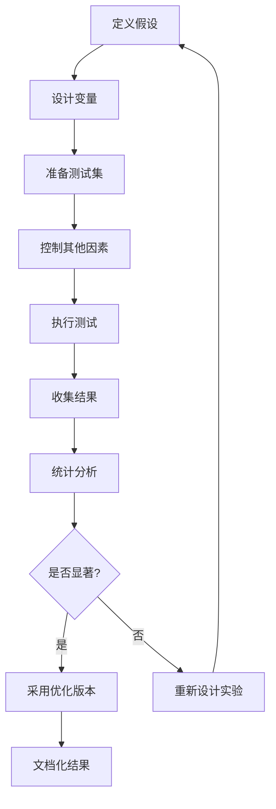
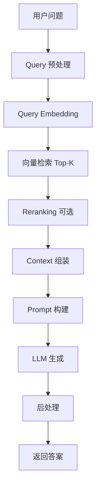

# RAG 系统测试、评估与优化：从理论到工程实践的完整指南

## 目录

1. [引言：从创意生成到工程落地](#1-引言从创意生成到工程落地)
2. [核心学习目标](#2-核心学习目标)
3. [A/B 测试方法论](#3-ab-测试方法论)
4. [评估指标体系](#4-评估指标体系)
5. [RAG 架构基础](#5-rag-架构基础)
6. [上下文工程](#6-上下文工程)
7. [检索优化策略](#7-检索优化策略)
8. [RAG 系统实践](#8-rag-系统实践)
9. [最佳实践总结](#9-最佳实践总结)
10. [进阶方向](#10-进阶方向)

---

## 1. 引言：从创意生成到工程落地

### 1.1 技术背景

随着大语言模型逐步进入**工程化应用阶段**，单纯"能生成内容"已不再是核心能力。如何评估生成效果、如何通过检索增强（RAG）提升可靠性与准确性，成为关键挑战。

### 1.2 核心理念

RAG 系统的本质是：

> **通过定量评估和上下文工程，将随机的生成结果转化为工业级的可靠输出。**

这个过程涉及三个关键转变：

1. **从主观到客观**：建立可量化的评估指标
2. **从随机到可控**：通过检索提供事实依据
3. **从单次到迭代**：建立持续优化的闭环

### 1.3 技术价值

- **降低幻觉**：通过检索提供事实依据，减少模型臆造
- **提高可控性**：明确信息来源，便于追溯和验证
- **增强专业性**：注入领域知识，提升回答质量
- **实现可评估**：建立量化指标，支持持续优化

---

## 2. 核心学习目标

### 2.1 实验驱动优化

**关键问题**：
- 如何科学地验证 Prompt 的改进效果？
- 如何设计有效的对比实验？

**学习重点**：
- A/B 测试的设计原则
- 控制变量的实验方法
- 结果的统计分析

### 2.2 多维指标评估

**关键问题**：
- 如何量化评估 RAG 系统的性能？
- 检索和生成分别需要什么指标？

**学习重点**：
- 检索质量指标（Hit Rate, MRR）
- 生成质量指标（Faithfulness, Relevance）
- 端到端评估方法

### 2.3 RAG 深度增强

**关键问题**：
- 如何通过上下文工程提升生成质量？
- 如何优化检索策略？

**学习重点**：
- Context Engineering 技术
- 检索优化策略
- 上下文窗口管理

### 2.4 系统工程能力

**关键问题**：
- 如何构建可运行、可评估、可优化的 RAG 系统？
- 如何建立评估与优化的工程思维？

**学习重点**：
- RAG 架构设计
- 系统集成方法
- 性能优化技巧

---

## 3. A/B 测试方法论

### 3.1 基本原则

A/B 测试的核心思想是：

> **在其他条件保持不变的情况下，仅对一个变量进行对比实验。**

#### 测试要素

```typescript
interface ABTest {
  variantA: Prompt;      // 版本 A
  variantB: Prompt;      // 版本 B
  variable: string;      // 变化的维度
  controlledFactors: {   // 控制变量
    model: string;
    temperature: number;
    seed: number;
    testSet: Question[];
  };
  metrics: Metric[];     // 评估指标
}
```

### 3.2 Prompt A/B 测试设计

#### 常见对比维度

| 维度 | 变量 A | 变量 B | 评估重点 |
|------|--------|--------|----------|
| **System Prompt** | 无 | 有角色定义 | 专业性、一致性 |
| **上下文顺序** | 背景在前 | 问题在前 | 理解准确性 |
| **示例数量** | Zero-shot | Few-shot | 格式一致性 |
| **结构化程度** | 自然语言 | 结构化模板 | 输出稳定性 |
| **约束条件** | 无约束 | 明确限制 | 幻觉率 |

#### 设计示例

**测试目标**：验证 Few-shot 示例是否提升输出质量

```typescript
const testConfig: ABTest = {
  variantA: {
    prompt: `
      请分析以下文本的情感倾向。
      
      文本: {text}
    `
  },
  
  variantB: {
    prompt: `
      请分析以下文本的情感倾向。
      
      示例 1:
      文本: "这个产品质量很好，非常满意"
      分析: 正面情感，满意度高
      
      示例 2:
      文本: "服务态度差，不会再来"
      分析: 负面情感，体验不佳
      
      现在请分析:
      文本: {text}
    `
  },
  
  variable: 'few-shot examples',
  
  controlledFactors: {
    model: 'gpt-4',
    temperature: 0.7,
    seed: 12345,
    testSet: loadTestQuestions()
  },
  
  metrics: ['accuracy', 'consistency', 'format_compliance']
};
```

### 3.3 实验执行流程



### 3.4 关键工程原则

#### 原则 1：一次只改一个点

```
❌ 错误做法:
同时修改 system prompt、示例数量、输出格式

✅ 正确做法:
仅修改 system prompt，其他保持不变
```

#### 原则 2：使用同一批测试问题

```typescript
// 准备固定的测试集
const testSet: Question[] = [
  { id: 1, text: '...', expectedAnswer: '...' },
  { id: 2, text: '...', expectedAnswer: '...' },
  // ... 至少 50-100 个测试用例
];

// 两个版本使用相同测试集
const resultsA = await runTest(variantA, testSet);
const resultsB = await runTest(variantB, testSet);
```

#### 原则 3：记录完整配置

```typescript
interface TestRecord {
  timestamp: string;
  promptVersion: string;
  modelConfig: {
    name: string;
    version: string;
    temperature: number;
    maxTokens: number;
    seed?: number;
  };
  results: {
    accuracy: number;
    avgLatency: number;
    tokenUsage: number;
  };
  notes: string;
}
```

### 3.5 控制变量技巧

#### 固定随机性

```typescript
// 使用相同的 seed 确保可复现
const config = {
  model: 'gpt-4',
  temperature: 0.7,
  seed: 42,  // 固定种子
  maxTokens: 500
};

// 两个版本使用相同配置
const responseA = await llm.generate(promptA, config);
const responseB = await llm.generate(promptB, config);
```

#### 一致性基准

```
控制因素清单:
□ 模型版本相同
□ Temperature 相同
□ Seed 相同（如果支持）
□ 测试数据集相同
□ 测试顺序随机化（避免顺序效应）
□ 测试环境相同（时间、负载）
```

---

## 4. 评估指标体系

### 4.1 为什么需要量化指标

避免"感觉更好"的主观判断，建立可量化、可复现的评估体系。

### 4.2 核心评估指标

#### 通用指标

| 指标 | 含义 | 计算方法 | 适用场景 |
|------|------|----------|----------|
| **Accuracy（准确率）** | 回答是否正确 | 正确数 / 总数 | 问答、事实型任务 |
| **Precision（精确率）** | 输出中有效信息占比 | TP / (TP + FP) | 避免幻觉 |
| **Recall（召回率）** | 应提及信息的覆盖率 | TP / (TP + FN) | RAG、知识密集型任务 |
| **F1 Score** | Precision 与 Recall 的调和平均 | 2 × (P × R) / (P + R) | 综合评估 |

#### RAG 特定指标

**检索阶段指标**

| 指标 | 定义 | 计算方法 | 意义 |
|------|------|----------|------|
| **Hit Rate** | 检索到的文档中包含正确答案的比例 | 包含答案的查询数 / 总查询数 | 检索召回能力 |
| **MRR (Mean Reciprocal Rank)** | 正确答案在检索列表中的平均排名倒数 | Avg(1 / rank) | 检索排序质量 |
| **NDCG** | 归一化折损累积增益 | 考虑位置的相关性得分 | 排序整体质量 |

**生成阶段指标**

| 指标 | 定义 | 评估方法 | 意义 |
|------|------|----------|------|
| **Faithfulness（忠实度）** | 生成内容是否完全依据检索到的上下文 | LLM-as-judge 或规则检查 | 防止幻觉 |
| **Relevance（相关性）** | 生成内容与用户问题的匹配程度 | 语义相似度或人工评分 | 回答质量 |
| **Groundedness** | 答案是否有明确的事实依据 | 引用检查 | 可追溯性 |

### 4.3 评估方法分类

#### 自动评估

**方法 1：规则based**

```typescript
interface RuleBasedEvaluator {
  checkFormat(response: string): boolean;
  checkLength(response: string, min: number, max: number): boolean;
  checkKeywords(response: string, required: string[]): boolean;
  checkCitations(response: string, sources: string[]): boolean;
}

class FormatEvaluator implements RuleBasedEvaluator {
  checkFormat(response: string): boolean {
    // 检查是否符合 JSON 格式
    try {
      JSON.parse(response);
      return true;
    } catch {
      return false;
    }
  }
  
  checkLength(response: string, min: number, max: number): boolean {
    const wordCount = response.split(' ').length;
    return wordCount >= min && wordCount <= max;
  }
  
  checkKeywords(response: string, required: string[]): boolean {
    return required.every(keyword => 
      response.toLowerCase().includes(keyword.toLowerCase())
    );
  }
  
  checkCitations(response: string, sources: string[]): boolean {
    // 检查是否引用了提供的来源
    return sources.some(source => response.includes(source));
  }
}
```

**方法 2：Embedding 相似度**

```typescript
async function evaluateSemanticSimilarity(
  generated: string,
  reference: string,
  embedModel: EmbeddingModel
): Promise<number> {
  const embeddingGenerated = await embedModel.embed(generated);
  const embeddingReference = await embedModel.embed(reference);
  
  // 计算余弦相似度
  const similarity = cosineSimilarity(embeddingGenerated, embeddingReference);
  
  return similarity;
}

function cosineSimilarity(vecA: number[], vecB: number[]): number {
  const dotProduct = vecA.reduce((sum, a, i) => sum + a * vecB[i], 0);
  const magnitudeA = Math.sqrt(vecA.reduce((sum, a) => sum + a * a, 0));
  const magnitudeB = Math.sqrt(vecB.reduce((sum, b) => sum + b * b, 0));
  
  return dotProduct / (magnitudeA * magnitudeB);
}
```

**方法 3：LLM-as-a-Judge**

```typescript
async function evaluateWithLLM(
  question: string,
  answer: string,
  context: string,
  criteria: string[]
): Promise<EvaluationResult> {
  const prompt = `
    评估以下回答的质量。
    
    问题: ${question}
    
    上下文: ${context}
    
    回答: ${answer}
    
    评估标准:
    ${criteria.map((c, i) => `${i + 1}. ${c}`).join('\n')}
    
    请对每个标准打分（1-5分），并给出总体评分和理由。
    
    输出格式:
    {
      "scores": {
        "criterion_1": <score>,
        "criterion_2": <score>,
        ...
      },
      "overall": <average_score>,
      "reasoning": "<explanation>"
    }
  `;
  
  const evaluation = await llm.generate(prompt);
  return JSON.parse(evaluation);
}
```

#### 人工评估

**评估维度**

```typescript
interface HumanEvaluation {
  responseId: string;
  evaluator: string;
  scores: {
    accuracy: number;        // 1-5
    relevance: number;       // 1-5
    completeness: number;    // 1-5
    clarity: number;         // 1-5
    usefulness: number;      // 1-5
  };
  feedback: string;
  timestamp: Date;
}
```

**评估流程**

```
1. 准备评估样本（随机抽取 50-100 个）
2. 制定评估标准和打分规则
3. 多人独立评估（至少 2-3 人）
4. 计算一致性（Cohen's Kappa）
5. 讨论分歧并达成共识
6. 汇总结果并分析
```

### 4.4 评估框架实现

```typescript
interface EvaluationFramework {
  name: string;
  metrics: Metric[];
  evaluators: Evaluator[];
}

interface Metric {
  name: string;
  weight: number;
  evaluator: (response: Response, reference: Reference) => number;
}

class RAGEvaluator {
  private framework: EvaluationFramework;
  
  constructor(framework: EvaluationFramework) {
    this.framework = framework;
  }
  
  async evaluate(
    testSet: TestCase[],
    system: RAGSystem
  ): Promise<EvaluationReport> {
    const results: TestResult[] = [];
    
    for (const testCase of testSet) {
      const response = await system.query(testCase.question);
      
      const scores: Record<string, number> = {};
      for (const metric of this.framework.metrics) {
        scores[metric.name] = metric.evaluator(
          response,
          testCase.reference
        );
      }
      
      results.push({
        testCaseId: testCase.id,
        scores,
        response
      });
    }
    
    return this.generateReport(results);
  }
  
  private generateReport(results: TestResult[]): EvaluationReport {
    const aggregated: Record<string, number> = {};
    
    for (const metric of this.framework.metrics) {
      const scores = results.map(r => r.scores[metric.name]);
      aggregated[metric.name] = {
        mean: mean(scores),
        median: median(scores),
        std: standardDeviation(scores),
        min: Math.min(...scores),
        max: Math.max(...scores)
      };
    }
    
    return {
      totalTests: results.length,
      metrics: aggregated,
      details: results
    };
  }
}
```

---

## 5. RAG 架构基础

### 5.1 RAG 工作流程

典型 RAG 系统的完整流程：



### 5.2 核心组件

#### 组件 1：文档处理

```typescript
interface DocumentProcessor {
  load(source: string): Document[];
  chunk(documents: Document[], strategy: ChunkStrategy): Chunk[];
  embed(chunks: Chunk[], model: EmbeddingModel): EmbeddedChunk[];
  store(chunks: EmbeddedChunk[], vectorDB: VectorDatabase): void;
}

interface ChunkStrategy {
  method: 'fixed_size' | 'semantic' | 'markdown_header';
  size?: number;
  overlap?: number;
  separator?: string;
}
```

**文档切分策略**

| 策略 | 描述 | 优势 | 劣势 |
|------|------|------|------|
| **Fixed Size** | 固定字符数切分 | 简单、可控 | 可能破坏语义 |
| **Semantic** | 基于语义边界切分 | 保持完整性 | 复杂度高 |
| **Markdown Header** | 按标题层级切分 | 结构清晰 | 仅适用于结构化文档 |
| **Sentence** | 按句子切分 | 语义完整 | 可能过碎 |

#### 组件 2：向量化

```typescript
interface EmbeddingModel {
  embed(text: string): Promise<number[]>;
  embedBatch(texts: string[]): Promise<number[][]>;
  dimension: number;
}

// 使用示例
const model: EmbeddingModel = new OpenAIEmbedding({
  model: 'text-embedding-3-small',
  dimension: 1536
});

const chunks = ['chunk 1', 'chunk 2', 'chunk 3'];
const embeddings = await model.embedBatch(chunks);
```

#### 组件 3：向量数据库

```typescript
interface VectorDatabase {
  insert(id: string, vector: number[], metadata: Record<string, unknown>): void;
  search(query: number[], topK: number): SearchResult[];
  delete(id: string): void;
  update(id: string, vector: number[], metadata: Record<string, unknown>): void;
}

interface SearchResult {
  id: string;
  score: number;
  metadata: Record<string, unknown>;
  content: string;
}
```

**常用向量数据库对比**

| 数据库 | 特点 | 适用场景 |
|--------|------|----------|
| **FAISS** | 高性能、内存based | 原型开发、小规模 |
| **Milvus** | 分布式、可扩展 | 生产环境、大规模 |
| **Pinecone** | 托管服务、易用 | 快速上线 |
| **Weaviate** | 混合搜索、GraphQL | 复杂查询需求 |
| **PGVector** | PostgreSQL 扩展 | 已有 PG 基础设施 |

#### 组件 4：Prompt 模板

```typescript
interface RAGPromptTemplate {
  systemPrompt: string;
  contextTemplate: string;
  questionTemplate: string;
  constraints: string[];
}

const template: RAGPromptTemplate = {
  systemPrompt: `
    你是一个基于提供资料回答问题的助手。
    你必须严格基于给定的上下文信息回答问题。
    如果上下文中没有相关信息，请明确说明"根据提供的资料无法回答"。
  `,
  
  contextTemplate: `
    参考资料:
    {context}
  `,
  
  questionTemplate: `
    用户问题: {question}
    
    请基于上述参考资料回答问题。
  `,
  
  constraints: [
    '仅使用提供的参考资料',
    '如果信息不足，说明无法回答',
    '引用具体的资料来源',
    '保持客观和准确'
  ]
};
```

### 5.3 基础 RAG 实现

```typescript
class SimpleRAG {
  private vectorDB: VectorDatabase;
  private embeddingModel: EmbeddingModel;
  private llm: LanguageModel;
  private template: RAGPromptTemplate;
  
  constructor(config: RAGConfig) {
    this.vectorDB = config.vectorDB;
    this.embeddingModel = config.embeddingModel;
    this.llm = config.llm;
    this.template = config.template;
  }
  
  async query(question: string, topK: number = 3): Promise<string> {
    // 1. 向量化问题
    const queryEmbedding = await this.embeddingModel.embed(question);
    
    // 2. 检索相关文档
    const results = this.vectorDB.search(queryEmbedding, topK);
    
    // 3. 组装上下文
    const context = results
      .map((r, i) => `[${i + 1}] ${r.content}`)
      .join('\n\n');
    
    // 4. 构建 Prompt
    const prompt = `
      ${this.template.systemPrompt}
      
      ${this.template.contextTemplate.replace('{context}', context)}
      
      ${this.template.questionTemplate.replace('{question}', question)}
      
      约束条件:
      ${this.template.constraints.map(c => `- ${c}`).join('\n')}
    `;
    
    // 5. 生成答案
    const answer = await this.llm.generate(prompt);
    
    return answer;
  }
}
```

---

## 6. 上下文工程

### 6.1 核心问题

Context Engineering 的核心问题是：

> **"给模型多少上下文、以什么顺序、用什么格式？"**

### 6.2 关键结论

```
上下文不是越多越好
相关性 > 数量
结构 > 原始文本堆叠
```

### 6.3 Chunking 策略

#### 策略对比

**固定长度切分**

```typescript
function fixedSizeChunking(
  text: string,
  chunkSize: number,
  overlap: number
): string[] {
  const chunks: string[] = [];
  let start = 0;
  
  while (start < text.length) {
    const end = Math.min(start + chunkSize, text.length);
    chunks.push(text.slice(start, end));
    start += chunkSize - overlap;
  }
  
  return chunks;
}

// 使用示例
const chunks = fixedSizeChunking(document, 500, 50);
```

**语义切分**

```typescript
async function semanticChunking(
  text: string,
  embedModel: EmbeddingModel,
  threshold: number = 0.7
): Promise<string[]> {
  const sentences = text.split(/[.!?]+/);
  const embeddings = await embedModel.embedBatch(sentences);
  
  const chunks: string[] = [];
  let currentChunk: string[] = [sentences[0]];
  
  for (let i = 1; i < sentences.length; i++) {
    const similarity = cosineSimilarity(
      embeddings[i - 1],
      embeddings[i]
    );
    
    if (similarity > threshold) {
      currentChunk.push(sentences[i]);
    } else {
      chunks.push(currentChunk.join('. '));
      currentChunk = [sentences[i]];
    }
  }
  
  if (currentChunk.length > 0) {
    chunks.push(currentChunk.join('. '));
  }
  
  return chunks;
}
```

**Markdown 结构切分**

```typescript
function markdownHeaderChunking(markdown: string): Chunk[] {
  const chunks: Chunk[] = [];
  const lines = markdown.split('\n');
  
  let currentHeader = '';
  let currentContent: string[] = [];
  let currentLevel = 0;
  
  for (const line of lines) {
    const headerMatch = line.match(/^(#+)\s+(.+)$/);
    
    if (headerMatch) {
      // 保存前一个 chunk
      if (currentContent.length > 0) {
        chunks.push({
          header: currentHeader,
          level: currentLevel,
          content: currentContent.join('\n')
        });
      }
      
      // 开始新 chunk
      currentLevel = headerMatch[1].length;
      currentHeader = headerMatch[2];
      currentContent = [];
    } else {
      currentContent.push(line);
    }
  }
  
  // 保存最后一个 chunk
  if (currentContent.length > 0) {
    chunks.push({
      header: currentHeader,
      level: currentLevel,
      content: currentContent.join('\n')
    });
  }
  
  return chunks;
}
```

### 6.4 Context Window 管理

#### 问题：Lost in the Middle

研究表明，LLM 对上下文中间部分的信息关注度较低。

**解决策略**：

1. **重要信息置于开头和结尾**
2. **使用 Reranking 提升相关性**
3. **动态调整 Top-K**

#### Reranking 实现

```typescript
interface Reranker {
  rerank(
    query: string,
    documents: Document[],
    topK: number
  ): Promise<Document[]>;
}

class CrossEncoderReranker implements Reranker {
  private model: CrossEncoderModel;
  
  constructor(model: CrossEncoderModel) {
    this.model = model;
  }
  
  async rerank(
    query: string,
    documents: Document[],
    topK: number
  ): Promise<Document[]> {
    // 计算每个文档与查询的相关性分数
    const scores = await Promise.all(
      documents.map(doc => 
        this.model.score(query, doc.content)
      )
    );
    
    // 按分数排序
    const ranked = documents
      .map((doc, i) => ({ doc, score: scores[i] }))
      .sort((a, b) => b.score - a.score)
      .slice(0, topK)
      .map(item => item.doc);
    
    return ranked;
  }
}
```

#### 动态 Top-K

```typescript
function dynamicTopK(
  query: string,
  results: SearchResult[],
  minScore: number = 0.7,
  maxK: number = 5
): SearchResult[] {
  // 根据相关性分数动态选择
  const filtered = results.filter(r => r.score >= minScore);
  return filtered.slice(0, Math.min(filtered.length, maxK));
}
```

### 6.5 Context 构建优化

#### 去重与压缩

```typescript
function deduplicateContext(chunks: string[]): string[] {
  const seen = new Set<string>();
  const unique: string[] = [];
  
  for (const chunk of chunks) {
    const normalized = chunk.trim().toLowerCase();
    if (!seen.has(normalized)) {
      seen.add(normalized);
      unique.push(chunk);
    }
  }
  
  return unique;
}

function compressContext(
  chunks: string[],
  maxTokens: number,
  tokenizer: Tokenizer
): string[] {
  const compressed: string[] = [];
  let totalTokens = 0;
  
  for (const chunk of chunks) {
    const tokens = tokenizer.count(chunk);
    if (totalTokens + tokens <= maxTokens) {
      compressed.push(chunk);
      totalTokens += tokens;
    } else {
      break;
    }
  }
  
  return compressed;
}
```

#### 标注来源

```typescript
function annotateContext(
  chunks: Chunk[],
  includeMetadata: boolean = true
): string {
  return chunks.map((chunk, i) => {
    let text = `[来源 ${i + 1}]\n${chunk.content}`;
    
    if (includeMetadata && chunk.metadata) {
      text += `\n(来自: ${chunk.metadata.source}, 页码: ${chunk.metadata.page})`;
    }
    
    return text;
  }).join('\n\n---\n\n');
}
```

#### 结构化 Context

```typescript
const structuredContext = `
# 参考资料

## 相关文档

${relevantDocs.map((doc, i) => `
### 文档 ${i + 1}: ${doc.title}
${doc.content}
`).join('\n')}

## 相关定义

${definitions.map(def => `
- **${def.term}**: ${def.definition}
`).join('\n')}

## 注意事项

- 以上资料来自官方文档
- 信息截止日期: ${cutoffDate}
- 如有疑问，请参考原始文档
`;
```

---

## 7. 检索优化策略

### 7.1 检索层优化

#### 混合检索 (Hybrid Search)

结合关键词检索和向量检索的优势：

```typescript
interface HybridSearchConfig {
  vectorWeight: number;    // 0-1
  keywordWeight: number;   // 0-1
  fusionMethod: 'rrf' | 'weighted_sum';
}

class HybridSearch {
  private vectorDB: VectorDatabase;
  private keywordIndex: KeywordIndex;
  
  async search(
    query: string,
    config: HybridSearchConfig,
    topK: number
  ): Promise<SearchResult[]> {
    // 向量检索
    const vectorResults = await this.vectorDB.search(query, topK * 2);
    
    // 关键词检索 (BM25)
    const keywordResults = await this.keywordIndex.search(query, topK * 2);
    
    // 融合结果
    return this.fuseResults(
      vectorResults,
      keywordResults,
      config,
      topK
    );
  }
  
  private fuseResults(
    vectorResults: SearchResult[],
    keywordResults: SearchResult[],
    config: HybridSearchConfig,
    topK: number
  ): SearchResult[] {
    if (config.fusionMethod === 'rrf') {
      return this.reciprocalRankFusion(vectorResults, keywordResults, topK);
    } else {
      return this.weightedSum(vectorResults, keywordResults, config, topK);
    }
  }
  
  private reciprocalRankFusion(
    listA: SearchResult[],
    listB: SearchResult[],
    topK: number,
    k: number = 60
  ): SearchResult[] {
    const scores = new Map<string, number>();
    
    // RRF 公式: score = 1 / (k + rank)
    listA.forEach((result, rank) => {
      scores.set(result.id, (scores.get(result.id) || 0) + 1 / (k + rank + 1));
    });
    
    listB.forEach((result, rank) => {
      scores.set(result.id, (scores.get(result.id) || 0) + 1 / (k + rank + 1));
    });
    
    // 按分数排序
    const allResults = [...new Set([...listA, ...listB])];
    return allResults
      .sort((a, b) => (scores.get(b.id) || 0) - (scores.get(a.id) || 0))
      .slice(0, topK);
  }
}
```

#### 查询扩展

```typescript
async function expandQuery(
  query: string,
  llm: LanguageModel
): Promise<string[]> {
  const prompt = `
    为以下查询生成 3 个语义相似的变体，用于提高检索召回率。
    
    原始查询: ${query}
    
    输出格式:
    1. [变体1]
    2. [变体2]
    3. [变体3]
  `;
  
  const response = await llm.generate(prompt);
  const variants = response.split('\n')
    .filter(line => line.match(/^\d+\./))
    .map(line => line.replace(/^\d+\.\s*/, ''));
  
  return [query, ...variants];
}
```

#### 查询重写

```typescript
async function rewriteQuery(
  query: string,
  conversationHistory: Message[],
  llm: LanguageModel
): Promise<string> {
  const prompt = `
    基于对话历史，重写用户查询为独立的、完整的问题。
    
    对话历史:
    ${conversationHistory.map(m => `${m.role}: ${m.content}`).join('\n')}
    
    当前查询: ${query}
    
    重写后的查询:
  `;
  
  return await llm.generate(prompt);
}
```

### 7.2 动态参数调整

```typescript
interface AdaptiveRetrieval {
  determineTopK(query: string): number;
  determineChunkSize(documentType: string): number;
  determineReranking(queryComplexity: number): boolean;
}

class AdaptiveRAG implements AdaptiveRetrieval {
  determineTopK(query: string): number {
    // 简单查询: 少量文档
    // 复杂查询: 更多文档
    const complexity = this.assessComplexity(query);
    
    if (complexity < 0.3) return 3;
    if (complexity < 0.7) return 5;
    return 10;
  }
  
  determineChunkSize(documentType: string): number {
    const sizeMap: Record<string, number> = {
      'code': 200,
      'technical': 500,
      'narrative': 800,
      'legal': 1000
    };
    
    return sizeMap[documentType] || 500;
  }
  
  determineReranking(queryComplexity: number): boolean {
    // 复杂查询启用 reranking
    return queryComplexity > 0.6;
  }
  
  private assessComplexity(query: string): number {
    // 简化的复杂度评估
    const factors = {
      length: query.split(' ').length / 20,
      hasMultipleQuestions: query.includes('?') ? 0.2 : 0,
      hasConjunctions: /and|or|but/.test(query) ? 0.3 : 0
    };
    
    return Math.min(
      Object.values(factors).reduce((sum, v) => sum + v, 0),
      1.0
    );
  }
}
```

---

## 8. RAG 系统实践

### 8.1 完整实现示例

```typescript
class ProductionRAG {
  private vectorDB: VectorDatabase;
  private embeddingModel: EmbeddingModel;
  private llm: LanguageModel;
  private reranker: Reranker;
  private config: RAGConfig;
  
  constructor(config: RAGConfig) {
    this.config = config;
    this.vectorDB = config.vectorDB;
    this.embeddingModel = config.embeddingModel;
    this.llm = config.llm;
    this.reranker = config.reranker;
  }
  
  async query(
    question: string,
    options?: QueryOptions
  ): Promise<RAGResponse> {
    const startTime = Date.now();
    
    // 1. 查询预处理
    const processedQuery = await this.preprocessQuery(question);
    
    // 2. 向量化
    const queryEmbedding = await this.embeddingModel.embed(processedQuery);
    
    // 3. 初始检索
    const initialResults = this.vectorDB.search(
      queryEmbedding,
      options?.topK || this.config.defaultTopK
    );
    
    // 4. Reranking (可选)
    let finalResults = initialResults;
    if (options?.useReranking ?? this.config.useReranking) {
      finalResults = await this.reranker.rerank(
        processedQuery,
        initialResults.map(r => ({ content: r.content })),
        options?.finalK || Math.ceil(initialResults.length / 2)
      );
    }
    
    // 5. Context 构建
    const context = this.buildContext(finalResults);
    
    // 6. Prompt 构建
    const prompt = this.buildPrompt(processedQuery, context);
    
    // 7. 生成答案
    const answer = await this.llm.generate(prompt, {
      temperature: options?.temperature || 0.7,
      maxTokens: options?.maxTokens || 500
    });
    
    // 8. 后处理
    const processedAnswer = this.postprocessAnswer(answer);
    
    const endTime = Date.now();
    
    return {
      answer: processedAnswer,
      sources: finalResults.map(r => r.metadata),
      latency: endTime - startTime,
      metadata: {
        retrievedDocs: initialResults.length,
        usedDocs: finalResults.length,
        query: processedQuery
      }
    };
  }
  
  private async preprocessQuery(query: string): Promise<string> {
    // 清理、标准化查询
    return query.trim().toLowerCase();
  }
  
  private buildContext(results: SearchResult[]): string {
    return results.map((result, i) => `
      [来源 ${i + 1}]
      ${result.content}
      (相关性: ${(result.score * 100).toFixed(1)}%)
    `).join('\n\n---\n\n');
  }
  
  private buildPrompt(query: string, context: string): string {
    return `
      ${this.config.systemPrompt}
      
      参考资料:
      ${context}
      
      用户问题: ${query}
      
      请基于上述参考资料回答问题。如果资料中没有相关信息，请说明"根据提供的资料无法回答"。
      
      回答:
    `;
  }
  
  private postprocessAnswer(answer: string): string {
    // 移除多余空白、格式化等
    return answer.trim();
  }
}
```

### 8.2 实验对比

#### 对比维度

```typescript
interface ExperimentConfig {
  name: string;
  variations: {
    noRAG: boolean;
    basicRAG: boolean;
    optimizedRAG: boolean;
  };
  testSet: TestCase[];
  metrics: string[];
}

async function runExperiment(config: ExperimentConfig): Promise<void> {
  const results: Record<string, EvaluationResult> = {};
  
  // 无 RAG 基线
  if (config.variations.noRAG) {
    results.noRAG = await evaluateSystem(
      new NoRAGSystem(),
      config.testSet
    );
  }
  
  // 基础 RAG
  if (config.variations.basicRAG) {
    results.basicRAG = await evaluateSystem(
      new BasicRAG({ topK: 3 }),
      config.testSet
    );
  }
  
  // 优化 RAG
  if (config.variations.optimizedRAG) {
    results.optimizedRAG = await evaluateSystem(
      new OptimizedRAG({
        topK: 5,
        useReranking: true,
        hybridSearch: true
      }),
      config.testSet
    );
  }
  
  // 生成对比报告
  generateComparisonReport(results, config.metrics);
}
```

#### 实验结论示例

```
实验结果对比:

| 配置 | Accuracy | Faithfulness | Latency | Cost |
|------|----------|--------------|---------|------|
| No RAG | 45% | 30% | 1.2s | $0.01 |
| Basic RAG | 72% | 85% | 2.5s | $0.03 |
| Optimized RAG | 89% | 95% | 3.1s | $0.05 |

关键发现:
1. RAG 显著提升准确性 (45% → 89%)
2. Faithfulness 从 30% 提升到 95%
3. 成本增加 5倍，但可接受
4. Reranking 贡献了 17% 的准确性提升
```

---

## 9. 最佳实践总结

### 9.1 核心原则

#### 原则 1：没有评估的优化是不可持续的

```
建立评估体系 → 设定基线 → 迭代优化 → 量化改进
```

#### 原则 2：检索质量决定上限

```
即使 LLM 再强大，如果检索到的上下文是错误的，
生成结果必然产生误导。

优先级:
1. 提升检索召回率
2. 优化检索排序
3. 改进 Prompt
```

#### 原则 3：Context Engineering 是成败关键

```
上下文工程的三个维度:
- 相关性 (Relevance)
- 结构性 (Structure)
- 完整性 (Completeness)
```

#### 原则 4：工程化思维比模型更重要

```
好的 RAG 系统 = 
  合理的架构设计 +
  科学的评估方法 +
  持续的优化迭代
```

### 9.2 常见陷阱

#### 陷阱 1：过度依赖 Top-K

```
❌ 固定 Top-K=5
→ 简单问题浪费 token，复杂问题信息不足

✅ 动态调整 Top-K
→ 根据查询复杂度和相关性分数自适应
```

#### 陷阱 2：忽视 Chunk 质量

```
❌ 固定 500 字符切分
→ 破坏语义完整性

✅ 语义感知切分
→ 保持段落/章节完整性
```

#### 陷阱 3：缺少约束指令

```
❌ "请回答这个问题"
→ 模型可能忽略上下文，产生幻觉

✅ "仅基于提供的资料回答，如果资料中没有信息，说明无法回答"
→ 明确约束，降低幻觉率
```

#### 陷阱 4：不做 Reranking

```
❌ 直接使用向量检索结果
→ 排序可能不准确

✅ 使用 Cross-Encoder Reranking
→ 提升相关性 10-20%
```

### 9.3 优化检查清单

```markdown
## RAG 系统优化检查清单

### 数据准备
- [ ] 文档清洗和预处理
- [ ] 合理的 Chunk 策略
- [ ] 高质量的 Embedding
- [ ] 元数据标注完整

### 检索优化
- [ ] 混合检索 (Vector + Keyword)
- [ ] Reranking 机制
- [ ] 动态 Top-K
- [ ] 查询扩展/重写

### Context 工程
- [ ] 去重和压缩
- [ ] 来源标注
- [ ] 结构化组织
- [ ] Token 限制管理

### Prompt 设计
- [ ] 明确的系统指令
- [ ] 约束条件清晰
- [ ] 输出格式定义
- [ ] 错误处理机制

### 评估体系
- [ ] 检索指标 (Hit Rate, MRR)
- [ ] 生成指标 (Faithfulness, Relevance)
- [ ] 端到端测试集
- [ ] 自动化评估流程

### 性能优化
- [ ] 缓存机制
- [ ] 批量处理
- [ ] 异步调用
- [ ] 成本监控
```

---

## 10. 进阶方向

### 10.1 高级 RAG 技术

#### Self-RAG

```typescript
class SelfRAG extends ProductionRAG {
  async query(question: string): Promise<RAGResponse> {
    let answer = '';
    let confidence = 0;
    let iteration = 0;
    const maxIterations = 3;
    
    while (confidence < 0.8 && iteration < maxIterations) {
      // 生成答案
      const response = await super.query(question);
      answer = response.answer;
      
      // 自我评估
      confidence = await this.evaluateConfidence(question, answer);
      
      // 如果置信度低，重新检索
      if (confidence < 0.8) {
        question = await this.refineQuery(question, answer);
      }
      
      iteration++;
    }
    
    return { answer, confidence, iterations: iteration };
  }
  
  private async evaluateConfidence(
    question: string,
    answer: string
  ): Promise<number> {
    const prompt = `
      评估以下回答的置信度 (0-1)。
      
      问题: ${question}
      回答: ${answer}
      
      置信度:
    `;
    
    const score = await this.llm.generate(prompt);
    return parseFloat(score);
  }
}
```

#### Corrective RAG

```typescript
class CorrectiveRAG extends ProductionRAG {
  async query(question: string): Promise<RAGResponse> {
    // 初始检索和生成
    const initialResponse = await super.query(question);
    
    // 检查答案质量
    const quality = await this.assessQuality(
      question,
      initialResponse.answer,
      initialResponse.sources
    );
    
    if (quality.needsCorrection) {
      // 识别问题
      const issues = quality.issues;
      
      // 针对性重新检索
      const additionalContext = await this.retrieveForIssues(issues);
      
      // 重新生成
      return await this.regenerateWithCorrection(
        question,
        initialResponse,
        additionalContext
      );
    }
    
    return initialResponse;
  }
}
```

### 10.2 多模态 RAG

```typescript
interface MultimodalRAG {
  queryWithImages(
    question: string,
    images: Image[]
  ): Promise<RAGResponse>;
  
  retrieveMultimodal(
    query: string,
    modalities: ('text' | 'image' | 'table')[]
  ): Promise<MultimodalResult[]>;
}
```

### 10.3 Agent-based RAG

```typescript
class AgentRAG {
  private tools: Tool[];
  
  async query(question: string): Promise<RAGResponse> {
    // Agent 决定使用哪些工具
    const plan = await this.planRetrieval(question);
    
    // 执行检索计划
    const results = await this.executeRetrievalPlan(plan);
    
    // 综合生成答案
    return await this.synthesize(question, results);
  }
  
  private async planRetrieval(question: string): Promise<RetrievalPlan> {
    // 使用 LLM 规划检索策略
    const prompt = `
      为以下问题设计检索策略。
      
      可用工具:
      ${this.tools.map(t => `- ${t.name}: ${t.description}`).join('\n')}
      
      问题: ${question}
      
      检索计划:
    `;
    
    const plan = await this.llm.generate(prompt);
    return this.parsePlan(plan);
  }
}
```

### 10.4 自动化评估流程

```typescript
class AutomatedEvaluationPipeline {
  async runFullEvaluation(
    system: RAGSystem,
    testSuite: TestSuite
  ): Promise<EvaluationReport> {
    // 1. 运行测试
    const results = await this.runTests(system, testSuite);
    
    // 2. 计算指标
    const metrics = this.calculateMetrics(results);
    
    // 3. 生成报告
    const report = this.generateReport(metrics);
    
    // 4. 可视化
    await this.visualize(report);
    
    // 5. 告警检查
    await this.checkAlerts(metrics);
    
    return report;
  }
  
  private async checkAlerts(metrics: Metrics): Promise<void> {
    const thresholds = {
      accuracy: 0.8,
      faithfulness: 0.9,
      latency: 3000  // ms
    };
    
    if (metrics.accuracy < thresholds.accuracy) {
      await this.sendAlert('Accuracy below threshold');
    }
    
    if (metrics.faithfulness < thresholds.faithfulness) {
      await this.sendAlert('Faithfulness below threshold');
    }
    
    if (metrics.avgLatency > thresholds.latency) {
      await this.sendAlert('Latency above threshold');
    }
  }
}
```

---

## 参考资源

### 学术论文

- "Retrieval-Augmented Generation for Knowledge-Intensive NLP Tasks" (Lewis et al., 2020)
- "Self-RAG: Learning to Retrieve, Generate, and Critique through Self-Reflection" (Asai et al., 2023)
- "Lost in the Middle: How Language Models Use Long Contexts" (Liu et al., 2023)
- "RAGAS: Automated Evaluation of Retrieval Augmented Generation" (Es et al., 2023)

### 工具与框架

- **LangChain**: RAG 框架和工具链
- **LlamaIndex**: 数据框架和索引
- **RAGAS**: RAG 评估框架
- **Haystack**: 端到端 NLP 框架
- **Weaviate**: 向量数据库

### 评估工具

- **PromptFoo**: Prompt 测试框架
- **TruLens**: LLM 应用评估
- **DeepEval**: 评估指标库

---

## 结语

RAG 系统的构建是一个**工程化过程**，而非简单的"加点资料"。通过系统化的测试方法、科学的评估指标、以及持续的优化迭代，我们可以构建出可靠的生产级 RAG 系统。

记住核心公式：

> **RAG 质量 = 检索质量 × Context 工程 × Prompt 设计**

从"随机生成"转向"可控输出"，从"主观评价"转向"量化指标"，这就是 RAG 系统工程化的本质。

**关键要点**：

1. 没有评估的 Prompt 优化是不可持续的
2. RAG 的价值在于降低幻觉、提高可控性
3. Context Engineering 是 RAG 成败的关键
4. 工程化思维比模型本身更重要
5. 持续迭代优化是必经之路
