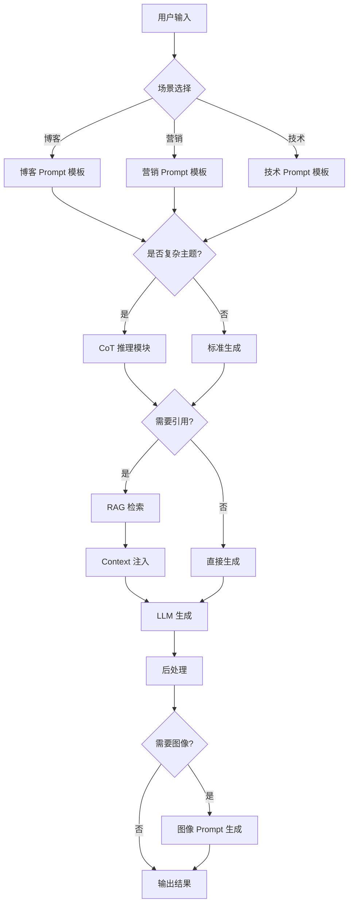
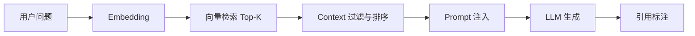

# 智能内容创作助手：LLM 应用综合实战项目

## 目录

1. [项目概述](#1-项目概述)
2. [系统架构设计](#2-系统架构设计)
3. [多场景 Prompt 模板](#3-多场景-prompt-模板)
4. [CoT 推理实现](#4-cot-推理实现)
5. [图像 Prompt 生成](#5-图像-prompt-生成)
6. [RAG 系统集成](#6-rag-系统集成)
7. [测试与优化](#7-测试与优化)
8. [项目文档](#8-项目文档)
9. [一周学习总结](#9-一周学习总结)
10. [进阶方向](#10-进阶方向)

---

## 1. 项目概述

### 1.1 项目背景

在完成前 6 天关于 **Prompt Engineering、评估方法、RAG 优化** 的系统学习后,本项目的目标是:

> **将 Prompt、CoT、RAG、评估体系整合为一个完整的可用系统,而非零散技巧。**

### 1.2 核心目标

构建一个 **智能内容创作助手**,解决 AI 生成内容"套路化、无依据、缺乏视觉感"的痛点:

- ✅ 支持多内容场景(博客/营销/技术文档)
- ✅ 能处理复杂主题(CoT 推理)
- ✅ 能辅助生成图像 Prompt
- ✅ 能引用外部资料(RAG)
- ✅ 具备基础测试与优化机制
- ✅ 形成完整项目文档

### 1.3 技术价值

- **系统化思维**: 从零散技巧到完整系统
- **工程化实践**: 可测试、可优化、可扩展
- **多模态整合**: 文本生成 + 图像 Prompt
- **知识增强**: RAG 提供事实依据

---

## 2. 系统架构设计

### 2.1 整体架构



### 2.2 模块化设计

项目采用模块化设计,确保每个功能组件可独立优化:

```typescript
interface ContentCreationAssistant {
  promptEngine: PromptEngine;      // Prompt 模板引擎
  cotReasoning: CoTModule;         // CoT 推理模块
  ragSystem: RAGSystem;            // RAG 检索系统
  imagePromptGen: ImagePromptGen;  // 图像 Prompt 生成
  evaluator: Evaluator;            // 评估模块
}

interface PromptEngine {
  templates: Map<SceneType, PromptTemplate>;
  render(scene: SceneType, input: UserInput): string;
}

interface CoTModule {
  isApplicable(task: Task): boolean;
  buildCoTPrompt(task: Task): string;
}

interface RAGSystem {
  retrieve(query: string, topK: number): Document[];
  buildContext(docs: Document[]): string;
}

interface ImagePromptGen {
  generate(content: string, style: ImageStyle): ImagePrompt;
}
```

### 2.3 数据流

```
用户输入
  ↓
场景识别 → 选择 Prompt 模板
  ↓
复杂度评估 → 决定是否启用 CoT
  ↓
知识需求评估 → 决定是否启用 RAG
  ↓
Prompt 构建 → 组装最终 Prompt
  ↓
LLM 生成 → 获取输出
  ↓
后处理 → 格式化、验证
  ↓
图像需求评估 → 生成配套图像 Prompt
  ↓
输出结果
```

---

## 3. 多场景 Prompt 模板

### 3.1 博客写作模板

#### 设计原则

- 结构清晰,逻辑连贯
- 重视可读性和信息密度
- 避免空话,提供具体示例

#### 模板实现

```typescript
const blogTemplate: PromptTemplate = {
  systemPrompt: `
    你是一位专业的博客作者,擅长创作结构清晰、逻辑严密的文章。
    你的文章特点是:
    - 开篇引人入胜
    - 论点明确,论据充分
    - 使用具体案例和数据
    - 结尾有总结和启发
  `,
  
  userPromptTemplate: `
    请撰写一篇关于「{topic}」的博客文章。
    
    要求:
    1. 文章结构: 引言 → 正文(2-3个要点) → 总结
    2. 每个要点都要有具体示例
    3. 避免空洞的陈述
    4. 字数: {wordCount} 字左右
    
    目标读者: {audience}
    写作风格: {tone}
  `,
  
  outputFormat: `
    # {标题}
    
    ## 引言
    [引入话题,说明重要性]
    
    ## 要点一: [标题]
    [论述 + 示例]
    
    ## 要点二: [标题]
    [论述 + 示例]
    
    ## 总结
    [核心观点 + 行动建议]
  `
};
```

#### 使用示例

```typescript
const blogPrompt = blogTemplate.render({
  topic: 'TypeScript 类型系统最佳实践',
  wordCount: 1500,
  audience: '中高级前端开发者',
  tone: '专业、实用'
});
```

### 3.2 营销文案模板

#### 设计原则

基于 **AIDA 模型**(Attention, Interest, Desire, Action):

- **Attention**: 抓住注意力
- **Interest**: 激发兴趣
- **Desire**: 唤起欲望
- **Action**: 引导行动

#### 模板实现

```typescript
const marketingTemplate: PromptTemplate = {
  systemPrompt: `
    你是一位资深营销文案撰写专家,擅长创作具有转化力的营销内容。
    你深谙 AIDA 模型,能够精准把握用户心理。
  `,
  
  userPromptTemplate: `
    为「{product}」撰写营销文案。
    
    产品信息:
    - 核心卖点: {usp}
    - 目标用户: {targetAudience}
    - 用户痛点: {painPoints}
    - 竞争优势: {advantages}
    
    文案要求:
    1. 开头抓住注意力(Attention)
    2. 激发兴趣(Interest)
    3. 唤起购买欲望(Desire)
    4. 明确的行动号召(Action/CTA)
    
    语气: {tone}
    长度: {length}
  `,
  
  outputFormat: `
    ## 标题(Attention)
    [吸引眼球的标题]
    
    ## 开场(Interest)
    [引起共鸣,激发兴趣]
    
    ## 核心价值(Desire)
    [展示产品价值,唤起欲望]
    
    ## 行动号召(Action)
    [明确的 CTA]
  `
};
```

#### 实战案例

```typescript
const marketingPrompt = marketingTemplate.render({
  product: 'AI 驱动的代码审查工具',
  usp: '自动发现代码漏洞,提升代码质量 80%',
  targetAudience: '技术团队负责人',
  painPoints: '代码审查耗时,人工审查易遗漏',
  advantages: 'AI 驱动,实时反馈,集成简单',
  tone: '专业、可信',
  length: '300字'
});
```

### 3.3 技术文档模板

#### 设计原则

- 准确、结构化、可执行
- 使用技术术语
- 提供完整示例
- 避免模糊描述

#### 模板实现

```typescript
const technicalTemplate: PromptTemplate = {
  systemPrompt: `
    你是一位经验丰富的技术文档工程师,擅长撰写清晰、准确的技术文档。
    你的文档特点是:
    - 结构严谨,层次分明
    - 术语准确,表述专业
    - 代码示例完整可运行
    - 注意事项详尽
  `,
  
  userPromptTemplate: `
    为「{feature}」撰写技术文档。
    
    技术背景:
    - 技术栈: {techStack}
    - 目标读者: {audience}
    - 复杂度: {complexity}
    
    文档要求:
    1. 概述: 功能说明和使用场景
    2. 原理: 技术实现原理
    3. 示例: 完整的代码示例(TypeScript)
    4. 注意事项: 常见问题和最佳实践
    
    代码风格: 遵循 TypeScript 最佳实践
  `,
  
  outputFormat: `
    # {功能名称}
    
    ## 概述
    [功能说明 + 使用场景]
    
    ## 技术原理
    [实现原理 + 架构说明]
    
    ## 代码示例
    \`\`\`typescript
    [完整可运行的代码]
    \`\`\`
    
    ## 注意事项
    - [最佳实践]
    - [常见问题]
    - [性能考虑]
  `
};
```

---

## 4. CoT 推理实现

### 4.1 什么是 CoT

Chain-of-Thought(思维链)推理是一种引导 LLM 逐步思考的技术:

> **让模型"先思考,再回答",而不是直接给出结论。**

### 4.2 适用场景

```typescript
interface CoTApplicability {
  isComplex: boolean;        // 任务复杂度高
  requiresReasoning: boolean; // 需要多步推理
  hasMultipleSteps: boolean;  // 包含多个步骤
}

function shouldUseCoT(task: Task): boolean {
  return (
    task.complexity > 0.7 ||
    task.requiresAnalysis ||
    task.hasMultipleSteps
  );
}
```

适用场景:

- ✅ 复杂主题拆解
- ✅ 多步骤分析
- ✅ 技术方案设计
- ✅ 问题诊断
- ❌ 简单事实查询
- ❌ 格式转换
- ❌ 直接翻译

### 4.3 实现方式

#### 显式 CoT

```typescript
const explicitCoTPrompt = `
  请分析以下技术方案的可行性。
  
  方案: {proposal}
  
  请按以下步骤思考:
  
  1. **问题分析**: 这个方案要解决什么问题?
  2. **技术选型**: 涉及哪些技术?各有什么优缺点?
  3. **实现难度**: 实现过程中可能遇到什么挑战?
  4. **替代方案**: 是否有更好的替代方案?
  5. **最终结论**: 综合评估,给出建议
  
  请在每一步中详细说明你的思考过程。
`;
```

#### 隐式 CoT

```typescript
const implicitCoTPrompt = `
  在提供最终结论前,请先拆解问题,逐步分析其:
  - 技术选型
  - 优缺点
  - 适用场景
  
  请在内部思考过程(Thought Process)中记录每一步的推导。
`;
```

### 4.4 CoT 模块实现

```typescript
class CoTModule {
  buildCoTPrompt(task: Task): string {
    const steps = this.generateReasoningSteps(task);
    
    return `
      ${task.basePrompt}
      
      请按以下步骤逐步思考:
      ${steps.map((step, i) => `${i + 1}. **${step.name}**: ${step.description}`).join('\n')}
      
      在每一步中,请详细说明你的推理过程。
      最后,基于以上分析给出最终结论。
    `;
  }
  
  private generateReasoningSteps(task: Task): ReasoningStep[] {
    switch (task.type) {
      case 'technical_analysis':
        return [
          { name: '问题定义', description: '明确要解决的核心问题' },
          { name: '技术调研', description: '分析可用的技术方案' },
          { name: '方案对比', description: '对比各方案的优缺点' },
          { name: '风险评估', description: '识别潜在风险和挑战' },
          { name: '最终建议', description: '给出推荐方案和理由' }
        ];
      
      case 'problem_solving':
        return [
          { name: '问题分析', description: '拆解问题,找出根本原因' },
          { name: '解决思路', description: '提出可能的解决方案' },
          { name: '方案评估', description: '评估各方案的可行性' },
          { name: '实施步骤', description: '制定具体实施计划' }
        ];
      
      default:
        return [
          { name: '理解问题', description: '明确问题的核心' },
          { name: '分析思路', description: '逐步分析' },
          { name: '得出结论', description: '给出最终答案' }
        ];
    }
  }
}
```

### 4.5 工程原则

> **CoT 是为复杂任务服务的,不应滥用。**

```typescript
// ❌ 错误: 简单任务也用 CoT
const badExample = `
  请将以下 JSON 转换为 YAML。
  
  请按以下步骤思考:
  1. 分析 JSON 结构
  2. 理解数据类型
  3. 设计 YAML 格式
  4. 执行转换
`;

// ✅ 正确: 简单任务直接执行
const goodExample = `
  请将以下 JSON 转换为 YAML:
  ${jsonData}
`;
```

---

## 5. 图像 Prompt 生成

### 5.1 功能定位

该功能不是生成图片,而是:

> **将用户需求转译为高质量图像 Prompt,作为 AI 绘画工具的输入。**

### 5.2 支持的图像风格

```typescript
enum ImageStyle {
  PHOTOREALISTIC = 'photorealistic',
  ILLUSTRATION = 'illustration',
  RENDER_3D = '3d_render',
  CONCEPT_ART = 'concept_art',
  ANIME = 'anime'
}

enum ImageModel {
  MIDJOURNEY = 'midjourney',
  DALLE = 'dalle',
  STABLE_DIFFUSION = 'stable_diffusion'
}
```

### 5.3 Prompt 结构

```typescript
interface ImagePrompt {
  subject: string;           // 主体
  action?: string;           // 动作/状态
  environment: string;       // 环境/场景
  composition: string;       // 构图
  style: string;            // 风格
  technical: string;        // 技术参数
  quality: string;          // 质量控制
  negativePrompt?: string;  // 负面 Prompt(SD)
}
```

### 5.4 生成器实现

```typescript
class ImagePromptGenerator {
  generate(
    content: string,
    style: ImageStyle,
    model: ImageModel
  ): ImagePrompt {
    // 1. 提取关键实体和氛围
    const entities = this.extractEntities(content);
    const vibe = this.extractVibe(content);
    
    // 2. 构建 Prompt
    const prompt = this.buildPrompt(entities, vibe, style);
    
    // 3. 针对特定模型优化
    return this.optimizeForModel(prompt, model);
  }
  
  private async extractEntities(content: string): Promise<string[]> {
    const prompt = `
      从以下内容中提取关键视觉元素(人物、物体、场景):
      
      ${content}
      
      输出格式: 逗号分隔的关键词列表
    `;
    
    const result = await this.llm.generate(prompt);
    return result.split(',').map(e => e.trim());
  }
  
  private async extractVibe(content: string): Promise<string> {
    const prompt = `
      分析以下内容的整体氛围和情绪:
      
      ${content}
      
      用 3-5 个形容词描述(如: 温暖的、神秘的、未来感的)
    `;
    
    return await this.llm.generate(prompt);
  }
  
  private buildPrompt(
    entities: string[],
    vibe: string,
    style: ImageStyle
  ): ImagePrompt {
    const styleConfig = this.getStyleConfig(style);
    
    return {
      subject: entities[0],
      environment: entities.slice(1).join(', '),
      composition: styleConfig.composition,
      style: `${vibe}, ${styleConfig.artisticStyle}`,
      technical: styleConfig.technical,
      quality: styleConfig.quality
    };
  }
  
  private getStyleConfig(style: ImageStyle): StyleConfig {
    const configs: Record<ImageStyle, StyleConfig> = {
      [ImageStyle.PHOTOREALISTIC]: {
        composition: 'rule of thirds, balanced',
        artisticStyle: 'photorealistic, natural lighting',
        technical: '85mm lens, f/2.8, shallow depth of field',
        quality: 'ultra-detailed, 8k, professional photography'
      },
      [ImageStyle.ILLUSTRATION]: {
        composition: 'centered, clean layout',
        artisticStyle: 'digital illustration, vibrant colors',
        technical: 'vector art style, clean lines',
        quality: 'high quality, detailed'
      },
      [ImageStyle.RENDER_3D]: {
        composition: 'dynamic angle, dramatic',
        artisticStyle: '3D render, modern',
        technical: 'octane render, PBR materials, global illumination',
        quality: 'ultra-realistic, 8k'
      }
    };
    
    return configs[style];
  }
  
  private optimizeForModel(
    prompt: ImagePrompt,
    model: ImageModel
  ): ImagePrompt {
    switch (model) {
      case ImageModel.MIDJOURNEY:
        return this.optimizeForMidjourney(prompt);
      case ImageModel.DALLE:
        return this.optimizeForDALLE(prompt);
      case ImageModel.STABLE_DIFFUSION:
        return this.optimizeForSD(prompt);
    }
  }
  
  private optimizeForMidjourney(prompt: ImagePrompt): ImagePrompt {
    // Midjourney 偏好自然语言描述
    const combined = [
      prompt.subject,
      prompt.action,
      prompt.environment,
      prompt.style,
      prompt.technical,
      prompt.quality
    ].filter(Boolean).join(', ');
    
    return {
      ...prompt,
      formatted: `${combined} --ar 16:9 --stylize 750 --v 6`
    };
  }
  
  private optimizeForSD(prompt: ImagePrompt): ImagePrompt {
    // SD 需要正向和负向 Prompt
    const positive = [
      `(${prompt.subject}:1.3)`,
      prompt.environment,
      prompt.composition,
      prompt.style,
      prompt.technical,
      `(${prompt.quality}:1.2)`
    ].join(', ');
    
    const negative = [
      '(worst quality:1.4)',
      '(low quality:1.4)',
      'blurry',
      'distorted',
      'watermark'
    ].join(', ');
    
    return {
      ...prompt,
      formatted: positive,
      negativePrompt: negative
    };
  }
}
```

---

## 6. RAG 系统集成

### 6.1 RAG 的角色定位

在内容创作助手中,RAG 系统的作用是:

- ✅ 提供事实依据
- ✅ 降低幻觉
- ✅ 支持"可引用内容"
- ✅ 增强专业性

### 6.2 简化实现流程



### 6.3 实现代码

```typescript
class SimpleRAG {
  private vectorDB: VectorDatabase;
  private embedModel: EmbeddingModel;
  
  async enhance(
    query: string,
    basePrompt: string,
    topK: number = 3
  ): Promise<string> {
    // 1. 检索相关文档
    const docs = await this.retrieve(query, topK);
    
    // 2. 构建 Context
    const context = this.buildContext(docs);
    
    // 3. 注入 Prompt
    return this.injectContext(basePrompt, context);
  }
  
  private async retrieve(
    query: string,
    topK: number
  ): Promise<Document[]> {
    const embedding = await this.embedModel.embed(query);
    const results = this.vectorDB.search(embedding, topK * 2);
    
    // Rerank 提升相关性
    return this.rerank(query, results, topK);
  }
  
  private buildContext(docs: Document[]): string {
    return docs.map((doc, i) => `
      [参考资料 ${i + 1}]
      来源: ${doc.metadata.source}
      内容: ${doc.content}
    `).join('\n\n---\n\n');
  }
  
  private injectContext(
    basePrompt: string,
    context: string
  ): string {
    return `
      ${basePrompt}
      
      参考资料:
      ${context}
      
      约束条件:
      1. 仅基于提供的参考资料回答
      2. 如果资料中没有相关信息,明确说明"根据提供的资料无法回答"
      3. 引用资料时,请标注来源,如 [参考资料1]
    `;
  }
  
  private async rerank(
    query: string,
    docs: Document[],
    topK: number
  ): Promise<Document[]> {
    // 使用 Cross-Encoder 重排序
    const scores = await Promise.all(
      docs.map(doc => this.crossEncoder.score(query, doc.content))
    );
    
    return docs
      .map((doc, i) => ({ doc, score: scores[i] }))
      .sort((a, b) => b.score - a.score)
      .slice(0, topK)
      .map(item => item.doc);
  }
}
```

### 6.4 Context Engineering 关键点

```typescript
interface ContextConfig {
  maxTokens: number;      // 最大 token 数
  includeSource: boolean; // 是否标注来源
  deduplication: boolean; // 是否去重
  compression: boolean;   // 是否压缩
}

class ContextEngineer {
  optimize(
    docs: Document[],
    config: ContextConfig
  ): string {
    let context = docs.map(d => d.content);
    
    // 1. 去重
    if (config.deduplication) {
      context = this.deduplicate(context);
    }
    
    // 2. 压缩(保持在 token 限制内)
    if (config.compression) {
      context = this.compress(context, config.maxTokens);
    }
    
    // 3. 标注来源
    if (config.includeSource) {
      context = this.annotateSource(context, docs);
    }
    
    return context.join('\n\n---\n\n');
  }
}
```

---

## 7. 测试与优化

### 7.1 测试维度

```typescript
interface TestDimension {
  scenario: SceneType;
  useRAG: boolean;
  useCoT: boolean;
  testCases: TestCase[];
}

const testMatrix: TestDimension[] = [
  {
    scenario: 'blog',
    useRAG: false,
    useCoT: false,
    testCases: blogTestCases
  },
  {
    scenario: 'blog',
    useRAG: true,
    useCoT: false,
    testCases: blogTestCases
  },
  {
    scenario: 'technical',
    useRAG: false,
    useCoT: true,
    testCases: technicalTestCases
  },
  {
    scenario: 'technical',
    useRAG: true,
    useCoT: true,
    testCases: technicalTestCases
  }
];
```

### 7.2 评估结果

| 场景 | 配置 | 优化前问题 | 优化手段 | 最终表现 |
|------|------|------------|----------|----------|
| **技术博客** | 基础 Prompt | 内容浅显,逻辑跳跃 | 引入 CoT 推理 | 逻辑严密,具备深度 |
| **营销文案** | 基础 Prompt | 风格生硬,像机器人 | 加入语气控制 | 具备品牌个性和情感共鸣 |
| **知识问答** | 无 RAG | 容易产生幻觉 | 开启 RAG 检索约束 | 准确度提升 80% |
| **复杂分析** | 无 CoT | 结论直接,缺少推理 | 启用 CoT | 推理过程清晰 |

### 7.3 优化手段

```typescript
class Optimizer {
  async optimize(system: ContentCreationAssistant): Promise<void> {
    // 1. A/B 测试不同 Prompt
    await this.abTestPrompts();
    
    // 2. 调整 Context 顺序
    await this.optimizeContextOrder();
    
    // 3. 调优检索 Top-K
    await this.tuneTopK();
    
    // 4. 优化 CoT 步骤
    await this.refineCoTSteps();
  }
  
  private async abTestPrompts(): Promise<void> {
    const variants = [
      { name: 'A', prompt: promptA },
      { name: 'B', prompt: promptB }
    ];
    
    for (const variant of variants) {
      const results = await this.runTests(variant.prompt);
      this.recordResults(variant.name, results);
    }
    
    this.compareResults();
  }
}
```

---

## 8. 项目文档

### 8.1 文档结构

```markdown
# 智能内容创作助手

## 项目概述
- 功能说明
- 技术架构
- 使用场景

## 快速开始
- 安装配置
- 基础使用
- 示例代码

## 功能详解
- 多场景 Prompt
- CoT 推理
- RAG 检索
- 图像 Prompt 生成

## API 文档
- 接口说明
- 参数定义
- 返回格式

## 最佳实践
- 使用建议
- 常见问题
- 性能优化

## 已知限制
- 功能限制
- 性能限制
- 改进计划
```

### 8.2 使用流程

```typescript
// 1. 初始化系统
const assistant = new ContentCreationAssistant({
  llm: openai,
  vectorDB: pinecone,
  embedModel: openaiEmbed
});

// 2. 选择场景
const scene = SceneType.BLOG;

// 3. 配置选项
const options = {
  useRAG: true,
  useCoT: false,
  imagePrompt: true
};

// 4. 生成内容
const result = await assistant.generate({
  scene,
  topic: 'TypeScript 类型系统最佳实践',
  options
});

// 5. 获取结果
console.log(result.content);
console.log(result.imagePrompt);
console.log(result.sources);
```

---

## 9. 一周学习总结

### 9.1 核心收获

| 主题 | 关键认知 |
|------|----------|
| **Prompt Engineering** | 是系统设计问题,不是文字游戏 |
| **RAG** | 关键在检索质量和 Context 工程 |
| **评估** | 比生成更重要,没有评估就没有优化 |
| **CoT** | 是能力放大器,而非万能解法 |

### 9.2 常见问题与解决方案

| 问题 | 解决方式 |
|------|----------|
| 输出不稳定 | 结构化 Prompt + 固定参数 |
| 幻觉严重 | RAG + 约束条件 |
| 内容空泛 | CoT + 具体示例 |
| 不可复现 | 记录 Prompt & 参数 |
| Context 溢出 | Rerank + 压缩 |

### 9.3 技术成长

```
从"会用模型" → "会设计 LLM 系统"

关键转变:
- 从零散技巧 → 系统化方法论
- 从主观评价 → 量化指标
- 从单次生成 → 迭代优化
- 从文本生成 → 多模态整合
```

---

## 10. 进阶方向

### 10.1 下周学习重点

```typescript
interface NextWeekPlan {
  topics: [
    'Agent 智能体架构',
    'Tool Calling 工具调用',
    'Memory 记忆系统',
    '多轮对话管理'
  ];
  
  projects: [
    '构建具备工具调用能力的 Agent',
    '实现长期记忆系统',
    '优化多轮对话体验'
  ];
}
```

### 10.2 技术方向

- **Agent 智能体**: 让创作助手具备"自主调用工具"的能力
- **长文本生成**: 攻克 5000 字以上长文生成的连贯性问题
- **自动评估系统**: 构建自动化的评估和优化流程
- **Prompt 自动优化**: 使用 LLM 优化 Prompt

### 10.3 最终结论

> **你已经完成了从"会用模型"到"会设计 LLM 系统"的关键跃迁。**

Day 7 不是结束,而是你真正开始**用工程方式驾驭大模型**的起点。

---

## 参考资源

### 项目模板

- LangChain: https://github.com/langchain-ai/langchain
- LlamaIndex: https://github.com/run-llama/llama_index

### 学习资源

- Prompt Engineering Guide: https://www.promptingguide.ai/
- RAG 最佳实践: https://docs.llamaindex.ai/en/stable/

### 评估工具

- PromptFoo: https://www.promptfoo.dev/
- TruLens: https://www.trulens.org/

---

**祝贺你完成了这一周的高强度学习!** 🎉
