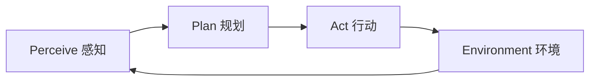
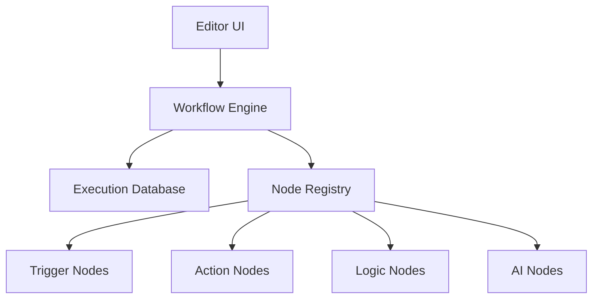
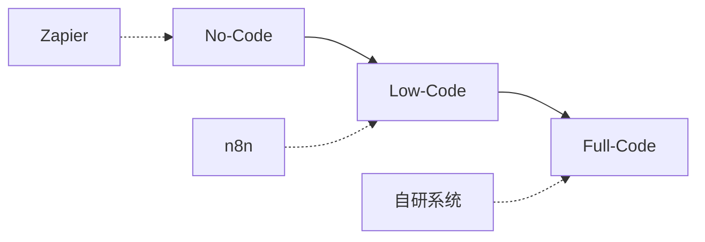
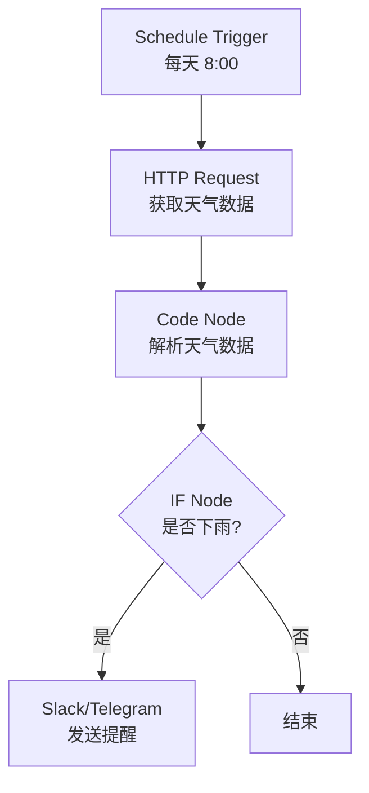

# n8n 基础与 Agentic Workflow：从自动化到智能化的技术跃迁

## 目录

1. [引言：进入 Agentic AI 时代](#1-引言进入-agentic-ai-时代)
2. [AI Chatbot vs AI Agent](#2-ai-chatbot-vs-ai-agent)
3. [Perceive-Plan-Act 范式](#3-perceive-plan-act-范式)
4. [n8n 核心架构](#4-n8n-核心架构)
5. [开发方式光谱](#5-开发方式光谱)
6. [环境搭建与配置](#6-环境搭建与配置)
7. [节点系统详解](#7-节点系统详解)
8. [第一个工作流实践](#8-第一个工作流实践)
9. [最佳实践总结](#9-最佳实践总结)
10. [进阶方向](#10-进阶方向)

---

## 1. 引言：进入 Agentic AI 时代

### 1.1 学习目标


> **从"对话式 AI"思维,过渡到"可执行、可编排的 AI Agent 工作流"思维。**

核心目标:

- ✅ 明确 AI Chatbot 与 AI Agent 的本质差异
- ✅ 理解 n8n 在 Agentic AI 体系中的角色与架构
- ✅ 建立从 Prompt → Workflow → Agent 的思维过渡
- ✅ 掌握 Low-Code 工作流编排能力

### 1.2 技术价值

- **思维升级**: 从被动响应到主动执行
- **系统化能力**: 将 AI 能力整合到业务流程
- **快速原型**: Low-Code 加速 Agent 开发
- **可扩展性**: 从原型到生产的平滑过渡

---

## 2. AI Chatbot vs AI Agent

### 2.1 核心概念辨析

在进入工具操作前,明确核心定义至关重要。

#### AI Chatbot (聊天机器人)

**特征**:
- 主要是**反应式**的
- 根据给定的上下文回答问题
- 侧重于"对话"
- 边界通常止于"告知"

**典型形态**:
```
用户输入 → LLM 处理 → 文本输出
```

**代表产品**:
- ChatGPT
- 客服机器人
- FAQ 问答系统

#### AI Agent (智能体)

**特征**:
- 是**主动式**的
- 不仅能对话,还能利用**工具 (Tools)**
- 进行**规划 (Planning)** 并执行任务
- 具有"自主性"

**典型形态**:
```
目标设定 → 环境感知 → 计划制定 → 工具调用 → 任务执行
```

**代表应用**:
- 自动化内容发布 Agent
- 数据分析 Agent
- RAG + 工具调用 Agent

### 2.2 关键差异对比

| 维度 | AI Chatbot | AI Agent |
|------|------------|----------|
| **交互模式** | 被动响应 | 主动执行 |
| **目标导向** | 无明确目标 | 有明确目标 |
| **工具使用** | 不能 | 能够调用外部工具 |
| **跨系统能力** | 单一系统 | 多系统集成 |
| **状态管理** | 弱/无状态 | 强状态管理 |
| **决策能力** | 简单映射 | 复杂规划 |
| **执行能力** | 仅输出文本 | 可执行实际操作 |

### 2.3 核心差异

> **核心差异**: 智能体具有"自主性",能够为了完成目标而调用外部 API 或处理复杂逻辑。

```typescript
// Chatbot 模式
interface Chatbot {
  input: string;
  process(): string;  // 仅返回文本
}

// Agent 模式
interface Agent {
  goal: string;
  perceive(): Context;
  plan(context: Context): Action[];
  act(actions: Action[]): Result;
  tools: Tool[];  // 可调用外部工具
}
```

### 2.4 实际案例对比

**场景**: 用户说"明天会下雨吗?"

**Chatbot 响应**:
```
"根据天气预报,明天有 60% 的降雨概率。"
```

**Agent 响应**:
```
1. 调用天气 API 获取实时数据
2. 分析降雨概率
3. 如果 > 50%:
   - 发送提醒通知
   - 在日历中添加"带伞"备注
   - 调整出行计划建议
4. 返回综合建议
```

---

## 3. Perceive-Plan-Act 范式

### 3.1 PPA 核心概念

这是 AI Agent 的运行灵魂:



### 3.2 三阶段详解

#### Perceive (感知)

**功能**: 理解当前环境和状态

**输入来源**:
- 用户输入(文本、语音)
- 文件上传
- API 数据
- 传感器数据
- 数据库查询结果

**技术实现**:
```typescript
interface PerceptionModule {
  sensors: Sensor[];
  context: Context;
  
  perceive(): EnvironmentState {
    const inputs = this.sensors.map(s => s.read());
    return this.buildState(inputs, this.context);
  }
}
```

#### Plan (规划)

**功能**: 分析目标,决定下一步行动

**规划方式**:
- LLM 推理
- 规则引擎
- 决策树
- 强化学习

**技术实现**:
```typescript
interface PlanningModule {
  goal: Goal;
  state: EnvironmentState;
  
  async plan(): Promise<Action[]> {
    const prompt = `
      当前状态: ${this.state}
      目标: ${this.goal}
      
      请制定达成目标的步骤计划。
    `;
    
    const plan = await llm.generate(prompt);
    return this.parseActions(plan);
  }
}
```

#### Act (行动)

**功能**: 执行具体操作,对外部世界产生影响

**行动类型**:
- 调用 API
- 写入数据库
- 发送消息/邮件
- 更新文件
- 触发其他系统

**技术实现**:
```typescript
interface ActionModule {
  tools: Tool[];
  
  async act(action: Action): Promise<Result> {
    const tool = this.tools.find(t => t.name === action.tool);
    return await tool.execute(action.parameters);
  }
}
```

### 3.3 完整 Agent 循环

```typescript
class Agent {
  private perception: PerceptionModule;
  private planning: PlanningModule;
  private action: ActionModule;
  
  async run(goal: Goal): Promise<void> {
    while (!this.isGoalAchieved(goal)) {
      // 1. Perceive
      const state = this.perception.perceive();
      
      // 2. Plan
      this.planning.setState(state);
      const actions = await this.planning.plan();
      
      // 3. Act
      for (const action of actions) {
        const result = await this.action.act(action);
        
        // 更新状态
        this.perception.updateContext(result);
        
        // 检查是否需要重新规划
        if (this.needsReplanning(result)) {
          break;
        }
      }
    }
  }
}
```

---

## 4. n8n 核心架构

### 4.1 n8n 是什么

n8n 是一个 **Low-Code Workflow Automation 平台**,在 Agentic AI 场景中承担:

> **Agent 的"执行与编排层"**

**定位**:
- 不是模型本身
- 是连接模型、工具、系统的中间层
- 提供可视化编排能力
- 支持代码扩展

### 4.2 架构组件



#### 核心组件说明

| 组件 | 作用 | 技术特点 |
|------|------|----------|
| **Editor UI** | 可视化画布 | 拖拽构建逻辑 |
| **Workflow Engine** | 执行引擎 | 解析节点间的 JSON 数据流 |
| **Execution Database** | 执行记录 | 存储历史,便于调试 |
| **Nodes (节点)** | 功能块 | 封装好的功能单元 |

### 4.3 数据流模型

```typescript
interface WorkflowExecution {
  id: string;
  workflowId: string;
  mode: 'manual' | 'trigger' | 'webhook';
  startedAt: Date;
  stoppedAt?: Date;
  status: 'running' | 'success' | 'error';
  data: ExecutionData;
}

interface ExecutionData {
  resultData: {
    runData: {
      [nodeName: string]: NodeRunData[];
    };
  };
}

interface NodeRunData {
  startTime: number;
  executionTime: number;
  data: {
    main: INodeExecutionData[][];
  };
}
```

### 4.4 n8n 与 PPA 的映射

| PPA 阶段 | n8n 对应组件 | 示例节点 |
|----------|--------------|----------|
| **Perceive** | Trigger Nodes | Webhook, Schedule, Email Trigger |
| **Plan** | AI/Logic Nodes | OpenAI, IF, Switch, Code |
| **Act** | Action Nodes | HTTP Request, Database, Slack |

### 4.5 Fair-Code 模式

n8n 采用 "Fair-code" 许可:

- **源码开放**: 可查看、修改
- **自托管免费**: 个人和内部使用
- **商业限制**: 不能作为 SaaS 出售

**优势**:
- 透明度高
- 可定制性强
- 社区活跃
- 无供应商锁定

---

## 5. 开发方式光谱

### 5.1 三种开发模式



### 5.2 模式对比

| 维度 | No-Code | Low-Code | Full-Code |
|------|---------|----------|-----------|
| **学习曲线** | 极低 | 低 | 高 |
| **灵活性** | 低 | 中高 | 极高 |
| **开发速度** | 快 | 快 | 慢 |
| **可扩展性** | 低 | 高 | 极高 |
| **维护成本** | 低 | 中 | 高 |
| **适用场景** | 简单自动化 | Agent 原型/MVP | 复杂系统 |

### 5.3 n8n 的 Low-Code 定位

#### No-Code 能力

通过预设节点快速搭建:

```
Webhook Trigger
  ↓
HTTP Request (调用 API)
  ↓
Set Node (数据转换)
  ↓
Slack (发送通知)
```

#### Low-Code 能力

在节点间编写 JavaScript 表达式:

```javascript
// 在 Set Node 中处理数据
{
  "processedData": "{{ $json.rawData.toUpperCase() }}",
  "timestamp": "{{ new Date().toISOString() }}",
  "isValid": "{{ $json.value > 100 }}"
}
```

#### Full-Code 能力

使用 Code Node 编写复杂逻辑:

```javascript
// Code Node 示例
const items = $input.all();

const processed = items.map(item => {
  const data = item.json;
  
  // 复杂业务逻辑
  const result = complexCalculation(data);
  
  // 调用自定义库
  const enriched = await enrichData(result);
  
  return {
    json: enriched
  };
});

return processed;
```

### 5.4 为什么选择 n8n

**相比 No-Code (Zapier)**:
- ✅ 更强的自定义能力
- ✅ 可以写代码
- ✅ 自托管,数据安全
- ✅ 成本更低

**相比 Full-Code (自研)**:
- ✅ 开发速度快 10倍
- ✅ 可视化调试
- ✅ 内置大量集成
- ✅ 降低维护成本

**最佳定位**:
> **Agent 原型 → MVP → 内部工具**

---

## 6. 环境搭建与配置

### 6.1 安装方式对比

| 方式 | 优势 | 劣势 | 适用场景 |
|------|------|------|----------|
| **Docker** | 快速、隔离、易管理 | 需要 Docker 知识 | 推荐,本地开发 |
| **npm** | 原生、可定制 | 依赖管理复杂 | 开发者 |
| **Cloud** | 零配置、即用 | 成本、数据隐私 | 快速体验 |
| **自托管** | 完全控制 | 运维成本 | 生产环境 |

### 6.2 Docker 安装 (推荐)

```bash
# 基础安装
docker run -it --rm \
  --name n8n \
  -p 5678:5678 \
  -v ~/.n8n:/home/node/.n8n \
  n8nio/n8n

# 持久化 + 环境变量
docker run -d \
  --name n8n \
  -p 5678:5678 \
  -e N8N_BASIC_AUTH_ACTIVE=true \
  -e N8N_BASIC_AUTH_USER=admin \
  -e N8N_BASIC_AUTH_PASSWORD=password \
  -v ~/.n8n:/home/node/.n8n \
  n8nio/n8n
```

### 6.3 Docker Compose 配置

```yaml
version: '3.8'

services:
  n8n:
    image: n8nio/n8n
    container_name: n8n
    restart: unless-stopped
    ports:
      - "5678:5678"
    environment:
      - N8N_BASIC_AUTH_ACTIVE=true
      - N8N_BASIC_AUTH_USER=admin
      - N8N_BASIC_AUTH_PASSWORD=your_password
      - N8N_HOST=localhost
      - N8N_PORT=5678
      - N8N_PROTOCOL=http
      - NODE_ENV=production
      - WEBHOOK_URL=http://localhost:5678/
    volumes:
      - ~/.n8n:/home/node/.n8n
```

### 6.4 环境变量配置

```bash
# .env 文件
N8N_BASIC_AUTH_ACTIVE=true
N8N_BASIC_AUTH_USER=admin
N8N_BASIC_AUTH_PASSWORD=secure_password

# 数据库配置 (可选)
DB_TYPE=postgresdb
DB_POSTGRESDB_HOST=localhost
DB_POSTGRESDB_PORT=5432
DB_POSTGRESDB_DATABASE=n8n
DB_POSTGRESDB_USER=n8n
DB_POSTGRESDB_PASSWORD=n8n_password

# Webhook 配置
WEBHOOK_URL=https://your-domain.com/

# 执行模式
EXECUTIONS_MODE=regular
EXECUTIONS_TIMEOUT=300
EXECUTIONS_TIMEOUT_MAX=3600
```

### 6.5 访问与初始化

```bash
# 启动后访问
http://localhost:5678

# 首次访问会要求:
# 1. 创建账户
# 2. 设置工作区名称
# 3. 选择使用场景
```

---

## 7. 节点系统详解

### 7.1 Node 核心概念

Node 是 n8n 中的**最小执行单元**:

```typescript
interface INode {
  name: string;
  type: string;
  position: [number, number];
  parameters: INodeParameters;
  credentials?: INodeCredentials;
}

interface INodeExecutionData {
  json: IDataObject;
  binary?: IBinaryKeyData;
  pairedItem?: IPairedItemData;
}
```

### 7.2 节点分类

#### Trigger Nodes (触发器)

工作流的起点:

| 节点 | 触发方式 | 使用场景 |
|------|----------|----------|
| **Webhook** | HTTP 请求 | API 集成 |
| **Schedule** | 定时任务 | 定期执行 |
| **Email Trigger** | 收到邮件 | 邮件自动化 |
| **Manual Trigger** | 手动执行 | 测试调试 |
| **File Trigger** | 文件变化 | 文件监控 |

#### Action Nodes (动作)

执行具体操作:

| 节点 | 功能 | 使用场景 |
|------|------|----------|
| **HTTP Request** | API 调用 | 通用集成 |
| **Database** | 数据库操作 | 数据持久化 |
| **Slack/Discord** | 消息发送 | 通知提醒 |
| **Google Sheets** | 表格操作 | 数据记录 |
| **Email** | 发送邮件 | 邮件通知 |

#### Logic Nodes (逻辑)

控制流程:

| 节点 | 功能 | 使用场景 |
|------|------|----------|
| **IF** | 条件判断 | 分支逻辑 |
| **Switch** | 多路分支 | 复杂路由 |
| **Merge** | 合并数据 | 数据聚合 |
| **Split In Batches** | 批处理 | 大数据处理 |
| **Loop Over Items** | 循环 | 迭代处理 |

#### Data Nodes (数据)

数据处理:

| 节点 | 功能 | 使用场景 |
|------|------|----------|
| **Set** | 设置数据 | 数据转换 |
| **Edit Fields** | 编辑字段 | 字段操作 |
| **Aggregate** | 聚合 | 统计计算 |
| **Sort** | 排序 | 数据排序 |
| **Filter** | 过滤 | 数据筛选 |

#### Code Nodes (代码)

自定义逻辑:

| 节点 | 功能 | 使用场景 |
|------|------|----------|
| **Code** | JavaScript/Python | 复杂逻辑 |
| **Function** | 简单函数 | 数据转换 |
| **Function Item** | 单项处理 | 逐项处理 |

#### AI Nodes (AI)

AI 能力:

| 节点 | 功能 | 使用场景 |
|------|------|----------|
| **OpenAI** | GPT 调用 | 文本生成 |
| **AI Agent** | Agent 编排 | 智能决策 |
| **Embeddings** | 向量化 | RAG 系统 |
| **Vector Store** | 向量存储 | 知识库 |

### 7.3 数据流动机制

```typescript
// 节点间数据传递
const nodeA_output = {
  json: {
    name: "John",
    age: 30,
    email: "john@example.com"
  }
};

// 在下游节点中访问
const nodeB_input = $json;  // 获取上游数据
const name = $json.name;    // "John"
const age = $json.age;      // 30

// 表达式语法
const fullName = "{{ $json.name }}";
const isAdult = "{{ $json.age >= 18 }}";
const upperEmail = "{{ $json.email.toUpperCase() }}";
```

### 7.4 节点配置示例

```typescript
// HTTP Request Node 配置
{
  "method": "POST",
  "url": "https://api.example.com/users",
  "authentication": "predefinedCredentialType",
  "nodeCredentialType": "httpBasicAuth",
  "sendHeaders": true,
  "headerParameters": {
    "parameters": [
      {
        "name": "Content-Type",
        "value": "application/json"
      }
    ]
  },
  "sendBody": true,
  "bodyParameters": {
    "parameters": [
      {
        "name": "name",
        "value": "={{ $json.name }}"
      },
      {
        "name": "email",
        "value": "={{ $json.email }}"
      }
    ]
  }
}
```

---

## 8. 第一个工作流实践

### 8.1 实践目标

创建一个自动化的气象提醒 Agent 雏形:

> **每天早上 8 点检查天气,如果下雨则发送提醒**

### 8.2 工作流设计



### 8.3 节点配置详解

#### 1. Schedule Trigger

```json
{
  "rule": {
    "interval": [
      {
        "field": "cronExpression",
        "expression": "0 8 * * *"
      }
    ]
  }
}
```

#### 2. HTTP Request (OpenWeatherMap)

```json
{
  "method": "GET",
  "url": "https://api.openweathermap.org/data/2.5/weather",
  "qs": {
    "q": "Beijing",
    "appid": "YOUR_API_KEY",
    "units": "metric"
  }
}
```

#### 3. Code Node (数据解析)

```javascript
const items = $input.all();
const weatherData = items[0].json;

const processed = {
  city: weatherData.name,
  temperature: weatherData.main.temp,
  weather: weatherData.weather[0].main,
  description: weatherData.weather[0].description,
  willRain: weatherData.weather[0].main.toLowerCase().includes('rain'),
  humidity: weatherData.main.humidity
};

return [{ json: processed }];
```

#### 4. IF Node

```json
{
  "conditions": {
    "boolean": [
      {
        "value1": "={{ $json.willRain }}",
        "value2": true
      }
    ]
  }
}
```

#### 5. Slack Node

```json
{
  "channel": "#weather-alerts",
  "text": "🌧️ 今天会下雨！\n\n城市: {{ $json.city }}\n温度: {{ $json.temperature }}°C\n天气: {{ $json.description }}\n湿度: {{ $json.humidity }}%\n\n记得带伞哦！"
}
```

### 8.4 完整工作流 JSON

```json
{
  "name": "Weather Alert Agent",
  "nodes": [
    {
      "parameters": {
        "rule": {
          "interval": [
            {
              "field": "cronExpression",
              "expression": "0 8 * * *"
            }
          ]
        }
      },
      "name": "Schedule Trigger",
      "type": "n8n-nodes-base.scheduleTrigger",
      "position": [250, 300]
    },
    {
      "parameters": {
        "url": "https://api.openweathermap.org/data/2.5/weather",
        "qs": {
          "q": "Beijing",
          "appid": "YOUR_API_KEY",
          "units": "metric"
        }
      },
      "name": "Get Weather",
      "type": "n8n-nodes-base.httpRequest",
      "position": [450, 300]
    },
    {
      "parameters": {
        "jsCode": "const items = $input.all();\nconst weatherData = items[0].json;\n\nconst processed = {\n  city: weatherData.name,\n  temperature: weatherData.main.temp,\n  weather: weatherData.weather[0].main,\n  description: weatherData.weather[0].description,\n  willRain: weatherData.weather[0].main.toLowerCase().includes('rain'),\n  humidity: weatherData.main.humidity\n};\n\nreturn [{ json: processed }];"
      },
      "name": "Parse Weather",
      "type": "n8n-nodes-base.code",
      "position": [650, 300]
    },
    {
      "parameters": {
        "conditions": {
          "boolean": [
            {
              "value1": "={{ $json.willRain }}",
              "value2": true
            }
          ]
        }
      },
      "name": "Check Rain",
      "type": "n8n-nodes-base.if",
      "position": [850, 300]
    },
    {
      "parameters": {
        "channel": "#weather-alerts",
        "text": "🌧️ 今天会下雨！\\n\\n城市: {{ $json.city }}\\n温度: {{ $json.temperature }}°C\\n天气: {{ $json.description }}\\n湿度: {{ $json.humidity }}%\\n\\n记得带伞哦！"
      },
      "name": "Send Alert",
      "type": "n8n-nodes-base.slack",
      "position": [1050, 200]
    }
  ],
  "connections": {
    "Schedule Trigger": {
      "main": [[{ "node": "Get Weather", "type": "main", "index": 0 }]]
    },
    "Get Weather": {
      "main": [[{ "node": "Parse Weather", "type": "main", "index": 0 }]]
    },
    "Parse Weather": {
      "main": [[{ "node": "Check Rain", "type": "main", "index": 0 }]]
    },
    "Check Rain": {
      "main": [[{ "node": "Send Alert", "type": "main", "index": 0 }]]
    }
  }
}
```

### 8.5 关键发现

#### 数据结构是关键

节点间传递的是 JSON 对象:

```javascript
// 理解数据流
console.log($json);  // 查看当前节点输入
console.log($input.all());  // 查看所有输入项
console.log($node["NodeName"].json);  // 访问特定节点输出
```

#### 表达式语法

```javascript
// 基础语法
{{ $json.field }}

// 函数调用
{{ $json.text.toUpperCase() }}
{{ $json.date.toISOString() }}

// 条件表达式
{{ $json.value > 100 ? 'high' : 'low' }}

// 数组操作
{{ $json.items.map(item => item.name) }}
{{ $json.items.filter(item => item.active) }}
```

#### 可视化调试

n8n 的强大之处:

- ✅ 查看每个节点的输入/输出
- ✅ 单步执行
- ✅ 数据预览
- ✅ 错误定位

---

## 9. 最佳实践总结

### 9.1 核心原则

#### 原则 1: 从简单开始

```
❌ 错误: 一开始就构建复杂系统
✅ 正确: 从最小可用工作流开始,逐步迭代
```

#### 原则 2: 数据优先

```
在添加节点前,先理解:
- 输入数据结构是什么?
- 需要什么输出?
- 如何转换?
```

#### 原则 3: 善用调试

```
每个节点都要:
1. 查看输入数据
2. 执行节点
3. 验证输出
4. 再连接下一个节点
```

### 9.2 常见困惑与解答

| 困惑 | 解答 |
|------|------|
| n8n 是不是 Agent? | 不是,是 Agent 的执行平台 |
| n8n 会不会被 LLM 取代? | 不会,恰好相反,LLM 需要 n8n 这样的编排层 |
| 要不要一开始就很复杂? | 不要,从最小 Workflow 开始 |
| 如何处理错误? | 使用 Error Trigger 和 Try-Catch 节点 |
| 如何存储状态? | 使用数据库节点或 Sticky Notes |

### 9.3 性能优化

```typescript
// 1. 批处理而非逐项处理
// ❌ 错误
for (const item of items) {
  await httpRequest(item);
}

// ✅ 正确
const batch = items.slice(0, 100);
await httpRequest(batch);

// 2. 使用缓存
const cache = new Map();
if (cache.has(key)) {
  return cache.get(key);
}

// 3. 限制并发
const limit = 5;
const chunks = chunkArray(items, limit);
for (const chunk of chunks) {
  await Promise.all(chunk.map(process));
}
```

### 9.4 安全考虑

```typescript
// 1. 凭证管理
// ✅ 使用 n8n Credentials 系统
// ❌ 硬编码 API Key

// 2. 数据验证
function validateInput(data: unknown): boolean {
  // 验证数据结构
  // 防止注入攻击
  return isValid(data);
}

// 3. 错误处理
try {
  const result = await riskyOperation();
} catch (error) {
  // 记录错误
  // 不暴露敏感信息
  logger.error('Operation failed', { error: sanitize(error) });
}
```

---

## 10. 进阶方向

### 10.1 下一步学习

**Day 23 预告**: n8n + LLM Agent 实战

学习内容:
- 在 n8n 中接入 LLM
- 构建第一个真正的 AI Agent Workflow
- 让 Workflow 开始"做决定"

### 10.2 技术深化

#### 高级工作流模式

```typescript
// 1. 错误处理工作流
Trigger → Try → Main Logic → Catch → Error Handler

// 2. 并行处理
Trigger → Split → [Process A, Process B, Process C] → Merge

// 3. 循环处理
Trigger → Loop Start → Process → Decision → Loop End

// 4. 子工作流
Main Workflow → Execute Workflow → Sub Workflow
```

#### Agent 模式

```typescript
// 1. ReAct Agent
Perceive → Reason → Act → Observe → Repeat

// 2. Planning Agent
Goal → Plan → Execute Steps → Verify → Adjust

// 3. Multi-Agent
Coordinator → [Agent A, Agent B, Agent C] → Aggregator
```

### 10.3 框架对比

| 框架 | 定位 | 优势 | 劣势 |
|------|------|------|------|
| **n8n** | Low-Code 编排 | 可视化,快速 | 复杂逻辑受限 |
| **LangChain** | Agent 框架 | 灵活,强大 | 学习曲线陡 |
| **AutoGen** | Multi-Agent | 多智能体 | 较新,生态小 |
| **Semantic Kernel** | 企业级 | 微软支持 | .NET 为主 |

### 10.4 实战项目方向

```typescript
interface ProjectIdea {
  name: string;
  complexity: 'beginner' | 'intermediate' | 'advanced';
  technologies: string[];
}

const projects: ProjectIdea[] = [
  {
    name: '智能客服 Agent',
    complexity: 'beginner',
    technologies: ['n8n', 'OpenAI', 'Slack']
  },
  {
    name: '内容创作自动化',
    complexity: 'intermediate',
    technologies: ['n8n', 'OpenAI', 'RAG', 'Database']
  },
  {
    name: '数据分析 Agent',
    complexity: 'advanced',
    technologies: ['n8n', 'LLM', 'Python', 'BI Tools']
  }
];
```

---

## 参考资源

### 官方文档

- n8n 官方文档: https://docs.n8n.io/
- n8n 社区: https://community.n8n.io/
- n8n GitHub: https://github.com/n8n-io/n8n

### 学习资源

- n8n Academy: https://academy.n8n.io/
- Workflow Templates: https://n8n.io/workflows/
- YouTube 教程: n8n 官方频道

### Agent 框架

- LangChain: https://python.langchain.com/
- AutoGen: https://microsoft.github.io/autogen/
- Semantic Kernel: https://learn.microsoft.com/en-us/semantic-kernel/

