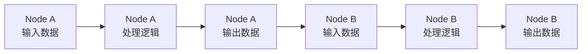
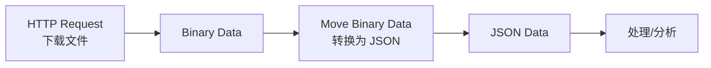
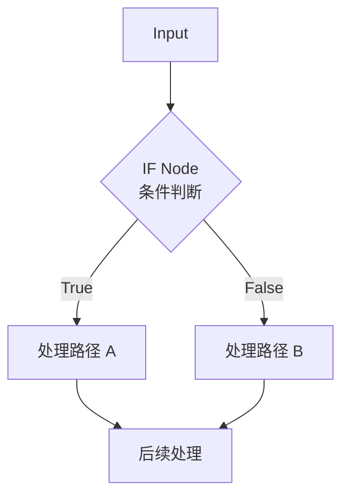
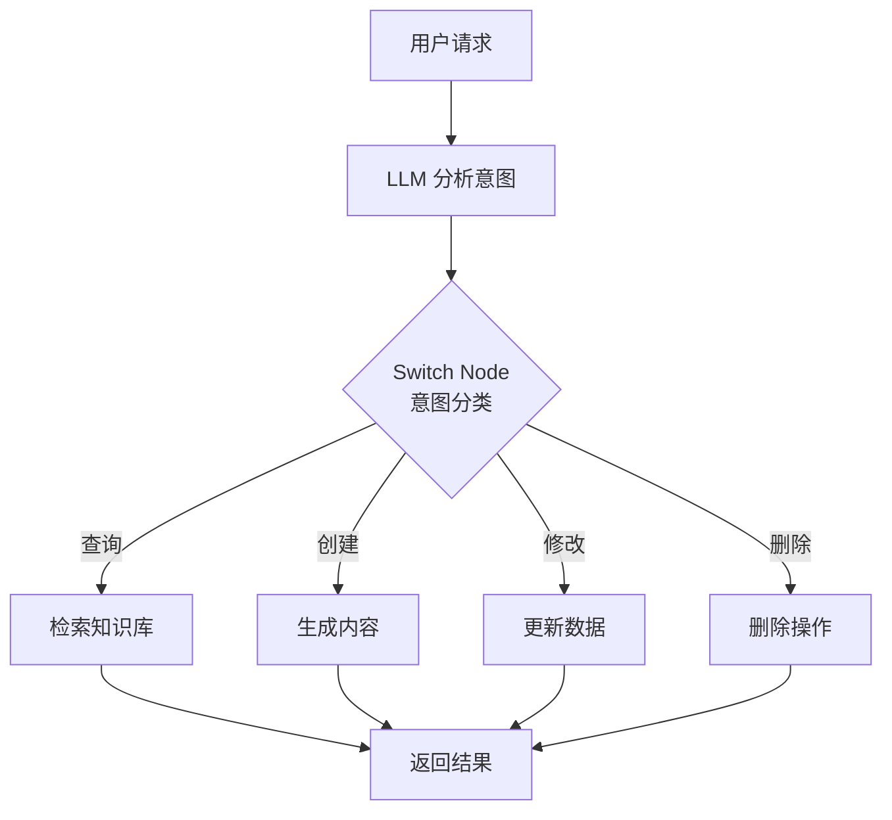
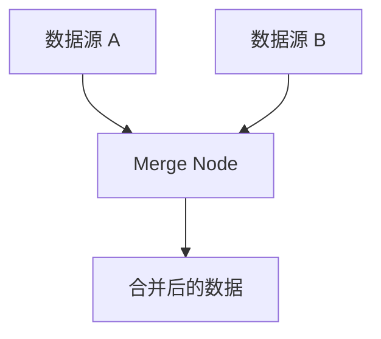
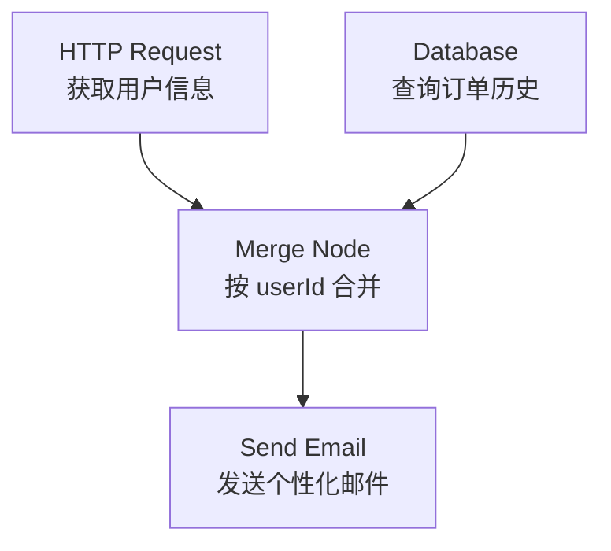
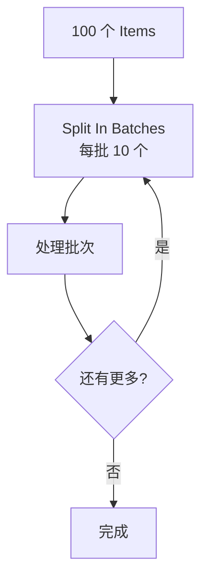
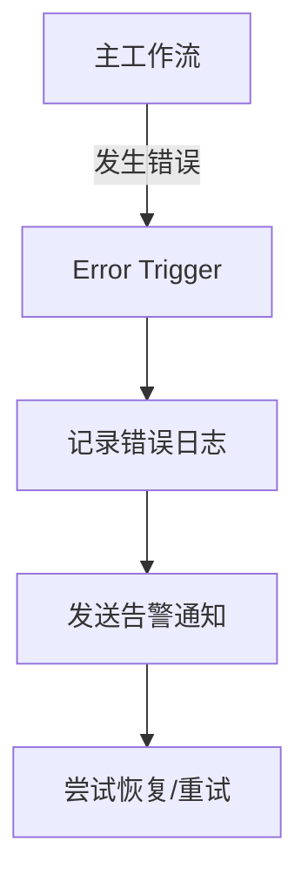
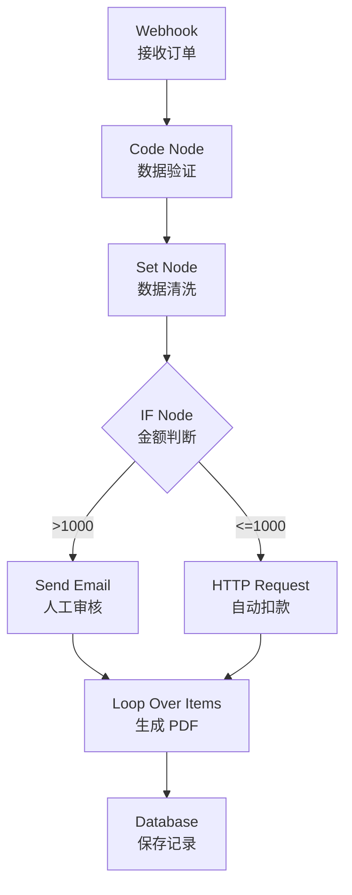

# n8n 数据流与节点操作：掌握 Agentic Workflow 的运行时逻辑

## 目录

1. [引言：从搭建流程到精确控制数据](#1-引言从搭建流程到精确控制数据)
2. [数据流核心概念](#2-数据流核心概念)
3. [Item 数据结构](#3-item-数据结构)
4. [Binary Data 处理](#4-binary-data-处理)
5. [数据映射技术](#5-数据映射技术)
6. [工作流控制：分支](#6-工作流控制分支)
7. [工作流控制：合并](#7-工作流控制合并)
8. [工作流控制：循环](#8-工作流控制循环)
9. [错误处理机制](#9-错误处理机制)
10. [复杂数据转换实践](#10-复杂数据转换实践)
11. [最佳实践与避坑指南](#11-最佳实践与避坑指南)
12. [进阶方向](#12-进阶方向)

---

## 1. 引言：从搭建流程到精确控制数据

### 1.1 学习目标

完成从 **"会用 n8n" → "理解 n8n 如何运作"** 的关键转变:

> **今天学的是 n8n 的"运行时逻辑",而不是 UI 操作技巧。**

核心目标:

- ✅ 深入理解 n8n 的数据流模型(Data Flow)
- ✅ 掌握 Items / Binary Data 的数据结构
- ✅ 熟练进行数据映射与数据变换
- ✅ 理解并应用控制流(分支/合并/循环/错误处理)
- ✅ 能设计复杂但可维护的数据处理 Workflow

### 1.2 技术价值

掌握数据流和节点控制意味着:

- **精确控制**: 从"搭建流程"进阶到"精确控制数据"
- **系统理解**: 理解 n8n 为什么能支撑 Agentic Workflow
- **工程能力**: 设计复杂但可维护的数据处理系统
- **调试能力**: 快速定位和解决数据流问题

---

## 2. 数据流核心概念

### 2.1 Data Flow 基本原理

n8n 处理数据的方式与传统编程语言有所不同,它基于一种特殊的 **JSON 数组结构**。

#### 核心特征

```typescript
// n8n 数据流的核心特征
interface DataFlowPrinciples {
  immutability: '数据不可变';
  flowDirection: '数据沿着连接流动';
  nodeTransformation: '每个节点转换数据';
}
```

**关键原则**:

- ✅ **数据不是全局变量**
- ✅ **数据沿着 Node 之间的连接流动**
- ✅ **每个 Node 不修改上游节点的数据**(不可变思想)

### 2.2 数据流动模型



**逻辑示意**:

```
Node A 输出 → Node B 输入 → Node B 输出 → Node C 输入
```

### 2.3 数据流 vs 传统编程

| 维度 | 传统编程 | n8n 数据流 |
|------|----------|-----------|
| **数据存储** | 变量、对象 | Items 数组 |
| **数据传递** | 函数参数、返回值 | 节点连接 |
| **数据修改** | 可变 | 不可变 |
| **执行模型** | 顺序/并发 | 数据驱动 |
| **调试方式** | 断点、日志 | 可视化数据流 |

---

## 3. Item 数据结构

### 3.1 Item 核心概念

在 n8n 中,数据以 `Items` 为单位传输。每个 Item 都是一个独立的 JSON 对象。

```typescript
interface INodeExecutionData {
  json: IDataObject;           // JSON 数据
  binary?: IBinaryKeyData;     // 二进制数据(可选)
  pairedItem?: IPairedItemData; // 配对信息(可选)
}

type Items = INodeExecutionData[];
```

### 3.2 Item 数组结构

**基础示例**:

```json
[
  {
    "json": {
      "name": "Apple",
      "price": 10,
      "category": "fruit"
    }
  },
  {
    "json": {
      "name": "Banana",
      "price": 5,
      "category": "fruit"
    }
  }
]
```

**完整示例**:

```json
[
  {
    "json": {
      "name": "Alice",
      "age": 30,
      "email": "alice@example.com"
    }
  },
  {
    "json": {
      "name": "Bob",
      "age": 25,
      "email": "bob@example.com"
    }
  }
]
```

### 3.3 关键理解点

> **多个 Item ≠ 多次执行**
> 
> 而是 **一次执行中的多条数据**

**数组逻辑**:

- 如果一个节点产生了 10 条数据
- 下游节点通常会针对这 10 个 Item 分别执行一次(隐式循环)
- 这是 n8n 的核心执行模型

### 3.4 Item 处理模式

```typescript
// 模式 1: 逐项处理(默认)
// 输入: [item1, item2, item3]
// 下游节点执行 3 次,每次处理 1 个 item

// 模式 2: 批量处理
// 输入: [item1, item2, item3]
// 下游节点执行 1 次,处理所有 items

// 模式 3: 聚合处理
// 输入: [item1, item2, item3]
// 输出: [aggregatedItem]
```

---

## 4. Binary Data 处理

### 4.1 Binary Data 概念

对于图片、PDF、音频等非文本文件,n8n 使用 **Binary** 模式处理。

**用途**:

- ✅ 文件(PDF / 图片 / CSV)
- ✅ 下载内容
- ✅ 上传附件
- ✅ 媒体处理

### 4.2 Binary Data 结构

```typescript
interface IBinaryData {
  data: string;          // Base64 编码的数据
  mimeType: string;      // MIME 类型
  fileName?: string;     // 文件名
  fileExtension?: string; // 文件扩展名
  fileSize?: number;     // 文件大小(字节)
}

interface IBinaryKeyData {
  [key: string]: IBinaryData;
}
```

**在 Item 中的表现**:

```json
{
  "json": {
    "fileName": "report.pdf",
    "uploadedBy": "Alice"
  },
  "binary": {
    "data": {
      "fileName": "report.pdf",
      "mimeType": "application/pdf",
      "data": "JVBERi0xLjQKJeLjz9MKMSAwIG9iago8PC9UeXBlL...",
      "fileSize": 102400
    }
  }
}
```

### 4.3 Binary 与 JSON 的关系

**关键特性**:

- 一个 Item 可以同时包含 `json` 和 `binary`
- JSON 存储元数据,Binary 存储实际文件
- 可以在两者之间转换

**常见模式**:



### 4.4 Binary Data 操作

```typescript
// 下载文件
const httpNode = {
  method: 'GET',
  url: 'https://example.com/file.pdf',
  responseFormat: 'file'  // 返回 binary data
};

// 转换为 Base64
const moveBinaryNode = {
  mode: 'binaryToJson',
  options: {
    encoding: 'base64'
  }
};

// 上传文件
const uploadNode = {
  method: 'POST',
  url: 'https://api.example.com/upload',
  sendBinaryData: true,
  binaryPropertyName: 'data'
};
```

---

## 5. 数据映射技术

### 5.1 数据映射概念

数据映射是 n8n 最核心的操作:

> **将上游 Node 的数据字段,映射到当前 Node 的输入参数中**

### 5.2 表达式(Expressions)

#### 基础语法

```javascript
// 访问当前 item 的 JSON 数据
{{ $json.fieldName }}

// 访问特定节点的输出
{{ $node["Node Name"].json["field"] }}

// 访问所有 items
{{ $input.all() }}

// 访问第一个 item
{{ $input.first() }}

// 访问最后一个 item
{{ $input.last() }}
```

#### 相对引用

```javascript
// 当前输入的字段
{{ $json["field_name"] }}

// 嵌套字段
{{ $json.user.email }}

// 数组访问
{{ $json.items[0].name }}
```

#### 跨节点引用

```javascript
// 引用特定节点的输出
{{ $node["HTTP Request"].json["data"] }}

// 引用特定节点的 binary data
{{ $node["Download File"].binary.data }}

// 引用节点的参数
{{ $node["HTTP Request"].parameter["url"] }}
```

### 5.3 表达式高级用法

```javascript
// 字符串操作
{{ $json.name.toUpperCase() }}
{{ $json.email.toLowerCase() }}
{{ $json.text.trim() }}

// 数学运算
{{ $json.price * 1.1 }}
{{ Math.round($json.value) }}

// 条件表达式
{{ $json.age >= 18 ? 'adult' : 'minor' }}

// 日期处理
{{ new Date().toISOString() }}
{{ new Date($json.timestamp).getFullYear() }}

// 数组操作
{{ $json.items.map(item => item.name) }}
{{ $json.items.filter(item => item.active) }}
{{ $json.items.length }}

// JSON 操作
{{ JSON.stringify($json) }}
{{ JSON.parse($json.jsonString) }}
```

### 5.4 数据映射实战示例

```typescript
// 场景: 从 API 获取用户数据,发送欢迎邮件

// Step 1: HTTP Request 获取用户
// 输出: { "id": 1, "name": "Alice", "email": "alice@example.com" }

// Step 2: Set Node 准备邮件数据
{
  "to": "{{ $json.email }}",
  "subject": "Welcome {{ $json.name }}!",
  "body": "Hello {{ $json.name }}, welcome to our platform!",
  "userId": "{{ $json.id }}"
}

// Step 3: Send Email Node
{
  "to": "{{ $json.to }}",
  "subject": "{{ $json.subject }}",
  "html": "{{ $json.body }}"
}
```

### 5.5 数据映射工程原则

#### 原则 1: 早期统一数据结构

```typescript
// ❌ 错误: 在多个节点中重复转换
Node1: {{ $json.user_name }}
Node2: {{ $json.user_name }}
Node3: {{ $json.user_name }}

// ✅ 正确: 使用 Set Node 统一结构
Set Node: {
  "name": "{{ $json.user_name }}",
  "email": "{{ $json.user_email }}"
}

// 后续节点直接使用
Node1: {{ $json.name }}
Node2: {{ $json.name }}
```

#### 原则 2: 使用 Set Node 做数据清洗层

```typescript
// Set Node 作为数据清洗层
{
  "cleanedData": {
    "name": "{{ $json.raw_name.trim() }}",
    "email": "{{ $json.raw_email.toLowerCase() }}",
    "age": "{{ parseInt($json.raw_age) }}",
    "isActive": "{{ $json.status === 'active' }}"
  }
}
```

#### 原则 3: 避免复杂表达式重复

```typescript
// ❌ 错误: 重复复杂表达式
Node1: {{ $json.items.filter(i => i.price > 100).map(i => i.name) }}
Node2: {{ $json.items.filter(i => i.price > 100).map(i => i.name) }}

// ✅ 正确: 提前计算并存储
Set Node: {
  "expensiveItems": "{{ $json.items.filter(i => i.price > 100).map(i => i.name) }}"
}

// 后续节点直接使用
Node1: {{ $json.expensiveItems }}
Node2: {{ $json.expensiveItems }}
```

---

## 6. 工作流控制：分支

### 6.1 分支概念

分支用于根据条件拆分数据流,是 Agent 决策的核心机制。



### 6.2 IF Node

#### 基础配置

```typescript
interface IFNodeConfig {
  conditions: {
    boolean: Array<{
      value1: string;      // 第一个值
      operation: string;   // 操作符
      value2: string;      // 第二个值
    }>;
    number: Array<{
      value1: number;
      operation: '>' | '<' | '>=' | '<=' | '==' | '!=';
      value2: number;
    }>;
    string: Array<{
      value1: string;
      operation: 'equals' | 'notEquals' | 'contains' | 'startsWith' | 'endsWith';
      value2: string;
    }>;
  };
  combineOperation: 'AND' | 'OR';
}
```

#### 实战示例

```json
{
  "conditions": {
    "number": [
      {
        "value1": "={{ $json.price }}",
        "operation": ">",
        "value2": 1000
      }
    ]
  }
}
```

### 6.3 Switch Node

用于多路分支:

```typescript
interface SwitchNodeConfig {
  mode: 'rules' | 'expression';
  rules: {
    output: number;
    conditions: Condition[];
  }[];
}
```

**示例**:

```json
{
  "mode": "rules",
  "rules": [
    {
      "output": 0,
      "conditions": [
        {
          "value1": "={{ $json.priority }}",
          "operation": "equals",
          "value2": "high"
        }
      ]
    },
    {
      "output": 1,
      "conditions": [
        {
          "value1": "={{ $json.priority }}",
          "operation": "equals",
          "value2": "medium"
        }
      ]
    },
    {
      "output": 2,
      "conditions": [
        {
          "value1": "={{ $json.priority }}",
          "operation": "equals",
          "value2": "low"
        }
      ]
    }
  ]
}
```

### 6.4 分支在 Agent 中的应用



---

## 7. 工作流控制：合并

### 7.1 合并概念

Merge Node 用于将多条数据流合并为一条。



### 7.2 合并策略

#### Append (追加)

简单叠加,不考虑关系:

```typescript
// Input 1: [{ name: "Alice" }]
// Input 2: [{ name: "Bob" }]
// Output: [{ name: "Alice" }, { name: "Bob" }]
```

#### Merge by Index (按索引合并)

按照 item 的索引位置合并:

```typescript
// Input 1: [{ name: "Alice" }, { name: "Bob" }]
// Input 2: [{ age: 30 }, { age: 25 }]
// Output: [
//   { name: "Alice", age: 30 },
//   { name: "Bob", age: 25 }
// ]
```

#### Merge by Key (按键合并)

根据共同的键进行连接(类似 SQL JOIN):

```typescript
// Input 1: [{ id: 1, name: "Alice" }, { id: 2, name: "Bob" }]
// Input 2: [{ userId: 1, score: 95 }, { userId: 2, score: 88 }]
// Merge on: id = userId
// Output: [
//   { id: 1, name: "Alice", score: 95 },
//   { id: 2, name: "Bob", score: 88 }
// ]
```

### 7.3 合并实战场景



---

## 8. 工作流控制：循环

### 8.1 隐式循环

n8n 的循环通常是隐式的:

> **对 Item 数组逐条执行 Node**

```typescript
// 输入: 10 个 Items
// 下游节点会执行 10 次(逻辑上)

// 例如:
Input: [
  { email: "user1@example.com" },
  { email: "user2@example.com" },
  { email: "user3@example.com" }
]

// Send Email Node 会执行 3 次
// 每次发送一封邮件
```

### 8.2 显式循环：Split In Batches

用于批量处理,防止 API 速率限制:

```typescript
interface SplitInBatchesConfig {
  batchSize: number;     // 每批数量
  options: {
    reset: boolean;      // 是否重置
  };
}
```

**工作流程**:



### 8.3 循环实战示例

```json
{
  "batchSize": 10,
  "options": {
    "reset": false
  }
}
```

**使用场景**:

- 批量处理用户
- 批量调用 API
- 批量生成内容
- 分页数据处理

---

## 9. 错误处理机制

### 9.1 错误来源

```typescript
enum ErrorSource {
  API_REQUEST_FAILED = 'API 请求失败',
  DATA_FORMAT_INVALID = '数据格式不符合预期',
  NODE_EXECUTION_ERROR = 'Node 执行异常',
  TIMEOUT = '超时',
  RATE_LIMIT = '速率限制'
}
```

### 9.2 错误处理方式

#### 方式 1: Continue On Fail

```typescript
// 节点配置
{
  "continueOnFail": true,
  "onError": "continueRegularOutput"
}

// 错误会被添加到输出中
{
  "json": {
    "error": {
      "message": "API request failed",
      "code": 500
    }
  }
}
```

#### 方式 2: Error Trigger

创建专门的错误处理工作流:



#### 方式 3: Try/Catch in Function Node

```javascript
// Function Node 中的错误处理
const items = $input.all();

const results = [];

for (const item of items) {
  try {
    // 可能出错的操作
    const result = riskyOperation(item.json);
    results.push({ json: result });
  } catch (error) {
    // 错误处理
    results.push({
      json: {
        error: error.message,
        originalData: item.json
      }
    });
  }
}

return results;
```

### 9.3 错误处理工程原则

> **错误是 Workflow 的一部分,不是例外。**

**最佳实践**:

```typescript
// 1. 预期错误应该被处理
if (!$json.email) {
  return [{ json: { error: 'Email is required' } }];
}

// 2. 关键操作应该有重试机制
let retries = 3;
while (retries > 0) {
  try {
    await apiCall();
    break;
  } catch (error) {
    retries--;
    if (retries === 0) throw error;
    await sleep(1000);
  }
}

// 3. 错误应该被记录和监控
logger.error('Operation failed', {
  nodeId: $node.id,
  error: error.message,
  data: $json
});
```

---

## 10. 复杂数据转换实践

### 10.1 实战案例：多格式订单处理 Agent



### 10.2 数据转换流程

#### Step 1: 接收数据

```json
{
  "orders": [
    {
      "id": "ORD001",
      "items": [
        { "product": "Laptop", "price": 1200, "qty": 1 },
        { "product": "Mouse", "price": 25, "qty": 2 }
      ],
      "customer": {
        "name": "Alice",
        "email": "alice@example.com"
      }
    }
  ]
}
```

#### Step 2: 数据清洗 (Set Node)

```typescript
{
  "orderId": "={{ $json.id }}",
  "customerName": "={{ $json.customer.name }}",
  "customerEmail": "={{ $json.customer.email }}",
  "totalAmount": "={{ $json.items.reduce((sum, item) => sum + item.price * item.qty, 0) }}",
  "itemCount": "={{ $json.items.length }}",
  "items": "={{ $json.items }}"
}
```

#### Step 3: 条件分支

```json
{
  "conditions": {
    "number": [
      {
        "value1": "={{ $json.totalAmount }}",
        "operation": ">",
        "value2": 1000
      }
    ]
  }
}
```

#### Step 4: 循环处理

```javascript
// Function Node: 为每个商品生成 PDF
const items = $json.items;
const results = [];

for (const item of items) {
  const pdfData = {
    orderId: $json.orderId,
    customer: $json.customerName,
    product: item.product,
    price: item.price,
    quantity: item.qty,
    total: item.price * item.qty
  };
  
  results.push({ json: pdfData });
}

return results;
```

### 10.3 Function Node 使用边界

#### 适合使用 Function Node

```typescript
// ✅ 复杂数据转换
const transformed = items.map(item => ({
  ...item,
  fullName: `${item.firstName} ${item.lastName}`,
  age: calculateAge(item.birthDate),
  category: categorize(item)
}));

// ✅ 批量处理
const batches = chunkArray(items, 100);
const results = await Promise.all(
  batches.map(batch => processBatch(batch))
);

// ✅ 复杂逻辑
if (condition1 && condition2) {
  // 复杂的嵌套逻辑
}
```

#### 不适合使用 Function Node

```typescript
// ❌ 简单字段映射(应该用 Set Node)
{
  "name": "={{ $json.user_name }}",
  "email": "={{ $json.user_email }}"
}

// ❌ 简单条件判断(应该用 IF Node)
{{ $json.age >= 18 ? 'adult' : 'minor' }}

// ❌ 所有问题都用 JS 写
// 应该优先使用内置节点
```

**原则**:

> **能用 Node 解决的,不要一上来写代码。**

---

## 11. 最佳实践与避坑指南

### 11.1 核心原则

#### 原则 1: n8n 的本质是数据流引擎

```
理解数据如何流动 > 记住节点配置
```

#### 原则 2: Item 是理解一切的核心

```
掌握 Item 结构 → 理解隐式循环 → 控制数据流
```

#### 原则 3: 好的 Workflow = 清晰的数据结构 + 清晰的控制流

```
数据清洗层 → 业务逻辑层 → 输出层
```

### 11.2 常见陷阱

#### 陷阱 1: "1 vs All" 的困惑

```typescript
// ❌ 误解: 为什么下游节点执行了多次?
// 原因: 输入有 N 个 Item,下游节点默认运行 N 次

// ✅ 正确理解
Input: [item1, item2, item3]  // 3 个 items
↓
下游节点执行 3 次,每次处理 1 个 item
```

#### 陷阱 2: 数据隔离问题

```typescript
// ❌ 错误: 合并不同步的节点数据
Node A: [item1, item2, item3]
Node B: [itemA, itemB]
Merge → 可能导致数据不匹配

// ✅ 正确: 检查 Item Index
// 确保两个分支的 item 数量和顺序一致
```

#### 陷阱 3: 表达式调试困难

```typescript
// ❌ 错误: 直接写复杂表达式,出错难调试
{{ $json.items.filter(i => i.price > 100).map(i => i.name).join(', ') }}

// ✅ 正确: 分步调试
// Step 1: {{ $json.items }}
// Step 2: {{ $json.items.filter(i => i.price > 100) }}
// Step 3: {{ $json.items.filter(i => i.price > 100).map(i => i.name) }}
// Step 4: {{ $json.items.filter(i => i.price > 100).map(i => i.name).join(', ') }}

// 利用 Editor 右侧的 Result Preview 实时观察
```

### 11.3 性能优化

```typescript
// 1. 批量处理而非逐项处理
// ❌ 慢
for (const item of items) {
  await apiCall(item);
}

// ✅ 快
const batch = items.slice(0, 100);
await apiCallBatch(batch);

// 2. 避免不必要的数据转换
// ❌ 浪费
Set Node 1 → Set Node 2 → Set Node 3

// ✅ 高效
一次性在 Set Node 中完成所有转换

// 3. 使用缓存
const cache = new Map();
if (cache.has(key)) {
  return cache.get(key);
}
```

---

## 12. 进阶方向

### 12.1 下一步学习

你现在已经具备:

- ✅ 数据在 n8n 中如何流动的"直觉"
- ✅ 复杂 Workflow 的拆解能力
- ✅ 构建 Agent 决策流程的基础

**自然演进方向**:

- n8n + LLM 的 Agent 决策
- 工具调用(Tool Use)
- 多步骤 Agent Workflow
- Memory 和状态管理

### 12.2 高级 Data Flow 模式

```typescript
// 1. 并行处理模式
Trigger → Split → [Process A, Process B, Process C] → Merge

// 2. 条件聚合模式
Trigger → IF → [Path A, Path B] → Aggregate → Output

// 3. 循环累积模式
Trigger → Loop Start → Process → Accumulate → Loop End

// 4. 错误恢复模式
Trigger → Try → Catch → Retry → Fallback
```

### 12.3 实战项目方向

```typescript
interface AdvancedProject {
  name: string;
  dataFlowComplexity: 'medium' | 'high' | 'expert';
  techniques: string[];
}

const projects: AdvancedProject[] = [
  {
    name: '多格式文件处理 Agent',
    dataFlowComplexity: 'medium',
    techniques: ['Binary Data', 'Branching', 'Loop']
  },
  {
    name: '智能数据同步系统',
    dataFlowComplexity: 'high',
    techniques: ['Merge', 'Error Handling', 'Batch Processing']
  },
  {
    name: '复杂业务流程自动化',
    dataFlowComplexity: 'expert',
    techniques: ['All Control Flow', 'State Management', 'Error Recovery']
  }
];
```

---

## 参考资源

### 官方文档

- n8n Data Flow: https://docs.n8n.io/data/
- Expression Reference: https://docs.n8n.io/code-examples/expressions/
- Node Reference: https://docs.n8n.io/integrations/

### 学习资源

- n8n Academy: https://academy.n8n.io/
- Community Workflows: https://n8n.io/workflows/
- YouTube Tutorials: n8n 官方频道

---

## 总结

**核心收获**:

1. ✅ n8n 的本质是**数据流引擎**
2. ✅ Item 是理解一切的核心
3. ✅ 分支 = 决策,合并 = 汇总
4. ✅ 循环是天然存在的,而不是显式语法
5. ✅ 好的 Workflow = 清晰的数据结构 + 清晰的控制流

**关键转变**:

从"搭建流程"进阶到"精确控制数据",你已经掌握了 n8n 的运行时逻辑,为构建复杂的 Agentic Workflow 打下了坚实基础。

准备好将 LLM 集成到 n8n 工作流中,构建真正的 AI Agent 了吗? 🚀
