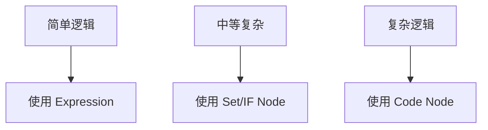
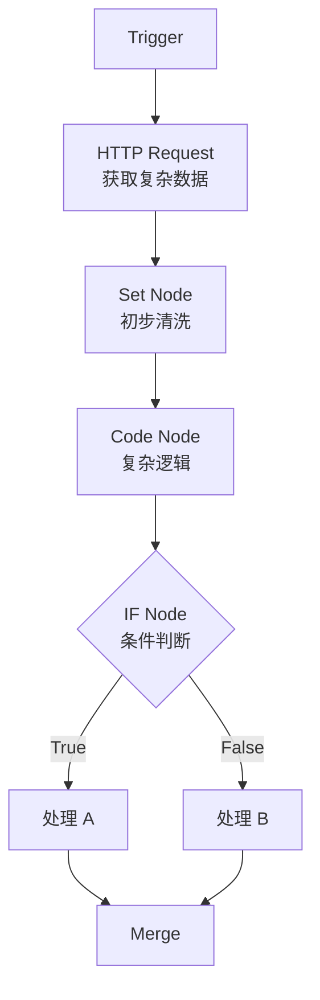

# n8n 表达式与动态配置：让 Workflow 活起来的核心技术

## 目录

1. [引言：从静态到动态](#1-引言从静态到动态)
2. [表达式核心概念](#2-表达式核心概念)
3. [占位符系统](#3-占位符系统)
4. [嵌套字段访问](#4-嵌套字段访问)
5. [表达式计算与逻辑](#5-表达式计算与逻辑)
6. [JavaScript Code Node](#6-javascript-code-node)
7. [日期时间处理](#7-日期时间处理)
8. [表达式参考备忘单](#8-表达式参考备忘单)
9. [最佳实践](#9-最佳实践)
10. [进阶技巧](#10-进阶技巧)

---

## 1. 引言：从静态到动态

### 1.1 学习目标

> **如何让 n8n 的 Workflow"活起来",而不是写死配置。**

在掌握了数据流动之后,Day 24 的目标是:

> **学会"精准、动态、可复用"地读取和操纵这些数据。**

核心能力:

- ✅ 熟练使用 n8n Expressions
- ✅ 灵活运用占位符(Placeholders)
- ✅ 正确访问嵌套/复杂数据结构
- ✅ 在表达式中进行计算、判断与拼接
- ✅ 合理使用 JavaScript Code Node 作为增强工具
- ✅ 掌握时间/日期处理这一高频痛点

### 1.2 技术价值

掌握表达式和 JavaScript 节点意味着:

- **动态能力**: 将静态流程转变为具备逻辑判断和计算能力的动态系统
- **突破限制**: 打破预设节点的限制,实现任何你想要的逻辑
- **数据驱动**: 构建真正的"数据驱动 Agent"
- **可复用性**: 创建灵活、可复用的工作流模板

---

## 2. 表达式核心概念

### 2.1 什么是 Expression

Expression 是 n8n 中用于**动态获取、计算、转换数据**的机制。

n8n 的表达式本质上是一个**基于 JavaScript 的微型模板引擎**。

**基本形式**:

```
{{ ... }}
```

**在 UI 中的表现**:

```
={{ $json.field }}
```

### 2.2 Expression 的本质

```typescript
// Expression 的本质
interface Expression {
  syntax: '{{ JavaScript Expression }}';
  executionTime: 'runtime';  // 运行时执行
  context: {
    $json: 'current item data',
    $node: 'other node data',
    $vars: 'workflow variables'
  };
}
```

> **在 Workflow 运行时执行的 JavaScript 表达式。**

### 2.3 基础示例

```javascript
// 简单字段访问
{{ $json.name }}

// 计算
{{ $json.price * 1.1 }}

// 条件判断
{{ $json.age >= 18 ? 'adult' : 'minor' }}

// 字符串拼接
{{ `Hello, ${$json.name}!` }}
```

---

## 3. 占位符系统

### 3.1 常用占位符

| 占位符 | 含义 | 使用场景 |
|--------|------|----------|
| `$json` | 当前 Item 的 JSON 数据 | 最常用,访问当前数据 |
| `$binary` | 当前 Item 的二进制数据 | 文件处理 |
| `$node` | 引用其他节点的数据 | 跨节点数据访问 |
| `$items()` | 获取其他节点的 Items | 批量数据处理 |
| `$execution` | 执行上下文 | 获取执行信息 |
| `$now` | 当前时间 | 时间相关操作 |
| `$today` | 今天日期 | 日期相关操作 |
| `$vars` | 工作流变量(全局变量) | 跨节点共享数据 |
| `$prevNode` | 前一个节点 | 快速回溯 |

### 3.2 占位符使用示例

```javascript
// $json - 访问当前数据
{{ $json.email }}
{{ $json.user.profile.name }}

// $node - 跨节点引用
{{ $node["HTTP Request"].json["status"] }}
{{ $node["MyNode"].json.id }}

// $items() - 获取其他节点的所有 items
{{ $items("HTTP Request")[0].json.data }}

// $now - 当前时间
{{ $now }}
{{ $now.toFormat('yyyy-MM-dd') }}

// $vars - 工作流变量
{{ $vars.apiKey }}
{{ $vars.environment }}
```

### 3.3 工程使用原则

#### 原则 1: 优先使用 `$json`

```javascript
// ✅ 推荐
{{ $json.field }}

// ❌ 避免(除非必要)
{{ $node["Current Node"].json.field }}
```

#### 原则 2: 跨 Node 引用要注意稳定性

```javascript
// ❌ 问题: Node 名称可能变化
{{ $node["HTTP Request 1"].json.data }}

// ✅ 更好: 使用有意义且稳定的名称
{{ $node["FetchUserData"].json.data }}
```

#### 原则 3: 避免深层硬编码

```javascript
// ❌ 容易出错
{{ $json.a.b.c.d.e.f }}

// ✅ 使用可选链
{{ $json.a?.b?.c?.d?.e?.f }}
```

---

## 4. 嵌套字段访问

### 4.1 常见嵌套结构

```json
{
  "user": {
    "profile": {
      "name": "Alice",
      "emails": ["alice@example.com", "alice@work.com"],
      "tags": ["dev", "ai"]
    },
    "settings": {
      "notifications": {
        "email": true,
        "sms": false
      }
    }
  },
  "metadata": {
    "createdAt": "2024-01-01",
    "version": "1.0"
  }
}
```

### 4.2 访问方式

```javascript
// 点号访问
{{ $json.user.profile.name }}  // "Alice"

// 数组访问
{{ $json.user.profile.emails[0] }}  // "alice@example.com"
{{ $json.user.profile.tags[1] }}    // "ai"

// 深层嵌套
{{ $json.user.settings.notifications.email }}  // true

// 方括号访问(字段名包含特殊字符时)
{{ $json["user-data"]["first-name"] }}
```

### 4.3 安全访问(非常重要)

#### 可选链(Optional Chaining)

避免字段不存在导致报错:

```javascript
// ❌ 危险: 如果 profile 不存在会报错
{{ $json.user.profile.name }}

// ✅ 安全: 使用可选链
{{ $json.user?.profile?.name }}

// ✅ 带默认值
{{ $json.user?.profile?.name || 'Unknown' }}
```

#### 工程原则

> **永远假设上游数据可能"不干净"。**

```typescript
// 防御性编程示例
const safeName = $json.user?.profile?.name ?? 'Guest';
const safeEmail = $json.user?.profile?.emails?.[0] ?? 'no-email@example.com';
const safeAge = $json.user?.age ?? 0;
```

### 4.4 复杂数据访问模式

```javascript
// 访问数组中的对象
{{ $json.users[0].name }}

// 过滤数组
{{ $json.users.filter(u => u.active) }}

// 映射数组
{{ $json.users.map(u => u.email) }}

// 查找元素
{{ $json.users.find(u => u.id === 123) }}

// 组合操作
{{ $json.users.filter(u => u.age > 18).map(u => u.name) }}
```

---

## 5. 表达式计算与逻辑

### 5.1 基本计算

```javascript
// 算术运算
{{ $json.price * $json.quantity }}
{{ $json.total - $json.discount }}
{{ $json.amount / $json.count }}
{{ $json.value % 10 }}

// 含税价计算
{{ $json.price * 1.1 }}

// 四舍五入
{{ Math.round($json.value) }}
{{ Math.ceil($json.value) }}
{{ Math.floor($json.value) }}

// 保留小数
{{ $json.price.toFixed(2) }}
```

### 5.2 条件表达式

```javascript
// 三元运算符
{{ $json.score > 60 ? "pass" : "fail" }}
{{ $json.age >= 18 ? 'adult' : 'minor' }}

// 状态判断
{{ $json.status === 'active' ? '✅' : '❌' }}

// 多重条件
{{ $json.score >= 90 ? 'A' : $json.score >= 80 ? 'B' : $json.score >= 70 ? 'C' : 'D' }}

// 空值处理
{{ $json.name || 'Anonymous' }}
{{ $json.value ?? 0 }}
```

### 5.3 字符串操作

```javascript
// 字符串拼接
{{ `${$json.firstName} ${$json.lastName}` }}
{{ "Hello " + $json.user }}

// 大小写转换
{{ $json.email.toLowerCase() }}
{{ $json.name.toUpperCase() }}

// 字符串截取
{{ $json.text.substring(0, 10) }}
{{ $json.text.slice(0, 10) }}

// 字符串替换
{{ $json.text.replace('old', 'new') }}

// 分割和连接
{{ $json.tags.join(', ') }}
{{ $json.text.split(',') }}

// 去除空格
{{ $json.text.trim() }}
```

### 5.4 逻辑运算

```javascript
// AND 运算
{{ $json.isActive && $json.isVerified }}

// OR 运算
{{ $json.email || $json.phone }}

// NOT 运算
{{ !$json.isDeleted }}

// 复杂逻辑
{{ ($json.age >= 18 && $json.country === 'US') || $json.hasPermission }}
```

---

## 6. JavaScript Code Node

### 6.1 角色定位

Code Node 的作用是:

> **当表达式"够用但不优雅"时的增强工具。**



### 6.2 适用场景

**✅ 适合使用 Code Node**:

- 批量复杂处理
- 多字段联动
- 非常规数据结构转换
- 复杂算法实现
- 调用外部库

**❌ 不适合使用 Code Node**:

- 所有问题都写 JS
- 本可以用 Set / IF Node 解决的逻辑
- 简单的字段映射
- 基础的条件判断

### 6.3 Code Node 数据模型

#### 输入/输出规则

```typescript
// Code Node 的基本结构
interface CodeNodeIO {
  input: INodeExecutionData[];   // Items 数组
  output: INodeExecutionData[];  // 必须返回 Items 数组
}
```

**关键规则**:

- ✅ 输入: Items 数组
- ✅ 输出: 必须返回 Items 数组
- ❌ 忘记 return Items 是新手最常见错误

### 6.4 Code Node 示例

#### 示例 1: 数据转换

```javascript
// 为每个 item 添加全名
return items.map(item => {
  item.json.fullName = `${item.json.first} ${item.json.last}`;
  return item;
});
```

#### 示例 2: 数据过滤

```javascript
// 过滤掉所有价格低于 50 的项目
return items.filter(item => item.json.price >= 50);
```

#### 示例 3: 复杂处理

```javascript
// 批量处理和转换
return items.map(item => {
  const data = item.json;
  
  // 复杂计算
  const total = data.items.reduce((sum, i) => sum + i.price * i.qty, 0);
  const tax = total * 0.1;
  const finalAmount = total + tax;
  
  // 返回新结构
  return {
    json: {
      orderId: data.id,
      customerName: data.customer.name,
      itemCount: data.items.length,
      subtotal: total,
      tax: tax,
      total: finalAmount,
      status: finalAmount > 1000 ? 'review' : 'approved'
    }
  };
});
```

#### 示例 4: 数据聚合

```javascript
// 聚合多个 items 为一个
const summary = {
  totalOrders: items.length,
  totalRevenue: items.reduce((sum, item) => sum + item.json.amount, 0),
  averageOrderValue: 0,
  topCustomers: []
};

summary.averageOrderValue = summary.totalRevenue / summary.totalOrders;

// 找出前 5 名客户
const customerMap = new Map();
items.forEach(item => {
  const customer = item.json.customer;
  customerMap.set(customer, (customerMap.get(customer) || 0) + item.json.amount);
});

summary.topCustomers = Array.from(customerMap.entries())
  .sort((a, b) => b[1] - a[1])
  .slice(0, 5)
  .map(([name, amount]) => ({ name, amount }));

return [{ json: summary }];
```

### 6.5 Code Node 模式选择

```typescript
// 模式 1: Run once for each item
// 适用: 逐项处理,每个 item 独立
for (const item of $input.all()) {
  // 处理单个 item
  item.json.processed = true;
}

// 模式 2: Run once for all items
// 适用: 批量处理,需要访问所有 items
const items = $input.all();
const total = items.reduce((sum, item) => sum + item.json.value, 0);
```

---

## 7. 日期时间处理

### 7.1 n8n 内置时间对象

```javascript
// 当前时间
{{ $now }}

// 今天日期
{{ $today }}

// 获取时间戳
{{ $now.toMillis() }}
{{ new Date().getTime() }}
```

### 7.2 Luxon 库

n8n 内置了强大的 **Luxon** 库来处理时间,这比原生 JS `Date` 好用得多。

#### 格式化

```javascript
// 日期格式化
{{ $now.toFormat('yyyy-MM-dd') }}           // 2024-01-15
{{ $now.toFormat('yyyy-MM-dd HH:mm:ss') }}  // 2024-01-15 14:30:00
{{ $now.toFormat('MMM dd, yyyy') }}         // Jan 15, 2024

// 时间格式化
{{ $now.toFormat('HH:mm') }}                // 14:30
{{ $now.toFormat('hh:mm a') }}              // 02:30 PM

// ISO 格式
{{ $now.toISO() }}                          // 2024-01-15T14:30:00.000Z
```

#### 时间偏移

```javascript
// 加减时间
{{ $now.plus({ days: 7 }) }}                // 一周后
{{ $now.plus({ hours: 2 }) }}               // 2小时后
{{ $now.minus({ days: 30 }) }}              // 30天前
{{ $now.minus({ months: 1 }) }}             // 1个月前

// 组合偏移
{{ $now.plus({ days: 7, hours: 2, minutes: 30 }) }}
```

#### 时区转换

```javascript
// 设置时区
{{ $now.setZone('Asia/Shanghai') }}
{{ $now.setZone('America/New_York') }}
{{ $now.setZone('Europe/London') }}

// 获取时区信息
{{ $now.zoneName }}                         // Asia/Shanghai
{{ $now.offset }}                           // 480 (分钟)
```

#### 日期比较

```javascript
// 解析日期
{{ DateTime.fromISO($json.createdAt) }}

// 比较日期
{{ DateTime.fromISO($json.date1) > DateTime.fromISO($json.date2) }}

// 计算差值
{{ DateTime.fromISO($json.endDate).diff(DateTime.fromISO($json.startDate), 'days').days }}
```

### 7.3 常见场景

```javascript
// 场景 1: 过期判断
{{ DateTime.fromISO($json.expiryDate) < $now }}

// 场景 2: 计算年龄
{{ $now.diff(DateTime.fromISO($json.birthDate), 'years').years }}

// 场景 3: 工作日判断
{{ $now.weekday <= 5 }}  // 1-5 是周一到周五

// 场景 4: 季度计算
{{ $now.quarter }}

// 场景 5: 月初月末
{{ $now.startOf('month').toFormat('yyyy-MM-dd') }}
{{ $now.endOf('month').toFormat('yyyy-MM-dd') }}
```

### 7.4 工程建议

> 时间处理逻辑集中在一处,避免分散在多个节点。

```javascript
// ✅ 推荐: 在 Set Node 中统一处理时间
{
  "timestamp": "{{ $now.toISO() }}",
  "date": "{{ $now.toFormat('yyyy-MM-dd') }}",
  "expiryDate": "{{ $now.plus({ days: 30 }).toFormat('yyyy-MM-dd') }}",
  "isWeekend": "{{ $now.weekday > 5 }}"
}

// 后续节点直接使用
{{ $json.date }}
{{ $json.expiryDate }}
```

---

## 8. 表达式参考备忘单

### 8.1 数据访问速查

```javascript
// 基础访问
{{ $json.field }}
{{ $json.a.b.c }}
{{ $json.arr[0] }}

// 安全访问
{{ $json.user?.profile?.name }}
{{ $json.value ?? 'default' }}

// 跨节点访问
{{ $node["NodeName"].json.field }}
{{ $prevNode.json.field }}
```

### 8.2 计算与逻辑速查

```javascript
// 算术
{{ $json.a + $json.b }}
{{ $json.price * 1.1 }}
{{ Math.round($json.value) }}

// 条件
{{ $json.x ? "yes" : "no" }}
{{ $json.score >= 60 ? "pass" : "fail" }}

// 字符串
{{ `${$json.first} ${$json.last}` }}
{{ $json.text.toUpperCase() }}
{{ $json.text.trim() }}
```

### 8.3 时间处理速查

```javascript
// 当前时间
{{ $now }}
{{ $now.toFormat('yyyy-MM-dd') }}

// 时间计算
{{ $now.plus({ days: 7 }) }}
{{ $now.minus({ hours: 2 }) }}

// 时区
{{ $now.setZone('Asia/Shanghai') }}

// ISO 格式
{{ $now.toISO() }}
{{ new Date().toISOString() }}
```

### 8.4 常用函数速查

| 需求 | 表达式语法 | 备注 |
|------|-----------|------|
| **访问当前数据** | `{{ $json.field }}` | 最常用 |
| **访问前一个节点** | `{{ $prevNode.json.field }}` | 快速回溯 |
| **字符串拼接** | `{{ "Hello " + $json.user }}` | 动态生成文本 |
| **数值取整** | `{{ Math.round($json.value) }}` | JS 标准函数均可用 |
| **获取当前周几** | `{{ $now.weekdayShort }}` | Luxon 提供,输出 Mon, Tue 等 |
| **空值回退** | `{{ $json.name || 'Unknown' }}` | 提供默认值 |
| **数组长度** | `{{ $json.items.length }}` | 获取数组大小 |
| **JSON 字符串化** | `{{ JSON.stringify($json) }}` | 转换为字符串 |
| **JSON 解析** | `{{ JSON.parse($json.text) }}` | 解析 JSON 字符串 |

---

## 9. 最佳实践

### 9.1 表达式使用三原则

#### 原则 1: 能简单就简单

```javascript
// ❌ 过度复杂
{{ $json.items.filter(i => i.active).map(i => i.name).join(', ').toUpperCase() }}

// ✅ 分步处理
// Step 1: Filter
{{ $json.items.filter(i => i.active) }}
// Step 2: Map
{{ $json.activeItems.map(i => i.name) }}
// Step 3: Format
{{ $json.names.join(', ').toUpperCase() }}
```

#### 原则 2: 能结构化就别硬写

```javascript
// ❌ 硬编码
{{ $json.user.profile.settings.notifications.email.enabled }}

// ✅ 使用 Set Node 重组
{
  "emailEnabled": "{{ $json.user?.profile?.settings?.notifications?.email?.enabled ?? false }}"
}
```

#### 原则 3: 能调试就别一次写完

```javascript
// ❌ 一次性写完,难以调试
{{ $json.users.filter(u => u.age > 18 && u.active).map(u => ({ name: u.name, email: u.email })).slice(0, 10) }}

// ✅ 分步调试
// Step 1: 测试过滤
{{ $json.users.filter(u => u.age > 18 && u.active) }}
// Step 2: 测试映射
{{ $json.filteredUsers.map(u => ({ name: u.name, email: u.email })) }}
// Step 3: 测试限制
{{ $json.mappedUsers.slice(0, 10) }}
```

### 9.2 调试技巧

#### 技巧 1: 使用 Output 预览窗口

在编写表达式时,Editor 下方的 **"Output" 预览窗口**是实时反馈的,这能让你在运行工作流前就确认逻辑是否正确。

#### 技巧 2: 逐步构建表达式

```javascript
// 从简单开始
{{ $json }}
// 添加字段访问
{{ $json.user }}
// 添加嵌套访问
{{ $json.user.profile }}
// 添加安全访问
{{ $json.user?.profile }}
// 添加默认值
{{ $json.user?.profile?.name || 'Guest' }}
```

#### 技巧 3: 使用 console.log (Code Node)

```javascript
// 在 Code Node 中调试
const items = $input.all();
console.log('Items count:', items.length);
console.log('First item:', items[0]);

// 处理数据
const processed = items.map(item => {
  console.log('Processing:', item.json.id);
  return item;
});

return processed;
```

### 9.3 性能优化

#### 优化 1: 避免重复计算

```javascript
// ❌ 重复计算
Node1: {{ $json.items.filter(i => i.price > 100) }}
Node2: {{ $json.items.filter(i => i.price > 100) }}
Node3: {{ $json.items.filter(i => i.price > 100) }}

// ✅ 计算一次,复用结果
Set Node: {
  "expensiveItems": "{{ $json.items.filter(i => i.price > 100) }}"
}
Node1: {{ $json.expensiveItems }}
Node2: {{ $json.expensiveItems }}
Node3: {{ $json.expensiveItems }}
```

#### 优化 2: 批量处理

```javascript
// ❌ 逐项处理(慢)
// 在表达式中对每个 item 执行复杂运算

// ✅ 批量处理(快)
// 在 Code Node 中一次性处理所有 items
const items = $input.all();
return items.map(item => {
  // 复杂处理
  return processedItem;
});
```

#### 优化 3: 逻辑后置

尽量先用内置的 `Filter` 或 `If` 节点,只有当逻辑非常复杂(超过 3 层嵌套判断)时,才考虑引入 `Code Node`,以保持工作流的可读性。

---

## 10. 进阶技巧

### 10.1 复杂数据处理流程



**实践重点**:

- 数据结构是否清晰
- 每一步只做一件事
- 中间节点便于调试

### 10.2 JSON 扁平化示例

```javascript
// Code Node: 扁平化深层嵌套的 JSON
function flattenObject(obj, prefix = '') {
  const flattened = {};
  
  for (const key in obj) {
    const newKey = prefix ? `${prefix}.${key}` : key;
    
    if (typeof obj[key] === 'object' && obj[key] !== null && !Array.isArray(obj[key])) {
      Object.assign(flattened, flattenObject(obj[key], newKey));
    } else {
      flattened[newKey] = obj[key];
    }
  }
  
  return flattened;
}

return items.map(item => ({
  json: flattenObject(item.json)
}));

// 输入: { user: { profile: { name: "Alice" } } }
// 输出: { "user.profile.name": "Alice" }
```

### 10.3 动态 API 调用

```javascript
// 使用表达式构建动态 API URL
{{ `https://api.example.com/users/${$json.userId}/orders?status=${$json.status}&limit=10` }}

// 动态 Headers
{
  "Authorization": "{{ `Bearer ${$vars.apiToken}` }}",
  "X-User-ID": "{{ $json.userId }}",
  "X-Timestamp": "{{ $now.toISO() }}"
}

// 动态 Body
{
  "userId": "{{ $json.userId }}",
  "action": "{{ $json.action }}",
  "timestamp": "{{ $now.toISO() }}",
  "data": "{{ JSON.stringify($json.payload) }}"
}
```

---

## 参考资源

### 官方文档

- n8n Expressions: https://docs.n8n.io/code-examples/expressions/
- Luxon Documentation: https://moment.github.io/luxon/
- JavaScript Reference: https://developer.mozilla.org/en-US/docs/Web/JavaScript

### 学习资源

- n8n Expression Examples: https://docs.n8n.io/code-examples/
- Community Workflows: https://n8n.io/workflows/

---

## 总结

**核心收获**:

1. ✅ Expression 是 n8n 的"动态大脑"
2. ✅ 占位符让 Workflow 与数据解耦
3. ✅ 嵌套访问与安全访问是稳定性的关键
4. ✅ Code Node 是增强,而不是默认方案
5. ✅ Luxon 让时间处理变得简单优雅

**关键转变**:

从"写死配置"到"动态配置",你已经掌握了让 n8n Workflow"活起来"的核心技术,为构建真正的数据驱动 Agent 打下了坚实基础。

准备好将 LLM 集成到 n8n 中,让表达式驱动 Agent 决策了吗? 🚀
