# A2A vs MCP：深度对比分析

> 详细对比 Agent2Agent (A2A) Protocol 和 Model Context Protocol (MCP) 的设计理念、技术架构、使用场景

## 目录

- [1. 快速对比](#1-快速对比)
- [2. 设计理念差异](#2-设计理念差异)
- [3. 架构对比](#3-架构对比)
- [4. 协议细节对比](#4-协议细节对比)
- [5. 使用场景分析](#5-使用场景分析)
- [6. 实际案例对比](#6-实际案例对比)
- [7. 生态系统对比](#7-生态系统对比)
- [8. 选择指南](#8-选择指南)

---

## 1. 快速对比

### 1.1 一句话总结

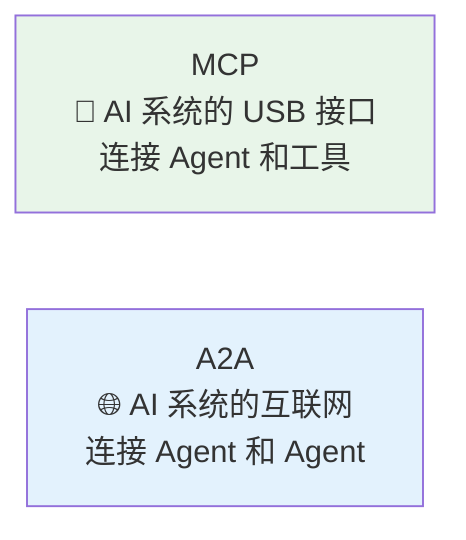

| 维度         | MCP                 | A2A              |
| ------------ | ------------------- | ---------------- |
| **比喻**     | USB-C 接口          | 互联网协议       |
| **连接对象** | Agent ↔ Tool        | Agent ↔ Agent    |
| **发起者**   | Anthropic (2024-11) | Google (2025-04) |
| **治理**     | Anthropic 维护      | Linux Foundation |
| **核心价值** | 标准化工具访问      | Agent 互操作     |

### 1.2 可视化对比

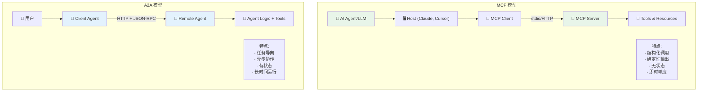

---

## 2. 设计理念差异

### 2.1 核心问题定位

#### MCP 解决的问题

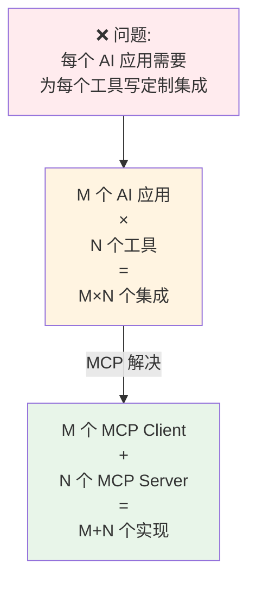

**MCP 的核心目标**：

- 标准化 AI 系统访问外部数据和工具的方式
- 让任何 LLM 都能使用任何工具
- 类似于 OpenAPI 对 REST API 的标准化

#### A2A 解决的问题

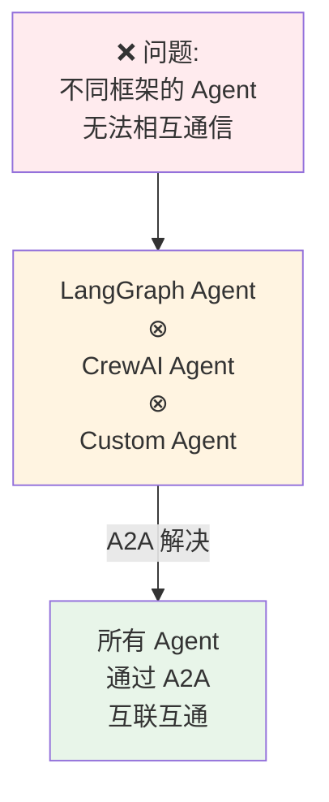

**A2A 的核心目标**：

- 实现跨平台的 Agent 互操作
- 让不同公司、不同框架的 Agent 协作
- 类似于 HTTP 对互联网的标准化

### 2.2 设计哲学对比

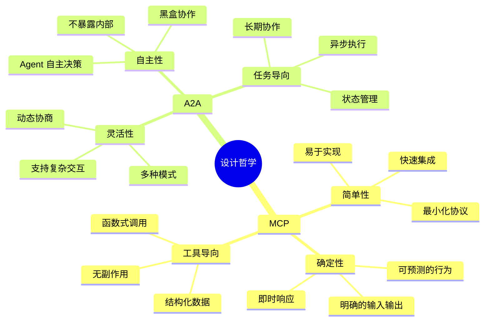

---

## 3. 架构对比

### 3.1 组件对比

| 组件         | MCP                       | A2A               |
| ------------ | ------------------------- | ----------------- |
| **Client**   | 存在于 Host 内，管理连接  | 独立的 Agent 应用 |
| **Server**   | 提供 Tools/Resources      | 完整的 Agent 系统 |
| **能力描述** | Server Capabilities       | Agent Card        |
| **能力单元** | Tools, Resources, Prompts | Skills            |
| **工作单元** | 工具调用                  | Task              |
| **通信单元** | Request/Response          | Message           |
| **输出单元** | Tool Result               | Artifact          |

### 3.2 通信模式对比

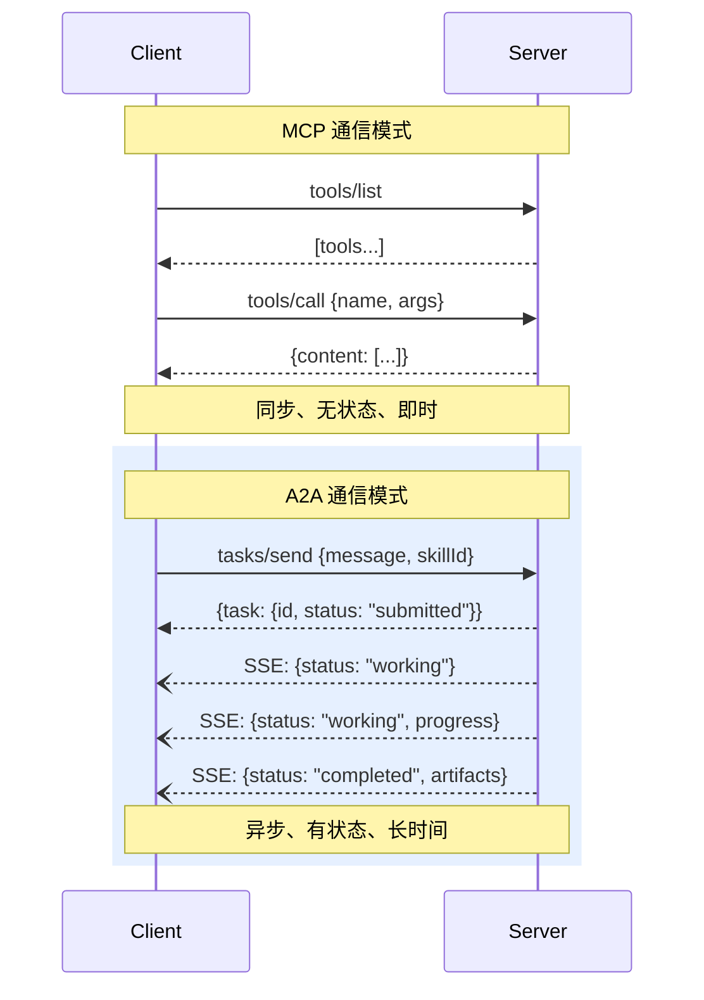

### 3.3 传输层对比

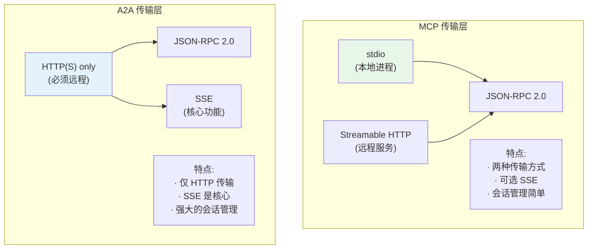

---

## 4. 协议细节对比

### 4.1 能力声明对比

#### MCP: Server Capabilities

```typescript
// MCP Server 能力声明
interface ServerCapabilities {
  tools?: {
    listChanged?: boolean;
  };
  resources?: {
    subscribe?: boolean;
    listChanged?: boolean;
  };
  prompts?: {
    listChanged?: boolean;
  };
  logging?: {};
}

// 工具定义
interface Tool {
  name: string;
  description: string;
  inputSchema: JSONSchema;
}
```

#### A2A: Agent Card + Skills

```typescript
// A2A Agent Card
interface AgentCard {
  name: string;
  description: string;
  version: string;
  url: string;
  auth: AuthScheme;
  capabilities: {
    streaming?: boolean;
    pushNotifications?: boolean;
  };
  skills: AgentSkill[];
  defaultInputModes: string[];
  defaultOutputModes: string[];
}

// 技能定义
interface AgentSkill {
  id: string;
  name: string;
  description: string;
  tags?: string[];
  examples?: string[];
  inputModes?: string[];
  outputModes?: string[];
}
```

**关键区别**：

- MCP：工具声明简单，输入输出通过 JSON Schema 定义
- A2A：技能声明丰富，支持多种数据模式，包含示例

### 4.2 工作流对比

#### MCP: 简单调用

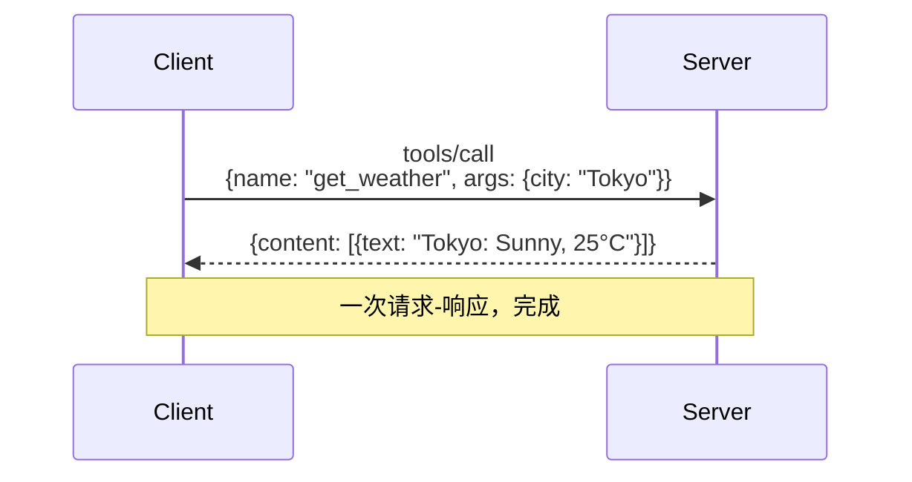

#### A2A: 任务生命周期

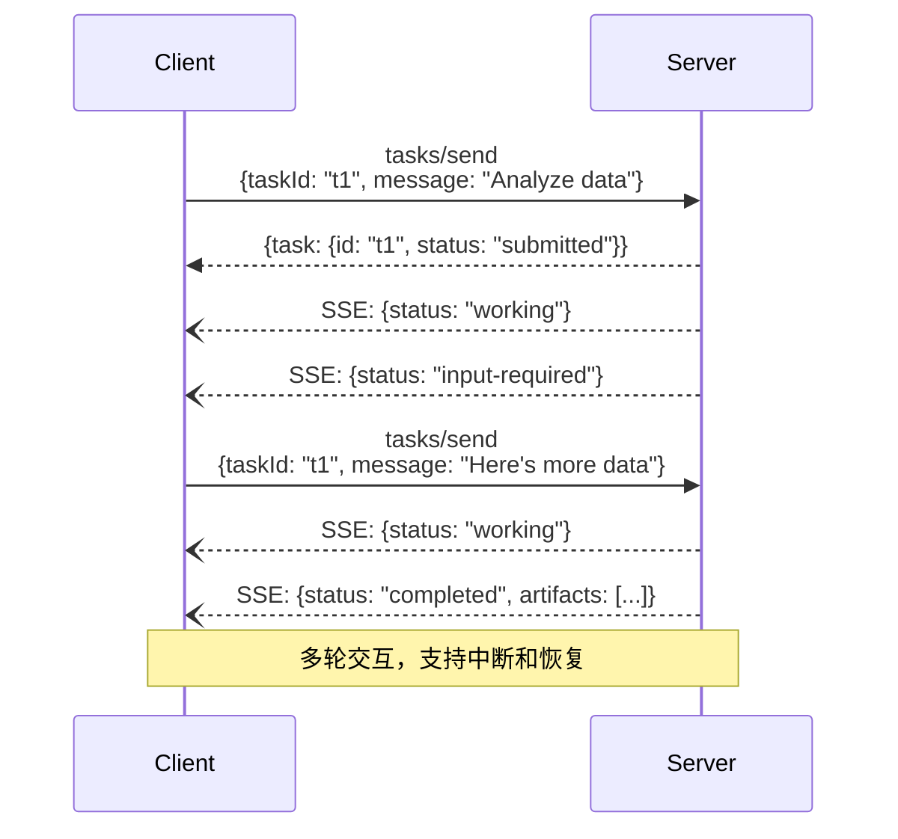

### 4.3 数据格式对比

#### MCP: 简单结构

```json
// MCP 工具调用请求
{
  "method": "tools/call",
  "params": {
    "name": "query_database",
    "arguments": {
      "query": "SELECT * FROM users"
    }
  }
}

// MCP 工具调用响应
{
  "content": [
    {
      "type": "text",
      "text": "Query returned 10 rows"
    }
  ]
}
```

#### A2A: 复杂结构

```json
// A2A 任务请求
{
  "jsonrpc": "2.0",
  "method": "tasks/send",
  "params": {
    "task": {
      "id": "task-123",
      "message": {
        "role": "user",
        "parts": [
          {
            "type": "text",
            "text": "Analyze this dataset"
          },
          {
            "type": "file",
            "uri": "https://example.com/data.csv"
          }
        ]
      },
      "skillId": "data_analysis"
    }
  },
  "id": "req-001"
}

// A2A 任务响应
{
  "jsonrpc": "2.0",
  "result": {
    "id": "task-123",
    "status": "completed",
    "messages": [...],
    "artifacts": [
      {
        "type": "text",
        "text": "Analysis complete"
      },
      {
        "type": "data",
        "data": {"mean": 42, "std": 10}
      },
      {
        "type": "image",
        "uri": "https://example.com/chart.png"
      }
    ]
  },
  "id": "req-001"
}
```

---

## 5. 使用场景分析

### 5.1 MCP 最佳场景

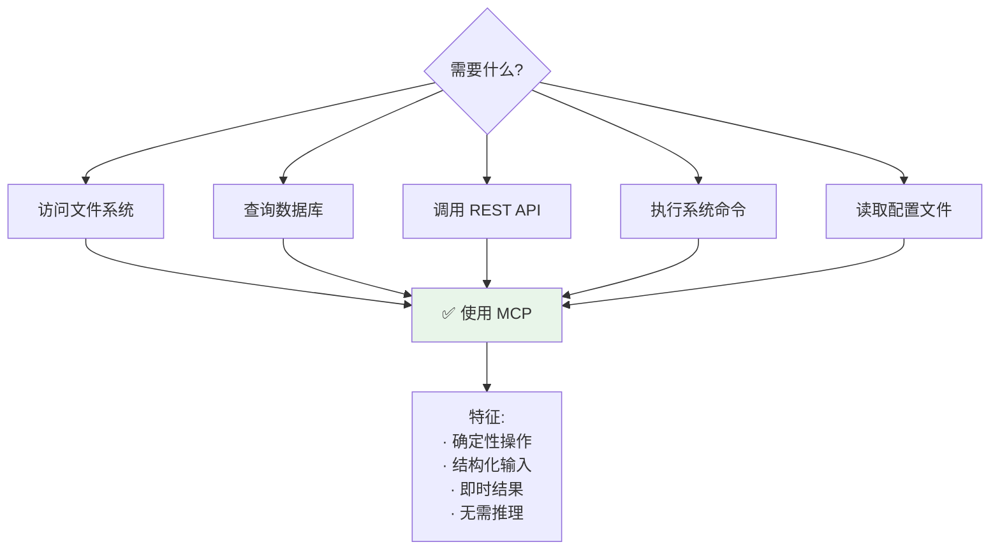

**典型 MCP 用例**：

1. **文件操作**：读取、写入、搜索文件
2. **数据库查询**：执行 SQL、读取记录
3. **API 调用**：调用外部 REST API
4. **系统工具**：Git 操作、Shell 命令
5. **搜索引擎**：Google Search、Web Scraping

### 5.2 A2A 最佳场景

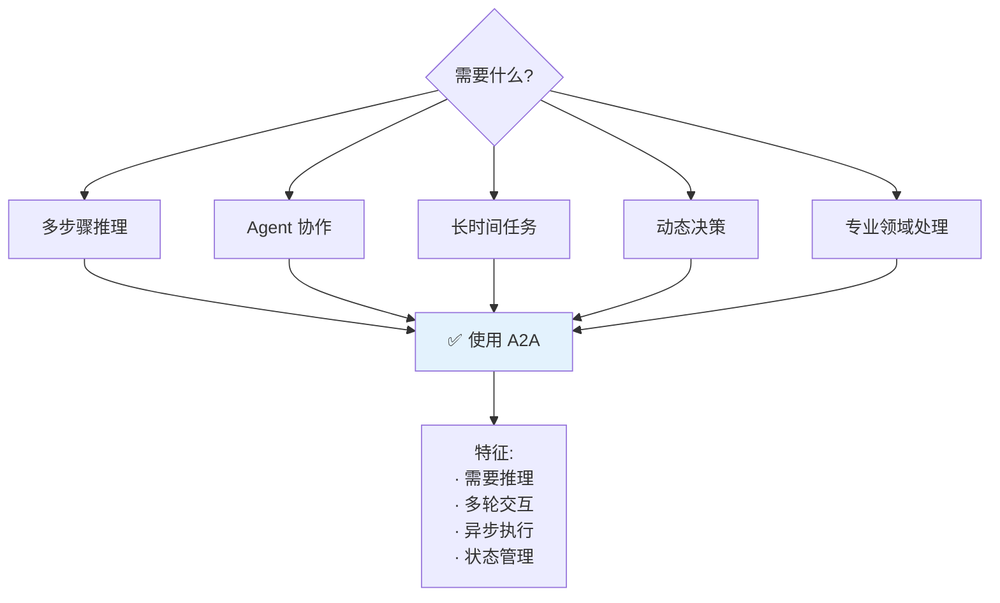

**典型 A2A 用例**：

1. **研究分析**：多源信息综合分析
2. **创意生成**：多 Agent 协作创作
3. **复杂规划**：旅行规划、项目管理
4. **专业咨询**：法律、医疗、金融建议
5. **工作流自动化**：跨系统的复杂流程

### 5.3 场景决策树

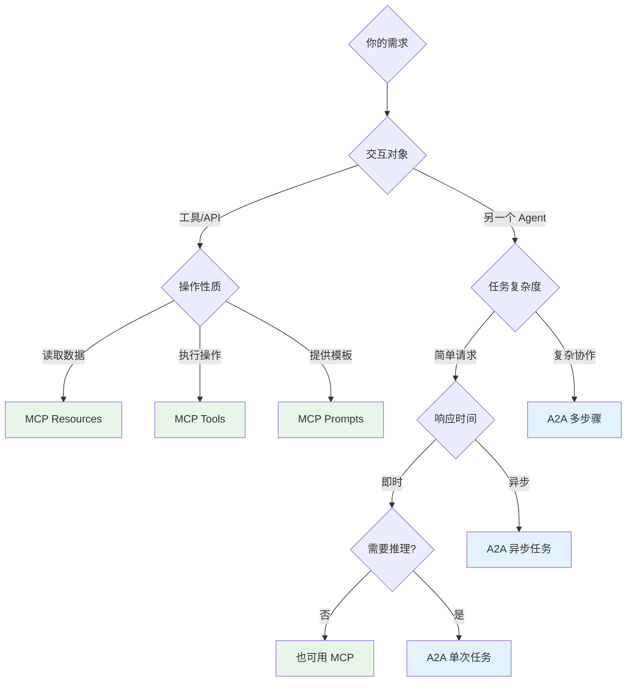

---

## 6. 实际案例对比

### 6.1 案例 1：获取天气信息

#### 使用 MCP

```python
# MCP 方式：直接工具调用
from mcp import Client

client = Client()

# 列出工具
tools = await client.list_tools()
# Output: [Tool(name="get_weather", ...)]

# 调用工具
result = await client.call_tool(
    name="get_weather",
    arguments={"city": "Tokyo"}
)

print(result.content[0].text)
# Output: "Tokyo: Sunny, 25°C"
```

**特点**：

- ✅ 简单直接
- ✅ 即时响应
- ✅ 适合确定性查询

#### 使用 A2A

```python
# A2A 方式：任务委托
from google_a2a import A2AClient

client = A2AClient()

# 发现 Agent
agent = await client.discover("https://weather-agent.com")

# 发送任务
task = await client.send_task(
    agent_url="https://weather-agent.com",
    skill_id="weather_forecast",
    message="What's the weather in Tokyo?"
)

print(task.artifacts[0].text)
# Output: "Based on current data, Tokyo is experiencing sunny conditions with a temperature of 25°C..."
```

**特点**：

- ✅ 可以包含推理和解释
- ✅ 支持更复杂的查询
- ⚠️ 对于简单查询可能过度

### 6.2 案例 2：市场研究报告

#### 使用 MCP（不适合）

```python
# ❌ MCP 不适合复杂多步骤任务
client = Client()

# 需要手动编排每一步
news = await client.call_tool("web_search", {"query": "AI market"})
analysis = await client.call_tool("analyze_text", {"text": news})
summary = await client.call_tool("summarize", {"data": analysis})

# 复杂、需要手动协调
```

#### 使用 A2A（推荐）

```python
# ✅ A2A 适合复杂任务委托
a2a_client = A2AClient()

# 委托给专门的研究 Agent
async for update in a2a_client.send_task_streaming(
    agent_url="https://research-agent.com",
    skill_id="market_research",
    message="Prepare a comprehensive AI market report"
):
    if update.status == "working":
        print(f"Progress: {update.message}")
    elif update.status == "input-required":
        # Agent 需要更多信息
        additional_data = get_user_input(update.message)
        await a2a_client.send_task(
            task_id=update.id,
            message=additional_data
        )
    elif update.status == "completed":
        print("Report ready!")
        save_report(update.artifacts)
```

**特点**：

- ✅ Agent 自主完成复杂流程
- ✅ 支持多轮交互
- ✅ 实时进度反馈

### 6.3 案例 3：客服系统

#### 混合使用 MCP + A2A

```python
# 客服主 Agent (使用两者)
class CustomerServiceAgent:
    def __init__(self):
        self.mcp_client = MCPClient()
        self.a2a_client = A2AClient()

    async def handle_customer_query(self, query: str):
        # 1. 使用 MCP 查询客户信息（快速、确定）
        customer = await self.mcp_client.call_tool(
            name="get_customer_profile",
            arguments={"query": query}
        )

        # 2. 判断是否需要专业 Agent
        if self._needs_specialist(query):
            # 使用 A2A 委托给专家 Agent（复杂、推理）
            result = await self.a2a_client.send_task(
                agent_url="https://specialist-agent.com",
                skill_id="technical_support",
                message={
                    "query": query,
                    "customer": customer
                }
            )
        else:
            # 简单问题，使用 MCP 工具直接回答
            result = await self.mcp_client.call_tool(
                name="knowledge_base_search",
                arguments={"query": query}
            )

        return result
```

**架构图**：

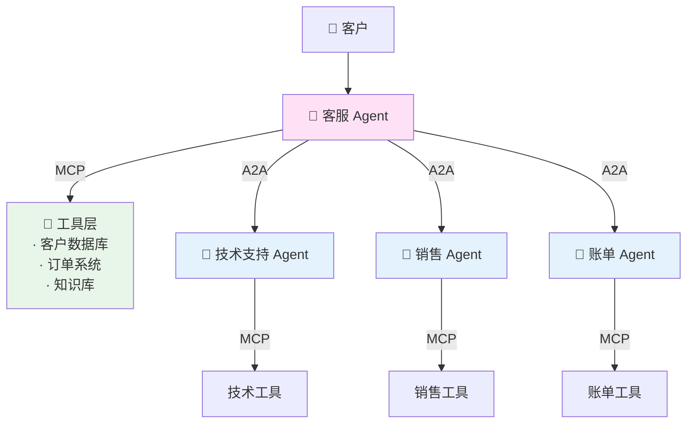

---

## 7. 生态系统对比

### 7.1 支持厂商

| MCP               | A2A            |
| ----------------- | -------------- |
| Anthropic（主导） | Google（发起） |
| OpenAI            | AWS            |
| Zed               | Microsoft      |
| Replit            | Salesforce     |
| Codeium           | SAP            |
| Sourcegraph       | ServiceNow     |
| Block             | Cisco          |
| Apollo            | 100+ 公司      |

### 7.2 框架支持

#### MCP 集成

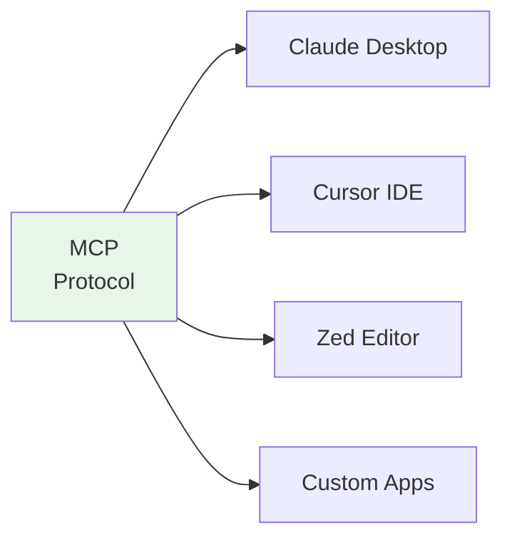

#### A2A 集成

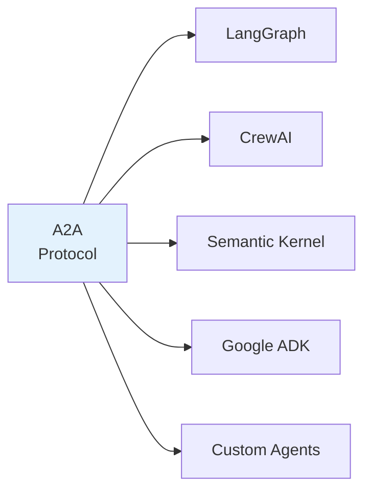

### 7.3 社区活跃度

| 指标              | MCP                               | A2A                     |
| ----------------- | --------------------------------- | ----------------------- |
| **GitHub Stars**  | ~8k                               | ~2k                     |
| **发布时间**      | 2024-11                           | 2025-04                 |
| **成熟度**        | 较成熟                            | 快速发展                |
| **SDK 数量**      | 5+ (TS, Python, Kotlin, Java, C#) | 2+ (Python, TypeScript) |
| **预构建 Server** | 50+                               | 10+                     |
| **文档质量**      | ⭐⭐⭐⭐⭐                        | ⭐⭐⭐⭐                |

---

## 8. 选择指南

### 8.1 决策矩阵

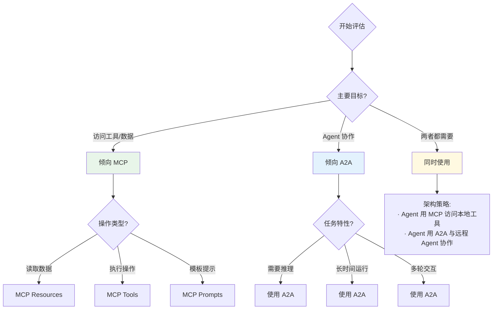

### 8.2 选择清单

#### 选择 MCP 的理由

- ✅ 需要访问结构化的工具和数据源
- ✅ 操作是确定性的、可预测的
- ✅ 需要即时响应
- ✅ 工具是本地的或简单的 API
- ✅ 不需要复杂的推理或决策
- ✅ 希望使用 Claude Desktop、Cursor 等现有 Host

#### 选择 A2A 的理由

- ✅ 需要与其他 Agent 协作
- ✅ 任务需要复杂推理或决策
- ✅ 任务可能需要很长时间完成
- ✅ 需要多轮对话式交互
- ✅ Agent 来自不同的团队或供应商
- ✅ 需要支持动态能力发现

#### 同时使用的场景

- ✅ 构建复杂的 Agent 系统
- ✅ Agent 既需要工具也需要协作
- ✅ 企业级多层架构
- ✅ 混合本地和远程资源

### 8.3 推荐架构模式

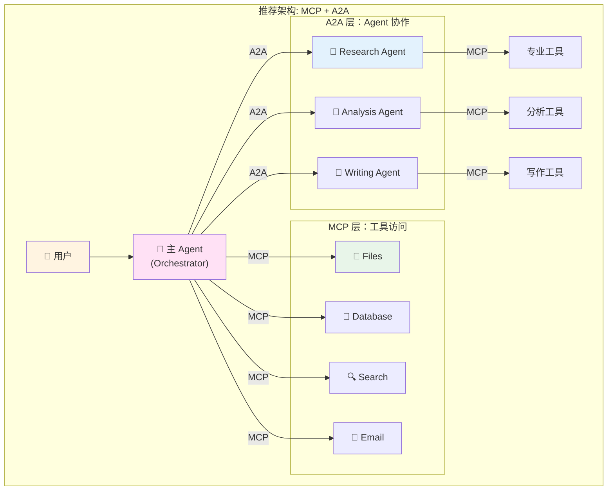

---

## 总结

### 核心差异

| 维度       | MCP           | A2A           | 关系     |
| ---------- | ------------- | ------------- | -------- |
| **定位**   | Agent ↔ Tool  | Agent ↔ Agent | 互补     |
| **目标**   | 工具标准化    | Agent 互操作  | 不同层次 |
| **复杂度** | 简单          | 复杂          | 分别适用 |
| **用途**   | 数据/工具访问 | Agent 协作    | 各有所长 |

### 官方建议

> **Use MCP for tools, use A2A for agents.**  
> 使用 MCP 连接工具，使用 A2A 连接 Agent。

### 未来展望

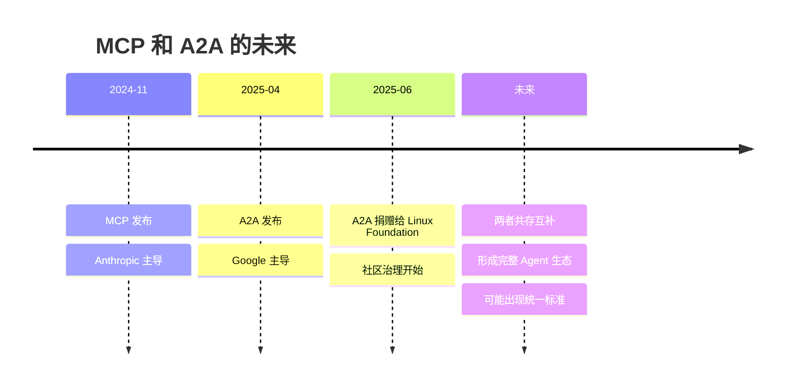

**预测**：

1. MCP 和 A2A 将长期共存
2. 大多数企业应用会同时使用两者
3. 可能出现更高级的统一协议
4. Agent 生态系统将更加成熟

### 最终建议

1. **学习两者**：作为开发者，应该同时掌握 MCP 和 A2A
2. **选择合适的**：根据具体场景选择最合适的协议
3. **混合使用**：在复杂系统中灵活组合两者
4. **关注发展**：两个协议都在快速演进，保持关注

---

**参考资源**

- 📘 [MCP 官方文档](https://modelcontextprotocol.io)
- 📘 [A2A 官方文档](https://a2a-protocol.org)
- 🐙 [MCP GitHub](https://github.com/modelcontextprotocol)
- 🐙 [A2A GitHub](https://github.com/a2aproject/A2A)
- 🌐 [Linux Foundation A2A Project](https://www.linuxfoundation.org/press/linux-foundation-launches-the-agent2agent-protocol-project-to-enable-secure-intelligent-communication-between-ai-agents)

**本文档最后更新：2025-11**
