# AP2: Agent Payment Protocol - AI 智能体支付协议全解析

> 当 AI Agent 开始替你买东西，谁来保证交易安全？Google 联合 Mastercard、PayPal、Coinbase 等 60+ 合作伙伴给出了答案 —— AP2。

## 目录

- [1. 为什么需要 AP2?](#1-为什么需要-ap2)
- [2. AP2 是什么?](#2-ap2-是什么)
- [3. 核心架构](#3-核心架构)
- [4. Mandate 信任体系](#4-mandate-信任体系)
- [5. 与 A2A / MCP 的关系](#5-与-a2a--mcp-的关系)
- [6. PayPal 的实现方案](#6-paypal-的实现方案)
- [7. 多 Agent 支付流程实战](#7-多-agent-支付流程实战)
- [8. 竞争格局：AP2 vs ACP vs x402](#8-竞争格局ap2-vs-acp-vs-x402)
- [9. 生态与社区反响](#9-生态与社区反响)
- [10. 安全与挑战](#10-安全与挑战)
- [11. 开发者快速上手](#11-开发者快速上手)
- [12. 未来展望](#12-未来展望)

---

## 1. 为什么需要 AP2?

### 1.1 传统支付的根本假设被打破

当今的支付系统建立在一个核心假设之上：**人类直接点击"购买"按钮**。

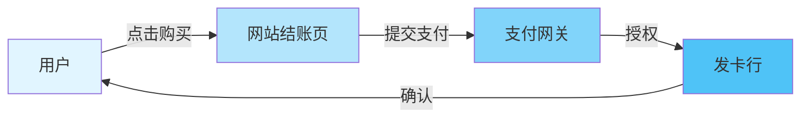

但当 AI Agent 介入后，这个假设彻底瓦解了：

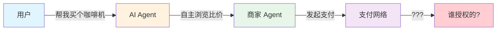

### 1.2 三个核心问题

Agent 发起支付时，产生了三个传统支付体系无法回答的问题：

| 问题 | 描述 | 风险 |
|------|------|------|
| **授权 (Authorization)** | 用户真的允许 Agent 买这个吗？ | Agent 可能超出用户意图 |
| **真实性 (Authenticity)** | Agent 的请求是否准确反映了用户的真实意图？ | LLM 幻觉可能导致错误购买 |
| **问责 (Accountability)** | 出错了谁负责？ | Agent、用户、商家责任不清 |

> PayPal 全球 AI 负责人 Prakhar Mehrotra 指出："从技术上讲，我们现在就可以实现 Agent 支付，但我无法保证系统的健壮性，也无法将其呈交给监管机构。"

---

## 2. AP2 是什么?

### 2.1 一句话定义

**AP2 (Agent Payment Protocol)** 是由 Google 开发的**开放支付协议**，为 AI Agent 驱动的商业交易提供**安全、可审计、可问责**的支付框架。

### 2.2 核心定位

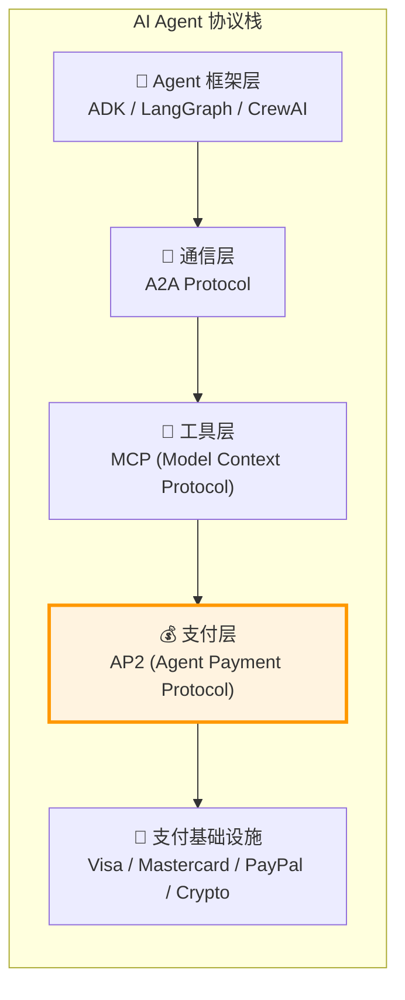

AP2 不是一个独立的支付系统，而是作为 **A2A 协议和 MCP 的扩展层**，专注于解决 Agent 支付场景中的**信任和授权问题**。

### 2.3 关键特性

- **开放协议**: Apache 2.0 开源，非专有
- **支付无关 (Payment-Agnostic)**: 支持信用卡、银行转账、数字钱包、加密货币
- **可验证意图**: 基于密码学的防篡改证明
- **用户主权**: 隐私优先设计，保护支付细节
- **全球可扩展**: 初始支持卡支付，路线图包含实时转账和数字货币

### 2.4 合作伙伴阵容

Google 联合了超过 **60 家**行业领先组织：

```
传统支付:  Mastercard | American Express | JCB | UnionPay International
支付平台:  PayPal | Adyen | Worldpay | Revolut
科技巨头:  Salesforce | ServiceNow | Intuit
加密生态:  Coinbase | Mysten Labs (Sui) | Algorand | MetaMask
安全/验证: EigenLayer | Forter
电商平台:  Etsy
```

---

## 3. 核心架构

### 3.1 角色模型

AP2 定义了清晰的角色分离：

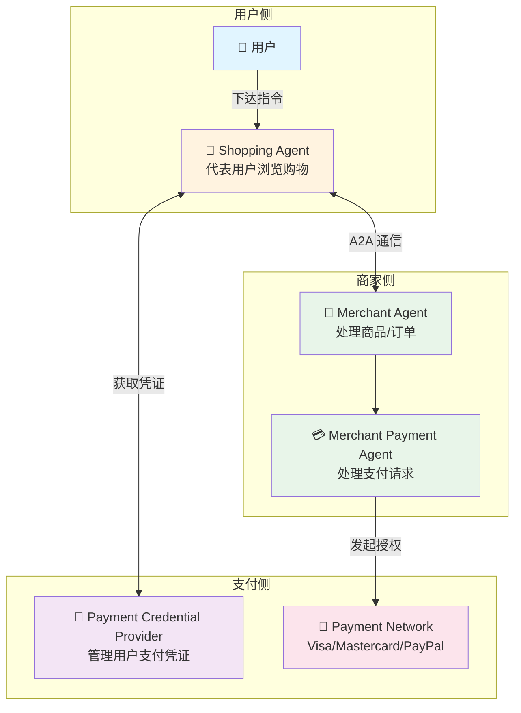

### 3.2 Verifiable Digital Credentials (VDCs)

AP2 的信任基础是**可验证数字凭证 (VDCs)** —— 基于 **W3C Verifiable Credentials** 标准的密码学签名数字对象。

```typescript
// VDC 的概念结构
interface VerifiableDigitalCredential {
    // W3C VC 标准字段
    '@context': string[];
    type: string[];
    issuer: string;           // 签发者 DID
    issuanceDate: string;     // 签发时间
    credentialSubject: {
        // 具体的 Mandate 内容
        [key: string]: unknown;
    };
    proof: {
        type: string;          // 如 'Ed25519Signature2020'
        created: string;
        verificationMethod: string;
        proofPurpose: string;
        proofValue: string;    // 密码学签名
    };
}
```

核心特性：
- **防篡改**: 密码学签名确保内容不可被修改
- **可移植**: 基于 W3C 标准，跨生态互通
- **可验证**: 任何参与方都可以独立验证真实性
- **不可否认**: 签名者无法否认已签署的内容

---

## 4. Mandate 信任体系

Mandate（授权委托）是 AP2 最核心的创新 —— 它们是**密码学签名的数字合约**，定义了 Agent 被允许做什么。

### 4.1 三种 Mandate 类型

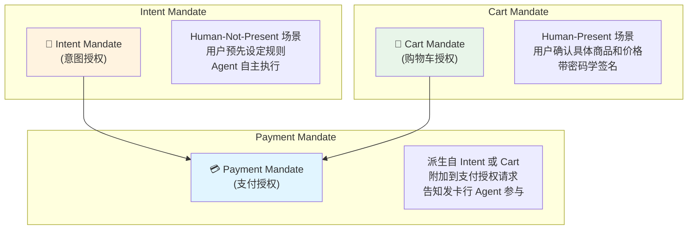

### 4.2 Intent Mandate - 自主购物场景

当用户不在场时，Intent Mandate 预授权 Agent 在约束条件内自主交易：

```typescript
interface IntentMandate {
    // 用户定义的约束
    constraints: {
        maxBudget: number;              // 最高预算: 如 $200
        allowedCategories: string[];    // 允许的商品类别: ['electronics', 'kitchen']
        allowedMerchants?: string[];    // 允许的商家列表
        expiresAt: string;              // 过期时间: '2026-04-01T00:00:00Z'
        maxSingleTransaction?: number;  // 单笔最高: 如 $100
    };
    // 用户身份
    userDID: string;
    // 用户密码学签名
    userSignature: string;
    // 创建时间
    issuedAt: string;
}
```

**使用场景**:

```
用户: "帮我在 $200 以内买一台评价最好的咖啡机"
Agent: 收到 Intent Mandate → 浏览比价 → 在预算内自主下单
```

### 4.3 Cart Mandate - 确认购买场景

当用户在场时，Cart Mandate 锁定具体的购物车内容：

```typescript
interface CartMandate {
    // 商家签名的购物车
    cart: {
        merchantId: string;
        items: Array<{
            productId: string;
            name: string;
            price: number;
            quantity: number;
        }>;
        totalAmount: number;
        currency: string;
        guaranteedUntil: string;    // 价格保证期限
    };
    // 商家签名 (保证履约)
    merchantSignature: string;
    // 用户签名 (确认同意)
    userSignature: string;
}
```

**双重签名机制**:

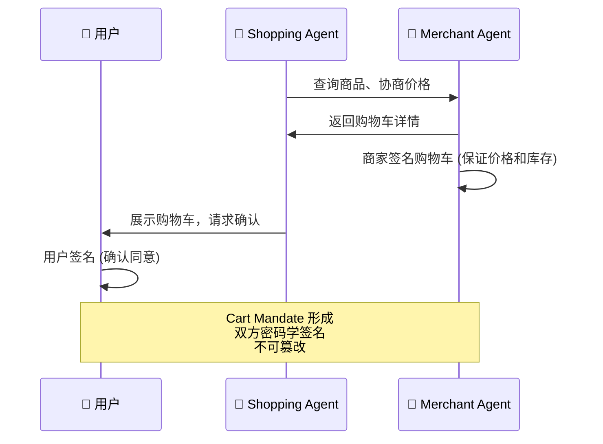

### 4.4 Payment Mandate - 支付网络通信

Payment Mandate 是从 Intent 或 Cart Mandate 派生的精简凭证，附加到实际的支付授权请求中：

```typescript
interface PaymentMandate {
    // 来源
    derivedFrom: 'IntentMandate' | 'CartMandate';
    // Agent 上下文
    agentPresence: boolean;        // Agent 是否参与了交易
    humanPresence: 'present' | 'not-present';  // 用户是否在场
    // 最小化信息 (隐私保护)
    transactionHash: string;       // 交易哈希
    mandateReference: string;      // 原始 Mandate 引用
    // 审计字段
    cryptographicProofChain: string;  // 密码学证据链
}
```

> Payment Mandate 的设计哲学：**向支付网络传递最少但足够的信息**，让发卡行知道 "这笔交易有 Agent 参与，用户已授权"，但不暴露用户的购物细节。

---

## 5. 与 A2A / MCP 的关系

### 5.1 协议栈全景

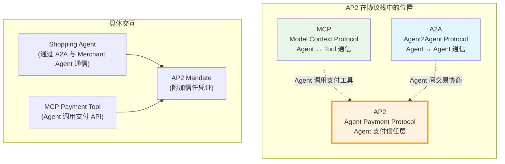

### 5.2 A2A + AP2 协作流程

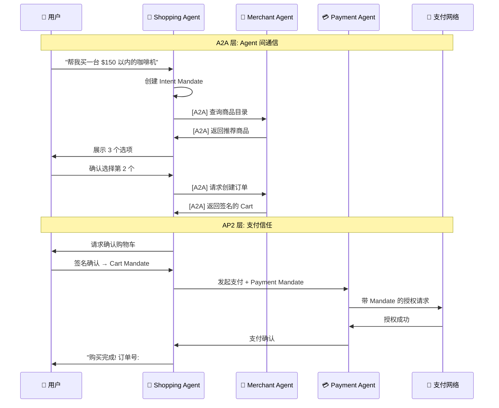

### 5.3 MCP + AP2 集成

Agent 通过 MCP 工具调用支付能力，AP2 Mandate 自动注入：

```typescript
// MCP Payment Tool 定义
const paymentTool = {
    name: 'process_payment',
    description: 'Process a payment with AP2 mandate verification',
    inputSchema: {
        type: 'object',
        properties: {
            cartMandateId: { type: 'string' },
            paymentMethodToken: { type: 'string' },
        },
        required: ['cartMandateId', 'paymentMethodToken'],
    },
};

// Agent 通过 MCP 调用支付
async function handlePayment(
    cartMandateId: string,
    paymentToken: string
): Promise<PaymentResult> {
    // AP2 自动验证 Mandate
    const mandate = await ap2.verifyCartMandate(cartMandateId);

    // 生成 Payment Mandate
    const paymentMandate = ap2.derivePaymentMandate(mandate);

    // 附加到支付请求
    const result = await paymentGateway.authorize({
        amount: mandate.cart.totalAmount,
        currency: mandate.cart.currency,
        token: paymentToken,
        ap2Mandate: paymentMandate,  // AP2 信任凭证
    });

    return result;
}
```

---

## 6. PayPal 的实现方案

PayPal 作为 AP2 的核心合作伙伴，正在将其全球支付基础设施与 AP2 深度集成。

### 6.1 四大技术支柱

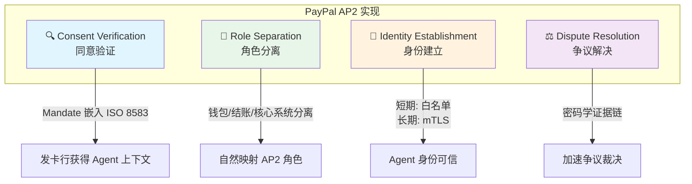

### 6.2 Consent Verification (同意验证)

PayPal 将 Mandate 制品嵌入现有的 **ISO 8583** 消息流和 API 流程中：

```typescript
// PayPal 如何将 AP2 Mandate 嵌入到现有支付流中
interface PayPalAuthorizationRequest {
    // 标准字段
    amount: number;
    currency: string;
    merchantId: string;

    // AP2 扩展字段
    ap2: {
        mandateType: 'intent' | 'cart';
        agentPresent: boolean;
        humanPresent: boolean;
        mandateReference: string;
        // 链接到 tokenized credentials
        tokenizedCredentialRef: string;
    };
}
```

**关键优势**: 发卡行无需修改系统即可接收 Agent 上下文信息。

### 6.3 角色分离架构

PayPal 的现有架构天然映射了 AP2 的角色边界：

| PayPal 组件 | AP2 角色 | 职责 |
|-------------|---------|------|
| **PayPal Wallet** | Credential Provider | 管理支付凭证 |
| **PayPal Checkout** | Transaction Mediator | 处理交易上下文 |
| **Core Payment System** | Payment Router | 路由授权到支付网络 |

### 6.4 争议解决增强

传统争议解决依赖人工审核，AP2 引入了密码学证据：

```
传统流程:
用户投诉 → 人工审核 → 30天处理

AP2 增强流程:
用户投诉 → 验证 Mandate 签名链 → 密码学证据裁决 → 快速处理
```

---

## 7. 多 Agent 支付流程实战

### 7.1 完整的购物场景

以下是 AP2 GitHub 仓库中演示的 **"Buy a coffee maker"** 场景的完整流程：

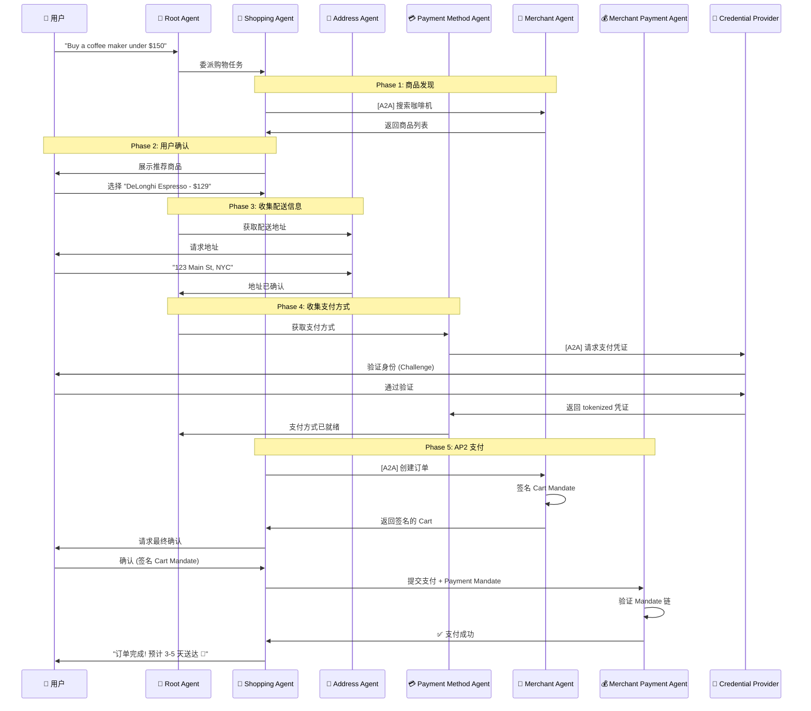

### 7.2 七个 Agent 协作

AP2 演示中使用了七个专门化的 Agent：

```typescript
// Agent 角色定义
const agentRoles = {
    rootAgent: {
        role: '总指挥',
        responsibility: '编排整个购物流程，委派子任务',
    },
    shoppingAgent: {
        role: '购物助手',
        responsibility: '代表用户浏览、比较、选择商品',
    },
    addressAgent: {
        role: '地址收集',
        responsibility: '获取和验证用户配送地址',
    },
    paymentMethodAgent: {
        role: '支付方式',
        responsibility: '管理用户的支付凭证选择',
    },
    merchantAgent: {
        role: '商家代理',
        responsibility: '提供商品信息，处理订单',
    },
    merchantPaymentAgent: {
        role: '商家支付',
        responsibility: '处理支付授权和结算',
    },
    credentialProvider: {
        role: '凭证提供者',
        responsibility: '安全管理和分发 tokenized 支付凭证',
    },
};
```

---

## 8. 竞争格局：AP2 vs ACP vs x402

当前 Agent 支付领域有三大协议，它们**不是直接竞争，而是互补的层次**：

### 8.1 三大协议对比

| 维度 | AP2 (Google) | ACP (Stripe + OpenAI) | x402 (Coinbase) |
|------|-------------|----------------------|-----------------|
| **定位** | 信任与授权层 | 结账与商户集成层 | 执行与微支付层 |
| **核心能力** | Mandate 密码学签名 | 安全凭证传递与结账 | HTTP 402 原生支付 |
| **支付方式** | 全支付方式 | 主要支持卡支付 | 稳定币 (USDC) |
| **适用场景** | 跨生态 Agent 商务 | ChatGPT 内购物 | API/数据微交易 |
| **合作伙伴** | 60+ (Mastercard, PayPal...) | Stripe 生态 | Coinbase, MetaMask |
| **许可证** | Apache 2.0 | Apache 2.0 | 开源 |
| **当前状态** | 开发者预览 | ChatGPT 已上线 | 开发者实验 |

### 8.2 协议栈层次

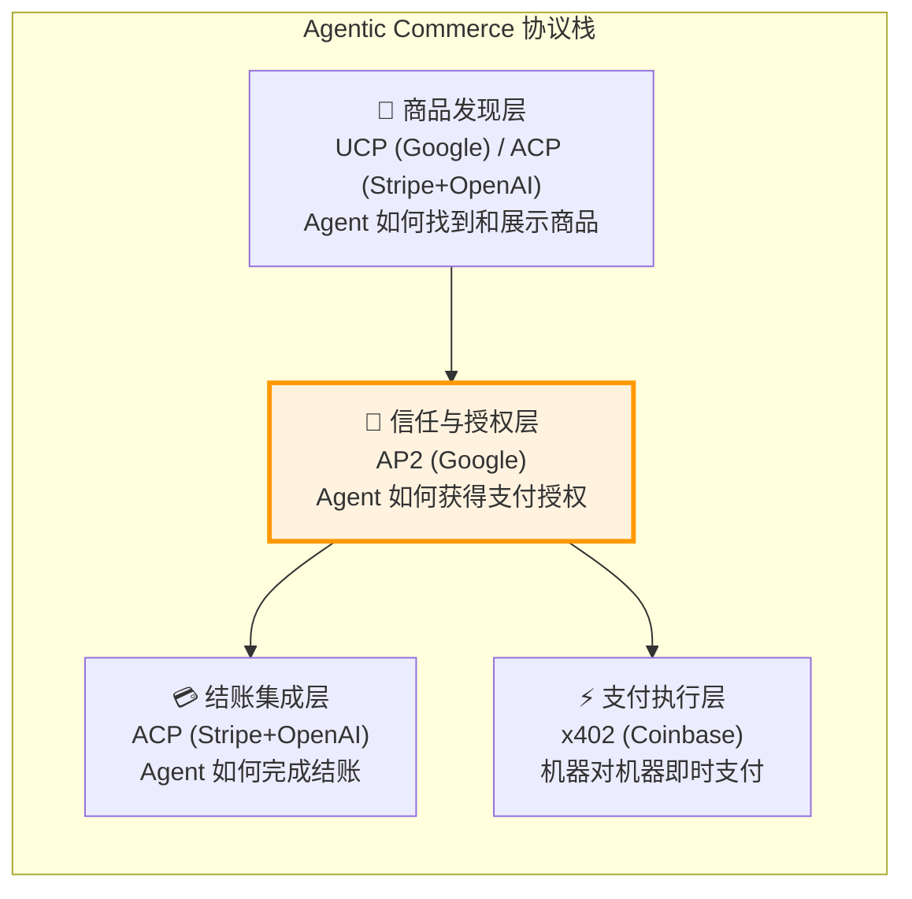

### 8.3 互补而非竞争

> "ACP 关注结账和商户集成层。AP2 定义了跨生态系统交易的信任和授权模型。x402 在执行层运作，为数据和 API 实现即时、可编程的支付。"

一个企业可以同时使用：
- **ACP** 处理 Agent 购物结账流程
- **AP2** 提供内部治理和审计控制
- **x402** 处理机器到机器的数据/API 微交易

---

## 9. 生态与社区反响

### 9.1 行业巨头表态

**Mastercard** 首席数字官 Pablo Fourez:
> "AP2 这样的协议代表了更广泛的行业努力，旨在实现基于 Agent 的商务。"

**PayPal** 全球 AI 负责人 Prakhar Mehrotra:
> "拥有一个协议，本质上是一个共同标准，允许多个 Agent 相互交互。"

**Sui / Mysten Labs**:
> "Sui 是 Google AP2 的发布合作伙伴，为 Agent 支付的未来带来快速、可编程的支付和隐私优先的身份。"

### 9.2 社区热度

AP2 GitHub 仓库数据：
- **2.9k+ Stars** | **402 Forks** | **20 Contributors**
- Apache 2.0 许可证
- 主要语言: Python (82.9%)

### 9.3 加密社区的参与

AP2 通过 **x402 扩展**拥抱加密支付：

```
Google AP2
    └── x402 Extension
        ├── Coinbase (发起者)
        ├── MetaMask
        ├── Ethereum Foundation
        ├── Mysten Labs (Sui)
        ├── Algorand
        └── peaq (DePIN)
```

> Coinbase 和 Google 合作开发了 A2A x402 扩展，支持稳定币和加密支付，使 Agent 能够进行链上即时交易。

---

## 10. 安全与挑战

### 10.1 安全机制

AP2 内置了多层安全保障：

```typescript
// AP2 安全模型
interface AP2SecurityModel {
    // 1. 密码学签名
    cryptographicSigning: {
        algorithm: 'Ed25519' | 'ECDSA';
        purpose: '防止 Mandate 被篡改';
    };

    // 2. 身份验证
    identityVerification: {
        shortTerm: 'curated allow-lists and registries';
        longTerm: 'HTTPS + mutual TLS (mTLS)';
    };

    // 3. 审计追踪
    auditTrail: {
        proofChain: 'cryptographic evidence chain';
        nonRepudiation: '签名者无法否认';
    };

    // 4. 最小化信息原则
    dataMinimization: {
        paymentMandate: 'only minimal context to payment networks';
        userPrivacy: 'shopping details not exposed to issuers';
    };
}
```

### 10.2 已知挑战

| 挑战 | 描述 | 当前状态 |
|------|------|---------|
| **Prompt Injection** | 恶意指令劫持 Agent 工作流，绕过 Intent Mandate 检查 | 安全研究者已提出警告 |
| **责任归属** | Agent 执行错误或欺诈交易时，谁承担责任？ | AP2 提供审计线索但未完全解决 |
| **企业集成** | 与 ERP、采购、供应链系统的深度集成 | 需要中间件和编排层 |
| **实际采用** | 截至目前尚无面向消费者的实际产品上线 | 开发者预览阶段 |
| **监管合规** | 不同国家/地区的支付监管要求 | 路线图中，尚未全面覆盖 |

### 10.3 安全最佳实践

```typescript
// Agent 支付安全检查清单
const securityChecklist = {
    // 1. 始终验证 Mandate 签名
    verifyMandateSignature: true,

    // 2. 检查 Mandate 是否过期
    checkMandateExpiry: true,

    // 3. 验证金额不超过约束
    enforceAmountLimits: true,

    // 4. 记录完整的审计日志
    maintainAuditLog: true,

    // 5. 实施 Agent 身份白名单
    agentAllowList: true,

    // 6. 监控异常交易模式
    anomalyDetection: true,
};
```

---

## 11. 开发者快速上手

### 11.1 环境准备

```bash
# 前提条件
# Python 3.10+
# uv 包管理器

# 安装 AP2 types 包
uv pip install git+https://github.com/google-agentic-commerce/AP2.git@main

# 克隆仓库获取示例
git clone https://github.com/google-agentic-commerce/AP2.git
cd AP2
```

### 11.2 项目结构

```
AP2/
├── src/ap2/types/          # 核心协议类型定义
├── samples/
│   ├── python/scenarios/   # Python 演示场景
│   └── android/scenarios/  # Android 购物助手
├── docs/                   # 文档和规范
└── README.md
```

### 11.3 认证配置

```bash
# 方式 1: Google API Key (开发环境)
export GOOGLE_API_KEY="your-api-key"

# 方式 2: Vertex AI + Service Account (生产环境)
export GOOGLE_CLOUD_PROJECT="your-project-id"
gcloud auth application-default login
```

### 11.4 运行示例

```bash
# 运行购物场景 demo
cd samples/python/scenarios
uv run python shopping_demo.py
```

> AP2 不要求必须使用 Google ADK 或 Gemini 模型 —— 开发者可以自由选择任何 Agent 框架和 LLM。

---

## 12. 未来展望

### 12.1 发展路线图

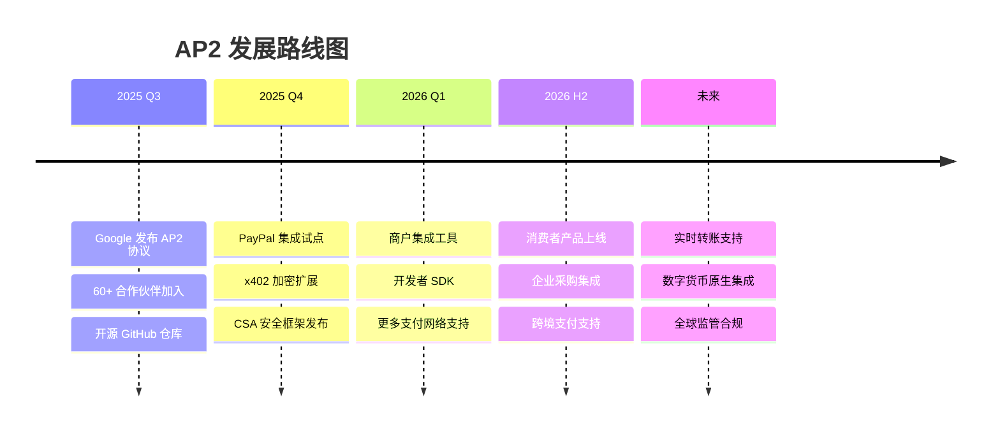

### 12.2 更广阔的 Agentic Commerce 版图

AP2 只是 Agentic Commerce 拼图的一部分：

| 协议/产品 | 发起者 | 关注点 |
|-----------|--------|--------|
| **AP2** | Google | Agent 支付信任层 |
| **ACP** | Stripe + OpenAI | Agent 结账集成 |
| **x402** | Coinbase | 机器对机器微支付 |
| **Trusted Agent Protocol** | Visa | Agent 身份验证 |
| **Agent Pay** | Mastercard | Agent 支付安全 |
| **UCP** | Google | 统一商务发现协议 |

### 12.3 结语

AP2 是对一个未来的赌注 —— 一个 AI Agent 替我们处理日常交易的未来。

这个未来的成败取决于**信任**，而 AP2 正试图提供这种信任。

> "一个协议只有在被采用时才有用。AP2 提供了基础信任层，但一个繁荣的工具和服务生态才能让 Agentic Commerce 真正落地。"

核心收获:

1. AP2 解决了 Agent 支付的三大核心问题: **授权、真实性、问责**
2. Mandate 体系通过**密码学签名**建立不可篡改的信任链
3. AP2 是 A2A 和 MCP 的**支付扩展层**，不是独立的支付系统
4. 与 ACP、x402 **互补而非竞争**，共同构成 Agentic Commerce 协议栈
5. 60+ 合作伙伴的支持标志着行业对 Agent 支付标准化的共识

---

## 参考资源

### 官方资源

- [AP2 Protocol 官网](https://ap2-protocol.org/)
- [AP2 GitHub 仓库](https://github.com/google-agentic-commerce/AP2)
- [Google Cloud Blog: Announcing AP2](https://cloud.google.com/blog/products/ai-machine-learning/announcing-agents-to-payments-ap2-protocol)
- [PayPal: Agent Payments Protocol](https://developer.paypal.com/community/blog/PayPal-Agent-Payments-Protocol/)

### 行业分析

- [Everest Group: Google's AP2 - A New Chapter in Agentic Commerce](https://www.everestgrp.com/googles-agent-payments-protocol-ap2-a-new-chapter-in-agentic-commerce-blog/)
- [VentureBeat: Google's AP2 allows AI agents to complete purchases](https://venturebeat.com/ai/googles-new-agent-payments-protocol-ap2-allows-ai-agents-to-complete)
- [TechCrunch: Google launches new protocol for agent-driven purchases](https://techcrunch.com/2025/09/16/google-launches-new-protocol-for-agent-driven-purchases/)
- [Orium: Agentic Payments Explained - ACP, AP2, and x402](https://orium.com/blog/agentic-payments-acp-ap2-x402)
- [An Illustrated Guide to AP2](https://arthurchiao.art/blog/ap2-illustrated-guide/)

### 安全与合规

- [Cloud Security Alliance: Secure Use of AP2](https://cloudsecurityalliance.org/blog/2025/10/06/secure-use-of-the-agent-payments-protocol-ap2-a-framework-for-trustworthy-ai-driven-transactions)

### 社区讨论

- [PayPal Newsroom: Making Sense of the AI Shopping Protocol Moment](https://newsroom.paypal-corp.com/2026-01-22-Making-Sense-of-the-AI-Shopping-Protocol-Moment)
- [Google Cloud Tech on X](https://x.com/GoogleCloudTech/status/1967942818065768558)
- [DeepLearning.AI on X](https://x.com/DeepLearningAI/status/1972723046168289689)
- [Wes Roth on X](https://x.com/WesRothMoney/status/1968253608115523613)
