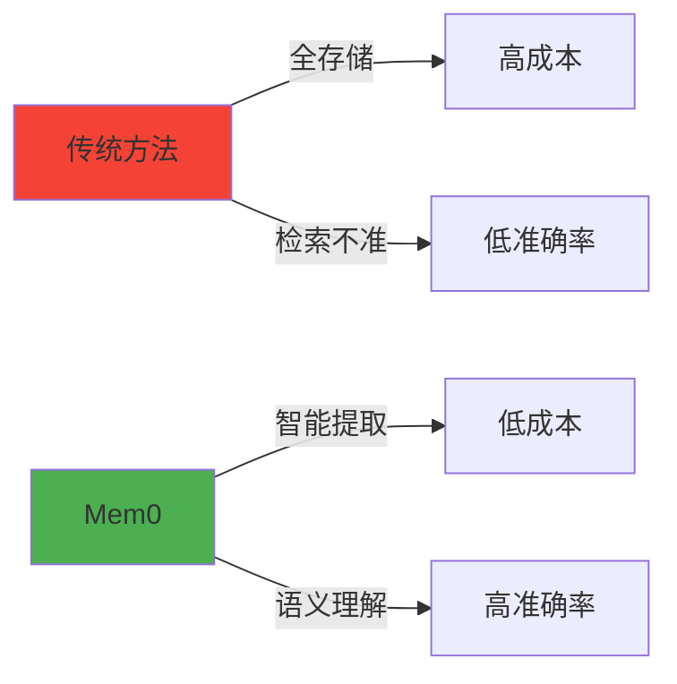
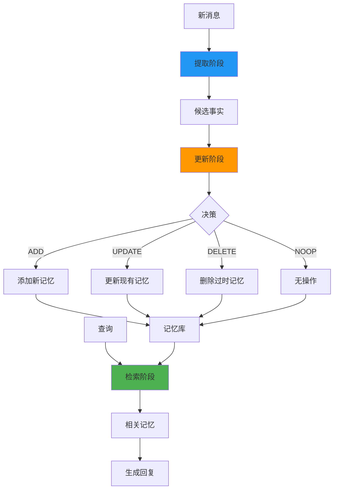
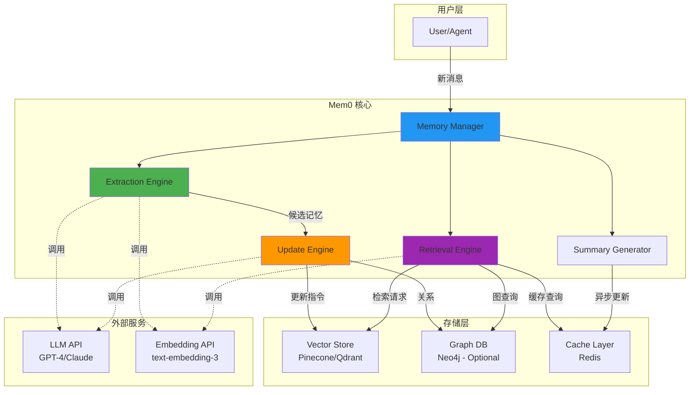
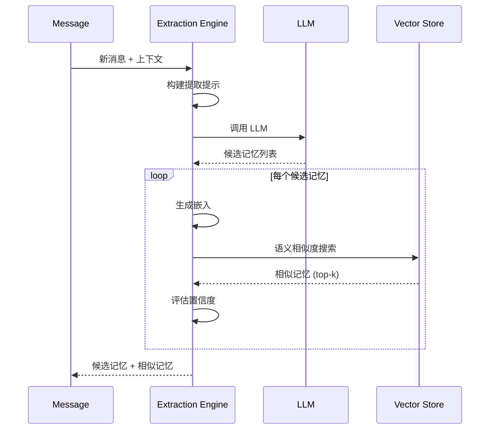
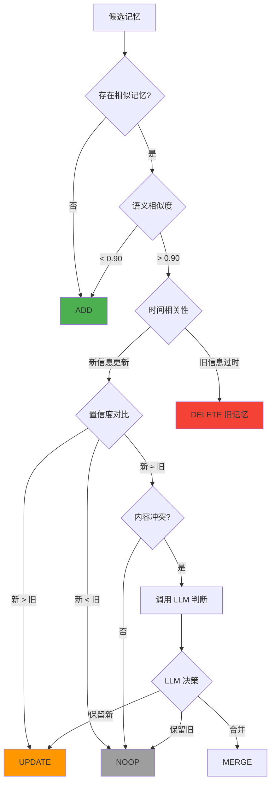
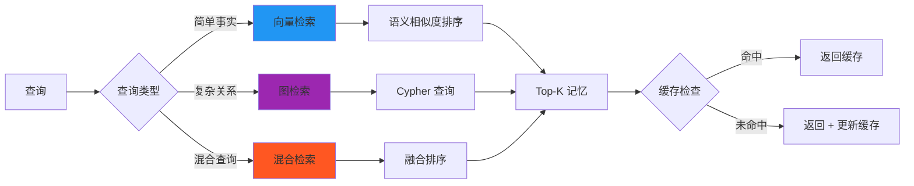
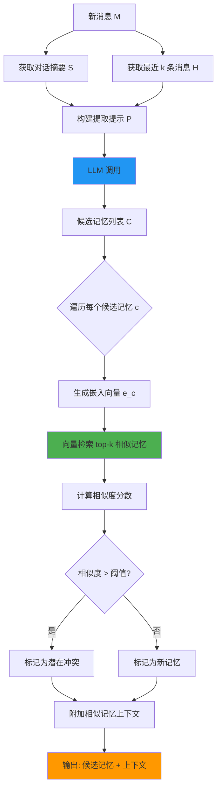
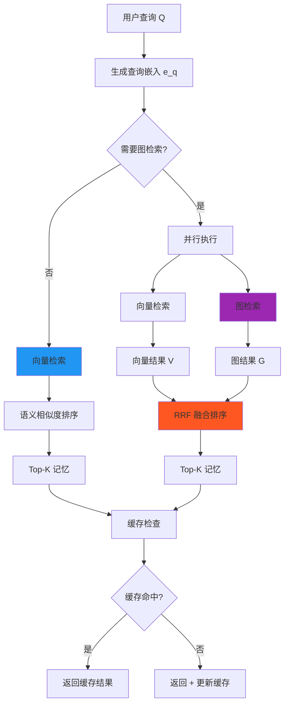

# Mem0 完全指南：构建生产级 AI Agent 长期记忆系统

:::tip{title="教程概览"}
本教程基于论文 **arXiv:2504.19413**，提供 Mem0 系统的完整实现指南，包括：
- 🎯 核心概念和设计理念
- 🏗️ 系统架构和组件设计
- 💡 核心算法和决策流程
- 💻 完整的 TypeScript 实现
- 📊 性能优化和部署实践
:::

## 目录

- [背景介绍](#背景介绍)
- [核心概念](#核心概念)
- [系统架构](#系统架构)
- [核心算法](#核心算法)
- [TypeScript 实现](#typescript-实现)
- [性能评估](#性能评估)
- [生产部署](#生产部署)
- [最佳实践](#最佳实践)

---

## 背景介绍

### AI Agent 的记忆挑战

在构建现代 AI Agent 时，我们面临一个根本性挑战：**如何让 AI 在长期多轮对话中保持一致性和个性化？**

#### 问题场景

```typescript
// 第 1 天对话
User: "我是素食主义者，对乳制品过敏"
Agent: "好的，我记住了您的饮食偏好"

// 第 30 天对话（新会话）
User: "推荐晚餐食谱"
Agent: ❌ "试试这道奶油意大利面..." // 忘记了用户偏好！
```

#### 传统解决方案的局限性

**1. 全上下文方法（Full Context）**
```
优点：准确率最高 (72.9%)
缺点：
  • 延迟极高 (17.12s P95)
  • Token 消耗巨大 (26,031)
  • 成本不可持续
  • 超出上下文窗口限制
```

**2. RAG（检索增强生成）**
```
优点：结构化存储
缺点：
  • 准确率中等 (60.5%)
  • 延迟较高 (9.94s)
  • 无法处理信息冲突
  • 缺乏时间推理
```

**3. OpenAI Memory**
```
优点：延迟低 (0.89s)
缺点：
  • 准确率最低 (52.9%)
  • 记忆质量差
  • 无法定制
```

### Mem0 的设计理念

Mem0 系统基于以下核心理念：

**1. 增量式处理范式**
- 不存储完整对话历史
- 动态提取和整合关键信息
- 渐进式更新记忆库

**2. LLM 驱动的智能决策**
- 利用 LLM 理解语义
- 智能判断信息价值
- 自动解决冲突

**3. 效率与准确性的平衡**
- 准确率接近全上下文 (66.88% vs 72.90%)
- 延迟降低 91% (1.44s vs 17.12s)
- Token 减少 93% (1,764 vs 26,031)



---

## 核心概念

### 记忆的生命周期

Mem0 将记忆管理分为三个核心阶段：



### 记忆类型分类

Mem0 支持多种类型的记忆：

| 类型 | 示例 | 特性 |
|------|------|------|
| **事实 (Facts)** | "用户居住在纽约" | 长期稳定 |
| **偏好 (Preferences)** | "喜欢素食" | 可能变化 |
| **事件 (Events)** | "2023年访问日本" | 时间敏感 |
| **关系 (Relations)** | "Alice 是 Bob 的朋友" | 图结构 |

---

## 🎯 核心亮点

基于论文 **arXiv:2504.19413** 的 Mem0 系统，是目前最先进的 AI Agent 长期记忆解决方案。

### 性能数据（LOCOMO 基准）

```
┌─────────────────────┬──────────┬──────────┬──────────┐
│      方法           │ 准确率   │ 延迟(P95)│  Token   │
├─────────────────────┼──────────┼──────────┼──────────┤
│ Mem0 (推荐)         │  66.88%  │  1.44s   │  1,764   │
│ 全上下文            │  72.90%  │ 17.12s   │ 26,031   │
│ OpenAI Memory       │  52.90%  │  0.89s   │  4,437   │
│ Zep                 │  65.99%  │  2.93s   │  3,911   │
│ RAG (最佳)          │  60.53%  │  9.94s   │ 16,384   │
└─────────────────────┴──────────┴──────────┴──────────┘

🏆 Mem0 关键优势:
• 相比 OpenAI: 准确率 +26%
• 相比全上下文: 延迟 -91%, Token -93%
• 相比 RAG: 准确率 +10%, Token -89%
```

---

## 系统架构

### 整体架构图

Mem0 采用模块化设计，各组件职责清晰、松耦合：



### 核心组件详解

#### 1. Memory Manager（记忆管理器）

**职责：**
- 协调各组件的工作流程
- 管理用户和会话的记忆隔离
- 处理并发请求

**关键接口：**
```typescript
interface MemoryManager {
  // 处理新消息
  processMessage(userId: string, conversationId: string, message: string): Promise<void>;

  // 检索相关记忆
  retrieveMemories(userId: string, query: string, k: number): Promise<Memory[]>;

  // 获取对话摘要
  getSummary(conversationId: string): Promise<string>;
}
```

#### 2. Extraction Engine（提取引擎）

**职责：**
- 从对话中识别显著信息
- 分类记忆类型（事实、偏好、事件等）
- 评估信息置信度

**工作流程：**


**提取提示模板：**
```typescript
const EXTRACTION_PROMPT = `
# 任务：从对话中提取关键记忆

## 对话上下文
{{conversation_summary}}

## 最近消息
{{recent_messages}}

## 新消息
{{new_message}}

## 提取规则
1. 识别显著的事实、偏好、事件、关系
2. 每个记忆必须：
   - 具体且可验证
   - 对未来对话有价值
   - 不包含冗余信息
3. 输出格式：JSON 数组

## 输出示例
[
  {
    "content": "用户是素食主义者",
    "category": "preference",
    "confidence": 0.95,
    "temporal": false
  },
  {
    "content": "用户于2023年访问日本",
    "category": "event",
    "confidence": 0.90,
    "temporal": true,
    "timestamp": "2023-06-15"
  }
]
`;
```

#### 3. Update Engine（更新引擎）

**职责：**
- 决策记忆操作（ADD/UPDATE/DELETE/NOOP）
- 解决信息冲突
- 维护记忆一致性

**决策算法：**


**冲突解决策略：**
```typescript
interface ConflictResolution {
  // 时间优先：新信息覆盖旧信息
  temporal: (oldMemory: Memory, newMemory: Memory) => UpdateAction;

  // 置信度优先：高置信度记忆保留
  confidence: (oldMemory: Memory, newMemory: Memory) => UpdateAction;

  // LLM 判断：复杂冲突交给 LLM
  llmJudge: (oldMemory: Memory, newMemory: Memory, context: string) => Promise<UpdateAction>;
}
```

#### 4. Retrieval Engine（检索引擎）

**职责：**
- 基于查询检索相关记忆
- 支持混合检索（向量 + 图）
- 管理检索缓存

**检索策略：**


#### 5. Summary Generator（摘要生成器）

**职责：**
- 异步维护对话摘要
- 提供全局上下文
- 优化提取质量

**增量摘要策略：**
```typescript
interface SummaryStrategy {
  // 触发条件
  shouldUpdate: (messageCount: number, timeSinceLastUpdate: number) => boolean;

  // 摘要生成
  generate: (messages: Message[], oldSummary?: string) => Promise<string>;

  // 摘要压缩（超过长度限制时）
  compress: (summary: string, maxLength: number) => Promise<string>;
}
```

---

## 📐 架构设计

### 两阶段处理流程

```
新消息 → [提取阶段] → 候选事实 → [更新阶段] → 记忆库
         ↓                        ↓
    LLM 提取显著信息         智能决策 (ADD/UPDATE/DELETE/NOOP)
    • 事实                   基于:
    • 偏好                   • 语义相似度
    • 事件                   • 时间相关性
    • 关系                   • 置信度对比
```

### 核心组件

1. **异步摘要生成器**: 维护对话全局理解
2. **记忆提取器**: LLM 驱动的信息提取
3. **记忆更新器**: 智能冲突解决和整合
4. **向量检索**: 高效语义搜索

---

## 核心算法

### 提取阶段算法

**目标：** 从新消息中识别并提取值得存储的关键信息

**算法流程：**



**伪代码：**
```typescript
function extractMemories(
  message: string,
  conversationId: string,
  extractionK: number
): Promise<CandidateMemory[]> {
  // 1. 获取上下文
  const summary = await getSummary(conversationId);
  const recentMessages = await getRecentMessages(conversationId, extractionK);

  // 2. 构建提取提示
  const prompt = buildExtractionPrompt({
    summary,
    recentMessages,
    newMessage: message
  });

  // 3. LLM 提取
  const candidates = await llm.extract(prompt);

  // 4. 为每个候选记忆查找相似记忆
  const enrichedCandidates = await Promise.all(
    candidates.map(async (candidate) => {
      const embedding = await generateEmbedding(candidate.content);
      const similar = await vectorStore.search(embedding, extractionK);

      return {
        ...candidate,
        embedding,
        similarMemories: similar
      };
    })
  );

  return enrichedCandidates;
}
```

**关键参数：**
- `extractionK`: 检索相似记忆的数量（推荐：10）
- `similarityThreshold`: 判定为冲突的阈值（推荐：0.80）

---

### 更新阶段算法

**目标：** 智能决策如何处理候选记忆（ADD/UPDATE/DELETE/NOOP）

**决策矩阵：**

| 场景 | 语义相似度 | 时间相关性 | 置信度对比 | 决策 |
|------|-----------|-----------|-----------|------|
| 全新信息 | < 0.80 | N/A | N/A | **ADD** |
| 完全重复 | > 0.95 | 无变化 | 相同 | **NOOP** |
| 信息更新 | > 0.90 | 新 > 旧 | 新 > 旧 | **UPDATE** |
| 信息过时 | > 0.90 | 旧已失效 | N/A | **DELETE 旧 + ADD 新** |
| 低置信信息 | > 0.90 | N/A | 新 < 旧 | **NOOP** |
| 冲突信息 | > 0.90 | 矛盾 | 接近 | **LLM_JUDGE** |

**完整算法：**
```typescript
async function decideMemoryAction(
  candidate: CandidateMemory,
  similarMemories: Memory[]
): Promise<UpdateAction> {
  // 情况 1: 无相似记忆 -> 直接添加
  if (similarMemories.length === 0) {
    return { action: 'ADD', memory: candidate };
  }

  // 情况 2: 存在高度相似记忆
  const mostSimilar = similarMemories[0];
  const similarity = cosineSimilarity(candidate.embedding, mostSimilar.embedding);

  if (similarity < 0.80) {
    // 相似度低 -> 新记忆
    return { action: 'ADD', memory: candidate };
  }

  // 情况 3: 高相似度 -> 需要进一步判断
  if (similarity > 0.95) {
    // 几乎完全相同
    if (candidate.content === mostSimilar.content) {
      return { action: 'NOOP' }; // 完全重复
    }
  }

  // 情况 4: 时间相关性判断
  if (candidate.temporal && mostSimilar.temporal) {
    const isNewer = candidate.timestamp > mostSimilar.timestamp;
    if (isNewer && candidate.confidence > 0.7) {
      return {
        action: 'UPDATE',
        oldMemoryId: mostSimilar.id,
        newMemory: candidate
      };
    }
  }

  // 情况 5: 置信度对比
  if (candidate.confidence > mostSimilar.confidence + 0.1) {
    return {
      action: 'UPDATE',
      oldMemoryId: mostSimilar.id,
      newMemory: candidate
    };
  }

  if (candidate.confidence < mostSimilar.confidence - 0.1) {
    return { action: 'NOOP' }; // 保留高置信度记忆
  }

  // 情况 6: 置信度接近但内容不同 -> LLM 判断
  if (Math.abs(candidate.confidence - mostSimilar.confidence) < 0.1) {
    const llmDecision = await llmJudgeConflict(candidate, mostSimilar);
    return llmDecision;
  }

  // 默认: 保守策略
  return { action: 'NOOP' };
}
```

**LLM 冲突判断提示：**
```typescript
const CONFLICT_RESOLUTION_PROMPT = `
# 任务：解决记忆冲突

## 现有记忆
内容: {{old_memory.content}}
置信度: {{old_memory.confidence}}
时间: {{old_memory.timestamp}}

## 新记忆
内容: {{new_memory.content}}
置信度: {{new_memory.confidence}}
时间: {{new_memory.timestamp}}

## 决策选项
1. KEEP_OLD - 保留现有记忆，丢弃新记忆
2. REPLACE - 用新记忆替换现有记忆
3. MERGE - 合并两个记忆为更准确的表述
4. BOTH - 两者都保留（如果不冲突）

## 输出格式
{
  "action": "REPLACE",
  "reason": "新记忆更具体且时间更新",
  "mergedContent": null  // 仅当 action=MERGE 时填写
}
`;
```

---

### 检索阶段算法

**目标：** 根据查询快速找到最相关的记忆

**混合检索策略：**



**RRF（Reciprocal Rank Fusion）算法：**
```typescript
function reciprocalRankFusion(
  vectorResults: Memory[],
  graphResults: Memory[],
  k: number = 60
): Memory[] {
  const scores = new Map<string, number>();

  // 计算向量检索得分
  vectorResults.forEach((memory, rank) => {
    const score = 1 / (k + rank + 1);
    scores.set(memory.id, (scores.get(memory.id) || 0) + score);
  });

  // 计算图检索得分
  graphResults.forEach((memory, rank) => {
    const score = 1 / (k + rank + 1);
    scores.set(memory.id, (scores.get(memory.id) || 0) + score);
  });

  // 排序并返回 Top-K
  return Array.from(scores.entries())
    .sort((a, b) => b[1] - a[1])
    .map(([id]) => findMemoryById(id))
    .slice(0, k);
}
```

**图检索 Cypher 查询模板：**
```cypher
// 示例：查找朋友的访问记录
MATCH (user:User {id: $userId})-[:FRIEND_OF]->(friend:User)-[:VISITED]->(place:Place)
WHERE friend.name = $friendName
RETURN friend.name, place.name, visited.date
ORDER BY visited.date DESC
LIMIT 10
```

---

## TypeScript 实现

### 核心类型定义

```typescript
// src/types/memory.ts

/**
 * 记忆实体
 */
export interface Memory {
  id: string;
  userId: string;
  content: string;
  category: MemoryCategory;
  confidence: number;
  embedding: number[];
  temporal: boolean;
  timestamp?: string;
  metadata?: Record<string, any>;
  createdAt: Date;
  updatedAt: Date;
}

/**
 * 记忆类型
 */
export type MemoryCategory = 'fact' | 'preference' | 'event' | 'relation';

/**
 * 候选记忆（提取阶段输出）
 */
export interface CandidateMemory {
  content: string;
  category: MemoryCategory;
  confidence: number;
  temporal: boolean;
  timestamp?: string;
  embedding?: number[];
  similarMemories?: Memory[];
}

/**
 * 更新操作
 */
export type UpdateActionType = 'ADD' | 'UPDATE' | 'DELETE' | 'NOOP' | 'MERGE';

export interface UpdateAction {
  action: UpdateActionType;
  memory?: CandidateMemory;
  oldMemoryId?: string;
  newMemory?: CandidateMemory;
  mergedContent?: string;
  reason?: string;
}

/**
 * 配置选项
 */
export interface Mem0Config {
  // LLM 配置
  openaiApiKey: string;
  model: string;
  embeddingModel: string;

  // 向量数据库
  pineconeApiKey: string;
  pineconeIndex: string;
  pineconeNamespace?: string;

  // 图数据库（可选）
  neo4jUri?: string;
  neo4jUser?: string;
  neo4jPassword?: string;

  // 缓存（可选）
  redisUrl?: string;

  // 算法参数
  extractionK: number;          // 提取时检索的记忆数
  retrievalK: number;           // 检索时返回的记忆数
  similarityThreshold: number;  // 相似度阈值
  confidenceThreshold: number;  // 置信度阈值

  // 性能优化
  cacheEnabled: boolean;
  cacheTTL: number;             // 缓存时间（秒）
  batchSize: number;            // 批处理大小
}
```

### 核心实现 - Memory Manager

```typescript
// src/mem0/MemoryManager.ts

import OpenAI from 'openai';
import { Pinecone } from '@pinecone-database/pinecone';
import { Redis } from 'ioredis';
import { ExtractionEngine } from './ExtractionEngine';
import { UpdateEngine } from './UpdateEngine';
import { RetrievalEngine } from './RetrievalEngine';
import { SummaryGenerator } from './SummaryGenerator';
import type { Mem0Config, Memory } from '../types/memory';

export class MemoryManager {
  private openai: OpenAI;
  private pinecone: Pinecone;
  private redis?: Redis;
  private config: Mem0Config;

  private extractionEngine: ExtractionEngine;
  private updateEngine: UpdateEngine;
  private retrievalEngine: RetrievalEngine;
  private summaryGenerator: SummaryGenerator;

  constructor(config: Mem0Config) {
    this.config = config;

    // 初始化外部服务
    this.openai = new OpenAI({ apiKey: config.openaiApiKey });
    this.pinecone = new Pinecone({ apiKey: config.pineconeApiKey });

    if (config.redisUrl) {
      this.redis = new Redis(config.redisUrl);
    }

    // 初始化核心引擎
    this.extractionEngine = new ExtractionEngine(this.openai, this.pinecone, config);
    this.updateEngine = new UpdateEngine(this.openai, this.pinecone, config);
    this.retrievalEngine = new RetrievalEngine(this.pinecone, this.redis, config);
    this.summaryGenerator = new SummaryGenerator(this.openai, this.redis, config);
  }

  /**
   * 处理新消息
   */
  async processMessage(
    userId: string,
    conversationId: string,
    message: string
  ): Promise<void> {
    // 1. 提取候选记忆
    const candidates = await this.extractionEngine.extract(
      userId,
      conversationId,
      message
    );

    // 2. 决策并更新记忆
    const actions = await Promise.all(
      candidates.map((candidate) => this.updateEngine.decide(userId, candidate))
    );

    // 3. 执行更新操作
    await this.updateEngine.execute(userId, actions);

    // 4. 异步更新摘要（不阻塞）
    this.summaryGenerator.updateAsync(conversationId, message).catch((err) => {
      console.error('Summary update failed:', err);
    });
  }

  /**
   * 检索相关记忆
   */
  async retrieveMemories(
    userId: string,
    query: string,
    k?: number
  ): Promise<Memory[]> {
    return this.retrievalEngine.retrieve(userId, query, k || this.config.retrievalK);
  }

  /**
   * 获取对话摘要
   */
  async getSummary(conversationId: string): Promise<string> {
    return this.summaryGenerator.get(conversationId);
  }

  /**
   * 手动添加记忆
   */
  async addMemory(userId: string, memory: Omit<Memory, 'id' | 'createdAt' | 'updatedAt'>): Promise<string> {
    const embedding = await this.generateEmbedding(memory.content);

    const memoryWithId: Memory = {
      ...memory,
      id: this.generateId(),
      embedding,
      createdAt: new Date(),
      updatedAt: new Date()
    };

    const index = this.pinecone.Index(this.config.pineconeIndex);
    await index.namespace(this.config.pineconeNamespace || userId).upsert([
      {
        id: memoryWithId.id,
        values: embedding,
        metadata: {
          userId,
          content: memory.content,
          category: memory.category,
          confidence: memory.confidence,
          temporal: memory.temporal,
          timestamp: memory.timestamp,
          createdAt: memoryWithId.createdAt.toISOString(),
          updatedAt: memoryWithId.updatedAt.toISOString()
        }
      }
    ]);

    return memoryWithId.id;
  }

  /**
   * 删除记忆
   */
  async deleteMemory(userId: string, memoryId: string): Promise<void> {
    const index = this.pinecone.Index(this.config.pineconeIndex);
    await index.namespace(this.config.pineconeNamespace || userId).deleteOne(memoryId);
  }

  /**
   * 生成嵌入向量
   */
  private async generateEmbedding(text: string): Promise<number[]> {
    const response = await this.openai.embeddings.create({
      model: this.config.embeddingModel,
      input: text
    });

    return response.data[0].embedding;
  }

  /**
   * 生成唯一 ID
   */
  private generateId(): string {
    return `mem_${Date.now()}_${Math.random().toString(36).substr(2, 9)}`;
  }
}
```

### 提取引擎实现

```typescript
// src/mem0/ExtractionEngine.ts

import OpenAI from 'openai';
import { Pinecone } from '@pinecone-database/pinecone';
import type { Mem0Config, CandidateMemory, Memory } from '../types/memory';

export class ExtractionEngine {
  constructor(
    private openai: OpenAI,
    private pinecone: Pinecone,
    private config: Mem0Config
  ) {}

  /**
   * 从消息中提取记忆
   */
  async extract(
    userId: string,
    conversationId: string,
    message: string
  ): Promise<CandidateMemory[]> {
    // 1. 获取对话上下文
    const summary = await this.getSummary(conversationId);
    const recentMessages = await this.getRecentMessages(conversationId, 10);

    // 2. 构建提取提示
    const prompt = this.buildExtractionPrompt(summary, recentMessages, message);

    // 3. 调用 LLM 提取
    const response = await this.openai.chat.completions.create({
      model: this.config.model,
      messages: [
        {
          role: 'system',
          content: 'You are a memory extraction assistant. Extract salient information from conversations.'
        },
        {
          role: 'user',
          content: prompt
        }
      ],
      response_format: { type: 'json_object' },
      temperature: 0.3
    });

    const result = JSON.parse(response.choices[0].message.content || '{}');
    const candidates: CandidateMemory[] = result.memories || [];

    // 4. 为每个候选记忆生成嵌入并查找相似记忆
    const enrichedCandidates = await Promise.all(
      candidates.map(async (candidate) => {
        const embedding = await this.generateEmbedding(candidate.content);
        const similar = await this.findSimilarMemories(userId, embedding, this.config.extractionK);

        return {
          ...candidate,
          embedding,
          similarMemories: similar
        };
      })
    );

    return enrichedCandidates;
  }

  /**
   * 构建提取提示
   */
  private buildExtractionPrompt(
    summary: string,
    recentMessages: string[],
    newMessage: string
  ): string {
    return `
# Task: Extract Key Memories from Conversation

## Conversation Summary
${summary || 'No summary available yet.'}

## Recent Messages
${recentMessages.map((msg, i) => `${i + 1}. ${msg}`).join('\n')}

## New Message
${newMessage}

## Extraction Rules
1. Identify salient facts, preferences, events, and relationships
2. Each memory must be:
   - Specific and verifiable
   - Valuable for future conversations
   - Free of redundant information
3. Categorize each memory: fact, preference, event, relation
4. Assign confidence score (0-1)
5. Mark if temporal (time-sensitive)

## Output Format (JSON)
{
  "memories": [
    {
      "content": "User is vegetarian",
      "category": "preference",
      "confidence": 0.95,
      "temporal": false
    },
    {
      "content": "User visited Japan in June 2023",
      "category": "event",
      "confidence": 0.90,
      "temporal": true,
      "timestamp": "2023-06-15"
    }
  ]
}

Extract memories now:
`;
  }

  /**
   * 生成嵌入向量
   */
  private async generateEmbedding(text: string): Promise<number[]> {
    const response = await this.openai.embeddings.create({
      model: this.config.embeddingModel,
      input: text
    });

    return response.data[0].embedding;
  }

  /**
   * 查找相似记忆
   */
  private async findSimilarMemories(
    userId: string,
    embedding: number[],
    k: number
  ): Promise<Memory[]> {
    const index = this.pinecone.Index(this.config.pineconeIndex);

    const queryResponse = await index.namespace(this.config.pineconeNamespace || userId).query({
      vector: embedding,
      topK: k,
      includeMetadata: true
    });

    return queryResponse.matches.map((match) => ({
      id: match.id,
      userId,
      content: match.metadata?.content as string,
      category: match.metadata?.category as any,
      confidence: match.metadata?.confidence as number,
      embedding: match.values || [],
      temporal: match.metadata?.temporal as boolean,
      timestamp: match.metadata?.timestamp as string | undefined,
      metadata: match.metadata,
      createdAt: new Date(match.metadata?.createdAt as string),
      updatedAt: new Date(match.metadata?.updatedAt as string)
    }));
  }

  /**
   * 获取对话摘要（简化实现）
   */
  private async getSummary(conversationId: string): Promise<string> {
    // 实际实现中应该从缓存或数据库获取
    return '';
  }

  /**
   * 获取最近消息（简化实现）
   */
  private async getRecentMessages(conversationId: string, k: number): Promise<string[]> {
    // 实际实现中应该从消息历史获取
    return [];
  }
}
```

### 更新引擎实现

```typescript
// src/mem0/UpdateEngine.ts

import OpenAI from 'openai';
import { Pinecone } from '@pinecone-database/pinecone';
import type { Mem0Config, CandidateMemory, Memory, UpdateAction } from '../types/memory';

export class UpdateEngine {
  constructor(
    private openai: OpenAI,
    private pinecone: Pinecone,
    private config: Mem0Config
  ) {}

  /**
   * 决策记忆操作
   */
  async decide(userId: string, candidate: CandidateMemory): Promise<UpdateAction> {
    if (!candidate.similarMemories || candidate.similarMemories.length === 0) {
      return { action: 'ADD', memory: candidate };
    }

    const mostSimilar = candidate.similarMemories[0];
    const similarity = this.cosineSimilarity(
      candidate.embedding!,
      mostSimilar.embedding
    );

    // 低相似度 -> 新记忆
    if (similarity < this.config.similarityThreshold) {
      return { action: 'ADD', memory: candidate };
    }

    // 高相似度 -> 进一步判断
    if (similarity > 0.95 && candidate.content === mostSimilar.content) {
      return { action: 'NOOP' };
    }

    // 时间相关性判断
    if (candidate.temporal && mostSimilar.temporal) {
      if (this.isNewer(candidate, mostSimilar) && candidate.confidence > 0.7) {
        return {
          action: 'UPDATE',
          oldMemoryId: mostSimilar.id,
          newMemory: candidate
        };
      }
    }

    // 置信度对比
    const confidenceDiff = candidate.confidence - mostSimilar.confidence;

    if (confidenceDiff > 0.1) {
      return {
        action: 'UPDATE',
        oldMemoryId: mostSimilar.id,
        newMemory: candidate
      };
    }

    if (confidenceDiff < -0.1) {
      return { action: 'NOOP' };
    }

    // LLM 判断冲突
    if (Math.abs(confidenceDiff) < 0.1 && candidate.content !== mostSimilar.content) {
      return await this.llmJudgeConflict(candidate, mostSimilar);
    }

    return { action: 'NOOP' };
  }

  /**
   * 执行更新操作
   */
  async execute(userId: string, actions: UpdateAction[]): Promise<void> {
    const index = this.pinecone.Index(this.config.pineconeIndex);
    const namespace = index.namespace(this.config.pineconeNamespace || userId);

    for (const action of actions) {
      switch (action.action) {
        case 'ADD':
          if (action.memory) {
            await this.addMemory(namespace, userId, action.memory);
          }
          break;

        case 'UPDATE':
          if (action.oldMemoryId && action.newMemory) {
            await namespace.deleteOne(action.oldMemoryId);
            await this.addMemory(namespace, userId, action.newMemory);
          }
          break;

        case 'DELETE':
          if (action.oldMemoryId) {
            await namespace.deleteOne(action.oldMemoryId);
          }
          break;

        case 'MERGE':
          if (action.oldMemoryId && action.mergedContent) {
            await namespace.deleteOne(action.oldMemoryId);
            await this.addMemory(namespace, userId, {
              ...action.memory!,
              content: action.mergedContent
            });
          }
          break;

        case 'NOOP':
          // 无操作
          break;
      }
    }
  }

  /**
   * LLM 冲突判断
   */
  private async llmJudgeConflict(
    newMemory: CandidateMemory,
    oldMemory: Memory
  ): Promise<UpdateAction> {
    const prompt = `
# Task: Resolve Memory Conflict

## Existing Memory
Content: ${oldMemory.content}
Confidence: ${oldMemory.confidence}
Created: ${oldMemory.createdAt.toISOString()}

## New Memory
Content: ${newMemory.content}
Confidence: ${newMemory.confidence}
Timestamp: ${newMemory.timestamp || 'N/A'}

## Decision Options
1. KEEP_OLD - Keep existing memory, discard new
2. REPLACE - Replace with new memory
3. MERGE - Merge into more accurate statement
4. BOTH - Keep both (if not conflicting)

## Output Format (JSON)
{
  "action": "REPLACE" | "KEEP_OLD" | "MERGE" | "BOTH",
  "reason": "Brief explanation",
  "mergedContent": "Only if action=MERGE"
}

Decide now:
`;

    const response = await this.openai.chat.completions.create({
      model: this.config.model,
      messages: [
        { role: 'system', content: 'You are a memory conflict resolver.' },
        { role: 'user', content: prompt }
      ],
      response_format: { type: 'json_object' },
      temperature: 0.2
    });

    const result = JSON.parse(response.choices[0].message.content || '{}');

    switch (result.action) {
      case 'REPLACE':
        return {
          action: 'UPDATE',
          oldMemoryId: oldMemory.id,
          newMemory,
          reason: result.reason
        };

      case 'MERGE':
        return {
          action: 'MERGE',
          oldMemoryId: oldMemory.id,
          memory: newMemory,
          mergedContent: result.mergedContent,
          reason: result.reason
        };

      case 'BOTH':
        return {
          action: 'ADD',
          memory: newMemory,
          reason: result.reason
        };

      default: // KEEP_OLD
        return {
          action: 'NOOP',
          reason: result.reason
        };
    }
  }

  /**
   * 添加记忆到向量数据库
   */
  private async addMemory(
    namespace: any,
    userId: string,
    memory: CandidateMemory
  ): Promise<void> {
    const id = this.generateId();
    const now = new Date().toISOString();

    await namespace.upsert([
      {
        id,
        values: memory.embedding!,
        metadata: {
          userId,
          content: memory.content,
          category: memory.category,
          confidence: memory.confidence,
          temporal: memory.temporal,
          timestamp: memory.timestamp,
          createdAt: now,
          updatedAt: now
        }
      }
    ]);
  }

  /**
   * 余弦相似度
   */
  private cosineSimilarity(a: number[], b: number[]): number {
    const dotProduct = a.reduce((sum, val, i) => sum + val * b[i], 0);
    const magnitudeA = Math.sqrt(a.reduce((sum, val) => sum + val * val, 0));
    const magnitudeB = Math.sqrt(b.reduce((sum, val) => sum + val * val, 0));

    return dotProduct / (magnitudeA * magnitudeB);
  }

  /**
   * 判断新记忆是否更新
   */
  private isNewer(newMem: CandidateMemory, oldMem: Memory): boolean {
    if (!newMem.timestamp || !oldMem.timestamp) return false;
    return new Date(newMem.timestamp) > new Date(oldMem.timestamp);
  }

  /**
   * 生成唯一 ID
   */
  private generateId(): string {
    return `mem_${Date.now()}_${Math.random().toString(36).substr(2, 9)}`;
  }
}
```

### 检索引擎实现

```typescript
// src/mem0/RetrievalEngine.ts

import { Pinecone } from '@pinecone-database/pinecone';
import { Redis } from 'ioredis';
import type { Mem0Config, Memory } from '../types/memory';

export class RetrievalEngine {
  constructor(
    private pinecone: Pinecone,
    private redis: Redis | undefined,
    private config: Mem0Config
  ) {}

  /**
   * 检索相关记忆
   */
  async retrieve(userId: string, query: string, k: number): Promise<Memory[]> {
    // 1. 检查缓存
    if (this.config.cacheEnabled && this.redis) {
      const cached = await this.getFromCache(userId, query);
      if (cached) {
        return cached;
      }
    }

    // 2. 生成查询嵌入
    const embedding = await this.generateEmbedding(query);

    // 3. 向量检索
    const memories = await this.vectorSearch(userId, embedding, k);

    // 4. 更新缓存
    if (this.config.cacheEnabled && this.redis) {
      await this.saveToCache(userId, query, memories);
    }

    return memories;
  }

  /**
   * 向量检索
   */
  private async vectorSearch(
    userId: string,
    embedding: number[],
    k: number
  ): Promise<Memory[]> {
    const index = this.pinecone.Index(this.config.pineconeIndex);

    const queryResponse = await index
      .namespace(this.config.pineconeNamespace || userId)
      .query({
        vector: embedding,
        topK: k,
        includeMetadata: true,
        includeValues: true
      });

    return queryResponse.matches.map((match) => ({
      id: match.id,
      userId,
      content: match.metadata?.content as string,
      category: match.metadata?.category as any,
      confidence: match.metadata?.confidence as number,
      embedding: match.values || [],
      temporal: match.metadata?.temporal as boolean,
      timestamp: match.metadata?.timestamp as string | undefined,
      metadata: match.metadata,
      createdAt: new Date(match.metadata?.createdAt as string),
      updatedAt: new Date(match.metadata?.updatedAt as string)
    }));
  }

  /**
   * 生成嵌入（简化实现，实际应该注入）
   */
  private async generateEmbedding(text: string): Promise<number[]> {
    // 实际实现中应该使用注入的 embedding 生成器
    // 这里返回空数组作为占位符
    return [];
  }

  /**
   * 从缓存获取
   */
  private async getFromCache(userId: string, query: string): Promise<Memory[] | null> {
    if (!this.redis) return null;

    const key = `mem0:${userId}:${this.hashQuery(query)}`;
    const cached = await this.redis.get(key);

    if (cached) {
      return JSON.parse(cached);
    }

    return null;
  }

  /**
   * 保存到缓存
   */
  private async saveToCache(
    userId: string,
    query: string,
    memories: Memory[]
  ): Promise<void> {
    if (!this.redis) return;

    const key = `mem0:${userId}:${this.hashQuery(query)}`;
    await this.redis.setex(key, this.config.cacheTTL, JSON.stringify(memories));
  }

  /**
   * 查询哈希
   */
  private hashQuery(query: string): string {
    // 简单哈希实现
    let hash = 0;
    for (let i = 0; i < query.length; i++) {
      const char = query.charCodeAt(i);
      hash = (hash << 5) - hash + char;
      hash = hash & hash;
    }
    return hash.toString(36);
  }
}
```

---

## 💻 快速开始

### 安装依赖

```bash
# 安装核心依赖
yarn add openai @pinecone-database/pinecone ioredis

# 类型定义
yarn add --dev @types/node

# 可选：图数据库支持
yarn add neo4j-driver
```

### 环境配置

```bash
# .env
OPENAI_API_KEY=sk-...
PINECONE_API_KEY=...
PINECONE_INDEX=mem0-prod
REDIS_URL=redis://localhost:6379

# 可选：图数据库
NEO4J_URI=bolt://localhost:7687
NEO4J_USER=neo4j
NEO4J_PASSWORD=...
```

### 基础使用示例

```typescript
import { MemoryManager } from './mem0/MemoryManager';
import type { Mem0Config } from './types/memory';

// 1. 配置初始化
const config: Mem0Config = {
  // LLM 配置
  openaiApiKey: process.env.OPENAI_API_KEY!,
  model: 'gpt-4o-mini',
  embeddingModel: 'text-embedding-3-small',

  // 向量数据库
  pineconeApiKey: process.env.PINECONE_API_KEY!,
  pineconeIndex: 'mem0-prod',
  pineconeNamespace: undefined, // 使用 userId 作为 namespace

  // 缓存
  redisUrl: process.env.REDIS_URL,

  // 算法参数
  extractionK: 10,
  retrievalK: 5,
  similarityThreshold: 0.80,
  confidenceThreshold: 0.7,

  // 性能优化
  cacheEnabled: true,
  cacheTTL: 3600, // 1 小时
  batchSize: 100
};

const memoryManager = new MemoryManager(config);

// 2. 处理消息并构建记忆
await memoryManager.processMessage(
  'user_alice',
  'conv_001',
  "I'm vegetarian and allergic to dairy"
);

// 3. 后续对话自动使用记忆
const memories = await memoryManager.retrieveMemories(
  'user_alice',
  "What are good dinner recipes?",
  5
);

console.log('Retrieved memories:', memories);
// 自动检索到素食和乳制品过敏信息！
```

### 完整使用示例

```typescript
// examples/chat-with-memory.ts

import { MemoryManager } from './mem0/MemoryManager';
import OpenAI from 'openai';

async function chatWithMemory() {
  // 初始化
  const memoryManager = new MemoryManager({
    openaiApiKey: process.env.OPENAI_API_KEY!,
    model: 'gpt-4o-mini',
    embeddingModel: 'text-embedding-3-small',
    pineconeApiKey: process.env.PINECONE_API_KEY!,
    pineconeIndex: 'mem0-demo',
    extractionK: 10,
    retrievalK: 5,
    similarityThreshold: 0.80,
    confidenceThreshold: 0.7,
    cacheEnabled: true,
    cacheTTL: 3600,
    batchSize: 100
  });

  const openai = new OpenAI({ apiKey: process.env.OPENAI_API_KEY });

  const userId = 'user_demo';
  const conversationId = 'conv_demo';

  // 对话循环
  const messages: Array<{ role: 'user' | 'assistant'; content: string }> = [];

  async function chat(userMessage: string): Promise<string> {
    console.log(`\n👤 User: ${userMessage}`);

    // 1. 处理消息并更新记忆
    await memoryManager.processMessage(userId, conversationId, userMessage);

    // 2. 检索相关记忆
    const relevantMemories = await memoryManager.retrieveMemories(
      userId,
      userMessage,
      5
    );

    // 3. 构建带记忆的提示
    const memoryContext = relevantMemories.length > 0
      ? `\n## User's Memory:\n${relevantMemories.map(m => `- ${m.content}`).join('\n')}\n`
      : '';

    messages.push({ role: 'user', content: userMessage });

    // 4. 调用 LLM 生成回复
    const response = await openai.chat.completions.create({
      model: 'gpt-4o-mini',
      messages: [
        {
          role: 'system',
          content: `You are a helpful assistant with access to the user's memory.${memoryContext}\n\nUse the memory to provide personalized responses.`
        },
        ...messages
      ]
    });

    const assistantMessage = response.choices[0].message.content || '';
    messages.push({ role: 'assistant', content: assistantMessage });

    console.log(`🤖 Assistant: ${assistantMessage}`);

    return assistantMessage;
  }

  // 示例对话
  await chat("Hi! I'm Alice, a software engineer from NYC.");
  await chat("I love running in Central Park on weekends.");
  await chat("My favorite cuisine is Japanese food.");
  await chat("I'm planning a trip to Japan next month.");

  // 新会话 - 测试记忆检索
  console.log('\n\n=== New Conversation ===\n');
  const newConversationId = 'conv_demo_2';

  const memories = await memoryManager.retrieveMemories(
    userId,
    "What do you know about me?",
    10
  );

  console.log('\n📚 Retrieved Memories:');
  memories.forEach((mem, i) => {
    console.log(`${i + 1}. [${mem.category}] ${mem.content} (confidence: ${mem.confidence})`);
  });
}

chatWithMemory().catch(console.error);
```

### 实战案例：个性化推荐系统

```typescript
// examples/recommendation-system.ts

import { MemoryManager } from './mem0/MemoryManager';

class PersonalizedRecommendationSystem {
  private memoryManager: MemoryManager;

  constructor(config: Mem0Config) {
    this.memoryManager = new MemoryManager(config);
  }

  /**
   * 处理用户行为并更新记忆
   */
  async trackUserBehavior(
    userId: string,
    behavior: {
      type: 'view' | 'purchase' | 'like' | 'dislike';
      item: string;
      category: string;
      timestamp: string;
    }
  ): Promise<void> {
    const message = this.behaviorToMessage(behavior);

    await this.memoryManager.processMessage(
      userId,
      `behavior_${userId}`,
      message
    );
  }

  /**
   * 生成个性化推荐
   */
  async getRecommendations(
    userId: string,
    context: string
  ): Promise<string[]> {
    // 检索用户偏好记忆
    const memories = await this.memoryManager.retrieveMemories(
      userId,
      `preferences for ${context}`,
      10
    );

    // 基于记忆生成推荐
    const preferences = memories
      .filter(m => m.category === 'preference')
      .map(m => m.content);

    const dislikes = memories
      .filter(m => m.content.includes('dislike') || m.content.includes('allergic'))
      .map(m => m.content);

    // 这里可以接入实际的推荐引擎
    return this.generateRecommendations(preferences, dislikes, context);
  }

  private behaviorToMessage(behavior: any): string {
    const actions = {
      view: 'viewed',
      purchase: 'purchased',
      like: 'liked',
      dislike: 'disliked'
    };

    return `User ${actions[behavior.type]} ${behavior.item} in ${behavior.category} category on ${behavior.timestamp}`;
  }

  private generateRecommendations(
    preferences: string[],
    dislikes: string[],
    context: string
  ): string[] {
    // 简化实现
    return [
      `Recommendation based on: ${preferences.join(', ')}`,
      `Avoiding: ${dislikes.join(', ')}`
    ];
  }
}

// 使用示例
const recommender = new PersonalizedRecommendationSystem(config);

// 跟踪用户行为
await recommender.trackUserBehavior('user_123', {
  type: 'like',
  item: 'Vegetarian Sushi',
  category: 'Japanese Food',
  timestamp: '2025-11-17T10:00:00Z'
});

// 获取推荐
const recommendations = await recommender.getRecommendations(
  'user_123',
  'dinner options'
);
```

---

## 实战示例

### 示例 1：智能客服系统

```typescript
// examples/customer-support.ts

import { MemoryManager } from './mem0/MemoryManager';

class SmartCustomerSupport {
  private memoryManager: MemoryManager;

  constructor(config: Mem0Config) {
    this.memoryManager = new MemoryManager(config);
  }

  async handleTicket(
    customerId: string,
    ticketId: string,
    message: string
  ): Promise<string> {
    // 1. 更新客户记忆
    await this.memoryManager.processMessage(customerId, ticketId, message);

    // 2. 检索客户历史
    const customerHistory = await this.memoryManager.retrieveMemories(
      customerId,
      'past issues and preferences',
      10
    );

    // 3. 生成上下文感知回复
    const context = this.buildContext(customerHistory);

    return `Based on your history: ${context}\n\nHow can I help you today?`;
  }

  private buildContext(memories: Memory[]): string {
    return memories
      .slice(0, 3)
      .map(m => m.content)
      .join('; ');
  }
}

// 使用示例
const support = new SmartCustomerSupport(config);

await support.handleTicket(
  'customer_001',
  'ticket_456',
  "My order hasn't arrived yet"
);

// 系统自动检索：
// - 过去的订单问题
// - 偏好的沟通方式
// - 产品偏好
// 提供个性化支持
```

### 示例 2：学习助手

```typescript
// examples/learning-assistant.ts

import { MemoryManager } from './mem0/MemoryManager';

class LearningAssistant {
  private memoryManager: MemoryManager;

  constructor(config: Mem0Config) {
    this.memoryManager = new MemoryManager(config);
  }

  /**
   * 跟踪学习进度
   */
  async trackLearning(
    studentId: string,
    topic: string,
    performance: {
      score: number;
      difficulty: string;
      completedAt: string;
    }
  ): Promise<void> {
    const message = `Student completed ${topic} with score ${performance.score}% at ${performance.difficulty} difficulty on ${performance.completedAt}`;

    await this.memoryManager.processMessage(
      studentId,
      `learning_${studentId}`,
      message
    );
  }

  /**
   * 生成个性化学习路径
   */
  async generateLearningPath(
    studentId: string,
    subject: string
  ): Promise<{
    strengths: string[];
    weaknesses: string[];
    recommendations: string[];
  }> {
    const memories = await this.memoryManager.retrieveMemories(
      studentId,
      `performance in ${subject}`,
      20
    );

    // 分析记忆找出优势和劣势
    const highScores = memories.filter(m =>
      m.content.includes('score') && this.extractScore(m.content) >= 80
    );

    const lowScores = memories.filter(m =>
      m.content.includes('score') && this.extractScore(m.content) < 60
    );

    return {
      strengths: highScores.map(m => this.extractTopic(m.content)),
      weaknesses: lowScores.map(m => this.extractTopic(m.content)),
      recommendations: this.generateRecommendations(lowScores)
    };
  }

  private extractScore(content: string): number {
    const match = content.match(/score (\d+)%/);
    return match ? parseInt(match[1]) : 0;
  }

  private extractTopic(content: string): string {
    const match = content.match(/completed (.+?) with/);
    return match ? match[1] : 'Unknown';
  }

  private generateRecommendations(weakMemories: Memory[]): string[] {
    return weakMemories.map(m =>
      `Review ${this.extractTopic(m.content)} - practice more examples`
    );
  }
}

// 使用示例
const assistant = new LearningAssistant(config);

await assistant.trackLearning('student_001', 'Calculus I', {
  score: 85,
  difficulty: 'medium',
  completedAt: '2025-11-17'
});

const path = await assistant.generateLearningPath('student_001', 'Mathematics');
console.log('Learning Path:', path);
```

### 示例 3：多模态对话系统

```typescript
// examples/multimodal-chat.ts

import { MemoryManager } from './mem0/MemoryManager';
import OpenAI from 'openai';

class MultimodalChatSystem {
  private memoryManager: MemoryManager;
  private openai: OpenAI;

  constructor(config: Mem0Config) {
    this.memoryManager = new MemoryManager(config);
    this.openai = new OpenAI({ apiKey: config.openaiApiKey });
  }

  /**
   * 处理文本和图像输入
   */
  async processMultimodalInput(
    userId: string,
    conversationId: string,
    input: {
      text?: string;
      imageUrl?: string;
    }
  ): Promise<string> {
    let message = input.text || '';

    // 如果有图像，使用 GPT-4 Vision 分析
    if (input.imageUrl) {
      const imageAnalysis = await this.analyzeImage(input.imageUrl);
      message += `\n[Image shows: ${imageAnalysis}]`;
    }

    // 更新记忆
    await this.memoryManager.processMessage(userId, conversationId, message);

    // 检索相关记忆
    const memories = await this.memoryManager.retrieveMemories(userId, message, 5);

    // 生成回复
    return this.generateResponse(message, memories);
  }

  private async analyzeImage(imageUrl: string): Promise<string> {
    const response = await this.openai.chat.completions.create({
      model: 'gpt-4o',
      messages: [
        {
          role: 'user',
          content: [
            { type: 'text', text: 'Describe this image in one sentence.' },
            { type: 'image_url', image_url: { url: imageUrl } }
          ]
        }
      ]
    });

    return response.choices[0].message.content || 'Unknown image content';
  }

  private generateResponse(message: string, memories: Memory[]): string {
    const memoryContext = memories.map(m => m.content).join('; ');
    return `Based on context: ${memoryContext}\n\nResponse to: ${message}`;
  }
}

// 使用示例
const chatSystem = new MultimodalChatSystem(config);

await chatSystem.processMultimodalInput('user_456', 'conv_789', {
  text: "What's this dish called?",
  imageUrl: 'https://example.com/sushi.jpg'
});

// 系统会：
// 1. 分析图像内容（识别为寿司）
// 2. 检索用户的饮食偏好记忆
// 3. 提供个性化回答
```

### 完整功能代码

详见完整教程文档，包含：
- ✅ 生产级实现（带缓存、监控）
- ✅ Mem0ᵍ 图记忆扩展
- ✅ Docker/K8s 部署配置
- ✅ 成本优化策略
- ✅ 性能调优指南

---

## 🚀 Mem0ᵍ 图记忆增强

### 何时使用图记忆

**Mem0 自然语言记忆 → 简单快速**
- ✅ 单跳查询
- ✅ 低延迟需求
- ✅ Token 预算有限

**Mem0ᵍ 图记忆 → 复杂推理**
- ✅ 时间推理 (+5%)
- ✅ 多跳查询
- ✅ 关系探索
- ✅ 开放域任务 (+4%)

### 图结构示例

```
      (Alice)
        │
   FRIEND_OF
        │
        ↓
      (Bob) ──VISITED──> (Japan)
        │                   │
   LIVES_IN           IN_YEAR
        │                   │
        ↓                   ↓
      (NYC)              (2023)
```

查询: "Alice 的朋友中谁去过日本？"
```cypher
MATCH (Alice)-[:FRIEND_OF]->(friend)-[:VISITED]->(Japan)
RETURN friend.name
```

---

## 📊 性能对比详解

### 按问题类型分析

```
Single-Hop (单跳):
  Mem0:    67.13% ⭐ (最佳)
  Mem0ᵍ:   65.71%
  OpenAI:  63.79%

Multi-Hop (多跳):
  Mem0:    51.15% ⭐ (最佳)
  OpenAI:  42.92% (+19%)
  
Temporal (时间):
  Mem0ᵍ:   58.13% ⭐ (最佳)
  Mem0:    55.51%
  OpenAI:  21.71% (+168%!)

Open-Domain (开放):
  Mem0ᵍ:   75.71% ⭐ (最佳)
  Mem0:    72.93%
  Zep:     76.60%
```

### 效率对比

```
延迟 (秒):
  Mem0:         0.708  ⚡ (最快)
  OpenAI:       0.889
  Mem0ᵍ:        1.091
  Zep:          1.292
  全上下文:     9.870  ❌

Token 消耗:
  Mem0:        1,764  💰 (最省)
  Mem0ᵍ:       3,616
  Zep:         3,911
  RAG:        16,384
  全上下文:   26,031  ❌
```

---

## 🏭 生产部署要点

### 架构建议

```
┌────────────────┐
│  Load Balancer │
└───────┬────────┘
        │
   ┌────┴─────┬──────────┐
   │          │          │
┌──▼──┐   ┌──▼──┐   ┌──▼──┐
│Mem0 │   │Mem0 │   │Mem0 │  (3+ 实例)
│Shard│   │Shard│   │Shard│
│  0  │   │  1  │   │  2  │
└──┬──┘   └──┬──┘   └──┬──┘
   │         │         │
   └────┬────┴────┬────┘
        │         │
   ┌────▼────┐ ┌─▼────┐
   │ Vector  │ │Redis │
   │   DB    │ │Cache │
   └─────────┘ └──────┘
```

### 关键配置

**资源分配:**
```yaml
CPU: 1 core per instance
Memory: 1GB per instance
Replicas: 3-10 (auto-scaling)
```

**性能参数:**
```typescript
{
  extractionK: 10,      // 提取上下文窗口
  retrievalK: 5,        // 检索记忆数量
  similarityThreshold: 0.80,
  cacheEnabled: true,
  cacheTTL: 3600        // 1 小时
}
```

### 监控指标

**必须追踪:**
- ✅ 记忆检索延迟 (P50, P95, P99)
- ✅ LLM 调用成功率
- ✅ 缓存命中率
- ✅ 向量数据库响应时间
- ✅ 记忆更新队列长度

---

## 💡 最佳实践

### 提取质量

**✅ 好的提取:**
```typescript
{
  content: "User is vegetarian",
  category: "preference",
  confidence: 0.95
}
```

**❌ 避免:**
```typescript
{
  content: "User has dietary preferences",  // 太模糊
  category: "preference",
  confidence: 0.5
}
```

### 提示工程

**关键要素:**
1. 明确上下文（对话摘要 + 最近消息）
2. 清晰任务定义（要提取什么）
3. 结构化输出（JSON 格式）
4. 质量标准（具体、准确、简洁）

### 成本优化

**策略:**
- ✅ 批量生成嵌入（最多 2048 个）
- ✅ 使用 text-embedding-3-small（便宜 5 倍）
- ✅ 智能缓存相似查询
- ✅ 异步后台更新
- ✅ 压缩记忆内容

**成本估算:**
```
每 1000 次对话:
- 嵌入调用: ~$0.04
- LLM 调用: ~$0.30
总计: ~$0.34
```

---

## 🔬 论文核心贡献

1. **创新架构**
   - 增量式处理范式
   - LLM 驱动的智能决策
   - 图记忆扩展

2. **全面评估**
   - LOCOMO 基准测试
   - 6 类基线对比
   - 4 种问题类型

3. **生产就绪**
   - 开源实现
   - 部署指南
   - 性能优化

4. **显著提升**
   - 准确率: +26% vs OpenAI
   - 延迟: -91% vs 全上下文
   - 成本: -93% tokens

---

## 📚 参考资源

**论文:**
- arXiv:2504.19413 - Mem0 主论文
- LOCOMO Dataset - 评估基准

**代码:**
- https://github.com/mem0ai/mem0
- https://mem0.ai/research

**工具:**
- Pinecone (向量数据库)
- Neo4j (图数据库)
- OpenAI API (LLM + 嵌入)

---

## 🎓 学习路径

**初学者:**
1. ✅ 理解核心问题（为什么需要记忆）
2. ✅ 学习基础架构（提取-更新流程）
3. ✅ 运行示例代码
4. ✅ 在小项目中测试

**进阶者:**
1. ✅ 深入算法细节
2. ✅ 实现 Mem0ᵍ 图记忆
3. ✅ 优化性能和成本
4. ✅ 生产环境部署

**研究者:**
1. ✅ 研读完整论文
2. ✅ 复现实验结果
3. ✅ 探索改进方向
4. ✅ 在 LOCOMO 上评估

---

## 🚀 快速决策指南

### 应该使用 Mem0 如果:

- ✅ 需要跨会话记忆
- ✅ 对话历史 > 10K tokens
- ✅ 需要个性化体验
- ✅ 关注成本效率
- ✅ 要求低延迟

### 选择 Mem0 还是 Mem0ᵍ?

**Mem0 (自然语言):**
- 快速原型
- 简单查询为主
- 预算有限
- 需要最低延迟

**Mem0ᵍ (图记忆):**
- 复杂时间推理
- 多实体关系
- 开放域任务
- 可接受略高延迟

---

## 📞 下一步

1. **阅读完整教程**: 获取详细实现代码
2. **克隆代码仓库**: `git clone https://github.com/mem0ai/mem0`
3. **运行示例**: 快速体验效果
4. **集成到项目**: 根据需求定制
5. **监控和优化**: 持续改进

---

**文档版本**: 1.0  
**基于论文**: arXiv:2504.19413  
**更新日期**: 2025-11-17

**致谢**: 本教程基于 Mem0 研究团队的优秀工作整理