# Mastra.ai vs Vercel AI SDK 完整对比教程

## 目录

1. [核心定位对比](#核心定位对比)
2. [架构设计对比](#架构设计对比)
3. [功能特性对比](#功能特性对比)
4. [实现流程对比](#实现流程对比)
5. [使用场景决策](#使用场景决策)
6. [集成关系](#集成关系)
7. [最佳实践](#最佳实践)

---

## 核心定位对比

### 定位差异图

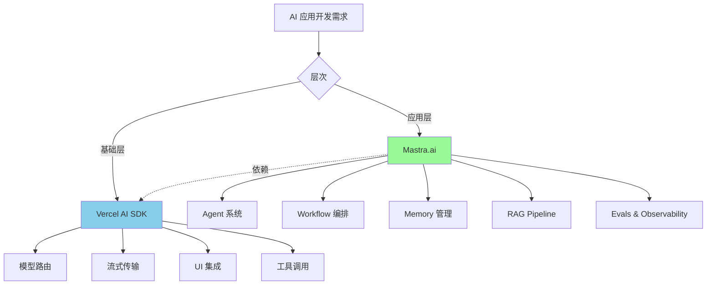

### 核心定位表

| 维度         | Vercel AI SDK    | Mastra.ai              |
| ------------ | ---------------- | ---------------------- |
| **定位**     | LLM 通信基础设施 | 完整的 Agent 框架      |
| **抽象层次** | 低层（模型调用） | 高层（业务逻辑）       |
| **依赖关系** | 独立库           | **建立在 AI SDK 之上** |
| **核心价值** | 标准化模型接口   | Agent 工程化           |
| **目标用户** | 所有 AI 开发者   | Agent 系统开发者       |

### 简单类比

```typescript
// Vercel AI SDK = Express (Web 框架基础)
// Mastra.ai = NestJS/Next.js (完整应用框架)

// Vercel AI SDK = React (UI 库)
// Mastra.ai = Next.js (全栈框架)
```

**核心关系**：Mastra **使用** Vercel AI SDK，而非竞争关系。

---

## 架构设计对比

### Vercel AI SDK 架构

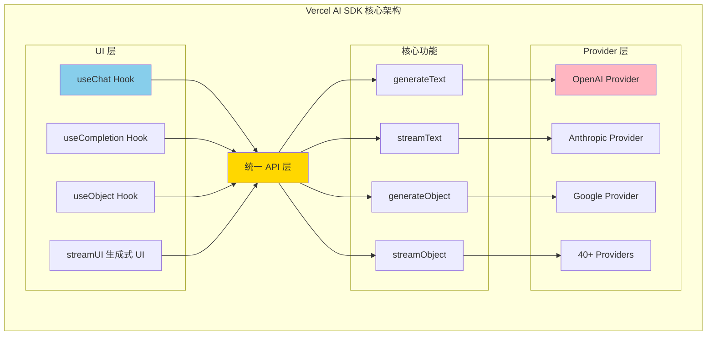

**核心组件**：

1. **AI Core**：`generateText`, `streamText`, `generateObject`
2. **Provider System**：统一接口，40+ 模型提供商
3. **UI Hooks**：`useChat`, `useCompletion`, React 集成
4. **Streaming**：Server-Sent Events (SSE) 标准
5. **Tool Calling**：标准化工具调用协议

### Mastra.ai 架构

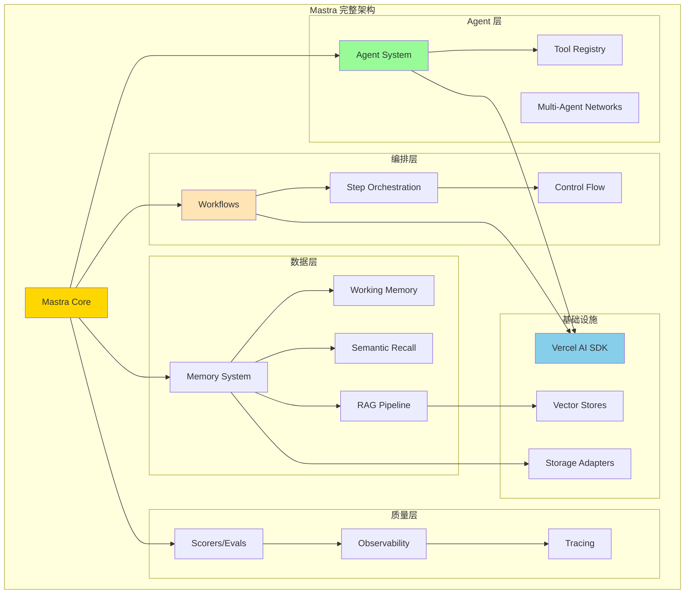

**核心组件**：

1. **Agent System**：自主决策、工具调用、推理循环
2. **Workflows**：结构化流程编排
3. **Memory**：对话历史、Working Memory、语义召回
4. **RAG**：向量化、检索、上下文增强
5. **Evals**：Scorers、质量评估、持续优化
6. **Dev Tools**：Playground、Tracing、调试工具

### 层次关系图

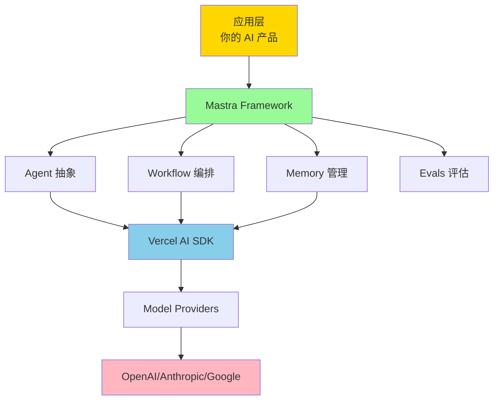

---

## 功能特性对比

### 完整功能对比表

| 功能模块           | Vercel AI SDK  | Mastra.ai        | 说明                               |
| ------------------ | -------------- | ---------------- | ---------------------------------- |
| **模型调用**       | ✅ 核心功能    | ✅ 通过 AI SDK   | Mastra 直接使用 AI SDK             |
| **流式传输**       | ✅ SSE 标准    | ✅ 继承 AI SDK   | 完全兼容                           |
| **Tool Calling**   | ✅ 标准化      | ✅ 增强管理      | Mastra 添加 Tool Registry          |
| **React Hooks**    | ✅ useChat 等  | ✅ 完全兼容      | 通过 @mastra/ai-sdk                |
| **生成式 UI**      | ✅ streamUI    | ✅ 支持          | RSC 支持                           |
| **Agent 系统**     | ❌             | ✅ 核心功能      | 自主决策、循环执行                 |
| **Multi-Agent**    | ❌             | ✅ Networks      | Agent 协作                         |
| **Workflows**      | ❌             | ✅ 核心功能      | 结构化编排                         |
| **Memory**         | ❌             | ✅ 三种类型      | 对话历史、Working Memory、语义召回 |
| **RAG**            | ❌             | ✅ 完整 Pipeline | 分块、向量化、检索                 |
| **Evals**          | ❌             | ✅ Scorers       | 质量评估、持续优化                 |
| **Observability**  | ❌             | ✅ 内置 Tracing  | OpenTelemetry                      |
| **Dev Playground** | ❌             | ✅ Local Studio  | 交互式调试                         |
| **部署支持**       | ✅ Vercel 优化 | ✅ 多平台        | Vercel/Cloudflare/自托管           |

### 核心差异可视化

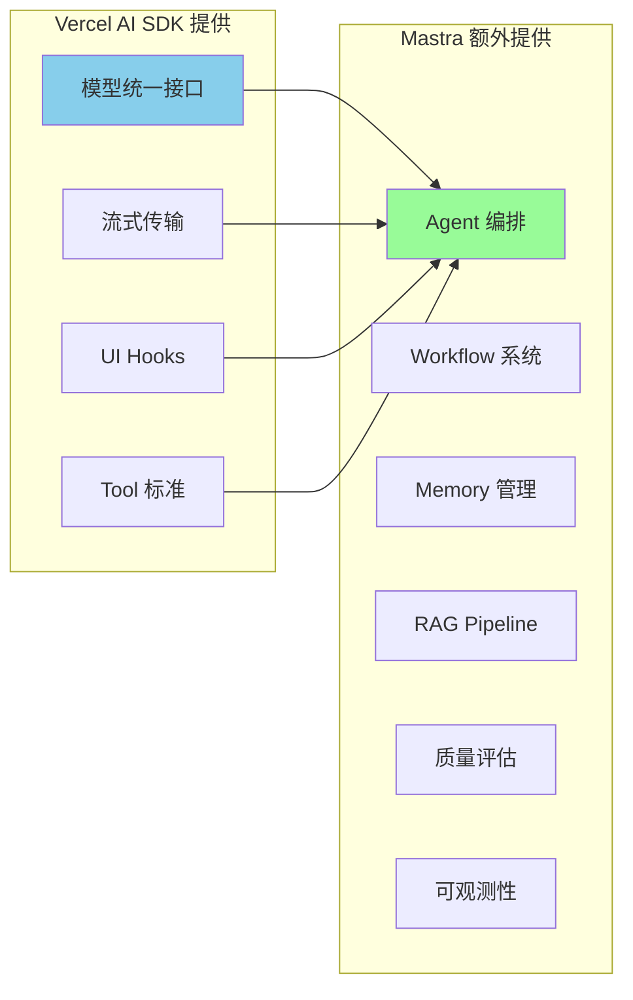

---

## 实现流程对比

### 场景 1: 简单聊天机器人

#### Vercel AI SDK 实现

```typescript
// 1. 安装依赖
// npm install ai @ai-sdk/openai

// 2. Server-side API Route
// app/api/chat/route.ts
import { openai } from '@ai-sdk/openai';
import { streamText } from 'ai';

export async function POST(req: Request) {
  const { messages } = await req.json();

  const result = streamText({
    model: openai('gpt-4o'),
    messages,
  });

  return result.toDataStreamResponse();
}

// 3. Client-side Component
// app/chat/page.tsx
('use client');

import { useChat } from 'ai/react';

export default function Chat() {
  const { messages, input, handleInputChange, handleSubmit } = useChat();

  return (
    <div>
      {messages.map((m) => (
        <div key={m.id}>
          <strong>{m.role}:</strong> {m.content}
        </div>
      ))}

      <form onSubmit={handleSubmit}>
        <input value={input} onChange={handleInputChange} />
        <button type="submit">Send</button>
      </form>
    </div>
  );
}
```

**流程图**：

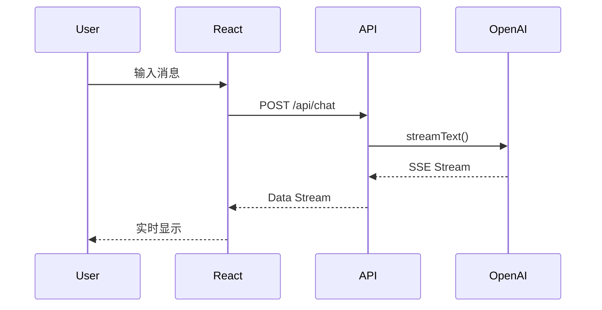

#### Mastra.ai 实现

```typescript
// 1. 安装依赖
// npm install @mastra/core @mastra/ai-sdk @ai-sdk/openai

// 2. 定义 Agent
// src/mastra/agents/chat-agent.ts
import { Agent } from '@mastra/core/agent';
import { openai } from '@ai-sdk/openai';

export const chatAgent = new Agent({
  name: 'chat-assistant',
  instructions: 'You are a helpful assistant.',
  model: openai('gpt-4o'),
});

// 3. 注册到 Mastra 实例
// src/mastra/index.ts
import { Mastra } from '@mastra/core/mastra';
import { chatAgent } from './agents/chat-agent';

export const mastra = new Mastra({
  agents: { chatAgent },
});

// 4. 创建 API Route
// app/api/chat/route.ts
import { mastra } from '@/mastra';
import { chatRoute } from '@mastra/ai-sdk';

export const POST = chatRoute({
  mastra,
  agentId: 'chatAgent',
});

// 5. Client-side (与 AI SDK 完全相同)
// app/chat/page.tsx
('use client');

import { useChat } from 'ai/react';

export default function Chat() {
  const { messages, input, handleInputChange, handleSubmit } = useChat({
    api: '/api/chat',
  });

  // 同上...
}
```

**对比总结**：

| 方面         | Vercel AI SDK  | Mastra.ai                |
| ------------ | -------------- | ------------------------ |
| **代码量**   | 更少           | 稍多（但更结构化）       |
| **灵活性**   | 高（直接控制） | 高（通过 Agent 配置）    |
| **可维护性** | 中             | 高（分离关注点）         |
| **适用场景** | 简单聊天       | 简单聊天（为扩展做准备） |

### 场景 2: 带工具调用的 Agent

#### Vercel AI SDK 实现

```typescript
// 定义工具
import { tool } from 'ai';
import { z } from 'zod';

const weatherTool = tool({
  description: 'Get weather for a city',
  parameters: z.object({
    city: z.string().describe('City name'),
  }),
  execute: async ({ city }) => {
    const data = await fetchWeather(city);
    return data;
  },
});

// API Route
export async function POST(req: Request) {
  const { messages } = await req.json();

  const result = streamText({
    model: openai('gpt-4o'),
    messages,
    tools: {
      getWeather: weatherTool,
    },
    maxSteps: 5, // 自动循环执行工具
  });

  return result.toDataStreamResponse();
}
```

#### Mastra.ai 实现

```typescript
// 1. 定义 Tool
// src/mastra/tools/weather-tool.ts
import { createTool } from '@mastra/core/tools';
import { z } from 'zod';

export const weatherTool = createTool({
  id: 'get-weather',
  description: 'Get weather for a city',
  inputSchema: z.object({
    city: z.string().describe('City name'),
  }),
  outputSchema: z.object({
    temperature: z.number(),
    condition: z.string(),
  }),
  execute: async ({ context }) => {
    const data = await fetchWeather(context.city);
    return data;
  },
});

// 2. 创建 Agent with Tool
// src/mastra/agents/weather-agent.ts
import { Agent } from '@mastra/core/agent';
import { weatherTool } from '../tools/weather-tool';

export const weatherAgent = new Agent({
  name: 'weather-assistant',
  instructions: `
You are a weather assistant.
Use the getWeather tool to fetch real-time weather data.
  `,
  model: openai('gpt-4o'),
  tools: {
    getWeather: weatherTool,
  },
});

// 3. 使用（API Route 同上）
```

**Mastra 额外优势**：

```typescript
// Tool Registry - 跨 Agent 共享工具
const mastra = new Mastra({
  tools: {
    weather: weatherTool,
    calendar: calendarTool,
  },
  agents: {
    weatherAgent: new Agent({
      tools: { weather: weatherTool },
    }),
    assistantAgent: new Agent({
      tools: { weather: weatherTool, calendar: calendarTool },
    }),
  },
});

// Tool 调用追踪（Mastra Playground）
// 查看每个工具的输入、输出、执行时间
```

### 场景 3: 复杂 Agent 系统（Mastra 独有）

```typescript
// 1. 定义多个专业 Agent
const researchAgent = new Agent({
  name: 'researcher',
  instructions: 'Research information on the web',
  model: openai('gpt-4o'),
  tools: { webSearch },
});

const writerAgent = new Agent({
  name: 'writer',
  instructions: 'Write engaging content',
  model: openai('gpt-4o'),
});

const editorAgent = new Agent({
  name: 'editor',
  instructions: 'Edit and improve content',
  model: openai('gpt-4o'),
});

// 2. 创建 Workflow 编排
import { createWorkflow, createStep } from '@mastra/core/workflows';

const contentCreationWorkflow = createWorkflow({
  id: 'content-creation',
  inputSchema: z.object({
    topic: z.string(),
  }),
  outputSchema: z.object({
    article: z.string(),
  }),
})
  // Step 1: 研究
  .then(
    createStep({
      id: 'research',
      execute: async ({ inputData, mastra }) => {
        const agent = mastra.getAgent('researcher');
        const response = await agent.generate(`Research about: ${inputData.topic}`);
        return { research: response.text };
      },
    }),
  )
  // Step 2: 写作
  .then(
    createStep({
      id: 'write',
      execute: async ({ inputData, mastra }) => {
        const agent = mastra.getAgent('writer');
        const response = await agent.generate(`Write an article based on: ${inputData.research}`);
        return { draft: response.text };
      },
    }),
  )
  // Step 3: 编辑
  .then(
    createStep({
      id: 'edit',
      execute: async ({ inputData, mastra }) => {
        const agent = mastra.getAgent('editor');
        const response = await agent.generate(`Edit this draft: ${inputData.draft}`);
        return { article: response.text };
      },
    }),
  )
  .commit();

// 3. 使用 Memory 跨步骤共享上下文
const writerWithMemory = new Agent({
  name: 'writer',
  model: openai('gpt-4o'),
  memory: new Memory({
    options: {
      lastMessages: 50,
      semanticRecall: {
        topK: 5,
        scope: 'resource',
      },
      workingMemory: {
        enabled: true,
        scope: 'resource',
        template: `
# Writer Profile
- Writing Style:
- Tone Preference:
- Target Audience:
        `,
      },
    },
  }),
});

// 4. 添加 Scorers 评估质量
import { createAnswerRelevancyScorer, createCompletenessScorer } from '@mastra/evals/scorers/llm';

const evaluatedAgent = new Agent({
  model: openai('gpt-4o'),
  scorers: {
    relevancy: {
      scorer: createAnswerRelevancyScorer({ model: openai('gpt-4o-mini') }),
      sampling: { type: 'ratio', rate: 0.5 },
    },
    completeness: {
      scorer: createCompletenessScorer({ model: openai('gpt-4o-mini') }),
      sampling: { type: 'ratio', rate: 1.0 },
    },
  },
});
```

**Vercel AI SDK 无法实现的功能**：

- ❌ 结构化的 Workflow 编排
- ❌ 跨 Agent 的 Memory 管理
- ❌ 自动化质量评估（Scorers）
- ❌ RAG Pipeline 集成
- ❌ 内置 Observability

---

## 使用场景决策

### 决策流程图

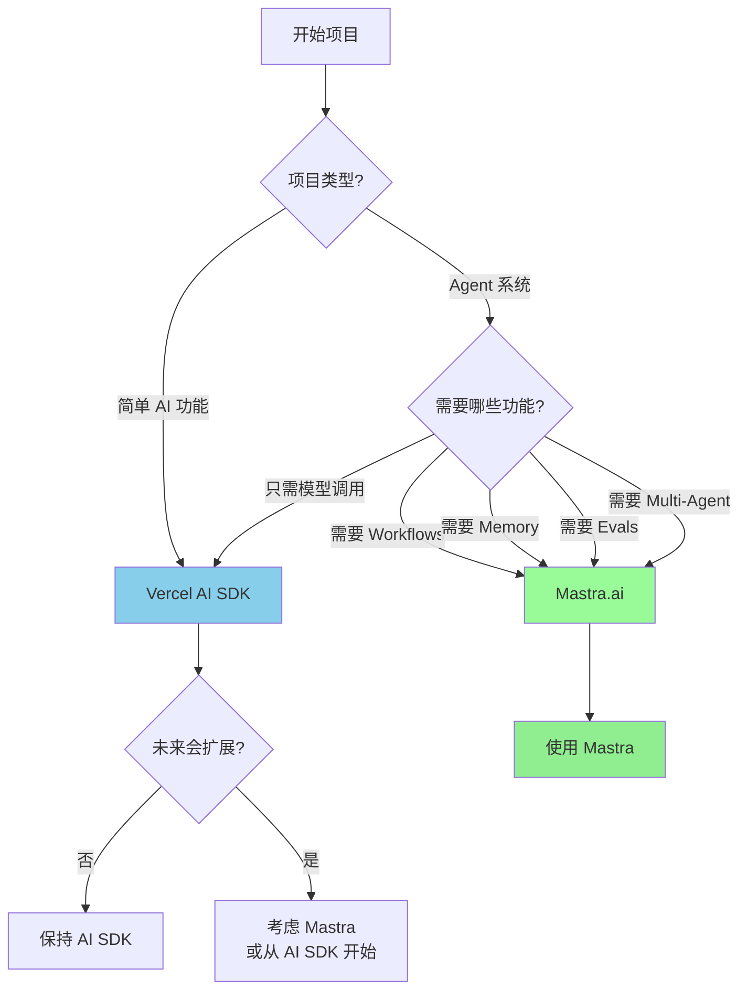

### 场景对比表

| 场景               | 推荐方案      | 原因                      |
| ------------------ | ------------- | ------------------------- |
| **简单聊天机器人** | Vercel AI SDK | 代码更简洁，快速上线      |
| **文本生成 API**   | Vercel AI SDK | 无需额外抽象              |
| **React 应用集成** | Vercel AI SDK | 原生 React Hooks          |
| **生成式 UI**      | Vercel AI SDK | streamUI 是核心功能       |
| **客服 Agent**     | Mastra.ai     | 需要 Memory + Evals       |
| **个人助理**       | Mastra.ai     | 需要 Memory + Multi-Agent |
| **内容生成管道**   | Mastra.ai     | Workflows + Agents        |
| **RAG 系统**       | Mastra.ai     | 内置 RAG Pipeline         |
| **多 Agent 协作**  | Mastra.ai     | Multi-Agent Networks      |
| **需要质量评估**   | Mastra.ai     | Scorers/Evals             |
| **复杂业务逻辑**   | Mastra.ai     | Workflows + Memory        |

### 项目演进路径

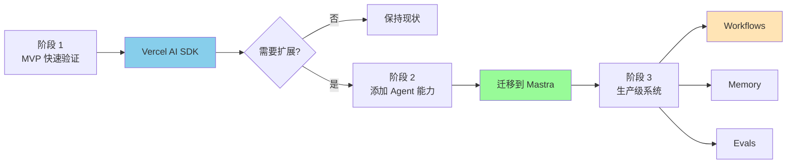

**迁移成本**：从 AI SDK → Mastra 迁移成本**很低**，因为 Mastra 直接使用 AI SDK。

---

## 集成关系

### Mastra 如何使用 AI SDK

```typescript
// Mastra Agent 底层使用 AI SDK
import { Agent } from '@mastra/core/agent';
import { openai } from '@ai-sdk/openai'; // 直接使用 AI SDK

const agent = new Agent({
  name: 'assistant',
  model: openai('gpt-4o'), // AI SDK 的 model 实例
});

// Mastra 内部实现（简化版）
class Agent {
  async generate(prompt: string) {
    // 使用 AI SDK 的 generateText
    const result = await generateText({
      model: this.model, // AI SDK model
      messages: this.buildMessages(prompt),
    });

    // Mastra 添加额外逻辑
    await this.saveToMemory(result);
    await this.runScorers(result);
    await this.logTrace(result);

    return result;
  }
}
```

### 架构关系图

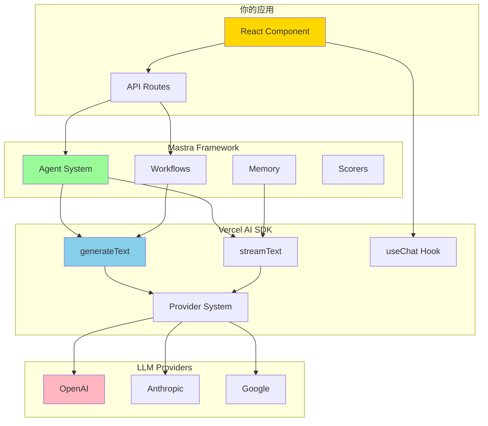

### 共同使用示例

```typescript
// 场景：使用 Mastra Agent + AI SDK UI Hooks

// 1. Server: Mastra Agent with AI SDK Route
// app/api/agent/route.ts
import { mastra } from '@/mastra';
import { chatRoute } from '@mastra/ai-sdk';

export const POST = chatRoute({
  mastra,
  agentId: 'assistantAgent',
});

// 2. Client: AI SDK React Hook
// app/page.tsx
('use client');

import { useChat } from 'ai/react'; // AI SDK Hook

export default function Chat() {
  const { messages, input, handleInputChange, handleSubmit } = useChat({
    api: '/api/agent', // Mastra Agent endpoint
  });

  return (
    <div>
      {messages.map((m) => (
        <div key={m.id}>
          {m.role}: {m.content}
        </div>
      ))}
      <form onSubmit={handleSubmit}>
        <input value={input} onChange={handleInputChange} />
        <button>Send</button>
      </form>
    </div>
  );
}
```

### 兼容性

| AI SDK 功能        | Mastra 兼容性 | 说明                |
| ------------------ | ------------- | ------------------- |
| **generateText**   | ✅ 完全兼容   | Mastra 内部使用     |
| **streamText**     | ✅ 完全兼容   | Mastra 内部使用     |
| **generateObject** | ✅ 完全兼容   | Mastra 支持         |
| **streamObject**   | ✅ 完全兼容   | Mastra 支持         |
| **useChat**        | ✅ 完全兼容   | 通过 @mastra/ai-sdk |
| **useCompletion**  | ✅ 完全兼容   | 通过 @mastra/ai-sdk |
| **streamUI**       | ✅ 完全兼容   | RSC 支持            |
| **所有 Providers** | ✅ 完全兼容   | 40+ providers       |

---

## 最佳实践

### 1. 选择策略

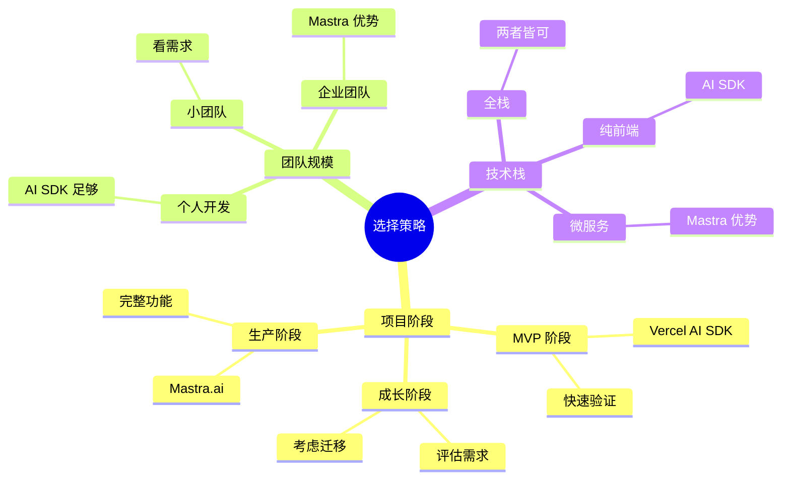

### 2. 渐进式采用

```typescript
// 阶段 1: 从 Vercel AI SDK 开始
// app/api/chat/route.ts
import { streamText } from 'ai';
import { openai } from '@ai-sdk/openai';

export async function POST(req: Request) {
  const result = streamText({
    model: openai('gpt-4o'),
    messages: await req.json(),
  });
  return result.toDataStreamResponse();
}

// 阶段 2: 添加 Mastra（保持 AI SDK 代码不变）
// src/mastra/agents/chat-agent.ts
import { Agent } from '@mastra/core/agent';
import { openai } from '@ai-sdk/openai'; // 同样的导入

export const chatAgent = new Agent({
  name: 'chat',
  model: openai('gpt-4o'), // 同样的 model

  // 添加 Mastra 功能
  memory: new Memory({
    options: { lastMessages: 20 },
  }),
});

// 阶段 3: 逐步迁移到 Mastra Route
// app/api/chat/route.ts
import { mastra } from '@/mastra';
import { chatRoute } from '@mastra/ai-sdk';

export const POST = chatRoute({
  mastra,
  agentId: 'chatAgent',
});
// 前端代码无需修改！
```

### 3. 混合使用场景

```typescript
// 场景：部分功能用 AI SDK，部分用 Mastra

// 简单文本生成 - 直接用 AI SDK
// app/api/simple/route.ts
import { generateText } from 'ai';
import { openai } from '@ai-sdk/openai';

export async function POST(req: Request) {
  const { prompt } = await req.json();

  const result = await generateText({
    model: openai('gpt-4o-mini'),
    prompt,
  });

  return Response.json({ text: result.text });
}

// 复杂 Agent 系统 - 用 Mastra
// app/api/agent/route.ts
import { mastra } from '@/mastra';
import { chatRoute } from '@mastra/ai-sdk';

export const POST = chatRoute({
  mastra,
  agentId: 'complexAgent', // 带 Memory + Tools + Evals
});
```

### 4. 性能优化

```typescript
// Vercel AI SDK 优化
const result = await generateText({
  model: openai('gpt-4o-mini'), // 使用更快的模型
  maxTokens: 500, // 限制输出长度
  temperature: 0.7,
});

// Mastra 优化
const agent = new Agent({
  model: openai('gpt-4o-mini'),

  memory: new Memory({
    options: {
      lastMessages: 10, // 减少上下文
      semanticRecall: false, // 禁用向量搜索
    },
  }),

  scorers: {
    quality: {
      scorer: qualityScorer,
      sampling: { type: 'ratio', rate: 0.1 }, // 降低采样率
    },
  },
});
```

### 5. 成本考虑

```typescript
// 成本分析

// Vercel AI SDK 成本
const aiSdkCost = {
  // 只有 LLM API 调用成本
  llmCalls: 0.001, // 每次调用
  tokens: 0.00001, // 每个 token
  total: 0.001,
};

// Mastra.ai 成本
const mastraCost = {
  // LLM API 调用（同上）
  llmCalls: 0.001,
  tokens: 0.00001,

  // 额外成本
  embeddings: 0.0001, // Semantic Recall
  storage: 0.0001, // Memory 存储
  scorerLLM: 0.0005, // Evals 评估（如果使用 LLM）

  total: 0.0017, // 增加约 70%（但功能更强大）
};

// 成本优化策略
const optimizedMastra = new Agent({
  memory: new Memory({
    options: {
      lastMessages: 20,
      semanticRecall: {
        topK: 3, // 减少检索数量
      },
    },
  }),

  scorers: {
    quality: {
      scorer: createQualityScorer({
        model: openai('gpt-4o-mini'), // 使用便宜模型评估
      }),
      sampling: { type: 'ratio', rate: 0.1 }, // 只评估 10%
    },
  },
});
```

---

## 总结

### 核心差异总结

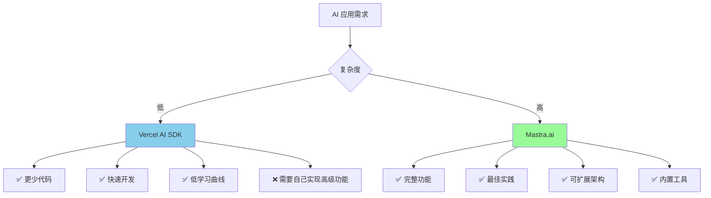

### 关键要点

**Vercel AI SDK**：

- 🎯 **定位**：LLM 通信基础设施
- ✅ **优势**：轻量、快速、灵活
- 📦 **适合**：简单 AI 功能、MVP、学习
- 🚀 **快速上手**：几行代码即可工作

**Mastra.ai**：

- 🎯 **定位**：完整的 Agent 框架
- ✅ **优势**：功能完整、工程化、可观测
- 📦 **适合**：Agent 系统、生产环境、复杂业务
- 🏗️ **架构优势**：Workflows + Memory + Evals

**关系**：

- Mastra **使用** Vercel AI SDK（非竞争）
- 可以**共存**和**渐进式采用**
- **迁移成本低**（完全兼容）

### 推荐路径

```typescript
// 路径 1: 简单项目
// 使用 Vercel AI SDK，保持简单

// 路径 2: 不确定
// 从 AI SDK 开始，需要时迁移到 Mastra

// 路径 3: 复杂系统
// 直接使用 Mastra，获得完整功能

// 路径 4: 混合使用
// 简单功能用 AI SDK，复杂功能用 Mastra
```

---

## 参考资源

- **Vercel AI SDK**: https://ai-sdk.dev
- **Mastra.ai**: https://mastra.ai
- **Mastra + AI SDK 集成**: https://mastra.ai/blog/using-ai-sdk-with-mastra
- **AI SDK GitHub**: https://github.com/vercel/ai
- **Mastra GitHub**: https://github.com/mastra-ai/mastra
