# Mastra.ai Workflows 完整教程

## 目录

1. [Mastra.ai 概述](#mastraai-概述)
2. [Workflows 核心概念](#workflows-核心概念)
3. [架构设计](#架构设计)
4. [底层实现原理](#底层实现原理)
5. [创建 Workflow 实战](#创建-workflow-实战)
6. [高级特性](#高级特性)
7. [Workflows vs A2A 协议](#workflows-vs-a2a-协议)
8. [最佳实践](#最佳实践)

---

## Mastra.ai 概述

### 什么是 Mastra？

Mastra 是一个用于构建 AI 驱动应用和 Agent 的全栈 TypeScript 框架，提供从早期原型到生产就绪应用所需的一切。

**核心能力**：

- **Agents**：自主决策、工具调用、推理能力
- **Workflows**：结构化的多步骤任务编排
- **RAG**：检索增强生成
- **Memory**：对话记忆管理
- **MCP**：模型上下文协议支持
- **Observability**：内置追踪和监控

### 技术栈

```typescript
// Mastra 核心依赖
- TypeScript (核心语言)
- Vercel AI SDK (模型路由)
- Zod (模式验证)
- Hono (Web 服务器)
- LibSQL (状态存储)
```

---

## Workflows 核心概念

### 什么是 Workflows？

Workflows 让你使用清晰的结构化步骤来定义复杂的任务序列，而不是依赖单个 Agent 的推理能力。它们让你完全控制任务如何分解、数据如何在步骤间流动以及何时执行什么。

### Workflows vs Agents

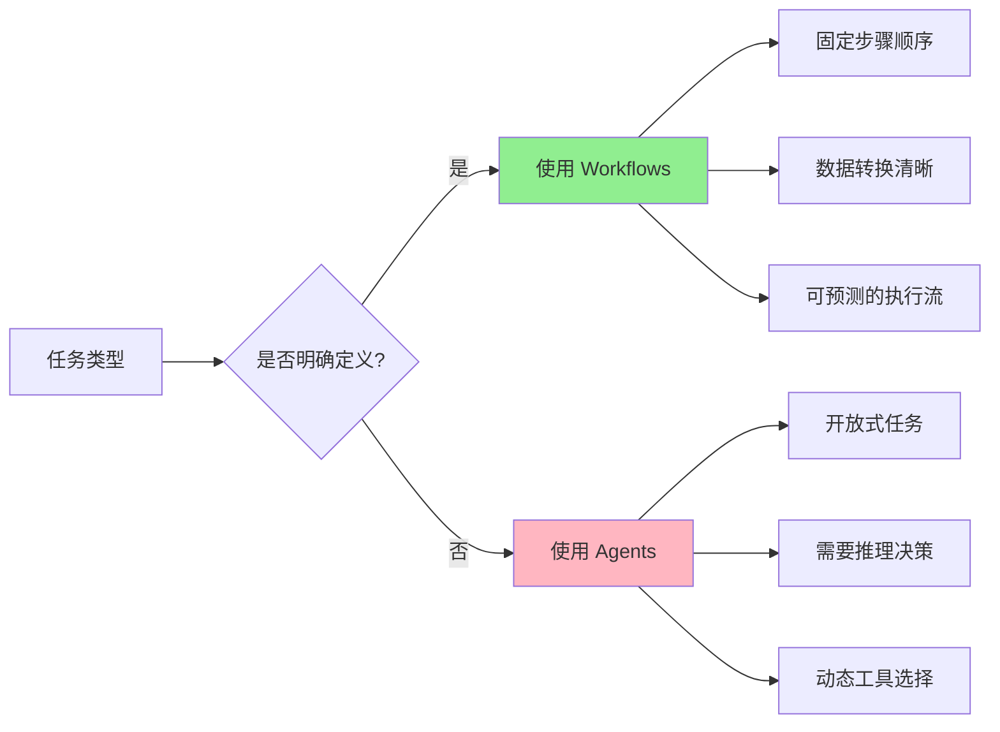

**使用场景对比**：

| 特性         | Workflows          | Agents             |
| ------------ | ------------------ | ------------------ |
| **任务类型** | 明确的多步骤流程   | 开放式问题         |
| **执行控制** | 完全可控           | LLM 驱动           |
| **数据流**   | 显式定义           | 隐式推理           |
| **适用场景** | 订单处理、审批流程 | 客服对话、创意生成 |
| **可预测性** | 高                 | 中                 |

---

## 架构设计

### 整体架构图

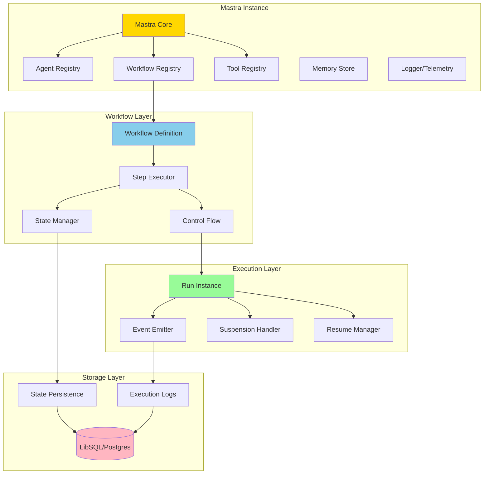

### Workflow 组成结构

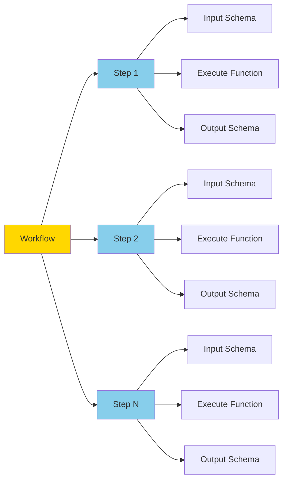

---

## 底层实现原理

### 核心类结构

```typescript
// 简化的核心类型定义
interface WorkflowDefinition<TInput, TOutput, TState> {
  id: string;
  inputSchema: ZodType<TInput>;
  outputSchema: ZodType<TOutput>;
  stateSchema?: ZodType<TState>;
  steps: Map<string, Step>;
  transitions: Map<string, Transition[]>;
}

interface Step<TInput, TOutput> {
  id: string;
  inputSchema: ZodType<TInput>;
  outputSchema: ZodType<TOutput>;
  execute: ExecuteFunction<TInput, TOutput>;
}

interface WorkflowRun<TInput, TOutput> {
  runId: string;
  status: 'pending' | 'running' | 'suspended' | 'completed' | 'failed';
  input: TInput;
  result?: TOutput;
  steps: Map<string, StepExecution>;
  state: Record<string, any>;
}
```

### 执行流程图

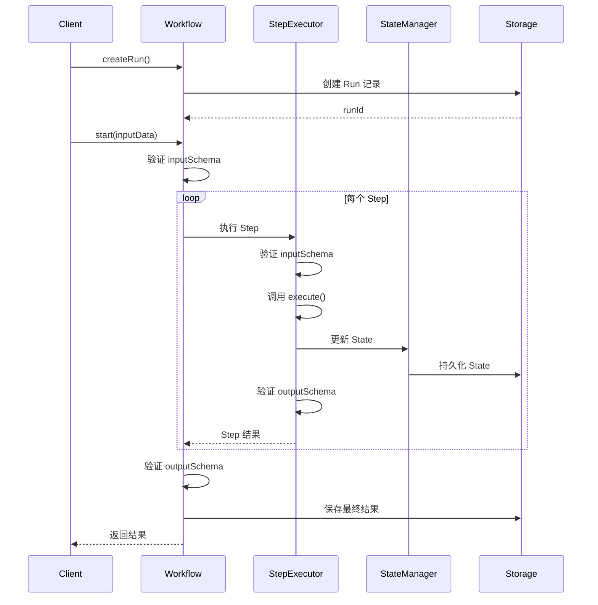

### 状态管理机制

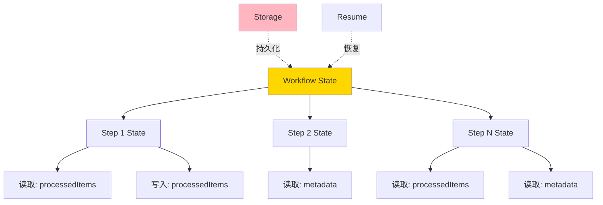

**State 工作原理**：

1. **全局定义**：在 Workflow 的 `stateSchema` 中定义所有状态字段
2. **局部声明**：每个 Step 在 `stateSchema` 中声明需要的字段
3. **读写分离**：通过 `state` 读取，通过 `setState` 写入
4. **持久化**：每次更新自动保存到存储层

---

## 创建 Workflow 实战

### 基础示例：文本处理流程

```typescript
import { createStep, createWorkflow } from '@mastra/core/workflows';
import { z } from 'zod';

// Step 1: 格式化输入
const formatStep = createStep({
  id: 'format-input',
  inputSchema: z.object({
    text: z.string(),
  }),
  outputSchema: z.object({
    formatted: z.string(),
  }),
  execute: async ({ inputData }) => {
    const { text } = inputData;
    return {
      formatted: text.trim().toUpperCase(),
    };
  },
});

// Step 2: 添加前缀
const prefixStep = createStep({
  id: 'add-prefix',
  inputSchema: z.object({
    formatted: z.string(),
  }),
  outputSchema: z.object({
    result: z.string(),
  }),
  execute: async ({ inputData }) => {
    const { formatted } = inputData;
    return {
      result: `[PROCESSED] ${formatted}`,
    };
  },
});

// 组合 Workflow
export const textProcessWorkflow = createWorkflow({
  id: 'text-process',
  inputSchema: z.object({
    text: z.string(),
  }),
  outputSchema: z.object({
    result: z.string(),
  }),
})
  .then(formatStep)
  .then(prefixStep)
  .commit();
```

### 控制流：分支与并行

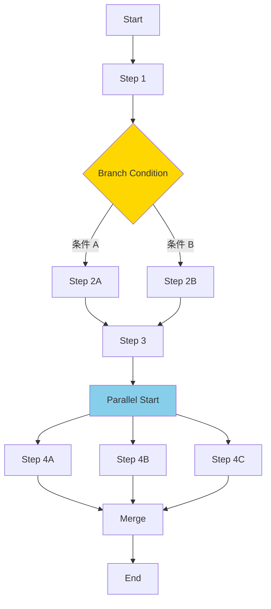

**分支示例**：

```typescript
export const orderWorkflow = createWorkflow({
  id: 'order-process',
  inputSchema: z.object({
    amount: z.number(),
    userId: z.string(),
  }),
  outputSchema: z.object({
    status: z.string(),
  }),
})
  .then(validateStep)
  .branch({
    // 大额订单需要审批
    high: {
      condition: ({ outputData }) => outputData.amount > 1000,
      workflow: createWorkflow({...})
        .then(approvalStep)
        .then(processStep)
        .commit(),
    },
    // 小额订单直接处理
    low: {
      condition: ({ outputData }) => outputData.amount <= 1000,
      workflow: createWorkflow({...})
        .then(processStep)
        .commit(),
    },
  })
  .commit();
```

**并行示例**：

```typescript
export const enrichWorkflow = createWorkflow({
  id: 'data-enrich',
  inputSchema: z.object({
    userId: z.string(),
  }),
  outputSchema: z.object({
    profile: z.object({...}),
    orders: z.array(z.object({...})),
    preferences: z.object({...}),
  }),
})
  .parallel({
    profile: createWorkflow({...})
      .then(fetchProfileStep)
      .commit(),
    orders: createWorkflow({...})
      .then(fetchOrdersStep)
      .commit(),
    preferences: createWorkflow({...})
      .then(fetchPreferencesStep)
      .commit(),
  })
  .commit();
```

### 集成 Agents 和 Tools

```typescript
import { testAgent } from '../agents/test-agent';
import { testTool } from '../tools/test-tool';

// 方式 1：在 Step 中调用 Agent
const agentStep = createStep({
  id: 'generate-summary',
  inputSchema: z.object({
    document: z.string(),
  }),
  outputSchema: z.object({
    summary: z.string(),
  }),
  execute: async ({ inputData, mastra }) => {
    const agent = mastra.getAgent('summaryAgent');

    const response = await agent.generate(`Summarize this document: ${inputData.document}`, {
      memory: {
        thread: 'user-123',
        resource: 'doc-456',
      },
    });

    return {
      summary: response.text,
    };
  },
});

// 方式 2：将 Agent 作为 Step 组合
export const summaryWorkflow = createWorkflow({
  id: 'document-summary',
  inputSchema: z.object({
    document: z.string(),
  }),
  outputSchema: z.object({
    summary: z.string(),
  }),
})
  .map(async ({ inputData }) => ({
    prompt: `Summarize this document: ${inputData.document}`,
  }))
  .then(createStep(testAgent))
  .commit();

// 方式 3：在 Step 中调用 Tool
const toolStep = createStep({
  id: 'fetch-data',
  inputSchema: z.object({
    query: z.string(),
  }),
  outputSchema: z.object({
    data: z.any(),
  }),
  execute: async ({ inputData, runtimeContext }) => {
    const response = await testTool.execute({
      context: {
        query: inputData.query,
      },
      runtimeContext,
    });

    return {
      data: response,
    };
  },
});
```

---

## 高级特性

### 1. Human-in-the-Loop (暂停与恢复)

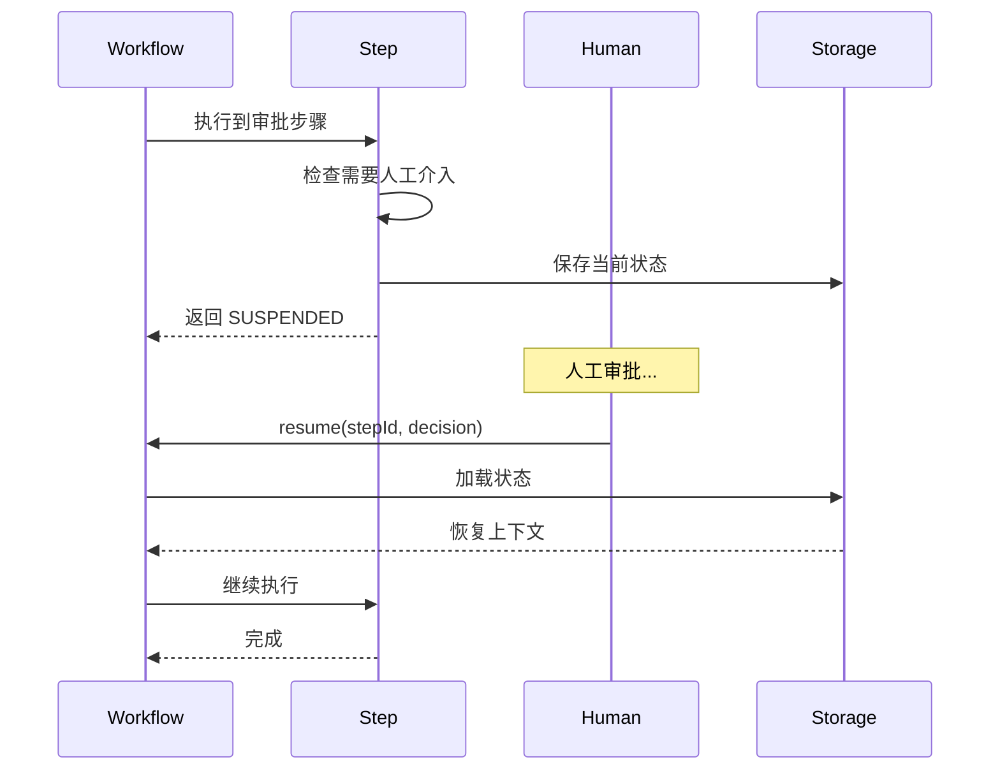

```typescript
// 定义需要暂停的 Step
const approvalStep = createStep({
  id: 'approval',
  inputSchema: z.object({
    orderId: z.string(),
    amount: z.number(),
  }),
  outputSchema: z.object({
    approved: z.boolean(),
  }),
  execute: async ({ inputData, suspend }) => {
    // 发送审批通知
    await sendApprovalRequest(inputData.orderId);

    // 暂停工作流，等待审批
    const decision = await suspend<{ approved: boolean }>();

    return {
      approved: decision.approved,
    };
  },
});

// 执行与恢复
const run = await workflow.createRun();

// 启动工作流
await run.start({
  inputData: { orderId: '123', amount: 5000 },
});

// 稍后恢复 (例如从 webhook 触发)
await run.resume({
  step: 'approval',
  resumeData: { approved: true },
});
```

### 2. 流式输出

```typescript
// 启动流式执行
const run = await workflow.createRun();
const stream = await run.stream({
  inputData: { text: 'Hello World' },
});

// 实时接收事件
for await (const event of stream) {
  console.log(JSON.stringify(event, null, 2));

  // 事件类型
  switch (event.type) {
    case 'step-start':
      console.log(`开始执行: ${event.stepId}`);
      break;
    case 'step-complete':
      console.log(`完成: ${event.stepId}`, event.output);
      break;
    case 'workflow-complete':
      console.log('工作流完成', event.result);
      break;
  }
}
```

### 3. 使用 Workflow State

```typescript
const step1 = createStep({
  id: 'process-items',
  inputSchema: z.object({
    items: z.array(z.string()),
  }),
  outputSchema: z.object({
    count: z.number(),
  }),
  stateSchema: z.object({
    processedItems: z.array(z.string()),
  }),
  execute: async ({ inputData, state, setState }) => {
    const { items } = inputData;
    const { processedItems = [] } = state;

    // 更新全局状态
    setState({
      processedItems: [...processedItems, ...items],
    });

    return {
      count: items.length,
    };
  },
});

const step2 = createStep({
  id: 'generate-report',
  inputSchema: z.object({
    count: z.number(),
  }),
  outputSchema: z.object({
    report: z.string(),
  }),
  stateSchema: z.object({
    processedItems: z.array(z.string()),
  }),
  execute: async ({ state }) => {
    const { processedItems } = state;

    return {
      report: `处理了 ${processedItems.length} 个项目`,
    };
  },
});

export const statefulWorkflow = createWorkflow({
  id: 'stateful',
  inputSchema: z.object({
    items: z.array(z.string()),
  }),
  outputSchema: z.object({
    report: z.string(),
  }),
  stateSchema: z.object({
    processedItems: z.array(z.string()),
  }),
})
  .then(step1)
  .then(step2)
  .commit();

// 运行时提供初始状态
const run = await workflow.createRun();
await run.start({
  inputData: { items: ['a', 'b', 'c'] },
  initialState: {
    processedItems: [],
  },
});
```

### 4. Workflow 作为 Step

```typescript
// 子工作流
const emailWorkflow = createWorkflow({
  id: 'send-email',
  inputSchema: z.object({
    to: z.string(),
    subject: z.string(),
  }),
  outputSchema: z.object({
    sent: z.boolean(),
  }),
})
  .then(validateEmailStep)
  .then(sendEmailStep)
  .commit();

// 父工作流
export const onboardingWorkflow = createWorkflow({
  id: 'user-onboarding',
  inputSchema: z.object({
    userId: z.string(),
    email: z.string(),
  }),
  outputSchema: z.object({
    success: z.boolean(),
  }),
})
  .then(createAccountStep)
  .then(emailWorkflow) // 作为 Step 使用
  .then(setupProfileStep)
  .commit();
```

---

## Workflows vs A2A 协议

### 概念对比

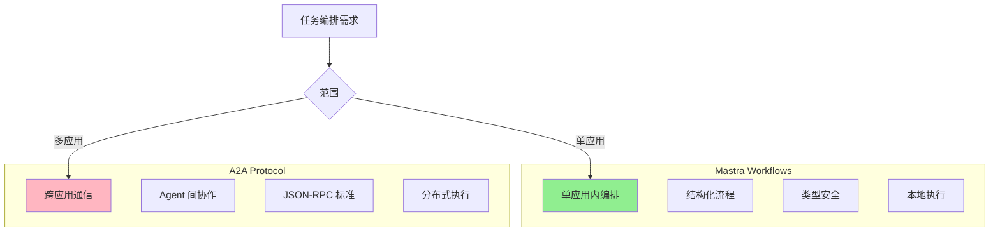

### 核心区别表

| 维度         | Mastra Workflows                | A2A Protocol     |
| ------------ | ------------------------------- | ---------------- |
| **定位**     | 应用内任务编排框架              | Agent 间通信协议 |
| **作用域**   | 单个 Mastra 实例内              | 跨系统、跨框架   |
| **通信方式** | 内存函数调用                    | HTTP/JSON-RPC    |
| **类型安全** | 完全类型安全 (TypeScript + Zod) | 协议级别定义     |
| **状态管理** | 内置状态持久化                  | 需自行实现       |
| **执行模式** | 同步/流式                       | 异步消息         |
| **适用场景** | 固定业务流程                    | Agent 协作网络   |

### A2A 协议详解

A2A (Agent-to-Agent) 是 Google 提出的协议，使用 JSON-RPC 和 SSE 标准解决 Agent 间的通信问题。通过 A2A，Agent 可以：发现彼此的能力、安全地协作完成长期任务、在不暴露内部状态、记忆或工具的情况下运行。

**A2A 架构图**：

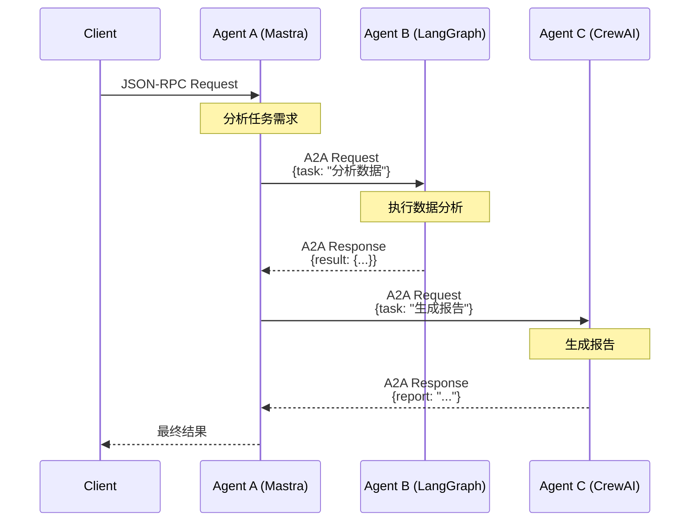

**A2A 消息格式**：

```typescript
// A2A 请求
interface A2ARequest {
  jsonrpc: '2.0';
  id: string;
  method: 'generate' | 'stream';
  params: {
    message: {
      role: 'user' | 'assistant';
      parts: Array<{
        kind: 'text' | 'data';
        text?: string;
        data?: unknown;
      }>;
    };
  };
}

// A2A 响应
interface A2AResponse {
  jsonrpc: '2.0';
  id: string;
  result: {
    message: {
      role: 'assistant';
      parts: Array<{
        kind: 'text';
        text: string;
      }>;
    };
  };
}
```

### Mastra 中实现 A2A

```typescript
import { registerApiRoute } from '@mastra/core/server';

// 实现 A2A 端点
export const a2aAgentRoute = registerApiRoute('/a2a/agent/:agentId', {
  method: 'POST',
  handler: async (c) => {
    const mastra = c.get('mastra');
    const agentId = c.req.param('agentId');

    // 解析 JSON-RPC 请求
    const body = await c.req.json();
    const { jsonrpc, id, method, params } = body;

    // 验证格式
    if (jsonrpc !== '2.0' || !id) {
      return c.json(
        {
          jsonrpc: '2.0',
          id: id || null,
          error: {
            code: -32600,
            message: 'Invalid Request',
          },
        },
        400,
      );
    }

    // 获取 Agent
    const agent = mastra.getAgent(agentId);
    if (!agent) {
      return c.json(
        {
          jsonrpc: '2.0',
          id,
          error: {
            code: -32601,
            message: 'Agent not found',
          },
        },
        404,
      );
    }

    // 执行 Agent
    const message = params.message;
    const prompt = message.parts
      .filter((p) => p.kind === 'text')
      .map((p) => p.text)
      .join('\n');

    const response = await agent.generate(prompt);

    // 返回 A2A 格式响应
    return c.json({
      jsonrpc: '2.0',
      id,
      result: {
        message: {
          role: 'assistant',
          parts: [
            {
              kind: 'text',
              text: response.text,
            },
          ],
        },
      },
    });
  },
});
```

### 何时使用 Workflows vs A2A

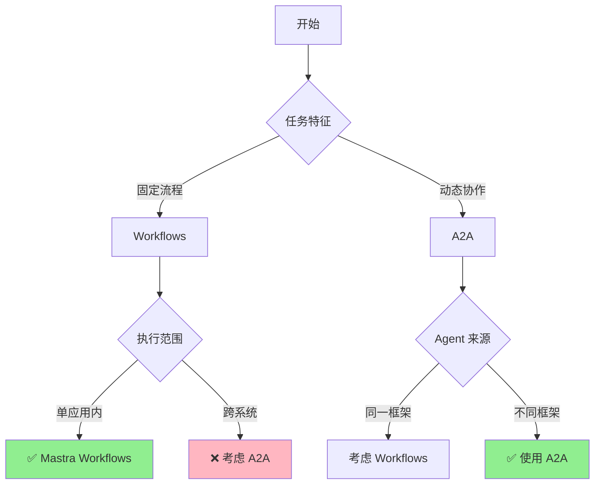

**决策因素**：

| 场景                   | 推荐方案  | 原因               |
| ---------------------- | --------- | ------------------ |
| 订单处理流程           | Workflows | 固定步骤，单应用内 |
| 文档审批流程           | Workflows | 需要暂停/恢复      |
| 多 Agent 协作 (同框架) | Workflows | 类型安全，性能更好 |
| 跨框架 Agent 通信      | A2A       | 标准协议，互操作性 |
| 微服务架构             | A2A       | 分布式，独立部署   |

### 协议栈关系

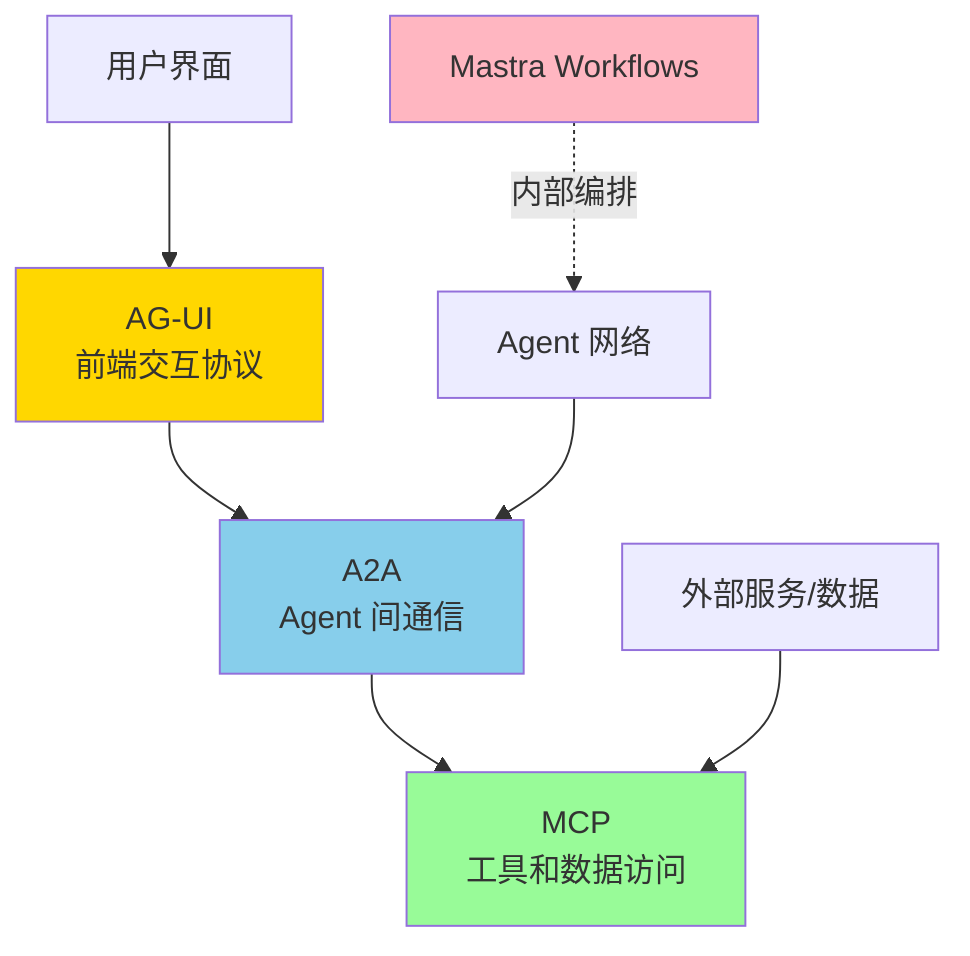

AG-UI (Agent-User Interaction) 聚焦解决 AI Agent 与前端应用之间的通信问题。MCP (Model Context Protocol) 专注于连接 AI Agent 与外部数据源和工具。A2A 使不同 Agent 之间能够通信和协作。

---

## 最佳实践

### 1. Schema 设计原则

```typescript
// ✅ 好的 Schema 设计
const goodSchema = z.object({
  // 精确的类型
  userId: z.string().uuid(),
  email: z.string().email(),
  age: z.number().min(0).max(150),

  // 明确的可选字段
  nickname: z.string().optional(),

  // 有默认值
  role: z.enum(['user', 'admin']).default('user'),

  // 文档化
  metadata: z.object({
    createdAt: z.string().describe('ISO 8601 格式的创建时间'),
  }),
});

// ❌ 避免的设计
const badSchema = z.object({
  data: z.any(), // 太宽泛
  info: z.string(), // 名称不明确
});
```

### 2. 错误处理

```typescript
const robustStep = createStep({
  id: 'fetch-data',
  inputSchema: z.object({
    url: z.string(),
  }),
  outputSchema: z.object({
    data: z.any(),
    error: z.string().optional(),
  }),
  execute: async ({ inputData }) => {
    try {
      const response = await fetch(inputData.url);
      const data = await response.json();
      return { data };
    } catch (error) {
      // 优雅降级
      return {
        data: null,
        error: error.message,
      };
    }
  },
});
```

### 3. 性能优化

```typescript
// 使用并行执行
export const optimizedWorkflow = createWorkflow({
  id: 'data-aggregation',
  inputSchema: z.object({
    userId: z.string(),
  }),
  outputSchema: z.object({
    profile: z.object({...}),
    orders: z.array(z.any()),
    recommendations: z.array(z.any()),
  }),
})
  .parallel({
    // 并行获取数据
    profile: createWorkflow({...}).then(fetchProfile).commit(),
    orders: createWorkflow({...}).then(fetchOrders).commit(),
    recommendations: createWorkflow({...}).then(fetchRecs).commit(),
  })
  .commit();
```

### 4. 可观测性

```typescript
const step = createStep({
  id: 'critical-step',
  inputSchema: z.object({...}),
  outputSchema: z.object({...}),
  execute: async ({ inputData, logger }) => {
    // 记录关键信息
    logger.info('开始处理', { userId: inputData.userId });

    const startTime = Date.now();

    try {
      const result = await processData(inputData);

      // 记录成功指标
      logger.info('处理完成', {
        duration: Date.now() - startTime,
        recordsProcessed: result.count,
      });

      return result;
    } catch (error) {
      // 记录错误
      logger.error('处理失败', {
        error: error.message,
        duration: Date.now() - startTime,
      });
      throw error;
    }
  },
});
```

### 5. 测试策略

```typescript
import { describe, it, expect } from 'vitest';

describe('Text Process Workflow', () => {
  it('should format and prefix text correctly', async () => {
    const run = await textProcessWorkflow.createRun();

    const result = await run.start({
      inputData: { text: '  hello world  ' },
    });

    expect(result.status).toBe('success');
    expect(result.result.result).toBe('[PROCESSED] HELLO WORLD');
  });

  it('should handle errors gracefully', async () => {
    const run = await textProcessWorkflow.createRun();

    await expect(run.start({ inputData: { text: null } })).rejects.toThrow('Validation error');
  });
});
```

---

## 总结

### Mastra Workflows 核心优势

✅ **类型安全**：TypeScript + Zod 全链路类型保障  
✅ **结构清晰**：显式的步骤定义和数据流  
✅ **易于调试**：完整的执行日志和状态追踪  
✅ **灵活组合**：支持线性、分支、并行等控制流  
✅ **生产就绪**：内置暂停/恢复、流式输出、可观测性

### 与其他方案对比

| 方案                 | 适用场景       | 优势           | 劣势       |
| -------------------- | -------------- | -------------- | ---------- |
| **Mastra Workflows** | 应用内固定流程 | 类型安全、易用 | 单框架限制 |
| **LangGraph**        | 复杂 Agent 图  | 灵活、强大     | 学习曲线陡 |
| **A2A Protocol**     | 跨框架协作     | 标准、互操作   | 需自行实现 |

### 快速开始

```bash
# 创建 Mastra 项目
npx @mastra/cli@latest init

# 启动开发服务器
npm run dev

# 访问 Studio 界面
# http://localhost:4111
```

---

## 参考资源

- **官方文档**: https://mastra.ai/docs
- **GitHub**: https://github.com/mastra-ai/mastra
- **示例项目**: https://mastra.ai/examples
- **A2A 协议**: https://a2aprotocol.ai
- **视频教程**: https://www.youtube.com/@MastraAI
