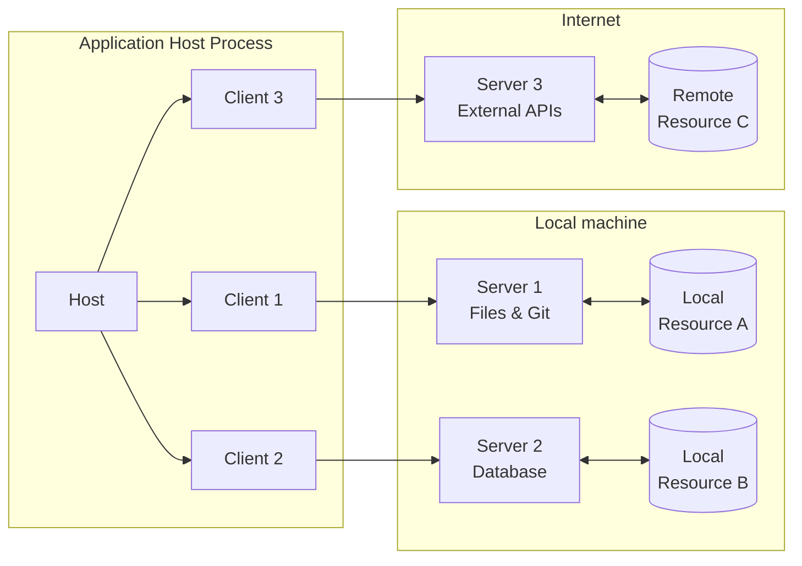
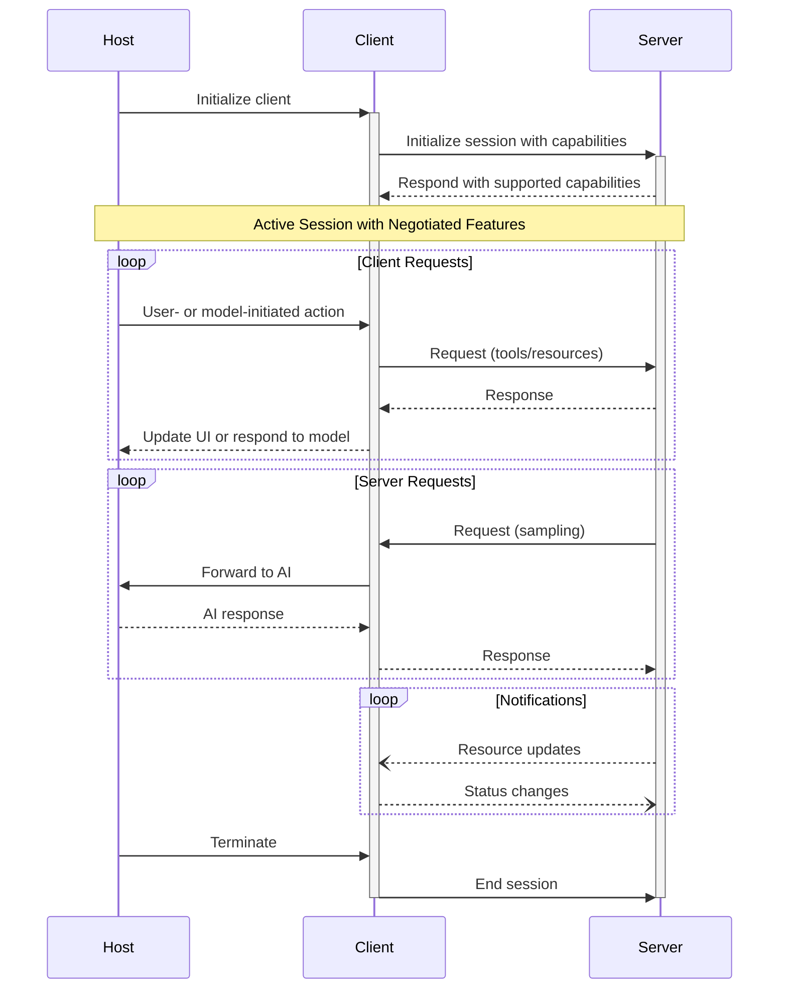

# 架构

Model Context Protocol (MCP) 遵循客户端-主机-服务器架构，其中每个主机可以运行多个客户端实例。这种架构使用户能够跨应用程序集成 AI 能力，同时保持清晰的安全边界和关注点隔离。MCP 基于 JSON-RPC 构建，提供了一个专注于客户端和服务器之间上下文交换和采样协调的有状态会话协议。

## 核心组件

### 主机（Host）

主机进程充当容器和协调者：

- 创建和管理多个客户端实例
- 控制客户端连接权限和生命周期
- 执行安全策略和同意要求
- 处理用户授权决策
- 协调 AI/LLM 集成和采样
- 管理跨客户端的上下文聚合

### 客户端（Clients）

每个客户端由主机创建，并维护一个隔离的服务器连接：

- 为每个服务器建立一个有状态会话
- 处理协议协商和能力交换
- 双向路由协议消息
- 管理订阅和通知
- 维护服务器之间的安全边界

主机应用程序创建和管理多个客户端，每个客户端与特定服务器保持 1:1 的关系。

### 服务器（Servers）

服务器提供专门的上下文和能力：

- 通过 MCP 原语暴露资源、工具和提示
- 以专注的职责独立运行
- 通过客户端接口请求采样
- 必须遵守安全约束
- 可以是本地进程或远程服务

## 设计原则

MCP 建立在几个关键设计原则之上，这些原则指导其架构和实现：

1. **服务器应该非常容易构建**

   - 主机应用程序处理复杂的编排职责
   - 服务器专注于特定的、明确定义的能力
   - 简单的接口最小化实现开销
   - 清晰的分离实现可维护的代码

2. **服务器应该高度可组合**

   - 每个服务器独立提供专注的功能
   - 多个服务器可以无缝组合
   - 共享协议实现互操作性
   - 模块化设计支持可扩展性

3. **服务器不应该能够读取整个对话，也不应该"看到"其他服务器**

   - 服务器仅接收必要的上下文信息
   - 完整的对话历史保留在主机中
   - 每个服务器连接保持隔离
   - 跨服务器交互由主机控制
   - 主机进程强制执行安全边界

4. **功能可以逐步添加到服务器和客户端**
   - 核心协议提供最小的必需功能
   - 可根据需要协商额外的能力
   - 服务器和客户端独立演进
   - 协议设计用于未来的可扩展性
   - 保持向后兼容性

## 能力协商

Model Context Protocol 使用基于能力的协商系统，其中客户端和服务器在初始化期间明确声明其支持的特性。能力决定了会话期间可用的协议功能和原语。

- 服务器声明能力，如资源订阅、工具支持和提示模板
- 客户端声明能力，如采样支持和通知处理
- 双方必须在整个会话期间尊重已声明的能力
- 可以通过协议扩展协商额外的能力

每个能力解锁会话期间使用的特定协议功能。例如：

- 已实现的[服务器功能](/specification/2025-06-18/server)必须在服务器的能力中公布
- 发出资源订阅通知需要服务器声明订阅支持
- 工具调用需要服务器声明工具能力
- [采样](/specification/2025-06-18/client)需要客户端在其能力中声明支持

这种能力协商确保客户端和服务器对支持的功能有清晰的理解，同时保持协议的可扩展性。
