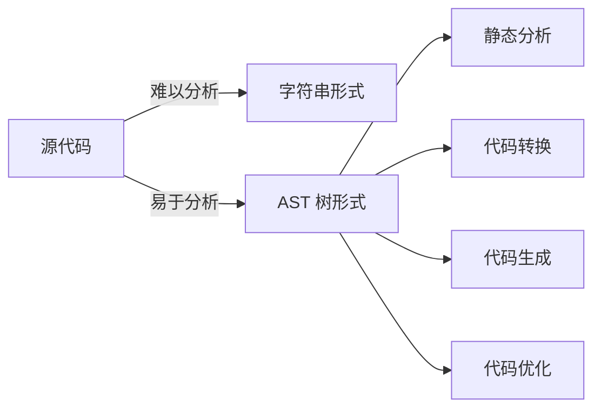
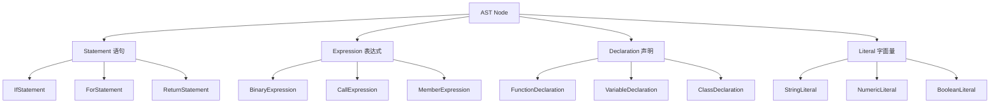
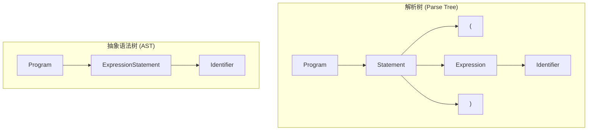
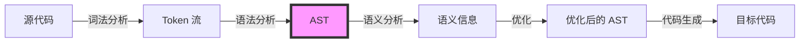
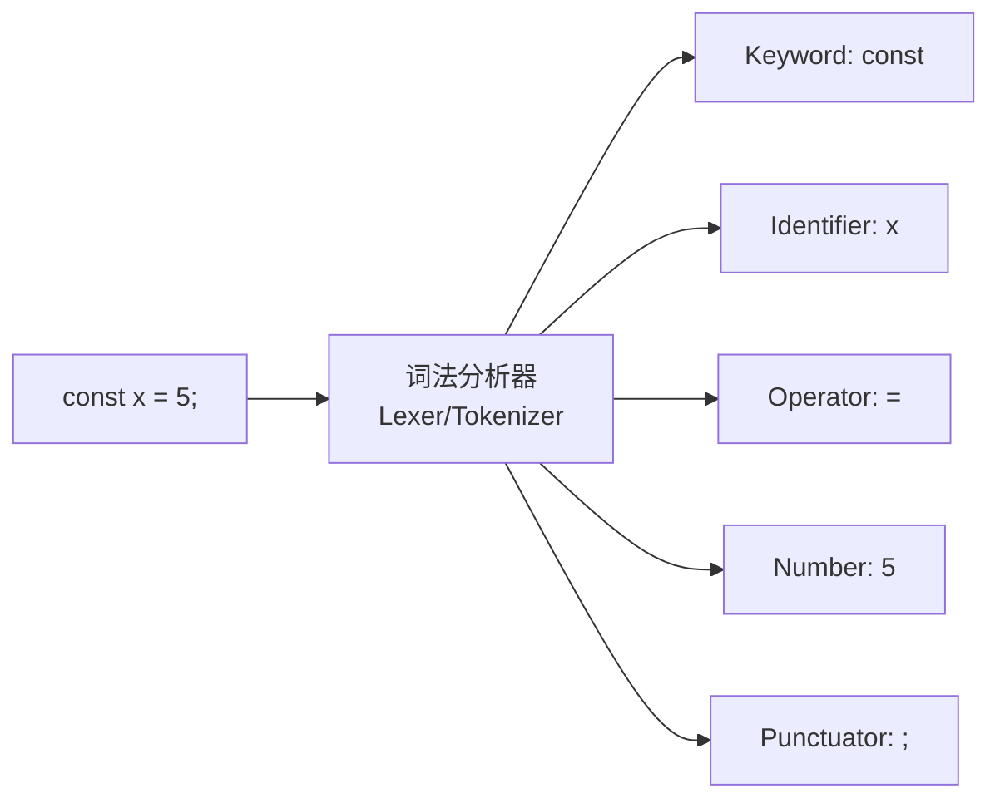
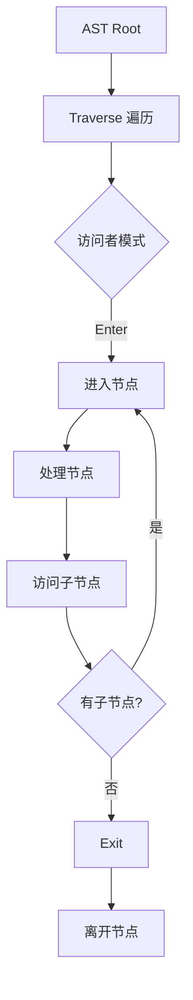
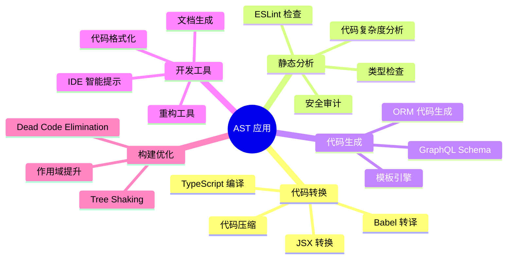
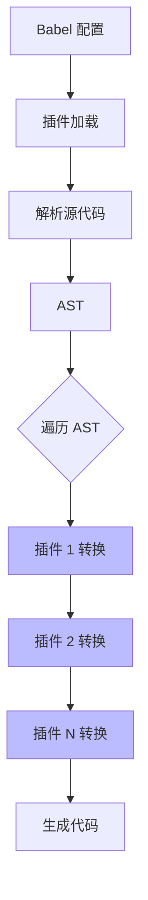
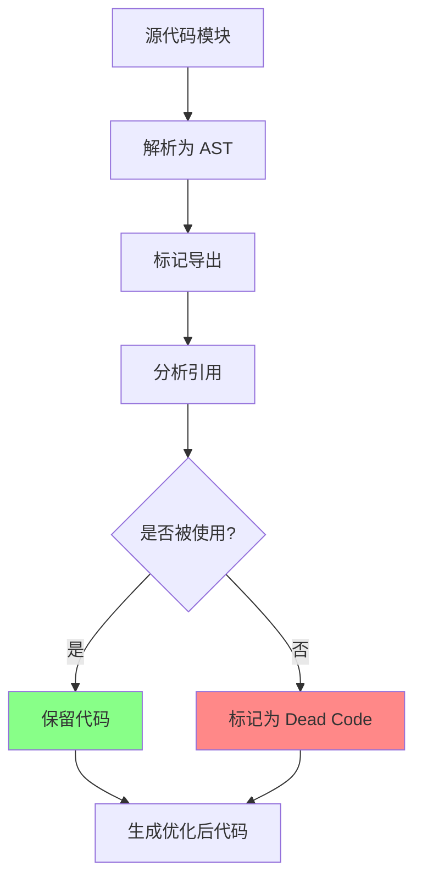
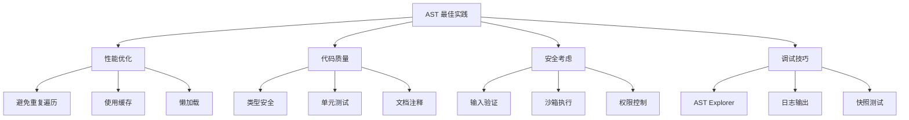

# AST 完整教程:从原理到实践

## 目录

1. [AST 基础概念](#1-ast-基础概念)
2. [AST 的核心原理](#2-ast-的核心原理)
3. [编译流程与 AST](#3-编译流程与-ast)
4. [AST 的应用场景](#4-ast-的应用场景)
5. [实践:使用 Babel 操作 AST](#5-实践使用-babel-操作-ast)
6. [实践:编写自定义转换器](#6-实践编写自定义转换器)
7. [高级应用案例](#7-高级应用案例)
8. [最佳实践与工具](#8-最佳实践与工具)

---

## 1. AST 基础概念

### 1.1 什么是 AST?

**抽象语法树 (Abstract Syntax Tree, AST)** 是源代码的树状表示形式,它抽象地表示了代码的语法结构。AST 忽略了源代码中的某些细节(如括号、分号等),只保留了程序结构和语义信息。

### 1.2 为什么需要 AST?



**核心优势:**

- **结构化表示**: 将代码从线性文本转换为层次化的树结构
- **语义保留**: 保留代码的语义信息,去除语法噪音
- **易于遍历**: 可以系统地访问和修改代码结构
- **工具友好**: 为各种开发工具提供统一的代码表示

### 1.3 AST 的基本结构

```javascript
// 源代码
const add = (a, b) => a + b;

// 对应的 AST 结构(简化版)
{
  type: "VariableDeclaration",
  kind: "const",
  declarations: [{
    type: "VariableDeclarator",
    id: { type: "Identifier", name: "add" },
    init: {
      type: "ArrowFunctionExpression",
      params: [
        { type: "Identifier", name: "a" },
        { type: "Identifier", name: "b" }
      ],
      body: {
        type: "BinaryExpression",
        operator: "+",
        left: { type: "Identifier", name: "a" },
        right: { type: "Identifier", name: "b" }
      }
    }
  }]
}
```

### 1.4 AST 节点类型



---

## 2. AST 的核心原理

### 2.1 AST 的数据结构

AST 本质上是一个递归的树形数据结构,每个节点都包含:

```typescript
interface ASTNode {
  type: string; // 节点类型
  start?: number; // 起始位置
  end?: number; // 结束位置
  loc?: SourceLocation; // 位置信息
  [key: string]: any; // 特定于节点类型的属性
}

interface SourceLocation {
  start: Position;
  end: Position;
}

interface Position {
  line: number;
  column: number;
}
```

### 2.2 AST 与其他树结构的区别



**关键区别:**

- **解析树**: 包含所有语法细节(括号、分号等)
- **AST**: 只保留语义相关的结构信息

---

## 3. 编译流程与 AST

### 3.1 完整编译流程



### 3.2 词法分析 (Lexical Analysis)

**将源代码转换为 Token 流**

```typescript
// 输入: "const x = 5;"
// 输出: Token 流
[
  { type: 'Keyword', value: 'const' },
  { type: 'Identifier', value: 'x' },
  { type: 'Operator', value: '=' },
  { type: 'Number', value: '5' },
  { type: 'Punctuator', value: ';' },
];
```



### 3.3 语法分析 (Syntax Analysis)

**将 Token 流转换为 AST**

```typescript
// Token 流 → AST
{
  type: "Program",
  body: [{
    type: "VariableDeclaration",
    kind: "const",
    declarations: [{
      type: "VariableDeclarator",
      id: {
        type: "Identifier",
        name: "x"
      },
      init: {
        type: "NumericLiteral",
        value: 5
      }
    }]
  }]
}
```

### 3.4 AST 转换与遍历



---

## 4. AST 的应用场景

### 4.1 应用场景概览



### 4.2 具体应用案例

#### 案例 1: Babel 转译

```javascript
// ES6+ 代码
const arrow = (x) => x * 2;

// Babel 转译后
var arrow = function (x) {
  return x * 2;
};
```

#### 案例 2: ESLint 规则检查

```javascript
// 检测未使用的变量
const unused = 5; // ❌ ESLint: 'unused' is defined but never used
const used = 10;
console.log(used); // ✅
```

#### 案例 3: 代码格式化 (Prettier)

```javascript
// 输入
const obj = { a: 1, b: 2, c: 3 };

// 输出
const obj = {
  a: 1,
  b: 2,
  c: 3,
};
```

---

## 5. 实践:使用 Babel 操作 AST

### 5.1 环境搭建

```bash
# 安装依赖
npm install --save-dev @babel/core @babel/parser @babel/traverse @babel/generator @babel/types
npm install --save-dev @types/babel__core @types/babel__traverse
```

### 5.2 解析代码为 AST

```typescript
import { parse } from '@babel/parser';
import generate from '@babel/generator';
import traverse from '@babel/traverse';
import * as t from '@babel/types';

// 1. 解析代码
const code = `
  const add = (a, b) => a + b;
  const result = add(1, 2);
`;

const ast = parse(code, {
  sourceType: 'module',
  plugins: ['typescript'],
});

console.log(JSON.stringify(ast, null, 2));
```

### 5.3 遍历和修改 AST

```typescript
// 访问者模式
const visitor = {
  // 访问所有的标识符
  Identifier(path) {
    console.log(`Found identifier: ${path.node.name}`);
  },

  // 访问箭头函数
  ArrowFunctionExpression(path) {
    console.log('Found arrow function');
  },

  // 访问变量声明
  VariableDeclaration(path) {
    // 将 const 改为 let
    if (path.node.kind === 'const') {
      path.node.kind = 'let';
    }
  },
};

// 遍历 AST
traverse(ast, visitor);

// 生成修改后的代码
const output = generate(
  ast,
  {
    /* options */
  },
  code,
);

console.log(output.code);
```

### 5.4 创建新节点

```typescript
// 使用 @babel/types 创建新节点
const newVariable = t.variableDeclaration('const', [
  t.variableDeclarator(t.identifier('newVar'), t.numericLiteral(42)),
]);

// 将新节点添加到 AST
traverse(ast, {
  Program(path) {
    path.node.body.unshift(newVariable);
  },
});
```

### 5.5 完整示例:箭头函数转普通函数

```typescript
import { parse } from '@babel/parser';
import traverse from '@babel/traverse';
import generate from '@babel/generator';
import * as t from '@babel/types';

function transformArrowFunctions(code: string): string {
  const ast = parse(code, {
    sourceType: 'module',
  });

  traverse(ast, {
    ArrowFunctionExpression(path) {
      // 创建普通函数
      const functionExpression = t.functionExpression(
        null, // 匿名函数
        path.node.params,
        t.isExpression(path.node.body)
          ? t.blockStatement([t.returnStatement(path.node.body)])
          : path.node.body,
        false,
        path.node.async,
      );

      // 替换箭头函数
      path.replaceWith(functionExpression);
    },
  });

  return generate(ast).code;
}

// 测试
const input = `
  const add = (a, b) => a + b;
  const greet = name => console.log('Hello ' + name);
`;

const output = transformArrowFunctions(input);
console.log(output);
/*
输出:
const add = function(a, b) {
  return a + b;
};
const greet = function(name) {
  return console.log('Hello ' + name);
};
*/
```

---

## 6. 实践:编写自定义转换器

### 6.1 Babel 插件架构



### 6.2 创建自定义 Babel 插件

```typescript
// babel-plugin-console-remove.ts
import { PluginObj } from '@babel/core';
import * as t from '@babel/types';

interface PluginOptions {
  excludeMethods?: string[];
}

export default function removeConsolePlugin(): PluginObj {
  return {
    name: 'remove-console',
    visitor: {
      CallExpression(path, state) {
        const options = state.opts as PluginOptions;
        const excludeMethods = options.excludeMethods || [];

        // 检查是否是 console.* 调用
        if (
          t.isMemberExpression(path.node.callee) &&
          t.isIdentifier(path.node.callee.object, { name: 'console' }) &&
          t.isIdentifier(path.node.callee.property)
        ) {
          const methodName = path.node.callee.property.name;

          // 如果不在排除列表中,则移除
          if (!excludeMethods.includes(methodName)) {
            path.remove();
          }
        }
      }
    }
  };
}

// 使用插件
// .babelrc
{
  "plugins": [
    ["./babel-plugin-console-remove", {
      "excludeMethods": ["error", "warn"]
    }]
  ]
}
```

### 6.3 高级插件示例:依赖注入

```typescript
// babel-plugin-auto-inject-dependencies.ts
import { PluginObj } from '@babel/core';
import * as t from '@babel/types';

export default function autoInjectPlugin(): PluginObj {
  return {
    name: 'auto-inject-dependencies',
    visitor: {
      Program: {
        exit(path) {
          const usedIdentifiers = new Set<string>();
          const dependencies = new Map<string, string>([
            ['useState', 'react'],
            ['useEffect', 'react'],
            ['axios', 'axios'],
          ]);

          // 收集使用的标识符
          path.traverse({
            Identifier(innerPath) {
              if (dependencies.has(innerPath.node.name)) {
                usedIdentifiers.add(innerPath.node.name);
              }
            },
          });

          // 生成导入语句
          const imports = Array.from(usedIdentifiers).map((identifier) => {
            const source = dependencies.get(identifier)!;

            return t.importDeclaration(
              [t.importSpecifier(t.identifier(identifier), t.identifier(identifier))],
              t.stringLiteral(source),
            );
          });

          // 将导入添加到文件顶部
          if (imports.length > 0) {
            path.node.body.unshift(...imports);
          }
        },
      },
    },
  };
}
```

### 6.4 编写 ESLint 规则

```typescript
// eslint-rule-no-console-log.ts
import { Rule } from 'eslint';
import * as ESTree from 'estree';

const rule: Rule.RuleModule = {
  meta: {
    type: 'suggestion',
    docs: {
      description: 'Disallow console.log statements',
      category: 'Best Practices',
      recommended: true,
    },
    fixable: 'code',
    schema: [],
  },

  create(context) {
    return {
      CallExpression(node: ESTree.CallExpression) {
        // 检查是否是 console.log
        if (
          node.callee.type === 'MemberExpression' &&
          node.callee.object.type === 'Identifier' &&
          node.callee.object.name === 'console' &&
          node.callee.property.type === 'Identifier' &&
          node.callee.property.name === 'log'
        ) {
          context.report({
            node,
            message: 'Unexpected console.log statement',
            fix(fixer) {
              // 提供自动修复:移除该语句
              return fixer.remove(node);
            },
          });
        }
      },
    };
  },
};

export default rule;
```

---

## 7. 高级应用案例

### 7.1 代码自动化重构工具

```typescript
import { parse } from '@babel/parser';
import traverse from '@babel/traverse';
import generate from '@babel/generator';
import * as t from '@babel/types';

/**
 * 将 var 自动转换为 let/const
 */
function refactorVarToLetConst(code: string): string {
  const ast = parse(code, { sourceType: 'module' });

  traverse(ast, {
    VariableDeclaration(path) {
      if (path.node.kind !== 'var') return;

      // 检查是否被重新赋值
      let isReassigned = false;

      path.node.declarations.forEach((declarator) => {
        if (!t.isIdentifier(declarator.id)) return;

        const binding = path.scope.getBinding(declarator.id.name);
        if (binding && binding.constantViolations.length > 0) {
          isReassigned = true;
        }
      });

      // 转换为 let 或 const
      path.node.kind = isReassigned ? 'let' : 'const';
    },
  });

  return generate(ast).code;
}

// 测试
const input = `
var x = 5;
var y = 10;
y = 20;
`;

console.log(refactorVarToLetConst(input));
/*
输出:
const x = 5;
let y = 10;
y = 20;
*/
```

### 7.2 代码复杂度分析工具

```typescript
import { parse } from '@babel/parser';
import traverse from '@babel/traverse';

interface ComplexityMetrics {
  cyclomaticComplexity: number;
  numberOfFunctions: number;
  numberOfLoops: number;
  maxNestingDepth: number;
}

function analyzeComplexity(code: string): ComplexityMetrics {
  const ast = parse(code, { sourceType: 'module' });

  const metrics: ComplexityMetrics = {
    cyclomaticComplexity: 1,
    numberOfFunctions: 0,
    numberOfLoops: 0,
    maxNestingDepth: 0,
  };

  let currentDepth = 0;

  traverse(ast, {
    // 函数声明
    'FunctionDeclaration|FunctionExpression|ArrowFunctionExpression'(path) {
      metrics.numberOfFunctions++;
      currentDepth++;
      metrics.maxNestingDepth = Math.max(metrics.maxNestingDepth, currentDepth);
    },

    // 条件语句增加复杂度
    'IfStatement|ConditionalExpression'(path) {
      metrics.cyclomaticComplexity++;
    },

    // 循环语句
    'ForStatement|WhileStatement|DoWhileStatement|ForInStatement|ForOfStatement'(path) {
      metrics.numberOfLoops++;
      metrics.cyclomaticComplexity++;
    },

    // 逻辑运算符
    LogicalExpression(path) {
      if (path.node.operator === '||' || path.node.operator === '&&') {
        metrics.cyclomaticComplexity++;
      }
    },

    // switch case
    SwitchCase(path) {
      if (path.node.test) {
        // 不计算 default
        metrics.cyclomaticComplexity++;
      }
    },
  });

  return metrics;
}

// 测试
const complexCode = `
function processData(data) {
  if (!data) return null;
  
  for (let i = 0; i < data.length; i++) {
    if (data[i].active) {
      switch(data[i].type) {
        case 'A':
          return handleTypeA(data[i]);
        case 'B':
          return handleTypeB(data[i]);
        default:
          return null;
      }
    }
  }
  
  return data;
}
`;

console.log(analyzeComplexity(complexCode));
```

### 7.3 智能代码补全引擎

```typescript
import { parse } from '@babel/parser';
import traverse from '@babel/traverse';
import * as t from '@babel/types';

interface CompletionItem {
  label: string;
  kind: 'variable' | 'function' | 'class' | 'method';
  detail?: string;
}

function getCompletions(code: string, position: number): CompletionItem[] {
  const ast = parse(code, {
    sourceType: 'module',
    plugins: ['typescript'],
  });

  const completions: CompletionItem[] = [];
  const seenIdentifiers = new Set<string>();

  traverse(ast, {
    VariableDeclarator(path) {
      if (t.isIdentifier(path.node.id)) {
        const name = path.node.id.name;
        if (!seenIdentifiers.has(name)) {
          seenIdentifiers.add(name);
          completions.push({
            label: name,
            kind: 'variable',
            detail: path.node.init?.type,
          });
        }
      }
    },

    FunctionDeclaration(path) {
      if (path.node.id) {
        const name = path.node.id.name;
        if (!seenIdentifiers.has(name)) {
          seenIdentifiers.add(name);
          completions.push({
            label: name,
            kind: 'function',
            detail: `${path.node.params.length} parameters`,
          });
        }
      }
    },

    ClassDeclaration(path) {
      if (path.node.id) {
        const name = path.node.id.name;
        if (!seenIdentifiers.has(name)) {
          seenIdentifiers.add(name);
          completions.push({
            label: name,
            kind: 'class',
          });
        }
      }
    },
  });

  return completions;
}

// 测试
const code = `
const userName = 'Alice';
function greet(name) {
  return 'Hello ' + name;
}
class User {
  constructor(name) {
    this.name = name;
  }
}
`;

console.log(getCompletions(code, code.length));
```

### 7.4 Tree Shaking 实现原理



```typescript
import { parse } from '@babel/parser';
import traverse from '@babel/traverse';
import * as t from '@babel/types';

function simpleTreeShake(code: string, usedExports: string[]): string {
  const ast = parse(code, { sourceType: 'module' });
  const toRemove: any[] = [];

  traverse(ast, {
    ExportNamedDeclaration(path) {
      // 检查导出的声明
      if (t.isVariableDeclaration(path.node.declaration)) {
        const declarations = path.node.declaration.declarations;

        declarations.forEach((declarator) => {
          if (t.isIdentifier(declarator.id)) {
            const name = declarator.id.name;

            // 如果没有被使用,标记删除
            if (!usedExports.includes(name)) {
              toRemove.push(path);
            }
          }
        });
      }

      if (t.isFunctionDeclaration(path.node.declaration)) {
        const name = path.node.declaration.id?.name;
        if (name && !usedExports.includes(name)) {
          toRemove.push(path);
        }
      }
    },
  });

  // 删除未使用的导出
  toRemove.forEach((path) => path.remove());

  return generate(ast).code;
}

// 测试
const moduleCode = `
export const usedFunction = () => 'used';
export const unusedFunction = () => 'unused';
export const usedVariable = 42;
export const unusedVariable = 100;
`;

const optimized = simpleTreeShake(moduleCode, ['usedFunction', 'usedVariable']);
console.log(optimized);
```

---

## 8. 最佳实践与工具

### 8.1 AST 操作最佳实践



### 8.2 实用工具推荐

| 工具                        | 用途                | 特点                    |
| --------------------------- | ------------------- | ----------------------- |
| **AST Explorer**            | 在线 AST 可视化     | 支持多种解析器,实时预览 |
| **Babel**                   | JavaScript 转译     | 插件生态丰富,社区活跃   |
| **TypeScript Compiler API** | TypeScript 操作     | 类型系统支持            |
| **ESLint**                  | 代码检查            | 可扩展规则系统          |
| **Prettier**                | 代码格式化          | 固执己见的格式化        |
| **jscodeshift**             | 大规模重构          | 基于 Recast,保留格式    |
| **ts-morph**                | TypeScript AST 操作 | 更友好的 API            |

### 8.3 开发工具配置

```typescript
// tsconfig.json - TypeScript 项目配置
{
  "compilerOptions": {
    "target": "ES2020",
    "module": "ESNext",
    "lib": ["ES2020"],
    "moduleResolution": "node",
    "types": ["node"],
    "esModuleInterop": true,
    "strict": true
  }
}

// .eslintrc.js - ESLint 配置
module.exports = {
  parser: '@typescript-eslint/parser',
  plugins: ['@typescript-eslint'],
  extends: [
    'eslint:recommended',
    'plugin:@typescript-eslint/recommended'
  ],
  rules: {
    // 自定义规则
  }
};

// babel.config.js - Babel 配置
module.exports = {
  presets: [
    ['@babel/preset-env', { targets: { node: 'current' } }],
    '@babel/preset-typescript'
  ],
  plugins: [
    // 你的自定义插件
  ]
};
```

### 8.4 调试技巧

```typescript
// 1. 使用 AST Explorer 在线调试
// https://astexplorer.net/

// 2. 打印 AST 结构
import { parse } from '@babel/parser';

const ast = parse(code);
console.log(JSON.stringify(ast, null, 2));

// 3. 使用 path.toString() 查看节点
traverse(ast, {
  Identifier(path) {
    console.log(path.toString()); // 打印节点代码
    console.log(path.node); // 打印节点对象
  },
});

// 4. 快照测试
import { parse } from '@babel/parser';
import generate from '@babel/generator';

function transform(code: string): string {
  const ast = parse(code);
  // 转换逻辑...
  return generate(ast).code;
}

// 测试
test('transforms arrow functions', () => {
  const input = 'const fn = () => 42;';
  const output = transform(input);
  expect(output).toMatchSnapshot();
});

// 5. 使用断点调试
traverse(ast, {
  FunctionDeclaration(path) {
    debugger; // 在这里设置断点
    // 检查 path 对象的各种属性
  },
});
```

### 8.5 性能优化策略

```typescript
// ❌ 不好的做法:多次遍历
function badTransform(code: string) {
  const ast = parse(code);

  // 第一次遍历
  traverse(ast, {
    ArrowFunctionExpression(path) {
      // 转换箭头函数
    },
  });

  // 第二次遍历
  traverse(ast, {
    VariableDeclaration(path) {
      // 转换变量声明
    },
  });

  return generate(ast).code;
}

// ✅ 好的做法:单次遍历
function goodTransform(code: string) {
  const ast = parse(code);

  // 一次遍历完成所有转换
  traverse(ast, {
    ArrowFunctionExpression(path) {
      // 转换箭头函数
    },
    VariableDeclaration(path) {
      // 转换变量声明
    },
  });

  return generate(ast).code;
}

// ✅ 使用缓存
const astCache = new Map<string, any>();

function cachedParse(code: string) {
  if (astCache.has(code)) {
    return astCache.get(code);
  }

  const ast = parse(code);
  astCache.set(code, ast);
  return ast;
}

// ✅ 提前退出
traverse(ast, {
  FunctionDeclaration(path) {
    // 找到目标后立即停止
    if (path.node.id?.name === 'targetFunction') {
      path.stop(); // 停止遍历
    }
  },
});
```

### 8.6 完整项目示例结构

```
my-ast-tool/
├── src/
│   ├── parser/
│   │   ├── index.ts          # 解析器入口
│   │   └── custom-parser.ts  # 自定义解析逻辑
│   ├── transformer/
│   │   ├── index.ts          # 转换器入口
│   │   └── plugins/          # Babel 插件
│   │       ├── remove-console.ts
│   │       └── optimize-imports.ts
│   ├── analyzer/
│   │   ├── complexity.ts     # 复杂度分析
│   │   └── coverage.ts       # 代码覆盖率
│   ├── generator/
│   │   └── index.ts          # 代码生成
│   └── utils/
│       ├── ast-helpers.ts    # AST 辅助函数
│       └── validators.ts     # 验证工具
├── tests/
│   ├── parser.test.ts
│   ├── transformer.test.ts
│   └── __snapshots__/
├── package.json
├── tsconfig.json
├── babel.config.js
└── README.md
```

---

## 总结

### 核心要点

1. **AST 是代码的结构化表示**,为代码分析、转换和生成提供了统一的接口

2. **编译流程**: 词法分析 → 语法分析 → AST → 转换 → 代码生成

3. **应用场景广泛**:

   - 代码转译(Babel, TypeScript)
   - 静态分析(ESLint)
   - 代码格式化(Prettier)
   - 构建优化(Tree Shaking)

4. **实践技巧**:
   - 使用访问者模式遍历 AST
   - 合理使用工具库(@babel/types)
   - 注意性能优化(减少遍历次数)
   - 重视测试和调试

### 学习路径


### 推荐资源

- **官方文档**:

  - [Babel 官方文档](https://babeljs.io/docs/)
  - [ESLint 开发指南](https://eslint.org/docs/developer-guide/)
  - [TypeScript Compiler API](https://github.com/microsoft/TypeScript/wiki/Using-the-Compiler-API)

- **在线工具**:

  - [AST Explorer](https://astexplorer.net/)
  - [Babel REPL](https://babeljs.io/repl)

- **进阶阅读**:
  - 《编译原理》(龙书)
  - [Babel Plugin Handbook](https://github.com/jamiebuilds/babel-handbook)
  - [The Super Tiny Compiler](https://github.com/jamiebuilds/the-super-tiny-compiler)

---

**祝你在 AST 的世界里探索愉快! 🚀**
