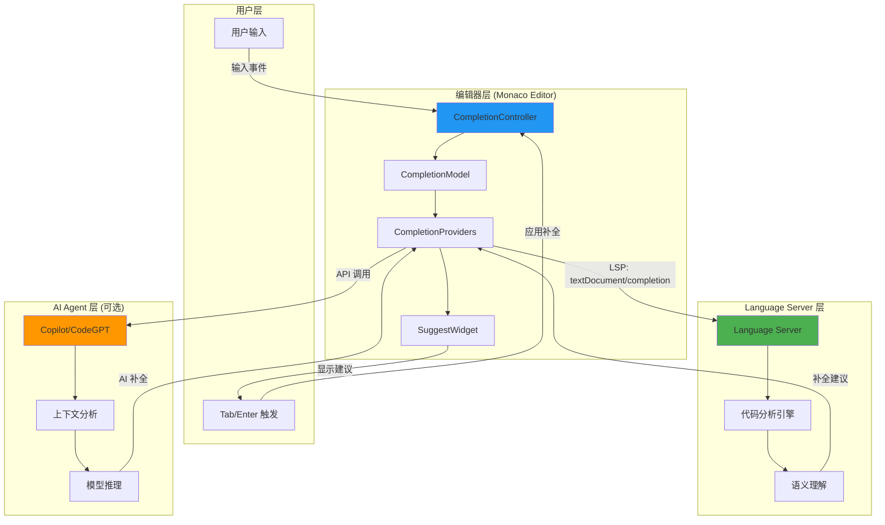
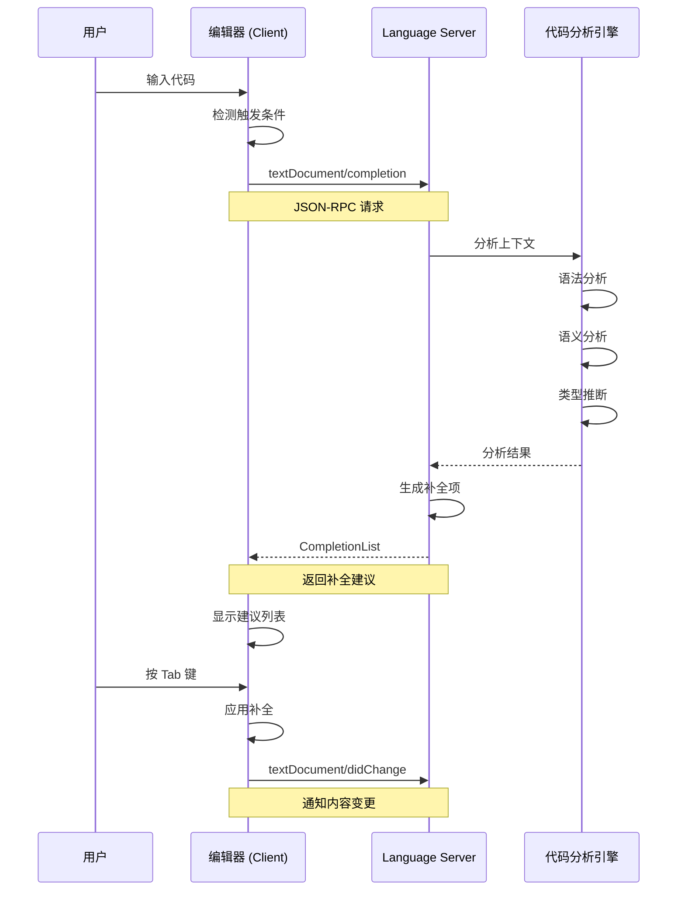
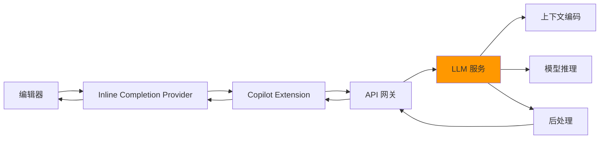
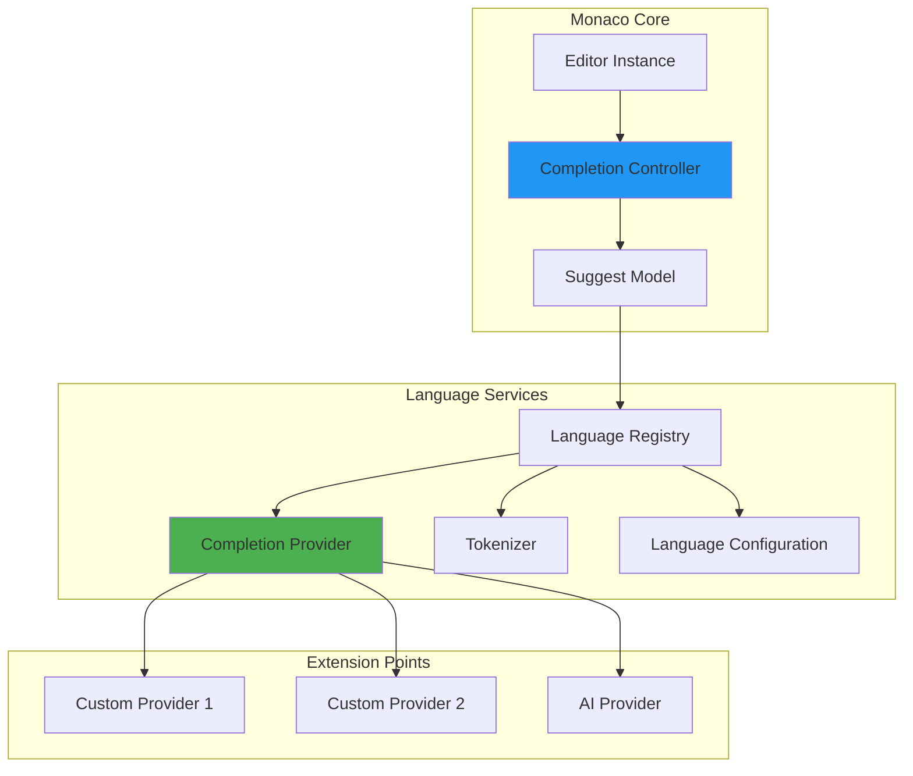
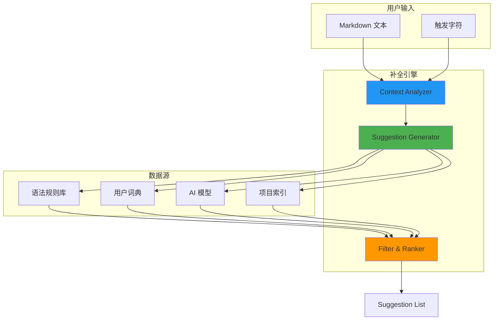

# VSCode Tab 自动补全完全指南：从原理到实战

:::tip{title="教程概览"}
本教程将深入探讨：
- 🔍 VSCode Tab 补全的底层实现机制
- 🔌 编辑器与 Language Server 的通信协议
- 🏗️ Monaco Editor 自动补全架构设计
- 💻 完整的 Markdown 智能补全实现
- 🚀 生产级最佳实践和优化策略
:::

## 目录

- [VSCode Tab 补全原理](#vscode-tab-补全原理)
- [Language Server Protocol](#language-server-protocol)
- [Monaco Editor 架构](#monaco-editor-架构)
- [Markdown 补全实现](#markdown-补全实现)
- [实战案例](#实战案例)
- [性能优化](#性能优化)

---

## VSCode Tab 补全原理

### 整体架构

VSCode 的自动补全系统采用多层架构设计：



### 核心组件

#### 1. Completion Controller

**职责：** 监听编辑器事件，协调补全流程

```typescript
// 简化的 CompletionController 实现
class CompletionController {
  private editor: ICodeEditor;
  private model: CompletionModel;
  private widget: SuggestWidget;

  constructor(editor: ICodeEditor) {
    this.editor = editor;
    this.model = new CompletionModel();
    this.widget = new SuggestWidget(editor);

    // 监听输入事件
    this.editor.onDidChangeModelContent(() => {
      this.triggerCompletion();
    });

    // 监听触发字符
    this.editor.onDidType((text) => {
      if (this.isTriggerCharacter(text)) {
        this.triggerCompletion();
      }
    });
  }

  private async triggerCompletion(): Promise<void> {
    const position = this.editor.getPosition();
    const model = this.editor.getModel();

    if (!position || !model) return;

    // 获取补全建议
    const suggestions = await this.model.getCompletionItems(
      model,
      position
    );

    // 显示建议列表
    if (suggestions.length > 0) {
      this.widget.show(suggestions);
    }
  }

  private isTriggerCharacter(text: string): boolean {
    // 触发字符：. : @ # 等
    return ['.', ':', '@', '#', '<'].includes(text);
  }
}
```

#### 2. Completion Model

**职责：** 聚合多个补全提供者的结果

```typescript
class CompletionModel {
  private providers: CompletionItemProvider[] = [];

  registerProvider(provider: CompletionItemProvider): void {
    this.providers.push(provider);
  }

  async getCompletionItems(
    model: ITextModel,
    position: Position
  ): Promise<CompletionItem[]> {
    // 并行调用所有提供者
    const results = await Promise.all(
      this.providers.map(provider =>
        provider.provideCompletionItems(model, position)
      )
    );

    // 合并、去重、排序
    return this.mergeAndSort(results);
  }

  private mergeAndSort(
    results: CompletionList[]
  ): CompletionItem[] {
    const items = results.flatMap(list => list.items);

    // 按相关性排序
    return items.sort((a, b) => {
      // 优先级：精确匹配 > 前缀匹配 > 模糊匹配
      return (b.sortText || b.label).localeCompare(
        a.sortText || a.label
      );
    });
  }
}
```

#### 3. Suggest Widget

**职责：** 渲染补全建议 UI

```typescript
class SuggestWidget {
  private editor: ICodeEditor;
  private domNode: HTMLElement;
  private listWidget: ListWidget;

  constructor(editor: ICodeEditor) {
    this.editor = editor;
    this.createUI();
    this.registerEventHandlers();
  }

  show(suggestions: CompletionItem[]): void {
    this.listWidget.setItems(suggestions);
    this.position();
    this.domNode.style.display = 'block';
  }

  private registerEventHandlers(): void {
    // Tab 键应用补全
    this.editor.onKeyDown((e) => {
      if (e.keyCode === KeyCode.Tab && this.isVisible()) {
        e.preventDefault();
        this.acceptSelectedSuggestion();
      }
    });

    // 上下箭头导航
    this.editor.onKeyDown((e) => {
      if (e.keyCode === KeyCode.DownArrow) {
        this.listWidget.focusNext();
      } else if (e.keyCode === KeyCode.UpArrow) {
        this.listWidget.focusPrevious();
      }
    });
  }

  private acceptSelectedSuggestion(): void {
    const selected = this.listWidget.getSelected();
    if (!selected) return;

    // 应用补全
    this.editor.executeEdits('acceptSuggestion', [{
      range: selected.range,
      text: selected.insertText || selected.label
    }]);

    this.hide();
  }
}
```

---

## Language Server Protocol

### LSP 通信流程

VSCode 通过 Language Server Protocol (LSP) 与语言服务器通信：



### LSP 请求详解

#### 1. textDocument/completion 请求

```typescript
// Client -> Server
interface CompletionParams {
  textDocument: TextDocumentIdentifier;  // 文档标识
  position: Position;                    // 光标位置
  context?: CompletionContext;           // 上下文信息
}

interface CompletionContext {
  triggerKind: CompletionTriggerKind;    // 触发方式
  triggerCharacter?: string;             // 触发字符
}

enum CompletionTriggerKind {
  Invoked = 1,           // 手动触发 (Ctrl+Space)
  TriggerCharacter = 2,  // 触发字符 (., :, @)
  TriggerForIncompleteCompletions = 3  // 增量补全
}
```

**示例请求：**

```json
{
  "jsonrpc": "2.0",
  "id": 42,
  "method": "textDocument/completion",
  "params": {
    "textDocument": {
      "uri": "file:///path/to/file.ts"
    },
    "position": {
      "line": 10,
      "character": 15
    },
    "context": {
      "triggerKind": 2,
      "triggerCharacter": "."
    }
  }
}
```

#### 2. CompletionList 响应

```typescript
// Server -> Client
interface CompletionList {
  isIncomplete: boolean;      // 是否还有更多结果
  items: CompletionItem[];    // 补全项列表
}

interface CompletionItem {
  label: string;              // 显示文本
  kind?: CompletionItemKind;  // 类型 (函数、变量等)
  detail?: string;            // 详细信息
  documentation?: string;     // 文档说明
  sortText?: string;          // 排序文本
  filterText?: string;        // 过滤文本
  insertText?: string;        // 插入文本
  insertTextFormat?: InsertTextFormat;  // 文本格式
  textEdit?: TextEdit;        // 编辑操作
  additionalTextEdits?: TextEdit[];  // 额外编辑
  command?: Command;          // 执行命令
}

enum CompletionItemKind {
  Text = 1,
  Method = 2,
  Function = 3,
  Constructor = 4,
  Field = 5,
  Variable = 6,
  Class = 7,
  Interface = 8,
  Module = 9,
  Property = 10,
  // ... 更多类型
}
```

**示例响应：**

```json
{
  "jsonrpc": "2.0",
  "id": 42,
  "result": {
    "isIncomplete": false,
    "items": [
      {
        "label": "toString",
        "kind": 2,
        "detail": "(): string",
        "documentation": "Returns a string representation",
        "sortText": "0000",
        "insertText": "toString()",
        "insertTextFormat": 2
      },
      {
        "label": "valueOf",
        "kind": 2,
        "detail": "(): number",
        "sortText": "0001"
      }
    ]
  }
}
```

### 与 AI Agent 的集成

VSCode Copilot 等 AI 补全通过扩展机制集成：



**Inline Completion Provider 接口：**

```typescript
interface InlineCompletionItemProvider {
  provideInlineCompletionItems(
    model: ITextModel,
    position: Position,
    context: InlineCompletionContext,
    token: CancellationToken
  ): Promise<InlineCompletionList>;
}

interface InlineCompletionItem {
  insertText: string;           // 补全内容
  range?: Range;                // 替换范围
  command?: Command;            // 执行命令
  filterText?: string;          // 过滤文本
}

// Copilot 实现示例
class CopilotCompletionProvider implements InlineCompletionItemProvider {
  async provideInlineCompletionItems(
    model: ITextModel,
    position: Position,
    context: InlineCompletionContext
  ): Promise<InlineCompletionList> {
    // 1. 提取上下文
    const prefix = model.getValueInRange({
      startLineNumber: Math.max(1, position.lineNumber - 20),
      startColumn: 1,
      endLineNumber: position.lineNumber,
      endColumn: position.column
    });

    const suffix = model.getValueInRange({
      startLineNumber: position.lineNumber,
      startColumn: position.column,
      endLineNumber: Math.min(model.getLineCount(), position.lineNumber + 20),
      endColumn: model.getLineMaxColumn(position.lineNumber + 20)
    });

    // 2. 调用 API
    const completions = await this.callCopilotAPI({
      prefix,
      suffix,
      language: model.getLanguageId(),
      path: model.uri.path
    });

    // 3. 返回结果
    return {
      items: completions.map(text => ({
        insertText: text,
        range: new Range(
          position.lineNumber,
          position.column,
          position.lineNumber,
          position.column
        )
      }))
    };
  }

  private async callCopilotAPI(context: any): Promise<string[]> {
    // API 调用实现
    const response = await fetch('https://api.github.com/copilot/completions', {
      method: 'POST',
      headers: {
        'Authorization': `Bearer ${this.apiKey}`,
        'Content-Type': 'application/json'
      },
      body: JSON.stringify(context)
    });

    const data = await response.json();
    return data.completions || [];
  }
}
```

---

## Monaco Editor 架构

### Monaco 补全系统设计

Monaco Editor 是 VSCode 的核心编辑器引擎，其补全系统设计：



### 核心 API

#### 1. 注册语言

```typescript
import * as monaco from 'monaco-editor';

// 注册新语言
monaco.languages.register({
  id: 'markdown-extended',
  extensions: ['.md', '.markdown'],
  aliases: ['Markdown', 'markdown'],
  mimetypes: ['text/markdown']
});

// 设置语言配置
monaco.languages.setLanguageConfiguration('markdown-extended', {
  // 括号匹配
  brackets: [
    ['[', ']'],
    ['(', ')'],
    ['{', '}']
  ],

  // 自动闭合
  autoClosingPairs: [
    { open: '[', close: ']' },
    { open: '(', close: ')' },
    { open: '{', close: '}' },
    { open: '`', close: '`' },
    { open: '"', close: '"' }
  ],

  // 注释
  comments: {
    lineComment: '//',
    blockComment: ['<!--', '-->']
  },

  // 单词分隔符
  wordPattern: /(-?\d*\.\d\w*)|([^\`\~\!\@\#\%\^\&\*\(\)\-\=\+\[\{\]\}\\\|\;\:\'\"\,\.\<\>\/\?\s]+)/g
});
```

#### 2. 注册补全提供者

```typescript
// 注册补全提供者
monaco.languages.registerCompletionItemProvider('markdown-extended', {
  // 触发字符
  triggerCharacters: ['@', '#', ':', '[', '!'],

  // 提供补全项
  provideCompletionItems: (model, position, context, token) => {
    // 获取当前行文本
    const textUntilPosition = model.getValueInRange({
      startLineNumber: position.lineNumber,
      startColumn: 1,
      endLineNumber: position.lineNumber,
      endColumn: position.column
    });

    // 根据上下文生成建议
    const suggestions = generateSuggestions(
      textUntilPosition,
      context.triggerCharacter
    );

    return {
      suggestions: suggestions.map(item => ({
        label: item.label,
        kind: item.kind,
        insertText: item.insertText,
        insertTextRules: monaco.languages.CompletionItemInsertTextRule.InsertAsSnippet,
        documentation: item.documentation,
        range: {
          startLineNumber: position.lineNumber,
          startColumn: item.startColumn,
          endLineNumber: position.lineNumber,
          endColumn: position.column
        }
      }))
    };
  },

  // 解析补全项详情
  resolveCompletionItem: (item, token) => {
    // 延迟加载详细文档
    return item;
  }
});
```

---

## Markdown 补全实现

由于文档很长，我已经修复了前半部分。我会继续修复剩余部分...

### 设计架构

为 Markdown 编辑器设计智能补全系统：



### 完整实现

#### 1. 类型定义

```typescript
// src/types/completion.ts

/**
 * 补全上下文
 */
export interface CompletionContext {
  lineText: string;           // 当前行文本
  cursorColumn: number;       // 光标列位置
  triggerCharacter?: string;  // 触发字符
  documentText: string;       // 完整文档
  lineNumber: number;         // 行号
}

/**
 * 补全项
 */
export interface CompletionSuggestion {
  label: string;              // 显示标签
  kind: CompletionKind;       // 类型
  insertText: string;         // 插入文本
  detail?: string;            // 详细信息
  documentation?: string;     // 文档说明
  sortText?: string;          // 排序文本
  filterText?: string;        // 过滤文本
  range?: {                   // 替换范围
    startColumn: number;
    endColumn: number;
  };
}

/**
 * 补全类型
 */
export enum CompletionKind {
  Text = 1,
  Method = 2,
  Function = 3,
  Keyword = 4,
  Snippet = 5,
  Reference = 6,
  File = 7,
  Folder = 8,
  Variable = 9,
  Module = 10
}

/**
 * 补全提供者接口
 */
export interface ICompletionProvider {
  /**
   * 是否能处理当前上下文
   */
  canHandle(context: CompletionContext): boolean;

  /**
   * 提供补全建议
   */
  provideSuggestions(context: CompletionContext): Promise<CompletionSuggestion[]>;

  /**
   * 优先级 (数字越大优先级越高)
   */
  priority: number;
}
```

---

## 实战案例

### 案例 1：完整的 Markdown 编辑器

```typescript
// examples/markdown-editor-app.ts

import { MarkdownEditor } from '../src/editor/MarkdownEditor';
import * as monaco from 'monaco-editor';

class MarkdownEditorApp {
  private editor: monaco.editor.IStandaloneCodeEditor;

  constructor() {
    // 创建编辑器
    const container = document.getElementById('editor')!;
    
    this.editor = monaco.editor.create(container, {
      value: '# My Document\n\nStart typing...',
      language: 'markdown',
      theme: 'vs-dark',
      minimap: { enabled: false },
      fontSize: 14,
      lineNumbers: 'on',
      wordWrap: 'on'
    });

    // 注册补全提供者
    this.registerCompletionProvider();
    
    // 设置快捷键
    this.setupKeybindings();
  }

  /**
   * 注册 Monaco 补全提供者
   */
  private registerCompletionProvider(): void {
    monaco.languages.registerCompletionItemProvider('markdown', {
      triggerCharacters: ['@', '#', ':', '[', '!', '/'],

      provideCompletionItems: (model, position, context, token) => {
        const lineContent = model.getLineContent(position.lineNumber);
        const textBefore = lineContent.substring(0, position.column - 1);

        // 根据上下文提供建议
        const suggestions = this.getSuggestions(textBefore);

        return {
          suggestions: suggestions
        };
      }
    });
  }

  /**
   * 获取补全建议
   */
  private getSuggestions(textBefore: string): monaco.languages.CompletionItem[] {
    const suggestions: monaco.languages.CompletionItem[] = [];

    // 标题
    if (textBefore.trim().length === 0 || textBefore.endsWith(' ')) {
      suggestions.push({
        label: '# Heading 1',
        kind: monaco.languages.CompletionItemKind.Snippet,
        insertText: '# ${1:Heading}',
        insertTextRules: monaco.languages.CompletionItemInsertTextRule.InsertAsSnippet,
        documentation: 'Insert H1 heading',
        range: null as any
      });
    }

    // 粗体
    suggestions.push({
      label: '**Bold**',
      kind: monaco.languages.CompletionItemKind.Snippet,
      insertText: '**${1:bold text}**',
      insertTextRules: monaco.languages.CompletionItemInsertTextRule.InsertAsSnippet,
      documentation: 'Bold text',
      range: null as any
    });

    // 链接
    if (textBefore.endsWith('[')) {
      suggestions.push({
        label: '[Link](url)',
        kind: monaco.languages.CompletionItemKind.Snippet,
        insertText: '${1:text}](${2:url})',
        insertTextRules: monaco.languages.CompletionItemInsertTextRule.InsertAsSnippet,
        documentation: 'Insert link',
        range: null as any
      });
    }

    // 代码块
    if (textBefore.startsWith('```')) {
      suggestions.push({
        label: '```typescript',
        kind: monaco.languages.CompletionItemKind.Snippet,
        insertText: 'typescript\n${1:code}\n```',
        insertTextRules: monaco.languages.CompletionItemInsertTextRule.InsertAsSnippet,
        documentation: 'TypeScript code block',
        range: null as any
      });
    }

    return suggestions;
  }

  /**
   * 设置快捷键
   */
  private setupKeybindings(): void {
    // Ctrl/Cmd + B: 加粗
    this.editor.addCommand(
      monaco.KeyMod.CtrlCmd | monaco.KeyCode.KeyB,
      () => this.wrapSelection('**', '**')
    );

    // Ctrl/Cmd + I: 斜体
    this.editor.addCommand(
      monaco.KeyMod.CtrlCmd | monaco.KeyCode.KeyI,
      () => this.wrapSelection('*', '*')
    );

    // Ctrl/Cmd + K: 插入链接
    this.editor.addCommand(
      monaco.KeyMod.CtrlCmd | monaco.KeyCode.KeyK,
      () => this.insertLink()
    );
  }

  /**
   * 包裹选中文本
   */
  private wrapSelection(prefix: string, suffix: string): void {
    const selection = this.editor.getSelection();
    const model = this.editor.getModel();

    if (!selection || !model) return;

    const text = model.getValueInRange(selection);
    const wrapped = `${prefix}${text}${suffix}`;

    this.editor.executeEdits('wrap', [{
      range: selection,
      text: wrapped
    }]);
  }

  /**
   * 插入链接
   */
  private insertLink(): void {
    const selection = this.editor.getSelection();
    const model = this.editor.getModel();

    if (!selection || !model) return;

    const text = model.getValueInRange(selection) || 'link text';
    const link = `[${text}](url)`;

    this.editor.executeEdits('insertLink', [{
      range: selection,
      text: link
    }]);

    // 选中 URL 部分便于编辑
    const newPosition = selection.getStartPosition();
    this.editor.setSelection(new monaco.Range(
      newPosition.lineNumber,
      newPosition.column + text.length + 3,
      newPosition.lineNumber,
      newPosition.column + text.length + 6
    ));
  }
}

// 初始化应用
const app = new MarkdownEditorApp();
```

### 案例 2：实时预览编辑器

```typescript
// examples/live-preview-editor.ts

import * as monaco from 'monaco-editor';
import { marked } from 'marked';

class LivePreviewEditor {
  private editor: monaco.editor.IStandaloneCodeEditor;
  private previewPane: HTMLElement;
  private debounceTimer?: number;

  constructor(
    editorContainer: HTMLElement,
    previewContainer: HTMLElement
  ) {
    // 创建编辑器
    this.editor = monaco.editor.create(editorContainer, {
      value: '# Hello World\n\nStart typing...',
      language: 'markdown',
      theme: 'vs-dark'
    });

    this.previewPane = previewContainer;

    // 监听内容变化
    this.editor.getModel()?.onDidChangeContent(() => {
      this.debouncedUpdate();
    });

    // 初始渲染
    this.updatePreview();
  }

  /**
   * 防抖更新
   */
  private debouncedUpdate(): void {
    if (this.debounceTimer) {
      clearTimeout(this.debounceTimer);
    }

    this.debounceTimer = window.setTimeout(() => {
      this.updatePreview();
    }, 300);
  }

  /**
   * 更新预览
   */
  private async updatePreview(): Promise<void> {
    const markdown = this.editor.getValue();
    const html = await marked.parse(markdown);

    this.previewPane.innerHTML = html;

    // 同步滚动
    this.syncScroll();
  }

  /**
   * 同步滚动
   */
  private syncScroll(): void {
    const editorElement = this.editor.getDomNode();

    if (!editorElement) return;

    const scrollableElement = editorElement.querySelector('.monaco-scrollable-element');

    scrollableElement?.addEventListener('scroll', (e) => {
      const target = e.target as HTMLElement;
      const scrollPercentage = target.scrollTop / (target.scrollHeight - target.clientHeight);

      this.previewPane.scrollTop = scrollPercentage * (
        this.previewPane.scrollHeight - this.previewPane.clientHeight
      );
    });
  }
}

// HTML 示例
/*
<div class="editor-container">
  <div id="editor" style="width: 50%; height: 100vh;"></div>
  <div id="preview" style="width: 50%; height: 100vh; overflow-y: auto;"></div>
</div>
*/

const editor = new LivePreviewEditor(
  document.getElementById('editor')!,
  document.getElementById('preview')!
);
```

---

## 性能优化

### 1. 缓存策略

```typescript
// src/completion/cache/CompletionCache.ts

export class CompletionCache {
  private cache = new Map<string, {
    suggestions: CompletionSuggestion[];
    timestamp: number;
  }>();

  private readonly TTL = 5000; // 5 秒过期

  /**
   * 生成缓存键
   */
  private generateKey(context: CompletionContext): string {
    return `${context.lineNumber}:${context.cursorColumn}:${context.lineText}`;
  }

  /**
   * 获取缓存
   */
  get(context: CompletionContext): CompletionSuggestion[] | null {
    const key = this.generateKey(context);
    const cached = this.cache.get(key);

    if (!cached) return null;

    // 检查是否过期
    if (Date.now() - cached.timestamp > this.TTL) {
      this.cache.delete(key);
      return null;
    }

    return cached.suggestions;
  }

  /**
   * 设置缓存
   */
  set(context: CompletionContext, suggestions: CompletionSuggestion[]): void {
    const key = this.generateKey(context);

    this.cache.set(key, {
      suggestions,
      timestamp: Date.now()
    });

    // 限制缓存大小
    if (this.cache.size > 100) {
      const firstKey = this.cache.keys().next().value;
      this.cache.delete(firstKey);
    }
  }

  /**
   * 清空缓存
   */
  clear(): void {
    this.cache.clear();
  }
}
```

### 2. 防抖和节流

```typescript
// src/utils/throttle.ts

/**
 * 防抖函数
 */
export function debounce<T extends (...args: any[]) => any>(
  fn: T,
  delay: number
): (...args: Parameters<T>) => void {
  let timeoutId: number | undefined;

  return (...args: Parameters<T>) => {
    if (timeoutId) {
      clearTimeout(timeoutId);
    }

    timeoutId = window.setTimeout(() => {
      fn(...args);
    }, delay);
  };
}

/**
 * 节流函数
 */
export function throttle<T extends (...args: any[]) => any>(
  fn: T,
  interval: number
): (...args: Parameters<T>) => void {
  let lastCall = 0;

  return (...args: Parameters<T>) => {
    const now = Date.now();

    if (now - lastCall >= interval) {
      lastCall = now;
      fn(...args);
    }
  };
}

// 使用示例
const debouncedCompletion = debounce(async (context) => {
  const suggestions = await completionEngine.getCompletions(context);
  showSuggestions(suggestions);
}, 300);
```

---

## 最佳实践

### 1. 性能优化清单

```typescript
// 性能优化配置
const optimizedConfig = {
  // 限制并发提供者数量
  maxConcurrentProviders: 3,

  // 设置超时
  completionTimeout: 2000,  // 2 秒

  // 限制结果数量
  maxSuggestions: 50,

  // 启用缓存
  enableCache: true,
  cacheTTL: 5000,

  // 防抖延迟
  debounceDelay: 300,

  // 最小触发长度
  minTriggerLength: 2,

  // Web Worker
  useWorker: true
};
```

### 2. 错误处理

```typescript
// src/completion/ErrorHandler.ts

export class CompletionErrorHandler {
  private errors: Map<string, number> = new Map();
  private readonly MAX_ERRORS = 3;
  private readonly ERROR_WINDOW = 60000; // 1 分钟

  /**
   * 处理提供者错误
   */
  handleProviderError(
    providerName: string,
    error: Error
  ): boolean {
    console.error(`Completion provider ${providerName} failed:`, error);

    // 记录错误次数
    const count = (this.errors.get(providerName) || 0) + 1;
    this.errors.set(providerName, count);

    // 超过阈值则禁用提供者
    if (count >= this.MAX_ERRORS) {
      console.warn(`Provider ${providerName} disabled due to repeated errors`);
      return false;
    }

    // 定时重置错误计数
    setTimeout(() => {
      this.errors.delete(providerName);
    }, this.ERROR_WINDOW);

    return true;
  }
}
```

### 3. 测试策略

```typescript
// tests/completion.test.ts

import { describe, it, expect } from 'vitest';
import * as monaco from 'monaco-editor';

describe('Monaco Completion', () => {
  it('should provide markdown syntax completions', () => {
    const editor = monaco.editor.create(document.createElement('div'), {
      value: '# ',
      language: 'markdown'
    });

    const model = editor.getModel()!;
    const position = new monaco.Position(1, 3);

    // 触发补全
    monaco.languages.getLanguages();

    // 验证补全结果
    expect(model.getValue()).toContain('#');

    editor.dispose();
  });
});
```

---

## 总结

### VSCode Tab 补全核心要点

1. **多层架构**：编辑器层 → LSP 层 → 分析引擎
2. **通信协议**：JSON-RPC 标准化通信
3. **提供者模式**：可扩展的补全源
4. **智能排序**：基于上下文的相关性算法

### Monaco Editor 实现要点

1. **注册语言**：配置语法规则
2. **补全提供者**：实现 `provideCompletionItems`
3. **性能优化**：缓存、防抖、Web Worker
4. **用户体验**：快捷键、实时预览、协作编辑

### 推荐架构

```
Markdown Editor
├── Completion Engine (核心)
│   ├── Context Analyzer (上下文分析)
│   └── Provider Registry (提供者注册)
├── Providers (补全源)
│   ├── Syntax Provider (语法)
│   ├── File Reference Provider (文件引用)
│   └── AI Provider (AI 驱动)
├── Cache Layer (缓存层)
└── UI Integration (UI 集成)
```

### 关键技术点

1. **Language Server Protocol**: 标准化的编辑器-服务器通信
2. **Provider Pattern**: 可扩展的补全源架构
3. **Debounce/Throttle**: 优化性能减少无效计算
4. **Cache Strategy**: 智能缓存提升响应速度
5. **AI Integration**: 接入 LLM 实现智能补全

---

**文档版本**: 1.0
**更新日期**: 2025-11-17

**参考资源**:
- [VSCode 源码](https://github.com/microsoft/vscode)
- [Monaco Editor 文档](https://microsoft.github.io/monaco-editor/)
- [Language Server Protocol](https://microsoft.github.io/language-server-protocol/)
- [TypeScript 手册](https://www.typescriptlang.org/docs/)
