# Expo 架构深度解析：本地优先、工具链与现代移动开发

Expo 是一个强大的 React Native 开发平台，它通过完善的工具链和创新的架构设计，极大简化了跨平台移动应用的开发流程。本文将深入剖析 Expo 的核心架构、设计理念以及各个组件如何协同工作。

## 目录

1. [核心设计理念](#核心设计理念)
2. [整体架构概览](#整体架构概览)
3. [本地优先架构](#本地优先架构)
4. [开发工具生态](#开发工具生态)
5. [文件系统路由](#文件系统路由)
6. [构建与更新系统](#构建与更新系统)
7. [开发与生产工作流](#开发与生产工作流)
8. [配置系统](#配置系统)

---

## 核心设计理念

### 1. **本地优先 (Local-First)**

Expo 的核心哲学之一是本地优先软件设计：

> **"另一台计算机的可用性永远不应阻止你工作。"**

**设计原则：**
- 数据优先存储在设备上
- 离线环境下完全可用
- 网络仅用于同步，非必需
- 跨设备无缝协作

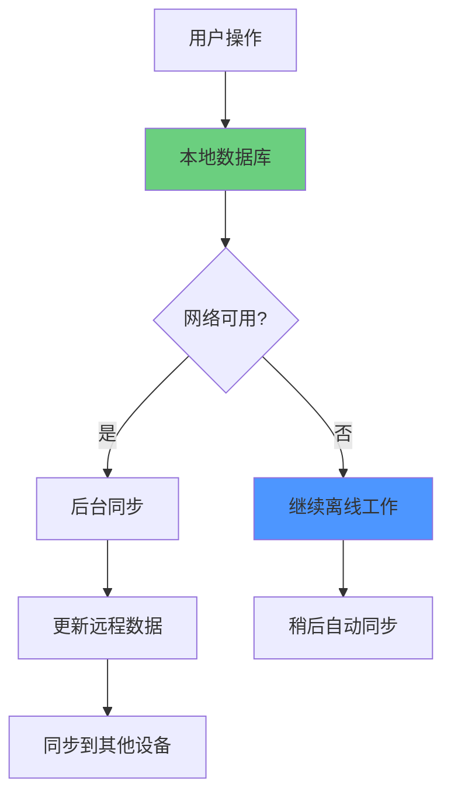

### 2. **开发者体验优先**

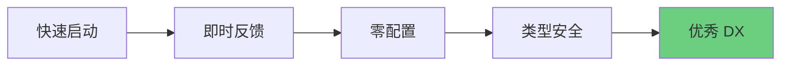

**核心优势：**
- ✅ 从 `npx create-expo-app` 到应用商店的最快路径
- ✅ 内置 TypeScript 支持和自动补全
- ✅ 快速刷新（Fast Refresh）保持状态
- ✅ 统一的跨平台开发体验

### 3. **渐进式增强**

```typescript
// 1. 开始时使用托管工作流
npx create-expo-app my-app

// 2. 需要时添加原生代码
npx expo prebuild

// 3. 完全控制原生项目
// 可以编辑 android/ 和 ios/ 目录
```

**灵活性层级：**

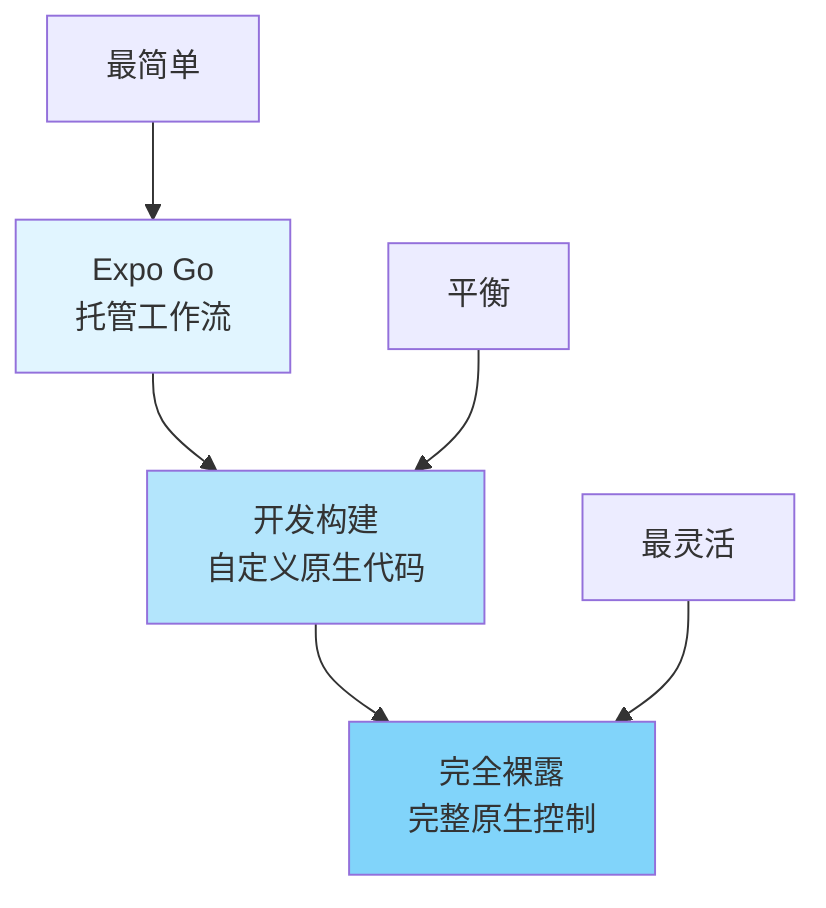

---

## 整体架构概览

Expo 架构可以分为以下几个核心层：

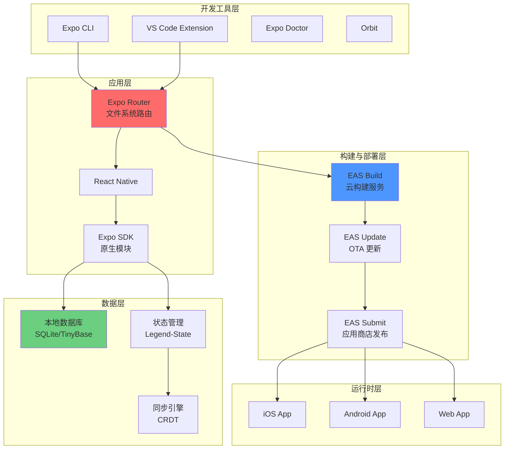

---

## 本地优先架构

### 核心哲学

本地优先软件将设备数据访问置于网络依赖之上。

#### 用户体验优势

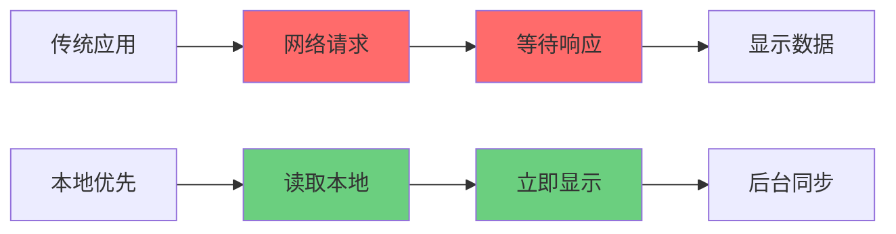

**关键优势：**

| 特性 | 传统应用 | 本地优先应用 |
|------|---------|-------------|
| **响应速度** | 依赖网络延迟 | 即时响应 |
| **离线能力** | ❌ 无法使用 | ✅ 完全可用 |
| **数据同步** | 实时依赖 | 后台异步 |
| **服务器故障** | ❌ 应用中断 | ✅ 继续工作 |
| **跨设备协作** | 需要网络 | 自动同步 |

#### 开发者体验优势

```typescript
// ❌ 传统方式：复杂的网络状态管理
function TraditionalApp() {
  const [data, setData] = useState(null);
  const [loading, setLoading] = useState(true);
  const [error, setError] = useState(null);
  
  useEffect(() => {
    fetch('/api/data')
      .then(res => res.json())
      .then(setData)
      .catch(setError)
      .finally(() => setLoading(false));
  }, []);

  if (loading) return <Loading />;
  if (error) return <Error error={error} />;
  return <DataView data={data} />;
}

// ✅ 本地优先：简化的状态管理
function LocalFirstApp() {
  const data = useLocalDatabase('data');  // 直接读取本地
  
  return <DataView data={data} />;  // 无需 loading/error 状态
}
```

**简化的状态管理：**
- ✅ 无需处理加载状态
- ✅ 无需处理错误状态
- ✅ 无需网络重试逻辑
- ✅ 专注于业务逻辑

### 实现挑战

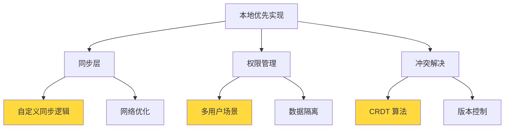

**主要挑战：**
1. **生态系统不成熟** - 工具链仍在发展中
2. **自定义同步层** - 需要实现复杂的同步逻辑
3. **权限管理** - 多用户场景复杂
4. **冲突解决** - 需要处理数据冲突

### 推荐工具栈

Expo 支持多种本地优先解决方案：

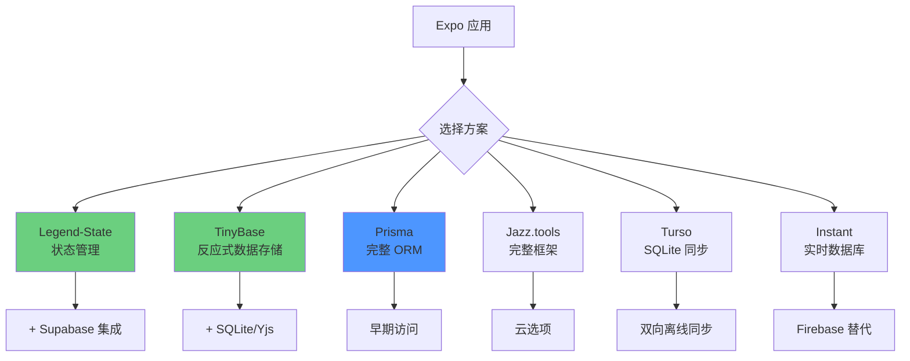

#### 工具对比

| 工具 | 类型 | 特点 | 适用场景 |
|------|------|------|---------|
| **Legend-State** | 状态管理 | Supabase 集成 | 简单状态 + 云同步 |
| **TinyBase** | 数据存储 | SQLite/Yjs 支持 | 复杂本地数据 |
| **Prisma** | ORM | 类型安全 | 传统数据库模式 |
| **Jazz.tools** | 完整框架 | 端到端解决方案 | 新项目快速启动 |
| **Turso** | SQLite | 双向同步 | SQLite 优先 |
| **Instant** | 实时数据库 | 类 Firebase | 实时协作 |

#### 示例：使用 Legend-State

```typescript
import { observable } from '@legendapp/state';
import { synced } from '@legendapp/state/sync';

// 定义本地优先的可观察状态
const todos$ = observable(
  synced({
    // 本地持久化
    persist: {
      name: 'todos',
      plugin: persistPluginSQLite
    },
    // 远程同步
    sync: {
      get: () => fetch('/api/todos').then(r => r.json()),
      set: (value) => fetch('/api/todos', {
        method: 'POST',
        body: JSON.stringify(value)
      })
    }
  })
);

// 使用
function TodoList() {
  const todos = todos$.get();  // 立即从本地获取
  
  const addTodo = (text: string) => {
    todos$.push({ id: Date.now(), text, done: false });
    // 自动同步到远程
  };
  
  return (
    <FlatList
      data={todos}
      renderItem={({ item }) => <TodoItem item={item} />}
    />
  );
}
```

---

## 开发工具生态

Expo 提供了完整的开发工具链：

### 1. Expo CLI

核心开发工具，自动随 `expo` 包安装。

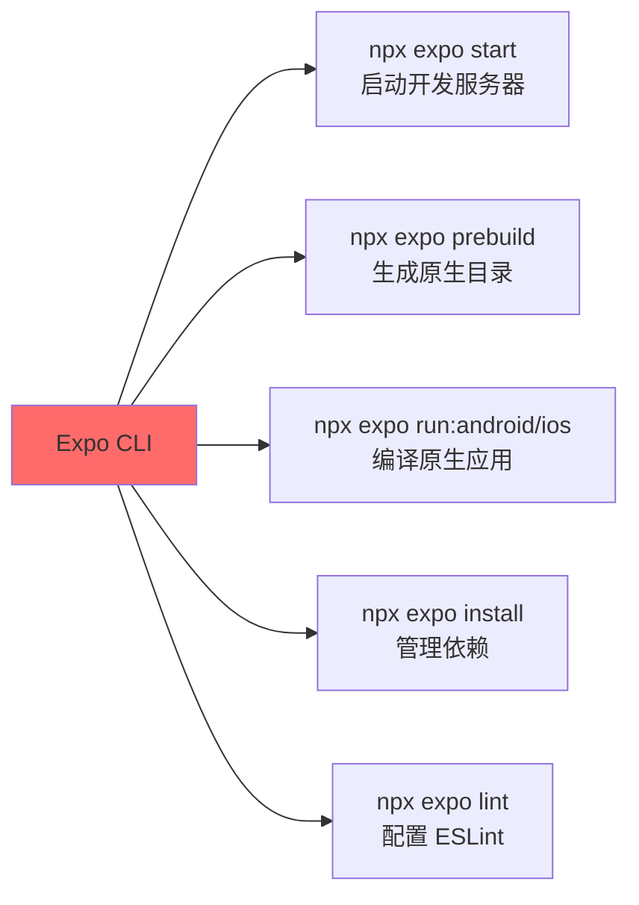

**关键命令：**

```bash
# 启动开发服务器
npx expo start

# 生成原生项目
npx expo prebuild

# 在设备上运行
npx expo run:android
npx expo run:ios

# 智能依赖管理
npx expo install react-native-reanimated

# 代码检查
npx expo lint
```

### 2. EAS CLI

**Expo Application Services** 的命令行工具：

```bash
# 全局安装
npm install -g eas-cli

# 登录
eas login

# 配置项目
eas build:configure

# 创建构建
eas build --platform all

# 发布更新
eas update

# 提交到应用商店
eas submit
```

**功能矩阵：**

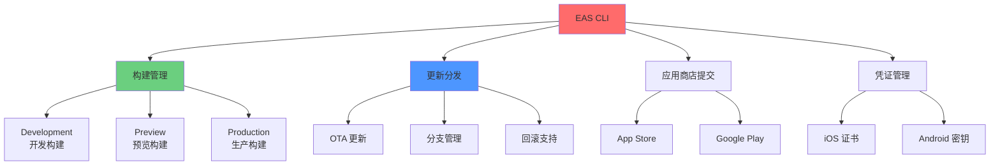

### 3. Expo Doctor

项目诊断工具，检测常见问题：

```bash
npx expo-doctor
```

**检查项目：**
- ✅ 应用配置验证
- ✅ 依赖版本兼容性
- ✅ 项目健康状况
- ✅ 提供修复建议

**输出示例：**

```
✓ Checking project configuration
✓ Checking package.json for common issues
✓ Checking native directories
✓ Checking dependencies

⚠ Found 2 issues:
  - expo-updates is outdated (47.0.0 -> 48.0.0)
  - react-native version mismatch

Run 'npx expo install --fix' to resolve.
```

### 4. Orbit

桌面应用（macOS/Windows），管理构建和模拟器：

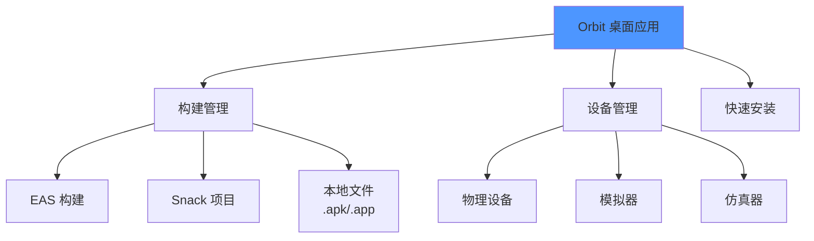

**功能：**
- 一键安装构建到设备
- 管理多个模拟器/仿真器
- 快速启动 EAS 构建
- 拖放 .apk/.app 文件安装

### 5. VS Code 扩展

**Expo Tools** 提供智能开发体验：

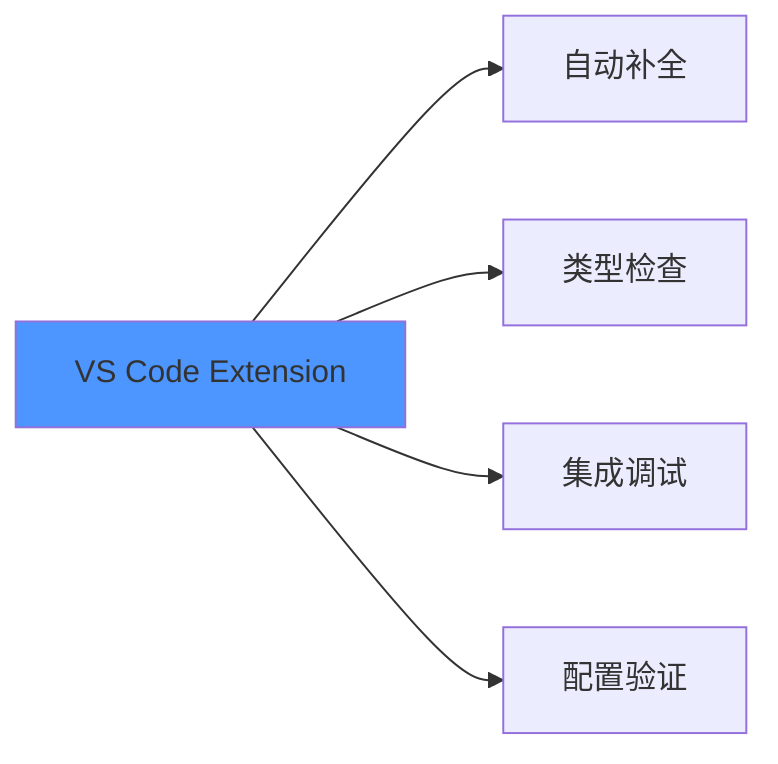

**功能：**
- ✅ app.json/app.config 自动补全
- ✅ 配置文件 IntelliSense
- ✅ 集成调试器
- ✅ 实时错误检测

### 6. 测试环境

**Snack - 浏览器沙盒：**

```
https://snack.expo.dev
```

- 无需本地安装
- 即时预览
- 快速原型验证
- 分享代码片段

**Expo Go - 移动应用：**

```bash
# iOS
下载 Expo Go from App Store

# Android
下载 Expo Go from Google Play
```

- 快速测试
- 扫码加载应用
- 无需构建
- 适合初期开发

---

## 文件系统路由

Expo Router 基于 React Navigation 构建，采用文件系统路由设计。

### 核心架构

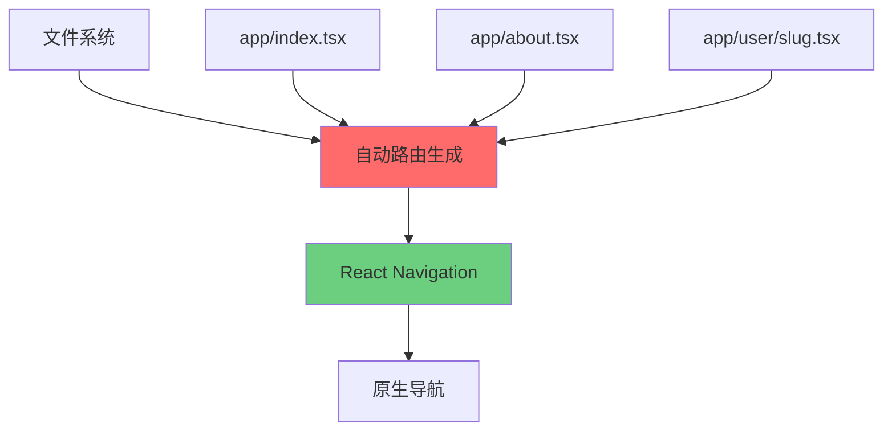

### 六大核心支柱

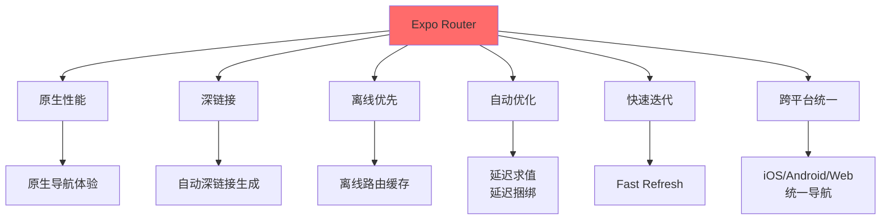

### 路由约定

```typescript
// 文件结构 -> URL 映射
app/
├── index.tsx           // /
├── about.tsx           // /about
├── blog/
│   ├── index.tsx      // /blog
│   └── [id].tsx       // /blog/:id
├── (tabs)/
│   ├── home.tsx       // /home (Tab 1)
│   └── profile.tsx    // /profile (Tab 2)
└── _layout.tsx        // 根布局

```

**路由示例：**

```typescript
// app/blog/[id].tsx - 动态路由
import { useLocalSearchParams } from 'expo-router';

export default function BlogPost() {
  const { id } = useLocalSearchParams();
  
  return (
    <View>
      <Text>博客文章 ID: {id}</Text>
    </View>
  );
}

// 访问 /blog/123 时，id = "123"
```

### 导航 API

```typescript
import { router } from 'expo-router';

// 编程式导航
function NavigationExample() {
  return (
    <>
      {/* 声明式导航 */}
      <Link href="/about">
        <Text>关于我们</Text>
      </Link>

      {/* 编程式导航 */}
      <Button 
        title="前往博客"
        onPress={() => router.push('/blog/123')}
      />

      {/* 带参数导航 */}
      <Button
        title="搜索"
        onPress={() => router.push({
          pathname: '/search',
          params: { q: 'expo' }
        })}
      />

      {/* 返回 */}
      <Button 
        title="返回"
        onPress={() => router.back()}
      />
    </>
  );
}
```

### 布局系统

```typescript
// app/_layout.tsx - 根布局
import { Stack } from 'expo-router';

export default function RootLayout() {
  return (
    <Stack
      screenOptions={{
        headerStyle: { backgroundColor: '#007AFF' },
        headerTintColor: '#fff'
      }}
    >
      <Stack.Screen name="index" options={{ title: '首页' }} />
      <Stack.Screen name="about" options={{ title: '关于' }} />
    </Stack>
  );
}
```

### 性能优化

**生产环境优化：**


- ✅ 延迟求值（Lazy Evaluation）
- ✅ 延迟捆绑（Deferred Bundling）
- ✅ 自动代码分割
- ✅ 路由预加载

**开发环境优化：**
- ✅ Fast Refresh 保持导航状态
- ✅ 即时路由更新
- ✅ 自动深链接测试

### 跨平台能力

```typescript
// platform-specific.tsx
import { Platform } from 'react-native';

export default function PlatformScreen() {
  return (
    <View>
      {Platform.select({
        ios: <IOSComponent />,
        android: <AndroidComponent />,
        web: <WebComponent />
      })}
    </View>
  );
}
```

**统一导航结构：**
- ✅ iOS/Android/Web 共享路由
- ✅ 平台特定 UI 组件
- ✅ 平台特定 API 调用
- ✅ SEO 自动优化（Web）

---

## 构建与更新系统

EAS (Expo Application Services) 是托管的构建和更新平台。

### EAS Build 架构

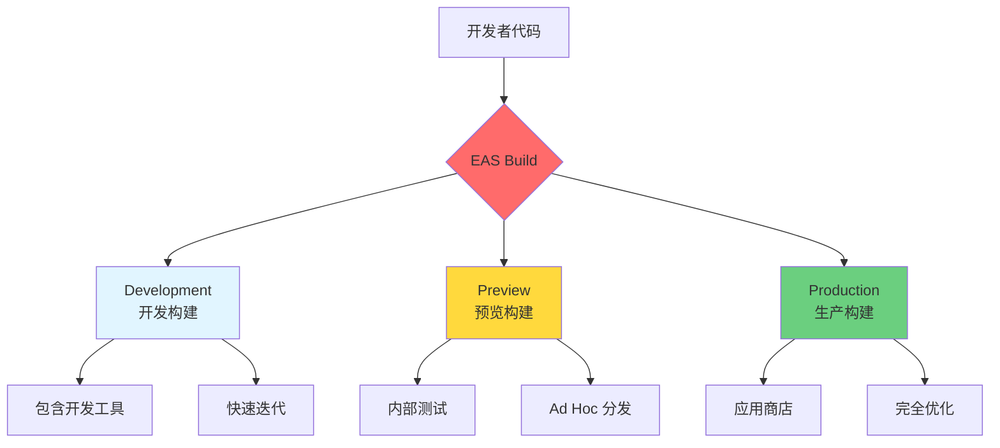

### 构建类型对比

| 构建类型 | 用途 | 特点 | 分发方式 |
|---------|------|------|---------|
| **Development** | 日常开发 | • 包含调试工具<br/>• 支持快速刷新<br/>• 开发服务器连接 | 内部团队 |
| **Preview** | 内部测试 | • 接近生产配置<br/>• 内部分发<br/>• QA 测试 | Ad Hoc/企业 |
| **Production** | 发布上线 | • 完全优化<br/>• 代码签名<br/>• 混淆压缩 | App Store/Google Play |

### 构建流程

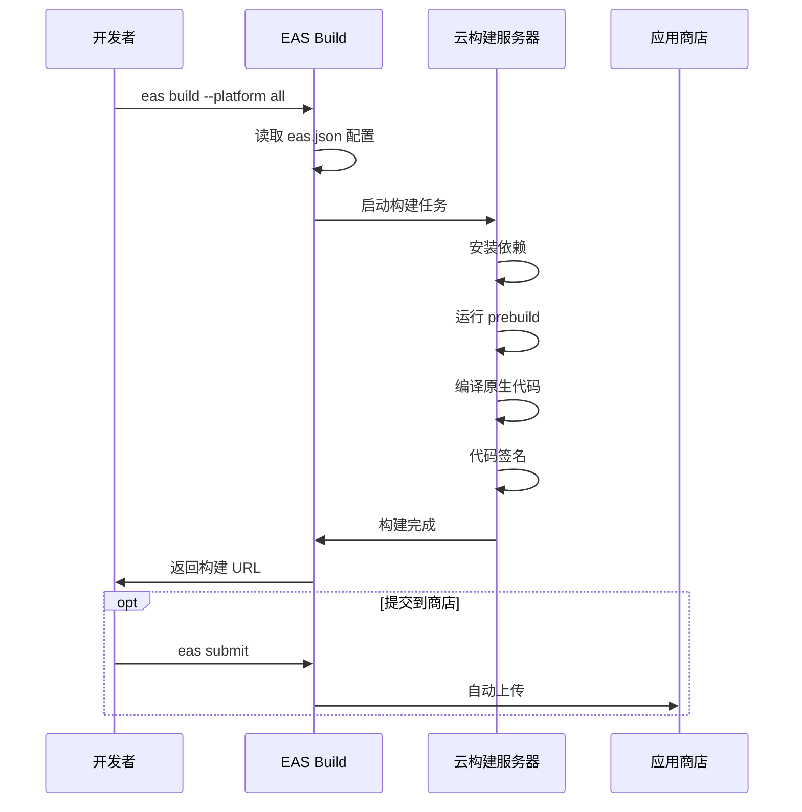

### EAS 配置

```json
// eas.json
{
  "build": {
    "development": {
      "developmentClient": true,
      "distribution": "internal"
    },
    "preview": {
      "distribution": "internal",
      "android": {
        "buildType": "apk"
      }
    },
    "production": {
      "autoIncrement": true
    }
  },
  "submit": {
    "production": {
      "ios": {
        "appleId": "your@email.com",
        "ascAppId": "1234567890"
      },
      "android": {
        "serviceAccountKeyPath": "./google-service-account.json",
        "track": "internal"
      }
    }
  }
}
```

### 凭证管理

EAS 自动管理复杂的凭证流程：

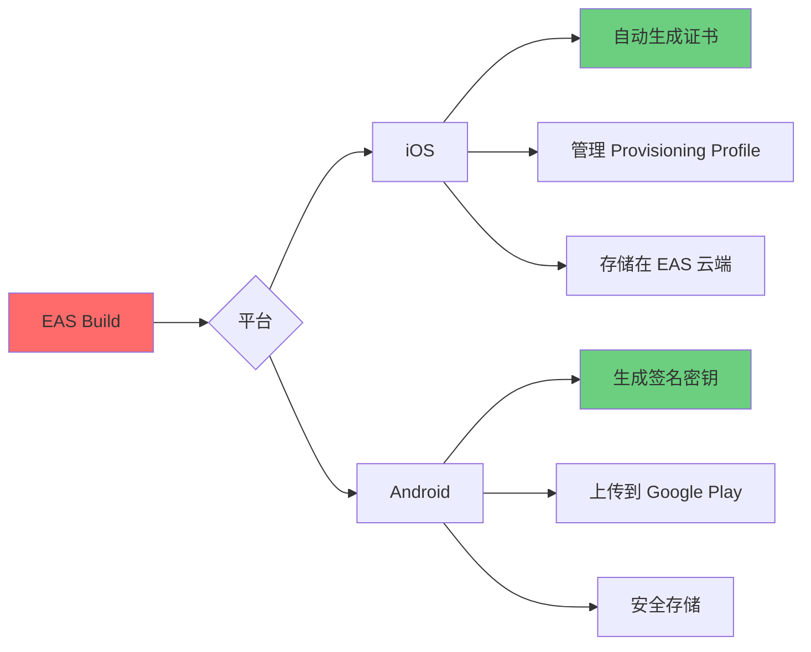

**优势：**
- ✅ 无需手动管理证书
- ✅ 团队成员共享凭证
- ✅ 自动续期和更新
- ✅ 安全的云端存储

### EAS Update - OTA 更新

即时更新 JavaScript 代码，无需应用商店审核：

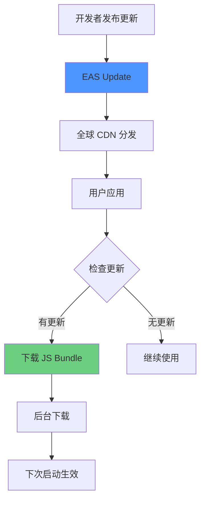

**发布更新：**

```bash
# 发布更新到生产分支
eas update --branch production --message "修复登录问题"

# 发布到特定渠道
eas update --channel preview --message "测试新功能"

# 查看更新
eas update:list
```

**应用内集成：**

```typescript
import * as Updates from 'expo-updates';

export function useAutoUpdate() {
  useEffect(() => {
    async function checkForUpdate() {
      try {
        const update = await Updates.checkForUpdateAsync();
        
        if (update.isAvailable) {
          await Updates.fetchUpdateAsync();
          // 提示用户重启应用
          Alert.alert(
            '更新可用',
            '应用将重新加载以应用更新',
            [{ text: '确定', onPress: () => Updates.reloadAsync() }]
          );
        }
      } catch (error) {
        console.error('检查更新失败', error);
      }
    }

    checkForUpdate();
  }, []);
}
```

### 构建优化

**本地构建：**

```bash
# 使用 Continuous Native Generation
npx expo prebuild --clean

# 本地运行构建
npx expo run:ios --configuration Release
npx expo run:android --variant release
```

**自定义基础设施：**

```yaml
# 使用自定义 CI/CD
- name: EAS Build
  run: |
    eas build --platform all --non-interactive
  env:
    EXPO_TOKEN: ${{ secrets.EXPO_TOKEN }}
```

---

## 开发与生产工作流

### 开发工作流

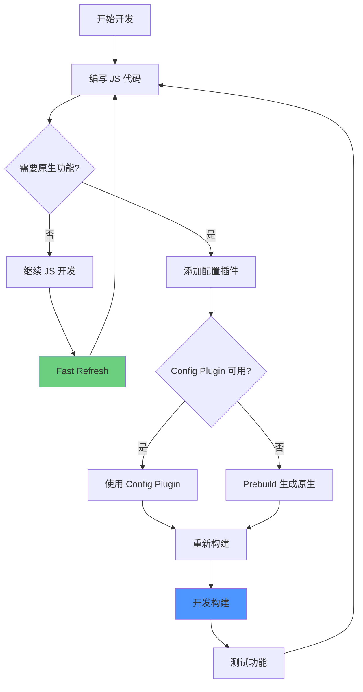

#### 1. JavaScript 开发

**即时反馈循环：**

```typescript
// 修改代码
export default function HomeScreen() {
  return (
    <View>
      <Text>Hello Expo!</Text>  {/* 修改这里 */}
    </View>
  );
}

// Fast Refresh 自动更新，保持状态
// 无需重新加载应用
```

**特性：**
- ✅ 毫秒级热更新
- ✅ 保持组件状态
- ✅ 错误恢复
- ✅ 跨平台同步

#### 2. 配置更新

```json
// app.json - 更新应用配置
{
  "expo": {
    "name": "My App",
    "icon": "./assets/icon.png",
    "splash": {
      "image": "./assets/splash.png",
      "backgroundColor": "#ffffff"
    },
    "ios": {
      "bundleIdentifier": "com.example.app"
    },
    "android": {
      "package": "com.example.app"
    }
  }
}
```

**自动应用：**
- 运行 `npx expo prebuild --clean` 重新生成原生项目
- 配置立即生效

#### 3. 原生代码工作

**使用 Config Plugins：**

```json
// app.json
{
  "expo": {
    "plugins": [
      "expo-camera",  // 自动配置摄像头权限
      [
        "expo-build-properties",
        {
          "android": {
            "compileSdkVersion": 34
          },
          "ios": {
            "deploymentTarget": "13.0"
          }
        }
      ]
    ]
  }
}
```

**手动编辑原生代码：**

```bash
# 生成原生目录
npx expo prebuild

# 现在可以编辑
# ios/YourApp/...
# android/app/src/...
```

#### 4. 库安装

```bash
# Expo 智能安装 - 自动选择兼容版本
npx expo install react-native-reanimated

# 如果需要原生配置
# 1. 使用 Config Plugin (推荐)
npx expo install expo-camera

# 2. 或手动更新原生项目
npx expo prebuild --clean
```

### 生产工作流

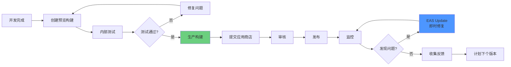

#### 1. 测试阶段

**创建预览构建：**

```bash
# 构建预览版本
eas build --profile preview --platform all

# 分发给测试人员
# iOS: Ad Hoc/TestFlight
# Android: 内部测试轨道
```

**本地构建测试：**

```bash
# iOS
npx expo run:ios --configuration Release

# Android
npx expo run:android --variant release
```

#### 2. 发布阶段

**使用 EAS Submit：**

```bash
# 自动提交到应用商店
eas submit --platform ios
eas submit --platform android

# 或手动上传本地构建
eas submit --platform ios --path ./build.ipa
```

**配置提交：**

```json
// eas.json
{
  "submit": {
    "production": {
      "ios": {
        "appleId": "your@email.com",
        "ascAppId": "1234567890",
        "appleTeamId": "TEAM_ID"
      },
      "android": {
        "serviceAccountKeyPath": "./google-key.json",
        "track": "production",
        "releaseStatus": "completed"
      }
    }
  }
}
```

#### 3. 监控阶段

**集成监控服务：**

```typescript
// 使用 Sentry 监控崩溃
import * as Sentry from 'sentry-expo';

Sentry.init({
  dsn: 'YOUR_DSN',
  enableInExpoDevelopment: false,
  debug: __DEV__
});

// 使用 Analytics
import { Analytics } from 'expo-firebase-analytics';

await Analytics.logEvent('screen_view', {
  screen_name: 'Home',
  screen_class: 'HomeScreen'
});
```

#### 4. 更新阶段

**即时修复：**

```bash
# 发布修复更新
eas update --branch production --message "修复关键 bug"

# 用户下次打开应用时自动更新
```

---

## 配置系统

### 配置文件类型

Expo 支持三种配置格式：

```mermaid
graph TB
    A[项目根目录] --> B[app.json<br/>静态 JSON]
    A --> C[app.config.js<br/>动态 JavaScript]
    A --> D[app.config.ts<br/>动态 TypeScript]
    
    B --> B1[CLI 可自动更新]
    C --> C1[需手动更新]
    D --> D1[类型安全]
    
    style D fill:#6bcf7f
```

### 最小配置

```json
// app.json
{
  "expo": {
    "name": "My App",
    "slug": "my-app"
  }
}
```

### 完整配置示例

```typescript
// app.config.ts
import { ExpoConfig, ConfigContext } from 'expo/config';

export default ({ config }: ConfigContext): ExpoConfig => ({
  ...config,
  name: process.env.APP_NAME || 'My App',
  slug: 'my-app',
  version: '1.0.0',
  orientation: 'portrait',
  icon: './assets/icon.png',
  userInterfaceStyle: 'automatic',
  
  splash: {
    image: './assets/splash.png',
    resizeMode: 'contain',
    backgroundColor: '#ffffff'
  },
  
  updates: {
    fallbackToCacheTimeout: 0,
    url: 'https://u.expo.dev/your-project-id'
  },
  
  assetBundlePatterns: [
    '**/*'
  ],
  
  ios: {
    supportsTablet: true,
    bundleIdentifier: 'com.example.app',
    buildNumber: '1'
  },
  
  android: {
    adaptiveIcon: {
      foregroundImage: './assets/adaptive-icon.png',
      backgroundColor: '#ffffff'
    },
    package: 'com.example.app',
    versionCode: 1
  },
  
  web: {
    favicon: './assets/favicon.png',
    bundler: 'metro'
  },
  
  plugins: [
    'expo-router',
    'expo-font',
    [
      'expo-build-properties',
      {
        ios: {
          deploymentTarget: '13.0'
        },
        android: {
          compileSdkVersion: 34,
          targetSdkVersion: 34,
          buildToolsVersion: '34.0.0'
        }
      }
    ]
  ],
  
  extra: {
    apiUrl: process.env.API_URL,
    analyticsKey: process.env.ANALYTICS_KEY,
    eas: {
      projectId: 'your-project-id'
    }
  }
});
```

### 环境配置

**使用环境变量：**

```typescript
// app.config.ts
export default ({ config }: ConfigContext): ExpoConfig => {
  const isProduction = process.env.APP_ENV === 'production';
  
  return {
    ...config,
    name: isProduction ? 'My App' : 'My App (Dev)',
    slug: 'my-app',
    extra: {
      apiUrl: isProduction 
        ? 'https://api.production.com'
        : 'https://api.staging.com'
    }
  };
};
```

**运行时访问：**

```typescript
import Constants from 'expo-constants';

// 访问配置
const apiUrl = Constants.expoConfig?.extra?.apiUrl;

// 访问平台信息
const platform = Constants.platform;
```

### Config Plugins

自动配置原生代码：

```json
{
  "plugins": [
    // 简单插件
    "expo-camera",
    
    // 带参数的插件
    [
      "expo-notifications",
      {
        "icon": "./assets/notification-icon.png",
        "color": "#ffffff"
      }
    ],
    
    // 自定义插件
    "./plugins/custom-plugin.js"
  ]
}
```

**创建自定义插件：**

```javascript
// plugins/custom-plugin.js
const { withAndroidManifest } = require('@expo/config-plugins');

module.exports = function withCustomPlugin(config) {
  return withAndroidManifest(config, async (config) => {
    // 修改 AndroidManifest.xml
    const androidManifest = config.modResults;
    
    // 添加自定义配置
    androidManifest.manifest.application[0].$['android:usesCleartextTraffic'] = 'true';
    
    return config;
  });
};
```

---

## 架构优势总结

### 性能优化

```mermaid
graph TB
    A[Expo 性能优化] --> B[编译时]
    A --> C[运行时]
    A --> D[网络]
    
    B --> B1[Metro 打包器]
    B --> B2[Hermes 引擎]
    B --> B3[原生模块优化]
    
    C --> C1[Fast Refresh]
    C --> C2[图片优化]
    C --> C3[字体优化]
    
    D --> D1[EAS Update CDN]
    D --> D2[资源预加载]
    D --> D3[离线缓存]
    
    style B1 fill:#ff6b6b
    style C1 fill:#6bcf7f
    style D1 fill:#4d96ff
```

### 开发体验

| 特性 | 传统 React Native | Expo | 提升 |
|------|------------------|------|------|
| **项目启动** | 手动配置原生 | 一键创建 | 10x 更快 |
| **添加库** | 手动链接原生 | 自动配置 | 5x 更快 |
| **构建** | 本地环境配置 | 云端构建 | 无需本地配置 |
| **更新** | 重新发布应用 | OTA 更新 | 即时生效 |
| **调试** | 复杂配置 | 内置工具 | 开箱即用 |

### 跨平台能力

```typescript
// 一份代码，三个平台
// iOS + Android + Web

export default function App() {
  return (
    <View>
      <Text>在所有平台运行</Text>
    </View>
  );
}

// 平台特定代码
import { Platform } from 'react-native';

const styles = StyleSheet.create({
  container: {
    paddingTop: Platform.select({
      ios: 20,
      android: 25,
      web: 0
    })
  }
});
```

---

## 最佳实践

### 1. 项目结构

```
my-expo-app/
├── app/                    # Expo Router 路由
│   ├── (tabs)/            # Tab 导航
│   │   ├── _layout.tsx
│   │   ├── index.tsx
│   │   └── profile.tsx
│   ├── modal.tsx          # 模态页面
│   └── _layout.tsx        # 根布局
├── components/            # 可复用组件
│   ├── Button.tsx
│   └── Card.tsx
├── hooks/                 # 自定义 Hooks
│   └── useLocalFirst.ts
├── lib/                   # 工具库
│   ├── database.ts
│   └── api.ts
├── assets/               # 静态资源
│   ├── images/
│   └── fonts/
├── app.json              # Expo 配置
├── eas.json              # EAS 配置
└── package.json
```

### 2. 性能优化清单

**编译优化：**
- [ ] 启用 Hermes 引擎
- [ ] 使用生产构建测试
- [ ] 优化图片资源
- [ ] 移除未使用的库

**运行时优化：**
- [ ] 使用 React.memo 优化组件
- [ ] 实现虚拟列表
- [ ] 延迟加载大型组件
- [ ] 优化状态管理

**网络优化：**
- [ ] 实现离线缓存
- [ ] 使用本地优先架构
- [ ] 压缩网络请求
- [ ] 实现请求去重

### 3. 安全最佳实践

```typescript
// 敏感信息管理
import * as SecureStore from 'expo-secure-store';

// ✅ 使用安全存储
await SecureStore.setItemAsync('userToken', token);

// ❌ 不要使用 AsyncStorage 存储敏感信息
// await AsyncStorage.setItem('userToken', token);

// 环境变量
// ✅ 使用 app.config.ts 和环境变量
const config = {
  extra: {
    apiKey: process.env.API_KEY  // 不会提交到代码库
  }
};

// ❌ 不要硬编码密钥
// const API_KEY = 'sk_live_123456789';
```

### 4. 测试策略

```typescript
// Jest + React Native Testing Library
import { render, fireEvent } from '@testing-library/react-native';

describe('Button', () => {
  it('应该响应点击', () => {
    const onPress = jest.fn();
    const { getByText } = render(
      <Button onPress={onPress}>点击我</Button>
    );
    
    fireEvent.press(getByText('点击我'));
    expect(onPress).toHaveBeenCalled();
  });
});
```

---

## 参考资源

### 官方文档
- [Expo 官方文档](https://docs.expo.dev/)
- [Expo Router 文档](https://docs.expo.dev/router/introduction/)
- [EAS 文档](https://docs.expo.dev/eas/)
- [本地优先指南](https://docs.expo.dev/guides/local-first/)

### 工具和服务
- [Expo CLI](https://docs.expo.dev/more/expo-cli/)
- [EAS Build](https://docs.expo.dev/build/introduction/)
- [EAS Update](https://docs.expo.dev/eas-update/introduction/)
- [Expo Snack](https://snack.expo.dev/)

### 社区资源
- [Expo GitHub](https://github.com/expo/expo)
- [Expo Forums](https://forums.expo.dev/)
- [Expo Discord](https://chat.expo.dev/)

---

:::tip{title="架构设计建议"}
Expo 的架构设计围绕**简化开发流程**和**提升用户体验**展开。采用本地优先架构可以显著改善应用性能和离线能力，而完善的工具链让开发者能够专注于业务逻辑而非基础设施。
:::

