# Expo 组件完全指南：从基础到高级的实战教程

Expo SDK 提供了丰富的原生组件和 API，让开发者无需编写原生代码即可访问设备功能。本文将详细介绍 Expo 的核心组件，从基础使用到高级技巧，帮助你构建功能完善的移动应用。

## 目录

1. [Expo SDK 概览](#expo-sdk-概览)
2. [媒体组件](#媒体组件)
3. [传感器与设备](#传感器与设备)
4. [网络与数据](#网络与数据)
5. [用户交互](#用户交互)
6. [系统集成](#系统集成)
7. [实战案例](#实战案例)

---

## Expo SDK 概览

### 组件分类

```mermaid
graph TB
    A[Expo SDK] --> B[媒体组件]
    A --> C[传感器与设备]
    A --> D[网络与数据]
    A --> E[用户交互]
    A --> F[系统集成]
    
    B --> B1[Camera 相机]
    B --> B2[ImagePicker 图片选择]
    B --> B3[Audio 音频]
    B --> B4[Video 视频]
    
    C --> C1[Location 位置]
    C --> C2[Sensors 传感器]
    C --> C3[Battery 电池]
    C --> C4[Device 设备信息]
    
    D --> D1[FileSystem 文件系统]
    D --> D2[SecureStore 安全存储]
    D --> D3[SQLite 数据库]
    D --> D4[Network 网络]
    
    E --> E1[Notifications 通知]
    E --> E2[Haptics 触觉反馈]
    E --> E3[Clipboard 剪贴板]
    E --> E4[Share 分享]
    
    F --> F1[Updates 更新]
    F --> F2[Linking 深度链接]
    F --> F3[WebBrowser 浏览器]
    F --> F4[Contacts 通讯录]
    
    style A fill:#ff6b6b
    style B fill:#6bcf7f
    style C fill:#4d96ff
    style D fill:#ffd93d
```



### 安装与配置

```bash
# 创建新项目
npx create-expo-app my-app

# 安装 Expo SDK 组件
npx expo install expo-camera expo-image-picker expo-location

# 自动管理兼容版本
npx expo install expo-av
```

---

## 媒体组件

### 1. Camera - 相机组件

相机是移动应用最常用的功能之一。

#### 基础使用

```typescript
import { CameraView, CameraType, useCameraPermissions } from 'expo-camera';
import { useState } from 'react';
import { Button, StyleSheet, Text, TouchableOpacity, View } from 'react-native';

export default function CameraScreen() {
  const [facing, setFacing] = useState<CameraType>('back');
  const [permission, requestPermission] = useCameraPermissions();

  if (!permission) {
    // 权限加载中
    return <View />;
  }

  if (!permission.granted) {
    // 请求权限
    return (
      <View style={styles.container}>
        <Text style={styles.message}>需要相机权限</Text>
        <Button onPress={requestPermission} title="授予权限" />
      </View>
    );
  }

  function toggleCameraFacing() {
    setFacing(current => (current === 'back' ? 'front' : 'back'));
  }

  return (
    <View style={styles.container}>
      <CameraView style={styles.camera} facing={facing}>
        <View style={styles.buttonContainer}>
          <TouchableOpacity style={styles.button} onPress={toggleCameraFacing}>
            <Text style={styles.text}>翻转相机</Text>
          </TouchableOpacity>
        </View>
      </CameraView>
    </View>
  );
}

const styles = StyleSheet.create({
  container: {
    flex: 1,
    justifyContent: 'center',
  },
  message: {
    textAlign: 'center',
    paddingBottom: 10,
  },
  camera: {
    flex: 1,
  },
  buttonContainer: {
    flex: 1,
    flexDirection: 'row',
    backgroundColor: 'transparent',
    margin: 64,
  },
  button: {
    flex: 1,
    alignSelf: 'flex-end',
    alignItems: 'center',
  },
  text: {
    fontSize: 24,
    fontWeight: 'bold',
    color: 'white',
  },
});
```

#### 拍照功能

```typescript
import { CameraView } from 'expo-camera';
import { useRef, useState } from 'react';

export function CameraWithCapture() {
  const cameraRef = useRef<CameraView>(null);
  const [photo, setPhoto] = useState<string | null>(null);

  const takePicture = async () => {
    if (cameraRef.current) {
      const photo = await cameraRef.current.takePictureAsync({
        quality: 0.8,
        base64: false,
        exif: false,
      });
      
      if (photo) {
        setPhoto(photo.uri);
        console.log('照片已保存:', photo.uri);
      }
    }
  };

  return (
    <View style={{ flex: 1 }}>
      {!photo ? (
        <>
          <CameraView ref={cameraRef} style={{ flex: 1 }} />
          <TouchableOpacity onPress={takePicture}>
            <Text>拍照</Text>
          </TouchableOpacity>
        </>
      ) : (
        <>
          <Image source={{ uri: photo }} style={{ flex: 1 }} />
          <Button title="重新拍摄" onPress={() => setPhoto(null)} />
        </>
      )}
    </View>
  );
}
```

#### 录像功能

```typescript
export function CameraWithVideo() {
  const cameraRef = useRef<CameraView>(null);
  const [recording, setRecording] = useState(false);

  const startRecording = async () => {
    if (cameraRef.current) {
      setRecording(true);
      const video = await cameraRef.current.recordAsync({
        maxDuration: 60,  // 最长 60 秒
        quality: '720p',
      });
      
      setRecording(false);
      console.log('视频已保存:', video.uri);
    }
  };

  const stopRecording = () => {
    if (cameraRef.current && recording) {
      cameraRef.current.stopRecording();
    }
  };

  return (
    <View style={{ flex: 1 }}>
      <CameraView ref={cameraRef} style={{ flex: 1 }} mode="video" />
      <Button
        title={recording ? '停止录像' : '开始录像'}
        onPress={recording ? stopRecording : startRecording}
      />
    </View>
  );
}
```

### 2. ImagePicker - 图片选择器

从相册选择图片或拍照。

#### 基础使用

```typescript
import * as ImagePicker from 'expo-image-picker';
import { useState } from 'react';

export function ImagePickerExample() {
  const [image, setImage] = useState<string | null>(null);

  const pickImage = async () => {
    // 请求权限
    const { status } = await ImagePicker.requestMediaLibraryPermissionsAsync();
    
    if (status !== 'granted') {
      alert('需要访问相册的权限！');
      return;
    }

    // 选择图片
    const result = await ImagePicker.launchImageLibraryAsync({
      mediaTypes: ImagePicker.MediaTypeOptions.Images,
      allowsEditing: true,
      aspect: [4, 3],
      quality: 0.8,
    });

    if (!result.canceled) {
      setImage(result.assets[0].uri);
    }
  };

  const takePhoto = async () => {
    // 请求相机权限
    const { status } = await ImagePicker.requestCameraPermissionsAsync();
    
    if (status !== 'granted') {
      alert('需要访问相机的权限！');
      return;
    }

    // 拍照
    const result = await ImagePicker.launchCameraAsync({
      allowsEditing: true,
      aspect: [1, 1],
      quality: 1,
    });

    if (!result.canceled) {
      setImage(result.assets[0].uri);
    }
  };

  return (
    <View style={{ flex: 1, alignItems: 'center', justifyContent: 'center' }}>
      <Button title="从相册选择" onPress={pickImage} />
      <Button title="拍照" onPress={takePhoto} />
      
      {image && (
        <Image 
          source={{ uri: image }} 
          style={{ width: 200, height: 200, marginTop: 20 }} 
        />
      )}
    </View>
  );
}
```

#### 多图选择

```typescript
export function MultipleImagePicker() {
  const [images, setImages] = useState<string[]>([]);

  const pickMultipleImages = async () => {
    const result = await ImagePicker.launchImageLibraryAsync({
      mediaTypes: ImagePicker.MediaTypeOptions.Images,
      allowsMultipleSelection: true,  // 允许多选
      selectionLimit: 5,               // 最多选择 5 张
      quality: 0.8,
    });

    if (!result.canceled) {
      const uris = result.assets.map(asset => asset.uri);
      setImages(uris);
    }
  };

  return (
    <View>
      <Button title="选择多张图片" onPress={pickMultipleImages} />
      <ScrollView horizontal>
        {images.map((uri, index) => (
          <Image 
            key={index}
            source={{ uri }} 
            style={{ width: 100, height: 100, margin: 5 }} 
          />
        ))}
      </ScrollView>
    </View>
  );
}
```

#### 视频选择

```typescript
export function VideoPickerExample() {
  const pickVideo = async () => {
    const result = await ImagePicker.launchImageLibraryAsync({
      mediaTypes: ImagePicker.MediaTypeOptions.Videos,
      allowsEditing: true,
      videoMaxDuration: 30,  // 最长 30 秒
      videoQuality: 1,
    });

    if (!result.canceled) {
      const videoUri = result.assets[0].uri;
      console.log('视频 URI:', videoUri);
      console.log('视频时长:', result.assets[0].duration);
    }
  };

  return <Button title="选择视频" onPress={pickVideo} />;
}
```

### 3. Audio - 音频播放与录制

#### 音频播放

```typescript
import { Audio } from 'expo-av';
import { useEffect, useState } from 'react';

export function AudioPlayer({ audioUrl }: { audioUrl: string }) {
  const [sound, setSound] = useState<Audio.Sound | null>(null);
  const [isPlaying, setIsPlaying] = useState(false);

  async function loadAndPlaySound() {
    console.log('加载音频');
    const { sound } = await Audio.Sound.createAsync(
      { uri: audioUrl },
      { shouldPlay: true }
    );
    setSound(sound);
    setIsPlaying(true);

    // 监听播放完成
    sound.setOnPlaybackStatusUpdate((status) => {
      if (status.isLoaded && status.didJustFinish) {
        setIsPlaying(false);
      }
    });
  }

  async function pauseSound() {
    if (sound) {
      await sound.pauseAsync();
      setIsPlaying(false);
    }
  }

  async function resumeSound() {
    if (sound) {
      await sound.playAsync();
      setIsPlaying(true);
    }
  }

  useEffect(() => {
    return () => {
      // 清理
      if (sound) {
        sound.unloadAsync();
      }
    };
  }, [sound]);

  return (
    <View>
      {!sound ? (
        <Button title="播放音频" onPress={loadAndPlaySound} />
      ) : (
        <Button
          title={isPlaying ? '暂停' : '继续'}
          onPress={isPlaying ? pauseSound : resumeSound}
        />
      )}
    </View>
  );
}
```

#### 音频录制

```typescript
export function AudioRecorder() {
  const [recording, setRecording] = useState<Audio.Recording | null>(null);
  const [recordingUri, setRecordingUri] = useState<string | null>(null);

  async function startRecording() {
    try {
      // 请求权限
      const { status } = await Audio.requestPermissionsAsync();
      if (status !== 'granted') {
        alert('需要麦克风权限！');
        return;
      }

      // 设置音频模式
      await Audio.setAudioModeAsync({
        allowsRecordingIOS: true,
        playsInSilentModeIOS: true,
      });

      // 开始录制
      const { recording } = await Audio.Recording.createAsync(
        Audio.RecordingOptionsPresets.HIGH_QUALITY
      );
      setRecording(recording);
    } catch (err) {
      console.error('录制失败', err);
    }
  }

  async function stopRecording() {
    if (!recording) return;

    await recording.stopAndUnloadAsync();
    const uri = recording.getURI();
    setRecordingUri(uri);
    setRecording(null);
    
    console.log('录音已保存:', uri);
  }

  return (
    <View>
      <Button
        title={recording ? '停止录音' : '开始录音'}
        onPress={recording ? stopRecording : startRecording}
      />
      
      {recordingUri && (
        <AudioPlayer audioUrl={recordingUri} />
      )}
    </View>
  );
}
```

### 4. Video - 视频播放

```typescript
import { Video, ResizeMode } from 'expo-av';
import { useRef, useState } from 'react';

export function VideoPlayer({ videoUrl }: { videoUrl: string }) {
  const video = useRef<Video>(null);
  const [status, setStatus] = useState({});

  return (
    <View style={{ flex: 1 }}>
      <Video
        ref={video}
        source={{ uri: videoUrl }}
        style={{ width: '100%', height: 300 }}
        useNativeControls
        resizeMode={ResizeMode.CONTAIN}
        isLooping
        onPlaybackStatusUpdate={status => setStatus(() => status)}
      />
      
      <View style={{ marginTop: 20 }}>
        <Button
          title={status.isPlaying ? '暂停' : '播放'}
          onPress={() =>
            status.isPlaying
              ? video.current.pauseAsync()
              : video.current.playAsync()
          }
        />
      </View>
    </View>
  );
}
```

---

## 传感器与设备

### 1. Location - 位置服务

#### 获取当前位置

```typescript
import * as Location from 'expo-location';
import { useState, useEffect } from 'react';

export function LocationExample() {
  const [location, setLocation] = useState<Location.LocationObject | null>(null);
  const [errorMsg, setErrorMsg] = useState<string | null>(null);

  useEffect(() => {
    (async () => {
      // 请求前台位置权限
      let { status } = await Location.requestForegroundPermissionsAsync();
      if (status !== 'granted') {
        setErrorMsg('位置权限被拒绝');
        return;
      }

      // 获取当前位置
      let location = await Location.getCurrentPositionAsync({
        accuracy: Location.Accuracy.High,
      });
      setLocation(location);
    })();
  }, []);

  if (errorMsg) {
    return <Text>{errorMsg}</Text>;
  }

  if (!location) {
    return <Text>获取位置中...</Text>;
  }

  return (
    <View>
      <Text>纬度: {location.coords.latitude}</Text>
      <Text>经度: {location.coords.longitude}</Text>
      <Text>海拔: {location.coords.altitude}m</Text>
      <Text>精度: {location.coords.accuracy}m</Text>
      <Text>速度: {location.coords.speed}m/s</Text>
    </View>
  );
}
```

#### 位置追踪

```typescript
export function LocationTracking() {
  const [subscription, setSubscription] = useState<Location.LocationSubscription | null>(null);

  const startTracking = async () => {
    // 请求后台位置权限（用于持续追踪）
    const { status } = await Location.requestBackgroundPermissionsAsync();
    if (status !== 'granted') {
      alert('需要后台位置权限');
      return;
    }

    // 开始追踪
    const sub = await Location.watchPositionAsync(
      {
        accuracy: Location.Accuracy.High,
        timeInterval: 5000,      // 每 5 秒更新
        distanceInterval: 10,    // 或移动 10 米更新
      },
      (location) => {
        console.log('新位置:', location.coords);
      }
    );

    setSubscription(sub);
  };

  const stopTracking = () => {
    if (subscription) {
      subscription.remove();
      setSubscription(null);
    }
  };

  return (
    <View>
      <Button
        title={subscription ? '停止追踪' : '开始追踪'}
        onPress={subscription ? stopTracking : startTracking}
      />
    </View>
  );
}
```

#### 地理编码

```typescript
export function GeocodeExample() {
  const [address, setAddress] = useState('');

  const geocodeAddress = async () => {
    // 地址 -> 坐标
    const result = await Location.geocodeAsync('北京市天安门广场');
    
    if (result.length > 0) {
      console.log('坐标:', result[0]);
    }
  };

  const reverseGeocode = async (lat: number, lon: number) => {
    // 坐标 -> 地址
    const result = await Location.reverseGeocodeAsync({
      latitude: lat,
      longitude: lon,
    });

    if (result.length > 0) {
      const addr = result[0];
      setAddress(`${addr.city}, ${addr.street}, ${addr.name}`);
    }
  };

  return (
    <View>
      <Button title="地址编码" onPress={geocodeAddress} />
      <Button 
        title="反向编码" 
        onPress={() => reverseGeocode(39.9042, 116.4074)} 
      />
      {address && <Text>地址: {address}</Text>}
    </View>
  );
}
```

### 2. Sensors - 传感器

#### 加速度计

```typescript
import { Accelerometer } from 'expo-sensors';

export function AccelerometerExample() {
  const [data, setData] = useState({ x: 0, y: 0, z: 0 });
  const [subscription, setSubscription] = useState(null);

  const subscribe = () => {
    // 设置更新间隔（毫秒）
    Accelerometer.setUpdateInterval(100);

    const sub = Accelerometer.addListener(accelerometerData => {
      setData(accelerometerData);
    });

    setSubscription(sub);
  };

  const unsubscribe = () => {
    subscription && subscription.remove();
    setSubscription(null);
  };

  return (
    <View>
      <Text>X: {data.x.toFixed(2)}</Text>
      <Text>Y: {data.y.toFixed(2)}</Text>
      <Text>Z: {data.z.toFixed(2)}</Text>
      
      <Button
        title={subscription ? '停止' : '开始'}
        onPress={subscription ? unsubscribe : subscribe}
      />
    </View>
  );
}
```

#### 陀螺仪

```typescript
import { Gyroscope } from 'expo-sensors';

export function GyroscopeExample() {
  const [data, setData] = useState({ x: 0, y: 0, z: 0 });

  useEffect(() => {
    Gyroscope.setUpdateInterval(100);
    
    const subscription = Gyroscope.addListener(gyroscopeData => {
      setData(gyroscopeData);
    });

    return () => subscription.remove();
  }, []);

  return (
    <View>
      <Text>旋转速率</Text>
      <Text>X 轴: {data.x.toFixed(2)} rad/s</Text>
      <Text>Y 轴: {data.y.toFixed(2)} rad/s</Text>
      <Text>Z 轴: {data.z.toFixed(2)} rad/s</Text>
    </View>
  );
}
```

#### 磁力计（指南针）

```typescript
import { Magnetometer } from 'expo-sensors';

export function CompassExample() {
  const [data, setData] = useState({ x: 0, y: 0, z: 0 });
  const [heading, setHeading] = useState(0);

  useEffect(() => {
    const subscription = Magnetometer.addListener(result => {
      setData(result);
      
      // 计算方位角
      const angle = Math.atan2(result.y, result.x) * (180 / Math.PI);
      setHeading(angle >= 0 ? angle : angle + 360);
    });

    return () => subscription.remove();
  }, []);

  const getDirection = (angle: number) => {
    if (angle >= 337.5 || angle < 22.5) return '北';
    if (angle >= 22.5 && angle < 67.5) return '东北';
    if (angle >= 67.5 && angle < 112.5) return '东';
    if (angle >= 112.5 && angle < 157.5) return '东南';
    if (angle >= 157.5 && angle < 202.5) return '南';
    if (angle >= 202.5 && angle < 247.5) return '西南';
    if (angle >= 247.5 && angle < 292.5) return '西';
    return '西北';
  };

  return (
    <View style={{ alignItems: 'center' }}>
      <Text style={{ fontSize: 48 }}>{heading.toFixed(0)}°</Text>
      <Text style={{ fontSize: 24 }}>{getDirection(heading)}</Text>
    </View>
  );
}
```

### 3. Battery - 电池信息

```typescript
import * as Battery from 'expo-battery';

export function BatteryStatus() {
  const [batteryLevel, setBatteryLevel] = useState<number | null>(null);
  const [batteryState, setBatteryState] = useState<Battery.BatteryState | null>(null);

  useEffect(() => {
    // 获取电池电量
    Battery.getBatteryLevelAsync().then(setBatteryLevel);
    
    // 获取电池状态
    Battery.getBatteryStateAsync().then(setBatteryState);

    // 监听电量变化
    const subscription = Battery.addBatteryLevelListener(({ batteryLevel }) => {
      setBatteryLevel(batteryLevel);
    });

    return () => subscription.remove();
  }, []);

  const getStateText = (state: Battery.BatteryState | null) => {
    switch (state) {
      case Battery.BatteryState.CHARGING:
        return '充电中';
      case Battery.BatteryState.FULL:
        return '已充满';
      case Battery.BatteryState.UNPLUGGED:
        return '未插电';
      default:
        return '未知';
    }
  };

  return (
    <View>
      <Text>电量: {batteryLevel ? `${(batteryLevel * 100).toFixed(0)}%` : '获取中...'}</Text>
      <Text>状态: {getStateText(batteryState)}</Text>
    </View>
  );
}
```

### 4. Device - 设备信息

```typescript
import * as Device from 'expo-device';

export function DeviceInfo() {
  const [deviceInfo, setDeviceInfo] = useState<any>({});

  useEffect(() => {
    async function loadDeviceInfo() {
      const info = {
        brand: Device.brand,                    // 品牌 (Apple, Samsung)
        manufacturer: Device.manufacturer,      // 制造商
        modelName: Device.modelName,           // 型号名称 (iPhone 14 Pro)
        modelId: Device.modelId,               // 型号 ID
        deviceName: await Device.getDeviceNameAsync(), // 设备名称
        osName: Device.osName,                 // 系统名称 (iOS, Android)
        osVersion: Device.osVersion,           // 系统版本
        platformApiLevel: Device.platformApiLevel, // Android API 等级
        totalMemory: Device.totalMemory,       // 总内存
        supportedCpuArchitectures: Device.supportedCpuArchitectures, // CPU 架构
      };
      setDeviceInfo(info);
    }

    loadDeviceInfo();
  }, []);

  return (
    <ScrollView>
      <Text>品牌: {deviceInfo.brand}</Text>
      <Text>型号: {deviceInfo.modelName}</Text>
      <Text>设备名称: {deviceInfo.deviceName}</Text>
      <Text>系统: {deviceInfo.osName} {deviceInfo.osVersion}</Text>
      <Text>总内存: {(deviceInfo.totalMemory / 1024 / 1024 / 1024).toFixed(2)} GB</Text>
      <Text>CPU 架构: {deviceInfo.supportedCpuArchitectures?.join(', ')}</Text>
    </ScrollView>
  );
}
```

---

## 网络与数据

### 1. FileSystem - 文件系统

#### 文件读写

```typescript
import * as FileSystem from 'expo-file-system';

export function FileSystemExample() {
  const fileUri = FileSystem.documentDirectory + 'test.txt';

  // 写入文件
  const writeFile = async () => {
    await FileSystem.writeAsStringAsync(
      fileUri,
      '这是文件内容',
      { encoding: FileSystem.EncodingType.UTF8 }
    );
    console.log('文件已写入');
  };

  // 读取文件
  const readFile = async () => {
    const content = await FileSystem.readAsStringAsync(fileUri);
    console.log('文件内容:', content);
  };

  // 检查文件是否存在
  const checkFile = async () => {
    const info = await FileSystem.getInfoAsync(fileUri);
    console.log('文件存在:', info.exists);
    console.log('文件大小:', info.size, 'bytes');
  };

  // 删除文件
  const deleteFile = async () => {
    await FileSystem.deleteAsync(fileUri);
    console.log('文件已删除');
  };

  return (
    <View>
      <Button title="写入文件" onPress={writeFile} />
      <Button title="读取文件" onPress={readFile} />
      <Button title="检查文件" onPress={checkFile} />
      <Button title="删除文件" onPress={deleteFile} />
    </View>
  );
}
```

#### 下载文件

```typescript
export function FileDownloader() {
  const [downloadProgress, setDownloadProgress] = useState(0);

  const downloadFile = async (url: string) => {
    const fileUri = FileSystem.documentDirectory + 'downloaded-file.pdf';

    const downloadResumable = FileSystem.createDownloadResumable(
      url,
      fileUri,
      {},
      (downloadProgress) => {
        const progress = downloadProgress.totalBytesWritten / 
                        downloadProgress.totalBytesExpectedToWrite;
        setDownloadProgress(progress * 100);
      }
    );

    try {
      const result = await downloadResumable.downloadAsync();
      console.log('下载完成:', result.uri);
    } catch (e) {
      console.error('下载失败:', e);
    }
  };

  return (
    <View>
      <Button 
        title="下载文件" 
        onPress={() => downloadFile('https://example.com/file.pdf')} 
      />
      <Text>下载进度: {downloadProgress.toFixed(0)}%</Text>
    </View>
  );
}
```

#### 上传文件

```typescript
export async function uploadFile(uri: string, uploadUrl: string) {
  const uploadResult = await FileSystem.uploadAsync(
    uploadUrl,
    uri,
    {
      httpMethod: 'POST',
      uploadType: FileSystem.FileSystemUploadType.MULTIPART,
      fieldName: 'file',
      headers: {
        'Authorization': 'Bearer token',
      },
    }
  );

  console.log('上传响应:', uploadResult.body);
}
```

#### 目录操作

```typescript
export function DirectoryOperations() {
  const dirUri = FileSystem.documentDirectory + 'myFolder/';

  const createDirectory = async () => {
    await FileSystem.makeDirectoryAsync(dirUri, {
      intermediates: true  // 创建中间目录
    });
  };

  const listDirectory = async () => {
    const files = await FileSystem.readDirectoryAsync(
      FileSystem.documentDirectory
    );
    console.log('目录内容:', files);
  };

  const copyFile = async () => {
    await FileSystem.copyAsync({
      from: FileSystem.documentDirectory + 'source.txt',
      to: dirUri + 'destination.txt'
    });
  };

  const moveFile = async () => {
    await FileSystem.moveAsync({
      from: FileSystem.documentDirectory + 'old.txt',
      to: dirUri + 'new.txt'
    });
  };

  return (
    <View>
      <Button title="创建目录" onPress={createDirectory} />
      <Button title="列出文件" onPress={listDirectory} />
      <Button title="复制文件" onPress={copyFile} />
      <Button title="移动文件" onPress={moveFile} />
    </View>
  );
}
```

### 2. SecureStore - 安全存储

用于存储敏感信息（如令牌、密码）。

```typescript
import * as SecureStore from 'expo-secure-store';

export function SecureStoreExample() {
  // 保存数据
  const saveToken = async (token: string) => {
    await SecureStore.setItemAsync('userToken', token);
  };

  // 读取数据
  const getToken = async () => {
    const token = await SecureStore.getItemAsync('userToken');
    return token;
  };

  // 删除数据
  const deleteToken = async () => {
    await SecureStore.deleteItemAsync('userToken');
  };

  return (
    <View>
      <Button 
        title="保存令牌" 
        onPress={() => saveToken('secret-token-123')} 
      />
      <Button 
        title="读取令牌" 
        onPress={async () => {
          const token = await getToken();
          Alert.alert('令牌', token || '未找到');
        }} 
      />
      <Button title="删除令牌" onPress={deleteToken} />
    </View>
  );
}
```

### 3. SQLite - 本地数据库

```typescript
import * as SQLite from 'expo-sqlite';

export function SQLiteExample() {
  const [db, setDb] = useState<SQLite.SQLiteDatabase | null>(null);
  const [users, setUsers] = useState<any[]>([]);

  useEffect(() => {
    // 打开数据库
    const database = SQLite.openDatabase('mydb.db');
    setDb(database);

    // 创建表
    database.transaction(tx => {
      tx.executeSql(
        'CREATE TABLE IF NOT EXISTS users (id INTEGER PRIMARY KEY AUTOINCREMENT, name TEXT, age INTEGER);'
      );
    });
  }, []);

  const addUser = () => {
    if (!db) return;

    db.transaction(tx => {
      tx.executeSql(
        'INSERT INTO users (name, age) VALUES (?, ?);',
        ['张三', 25],
        (_, result) => {
          console.log('插入成功, ID:', result.insertId);
          loadUsers();
        }
      );
    });
  };

  const loadUsers = () => {
    if (!db) return;

    db.transaction(tx => {
      tx.executeSql(
        'SELECT * FROM users;',
        [],
        (_, { rows }) => {
          setUsers(rows._array);
        }
      );
    });
  };

  const updateUser = (id: number, newName: string) => {
    if (!db) return;

    db.transaction(tx => {
      tx.executeSql(
        'UPDATE users SET name = ? WHERE id = ?;',
        [newName, id],
        () => {
          console.log('更新成功');
          loadUsers();
        }
      );
    });
  };

  const deleteUser = (id: number) => {
    if (!db) return;

    db.transaction(tx => {
      tx.executeSql(
        'DELETE FROM users WHERE id = ?;',
        [id],
        () => {
          console.log('删除成功');
          loadUsers();
        }
      );
    });
  };

  return (
    <View>
      <Button title="添加用户" onPress={addUser} />
      <Button title="加载用户" onPress={loadUsers} />
      
      <FlatList
        data={users}
        keyExtractor={(item) => item.id.toString()}
        renderItem={({ item }) => (
          <View style={{ flexDirection: 'row', padding: 10 }}>
            <Text>{item.name} - {item.age}岁</Text>
            <Button 
              title="删除" 
              onPress={() => deleteUser(item.id)} 
            />
          </View>
        )}
      />
    </View>
  );
}
```

### 4. Network - 网络状态

```typescript
import * as Network from 'expo-network';

export function NetworkExample() {
  const [networkState, setNetworkState] = useState<any>({});

  useEffect(() => {
    async function getNetworkInfo() {
      // 获取网络状态
      const state = await Network.getNetworkStateAsync();
      
      // 获取 IP 地址
      const ip = await Network.getIpAddressAsync();

      setNetworkState({
        ...state,
        ipAddress: ip,
      });
    }

    getNetworkInfo();
  }, []);

  return (
    <View>
      <Text>网络类型: {networkState.type}</Text>
      <Text>已连接: {networkState.isConnected ? '是' : '否'}</Text>
      <Text>互联网可达: {networkState.isInternetReachable ? '是' : '否'}</Text>
      <Text>IP 地址: {networkState.ipAddress}</Text>
    </View>
  );
}
```

---

## 用户交互

### 1. Notifications - 推送通知

#### 本地通知

```typescript
import * as Notifications from 'expo-notifications';
import { useState, useEffect, useRef } from 'react';

// 配置通知处理行为
Notifications.setNotificationHandler({
  handleNotification: async () => ({
    shouldShowAlert: true,
    shouldPlaySound: true,
    shouldSetBadge: true,
  }),
});

export function NotificationsExample() {
  const [expoPushToken, setExpoPushToken] = useState('');
  const notificationListener = useRef();
  const responseListener = useRef();

  useEffect(() => {
    // 注册推送令牌
    registerForPushNotificationsAsync().then(token => setExpoPushToken(token));

    // 监听通知接收
    notificationListener.current = Notifications.addNotificationReceivedListener(notification => {
      console.log('收到通知:', notification);
    });

    // 监听通知点击
    responseListener.current = Notifications.addNotificationResponseReceivedListener(response => {
      console.log('通知被点击:', response);
    });

    return () => {
      Notifications.removeNotificationSubscription(notificationListener.current);
      Notifications.removeNotificationSubscription(responseListener.current);
    };
  }, []);

  // 发送本地通知
  async function scheduleNotification() {
    await Notifications.scheduleNotificationAsync({
      content: {
        title: '提醒标题',
        body: '这是通知内容',
        data: { data: 'custom data' },
        sound: true,
      },
      trigger: {
        seconds: 5,  // 5 秒后触发
      },
    });
  }

  // 立即发送通知
  async function sendNotificationNow() {
    await Notifications.scheduleNotificationAsync({
      content: {
        title: '即时通知',
        body: '马上显示',
      },
      trigger: null,  // 立即触发
    });
  }

  // 每天定时通知
  async function scheduleDailyNotification() {
    await Notifications.scheduleNotificationAsync({
      content: {
        title: '每日提醒',
        body: '该做某事了',
      },
      trigger: {
        hour: 9,      // 每天 9:00
        minute: 0,
        repeats: true,
      },
    });
  }

  // 取消所有通知
  async function cancelAllNotifications() {
    await Notifications.cancelAllScheduledNotificationsAsync();
  }

  return (
    <View>
      <Text>Push Token: {expoPushToken}</Text>
      <Button title="5秒后通知" onPress={scheduleNotification} />
      <Button title="立即通知" onPress={sendNotificationNow} />
      <Button title="每日 9:00 通知" onPress={scheduleDailyNotification} />
      <Button title="取消所有通知" onPress={cancelAllNotifications} />
    </View>
  );
}

// 注册推送令牌
async function registerForPushNotificationsAsync() {
  let token;

  const { status: existingStatus } = await Notifications.getPermissionsAsync();
  let finalStatus = existingStatus;

  if (existingStatus !== 'granted') {
    const { status } = await Notifications.requestPermissionsAsync();
    finalStatus = status;
  }

  if (finalStatus !== 'granted') {
    alert('需要通知权限！');
    return;
  }

  token = (await Notifications.getExpoPushTokenAsync()).data;
  console.log('Push Token:', token);

  return token;
}
```

### 2. Haptics - 触觉反馈

```typescript
import * as Haptics from 'expo-haptics';

export function HapticsExample() {
  return (
    <View>
      <Button
        title="轻量反馈"
        onPress={() => Haptics.impactAsync(Haptics.ImpactFeedbackStyle.Light)}
      />
      <Button
        title="中等反馈"
        onPress={() => Haptics.impactAsync(Haptics.ImpactFeedbackStyle.Medium)}
      />
      <Button
        title="重度反馈"
        onPress={() => Haptics.impactAsync(Haptics.ImpactFeedbackStyle.Heavy)}
      />
      <Button
        title="成功通知"
        onPress={() => Haptics.notificationAsync(
          Haptics.NotificationFeedbackType.Success
        )}
      />
      <Button
        title="警告通知"
        onPress={() => Haptics.notificationAsync(
          Haptics.NotificationFeedbackType.Warning
        )}
      />
      <Button
        title="错误通知"
        onPress={() => Haptics.notificationAsync(
          Haptics.NotificationFeedbackType.Error
        )}
      />
      <Button
        title="选择反馈"
        onPress={() => Haptics.selectionAsync()}
      />
    </View>
  );
}
```

### 3. Clipboard - 剪贴板

```typescript
import * as Clipboard from 'expo-clipboard';

export function ClipboardExample() {
  const [copiedText, setCopiedText] = useState('');

  const copyToClipboard = async () => {
    await Clipboard.setStringAsync('要复制的文本');
    Alert.alert('已复制到剪贴板');
  };

  const fetchCopiedText = async () => {
    const text = await Clipboard.getStringAsync();
    setCopiedText(text);
  };

  return (
    <View>
      <Button title="复制文本" onPress={copyToClipboard} />
      <Button title="粘贴" onPress={fetchCopiedText} />
      <Text>剪贴板内容: {copiedText}</Text>
    </View>
  );
}
```

### 4. Share - 分享

```typescript
import { Share } from 'react-native';

export function ShareExample() {
  const shareText = async () => {
    try {
      const result = await Share.share({
        message: '分享的文本内容',
      });

      if (result.action === Share.sharedAction) {
        if (result.activityType) {
          console.log('通过以下方式分享:', result.activityType);
        } else {
          console.log('分享成功');
        }
      } else if (result.action === Share.dismissedAction) {
        console.log('取消分享');
      }
    } catch (error) {
      alert(error.message);
    }
  };

  const shareUrl = async () => {
    await Share.share({
      message: '查看这个链接',
      url: 'https://expo.dev',
      title: 'Expo 官网',
    });
  };

  return (
    <View>
      <Button title="分享文本" onPress={shareText} />
      <Button title="分享链接" onPress={shareUrl} />
    </View>
  );
}
```

---

## 系统集成

### 1. Linking - 深度链接

#### 打开外部链接

```typescript
import * as Linking from 'expo-linking';

export function LinkingExample() {
  const openWebsite = async () => {
    const url = 'https://expo.dev';
    const supported = await Linking.canOpenURL(url);

    if (supported) {
      await Linking.openURL(url);
    } else {
      Alert.alert('无法打开链接');
    }
  };

  const openEmail = async () => {
    await Linking.openURL('mailto:support@expo.dev');
  };

  const makePhoneCall = async () => {
    await Linking.openURL('tel:+1234567890');
  };

  const openMaps = async () => {
    const url = 'https://maps.google.com/?q=37.7749,-122.4194';
    await Linking.openURL(url);
  };

  return (
    <View>
      <Button title="打开网站" onPress={openWebsite} />
      <Button title="发送邮件" onPress={openEmail} />
      <Button title="拨打电话" onPress={makePhoneCall} />
      <Button title="打开地图" onPress={openMaps} />
    </View>
  );
}
```

#### 处理深度链接

```typescript
export function DeepLinkExample() {
  const [data, setData] = useState<string | null>(null);

  useEffect(() => {
    // 处理应用已打开时的链接
    const subscription = Linking.addEventListener('url', ({ url }) => {
      console.log('收到深度链接:', url);
      handleDeepLink(url);
    });

    // 处理应用未打开时的链接
    Linking.getInitialURL().then((url) => {
      if (url) {
        handleDeepLink(url);
      }
    });

    return () => subscription.remove();
  }, []);

  const handleDeepLink = (url: string) => {
    // 解析 URL: myapp://profile/123
    const { path, queryParams } = Linking.parse(url);
    setData(`Path: ${path}, Params: ${JSON.stringify(queryParams)}`);
  };

  return (
    <View>
      <Text>深度链接数据: {data}</Text>
    </View>
  );
}
```

### 2. WebBrowser - 浏览器

```typescript
import * as WebBrowser from 'expo-web-browser';

export function WebBrowserExample() {
  const openBrowser = async () => {
    const result = await WebBrowser.openBrowserAsync(
      'https://expo.dev',
      {
        toolbarColor: '#007AFF',
        controlsColor: '#ffffff',
        showTitle: true,
      }
    );

    console.log('浏览器关闭:', result.type);
  };

  return (
    <Button title="打开浏览器" onPress={openBrowser} />
  );
}
```

### 3. Contacts - 通讯录

```typescript
import * as Contacts from 'expo-contacts';

export function ContactsExample() {
  const [contacts, setContacts] = useState<Contacts.Contact[]>([]);

  const loadContacts = async () => {
    const { status } = await Contacts.requestPermissionsAsync();
    
    if (status === 'granted') {
      const { data } = await Contacts.getContactsAsync({
        fields: [
          Contacts.Fields.PhoneNumbers,
          Contacts.Fields.Emails,
        ],
      });

      setContacts(data);
    }
  };

  const addContact = async () => {
    const contact: Contacts.Contact = {
      firstName: '张',
      lastName: '三',
      phoneNumbers: [{
        label: 'mobile',
        number: '1234567890',
      }],
      emails: [{
        label: 'work',
        email: 'zhangsan@example.com',
      }],
    };

    await Contacts.addContactAsync(contact);
    Alert.alert('联系人已添加');
  };

  return (
    <View>
      <Button title="加载通讯录" onPress={loadContacts} />
      <Button title="添加联系人" onPress={addContact} />
      
      <FlatList
        data={contacts}
        keyExtractor={(item) => item.id}
        renderItem={({ item }) => (
          <View style={{ padding: 10 }}>
            <Text>{item.firstName} {item.lastName}</Text>
            <Text>
              {item.phoneNumbers?.[0]?.number}
            </Text>
          </View>
        )}
      />
    </View>
  );
}
```

### 4. Calendar - 日历

```typescript
import * as Calendar from 'expo-calendar';

export function CalendarExample() {
  const [calendars, setCalendars] = useState<Calendar.Calendar[]>([]);

  const loadCalendars = async () => {
    const { status } = await Calendar.requestCalendarPermissionsAsync();
    
    if (status === 'granted') {
      const calendars = await Calendar.getCalendarsAsync();
      setCalendars(calendars);
    }
  };

  const createEvent = async () => {
    const { status } = await Calendar.requestCalendarPermissionsAsync();
    
    if (status !== 'granted') {
      Alert.alert('需要日历权限');
      return;
    }

    // 获取默认日历 ID
    const defaultCalendar = calendars.find(cal => cal.allowsModifications);
    
    if (!defaultCalendar) {
      Alert.alert('未找到可写日历');
      return;
    }

    // 创建事件
    const eventId = await Calendar.createEventAsync(defaultCalendar.id, {
      title: '会议',
      startDate: new Date(),
      endDate: new Date(Date.now() + 3600000),  // 1 小时后
      location: '会议室',
      notes: '重要会议',
      alarms: [{
        relativeOffset: -30,  // 提前 30 分钟提醒
        method: Calendar.AlarmMethod.ALERT,
      }],
    });

    Alert.alert('事件已创建', `ID: ${eventId}`);
  };

  return (
    <View>
      <Button title="加载日历" onPress={loadCalendars} />
      <Button title="创建事件" onPress={createEvent} />
      
      <FlatList
        data={calendars}
        keyExtractor={(item) => item.id}
        renderItem={({ item }) => (
          <Text>{item.title} ({item.source.name})</Text>
        )}
      />
    </View>
  );
}
```

---

## 实战案例

### 案例 1: 完整的照片分享应用

```typescript
import { useState } from 'react';
import * as ImagePicker from 'expo-image-picker';
import * as FileSystem from 'expo-file-system';
import { Share } from 'react-native';

export function PhotoShareApp() {
  const [photos, setPhotos] = useState<string[]>([]);
  const [uploading, setUploading] = useState(false);

  // 选择照片
  const pickPhoto = async () => {
    const result = await ImagePicker.launchImageLibraryAsync({
      mediaTypes: ImagePicker.MediaTypeOptions.Images,
      allowsEditing: true,
      aspect: [1, 1],
      quality: 0.8,
    });

    if (!result.canceled) {
      setPhotos([...photos, result.assets[0].uri]);
    }
  };

  // 拍照
  const takePhoto = async () => {
    const { status } = await ImagePicker.requestCameraPermissionsAsync();
    
    if (status !== 'granted') {
      Alert.alert('需要相机权限');
      return;
    }

    const result = await ImagePicker.launchCameraAsync({
      allowsEditing: true,
      aspect: [1, 1],
      quality: 0.8,
    });

    if (!result.canceled) {
      setPhotos([...photos, result.assets[0].uri]);
    }
  };

  // 上传照片
  const uploadPhoto = async (uri: string) => {
    setUploading(true);

    try {
      const uploadResult = await FileSystem.uploadAsync(
        'https://api.example.com/upload',
        uri,
        {
          httpMethod: 'POST',
          uploadType: FileSystem.FileSystemUploadType.MULTIPART,
          fieldName: 'photo',
        }
      );

      Alert.alert('上传成功', uploadResult.body);
    } catch (error) {
      Alert.alert('上传失败', error.message);
    } finally {
      setUploading(false);
    }
  };

  // 分享照片
  const sharePhoto = async (uri: string) => {
    await Share.share({
      url: uri,
      message: '看看我拍的照片！',
    });
  };

  return (
    <View style={{ flex: 1 }}>
      <View style={{ flexDirection: 'row', padding: 10 }}>
        <Button title="选择照片" onPress={pickPhoto} />
        <Button title="拍照" onPress={takePhoto} />
      </View>

      <FlatList
        data={photos}
        numColumns={3}
        keyExtractor={(item, index) => index.toString()}
        renderItem={({ item }) => (
          <View style={{ flex: 1 / 3, padding: 2 }}>
            <Image 
              source={{ uri: item }} 
              style={{ width: '100%', aspectRatio: 1 }} 
            />
            <View style={{ flexDirection: 'row' }}>
              <Button 
                title="上传" 
                onPress={() => uploadPhoto(item)} 
              />
              <Button 
                title="分享" 
                onPress={() => sharePhoto(item)} 
              />
            </View>
          </View>
        )}
      />

      {uploading && <Text>上传中...</Text>}
    </View>
  );
}
```

### 案例 2: 位置追踪应用

```typescript
import * as Location from 'expo-location';
import * as TaskManager from 'expo-task-manager';
import * as Notifications from 'expo-notifications';

const LOCATION_TASK_NAME = 'background-location-task';

// 定义后台任务
TaskManager.defineTask(LOCATION_TASK_NAME, async ({ data, error }) => {
  if (error) {
    console.error(error);
    return;
  }
  
  if (data) {
    const { locations } = data as any;
    const location = locations[0];
    
    console.log('新位置:', location.coords);
    
    // 发送通知
    await Notifications.scheduleNotificationAsync({
      content: {
        title: '位置更新',
        body: `纬度: ${location.coords.latitude.toFixed(4)}, 经度: ${location.coords.longitude.toFixed(4)}`,
      },
      trigger: null,
    });
  }
});

export function LocationTrackerApp() {
  const [isTracking, setIsTracking] = useState(false);
  const [locations, setLocations] = useState<any[]>([]);

  useEffect(() => {
    // 检查是否已在追踪
    TaskManager.isTaskRegisteredAsync(LOCATION_TASK_NAME).then(isRegistered => {
      setIsTracking(isRegistered);
    });
  }, []);

  const startTracking = async () => {
    // 请求权限
    const { status: foregroundStatus } = 
      await Location.requestForegroundPermissionsAsync();
    
    if (foregroundStatus !== 'granted') {
      Alert.alert('需要位置权限');
      return;
    }

    const { status: backgroundStatus } = 
      await Location.requestBackgroundPermissionsAsync();
    
    if (backgroundStatus !== 'granted') {
      Alert.alert('需要后台位置权限以持续追踪');
      return;
    }

    // 启动后台位置追踪
    await Location.startLocationUpdatesAsync(LOCATION_TASK_NAME, {
      accuracy: Location.Accuracy.High,
      timeInterval: 10000,  // 每 10 秒
      distanceInterval: 50,  // 或移动 50 米
      foregroundService: {
        notificationTitle: '位置追踪中',
        notificationBody: '应用正在追踪您的位置',
      },
    });

    setIsTracking(true);
  };

  const stopTracking = async () => {
    await Location.stopLocationUpdatesAsync(LOCATION_TASK_NAME);
    setIsTracking(false);
  };

  return (
    <View style={{ flex: 1 }}>
      <Button
        title={isTracking ? '停止追踪' : '开始追踪'}
        onPress={isTracking ? stopTracking : startTracking}
      />

      <Text style={{ padding: 10, fontWeight: 'bold' }}>
        状态: {isTracking ? '追踪中' : '未追踪'}
      </Text>

      <FlatList
        data={locations}
        keyExtractor={(item, index) => index.toString()}
        renderItem={({ item }) => (
          <View style={{ padding: 10 }}>
            <Text>时间: {new Date(item.timestamp).toLocaleString()}</Text>
            <Text>纬度: {item.coords.latitude.toFixed(6)}</Text>
            <Text>经度: {item.coords.longitude.toFixed(6)}</Text>
            <Text>精度: {item.coords.accuracy.toFixed(2)}m</Text>
          </View>
        )}
      />
    </View>
  );
}
```

### 案例 3: 语音备忘录应用

```typescript
import { Audio } from 'expo-av';
import * as FileSystem from 'expo-file-system';
import AsyncStorage from '@react-native-async-storage/async-storage';

interface Recording {
  id: string;
  uri: string;
  duration: number;
  date: Date;
}

export function VoiceMemoApp() {
  const [recording, setRecording] = useState<Audio.Recording | null>(null);
  const [recordings, setRecordings] = useState<Recording[]>([]);
  const [playingId, setPlayingId] = useState<string | null>(null);

  useEffect(() => {
    loadRecordings();
  }, []);

  // 加载录音列表
  const loadRecordings = async () => {
    const saved = await AsyncStorage.getItem('recordings');
    if (saved) {
      setRecordings(JSON.parse(saved));
    }
  };

  // 保存录音列表
  const saveRecordings = async (recs: Recording[]) => {
    await AsyncStorage.setItem('recordings', JSON.stringify(recs));
  };

  // 开始录音
  const startRecording = async () => {
    try {
      const { status } = await Audio.requestPermissionsAsync();
      if (status !== 'granted') {
        Alert.alert('需要麦克风权限');
        return;
      }

      await Audio.setAudioModeAsync({
        allowsRecordingIOS: true,
        playsInSilentModeIOS: true,
      });

      const { recording } = await Audio.Recording.createAsync(
        Audio.RecordingOptionsPresets.HIGH_QUALITY
      );
      setRecording(recording);
    } catch (err) {
      console.error('录音失败', err);
    }
  };

  // 停止录音
  const stopRecording = async () => {
    if (!recording) return;

    await recording.stopAndUnloadAsync();
    const uri = recording.getURI();
    const status = await recording.getStatusAsync();

    const newRecording: Recording = {
      id: Date.now().toString(),
      uri: uri!,
      duration: status.durationMillis,
      date: new Date(),
    };

    const updated = [...recordings, newRecording];
    setRecordings(updated);
    saveRecordings(updated);
    setRecording(null);
  };

  // 播放录音
  const playRecording = async (rec: Recording) => {
    const { sound } = await Audio.Sound.createAsync(
      { uri: rec.uri },
      { shouldPlay: true }
    );

    setPlayingId(rec.id);

    sound.setOnPlaybackStatusUpdate((status) => {
      if (status.isLoaded && status.didJustFinish) {
        setPlayingId(null);
      }
    });
  };

  // 删除录音
  const deleteRecording = async (rec: Recording) => {
    await FileSystem.deleteAsync(rec.uri, { idempotent: true });
    const updated = recordings.filter(r => r.id !== rec.id);
    setRecordings(updated);
    saveRecordings(updated);
  };

  return (
    <View style={{ flex: 1, padding: 20 }}>
      <View style={{ marginBottom: 20 }}>
        <Button
          title={recording ? '停止录音' : '开始录音'}
          onPress={recording ? stopRecording : startRecording}
        />
      </View>

      <FlatList
        data={recordings}
        keyExtractor={(item) => item.id}
        renderItem={({ item }) => (
          <View style={{
            padding: 15,
            borderBottomWidth: 1,
            borderBottomColor: '#ddd'
          }}>
            <Text style={{ fontWeight: 'bold' }}>
              {new Date(item.date).toLocaleString()}
            </Text>
            <Text>
              时长: {(item.duration / 1000).toFixed(1)}秒
            </Text>
            <View style={{ flexDirection: 'row', marginTop: 10 }}>
              <Button
                title={playingId === item.id ? '播放中...' : '播放'}
                onPress={() => playRecording(item)}
                disabled={playingId === item.id}
              />
              <Button
                title="删除"
                onPress={() => deleteRecording(item)}
                color="red"
              />
            </View>
          </View>
        )}
      />
    </View>
  );
}
```

---

## 组件使用最佳实践

### 1. 权限管理

```typescript
// 统一的权限检查函数
async function checkAndRequestPermission(
  requestFunc: () => Promise<{ status: string }>,
  permissionName: string
) {
  const { status } = await requestFunc();
  
  if (status !== 'granted') {
    Alert.alert(
      '权限请求',
      `需要${permissionName}权限才能使用此功能`,
      [
        { text: '取消', style: 'cancel' },
        { 
          text: '去设置', 
          onPress: () => Linking.openSettings() 
        }
      ]
    );
    return false;
  }
  
  return true;
}

// 使用示例
const hasPermission = await checkAndRequestPermission(
  ImagePicker.requestCameraPermissionsAsync,
  '相机'
);

if (hasPermission) {
  // 执行需要权限的操作
}
```

### 2. 错误处理

```typescript
// 统一的错误处理
async function safeExecute<T>(
  operation: () => Promise<T>,
  errorMessage: string = '操作失败'
): Promise<T | null> {
  try {
    return await operation();
  } catch (error) {
    console.error(errorMessage, error);
    Alert.alert('错误', `${errorMessage}: ${error.message}`);
    return null;
  }
}

// 使用示例
const result = await safeExecute(
  () => FileSystem.readAsStringAsync(uri),
  '读取文件失败'
);
```

### 3. 性能优化

```typescript
// 使用 useMemo 缓存昂贵的计算
const processedData = useMemo(() => {
  return expensiveOperation(rawData);
}, [rawData]);

// 使用 useCallback 缓存回调函数
const handlePress = useCallback(() => {
  console.log('Pressed');
}, []);

// 清理资源
useEffect(() => {
  const subscription = Accelerometer.addListener(data => {
    setData(data);
  });

  return () => {
    subscription.remove();  // 组件卸载时清理
  };
}, []);
```

---

## 参考资源

### 官方文档
- [Expo SDK 参考](https://docs.expo.dev/versions/latest/)
- [Expo 组件示例](https://docs.expo.dev/guides/overview/)

### 常用组件文档
- [Camera](https://docs.expo.dev/versions/latest/sdk/camera/)
- [Location](https://docs.expo.dev/versions/latest/sdk/location/)
- [Notifications](https://docs.expo.dev/versions/latest/sdk/notifications/)
- [FileSystem](https://docs.expo.dev/versions/latest/sdk/filesystem/)

---

:::tip{title="组件使用建议"}
1. **始终检查权限** - 在使用设备功能前先请求权限
2. **处理错误** - 优雅地处理所有可能的错误情况
3. **清理资源** - 在组件卸载时清理监听器和订阅
4. **性能优化** - 使用 React Hooks 优化性能
5. **测试真机** - 许多功能在模拟器上无法完全测试
:::

