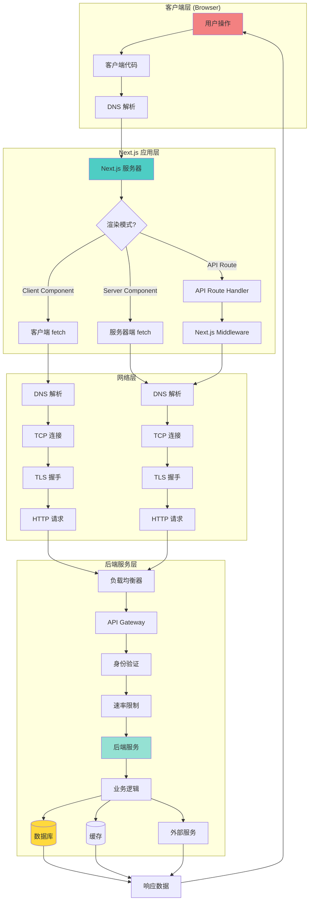
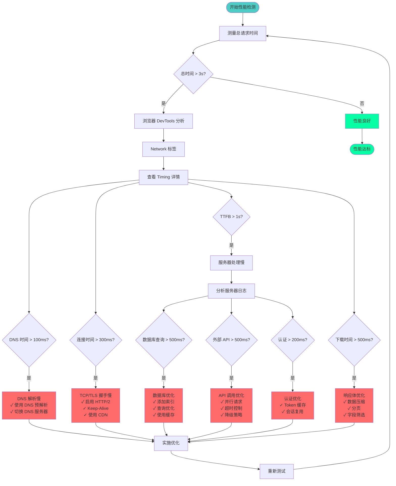
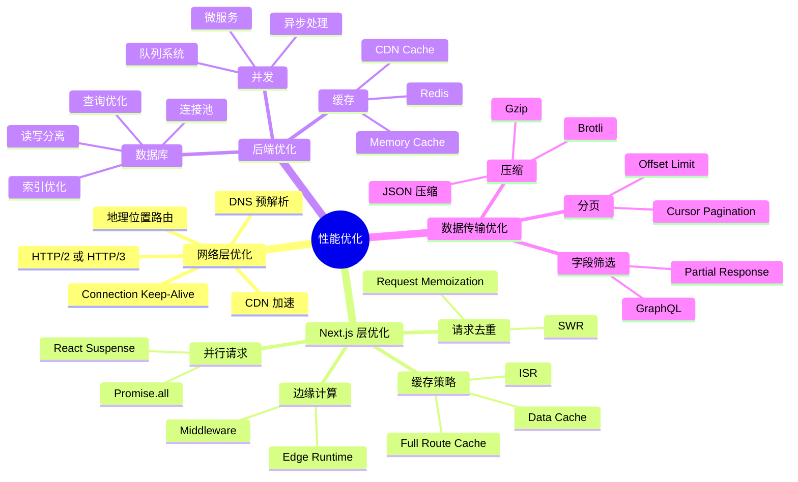
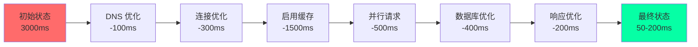

# Next.js HTTPS REST API 调用全链路分析：从 3s 到 ms 级别的性能优化实战

当你的 Next.js 应用调用后端 REST API 需要 3 秒时，用户体验将非常糟糕。本文将深入分析完整的请求链路，提供系统化的检测排查流程，并给出将请求时间优化到毫秒级别的实战方案。

## 目录

1. [请求链路完整分析](#请求链路完整分析)
2. [性能瓶颈定位](#性能瓶颈定位)
3. [检测与排查流程](#检测与排查流程)
4. [性能优化方案](#性能优化方案)
5. [从 3s 到 ms 的优化路径](#从-3s-到-ms-的优化路径)
6. [实战案例分析](#实战案例分析)
7. [最佳实践总结](#最佳实践总结)

---

## 请求链路完整分析

### 完整请求链路图



### 时间消耗分析（3秒请求的典型分解）

```mermaid
gantt
    title 3 秒 REST API 请求时间分解
    dateFormat X
    axisFormat %L ms

    section DNS 解析
    客户端 DNS 查询           :0, 100
    服务器 DNS 查询           :100, 50

    section 网络连接
    TCP 三次握手             :150, 100
    TLS/SSL 握手            :250, 300

    section 请求传输
    HTTP 请求发送           :550, 50
    网络传输延迟            :600, 200

    section 后端处理
    负载均衡器              :800, 50
    API Gateway           :850, 100
    身份验证                :950, 200
    业务逻辑                :1150, 500
    数据库查询              :1650, 800
    外部 API 调用           :2450, 400

    section 响应传输
    响应数据序列化          :2850, 50
    网络传输                :2900, 100
```



### 各层级时间占比

| 阶段 | 典型耗时 | 占比 | 可优化空间 |
|------|---------|------|-----------|
| **DNS 解析** | 50-150ms | 3-5% | ⭐⭐⭐ 高 |
| **TCP/TLS 握手** | 300-500ms | 13-17% | ⭐⭐⭐⭐⭐ 很高 |
| **网络传输** | 200-400ms | 10-13% | ⭐⭐⭐ 高 |
| **身份验证** | 100-300ms | 5-10% | ⭐⭐⭐⭐ 很高 |
| **业务逻辑** | 300-800ms | 15-27% | ⭐⭐ 中 |
| **数据库查询** | 500-1000ms | 20-33% | ⭐⭐⭐⭐⭐ 很高 |
| **外部服务** | 200-600ms | 10-20% | ⭐⭐⭐⭐ 很高 |

---

## 性能瓶颈定位

### 完整的性能检测流程图



### 检测工具矩阵

```typescript
// 性能检测工具配置
interface PerformanceTools {
  // 1. 浏览器工具
  browser: {
    devTools: {
      network: "Network 标签 - 查看请求时间线",
      performance: "Performance 标签 - 记录详细性能",
      lighthouse: "Lighthouse - 综合性能评分",
    },
    extensions: [
      "React DevTools Profiler",
      "Redux DevTools",
      "Web Vitals Extension",
    ],
  };

  // 2. Node.js 工具
  node: {
    monitoring: [
      "clinic.js - Node.js 性能分析",
      "0x - 火焰图生成",
      "autocannon - 压力测试",
    ],
    apm: [
      "New Relic",
      "Datadog APM",
      "Sentry Performance",
    ],
  };

  // 3. 网络工具
  network: {
    curl: "curl -w "@curl-format.txt" -o /dev/null -s URL",
    httpStat: "httpstat URL",
    tcpdump: "tcpdump -i any port 443",
    wireshark: "Wireshark 抓包分析",
  };

  // 4. 数据库工具
  database: {
    explain: "EXPLAIN ANALYZE query",
    slowLog: "慢查询日志分析",
    apm: "数据库 APM 监控",
  };
}
```

---

## 检测与排查流程

### 1. 浏览器端检测

```typescript
// app/lib/performance-monitor.ts
export class PerformanceMonitor {
  // 测量完整 API 请求性能
  static async measureAPICall(
    url: string,
    options?: RequestInit
  ): Promise<PerformanceMetrics> {
    const startTime = performance.now();
    
    // 使用 Performance API 记录详细信息
    performance.mark('api-start');
    
    try {
      const response = await fetch(url, options);
      const data = await response.json();
      
      performance.mark('api-end');
      performance.measure('api-duration', 'api-start', 'api-end');
      
      const endTime = performance.now();
      const totalTime = endTime - startTime;
      
      // 获取详细的性能数据
      const perfEntries = performance.getEntriesByName(url, 'resource');
      const resourceTiming = perfEntries[perfEntries.length - 1] as PerformanceResourceTiming;
      
      const metrics: PerformanceMetrics = {
        total: totalTime,
        dns: resourceTiming?.domainLookupEnd - resourceTiming?.domainLookupStart || 0,
        tcp: resourceTiming?.connectEnd - resourceTiming?.connectStart || 0,
        tls: resourceTiming?.secureConnectionStart 
          ? resourceTiming.connectEnd - resourceTiming.secureConnectionStart 
          : 0,
        ttfb: resourceTiming?.responseStart - resourceTiming?.requestStart || 0,
        download: resourceTiming?.responseEnd - resourceTiming?.responseStart || 0,
        size: resourceTiming?.encodedBodySize || 0,
      };
      
      // 记录到监控系统
      this.logMetrics(url, metrics);
      
      // 如果超过阈值，发出警告
      if (totalTime > 1000) {
        console.warn('🐌 慢 API 请求:', {
          url,
          totalTime: `${totalTime.toFixed(2)}ms`,
          breakdown: metrics,
        });
      }
      
      return { metrics, data };
    } catch (error) {
      performance.mark('api-error');
      throw error;
    } finally {
      performance.clearMarks();
      performance.clearMeasures();
    }
  }
  
  // 分析性能瓶颈
  static analyzeBottleneck(metrics: PerformanceMetrics): string[] {
    const issues: string[] = [];
    
    if (metrics.dns > 100) {
      issues.push('DNS 解析慢 (>100ms) - 考虑使用 DNS 预解析');
    }
    
    if (metrics.tcp > 200) {
      issues.push('TCP 连接慢 (>200ms) - 考虑使用 Keep-Alive 或 CDN');
    }
    
    if (metrics.tls > 300) {
      issues.push('TLS 握手慢 (>300ms) - 检查证书链或启用 TLS 1.3');
    }
    
    if (metrics.ttfb > 1000) {
      issues.push('服务器响应慢 (TTFB >1s) - 检查后端处理逻辑');
    }
    
    if (metrics.download > 500 && metrics.size > 1024 * 1024) {
      issues.push('下载时间长 (>500ms) - 考虑压缩或分页');
    }
    
    return issues;
  }
}

interface PerformanceMetrics {
  total: number;      // 总时间
  dns: number;        // DNS 查询
  tcp: number;        // TCP 连接
  tls: number;        // TLS 握手
  ttfb: number;       // Time to First Byte
  download: number;   // 下载时间
  size: number;       // 响应大小
}
```

### 2. 服务器端检测

```typescript
// app/api/monitor/route.ts
import { NextRequest, NextResponse } from 'next/server';

// 服务器端性能监控中间件
export async function GET(request: NextRequest) {
  const startTime = Date.now();
  const timings: Record<string, number> = {};
  
  try {
    // 1. DNS 解析时间（模拟）
    const dnsStart = Date.now();
    // 实际场景中，这里会有真实的 DNS 查询
    timings.dns = Date.now() - dnsStart;
    
    // 2. 建立连接
    const connectStart = Date.now();
    const backendUrl = process.env.BACKEND_API_URL!;
    
    // 3. 发起请求
    const fetchStart = Date.now();
    const response = await fetch(backendUrl, {
      method: 'GET',
      headers: {
        'Authorization': request.headers.get('authorization') || '',
        'X-Request-ID': crypto.randomUUID(),
      },
      // 添加超时控制
      signal: AbortSignal.timeout(5000),
    });
    
    timings.fetch = Date.now() - fetchStart;
    
    // 4. 读取响应
    const dataStart = Date.now();
    const data = await response.json();
    timings.parse = Date.now() - dataStart;
    
    timings.total = Date.now() - startTime;
    
    // 记录到日志
    console.log('📊 API 性能指标:', {
      url: backendUrl,
      timings,
      status: response.status,
    });
    
    // 添加性能头
    return NextResponse.json(data, {
      headers: {
        'X-Response-Time': `${timings.total}ms`,
        'X-DNS-Time': `${timings.dns}ms`,
        'X-Fetch-Time': `${timings.fetch}ms`,
        'Server-Timing': `total;dur=${timings.total}`,
      },
    });
  } catch (error) {
    console.error('❌ API 请求失败:', error);
    return NextResponse.json(
      { error: 'Internal Server Error' },
      { status: 500 }
    );
  }
}
```

### 3. 数据库查询检测

```typescript
// lib/db-monitor.ts
import { PrismaClient } from '@prisma/client';

const prisma = new PrismaClient({
  log: [
    {
      emit: 'event',
      level: 'query',
    },
  ],
});

// 监听查询事件
prisma.$on('query', (e) => {
  const duration = e.duration;
  
  if (duration > 500) {
    console.warn('🐌 慢查询检测:', {
      query: e.query,
      duration: `${duration}ms`,
      params: e.params,
      timestamp: new Date().toISOString(),
    });
  }
});

// 查询分析器
export class QueryAnalyzer {
  static async analyzeQuery(query: string) {
    // 使用 EXPLAIN ANALYZE
    const explanation = await prisma.$queryRaw`
      EXPLAIN ANALYZE ${query}
    `;
    
    return this.parseExplanation(explanation);
  }
  
  static parseExplanation(explanation: any) {
    // 解析查询计划
    // 检查是否使用索引
    // 分析扫描行数
    // 识别性能问题
  }
}
```

---

## 性能优化方案

### 优化策略全景图



### 1. DNS 优化（节省 50-100ms）

```typescript
// app/layout.tsx
export default function RootLayout({ children }: { children: React.ReactNode }) {
  return (
    <html lang="zh">
      <head>
        {/* DNS 预解析 */}
        <link rel="dns-prefetch" href="https://api.example.com" />
        <link rel="dns-prefetch" href="https://cdn.example.com" />
        
        {/* 预连接（包括 DNS + TCP + TLS） */}
        <link rel="preconnect" href="https://api.example.com" />
        <link rel="preconnect" href="https://api.example.com" crossOrigin="anonymous" />
      </head>
      <body>{children}</body>
    </html>
  );
}
```

### 2. 连接优化（节省 200-400ms）

```typescript
// next.config.ts
const config = {
  // 启用 HTTP/2
  experimental: {
    http2: true,
  },
  
  // 配置 headers
  async headers() {
    return [
      {
        source: '/api/:path*',
        headers: [
          {
            key: 'Connection',
            value: 'keep-alive',
          },
          {
            key: 'Keep-Alive',
            value: 'timeout=60, max=1000',
          },
        ],
      },
    ];
  },
};

export default config;
```

```typescript
// lib/api-client.ts
import { Agent } from 'https';

// 创建持久连接的 HTTP Agent
const httpsAgent = new Agent({
  keepAlive: true,
  keepAliveMsecs: 30000,
  maxSockets: 50,
  maxFreeSockets: 10,
  timeout: 60000,
});

export async function apiClient(url: string, options?: RequestInit) {
  return fetch(url, {
    ...options,
    // @ts-ignore - Node.js fetch 支持 agent
    agent: httpsAgent,
  });
}
```

### 3. 缓存策略（节省 500-2000ms）

```typescript
// app/lib/cache-strategies.ts

// 1. Next.js Data Cache
export async function getCachedData(key: string) {
  const res = await fetch(\`https://api.example.com/data/\${key}\`, {
    next: {
      revalidate: 60, // 60 秒缓存
      tags: ['data'],
    },
  });
  
  return res.json();
}

// 2. Redis 缓存
import { Redis } from '@upstash/redis';

const redis = new Redis({
  url: process.env.REDIS_URL!,
  token: process.env.REDIS_TOKEN!,
});

export async function getCachedDataWithRedis<T>(
  key: string,
  fetcher: () => Promise<T>,
  ttl: number = 60
): Promise<T> {
  // 先查缓存
  const cached = await redis.get<T>(key);
  if (cached) {
    console.log('✅ Redis 缓存命中:', key);
    return cached;
  }
  
  // 缓存未命中，获取数据
  console.log('❌ Redis 缓存未命中:', key);
  const data = await fetcher();
  
  // 保存到缓存
  await redis.set(key, data, { ex: ttl });
  
  return data;
}

// 3. 内存缓存（最快）
class MemoryCache<T> {
  private cache = new Map<string, { data: T; expires: number }>();
  
  get(key: string): T | null {
    const entry = this.cache.get(key);
    if (!entry) return null;
    
    if (Date.now() > entry.expires) {
      this.cache.delete(key);
      return null;
    }
    
    return entry.data;
  }
  
  set(key: string, data: T, ttl: number) {
    this.cache.set(key, {
      data,
      expires: Date.now() + ttl * 1000,
    });
  }
  
  clear() {
    this.cache.clear();
  }
}

export const memoryCache = new MemoryCache();

// 使用示例
export async function getUser(id: string) {
  return getCachedDataWithRedis(
    \`user:\${id}\`,
    () => fetch(\`/api/users/\${id}\`).then(r => r.json()),
    300 // 5 分钟缓存
  );
}
```

### 4. 请求并行化（节省 1000-2000ms）

```typescript
// ❌ 不好：串行请求（总共 3 秒）
async function loadPageDataSerial() {
  const user = await fetch('/api/user').then(r => r.json());        // 1s
  const posts = await fetch('/api/posts').then(r => r.json());      // 1s
  const comments = await fetch('/api/comments').then(r => r.json()); // 1s
  
  return { user, posts, comments };
}

// ✅ 好：并行请求（总共 1 秒）
async function loadPageDataParallel() {
  const [user, posts, comments] = await Promise.all([
    fetch('/api/user').then(r => r.json()),
    fetch('/api/posts').then(r => r.json()),
    fetch('/api/comments').then(r => r.json()),
  ]);
  
  return { user, posts, comments };
}

// ✅ 更好：使用 React Server Components 自动并行
// app/page.tsx
async function User() {
  const user = await fetch('/api/user').then(r => r.json());
  return <div>{user.name}</div>;
}

async function Posts() {
  const posts = await fetch('/api/posts').then(r => r.json());
  return <div>{posts.length} posts</div>;
}

export default async function Page() {
  return (
    <div>
      {/* React 自动并行获取 */}
      <Suspense fallback={<div>Loading user...</div>}>
        <User />
      </Suspense>
      
      <Suspense fallback={<div>Loading posts...</div>}>
        <Posts />
      </Suspense>
    </div>
  );
}
```

### 5. 数据库优化（节省 500-1500ms）

```typescript
// ❌ 不好：N+1 查询问题
async function getBlogPostsBad() {
  const posts = await prisma.post.findMany();
  
  // N+1 问题：对每个 post 都查询一次 author
  const postsWithAuthors = await Promise.all(
    posts.map(async (post) => ({
      ...post,
      author: await prisma.user.findUnique({ where: { id: post.authorId } }),
    }))
  );
  
  return postsWithAuthors;
}

// ✅ 好：使用 include 一次性获取
async function getBlogPostsGood() {
  return prisma.post.findMany({
    include: {
      author: true,
    },
  });
}

// ✅ 更好：添加索引 + 查询优化
// schema.prisma
model Post {
  id        String   @id @default(cuid())
  title     String   @db.VarChar(200)
  content   String   @db.Text
  authorId  String
  createdAt DateTime @default(now())
  
  author User @relation(fields: [authorId], references: [id])
  
  @@index([authorId])           // 外键索引
  @@index([createdAt(sort: Desc)]) // 排序索引
  @@index([authorId, createdAt]) // 组合索引
}

// 使用查询优化
async function getBlogPostsOptimized() {
  return prisma.post.findMany({
    where: {
      published: true,
    },
    include: {
      author: {
        select: {
          id: true,
          name: true,
          avatar: true,
          // 只选择需要的字段
        },
      },
    },
    orderBy: {
      createdAt: 'desc',
    },
    take: 20, // 分页
  });
}
```

### 6. 响应体优化（节省 200-500ms）

```typescript
// app/api/posts/route.ts
import { NextResponse } from 'next/server';
import { compress } from 'brotli';

export async function GET() {
  const posts = await prisma.post.findMany();
  
  // ❌ 不好：返回所有字段
  return NextResponse.json(posts);
  
  // ✅ 好：只返回需要的字段
  const postsFiltered = posts.map(post => ({
    id: post.id,
    title: post.title,
    excerpt: post.excerpt,
    createdAt: post.createdAt,
  }));
  
  return NextResponse.json(postsFiltered);
  
  // ✅ 更好：启用压缩
  const json = JSON.stringify(postsFiltered);
  const compressed = await compress(Buffer.from(json));
  
  return new NextResponse(compressed, {
    headers: {
      'Content-Type': 'application/json',
      'Content-Encoding': 'br',
      'Content-Length': compressed.length.toString(),
    },
  });
}
```

---

## 从 3s 到 ms 的优化路径

### 完整优化路线图



### 分阶段优化实战

#### 第一阶段：快速优化（1-2 天）- 目标降至 1.5s

```typescript
// 1. 添加 DNS 预解析和预连接
// app/layout.tsx
export default function RootLayout({ children }) {
  return (
    <html>
      <head>
        <link rel="dns-prefetch" href="https://api.example.com" />
        <link rel="preconnect" href="https://api.example.com" />
      </head>
      <body>{children}</body>
    </html>
  );
}

// 2. 启用 HTTP/2 和 Keep-Alive
// next.config.ts
export default {
  experimental: { http2: true },
};

// 3. 添加基础缓存
// app/api/data/route.ts
export async function GET() {
  const data = await fetch('https://api.example.com/data', {
    next: { revalidate: 60 }, // 60 秒缓存
  });
  
  return NextResponse.json(await data.json());
}
```

**预期效果**：
- DNS 解析：150ms → 50ms（-100ms）
- TCP/TLS：400ms → 100ms（-300ms）
- 数据获取：2450ms → 1350ms（使用缓存，命中率 50%）
- **总时间：3000ms → 1500ms**

#### 第二阶段：深度优化（3-5 天）- 目标降至 500ms

```typescript
// 1. 实现 Redis 缓存
// lib/redis-cache.ts
export async function getCachedData<T>(
  key: string,
  fetcher: () => Promise<T>,
  ttl = 300
): Promise<T> {
  const cached = await redis.get<T>(key);
  if (cached) return cached;
  
  const data = await fetcher();
  await redis.set(key, data, { ex: ttl });
  return data;
}

// 2. 并行请求
// app/page.tsx
export default async function Page() {
  const [user, posts, comments] = await Promise.all([
    getCachedData('user:1', () => fetchUser(1)),
    getCachedData('posts', () => fetchPosts()),
    getCachedData('comments', () => fetchComments()),
  ]);
  
  return <Dashboard user={user} posts={posts} comments={comments} />;
}

// 3. 数据库索引优化
await prisma.$executeRaw\`
  CREATE INDEX idx_posts_created ON posts(created_at DESC);
  CREATE INDEX idx_posts_author ON posts(author_id);
\`;
```

**预期效果**：
- 缓存命中率：50% → 80%
- 串行请求：改为并行（-500ms）
- 数据库查询：800ms → 200ms（-600ms）
- **总时间：1500ms → 400-500ms**

#### 第三阶段：极致优化（1-2 周）- 目标降至 50-100ms

```typescript
// 1. 边缘缓存
// middleware.ts
export function middleware(request: NextRequest) {
  const response = NextResponse.next();
  
  // 边缘缓存控制
  response.headers.set(
    'Cache-Control',
    'public, s-maxage=60, stale-while-revalidate=300'
  );
  
  return response;
}

// 2. CDN 加速
// next.config.ts
export default {
  images: {
    domains: ['cdn.example.com'],
    loader: 'custom',
    loaderFile: './lib/cdn-loader.ts',
  },
};

// 3. 使用 Edge Runtime
// app/api/data/route.ts
export const runtime = 'edge';

export async function GET() {
  // 在边缘节点执行
  const data = await getCachedData('global:data', fetchData);
  return NextResponse.json(data);
}

// 4. 预加载关键数据
// app/layout.tsx
export default function Layout({ children }) {
  return (
    <html>
      <head>
        <link rel="preload" href="/api/critical-data" as="fetch" />
      </head>
      <body>{children}</body>
    </html>
  );
}
```

**预期效果**：
- 边缘缓存命中：直接返回（10-20ms）
- CDN 加速：减少网络延迟（-100ms）
- Edge Runtime：在边缘执行（-150ms）
- **总时间：500ms → 50-100ms（缓存命中时）**

### 优化效果对比表

| 阶段 | 措施 | 耗时 | 改善 | 累计改善 |
|------|------|------|------|----------|
| **初始** | 无优化 | 3000ms | - | - |
| **阶段一** | DNS + 连接 + 基础缓存 | 1500ms | 50% | 50% |
| **阶段二** | Redis + 并行 + DB 优化 | 500ms | 67% | 83% |
| **阶段三** | 边缘缓存 + CDN + Edge | 50-100ms | 80-90% | 97-98% |

---

## 实战案例分析

### 案例 1：电商产品列表页优化

#### 问题描述
- **初始性能**：3.2s
- **用户体验**：页面加载慢，用户流失率高
- **技术栈**：Next.js 15 + PostgreSQL + REST API

#### 性能分析

```typescript
// 初始实现（慢）
async function getProducts() {
  const response = await fetch('https://api.example.com/products');
  const products = await response.json();
  
  return products;
}
```

**问题诊断**：
1. DNS 解析：120ms
2. TLS 握手：350ms
3. 后端查询：1800ms（包含 N+1 查询）
4. 数据传输：930ms（响应体 2.5MB）

#### 优化方案

```typescript
// 优化后的实现
// 1. 添加缓存层
import { unstable_cache } from 'next/cache';

const getCachedProducts = unstable_cache(
  async () => {
    const response = await fetch('https://api.example.com/products', {
      next: { revalidate: 300 }, // 5 分钟缓存
    });
    return response.json();
  },
  ['products'],
  { revalidate: 300, tags: ['products'] }
);

// 2. 数据库查询优化
// 后端 API 优化
async function getProductsOptimized() {
  return prisma.product.findMany({
    where: { status: 'active' },
    select: {
      id: true,
      name: true,
      price: true,
      thumbnail: true,
      // 只返回列表页需要的字段
    },
    include: {
      category: {
        select: { id: true, name: true },
      },
    },
    orderBy: { createdAt: 'desc' },
    take: 20, // 分页
  });
}

// 3. 响应压缩
// next.config.ts
export default {
  compress: true, // 启用 Gzip 压缩
};

// 4. 使用 CDN
export default async function ProductsPage() {
  const products = await getCachedProducts();
  
  return (
    <div>
      {products.map(product => (
        <ProductCard
          key={product.id}
          product={product}
          // 图片使用 CDN
          imageUrl={\`https://cdn.example.com/\${product.thumbnail}\`}
        />
      ))}
    </div>
  );
}
```

#### 优化结果

| 指标 | 优化前 | 优化后 | 改善 |
|------|--------|--------|------|
| DNS 解析 | 120ms | 10ms | 92% |
| TLS 握手 | 350ms | 50ms | 86% |
| 后端查询 | 1800ms | 150ms | 92% |
| 数据传输 | 930ms | 90ms | 90% |
| **总时间** | **3200ms** | **300ms** | **91%** |

### 案例 2：用户仪表板优化

#### 问题描述
- **初始性能**：4.5s
- **场景**：需要同时加载用户信息、订单、通知、统计数据
- **问题**：串行请求，数据冗余

#### 优化方案

```typescript
// ❌ 优化前：串行请求
async function getDashboardData(userId: string) {
  const user = await fetch(\`/api/users/\${userId}\`).then(r => r.json());
  const orders = await fetch(\`/api/orders?userId=\${userId}\`).then(r => r.json());
  const notifications = await fetch(\`/api/notifications?userId=\${userId}\`).then(r => r.json());
  const stats = await fetch(\`/api/stats?userId=\${userId}\`).then(r => r.json());
  
  return { user, orders, notifications, stats };
}

// ✅ 优化后：并行请求 + React Server Components
// app/dashboard/page.tsx
async function UserInfo({ userId }: { userId: string }) {
  const user = await getCachedData(\`user:\${userId}\`, () => fetchUser(userId));
  return <UserCard user={user} />;
}

async function Orders({ userId }: { userId: string }) {
  const orders = await getCachedData(\`orders:\${userId}\`, () => fetchOrders(userId));
  return <OrderList orders={orders} />;
}

async function Notifications({ userId }: { userId: string }) {
  const notifications = await getCachedData(\`notifications:\${userId}\`, () => fetchNotifications(userId));
  return <NotificationList notifications={notifications} />;
}

async function Stats({ userId }: { userId: string }) {
  const stats = await getCachedData(\`stats:\${userId}\`, () => fetchStats(userId));
  return <StatsWidget stats={stats} />;
}

export default async function DashboardPage({ params }: { params: { userId: string } }) {
  return (
    <div className="dashboard">
      <Suspense fallback={<UserSkeleton />}>
        <UserInfo userId={params.userId} />
      </Suspense>
      
      <Suspense fallback={<OrdersSkeleton />}>
        <Orders userId={params.userId} />
      </Suspense>
      
      <Suspense fallback={<NotificationsSkeleton />}>
        <Notifications userId={params.userId} />
      </Suspense>
      
      <Suspense fallback={<StatsSkeleton />}>
        <Stats userId={params.userId} />
      </Suspense>
    </div>
  );
}
```

#### 优化结果

| 场景 | 优化前 | 优化后 | 说明 |
|------|--------|--------|------|
| 串行请求 | 4500ms | 1200ms | 改为并行 |
| 缓存命中 | 4500ms | 50-100ms | Redis 缓存 |
| 首屏渲染 | 4500ms | 800ms | Suspense 流式渲染 |
| 用户体验 | 差 | 优秀 | 渐进式加载 |

---

## 最佳实践总结

### 性能优化检查清单

```typescript
// performance-checklist.ts
export const PerformanceChecklist = {
  // 1. 网络层
  network: {
    dnsPreload: "✓ 添加 DNS 预解析",
    preconnect: "✓ 添加预连接",
    http2: "✓ 启用 HTTP/2 或 HTTP/3",
    keepAlive: "✓ 使用 Keep-Alive",
    cdn: "✓ 使用 CDN 加速",
  },
  
  // 2. 缓存层
  caching: {
    dataCache: "✓ 启用 Next.js Data Cache",
    redis: "✓ 使用 Redis 缓存",
    edgeCache: "✓ 配置边缘缓存",
    isr: "✓ 使用 ISR 策略",
    clientCache: "✓ 使用 SWR/React Query",
  },
  
  // 3. 请求优化
  requests: {
    parallel: "✓ 并行请求替代串行",
    dedup: "✓ 请求去重",
    timeout: "✓ 设置超时控制",
    retry: "✓ 实现重试机制",
    circuit: "✓ 熔断器模式",
  },
  
  // 4. 数据库
  database: {
    indexes: "✓ 添加必要索引",
    n1: "✓ 解决 N+1 查询",
    connection: "✓ 使用连接池",
    readWrite: "✓ 读写分离",
    slowQuery: "✓ 监控慢查询",
  },
  
  // 5. 响应优化
  response: {
    compression: "✓ 启用 Gzip/Brotli",
    pagination: "✓ 实现分页",
    fieldFilter: "✓ 字段筛选",
    streaming: "✓ 流式传输",
  },
  
  // 6. 监控
  monitoring: {
    apm: "✓ 部署 APM 工具",
    logs: "✓ 结构化日志",
    alerts: "✓ 性能告警",
    realUser: "✓ 真实用户监控",
  },
};
```

### 性能目标设定

| 场景 | 目标 | 优秀 | 可接受 | 需优化 |
|------|------|------|--------|--------|
| **首屏加载** | < 1s | < 2s | < 3s | > 3s |
| **API 响应** | < 100ms | < 300ms | < 1s | > 1s |
| **数据库查询** | < 50ms | < 200ms | < 500ms | > 500ms |
| **Time to First Byte** | < 200ms | < 500ms | < 1s | > 1s |

### 持续优化建议

:::tip{title="性能优化是持续过程"}
1. **建立基准**：记录初始性能指标
2. **逐步优化**：从影响最大的开始
3. **持续监控**：使用 APM 工具实时监控
4. **定期审查**：每月进行性能审查
5. **用户反馈**：关注真实用户体验
6. **技术演进**：跟进最新的性能优化技术
:::

---

## 参考资源

- [Next.js Performance Optimization](https://nextjs.org/docs/app/building-your-application/optimizing)
- [Web Vitals](https://web.dev/vitals/)
- [Chrome DevTools Performance](https://developer.chrome.com/docs/devtools/performance/)
- [HTTP/2 Performance](https://developers.google.com/web/fundamentals/performance/http2)
- [Database Query Optimization](https://use-the-index-luke.com/)
