# Next.js 架构深度解析：设计理念、核心组件与渲染机制

Next.js 作为现代 React 框架的代表，其架构设计体现了对性能、开发体验和用户体验的极致追求。本文将深入剖析 Next.js 的核心架构、设计理念以及各个组件如何协同工作。

## 目录

1. [核心设计理念](#核心设计理念)
2. [整体架构概览](#整体架构概览)
3. [编译器架构](#编译器架构)
4. [路由系统架构](#路由系统架构)
5. [渲染机制](#渲染机制)
6. [数据获取与缓存](#数据获取与缓存)
7. [Turbopack 打包架构](#turbopack-打包架构)
8. [开发时特性](#开发时特性)
9. [可访问性架构](#可访问性架构)

---

## 核心设计理念

### 1. **约定优于配置 (Convention over Configuration)**

Next.js 通过文件系统路由和约定式目录结构，大幅简化应用配置：

```
app/
├── layout.tsx          # 根布局
├── page.tsx            # 首页
├── about/
│   └── page.tsx        # /about 路由
└── blog/
    ├── [slug]/
    │   └── page.tsx    # /blog/[slug] 动态路由
    └── layout.tsx      # 博客布局
```

**设计理念：**
- **零配置路由** - 文件结构直接映射为 URL
- **自动代码分割** - 每个路由自动分离为独立的 chunk
- **内置优化** - 开箱即用的性能优化

### 2. **服务器优先 (Server-First)**

默认所有组件都是服务器组件，只在需要时才使用客户端组件：

```typescript
// 默认是服务器组件
export default async function BlogPost() {
  const post = await fetchPost(); // 直接访问数据库
  return <article>{post.content}</article>;
}

// 显式声明客户端组件
'use client';
export default function LikeButton() {
  const [likes, setLikes] = useState(0);
  return <button onClick={() => setLikes(likes + 1)}>{likes}</button>;
}
```

**优势：**
- 减少 JavaScript 包体积
- 提升初始加载性能
- 更好的 SEO 支持
- 直接访问后端资源

### 3. **渐进式增强 (Progressive Enhancement)**

从静态 HTML 开始，逐步增强为完全交互的应用：

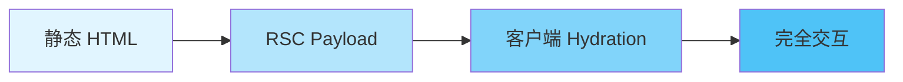

### 4. **包容性设计 (Inclusive by Default)**

内置可访问性支持，确保所有用户都能使用应用：

- 自动路由公告
- 内置 a11y ESLint 规则
- 语义化 HTML 优先

---

## 整体架构概览

Next.js 架构可以分为以下几个核心层：

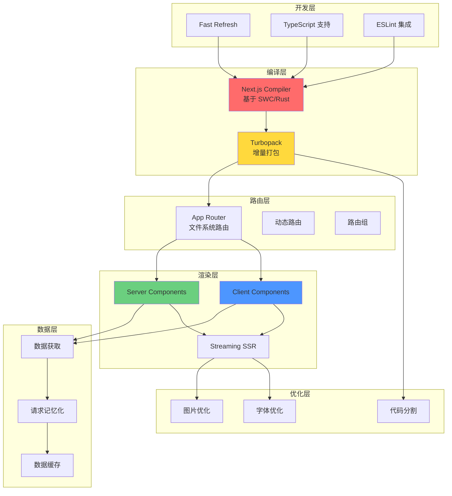

---

## 编译器架构

### Next.js Compiler (基于 SWC)

Next.js 使用 Rust 编写的 SWC 编译器，替代了传统的 Babel 和 Terser。

#### 架构组成

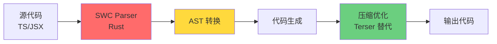

#### 性能对比

| 工具 | 速度 | 用途 |
|------|------|------|
| **SWC vs Babel** | 17x 更快 | 代码转换 |
| **SWC Minifier vs Terser** | 7x 更快 | 代码压缩 |
| **Fast Refresh** | 3x 更快 | 热更新 |
| **构建速度** | 5x 更快 | 生产构建 |

#### 为什么选择 SWC/Rust？

**1. 可扩展性**
- 作为 Crate 集成到 Next.js 中
- 无需 fork 库即可定制

**2. 性能**
- Rust 提供接近原生的执行速度
- 并行处理能力强

**3. WebAssembly 支持**
- 跨平台兼容性
- 浏览器端执行能力

**4. 社区生态**
- Rust 生态系统不断壮大
- 工具链日益完善

#### 支持的转换功能

```typescript
// 1. Styled Components 转换
const Button = styled.button`
  color: ${props => props.primary ? 'blue' : 'gray'};
`;

// 2. React 属性移除 (生产环境)
// 自动移除 data-testid 等开发属性

// 3. 装饰器支持
@deprecated
class MyComponent {}

// 4. 情感库 (Emotion) 支持
const style = css`
  color: red;
`;
```

---

## 路由系统架构

### 文件系统路由

Next.js 使用**基于文件系统的路由**，目录结构直接映射为 URL 路径。

#### 路由组件层次结构

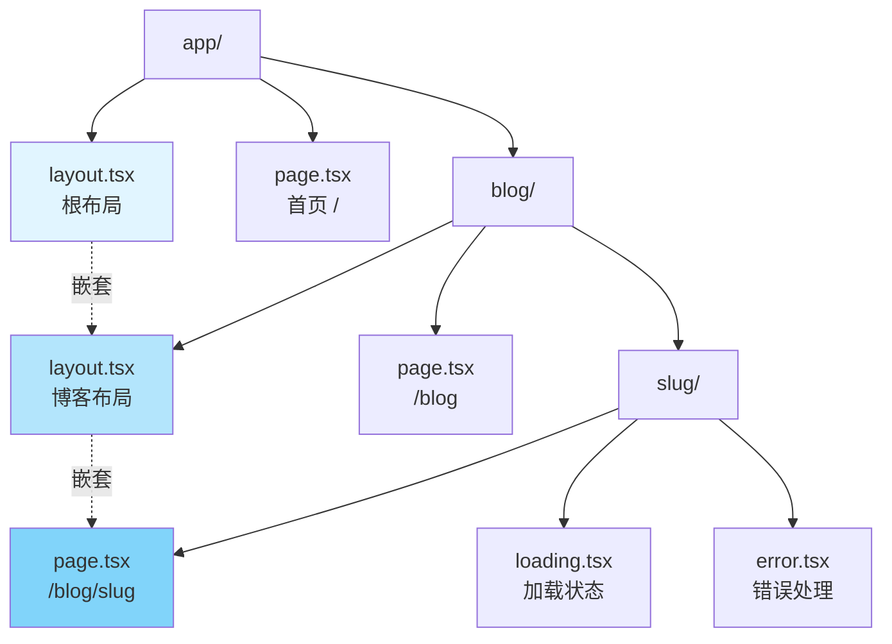

#### 核心文件约定

| 文件名 | 用途 | 特性 |
|--------|------|------|
| **layout.tsx** | 共享布局 | 跨页面保持状态 |
| **page.tsx** | 路由页面 | 定义路由端点 |
| **loading.tsx** | 加载状态 | 自动 Suspense |
| **error.tsx** | 错误边界 | 错误处理 UI |
| **not-found.tsx** | 404 页面 | 未找到处理 |
| **template.tsx** | 模板 | 每次导航重新挂载 |

#### 动态路由

```typescript
// app/blog/[slug]/page.tsx
export default async function BlogPost({ 
  params 
}: { 
  params: { slug: string } 
}) {
  const post = await getPost(params.slug);
  return <article>{post.content}</article>;
}

// 生成静态参数
export async function generateStaticParams() {
  const posts = await getPosts();
  return posts.map(post => ({ slug: post.slug }));
}
```

#### 路由导航流程

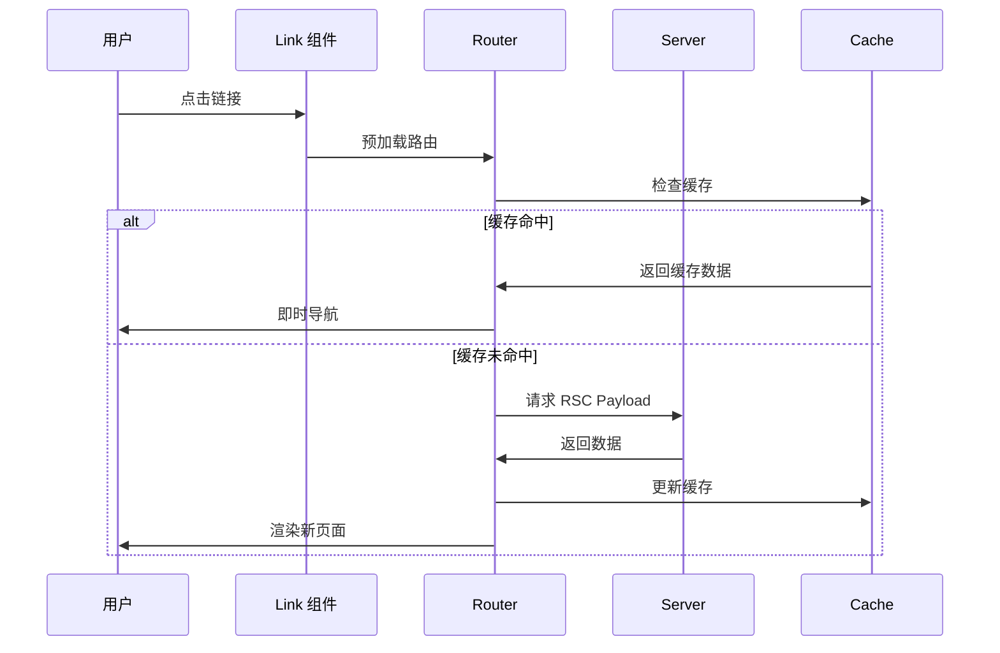

---

## 渲染机制

Next.js 支持多种渲染策略，核心是 **Server Components** 和 **Client Components** 的组合。

### Server Components vs Client Components

#### 架构对比

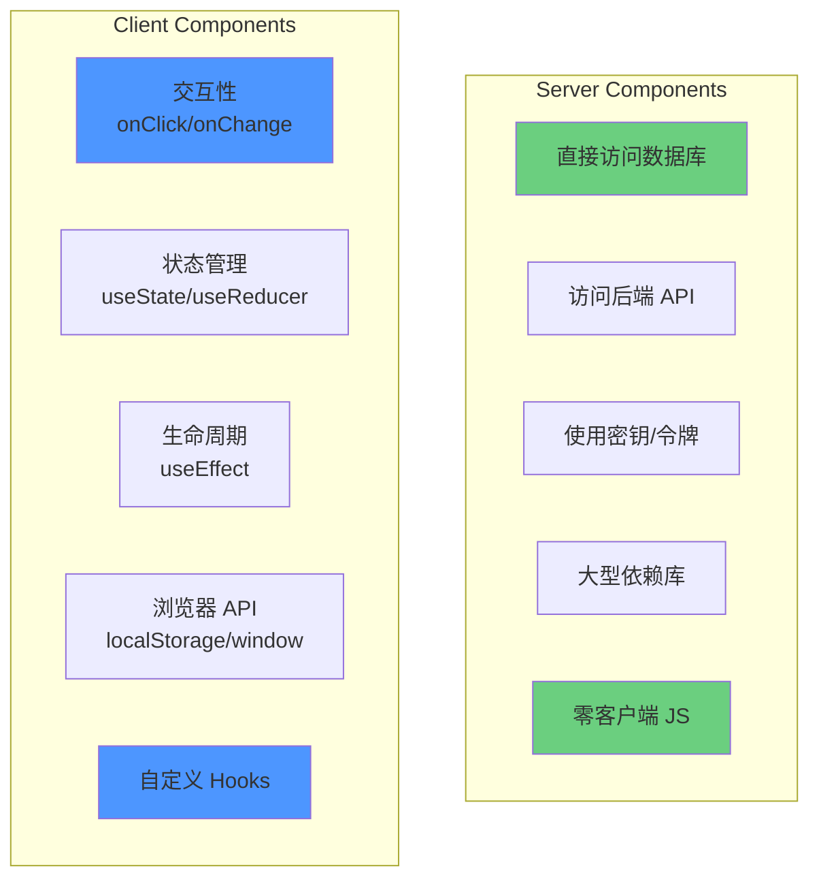

#### 何时使用

| 需求 | 使用组件类型 | 原因 |
|------|-------------|------|
| 获取数据 | Server | 更接近数据源 |
| 访问后端资源 | Server | 直接访问，更安全 |
| 保护敏感信息 | Server | API 密钥不暴露 |
| 大型依赖 | Server | 减少客户端包体积 |
| 交互和事件监听 | Client | 需要浏览器 API |
| 状态和生命周期 | Client | 需要 React Hooks |
| 浏览器专属 API | Client | window、localStorage 等 |
| 自定义 Hooks | Client | 依赖客户端状态 |

### 渲染流程详解

#### 初始页面加载

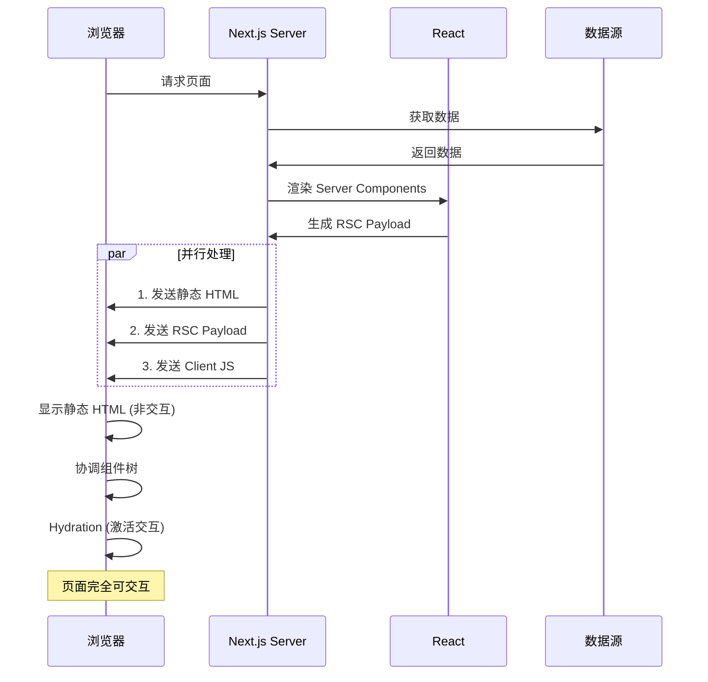

#### RSC Payload 结构

RSC Payload 是服务器组件的二进制表示，包含：

1. **Server Components 渲染结果** - HTML 片段
2. **Client Components 占位符** - 引用和 JS 文件位置
3. **传递给 Client 的 Props** - 序列化数据

```javascript
// RSC Payload 示例结构 (简化)
{
  "type": "div",
  "children": [
    {
      "type": "ServerComponent",
      "result": "<h1>欢迎</h1>"
    },
    {
      "type": "ClientComponent",
      "ref": "chunk-abc123.js",
      "props": { "initialCount": 0 }
    }
  ]
}
```

#### 后续导航

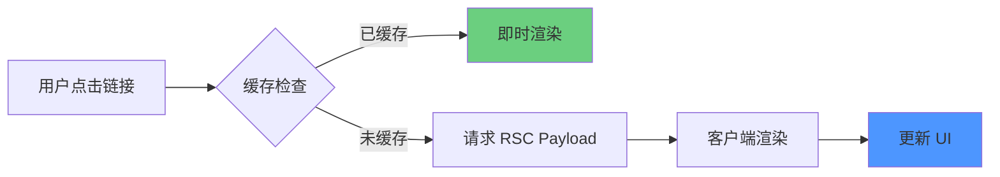

**关键特性：**
- 不需要完整的 HTML
- 仅获取 RSC Payload
- 完全客户端渲染
- 无需服务器 HTML 生成

### 组件组合模式

#### 模式 1: 将 Server Component 作为 Props 传递

```typescript
// ✅ 推荐：通过 children 传递
'use client';

export default function ClientLayout({ 
  children 
}: { 
  children: React.ReactNode 
}) {
  const [isOpen, setIsOpen] = useState(false);
  
  return (
    <div>
      <button onClick={() => setIsOpen(!isOpen)}>
        切换
      </button>
      {isOpen && children}  {/* Server Component 可以在这里 */}
    </div>
  );
}
```

```typescript
// app/page.tsx
export default function Page() {
  return (
    <ClientLayout>
      <ServerComponent />  {/* 保持为 Server Component */}
    </ClientLayout>
  );
}
```

#### 模式 2: 从 Server 向 Client 传递 Props

```typescript
// Server Component
export default async function Page() {
  const data = await fetchData();
  
  return <ClientComponent data={data} />;  // ✅ 可序列化数据
}

// Client Component
'use client';
export default function ClientComponent({ 
  data 
}: { 
  data: SerializableData 
}) {
  return <div>{data.title}</div>;
}
```

:::warning
只能传递**可序列化**的数据 (JSON)，不能传递函数、类实例等。
:::

---

## 数据获取与缓存

### 多层缓存架构

Next.js 实现了智能的多层缓存策略：

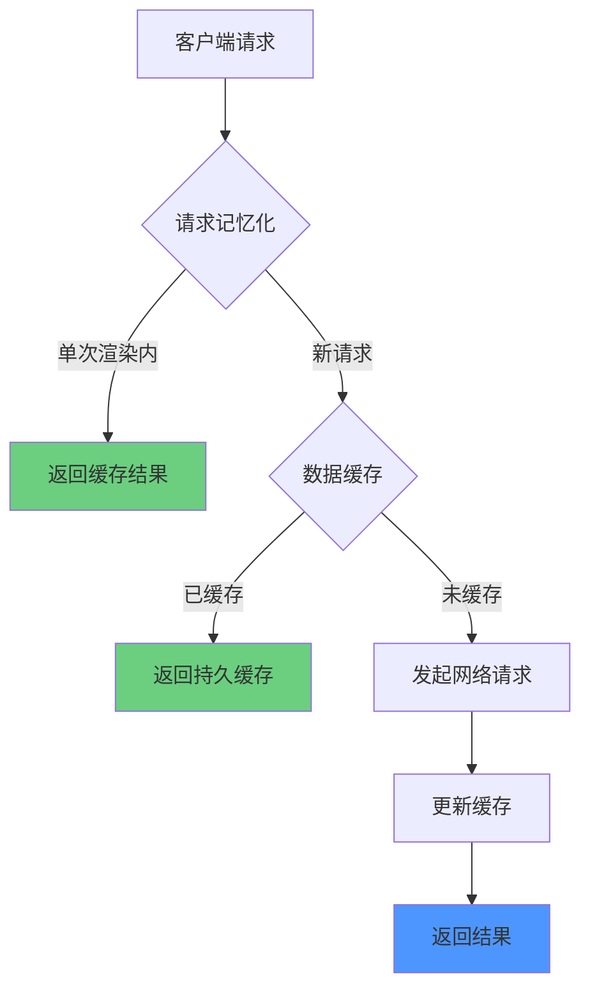

### 1. 请求记忆化 (Request Memoization)

**作用域：** 单次渲染过程

同一个渲染周期内，相同的 `fetch` 请求会自动合并：

```typescript
// 组件树中多次调用
async function Header() {
  const user = await fetch('/api/user');  // 第 1 次
  return <h1>{user.name}</h1>;
}

async function Sidebar() {
  const user = await fetch('/api/user');  // 使用缓存
  return <nav>{user.role}</nav>;
}

async function Footer() {
  const user = await fetch('/api/user');  // 使用缓存
  return <footer>{user.email}</footer>;
}

// 实际只发起 1 次网络请求
```

**工作原理：**

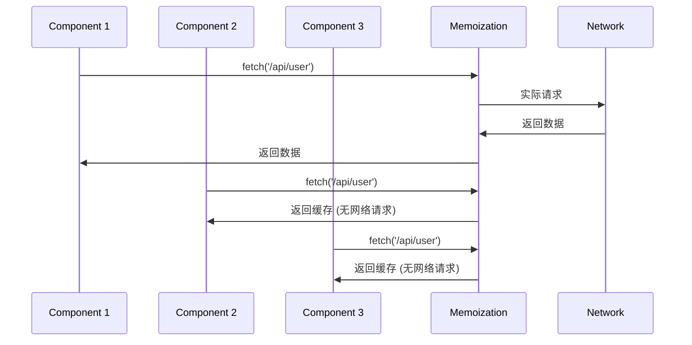

**条件：**
- 使用 `GET` 或 `HEAD` 方法
- 相同的 URL 和选项
- 在同一个渲染树中

### 2. 数据缓存 (Data Cache)

**作用域：** 跨请求和部署

持久化缓存，可跨多个请求和服务器重启：

```typescript
// 默认缓存 (推荐)
const data = await fetch('https://api.example.com/data');

// 强制缓存
const data = await fetch('https://api.example.com/data', {
  cache: 'force-cache'  // 默认行为
});

// 禁用缓存
const data = await fetch('https://api.example.com/data', {
  cache: 'no-store'  // 每次都重新请求
});

// 时间重新验证
const data = await fetch('https://api.example.com/data', {
  next: { revalidate: 3600 }  // 每小时重新验证
});
```

#### 缓存重新验证

**基于时间：**

```typescript
// 每 60 秒重新验证
fetch('https://api.example.com/data', {
  next: { revalidate: 60 }
});
```

**按需重新验证：**

```typescript
// app/actions.ts
'use server';

import { revalidateTag, revalidatePath } from 'next/cache';

export async function updatePost() {
  // 通过标签重新验证
  revalidateTag('posts');
  
  // 通过路径重新验证
  revalidatePath('/blog');
}
```

```typescript
// 使用标签
fetch('https://api.example.com/posts', {
  next: { tags: ['posts'] }
});
```

### 3. 非 fetch 请求的缓存

对于 ORM、数据库查询，使用 React 的 `cache` 函数：

```typescript
import { cache } from 'react';

export const getUser = cache(async (id: string) => {
  const user = await db.user.findUnique({ where: { id } });
  return user;
});

// 多次调用，只执行一次查询
async function Component1() {
  const user = await getUser('123');
}

async function Component2() {
  const user = await getUser('123');  // 使用缓存
}
```

### 4. Streaming 流式架构

Next.js 支持渐进式 HTML 传输：

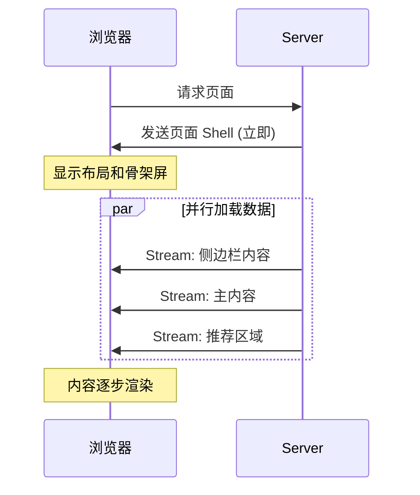

#### 实现方式 1: loading.js

```typescript
// app/blog/loading.tsx
export default function Loading() {
  return <BlogSkeleton />;
}

// app/blog/page.tsx
export default async function Blog() {
  const posts = await fetchPosts();  // 慢速数据
  return <PostList posts={posts} />;
}
```

自动包装为 `<Suspense>` 边界。

#### 实现方式 2: 手动 Suspense

```typescript
import { Suspense } from 'react';

export default function Dashboard() {
  return (
    <div>
      <h1>仪表盘</h1>
      
      {/* 快速内容立即显示 */}
      <QuickStats />
      
      {/* 慢速内容异步加载 */}
      <Suspense fallback={<ChartSkeleton />}>
        <RevenueChart />
      </Suspense>
      
      <Suspense fallback={<TableSkeleton />}>
        <RecentOrders />
      </Suspense>
    </div>
  );
}
```

**优势：**
- 更快的 Time to First Byte (TTFB)
- 更快的 First Contentful Paint (FCP)
- 更好的用户感知性能

---

## Turbopack 打包架构

Turbopack 是 Next.js 16+ 的默认打包工具，用 Rust 编写，专为 Next.js 优化。

### 核心设计原则

#### 1. 统一图结构

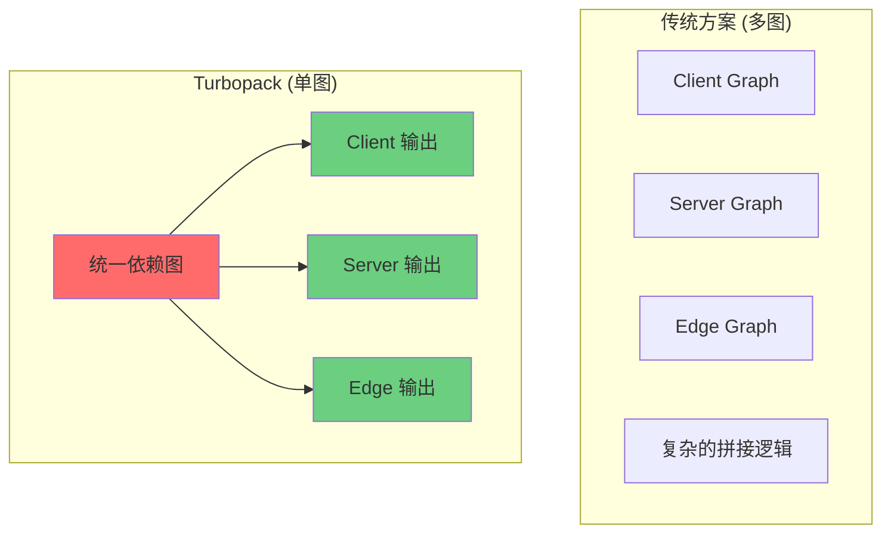

**优势：**
- 避免重复工作
- 简化多环境支持
- 更好的缓存一致性

#### 2. 优化的打包策略

与原生 ESM 不同，Turbopack 在开发时仍进行打包：

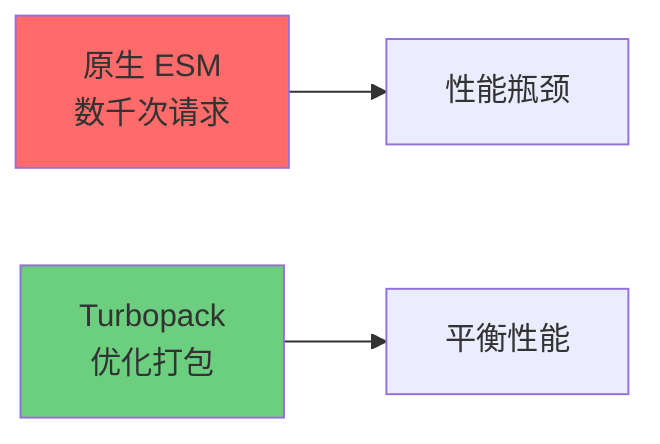

**策略：**
- 将相关模块打包到一起
- 减少网络往返次数
- 优化大型应用性能

#### 3. 增量计算与缓存

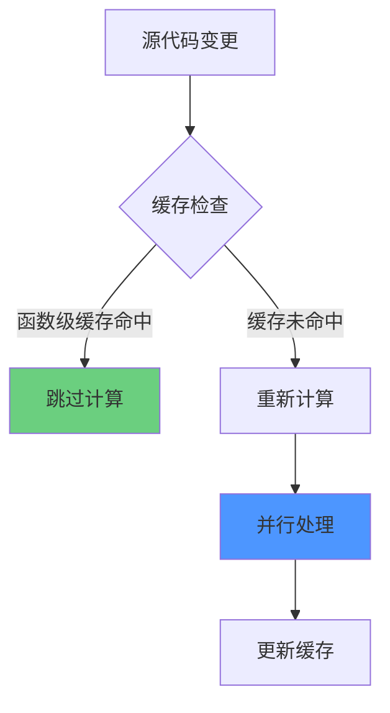

**特性：**
- **函数级缓存** - 细粒度的缓存策略
- **并行化** - 跨 CPU 核心并行工作
- **持久缓存** - 结果在重启后仍然有效

#### 4. 懒加载捆绑

```typescript
// 开发服务器启动流程
┌─────────────────────────────────────┐
│  开发服务器启动 (几乎瞬时)          │
└─────────────────────────────────────┘
            ↓
┌─────────────────────────────────────┐
│  用户访问 /dashboard                 │
└─────────────────────────────────────┘
            ↓
┌─────────────────────────────────────┐
│  仅编译 /dashboard 及其依赖          │
└─────────────────────────────────────┘
            ↓
┌─────────────────────────────────────┐
│  返回页面 (快速)                     │
└─────────────────────────────────────┘
```

**优势：**
- 快速启动时间
- 减少内存占用
- 按需编译

### 性能对比

| 指标 | Webpack | Turbopack | 提升 |
|------|---------|-----------|------|
| 初始编译 (大型应用) | ~30s | ~1s | **30x** |
| HMR 更新 | ~2s | ~100ms | **20x** |
| 内存占用 | 高 | 低 | **2-3x** |

---

## 开发时特性

### Fast Refresh 热更新机制

Fast Refresh 是 Next.js 集成的 React 热更新功能，在保持组件状态的同时实时更新代码。

#### 工作原理

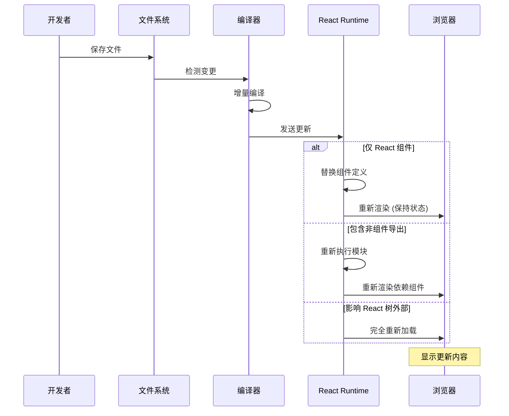

#### 三种更新场景

**场景 1: 仅编辑 React 组件**

```typescript
// components/Counter.tsx
export default function Counter() {
  const [count, setCount] = useState(0);
  
  return (
    <div>
      <p>Count: {count}</p>
      <button onClick={() => setCount(count + 1)}>
        增加  {/* 修改这里的文本 */}
      </button>
    </div>
  );
}
```

**结果：**
- ✅ 仅更新该组件
- ✅ 保持 `count` 状态
- ✅ 保持事件监听器
- ✅ 保持 Effect

**场景 2: 文件包含非组件导出**

```typescript
// theme.ts
export const theme = {
  primary: '#007bff',  // 修改颜色
  secondary: '#6c757d'
};

export function Button() {
  return <button style={{ color: theme.primary }}>点击</button>;
}
```

**结果：**
- ⚠️ 重新执行 `theme.ts`
- ⚠️ 重新渲染所有导入 `theme` 的组件
- ⚠️ 可能丢失部分状态

**场景 3: 编辑非 React 文件**

```typescript
// utils/format.ts
export function formatDate(date: Date) {
  return date.toLocaleDateString();
}
```

如果此文件被 React 树外部导入，则会触发完全重新加载。

#### Hooks 状态处理

```typescript
export default function Example() {
  const [count, setCount] = useState(0);
  
  // ✅ 重新执行，但忽略依赖数组
  useEffect(() => {
    console.log('Count:', count);
  }, [count]);
  
  // ✅ 重新计算
  const doubled = useMemo(() => count * 2, [count]);
  
  return <div>{doubled}</div>;
}
```

**规则：**
- 有依赖的 Hooks (`useEffect`, `useMemo`, `useCallback`) 总是更新
- 依赖数组临时被忽略，确保编辑立即生效

#### 错误恢复

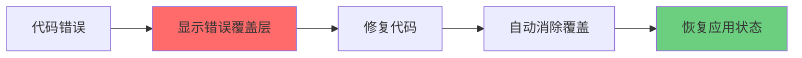

**特性：**
- 语法错误和运行时错误都会显示覆盖层
- 修复后自动消失
- 不需要手动刷新
- 尽可能保持组件状态

---

## 可访问性架构

Next.js 将可访问性作为核心架构的一部分，而非事后添加的功能。

### 设计哲学

**"包容性优先 (Inclusive by Default)"**

> "通过在 Next.js 中默认添加可访问性功能，我们旨在为所有人构建更具包容性的网络。"

### 核心功能

#### 1. 路由公告系统

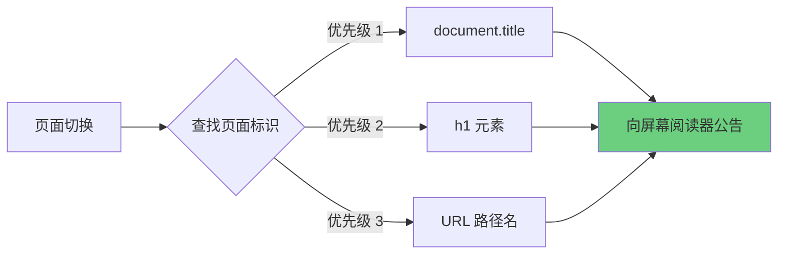

**工作原理：**

```typescript
// Next.js 自动处理路由公告
export default function BlogPost({ title }: { title: string }) {
  return (
    <>
      <title>{title}</title>  {/* 优先级 1 */}
      <h1>{title}</h1>         {/* 优先级 2 */}
    </>
  );
}
```

**输出给屏幕阅读器：**
```
"导航到: React 服务器组件详解"
```

#### 2. 集成 ESLint 检查

Next.js 默认包含 `eslint-plugin-jsx-a11y`：

```json
{
  "extends": "next/core-web-vitals"
}
```

**自动检测问题：**

```typescript
// ❌ 错误：缺少 alt 属性


// ✅ 正确


// ❌ 错误：无效的 ARIA 属性
<div role="button" aria-pressed="yes" />

// ✅ 正确
<button aria-pressed="true">切换</button>
```

**检查项目：**
- ✅ 图片替代文本
- ✅ ARIA 属性有效性
- ✅ 角色与属性匹配
- ✅ 表单标签关联
- ✅ 键盘导航支持

#### 3. 语义化 HTML 优先

```typescript
// ✅ 推荐：使用语义化标签
export default function Article() {
  return (
    <article>
      <header>
        <h1>标题</h1>
        <time dateTime="2025-11-20">2025 年 11 月 20 日</time>
      </header>
      <section>
        <p>内容...</p>
      </section>
      <footer>
        <nav aria-label="文章导航">
          <a href="/previous">上一篇</a>
          <a href="/next">下一篇</a>
        </nav>
      </footer>
    </article>
  );
}

// ❌ 避免：过度使用 div
export default function Article() {
  return (
    <div>
      <div>
        <div>标题</div>
        <div>2025 年 11 月 20 日</div>
      </div>
      <div>内容...</div>
    </div>
  );
}
```

### 最佳实践检查清单

#### 色彩对比度

```css
/* ✅ 符合 WCAG AA 标准 (4.5:1) */
.text {
  color: #333;
  background: #fff;
  /* 对比度: 12.6:1 */
}

/* ❌ 对比度不足 */
.text {
  color: #999;
  background: #fff;
  /* 对比度: 2.8:1 */
}
```

#### 键盘导航

```typescript
// ✅ 支持键盘操作
export default function CustomButton({ onClick }: { onClick: () => void }) {
  return (
    <button 
      onClick={onClick}
      onKeyDown={(e) => {
        if (e.key === 'Enter' || e.key === ' ') {
          onClick();
        }
      }}
    >
      点击
    </button>
  );
}
```

#### 焦点管理

```typescript
'use client';
import { useRef, useEffect } from 'react';

export default function Modal({ isOpen }: { isOpen: boolean }) {
  const closeButtonRef = useRef<HTMLButtonElement>(null);
  
  useEffect(() => {
    if (isOpen) {
      // 打开时自动聚焦关闭按钮
      closeButtonRef.current?.focus();
    }
  }, [isOpen]);
  
  return (
    <dialog open={isOpen}>
      <h2>模态框标题</h2>
      <button ref={closeButtonRef}>关闭</button>
    </dialog>
  );
}
```

---

## 架构优势总结

### 1. 性能优化

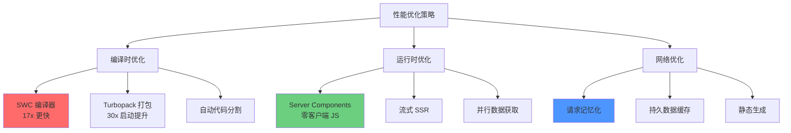

### 2. 开发体验

| 特性 | 优势 | 影响 |
|------|------|------|
| **Fast Refresh** | 保持状态的热更新 | 开发效率 ⬆️ 300% |
| **TypeScript** | 原生支持，零配置 | 类型安全 |
| **ESLint** | 内置可访问性检查 | 代码质量 |
| **文件系统路由** | 零配置路由 | 认知负担 ⬇️ 80% |
| **错误覆盖** | 详细错误信息 | 调试时间 ⬇️ 50% |

### 3. 用户体验

**核心 Web 指标优化：**

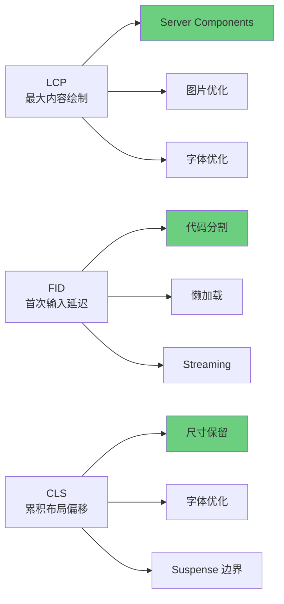

### 4. 可扩展性

```typescript
// 支持多种部署目标
export const config = {
  runtime: 'edge',        // Edge Runtime
  // runtime: 'nodejs',   // Node.js Runtime
};

// 支持多种渲染策略
export const dynamic = 'force-dynamic';    // 动态渲染
// export const dynamic = 'force-static';  // 静态生成
// export const dynamic = 'auto';          // 自动决策

// 支持增量静态再生成
export const revalidate = 3600;  // 每小时更新
```

---

## 架构演进路线图

### 历史演进

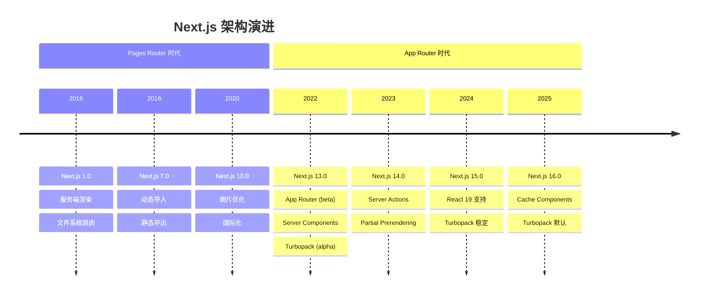

### 未来方向

**1. 缓存组件 (Cache Components)**

```typescript
'use cache';

export async function ProductList() {
  const products = await fetchProducts();
  return <div>{/* 渲染产品 */}</div>;
}
```

**2. 部分预渲染 (Partial Prerendering)**

```typescript
export const experimental_ppr = true;

export default function Page() {
  return (
    <div>
      <StaticHeader />  {/* 预渲染 */}
      <Suspense fallback={<Skeleton />}>
        <DynamicContent />  {/* 运行时渲染 */}
      </Suspense>
    </div>
  );
}
```

**3. React Compiler 集成**

自动优化 React 组件，减少手动 `useMemo` 和 `useCallback`。

---

## 实践建议

### 1. 组件设计策略

```mermaid
graph TD
    A{需要交互?} -->|否| B[Server Component]
    A -->|是| C{需要服务端数据?}
    
    C -->|是| D[组合模式]
    C -->|否| E[Client Component]
    
    D --> D1[Server: 获取数据]
    D --> D2[Client: 交互逻辑]
    
    style B fill:#6bcf7f
    style D fill:#4d96ff
    style E fill:#ffd93d
```

**决策树：**

1. 默认使用 **Server Component**
2. 需要交互时，使用 **Client Component**
3. 同时需要数据和交互时，使用**组合模式**

### 2. 性能优化检查清单

**编译时：**
- [ ] 使用 Server Components 减少客户端 JS
- [ ] 启用 Turbopack 加快开发构建
- [ ] 配置适当的缓存策略
- [ ] 使用动态导入进行代码分割

**运行时：**
- [ ] 使用 Streaming SSR 改善 TTFB
- [ ] 实现 Suspense 边界进行渐进式渲染
- [ ] 利用请求记忆化减少重复请求
- [ ] 配置适当的 revalidate 策略

**网络：**
- [ ] 使用 `next/image` 优化图片
- [ ] 使用 `next/font` 优化字体
- [ ] 启用 Gzip/Brotli 压缩
- [ ] 配置 CDN 缓存策略

### 3. 可访问性检查

**开发时：**
```bash
# 运行 ESLint 检查
npm run lint

# 使用 axe DevTools 浏览器插件
# 使用 Lighthouse 审计
```

**测试：**
```typescript
// 使用 @testing-library 进行可访问性测试
import { render } from '@testing-library/react';
import { axe } from 'jest-axe';

test('组件应该无可访问性问题', async () => {
  const { container } = render(<MyComponent />);
  const results = await axe(container);
  expect(results).toHaveNoViolations();
});
```

---

## 总结

Next.js 的架构设计体现了以下核心原则：

### 关键设计决策

1. **服务器优先** - 默认在服务器渲染，减少客户端负担
2. **渐进式增强** - 从静态 HTML 到完全交互的平滑过渡
3. **性能导向** - 使用 Rust 工具链实现极致性能
4. **开发体验** - Fast Refresh、零配置、类型安全
5. **包容性设计** - 内置可访问性支持

### 架构优势

| 维度 | 优势 | 量化指标 |
|------|------|---------|
| **性能** | SWC + Turbopack | 17-30x 提升 |
| **用户体验** | Streaming SSR | TTFB ⬇️ 50% |
| **开发效率** | Fast Refresh | 迭代速度 ⬆️ 3x |
| **代码质量** | TypeScript + ESLint | 错误 ⬇️ 40% |
| **可访问性** | 内置支持 | WCAG 2.2 合规 |

### 最佳实践总结

**DO ✅**
- 默认使用 Server Components
- 利用文件系统路由
- 使用 Suspense 实现流式渲染
- 配置合理的缓存策略
- 遵循可访问性指南

**DON'T ❌**
- 不要过度使用 Client Components
- 不要忽略 ESLint 警告
- 不要禁用 Turbopack (除非有特殊需求)
- 不要跳过可访问性测试
- 不要忽视性能指标

:::tip{title="架构设计建议"}
Next.js 的架构设计是为了让**正确的做法成为最简单的做法**。遵循框架的约定和最佳实践，你将自动获得性能、可访问性和开发体验的优势。
:::

---

## 参考资源

### 官方文档
- [Next.js 官方文档](https://nextjs.org/docs)
- [Next.js 架构指南](https://nextjs.org/docs/architecture)
- [React Server Components](https://react.dev/blog/2023/03/22/react-labs-what-we-have-been-working-on-march-2023#react-server-components)

### 深度文章
- [Vercel 博客 - Next.js 架构演进](https://vercel.com/blog)
- [Understanding React Server Components](https://www.joshwcomeau.com/react/server-components/)
- [The Story of Next.js](https://www.youtube.com/watch?v=BILxV_vrZO0)

### 工具和资源
- [SWC Playground](https://swc.rs/playground)
- [Turbopack 文档](https://turbo.build/pack)
- [Web.dev - Core Web Vitals](https://web.dev/vitals/)

