# Next.js 缓存与重新验证完全指南

Next.js 拥有一个强大而复杂的多层缓存系统，理解其工作原理对于构建高性能应用至关重要。本文将深入探讨 Next.js 的缓存架构、重新验证策略，以及如何在实际项目中优化缓存性能。

## 目录

1. [Next.js 缓存概览](#nextjs-缓存概览)
2. [四层缓存架构](#四层缓存架构)
3. [Request Memoization 请求记忆化](#request-memoization-请求记忆化)
4. [Data Cache 数据缓存](#data-cache-数据缓存)
5. [Full Route Cache 完整路由缓存](#full-route-cache-完整路由缓存)
6. [Router Cache 路由器缓存](#router-cache-路由器缓存)
7. [Revalidation 重新验证策略](#revalidation-重新验证策略)
8. [ISR 增量静态再生](#isr-增量静态再生)
9. [缓存优化最佳实践](#缓存优化最佳实践)
10. [常见问题与解决方案](#常见问题与解决方案)

---

## Next.js 缓存概览

### 缓存的作用

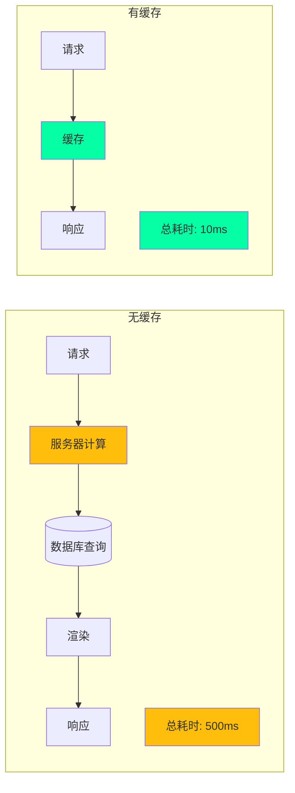

### Next.js 的缓存理念

:::tip{title="Next.js 缓存设计原则"}
1. **默认缓存**：尽可能多地缓存，最大化性能
2. **选择退出**：提供 API 让开发者选择不缓存
3. **多层缓存**：不同层级处理不同类型的数据
4. **智能失效**：提供多种重新验证策略
5. **透明化**：缓存行为可预测和可控
:::

---

## 四层缓存架构

### 完整的缓存层级

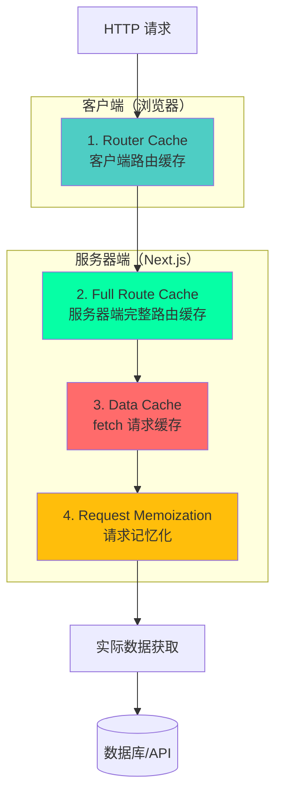

### 缓存层级对比表

| 缓存层 | 位置 | 作用 | 生命周期 | 失效方式 |
|--------|------|------|---------|---------|
| **Request Memoization** | 服务器（单个请求） | 去重相同请求 | 单次渲染 | 自动（请求结束） |
| **Data Cache** | 服务器（持久化） | 缓存 fetch 数据 | 持久化 | 手动/时间/按需 |
| **Full Route Cache** | 服务器（持久化） | 缓存完整页面 | 持久化 | 重新构建/重新验证 |
| **Router Cache** | 客户端（内存） | 缓存路由段 | 会话期间 | 时间/导航 |

### 缓存决策流程

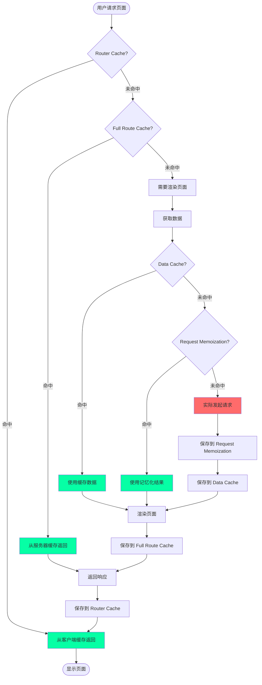

---

## Request Memoization 请求记忆化

### 什么是请求记忆化

Request Memoization 是 React 的一个特性，在单次渲染过程中自动缓存相同的 fetch 请求。

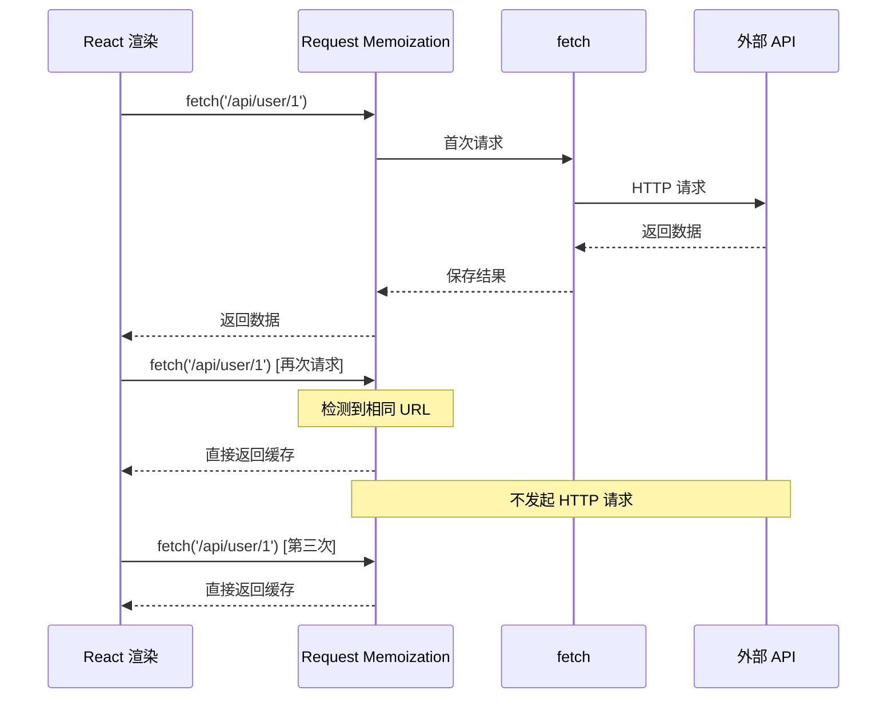

### 实际应用场景

```typescript
// app/components/UserProfile.tsx
async function UserProfile({ userId }: { userId: string }) {
  // 请求 1
  const user = await fetch(`/api/users/${userId}`).then(r => r.json());
  
  return <div>{user.name}</div>;
}

// app/components/UserPosts.tsx
async function UserPosts({ userId }: { userId: string }) {
  // 请求 2 - 相同的 URL
  const user = await fetch(`/api/users/${userId}`).then(r => r.json());
  
  return <div>Posts by {user.name}</div>;
}

// app/page.tsx
export default function Page() {
  return (
    <>
      {/* 虽然两个组件都请求相同数据，但实际只发起一次 HTTP 请求 */}
      <UserProfile userId="1" />
      <UserPosts userId="1" />
    </>
  );
}
```

### 工作原理

```typescript
// Next.js 内部实现（简化版）

class RequestMemoization {
  private cache: Map<string, Promise<any>> = new Map();

  async fetch(url: string, options?: RequestInit) {
    // 生成缓存键
    const cacheKey = this.generateKey(url, options);

    // 检查缓存
    if (this.cache.has(cacheKey)) {
      console.log('✅ Request Memoization 命中:', url);
      return this.cache.get(cacheKey);
    }

    // 发起请求并缓存 Promise
    console.log('🔴 Request Memoization 未命中，发起请求:', url);
    const promise = fetch(url, options).then(r => r.json());
    this.cache.set(cacheKey, promise);

    return promise;
  }

  // 渲染结束后清空缓存
  clear() {
    this.cache.clear();
  }

  private generateKey(url: string, options?: RequestInit): string {
    return `${url}:${JSON.stringify(options)}`;
  }
}

// 每次 React 渲染时使用新的实例
const memoization = new RequestMemoization();
```

### 特点与限制

:::warning{title="Request Memoization 特点"}
- ✅ **自动启用**：无需任何配置
- ✅ **仅限 GET**：只对 GET 请求有效
- ✅ **仅限 fetch**：只缓存 fetch API 调用
- ⚠️ **生命周期短**：仅在单次渲染期间有效
- ⚠️ **服务器端**：只在 Server Components 中生效
- ❌ **不跨请求**：不同用户请求不共享缓存
:::

---

## Data Cache 数据缓存

### 什么是数据缓存

Data Cache 是服务器端的持久化缓存，用于存储 fetch 请求的结果。

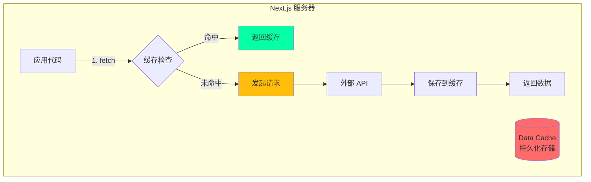

### 默认缓存行为

```typescript
// 默认情况下，所有 fetch 请求都会被缓存

// ✅ 这个请求会被永久缓存
async function getUser() {
  const res = await fetch('https://api.example.com/user');
  return res.json();
}

// 等效于
async function getUserWithOptions() {
  const res = await fetch('https://api.example.com/user', {
    cache: 'force-cache' // 默认值
  });
  return res.json();
}

// ❌ 这个请求不会被缓存
async function getUserNoCache() {
  const res = await fetch('https://api.example.com/user', {
    cache: 'no-store' // 选择退出缓存
  });
  return res.json();
}
```

### 缓存选项详解

```typescript
// 1. force-cache（默认）- 永久缓存
fetch('https://api.example.com/data', {
  cache: 'force-cache'
});

// 2. no-store - 不缓存，每次都重新获取
fetch('https://api.example.com/data', {
  cache: 'no-store'
});

// 3. 时间重新验证 - 缓存 60 秒
fetch('https://api.example.com/data', {
  next: { revalidate: 60 }
});

// 4. 标签重新验证 - 按需失效
fetch('https://api.example.com/data', {
  next: { tags: ['users'] }
});
```

### Data Cache 架构

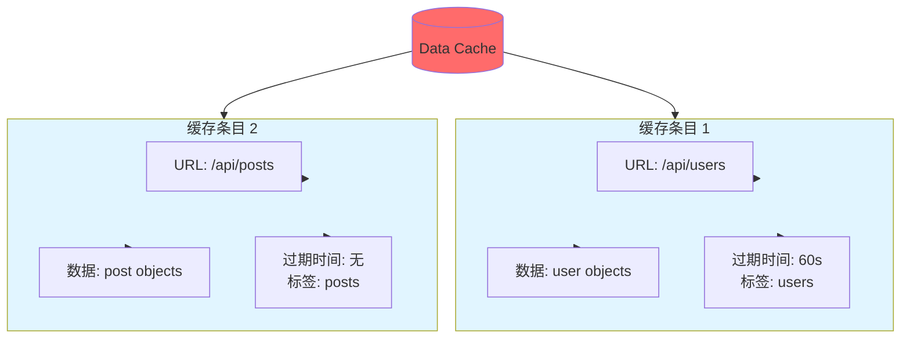

### 数据缓存流程

```typescript
// Next.js 内部 Data Cache 实现（简化版）

class DataCache {
  private cache: Map<string, CacheEntry> = new Map();

  async fetch(url: string, options?: FetchOptions) {
    const cacheKey = this.getCacheKey(url, options);
    const entry = this.cache.get(cacheKey);

    // 检查缓存
    if (entry && !this.isExpired(entry)) {
      console.log('✅ Data Cache 命中:', url);
      return entry.data;
    }

    // 缓存未命中或已过期
    console.log('🔴 Data Cache 未命中，发起请求:', url);
    const data = await fetch(url, options).then(r => r.json());

    // 保存到缓存
    this.cache.set(cacheKey, {
      data,
      timestamp: Date.now(),
      revalidate: options?.next?.revalidate,
      tags: options?.next?.tags,
    });

    return data;
  }

  private isExpired(entry: CacheEntry): boolean {
    if (!entry.revalidate) return false; // 永久缓存
    return Date.now() - entry.timestamp > entry.revalidate * 1000;
  }

  // 按标签失效
  revalidateTag(tag: string) {
    for (const [key, entry] of this.cache.entries()) {
      if (entry.tags?.includes(tag)) {
        this.cache.delete(key);
      }
    }
  }
}

interface CacheEntry {
  data: any;
  timestamp: number;
  revalidate?: number;
  tags?: string[];
}
```

---

## Full Route Cache 完整路由缓存

### 什么是完整路由缓存

Full Route Cache 在构建时缓存整个路由的渲染结果（HTML 和 RSC Payload）。

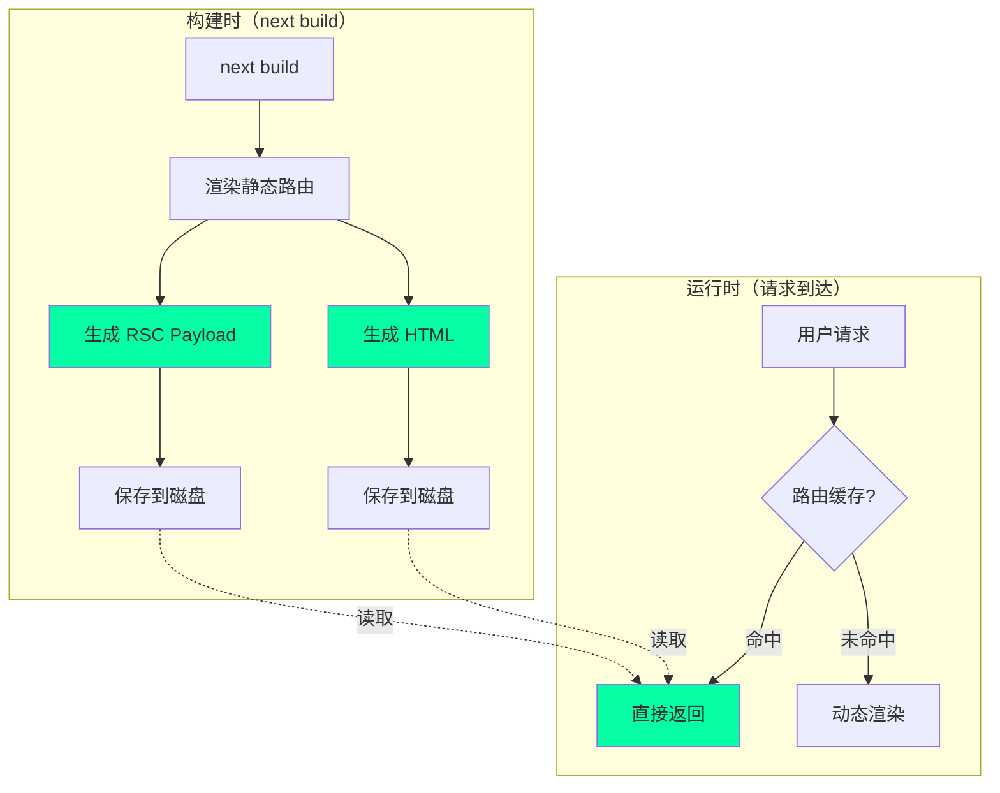

### 静态路由 vs 动态路由

```typescript
// 1. 静态路由 - 会被完整缓存
export default async function StaticPage() {
  // 使用默认缓存的 fetch
  const data = await fetch('https://api.example.com/data');
  
  return <div>{data.title}</div>;
}

// 2. 动态路由 - 不会被缓存（使用动态函数）
export default async function DynamicPage() {
  // cookies() 是动态函数，会导致整个路由变为动态
  const cookieStore = cookies();
  
  const data = await fetch('https://api.example.com/data');
  
  return <div>{data.title}</div>;
}

// 3. 部分动态路由 - 使用 dynamic 选项
export const dynamic = 'force-dynamic'; // 强制动态渲染

export default async function Page() {
  const data = await fetch('https://api.example.com/data');
  
  return <div>{data.title}</div>;
}
```

### 路由缓存决策树

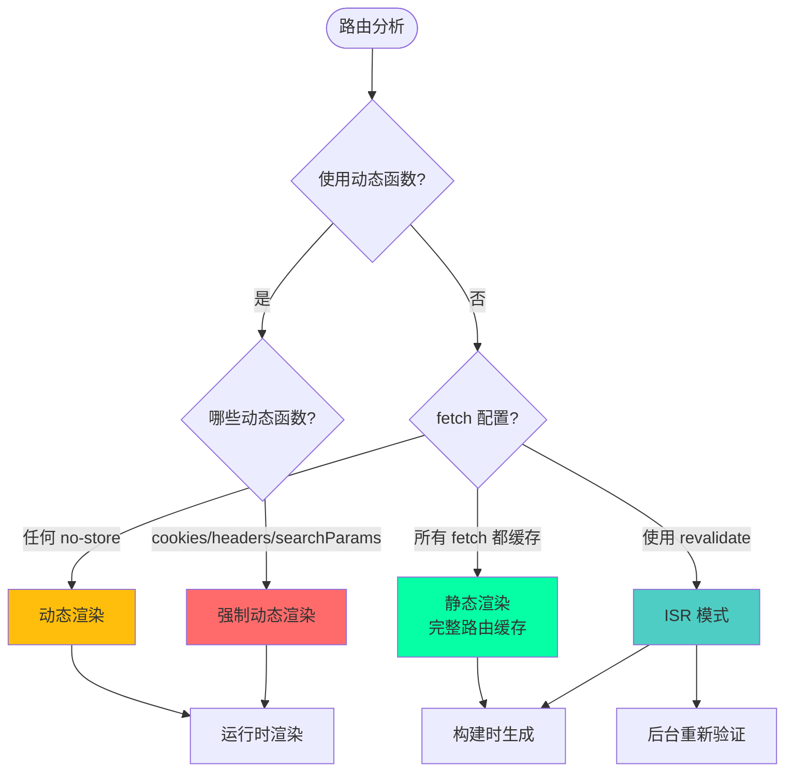

### 路由段配置选项

```typescript
// app/page.tsx

// 1. dynamic - 控制路由的动态行为
export const dynamic = 'auto'; // 默认：自动判断
export const dynamic = 'force-dynamic'; // 强制动态
export const dynamic = 'force-static'; // 强制静态
export const dynamic = 'error'; // 如果有动态则报错

// 2. dynamicParams - 控制动态参数
export const dynamicParams = true; // 默认：允许动态参数
export const dynamicParams = false; // 只允许 generateStaticParams 生成的参数

// 3. revalidate - 路由级别的重新验证
export const revalidate = false; // 默认：永久缓存
export const revalidate = 0; // 不缓存
export const revalidate = 60; // 60 秒后重新验证

// 4. fetchCache - 控制 fetch 缓存行为
export const fetchCache = 'auto'; // 默认
export const fetchCache = 'default-cache'; // 强制缓存
export const fetchCache = 'only-cache'; // 只使用缓存
export const fetchCache = 'force-cache'; // 强制缓存所有 fetch
export const fetchCache = 'default-no-store'; // 默认不缓存
export const fetchCache = 'only-no-store'; // 只不缓存
export const fetchCache = 'force-no-store'; // 强制所有 fetch 不缓存

export default function Page() {
  return <div>Page</div>;
}
```

---

## Router Cache 路由器缓存

### 什么是路由器缓存

Router Cache 是客户端的内存缓存，用于缓存已访问的路由段。

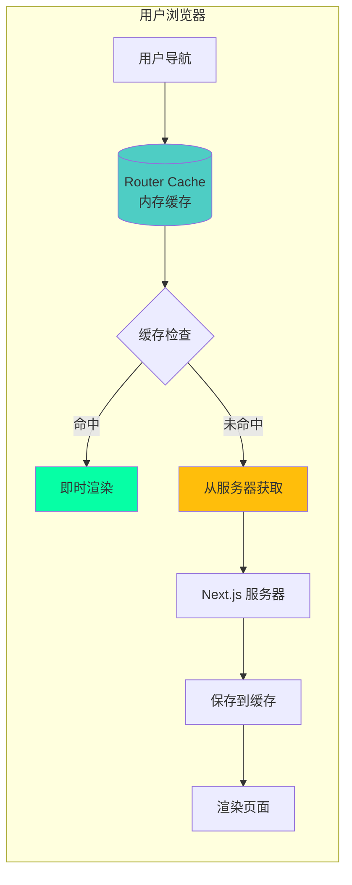

### 缓存行为

```typescript
// Router Cache 的行为取决于路由类型

// 1. 静态路由 - 缓存 5 分钟
<Link href="/about">About</Link>
// 首次访问：从服务器获取
// 5 分钟内：从 Router Cache 返回
// 5 分钟后：后台重新验证

// 2. 动态路由 - 缓存 30 秒
<Link href="/profile/123">Profile</Link>
// 首次访问：从服务器获取
// 30 秒内：从 Router Cache 返回
// 30 秒后：后台重新验证

// 3. 预取行为
<Link href="/products" prefetch={true}>
  Products
</Link>
// 链接进入视口时自动预取
// 预取的数据会保存到 Router Cache
```

### Router Cache 生命周期

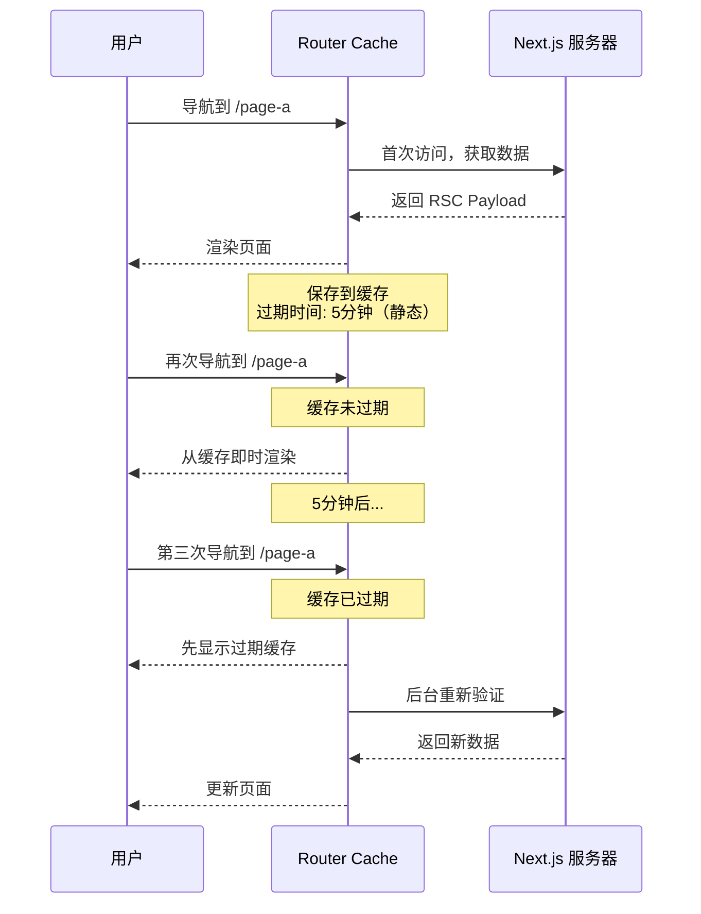

### 禁用 Router Cache

```typescript
// 1. 使用 router.refresh()
'use client';
import { useRouter } from 'next/navigation';

export default function RefreshButton() {
  const router = useRouter();
  
  return (
    <button onClick={() => router.refresh()}>
      刷新数据
    </button>
  );
}

// 2. 设置路由段配置
export const dynamic = 'force-dynamic';

// 3. 在链接上禁用预取
<Link href="/page" prefetch={false}>
  Page
</Link>

// 4. cookies() 和 headers() 会自动禁用 Router Cache
import { cookies } from 'next/headers';

export default async function Page() {
  const cookieStore = cookies(); // 这会禁用 Router Cache
  return <div>Page</div>;
}
```

---

## Revalidation 重新验证策略

### 三种重新验证方式

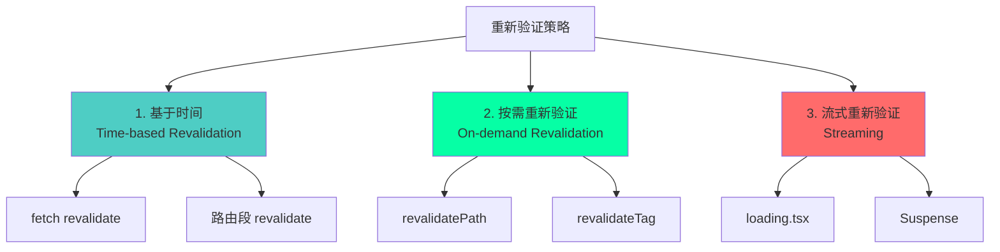

### 1. 基于时间的重新验证

```typescript
// 方式 1：fetch 级别
async function getData() {
  const res = await fetch('https://api.example.com/data', {
    next: { revalidate: 60 } // 60 秒后重新验证
  });
  return res.json();
}

// 方式 2：路由段级别
export const revalidate = 60; // 应用于整个路由

export default async function Page() {
  const data = await getData();
  return <div>{data.title}</div>;
}

// 方式 3：不同的 fetch 有不同的重新验证时间
export default async function Page() {
  // 这个请求 10 秒后重新验证
  const posts = await fetch('https://api.example.com/posts', {
    next: { revalidate: 10 }
  });

  // 这个请求 60 秒后重新验证
  const users = await fetch('https://api.example.com/users', {
    next: { revalidate: 60 }
  });

  // 路由的重新验证时间是最短的那个（10 秒）
  return <div>...</div>;
}
```

### 时间重新验证流程

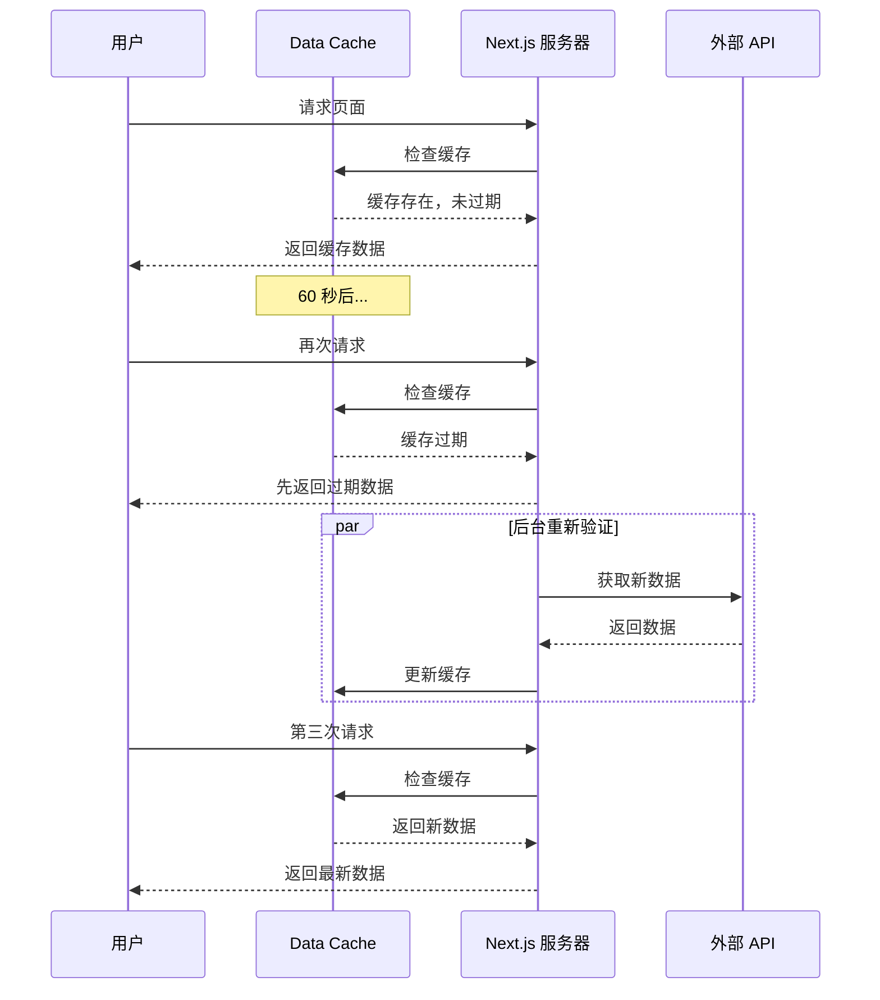

### 2. 按需重新验证

```typescript
// app/actions.ts
'use server';

import { revalidatePath, revalidateTag } from 'next/cache';

// 方式 1：按路径重新验证
export async function revalidatePostPath() {
  revalidatePath('/posts'); // 重新验证 /posts 路由
  revalidatePath('/posts/[slug]', 'page'); // 重新验证特定页面
  revalidatePath('/posts', 'layout'); // 重新验证布局
  revalidatePath('/', 'page'); // 重新验证首页
}

// 方式 2：按标签重新验证
export async function revalidatePostTag() {
  revalidateTag('posts'); // 重新验证所有带 'posts' 标签的 fetch
  revalidateTag('users'); // 重新验证所有带 'users' 标签的 fetch
}

// 实际使用
export async function createPost(data: FormData) {
  // 创建文章
  await db.posts.create({
    title: data.get('title'),
    content: data.get('content'),
  });

  // 重新验证文章列表
  revalidatePath('/posts');
  revalidateTag('posts');
}
```

### 使用标签的数据获取

```typescript
// app/lib/data.ts

// 给 fetch 添加标签
export async function getPosts() {
  const res = await fetch('https://api.example.com/posts', {
    next: { tags: ['posts'] } // 添加标签
  });
  return res.json();
}

export async function getPost(id: string) {
  const res = await fetch(`https://api.example.com/posts/${id}`, {
    next: { tags: ['posts', `post-${id}`] } // 多个标签
  });
  return res.json();
}

// app/posts/page.tsx
export default async function PostsPage() {
  const posts = await getPosts();
  return <PostList posts={posts} />;
}

// app/actions.ts
'use server';

export async function updatePost(id: string, data: FormData) {
  // 更新文章
  await db.posts.update(id, data);

  // 重新验证特定文章和文章列表
  revalidateTag(`post-${id}`);
  revalidateTag('posts');
}
```

### 按需重新验证流程

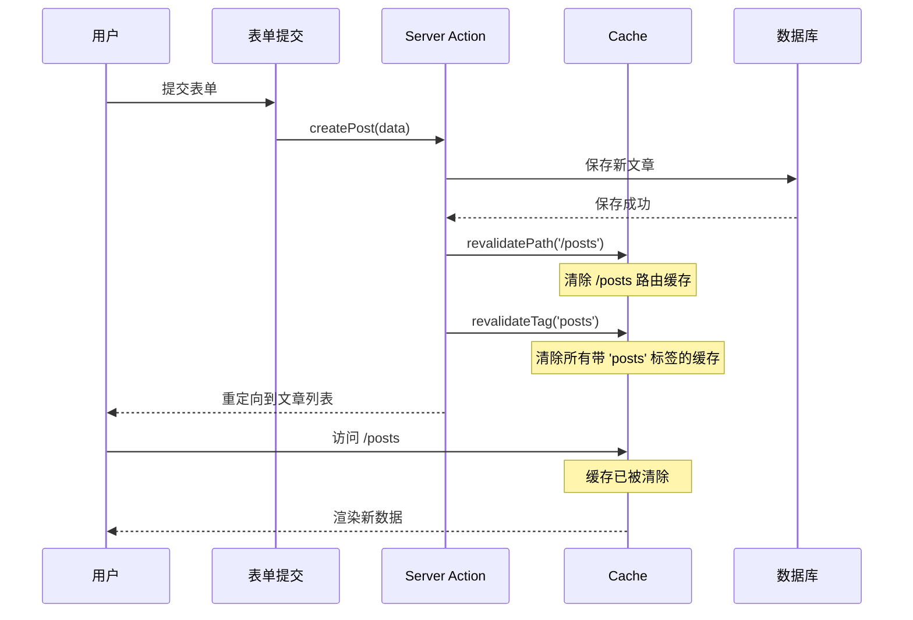

---

## ISR 增量静态再生

### 什么是 ISR

ISR（Incremental Static Regeneration）允许你在构建后更新静态页面，无需重新构建整个站点。

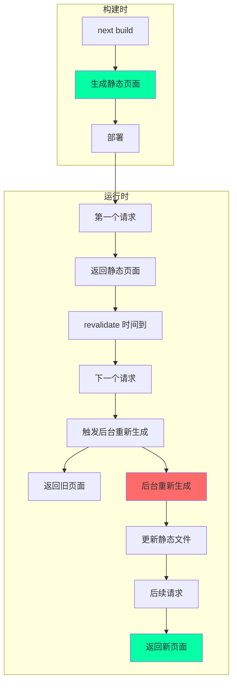

### ISR 实现方式

```typescript
// 1. 使用 revalidate 选项
export default async function BlogPost({ params }: { params: { slug: string } }) {
  const post = await fetch(`https://api.example.com/posts/${params.slug}`, {
    next: { revalidate: 60 } // 60 秒后重新生成
  });

  return <article>{post.title}</article>;
}

// 2. 路由段级别的 ISR
export const revalidate = 60; // 60 秒

export default async function Page() {
  const data = await fetch('https://api.example.com/data');
  return <div>{data.title}</div>;
}

// 3. 生成静态参数
export async function generateStaticParams() {
  const posts = await fetch('https://api.example.com/posts').then(r => r.json());

  return posts.map((post: any) => ({
    slug: post.slug,
  }));
}

// 4. 按需 ISR
// 使用 revalidatePath 或 revalidateTag 触发重新生成
```

### ISR 完整流程

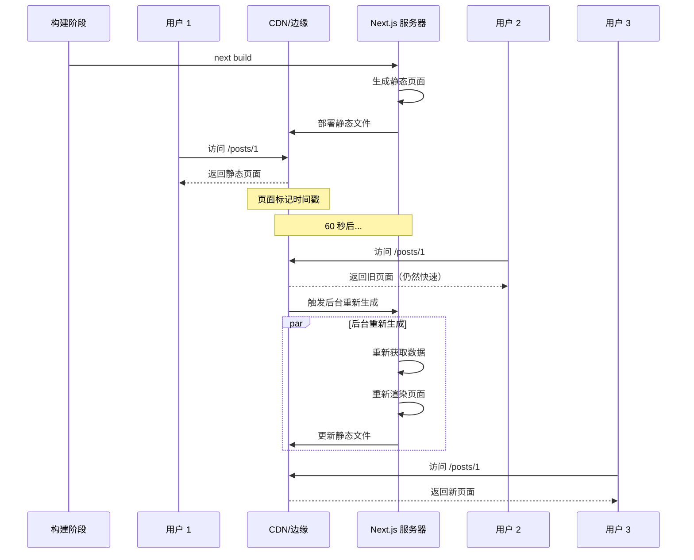

### ISR 的优势与限制

:::tip{title="ISR 优势"}
1. **构建时间短**：不需要构建所有页面
2. **内容新鲜**：可以定期更新静态内容
3. **性能好**：静态页面性能优异
4. **按需生成**：首次访问时生成页面
5. **渐进式更新**：不需要重新部署
:::

:::warning{title="ISR 限制"}
1. **首次访问慢**：未生成的页面首次访问需要渲染
2. **缓存延迟**：更新需要等待下一次访问
3. **存储成本**：需要存储静态文件
4. **复杂度**：需要理解缓存失效机制
:::

---

## 缓存优化最佳实践

### 1. 选择合适的缓存策略

```typescript
// ✅ 静态内容 - 使用完整路由缓存
export default async function AboutPage() {
  return <div>关于我们</div>;
}

// ✅ 更新频率低的内容 - 使用 ISR
export const revalidate = 3600; // 1 小时

export default async function BlogList() {
  const posts = await getPosts();
  return <PostList posts={posts} />;
}

// ✅ 更新频率高但可接受延迟 - 时间重新验证
export default async function Dashboard() {
  const stats = await fetch('https://api.example.com/stats', {
    next: { revalidate: 60 } // 1 分钟
  });
  return <Stats data={stats} />;
}

// ✅ 实时数据 - 不缓存
export default async function LiveData() {
  const data = await fetch('https://api.example.com/live', {
    cache: 'no-store'
  });
  return <LiveChart data={data} />;
}

// ✅ 用户特定数据 - 动态渲染
export default async function UserProfile() {
  const user = await getCurrentUser(); // 使用 cookies()
  return <Profile user={user} />;
}
```

### 2. 合理使用标签

```typescript
// 建立清晰的标签体系
export async function getPosts() {
  return fetch('https://api.example.com/posts', {
    next: { 
      tags: ['posts', 'content'] // 多个标签
    }
  });
}

export async function getPost(id: string) {
  return fetch(`https://api.example.com/posts/${id}`, {
    next: { 
      tags: ['posts', 'content', `post-${id}`] // 通用标签 + 特定标签
    }
  });
}

export async function getComments(postId: string) {
  return fetch(`https://api.example.com/posts/${postId}/comments`, {
    next: { 
      tags: ['comments', `post-${postId}-comments`]
    }
  });
}

// 按需失效
export async function updatePost(id: string) {
  await db.posts.update(id);
  
  revalidateTag(`post-${id}`); // 只失效这篇文章
  revalidateTag('posts'); // 失效文章列表
  // 不失效 'content' 标签（可能还有其他内容）
}
```

### 3. 优化数据获取

```typescript
// ❌ 不好：串行获取数据
export default async function Page() {
  const user = await getUser();
  const posts = await getPosts(user.id);
  const comments = await getComments(posts[0].id);
  
  return <Dashboard user={user} posts={posts} comments={comments} />;
}

// ✅ 好：并行获取数据
export default async function Page() {
  const [user, posts, comments] = await Promise.all([
    getUser(),
    getPosts(),
    getComments(),
  ]);
  
  return <Dashboard user={user} posts={posts} comments={comments} />;
}

// ✅ 更好：利用 Request Memoization
// 在不同组件中可以安全地重复调用，不会重复请求
export default async function Page() {
  return (
    <div>
      <UserProfile /> {/* 内部调用 getUser() */}
      <UserPosts />   {/* 内部也调用 getUser() */}
      {/* getUser() 只会执行一次 */}
    </div>
  );
}
```

### 4. 监控缓存性能

```typescript
// 添加性能监控
export async function getData() {
  const start = Date.now();
  const cacheStart = Date.now();
  
  const data = await fetch('https://api.example.com/data', {
    next: { 
      revalidate: 60,
      tags: ['data']
    }
  });
  
  const fetchTime = Date.now() - cacheStart;
  
  // 记录指标
  console.log({
    operation: 'getData',
    fetchTime,
    totalTime: Date.now() - start,
    cached: fetchTime < 100, // 假设缓存命中 < 100ms
  });
  
  return data.json();
}

// 使用响应头传递缓存信息
export async function GET() {
  const data = await getData();
  
  return Response.json(data, {
    headers: {
      'X-Cache-Status': 'HIT', // 或 'MISS'
      'Cache-Control': 'public, s-maxage=60',
    },
  });
}
```

### 5. 缓存调试

```typescript
// next.config.js
module.exports = {
  // 开启缓存日志
  logging: {
    fetches: {
      fullUrl: true,
    },
  },
};

// 在开发环境查看缓存状态
// Next.js 会在控制台输出：
// GET https://api.example.com/data 200 in 145ms (cache: HIT)
// GET https://api.example.com/users 200 in 523ms (cache: MISS)
```

---

## 常见问题与解决方案

### 问题 1：为什么我的页面没有被缓存？

```typescript
// 原因 1：使用了动态函数
import { cookies } from 'next/headers';

export default async function Page() {
  const cookieStore = cookies(); // ❌ 导致动态渲染
  return <div>Page</div>;
}

// 解决方案：避免在不需要时使用动态函数
export default async function Page() {
  // 不使用 cookies()，页面会被静态渲染
  return <div>Page</div>;
}

// 原因 2：fetch 使用了 no-store
export default async function Page() {
  const data = await fetch('https://api.example.com/data', {
    cache: 'no-store' // ❌ 导致动态渲染
  });
  return <div>{data.title}</div>;
}

// 解决方案：使用时间重新验证
export default async function Page() {
  const data = await fetch('https://api.example.com/data', {
    next: { revalidate: 60 } // ✅ 使用 ISR
  });
  return <div>{data.title}</div>;
}
```

### 问题 2：如何强制刷新缓存？

```typescript
// 方式 1：使用 revalidatePath
'use server';
import { revalidatePath } from 'next/cache';

export async function refreshPage() {
  revalidatePath('/posts');
}

// 方式 2：使用 revalidateTag
export async function refreshData() {
  revalidateTag('posts');
}

// 方式 3：在客户端使用 router.refresh()
'use client';
import { useRouter } from 'next/navigation';

export function RefreshButton() {
  const router = useRouter();
  return (
    <button onClick={() => router.refresh()}>
      刷新
    </button>
  );
}

// 方式 4：在构建时清除缓存
// 删除 .next 目录
// rm -rf .next
// next build
```

### 问题 3：如何处理大量动态路由？

```typescript
// 问题：有 10000 篇文章，不能全部预生成

// ❌ 不好：生成所有页面
export async function generateStaticParams() {
  const posts = await getAllPosts(); // 10000 篇文章
  return posts.map(post => ({ slug: post.slug }));
}

// ✅ 好：只生成热门页面 + ISR
export async function generateStaticParams() {
  const popularPosts = await getPopularPosts(100); // 只生成前 100 篇
  return popularPosts.map(post => ({ slug: post.slug }));
}

export const dynamicParams = true; // 允许其他参数在首次访问时生成

export const revalidate = 3600; // 1 小时后重新生成

export default async function BlogPost({ params }: { params: { slug: string } }) {
  const post = await getPost(params.slug);
  
  if (!post) {
    notFound();
  }
  
  return <Article post={post} />;
}
```

### 问题 4：如何在 API Route 中使用缓存？

```typescript
// app/api/posts/route.ts

// ✅ 使用 fetch 缓存
export async function GET() {
  const posts = await fetch('https://api.example.com/posts', {
    next: { 
      revalidate: 60,
      tags: ['posts']
    }
  });

  return Response.json(await posts.json());
}

// ✅ 使用路由段配置
export const revalidate = 60;

export async function GET() {
  const posts = await fetch('https://api.example.com/posts');
  return Response.json(await posts.json());
}

// ✅ 使用 unstable_cache（实验性）
import { unstable_cache } from 'next/cache';

const getCachedPosts = unstable_cache(
  async () => {
    const posts = await db.posts.findMany();
    return posts;
  },
  ['posts'],
  { revalidate: 60, tags: ['posts'] }
);

export async function GET() {
  const posts = await getCachedPosts();
  return Response.json(posts);
}
```

### 问题 5：如何调试缓存问题？

```typescript
// 1. 开启 Next.js 缓存日志
// next.config.js
module.exports = {
  logging: {
    fetches: {
      fullUrl: true,
    },
  },
};

// 2. 添加自定义日志
export async function getData() {
  console.log('⏰ [Cache Debug] 开始获取数据');
  
  const start = Date.now();
  const data = await fetch('https://api.example.com/data', {
    next: { revalidate: 60, tags: ['data'] }
  });
  
  console.log(`✅ [Cache Debug] 数据获取完成，耗时: ${Date.now() - start}ms`);
  console.log(`📊 [Cache Debug] 缓存状态:`, {
    url: data.url,
    cached: Date.now() - start < 100,
  });
  
  return data.json();
}

// 3. 使用 React DevTools Profiler
// 在客户端组件中使用 Profiler 查看渲染性能

// 4. 检查响应头
export async function GET() {
  const data = await getData();
  
  return Response.json(data, {
    headers: {
      'X-Cache-Time': new Date().toISOString(),
      'X-Cache-Status': 'HIT',
      'Cache-Control': 'public, s-maxage=60, stale-while-revalidate=300',
    },
  });
}
```

---

## 总结

### 缓存决策流程图

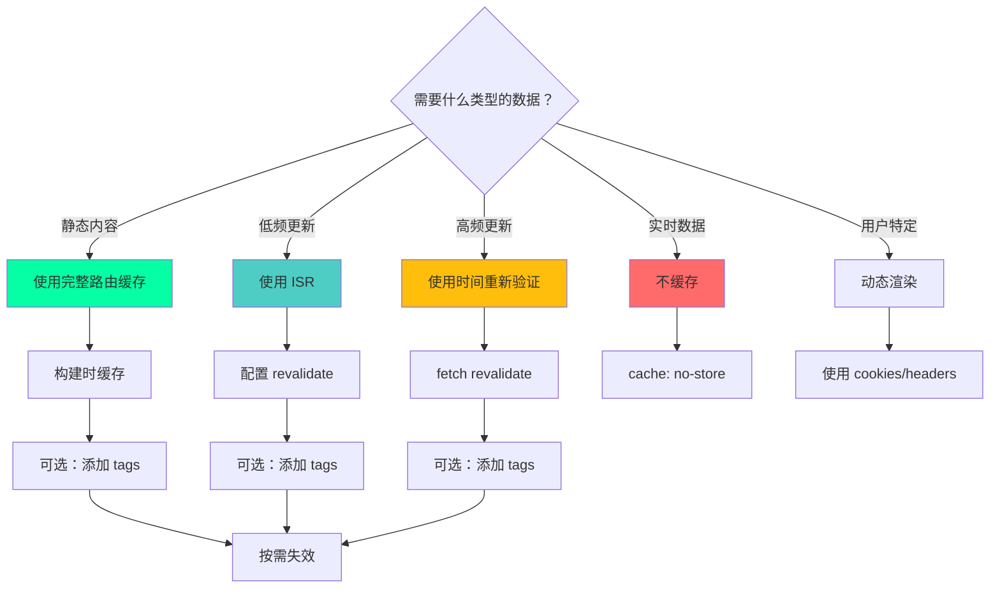

### 核心要点

:::tip{title="缓存核心原则"}
1. **默认缓存**：Next.js 尽可能多地缓存数据
2. **四层架构**：Request Memoization → Data Cache → Full Route Cache → Router Cache
3. **多种策略**：时间重新验证、按需重新验证、流式渲染
4. **智能失效**：使用 tags 和 paths 精确控制缓存失效
5. **性能优先**：合理使用缓存可以大幅提升性能
:::

### 最佳实践总结

| 场景 | 推荐策略 | 配置示例 |
|------|---------|---------|
| **静态内容** | 完整路由缓存 | 默认配置 |
| **博客文章** | ISR | `revalidate: 3600` |
| **新闻动态** | 时间重新验证 | `revalidate: 60` |
| **用户仪表板** | 动态渲染 | 使用 `cookies()` |
| **实时数据** | 不缓存 | `cache: 'no-store'` |
| **API 路由** | fetch 缓存 + tags | `tags: ['api']` |

### 缓存层级选择指南

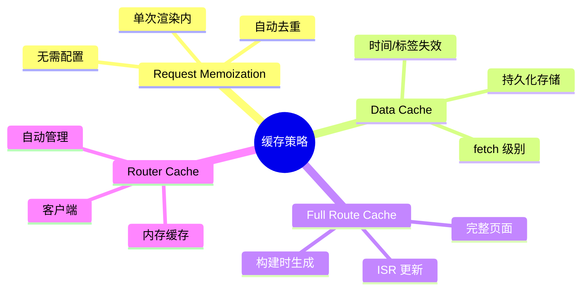

---

## 参考资源

- [Next.js Caching 官方文档](https://nextjs.org/docs/app/building-your-application/caching)
- [Data Fetching and Caching](https://nextjs.org/docs/app/building-your-application/data-fetching/fetching-caching-and-revalidating)
- [Incremental Static Regeneration](https://nextjs.org/docs/app/building-your-application/data-fetching/incremental-static-regeneration)
- [Revalidating Data](https://nextjs.org/docs/app/building-your-application/data-fetching/revalidating)
