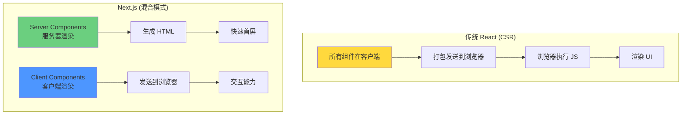
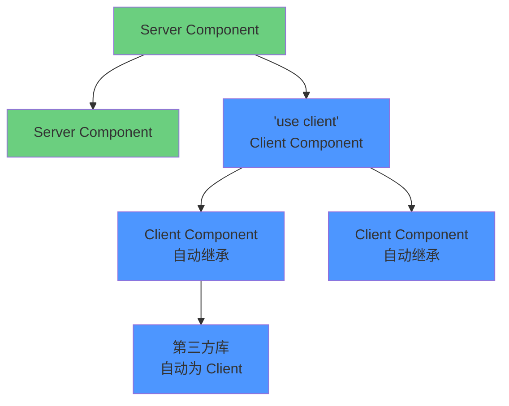
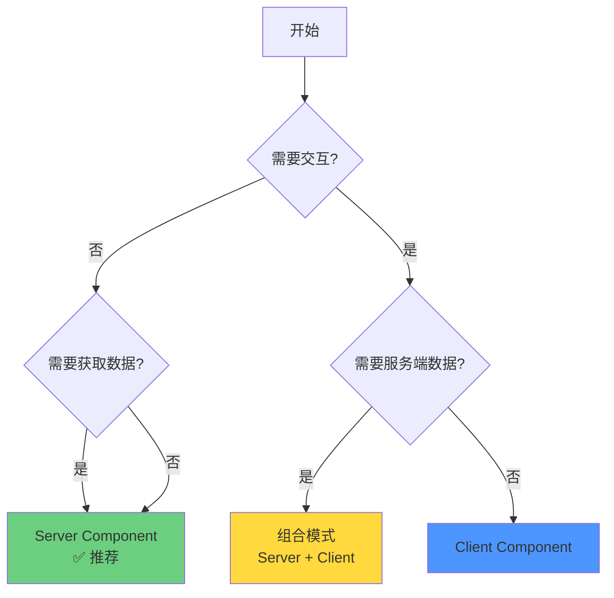
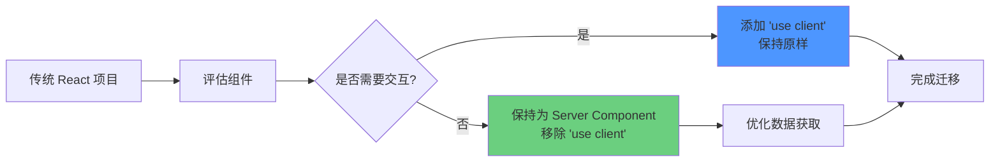
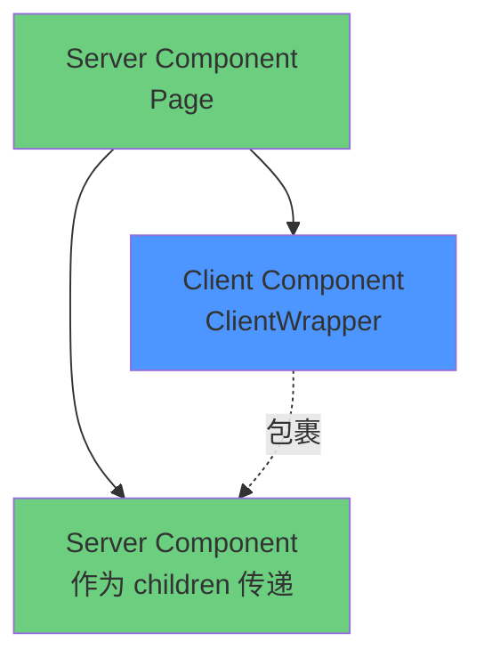
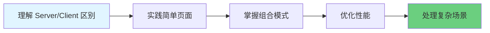

# 从 React 到 Next.js：Client Components 与 Server Components 完全指南

作为一名 React 开发者，当你首次接触 Next.js 时，最大的概念转变就是理解 **Server Components** 和 **Client Components**。本文将帮助你从 React 思维平滑过渡到 Next.js，掌握这两种组件的本质区别和最佳实践。

## 目录

1. [核心概念对比](#核心概念对比)
2. [Server Components 详解](#server-components-详解)
3. [Client Components 详解](#client-components-详解)
4. [组件选择决策树](#组件选择决策树)
5. [兼容性与迁移](#兼容性与迁移)
6. [常见问题与解决方案](#常见问题与解决方案)
7. [最佳实践](#最佳实践)

---

## 核心概念对比

### React vs Next.js：思维模式转变



### 关键区别一览表

| 特性 | 传统 React | Next.js Server Components | Next.js Client Components |
|------|-----------|---------------------------|---------------------------|
| **运行环境** | 仅浏览器 | 仅服务器 | 浏览器 (服务器预渲染) |
| **包体积** | 全部发送到客户端 | 不发送到客户端 | 发送到客户端 |
| **数据获取** | useEffect + API 调用 | 直接访问数据库/文件系统 | useEffect + API 调用 |
| **状态管理** | useState/useReducer | ❌ 不支持 | ✅ 支持 |
| **生命周期** | 所有 Hooks | ❌ 不支持 | ✅ 支持 |
| **事件监听** | onClick/onChange 等 | ❌ 不支持 | ✅ 支持 |
| **浏览器 API** | window/localStorage 等 | ❌ 不支持 | ✅ 支持 |
| **后端资源** | ❌ 不可访问 | ✅ 可直接访问 | ❌ 需要 API |
| **SEO** | 需要额外处理 | ✅ 原生支持 | ⚠️ 需配置 |

---

## Server Components 详解

### 什么是 Server Components？

Server Components 是**仅在服务器上运行**的 React 组件，它们：
- 永远不会发送到客户端
- 可以直接访问后端资源（数据库、文件系统等）
- 不增加客户端 JavaScript 包体积
- 适合数据密集型操作

### 基本语法

在 Next.js App Router 中，**默认所有组件都是 Server Components**：

```typescript
// app/page.tsx - 这是一个 Server Component (默认)
import { db } from '@/lib/db';

export default async function HomePage() {
  // ✅ 可以直接查询数据库
  const posts = await db.post.findMany({
    orderBy: { createdAt: 'desc' },
    take: 10
  });

  // ✅ 可以读取文件系统
  const data = await fs.readFile('./data.json', 'utf-8');

  // ✅ 可以使用环境变量（服务器端）
  const apiKey = process.env.SECRET_API_KEY;

  return (
    <div>
      <h1>最新文章</h1>
      <ul>
        {posts.map(post => (
          <li key={post.id}>{post.title}</li>
        ))}
      </ul>
    </div>
  );
}
```

### Server Components 的优势

#### 1. 零客户端 JavaScript

```typescript
// Server Component
import { HeavyMarkdownParser } from 'heavy-library'; // 2MB

export default async function Article({ slug }: { slug: string }) {
  const content = await getArticle(slug);
  const html = HeavyMarkdownParser.parse(content);
  
  return <div dangerouslySetInnerHTML={{ __html: html }} />;
}
```

**结果：**
- ✅ `heavy-library` (2MB) 不会发送到客户端
- ✅ 仅发送解析后的 HTML
- ✅ 客户端包体积减少 2MB

#### 2. 直接访问后端资源

```typescript
// ❌ 传统 React 方式
export default function UserProfile() {
  const [user, setUser] = useState(null);
  
  useEffect(() => {
    fetch('/api/user')
      .then(res => res.json())
      .then(setUser);
  }, []);

  if (!user) return <Loading />;
  return <div>{user.name}</div>;
}

// ✅ Next.js Server Component 方式
export default async function UserProfile() {
  // 直接查询数据库，无需 API 路由
  const user = await db.user.findUnique({ 
    where: { id: 1 } 
  });

  return <div>{user.name}</div>;
}
```

**优势对比：**
- ✅ 减少一次网络往返
- ✅ 无需创建 API 路由
- ✅ 更快的数据获取
- ✅ 更好的类型安全

#### 3. 自动代码分割

```typescript
// Server Component 会自动分割
import { Chart } from 'react-chartjs-2';  // 大型库

export default async function Dashboard() {
  const data = await getAnalytics();
  
  return <Chart data={data} />;
}
```

**自动优化：**
- 仅在访问此页面时加载 Chart 库
- 其他页面不受影响
- 无需手动 `dynamic import`

### Server Components 的限制

#### ❌ 不能使用的特性

```typescript
// ❌ 错误：Server Component 不能使用状态
export default function ServerCounter() {
  const [count, setCount] = useState(0); // 错误！
  return <div>{count}</div>;
}

// ❌ 错误：不能使用生命周期
export default function ServerEffect() {
  useEffect(() => {  // 错误！
    console.log('mounted');
  }, []);
  return <div>Hello</div>;
}

// ❌ 错误：不能使用浏览器 API
export default function ServerBrowser() {
  const data = localStorage.getItem('key'); // 错误！
  return <div>{data}</div>;
}

// ❌ 错误：不能添加事件监听器
export default function ServerClick() {
  return (
    <button onClick={() => alert('Hi')}>  {/* 错误！*/}
      点击
    </button>
  );
}
```

---

## Client Components 详解

### 什么是 Client Components？

Client Components 是在**客户端运行**的 React 组件（但会先在服务器预渲染）。它们：
- 可以使用所有 React Hooks
- 可以访问浏览器 API
- 支持交互和状态管理
- 类似传统 React 组件

### 如何声明 Client Component

使用 `'use client'` 指令：

```typescript
// components/Counter.tsx
'use client';  // 👈 必须在文件顶部

import { useState } from 'react';

export default function Counter() {
  const [count, setCount] = useState(0);

  return (
    <div>
      <p>Count: {count}</p>
      <button onClick={() => setCount(count + 1)}>
        增加
      </button>
    </div>
  );
}
```

:::info{title="重要提示"}
- `'use client'` 必须在文件**最顶部**（在 imports 之前）
- 只需在文件入口声明一次
- 该文件的所有导入也会成为 Client Components
:::

### Client Components 完整功能

```typescript
'use client';

import { useState, useEffect, useContext } from 'react';

export default function FullFeaturedClient() {
  // ✅ 状态管理
  const [data, setData] = useState([]);
  
  // ✅ 副作用
  useEffect(() => {
    fetch('/api/data')
      .then(res => res.json())
      .then(setData);
  }, []);
  
  // ✅ 浏览器 API
  const handleSave = () => {
    localStorage.setItem('data', JSON.stringify(data));
    window.alert('保存成功！');
  };
  
  // ✅ 事件监听
  const handleClick = () => {
    console.log('点击了');
  };

  return (
    <div>
      <button onClick={handleClick}>点击</button>
      <button onClick={handleSave}>保存到本地</button>
      <ul>
        {data.map(item => (
          <li key={item.id}>{item.name}</li>
        ))}
      </ul>
    </div>
  );
}
```

### Client Component 的边界

`'use client'` 创建了一个边界：



**规则：**
1. `'use client'` 文件及其所有导入都是 Client Components
2. 不需要在每个子组件都标记
3. 第三方库自动继承边界

---

## 组件选择决策树

### 快速决策流程



### 详细选择指南

#### 何时使用 Server Components ✅

**场景 1: 数据获取**

```typescript
// ✅ 推荐：Server Component
export default async function BlogList() {
  const posts = await db.post.findMany();
  
  return (
    <ul>
      {posts.map(post => (
        <li key={post.id}>
          <h2>{post.title}</h2>
          <p>{post.excerpt}</p>
        </li>
      ))}
    </ul>
  );
}
```

**场景 2: 使用后端资源**

```typescript
// ✅ 推荐：Server Component
export default async function ConfigPage() {
  // 直接读取服务器文件
  const config = JSON.parse(
    await fs.readFile('./config.json', 'utf-8')
  );

  // 使用服务器环境变量
  const apiUrl = process.env.INTERNAL_API_URL;

  return <div>{config.appName}</div>;
}
```

**场景 3: 大型依赖库**

```typescript
// ✅ 推荐：Server Component
import { parse } from 'big-markdown-library'; // 5MB

export default async function MarkdownRenderer({ 
  content 
}: { 
  content: string 
}) {
  const html = parse(content);
  return <div dangerouslySetInnerHTML={{ __html: html }} />;
}
// 5MB 的库不会发送到客户端！
```

#### 何时使用 Client Components ✅

**场景 1: 交互性**

```typescript
// ✅ 必须：Client Component
'use client';

export default function LikeButton() {
  const [likes, setLikes] = useState(0);
  
  return (
    <button onClick={() => setLikes(likes + 1)}>
      ❤️ {likes}
    </button>
  );
}
```

**场景 2: 浏览器 API**

```typescript
// ✅ 必须：Client Component
'use client';

export default function ThemeToggle() {
  const [theme, setTheme] = useState('light');
  
  useEffect(() => {
    const saved = localStorage.getItem('theme');
    if (saved) setTheme(saved);
  }, []);
  
  const toggle = () => {
    const newTheme = theme === 'light' ? 'dark' : 'light';
    setTheme(newTheme);
    localStorage.setItem('theme', newTheme);
  };
  
  return <button onClick={toggle}>切换主题</button>;
}
```

**场景 3: 表单和输入**

```typescript
// ✅ 推荐：Client Component
'use client';

export default function SearchBox() {
  const [query, setQuery] = useState('');
  
  const handleSubmit = (e: React.FormEvent) => {
    e.preventDefault();
    // 处理搜索
  };
  
  return (
    <form onSubmit={handleSubmit}>
      <input
        value={query}
        onChange={(e) => setQuery(e.target.value)}
        placeholder="搜索..."
      />
      <button type="submit">搜索</button>
    </form>
  );
}
```

### 组合模式（最佳实践）

当你需要同时使用服务端数据和客户端交互时：

```typescript
// app/blog/[slug]/page.tsx - Server Component
import { LikeButton } from './LikeButton';
import { CommentSection } from './CommentSection';

export default async function BlogPost({ 
  params 
}: { 
  params: { slug: string } 
}) {
  // ✅ 服务端获取数据
  const post = await db.post.findUnique({
    where: { slug: params.slug },
    include: { author: true }
  });

  return (
    <article>
      <h1>{post.title}</h1>
      <p>作者：{post.author.name}</p>
      
      {/* ✅ 静态内容保持为 Server Component */}
      <div className="prose">
        {post.content}
      </div>
      
      {/* ✅ 交互组件使用 Client Component */}
      <LikeButton postId={post.id} initialLikes={post.likes} />
      <CommentSection postId={post.id} />
    </article>
  );
}
```

```typescript
// LikeButton.tsx - Client Component
'use client';

import { useState } from 'react';

export function LikeButton({ 
  postId, 
  initialLikes 
}: { 
  postId: string;
  initialLikes: number;
}) {
  const [likes, setLikes] = useState(initialLikes);
  const [isLiked, setIsLiked] = useState(false);
  
  const handleLike = async () => {
    if (isLiked) return;
    
    setLikes(likes + 1);
    setIsLiked(true);
    
    await fetch(`/api/posts/${postId}/like`, { method: 'POST' });
  };
  
  return (
    <button 
      onClick={handleLike}
      disabled={isLiked}
      className={isLiked ? 'liked' : ''}
    >
      ❤️ {likes}
    </button>
  );
}
```

---

## 兼容性与迁移

### 从传统 React 迁移

#### 迁移策略



#### 步骤 1: 识别组件类型

**纯展示组件 → Server Component**

```typescript
// ❌ 传统 React
export function ProductCard({ product }) {
  return (
    <div>
      <h3>{product.name}</h3>
      <p>${product.price}</p>
    </div>
  );
}

// ✅ Next.js (无需修改，默认就是 Server Component)
export function ProductCard({ product }: { product: Product }) {
  return (
    <div>
      <h3>{product.name}</h3>
      <p>${product.price}</p>
    </div>
  );
}
```

**交互组件 → Client Component**

```typescript
// ❌ 传统 React
import { useState } from 'react';

export function AddToCart({ productId }) {
  const [isAdding, setIsAdding] = useState(false);
  // ...
}

// ✅ Next.js (添加 'use client')
'use client';

import { useState } from 'react';

export function AddToCart({ productId }: { productId: string }) {
  const [isAdding, setIsAdding] = useState(false);
  // ...
}
```

#### 步骤 2: 重构数据获取

**传统方式：**

```typescript
// ❌ 传统 React
export function UserDashboard() {
  const [user, setUser] = useState(null);
  const [posts, setPosts] = useState([]);
  
  useEffect(() => {
    // 两次独立的 API 调用
    fetch('/api/user').then(res => res.json()).then(setUser);
    fetch('/api/posts').then(res => res.json()).then(setPosts);
  }, []);

  if (!user || !posts) return <Loading />;
  
  return (
    <div>
      <h1>{user.name}</h1>
      <PostList posts={posts} />
    </div>
  );
}
```

**Next.js 方式：**

```typescript
// ✅ Next.js Server Component
export default async function UserDashboard() {
  // 并行获取数据，无需状态管理
  const [user, posts] = await Promise.all([
    db.user.findUnique({ where: { id: 1 } }),
    db.post.findMany({ where: { authorId: 1 } })
  ]);

  return (
    <div>
      <h1>{user.name}</h1>
      <PostList posts={posts} />
    </div>
  );
}
```

**优势：**
- ✅ 减少 2 次 API 调用
- ✅ 无需 Loading 状态
- ✅ 更简洁的代码
- ✅ 更好的性能

#### 步骤 3: 处理第三方库

很多 React 库依赖客户端特性，需要特殊处理：

**方案 1: 包装为 Client Component**

```typescript
// components/ReactQueryProvider.tsx
'use client';

import { QueryClient, QueryClientProvider } from '@tanstack/react-query';
import { useState } from 'react';

export function ReactQueryProvider({ 
  children 
}: { 
  children: React.ReactNode 
}) {
  const [queryClient] = useState(() => new QueryClient());

  return (
    <QueryClientProvider client={queryClient}>
      {children}
    </QueryClientProvider>
  );
}
```

```typescript
// app/layout.tsx - Server Component
import { ReactQueryProvider } from '@/components/ReactQueryProvider';

export default function RootLayout({ children }) {
  return (
    <html>
      <body>
        <ReactQueryProvider>
          {children}
        </ReactQueryProvider>
      </body>
    </html>
  );
}
```

**方案 2: 动态导入**

```typescript
// Client Component 中动态导入
'use client';

import dynamic from 'next/dynamic';

const Chart = dynamic(() => import('react-chartjs-2'), {
  ssr: false,  // 禁用服务端渲染
  loading: () => <p>加载图表...</p>
});

export function DashboardChart() {
  return <Chart data={data} />;
}
```

### 常见库的兼容性处理

#### React Context

```typescript
// ❌ 错误：在 Server Component 中使用 Context
import { createContext } from 'react';

export const ThemeContext = createContext('light');

export default function Layout({ children }) {
  return (
    <ThemeContext.Provider value="dark">  {/* 错误！*/}
      {children}
    </ThemeContext.Provider>
  );
}
```

```typescript
// ✅ 正确：包装为 Client Component
'use client';

import { createContext, useState } from 'react';

export const ThemeContext = createContext('light');

export function ThemeProvider({ children }: { children: React.ReactNode }) {
  const [theme, setTheme] = useState('light');

  return (
    <ThemeContext.Provider value={{ theme, setTheme }}>
      {children}
    </ThemeContext.Provider>
  );
}
```

```typescript
// app/layout.tsx
import { ThemeProvider } from '@/components/ThemeProvider';

export default function RootLayout({ children }) {
  return (
    <html>
      <body>
        <ThemeProvider>
          {children}
        </ThemeProvider>
      </body>
    </html>
  );
}
```

#### 状态管理库 (Redux/Zustand)

```typescript
// store/provider.tsx
'use client';

import { Provider } from 'react-redux';
import { store } from './store';

export function ReduxProvider({ children }: { children: React.ReactNode }) {
  return <Provider store={store}>{children}</Provider>;
}
```

```typescript
// app/layout.tsx
import { ReduxProvider } from '@/store/provider';

export default function RootLayout({ children }) {
  return (
    <html>
      <body>
        <ReduxProvider>
          {children}
        </ReduxProvider>
      </body>
    </html>
  );
}
```

---

## 常见问题与解决方案

### 问题 1: 如何在 Server 和 Client 之间共享数据？

**❌ 错误方式：**

```typescript
// Server Component
export default async function Page() {
  const data = await fetchData();
  
  // ❌ 不能直接传递函数
  return <ClientComponent onUpdate={async () => { ... }} />;
  
  // ❌ 不能传递复杂对象
  return <ClientComponent data={new Date()} />;  // Date 对象不可序列化
}
```

**✅ 正确方式：**

```typescript
// Server Component
export default async function Page() {
  const data = await fetchData();
  
  // ✅ 传递可序列化数据
  return (
    <ClientComponent 
      data={JSON.parse(JSON.stringify(data))}  // 确保可序列化
      timestamp={Date.now()}  // 传递数字而非 Date 对象
    />
  );
}
```

**可序列化数据类型：**
- ✅ 字符串、数字、布尔值
- ✅ 数组和对象（如果内容可序列化）
- ✅ null 和 undefined
- ❌ 函数
- ❌ 类实例（Date、Map、Set 等）
- ❌ Symbol

### 问题 2: Server Component 中不能使用 Context？

**场景：** 你想在 Server Component 中访问 theme：

```typescript
// ❌ 不可行
export default function ServerComponent() {
  const theme = useContext(ThemeContext);  // Server Component 不能用 Hooks
  return <div className={theme}>...</div>;
}
```

**解决方案 1: 通过 Props 传递**

```typescript
// layout.tsx (Server Component)
export default function Layout({ children }) {
  return (
    <ThemeProvider>  {/* Client Component */}
      <ThemedContent>{children}</ThemedContent>
    </ThemeProvider>
  );
}

// ThemedContent.tsx (Client Component)
'use client';

export function ThemedContent({ children }) {
  const { theme } = useTheme();
  
  return (
    <div className={theme}>
      {children}
    </div>
  );
}
```

**解决方案 2: 使用 Cookies/Headers**

```typescript
// Server Component
import { cookies } from 'next/headers';

export default function ServerComponent() {
  const theme = cookies().get('theme')?.value || 'light';
  
  return <div className={theme}>...</div>;
}
```

### 问题 3: 如何处理 "use client" 边界？

**问题：** 一旦标记 `'use client'`，所有导入都变成 Client Components

```typescript
// ❌ 问题：整个页面变成 Client Component
'use client';

import { ServerSideData } from './ServerSideData';  // 现在也是 Client！

export default function Page() {
  const [state, setState] = useState();
  return <div><ServerSideData /></div>;
}
```

**✅ 解决方案：提升 Client 边界**

```typescript
// page.tsx (Server Component)
import { ClientInteractive } from './ClientInteractive';
import { ServerSideData } from './ServerSideData';  // 保持为 Server

export default function Page() {
  return (
    <div>
      <ServerSideData />  {/* Server Component */}
      <ClientInteractive />  {/* Client Component */}
    </div>
  );
}

// ClientInteractive.tsx
'use client';

export function ClientInteractive() {
  const [state, setState] = useState();
  return <button onClick={...}>...</button>;
}
```

### 问题 4: "use client" 组件能包含 Server Component 吗？

**答案：** 不能直接包含，但可以通过 `children` 传递

```typescript
// ❌ 不可行
'use client';

import { ServerComponent } from './ServerComponent';

export function ClientWrapper() {
  return (
    <div>
      <ServerComponent />  {/* 会变成 Client Component！*/}
    </div>
  );
}
```

```typescript
// ✅ 正确方式：使用 children 模式
'use client';

export function ClientWrapper({ children }: { children: React.ReactNode }) {
  const [isOpen, setIsOpen] = useState(true);
  
  return (
    <div>
      <button onClick={() => setIsOpen(!isOpen)}>切换</button>
      {isOpen && children}  {/* children 可以是 Server Component */}
    </div>
  );
}
```

```typescript
// page.tsx (Server Component)
import { ClientWrapper } from './ClientWrapper';
import { ServerComponent } from './ServerComponent';

export default function Page() {
  return (
    <ClientWrapper>
      <ServerComponent />  {/* 保持为 Server Component */}
    </ClientWrapper>
  );
}
```

**原理图：**



### 问题 5: 第三方组件库的兼容性

很多现有的 React 组件库不是为 Next.js 设计的：

**问题：**

```typescript
// ❌ 可能报错
import { Button } from 'some-ui-library';

export default function Page() {
  return <Button>点击</Button>;  // 可能使用了 useContext 等 Client 特性
}
```

**解决方案：**

```typescript
// components/UIButton.tsx
'use client';

export { Button } from 'some-ui-library';
```

```typescript
// page.tsx
import { Button } from '@/components/UIButton';

export default function Page() {
  return <Button>点击</Button>;  // 现在可以工作了
}
```

### 问题 6: 环境变量的使用

**Server Component：**

```typescript
// ✅ 可以使用所有环境变量
export default async function Page() {
  const secret = process.env.DATABASE_URL;  // 安全，不会暴露
  const public = process.env.NEXT_PUBLIC_API_URL;  // 也可以用
  
  return <div>...</div>;
}
```

**Client Component：**

```typescript
'use client';

export function ClientComponent() {
  // ❌ 无法访问
  const secret = process.env.DATABASE_URL;  // undefined！
  
  // ✅ 只能访问 NEXT_PUBLIC_ 开头的
  const public = process.env.NEXT_PUBLIC_API_URL;  // 可以用
  
  return <div>{public}</div>;
}
```

:::warning{title="安全提示"}
永远不要在 Client Component 中使用敏感信息：
- ❌ API 密钥
- ❌ 数据库凭证
- ❌ 内部服务 URL

只在 Server Component 中使用这些信息。
:::

---

## 最佳实践

### 1. 默认使用 Server Components

```typescript
// ✅ 好习惯：默认为 Server Component
export default async function ProductList() {
  const products = await getProducts();
  
  return (
    <div>
      {products.map(product => (
        <ProductCard key={product.id} product={product} />
      ))}
    </div>
  );
}

// 只在必要时添加 'use client'
'use client';

export function AddToCartButton({ productId }) {
  // 需要交互，所以是 Client Component
}
```

**原则：** Server First，Client When Needed

### 2. 最小化 Client 边界

```typescript
// ❌ 不好：整个列表都是 Client Component
'use client';

export function ProductList({ products }) {
  return (
    <div>
      {products.map(product => (
        <div key={product.id}>
          <h3>{product.name}</h3>
          <AddToCartButton productId={product.id} />
        </div>
      ))}
    </div>
  );
}
```

```typescript
// ✅ 好：只有按钮是 Client Component
export function ProductList({ products }) {
  return (
    <div>
      {products.map(product => (
        <div key={product.id}>
          <h3>{product.name}</h3>
          <AddToCartButton productId={product.id} />
        </div>
      ))}
    </div>
  );
}

'use client';

export function AddToCartButton({ productId }) {
  const [isAdding, setIsAdding] = useState(false);
  // ...
}
```

### 3. 使用组合模式

```typescript
// ✅ 推荐的架构
// page.tsx (Server Component - 获取数据)
export default async function BlogPage({ params }) {
  const post = await getPost(params.slug);
  const comments = await getComments(params.slug);
  
  return (
    <article>
      {/* Server Component - 静态内容 */}
      <BlogHeader post={post} />
      <BlogContent content={post.content} />
      
      {/* Client Component - 交互功能 */}
      <LikeButton postId={post.id} initialLikes={post.likes} />
      <ShareButtons url={post.url} />
      <CommentList comments={comments} postId={post.id} />
    </article>
  );
}
```

### 4. 预加载数据

```typescript
// ✅ 并行预加载
export default async function Dashboard() {
  // 同时发起多个请求
  const userPromise = getUser();
  const postsPromise = getPosts();
  const statsPromise = getStats();
  
  // 等待所有完成
  const [user, posts, stats] = await Promise.all([
    userPromise,
    postsPromise,
    statsPromise
  ]);

  return (
    <div>
      <UserInfo user={user} />
      <Stats stats={stats} />
      <PostList posts={posts} />
    </div>
  );
}
```

### 5. 使用 Suspense 优化加载

```typescript
import { Suspense } from 'react';

export default function Page() {
  return (
    <div>
      {/* 快速加载的内容 */}
      <Header />
      
      {/* 慢速内容用 Suspense 包裹 */}
      <Suspense fallback={<PostsSkeleton />}>
        <Posts />
      </Suspense>
      
      <Suspense fallback={<CommentsSkeleton />}>
        <Comments />
      </Suspense>
    </div>
  );
}

async function Posts() {
  const posts = await fetchPosts();  // 慢
  return <PostList posts={posts} />;
}

async function Comments() {
  const comments = await fetchComments();  // 慢
  return <CommentList comments={comments} />;
}
```

### 6. 类型安全的 Props 传递

```typescript
// types.ts
export interface Product {
  id: string;
  name: string;
  price: number;
}

// Server Component
export default async function ProductPage({ 
  params 
}: { 
  params: { id: string } 
}) {
  const product: Product = await getProduct(params.id);
  
  // ✅ 类型安全的 props
  return <ProductClient product={product} />;
}

// Client Component
'use client';

export function ProductClient({ 
  product 
}: { 
  product: Product  // 明确的类型
}) {
  const [quantity, setQuantity] = useState(1);
  
  return (
    <div>
      <h1>{product.name}</h1>
      <p>${product.price}</p>
      <QuantitySelector 
        value={quantity} 
        onChange={setQuantity} 
      />
    </div>
  );
}
```

---

## 实战案例：构建一个博客

### 完整示例

```typescript
// app/blog/[slug]/page.tsx (Server Component)
import { db } from '@/lib/db';
import { notFound } from 'next/navigation';
import { Suspense } from 'react';

import { BlogHeader } from './BlogHeader';
import { BlogContent } from './BlogContent';
import { LikeButton } from './LikeButton';
import { CommentSection } from './CommentSection';
import { RelatedPosts } from './RelatedPosts';

// 生成静态参数
export async function generateStaticParams() {
  const posts = await db.post.findMany({ select: { slug: true } });
  return posts.map(post => ({ slug: post.slug }));
}

// 生成元数据
export async function generateMetadata({ 
  params 
}: { 
  params: { slug: string } 
}) {
  const post = await db.post.findUnique({
    where: { slug: params.slug }
  });

  if (!post) return { title: '未找到文章' };

  return {
    title: post.title,
    description: post.excerpt,
    openGraph: {
      title: post.title,
      description: post.excerpt,
      images: [post.coverImage]
    }
  };
}

// 主页面组件
export default async function BlogPostPage({ 
  params 
}: { 
  params: { slug: string } 
}) {
  // 并行获取数据
  const [post, relatedPosts] = await Promise.all([
    db.post.findUnique({
      where: { slug: params.slug },
      include: { author: true }
    }),
    db.post.findMany({
      where: { 
        slug: { not: params.slug },
        published: true 
      },
      take: 3
    })
  ]);

  if (!post) notFound();

  return (
    <article className="max-w-4xl mx-auto px-4 py-8">
      {/* Server Component - 静态头部 */}
      <BlogHeader 
        title={post.title}
        author={post.author}
        publishedAt={post.publishedAt}
        coverImage={post.coverImage}
      />

      {/* Server Component - 文章内容 */}
      <BlogContent content={post.content} />

      {/* Client Component - 互动按钮 */}
      <div className="flex gap-4 my-8">
        <LikeButton 
          postId={post.id} 
          initialLikes={post.likes} 
        />
      </div>

      {/* Suspense - 评论区异步加载 */}
      <Suspense fallback={<CommentsSkeleton />}>
        <CommentSection postId={post.id} />
      </Suspense>

      {/* Server Component - 相关文章 */}
      <aside className="mt-12">
        <h2 className="text-2xl font-bold mb-4">相关文章</h2>
        <RelatedPosts posts={relatedPosts} />
      </aside>
    </article>
  );
}

function CommentsSkeleton() {
  return (
    <div className="space-y-4">
      {[...Array(3)].map((_, i) => (
        <div key={i} className="animate-pulse">
          <div className="h-4 bg-gray-200 rounded w-1/4 mb-2" />
          <div className="h-20 bg-gray-200 rounded" />
        </div>
      ))}
    </div>
  );
}
```

```typescript
// BlogHeader.tsx (Server Component)
import Image from 'next/image';
import { formatDate } from '@/lib/utils';

interface Author {
  name: string;
  avatar: string;
}

export function BlogHeader({ 
  title, 
  author, 
  publishedAt, 
  coverImage 
}: {
  title: string;
  author: Author;
  publishedAt: Date;
  coverImage: string;
}) {
  return (
    <header className="mb-8">
      <h1 className="text-4xl font-bold mb-4">{title}</h1>
      
      <div className="flex items-center gap-4 mb-6">
        <Image
          src={author.avatar}
          alt={author.name}
          width={48}
          height={48}
          className="rounded-full"
        />
        <div>
          <p className="font-medium">{author.name}</p>
          <time className="text-gray-600">
            {formatDate(publishedAt)}
          </time>
        </div>
      </div>

      <Image
        src={coverImage}
        alt={title}
        width={1200}
        height={630}
        className="rounded-lg"
        priority
      />
    </header>
  );
}
```

```typescript
// LikeButton.tsx (Client Component)
'use client';

import { useState, useTransition } from 'react';

export function LikeButton({ 
  postId, 
  initialLikes 
}: {
  postId: string;
  initialLikes: number;
}) {
  const [likes, setLikes] = useState(initialLikes);
  const [isLiked, setIsLiked] = useState(false);
  const [isPending, startTransition] = useTransition();

  const handleLike = () => {
    if (isLiked) return;

    // 乐观更新
    setLikes(prev => prev + 1);
    setIsLiked(true);

    // 发送到服务器
    startTransition(async () => {
      try {
        const res = await fetch(`/api/posts/${postId}/like`, {
          method: 'POST'
        });

        if (!res.ok) {
          // 回滚
          setLikes(prev => prev - 1);
          setIsLiked(false);
        }
      } catch (error) {
        // 回滚
        setLikes(prev => prev - 1);
        setIsLiked(false);
      }
    });
  };

  return (
    <button
      onClick={handleLike}
      disabled={isLiked || isPending}
      className={`
        flex items-center gap-2 px-4 py-2 rounded-lg
        transition-colors
        ${isLiked 
          ? 'bg-red-100 text-red-600' 
          : 'bg-gray-100 hover:bg-gray-200'
        }
        disabled:opacity-50
      `}
    >
      <span className="text-xl">
        {isLiked ? '❤️' : '🤍'}
      </span>
      <span className="font-medium">{likes}</span>
    </button>
  );
}
```

```typescript
// CommentSection.tsx (Server Component)
import { db } from '@/lib/db';
import { CommentForm } from './CommentForm';
import { CommentList } from './CommentList';

export async function CommentSection({ postId }: { postId: string }) {
  const comments = await db.comment.findMany({
    where: { postId },
    include: { author: true },
    orderBy: { createdAt: 'desc' }
  });

  return (
    <section className="mt-12">
      <h2 className="text-2xl font-bold mb-6">
        评论 ({comments.length})
      </h2>

      {/* Client Component - 表单 */}
      <CommentForm postId={postId} />

      {/* Server Component - 评论列表 */}
      <CommentList comments={comments} />
    </section>
  );
}
```

```typescript
// CommentForm.tsx (Client Component)
'use client';

import { useState } from 'react';
import { useRouter } from 'next/navigation';

export function CommentForm({ postId }: { postId: string }) {
  const [content, setContent] = useState('');
  const [isSubmitting, setIsSubmitting] = useState(false);
  const router = useRouter();

  const handleSubmit = async (e: React.FormEvent) => {
    e.preventDefault();
    if (!content.trim()) return;

    setIsSubmitting(true);

    try {
      const res = await fetch(`/api/posts/${postId}/comments`, {
        method: 'POST',
        headers: { 'Content-Type': 'application/json' },
        body: JSON.stringify({ content })
      });

      if (res.ok) {
        setContent('');
        router.refresh();  // 刷新 Server Component
      }
    } finally {
      setIsSubmitting(false);
    }
  };

  return (
    <form onSubmit={handleSubmit} className="mb-8">
      <textarea
        value={content}
        onChange={(e) => setContent(e.target.value)}
        placeholder="写下你的评论..."
        className="w-full p-4 border rounded-lg resize-none"
        rows={4}
        disabled={isSubmitting}
      />
      <button
        type="submit"
        disabled={isSubmitting || !content.trim()}
        className="mt-2 px-6 py-2 bg-blue-600 text-white rounded-lg disabled:opacity-50"
      >
        {isSubmitting ? '提交中...' : '发表评论'}
      </button>
    </form>
  );
}
```

---

## 快速参考卡片

### Server Components ✅

**适用场景：**
- 📊 数据获取
- 🗄️ 访问数据库
- 🔐 使用 API 密钥
- 📦 使用大型依赖
- 🎨 静态内容展示

**可以做：**
```typescript
✅ async/await
✅ 直接查询数据库
✅ 读取文件系统
✅ 使用所有环境变量
✅ 访问后端 API
```

**不能做：**
```typescript
❌ useState/useReducer
❌ useEffect/useLayoutEffect
❌ onClick/onChange 等事件
❌ 浏览器 API (window/localStorage)
❌ React Context (useContext)
```

### Client Components ✅

**适用场景：**
- 🖱️ 用户交互
- 📝 表单输入
- 🎭 状态管理
- 🌐 浏览器 API
- ⏱️ 生命周期 Hooks

**可以做：**
```typescript
✅ 所有 React Hooks
✅ 事件监听器
✅ 浏览器 API
✅ React Context
✅ 状态和副作用
```

**限制：**
```typescript
⚠️ 不能直接访问数据库
⚠️ 只能用 NEXT_PUBLIC_ 环境变量
⚠️ 增加客户端包体积
```

### 组合模式速查

```typescript
// ✅ Server 包含 Client
<ServerComponent>
  <ClientComponent />
</ServerComponent>

// ✅ Client 通过 children 包含 Server
<ClientComponent>
  {children}  // 可以是 Server Component
</ClientComponent>

// ❌ Client 直接导入 Server
'use client';
import ServerComponent from './server';  // 会变成 Client！

// ✅ 正确传递数据
<ClientComponent 
  data={JSON.stringify(data)}  // 可序列化
  count={42}
  items={['a', 'b']}
/>

// ❌ 错误传递数据
<ClientComponent 
  onClick={() => {}}  // 函数
  date={new Date()}   // 非序列化对象
/>
```

---

## 总结

### 核心要点

1. **默认 Server，按需 Client**
   - Next.js 默认所有组件都是 Server Components
   - 只在需要交互时添加 `'use client'`

2. **理解渲染边界**
   - `'use client'` 创建边界
   - 边界内所有导入都是 Client Components
   - 通过 `children` 传递 Server Components

3. **数据获取策略**
   - Server Components: 直接访问数据源
   - Client Components: 通过 API 或 props 获取

4. **性能优化**
   - 最小化 Client 边界
   - 使用 Suspense 实现流式渲染
   - 并行预加载数据

5. **迁移策略**
   - 从展示组件开始
   - 识别交互边界
   - 逐步重构数据获取

### 学习路径建议



1. **第一周**: 理解概念，构建简单页面
2. **第二周**: 实践组合模式，处理数据流
3. **第三周**: 优化性能，使用 Suspense
4. **第四周**: 迁移现有项目，处理复杂场景

### 推荐资源

- [Next.js 官方文档 - Server Components](https://nextjs.org/docs/app/building-your-application/rendering/server-components)
- [React 文档 - Server Components](https://react.dev/blog/2023/03/22/react-labs-what-we-have-been-working-on-march-2023#react-server-components)
- [Next.js App Router 迁移指南](https://nextjs.org/docs/app/building-your-application/upgrading/app-router-migration)

---

:::tip{title="最后建议"}
不要试图一次性掌握所有概念。从简单的页面开始，逐步理解 Server 和 Client Components 的配合。记住：**Server Components 是默认的，Client Components 是可选的补充**。
:::

