# Edge Runtime 深度解析：边缘计算的运行时革命

Edge Runtime 不仅仅是一个技术概念，它代表了 Web 应用部署和执行的范式转变。本文将深入探讨 Edge Runtime 的本质、它在哪里运行、与各个平台和框架的关系，以及它究竟是运维概念还是研发概念。

## 目录

1. [Edge Runtime 是什么](#edge-runtime-是什么)
2. [Edge Runtime 的技术本质](#edge-runtime-的技术本质)
3. [Edge Runtime 运行在哪里](#edge-runtime-运行在哪里)
4. [Edge Runtime 与 Vercel 的关系](#edge-runtime-与-vercel-的关系)
5. [Edge Runtime 与 Next.js Middleware](#edge-runtime-与-nextjs-middleware)
6. [运维概念 vs 研发概念](#运维概念-vs-研发概念)
7. [不同平台的 Edge Runtime 实现](#不同平台的-edge-runtime-实现)
8. [Remix 的 Edge Runtime 实现](#remix-的-edge-runtime-实现)
9. [Edge Runtime 架构设计](#edge-runtime-架构设计)
10. [实战应用与最佳实践](#实战应用与最佳实践)

---

## Edge Runtime 是什么

### 定义与核心概念

**Edge Runtime** 是一个运行在边缘节点（Edge）上的轻量级 JavaScript 运行时环境，它基于 V8 引擎，实现了 Web 标准 API，为无服务器函数提供极快的启动速度和全球分布式执行能力。

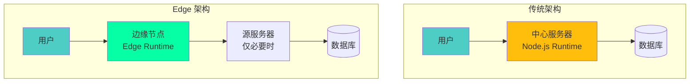

### 核心特性

:::tip{title="Edge Runtime 的核心优势"}
1. **极快启动**：冷启动时间 < 1ms（vs Node.js 100-500ms）
2. **全球分布**：自动部署到全球数百个边缘节点
3. **低延迟**：在靠近用户的位置执行代码
4. **自动扩展**：根据流量自动伸缩
5. **成本优化**：按实际使用付费
6. **标准化**：基于 Web 标准 API
:::

### Edge Runtime vs 其他运行时

| 特性 | Edge Runtime | Node.js Runtime | Browser Runtime |
|------|-------------|-----------------|-----------------|
| **运行环境** | 边缘服务器 | 单一服务器 | 用户浏览器 |
| **启动时间** | < 1ms | 100-500ms | N/A（已加载） |
| **API 标准** | Web API | Node.js API | Web API |
| **文件系统** | ❌ 无 | ✅ 完整访问 | ❌ 无 |
| **网络请求** | ✅ fetch | ✅ http/https | ✅ fetch |
| **执行位置** | 全球分布 | 固定位置 | 客户端 |
| **适用场景** | Middleware, Edge Functions | 完整后端应用 | 前端交互 |
| **包大小限制** | 1-4 MB | 无限制 | 取决于网络 |

---

## Edge Runtime 的技术本质

### V8 Isolate 技术

Edge Runtime 的核心是 **V8 Isolate**，这是一种轻量级的 JavaScript 执行环境。

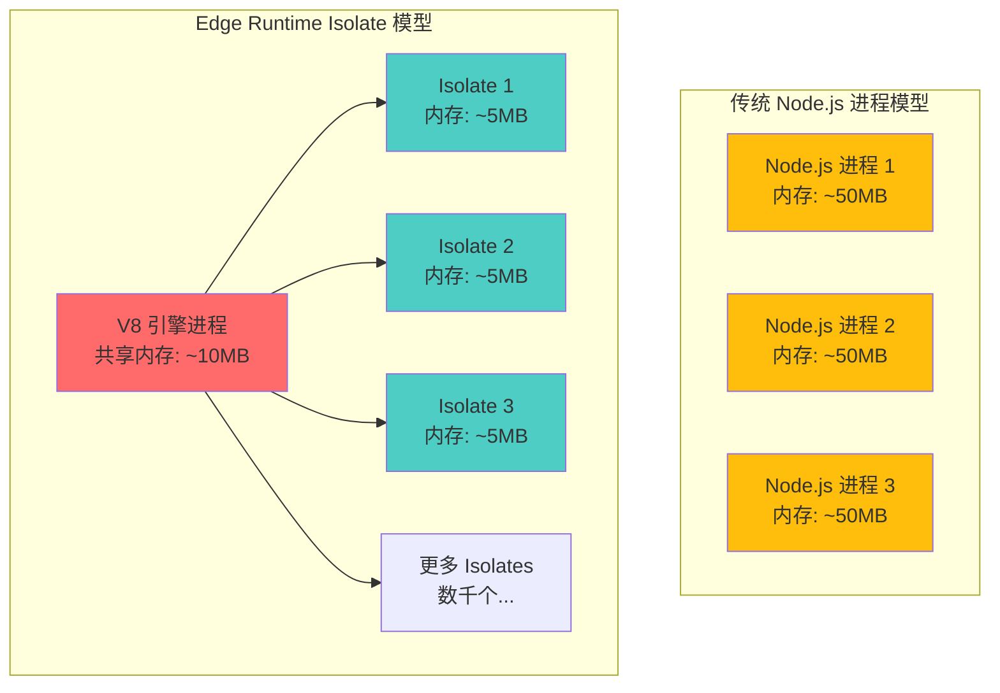

### V8 Isolate 的工作原理

```typescript
// V8 Isolate 的概念示意（简化）

class V8Isolate {
  // 独立的 JavaScript 执行上下文
  private context: ExecutionContext;
  
  // 独立的内存堆
  private heap: Memory;
  
  // 沙箱隔离
  private sandbox: Sandbox;

  constructor(code: string) {
    this.context = new ExecutionContext();
    this.heap = new Memory({ limit: '128MB' });
    this.sandbox = new Sandbox({
      allowedAPIs: ['fetch', 'crypto', 'Headers', 'Response'],
      blockedAPIs: ['fs', 'child_process', 'net']
    });
  }

  async execute(request: Request): Promise<Response> {
    // 在沙箱中执行代码
    return this.sandbox.run(this.context, request);
  }
}

// 单个 V8 进程可以运行数千个 Isolates
const edgeServer = {
  isolates: new Map<string, V8Isolate>(),
  
  handleRequest(functionId: string, request: Request) {
    let isolate = this.isolates.get(functionId);
    
    if (!isolate) {
      // 极快创建新 Isolate（< 1ms）
      isolate = new V8Isolate(getFunctionCode(functionId));
      this.isolates.set(functionId, isolate);
    }
    
    return isolate.execute(request);
  }
};
```

### 为什么 Edge Runtime 这么快？

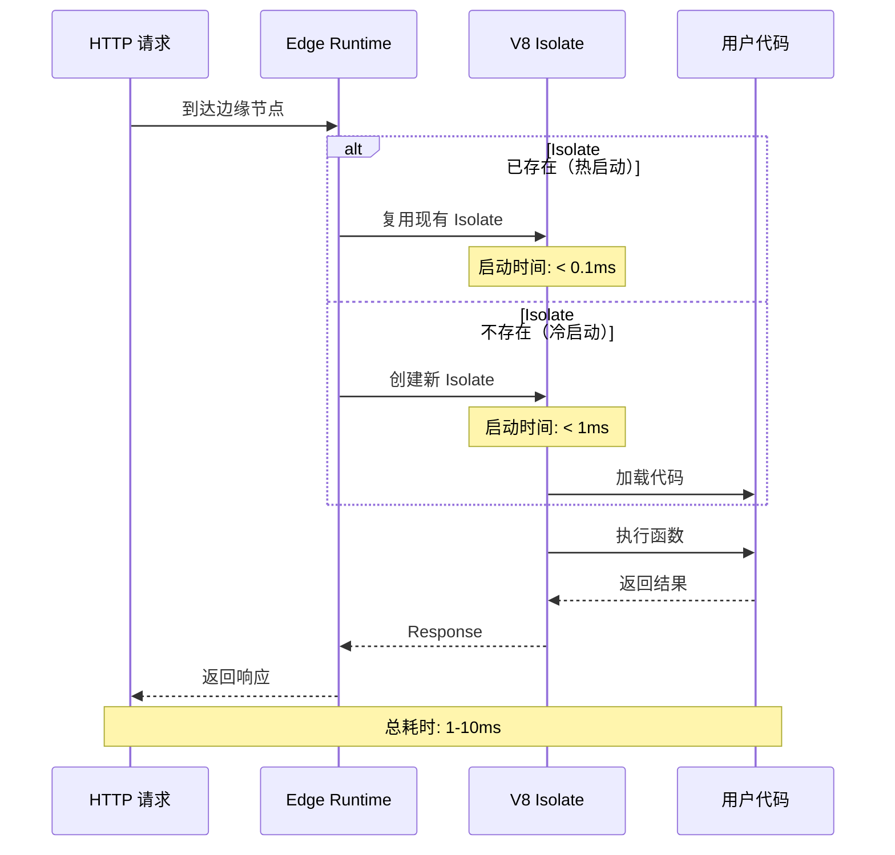

**对比 Node.js 冷启动：**

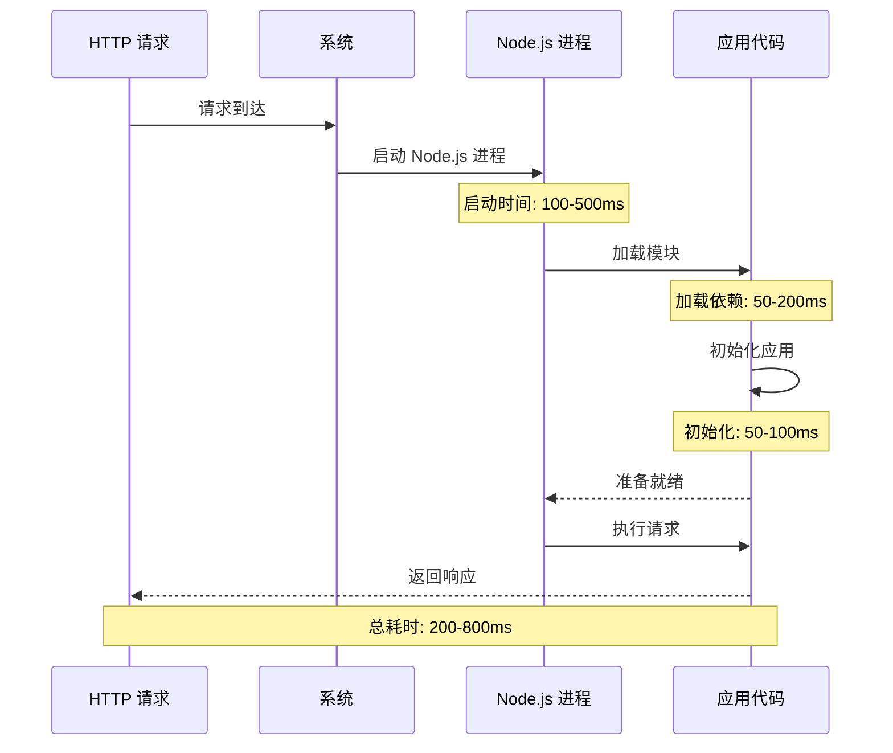

---

## Edge Runtime 运行在哪里

### 边缘节点的全球分布

Edge Runtime **不运行在你的 Next.js 服务器上**，而是运行在**全球分布的边缘节点（Edge Locations）**上。

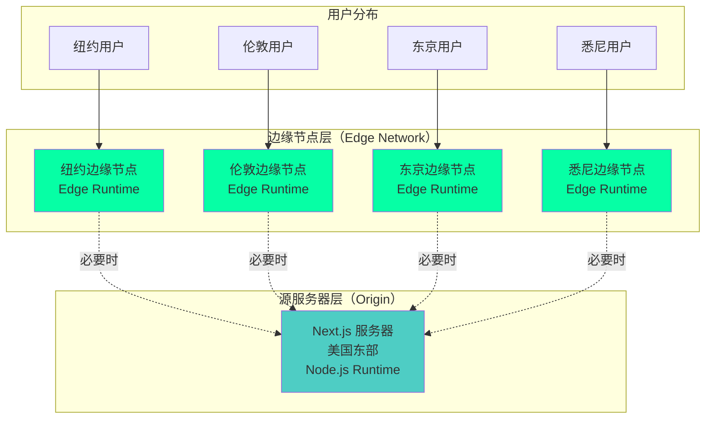

### 具体运行位置

#### 1. Vercel Edge Network

```typescript
// 在 Vercel 上，Edge Runtime 运行在全球 300+ 个边缘节点
// 这些节点分布在：
const vercelEdgeLocations = {
  northAmerica: [
    'San Francisco', 'Los Angeles', 'Seattle', 'Denver',
    'Dallas', 'Chicago', 'New York', 'Toronto', 'Montreal'
  ],
  europe: [
    'London', 'Paris', 'Frankfurt', 'Amsterdam', 'Dublin',
    'Stockholm', 'Warsaw', 'Madrid', 'Milan', 'Zurich'
  ],
  asia: [
    'Tokyo', 'Osaka', 'Seoul', 'Singapore', 'Hong Kong',
    'Taipei', 'Mumbai', 'Bangalore', 'Sydney', 'Melbourne'
  ],
  southAmerica: ['São Paulo', 'Buenos Aires', 'Santiago'],
  africa: ['Cape Town', 'Johannesburg'],
  // ... 总共 300+ 个位置
};

// 当用户发起请求时，自动路由到最近的边缘节点
function routeRequest(userIP: string) {
  const nearestEdge = findNearestEdgeNode(userIP);
  return nearestEdge.handleRequest();
}
```

#### 2. Cloudflare Workers

```typescript
// Cloudflare 拥有更庞大的边缘网络：330+ 个城市
const cloudflareNetwork = {
  totalCities: 330,
  totalCountries: 120,
  coverage: '全球 95% 的互联网人口在 50ms 内可达',
};

// Cloudflare Workers 运行在这些边缘节点上
// 使用完全相同的 V8 Isolate 技术
```

#### 3. 物理基础设施

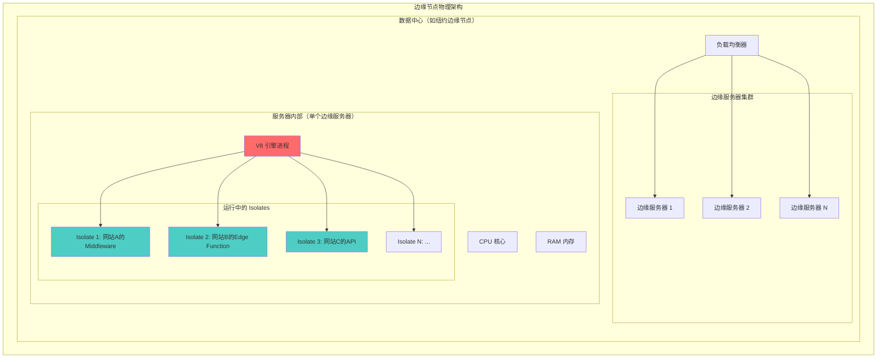

### 关键要点

:::warning{title="Edge Runtime 不在你的服务器上"}
1. **Edge Runtime 运行在 CDN 提供商的边缘节点上**（如 Vercel、Cloudflare）
2. **你的 Next.js 应用服务器运行的是 Node.js Runtime**
3. **Middleware 和 Edge Functions 被编译后部署到边缘节点**
4. **边缘节点和源服务器是不同的物理位置**
:::

---

## Edge Runtime 与 Vercel 的关系

### Vercel Edge Runtime 的演进历史

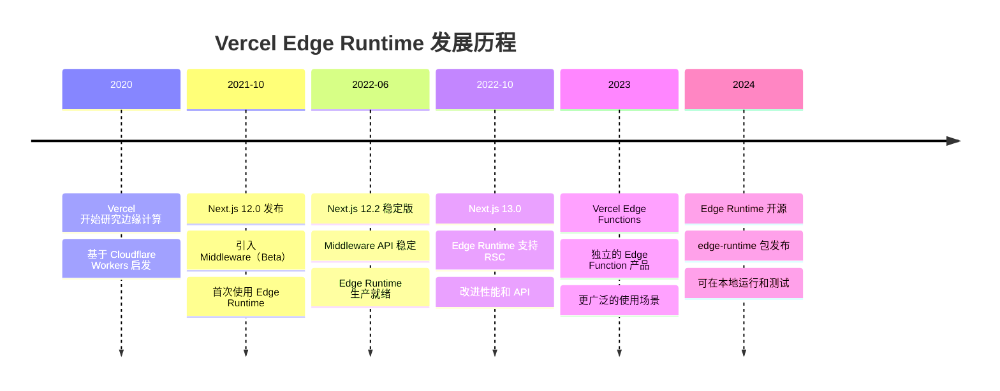

### Vercel 的 Edge 产品线

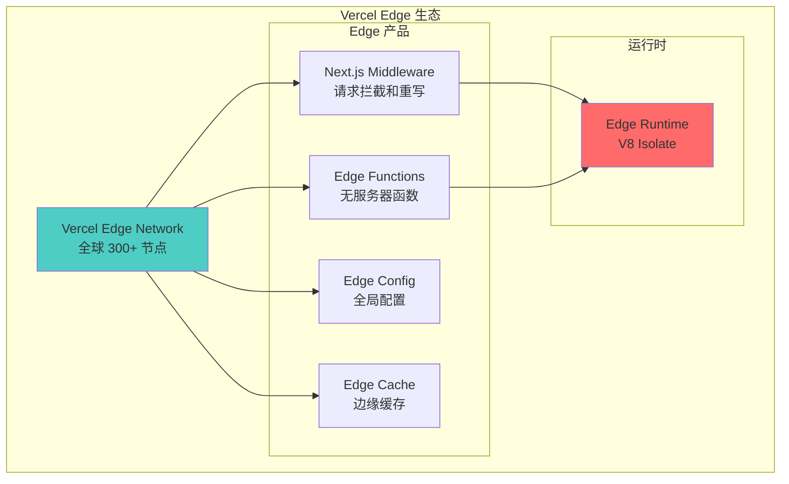

### Vercel 如何处理 Next.js 部署

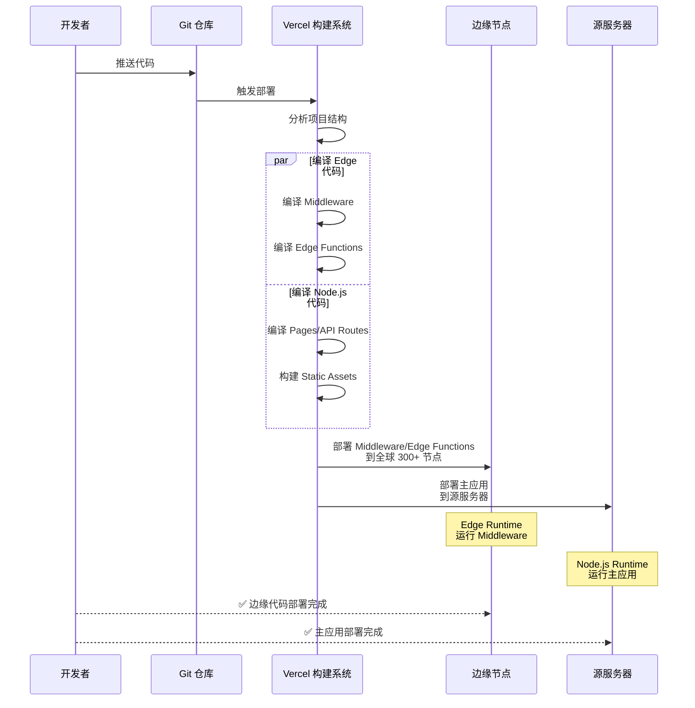

### Vercel Edge Runtime 的开源实现

Vercel 将 Edge Runtime 开源为 `@vercel/edge-runtime` 包：

```typescript
// @vercel/edge-runtime - 本地运行 Edge Runtime
import { EdgeRuntime } from '@vercel/edge-runtime';

// 创建一个 Edge Runtime 实例
const runtime = new EdgeRuntime({
  initialCode: `
    addEventListener('fetch', (event) => {
      event.respondWith(
        new Response('Hello from Edge Runtime!', {
          status: 200,
          headers: { 'content-type': 'text/plain' },
        })
      );
    });
  `,
});

// 执行请求
const response = await runtime.fetch('https://example.com');
console.log(await response.text()); // "Hello from Edge Runtime!"
```

---

## Edge Runtime 与 Next.js Middleware

### Next.js 中的两种运行时

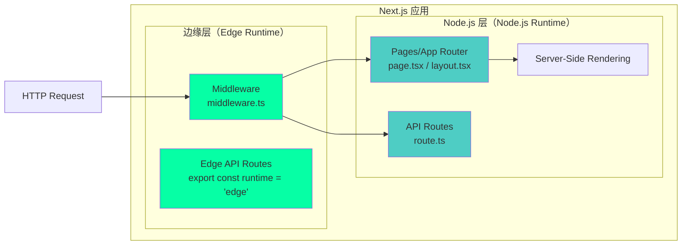

### Middleware 的 Edge Runtime 执行流程

```typescript
// middleware.ts - 运行在 Edge Runtime
import { NextResponse } from 'next/server';
import type { NextRequest } from 'next/server';

export function middleware(request: NextRequest) {
  console.log('🚀 在边缘节点执行');
  console.log('📍 位置:', request.geo?.city, request.geo?.country);
  
  // 这段代码运行在全球 300+ 个边缘节点上
  // 而不是你的 Next.js 服务器上
  
  return NextResponse.next();
}

// 编译和部署过程：
// 1. next build 时，Vercel 识别 middleware.ts
// 2. 使用特殊编译器编译为 Edge Runtime 兼容代码
// 3. 部署到全球所有边缘节点
// 4. 每个边缘节点运行一个 V8 Isolate
```

### 完整的请求流程

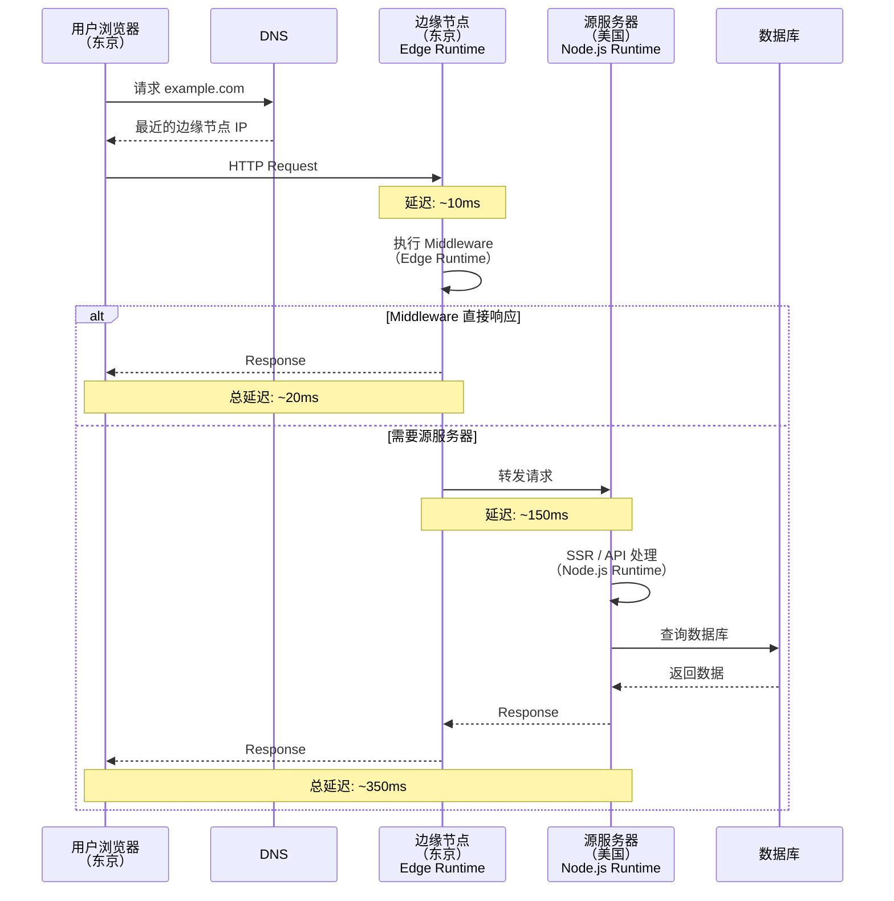

### Edge Runtime 限制的影响

```typescript
// ✅ 在 Edge Runtime 中可用
import { NextResponse } from 'next/server';

export function middleware(request: NextRequest) {
  // Web 标准 API
  const url = new URL(request.url);
  const headers = new Headers();
  const response = await fetch('https://api.example.com');
  
  // 加密 API
  const hash = await crypto.subtle.digest('SHA-256', data);
  
  return NextResponse.json({ success: true });
}

// ❌ 在 Edge Runtime 中不可用
import fs from 'fs'; // Error: 'fs' is not available in Edge Runtime
import path from 'path'; // Error: 'path' is not available
import { PrismaClient } from '@prisma/client'; // Error: 需要 Node.js APIs

export function middleware(request: NextRequest) {
  // 这些都会失败
  const data = fs.readFileSync('./data.json'); // ❌
  const prisma = new PrismaClient(); // ❌
  const result = await prisma.user.findMany(); // ❌
  
  return NextResponse.next();
}
```

---

## 运维概念 vs 研发概念

### Edge Runtime 的双重本质

Edge Runtime 既是**运维概念**，也是**研发概念**：

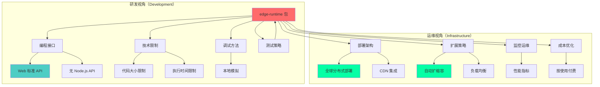

### 作为运维概念

```yaml
# 运维层面的 Edge Runtime
infrastructure:
  deployment_model: "全球分布式"
  scaling: "自动扩缩容"
  regions: "300+ 边缘节点"
  
  performance:
    cold_start: "< 1ms"
    latency: "10-50ms"
    throughput: "自动扩展"
  
  cost_model:
    pricing: "按请求数和执行时间"
    free_tier: "100,000 请求/天"
    optimization: "无需预留实例"
  
  operations:
    deployment: "自动部署到所有节点"
    monitoring: "内置性能监控"
    logging: "分布式日志收集"
    rollback: "即时回滚"
```

### 作为研发概念

```typescript
// 研发层面的 Edge Runtime

/**
 * 1. API 限制
 */
interface EdgeRuntimeAPIs {
  // ✅ 可用的 Web 标准 API
  available: [
    'fetch',
    'Request',
    'Response',
    'Headers',
    'URL',
    'URLSearchParams',
    'crypto',
    'TextEncoder',
    'TextDecoder',
    'ReadableStream',
    'WritableStream',
  ];
  
  // ❌ 不可用的 Node.js API
  unavailable: [
    'fs',
    'path',
    'child_process',
    'net',
    'http',
    'https',
    'os',
    'process.cwd()',
  ];
}

/**
 * 2. 代码大小限制
 */
const limits = {
  codeSize: {
    vercel: '1 MB',
    cloudflare: '1 MB (免费), 10 MB (付费)',
  },
  
  executionTime: {
    vercel: '30 秒',
    cloudflare: '10 毫秒 (免费), 30 秒 (付费)',
  },
  
  memory: {
    vercel: '128 MB',
    cloudflare: '128 MB',
  },
};

/**
 * 3. 开发体验
 */
// 声明使用 Edge Runtime
export const runtime = 'edge'; // Next.js
export const config = { runtime: 'edge' }; // 旧版语法

// 本地测试
import { EdgeRuntime } from '@vercel/edge-runtime';
const runtime = new EdgeRuntime();
const response = await runtime.fetch('/api/hello');

/**
 * 4. 调试和监控
 */
console.log('Edge log'); // 在边缘节点输出
// 可通过 Vercel Dashboard 查看日志
```

### 实际影响

| 角色 | 关注点 | 影响 |
|------|--------|------|
| **DevOps/运维** | 部署、扩展、成本 | 需要了解边缘网络拓扑、监控策略、成本模型 |
| **后端开发** | API 可用性、限制 | 需要适应 Web API、避免 Node.js 特定代码 |
| **前端开发** | Middleware 逻辑 | 可使用熟悉的 Web API、需要注意性能 |
| **架构师** | 系统设计、权衡 | 需要决定哪些逻辑放在边缘、哪些在源服务器 |

---

## 不同平台的 Edge Runtime 实现

### 主流平台对比

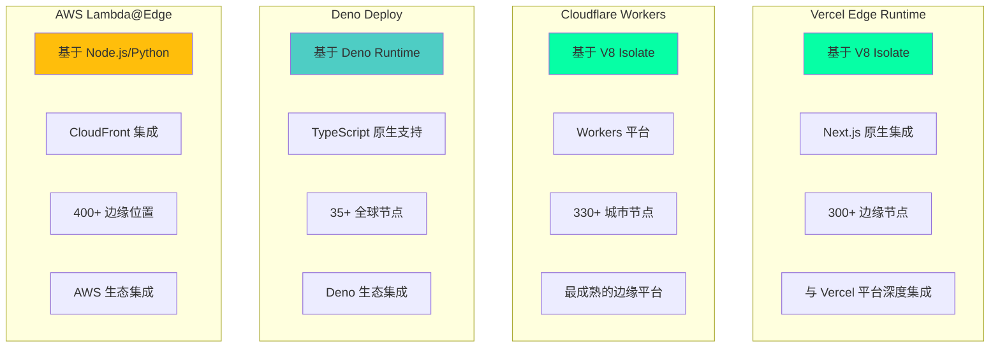

### 详细对比

| 特性 | Vercel | Cloudflare | Deno Deploy | AWS Lambda@Edge |
|------|--------|-----------|-------------|-----------------|
| **运行时** | V8 Isolate | V8 Isolate | Deno | Node.js/Python |
| **冷启动** | < 1ms | < 1ms | < 5ms | 100-500ms |
| **代码大小** | 1 MB | 1 MB (免费)<br/>10 MB (付费) | 10 MB | 1 MB (压缩后) |
| **执行时间** | 30s | 10ms (免费)<br/>30s (付费) | 无限制 | 5-30s |
| **节点数量** | 300+ | 330+ | 35+ | 400+ |
| **免费额度** | 100K 请求/天 | 100K 请求/天 | 100K 请求/月 | 1M 请求/月 |
| **框架集成** | Next.js | Any | Fresh (Deno) | Any |
| **数据库** | Edge Config | Durable Objects<br/>KV<br/>D1 (SQL) | KV | DynamoDB |

### Vercel Edge Runtime 实现细节

```typescript
// Vercel Edge Runtime 的内部实现（简化版）

class VercelEdgeRuntime {
  private v8Engine: V8Engine;
  private edgeNetwork: EdgeNetwork;

  constructor() {
    // 初始化 V8 引擎
    this.v8Engine = new V8Engine({
      version: 'v11.x',
      flags: ['--no-expose-wasm', '--harmony']
    });

    // 连接到边缘网络
    this.edgeNetwork = new EdgeNetwork({
      locations: 300,
      protocol: 'HTTP/3'
    });
  }

  async deployFunction(code: string, config: EdgeConfig) {
    // 1. 验证代码
    const validated = await this.validateCode(code);
    
    // 2. 编译为 V8 字节码
    const bytecode = await this.v8Engine.compile(validated);
    
    // 3. 部署到所有边缘节点
    await this.edgeNetwork.deployToAllNodes(bytecode, config);
    
    // 4. 配置路由
    await this.setupRouting(config.routes);
  }

  async handleRequest(request: Request): Promise<Response> {
    // 1. 找到最近的边缘节点
    const node = this.edgeNetwork.findNearestNode(request.ip);
    
    // 2. 在该节点的 V8 Isolate 中执行
    const isolate = await node.getOrCreateIsolate(request.functionId);
    
    // 3. 执行请求
    return await isolate.execute(request);
  }
}
```

### Cloudflare Workers 实现

```typescript
// Cloudflare Workers 的实现方式

// 1. Workers 脚本（与 Vercel 类似）
export default {
  async fetch(request: Request): Promise<Response> {
    // 在 Cloudflare 的边缘节点执行
    return new Response('Hello from Cloudflare Edge!');
  }
};

// 2. Durable Objects（独特功能）
export class Counter {
  private state: DurableObjectState;
  private count: number = 0;

  constructor(state: DurableObjectState) {
    this.state = state;
  }

  async fetch(request: Request) {
    this.count++;
    return new Response(`Count: ${this.count}`);
  }
}

// 3. KV 存储（边缘键值存储）
const value = await NAMESPACE.get('key');
await NAMESPACE.put('key', 'value');
```

---

## Remix 的 Edge Runtime 实现

### Remix 对 Edge 的支持

**是的，Remix 也实现了 Edge Runtime 支持！**

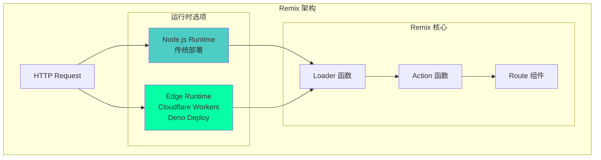

### Remix 的 Edge 实现方式

```typescript
// 1. Cloudflare Workers 适配器
// remix.config.js
export default {
  serverBuildTarget: 'cloudflare-workers',
  server: './server.js',
  devServerBroadcastDelay: 1000,
  ignoredRouteFiles: ['**/.*'],
};

// 2. Entry Server（Edge）
// app/entry.server.tsx
import { RemixServer } from '@remix-run/react';
import { handleRequest } from '@remix-run/cloudflare';

export default function (
  request: Request,
  responseStatusCode: number,
  responseHeaders: Headers,
  remixContext: EntryContext
) {
  // 在 Cloudflare Workers (Edge Runtime) 中执行
  const markup = renderToString(
    <RemixServer context={remixContext} url={request.url} />
  );

  responseHeaders.set('Content-Type', 'text/html');

  return new Response('<!DOCTYPE html>' + markup, {
    status: responseStatusCode,
    headers: responseHeaders,
  });
}

// 3. Loader 在 Edge 运行
// app/routes/index.tsx
export const loader: LoaderFunction = async ({ request }) => {
  // 这个函数在 Edge Runtime 中执行
  console.log('运行在边缘节点');
  
  // 可以使用 Web API
  const url = new URL(request.url);
  const userAgent = request.headers.get('user-agent');
  
  // ❌ 不能使用 Node.js API
  // const fs = require('fs'); // Error!
  
  return json({
    message: 'Hello from Edge!',
    timestamp: new Date().toISOString(),
  });
};
```

### Remix vs Next.js Edge 对比

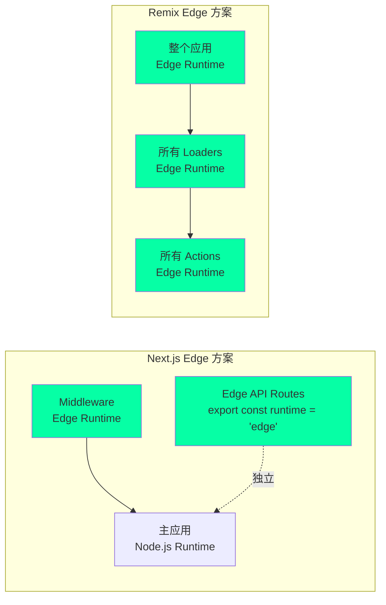

### Remix 在不同平台的 Edge 部署

```typescript
// 1. Cloudflare Workers
// package.json
{
  "scripts": {
    "build": "remix build",
    "dev": "miniflare --watch",
    "deploy": "wrangler publish"
  }
}

// wrangler.toml
name = "my-remix-app"
type = "javascript"
account_id = "your-account-id"
workers_dev = true
route = ""
zone_id = ""

[site]
bucket = "./public"
entry-point = "workers-site"

// 2. Deno Deploy
// deno.json
{
  "tasks": {
    "dev": "deno run --allow-net --allow-read --allow-env server.ts",
    "deploy": "deployctl deploy --project=my-app server.ts"
  }
}

// server.ts
import { serve } from "https://deno.land/std/http/server.ts";
import { createRequestHandler } from "@remix-run/deno";

serve(createRequestHandler({ build: await import("./build/index.js") }));

// 3. Vercel（也支持 Remix）
// vercel.json
{
  "buildCommand": "remix build",
  "devCommand": "remix dev",
  "installCommand": "npm install",
  "framework": "remix",
  "outputDirectory": "public"
}
```

### Remix Edge 的独特优势

```typescript
// Remix 的 Loader 可以在 Edge 并行获取数据
export const loader: LoaderFunction = async ({ request }) => {
  // 在边缘节点并行请求多个 API
  const [user, posts, comments] = await Promise.all([
    fetch('https://api.example.com/user'),
    fetch('https://api.example.com/posts'),
    fetch('https://api.example.com/comments'),
  ]);

  return json({
    user: await user.json(),
    posts: await posts.json(),
    comments: await comments.json(),
  });
};

// 这比传统 SSR 快得多，因为：
// 1. 在边缘节点执行（靠近用户）
// 2. 并行获取数据
// 3. 无需等待源服务器
```

---

## Edge Runtime 架构设计

### 完整的 Edge 架构

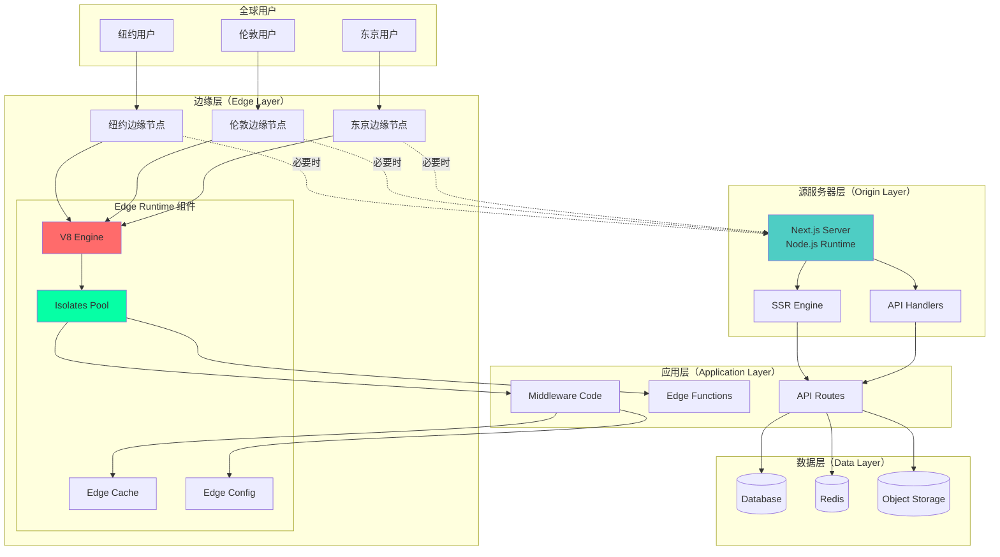

### 请求路由决策树

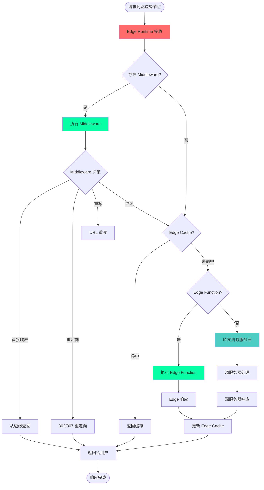

### 性能优化架构

```typescript
// Edge Runtime 的性能优化策略

class EdgePerformanceOptimizer {
  // 1. Isolate 复用池
  private isolatePool: Map<string, V8Isolate> = new Map();

  async getIsolate(functionId: string): Promise<V8Isolate> {
    // 热启动：复用现有 Isolate
    if (this.isolatePool.has(functionId)) {
      return this.isolatePool.get(functionId)!;
    }

    // 冷启动：创建新 Isolate（但仍然很快 < 1ms）
    const isolate = new V8Isolate(functionId);
    this.isolatePool.set(functionId, isolate);
    return isolate;
  }

  // 2. 代码预编译
  async precompile(code: string): Promise<ByteCode> {
    // 编译为 V8 字节码，加速执行
    return v8.compile(code);
  }

  // 3. 边缘缓存策略
  private edgeCache = new EdgeCache({
    ttl: 60, // 60 秒
    staleWhileRevalidate: 3600, // 1 小时
  });

  async handleRequest(request: Request): Promise<Response> {
    // 检查边缘缓存
    const cached = await this.edgeCache.get(request.url);
    if (cached) {
      // 返回缓存，后台更新
      this.edgeCache.revalidate(request.url);
      return cached;
    }

    // 执行函数
    const response = await this.executeFunction(request);

    // 缓存响应
    await this.edgeCache.set(request.url, response);

    return response;
  }

  // 4. 智能路由
  async routeRequest(request: Request): Promise<EdgeNode> {
    const userIP = request.headers.get('cf-connecting-ip');
    
    // 基于用户 IP 路由到最近的边缘节点
    return this.findNearestNode(userIP);
  }
}
```

---

## 实战应用与最佳实践

### 1. 何时使用 Edge Runtime

```typescript
// ✅ 适合 Edge Runtime 的场景

// 1. 身份认证和授权
export function middleware(request: NextRequest) {
  const token = request.cookies.get('auth-token');
  if (!token) {
    return NextResponse.redirect(new URL('/login', request.url));
  }
  return NextResponse.next();
}

// 2. A/B 测试
export function middleware(request: NextRequest) {
  const variant = Math.random() < 0.5 ? 'A' : 'B';
  return NextResponse.rewrite(new URL(`/variant-${variant}`, request.url));
}

// 3. 地理位置路由
export function middleware(request: NextRequest) {
  const country = request.geo?.country || 'US';
  return NextResponse.rewrite(new URL(`/${country}`, request.url));
}

// 4. 速率限制
const rateLimiter = new Map();
export function middleware(request: NextRequest) {
  const ip = request.ip;
  const count = rateLimiter.get(ip) || 0;
  
  if (count > 100) {
    return new NextResponse('Too many requests', { status: 429 });
  }
  
  rateLimiter.set(ip, count + 1);
  return NextResponse.next();
}

// 5. Bot 检测
export function middleware(request: NextRequest) {
  const userAgent = request.headers.get('user-agent') || '';
  if (isBot(userAgent)) {
    return new NextResponse('Forbidden', { status: 403 });
  }
  return NextResponse.next();
}
```

### 2. 何时避免使用 Edge Runtime

```typescript
// ❌ 不适合 Edge Runtime 的场景

// 1. 复杂的数据库查询
export function middleware(request: NextRequest) {
  // ❌ Edge Runtime 无法直接连接数据库
  const db = new PrismaClient(); // Error!
  const users = await db.user.findMany();
  
  // ✅ 应该在源服务器（API Route）中处理
}

// 2. 文件系统操作
export function middleware(request: NextRequest) {
  // ❌ Edge Runtime 没有文件系统
  const fs = require('fs'); // Error!
  const data = fs.readFileSync('./data.json');
  
  // ✅ 使用 Edge Config 或 KV 存储
}

// 3. 长时间运行的任务
export function middleware(request: NextRequest) {
  // ❌ Edge Runtime 有执行时间限制（通常 30 秒）
  await longRunningTask(); // 可能超时
  
  // ✅ 使用后台任务队列
}

// 4. 大量计算
export function middleware(request: NextRequest) {
  // ❌ Edge Runtime 资源有限
  const result = complexComputation(largeDataset);
  
  // ✅ 在源服务器或专门的计算服务中处理
}
```

### 3. 混合架构最佳实践

```typescript
// 推荐：Edge + Origin 混合架构

// middleware.ts - 在 Edge Runtime 运行
export function middleware(request: NextRequest) {
  // 快速的边缘逻辑
  const token = request.cookies.get('auth-token');
  
  if (!token) {
    return NextResponse.redirect(new URL('/login', request.url));
  }
  
  // 简单的 token 验证（不访问数据库）
  if (!isTokenFormatValid(token.value)) {
    return NextResponse.redirect(new URL('/login', request.url));
  }
  
  // 将 token 传递给源服务器
  const requestHeaders = new Headers(request.headers);
  requestHeaders.set('x-auth-token', token.value);
  
  return NextResponse.next({
    request: {
      headers: requestHeaders,
    },
  });
}

// app/api/data/route.ts - 在 Node.js Runtime 运行
export async function GET(request: NextRequest) {
  // 详细的身份验证（访问数据库）
  const token = request.headers.get('x-auth-token');
  const user = await verifyTokenInDatabase(token);
  
  if (!user) {
    return NextResponse.json({ error: 'Unauthorized' }, { status: 401 });
  }
  
  // 复杂的数据库查询
  const data = await prisma.data.findMany({
    where: { userId: user.id },
    include: { relations: true },
  });
  
  return NextResponse.json(data);
}
```

### 4. 性能监控

```typescript
// 监控 Edge Runtime 性能

export function middleware(request: NextRequest) {
  const start = Date.now();
  
  // 执行中间件逻辑
  const response = NextResponse.next();
  
  // 添加性能指标
  const duration = Date.now() - start;
  response.headers.set('x-edge-time', duration.toString());
  response.headers.set('x-edge-location', request.geo?.city || 'unknown');
  
  // 记录慢请求
  if (duration > 50) {
    console.warn(`Slow middleware: ${duration}ms at ${request.geo?.city}`);
  }
  
  return response;
}
```

---

## 总结

### Edge Runtime 的核心价值

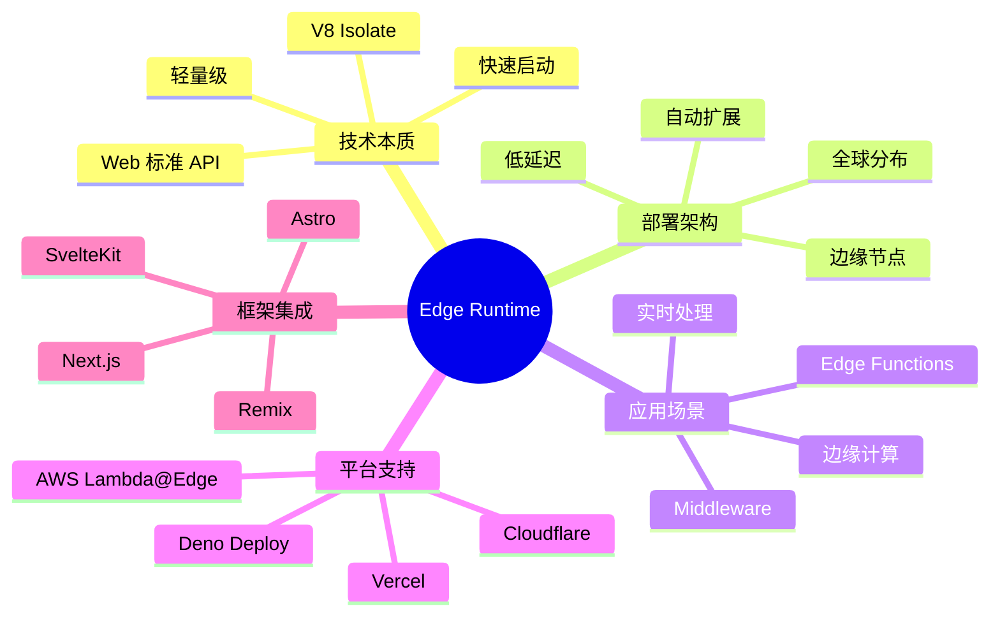

### 关键要点

:::tip{title="Edge Runtime 的本质"}
1. **不是在你的服务器上运行**：而是在全球分布的边缘节点上
2. **基于 V8 Isolate**：而不是完整的 Node.js 进程
3. **Web 标准 API**：而不是 Node.js API
4. **全球自动部署**：而不是单点部署
5. **极快启动**：冷启动 < 1ms，而不是 100-500ms
:::

:::warning{title="既是运维概念，也是研发概念"}
- **运维视角**：全球分布式部署、自动扩缩容、成本优化
- **研发视角**：API 限制、代码适配、调试测试
- **需要双方协作**：理解限制、合理使用、监控优化
:::

:::info{title="Remix 也支持 Edge Runtime"}
- 可以完全运行在 Edge（Cloudflare Workers、Deno Deploy）
- 所有 Loaders 和 Actions 都在边缘执行
- 比 Next.js 更激进的 Edge-first 方案
:::

### 未来展望

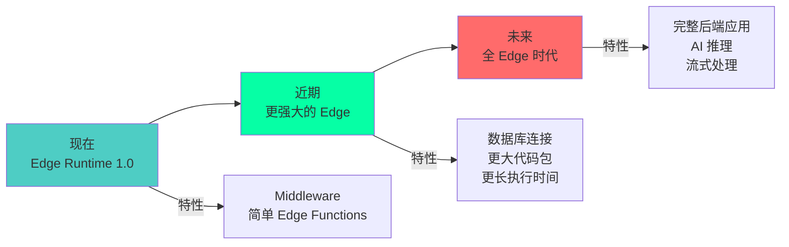

Edge Runtime 代表了 Web 应用架构的未来方向：**将计算推向边缘，在最接近用户的位置处理请求**。随着技术的不断发展，Edge Runtime 的能力将持续增强，最终可能取代传统的中心化服务器架构。

---

## 参考资源

- [Vercel Edge Runtime 文档](https://vercel.com/docs/functions/edge-functions/edge-runtime)
- [Cloudflare Workers 文档](https://developers.cloudflare.com/workers/)
- [Deno Deploy 文档](https://deno.com/deploy/docs)
- [Remix Cloudflare 适配器](https://remix.run/docs/en/main/guides/deployment#cloudflare-workers)
- [V8 Isolate 技术](https://v8.dev/docs/embed)
- [Web 标准 API](https://developer.mozilla.org/en-US/docs/Web/API)
