# ISG/ISR 深度解析：Vercel 的增量静态生成实现原理与跨框架实践

ISG (Incremental Static Generation) 和 ISR (Incremental Static Regeneration) 是现代 Web 框架中最重要的性能优化技术之一。本文将深入探讨 Vercel 如何实现 ISR，以及其他框架如 Remix、SvelteKit 如何实现类似功能。

## 目录

1. [ISG/ISR 概念解析](#isgisr-概念解析)
2. [传统 SSG 的问题](#传统-ssg-的问题)
3. [ISR 的工作原理](#isr-的工作原理)
4. [Vercel 的 ISR 实现架构](#vercel-的-isr-实现架构)
5. [Next.js ISR 技术实现](#nextjs-isr-技术实现)
6. [Remix 的 ISG 实现思路](#remix-的-isg-实现思路)
7. [SvelteKit 的预渲染策略](#sveltekit-的预渲染策略)
8. [自建 ISG 系统设计](#自建-isg-系统设计)
9. [ISR vs 其他渲染模式](#isr-vs-其他渲染模式)
10. [最佳实践与优化](#最佳实践与优化)

---

## ISG/ISR 概念解析

### 什么是 ISG 和 ISR

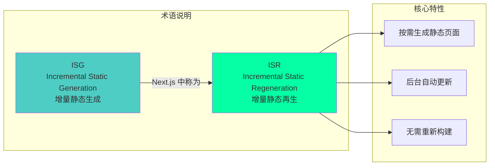

### 核心概念

:::tip{title="ISR 的三个关键特性"}
1. **按需生成**：页面在首次访问时生成，无需在构建时生成所有页面
2. **增量更新**：可以在不重新部署的情况下更新静态页面
3. **后台再生**：使用旧内容立即响应，在后台生成新内容
:::

### ISR 解决的问题

```typescript
// 传统 SSG 的痛点

// 问题 1：构建时间随页面数量线性增长
export async function getStaticPaths() {
  // 需要在构建时生成所有 10000 个页面
  const posts = await getAllPosts(); // 10000 篇文章
  return {
    paths: posts.map(post => ({ params: { slug: post.slug } })),
    fallback: false, // 必须预生成所有页面
  };
}
// 构建时间：10000 页 × 1秒 = 2.7 小时！

// 问题 2：内容更新需要重新构建和部署
// 修改一篇文章 → 需要重新构建整个站点 → 等待 2.7 小时

// ISR 的解决方案

export async function getStaticPaths() {
  // 只生成热门页面
  const popularPosts = await getPopularPosts(100);
  return {
    paths: popularPosts.map(post => ({ params: { slug: post.slug } })),
    fallback: 'blocking', // 其他页面按需生成
  };
}

export async function getStaticProps({ params }) {
  const post = await getPost(params.slug);
  return {
    props: { post },
    revalidate: 60, // 60 秒后自动更新
  };
}
// 构建时间：100 页 × 1秒 = 100 秒
// 内容更新：自动，无需重新部署
```

---

## 传统 SSG 的问题

### SSG 的困境

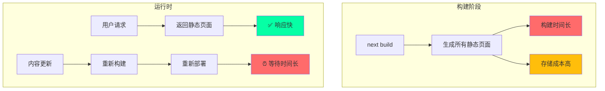

### 规模化问题

```typescript
// 大型网站的 SSG 挑战

const siteStats = {
  // 电商网站
  products: 100000,        // 10 万个商品页面
  categories: 500,         // 500 个分类页面
  blogPosts: 5000,         // 5000 篇博客
  totalPages: 105500,      // 总计 10.55 万个页面

  // 构建时间估算
  buildTimePerPage: 1,     // 每页 1 秒
  totalBuildTime: 105500,  // 105500 秒 = 29.3 小时！

  // 存储成本
  avgPageSize: 50,         // 每页 50KB
  totalStorage: 5275,      // 5.27 GB

  // 更新问题
  dailyUpdates: 1000,      // 每天 1000 个页面更新
  deploymentsPerDay: 10,   // 每天需要 10 次部署
};

// 这对于传统 SSG 是不可持续的！
```

---

## ISR 的工作原理

### ISR 核心机制

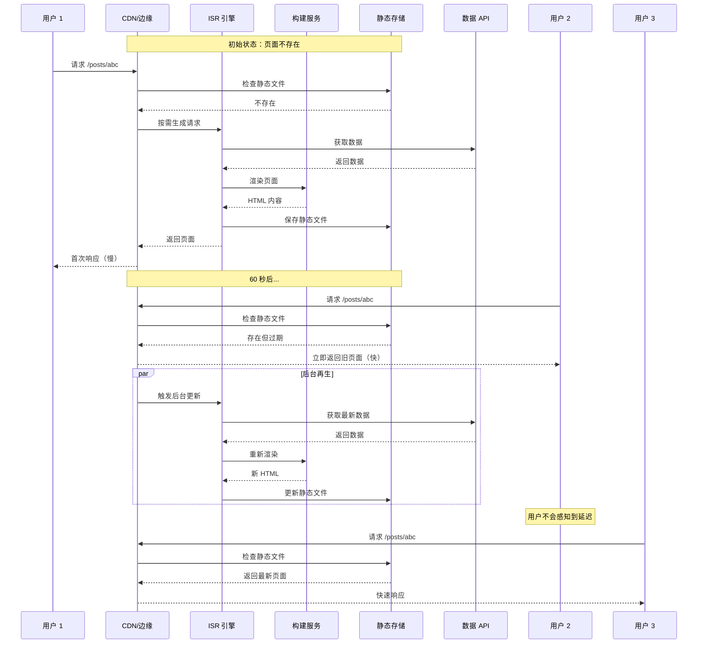

### ISR 的三种模式

```typescript
// 1. 时间重新验证（Time-based Revalidation）
export async function getStaticProps() {
  const data = await fetchData();
  return {
    props: { data },
    revalidate: 60, // 60 秒后重新验证
  };
}

// 2. 按需重新验证（On-demand Revalidation）
// app/api/revalidate/route.ts
export async function POST(request: Request) {
  const { path } = await request.json();
  await revalidatePath(path);
  return Response.json({ revalidated: true });
}

// 3. 混合模式
export async function getStaticProps() {
  const data = await fetchData();
  return {
    props: { data },
    revalidate: 60, // 时间重新验证
    // 同时支持按需重新验证
  };
}
```

### ISR 状态机

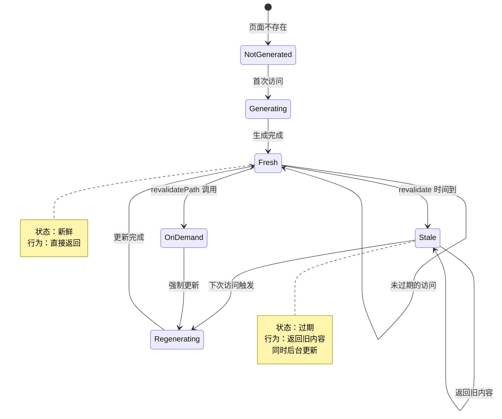

---

## Vercel 的 ISR 实现架构

### Vercel 平台架构

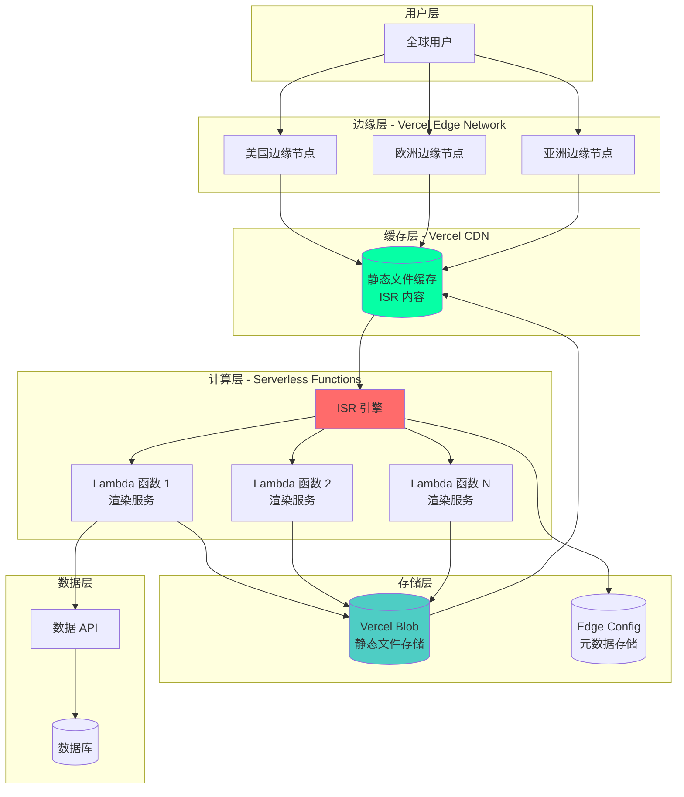

### Vercel ISR 的关键组件

```typescript
// Vercel ISR 系统的核心组件（概念模型）

interface VercelISRSystem {
  // 1. 边缘缓存层
  edgeCache: {
    get(key: string): Promise<CachedPage | null>;
    set(key: string, page: CachedPage, ttl: number): Promise<void>;
    invalidate(key: string): Promise<void>;
  };

  // 2. ISR 元数据存储
  metadata: {
    getPageStatus(path: string): Promise<PageStatus>;
    setPageStatus(path: string, status: PageStatus): Promise<void>;
  };

  // 3. 构建队列
  buildQueue: {
    enqueue(path: string, priority: 'high' | 'low'): Promise<void>;
    process(): Promise<void>;
  };

  // 4. 静态文件存储
  storage: {
    get(path: string): Promise<string>;
    put(path: string, content: string): Promise<void>;
  };

  // 5. 渲染引擎
  renderer: {
    render(path: string): Promise<string>;
  };
}

interface CachedPage {
  content: string;
  timestamp: number;
  revalidate: number;
  etag: string;
}

interface PageStatus {
  generated: boolean;
  lastRevalidate: number;
  isRevalidating: boolean;
}
```

### Vercel ISR 请求处理流程

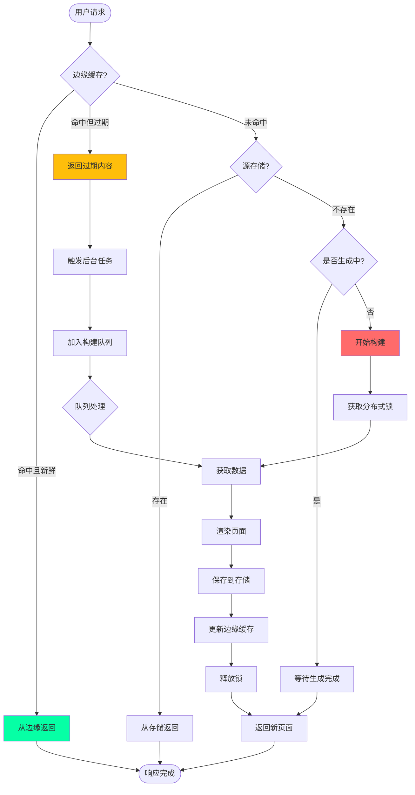

### Vercel 的存储策略

```typescript
// Vercel 的 ISR 文件存储结构

const storageStructure = {
  // 静态文件存储（Vercel Blob / S3）
  staticFiles: {
    path: 's3://vercel-deployments/[deployment-id]/',
    structure: {
      // HTML 文件
      'posts/abc.html': 'HTML content',
      'posts/abc.json': 'RSC Payload',

      // 元数据
      'posts/abc.meta.json': {
        timestamp: 1700000000,
        revalidate: 60,
        headers: {},
      },

      // 预渲染清单
      '.next/prerender-manifest.json': {
        version: 4,
        routes: {
          '/posts/abc': {
            initialRevalidateSeconds: 60,
            dataRoute: '/posts/abc.json',
          },
        },
      },
    },
  },

  // 边缘配置（Edge Config）
  edgeConfig: {
    // ISR 状态
    'isr:posts/abc': {
      isRevalidating: false,
      lastRevalidate: 1700000000,
      version: 3,
    },

    // 构建锁
    'lock:posts/abc': {
      locked: false,
      lockedBy: null,
      lockedAt: null,
    },
  },

  // CDN 缓存
  cdnCache: {
    key: 'deployment-id:posts/abc',
    content: 'HTML content',
    headers: {
      'Cache-Control': 's-maxage=60, stale-while-revalidate=300',
      'X-Vercel-Cache': 'HIT',
    },
  },
};
```

---

## Next.js ISR 技术实现

### Next.js ISR 的核心代码

```typescript
// Next.js 内部 ISR 实现（简化版）

class NextISRSystem {
  private cache: Map<string, CachedPage> = new Map();
  private locks: Map<string, Promise<void>> = new Map();

  async handleRequest(path: string): Promise<Response> {
    const cached = this.cache.get(path);

    // 1. 检查缓存
    if (cached) {
      const isStale = this.isStale(cached);

      if (!isStale) {
        // 缓存新鲜，直接返回
        return new Response(cached.content, {
          headers: { 'X-Next-Cache': 'HIT' },
        });
      }

      // 缓存过期，使用 stale-while-revalidate
      this.revalidateInBackground(path);
      return new Response(cached.content, {
        headers: { 'X-Next-Cache': 'STALE' },
      });
    }

    // 2. 缓存不存在，需要生成
    return await this.generatePage(path);
  }

  private async generatePage(path: string): Promise<Response> {
    // 防止重复生成（分布式锁）
    const existingLock = this.locks.get(path);
    if (existingLock) {
      await existingLock;
      return this.handleRequest(path); // 重新尝试获取
    }

    // 创建生成 Promise
    const generatePromise = this.doGenerate(path);
    this.locks.set(path, generatePromise);

    try {
      const content = await generatePromise;
      return new Response(content, {
        headers: { 'X-Next-Cache': 'MISS' },
      });
    } finally {
      this.locks.delete(path);
    }
  }

  private async doGenerate(path: string): Promise<string> {
    console.log(`🔨 生成页面: ${path}`);

    // 1. 获取数据
    const data = await this.fetchData(path);

    // 2. 渲染 React 组件
    const html = await this.renderToHTML(path, data);

    // 3. 保存到缓存
    this.cache.set(path, {
      content: html,
      timestamp: Date.now(),
      revalidate: data.revalidate || 60,
    });

    // 4. 保存到持久化存储
    await this.saveToStorage(path, html);

    return html;
  }

  private async revalidateInBackground(path: string): Promise<void> {
    // 后台异步更新，不阻塞响应
    setImmediate(async () => {
      try {
        await this.generatePage(path);
        console.log(`✅ 后台更新完成: ${path}`);
      } catch (error) {
        console.error(`❌ 后台更新失败: ${path}`, error);
      }
    });
  }

  private isStale(cached: CachedPage): boolean {
    const age = Date.now() - cached.timestamp;
    return age > cached.revalidate * 1000;
  }

  private async fetchData(path: string): Promise<any> {
    // 调用 getStaticProps
    return { data: '...', revalidate: 60 };
  }

  private async renderToHTML(path: string, data: any): Promise<string> {
    // 渲染 React 组件为 HTML
    return '<html>...</html>';
  }

  private async saveToStorage(path: string, content: string): Promise<void> {
    // 保存到文件系统或对象存储
    // 在 Vercel 上会保存到 S3
  }
}

interface CachedPage {
  content: string;
  timestamp: number;
  revalidate: number;
}
```

### 分布式锁实现

```typescript
// Vercel ISR 的分布式锁机制

class DistributedLock {
  constructor(
    private storage: EdgeConfig, // Vercel Edge Config
    private ttl: number = 30000   // 锁超时 30 秒
  ) {}

  async acquire(key: string, ownerId: string): Promise<boolean> {
    const lockKey = `lock:${key}`;
    
    try {
      // 尝试获取锁
      const existing = await this.storage.get(lockKey);
      
      if (existing) {
        // 检查锁是否过期
        if (Date.now() - existing.timestamp > this.ttl) {
          // 锁过期，强制获取
          await this.storage.set(lockKey, {
            ownerId,
            timestamp: Date.now(),
          });
          return true;
        }
        return false; // 锁被占用
      }

      // 锁不存在，创建锁
      await this.storage.set(lockKey, {
        ownerId,
        timestamp: Date.now(),
      });
      return true;
    } catch (error) {
      return false;
    }
  }

  async release(key: string, ownerId: string): Promise<void> {
    const lockKey = `lock:${key}`;
    const existing = await this.storage.get(lockKey);
    
    if (existing && existing.ownerId === ownerId) {
      await this.storage.delete(lockKey);
    }
  }
}

// 使用示例
async function generatePageWithLock(path: string) {
  const lock = new DistributedLock(edgeConfig);
  const ownerId = generateUniqueId();

  const acquired = await lock.acquire(path, ownerId);
  if (!acquired) {
    // 等待其他实例完成
    await waitForCompletion(path);
    return;
  }

  try {
    // 生成页面
    await generatePage(path);
  } finally {
    await lock.release(path, ownerId);
  }
}
```

---

## Remix 的 ISG 实现思路

### Remix 的挑战

Remix 的架构与 Next.js 不同，它更强调服务器端渲染和 Edge 计算。实现 ISG 需要不同的方法。

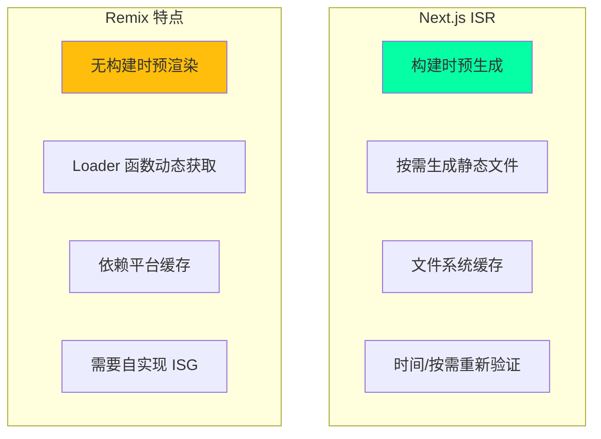

### Remix ISG 实现方案

```typescript
// 方案 1：使用 Cloudflare Workers + KV

// app/routes/posts.$slug.tsx
import type { LoaderFunction } from '@remix-run/cloudflare';

interface Env {
  KV: KVNamespace; // Cloudflare KV
}

export const loader: LoaderFunction = async ({ params, context }) => {
  const { slug } = params;
  const env = context.env as Env;

  // 1. 检查 KV 缓存
  const cacheKey = `post:${slug}`;
  const cached = await env.KV.get(cacheKey, 'json');

  if (cached) {
    const { data, timestamp, revalidate } = cached;
    const isStale = Date.now() - timestamp > revalidate * 1000;

    if (!isStale) {
      // 缓存新鲜
      return json(data, {
        headers: {
          'Cache-Control': `public, max-age=${revalidate}`,
          'X-Cache': 'HIT',
        },
      });
    }

    // 缓存过期，后台更新
    context.waitUntil(
      revalidatePost(slug, env.KV)
    );

    // 先返回旧数据
    return json(data, {
      headers: {
        'Cache-Control': 's-maxage=60, stale-while-revalidate=300',
        'X-Cache': 'STALE',
      },
    });
  }

  // 2. 缓存不存在，获取并缓存
  const post = await fetchPost(slug);
  
  await env.KV.put(
    cacheKey,
    JSON.stringify({
      data: post,
      timestamp: Date.now(),
      revalidate: 60,
    }),
    { expirationTtl: 86400 } // 24 小时后自动删除
  );

  return json(post, {
    headers: {
      'Cache-Control': 'public, max-age=60',
      'X-Cache': 'MISS',
    },
  });
};

async function revalidatePost(slug: string, kv: KVNamespace) {
  const post = await fetchPost(slug);
  await kv.put(
    `post:${slug}`,
    JSON.stringify({
      data: post,
      timestamp: Date.now(),
      revalidate: 60,
    })
  );
}
```

### Remix + Cloudflare 的 ISG 架构

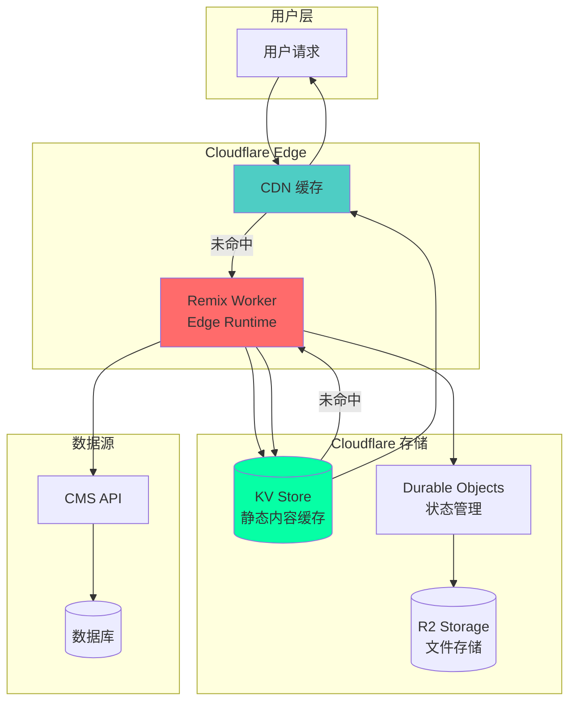

### 方案 2：使用 Deno Deploy

```typescript
// 使用 Deno Deploy + Deno KV

import { serve } from 'https://deno.land/std/http/server.ts';

const kv = await Deno.openKv();

async function handler(req: Request): Promise<Response> {
  const url = new URL(req.url);
  const path = url.pathname;

  // 检查 KV 缓存
  const cached = await kv.get(['page', path]);

  if (cached.value) {
    const { content, timestamp, revalidate } = cached.value;
    const isStale = Date.now() - timestamp > revalidate * 1000;

    if (!isStale) {
      return new Response(content, {
        headers: {
          'Content-Type': 'text/html',
          'X-Cache': 'HIT',
        },
      });
    }

    // 后台更新
    revalidatePage(path);

    return new Response(content, {
      headers: {
        'Content-Type': 'text/html',
        'X-Cache': 'STALE',
      },
    });
  }

  // 生成页面
  const content = await generatePage(path);
  
  await kv.set(['page', path], {
    content,
    timestamp: Date.now(),
    revalidate: 60,
  });

  return new Response(content, {
    headers: {
      'Content-Type': 'text/html',
      'X-Cache': 'MISS',
    },
  });
}

serve(handler);
```

---

## SvelteKit 的预渲染策略

### SvelteKit 的静态生成

SvelteKit 提供了灵活的预渲染选项，可以实现类似 ISG 的功能。

```typescript
// src/routes/posts/[slug]/+page.server.ts

export const prerender = 'auto'; // 自动决定是否预渲染

export async function load({ params, setHeaders }) {
  const { slug } = params;

  // 获取文章数据
  const post = await getPost(slug);

  // 设置缓存头实现 ISG 效果
  setHeaders({
    'Cache-Control': 'public, max-age=60, s-maxage=300, stale-while-revalidate=600',
  });

  return {
    post,
  };
}

// svelte.config.js
export default {
  kit: {
    prerender: {
      entries: [
        '/',
        '/posts', // 预渲染这些页面
        // 不需要列出所有 /posts/[slug]
      ],
      crawl: true, // 自动发现链接
      onError: 'continue',
    },
  },
};
```

### SvelteKit + Vercel 适配器

```typescript
// 使用 @sveltejs/adapter-vercel 实现 ISG

// svelte.config.js
import adapter from '@sveltejs/adapter-vercel';

export default {
  kit: {
    adapter: adapter({
      // ISR 配置
      isr: {
        expiration: 60, // 60 秒后过期
      },
    }),
  },
};

// src/routes/posts/[slug]/+page.server.ts
export const config = {
  isr: {
    expiration: 60,
    // 允许过期内容
    allowQuery: ['preview'],
  },
};

export async function load({ params }) {
  const post = await getPost(params.slug);
  return { post };
}
```

---

## 自建 ISG 系统设计

### 通用 ISG 系统架构

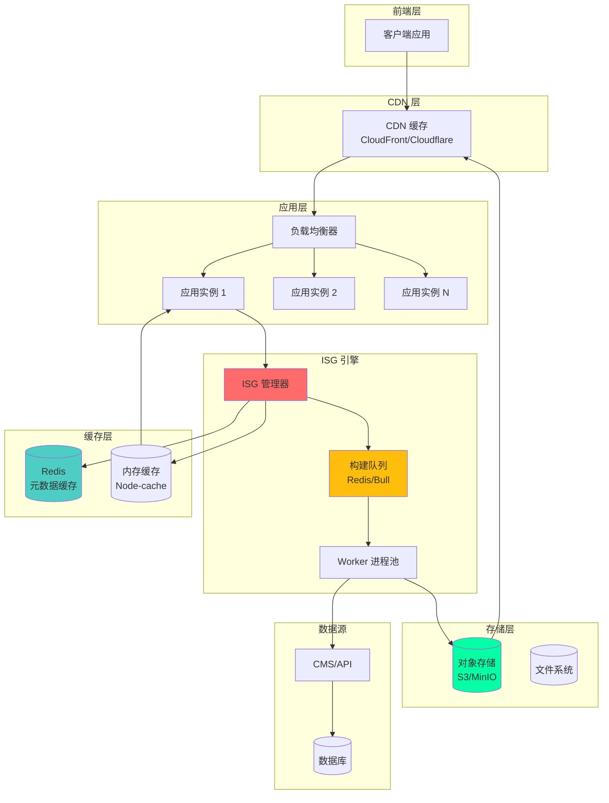

### 核心代码实现

```typescript
// 自建 ISG 系统实现

import Redis from 'ioredis';
import { S3Client } from '@aws-sdk/client-s3';
import Queue from 'bull';

class ISGSystem {
  private redis: Redis;
  private s3: S3Client;
  private buildQueue: Queue.Queue;
  private memoryCache: Map<string, CachedPage>;

  constructor() {
    this.redis = new Redis(process.env.REDIS_URL);
    this.s3 = new S3Client({ region: 'us-east-1' });
    this.buildQueue = new Queue('isg-builds', process.env.REDIS_URL);
    this.memoryCache = new Map();

    this.setupWorker();
  }

  // 处理请求
  async handleRequest(path: string): Promise<Response> {
    // 1. 检查内存缓存
    const memoryCached = this.memoryCache.get(path);
    if (memoryCached && !this.isStale(memoryCached)) {
      return this.createResponse(memoryCached.content, 'MEMORY-HIT');
    }

    // 2. 检查 Redis 缓存
    const redisCached = await this.redis.get(`page:${path}`);
    if (redisCached) {
      const page: CachedPage = JSON.parse(redisCached);
      
      if (!this.isStale(page)) {
        this.memoryCache.set(path, page);
        return this.createResponse(page.content, 'REDIS-HIT');
      }

      // 过期，触发后台更新
      await this.buildQueue.add(
        { path, priority: 'low' },
        { priority: 2 }
      );

      return this.createResponse(page.content, 'STALE');
    }

    // 3. 检查 S3 存储
    try {
      const s3Content = await this.getFromS3(path);
      if (s3Content) {
        const page: CachedPage = {
          content: s3Content,
          timestamp: Date.now(),
          revalidate: 60,
        };

        await this.cacheInRedis(path, page);
        this.memoryCache.set(path, page);

        return this.createResponse(s3Content, 'S3-HIT');
      }
    } catch (error) {
      console.error('S3 读取失败:', error);
    }

    // 4. 缓存完全不存在，同步生成
    return await this.generatePage(path);
  }

  // 生成页面
  private async generatePage(path: string): Promise<Response> {
    // 防止重复生成
    const lockKey = `lock:${path}`;
    const locked = await this.redis.set(
      lockKey,
      '1',
      'EX',
      30,
      'NX'
    );

    if (!locked) {
      // 已经有其他实例在生成，等待
      await this.waitForGeneration(path);
      return this.handleRequest(path);
    }

    try {
      console.log(`🔨 生成页面: ${path}`);

      // 1. 获取数据
      const data = await this.fetchData(path);

      // 2. 渲染页面
      const content = await this.render(path, data);

      // 3. 创建缓存对象
      const page: CachedPage = {
        content,
        timestamp: Date.now(),
        revalidate: 60,
      };

      // 4. 保存到各层缓存
      await Promise.all([
        this.saveToS3(path, content),
        this.cacheInRedis(path, page),
      ]);

      this.memoryCache.set(path, page);

      return this.createResponse(content, 'MISS');
    } finally {
      await this.redis.del(lockKey);
    }
  }

  // 设置 Worker 处理后台任务
  private setupWorker() {
    this.buildQueue.process(async (job) => {
      const { path } = job.data;
      console.log(`🔄 后台更新: ${path}`);

      try {
        const data = await this.fetchData(path);
        const content = await this.render(path, data);

        const page: CachedPage = {
          content,
          timestamp: Date.now(),
          revalidate: 60,
        };

        await Promise.all([
          this.saveToS3(path, content),
          this.cacheInRedis(path, page),
        ]);

        console.log(`✅ 后台更新完成: ${path}`);
      } catch (error) {
        console.error(`❌ 后台更新失败: ${path}`, error);
        throw error;
      }
    });
  }

  // 辅助方法
  private isStale(page: CachedPage): boolean {
    return Date.now() - page.timestamp > page.revalidate * 1000;
  }

  private async cacheInRedis(path: string, page: CachedPage): Promise<void> {
    await this.redis.set(
      `page:${path}`,
      JSON.stringify(page),
      'EX',
      page.revalidate * 2 // Redis TTL 是 revalidate 的 2 倍
    );
  }

  private async getFromS3(path: string): Promise<string | null> {
    // 从 S3 获取内容
    // 实现略
    return null;
  }

  private async saveToS3(path: string, content: string): Promise<void> {
    // 保存到 S3
    // 实现略
  }

  private async fetchData(path: string): Promise<any> {
    // 获取数据
    // 实现略
    return {};
  }

  private async render(path: string, data: any): Promise<string> {
    // 渲染页面
    // 实现略
    return '<html>...</html>';
  }

  private createResponse(content: string, cacheStatus: string): Response {
    return new Response(content, {
      headers: {
        'Content-Type': 'text/html',
        'X-Cache': cacheStatus,
      },
    });
  }

  private async waitForGeneration(path: string): Promise<void> {
    // 等待其他实例完成生成
    let attempts = 0;
    const maxAttempts = 10;

    while (attempts < maxAttempts) {
      await new Promise(resolve => setTimeout(resolve, 1000));
      const exists = await this.redis.exists(`page:${path}`);
      if (exists) return;
      attempts++;
    }

    throw new Error(`生成超时: ${path}`);
  }
}

interface CachedPage {
  content: string;
  timestamp: number;
  revalidate: number;
}
```

---

## ISR vs 其他渲染模式

### 渲染模式对比

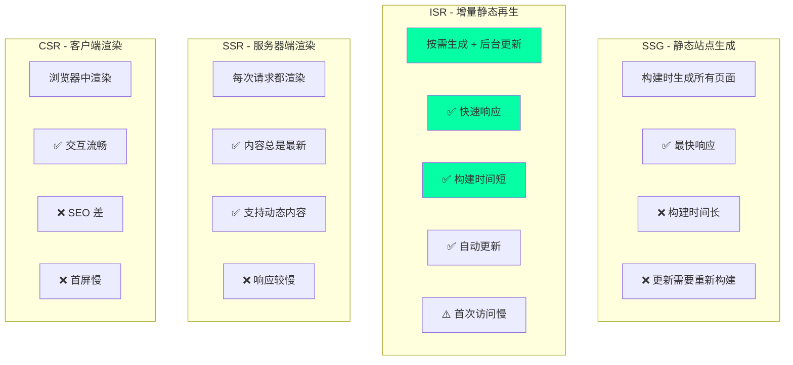

### 性能对比

| 指标 | SSG | ISR | SSR | CSR |
|------|-----|-----|-----|-----|
| **首次加载** | ⭐⭐⭐⭐⭐ | ⭐⭐⭐⭐ | ⭐⭐⭐ | ⭐⭐ |
| **后续加载** | ⭐⭐⭐⭐⭐ | ⭐⭐⭐⭐⭐ | ⭐⭐⭐ | ⭐⭐⭐⭐ |
| **构建时间** | ⭐⭐ | ⭐⭐⭐⭐⭐ | N/A | ⭐⭐⭐⭐⭐ |
| **内容新鲜度** | ⭐⭐ | ⭐⭐⭐⭐ | ⭐⭐⭐⭐⭐ | ⭐⭐⭐⭐⭐ |
| **SEO** | ⭐⭐⭐⭐⭐ | ⭐⭐⭐⭐⭐ | ⭐⭐⭐⭐⭐ | ⭐⭐ |
| **服务器负载** | ⭐⭐⭐⭐⭐ | ⭐⭐⭐⭐ | ⭐⭐ | ⭐⭐⭐⭐⭐ |
| **动态内容** | ❌ | ⚠️ | ✅ | ✅ |

---

## 最佳实践与优化

### 1. 选择合适的 revalidate 时间

```typescript
// 不同类型内容的 revalidate 建议

export const revalidateConfig = {
  // 静态内容（关于页面、文档）
  static: false, // 永不过期
  
  // 低频更新内容（博客文章）
  blog: 3600, // 1 小时
  
  // 中频更新内容（产品列表）
  products: 300, // 5 分钟
  
  // 高频更新内容（新闻、股价）
  news: 60, // 1 分钟
  
  // 实时内容（用户仪表板）
  realtime: 0, // 不使用 ISR，用 SSR
};

// 应用示例
export const revalidate = revalidateConfig.blog;

export default async function BlogPost({ params }) {
  const post = await getPost(params.slug);
  return <Article post={post} />;
}
```

### 2. 优化首次生成

```typescript
// 预生成热门页面

export async function generateStaticParams() {
  // 只预生成最热门的 100 篇文章
  const popularPosts = await getPopularPosts(100);
  
  return popularPosts.map((post) => ({
    slug: post.slug,
  }));
}

// 其他页面按需生成
export const dynamicParams = true;

export const revalidate = 3600; // 1 小时
```

### 3. 使用标签进行精确失效

```typescript
// 使用标签管理缓存失效

// 获取数据时添加标签
async function getPost(slug: string) {
  const post = await fetch(`/api/posts/${slug}`, {
    next: {
      tags: ['posts', `post-${slug}`],
      revalidate: 3600,
    },
  });
  return post.json();
}

// 更新时精确失效
import { revalidateTag } from 'next/cache';

export async function updatePost(slug: string, data: any) {
  await db.posts.update(slug, data);
  
  // 只失效这篇文章和文章列表
  revalidateTag(`post-${slug}`);
  revalidateTag('posts');
}
```

### 4. 监控 ISR 性能

```typescript
// ISR 性能监控

export async function getStaticProps({ params }) {
  const start = Date.now();
  const isRevalidating = context?.preview ? false : true;

  try {
    const data = await fetchData(params.slug);
    const fetchTime = Date.now() - start;

    // 记录指标
    await logMetrics({
      page: params.slug,
      fetchTime,
      isRevalidating,
      timestamp: Date.now(),
    });

    return {
      props: { data },
      revalidate: 60,
    };
  } catch (error) {
    // 记录错误
    await logError({
      page: params.slug,
      error: error.message,
      timestamp: Date.now(),
    });

    throw error;
  }
}
```

---

## 总结

### ISR 的核心价值

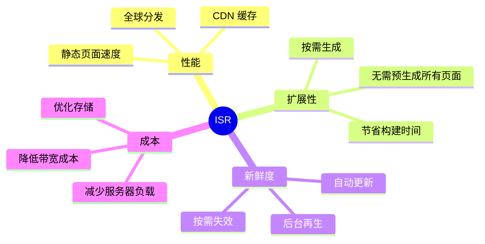

### 关键要点

:::tip{title="ISR 核心原则"}
1. **Vercel 实现**：基于 Edge Network + Serverless + 对象存储的三层架构
2. **Remix 方案**：依赖平台缓存（Cloudflare KV/Deno KV）+ 自实现逻辑
3. **SvelteKit**：通过适配器支持，类似 Next.js 的方式
4. **自建系统**：需要 CDN + 缓存层 + 队列 + 对象存储的完整架构
5. **选择 revalidate**：根据内容更新频率合理设置
:::

### 平台对比

| 平台 | ISR 支持 | 实现方式 | 优势 | 限制 |
|------|---------|---------|------|------|
| **Vercel + Next.js** | ✅ 原生支持 | Edge Network + Lambda | 开箱即用、稳定可靠 | 锁定 Vercel |
| **Cloudflare + Remix** | ⚠️ 需自实现 | Workers + KV | 全球网络、性能好 | 需要手动实现 |
| **Deno Deploy** | ⚠️ 需自实现 | Edge Runtime + KV | TypeScript 原生 | 节点较少 |
| **自建** | ⚠️ 完全自实现 | 自定义架构 | 完全可控 | 复杂度高 |

---

## 参考资源

- [Next.js ISR 官方文档](https://nextjs.org/docs/pages/building-your-application/data-fetching/incremental-static-regeneration)
- [Vercel ISR 原理](https://vercel.com/docs/concepts/incremental-static-regeneration)
- [Remix Caching](https://remix.run/docs/en/main/guides/caching)
- [SvelteKit Prerendering](https://kit.svelte.dev/docs/page-options#prerender)
- [Cloudflare Workers KV](https://developers.cloudflare.com/workers/runtime-apis/kv/)
