# Next.js Middleware 与边缘计算：架构设计、执行流程与版本演进

Next.js Middleware 是运行在请求到达应用之前的代码层，它在边缘节点上执行，能够提供极低延迟的请求处理能力。本文将深入探讨 Middleware 的架构设计、与边缘节点的关系，以及不同版本的实现演进。

## 目录

1. [什么是 Middleware](#什么是-middleware)
2. [Middleware 与边缘节点的关系](#middleware-与边缘节点的关系)
3. [整体架构设计](#整体架构设计)
4. [请求处理流程](#请求处理流程)
5. [Edge Runtime 技术解析](#edge-runtime-技术解析)
6. [版本演进与实现变化](#版本演进与实现变化)
7. [实战应用场景](#实战应用场景)
8. [性能优化最佳实践](#性能优化最佳实践)

---

## 什么是 Middleware

### 核心概念

Middleware 是在请求完成之前运行的代码，它可以修改请求和响应、重定向、重写 URL、或添加请求头。

```typescript
// middleware.ts
import { NextResponse } from 'next/server';
import type { NextRequest } from 'next/server';

export function middleware(request: NextRequest) {
  // 在请求到达页面之前执行
  const response = NextResponse.next();

  // 修改响应头
  response.headers.set('x-custom-header', 'my-value');

  return response;
}

// 配置 Middleware 匹配的路径
export const config = {
  matcher: '/api/:path*',
};
```

### Middleware 的特点

:::tip{title="核心特性"}
- **边缘执行**：在靠近用户的边缘节点运行
- **零延迟**：无需等待服务器响应即可处理请求
- **全局控制**：可拦截和修改所有匹配的请求
- **轻量运行时**：使用 Edge Runtime，启动快速
:::

---

## Middleware 与边缘节点的关系

### 边缘计算架构

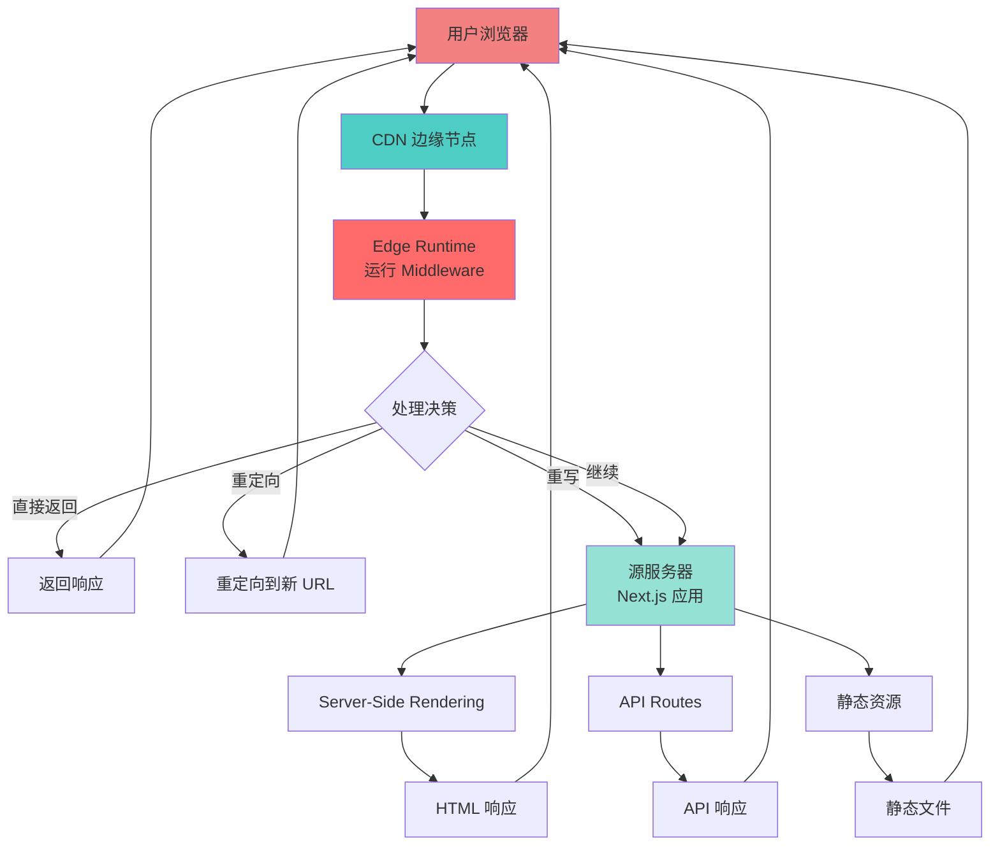

### 地理分布与延迟

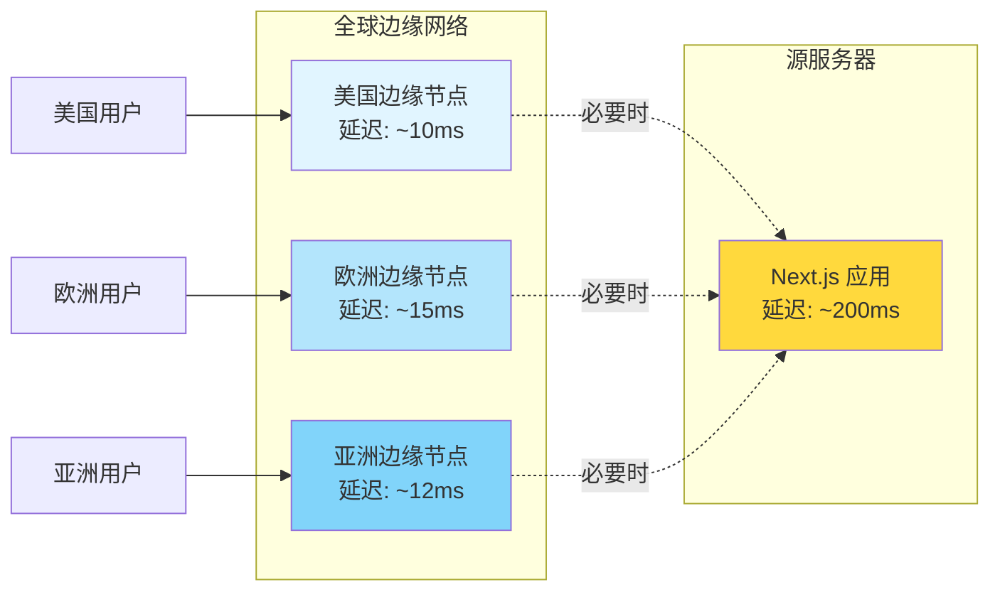

### 边缘节点的优势

| 特性 | 传统服务器 | 边缘节点 |
|------|----------|---------|
| **部署位置** | 单一数据中心 | 全球分布式 |
| **延迟** | 100-500ms | 10-50ms |
| **扩展性** | 垂直扩展 | 自动水平扩展 |
| **冷启动** | 较慢 | 几乎无冷启动 |
| **成本** | 固定成本高 | 按使用付费 |

---

## 整体架构设计

### Next.js 应用架构层次

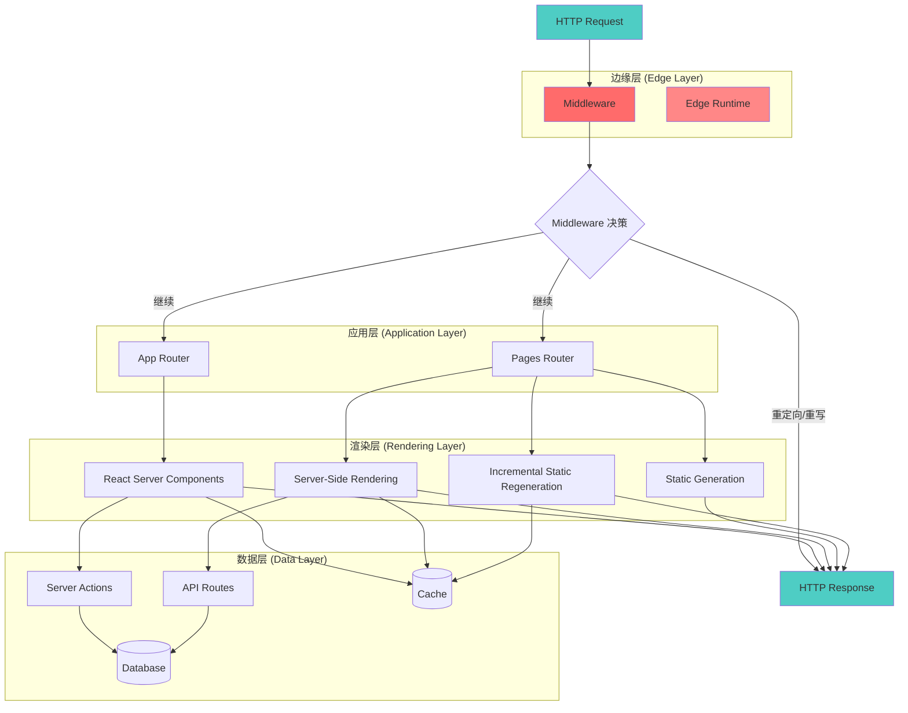

### Middleware 执行上下文

```typescript
// Middleware 运行环境
interface MiddlewareContext {
  // 请求对象
  request: NextRequest;

  // 边缘运行时环境
  runtime: 'edge';

  // 地理位置信息
  geo?: {
    city?: string;
    country?: string;
    region?: string;
    latitude?: string;
    longitude?: string;
  };

  // IP 信息
  ip?: string;

  // 下一步处理
  next: () => NextResponse;
}
```

---

## 请求处理流程

### 完整的请求生命周期

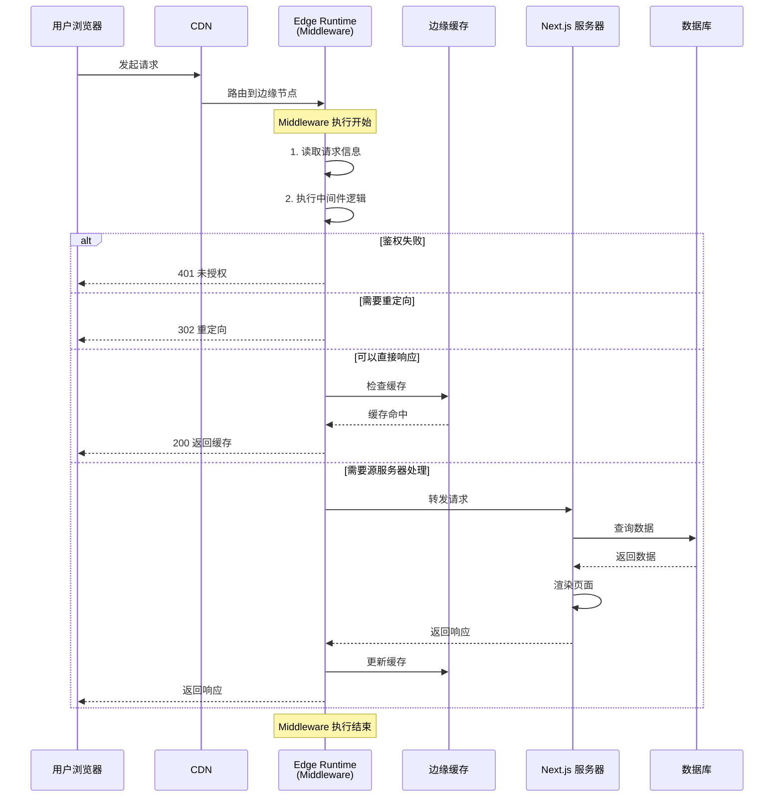

### Middleware 处理流程详解

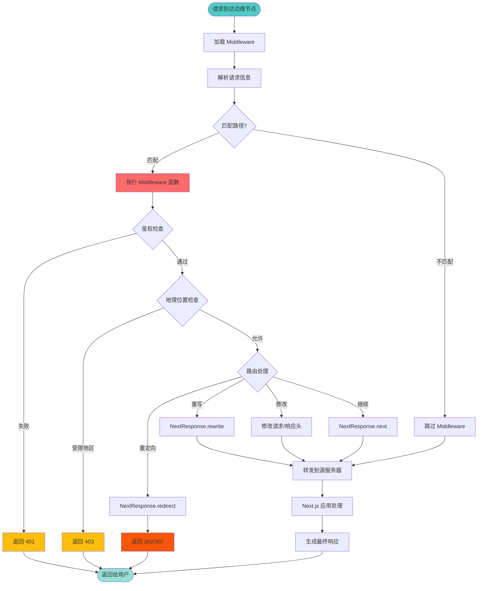

### 示例：认证流程

```typescript
// middleware.ts
import { NextResponse } from 'next/server';
import type { NextRequest } from 'next/server';

export function middleware(request: NextRequest) {
  // 1. 检查认证 Cookie
  const token = request.cookies.get('auth-token');

  // 2. 如果没有 token，重定向到登录页
  if (!token) {
    return NextResponse.redirect(new URL('/login', request.url));
  }

  // 3. 验证 token（在边缘运行时）
  try {
    const isValid = verifyToken(token.value);

    if (!isValid) {
      return NextResponse.redirect(new URL('/login', request.url));
    }

    // 4. 添加用户信息到请求头
    const response = NextResponse.next();
    response.headers.set('x-user-id', getUserIdFromToken(token.value));

    return response;
  } catch (error) {
    // 5. 验证失败，返回错误
    return new NextResponse('Authentication failed', { status: 401 });
  }
}

export const config = {
  matcher: ['/dashboard/:path*', '/api/protected/:path*'],
};
```

---

## Edge Runtime 技术解析

### Edge Runtime vs Node.js Runtime

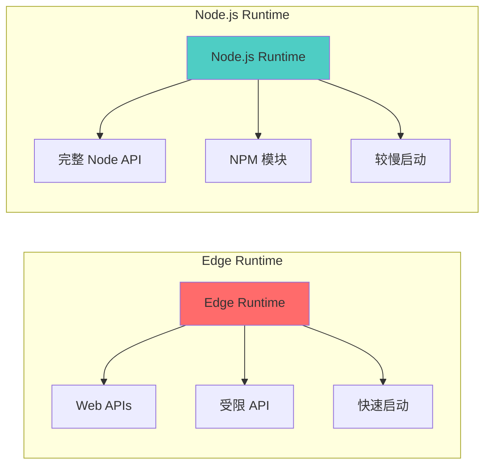

### Edge Runtime 特性

| 特性 | Edge Runtime | Node.js Runtime |
|------|-------------|-----------------|
| **启动时间** | < 1ms | 100-500ms |
| **可用 API** | Web 标准 API | 完整 Node.js API |
| **包大小限制** | 1-4 MB | 无限制 |
| **执行位置** | 全球边缘节点 | 单一服务器 |
| **冷启动** | 几乎无 | 明显 |
| **适用场景** | Middleware, Edge Functions | API Routes, SSR |

### 可用与不可用的 API

:::tip{title="Edge Runtime 可用 API"}
```typescript
// ✅ 可用的 Web 标准 API
fetch()
Response / Request
Headers
URL / URLSearchParams
crypto.subtle
btoa / atob
TextEncoder / TextDecoder
ReadableStream / WritableStream

// ✅ Next.js 提供的 API
NextRequest / NextResponse
cookies() / headers()
```
:::

:::warning{title="Edge Runtime 不可用 API"}
```typescript
// ❌ 不可用的 Node.js API
fs (文件系统)
path
os
child_process
net / http (原生模块)
某些 NPM 包 (依赖 Node.js API)
```
:::

### Edge Runtime 实现原理

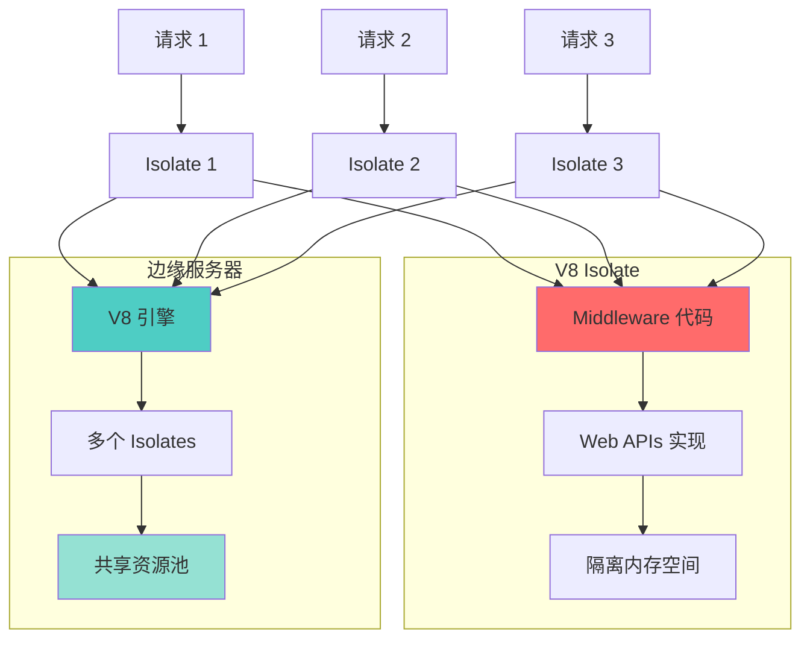

**V8 Isolate 的优势：**

1. **极快启动**：不需要启动完整的运行时环境
2. **内存隔离**：每个请求独立的内存空间
3. **高并发**：单个进程可运行数千个 Isolates
4. **安全性**：严格的沙箱隔离

---

## 版本演进与实现变化

### Next.js 12.0 - Middleware 引入（2021年10月）

:::info{title="首次引入"}
Next.js 12.0 首次引入 Middleware 功能，运行在 Edge Runtime 上。
:::

```typescript
// middleware.ts (Next.js 12.0)
import { NextResponse } from 'next/server';
import type { NextFetchEvent, NextRequest } from 'next/server';

export function middleware(req: NextRequest, ev: NextFetchEvent) {
  return NextResponse.next();
}
```

**关键特性：**
- 基于文件的 Middleware（`pages/_middleware.ts`）
- 支持嵌套 Middleware
- 实验性功能，API 不稳定

**架构实现：**

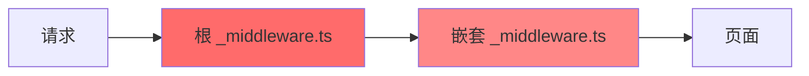

### Next.js 12.2 - 稳定版 Middleware（2022年6月）

:::tip{title="API 稳定"}
Middleware API 趋于稳定，移除嵌套支持，统一为根级别 Middleware。
:::

```typescript
// middleware.ts (Next.js 12.2)
import { NextResponse } from 'next/server';
import type { NextRequest } from 'next/server';

export function middleware(request: NextRequest) {
  // 简化的 API，移除 NextFetchEvent
  return NextResponse.next();
}

// 引入 matcher 配置
export const config = {
  matcher: '/about/:path*',
};
```

**重要变化：**

1. **单一 Middleware 文件**：移除嵌套支持，只支持根级别 `middleware.ts`
2. **Matcher 配置**：引入 `matcher` 来精确控制哪些路径需要执行 Middleware
3. **移除 NextFetchEvent**：简化 API 签名

**设计思路：**
```typescript
// 之前：多个嵌套的 Middleware（已废弃）
pages/
  _middleware.ts       // 根级别
  about/
    _middleware.ts     // 嵌套，影响 /about/*

// 之后：单一 Middleware + Matcher
middleware.ts          // 唯一的 Middleware
  config.matcher = ['/about/*', '/dashboard/*']
```

### Next.js 13.0 - App Router 与 Middleware（2022年10月）

:::note{title="App Router 时代"}
Next.js 13 引入 App Router，Middleware 与新架构深度集成。
:::

```typescript
// middleware.ts (Next.js 13.0)
import { NextResponse } from 'next/server';
import type { NextRequest } from 'next/server';

export function middleware(request: NextRequest) {
  // 与 App Router 无缝集成
  const response = NextResponse.next();

  // 支持设置 cookies 和 headers
  response.cookies.set('session', 'value');
  response.headers.set('x-middleware', 'true');

  return response;
}

// 支持更复杂的 matcher
export const config = {
  matcher: [
    '/((?!api|_next/static|_next/image|favicon.ico).*)',
  ],
};
```

**新特性：**

1. **React Server Components 集成**：Middleware 可以为 RSC 设置请求上下文
2. **增强的 Cookie 和 Header API**：更方便的操作方法
3. **改进的 Matcher**：支持正则表达式和负向匹配

**架构变化：**

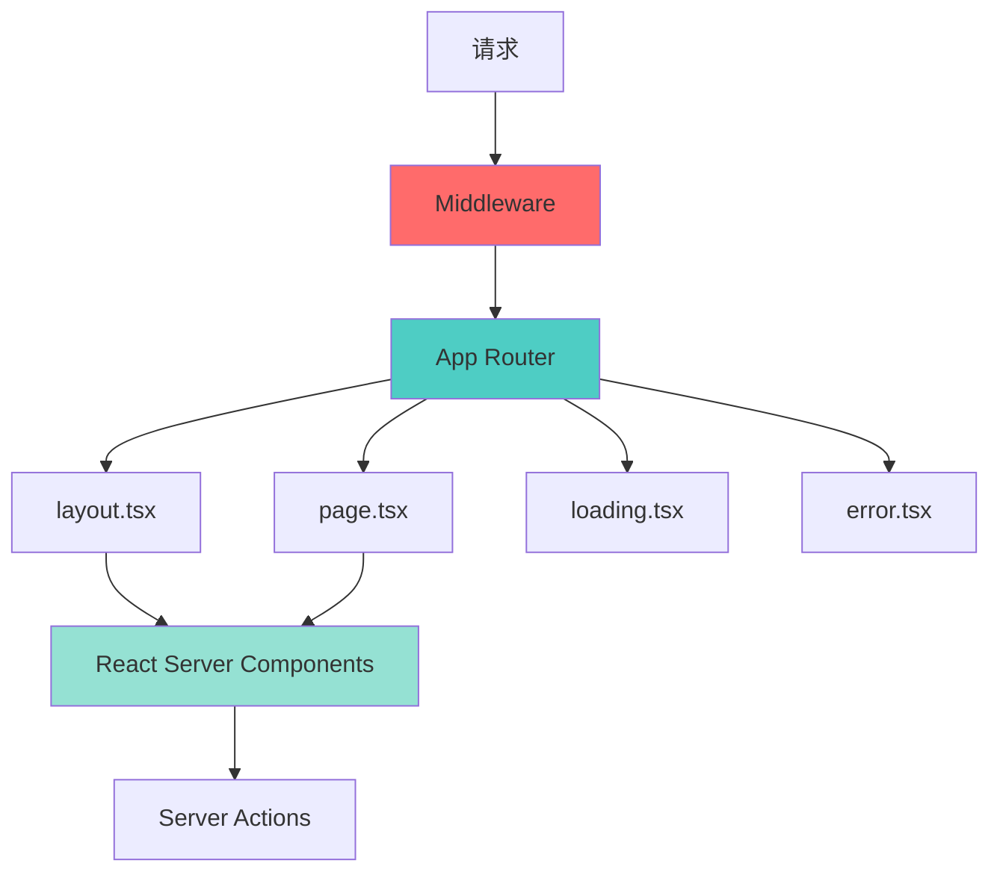

### Next.js 13.1 - 增强的 Edge Runtime（2022年12月）

**改进：**

1. **更多的 Web API 支持**：添加更多标准 Web API
2. **性能优化**：改进冷启动时间和执行效率
3. **更好的错误处理**：改进边缘运行时的错误堆栈跟踪

```typescript
// middleware.ts (Next.js 13.1)
import { NextResponse } from 'next/server';
import type { NextRequest } from 'next/server';

export function middleware(request: NextRequest) {
  // 更好的地理位置支持
  const country = request.geo?.country || 'US';
  const city = request.geo?.city || 'Unknown';

  // 基于地理位置的路由
  if (country === 'CN') {
    return NextResponse.rewrite(new URL('/cn', request.url));
  }

  const response = NextResponse.next();
  response.headers.set('x-geo-country', country);
  response.headers.set('x-geo-city', city);

  return response;
}
```

### Next.js 14.0 - Turbopack 与 Middleware（2023年10月）

:::tip{title="Turbopack 集成"}
Middleware 编译和构建速度大幅提升。
:::

**关键改进：**

1. **更快的编译**：使用 Turbopack 编译 Middleware
2. **改进的开发体验**：更快的热重载
3. **更好的类型支持**：改进 TypeScript 类型推断

```typescript
// middleware.ts (Next.js 14.0)
import { NextResponse } from 'next/server';
import type { NextRequest } from 'next/server';

export function middleware(request: NextRequest) {
  // 支持更复杂的逻辑
  const url = request.nextUrl.clone();

  // 条件重写
  if (url.pathname.startsWith('/old-path')) {
    url.pathname = url.pathname.replace('/old-path', '/new-path');
    return NextResponse.rewrite(url);
  }

  return NextResponse.next();
}

// 更灵活的配置
export const config = {
  matcher: [
    // 匹配所有路径，除了以下路径
    {
      source: '/((?!api|_next/static|_next/image|favicon.ico).*)',
      has: [
        { type: 'header', key: 'x-custom-header' }
      ],
    },
  ],
};
```

### Next.js 15.0 - 现代化 Middleware（2024年）

:::note{title="最新版本"}
Next.js 15 进一步优化 Middleware 性能和开发体验。
:::

```typescript
// middleware.ts (Next.js 15.0)
import { NextResponse } from 'next/server';
import type { NextRequest } from 'next/server';

export function middleware(request: NextRequest) {
  // 改进的请求处理
  const requestHeaders = new Headers(request.headers);
  requestHeaders.set('x-pathname', request.nextUrl.pathname);

  // 支持 waitUntil（后台任务）
  const response = NextResponse.next({
    request: {
      headers: requestHeaders,
    },
  });

  return response;
}

// 更强大的 matcher 配置
export const config = {
  matcher: [
    {
      source: '/((?!api|_next/static|_next/image|favicon.ico).*)',
      missing: [
        { type: 'header', key: 'next-router-prefetch' },
      ],
    },
  ],
};
```

**最新特性：**

1. **React 19 支持**：与最新的 React 版本集成
2. **改进的缓存策略**：更智能的边缘缓存
3. **更好的性能监控**：内置性能分析工具

### 版本演进对比表

| 版本 | 发布时间 | 主要特性 | 架构变化 |
|------|---------|---------|---------|
| **12.0** | 2021-10 | 引入 Middleware | 嵌套 Middleware，实验性 |
| **12.2** | 2022-06 | API 稳定 | 单一 Middleware + Matcher |
| **13.0** | 2022-10 | App Router 集成 | 与 RSC 深度集成 |
| **13.1** | 2022-12 | Edge Runtime 增强 | 更多 Web API |
| **14.0** | 2023-10 | Turbopack 集成 | 更快的编译和 HMR |
| **15.0** | 2024 | 现代化优化 | React 19 支持，改进缓存 |

### 实现演进图

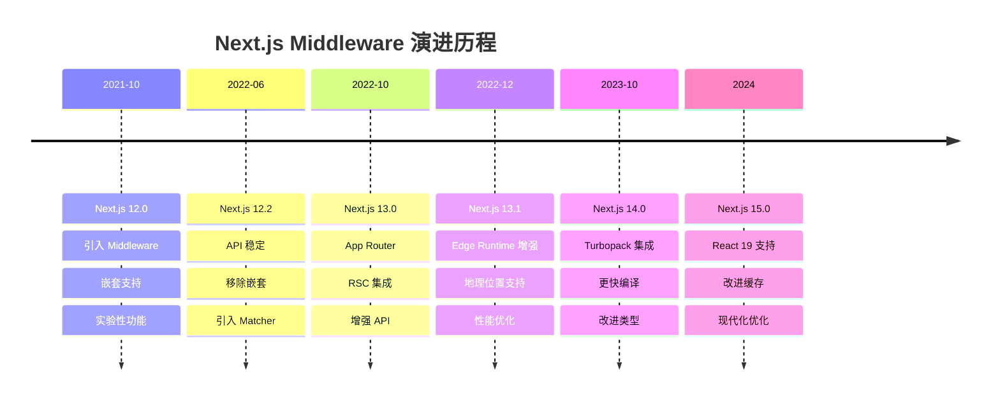

---

## 实战应用场景

### 1. 身份认证与授权

```typescript
// middleware.ts
import { NextResponse } from 'next/server';
import type { NextRequest } from 'next/server';
import { verifyJWT } from '@/lib/auth';

export async function middleware(request: NextRequest) {
  const token = request.cookies.get('auth-token')?.value;

  // 公开路径，允许访问
  const publicPaths = ['/login', '/register', '/'];
  if (publicPaths.includes(request.nextUrl.pathname)) {
    return NextResponse.next();
  }

  // 检查 token
  if (!token) {
    return NextResponse.redirect(new URL('/login', request.url));
  }

  // 验证 JWT
  try {
    const payload = await verifyJWT(token);

    // 检查权限
    const isAdmin = payload.role === 'admin';
    if (request.nextUrl.pathname.startsWith('/admin') && !isAdmin) {
      return new NextResponse('Forbidden', { status: 403 });
    }

    // 添加用户信息到请求头
    const requestHeaders = new Headers(request.headers);
    requestHeaders.set('x-user-id', payload.userId);
    requestHeaders.set('x-user-role', payload.role);

    return NextResponse.next({
      request: {
        headers: requestHeaders,
      },
    });
  } catch (error) {
    // JWT 验证失败
    return NextResponse.redirect(new URL('/login', request.url));
  }
}

export const config = {
  matcher: ['/((?!api|_next/static|_next/image|favicon.ico).*)'],
};
```

### 2. 国际化（i18n）路由

```typescript
// middleware.ts
import { NextResponse } from 'next/server';
import type { NextRequest } from 'next/server';

const locales = ['en', 'zh', 'ja', 'ko'];
const defaultLocale = 'en';

function getLocale(request: NextRequest): string {
  // 1. 检查 URL 中的语言
  const pathname = request.nextUrl.pathname;
  const pathnameLocale = locales.find(
    (locale) => pathname.startsWith(`/${locale}/`) || pathname === `/${locale}`
  );
  if (pathnameLocale) return pathnameLocale;

  // 2. 检查 Cookie
  const localeCookie = request.cookies.get('locale')?.value;
  if (localeCookie && locales.includes(localeCookie)) {
    return localeCookie;
  }

  // 3. 检查 Accept-Language 头
  const acceptLanguage = request.headers.get('accept-language');
  if (acceptLanguage) {
    const preferredLocale = acceptLanguage
      .split(',')
      .map(lang => lang.split(';')[0].trim().split('-')[0])
      .find(lang => locales.includes(lang));

    if (preferredLocale) return preferredLocale;
  }

  // 4. 基于地理位置
  const country = request.geo?.country;
  const geoLocaleMap: Record<string, string> = {
    'CN': 'zh',
    'JP': 'ja',
    'KR': 'ko',
  };
  if (country && geoLocaleMap[country]) {
    return geoLocaleMap[country];
  }

  return defaultLocale;
}

export function middleware(request: NextRequest) {
  const pathname = request.nextUrl.pathname;

  // 跳过已经有语言前缀的路径
  const pathnameHasLocale = locales.some(
    (locale) => pathname.startsWith(`/${locale}/`) || pathname === `/${locale}`
  );

  if (pathnameHasLocale) return NextResponse.next();

  // 获取用户语言偏好
  const locale = getLocale(request);

  // 重定向到带语言前缀的 URL
  const newUrl = new URL(`/${locale}${pathname}`, request.url);
  const response = NextResponse.redirect(newUrl);

  // 设置 Cookie 记住用户选择
  response.cookies.set('locale', locale, {
    maxAge: 60 * 60 * 24 * 365, // 1 年
  });

  return response;
}

export const config = {
  matcher: ['/((?!api|_next|.*\\..*).*)'],
};
```

### 3. A/B 测试

```typescript
// middleware.ts
import { NextResponse } from 'next/server';
import type { NextRequest } from 'next/server';

export function middleware(request: NextRequest) {
  // 检查是否已经分配了变体
  let variant = request.cookies.get('ab-test-variant')?.value;

  if (!variant) {
    // 随机分配变体（50/50）
    variant = Math.random() < 0.5 ? 'A' : 'B';
  }

  // 根据变体重写到不同的页面
  let response: NextResponse;

  if (variant === 'B' && request.nextUrl.pathname === '/') {
    response = NextResponse.rewrite(new URL('/home-variant-b', request.url));
  } else {
    response = NextResponse.next();
  }

  // 设置 Cookie 保存变体
  response.cookies.set('ab-test-variant', variant, {
    maxAge: 60 * 60 * 24 * 30, // 30 天
  });

  // 添加变体信息到响应头（用于分析）
  response.headers.set('x-ab-test-variant', variant);

  return response;
}

export const config = {
  matcher: '/',
};
```

### 4. 速率限制（Rate Limiting）

```typescript
// middleware.ts
import { NextResponse } from 'next/server';
import type { NextRequest } from 'next/server';

// 简单的内存存储（生产环境应使用 Redis）
const rateLimitMap = new Map<string, { count: number; resetTime: number }>();

const RATE_LIMIT = 100; // 每分钟最多 100 个请求
const WINDOW = 60 * 1000; // 1 分钟窗口

export function middleware(request: NextRequest) {
  const ip = request.ip || 'unknown';
  const now = Date.now();

  // 获取或创建速率限制记录
  let record = rateLimitMap.get(ip);

  if (!record || now > record.resetTime) {
    // 创建新记录或重置
    record = {
      count: 1,
      resetTime: now + WINDOW,
    };
    rateLimitMap.set(ip, record);
  } else {
    // 增加计数
    record.count++;
  }

  // 检查是否超过限制
  if (record.count > RATE_LIMIT) {
    return new NextResponse('Too Many Requests', {
      status: 429,
      headers: {
        'Retry-After': String(Math.ceil((record.resetTime - now) / 1000)),
        'X-RateLimit-Limit': String(RATE_LIMIT),
        'X-RateLimit-Remaining': '0',
        'X-RateLimit-Reset': String(record.resetTime),
      },
    });
  }

  // 添加速率限制信息到响应头
  const response = NextResponse.next();
  response.headers.set('X-RateLimit-Limit', String(RATE_LIMIT));
  response.headers.set('X-RateLimit-Remaining', String(RATE_LIMIT - record.count));
  response.headers.set('X-RateLimit-Reset', String(record.resetTime));

  return response;
}

export const config = {
  matcher: '/api/:path*',
};
```

### 5. 地理位置路由

```typescript
// middleware.ts
import { NextResponse } from 'next/server';
import type { NextRequest } from 'next/server';

// 地理位置到域名的映射
const geoRouting: Record<string, string> = {
  'US': 'us.example.com',
  'GB': 'uk.example.com',
  'CN': 'cn.example.com',
  'JP': 'jp.example.com',
};

export function middleware(request: NextRequest) {
  const country = request.geo?.country || 'US';
  const targetDomain = geoRouting[country] || geoRouting['US'];
  const currentDomain = request.nextUrl.hostname;

  // 如果已经在正确的域名，继续
  if (currentDomain === targetDomain) {
    return NextResponse.next();
  }

  // 检查是否有覆盖参数
  const skipRedirect = request.nextUrl.searchParams.get('geo') === 'skip';
  if (skipRedirect) {
    const response = NextResponse.next();
    response.cookies.set('skip-geo-redirect', '1', {
      maxAge: 60 * 60 * 24, // 24 小时
    });
    return response;
  }

  // 检查是否之前选择跳过
  if (request.cookies.get('skip-geo-redirect')) {
    return NextResponse.next();
  }

  // 重定向到地理位置特定的域名
  const url = request.nextUrl.clone();
  url.hostname = targetDomain;

  return NextResponse.redirect(url, 307);
}

export const config = {
  matcher: '/:path*',
};
```

### 6. Bot 检测与保护

```typescript
// middleware.ts
import { NextResponse } from 'next/server';
import type { NextRequest } from 'next/server';

const KNOWN_BOTS = [
  'googlebot',
  'bingbot',
  'slackbot',
  'twitterbot',
  'facebookexternalhit',
];

const BLOCKED_BOTS = [
  'semrushbot',
  'ahrefsbot',
  'dotbot',
];

function isBot(userAgent: string): boolean {
  const ua = userAgent.toLowerCase();
  return KNOWN_BOTS.some(bot => ua.includes(bot)) ||
         BLOCKED_BOTS.some(bot => ua.includes(bot));
}

function isBlockedBot(userAgent: string): boolean {
  const ua = userAgent.toLowerCase();
  return BLOCKED_BOTS.some(bot => ua.includes(bot));
}

export function middleware(request: NextRequest) {
  const userAgent = request.headers.get('user-agent') || '';

  // 阻止恶意爬虫
  if (isBlockedBot(userAgent)) {
    return new NextResponse('Forbidden', { status: 403 });
  }

  // 为搜索引擎爬虫返回优化的响应
  if (isBot(userAgent)) {
    const response = NextResponse.next();
    response.headers.set('X-Robots-Tag', 'index, follow');
    response.headers.set('Cache-Control', 'public, max-age=3600');
    return response;
  }

  return NextResponse.next();
}

export const config = {
  matcher: '/:path*',
};
```

---

## 性能优化最佳实践

### 1. 减少 Middleware 执行时间

:::warning{title="性能影响"}
Middleware 在每个请求上都会执行，应该尽可能快速。
:::

```typescript
// ❌ 不好：执行耗时操作
export async function middleware(request: NextRequest) {
  // 不要在 Middleware 中执行数据库查询
  const user = await db.users.findOne({ id: userId });

  // 不要在 Middleware 中执行外部 API 调用
  const data = await fetch('https://slow-api.com/data');

  return NextResponse.next();
}

// ✅ 好：快速检查和转发
export function middleware(request: NextRequest) {
  // 快速的 token 检查
  const token = request.cookies.get('auth-token');

  if (!token) {
    return NextResponse.redirect(new URL('/login', request.url));
  }

  // 将 token 传递给应用层处理
  const requestHeaders = new Headers(request.headers);
  requestHeaders.set('x-auth-token', token.value);

  return NextResponse.next({
    request: { headers: requestHeaders },
  });
}
```

### 2. 优化 Matcher 配置

```typescript
// ❌ 不好：过于宽泛的匹配
export const config = {
  matcher: '/:path*', // 匹配所有路径
};

// ✅ 好：精确匹配需要的路径
export const config = {
  matcher: [
    '/dashboard/:path*',
    '/api/protected/:path*',
  ],
};

// ✅ 更好：排除静态资源
export const config = {
  matcher: [
    '/((?!_next/static|_next/image|favicon.ico|public/).*)',
  ],
};
```

### 3. 使用条件重写而非重定向

```typescript
// ❌ 不好：重定向（额外的往返）
export function middleware(request: NextRequest) {
  if (shouldUseVariantB(request)) {
    return NextResponse.redirect(new URL('/variant-b', request.url));
  }
  return NextResponse.next();
}

// ✅ 好：重写（无额外往返）
export function middleware(request: NextRequest) {
  if (shouldUseVariantB(request)) {
    return NextResponse.rewrite(new URL('/variant-b', request.url));
  }
  return NextResponse.next();
}
```

### 4. 利用边缘缓存

```typescript
// middleware.ts
export function middleware(request: NextRequest) {
  const response = NextResponse.next();

  // 为静态内容设置缓存
  if (request.nextUrl.pathname.startsWith('/blog/')) {
    response.headers.set(
      'Cache-Control',
      'public, s-maxage=3600, stale-while-revalidate=86400'
    );
  }

  return response;
}
```

### 5. 监控和调试

```typescript
// middleware.ts
export function middleware(request: NextRequest) {
  const startTime = Date.now();

  // 执行 Middleware 逻辑
  const response = NextResponse.next();

  // 添加性能指标
  const executionTime = Date.now() - startTime;
  response.headers.set('X-Middleware-Time', String(executionTime));

  // 在开发环境记录慢请求
  if (process.env.NODE_ENV === 'development' && executionTime > 100) {
    console.warn(`Slow middleware execution: ${executionTime}ms`);
  }

  return response;
}
```

### 性能对比

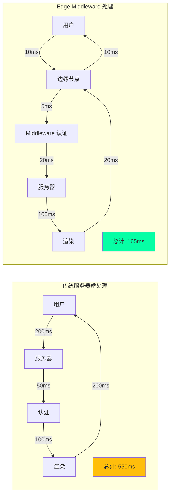

---

## 总结

### Middleware 的核心价值

1. **极低延迟**：在靠近用户的边缘节点执行，响应时间从数百毫秒降至数十毫秒
2. **全球分布**：自动部署到全球边缘网络，无需手动配置
3. **统一控制**：在单一位置管理认证、路由、重定向等横切关注点
4. **成本优化**：减少源服务器负载，降低基础设施成本

### 使用建议

:::tip{title="何时使用 Middleware"}
- ✅ 身份认证和授权
- ✅ 地理位置路由
- ✅ A/B 测试和特性标志
- ✅ URL 重写和重定向
- ✅ Bot 检测和保护
- ✅ 速率限制
- ✅ 国际化路由
:::

:::warning{title="何时不使用 Middleware"}
- ❌ 复杂的数据库查询
- ❌ 耗时的计算任务
- ❌ 大量的外部 API 调用
- ❌ 需要完整 Node.js API 的逻辑
- ❌ 大型依赖包的使用
:::

### 架构演进趋势


Next.js Middleware 代表了 Web 应用架构的未来方向：将计算推向边缘，在最接近用户的位置处理请求，提供更快、更可靠的用户体验。随着边缘计算技术的不断发展，Middleware 的能力和应用场景将持续扩展。

---

## 参考资源

- [Next.js Middleware 官方文档](https://nextjs.org/docs/app/building-your-application/routing/middleware)
- [Edge Runtime API Reference](https://edge-runtime.vercel.app/)
- [Vercel Edge Functions](https://vercel.com/docs/functions/edge-functions)
- [Next.js 版本发布说明](https://github.com/vercel/next.js/releases)
