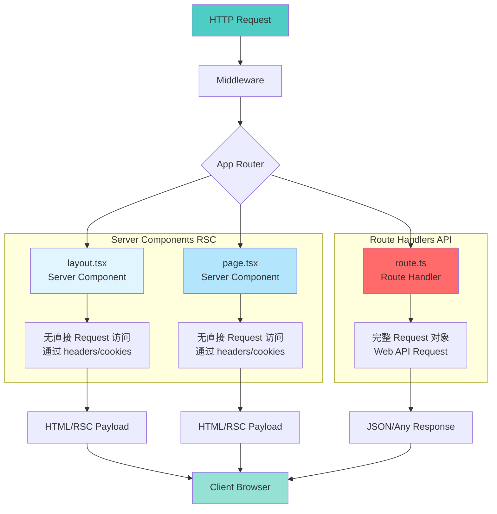
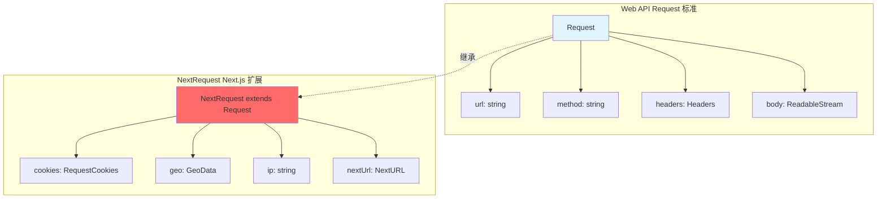
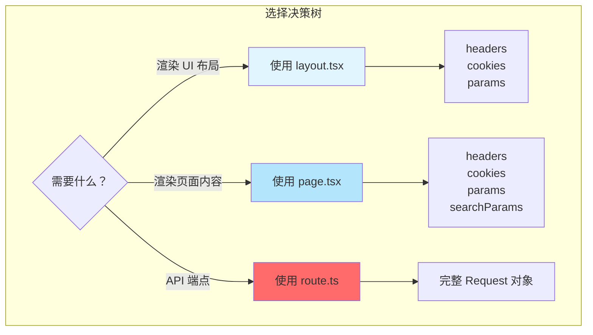

# Next.js Request 架构全解析：layout.tsx、page.tsx 与 route.ts 的请求处理差异

在 Next.js 13+ 的 App Router 架构中，`layout.tsx`、`page.tsx` 和 `route.ts` 扮演着不同的角色，它们对 Request 的访问方式和结构也各不相同。本文将深入探讨这些差异，帮助你在正确的场景使用正确的 API。

## 目录

1. [Next.js 请求处理概览](#nextjs-请求处理概览)
2. [三种文件类型的核心差异](#三种文件类型的核心差异)
3. [layout.tsx 中的请求处理](#layouttsx-中的请求处理)
4. [page.tsx 中的请求处理](#pagetsx-中的请求处理)
5. [route.ts 中的请求处理](#routets-中的请求处理)
6. [Request 对象完整架构](#request-对象完整架构)
7. [实战场景与最佳实践](#实战场景与最佳实践)
8. [常见问题与解决方案](#常见问题与解决方案)

---

## Next.js 请求处理概览

### 整体架构图



### 核心概念对比

| 特性 | layout.tsx | page.tsx | route.ts |
|------|-----------|----------|----------|
| **文件类型** | Server Component | Server Component | Route Handler |
| **主要用途** | 共享布局、嵌套路由 | 页面内容渲染 | API 端点、数据处理 |
| **Request 访问** | ❌ 无直接访问 | ❌ 无直接访问 | ✅ 完整访问 |
| **可用 API** | `headers()`, `cookies()` | `headers()`, `cookies()` | 原生 `Request` 对象 |
| **返回类型** | React 组件 JSX | React 组件 JSX | `Response` 对象 |
| **执行时机** | 每次渲染 | 每次渲染 | 按需调用 |
| **支持 HTTP 方法** | N/A | N/A | GET, POST, PUT, DELETE |
| **URL 参数** | `params` | `params`, `searchParams` | 通过 `request.url` |

---

## 三种文件类型的核心差异

### 设计理念差异

:::tip{title="为什么 Server Components 不能直接访问 Request？"}
**React Server Components 的设计哲学：**

1. **声明式渲染**：组件应该是纯函数，基于 props 渲染 UI
2. **可组合性**：组件应该可以在不同上下文中复用
3. **性能优化**：避免将整个 Request 对象序列化到客户端
4. **安全性**：防止敏感的请求信息泄露到客户端

**Route Handlers 的设计哲学：**

1. **命令式 API**：直接处理 HTTP 请求和响应
2. **完整控制**：需要访问请求的所有细节
3. **传统后端模式**：类似 Express.js 的编程模型
4. **灵活性**：支持各种 HTTP 方法和响应类型
:::

---

## layout.tsx 中的请求处理

### Layout 组件特性

```typescript
// app/layout.tsx
import { headers, cookies } from 'next/headers';

interface LayoutProps {
  children: React.ReactNode;
  params: { [key: string]: string };
}

export default async function RootLayout({ children, params }: LayoutProps) {
  // ✅ 可用：通过函数访问请求信息
  const headersList = headers();
  const cookieStore = cookies();

  // 读取请求头
  const userAgent = headersList.get('user-agent');
  const authorization = headersList.get('authorization');

  // 读取 Cookie
  const sessionToken = cookieStore.get('session');

  // ❌ 不可用：无法直接访问 Request 对象
  // const request = ???  // 不存在

  return (
    <html lang="en">
      <body>
        <header>
          {sessionToken && <UserMenu />}
        </header>
        {children}
      </body>
    </html>
  );
}
```

### Layout Props 结构

```typescript
interface LayoutProps {
  // 子组件（必需）
  children: React.ReactNode;

  // 动态路由参数
  params: {
    [key: string]: string | string[];
  };

  // ❌ 没有 searchParams（仅在 page.tsx 中可用）
  // ❌ 没有 request 对象
}
```

---

## page.tsx 中的请求处理

### Page 组件特性

```typescript
// app/blog/[slug]/page.tsx
import { headers, cookies } from 'next/headers';

interface PageProps {
  params: { slug: string };
  searchParams: { [key: string]: string | string[] | undefined };
}

export default async function BlogPost({ params, searchParams }: PageProps) {
  // ✅ 可用：通过函数访问请求信息
  const headersList = headers();
  const cookieStore = cookies();

  // ✅ 可用：动态路由参数
  const { slug } = params;

  // ✅ 可用：URL 查询参数
  const { preview, highlight } = searchParams;

  // 读取请求信息
  const referer = headersList.get('referer');
  const userPreferences = cookieStore.get('preferences');

  return (
    <article>
      <h1>{slug}</h1>
      {preview && <PreviewBanner />}
    </article>
  );
}
```

### Page Props 结构

```typescript
interface PageProps {
  // 动态路由参数（必需）
  params: {
    [key: string]: string | string[];
  };

  // URL 查询参数（可选）
  searchParams: {
    [key: string]: string | string[] | undefined;
  };

  // ❌ 没有 request 对象
}
```

---

## route.ts 中的请求处理

### Route Handler 特性

```typescript
// app/api/users/route.ts
import { NextRequest, NextResponse } from 'next/server';

// GET 请求处理
export async function GET(request: NextRequest) {
  // ✅ 完整的 Request 对象访问
  const url = new URL(request.url);
  const searchParams = url.searchParams;
  const page = searchParams.get('page') || '1';

  // 访问请求头
  const authorization = request.headers.get('authorization');

  // 访问 Cookie
  const sessionToken = request.cookies.get('session')?.value;

  // 访问地理位置信息（Vercel）
  const country = request.geo?.country;
  const city = request.geo?.city;

  // 访问 IP 地址
  const ip = request.ip;

  const users = await getUsers({ page: parseInt(page) });

  return NextResponse.json({
    users,
    page: parseInt(page),
    total: users.length,
  });
}

// POST 请求处理
export async function POST(request: NextRequest) {
  // 读取请求体
  const body = await request.json();

  // 验证请求
  const authorization = request.headers.get('authorization');
  if (!authorization) {
    return NextResponse.json(
      { error: 'Unauthorized' },
      { status: 401 }
    );
  }

  const user = await createUser(body);
  return NextResponse.json(user, { status: 201 });
}
```

### Request 对象完整结构

```typescript
interface NextRequest extends Request {
  // 基础 Web API Request 属性
  url: string;                    // 完整 URL
  method: string;                 // HTTP 方法
  headers: Headers;               // 请求头
  body: ReadableStream | null;    // 请求体

  // Next.js 扩展属性
  cookies: RequestCookies;        // Cookie 访问器
  geo?: {                         // 地理位置信息
    city?: string;
    country?: string;
    region?: string;
    latitude?: string;
    longitude?: string;
  };
  ip?: string;                    // 客户端 IP
  nextUrl: NextURL;               // 解析后的 URL 对象

  // Request 方法
  json(): Promise<any>;
  text(): Promise<string>;
  formData(): Promise<FormData>;
  arrayBuffer(): Promise<ArrayBuffer>;
  blob(): Promise<Blob>;
}
```

---

## Request 对象完整架构

### Web API Request vs NextRequest



---

## 实战场景与最佳实践

### 场景 1：用户认证

#### 在 Middleware 中（推荐）

```typescript
// middleware.ts
import { NextResponse } from 'next/server';
import type { NextRequest } from 'next/server';

export function middleware(request: NextRequest) {
  // ✅ 最佳实践：在边缘节点验证身份
  const token = request.cookies.get('auth-token')?.value;

  if (request.nextUrl.pathname.startsWith('/dashboard')) {
    if (!token || !isValidToken(token)) {
      return NextResponse.redirect(new URL('/login', request.url));
    }
  }

  return NextResponse.next();
}
```

#### 在 Layout 中（适用于 UI 逻辑）

```typescript
// app/dashboard/layout.tsx
import { cookies } from 'next/headers';
import { redirect } from 'next/navigation';

export default async function DashboardLayout({
  children,
}: {
  children: React.ReactNode;
}) {
  const cookieStore = cookies();
  const token = cookieStore.get('auth-token');

  if (!token) {
    redirect('/login');
  }

  const user = await getUserFromToken(token.value);

  return (
    <div>
      <Sidebar user={user} />
      <main>{children}</main>
    </div>
  );
}
```

### 场景 2：国际化（i18n）

```typescript
// middleware.ts
import { NextRequest, NextResponse } from 'next/server';

const locales = ['en', 'zh', 'ja'];
const defaultLocale = 'en';

export function middleware(request: NextRequest) {
  const pathname = request.nextUrl.pathname;

  const pathnameHasLocale = locales.some(
    (locale) => pathname.startsWith(`/${locale}/`)
  );

  if (pathnameHasLocale) return NextResponse.next();

  // 检测语言
  const locale = getLocale(request);
  request.nextUrl.pathname = `/${locale}${pathname}`;
  return NextResponse.redirect(request.nextUrl);
}

function getLocale(request: NextRequest): string {
  // Cookie 优先
  const cookieLocale = request.cookies.get('locale')?.value;
  if (cookieLocale && locales.includes(cookieLocale)) {
    return cookieLocale;
  }

  // Accept-Language header
  const acceptLanguage = request.headers.get('accept-language');
  if (acceptLanguage) {
    const preferred = acceptLanguage.split(',')[0].split('-')[0];
    if (locales.includes(preferred)) {
      return preferred;
    }
  }

  return defaultLocale;
}
```

---

## 常见问题与解决方案

### 问题 1：为什么 Server Components 不能直接访问 Request？

**原因：**

1. **组件的可组合性**：Server Components 应该是纯函数
2. **序列化限制**：Request 对象包含不可序列化的数据
3. **安全性**：避免敏感请求信息泄露到客户端
4. **性能**：避免传递整个 Request 对象

**解决方案：**

```typescript
// ✅ 正确：使用 headers() 和 cookies()
import { headers, cookies } from 'next/headers';

export default async function Page() {
  const headersList = headers();
  const cookieStore = cookies();

  const userAgent = headersList.get('user-agent');
  const token = cookieStore.get('token');
}
```

### 问题 2：如何在 Server Components 中访问查询参数？

```typescript
// page.tsx 自动接收 searchParams
interface PageProps {
  searchParams: { [key: string]: string | string[] | undefined };
}

export default function SearchPage({ searchParams }: PageProps) {
  const { q, category } = searchParams;
  return <SearchResults query={q} category={category} />;
}
```

### 问题 3：layout.tsx 中没有 searchParams 怎么办？

**问题：**`layout.tsx` 不接收 `searchParams`，因为布局应该在所有页面间共享。

**解决方案：**

```typescript
// ✅ 方案 1：在 page.tsx 中处理，通过 props 传递
export default function Page({ searchParams }) {
  return <MyComponent searchParams={searchParams} />;
}

// ✅ 方案 2：使用客户端组件读取 URL
'use client';
import { useSearchParams } from 'next/navigation';

export default function ClientComponent() {
  const searchParams = useSearchParams();
  const query = searchParams.get('q');
}
```

---

## 总结

### 核心要点



### 最佳实践总结

:::tip{title="使用 layout.tsx 当你需要"}
- ✅ 定义共享布局和导航
- ✅ 基于身份验证显示不同 UI
- ✅ 设置全局样式和元数据
- ❌ 不要依赖 `searchParams`（layout 不接收）
:::

:::tip{title="使用 page.tsx 当你需要"}
- ✅ 渲染页面主要内容
- ✅ 访问 URL 查询参数（`searchParams`）
- ✅ 访问动态路由参数（`params`）
- ✅ 根据请求头/Cookie 个性化内容
:::

:::tip{title="使用 route.ts 当你需要"}
- ✅ 创建 RESTful API 端点
- ✅ 处理表单提交
- ✅ Webhook 接收
- ✅ 文件上传/下载
- ✅ 完整控制 HTTP 请求和响应
:::

### 请求访问方式对照表

| 需求 | layout.tsx | page.tsx | route.ts |
|------|-----------|----------|----------|
| **URL 路径** | `headers().get('x-pathname')` | `headers().get('x-pathname')` | `request.nextUrl.pathname` |
| **查询参数** | ❌ 不可用 | ✅ `searchParams` prop | `request.nextUrl.searchParams` |
| **路由参数** | ✅ `params` prop | ✅ `params` prop | ✅ `context.params` |
| **请求头** | `headers()` | `headers()` | `request.headers` |
| **Cookies** | `cookies()` | `cookies()` | `request.cookies` |
| **HTTP 方法** | N/A | N/A | `request.method` |
| **请求体** | ❌ 不可用 | ❌ 不可用 | `request.json()` |
| **IP 地址** | `headers().get('x-forwarded-for')` | `headers().get('x-forwarded-for')` | `request.ip` |

---

## 参考资源

- [Next.js App Router 文档](https://nextjs.org/docs/app)
- [React Server Components](https://nextjs.org/docs/app/building-your-application/rendering/server-components)
- [Route Handlers](https://nextjs.org/docs/app/building-your-application/routing/route-handlers)
- [Web API Request](https://developer.mozilla.org/en-US/docs/Web/API/Request)
