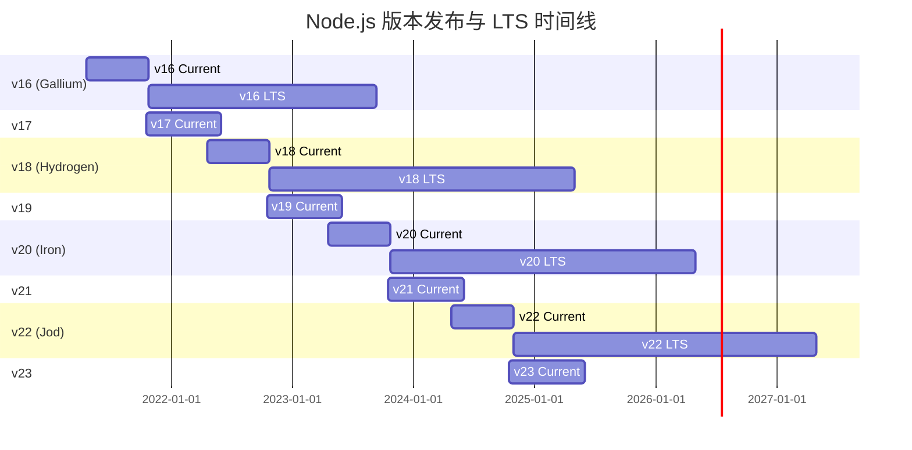
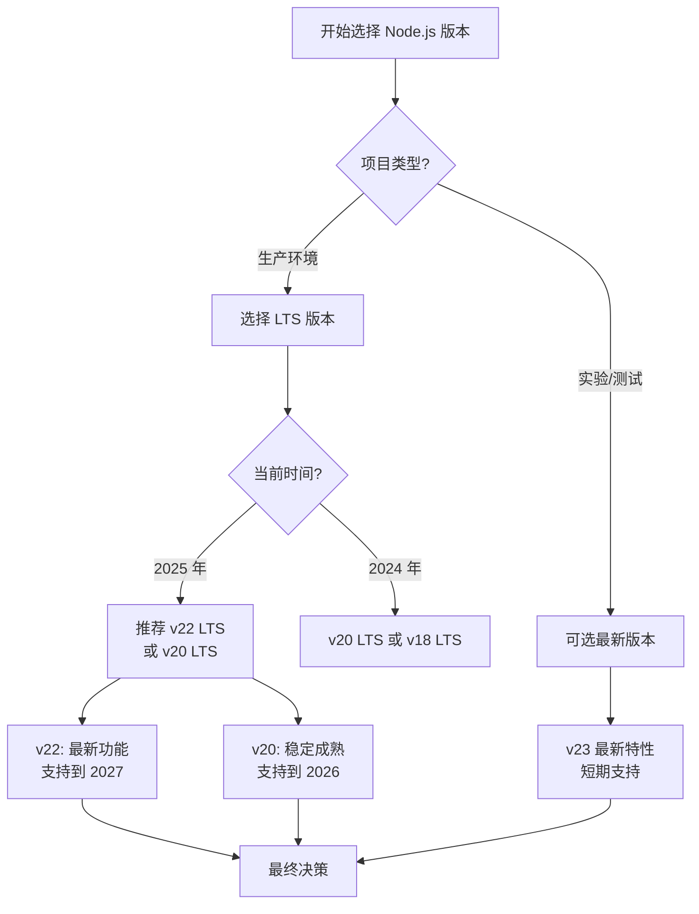
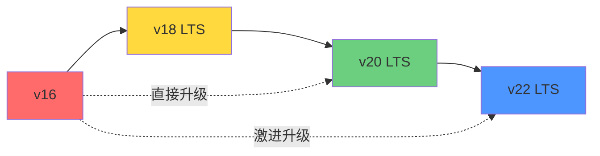

# Node.js 升级指南：从 v16 到最新版本的完整演进

本文将详细介绍 Node.js 从版本 16 到最新版本 23 的所有重大更新和特性变化，帮助开发者了解各个版本的核心改进，并做出合适的升级决策。

## 版本发布时间线概览



:::info{title="LTS 版本说明"}
**LTS (Long-Term Support)** 版本是生产环境的推荐选择:
- 偶数版本(16, 18, 20, 22)会进入 LTS，获得约 30 个月的积极支持
- 奇数版本(17, 19, 21, 23)仅有约 8 个月的生命周期，适合测试新特性
- 当前推荐使用的 LTS 版本:**v20 (Iron)** 和 **v22 (Jod)**
:::

## 版本详细解析

### Node.js v16 (Gallium) - LTS

**发布时间:** 2021 年 4 月 20 日  
**LTS 开始:** 2021 年 10 月 25 日  
**生命周期结束:** 2023 年 9 月 11 日 ⚠️ 已结束支持  
**最新版本:** v16.20.2

#### 核心特性

##### 1. **Timers Promises API 稳定化**

Timer 模块的 Promise 版本成为稳定 API，提供了更现代的异步处理方式:

```javascript
import { setTimeout, setInterval } from 'timers/promises';

// Promise 风格的延迟
async function delay() {
  console.log('开始等待...');
  await setTimeout(1000);
  console.log('1 秒后执行');
}

// 使用 for await 进行间隔操作
async function* intervalGenerator() {
  for await (const startTime of setInterval(100, Date.now())) {
    const now = Date.now();
    console.log(`已过 ${now - startTime}ms`);
    if (now - startTime > 1000) break;
  }
}
```

##### 2. **V8 9.0 引擎升级**

- 性能提升和内存优化
- 支持新的 JavaScript 语言特性
- 改进的垃圾回收机制

##### 3. **Object.hasOwn() 方法**

更安全的属性检查方式，替代 `Object.prototype.hasOwnProperty`:

```javascript
const obj = { foo: 'bar' };

// 旧方式(可能不安全)
obj.hasOwnProperty('foo'); // true

// 新方式(更安全)
Object.hasOwn(obj, 'foo'); // true

// 优势:即使对象没有原型也能正常工作
const nullProtoObj = Object.create(null);
Object.hasOwn(nullProtoObj, 'prop'); // 安全
// nullProtoObj.hasOwnProperty('prop'); // 会报错
```

##### 4. **Error Cause 链式错误**

支持错误原因链，改善错误追踪:

```javascript
async function loadData() {
  try {
    await fetch('https://api.example.com/data');
  } catch (error) {
    throw new Error('加载数据失败', { cause: error });
  }
}

try {
  await loadData();
} catch (error) {
  console.error(error.message); // '加载数据失败'
  console.error(error.cause);   // 原始的 fetch 错误
}
```

##### 5. **实验性特性**

- **Web Streams API** (实验性)
- **Test Runner** (实验性) - 内置测试框架
- **ESM Loader Hooks** (实验性)

---

### Node.js v17 (非 LTS)

**发布时间:** 2021 年 10 月 19 日  
**生命周期结束:** 2022 年 6 月 1 日  
**最新版本:** v17.9.1

#### 主要变更

- **V8 9.5 引擎** - 性能优化和新 JavaScript 特性
- **OpenSSL 3.0** - 重大的加密库升级
- **Readline Promise API** - readline 模块的 Promise 版本
- **Array.prototype.at()** - 数组负索引访问

```javascript
const arr = [1, 2, 3, 4, 5];
arr.at(-1);  // 5 (最后一个元素)
arr.at(-2);  // 4 (倒数第二个)
```

:::warning
v17 是短期版本，已停止支持，建议升级到 v18 或更高版本。
:::

---

### Node.js v18 (Hydrogen) - LTS ⭐

**发布时间:** 2022 年 4 月 19 日  
**LTS 开始:** 2022 年 10 月 25 日  
**生命周期结束:** 2025 年 4 月 30 日  
**最新版本:** v18.20.8

#### 核心特性

##### 1. **Fetch API 内置支持** ⭐ 重大更新

原生支持 Web 标准的 `fetch` API，无需额外依赖:

```javascript
// 无需安装 node-fetch 或其他库
const response = await fetch('https://api.github.com/users/nodejs');
const data = await response.json();
console.log(data.name);

// 支持完整的 Fetch API 特性
const postResponse = await fetch('https://api.example.com/data', {
  method: 'POST',
  headers: {
    'Content-Type': 'application/json',
  },
  body: JSON.stringify({ key: 'value' }),
});
```

##### 2. **Test Runner 模块** (实验性)

内置测试框架，减少对外部测试库的依赖:

```javascript
import test from 'node:test';
import assert from 'node:assert';

test('同步测试', (t) => {
  assert.strictEqual(1 + 1, 2);
});

test('异步测试', async (t) => {
  const result = await Promise.resolve(42);
  assert.strictEqual(result, 42);
});

test('子测试', async (t) => {
  await t.test('子测试 1', (t) => {
    assert.ok(true);
  });

  await t.test('子测试 2', (t) => {
    assert.ok(true);
  });
});
```

##### 3. **Web Streams API** (实验性)

符合 Web 标准的流处理 API:

```javascript
const readableStream = new ReadableStream({
  start(controller) {
    controller.enqueue('chunk 1');
    controller.enqueue('chunk 2');
    controller.close();
  }
});

const reader = readableStream.getReader();
while (true) {
  const { done, value } = await reader.read();
  if (done) break;
  console.log(value);
}
```

##### 4. **V8 10.1 引擎**

- 性能提升
- 新的 JavaScript 特性支持
- 改进的内存管理

##### 5. **其他重要更新**

- **Import Assertions** - JSON 模块导入支持(在 v18.20.5 稳定化)
- **单文件可执行程序** (Single Executable Applications) 初步支持
- HTTP 超时处理改进

```javascript
// Import Assertions (JSON 模块)
import data from './data.json' assert { type: 'json' };
```

---

### Node.js v19 (非 LTS)

**发布时间:** 2022 年 10 月 18 日  
**生命周期结束:** 2023 年 6 月 1 日  
**最新版本:** v19.9.0

#### 主要变更

- **V8 10.7 引擎** - 持续性能优化
- **HTTP(S) KeepAlive 默认启用** - 提升网络性能
- **--watch 模式改进** - 更好的文件监视体验
- **WebCrypto API 扩展** - 更多加密算法支持

:::warning
v19 是短期版本，已停止支持，建议升级到 v20 或更高版本。
:::

---

### Node.js v20 (Iron) - LTS ⭐

**发布时间:** 2023 年 4 月 18 日  
**LTS 开始:** 2023 年 10 月 24 日  
**生命周期结束:** 2026 年 4 月 30 日  
**最新版本:** v20.19.5

#### 核心特性

##### 1. **权限模型 (Permission Model)** ⭐ 重大更新

引入细粒度的安全控制，限制对文件系统、子进程等的访问:

```bash
# 限制文件系统访问
node --experimental-permission --allow-fs-read=/app/data index.js

# 限制子进程创建
node --experimental-permission --allow-child-process index.js

# 组合多个权限
node --experimental-permission \
  --allow-fs-read=/app/data \
  --allow-fs-write=/app/logs \
  --allow-child-process \
  index.js
```

```javascript
// 检查权限
if (process.permission.has('fs.read', '/path/to/file')) {
  // 执行文件读取
}
```

##### 2. **稳定的 Test Runner** ⭐

测试框架从实验性升级为稳定版本:

```javascript
import { describe, it } from 'node:test';
import assert from 'node:assert';

describe('用户模块', () => {
  it('应该创建新用户', async () => {
    const user = await createUser({ name: 'Alice' });
    assert.strictEqual(user.name, 'Alice');
  });

  it('应该验证邮箱格式', () => {
    assert.throws(() => {
      validateEmail('invalid-email');
    }, /Invalid email/);
  });
});
```

##### 3. **V8 11.3 引擎**

- 显著的性能提升
- 新的 JavaScript 语言特性
- 优化的内存使用

##### 4. **自定义 ESM Loader 钩子在专用线程运行**

模块加载钩子在独立线程中运行，提升性能和隔离性。

##### 5. **Ada 2.0 URL 解析器**

更快、更符合标准的 URL 解析。

##### 6. **ARM64 Windows 支持**

官方支持 Windows on ARM64 架构。

##### 7. **破坏性变更**

- **单文件可执行程序需要注入 Blob** - 部署流程变更
- **WASI 版本必须显式指定** - WebAssembly 相关
- 多个旧 API 废弃

---

### Node.js v21 (非 LTS)

**发布时间:** 2023 年 10 月 17 日  
**生命周期结束:** 2024 年 6 月 1 日  
**最新版本:** v21.7.3

#### 主要变更

- **V8 11.8 引擎** - 持续性能改进
- **稳定的 Fetch API** - 从实验性升级为稳定
- **内置 WebSocket 支持** (实验性)
- **--experimental-default-type** - 控制模块默认类型

:::warning
v21 是短期版本，已停止支持，建议升级到 v22 或更高版本。
:::

---

### Node.js v22 (Jod) - LTS ⭐ 当前推荐

**发布时间:** 2024 年 4 月 24 日  
**LTS 开始:** 2024 年 10 月 29 日  
**生命周期结束:** 2027 年 4 月 30 日  
**最新版本:** v22.21.1

#### 核心特性

##### 1. **稳定的权限模型** ⭐

权限模型在 v22.13.0 中稳定化，生产环境可用:

```javascript
// process.permission API 稳定
const canReadFile = process.permission.has('fs.read', '/config/app.json');

if (canReadFile) {
  const config = await fs.readFile('/config/app.json');
}
```

##### 2. **TypeScript 原生支持** ⭐ 重大更新

实验性类型剥离功能默认启用(v22.18.0)，可直接运行 TypeScript:

```bash
# 直接运行 TypeScript 文件
node --experimental-strip-types app.ts
```

```typescript
// app.ts - 无需编译
interface User {
  id: number;
  name: string;
}

function greet(user: User): string {
  return `Hello, ${user.name}!`;
}

console.log(greet({ id: 1, name: 'Alice' }));
```

##### 3. **require(esm) 支持** ⭐

在 v22.12.0 中默认启用，允许在 CommonJS 中直接 require ESM 模块:

```javascript
// CommonJS 文件中
const esmModule = require('./esm-module.mjs');

// 简化了混合模块系统的使用
```

##### 4. **node --run 命令稳定化**

类似 `npm run`，可直接运行 package.json 中的脚本:

```bash
# package.json
{
  "scripts": {
    "dev": "node --watch index.js",
    "test": "node --test"
  }
}

# 使用 node --run
node --run dev
node --run test
```

##### 5. **HTTP/HTTPS 代理支持**

内置代理配置，无需第三方库:

```javascript
import { request } from 'http';

const options = {
  hostname: 'api.example.com',
  port: 80,
  path: '/data',
  proxy: 'http://proxy.company.com:8080'  // 内置代理支持
};

const req = request(options, (res) => {
  console.log(`STATUS: ${res.statusCode}`);
});
```

##### 6. **WebCrypto Ed25519/X25519 稳定化**

现代加密算法正式可用:

```javascript
const { subtle } = globalThis.crypto;

// 生成 Ed25519 密钥对
const keyPair = await subtle.generateKey(
  { name: 'Ed25519' },
  true,
  ['sign', 'verify']
);

// 签名
const signature = await subtle.sign(
  { name: 'Ed25519' },
  keyPair.privateKey,
  data
);
```

##### 7. **HTTP 升级控制**

服务器可以通过 `shouldUpgradeCallback` 控制 HTTP 升级:

```javascript
import { createServer } from 'http';

const server = createServer({
  shouldUpgradeCallback: (req, socket) => {
    // 自定义升级逻辑
    return req.headers.upgrade === 'websocket';
  }
});
```

##### 8. **--use-env-proxy 标志**

通过环境变量配置代理:

```bash
export HTTP_PROXY=http://proxy.company.com:8080
node --use-env-proxy app.js
```

---

### Node.js v23 (非 LTS) - 最新版本

**发布时间:** 2024 年 10 月 16 日  
**生命周期结束:** 2025 年 6 月 1 日  
**最新版本:** v23.11.1

#### 主要变更

v23 是当前的实验版本，包含即将进入 v24 LTS 的新特性:

- **V8 最新版本** - 持续的性能改进
- **实验性特性测试** - 为下一个 LTS 版本准备
- **API 稳定化进程** - 多个实验性 API 逐步稳定

:::tip
v23 适合测试和评估新特性，但不建议在生产环境使用。生产环境应使用 v20 或 v22 LTS 版本。
:::

---

## 升级建议与最佳实践

### 1. **选择正确的版本**



#### 推荐策略

- **新项目:** v22 LTS (Jod) - 最新功能 + 长期支持
- **现有项目:** v20 LTS (Iron) - 稳定可靠
- **仍在 v18:** 计划在 2025 年 4 月前升级到 v20 或 v22
- **仍在 v16:** ⚠️ 立即升级(已结束支持)

### 2. **升级路径**

#### 从 v16 升级



**步骤:**

1. **评估依赖** - 检查所有 npm 包的 Node.js 版本兼容性
2. **更新工具链** - 升级构建工具、测试框架等
3. **分阶段升级** - 建议先升级到 v18，再到 v20，最后到 v22
4. **充分测试** - 在测试环境中全面验证

#### 从 v18 升级

相对平滑，主要注意:

- 权限模型的新安全限制
- Test Runner API 的稳定化变更
- V8 引擎升级可能影响性能特征

#### 从 v20 升级

非常平滑，重点关注:

- TypeScript 原生支持
- `require(esm)` 的新行为
- HTTP 代理功能

### 3. **关键检查清单**

**升级前检查清单:**

#### 依赖兼容性
- [ ] 检查 package.json 中所有依赖的 Node.js 兼容性
- [ ] 更新不兼容的包到支持新版本的版本
- [ ] 检查 devDependencies (如 webpack, babel 等)

#### 代码审查
- [ ] 搜索使用了废弃 API 的代码
- [ ] 检查自定义的 ESM loader hooks
- [ ] 审查错误处理代码(error.cause 支持)
- [ ] 检查 Buffer 和 Stream 使用

#### 安全性
- [ ] 了解新的权限模型(v20+)
- [ ] 审查文件系统访问权限
- [ ] 检查子进程创建逻辑

#### 性能
- [ ] 基准测试关键路径
- [ ] 监控内存使用
- [ ] 评估 V8 引擎升级影响

#### 测试
- [ ] 运行完整测试套件
- [ ] 执行性能测试
- [ ] 进行安全扫描
- [ ] 在预生产环境验证

#### 基础设施
- [ ] 更新 Dockerfile
- [ ] 更新 CI/CD 配置
- [ ] 更新云平台运行时配置
- [ ] 准备回滚方案

### 4. **常见问题与解决方案**

#### 问题 1: OpenSSL 兼容性

```javascript
// v17+ 使用 OpenSSL 3.0，某些旧算法默认禁用
// 解决方案:使用 --openssl-legacy-provider 标志(临时方案)
node --openssl-legacy-provider app.js

// 长期方案:更新代码使用现代加密算法
```

#### 问题 2: ESM/CommonJS 混用

```javascript
// v22+ 支持 require(esm)，但需要注意:
// 方案 1: 使用动态 import (推荐)
const module = await import('./esm-module.mjs');

// 方案 2: 在 v22+ 直接 require
const module = require('./esm-module.mjs');

// 方案 3: 使用 "module-sync" 导出条件
// package.json
{
  "exports": {
    ".": {
      "module-sync": "./dist/sync.cjs",
      "import": "./dist/index.mjs",
      "require": "./dist/index.cjs"
    }
  }
}
```

#### 问题 3: 测试框架迁移

```javascript
// 从 Jest/Mocha 迁移到 Node.js Test Runner

// 旧代码 (Jest)
describe('User', () => {
  test('creates user', () => {
    expect(createUser('Alice')).toHaveProperty('name', 'Alice');
  });
});

// 新代码 (Node.js Test Runner)
import { describe, it } from 'node:test';
import assert from 'node:assert';

describe('User', () => {
  it('creates user', () => {
    const user = createUser('Alice');
    assert.strictEqual(user.name, 'Alice');
  });
});
```

### 5. **性能优化建议**

升级到新版本后，可以利用新特性进行优化:

```javascript
// 1. 使用原生 fetch 替代第三方库
// 旧代码
import fetch from 'node-fetch';

// 新代码 (v18+)
// 无需导入，直接使用全局 fetch

// 2. 使用 Timers Promises API
// 旧代码
const delay = (ms) => new Promise(resolve => setTimeout(resolve, ms));

// 新代码 (v16+)
import { setTimeout } from 'timers/promises';
await setTimeout(1000);

// 3. 利用 Web Streams API
// 更高效的流处理
const stream = new ReadableStream({
  async start(controller) {
    for (let i = 0; i < 10; i++) {
      controller.enqueue(i);
      await setTimeout(100);
    }
    controller.close();
  }
});
```

---

## 各版本对比表

| 版本 | LTS 名称 | V8 版本 | 支持状态 | 关键特性 | 推荐场景 |
|------|---------|---------|---------|---------|---------|
| v16 | Gallium | 9.0 | ⚠️ 已结束 | Timers Promises, Error Cause | ❌ 立即升级 |
| v17 | - | 9.5 | ⚠️ 已结束 | OpenSSL 3.0, Array.at() | ❌ 立即升级 |
| v18 | Hydrogen | 10.1 | ✅ 支持中 | Fetch API, Test Runner | ⚠️ 计划升级 |
| v19 | - | 10.7 | ⚠️ 已结束 | HTTP KeepAlive, --watch 改进 | ❌ 升级到 v20+ |
| v20 | Iron | 11.3 | ⭐ LTS | Permission Model, 稳定 Test Runner | ✅ 推荐使用 |
| v21 | - | 11.8 | ⚠️ 已结束 | 稳定 Fetch, WebSocket (实验) | ❌ 升级到 v22 |
| v22 | Jod | 最新 | ⭐ LTS | TypeScript 支持, require(esm) | ✅ 强烈推荐 |
| v23 | - | 最新 | 🧪 实验 | 最新特性测试 | 🧪 仅测试环境 |

---

## 总结

### 立即行动

1. **正在使用 v16/v17:** ⚠️ 立即升级(安全风险)
2. **正在使用 v18:** 计划在 2025 年 4 月前升级到 v20 或 v22
3. **正在使用 v20:** 可保持，或升级到 v22 获取新特性
4. **正在使用 v22:** ✅ 保持最新的补丁版本

### 新项目建议

**首选:** Node.js v22 LTS (Jod)
- 最新功能(TypeScript 支持、require(esm))
- 长期支持到 2027 年 4 月
- 稳定的权限模型

**备选:** Node.js v20 LTS (Iron)
- 成熟稳定
- 支持到 2026 年 4 月
- 适合保守型项目

### 关键收益

升级到最新 LTS 版本可获得:

1. ✅ **更好的性能** - V8 引擎持续优化
2. ✅ **现代 API** - Fetch, Web Streams, Test Runner
3. ✅ **增强安全性** - 权限模型，最新的安全补丁
4. ✅ **开发体验** - TypeScript 原生支持，更好的工具
5. ✅ **长期支持** - 稳定的维护和更新

:::tip{title="最终建议"}
对于大多数项目，**Node.js v22 LTS** 是当前的最佳选择。它结合了最新的功能、出色的性能和长期支持保证。如果你的项目更注重稳定性，**Node.js v20 LTS** 是一个成熟可靠的选择。
:::

---

## 参考资源

- [Node.js 官方网站](https://nodejs.org/)
- [Node.js 版本发布时间线](https://nodejs.org/en/about/previous-releases)
- [Node.js GitHub Changelog](https://github.com/nodejs/node/tree/main/doc/changelogs)
- [Node.js API 文档](https://nodejs.org/api/)
