# Jest 测试框架深度解析：架构设计与 ESM 兼容性完全指南

Jest 是 Facebook 开发的 JavaScript 测试框架，以其零配置、快照测试和并行执行等特性闻名。本文将深入剖析 Jest 的核心架构设计，并重点探讨其如何在原生 CommonJS 设计理念下实现对 ES Modules 的兼容支持。

## 目录

1. [Jest 核心架构概览](#jest-核心架构概览)
2. [核心组件详解](#核心组件详解)
3. [测试执行流程](#测试执行流程)
4. [VM 沙箱隔离机制](#vm-沙箱隔离机制)
5. [ESM 兼容性设计](#esm-兼容性设计)
6. [ESM 配置实战](#esm-配置实战)
7. [最佳实践与常见问题](#最佳实践与常见问题)

---

## Jest 核心架构概览

Jest 采用模块化的架构设计，各组件职责分明，协同工作完成测试的发现、调度、执行和报告。

### 架构总览图

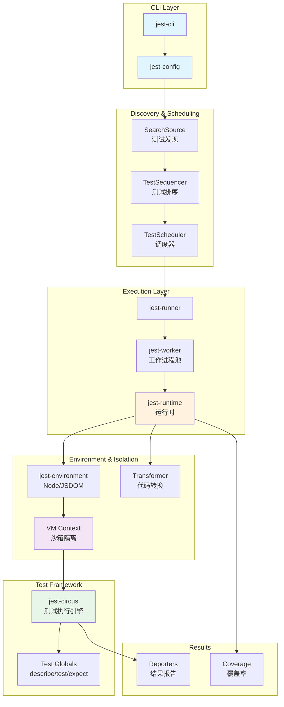

---

## 核心组件详解

### 1. CLI 与配置层

#### jest-cli

Jest 的入口点，负责解析命令行参数并启动测试流程。

```javascript
// 当运行 jest my-test --watch 时
// jest-cli 解析参数并传递给 jest-config
```

#### jest-config

配置解析器，负责：
- 查找配置文件（jest.config.js、package.json 等）
- 合并命令行参数与配置文件
- 解析并验证最终配置

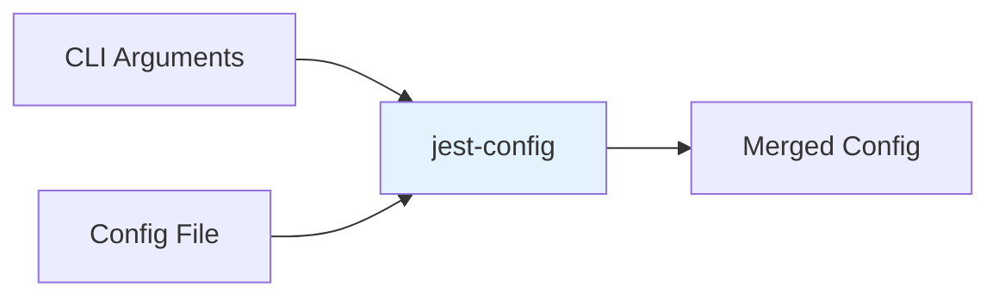

### 2. 测试发现与调度

#### SearchSource - 测试发现

根据配置的测试模式（testMatch、testRegex）发现所有测试文件。

```typescript
interface Test {
  path: string;          // 测试文件路径
  duration?: number;     // 历史执行时间
  context: Context;      // 测试上下文
}

// SearchSource 返回 Array<Test>
```

#### TestSequencer - 测试排序

智能排序测试执行顺序，优化执行效率：

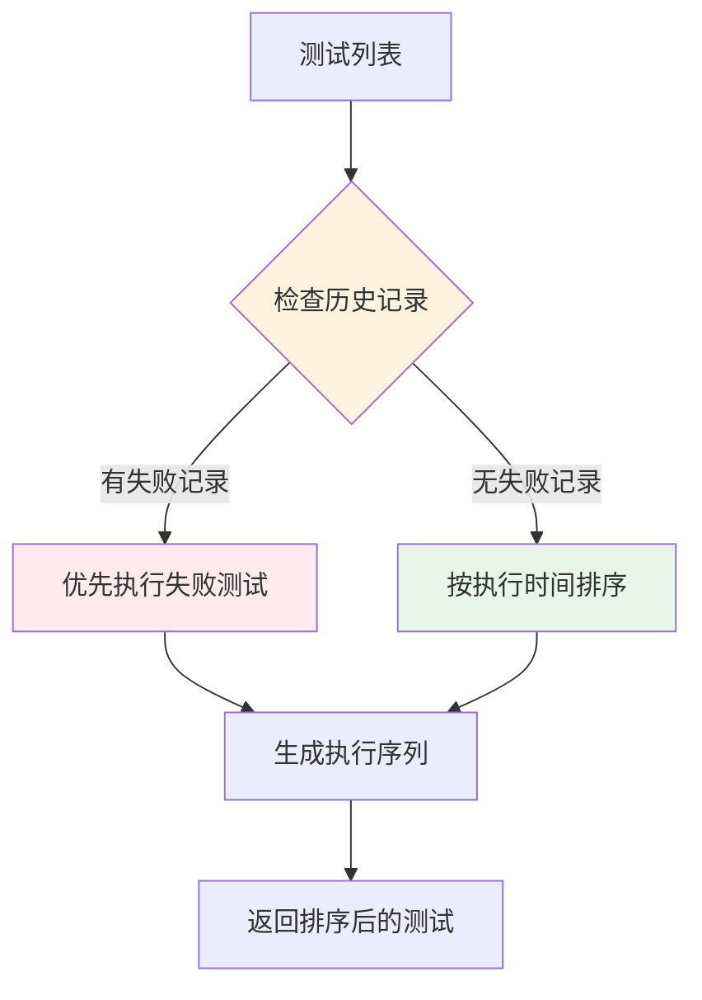

**排序策略：**
- 失败优先：上次失败的测试优先执行，快速反馈
- 时间优化：耗时长的测试先执行，优化并行效率

#### TestScheduler - 调度器

决定测试的执行方式：

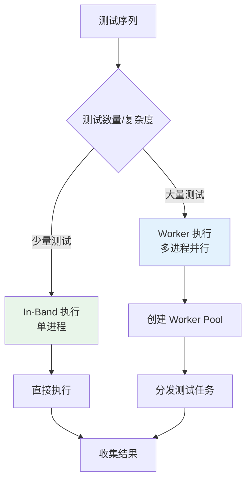

### 3. 执行层

#### jest-runner

测试运行器，负责：
- 管理测试执行生命周期
- 与 jest-worker 通信
- 收集测试结果

#### jest-worker

工作进程池，实现并行测试执行：

```javascript
// jest-worker 创建多个子进程
// 每个进程独立执行测试，避免互相影响
const numWorkers = Math.max(cpus().length - 1, 1);
```

#### jest-runtime

**Jest 的核心组件**，负责：
- 创建 VM 沙箱环境
- 模块解析与加载
- Mock 系统实现
- 代码转换协调

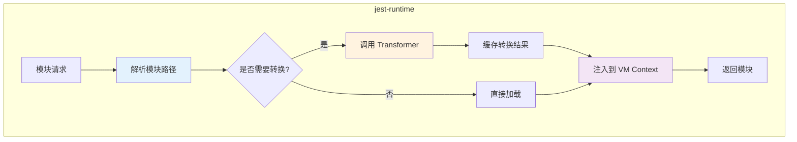

### 4. 环境与隔离

#### jest-environment

提供测试执行环境：
- **node**: Node.js 环境，适合后端测试
- **jsdom**: 模拟浏览器 DOM，适合前端测试

#### VM Context - 沙箱隔离

Jest 使用 Node.js 的 `node:vm` 模块创建隔离的沙箱环境：

```javascript
// 每个测试文件运行在独立的 VM Context 中
const vm = require('vm');
const context = vm.createContext({
  // 注入全局对象
  Array, Object, Error, Date,
  // 注入测试函数
  describe, test, expect, jest,
  // 注入 require 函数
  require: customRequire
});
```

### 5. 测试框架层

#### jest-circus

Jest 的测试执行引擎（从 Jest 27 起成为默认），采用 Flux 架构：

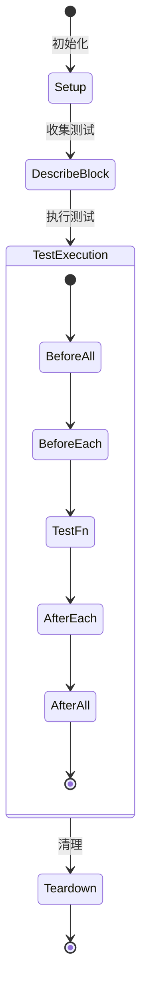

---

## 测试执行流程

### 完整执行流程图

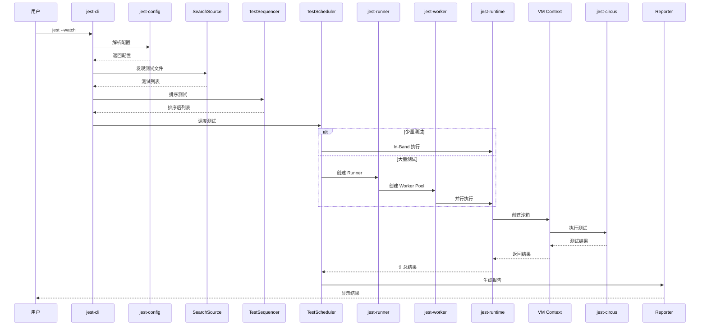

### 单个测试文件执行流程

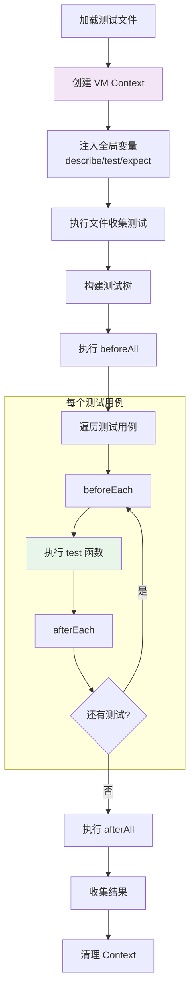

---

## VM 沙箱隔离机制

### 为什么需要隔离？

1. **测试独立性**：每个测试文件互不影响
2. **全局状态隔离**：防止测试污染全局对象
3. **Mock 隔离**：每个文件的 mock 独立生效

### 隔离机制详解

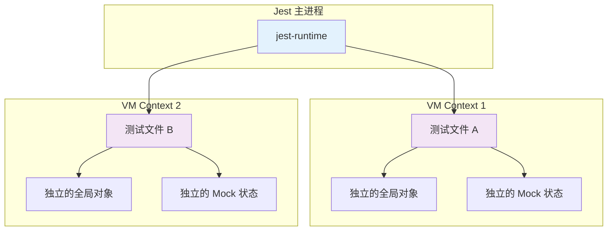

### require 拦截机制

Jest 通过自定义 require 函数实现模块控制：

```javascript
// jest-runtime 中的简化实现
function createRequire(context) {
  return function require(modulePath) {
    // 1. 检查是否有 mock
    if (mocks.has(modulePath)) {
      return mocks.get(modulePath);
    }

    // 2. 解析模块路径
    const resolvedPath = resolver.resolve(modulePath);

    // 3. 检查缓存
    if (cache.has(resolvedPath)) {
      return cache.get(resolvedPath);
    }

    // 4. 读取源码
    const source = fs.readFileSync(resolvedPath);

    // 5. 转换代码（如 Babel、TypeScript）
    const transformed = transformer.transform(source);

    // 6. 在 VM Context 中执行
    const module = vm.runInContext(transformed, context);

    // 7. 缓存并返回
    cache.set(resolvedPath, module);
    return module;
  };
}
```

---

## ESM 兼容性设计

Jest 最初设计基于 CommonJS 模块系统，其核心机制（同步 require、模块缓存、Mock 提升）都依赖 CJS 特性。支持 ESM 需要解决多个架构挑战。

### CJS vs ESM 核心差异

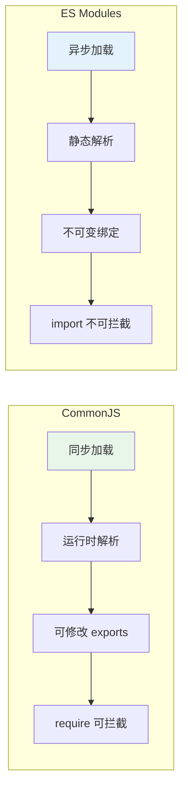

| 特性 | CommonJS | ES Modules |
|------|----------|------------|
| 加载方式 | 同步 | 异步 |
| 解析时机 | 运行时 | 编译时（静态） |
| 导出 | 可修改的对象 | 不可变绑定 |
| 拦截 | require 可重写 | import 不可拦截 |
| Mock | jest.mock 可提升 | 需要动态 import |

### Jest ESM 实现架构

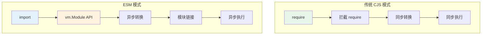

### 核心技术挑战与解决方案

#### 1. 模块构建时机问题

**问题**：CJS 模式下，Jest 在模块执行时创建 VM Context。ESM 需要在模块构建阶段就访问 Context。

**解决方案**：修改 JestEnvironment API，在模块构造函数中提供 Context 访问。

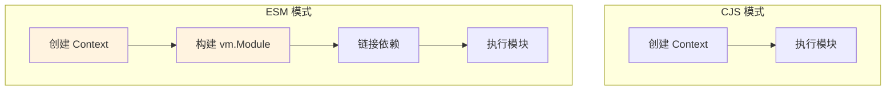

#### 2. 静态 import 与 Mock 提升

**问题**：ESM 的静态 import 在代码执行前就完成，`jest.mock()` 的提升机制失效。

**CJS Mock 工作原理**：

```javascript
// 编写的代码
import { foo } from './module';
jest.mock('./module');

// Jest 转换后（CJS 模式）
jest.mock('./module');  // 提升到顶部
const { foo } = require('./module');  // 获取 mock 版本
```

**ESM Mock 解决方案**：

```javascript
// ESM 模式必须使用动态 import
jest.unstable_mockModule('./module', () => ({
  foo: jest.fn()
}));

// 在 mock 声明之后动态导入
const { foo } = await import('./module');
```

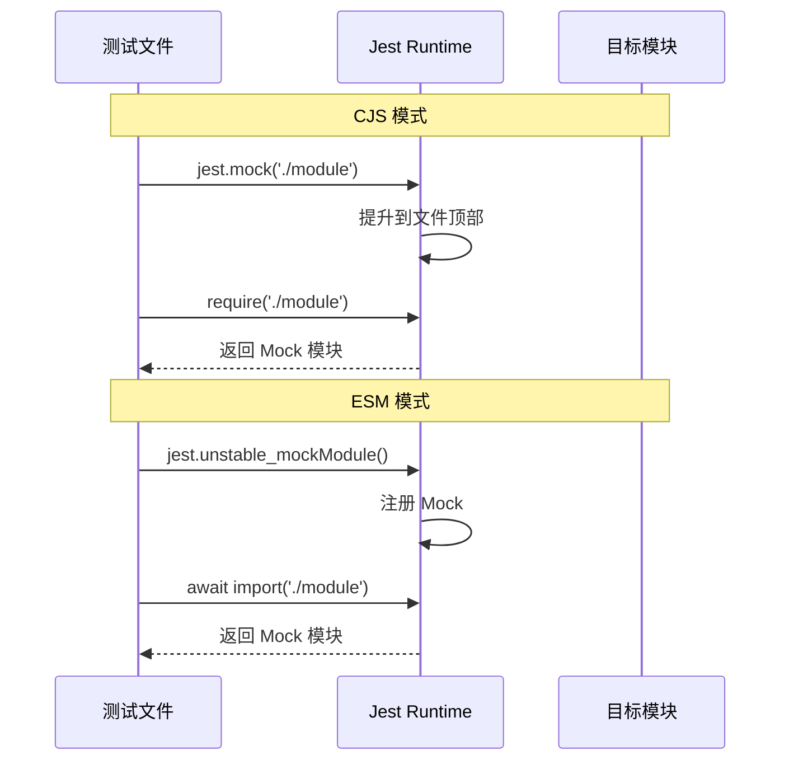

#### 3. jest 对象注入

**CJS 模式**：Jest 直接注入 `jest` 变量到模块作用域。

**ESM 模式**：需要显式导入或使用 `import.meta`。

```javascript
// ESM 模式获取 jest 对象

// 方式 1: 从 @jest/globals 导入
import { jest, describe, test, expect } from '@jest/globals';

// 方式 2: 使用 import.meta
const jest = import.meta.jest;
```

#### 4. 异步模块解析

ESM 使用 Node.js 实验性的 `vm.Module` API：

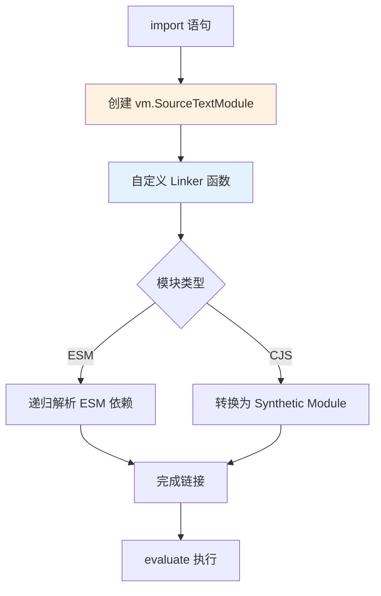

### ESM 支持实现细节

#### Linker 函数

Jest 实现自定义 Linker 处理模块解析：

```javascript
async function linker(specifier, referencingModule) {
  // 1. 解析模块路径
  const resolved = resolver.resolve(specifier);

  // 2. 检查 __mocks__ 目录
  const mockPath = getMockPath(resolved);
  if (exists(mockPath)) {
    return loadModule(mockPath);
  }

  // 3. 应用转换器
  const source = await transformer.transformAsync(resolved);

  // 4. 创建 vm.Module
  return new vm.SourceTextModule(source, {
    context: referencingModule.context,
    identifier: resolved
  });
}
```

#### 动态 import 支持

通过 `importModuleDynamically` 回调支持动态导入：

```javascript
const module = new vm.SourceTextModule(source, {
  context,
  importModuleDynamically: async (specifier) => {
    // 支持 jest.mock 和 jest.resetModules
    return linker(specifier, module);
  }
});
```

---

## ESM 配置实战

### 基础配置

#### 1. 启用 ESM 支持

```json
// package.json
{
  "type": "module",
  "scripts": {
    "test": "NODE_OPTIONS='--experimental-vm-modules' jest"
  }
}
```

#### 2. Jest 配置

```javascript
// jest.config.js
export default {
  // 禁用默认转换或配置 ESM 输出
  transform: {},

  // 指定额外的 ESM 扩展名
  extensionsToTreatAsEsm: ['.ts', '.tsx', '.jsx'],

  // 模块名映射
  moduleNameMapper: {
    '^(\\.{1,2}/.*)\\.js$': '$1'
  }
};
```

### TypeScript + ESM 配置

#### 1. 安装依赖

```bash
yarn add --dev jest @types/jest ts-jest typescript
```

#### 2. TypeScript 配置

```json
// tsconfig.json
{
  "compilerOptions": {
    "target": "ES2022",
    "module": "ES2022",
    "moduleResolution": "node",
    "esModuleInterop": true,
    "allowSyntheticDefaultImports": true
  }
}
```

#### 3. Jest 配置

```javascript
// jest.config.js
export default {
  preset: 'ts-jest/presets/default-esm',
  testEnvironment: 'node',
  extensionsToTreatAsEsm: ['.ts'],
  moduleNameMapper: {
    '^(\\.{1,2}/.*)\\.js$': '$1'
  },
  transform: {
    '^.+\\.tsx?$': [
      'ts-jest',
      {
        useESM: true
      }
    ]
  }
};
```

#### 4. package.json 脚本

```json
{
  "type": "module",
  "scripts": {
    "test": "cross-env NODE_OPTIONS='--experimental-vm-modules' jest"
  }
}
```

### ESM Mock 示例

#### 基本 Mock

```typescript
// math.ts
export function add(a: number, b: number): number {
  return a + b;
}

// math.test.ts
import { jest } from '@jest/globals';

// 声明 mock
jest.unstable_mockModule('./math', () => ({
  add: jest.fn(() => 42)
}));

// 动态导入（必须在 mock 声明之后）
const { add } = await import('./math');

describe('Math module', () => {
  test('add returns mocked value', () => {
    expect(add(1, 2)).toBe(42);
  });
});
```

#### Mock 整个模块

```typescript
// api.test.ts
import { jest } from '@jest/globals';

// Mock axios
jest.unstable_mockModule('axios', () => ({
  default: {
    get: jest.fn(() => Promise.resolve({ data: 'mocked' })),
    post: jest.fn(() => Promise.resolve({ data: 'created' }))
  }
}));

const axios = (await import('axios')).default;
const { fetchData } = await import('./api');

test('fetchData uses axios', async () => {
  const result = await fetchData();
  expect(axios.get).toHaveBeenCalled();
});
```

#### 部分 Mock

```typescript
// utils.test.ts
import { jest } from '@jest/globals';

// 获取原始模块
const originalModule = await import('./utils');

// 部分 mock
jest.unstable_mockModule('./utils', () => ({
  ...originalModule,
  riskyFunction: jest.fn(() => 'safe value')
}));

const { safeFunction, riskyFunction } = await import('./utils');
```

### 配置示意图

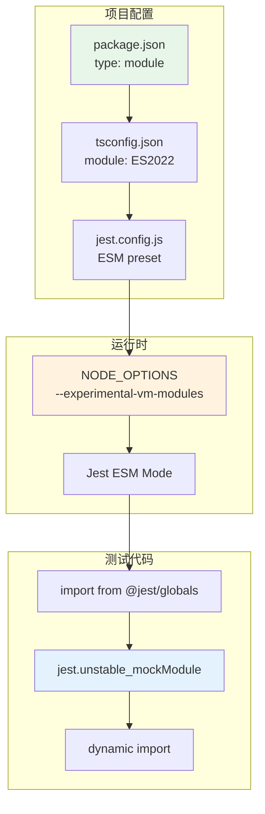

---

## 最佳实践与常见问题

### 最佳实践

#### 1. 选择合适的模块系统

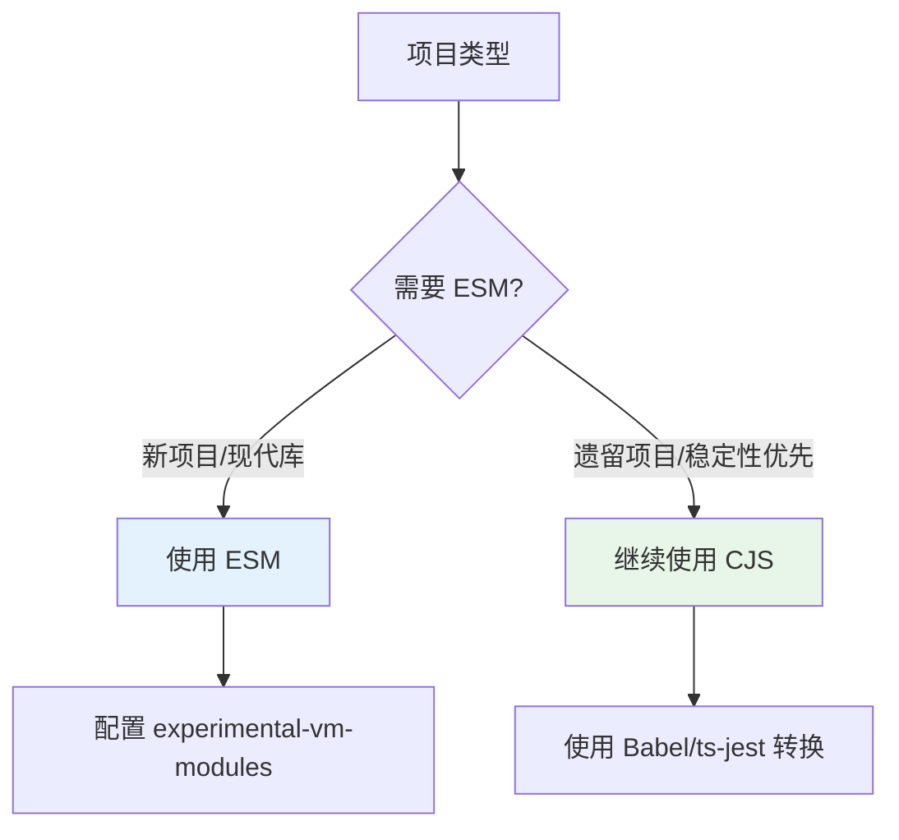

#### 2. Mock 策略

**ESM 项目中的 Mock 原则**：

1. 尽早声明所有 `jest.unstable_mockModule()`
2. 在 mock 声明后使用动态 `import()`
3. 考虑使用依赖注入减少 mock 需求

```typescript
// 推荐结构
import { jest, describe, test, expect } from '@jest/globals';

// 1. 先声明所有 mock
jest.unstable_mockModule('./dep1', () => ({ ... }));
jest.unstable_mockModule('./dep2', () => ({ ... }));

// 2. 再动态导入
const { dep1 } = await import('./dep1');
const { dep2 } = await import('./dep2');
const { tested } = await import('./tested');

// 3. 编写测试
describe('...', () => { ... });
```

#### 3. 处理混合模块

项目中可能同时存在 CJS 和 ESM 模块：

```javascript
// jest.config.js
export default {
  transform: {
    // ESM 文件不转换
    '^.+\\.mjs$': 'babel-jest',
    // CJS 文件使用 Babel
    '^.+\\.cjs$': 'babel-jest',
    // TypeScript 使用 ts-jest ESM 模式
    '^.+\\.tsx?$': ['ts-jest', { useESM: true }]
  },
  transformIgnorePatterns: [
    // 不忽略需要转换的 node_modules
    'node_modules/(?!(esm-package)/)'
  ]
};
```

### 常见问题与解决方案

#### 问题 1: SyntaxError: Cannot use import statement

**原因**：Jest 默认以 CJS 模式运行。

**解决**：
```bash
# 添加 experimental-vm-modules 标志
NODE_OPTIONS='--experimental-vm-modules' jest
```

#### 问题 2: jest.mock 不生效

**原因**：ESM 中静态 import 先于 jest.mock 执行。

**解决**：使用 `jest.unstable_mockModule` + 动态 import。

#### 问题 3: ReferenceError: jest is not defined

**原因**：ESM 不自动注入 jest 对象。

**解决**：
```typescript
import { jest } from '@jest/globals';
```

#### 问题 4: 第三方库不支持 ESM

**解决方案对比**：

| 方案 | 描述 | 适用场景 |
|------|------|----------|
| transformIgnorePatterns | 转换 node_modules 中的包 | 包有 ESM 源码 |
| moduleNameMapper | 映射到 CJS 版本 | 包提供双格式 |
| 手动 Mock | mock 整个包 | 测试不需要真实实现 |

```javascript
// 配置示例
export default {
  transformIgnorePatterns: [
    'node_modules/(?!(problematic-package)/)'
  ],
  moduleNameMapper: {
    '^problematic-package$': 'problematic-package/dist/cjs/index.js'
  }
};
```

#### 问题 5: 循环依赖问题

ESM 对循环依赖更敏感：

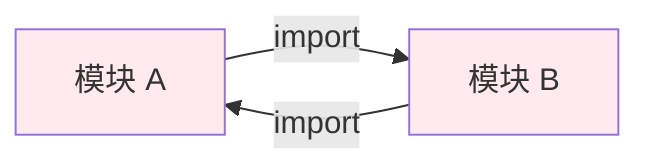

**解决**：
1. 重构代码消除循环依赖
2. 使用动态 import 延迟加载
3. 提取共享代码到第三个模块

### ESM 支持现状与未来

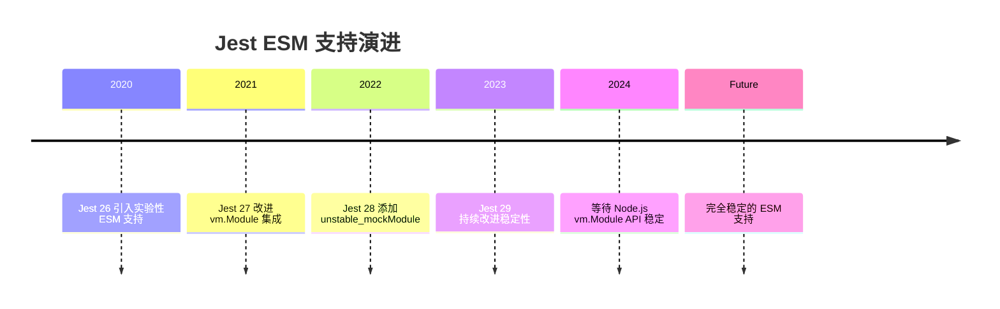

**当前限制**：
- 依赖 Node.js `--experimental-vm-modules` 标志
- Mock API 仍为 unstable 状态
- 某些边缘情况可能有问题

**建议**：
- 新项目可以使用 ESM，但要做好调试准备
- 生产环境优先考虑稳定性
- 关注 Jest GitHub issues 获取最新进展

---

## 总结

Jest 的架构设计体现了优秀的模块化思想，各组件职责明确、协作高效。其 ESM 支持虽然仍处于实验阶段，但通过 `vm.Module` API、自定义 Linker 和异步转换等技术，成功在 CJS 设计理念的基础上实现了对现代 JavaScript 模块系统的兼容。

理解 Jest 的内部架构有助于：
1. 更好地配置和优化测试
2. 解决复杂的测试问题
3. 在 CJS 和 ESM 之间做出正确选择

随着 Node.js vm.Module API 的稳定化，Jest 的 ESM 支持将更加成熟，届时我们将享受到更完整的原生 ESM 测试体验。

---

## 参考资源

- [Jest 官方文档 - ECMAScript Modules](https://jestjs.io/docs/ecmascript-modules)
- [Jest GitHub - ESM 支持追踪 Issue](https://github.com/jestjs/jest/issues/9430)
- [ts-jest ESM 支持指南](https://kulshekhar.github.io/ts-jest/docs/guides/esm-support)
- [Node.js VM 模块文档](https://nodejs.org/api/vm.html)
