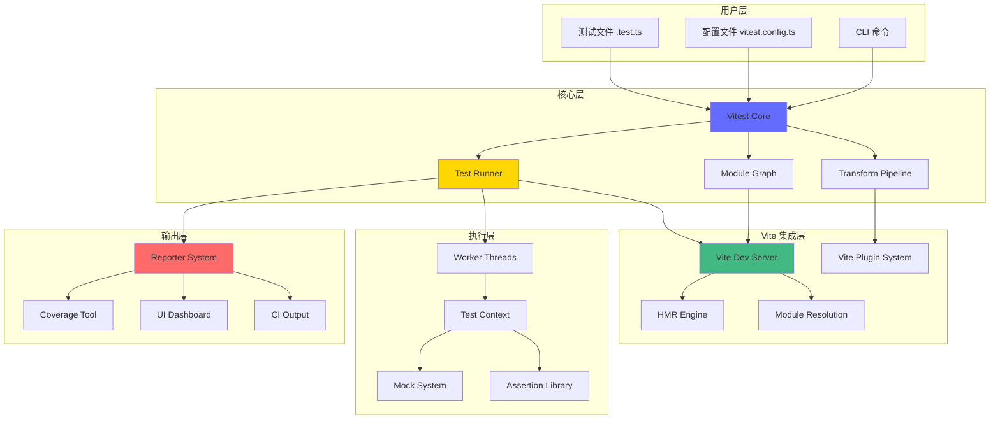
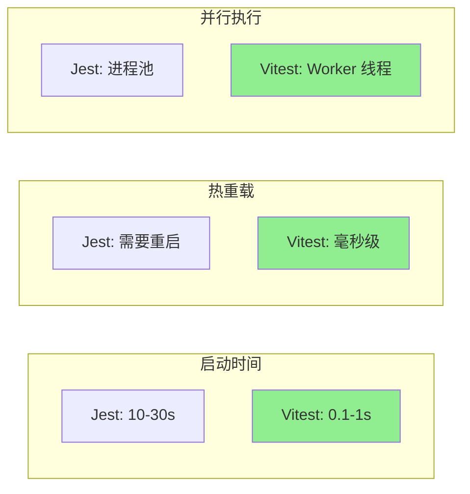
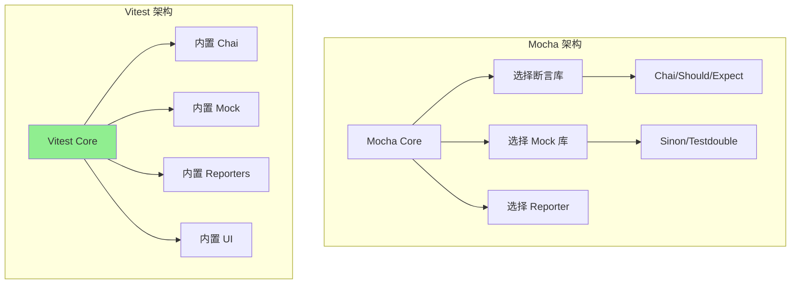
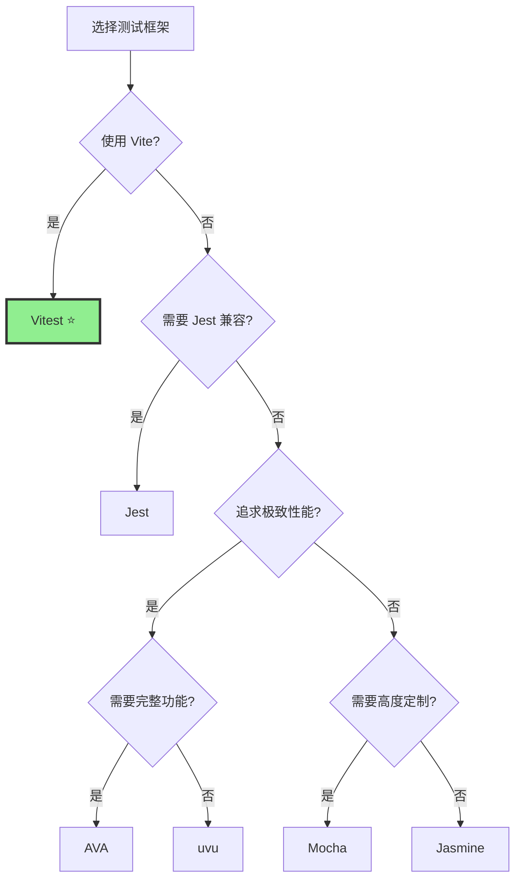
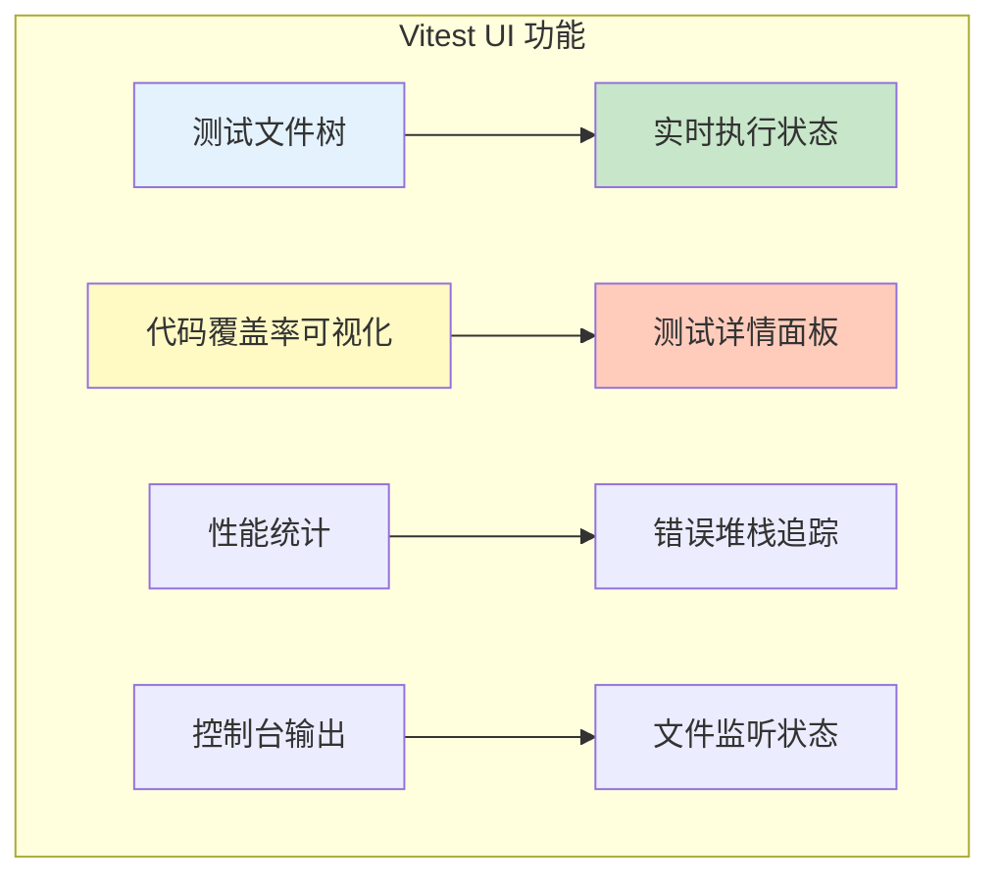
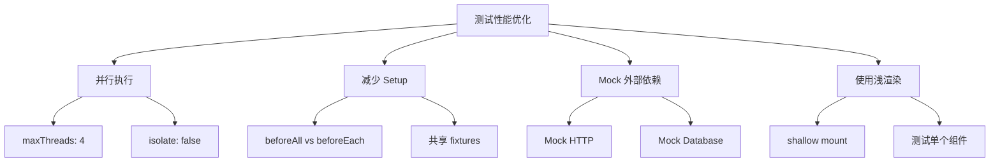

# Vitest 深度解析：下一代测试框架完全指南

## 目录
- [简介](#简介)
- [核心设计理念](#核心设计理念)
- [架构设计](#架构设计)
- [工作流程](#工作流程)
- [与 Jest 的对比](#与-jest-的对比)
- [与其他测试框架的对比](#与其他测试框架的对比)
- [核心特性](#核心特性)
- [配置与使用](#配置与使用)
- [最佳实践](#最佳实践)
- [性能优化](#性能优化)

## 简介

Vitest 是由 Vite 团队开发的现代化测试框架，专为 Vite 项目设计，但也可以用于任何前端项目。它的核心目标是提供极速的测试体验，同时保持与 Jest 的 API 兼容性。

### 为什么选择 Vitest？

- ⚡️ **极速启动**：利用 Vite 的即时热更新能力
- 🔄 **智能监听模式**：只重新运行相关的测试
- 📦 **开箱即用**：无需复杂配置，支持 TypeScript、JSX、ESM
- 🎯 **Jest 兼容**：大部分 Jest API 可直接使用
- 🔍 **原生 ESM**：完整的 ESM 支持，无需转译
- 🎨 **美观的 UI**：内置可视化测试界面

## 核心设计理念

### 1. 速度优先

Vitest 的首要设计目标就是速度。通过以下方式实现：

- **Vite 驱动**：复用 Vite 的转换管道和模块图
- **并行执行**：默认并行运行测试文件
- **智能缓存**：利用 Vite 的缓存机制
- **按需编译**：只编译需要测试的文件

### 2. 开发者体验

- **Watch 模式优先**：为交互式开发优化
- **即时反馈**：毫秒级的热重载
- **清晰的错误信息**：源码映射和堆栈跟踪
- **内置 UI**：可视化测试结果和覆盖率

### 3. 现代化工具链

- **原生 ESM**：不需要复杂的模块转换
- **TypeScript 优先**：开箱即用的 TypeScript 支持
- **组件测试**：内置对 Vue、React、Svelte 的支持

### 4. 可扩展性

- **插件系统**：兼容 Vite 插件生态
- **自定义 Reporter**：灵活的测试报告
- **Hooks 系统**：在测试生命周期的各个阶段插入逻辑

## 架构设计

### 整体架构



### 核心组件

#### 1. Vitest Core

核心引擎负责：
- 测试文件的发现和加载
- 测试套件的组织和调度
- 生命周期管理
- 配置解析和合并

#### 2. Test Runner

测试运行器的职责：
- 并行/串行执行策略
- Worker 线程管理
- 测试隔离
- 超时控制

#### 3. Transform Pipeline

转换管道处理：
- TypeScript/JSX 转译
- 源码映射生成
- 依赖图构建
- 模块热更新

#### 4. Mock System

模拟系统提供：
- 模块模拟（vi.mock）
- 函数模拟（vi.fn）
- 时间模拟（vi.useFakeTimers）
- 全局对象模拟

## 工作流程

### 测试执行流程

```mermaid
sequenceDiagram
    participant User as 开发者
    participant CLI as Vitest CLI
    participant Core as Vitest Core
    participant Vite as Vite Server
    participant Worker as Worker Thread
    participant Reporter as Reporter

    User->>CLI: vitest run/watch
    CLI->>Core: 初始化配置
    Core->>Vite: 启动 Dev Server
    Vite-->>Core: Server Ready

    Core->>Core: 扫描测试文件
    Core->>Worker: 分配测试任务

    loop 每个测试文件
        Worker->>Vite: 请求模块
        Vite->>Vite: 转换代码
        Vite-->>Worker: 返回转换后代码
        Worker->>Worker: 执行测试
        Worker-->>Core: 测试结果
    end

    Core->>Reporter: 收集结果
    Reporter-->>User: 显示报告

    alt Watch 模式
        User->>User: 修改文件
        Vite->>Core: HMR 通知
        Core->>Core: 查找相关测试
        Core->>Worker: 重新运行测试
        Worker-->>Reporter: 增量结果
        Reporter-->>User: 更新显示
    end
```



### 详细执行步骤

1. **初始化阶段**
   ```mermaid
   graph LR
       A[读取配置] --> B[解析 CLI 参数]
       B --> C[合并配置选项]
       C --> D[初始化 Vite]
       D --> E[注册插件]
       E --> F[启动服务器]
   ```

2. **测试发现阶段**
   ```mermaid
   graph LR
       A[扫描测试目录] --> B[匹配测试模式]
       B --> C[构建测试图]
       C --> D[确定执行顺序]
       D --> E[分配 Worker]
   ```

3. **测试执行阶段**
   ```mermaid
   graph TB
       A[beforeAll Hooks] --> B[测试套件开始]
       B --> C[beforeEach Hook]
       C --> D[执行测试用例]
       D --> E[afterEach Hook]
       E --> F{更多测试?}
       F -->|是| C
       F -->|否| G[afterAll Hooks]
       G --> H[收集结果]
   ```

4. **报告阶段**
   ```mermaid
   graph LR
       A[收集测试结果] --> B[计算统计信息]
       B --> C[生成覆盖率]
       C --> D[格式化输出]
       D --> E[保存快照]
       E --> F[触发 Reporters]
   ```

## 与 Jest 的对比

### API 兼容性

Vitest 设计为 Jest 的直接替代品，大部分 API 可以无缝迁移：

| 功能 | Jest | Vitest | 说明 |
|------|------|--------|------|
| 测试定义 | `test()` / `it()` | `test()` / `it()` | ✅ 完全兼容 |
| 测试套件 | `describe()` | `describe()` | ✅ 完全兼容 |
| 断言 | `expect()` | `expect()` | ✅ 完全兼容 |
| Mock | `jest.fn()` | `vi.fn()` | ⚠️ 需要替换前缀 |
| 定时器 | `jest.useFakeTimers()` | `vi.useFakeTimers()` | ⚠️ 需要替换前缀 |
| 快照 | `toMatchSnapshot()` | `toMatchSnapshot()` | ✅ 完全兼容 |

### 性能对比



### 技术差异

#### 1. 模块系统

**Jest:**
```javascript
// Jest 需要配置 transform
// jest.config.js
module.exports = {
  transform: {
    '^.+\\.tsx?$': 'ts-jest',
  },
  moduleNameMapper: {
    '^@/(.*)$': '<rootDir>/src/$1',
  },
};
```

**Vitest:**
```typescript
// Vitest 原生支持，复用 Vite 配置
// vitest.config.ts
export default defineConfig({
  resolve: {
    alias: {
      '@': '/src',
    },
  },
});
```

#### 2. 转换管道

**Jest:**
- 使用 Babel/ts-jest 转换代码
- 每次运行都需要重新转换
- CommonJS 模块系统
- 需要手动配置路径映射

**Vitest:**
- 使用 Vite 的 esbuild/Rollup
- 利用缓存和增量编译
- 原生 ESM 支持
- 自动继承 Vite 配置

#### 3. Watch 模式

**Jest:**


**Vitest:**


#### 4. 配置复杂度

**Jest 典型配置:**
```javascript
// jest.config.js
module.exports = {
  preset: 'ts-jest',
  testEnvironment: 'jsdom',
  transform: {
    '^.+\\.tsx?$': 'ts-jest',
    '^.+\\.jsx?$': 'babel-jest',
  },
  moduleNameMapper: {
    '^@/(.*)$': '<rootDir>/src/$1',
    '\\.(css|less|scss|sass)$': 'identity-obj-proxy',
  },
  setupFilesAfterEnv: ['<rootDir>/jest.setup.js'],
  collectCoverageFrom: [
    'src/**/*.{ts,tsx}',
    '!src/**/*.d.ts',
  ],
  testMatch: [
    '**/__tests__/**/*.test.{ts,tsx}',
  ],
};
```

**Vitest 等效配置:**
```typescript
// vitest.config.ts
export default defineConfig({
  test: {
    environment: 'jsdom',
    setupFiles: ['./vitest.setup.ts'],
    coverage: {
      include: ['src/**/*.{ts,tsx}'],
    },
  },
});
```

### 迁移指南

#### 从 Jest 迁移到 Vitest

1. **安装依赖**
```bash
yarn remove jest @types/jest ts-jest
yarn add --dev vitest @vitest/ui
```

2. **更新配置**
```typescript
// vitest.config.ts
import { defineConfig } from 'vitest/config';

export default defineConfig({
  test: {
    globals: true, // 启用全局 API
    environment: 'jsdom',
    setupFiles: './vitest.setup.ts',
  },
});
```

3. **替换全局对象**
```typescript
// 查找替换
jest.fn() → vi.fn()
jest.mock() → vi.mock()
jest.spyOn() → vi.spyOn()
jest.useFakeTimers() → vi.useFakeTimers()
```

4. **更新 package.json**
```json
{
  "scripts": {
    "test": "vitest",
    "test:ui": "vitest --ui",
    "test:run": "vitest run",
    "coverage": "vitest run --coverage"
  }
}
```

## 与其他测试框架的对比

### 全面对比表

| 特性 | Vitest | Jest | Mocha | Jasmine | AVA | uvu |
|------|--------|------|-------|---------|-----|-----|
| **启动速度** | ⚡️⚡️⚡️⚡️⚡️ | ⚡️⚡️ | ⚡️⚡️⚡️ | ⚡️⚡️ | ⚡️⚡️⚡️⚡️ | ⚡️⚡️⚡️⚡️⚡️ |
| **热重载** | ✅ 毫秒级 | ❌ 需重启 | ❌ 需重启 | ❌ 需重启 | ⚠️ 部分支持 | ❌ 需重启 |
| **TypeScript** | ✅ 原生支持 | ⚠️ 需配置 | ⚠️ 需配置 | ⚠️ 需配置 | ✅ 原生支持 | ⚠️ 需配置 |
| **ESM** | ✅ 完整支持 | ⚠️ 实验性 | ✅ 支持 | ⚠️ 有限 | ✅ 支持 | ✅ 支持 |
| **UI 界面** | ✅ 内置 | ❌ 无 | ❌ 无 | ❌ 无 | ❌ 无 | ❌ 无 |
| **快照测试** | ✅ | ✅ | ⚠️ 需插件 | ✅ | ✅ | ❌ |
| **并行执行** | ✅ Worker | ✅ 进程池 | ⚠️ 需插件 | ❌ | ✅ 进程池 | ✅ |
| **覆盖率** | ✅ c8/istanbul | ✅ istanbul | ⚠️ 需配置 | ❌ 需插件 | ✅ c8 | ⚠️ 需配置 |
| **断言库** | ✅ 内置 chai | ✅ 内置 | ❌ 需选择 | ✅ 内置 | ✅ 内置 | ✅ 内置 |
| **Mock 支持** | ✅ 强大 | ✅ 强大 | ⚠️ 需 sinon | ✅ 基础 | ⚠️ 需 sinon | ⚠️ 基础 |
| **Watch 模式** | ✅ 智能 | ✅ 基础 | ⚠️ 需插件 | ❌ | ✅ 基础 | ❌ |
| **配置复杂度** | ⭐️ 简单 | ⭐️⭐️⭐️ 复杂 | ⭐️⭐️ 中等 | ⭐️ 简单 | ⭐️⭐️ 中等 | ⭐️ 简单 |
| **生态系统** | 🌱 成长中 | 🌳 成熟 | 🌳 成熟 | 🌳 成熟 | 🌿 中等 | 🌱 较小 |
| **学习曲线** | ⭐️ 平缓 | ⭐️⭐️ 中等 | ⭐️⭐️ 中等 | ⭐️ 平缓 | ⭐️⭐️ 中等 | ⭐️ 平缓 |

### 详细对比

#### Vitest vs Mocha

**Mocha 优势:**
- 极度灵活，可以自由选择断言库和 mock 工具
- 成熟稳定，社区庞大
- 适合需要高度定制的场景

**Vitest 优势:**
- 开箱即用，无需选择和配置断言库
- 极速的热重载
- 现代化的开发体验



#### Vitest vs AVA

**AVA 优势:**
- 极简的 API
- 强制测试隔离
- 非常快的执行速度

**Vitest 优势:**
- 更强大的 watch 模式
- 更好的 TypeScript 支持
- 更丰富的功能集

#### Vitest vs uvu

**uvu 优势:**
- 极小的体积（< 3KB）
- 最快的执行速度
- 零依赖

**Vitest 优势:**
- 完整的功能集
- 更好的开发体验
- 强大的 mock 和 spy 功能

### 选择建议



**推荐场景:**

- **Vitest**: Vite 项目、需要快速反馈、现代前端项目
- **Jest**: 成熟项目、需要稳定生态、React 项目
- **Mocha**: 需要高度定制、复杂测试场景
- **AVA**: Node.js 项目、追求隔离和并发
- **uvu**: 小型项目、追求极致性能和体积

## 核心特性

### 1. 智能 Watch 模式

```typescript
// Vitest 自动追踪依赖关系
// src/utils/math.ts
export const add = (a: number, b: number) => a + b;

// src/utils/calculator.ts
import { add } from './math';
export const sum = (...numbers: number[]) =>
  numbers.reduce((acc, n) => add(acc, n), 0);

// tests/calculator.test.ts
import { sum } from '../src/utils/calculator';

test('sum calculates correctly', () => {
  expect(sum(1, 2, 3)).toBe(6);
});
```

当你修改 `math.ts` 时，Vitest 会自动重新运行 `calculator.test.ts`，因为它知道依赖关系。

### 2. 内置 UI

```bash
vitest --ui
```

启动可视化测试界面：



### 3. 组件测试

#### Vue 组件测试

```vue
<!-- Counter.vue -->
<template>
  <div>
    <span>{{ count }}</span>
    <button @click="increment">+</button>
  </div>
</template>

<script setup lang="ts">
import { ref } from 'vue';

const count = ref(0);
const increment = () => count.value++;
</script>
```

```typescript
// Counter.test.ts
import { mount } from '@vue/test-utils';
import { describe, it, expect } from 'vitest';
import Counter from './Counter.vue';

describe('Counter', () => {
  it('increments count when button is clicked', async () => {
    const wrapper = mount(Counter);

    expect(wrapper.find('span').text()).toBe('0');

    await wrapper.find('button').trigger('click');

    expect(wrapper.find('span').text()).toBe('1');
  });
});
```

#### React 组件测试

```typescript
// Button.tsx
interface ButtonProps {
  onClick: () => void;
  children: React.ReactNode;
}

export const Button: React.FC<ButtonProps> = ({ onClick, children }) => {
  return <button onClick={onClick}>{children}</button>;
};
```

```typescript
// Button.test.tsx
import { render, screen, fireEvent } from '@testing-library/react';
import { describe, it, expect, vi } from 'vitest';
import { Button } from './Button';

describe('Button', () => {
  it('calls onClick when clicked', () => {
    const handleClick = vi.fn();
    render(<Button onClick={handleClick}>Click me</Button>);

    fireEvent.click(screen.getByText('Click me'));

    expect(handleClick).toHaveBeenCalledTimes(1);
  });
});
```

### 4. Mock 系统

#### 模块 Mock

```typescript
// api.ts
export async function fetchUser(id: string) {
  const response = await fetch(`/api/users/${id}`);
  return response.json();
}
```

```typescript
// user.test.ts
import { describe, it, expect, vi } from 'vitest';
import { fetchUser } from './api';

// 方式 1: 自动 Mock
vi.mock('./api', () => ({
  fetchUser: vi.fn(() => Promise.resolve({ id: '1', name: 'John' })),
}));

// 方式 2: 部分 Mock
vi.mock('./api', async (importOriginal) => {
  const actual = await importOriginal();
  return {
    ...actual,
    fetchUser: vi.fn(() => Promise.resolve({ id: '1', name: 'Mocked' })),
  };
});

describe('fetchUser', () => {
  it('fetches user data', async () => {
    const user = await fetchUser('1');
    expect(user).toEqual({ id: '1', name: 'John' });
  });
});
```

#### 函数 Mock

```typescript
// logger.test.ts
import { describe, it, expect, vi } from 'vitest';

describe('Logger Mock', () => {
  it('tracks function calls', () => {
    const mockFn = vi.fn();

    mockFn('hello');
    mockFn('world');

    expect(mockFn).toHaveBeenCalledTimes(2);
    expect(mockFn).toHaveBeenNthCalledWith(1, 'hello');
    expect(mockFn).toHaveBeenLastCalledWith('world');
  });

  it('returns mocked values', () => {
    const mockFn = vi.fn()
      .mockReturnValueOnce('first')
      .mockReturnValueOnce('second')
      .mockReturnValue('default');

    expect(mockFn()).toBe('first');
    expect(mockFn()).toBe('second');
    expect(mockFn()).toBe('default');
    expect(mockFn()).toBe('default');
  });

  it('implements custom logic', () => {
    const mockFn = vi.fn((x: number) => x * 2);

    expect(mockFn(5)).toBe(10);
    expect(mockFn).toHaveBeenCalledWith(5);
  });
});
```

#### 定时器 Mock

```typescript
// timer.test.ts
import { describe, it, expect, vi, beforeEach, afterEach } from 'vitest';

describe('Timer Mock', () => {
  beforeEach(() => {
    vi.useFakeTimers();
  });

  afterEach(() => {
    vi.restoreAllMocks();
  });

  it('fast-forwards setTimeout', () => {
    const callback = vi.fn();

    setTimeout(callback, 1000);

    expect(callback).not.toHaveBeenCalled();

    vi.advanceTimersByTime(1000);

    expect(callback).toHaveBeenCalledTimes(1);
  });

  it('fast-forwards setInterval', () => {
    const callback = vi.fn();

    setInterval(callback, 1000);

    vi.advanceTimersByTime(5000);

    expect(callback).toHaveBeenCalledTimes(5);
  });

  it('runs all timers', () => {
    const callback1 = vi.fn();
    const callback2 = vi.fn();

    setTimeout(callback1, 1000);
    setTimeout(callback2, 5000);

    vi.runAllTimers();

    expect(callback1).toHaveBeenCalled();
    expect(callback2).toHaveBeenCalled();
  });
});
```

#### Spy 功能

```typescript
// spy.test.ts
import { describe, it, expect, vi } from 'vitest';

describe('Spy', () => {
  it('spies on object methods', () => {
    const calculator = {
      add: (a: number, b: number) => a + b,
    };

    const spy = vi.spyOn(calculator, 'add');

    calculator.add(1, 2);

    expect(spy).toHaveBeenCalledWith(1, 2);
    expect(spy).toHaveReturnedWith(3);
  });

  it('spies and mocks return value', () => {
    const calculator = {
      multiply: (a: number, b: number) => a * b,
    };

    vi.spyOn(calculator, 'multiply').mockReturnValue(100);

    expect(calculator.multiply(2, 3)).toBe(100);
  });
});
```

### 5. 快照测试

```typescript
// snapshot.test.ts
import { describe, it, expect } from 'vitest';

describe('Snapshot Testing', () => {
  it('matches component snapshot', () => {
    const component = {
      type: 'button',
      props: {
        className: 'primary',
        disabled: false,
      },
      children: ['Click me'],
    };

    expect(component).toMatchSnapshot();
  });

  it('matches inline snapshot', () => {
    const data = { id: 1, name: 'John' };

    expect(data).toMatchInlineSnapshot(`
      {
        "id": 1,
        "name": "John",
      }
    `);
  });
});
```

### 6. 覆盖率报告

```typescript
// vitest.config.ts
export default defineConfig({
  test: {
    coverage: {
      provider: 'v8', // 或 'istanbul'
      reporter: ['text', 'json', 'html', 'lcov'],
      include: ['src/**/*.{ts,tsx}'],
      exclude: [
        'node_modules/',
        'src/**/*.test.{ts,tsx}',
        'src/**/*.spec.{ts,tsx}',
        'src/**/*.d.ts',
      ],
      thresholds: {
        lines: 80,
        functions: 80,
        branches: 80,
        statements: 80,
      },
    },
  },
});
```

运行覆盖率：
```bash
vitest run --coverage
```

## 配置与使用

### 基础配置

```typescript
// vitest.config.ts
import { defineConfig } from 'vitest/config';
import react from '@vitejs/plugin-react';

export default defineConfig({
  plugins: [react()],
  test: {
    // 全局配置
    globals: true,

    // 环境配置
    environment: 'jsdom', // 'node' | 'jsdom' | 'happy-dom' | 'edge-runtime'

    // 设置文件
    setupFiles: ['./vitest.setup.ts'],

    // 测试文件匹配
    include: ['**/*.{test,spec}.{ts,tsx}'],
    exclude: ['node_modules', 'dist', '.idea', '.git', '.cache'],

    // 监听模式
    watch: true,

    // 并发配置
    threads: true,
    maxThreads: 4,
    minThreads: 1,

    // 超时配置
    testTimeout: 10000,
    hookTimeout: 10000,

    // 隔离配置
    isolate: true,

    // 报告器
    reporters: ['default', 'html'],

    // 覆盖率
    coverage: {
      provider: 'v8',
      reporter: ['text', 'json', 'html'],
    },
  },
});
```

### 高级配置

#### 多环境配置

```typescript
// vitest.config.ts
export default defineConfig({
  test: {
    environmentMatchGlobs: [
      // 浏览器环境测试
      ['**/*.browser.test.ts', 'jsdom'],
      // Node.js 环境测试
      ['**/*.node.test.ts', 'node'],
      // Edge Runtime 测试
      ['**/*.edge.test.ts', 'edge-runtime'],
    ],
  },
});
```

#### 工作空间配置

```typescript
// vitest.workspace.ts
import { defineWorkspace } from 'vitest/config';

export default defineWorkspace([
  // 单元测试
  {
    test: {
      name: 'unit',
      include: ['src/**/*.test.ts'],
      environment: 'node',
    },
  },
  // 组件测试
  {
    test: {
      name: 'browser',
      include: ['src/**/*.browser.test.tsx'],
      environment: 'jsdom',
    },
  },
  // E2E 测试
  {
    test: {
      name: 'e2e',
      include: ['e2e/**/*.test.ts'],
      testTimeout: 30000,
    },
  },
]);
```

### 常用命令

```bash
# 运行测试（watch 模式）
vitest

# 运行一次测试
vitest run

# 运行特定文件
vitest run path/to/test.ts

# 运行匹配模式的测试
vitest run --testNamePattern="should work"

# UI 模式
vitest --ui

# 覆盖率
vitest run --coverage

# 并发数控制
vitest --threads --maxThreads=4

# 更新快照
vitest -u

# 查看帮助
vitest --help
```

## 最佳实践

### 1. 测试结构

#### AAA 模式 (Arrange-Act-Assert)

```typescript
describe('User Service', () => {
  it('creates a new user', async () => {
    // Arrange - 准备测试数据和环境
    const userData = {
      name: 'John Doe',
      email: 'john@example.com',
    };
    const mockRepository = {
      save: vi.fn().mockResolvedValue({ id: '1', ...userData }),
    };
    const userService = new UserService(mockRepository);

    // Act - 执行被测试的行为
    const result = await userService.createUser(userData);

    // Assert - 验证结果
    expect(result).toEqual({
      id: '1',
      name: 'John Doe',
      email: 'john@example.com',
    });
    expect(mockRepository.save).toHaveBeenCalledWith(userData);
  });
});
```

### 2. 测试命名

```typescript
// ❌ 不好的命名
test('test1', () => {});
test('it works', () => {});

// ✅ 好的命名
test('should return user when valid ID is provided', () => {});
test('should throw error when user not found', () => {});
test('should validate email format before creating user', () => {});

// 使用 describe 组织相关测试
describe('UserService.createUser', () => {
  it('should create user with valid data', () => {});
  it('should reject duplicate email', () => {});
  it('should hash password before saving', () => {});
});
```

### 3. 避免测试实现细节

```typescript
// ❌ 测试实现细节
test('component uses useState hook', () => {
  const component = render(<Counter />);
  expect(component.useState).toHaveBeenCalled();
});

// ✅ 测试行为
test('counter increments when button is clicked', () => {
  render(<Counter />);
  const button = screen.getByRole('button', { name: /increment/i });

  fireEvent.click(button);

  expect(screen.getByText('1')).toBeInTheDocument();
});
```

### 4. 使用 beforeEach/afterEach

```typescript
describe('Database Tests', () => {
  let db: Database;

  beforeEach(async () => {
    // 每个测试前创建干净的数据库
    db = await createTestDatabase();
    await db.migrate();
  });

  afterEach(async () => {
    // 每个测试后清理
    await db.cleanup();
  });

  it('inserts user', async () => {
    await db.users.insert({ name: 'John' });
    const users = await db.users.findAll();
    expect(users).toHaveLength(1);
  });

  it('deletes user', async () => {
    await db.users.insert({ name: 'John' });
    await db.users.delete({ name: 'John' });
    const users = await db.users.findAll();
    expect(users).toHaveLength(0);
  });
});
```

### 5. 测试异步代码

```typescript
// ✅ 使用 async/await
test('fetches user data', async () => {
  const user = await fetchUser('1');
  expect(user.name).toBe('John');
});

// ✅ 测试 Promise rejection
test('throws error for invalid user', async () => {
  await expect(fetchUser('invalid')).rejects.toThrow('User not found');
});

// ✅ 测试 timeout
test('request times out after 5 seconds', async () => {
  await expect(
    fetchUser('slow')
  ).rejects.toThrow('Timeout');
}, { timeout: 6000 });
```

### 6. 参数化测试

```typescript
describe.each([
  { input: 'hello', expected: 'HELLO' },
  { input: 'world', expected: 'WORLD' },
  { input: 'TeSt', expected: 'TEST' },
])('toUpperCase($input)', ({ input, expected }) => {
  it(`should convert "${input}" to "${expected}"`, () => {
    expect(input.toUpperCase()).toBe(expected);
  });
});

// 或使用表格形式
test.each`
  a    | b    | expected
  ${1} | ${1} | ${2}
  ${1} | ${2} | ${3}
  ${2} | ${1} | ${3}
`('add($a, $b) = $expected', ({ a, b, expected }) => {
  expect(add(a, b)).toBe(expected);
});
```

### 7. 测试错误处理

```typescript
describe('Error Handling', () => {
  it('handles validation errors', async () => {
    const invalidData = { email: 'not-an-email' };

    await expect(
      createUser(invalidData)
    ).rejects.toThrow('Invalid email format');
  });

  it('handles network errors gracefully', async () => {
    vi.mock('./api', () => ({
      fetchData: vi.fn().mockRejectedValue(new Error('Network error')),
    }));

    const result = await fetchDataWithRetry();

    expect(result).toBeNull();
  });
});
```

## 性能优化

### 1. 优化测试速度



### 2. 并行配置

```typescript
// vitest.config.ts
export default defineConfig({
  test: {
    // 启用线程池
    threads: true,
    maxThreads: 4,
    minThreads: 1,

    // 如果测试独立，禁用隔离以提升速度
    isolate: false,

    // 文件级并行
    fileParallelism: true,
  },
});
```

### 3. 选择性运行测试

```typescript
// 只运行某些测试
test.only('this test will run', () => {});
test('this test will be skipped', () => {});

// 跳过某些测试
test.skip('this test is skipped', () => {});

// 条件跳过
test.skipIf(process.env.CI)('skip in CI', () => {});
test.runIf(isLinux)('run only on Linux', () => {});
```

### 4. 使用测试分片

```bash
# 将测试分成 3 片，运行第 1 片
vitest run --shard=1/3

# CI 中并行运行
# Job 1
vitest run --shard=1/3

# Job 2
vitest run --shard=2/3

# Job 3
vitest run --shard=3/3
```

### 5. 优化 Mock

```typescript
// ❌ 每次都创建新 mock
beforeEach(() => {
  vi.mock('./heavy-module');
});

// ✅ 复用 mock
vi.mock('./heavy-module');

describe('tests', () => {
  beforeEach(() => {
    vi.clearAllMocks(); // 只清除调用记录
  });
});
```

### 6. 监控测试性能

```typescript
// vitest.config.ts
export default defineConfig({
  test: {
    reporters: [
      'default',
      ['json', { outputFile: 'test-results.json' }],
    ],
    benchmark: {
      // 启用基准测试
      include: ['**/*.bench.ts'],
    },
  },
});
```

```typescript
// math.bench.ts
import { bench, describe } from 'vitest';

describe('Math operations', () => {
  bench('add', () => {
    const result = 1 + 1;
  });

  bench('multiply', () => {
    const result = 2 * 2;
  });
});
```

## 总结

Vitest 代表了现代测试框架的发展方向：

### 核心优势

1. **极致性能** - 利用 Vite 的转换管道和智能缓存
2. **开发体验** - 毫秒级热重载和即时反馈
3. **零配置** - 开箱即用的 TypeScript、JSX、ESM 支持
4. **向后兼容** - 大部分 Jest API 可直接迁移

### 适用场景

- ✅ 所有使用 Vite 的项目
- ✅ 需要快速测试反馈的开发流程
- ✅ 现代前端项目（Vue、React、Svelte）
- ✅ TypeScript 项目
- ⚠️ 需要 Jest 生态插件的场景（考虑兼容性）

### 未来展望

Vitest 正在快速成长，随着 Vite 生态的壮大，Vitest 将成为前端测试的首选方案。它的设计理念和技术实现代表了下一代测试工具的方向。

---

**参考资源:**

- [Vitest 官方文档](https://vitest.dev/)
- [Vite 官方文档](https://vitejs.dev/)
- [Testing Library](https://testing-library.com/)
- [Vue Test Utils](https://test-utils.vuejs.org/)

**相关文章:**

- [Jest 深度解析](../jest/)
- [Testing Library 最佳实践](../testing-library/)
- [前端测试策略](../testing-strategy/)
