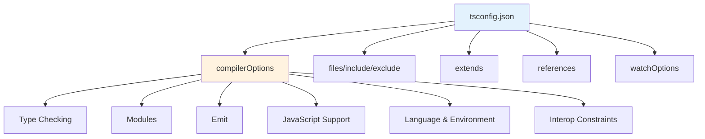
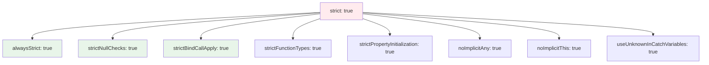
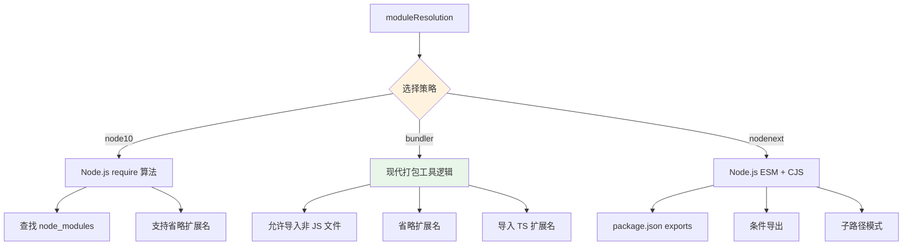
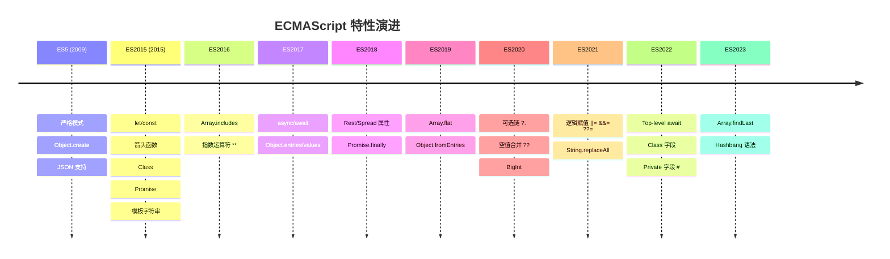
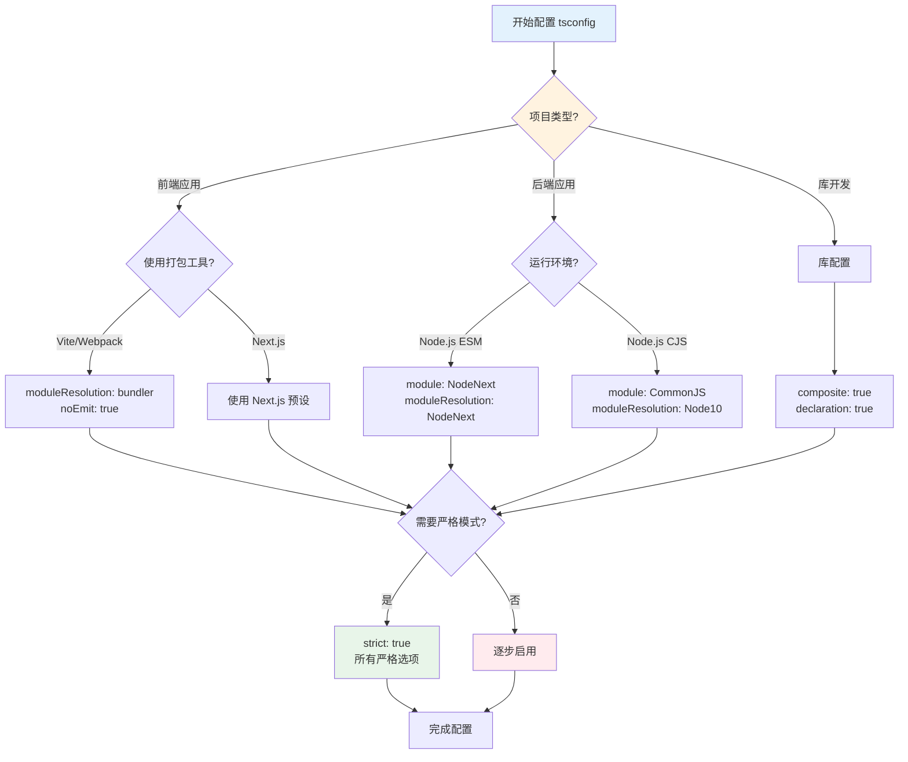

# TypeScript tsconfig.json 完全配置指南：所有编译选项详解

TypeScript 的 `tsconfig.json` 文件是项目配置的核心，它定义了编译器如何处理你的 TypeScript 代码。本文将详细介绍所有可用的编译器选项，包括每个选项的可选值、默认值以及它们对项目的影响。

## 目录

1. [基础配置结构](#基础配置结构)
2. [类型检查选项](#类型检查选项)
3. [模块系统选项](#模块系统选项)
4. [编译输出选项](#编译输出选项)
5. [JavaScript 支持选项](#javascript-支持选项)
6. [语言与环境选项](#语言与环境选项)
7. [互操作性约束](#互操作性约束)
8. [编译器诊断选项](#编译器诊断选项)
9. [项目引用选项](#项目引用选项)
10. [输出格式选项](#输出格式选项)
11. [完整性检查选项](#完整性检查选项)
12. [监听模式选项](#监听模式选项)
13. [高级选项](#高级选项)
14. [推荐配置方案](#推荐配置方案)

---

## 基础配置结构

### tsconfig.json 顶层配置

```json
{
  "compilerOptions": { /* 编译器选项 */ },
  "files": [],           // 明确包含的文件列表
  "include": [],         // 包含文件的 glob 模式
  "exclude": [],         // 排除文件的 glob 模式
  "extends": "",         // 继承的基础配置文件路径
  "references": [],      // 项目引用（用于复合项目）
  "watchOptions": { /* 监听模式选项 */ }
}
```

### 配置层级关系图



---

## 类型检查选项

类型检查选项控制 TypeScript 如何验证代码的类型安全性。

### Strict 模式系列

#### strict

**类型**: `boolean`  
**默认值**: `false`  
**可选值**: `true` | `false`

**影响**：
- `true`: 启用所有严格类型检查选项（相当于同时开启下面所有选项）
- `false`: 使用宽松的类型检查



**示例**：
```typescript
// strict: false
let x;  // x: any （隐式 any）
x = 5;
x = "hello";  // OK

// strict: true
let x;  // ❌ Error: Variable 'x' implicitly has an 'any' type
let y: number;  // ✅ 必须显式类型注解
```

#### strictNullChecks

**类型**: `boolean`  
**默认值**: `false`  
**可选值**: `true` | `false`

**影响**：
- `true`: `null` 和 `undefined` 只能赋值给自身或 `any` 类型
- `false`: `null` 和 `undefined` 可以赋值给任何类型

**示例**：
```typescript
// strictNullChecks: false
let name: string = null;  // ✅ OK

// strictNullChecks: true
let name: string = null;  // ❌ Error
let name: string | null = null;  // ✅ OK
```

#### noImplicitAny

**类型**: `boolean`  
**默认值**: `false`  
**可选值**: `true` | `false`

**影响**：
- `true`: 当 TypeScript 推断类型为 `any` 时报错
- `false`: 允许隐式 `any` 类型

**示例**：
```typescript
// noImplicitAny: false
function add(a, b) {  // a, b 都是 any
  return a + b;
}

// noImplicitAny: true
function add(a, b) {  // ❌ Error: 参数隐式具有 'any' 类型
  return a + b;
}

function add(a: number, b: number) {  // ✅ OK
  return a + b;
}
```

#### strictFunctionTypes

**类型**: `boolean`  
**默认值**: `false`  
**可选值**: `true` | `false`

**影响**：
- `true`: 函数参数使用逆变（contravariant）类型检查
- `false`: 函数参数使用双变（bivariant）类型检查

**示例**：
```typescript
interface Animal { name: string; }
interface Dog extends Animal { breed: string; }

let f1: (animal: Animal) => void;
let f2: (dog: Dog) => void;

// strictFunctionTypes: false
f1 = f2;  // ✅ OK (双变)

// strictFunctionTypes: true
f1 = f2;  // ❌ Error (逆变)
```

#### strictBindCallApply

**类型**: `boolean`  
**默认值**: `false`  
**可选值**: `true` | `false`

**影响**：
- `true`: 严格检查 `call`、`bind`、`apply` 的参数类型
- `false`: 不检查这些方法的参数

**示例**：
```typescript
function fn(x: string) {
  return parseInt(x);
}

// strictBindCallApply: true
fn.call(undefined, 10);  // ❌ Error: 类型 'number' 不能赋值给类型 'string'

// strictBindCallApply: false
fn.call(undefined, 10);  // ✅ OK（运行时可能出错）
```

#### strictPropertyInitialization

**类型**: `boolean`  
**默认值**: `false`  
**可选值**: `true` | `false`

**影响**：
- `true`: 要求类属性在构造函数中初始化
- `false`: 不要求初始化

**示例**：
```typescript
// strictPropertyInitialization: true
class User {
  name: string;  // ❌ Error: 属性 'name' 没有初始化
  age: number = 0;  // ✅ OK
  
  constructor() {
    this.name = "Unknown";  // ✅ 在构造函数中初始化
  }
}
```

#### noImplicitThis

**类型**: `boolean`  
**默认值**: `false`  
**可选值**: `true` | `false`

**影响**：
- `true`: `this` 表达式类型为 `any` 时报错
- `false`: 允许隐式 `any` 类型的 `this`

**示例**：
```typescript
// noImplicitThis: true
const obj = {
  value: 1,
  getValue: function() {
    return this.value;  // ❌ Error: 'this' 隐式具有类型 'any'
  }
};

// 解决方案
const obj = {
  value: 1,
  getValue(this: { value: number }) {  // ✅ 显式指定 this 类型
    return this.value;
  }
};
```

#### alwaysStrict

**类型**: `boolean`  
**默认值**: `false`  
**可选值**: `true` | `false`

**影响**：
- `true`: 以严格模式解析并在输出中添加 `"use strict"`
- `false`: 不强制严格模式

**示例**：
```typescript
// alwaysStrict: true
// 编译后的 JS 文件会包含 "use strict";
```

#### useUnknownInCatchVariables

**类型**: `boolean`  
**默认值**: `false`  
**可选值**: `true` | `false`

**影响**：
- `true`: catch 子句变量类型为 `unknown`
- `false`: catch 子句变量类型为 `any`

**示例**：
```typescript
// useUnknownInCatchVariables: true
try {
  // ...
} catch (e) {  // e: unknown
  console.log(e.message);  // ❌ Error
  if (e instanceof Error) {
    console.log(e.message);  // ✅ OK
  }
}

// useUnknownInCatchVariables: false
try {
  // ...
} catch (e) {  // e: any
  console.log(e.message);  // ✅ OK（运行时可能不安全）
}
```

### 额外的类型检查选项

#### noUnusedLocals

**类型**: `boolean`  
**默认值**: `false`  
**可选值**: `true` | `false`

**影响**：
- `true`: 报告未使用的局部变量
- `false`: 不报告

**示例**：
```typescript
// noUnusedLocals: true
function example() {
  let unusedVar = 5;  // ❌ Error: 'unusedVar' 已声明但从未读取
  let usedVar = 10;
  return usedVar;
}
```

#### noUnusedParameters

**类型**: `boolean`  
**默认值**: `false`  
**可选值**: `true` | `false`

**影响**：
- `true`: 报告未使用的函数参数
- `false`: 不报告

**示例**：
```typescript
// noUnusedParameters: true
function process(data: string, unused: number) {  // ❌ Error: 'unused' 已声明但从未读取
  return data.toUpperCase();
}

// 解决方案：使用下划线前缀
function process(data: string, _unused: number) {  // ✅ OK
  return data.toUpperCase();
}
```

#### noImplicitReturns

**类型**: `boolean`  
**默认值**: `false`  
**可选值**: `true` | `false`

**影响**：
- `true`: 确保函数所有代码路径都有返回值
- `false`: 不检查返回值

**示例**：
```typescript
// noImplicitReturns: true
function getValue(x: number): string {
  if (x > 0) {
    return "positive";
  }
  // ❌ Error: 不是所有代码路径都返回值
}

// 修复
function getValue(x: number): string {
  if (x > 0) {
    return "positive";
  }
  return "non-positive";  // ✅ OK
}
```

#### noFallthroughCasesInSwitch

**类型**: `boolean`  
**默认值**: `false`  
**可选值**: `true` | `false`

**影响**：
- `true`: 防止 switch 语句中的 fallthrough
- `false`: 允许 fallthrough

**示例**：
```typescript
// noFallthroughCasesInSwitch: true
function getAction(type: string) {
  switch (type) {
    case 'A':
      console.log('Type A');
      // ❌ Error: Fallthrough case in switch
    case 'B':
      console.log('Type B');
      break;
  }
}

// 修复
function getAction(type: string) {
  switch (type) {
    case 'A':
      console.log('Type A');
      break;  // ✅ OK
    case 'B':
      console.log('Type B');
      break;
  }
}
```

#### noUncheckedIndexedAccess

**类型**: `boolean`  
**默认值**: `false`  
**可选值**: `true` | `false`

**影响**：
- `true`: 索引访问的结果类型包含 `undefined`
- `false`: 索引访问不包含 `undefined`

**示例**：
```typescript
interface Data {
  [key: string]: number;
}

const data: Data = { a: 1, b: 2 };

// noUncheckedIndexedAccess: true
const value = data['c'];  // value: number | undefined
if (value !== undefined) {
  const doubled = value * 2;  // ✅ 类型安全
}

// noUncheckedIndexedAccess: false
const value = data['c'];  // value: number
const doubled = value * 2;  // ✅ 编译通过（运行时可能 NaN）
```

#### noPropertyAccessFromIndexSignature

**类型**: `boolean`  
**默认值**: `false`  
**可选值**: `true` | `false`

**影响**：
- `true`: 要求使用括号语法访问索引签名属性
- `false`: 允许点语法

**示例**：
```typescript
interface Config {
  [key: string]: string;
}

const config: Config = { host: "localhost" };

// noPropertyAccessFromIndexSignature: true
const host1 = config.host;  // ❌ Error: 使用点语法
const host2 = config["host"];  // ✅ OK: 使用括号语法

// noPropertyAccessFromIndexSignature: false
const host1 = config.host;  // ✅ OK
const host2 = config["host"];  // ✅ OK
```

#### exactOptionalPropertyTypes

**类型**: `boolean`  
**默认值**: `false`  
**可选值**: `true` | `false`

**影响**：
- `true`: 区分 `undefined` 属性和缺失属性
- `false`: 两者等同

**示例**：
```typescript
interface User {
  name: string;
  age?: number;
}

// exactOptionalPropertyTypes: true
const user1: User = { name: "Alice", age: undefined };  // ❌ Error
const user2: User = { name: "Alice" };  // ✅ OK

// exactOptionalPropertyTypes: false
const user1: User = { name: "Alice", age: undefined };  // ✅ OK
const user2: User = { name: "Alice" };  // ✅ OK
```

#### noImplicitOverride

**类型**: `boolean`  
**默认值**: `false`  
**可选值**: `true` | `false`

**影响**：
- `true`: 覆盖父类成员时必须使用 `override` 关键字
- `false`: 不要求 `override` 关键字

**示例**：
```typescript
class Base {
  greet() {
    console.log("Hello from Base");
  }
}

// noImplicitOverride: true
class Derived extends Base {
  greet() {  // ❌ Error: 需要 'override' 修饰符
    console.log("Hello from Derived");
  }
}

class Derived extends Base {
  override greet() {  // ✅ OK
    console.log("Hello from Derived");
  }
}
```

---

## 模块系统选项

模块选项控制 TypeScript 如何处理模块的导入、导出和解析。

### 模块系统配置对照表

| 项目类型 | module | moduleResolution | 推荐配置 |
|---------|--------|------------------|---------|
| Node.js (ESM) | NodeNext | NodeNext | 现代 Node.js 项目 |
| Node.js (CJS) | CommonJS | Node10 | 传统 Node.js 项目 |
| 浏览器 + 打包工具 | ESNext | Bundler | Vite/Webpack 等 |
| 库开发 | ESNext | NodeNext | npm 包开发 |
| Deno | ESNext | NodeNext | Deno 运行时 |

### module

**类型**: `string`  
**默认值**: 根据 `target` 自动选择  
**可选值**: 
- `"CommonJS"` - Node.js CJS 模块
- `"ES6"` / `"ES2015"` - ES6 模块
- `"ES2020"` - ES2020 模块（支持 `import.meta`）
- `"ES2022"` - ES2022 模块（支持顶层 await）
- `"ESNext"` - 最新 ES 模块特性
- `"NodeNext"` - Node.js 包类型感知模式
- `"Node16"` - Node.js 16+ ESM 支持
- `"None"` - 不生成模块代码
- `"UMD"` - Universal Module Definition
- `"AMD"` - Asynchronous Module Definition
- `"System"` - SystemJS 模块
- `"Preserve"` - 保留原始模块语法（TS 5.4+）

**影响**：决定编译后 JavaScript 的模块格式

**示例**：
```typescript
// 源代码
import { add } from './math';
export const result = add(1, 2);

// module: "CommonJS"
const math_1 = require("./math");
exports.result = (0, math_1.add)(1, 2);

// module: "ES2015"
import { add } from './math';
export const result = add(1, 2);

// module: "NodeNext"
// 根据 package.json 的 "type" 字段决定
```

### moduleResolution

**类型**: `string`  
**默认值**: `"node10"` (Classic 仅用于向后兼容)  
**可选值**:
- `"node10"` / `"node"` - Node.js 经典解析
- `"node16"` - Node.js 16+ 解析
- `"nodenext"` - Node.js 最新解析
- `"bundler"` - 打包工具解析（Webpack/Vite 等）
- `"classic"` - 传统 TypeScript 解析（已弃用）

**影响**：决定 TypeScript 如何查找模块



**示例**：
```typescript
// moduleResolution: "node10"
import { foo } from './module';  // 查找 ./module.ts, ./module/index.ts

// moduleResolution: "bundler"
import styles from './styles.css';  // ✅ OK
import { bar } from './module.ts';  // ✅ OK（允许 .ts 扩展名）

// moduleResolution: "nodenext"
import { baz } from './module.js';  // ✅ 必须包含扩展名（即使源文件是 .ts）
```

### baseUrl

**类型**: `string`  
**默认值**: 无  
**可选值**: 任何有效路径

**影响**：设置非相对模块名的基础目录

**示例**：
```json
{
  "compilerOptions": {
    "baseUrl": "./src"
  }
}
```

```typescript
// 项目结构
// src/
//   utils/
//     math.ts
//   components/
//     Button.tsx

// 在 Button.tsx 中
import { add } from 'utils/math';  // ✅ 相对于 src 目录解析
```

### paths

**类型**: `object`  
**默认值**: 无  
**可选值**: 路径映射对象

**影响**：重新映射导入路径（相对于 `baseUrl`）

**示例**：
```json
{
  "compilerOptions": {
    "baseUrl": ".",
    "paths": {
      "@/*": ["src/*"],
      "@components/*": ["src/components/*"],
      "@utils/*": ["src/utils/*"]
    }
  }
}
```

```typescript
// 使用别名
import Button from '@components/Button';
import { add } from '@utils/math';
```

### rootDirs

**类型**: `string[]`  
**默认值**: 无  
**可选值**: 目录路径数组

**影响**：指定多个根目录，在运行时合并为一个

**示例**：
```json
{
  "compilerOptions": {
    "rootDirs": ["src/generated", "src/handwritten"]
  }
}
```

```typescript
// src/generated/types.ts 中
export interface User { /* ... */ }

// src/handwritten/logic.ts 中
import { User } from './types';  // ✅ 可以找到 generated/types.ts
```

### typeRoots

**类型**: `string[]`  
**默认值**: `["node_modules/@types"]`  
**可选值**: 目录路径数组

**影响**：指定类型定义文件的查找目录

**示例**：
```json
{
  "compilerOptions": {
    "typeRoots": ["./typings", "./node_modules/@types"]
  }
}
```

### types

**类型**: `string[]`  
**默认值**: 所有可见的类型包  
**可选值**: 类型包名称数组

**影响**：指定要包含的类型声明包

**示例**：
```json
{
  "compilerOptions": {
    "types": ["node", "jest"]  // 只包含 @types/node 和 @types/jest
  }
}
```

### resolveJsonModule

**类型**: `boolean`  
**默认值**: `false`  
**可选值**: `true` | `false`

**影响**：
- `true`: 允许导入 JSON 文件作为模块
- `false`: 不允许导入 JSON

**示例**：
```typescript
// resolveJsonModule: true
import config from './config.json';  // ✅ OK
console.log(config.apiUrl);

// resolveJsonModule: false
import config from './config.json';  // ❌ Error
```

### esModuleInterop

**类型**: `boolean`  
**默认值**: `false`  
**可选值**: `true` | `false`

**影响**：
- `true`: 启用 CommonJS 和 ES 模块之间的互操作性
- `false`: 不添加互操作辅助函数

**示例**：
```typescript
// CommonJS 模块
module.exports = function() { /* ... */ };

// esModuleInterop: false
import * as func from 'some-cjs-module';
func();  // ❌ Error: func 不是函数

// esModuleInterop: true
import func from 'some-cjs-module';  // ✅ OK
func();
```

### allowSyntheticDefaultImports

**类型**: `boolean`  
**默认值**: 当 `esModuleInterop` 为 `true` 或 `module` 为 `system` 时自动为 `true`  
**可选值**: `true` | `false`

**影响**：
- `true`: 允许从没有默认导出的模块导入默认值
- `false`: 不允许

**示例**：
```typescript
// 没有默认导出的模块
export const foo = 1;
export const bar = 2;

// allowSyntheticDefaultImports: true
import module from './module';  // ✅ OK（类型检查通过）

// allowSyntheticDefaultImports: false
import module from './module';  // ❌ Error
```

### resolvePackageJsonExports

**类型**: `boolean`  
**默认值**: 当 `moduleResolution` 为 `node16`、`nodenext` 或 `bundler` 时为 `true`  
**可选值**: `true` | `false`

**影响**：
- `true`: 使用 package.json 的 `exports` 字段
- `false`: 忽略 `exports` 字段

**示例**：
```json
// package.json
{
  "exports": {
    ".": {
      "import": "./esm/index.js",
      "require": "./cjs/index.js"
    }
  }
}
```

### resolvePackageJsonImports

**类型**: `boolean`  
**默认值**: 当 `moduleResolution` 为 `node16`、`nodenext` 或 `bundler` 时为 `true`  
**可选值**: `true` | `false`

**影响**：
- `true`: 使用 package.json 的 `imports` 字段解析 `#` 导入
- `false`: 忽略 `imports` 字段

**示例**：
```json
// package.json
{
  "imports": {
    "#internal/*": "./src/internal/*"
  }
}
```

```typescript
// resolvePackageJsonImports: true
import { helper } from '#internal/utils';  // ✅ OK
```

---

## 编译输出选项

控制 TypeScript 如何生成 JavaScript 文件。

### outDir

**类型**: `string`  
**默认值**: 无（输出到源文件目录）  
**可选值**: 任何有效路径

**影响**：指定编译输出的目录

**示例**：
```json
{
  "compilerOptions": {
    "outDir": "./dist",
    "rootDir": "./src"
  }
}
```

```
项目结构：
src/
  index.ts
  utils/
    math.ts
    
编译后：
dist/
  index.js
  utils/
    math.js
```

### declaration

**类型**: `boolean`  
**默认值**: `false`  
**可选值**: `true` | `false`

**影响**：
- `true`: 生成 `.d.ts` 类型声明文件
- `false`: 不生成类型声明

**示例**：
```typescript
// src/math.ts
export function add(a: number, b: number): number {
  return a + b;
}

// declaration: true
// 生成 dist/math.d.ts
export declare function add(a: number, b: number): number;
```

### declarationMap

**类型**: `boolean`  
**默认值**: `false`  
**可选值**: `true` | `false`

**影响**：
- `true`: 为 `.d.ts` 文件生成 sourcemap
- `false`: 不生成

**作用**：允许编辑器在使用"跳转到定义"时导航到原始 `.ts` 源文件

### sourceMap

**类型**: `boolean`  
**默认值**: `false`  
**可选值**: `true` | `false`

**影响**：
- `true`: 生成 `.js.map` sourcemap 文件
- `false`: 不生成

**作用**：调试时将编译后的 JS 代码映射回原始 TS 代码

### inlineSourceMap

**类型**: `boolean`  
**默认值**: `false`  
**可选值**: `true` | `false`

**影响**：
- `true`: 将 sourcemap 嵌入 `.js` 文件中
- `false`: 生成独立的 `.map` 文件

**注意**：与 `sourceMap` 互斥

### removeComments

**类型**: `boolean`  
**默认值**: `false`  
**可选值**: `true` | `false`

**影响**：
- `true`: 删除编译输出中的注释
- `false`: 保留注释

**示例**：
```typescript
// 源代码
/**
 * 添加两个数字
 */
function add(a: number, b: number) {
  // 执行加法
  return a + b;
}

// removeComments: true
function add(a, b) {
  return a + b;
}

// removeComments: false
/**
 * 添加两个数字
 */
function add(a, b) {
  // 执行加法
  return a + b;
}
```

### noEmit

**类型**: `boolean`  
**默认值**: `false`  
**可选值**: `true` | `false`

**影响**：
- `true`: 只进行类型检查，不生成文件
- `false`: 正常编译并生成文件

**使用场景**：配合其他工具（如 Babel、esbuild）进行编译

### noEmitOnError

**类型**: `boolean`  
**默认值**: `false`  
**可选值**: `true` | `false`

**影响**：
- `true`: 有错误时不生成文件
- `false`: 即使有错误也生成文件

### importHelpers

**类型**: `boolean`  
**默认值**: `false`  
**可选值**: `true` | `false`

**影响**：
- `true`: 从 `tslib` 导入辅助函数
- `false`: 在每个文件中内联辅助函数

**作用**：减少打包体积（需要安装 `tslib`）

**示例**：
```typescript
// importHelpers: false
var __awaiter = (this && this.__awaiter) || function() { /* ... */ };
async function getData() { /* ... */ }

// importHelpers: true
import { __awaiter } from "tslib";
async function getData() { /* ... */ }
```

### downlevelIteration

**类型**: `boolean`  
**默认值**: `false`  
**可选值**: `true` | `false`

**影响**：
- `true`: 为 ES5/ES3 提供完整的迭代器支持
- `false`: 简化的迭代实现

**示例**：
```typescript
const arr = [1, 2, 3];
const copy = [...arr];

// downlevelIteration: true
// 生成完整的迭代器逻辑

// downlevelIteration: false
// 使用简单的数组复制（对某些情况可能不正确）
```

---

## JavaScript 支持选项

### allowJs

**类型**: `boolean`  
**默认值**: `false`  
**可选值**: `true` | `false`

**影响**：
- `true`: 允许编译 `.js` 文件
- `false`: 只编译 `.ts` 文件

**使用场景**：逐步迁移 JavaScript 项目到 TypeScript

### checkJs

**类型**: `boolean`  
**默认值**: `false`  
**可选值**: `true` | `false`

**影响**：
- `true`: 对 `.js` 文件进行类型检查
- `false`: 不检查

**前提**：需要 `allowJs: true`

**示例**：
```javascript
// math.js

// checkJs: true
function add(a, b) {
  return a + b;
}
add(1, "2");  // ⚠️ Warning: 类型不匹配

// checkJs: false
// 不报告任何错误
```

---

## 语言与环境选项

### target

**类型**: `string`  
**默认值**: `"ES3"`  
**可选值**: 
- `"ES3"` - ECMAScript 3
- `"ES5"` - ECMAScript 5
- `"ES6"` / `"ES2015"` - ECMAScript 2015
- `"ES2016"` 到 `"ES2023"` - 对应年份的 ECMAScript
- `"ESNext"` - 最新 ECMAScript 特性

**影响**：决定编译输出的 JavaScript 版本

### 各版本支持的特性对照表



**示例**：
```typescript
// 源代码
const arr = [1, 2, 3];
const doubled = arr.map(x => x * 2);

// target: "ES5"
var arr = [1, 2, 3];
var doubled = arr.map(function(x) { return x * 2; });

// target: "ES2015"
const arr = [1, 2, 3];
const doubled = arr.map(x => x * 2);
```

### lib

**类型**: `string[]`  
**默认值**: 根据 `target` 自动选择  
**可选值**: 众多库名称（部分列举）

**常用 lib 值**：

| lib 值 | 说明 |
|--------|------|
| `ES2015` | ES2015 核心特性 |
| `ES2016` 到 `ES2023` | 对应版本特性 |
| `ESNext` | 最新提案特性 |
| `DOM` | 浏览器 DOM API |
| `DOM.Iterable` | DOM 迭代器 |
| `WebWorker` | Web Worker API |
| `ScriptHost` | Windows Script Host |
| `ES2015.Promise` | Promise API |
| `ES2015.Proxy` | Proxy API |
| `ES2016.Array.Include` | Array.includes |
| `ES2017.Object` | Object.values/entries |
| `ES2020.String` | String.matchAll |
| `ES2021.String` | String.replaceAll |

**影响**：指定代码可用的 API

**示例**：
```json
{
  "compilerOptions": {
    "target": "ES2020",
    "lib": ["ES2020", "DOM", "DOM.Iterable"]
  }
}
```

```typescript
// 可以使用 DOM API
document.querySelector('.btn');

// 可以使用 ES2020 特性
const value = obj?.property ?? 'default';
```

### jsx

**类型**: `string`  
**默认值**: 无  
**可选值**:
- `"preserve"` - 保留 JSX，输出 `.jsx` 文件
- `"react"` - 转换为 `React.createElement`，输出 `.js`
- `"react-native"` - 保留 JSX，输出 `.js`
- `"react-jsx"` - 使用新的 JSX 转换（React 17+）
- `"react-jsxdev"` - 开发模式的 JSX 转换

**影响**：控制 JSX 的编译方式

**示例**：
```tsx
// 源代码
const element = <div>Hello</div>;

// jsx: "react"
const element = React.createElement("div", null, "Hello");

// jsx: "react-jsx"
import { jsx as _jsx } from "react/jsx-runtime";
const element = _jsx("div", { children: "Hello" });

// jsx: "preserve"
const element = <div>Hello</div>;  // 保持不变
```

### experimentalDecorators

**类型**: `boolean`  
**默认值**: `false`  
**可选值**: `true` | `false`

**影响**：
- `true`: 启用实验性装饰器
- `false`: 不支持装饰器

**示例**：
```typescript
// experimentalDecorators: true
function Log(target: any, key: string) {
  console.log(`${key} was called`);
}

class Example {
  @Log
  method() {
    // ...
  }
}
```

### useDefineForClassFields

**类型**: `boolean`  
**默认值**: `target` 为 ES2022+ 时为 `true`  
**可选值**: `true` | `false`

**影响**：
- `true`: 使用 ECMAScript 标准的类字段行为
- `false`: 使用 TypeScript 传统行为

**示例**：
```typescript
class Base {
  value = 1;
}

class Derived extends Base {
  value = 2;
}

// useDefineForClassFields: true
// 符合 ECMAScript 标准，字段是定义而非赋值

// useDefineForClassFields: false
// TypeScript 传统行为
```

---

## 互操作性约束

### isolatedModules

**类型**: `boolean`  
**默认值**: `false`  
**可选值**: `true` | `false`

**影响**：
- `true`: 确保每个文件可以独立转译（适用于 Babel、esbuild）
- `false`: 允许跨文件的类型信息

**限制**：
- 不能重新导出类型
- 不能使用 `const enum`
- 不能使用命名空间

**示例**：
```typescript
// isolatedModules: true

// ❌ Error: 重新导出类型
export { SomeType } from './types';

// ✅ OK: 使用 type 关键字
export type { SomeType } from './types';

// ❌ Error: const enum
const enum Color { Red, Green }

// ✅ OK: 普通 enum
enum Color { Red, Green }
```

### verbatimModuleSyntax

**类型**: `boolean`  
**默认值**: `false`  
**可选值**: `true` | `false`

**影响**：
- `true`: 按原样输出 import/export（替代 `importsNotUsedAsValues` 和 `preserveValueImports`）
- `false`: 移除仅用于类型的导入

**示例**：
```typescript
// 源代码
import { Type } from './types';
import { value } from './values';

// verbatimModuleSyntax: false
import { value } from './values';  // Type 被移除

// verbatimModuleSyntax: true
import { Type } from './types';  // ❌ Error: Type 只用于类型
import type { Type } from './types';  // ✅ 必须显式标记
import { value } from './values';
```

### forceConsistentCasingInFileNames

**类型**: `boolean`  
**默认值**: `true`  
**可选值**: `true` | `false`

**影响**：
- `true`: 强制导入路径的大小写与文件系统一致
- `false`: 不检查大小写

**示例**：
```typescript
// 文件系统: src/Utils.ts

// forceConsistentCasingInFileNames: true
import { helper } from './utils';  // ❌ Error: 应该是 './Utils'

// forceConsistentCasingInFileNames: false
import { helper } from './utils';  // ✅ OK（在不区分大小写的文件系统上可能导致问题）
```

---

## 编译器诊断选项

### diagnostics

**类型**: `boolean`  
**默认值**: `false`  
**可选值**: `true` | `false`

**影响**：
- `true`: 输出编译器性能诊断信息
- `false`: 不输出

**输出示例**：
```
Files:            50
Lines:         12000
Identifiers:   45000
Symbols:       38000
Types:          5000
Memory used:  180000K
I/O Read time:   0.5s
Parse time:      1.2s
Bind time:       0.8s
Check time:      3.5s
Emit time:       1.0s
Total time:      7.0s
```

### extendedDiagnostics

**类型**: `boolean`  
**默认值**: `false`  
**可选值**: `true` | `false`

**影响**：
- `true`: 输出更详细的编译器性能信息
- `false`: 基础诊断信息

### traceResolution

**类型**: `boolean`  
**默认值**: `false`  
**可选值**: `true` | `false`

**影响**：
- `true`: 跟踪模块解析过程
- `false`: 不跟踪

**输出示例**：
```
======== Resolving module './utils' ========
Module resolution kind is not specified, using 'NodeJs'.
Loading module as file / folder, candidate module location './utils'.
File './utils.ts' exists - use it as a name resolution result.
======== Module name './utils' was successfully resolved to './utils.ts'. ========
```

### explainFiles

**类型**: `boolean`  
**默认值**: `false`  
**可选值**: `true` | `false`

**影响**：
- `true`: 解释为什么文件被包含在编译中
- `false`: 不解释

---

## 项目引用选项

### composite

**类型**: `boolean`  
**默认值**: `false`  
**可选值**: `true` | `false`

**影响**：
- `true`: 启用 TypeScript 项目引用，生成 `.tsbuildinfo`
- `false`: 单项目模式

**要求**：
- 必须设置 `declaration: true`
- 必须设置 `rootDir` 或使用 `files`/`include`

**使用场景**：大型项目拆分为多个子项目

**示例**：
```json
// packages/core/tsconfig.json
{
  "compilerOptions": {
    "composite": true,
    "declaration": true,
    "outDir": "./dist"
  }
}

// packages/app/tsconfig.json
{
  "references": [
    { "path": "../core" }
  ]
}
```

### incremental

**类型**: `boolean`  
**默认值**: 当 `composite` 为 `true` 时自动为 `true`  
**可选值**: `true` | `false`

**影响**：
- `true`: 启用增量编译，缓存构建信息
- `false`: 每次完整编译

**作用**：提高后续编译速度

### tsBuildInfoFile

**类型**: `string`  
**默认值**: `./tsconfig.tsbuildinfo`  
**可选值**: 任何有效路径

**影响**：指定存储增量编译信息的文件位置

---

## 完整性检查选项

### skipLibCheck

**类型**: `boolean`  
**默认值**: `false`  
**可选值**: `true` | `false`

**影响**：
- `true`: 跳过 `.d.ts` 文件的类型检查
- `false`: 检查所有 `.d.ts` 文件

**推荐**：在大型项目中设为 `true` 以提高编译速度

**权衡**：
- ✅ 优点：显著提高编译速度
- ❌ 缺点：可能错过依赖包中的类型错误

---

## 监听模式选项

在 `watchOptions` 中配置：

```json
{
  "watchOptions": {
    "watchFile": "useFsEvents",
    "watchDirectory": "useFsEvents",
    "fallbackPolling": "dynamicPriorityPolling",
    "excludeDirectories": ["**/node_modules", "_build"],
    "excludeFiles": ["build/fileWhichChangesOften.ts"]
  }
}
```

### watchFile

**可选值**:
- `"fixedPollingInterval"` - 固定间隔轮询
- `"priorityPollingInterval"` - 优先级轮询
- `"dynamicPriorityPolling"` - 动态优先级轮询
- `"useFsEvents"` - 使用文件系统事件
- `"useFsEventsOnParentDirectory"` - 监听父目录事件

### watchDirectory

**可选值**:
- `"useFsEvents"` - 使用文件系统事件（默认）
- `"fixedPollingInterval"` - 固定间隔轮询
- `"dynamicPriorityPolling"` - 动态优先级轮询

---

## 高级选项

### plugins

**类型**: `array`  
**默认值**: `[]`  
**可选值**: 插件配置对象数组

**影响**：加载语言服务插件

**示例**：
```json
{
  "compilerOptions": {
    "plugins": [
      {
        "name": "typescript-plugin-css-modules"
      }
    ]
  }
}
```

### allowImportingTsExtensions

**类型**: `boolean`  
**默认值**: `false`  
**可选值**: `true` | `false`

**影响**：
- `true`: 允许导入时使用 `.ts` 扩展名
- `false`: 不允许

**要求**：`noEmit: true` 或 `emitDeclarationOnly: true`

**示例**：
```typescript
// allowImportingTsExtensions: true
import { foo } from './module.ts';  // ✅ OK
```

### moduleDetection

**类型**: `string`  
**默认值**: `"auto"`  
**可选值**:
- `"auto"` - 根据导入/导出自动检测
- `"legacy"` - 传统检测方式
- `"force"` - 强制所有文件为模块

**影响**：决定文件是模块还是脚本

---

## 推荐配置方案

### 1. 严格的现代 TypeScript 项目

适用于：新项目、追求类型安全

```json
{
  "compilerOptions": {
    // 语言与环境
    "target": "ES2022",
    "lib": ["ES2022", "DOM", "DOM.Iterable"],
    "module": "NodeNext",
    "moduleResolution": "NodeNext",
    
    // 严格模式
    "strict": true,
    "noUncheckedIndexedAccess": true,
    "noImplicitOverride": true,
    "noUnusedLocals": true,
    "noUnusedParameters": true,
    "noImplicitReturns": true,
    "noFallthroughCasesInSwitch": true,
    
    // 模块解析
    "esModuleInterop": true,
    "allowSyntheticDefaultImports": true,
    "forceConsistentCasingInFileNames": true,
    "resolveJsonModule": true,
    "isolatedModules": true,
    "verbatimModuleSyntax": true,
    "moduleDetection": "force",
    
    // 输出
    "declaration": true,
    "declarationMap": true,
    "sourceMap": true,
    "outDir": "./dist",
    "rootDir": "./src",
    
    // 性能
    "skipLibCheck": true,
    "incremental": true
  },
  "include": ["src/**/*"],
  "exclude": ["node_modules", "dist"]
}
```

### 2. 库开发配置

适用于：npm 包、共享库

```json
{
  "compilerOptions": {
    "target": "ES2020",
    "module": "NodeNext",
    "moduleResolution": "NodeNext",
    
    "strict": true,
    "declaration": true,
    "declarationMap": true,
    "sourceMap": true,
    
    "outDir": "./dist",
    "rootDir": "./src",
    
    "composite": true,
    "importHelpers": true,
    "esModuleInterop": true,
    "skipLibCheck": true,
    
    // 库特定配置
    "stripInternal": true,
    "removeComments": false
  }
}
```

### 3. Vite/Webpack 前端项目

适用于：现代前端打包工具

```json
{
  "compilerOptions": {
    "target": "ESNext",
    "lib": ["ESNext", "DOM", "DOM.Iterable"],
    "module": "ESNext",
    "moduleResolution": "bundler",
    
    "jsx": "react-jsx",
    "strict": true,
    "noEmit": true,
    
    "allowImportingTsExtensions": true,
    "isolatedModules": true,
    "verbatimModuleSyntax": true,
    "skipLibCheck": true,
    
    "resolveJsonModule": true,
    "esModuleInterop": true,
    
    // 路径别名
    "baseUrl": ".",
    "paths": {
      "@/*": ["src/*"]
    }
  },
  "include": ["src"]
}
```

### 4. Next.js 项目

适用于：Next.js 应用

```json
{
  "compilerOptions": {
    "target": "ES2017",
    "lib": ["dom", "dom.iterable", "esnext"],
    "allowJs": true,
    "skipLibCheck": true,
    "strict": true,
    "noEmit": true,
    "esModuleInterop": true,
    "module": "esnext",
    "moduleResolution": "bundler",
    "resolveJsonModule": true,
    "isolatedModules": true,
    "jsx": "preserve",
    "incremental": true,
    "plugins": [
      {
        "name": "next"
      }
    ],
    "paths": {
      "@/*": ["./*"]
    }
  },
  "include": ["next-env.d.ts", "**/*.ts", "**/*.tsx", ".next/types/**/*.ts"],
  "exclude": ["node_modules"]
}
```

### 5. Node.js 后端项目（ESM）

适用于：Node.js 服务端应用

```json
{
  "compilerOptions": {
    "target": "ES2022",
    "module": "NodeNext",
    "moduleResolution": "NodeNext",
    "lib": ["ES2022"],
    
    "strict": true,
    "esModuleInterop": true,
    "skipLibCheck": true,
    "forceConsistentCasingInFileNames": true,
    
    "outDir": "./dist",
    "rootDir": "./src",
    "sourceMap": true,
    
    "resolveJsonModule": true,
    "moduleDetection": "force"
  },
  "include": ["src/**/*"],
  "exclude": ["node_modules", "dist"]
}
```

### 6. 渐进式迁移配置（JS → TS）

适用于：逐步将 JavaScript 项目迁移到 TypeScript

```json
{
  "compilerOptions": {
    "target": "ES2020",
    "module": "CommonJS",
    
    // 允许 JS
    "allowJs": true,
    "checkJs": true,
    
    // 宽松的类型检查
    "strict": false,
    "noImplicitAny": false,
    
    "esModuleInterop": true,
    "skipLibCheck": true,
    "outDir": "./dist",
    "rootDir": "./src"
  },
  "include": ["src/**/*"],
  "exclude": ["node_modules"]
}
```

**迁移步骤**：
1. 启用 `allowJs` 和 `checkJs`
2. 逐步修复警告
3. 逐步启用 `strict` 选项
4. 将 `.js` 文件重命名为 `.ts`

---

## 配置决策树



---

## 常见问题与解决方案

### 问题 1: Cannot find module

**原因**：模块解析配置不正确

**解决**：
```json
{
  "compilerOptions": {
    "moduleResolution": "NodeNext",  // 或 "bundler"
    "resolveJsonModule": true,       // 如果导入 JSON
    "esModuleInterop": true          // 如果导入 CJS 模块
  }
}
```

### 问题 2: 类型检查太慢

**解决**：
```json
{
  "compilerOptions": {
    "skipLibCheck": true,      // 跳过 .d.ts 文件检查
    "incremental": true,       // 启用增量编译
    "tsBuildInfoFile": "./.tsbuildinfo"
  }
}
```

### 问题 3: Babel/esbuild 编译错误

**解决**：
```json
{
  "compilerOptions": {
    "isolatedModules": true,   // 确保每个文件可独立转译
    "verbatimModuleSyntax": true  // 显式标记类型导入
  }
}
```

### 问题 4: import 路径别名不生效

**解决**：
```json
{
  "compilerOptions": {
    "baseUrl": ".",
    "paths": {
      "@/*": ["src/*"],
      "@components/*": ["src/components/*"]
    }
  }
}
```

注意：运行时还需要配置打包工具（Webpack/Vite）的别名。

### 问题 5: React JSX 报错

**解决**：
```json
{
  "compilerOptions": {
    "jsx": "react-jsx",  // React 17+
    // 或 "jsx": "react" for 旧版本
    "lib": ["ES2020", "DOM", "DOM.Iterable"]
  }
}
```

---

## 配置验证工具

### 使用 tsc 初始化

```bash
# 生成带注释的 tsconfig.json
tsc --init

# 生成严格模式配置
tsc --init --strict
```

### 使用 @tsconfig/bases

```bash
npm install --save-dev @tsconfig/node18
```

```json
{
  "extends": "@tsconfig/node18/tsconfig.json",
  "compilerOptions": {
    // 覆盖特定选项
    "outDir": "./dist"
  }
}
```

可用的基础配置：
- `@tsconfig/node16`
- `@tsconfig/node18`
- `@tsconfig/node20`
- `@tsconfig/react-native`
- `@tsconfig/svelte`
- `@tsconfig/recommended`
- `@tsconfig/strictest`

---

## 总结

TypeScript 的 `tsconfig.json` 提供了极其丰富的配置选项，理解这些选项对于构建健壮的 TypeScript 项目至关重要。

### 核心建议

1. **新项目从严格模式开始**
   ```json
   { "strict": true }
   ```

2. **根据运行环境选择模块系统**
   - Node.js ESM: `"module": "NodeNext"`
   - 打包工具: `"moduleResolution": "bundler"`
   - 传统 Node.js: `"module": "CommonJS"`

3. **启用增量编译提高性能**
   ```json
   { "incremental": true, "skipLibCheck": true }
   ```

4. **使用项目引用管理大型项目**
   ```json
   { "composite": true, "references": [...] }
   ```

5. **为不同环境创建不同配置**
   ```
   tsconfig.json          # 基础配置
   tsconfig.build.json    # 构建配置
   tsconfig.test.json     # 测试配置
   ```

### 持续学习资源

- **官方文档**: https://www.typescriptlang.org/tsconfig
- **TSConfig 参考**: https://www.typescriptlang.org/tsconfig
- **编译选项手册**: https://www.typescriptlang.org/docs/handbook/compiler-options.html
- **TypeScript Deep Dive**: https://basarat.gitbook.io/typescript/

---

**文档版本**: 2025-01-15  
**TypeScript 版本**: 5.3+  
**最后更新**: 2025年1月

根据 TypeScript 的持续演进，某些选项可能被弃用或添加新选项，请始终参考官方文档获取最新信息。
