# TypeScript-Go 深度解析：TypeScript 的原生 Go 实现

## 目录
- [项目概述](#项目概述)
- [为什么要重写](#为什么要重写)
- [性能对比](#性能对比)
- [架构设计](#架构设计)
- [核心组件](#核心组件)
- [编译流程](#编译流程)
- [类型检查系统](#类型检查系统)
- [设计理念](#设计理念)
- [技术实现](#技术实现)
- [开发路线图](#开发路线图)
- [安装与使用](#安装与使用)
- [最佳实践](#最佳实践)
- [总结](#总结)

## 项目概述

**TypeScript-Go** 是 Microsoft 官方开发的 TypeScript 编译器的原生 Go 语言实现。这是一个雄心勃勃的项目，旨在从根本上解决 TypeScript 在大型代码库中的性能瓶颈。

### 关键数据

- **仓库**: [microsoft/typescript-go](https://github.com/microsoft/typescript-go)
- **Stars**: 22.9k+
- **许可证**: Apache-2.0
- **主要语言**: Go (96.6%)
- **贡献者**: 85+
- **状态**: 预览版 (TypeScript 7)

### 项目目标

1. **性能提升**: 构建速度提升 10 倍
2. **内存优化**: 内存使用减少约 50%
3. **编辑器响应**: 启动时间减少 8 倍
4. **大型代码库**: 更好地支持百万行级别的项目
5. **AI 集成**: 为 AI 开发工具提供更好的语义分析

### 项目特点

- ⚡️ **极致性能**: 利用 Go 的编译优化和并发特性
- 🔄 **完全兼容**: 保持与 TypeScript 5.8 的 API 兼容
- 📦 **即插即用**: 可作为 `tsc` 的直接替代品
- 🎯 **渐进迁移**: 支持逐步从 JavaScript 版本过渡
- 🔍 **相同输出**: 错误信息、位置和类型检查结果与原版一致

## 为什么要重写

### 1. 性能瓶颈

随着 TypeScript 项目规模的增长，JavaScript 实现的 `tsc` 面临严重的性能问题：

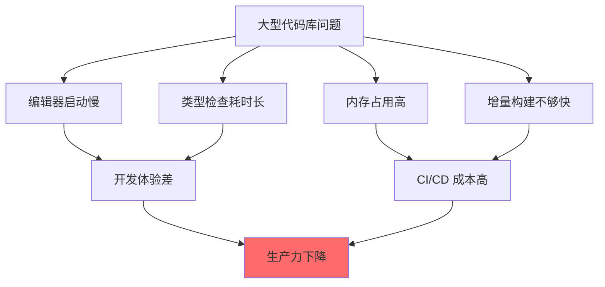

### 2. 扩展性限制

TypeScript 的 JavaScript 实现面临以下限制：

| 限制 | 影响 | Go 解决方案 |
|------|------|------------|
| **单线程执行** | 无法充分利用多核 CPU | 原生并发支持 |
| **垃圾回收开销** | V8 GC 在大型项目中压力大 | 更高效的 Go GC |
| **启动时间** | 需要加载和解析大量 JS 代码 | 编译为原生二进制 |
| **内存布局** | JavaScript 对象占用空间大 | 紧凑的内存结构 |
| **编译优化** | JIT 编译的不确定性 | AOT 编译优化 |

### 3. AI 开发需求

现代 AI 辅助编程工具需要：

- **大窗口语义信息**: 理解更多上下文
- **低延迟响应**: 实时代码补全和建议
- **并发请求**: 同时处理多个查询
- **资源效率**: 在有限资源下运行

JavaScript 实现难以满足这些严格的性能要求。

### 4. 开发者痛点

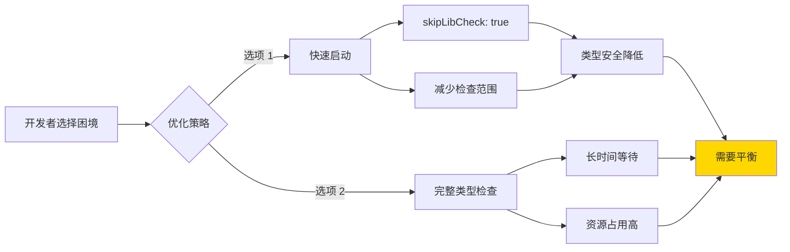

开发者不得不在快速反馈和完整类型安全之间做出妥协。TypeScript-Go 旨在消除这种权衡。

## 性能对比

### 构建时间对比

Microsoft 官方测试数据显示惊人的性能提升：

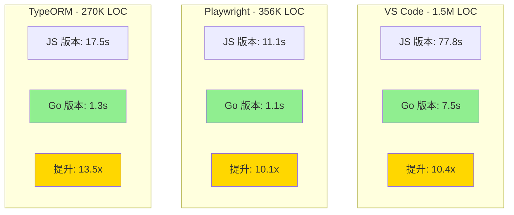

### 编辑器启动时间

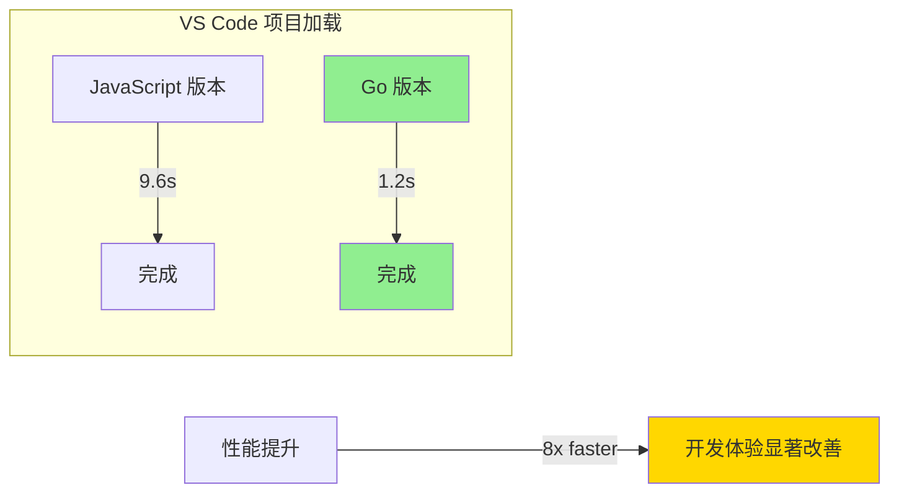

### 内存使用对比

| 项目 | JavaScript 版本 | Go 版本 | 减少 |
|------|----------------|---------|------|
| **VS Code** | ~1.2 GB | ~600 MB | 50% |
| **Playwright** | ~800 MB | ~400 MB | 50% |
| **TypeORM** | ~900 MB | ~450 MB | 50% |

### 性能提升的原因

1. **原生编译**: 无需 JIT 预热，直接执行机器码
2. **并发处理**: 充分利用多核 CPU 进行并行类型检查
3. **高效 GC**: Go 的垃圾回收器针对高吞吐量优化
4. **内存布局**: 紧凑的数据结构减少内存占用
5. **增量优化**: 更智能的缓存和增量计算

## 架构设计

### 整体架构

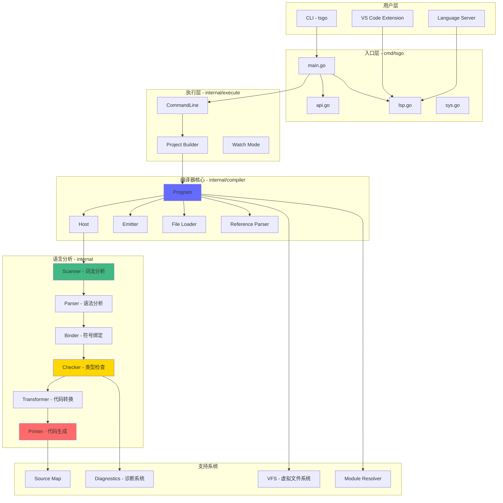

### 模块组织

TypeScript-Go 采用清晰的模块化设计，共有 41 个内部包：

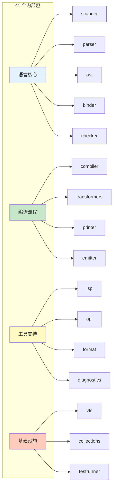

### 项目结构

```
typescript-go/
├── cmd/tsgo/              # CLI 入口
│   ├── main.go           # 主入口
│   ├── api.go            # API 模式
│   ├── lsp.go            # LSP 服务器
│   └── sys.go            # 系统接口
├── internal/             # 核心实现（41 个包）
│   ├── scanner/          # 词法分析
│   ├── parser/           # 语法分析
│   ├── ast/              # 抽象语法树
│   ├── binder/           # 符号绑定
│   ├── checker/          # 类型检查
│   ├── compiler/         # 编译器核心
│   ├── transformers/     # 代码转换
│   ├── printer/          # 代码生成
│   ├── emitter/          # 输出管理
│   ├── lsp/              # 语言服务器
│   ├── vfs/              # 虚拟文件系统
│   ├── diagnostics/      # 错误诊断
│   ├── module/           # 模块系统
│   ├── evaluator/        # 表达式求值
│   └── ...               # 其他支持包
├── _extension/           # VS Code 扩展
├── _build/               # 构建脚本
├── _tools/               # 开发工具
├── testdata/             # 测试数据
├── go.mod                # Go 依赖
├── package.json          # npm 包配置
└── tsconfig.json         # TypeScript 配置
```

## 核心组件

### 1. Scanner（词法分析器）

**职责**: 将源代码转换为 Token 流

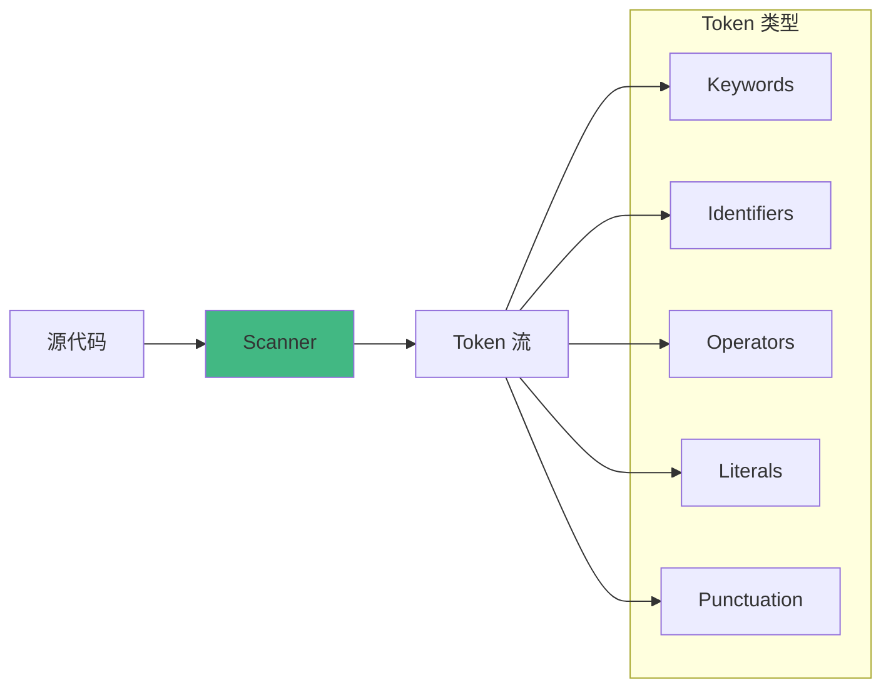

**特点**:
- 增量扫描支持
- Unicode 完整支持
- JSX/TSX 语法识别
- 源位置跟踪

### 2. Parser（语法分析器）

**职责**: 将 Token 流转换为 AST（抽象语法树）

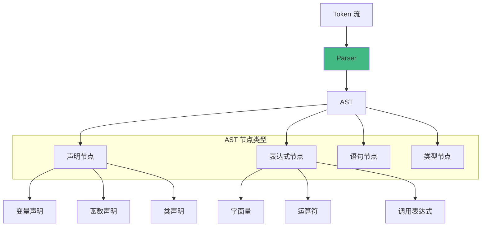

**特点**:
- 递归下降解析
- 错误恢复机制
- JSX 支持
- 增量解析能力

### 3. Binder（符号绑定器）

**职责**: 建立符号表和作用域链

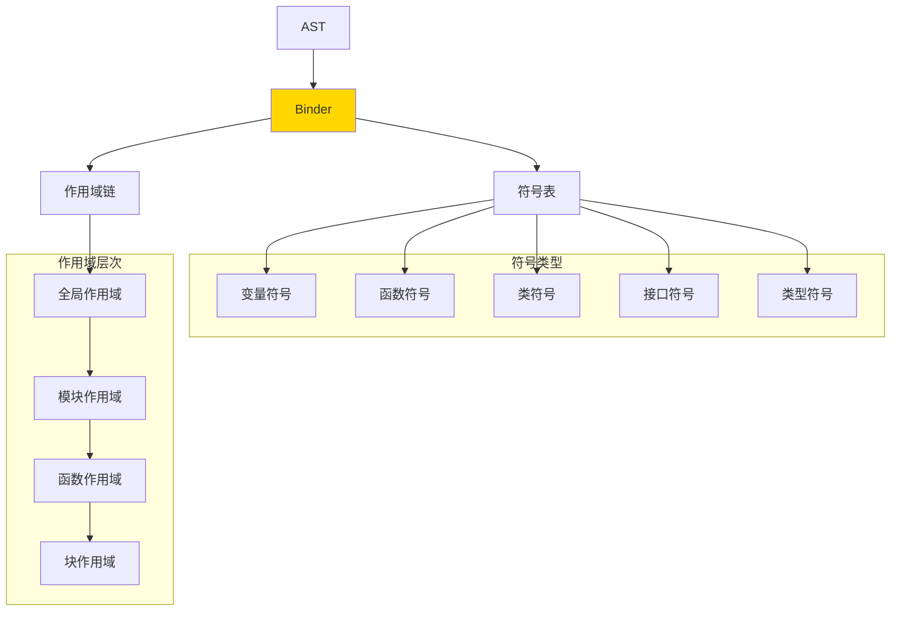

**功能**:
- 符号声明收集
- 作用域管理
- 符号引用解析
- 导入/导出处理

### 4. Checker（类型检查器）

**职责**: 执行类型检查和语义分析

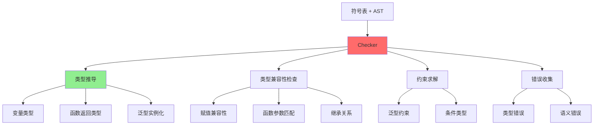

**核心算法**:
- **类型推导**: Hindley-Milner 算法的变体
- **子类型检查**: 结构化类型系统
- **泛型解析**: 约束求解和实例化
- **控制流分析**: 类型窄化和守卫

## 编译流程

### 完整编译管道

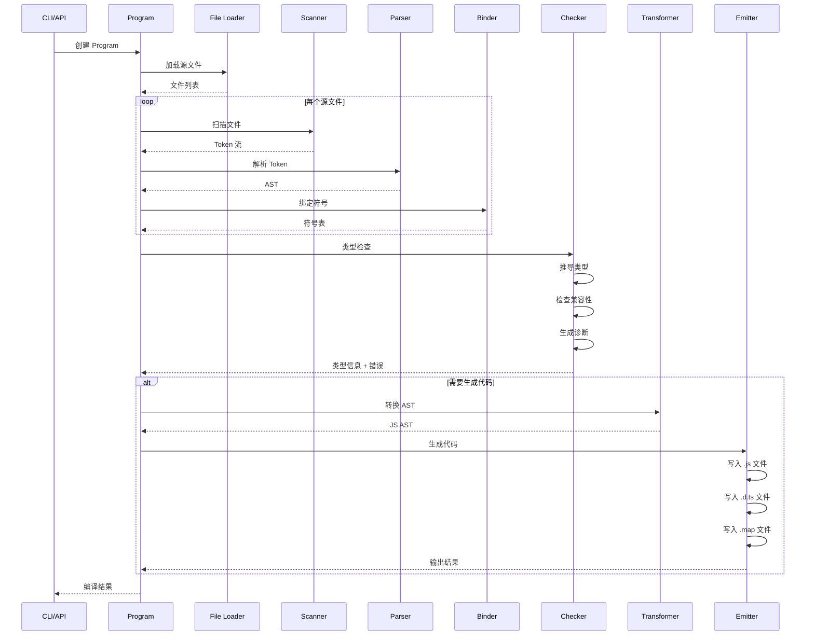

### 增量编译流程

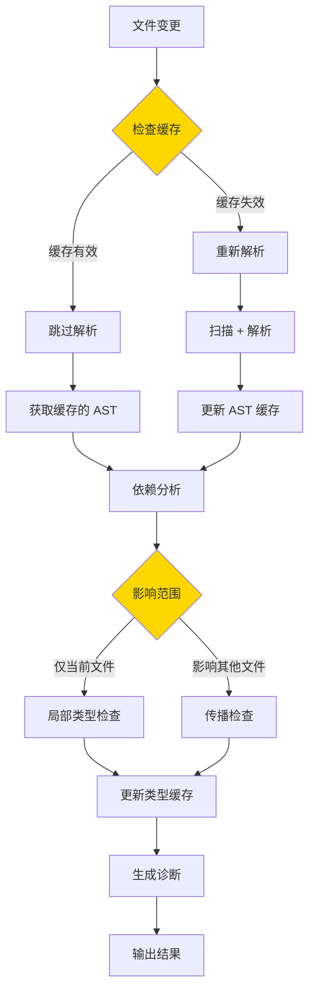

## 类型检查系统

### 类型系统架构

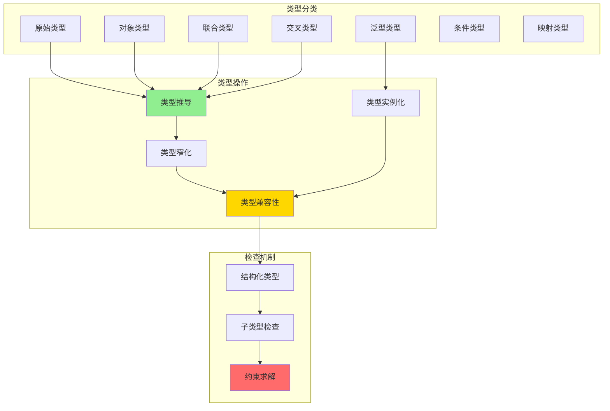

### 类型推导流程

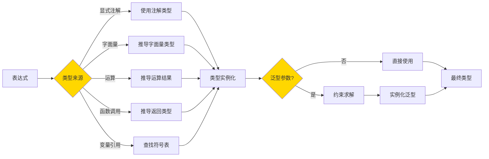

## 设计理念

### 1. 性能优先

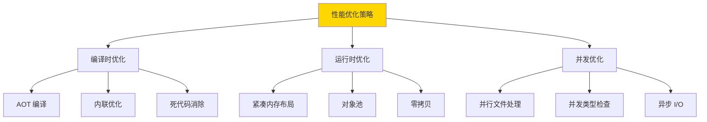

**设计原则**:

1. **零成本抽象**: 抽象不应带来运行时开销
2. **数据局部性**: 优化缓存友好的数据结构
3. **懒加载**: 延迟计算直到真正需要
4. **增量计算**: 只重新计算变更的部分
5. **并行优先**: 默认并行处理独立任务

### 2. 兼容性保证

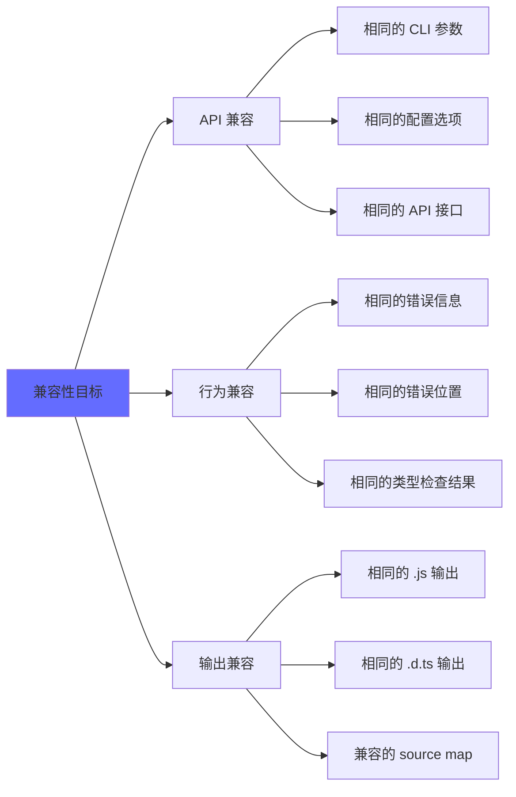

## 技术实现

### 入口点实现

```go
// cmd/tsgo/main.go
package main

import (
    "os"
    "github.com/microsoft/typescript-go/internal/execute"
)

func main() {
    os.Exit(runMain())
}

func runMain() int {
    args := os.Args[1:]
    if len(args) > 0 {
        switch args[0] {
        case "--lsp":
            return runLSP(args[1:])
        case "--api":
            return runAPI(args[1:])
        }
    }
    result := execute.CommandLine(newSystem(), args, nil)
    return int(result.Status)
}
```

### 并发模型示例

```go
// 并行处理多个文件
func (p *Program) ParseFiles(files []string) {
    var wg sync.WaitGroup
    results := make(chan *ParseResult, len(files))

    for _, file := range files {
        wg.Add(1)
        go func(f string) {
            defer wg.Done()
            ast := p.parser.Parse(f)
            results <- &ParseResult{File: f, AST: ast}
        }(file)
    }

    go func() {
        wg.Wait()
        close(results)
    }()

    for result := range results {
        p.addAST(result.File, result.AST)
    }
}
```

## 开发路线图

### 官方时间线

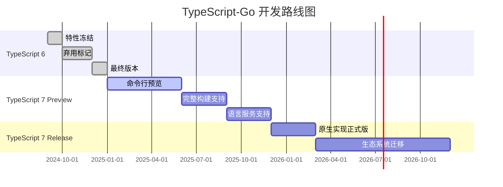

### 功能状态矩阵

| 功能 | 状态 | TypeScript 版本对标 | 说明 |
|------|------|-------------------|------|
| **程序创建** | ✅ 完成 | 5.8 | 完全兼容 |
| **解析/扫描** | ✅ 完成 | 5.8 | 相同的 AST 结构 |
| **类型解析** | ✅ 完成 | 5.8 | 完整的类型系统 |
| **类型检查** | ✅ 完成 | 5.8 | 相同的错误信息和位置 |
| **JSX 支持** | ✅ 完成 | 5.8 | React/Preact/Solid 等 |
| **构建模式** | ✅ 完成 | 5.8 | 支持项目引用 |
| **增量构建** | ✅ 完成 | 5.8 | 智能缓存 |
| **JavaScript 推断** | 🔄 进行中 | - | JSDoc 类型提取 |
| **JSDoc 支持** | 🔄 进行中 | - | 注释类型解析 |
| **声明生成** | 🔄 进行中 | - | .d.ts 文件输出 |
| **JS 输出** | 🔄 进行中 | - | 代码生成和转换 |
| **语言服务** | 🔄 进行中 | - | 补全、重构等 |
| **Watch 模式** | 🔧 原型 | - | 文件监听和增量重编译 |
| **命令行参数** | ⚠️ 部分 | - | 缺少 --help 和 --init |
| **公共 API** | ❌ 未开始 | - | 编程接口 |

## 安装与使用

### 安装

```bash
# 通过 npm 安装
npm install @typescript/native-preview

# 或作为开发依赖
npm install --save-dev @typescript/native-preview

# 验证安装
npx tsgo --version
```

### 基础使用

```bash
# 编译单个文件
npx tsgo index.ts

# 编译项目
npx tsgo --project tsconfig.json

# 构建模式（项目引用）
npx tsgo --build

# 增量构建
npx tsgo --build --incremental
```

### VS Code 集成

在 VS Code 设置中添加：

```json
{
  "typescript.experimental.useTsgo": true
}
```

### 配置示例

```json
{
  "compilerOptions": {
    "target": "esnext",
    "module": "esnext",
    "strict": true,
    "incremental": true,
    "composite": true,
    "declaration": true,
    "sourceMap": true
  }
}
```

## 最佳实践

### 1. 充分利用并发

使用项目引用拆分大型项目，TypeScript-Go 会并行构建独立的引用。

### 2. 启用增量编译

```json
{
  "compilerOptions": {
    "incremental": true,
    "tsBuildInfoFile": ".tsbuildinfo"
  }
}
```

### 3. 性能监控

```bash
# 开启性能分析
npx tsgo --diagnostics
```

### 4. CI/CD 集成

```yaml
# .github/workflows/typecheck.yml
- name: Type check with TypeScript-Go
  run: npx tsgo --noEmit
```

## 总结

TypeScript-Go 代表了编译器技术的重大进步：

### 核心价值

1. **性能革命** - 10 倍构建速度提升和 50% 内存节省
2. **无缝兼容** - 完全兼容现有 TypeScript 代码和工具链
3. **现代架构** - 充分利用多核并发和高效内存管理
4. **未来导向** - 为 AI 辅助开发和超大型项目做好准备

### 适用场景

- ✅ 大型 TypeScript 项目（100k+ LOC）
- ✅ 追求极致构建速度的团队
- ✅ CI/CD 资源受限的环境
- ✅ 需要频繁类型检查的开发流程

### 未来展望

随着 TypeScript 7 的正式发布，TypeScript-Go 将成为默认实现。这不仅仅是性能提升，更代表了编译器现代化和工具链优化的未来方向。

---

**参考资源:**

- [TypeScript-Go GitHub](https://github.com/microsoft/typescript-go)
- [官方公告博客](https://devblogs.microsoft.com/typescript/typescript-native-port/)
- [TypeScript 官方文档](https://www.typescriptlang.org/)
- [Go 官方网站](https://go.dev/)
