# Mastra Memory 完整教程与 Agent 内存设计指南

## 目录

1. [Memory 系统概述](#memory-系统概述)
2. [三种内存类型](#三种内存类型)
3. [Thread 和 Resource 架构](#thread-和-resource-架构)
4. [存储适配器](#存储适配器)
5. [Agent 内存设计决策指南](#agent-内存设计决策指南)
6. [实战案例](#实战案例)
7. [性能优化](#性能优化)
8. [最佳实践](#最佳实践)

---

## Memory 系统概述

### 为什么需要 Memory？

LLM 本身是**无状态**的——每次调用都是全新的，不记得之前的对话。Memory 系统让 Agent 能够：

- 🔄 **维持对话连贯性**：记住上下文
- 👤 **个性化体验**：记住用户偏好
- 📚 **长期知识积累**：跨会话信息检索
- 🎯 **上下文增强**：提供相关历史信息

### 架构全景图

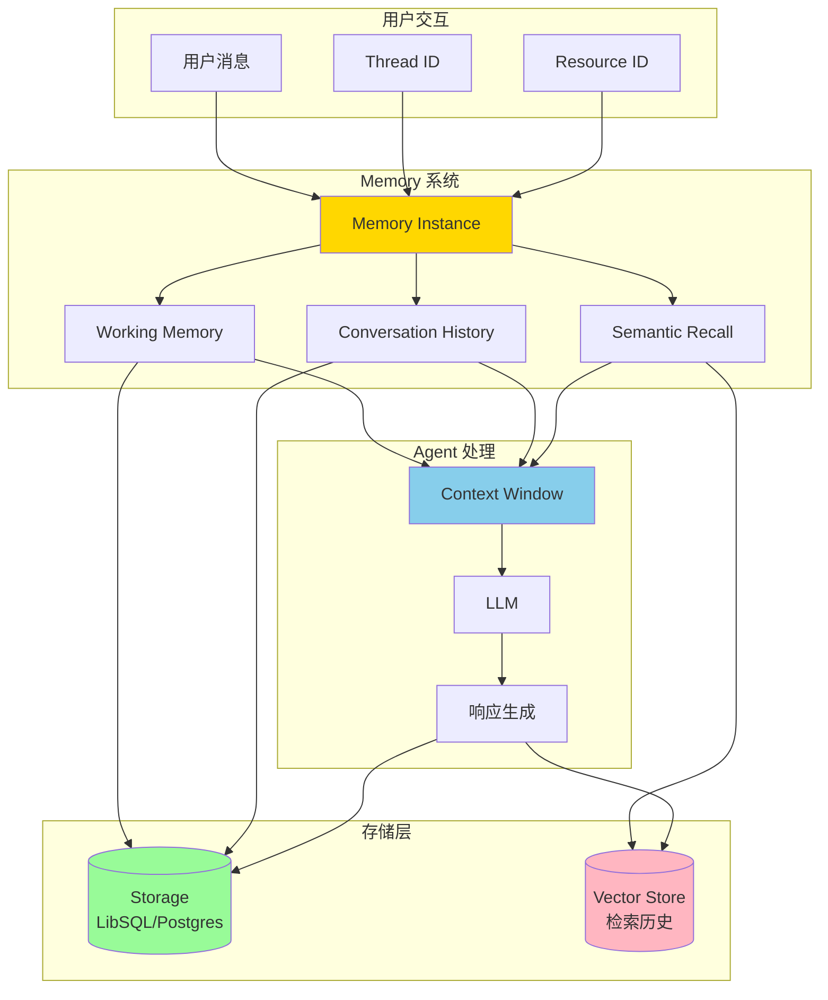

### Memory 的三层架构

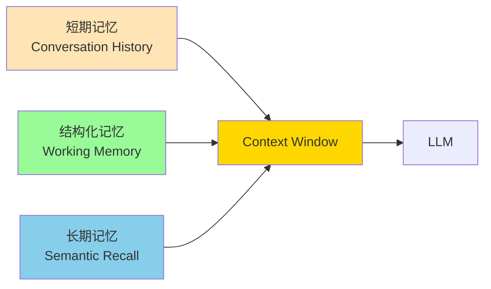

---

## 三种内存类型

### 1. Conversation History (对话历史)

**定位**：短期记忆，维持对话流畅性

```typescript
import { Memory } from '@mastra/memory';
import { Agent } from '@mastra/core/agent';

const agent = new Agent({
  name: 'chat-agent',
  instructions: '你是一个友好的助手',
  model: openai('gpt-4o-mini'),

  memory: new Memory({
    options: {
      // 保留最近 10 条消息
      lastMessages: 10,
    },
  }),
});
```

**工作原理**：

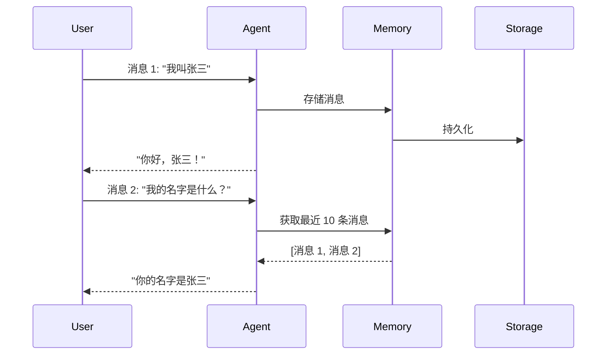

**配置选项**：

| 参数           | 类型              | 说明           | 推荐值                  |
| -------------- | ----------------- | -------------- | ----------------------- |
| `lastMessages` | `number \| false` | 保留的消息数量 | 10-50（根据上下文窗口） |

**适用场景**：

- ✅ 普通对话
- ✅ 客服问答
- ✅ 任务型对话
- ❌ 不适合需要回忆久远信息的场景

### 2. Working Memory (工作记忆)

**定位**：结构化的持久信息，类似 ChatGPT 的"记住我"功能

```typescript
// 方式 1: 使用 Template (Markdown)
const agentWithTemplate = new Agent({
  name: 'personal-assistant',
  instructions: '你是一个个人助理，记住用户的偏好',
  model: openai('gpt-4o-mini'),

  memory: new Memory({
    options: {
      workingMemory: {
        enabled: true,
        scope: 'resource', // 跨 thread 共享
        template: `
# 用户画像
- **姓名**:
- **职业**:
- **兴趣爱好**:
- **偏好设置**:
  - 语言偏好:
  - 时区:
  - 通知方式:

## 最近目标
-

## 重要日期
-
        `,
      },
    },
  }),
});

// 方式 2: 使用 Schema (类型安全)
import { z } from 'zod';

const agentWithSchema = new Agent({
  name: 'task-manager',
  instructions: '你是一个任务管理助手',
  model: openai('gpt-4o-mini'),

  memory: new Memory({
    options: {
      workingMemory: {
        enabled: true,
        scope: 'resource',
        schema: z.object({
          items: z.array(
            z.object({
              title: z.string(),
              due: z.string(),
              description: z.string(),
              status: z.enum(['active', 'completed']),
              estimatedTime: z.string(),
            }),
          ),
        }),
      },
    },
  }),
});
```

**Template vs Schema 对比**：

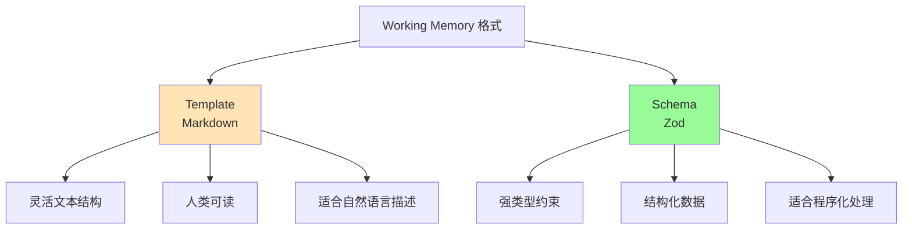

| 特性         | Template           | Schema           |
| ------------ | ------------------ | ---------------- |
| **格式**     | Markdown 文本      | Zod 对象         |
| **类型安全** | ❌                 | ✅               |
| **灵活性**   | 高                 | 中               |
| **适用场景** | 自然语言描述       | 结构化数据       |
| **示例**     | 用户偏好、背景信息 | 任务列表、设置项 |

**Scope 选择**：

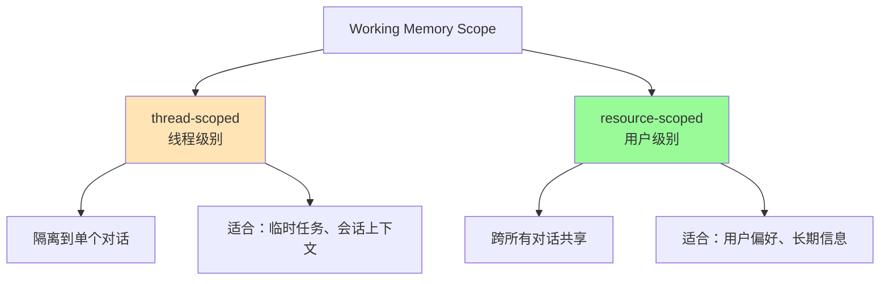

**使用示例**：

```typescript
// 初始化线程并设置初始 Working Memory
const memory = agent.getMemory();

const thread = await memory?.createThread({
  threadId: 'consultation-123',
  resourceId: 'user-456',
  title: '医疗咨询',
  metadata: {
    workingMemory: `
# 患者档案
- 姓名: 张三
- 血型: O+
- 过敏史: 青霉素
- 当前用药: 无
- 病史: 高血压（已控制）
    `,
  },
});

// Agent 自动访问 Working Memory
const response = await agent.generate('我能吃阿司匹林吗？', {
  memory: {
    thread: 'consultation-123',
    resource: 'user-456',
  },
});
// Agent 会参考患者档案中的过敏史和病史
```

### 3. Semantic Recall (语义召回)

**定位**：长期记忆，基于 RAG 的历史对话检索

```typescript
const agentWithSemanticRecall = new Agent({
  name: 'support-agent',
  instructions: '你是一个客服助手',
  model: openai('gpt-4o'),

  memory: new Memory({
    storage: new LibSQLStore({ url: 'file:./memory.db' }),
    vector: new LibSQLVector({ connectionUrl: 'file:./vector.db' }),
    embedder: openai.embedding('text-embedding-3-small'),

    options: {
      semanticRecall: {
        topK: 3, // 检索 3 条最相关的消息
        messageRange: 2, // 每条消息前后各包含 2 条上下文
        scope: 'resource', // 跨所有对话检索
      },
    },
  }),
});
```

**工作流程**：

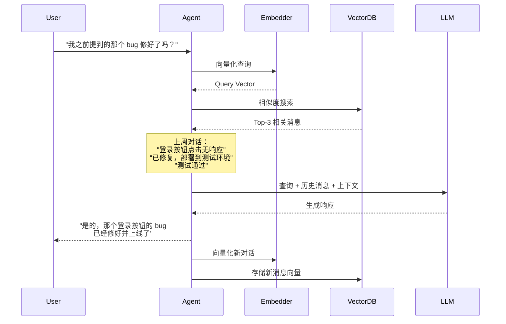

**配置参数详解**：

```typescript
interface SemanticRecallConfig {
  topK: number; // 检索多少条消息
  messageRange: number | { before: number; after: number };
  scope: 'thread' | 'resource';
}

// 示例 1: 精确控制上下文
const config1 = {
  topK: 5,
  messageRange: {
    before: 3, // 匹配消息之前的 3 条
    after: 1, // 匹配消息之后的 1 条
  },
  scope: 'resource',
};

// 示例 2: 对称上下文
const config2 = {
  topK: 3,
  messageRange: 2, // 前后各 2 条
  scope: 'thread',
};
```

**Scope 影响**：

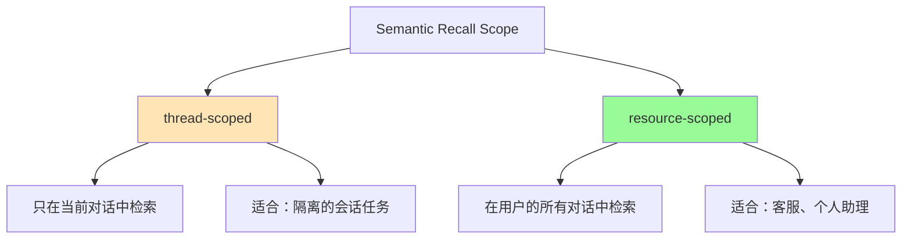

**性能考虑**：

| 操作         | 延迟       | 成本          |
| ------------ | ---------- | ------------- |
| **向量化**   | 50-200ms   | 按 token 计费 |
| **向量检索** | 10-50ms    | 免费（本地）  |
| **总延迟**   | ~100-300ms | 低            |

**何时禁用**：

```typescript
// 场景 1: 实时语音对话（延迟敏感）
const realtimeAgent = new Agent({
  memory: new Memory({
    options: {
      lastMessages: 20,
      semanticRecall: false, // 禁用以降低延迟
    },
  }),
});

// 场景 2: 短期任务（对话历史足够）
const quickTaskAgent = new Agent({
  memory: new Memory({
    options: {
      lastMessages: 50, // 增加对话历史
      semanticRecall: false,
    },
  }),
});
```

---

## Thread 和 Resource 架构

### 核心概念

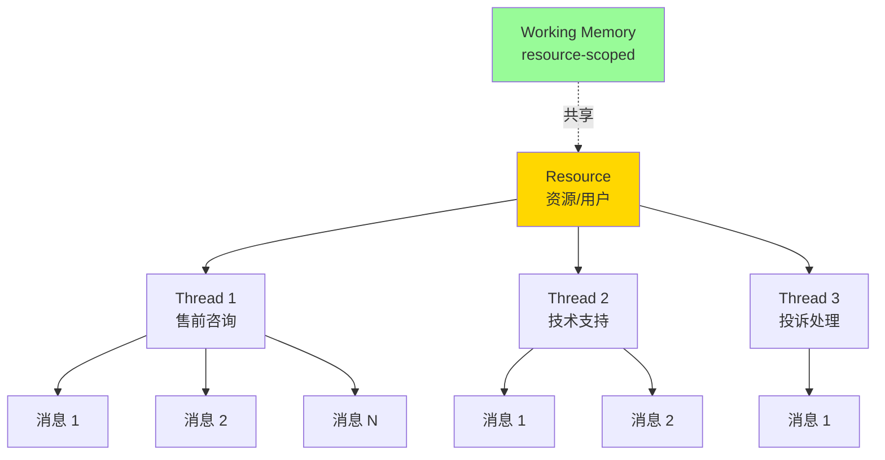

**定义**：

- **Thread**：单个对话/会话的唯一 ID（如 `support_123`）
- **Resource**：拥有 Thread 的用户/实体（如 `user_456`）

### 实战示例

```typescript
// 用户首次咨询（创建新 Thread）
const response1 = await agent.generate('我想了解你们的产品', {
  memory: {
    thread: 'sales_001', // 售前咨询线程
    resource: 'customer_789', // 客户 ID
  },
});

// 同一用户，不同话题（新 Thread）
const response2 = await agent.generate('我的订单为什么还没发货？', {
  memory: {
    thread: 'order_inquiry_001', // 订单查询线程
    resource: 'customer_789', // 同一客户
  },
});

// resource-scoped Working Memory 在两个 Thread 中都可见
// 例如：客户姓名、联系方式、会员等级等
```

### 自动生成 Thread 标题

```typescript
const agent = new Agent({
  memory: new Memory({
    options: {
      threads: {
        generateTitle: true, // 自动生成标题

        // 或者自定义
        generateTitle: {
          model: openai('gpt-4o-nano'), // 使用更便宜的模型
          instructions: '生成简洁的中文标题（不超过 10 个字）',
        },
      },
    },
  }),
});

// 第一条消息后，自动生成标题
// 例如：
// 用户："我想买一台笔记本电脑" → 标题："笔记本电脑购买咨询"
```

### Scope 决策矩阵

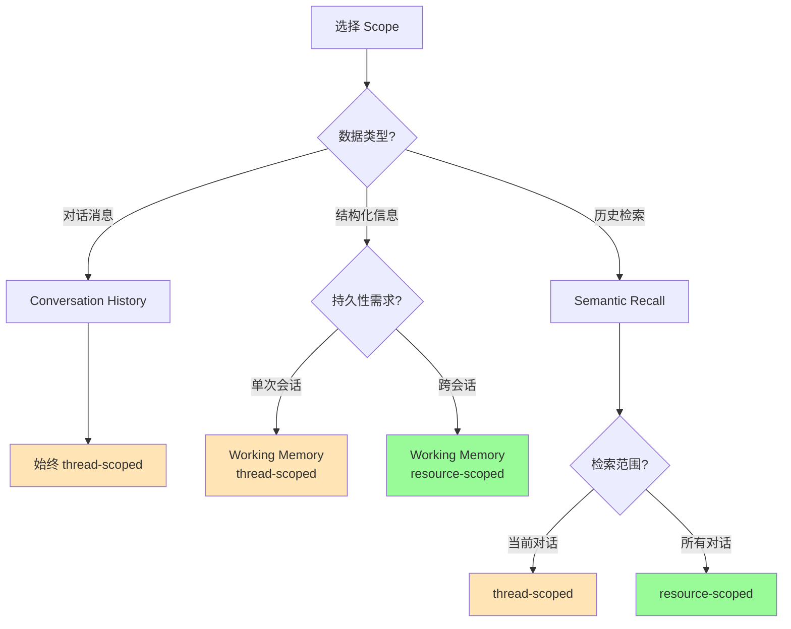

---

## 存储适配器

### 支持的存储方案

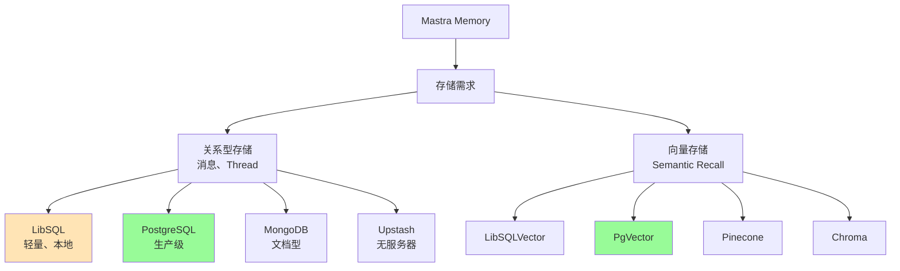

### 配置示例

#### 1. LibSQL（开发环境）

```typescript
import { LibSQLStore, LibSQLVector } from '@mastra/libsql';

const agent = new Agent({
  memory: new Memory({
    storage: new LibSQLStore({
      url: 'file:./memory.db', // 本地文件
      // 或 url: ':memory:' // 内存模式
    }),
    vector: new LibSQLVector({
      connectionUrl: 'file:./vector.db',
    }),
    embedder: openai.embedding('text-embedding-3-small'),
  }),
});
```

#### 2. PostgreSQL（生产环境）

```typescript
import { PgStore, PgVector } from '@mastra/pg';

const agent = new Agent({
  memory: new Memory({
    storage: new PgStore({
      connectionString: process.env.DATABASE_URL,
    }),
    vector: new PgVector({
      connectionString: process.env.DATABASE_URL,
      indexConfig: {
        type: 'hnsw', // 高性能索引
        metric: 'dotproduct', // OpenAI embeddings 最佳
        m: 16, // 连接数
        efConstruction: 64, // 构建时候选列表大小
      },
    }),
    embedder: openai.embedding('text-embedding-3-small'),
  }),
});
```

#### 3. Agent 独立存储

```typescript
// Agent A：使用独立数据库
const agentA = new Agent({
  name: 'sales-agent',
  memory: new Memory({
    storage: new LibSQLStore({
      url: 'file:./sales-memory.db',
    }),
  }),
});

// Agent B：使用另一个数据库
const agentB = new Agent({
  name: 'support-agent',
  memory: new Memory({
    storage: new LibSQLStore({
      url: 'file:./support-memory.db',
    }),
  }),
});

// 隔离原因：
// - 数据隔离和安全
// - 性能优化
// - 独立扩展
```

---

## Agent 内存设计决策指南

### 决策流程图

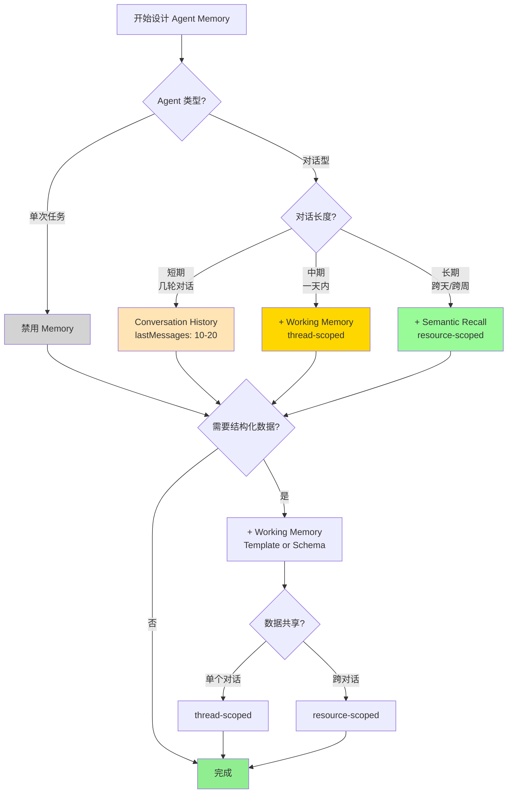

### 场景矩阵

| 场景         | Conversation History | Working Memory | Semantic Recall | Scope    |
| ------------ | -------------------- | -------------- | --------------- | -------- |
| **翻译工具** | ❌                   | ❌             | ❌              | -        |
| **简单问答** | ✅ (10-20)           | ❌             | ❌              | -        |
| **客服对话** | ✅ (20-50)           | ✅ Template    | ✅ (topK: 3-5)  | resource |
| **个人助理** | ✅ (30-50)           | ✅ Schema      | ✅ (topK: 5-10) | resource |
| **代码助手** | ✅ (10-30)           | ✅ Template    | ❌              | thread   |
| **医疗咨询** | ✅ (20-40)           | ✅ Template    | ✅ (topK: 3)    | resource |
| **任务管理** | ✅ (10-20)           | ✅ Schema      | ❌              | resource |
| **会议总结** | ✅ (50-100)          | ❌             | ❌              | thread   |

### 详细场景分析

#### 场景 1: 客服 Agent

```typescript
const customerServiceAgent = new Agent({
  name: 'customer-service',
  instructions: `
你是一个专业的客服助手。

使用 Working Memory 中的客户信息来个性化服务。
查阅历史对话来了解客户之前的问题和解决方案。
  `,
  model: openai('gpt-4o'),

  memory: new Memory({
    storage: new PgStore({ connectionString: process.env.DB_URL }),
    vector: new PgVector({ connectionString: process.env.DB_URL }),
    embedder: openai.embedding('text-embedding-3-small'),

    options: {
      // 中等对话历史
      lastMessages: 30,

      // 跨对话检索
      semanticRecall: {
        topK: 5,
        messageRange: 2,
        scope: 'resource', // 关键：检索该客户的所有历史
      },

      // 持久化客户信息
      workingMemory: {
        enabled: true,
        scope: 'resource', // 关键：跨对话共享
        template: `
# 客户档案
- **客户 ID**:
- **姓名**:
- **会员等级**:
- **联系方式**:
- **偏好设置**:
  - 通知方式:
  - 服务时间偏好:

## 历史问题
-

## 重要备注
-
        `,
      },

      // 自动生成对话标题
      threads: {
        generateTitle: true,
      },
    },
  }),
});

// 使用示例
const response = await customerServiceAgent.generate('我上次的退款处理好了吗？', {
  memory: {
    thread: 'refund_inquiry_456',
    resource: 'customer_123',
  },
});
// Agent 会：
// 1. 检查 Working Memory 中的客户信息
// 2. 语义搜索该客户所有对话中关于"退款"的历史
// 3. 结合最近 30 条消息理解上下文
```

**设计要点**：

- ✅ **resource-scoped Semantic Recall**：跨对话检索历史问题
- ✅ **resource-scoped Working Memory**：持久化客户信息
- ✅ **中等 lastMessages**：平衡上下文和成本

#### 场景 2: 个人助理 Agent

```typescript
import { z } from 'zod';

const personalAssistantAgent = new Agent({
  name: 'personal-assistant',
  instructions: `
你是一个贴心的个人助理。

管理用户的任务、日程和偏好。
使用 Working Memory 跟踪用户的目标和习惯。
回忆过去的对话来提供更好的建议。
  `,
  model: openai('gpt-4o'),

  memory: new Memory({
    storage: new LibSQLStore({ url: 'file:./assistant.db' }),
    vector: new LibSQLVector({ connectionUrl: 'file:./vector.db' }),
    embedder: openai.embedding('text-embedding-3-small'),

    options: {
      lastMessages: 50, // 较长对话历史

      semanticRecall: {
        topK: 10, // 更多历史信息
        messageRange: 3,
        scope: 'resource',
      },

      workingMemory: {
        enabled: true,
        scope: 'resource',
        schema: z.object({
          profile: z.object({
            name: z.string(),
            timezone: z.string(),
            workHours: z.string(),
          }),
          preferences: z.object({
            communicationStyle: z.string(),
            priorities: z.array(z.string()),
          }),
          goals: z.array(
            z.object({
              title: z.string(),
              deadline: z.string().optional(),
              status: z.enum(['active', 'completed', 'paused']),
            }),
          ),
          habits: z.array(
            z.object({
              name: z.string(),
              frequency: z.string(),
              lastTracked: z.string(),
            }),
          ),
        }),
      },

      threads: {
        generateTitle: {
          model: openai('gpt-4o-nano'),
          instructions: '生成简短的任务描述（5-8 个字）',
        },
      },
    },
  }),
});

// 使用场景
const response = await personalAssistantAgent.generate('帮我规划明天的日程，记得考虑我的运动习惯', {
  memory: {
    thread: 'daily_planning_20250115',
    resource: 'user_alice',
  },
});
// Agent 会：
// 1. 读取 Working Memory 中的工作时间、优先级、运动习惯
// 2. 语义检索过去的日程规划和用户反馈
// 3. 生成个性化的日程建议
```

**设计要点**：

- ✅ **Schema 而非 Template**：结构化数据便于程序处理
- ✅ **较高 topK**：个人助理需要更多历史上下文
- ✅ **较长 lastMessages**：保持对话连贯性

#### 场景 3: 代码助手 Agent

```typescript
const codeAssistantAgent = new Agent({
  name: 'code-assistant',
  instructions: `
你是一个专业的编程助手。

在当前会话中跟踪项目结构、代码片段和决策。
不需要跨会话记忆，每个项目都是独立的。
  `,
  model: openai('gpt-4o'),

  memory: new Memory({
    storage: new LibSQLStore({ url: 'file:./code.db' }),

    options: {
      lastMessages: 30, // 中等对话历史

      // 禁用 Semantic Recall（不需要长期记忆）
      semanticRecall: false,

      workingMemory: {
        enabled: true,
        scope: 'thread', // 关键：每个项目独立
        template: `
# 项目上下文
- **项目名称**:
- **技术栈**:
- **当前目录**:

## 文件结构
\`\`\`
\`\`\`

## 已实现功能
-

## 待办事项
-

## 重要决策
-
        `,
      },

      threads: {
        generateTitle: true,
      },
    },
  }),
});

// 使用示例
const response = await codeAssistantAgent.generate('帮我重构这个组件，使用我们之前讨论的设计模式', {
  memory: {
    thread: 'project_refactor_001',
    resource: 'developer_bob',
  },
});
// Agent 会：
// 1. 读取 Working Memory 中的项目结构和技术栈
// 2. 回忆对话历史中的设计模式讨论
// 3. 不会检索其他项目的代码（thread-scoped）
```

**设计要点**：

- ✅ **thread-scoped Working Memory**：每个项目独立上下文
- ❌ **禁用 Semantic Recall**：不需要跨项目记忆
- ✅ **Template 格式**：灵活记录代码和决策

#### 场景 4: 医疗咨询 Agent

```typescript
const medicalConsultantAgent = new Agent({
  name: 'medical-consultant',
  instructions: `
你是一个医疗咨询助手（非诊断工具）。

严格遵守隐私规定，妥善处理患者信息。
参考患者档案和历史咨询记录。
  `,
  model: openai('gpt-4o'),

  memory: new Memory({
    storage: new PgStore({
      connectionString: process.env.SECURE_DB_URL,
    }),
    vector: new PgVector({
      connectionString: process.env.SECURE_DB_URL,
    }),
    embedder: openai.embedding('text-embedding-3-small'),

    options: {
      lastMessages: 40,

      semanticRecall: {
        topK: 3, // 较少但精确
        messageRange: {
          before: 2,
          after: 1,
        },
        scope: 'resource',
      },

      workingMemory: {
        enabled: true,
        scope: 'resource',
        template: `
# 患者档案
- **患者 ID**:
- **姓名**:
- **年龄**:
- **性别**:

## 医疗信息
- **血型**:
- **过敏史**:
  -
- **当前用药**:
  -
- **慢性病**:
  -

## 历史咨询记录
-

⚠️ 隐私提示：此信息受 HIPAA 保护
        `,
      },

      threads: {
        generateTitle: {
          model: openai('gpt-4o-mini'),
          instructions: '生成医疗咨询主题（保护隐私，不包含姓名）',
        },
      },
    },
  }),
});

// 使用时需要权限验证
async function consultWithDoctor(patientId: string, question: string) {
  // 验证权限
  if (!(await hasPermission(patientId))) {
    throw new Error('Unauthorized');
  }

  const response = await medicalConsultantAgent.generate(question, {
    memory: {
      thread: `consult_${Date.now()}`,
      resource: patientId,
    },
  });

  return response;
}
```

**设计要点**：

- ✅ **resource-scoped**：跨咨询访问患者信息
- ✅ **较低 topK**：精确检索，避免信息过载
- ⚠️ **安全考虑**：使用安全的数据库、权限控制

---

## 实战案例

### 案例 1: 多租户 SaaS 客服系统

```typescript
// 架构设计
const createTenantAgent = (tenantId: string) => {
  return new Agent({
    name: `support-${tenantId}`,
    instructions: `你是 ${tenantId} 公司的客服助手`,
    model: openai('gpt-4o-mini'),

    memory: new Memory({
      // 租户独立数据库
      storage: new PgStore({
        connectionString: getTenantDbUrl(tenantId),
      }),
      vector: new PgVector({
        connectionString: getTenantDbUrl(tenantId),
      }),
      embedder: openai.embedding('text-embedding-3-small'),

      options: {
        lastMessages: 30,

        semanticRecall: {
          topK: 5,
          messageRange: 2,
          scope: 'resource',
        },

        workingMemory: {
          enabled: true,
          scope: 'resource',
          template: `
# 客户信息
- **客户 ID**:
- **公司名称**:
- **行业**:
- **计划类型**:
- **账户状态**:

## 产品使用情况
-

## 历史工单
-
          `,
        },
      },
    }),
  });
};

// 使用
const tenantAAgent = createTenantAgent('company-a');
const tenantBAgent = createTenantAgent('company-b');

// 完全隔离的数据
```

### 案例 2: 智能招聘助手

```typescript
const recruiterAgent = new Agent({
  name: 'recruiter-assistant',
  instructions: `
你是一个智能招聘助手。

帮助 HR 跟踪候选人信息、面试反馈和招聘进度。
使用 Working Memory 维护候选人档案。
  `,
  model: openai('gpt-4o'),

  memory: new Memory({
    storage: new LibSQLStore({ url: 'file:./recruiting.db' }),

    options: {
      lastMessages: 20,

      // 不需要长期检索（使用 ATS 系统）
      semanticRecall: false,

      workingMemory: {
        enabled: true,
        scope: 'thread', // 每个候选人一个 thread
        schema: z.object({
          candidate: z.object({
            name: z.string(),
            email: z.string(),
            phone: z.string(),
            position: z.string(),
          }),
          interviews: z.array(
            z.object({
              date: z.string(),
              interviewer: z.string(),
              feedback: z.string(),
              score: z.number(),
            }),
          ),
          status: z.enum(['applied', 'screening', 'interview', 'offer', 'hired', 'rejected']),
          notes: z.array(z.string()),
        }),
      },
    },
  }),
});

// 每个候选人一个独立 thread
const response = await recruiterAgent.generate(
  '记录今天的面试反馈：技术能力优秀，沟通能力中等，给 8 分',
  {
    memory: {
      thread: 'candidate_john_doe',
      resource: 'hr_team',
    },
  },
);
```

### 案例 3: 实时语音客服（低延迟优化）

```typescript
const realtimeVoiceAgent = new Agent({
  name: 'voice-support',
  instructions: '你是一个语音客服助手，快速响应用户问题',
  model: openai('gpt-4o-mini'), // 更快的模型

  memory: new Memory({
    storage: new LibSQLStore({ url: ':memory:' }), // 内存模式

    options: {
      lastMessages: 10, // 减少上下文

      // ❌ 禁用 Semantic Recall（避免向量化延迟）
      semanticRecall: false,

      // ❌ 禁用 Working Memory（简化流程）
      workingMemory: {
        enabled: false,
      },
    },
  }),
});

// 延迟优化：~100ms（vs 标准配置的 ~300ms）
```

---

## 性能优化

### 1. Context Window 管理

```typescript
import { createMemoryProcessor } from '@mastra/memory';

const agent = new Agent({
  memory: new Memory({
    options: {
      lastMessages: 50,
    },

    // 内存处理器：在超出限制前裁剪
    processors: [
      createMemoryProcessor({
        maxTokens: 8000, // Claude 的上下文窗口

        // 自定义裁剪策略
        trimStrategy: (messages) => {
          // 保留系统消息和最近的消息
          const systemMessages = messages.filter((m) => m.role === 'system');
          const recentMessages = messages.slice(-30);

          return [...systemMessages, ...recentMessages];
        },
      }),
    ],
  }),
});
```

### 2. Embedding 成本优化

```typescript
// 策略 1: 批量 Embedding
const batchEmbedder = {
  async embed(texts: string[]) {
    // 批量处理，减少 API 调用
    return await openai.embedding('text-embedding-3-small').doEmbed({ values: texts });
  },
};

// 策略 2: 选择性向量化
const selectiveAgent = new Agent({
  memory: new Memory({
    options: {
      semanticRecall: {
        topK: 3,
        messageRange: 1, // 减少上下文
      },
    },

    // 只对重要消息向量化
    processors: [
      createMemoryProcessor({
        shouldEmbed: (message) => {
          // 过滤掉短消息和系统消息
          return message.role === 'user' && message.content.length > 50;
        },
      }),
    ],
  }),
});
```

### 3. 数据库优化

```typescript
// PostgreSQL 索引优化
const optimizedPgAgent = new Agent({
  memory: new Memory({
    storage: new PgStore({ connectionString: process.env.DB_URL }),
    vector: new PgVector({
      connectionString: process.env.DB_URL,
      indexConfig: {
        type: 'hnsw', // 高性能索引
        metric: 'dotproduct', // OpenAI embeddings 最佳
        m: 16, // 平衡精度和速度
        efConstruction: 64, // 构建时性能
        efSearch: 40, // 查询时性能
      },
    }),
  }),
});

// 定期清理旧数据
async function cleanupOldMemory() {
  await db.execute(`
    DELETE FROM messages 
    WHERE created_at < NOW() - INTERVAL '90 days'
  `);

  await db.execute(`
    VACUUM ANALYZE messages;
  `);
}
```

### 4. 缓存策略

```typescript
import { LRUCache } from 'lru-cache';

// 缓存 Working Memory
const workingMemoryCache = new LRUCache<string, any>({
  max: 1000,
  ttl: 1000 * 60 * 60, // 1 小时
});

class CachedMemory extends Memory {
  async getWorkingMemory(threadId: string, resourceId: string) {
    const cacheKey = `${resourceId}-${threadId}`;

    if (workingMemoryCache.has(cacheKey)) {
      return workingMemoryCache.get(cacheKey);
    }

    const memory = await super.getWorkingMemory(threadId, resourceId);
    workingMemoryCache.set(cacheKey, memory);

    return memory;
  }
}
```

---

## 最佳实践

### 1. Memory 设计原则

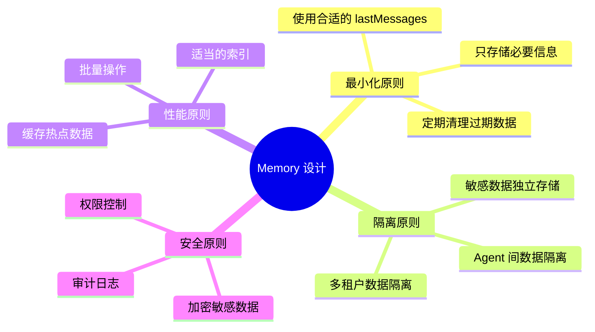

### 2. Scope 选择指南

| 场景           | Working Memory | Semantic Recall | 原因         |
| -------------- | -------------- | --------------- | ------------ |
| **用户偏好**   | resource       | resource        | 跨会话共享   |
| **会话上下文** | thread         | thread          | 独立隔离     |
| **客服历史**   | resource       | resource        | 检索所有对话 |
| **临时任务**   | thread         | -               | 短期有效     |

### 3. 测试和调试

```typescript
// 开启 Tracing 查看 Memory 检索
const agent = new Agent({
  memory: new Memory({
    options: {
      lastMessages: 20,
      semanticRecall: {
        topK: 5,
        messageRange: 2,
      },
    },
  }),
});

// 在 Mastra Playground 中查看
// 1. Observability 面板
// 2. 查看 Memory 检索的消息
// 3. 分析检索质量

// 或程序化访问
const trace = await agent.getTrace(runId);
console.log('检索的消息:', trace.memoryMessages);
```

### 4. 监控指标

```typescript
// 关键指标
interface MemoryMetrics {
  // 性能指标
  avgRetrievalTime: number; // 平均检索时间
  embeddingLatency: number; // 向量化延迟

  // 成本指标
  embeddingTokens: number; // Embedding tokens
  storageSize: number; // 存储大小

  // 质量指标
  semanticRecallHitRate: number; // 召回命中率
  conversationLength: number; // 平均对话长度
}

// 实现监控
class MonitoredMemory extends Memory {
  private metrics: MemoryMetrics = {
    avgRetrievalTime: 0,
    embeddingLatency: 0,
    embeddingTokens: 0,
    storageSize: 0,
    semanticRecallHitRate: 0,
    conversationLength: 0,
  };

  async query(params) {
    const startTime = Date.now();
    const result = await super.query(params);
    const duration = Date.now() - startTime;

    // 更新指标
    this.metrics.avgRetrievalTime = (this.metrics.avgRetrievalTime + duration) / 2;

    // 发送到监控系统
    await sendMetrics(this.metrics);

    return result;
  }
}
```

### 5. 错误处理

```typescript
const robustAgent = new Agent({
  memory: new Memory({
    options: {
      semanticRecall: {
        topK: 5,
        messageRange: 2,
      },
    },

    // 错误处理
    onError: async (error, context) => {
      if (error.code === 'VECTOR_STORE_UNAVAILABLE') {
        // 降级：禁用 Semantic Recall
        console.warn('Vector store unavailable, using conversation history only');
        return { fallbackToHistory: true };
      }

      if (error.code === 'EMBEDDING_RATE_LIMIT') {
        // 降级：减少 topK
        console.warn('Embedding rate limit, reducing topK');
        return { reducedTopK: 2 };
      }

      throw error;
    },
  }),
});
```

---

## 总结

### Memory 配置速查表

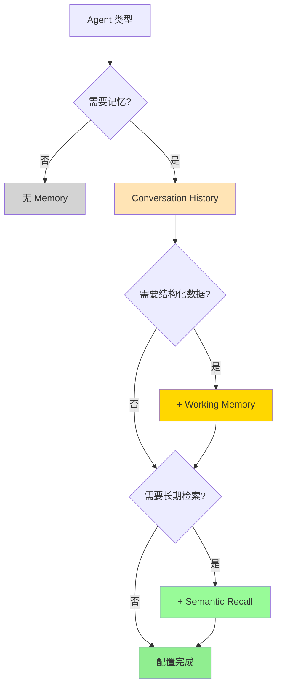

### 核心决策要点

**1. 何时使用 Memory？**

- ✅ 多轮对话
- ✅ 个性化体验
- ✅ 需要历史上下文
- ❌ 单次任务
- ❌ 无状态翻译

**2. 如何选择 Scope？**

- **thread-scoped**：独立会话、临时任务
- **resource-scoped**：用户偏好、跨会话数据

**3. 性能优化重点**

- 🎯 合适的 `lastMessages`（10-50）
- 🎯 精确的 `topK`（3-10）
- 🎯 高效的索引（HNSW）
- 🎯 批量处理和缓存

### 快速开始

```bash
# 安装依赖
npm install @mastra/memory @mastra/libsql

# 启动开发服务器
npm run dev

# 访问 Playground
# http://localhost:4111
```

---

## 参考资源

- **官方文档**: https://mastra.ai/docs/memory/overview
- **Working Memory**: https://mastra.ai/docs/memory/working-memory
- **Semantic Recall**: https://mastra.ai/docs/memory/semantic-recall
- **Memory Workshop**: https://mastra.ai/workshops/memory-workshop-09-10-25
- **GitHub 示例**: https://github.com/mastra-ai/mastra/tree/main/examples
