# Mastra Scorers 完整教程

## 目录

1. [Scorers 概述](#scorers-概述)
2. [评估管道架构](#评估管道架构)
3. [内置 Scorers](#内置-scorers)
4. [自定义 Scorers](#自定义-scorers)
5. [Live 评估](#live-评估)
6. [Trace 评估](#trace-评估)
7. [最佳实践](#最佳实践)
8. [与传统 Evals 对比](#与传统-evals-对比)

---

## Scorers 概述

### 什么是 Scorers？

Scorers 是用于测量 AI 生成输出的**质量、准确性或性能**的评估工具。它们提供了一种自动化方式来评估 Agents、Workflows 或语言模型是否产生了预期结果。

**核心概念**：

- **Score（分数）**：数值（通常 0-1），量化输出满足评估标准的程度
- **Reason（原因）**：解释分数的文本说明
- **Automatic（自动化）**：异步执行，不阻塞主流程
- **Persistent（持久化）**：结果自动存储到数据库

### 为什么需要 Scorers？

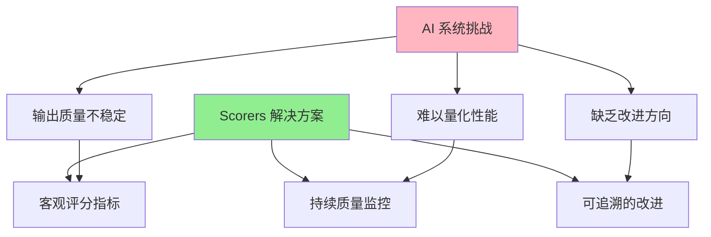

**应用场景**：

| 场景       | 使用的 Scorer                        | 目标                   |
| ---------- | ------------------------------------ | ---------------------- |
| RAG 系统   | Context Relevance, Faithfulness      | 确保检索内容相关且准确 |
| 客服 Agent | Tone Consistency, Toxicity           | 保持专业且安全的回复   |
| 内容生成   | Completeness, Answer Relevancy       | 生成完整且相关的答案   |
| 代码助手   | Tool Call Accuracy, Prompt Alignment | 正确选择工具并对齐需求 |

---

## 评估管道架构

### 四步管道设计

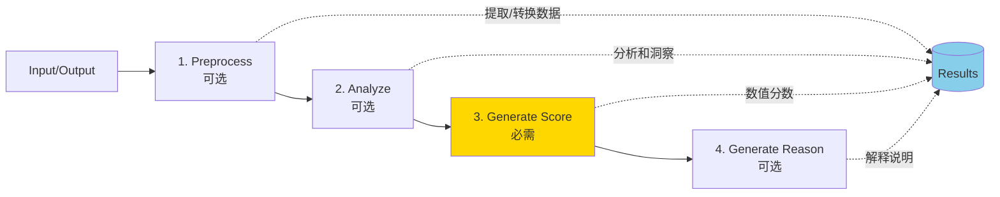

### 管道步骤详解

```typescript
interface ScorerPipeline<TInput, TOutput> {
  // 步骤 1: 预处理 (可选)
  preprocess?: (data: { run: { input: TInput; output: TOutput } }) => PreprocessResult;

  // 步骤 2: 分析 (可选)
  analyze?: (data: {
    run: { input: TInput; output: TOutput };
    results: { preprocessStepResult?: PreprocessResult };
  }) => AnalyzeResult;

  // 步骤 3: 生成分数 (必需)
  generateScore: (data: {
    run: { input: TInput; output: TOutput };
    results: {
      preprocessStepResult?: PreprocessResult;
      analyzeStepResult?: AnalyzeResult;
    };
  }) => number;

  // 步骤 4: 生成原因 (可选)
  generateReason?: (data: {
    score: number;
    run: { input: TInput; output: TOutput };
    results: {
      preprocessStepResult?: PreprocessResult;
      analyzeStepResult?: AnalyzeResult;
    };
  }) => string;
}
```

### 何时使用各步骤

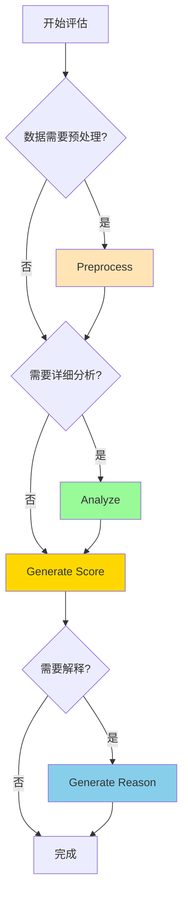

**使用指南**：

| 步骤                | 何时使用         | 示例场景                               |
| ------------------- | ---------------- | -------------------------------------- |
| **Preprocess**      | 数据复杂需要清洗 | 提取 JSON 中的特定字段、分词、标准化   |
| **Analyze**         | 需要结构化分析   | 识别所有声明、检测偏见模式、统计关键词 |
| **Generate Score**  | 总是需要         | 计算最终分数（0-1）                    |
| **Generate Reason** | 需要可解释性     | 审计、调试、用户反馈                   |

### 底层实现原理

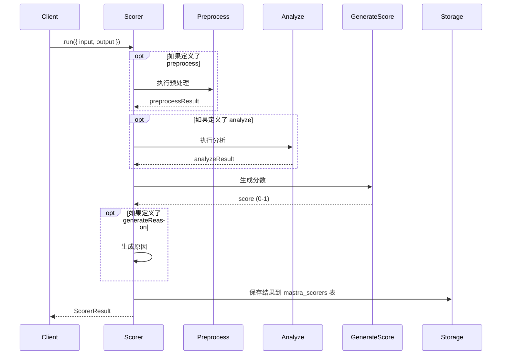

**Scorers 底层使用 Mastra Workflows**：

每个步骤都是一个 Workflow Step，这提供了：

- ✅ 异步执行
- ✅ 错误处理
- ✅ 状态持久化
- ✅ 可观测性

---

## 内置 Scorers

### Scorers 分类体系

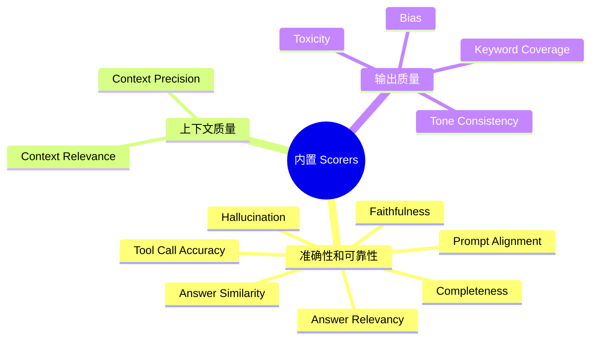

### 1. 准确性和可靠性 Scorers

#### Answer Relevancy

评估响应是否回答了用户的问题。

```typescript
import { createAnswerRelevancyScorer } from '@mastra/evals/scorers/llm';
import { openai } from '@ai-sdk/openai';

const relevancyScorer = createAnswerRelevancyScorer({
  model: openai('gpt-4o-mini'),
  uncertaintyWeight: 0.3, // 部分相关语句的权重
});

// 使用示例
const result = await relevancyScorer.run({
  input: '什么是机器学习？',
  output: '机器学习是人工智能的一个分支，它使计算机能够从数据中学习...',
});

console.log(result.score); // 0.95
console.log(result.reason); // "响应直接回答了问题..."
```

**工作原理**：

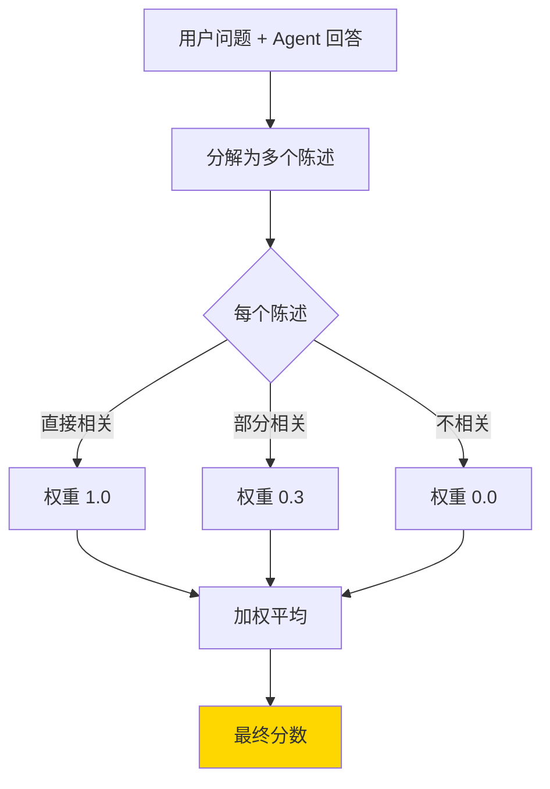

#### Faithfulness

衡量响应是否准确表示提供的上下文。

```typescript
import { createFaithfulnessScorer } from '@mastra/evals/scorers/llm';

const faithfulnessScorer = createFaithfulnessScorer({
  model: openai('gpt-4o-mini'),
  context: ['2024年全球 AI 市场规模达到 1840 亿美元', 'ChatGPT 在 2022 年 11 月发布'],
});

const result = await faithfulnessScorer.run({
  input: 'AI 市场有多大？',
  output: 'AI 市场在 2024 年达到 1840 亿美元',
});

console.log(result.score); // 1.0 (完全忠实于上下文)
```

#### Hallucination

检测事实矛盾和未经支持的声明。

```typescript
import { createHallucinationScorer } from '@mastra/evals/scorers/llm';

const hallucinationScorer = createHallucinationScorer({
  model: openai('gpt-4o-mini'),
  context: ['苹果公司成立于 1976 年'],
});

// 幻觉示例
const result = await hallucinationScorer.run({
  input: '苹果公司何时成立？',
  output: '苹果公司成立于 1985 年', // 与上下文矛盾
});

console.log(result.score); // 接近 1.0 (检测到幻觉)
```

### 2. 上下文质量 Scorers

#### Context Precision vs Context Relevance

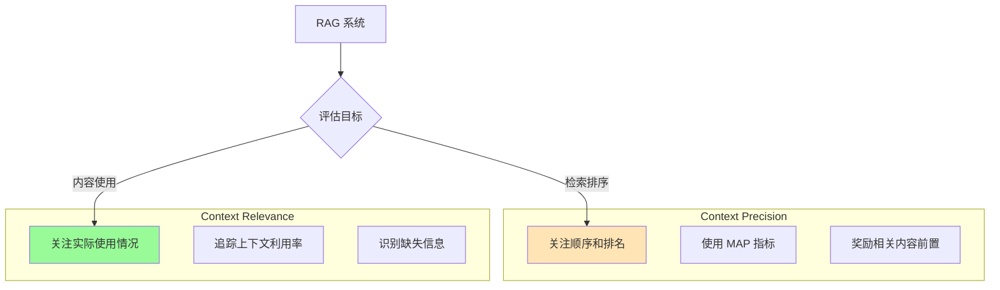

**Context Precision 示例**：

```typescript
import { createContextPrecisionScorer } from '@mastra/evals/scorers/llm';

const contextPrecisionScorer = createContextPrecisionScorer({
  model: openai('gpt-4o-mini'),
  // 动态提取上下文（适用于 RAG 系统）
  extractContext: async ({ run }) => {
    // 从 RAG 系统中提取检索到的文档
    const documents = await vectorStore.search(run.input.query);
    return documents.map((doc) => doc.content);
  },
});

// 评估检索质量
const result = await contextPrecisionScorer.run({
  input: { query: 'Next.js 的优势是什么？' },
  output: { answer: 'Next.js 提供 SSR、ISR...' },
});
```

**Context Relevance 示例**：

```typescript
import { createContextRelevanceScorer } from '@mastra/evals/scorers/llm';

const contextRelevanceScorer = createContextRelevanceScorer({
  model: openai('gpt-4o-mini'),
  context: ['Next.js 支持服务端渲染', 'React 是前端框架', 'Python 是后端语言'],
});

const result = await contextRelevanceScorer.run({
  input: 'Next.js 的特性是什么？',
  output: 'Next.js 支持服务端渲染，提升 SEO...',
});

// result.reason 会显示：
// - 使用了第 1 条上下文 (Next.js SSR)
// - 第 2 条部分相关
// - 第 3 条不相关
```

### 3. 输出质量 Scorers

#### Toxicity

检测有害或不当内容。

```typescript
import { createToxicityScorer } from '@mastra/evals/scorers/llm';

const toxicityScorer = createToxicityScorer({
  model: openai('gpt-4o-mini'),
});

// 安全内容
const safe = await toxicityScorer.run({
  input: '你好',
  output: '您好！我能为您提供什么帮助？',
});
console.log(safe.score); // 0.0 (无毒性)

// 有害内容
const toxic = await toxicityScorer.run({
  input: '帮我写邮件',
  output: '你这个笨蛋...',
});
console.log(toxic.score); // 接近 1.0 (检测到毒性)
```

#### Bias

检测潜在偏见。

```typescript
import { createBiasScorer } from '@mastra/evals/scorers/llm';

const biasScorer = createBiasScorer({
  model: openai('gpt-4o-mini'),
  scale: 1, // 0-1 分数范围
});

const result = await biasScorer.run({
  input: '描述程序员',
  output: '程序员通常是男性，擅长数学...',
});

// result 会识别性别刻板印象
console.log(result.score); // 偏见程度分数
console.log(result.reason); // "检测到性别刻板印象..."
```

### 内置 Scorers 速查表

| Scorer                 | 分数范围 | 越高越好? | 主要用途       |
| ---------------------- | -------- | --------- | -------------- |
| **Answer Relevancy**   | 0-1      | ✅        | 回答是否切题   |
| **Answer Similarity**  | 0-1      | ✅        | CI/CD 回归测试 |
| **Faithfulness**       | 0-1      | ✅        | RAG 事实准确性 |
| **Hallucination**      | 0-1      | ❌        | 检测虚假信息   |
| **Completeness**       | 0-1      | ✅        | 信息完整性     |
| **Context Precision**  | 0-1      | ✅        | 检索排序质量   |
| **Context Relevance**  | 0-1      | ✅        | 上下文相关性   |
| **Toxicity**           | 0-1      | ❌        | 内容安全       |
| **Bias**               | 0-1      | ❌        | 偏见检测       |
| **Tone Consistency**   | 0-1      | ✅        | 风格一致性     |
| **Tool Call Accuracy** | 0-1      | ✅        | 工具选择正确性 |
| **Prompt Alignment**   | 0-1      | ✅        | 对齐用户意图   |

---

## 自定义 Scorers

### 基础结构

```typescript
import { createScorer } from '@mastra/core/scorers';
import { z } from 'zod';

const customScorer = createScorer({
  name: 'My Custom Scorer',
  description: '评估特定业务逻辑',

  // 可选：LLM 配置
  judge: {
    model: openai('gpt-4o-mini'),
    instructions: '你是一个专业的评估者...',
  },
})
  .preprocess(/* 步骤 1 */)
  .analyze(/* 步骤 2 */)
  .generateScore(/* 步骤 3 - 必需 */)
  .generateReason(/* 步骤 4 */)
  .build();
```

### 方式 1: 使用函数 (确定性逻辑)

```typescript
const lengthScorer = createScorer({
  name: 'Response Length Scorer',
  description: '评估回答长度是否合适',
})
  .preprocess(({ run }) => {
    // 提取和清洗数据
    const text = run.output.text || run.output;
    const wordCount = text.split(/\s+/).length;
    const charCount = text.length;

    return {
      wordCount,
      charCount,
      hasEmptyResponse: wordCount === 0,
    };
  })
  .generateScore(({ results }) => {
    const { wordCount, hasEmptyResponse } = results.preprocessStepResult;

    // 业务规则
    if (hasEmptyResponse) return 0.0;
    if (wordCount < 10) return 0.3;
    if (wordCount < 50) return 0.7;
    if (wordCount < 200) return 1.0;
    if (wordCount < 500) return 0.8;
    return 0.5; // 太长了
  })
  .generateReason(({ score, results }) => {
    const { wordCount } = results.preprocessStepResult;

    if (score === 1.0) {
      return `完美长度：${wordCount} 词，详细且简洁`;
    }
    if (score < 0.5) {
      return `太${wordCount < 50 ? '短' : '长'}：${wordCount} 词`;
    }
    return `可接受长度：${wordCount} 词`;
  })
  .build();
```

### 方式 2: 使用 Prompt Objects (LLM 评估)

```typescript
const glutenCheckerScorer = createScorer({
  name: 'Gluten Checker',
  description: '检查食谱是否含麸质',
  judge: {
    model: openai('gpt-4o'),
    instructions: '你是一个专业的厨师，识别食谱中的麸质成分',
  },
})
  .analyze({
    description: '识别麸质来源',
    outputSchema: z.object({
      isGlutenFree: z.boolean(),
      glutenSources: z.array(z.string()),
      reasoning: z.string(),
    }),
    createPrompt: ({ run }) => `
      检查这个食谱是否含麸质：
      
      ${run.output}
      
      检查以下成分：
      - 小麦 (wheat)
      - 大麦 (barley)
      - 黑麦 (rye)
      - 常见来源：面粉、面食、面包
      
      返回 JSON 格式：
      {
        "isGlutenFree": boolean,
        "glutenSources": ["成分列表"],
        "reasoning": "分析说明"
      }
    `,
  })
  .generateScore(({ results }) => {
    const analysis = results.analyzeStepResult;
    return analysis.isGlutenFree ? 1.0 : 0.0;
  })
  .generateReason(({ results }) => {
    const analysis = results.analyzeStepResult;

    if (analysis.isGlutenFree) {
      return '✅ 此食谱不含麸质';
    }

    return `❌ 检测到麸质：${analysis.glutenSources.join(', ')}。${analysis.reasoning}`;
  })
  .build();
```

### 方式 3: 混合模式 (函数 + LLM)

````typescript
const hybridScorer = createScorer({
  name: 'Hybrid Quality Scorer',
  description: '结合规则和 LLM 评估',
  judge: {
    model: openai('gpt-4o-mini'),
    instructions: '评估内容质量',
  },
})
  // 函数：提取统计数据
  .preprocess(({ run }) => {
    const text = run.output;
    return {
      wordCount: text.split(/\s+/).length,
      hasLinks: /https?:\/\//.test(text),
      hasCode: /```/.test(text),
      sentenceCount: text.split(/[.!?]+/).length,
    };
  })
  // LLM：分析语义质量
  .analyze({
    description: '评估语义质量',
    outputSchema: z.object({
      clarity: z.number().min(0).max(1),
      coherence: z.number().min(0).max(1),
      informativeness: z.number().min(0).max(1),
    }),
    createPrompt: ({ run }) => `
      评估这段文本的质量（0-1）：
      
      ${run.output}
      
      评估维度：
      - clarity: 表达清晰度
      - coherence: 逻辑连贯性
      - informativeness: 信息量
      
      返回 JSON 格式。
    `,
  })
  // 函数：综合计算分数
  .generateScore(({ results }) => {
    const stats = results.preprocessStepResult;
    const quality = results.analyzeStepResult;

    // 基础分：长度合理性
    let baseScore = stats.wordCount >= 20 && stats.wordCount <= 500 ? 0.3 : 0.0;

    // 语义分：LLM 评估的平均值
    const semanticScore =
      ((quality.clarity + quality.coherence + quality.informativeness) / 3) * 0.7;

    return baseScore + semanticScore;
  })
  .generateReason(({ score, results }) => {
    const stats = results.preprocessStepResult;
    const quality = results.analyzeStepResult;

    return `
      综合评分：${(score * 100).toFixed(1)}%
      
      统计信息：
      - 字数：${stats.wordCount}
      - 句子数：${stats.sentenceCount}
      - 包含链接：${stats.hasLinks ? '是' : '否'}
      
      质量分析：
      - 清晰度：${(quality.clarity * 100).toFixed(0)}%
      - 连贯性：${(quality.coherence * 100).toFixed(0)}%
      - 信息量：${(quality.informativeness * 100).toFixed(0)}%
    `.trim();
  })
  .build();
````

### Agent 类型的 Scorer

```typescript
// 自动类型推导
const agentScorer = createScorer({
  name: 'Agent Response Quality',
  description: '评估 Agent 响应质量',
  type: 'agent', // 自动提供 Agent 输入/输出类型
})
  .preprocess(({ run }) => {
    // run.input 自动类型化为 ScorerRunInputForAgent
    const userMessages = run.input.inputMessages;
    const lastMessage = userMessages[userMessages.length - 1];

    return {
      userQuery: lastMessage?.content || '',
      messageCount: userMessages.length,
    };
  })
  .generateScore(({ run, results }) => {
    // run.output 自动类型化为 ScorerRunOutputForAgent
    const response = run.output[0]?.content || '';
    const { userQuery } = results.preprocessStepResult;

    // 简单的相关性检查
    const queryWords = userQuery.toLowerCase().split(/\s+/);
    const responseWords = response.toLowerCase().split(/\s+/);
    const matchCount = queryWords.filter((w) => responseWords.includes(w)).length;

    return Math.min(matchCount / queryWords.length, 1.0);
  })
  .build();
```

---

## Live 评估

### 概念和架构

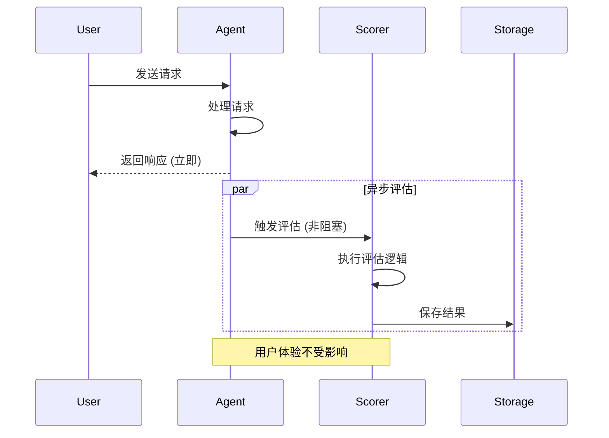

**核心特点**：

- ✅ **异步执行**：不阻塞 Agent 响应
- ✅ **采样控制**：通过 `rate` 控制评估频率
- ✅ **自动存储**：结果存入 `mastra_scorers` 表

### 为 Agent 添加 Scorers

```typescript
import { Agent } from '@mastra/core/agent';
import { openai } from '@ai-sdk/openai';
import {
  createAnswerRelevancyScorer,
  createToxicityScorer,
  createCompletenessScorer,
} from '@mastra/evals/scorers/llm';

export const evaluatedAgent = new Agent({
  name: 'customer-support',
  instructions: '你是一个客服助手...',
  model: openai('gpt-4o-mini'),

  scorers: {
    // 评估回答相关性 (50% 采样率)
    relevancy: {
      scorer: createAnswerRelevancyScorer({
        model: openai('gpt-4o-mini'),
      }),
      sampling: {
        type: 'ratio',
        rate: 0.5, // 只评估 50% 的响应
      },
    },

    // 评估内容安全 (100% 采样率)
    safety: {
      scorer: createToxicityScorer({
        model: openai('gpt-4o-mini'),
      }),
      sampling: {
        type: 'ratio',
        rate: 1.0, // 评估所有响应
      },
    },

    // 评估回答完整性 (10% 采样率)
    completeness: {
      scorer: createCompletenessScorer({
        model: openai('gpt-4o-mini'),
      }),
      sampling: {
        type: 'ratio',
        rate: 0.1, // 评估 10% 的响应
      },
    },
  },
});
```

### 为 Workflow Steps 添加 Scorers

```typescript
import { createWorkflow, createStep } from '@mastra/core/workflows';
import { z } from 'zod';
import { customStepScorer } from '../scorers/custom-step-scorer';

const contentGenerationStep = createStep({
  id: 'generate-content',
  inputSchema: z.object({
    topic: z.string(),
  }),
  outputSchema: z.object({
    content: z.string(),
  }),
  execute: async ({ inputData, mastra }) => {
    const agent = mastra.getAgent('contentAgent');
    const response = await agent.generate(`写一篇关于 ${inputData.topic} 的文章`);

    return {
      content: response.text,
    };
  },

  // 为此步骤添加 Scorer
  scorers: {
    quality: {
      scorer: customStepScorer(),
      sampling: {
        type: 'ratio',
        rate: 1.0, // 评估每次执行
      },
    },
  },
});

export const contentWorkflow = createWorkflow({
  id: 'content-generation',
  inputSchema: z.object({
    topic: z.string(),
  }),
  outputSchema: z.object({
    content: z.string(),
  }),
})
  .then(contentGenerationStep)
  .commit();
```

### 采样策略

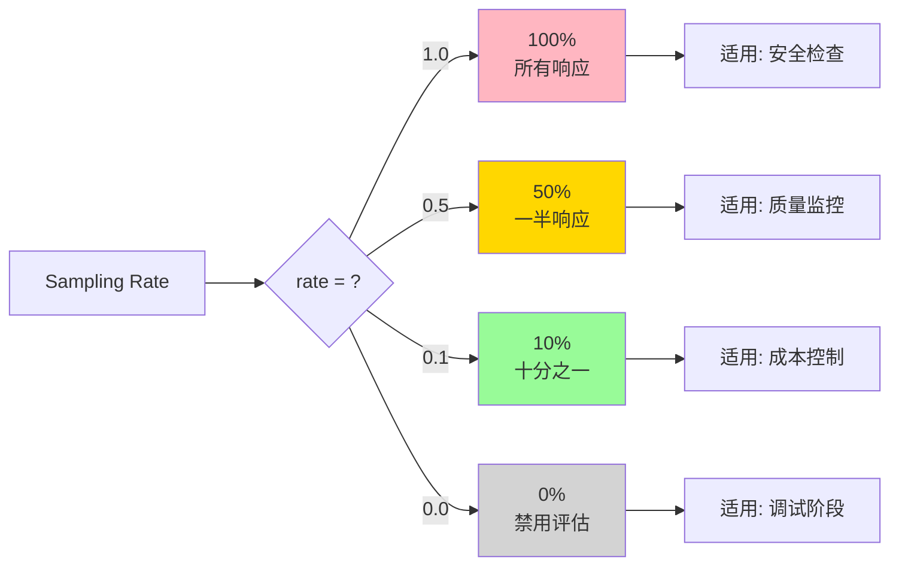

**采样率选择建议**：

| Rate        | 成本 | 覆盖率 | 适用场景             |
| ----------- | ---- | ------ | -------------------- |
| **1.0**     | 高   | 100%   | 安全检查、合规审计   |
| **0.5**     | 中   | 50%    | 质量监控、A/B 测试   |
| **0.1-0.2** | 低   | 10-20% | 趋势分析、成本敏感   |
| **0.01**    | 极低 | 1%     | 大规模抽样、初步诊断 |

---

## Trace 评估

### 架构图

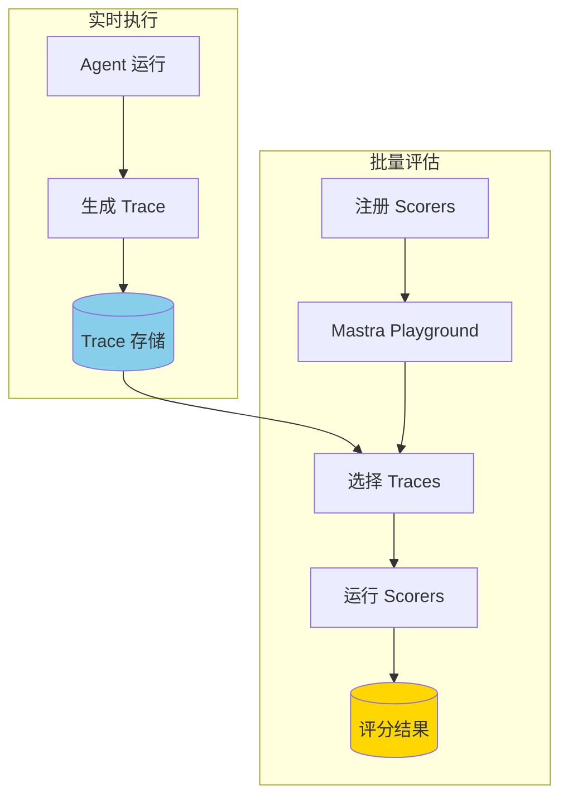

### 配置 Observability

```typescript
import { Mastra } from '@mastra/core/mastra';
import { LibSQLStore } from '@mastra/core/storage';

const mastra = new Mastra({
  // 配置存储以收集 Traces
  storage: new LibSQLStore({
    url: process.env.DATABASE_URL,
  }),

  // 启用可观测性
  observability: {
    enabled: true,
  },

  // 注册 Scorers 用于 Trace 评估
  scorers: {
    answerRelevancy: createAnswerRelevancyScorer({
      model: openai('gpt-4o-mini'),
    }),
    responseQuality: customQualityScorer,
  },

  agents: {
    customerSupport: evaluatedAgent,
  },
});
```

### 在 Playground 中评估 Traces

```bash
# 启动开发服务器
npm run dev

# 访问 Playground
# http://localhost:4111
```

**操作步骤**：

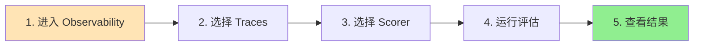

1. **Observability 面板**：查看所有历史 Traces
2. **选择 Traces**：选择要评估的对话记录
3. **选择 Scorer**：从已注册的 Scorers 中选择
4. **批量评估**：对多个 Traces 运行评估
5. **结果分析**：查看分数、原因和趋势

### 程序化评估 Traces

```typescript
// 获取历史 Traces
const traces = await mastra.getTraces({
  agentId: 'customerSupport',
  startDate: new Date('2024-01-01'),
  endDate: new Date('2024-01-31'),
});

// 对每个 Trace 运行 Scorer
for (const trace of traces) {
  const scorer = mastra.getScorer('answerRelevancy');

  const result = await scorer.run({
    input: trace.input,
    output: trace.output,
    runId: trace.id,
  });

  console.log(`Trace ${trace.id}: ${result.score}`);

  // 结果自动存储到 mastra_scorers 表
}
```

---

## 最佳实践

### 1. Scorer 设计原则

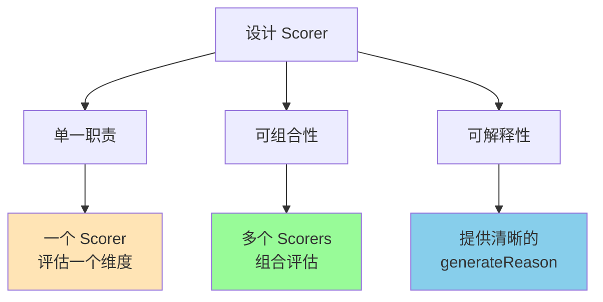

**✅ 好的设计**：

```typescript
// 单一职责：只检查长度
const lengthScorer = createScorer({...})
  .generateScore(({ run }) => {
    const wordCount = run.output.split(/\s+/).length;
    return wordCount >= 50 && wordCount <= 200 ? 1.0 : 0.5;
  });

// 单一职责：只检查语气
const toneScorer = createToneConsistencyScorer({...});

// 组合使用
const agent = new Agent({
  scorers: {
    length: { scorer: lengthScorer, sampling: { rate: 1 } },
    tone: { scorer: toneScorer, sampling: { rate: 0.5 } },
  },
});
```

**❌ 避免的设计**：

```typescript
// 职责过多：混合了多个评估维度
const everythingScorer = createScorer({...})
  .generateScore(({ run }) => {
    // 检查长度、语气、毒性、相关性... 太多了！
    return complexCalculation();
  });
```

### 2. 采样策略

```typescript
// 分层采样
const agent = new Agent({
  scorers: {
    // 高优先级：100% 采样
    safety: {
      scorer: toxicityScorer,
      sampling: { type: 'ratio', rate: 1.0 },
    },

    // 中优先级：50% 采样
    quality: {
      scorer: relevancyScorer,
      sampling: { type: 'ratio', rate: 0.5 },
    },

    // 低优先级：10% 采样
    style: {
      scorer: toneScorer,
      sampling: { type: 'ratio', rate: 0.1 },
    },
  },
});
```

### 3. 错误处理

```typescript
const robustScorer = createScorer({
  name: 'Robust Scorer',
  description: '具有错误处理的 Scorer',
})
  .preprocess(({ run }) => {
    try {
      const text = run.output?.text || run.output || '';
      return {
        text,
        wordCount: text.split(/\s+/).length,
      };
    } catch (error) {
      console.error('Preprocess error:', error);
      return {
        text: '',
        wordCount: 0,
        error: error.message,
      };
    }
  })
  .generateScore(({ results }) => {
    const { wordCount, error } = results.preprocessStepResult;

    // 如果预处理失败，返回默认分数
    if (error) {
      return 0.0;
    }

    return wordCount > 10 ? 1.0 : 0.5;
  })
  .generateReason(({ score, results }) => {
    const { error } = results.preprocessStepResult;

    if (error) {
      return `⚠️ 评估失败: ${error}`;
    }

    return `评分: ${score}`;
  })
  .build();
```

### 4. 性能优化

```typescript
// 使用更快的模型进行采样评估
const costEffectiveScorer = createAnswerRelevancyScorer({
  model: openai('gpt-4o-mini'), // 而不是 gpt-4o
});

// 缓存预处理结果
const cachedPreprocess = (() => {
  const cache = new Map();

  return ({ run }) => {
    const key = JSON.stringify(run.output);

    if (cache.has(key)) {
      return cache.get(key);
    }

    const result = expensiveProcessing(run.output);
    cache.set(key, result);
    return result;
  };
})();

const efficientScorer = createScorer({...})
  .preprocess(cachedPreprocess)
  .generateScore({...});
```

### 5. 监控和告警

```typescript
// 设置分数阈值告警
const monitoredAgent = new Agent({
  scorers: {
    safety: {
      scorer: toxicityScorer,
      sampling: { type: 'ratio', rate: 1.0 },
    },
  },

  // 监听评分结果
  onScore: async (scorerName, result) => {
    if (scorerName === 'safety' && result.score > 0.7) {
      // 发送告警
      await sendAlert({
        level: 'critical',
        message: `检测到高毒性响应: ${result.score}`,
        details: result.reason,
      });
    }
  },
});
```

### 6. 数据分析

```typescript
// 查询评分趋势
async function analyzeScoreTrends() {
  const scores = await db.query(`
    SELECT 
      scorer_name,
      DATE(created_at) as date,
      AVG(score) as avg_score,
      MIN(score) as min_score,
      MAX(score) as max_score,
      COUNT(*) as count
    FROM mastra_scorers
    WHERE agent_id = 'customer-support'
      AND created_at >= DATE('now', '-30 days')
    GROUP BY scorer_name, DATE(created_at)
    ORDER BY date DESC
  `);

  return scores;
}

// 识别问题模式
async function findLowScores() {
  const lowScores = await db.query(`
    SELECT 
      run_id,
      scorer_name,
      score,
      reason,
      created_at
    FROM mastra_scorers
    WHERE score < 0.5
    ORDER BY created_at DESC
    LIMIT 50
  `);

  return lowScores;
}
```

---

## 与传统 Evals 对比

### Scorers vs 旧 Evals API

```mermaid
graph LR
    subgraph "旧 Evals API"
        A1[Metric Class]
        A2[Judge Class]
        A3[measure()]
    end

    subgraph "新 Scorers API"
        B1[createScorer]
        B2[Pipeline Steps]
        B3[.run()]
    end

    A1 --> C[迁移]
    A2 --> C
    A3 --> C

    C --> B1
    C --> B2
    C --> B3

    style B1 fill:#90EE90
    style B2 fill:#90EE90
    style B3 fill:#90EE90
```

### 对比表

| 特性         | 旧 Evals API | 新 Scorers API   |
| ------------ | ------------ | ---------------- |
| **API 设计** | 基于类继承   | 函数式 Pipeline  |
| **灵活性**   | 固定结构     | 模块化步骤       |
| **类型安全** | 手动定义     | Zod + TypeScript |
| **元数据**   | 基础         | 丰富（每步结果） |
| **错误分析** | 有限         | 详细追踪         |
| **数据结构** | 限制性       | 灵活评估         |
| **底层实现** | 自定义       | 基于 Workflows   |

### 迁移示例

**旧 API**：

```typescript
import { Metric, MastraAgentJudge } from '@mastra/evals';

class WorldCountryMetric extends Metric {
  constructor(model) {
    const judge = new MastraAgentJudge({
      model,
      instructions: '识别真实的国家',
      promptTemplate: (query, response) => `...`,
      outputSchema: z.object({...}),
    });

    super({ name: 'world-countries', judge });
  }

  async measure(query, response) {
    const result = await this.judge.judge(query, response);
    return {
      score: result.score,
      info: { ... },
    };
  }
}
```

**新 API**：

```typescript
import { createScorer } from '@mastra/core/scorers';

const worldCountryScorer = createScorer({
  name: 'World Countries',
  description: '识别真实的国家',
  judge: {
    model: openai('gpt-4o-mini'),
    instructions: '识别真实的国家',
  },
})
  .analyze({
    description: '分析国家',
    outputSchema: z.object({
      validCountries: z.array(z.string()),
      invalidItems: z.array(z.string()),
    }),
    createPrompt: ({ run }) => `
      分析这个回答中的国家：
      
      问题：${run.input}
      回答：${run.output}
      
      识别：
      1. 真实国家
      2. 虚假/错误项
    `,
  })
  .generateScore(({ results }) => {
    const { validCountries, invalidItems } = results.analyzeStepResult;
    const total = validCountries.length + invalidItems.length;
    return total > 0 ? validCountries.length / total : 0;
  })
  .generateReason(({ results }) => {
    const { validCountries, invalidItems } = results.analyzeStepResult;

    if (invalidItems.length === 0) {
      return '✅ 所有项目都是真实国家';
    }

    return `
      真实国家：${validCountries.join(', ')}
      错误项：${invalidItems.join(', ')}
    `;
  })
  .build();
```

**迁移步骤**：

1. 用 `createScorer` 替换类继承
2. 将 `judge` 逻辑拆分为 Pipeline 步骤
3. 用 `analyze` + `generateScore` 替换 `measure`
4. 添加 `generateReason` 提供解释

---

## 总结

### Scorers 核心价值

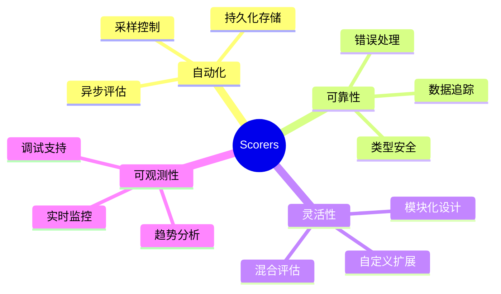

### 使用场景矩阵

| 场景         | 推荐 Scorers                          | 采样率 | 优先级 |
| ------------ | ------------------------------------- | ------ | ------ |
| **生产环境** | Toxicity, Hallucination               | 1.0    | 🔴 高  |
| **质量监控** | Answer Relevancy, Completeness        | 0.5    | 🟡 中  |
| **性能优化** | Context Precision, Tool Call Accuracy | 0.1    | 🟢 低  |
| **A/B 测试** | Custom Scorers                        | 0.5    | 🟡 中  |
| **调试开发** | All Scorers                           | 1.0    | 🔴 高  |

### 快速开始

```bash
# 1. 安装包
npm install @mastra/evals@latest

# 2. 启动开发服务器
npm run dev

# 3. 访问 Playground
# http://localhost:4111

# 4. 查看 Scorers 面板
```

### 下一步

1. **探索内置 Scorers**：从常见评估场景开始
2. **创建自定义 Scorer**：针对业务逻辑定制评估
3. **集成到 CI/CD**：将评估加入自动化测试
4. **分析趋势数据**：持续优化 AI 系统

---

## 参考资源

- **官方文档**: https://mastra.ai/docs/scorers/overview
- **内置 Scorers**: https://mastra.ai/docs/scorers/off-the-shelf-scorers
- **自定义 Scorers**: https://mastra.ai/docs/scorers/custom-scorers
- **Playground**: https://mastra.ai/docs/getting-started/studio
- **示例代码**: https://mastra.ai/docs/examples
