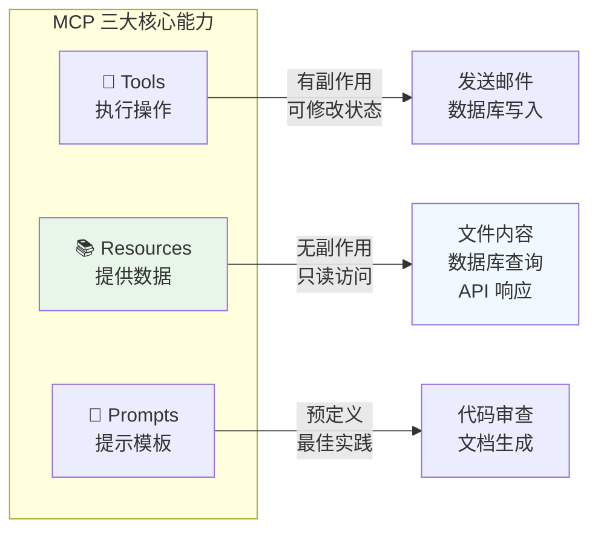
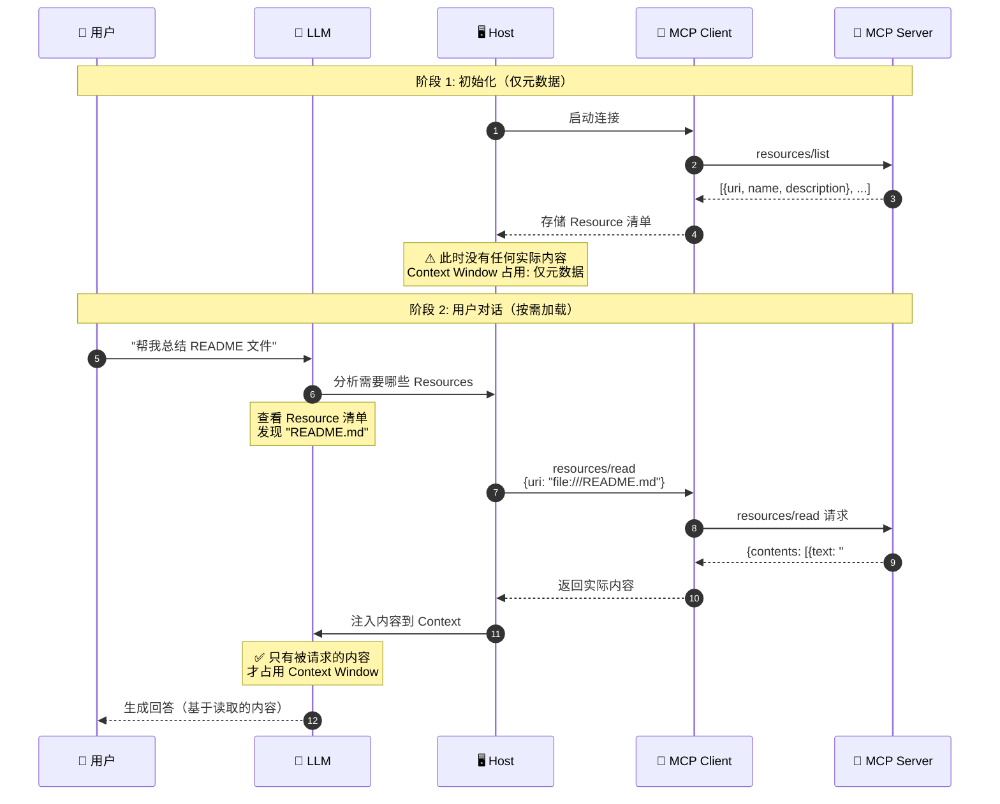
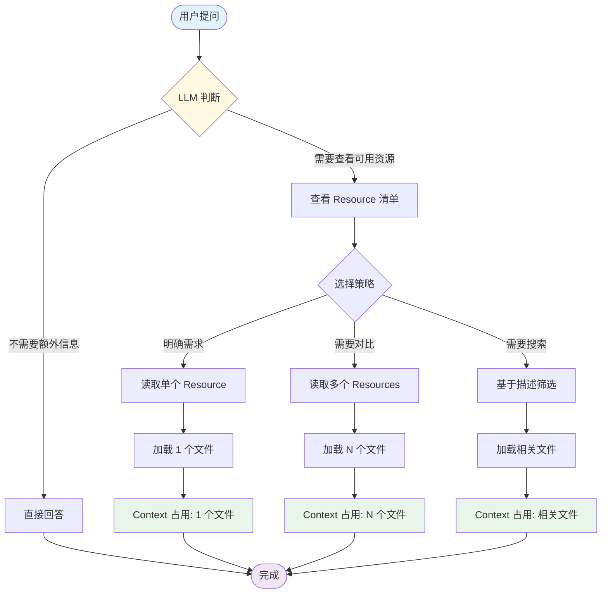
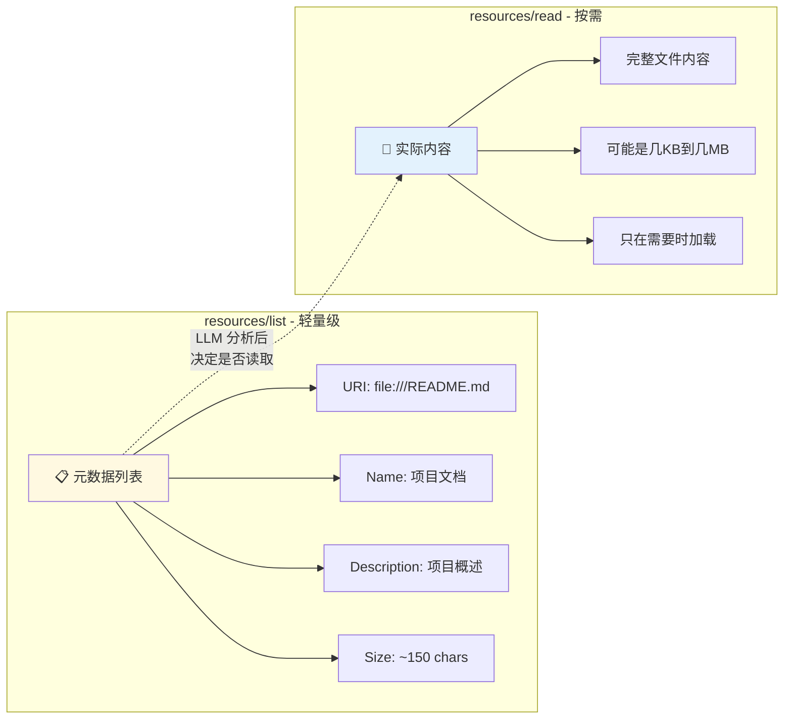
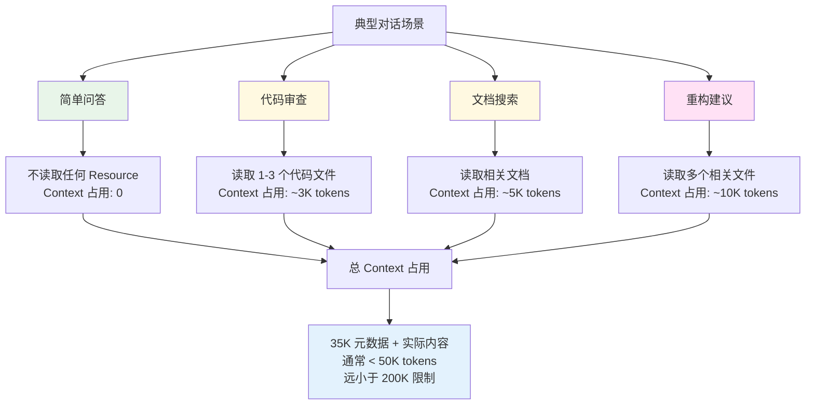
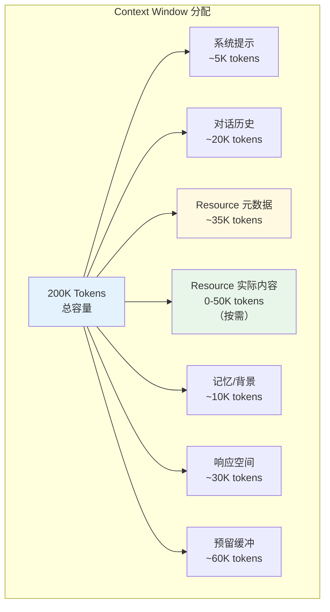
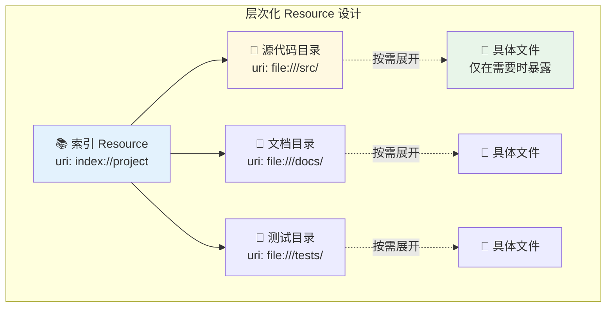
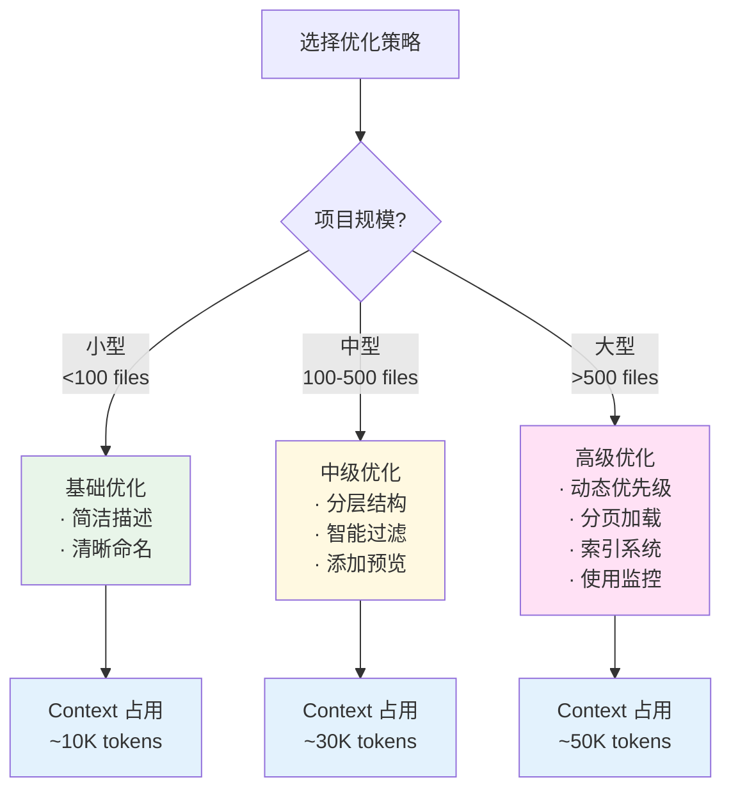
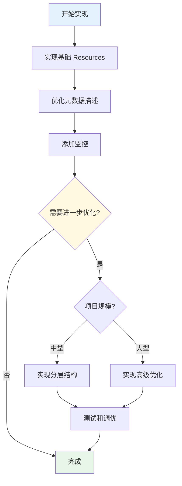

# MCP Resources 加载机制与优化策略完整教程

> 深入理解 MCP Resources 的工作原理、Context Window 管理和性能优化最佳实践

## 目录

- [1. Resources 核心概念](#1-resources-核心概念)
- [2. 加载机制详解](#2-加载机制详解)
- [3. Context Window 管理](#3-context-window-管理)
- [4. 优化策略](#4-优化策略)
- [5. 实战案例](#5-实战案例)
- [6. 最佳实践](#6-最佳实践)
- [7. 监控与调试](#7-监控与调试)

---

## 1. Resources 核心概念

### 1.1 什么是 MCP Resources?

**Resources** 是 MCP 中用于向 AI 提供**上下文信息**的只读数据源。



### 1.2 Resource 的基本结构

```typescript
interface Resource {
  // 唯一标识符（URI 格式）
  uri: string;

  // 人类可读的名称
  name: string;

  // 描述信息（帮助 LLM 理解用途）
  description?: string;

  // MIME 类型
  mimeType?: string;
}
```

**示例**：

```json
{
  "uri": "file:///project/README.md",
  "name": "项目文档",
  "description": "项目概述、安装说明和使用指南",
  "mimeType": "text/markdown"
}
```

### 1.3 两个核心操作

| 操作     | 方法             | 用途         | 返回内容   |
| -------- | ---------------- | ------------ | ---------- |
| **列出** | `resources/list` | 发现可用资源 | 元数据列表 |
| **读取** | `resources/read` | 获取资源内容 | 实际数据   |

---

## 2. 加载机制详解

### 2.1 完整加载流程



### 2.2 按需加载的关键特性



### 2.3 元数据 vs 实际内容



---

## 3. Context Window 管理

### 3.1 Context Window 占用分析

假设你有 **1000 个文件**的项目：

```typescript
// resources/list 返回的元数据
{
  "resources": [
    {
      "uri": "file:///src/app.ts",
      "name": "Application Entry",
      "description": "Main application file",
      "mimeType": "text/typescript"
    },
    // ... 999 more files
  ]
}

// Token 估算:
// - 每个 Resource 元数据: ~35 tokens
// - 1000 个 Resources: ~35,000 tokens
// - Claude 3.5 Sonnet Context: 200,000 tokens
// - 元数据占比: 17.5%
```

**关键点**：元数据占用相对较小，且这是**一次性成本**。

### 3.2 实际使用场景分析



### 3.3 Context Window 使用优先级



---

## 4. 优化策略

### 4.1 策略 1：优化元数据描述

#### ❌ 不好的做法

```json
{
  "uri": "file:///src/utils/stringHelpers.ts",
  "name": "String Helper Functions",
  "description": "This comprehensive utility module contains a wide variety of string manipulation functions including but not limited to case conversion (camelCase, snake_case, kebab-case), trimming operations, padding operations, string truncation with ellipsis support, word counting, character counting, string reversal, palindrome checking, and many other commonly used string operations that are utilized throughout the entire application codebase for consistent string handling..."
  // ❌ 太长！浪费 tokens
}
```

#### ✅ 好的做法

```json
{
  "uri": "file:///src/utils/stringHelpers.ts",
  "name": "String Helpers",
  "description": "String utils: case conversion, trim, truncate, validation",
  "mimeType": "text/typescript"
  // ✅ 简洁、信息密度高
}
```

**优化效果**：

- Before: ~120 tokens
- After: ~25 tokens
- 节省: **79% tokens**

### 4.2 策略 2：分层资源结构



#### 实现代码

```typescript
server.setRequestHandler(ListResourcesRequestSchema, async () => {
  return {
    resources: [
      // 方案 1: 提供高层次概览
      {
        uri: 'index://project-structure',
        name: 'Project Structure Index',
        description: 'High-level project overview and navigation',
        mimeType: 'text/markdown',
      },
      // 方案 2: 分类目录
      {
        uri: 'dir://src',
        name: 'Source Code',
        description: 'Application source code (100+ files)',
        mimeType: 'inode/directory',
      },
      {
        uri: 'dir://docs',
        name: 'Documentation',
        description: 'Project documentation (20+ files)',
        mimeType: 'inode/directory',
      },
    ],
  };
});

server.setRequestHandler(ReadResourceRequestSchema, async (request) => {
  const { uri } = request.params;

  // 读取索引时返回结构化导航
  if (uri === 'index://project-structure') {
    return {
      contents: [
        {
          uri: uri,
          mimeType: 'text/markdown',
          text: `# Project Structure

## 📁 Core Directories

### Source Code (\`dir://src\`)
- **Main Application**: src/app.ts
- **API Routes**: src/routes/ (25 files)
- **Business Logic**: src/services/ (15 files)
- **Data Models**: src/models/ (20 files)

### Documentation (\`dir://docs\`)
- **User Guides**: docs/guides/ (8 files)
- **API Docs**: docs/api/ (12 files)
- **Architecture**: docs/architecture.md

### Tests (\`dir://tests\`)
- **Unit Tests**: tests/unit/ (50+ files)
- **Integration Tests**: tests/integration/ (20 files)

## 🔑 Key Files
- README.md: Project overview
- package.json: Dependencies
- tsconfig.json: TypeScript config
        `,
        },
      ],
    };
  }

  // 读取目录时返回文件列表
  if (uri === 'dir://src') {
    const files = await listDirectory('./src');
    return {
      contents: [
        {
          uri: uri,
          mimeType: 'application/json',
          text: JSON.stringify(
            {
              type: 'directory',
              path: './src',
              files: files.map((f) => ({
                uri: `file:///${f.path}`,
                name: f.name,
                type: f.type,
                size: f.size,
              })),
            },
            null,
            2,
          ),
        },
      ],
    };
  }

  // 读取实际文件
  return {
    contents: [
      {
        uri: uri,
        mimeType: getMimeType(uri),
        text: await readFile(uri),
      },
    ],
  };
});
```

### 4.3 策略 3：智能过滤和分页

```typescript
interface ListResourcesRequest {
  // 扩展 MCP 标准，添加过滤参数
  filter?: {
    type?: string; // 文件类型过滤
    tags?: string[]; // 标签过滤
    search?: string; // 搜索关键词
    limit?: number; // 限制数量
    offset?: number; // 分页偏移
  };
}

server.setRequestHandler(ListResourcesRequestSchema, async (request) => {
  let allResources = await getAllResources();

  // 应用过滤
  const { filter } = request.params || {};

  if (filter?.type) {
    allResources = allResources.filter((r) => r.mimeType?.includes(filter.type));
  }

  if (filter?.search) {
    allResources = allResources.filter(
      (r) =>
        r.name.toLowerCase().includes(filter.search.toLowerCase()) ||
        r.description?.toLowerCase().includes(filter.search.toLowerCase()),
    );
  }

  // 应用分页
  const limit = filter?.limit || 50; // 默认返回前 50 个
  const offset = filter?.offset || 0;

  const paginatedResources = allResources.slice(offset, offset + limit);

  return {
    resources: paginatedResources,
    // 可选：提供总数和分页信息
    _meta: {
      total: allResources.length,
      limit: limit,
      offset: offset,
      hasMore: offset + limit < allResources.length,
    },
  };
});
```

### 4.4 策略 4：动态优先级

```typescript
class ResourceManager {
  private accessCount = new Map<string, number>();
  private lastAccess = new Map<string, Date>();

  // 记录访问
  recordAccess(uri: string) {
    this.accessCount.set(uri, (this.accessCount.get(uri) || 0) + 1);
    this.lastAccess.set(uri, new Date());
  }

  // 计算资源优先级
  calculatePriority(resource: Resource): number {
    let priority = 0;

    // 1. 访问频率（0-50 分）
    const accessCount = this.accessCount.get(resource.uri) || 0;
    priority += Math.min(accessCount * 10, 50);

    // 2. 最近访问（0-30 分）
    const lastAccess = this.lastAccess.get(resource.uri);
    if (lastAccess) {
      const hoursSinceAccess = (Date.now() - lastAccess.getTime()) / (1000 * 60 * 60);
      priority += Math.max(30 - hoursSinceAccess, 0);
    }

    // 3. 文件类型（0-20 分）
    if (resource.name.toLowerCase().includes('readme')) {
      priority += 20;
    } else if (resource.mimeType?.includes('typescript')) {
      priority += 15;
    }

    return priority;
  }

  // 获取排序后的资源列表
  async getResourcesByPriority(limit = 100): Promise<Resource[]> {
    const allResources = await this.getAllResources();

    return allResources
      .map((r) => ({ resource: r, priority: this.calculatePriority(r) }))
      .sort((a, b) => b.priority - a.priority)
      .slice(0, limit)
      .map((item) => item.resource);
  }
}

const resourceManager = new ResourceManager();

server.setRequestHandler(ListResourcesRequestSchema, async () => {
  // 返回高优先级的资源
  const prioritizedResources = await resourceManager.getResourcesByPriority(100);

  return { resources: prioritizedResources };
});

server.setRequestHandler(ReadResourceRequestSchema, async (request) => {
  // 记录访问
  resourceManager.recordAccess(request.params.uri);

  // 读取并返回内容
  return await readResourceContent(request.params.uri);
});
```

### 4.5 策略 5：内容摘要和预览

```typescript
interface ResourceWithPreview extends Resource {
  preview?: string; // 前 200 字符的预览
  stats?: {
    size: number;
    lines?: number;
    language?: string;
  };
}

server.setRequestHandler(ListResourcesRequestSchema, async () => {
  const resources = await getAllResources();

  return {
    resources: await Promise.all(
      resources.map(async (r) => {
        // 为文本文件添加预览
        if (r.mimeType?.startsWith('text/')) {
          const content = await readFile(r.uri);
          return {
            ...r,
            preview: content.substring(0, 200) + '...',
            stats: {
              size: content.length,
              lines: content.split('\n').length,
              language: detectLanguage(r.uri),
            },
          };
        }
        return r;
      }),
    ),
  };
});
```

### 4.6 策略对比总结



---

## 5. 实战案例

### 5.1 案例 1：代码仓库 MCP Server

**场景**：一个有 500+ 文件的代码仓库

```typescript
import { Server } from '@modelcontextprotocol/sdk/server/index.js';
import {
  ListResourcesRequestSchema,
  ReadResourceRequestSchema,
} from '@modelcontextprotocol/sdk/types.js';
import * as fs from 'fs/promises';
import * as path from 'path';

class CodebaseServer {
  private server: Server;
  private projectRoot: string;
  private indexCache: Map<string, any> = new Map();

  constructor(projectRoot: string) {
    this.projectRoot = projectRoot;
    this.server = new Server(
      { name: 'codebase-server', version: '1.0.0' },
      { capabilities: { resources: { subscribe: true } } },
    );

    this.setupHandlers();
  }

  private setupHandlers() {
    // 策略 1: 提供分层资源
    this.server.setRequestHandler(ListResourcesRequestSchema, async () => {
      return {
        resources: [
          // 索引资源
          {
            uri: 'index://project',
            name: 'Project Index',
            description: 'Navigate project structure',
            mimeType: 'text/markdown',
          },
          // 重要文件（根据访问频率）
          ...(await this.getTopFiles(20)),
          // 目录入口
          ...this.getDirectoryEntries(),
        ],
      };
    });

    this.server.setRequestHandler(ReadResourceRequestSchema, async (request) => {
      const { uri } = request.params;

      // 处理索引请求
      if (uri === 'index://project') {
        return await this.generateProjectIndex();
      }

      // 处理目录请求
      if (uri.startsWith('dir://')) {
        return await this.listDirectory(uri);
      }

      // 处理文件请求
      return await this.readFile(uri);
    });
  }

  private async generateProjectIndex() {
    const structure = await this.analyzeStructure();

    return {
      contents: [
        {
          uri: 'index://project',
          mimeType: 'text/markdown',
          text: `# Project Structure

## 📊 Statistics
- Total Files: ${structure.totalFiles}
- Lines of Code: ${structure.totalLines}
- Languages: ${structure.languages.join(', ')}

## 📁 Main Directories

${structure.directories
  .map(
    (dir) => `
### ${dir.name}
- Files: ${dir.fileCount}
- Purpose: ${dir.description}
- Key Files: ${dir.keyFiles.join(', ')}
`,
  )
  .join('\n')}

## 🔑 Important Files

${structure.importantFiles
  .map(
    (file) => `
- **${file.name}**: ${file.description}
`,
  )
  .join('\n')}

## 💡 Quick Start
1. Start with README.md for overview
2. Check src/app.ts for entry point
3. See docs/ for detailed documentation
        `,
        },
      ],
    };
  }

  private async getTopFiles(limit: number) {
    // 基于访问频率和重要性
    const importantPatterns = [
      'README.md',
      'package.json',
      'tsconfig.json',
      'src/index',
      'src/app',
      'src/main',
    ];

    const allFiles = await this.scanFiles();

    return allFiles
      .filter((f) =>
        importantPatterns.some((pattern) => f.path.toLowerCase().includes(pattern.toLowerCase())),
      )
      .slice(0, limit)
      .map((f) => ({
        uri: `file://${f.path}`,
        name: path.basename(f.path),
        description: this.generateDescription(f),
        mimeType: this.getMimeType(f.path),
      }));
  }

  private getDirectoryEntries() {
    return [
      {
        uri: 'dir://src',
        name: 'Source Code',
        description: 'Application source code',
        mimeType: 'inode/directory',
      },
      {
        uri: 'dir://docs',
        name: 'Documentation',
        description: 'Project documentation',
        mimeType: 'inode/directory',
      },
      {
        uri: 'dir://tests',
        name: 'Tests',
        description: 'Test files',
        mimeType: 'inode/directory',
      },
    ];
  }

  private async listDirectory(uri: string) {
    const dirPath = uri.replace('dir://', '');
    const fullPath = path.join(this.projectRoot, dirPath);

    const entries = await fs.readdir(fullPath, { withFileTypes: true });

    const fileList = entries.map((entry) => ({
      name: entry.name,
      type: entry.isDirectory() ? 'directory' : 'file',
      uri: entry.isDirectory()
        ? `dir://${path.join(dirPath, entry.name)}`
        : `file://${path.join(dirPath, entry.name)}`,
    }));

    return {
      contents: [
        {
          uri: uri,
          mimeType: 'application/json',
          text: JSON.stringify({ path: dirPath, entries: fileList }, null, 2),
        },
      ],
    };
  }

  private async readFile(uri: string) {
    const filePath = uri.replace('file://', '');
    const fullPath = path.join(this.projectRoot, filePath);

    const content = await fs.readFile(fullPath, 'utf-8');

    return {
      contents: [
        {
          uri: uri,
          mimeType: this.getMimeType(filePath),
          text: content,
        },
      ],
    };
  }

  private getMimeType(filePath: string): string {
    const ext = path.extname(filePath);
    const mimeMap: Record<string, string> = {
      '.ts': 'text/typescript',
      '.js': 'text/javascript',
      '.json': 'application/json',
      '.md': 'text/markdown',
      '.txt': 'text/plain',
    };
    return mimeMap[ext] || 'text/plain';
  }

  private generateDescription(file: any): string {
    // 基于文件名和位置生成描述
    const fileName = path.basename(file.path);
    const dirName = path.dirname(file.path);

    if (fileName === 'README.md') return 'Project documentation';
    if (fileName === 'package.json') return 'NPM dependencies';
    if (fileName.includes('test')) return 'Test file';
    if (dirName.includes('src')) return 'Source code file';
    if (dirName.includes('docs')) return 'Documentation file';

    return `File in ${dirName}`;
  }

  private async analyzeStructure() {
    // 缓存分析结果
    if (this.indexCache.has('structure')) {
      return this.indexCache.get('structure');
    }

    // 分析项目结构
    const structure = {
      totalFiles: 0,
      totalLines: 0,
      languages: [] as string[],
      directories: [] as any[],
      importantFiles: [] as any[],
    };

    // ... 实现分析逻辑

    this.indexCache.set('structure', structure);
    return structure;
  }

  private async scanFiles() {
    // 实现文件扫描
    return [];
  }
}

// 使用
const server = new CodebaseServer('/path/to/project');
```

### 5.2 案例 2：文档库 MCP Server

```typescript
class DocumentationServer {
  private documents: Map<string, Document> = new Map();

  async initialize() {
    // 索引所有文档
    await this.indexDocuments();
  }

  getResourceList() {
    return {
      resources: [
        // 提供搜索入口
        {
          uri: 'search://docs',
          name: 'Documentation Search',
          description: 'Search through all documentation',
          mimeType: 'application/json',
        },
        // 按主题分类
        {
          uri: 'category://getting-started',
          name: 'Getting Started',
          description: 'Beginner guides and tutorials',
          mimeType: 'text/markdown',
        },
        {
          uri: 'category://api-reference',
          name: 'API Reference',
          description: 'Detailed API documentation',
          mimeType: 'text/markdown',
        },
        // 最常访问的文档
        ...this.getMostAccessedDocs(10),
      ],
    };
  }

  async readResource(uri: string, query?: string) {
    // 处理搜索
    if (uri === 'search://docs' && query) {
      return this.searchDocuments(query);
    }

    // 处理分类
    if (uri.startsWith('category://')) {
      return this.getDocsByCategory(uri);
    }

    // 读取具体文档
    return this.getDocument(uri);
  }

  private async searchDocuments(query: string) {
    // 实现全文搜索
    const results = Array.from(this.documents.values())
      .filter((doc) => doc.title.includes(query) || doc.content.includes(query))
      .slice(0, 10);

    return {
      contents: [
        {
          uri: 'search://docs',
          mimeType: 'application/json',
          text: JSON.stringify(
            {
              query: query,
              results: results.map((r) => ({
                uri: r.uri,
                title: r.title,
                excerpt: this.getExcerpt(r.content, query),
              })),
            },
            null,
            2,
          ),
        },
      ],
    };
  }

  private getExcerpt(content: string, query: string, length = 200): string {
    const index = content.toLowerCase().indexOf(query.toLowerCase());
    if (index === -1) return content.substring(0, length);

    const start = Math.max(0, index - 50);
    const end = Math.min(content.length, index + query.length + 150);

    return '...' + content.substring(start, end) + '...';
  }
}
```

---

## 6. 最佳实践

### 6.1 资源命名规范

```typescript
// ✅ 好的 URI 命名
const goodURIs = [
  'file:///absolute/path/to/file.ts', // 文件：使用绝对路径
  'index://project-structure', // 索引：使用描述性名称
  'dir://src/components', // 目录：清晰的路径
  'search://keywords', // 搜索：功能性描述
  'category://api-reference', // 分类：语义化
];

// ❌ 不好的 URI 命名
const badURIs = [
  'file.ts', // ❌ 相对路径
  'resource1', // ❌ 无意义
  'doc', // ❌ 太泛
];
```

### 6.2 描述编写指南

```typescript
interface DescriptionGuidelines {
  // ✅ 好的描述
  good: {
    concise: 'API routes for user management';
    informative: 'Configuration file (DB connection, API keys)';
    contextual: 'Main entry point - bootstraps application';
  };

  // ❌ 不好的描述
  bad: {
    tooLong: 'This is a very important file that contains...'; // 太长
    tooVague: 'A file'; // 太泛
    redundant: 'File containing code'; // 冗余
  };
}

// 描述模板
function generateDescription(file: FileInfo): string {
  const templates = {
    config: `Configuration: ${file.purpose}`,
    api: `API endpoint: ${file.resource}`,
    test: `Tests for ${file.target}`,
    util: `Utility: ${file.functions.join(', ')}`,
    doc: `Documentation: ${file.topic}`,
  };

  return templates[file.type] || file.name;
}
```

### 6.3 性能检查清单

```markdown
## Resource 性能检查清单

### 元数据优化

- [ ] 描述长度 < 100 字符
- [ ] URI 使用标准格式
- [ ] MIME 类型正确设置
- [ ] 资源总数 < 1000（或使用分页）

### 结构优化

- [ ] 提供索引/导航 Resource
- [ ] 实现分层结构
- [ ] 常用资源优先级高
- [ ] 相关资源分组

### 加载优化

- [ ] 实现按需加载
- [ ] 使用内容缓存
- [ ] 提供内容预览
- [ ] 监控读取频率

### 用户体验

- [ ] 资源易于发现
- [ ] 描述清晰有用
- [ ] 响应速度快 (< 1s)
- [ ] 错误处理完善
```

### 6.4 错误处理

```typescript
server.setRequestHandler(ReadResourceRequestSchema, async (request) => {
  try {
    const { uri } = request.params;

    // 验证 URI
    if (!uri || !uri.startsWith('file://')) {
      throw new Error(`Invalid URI: ${uri}`);
    }

    // 检查文件是否存在
    const filePath = uri.replace('file://', '');
    if (!(await fileExists(filePath))) {
      throw new Error(`File not found: ${filePath}`);
    }

    // 检查文件大小
    const stats = await fs.stat(filePath);
    if (stats.size > 10 * 1024 * 1024) {
      // 10MB
      throw new Error(`File too large: ${stats.size} bytes`);
    }

    // 读取文件
    const content = await fs.readFile(filePath, 'utf-8');

    return {
      contents: [
        {
          uri: uri,
          mimeType: getMimeType(filePath),
          text: content,
        },
      ],
    };
  } catch (error) {
    console.error('Error reading resource:', error);

    // 返回友好的错误信息
    return {
      contents: [
        {
          uri: request.params.uri,
          mimeType: 'text/plain',
          text: `Error: ${error.message}\n\nPlease check the URI and try again.`,
        },
      ],
      isError: true,
    };
  }
});
```

---

## 7. 监控与调试

### 7.1 使用监控

```typescript
class ResourceMonitor {
  private metrics = {
    listCalls: 0,
    readCalls: 0,
    totalBytesRead: 0,
    resourceAccess: new Map<string, number>(),
    readTime: new Map<string, number[]>(),
  };

  recordListCall() {
    this.metrics.listCalls++;
  }

  recordReadCall(uri: string, bytes: number, timeMs: number) {
    this.metrics.readCalls++;
    this.metrics.totalBytesRead += bytes;

    // 记录访问次数
    const count = this.metrics.resourceAccess.get(uri) || 0;
    this.metrics.resourceAccess.set(uri, count + 1);

    // 记录读取时间
    const times = this.metrics.readTime.get(uri) || [];
    times.push(timeMs);
    this.metrics.readTime.set(uri, times);
  }

  getReport() {
    const topResources = Array.from(this.metrics.resourceAccess.entries())
      .sort((a, b) => b[1] - a[1])
      .slice(0, 10);

    return {
      summary: {
        totalListCalls: this.metrics.listCalls,
        totalReadCalls: this.metrics.readCalls,
        totalBytesRead: this.metrics.totalBytesRead,
        avgBytesPerRead: this.metrics.totalBytesRead / this.metrics.readCalls,
      },
      topResources: topResources.map(([uri, count]) => ({
        uri,
        accessCount: count,
        avgReadTime: this.getAvgReadTime(uri),
      })),
      performance: {
        slowestReads: this.getSlowestReads(5),
      },
    };
  }

  private getAvgReadTime(uri: string): number {
    const times = this.metrics.readTime.get(uri) || [];
    return times.reduce((a, b) => a + b, 0) / times.length;
  }

  private getSlowestReads(limit: number) {
    return Array.from(this.metrics.readTime.entries())
      .map(([uri, times]) => ({
        uri,
        maxTime: Math.max(...times),
        avgTime: times.reduce((a, b) => a + b, 0) / times.length,
      }))
      .sort((a, b) => b.maxTime - a.maxTime)
      .slice(0, limit);
  }
}

const monitor = new ResourceMonitor();

// 在 handlers 中使用
server.setRequestHandler(ListResourcesRequestSchema, async () => {
  monitor.recordListCall();
  // ... 实现
});

server.setRequestHandler(ReadResourceRequestSchema, async (request) => {
  const startTime = Date.now();
  const result = await readResourceContent(request.params.uri);
  const endTime = Date.now();

  monitor.recordReadCall(request.params.uri, result.contents[0].text.length, endTime - startTime);

  return result;
});

// 定期输出报告
setInterval(() => {
  console.log('📊 Resource Usage Report:');
  console.log(JSON.stringify(monitor.getReport(), null, 2));
}, 60000); // 每分钟
```

### 7.2 调试工具

```typescript
class ResourceDebugger {
  private logs: Array<{
    timestamp: Date;
    type: 'list' | 'read';
    uri?: string;
    duration: number;
    size?: number;
  }> = [];

  logListCall(duration: number) {
    this.logs.push({
      timestamp: new Date(),
      type: 'list',
      duration,
    });
  }

  logReadCall(uri: string, duration: number, size: number) {
    this.logs.push({
      timestamp: new Date(),
      type: 'read',
      uri,
      duration,
      size,
    });
  }

  analyze() {
    return {
      totalCalls: this.logs.length,
      listCalls: this.logs.filter((l) => l.type === 'list').length,
      readCalls: this.logs.filter((l) => l.type === 'read').length,
      avgDuration: this.logs.reduce((sum, l) => sum + l.duration, 0) / this.logs.length,
      totalDataRead: this.logs.filter((l) => l.size).reduce((sum, l) => sum + (l.size || 0), 0),
      timeline: this.logs.slice(-20), // 最近 20 条
    };
  }

  exportLogs(filepath: string) {
    fs.writeFileSync(filepath, JSON.stringify(this.logs, null, 2));
  }
}
```

---

## 总结

### 关键要点

1. **Resources 是按需加载的**

   - ✅ resources/list 只返回元数据（轻量）
   - ✅ resources/read 按需读取内容（重量）
   - ✅ 不会预加载所有内容

2. **Context Window 不会被浪费**

   - ✅ 元数据占用相对较小（~17% 对于 1000 文件）
   - ✅ 只有被请求的内容才占用 Context
   - ✅ LLM 智能选择需要的资源

3. **优化策略分层应用**

   - 小项目：基础优化（简洁描述）
   - 中项目：分层结构 + 过滤
   - 大项目：动态优先级 + 索引 + 监控

4. **信任 LLM 的智能**
   - LLM 擅长从元数据中选择相关资源
   - 不需要过度优化
   - 关注用户体验和响应速度

### 推荐实践路径



### 参考资源

- 📘 [MCP 官方规范](https://modelcontextprotocol.io/specification)
- 🔧 [MCP Inspector](https://github.com/modelcontextprotocol/inspector)
- 💻 [MCP TypeScript SDK](https://github.com/modelcontextprotocol/typescript-sdk)
- 📚 [示例 MCP Servers](https://github.com/modelcontextprotocol/servers)

---

**本教程最后更新：2025-11**
