# Model Context Protocol (MCP) 完整教程

> 本教程基于 MCP 官方规范，涵盖核心概念、架构设计、实现指南和最佳实践

## 目录

- [1. MCP 简介](#1-mcp-简介)
- [2. 核心概念](#2-核心概念)
- [3. 系统架构](#3-系统架构)
- [4. 核心组件详解](#4-核心组件详解)
- [5. 协议工作流程](#5-协议工作流程)
- [6. 传输层](#6-传输层)
- [7. 能力协商机制](#7-能力协商机制)
- [8. 实现指南](#8-实现指南)
- [9. 最佳实践](#9-最佳实践)
- [10. 实战示例](#10-实战示例)

---

## 1. MCP 简介

### 1.1 什么是 MCP?

**Model Context Protocol (MCP)** 是由 Anthropic 在 2024 年 11 月发布的开放标准协议，旨在**标准化 AI 应用与外部数据源、工具和系统之间的连接方式**。

### 1.2 为什么需要 MCP?

#### 问题背景：M×N 集成困境

在 MCP 之前，如果你有：

- **M 个 AI 应用**（Claude、ChatGPT、IDE 助手等）
- **N 个工具/系统**（GitHub、Slack、数据库等）

你需要构建 **M×N 个不同的集成**，导致：

- ❌ 重复开发工作
- ❌ 不一致的实现
- ❌ 维护成本高
- ❌ 难以扩展

#### MCP 的解决方案：M+N 模式

```mermaid
graph LR
    subgraph "传统方式 (M×N)"
        A1[AI App 1] -.-> T1[Tool 1]
        A1 -.-> T2[Tool 2]
        A1 -.-> T3[Tool 3]
        A2[AI App 2] -.-> T1
        A2 -.-> T2
        A2 -.-> T3
        A3[AI App 3] -.-> T1
        A3 -.-> T2
        A3 -.-> T3
    end

    subgraph "MCP 方式 (M+N)"
        B1[AI App 1] --> MCP1[MCP]
        B2[AI App 2] --> MCP1
        B3[AI App 3] --> MCP1
        MCP1 --> S1[Server 1]
        MCP1 --> S2[Server 2]
        MCP1 --> S3[Server 3]
    end
```

通过 MCP：

- ✅ **工具开发者**：只需构建 N 个 MCP Server
- ✅ **应用开发者**：只需构建 M 个 MCP Client
- ✅ **总集成数**：M + N（而非 M×N）

### 1.3 MCP 的核心特性

| 特性              | 说明                             |
| ----------------- | -------------------------------- |
| 🌐 **开放标准**   | 详细的规范文档，任何人都可以实现 |
| 🔌 **通用连接器** | 类似 AI 系统的 USB-C 接口        |
| 🔒 **安全可控**   | 支持 OAuth 2.1、权限管理         |
| 🔄 **双向通信**   | 基于 JSON-RPC 2.0 的消息传递     |
| 📦 **模块化设计** | 可选择性实现不同功能             |
| 🚀 **生态系统**   | 丰富的 SDK 和预构建服务器        |

### 1.4 MCP 类比

可以将 MCP 理解为：

- **USB-C 端口**：统一的连接标准
- **HTTP 协议**：用于 Web 的标准通信协议
- **LSP (Language Server Protocol)**：IDE 与编程语言的标准接口

---

## 2. 核心概念

### 2.1 三大核心术语

```mermaid
graph TB
    subgraph "MCP 生态系统"
        Host["🖥️ Host<br/>(宿主应用)"]
        Client1["📱 Client 1<br/>(会话管理器)"]
        Client2["📱 Client 2<br/>(会话管理器)"]
        Client3["📱 Client 3<br/>(会话管理器)"]
        Server1["🔧 Server 1<br/>(工具提供者)"]
        Server2["📚 Server 2<br/>(数据提供者)"]
        Server3["🌐 Server 3<br/>(外部服务)"]

        Host --> Client1
        Host --> Client2
        Host --> Client3

        Client1 <-->|1:1| Server1
        Client2 <-->|1:1| Server2
        Client3 <-->|1:1| Server3
    end

    style Host fill:#e1f5ff
    style Client1 fill:#fff4e1
    style Client2 fill:#fff4e1
    style Client3 fill:#fff4e1
    style Server1 fill:#e8f5e9
    style Server2 fill:#e8f5e9
    style Server3 fill:#e8f5e9
```

#### **Host（宿主）**

- 用户直接交互的应用程序
- 协调整个系统，管理 LLM 交互
- 示例：Claude Desktop、Cursor IDE、Windsurf

#### **Client（客户端）**

- 存在于 Host 内部的连接管理器
- 与单个 Server 保持 **1:1 关系**
- 负责会话管理、错误处理、重连机制

#### **Server（服务器）**

- 通过标准化 API 暴露功能的外部程序
- 提供 **Tools**、**Resources** 和 **Prompts**
- 可以是本地进程或远程 HTTP 服务

### 2.2 三大核心能力

```mermaid
graph LR
    subgraph "MCP Server 提供的能力"
        Tools["🔧 Tools<br/>(工具)<br/>模型控制"]
        Resources["📚 Resources<br/>(资源)<br/>应用控制"]
        Prompts["💬 Prompts<br/>(提示模板)<br/>用户控制"]
    end

    Tools --> |"执行操作<br/>有副作用"| Example1["天气 API<br/>数据库写入<br/>发送邮件"]
    Resources --> |"读取数据<br/>无副作用"| Example2["文件内容<br/>数据库查询<br/>API 响应"]
    Prompts --> |"预定义模板<br/>最佳实践"| Example3["代码审查<br/>文档生成<br/>数据分析"]

    style Tools fill:#ffebee
    style Resources fill:#e8f5e9
    style Prompts fill:#e3f2fd
```

#### **Tools（工具）- 模型控制**

AI 模型决定何时调用的**可执行函数**，通常有副作用。

**示例：**

```json
{
  "name": "send_email",
  "description": "发送邮件给指定收件人",
  "inputSchema": {
    "type": "object",
    "properties": {
      "to": { "type": "string" },
      "subject": { "type": "string" },
      "body": { "type": "string" }
    },
    "required": ["to", "subject", "body"]
  }
}
```

#### **Resources（资源）- 应用控制**

应用提供给 AI 的**只读数据源**，类似 REST API 的 GET 端点。

**示例：**

```json
{
  "uri": "file:///project/README.md",
  "name": "项目文档",
  "description": "项目的 README 文件",
  "mimeType": "text/markdown"
}
```

#### **Prompts（提示模板）- 用户控制**

用户可以调用的**预定义提示模板**，封装最佳实践。

**示例：**

```json
{
  "name": "code_review",
  "description": "对代码进行详细审查",
  "arguments": [
    {
      "name": "code",
      "description": "需要审查的代码",
      "required": true
    }
  ]
}
```

---

## 3. 系统架构

### 3.1 整体架构图

```mermaid
graph TB
    subgraph "Host Application Process"
        User["👤 用户"]
        LLM["🤖 LLM<br/>(AI 模型)"]
        Host["🖥️ Host<br/>(协调器)"]

        User <--> Host
        Host <--> LLM

        subgraph "Client Layer"
            C1["📱 Client 1"]
            C2["📱 Client 2"]
            C3["📱 Client 3"]
        end

        Host --> C1
        Host --> C2
        Host --> C3
    end

    subgraph "Local Machine"
        S1["🔧 Server 1<br/>Files & Git"]
        S2["💾 Server 2<br/>Database"]
        R1[("📁 Local<br/>Resource A")]
        R2[("📁 Local<br/>Resource B")]

        C1 <-->|stdio| S1
        C2 <-->|stdio| S2
        S1 <--> R1
        S2 <--> R2
    end

    subgraph "Remote Internet"
        S3["🌐 Server 3<br/>External APIs"]
        R3[("☁️ Remote<br/>Resource C")]

        C3 <-->|Streamable HTTP| S3
        S3 <--> R3
    end

    style Host fill:#e1f5ff
    style LLM fill:#ffe1f5
    style User fill:#fff4e1
    style C1 fill:#fff9e1
    style C2 fill:#fff9e1
    style C3 fill:#fff9e1
    style S1 fill:#e8f5e9
    style S2 fill:#e8f5e9
    style S3 fill:#e8f5e9
```

### 3.2 Client-Host-Server 架构

```mermaid
sequenceDiagram
    participant User as 👤 用户
    participant Host as 🖥️ Host
    participant Client as 📱 Client
    participant Server as 🔧 Server
    participant Resource as 📚 Resource

    User->>Host: 1. 发起请求
    Host->>Client: 2. 初始化客户端
    Client->>Server: 3. 建立连接<br/>协商能力
    Server-->>Client: 4. 返回能力列表
    Client-->>Host: 5. 报告可用功能

    Note over Host,Server: 活跃会话

    User->>Host: 6. 用户操作
    Host->>Client: 7. 请求工具/资源
    Client->>Server: 8. JSON-RPC 请求
    Server->>Resource: 9. 访问数据
    Resource-->>Server: 10. 返回数据
    Server-->>Client: 11. JSON-RPC 响应
    Client-->>Host: 12. 更新 UI
    Host-->>User: 13. 展示结果
```

### 3.3 分层架构

```mermaid
graph TB
    subgraph "应用层"
        A1["用户界面 (UI)"]
        A2["AI 模型交互"]
        A3["应用逻辑"]
    end

    subgraph "MCP 协议层"
        B1["能力协商"]
        B2["会话管理"]
        B3["消息路由"]
    end

    subgraph "传输层"
        C1["stdio<br/>(本地)"]
        C2["Streamable HTTP<br/>(远程)"]
    end

    subgraph "服务层"
        D1["Tools API"]
        D2["Resources API"]
        D3["Prompts API"]
    end

    subgraph "数据层"
        E1["文件系统"]
        E2["数据库"]
        E3["外部 API"]
    end

    A1 --> B1
    A2 --> B2
    A3 --> B3

    B1 --> C1
    B2 --> C1
    B3 --> C2

    C1 --> D1
    C2 --> D2
    C2 --> D3

    D1 --> E1
    D2 --> E2
    D3 --> E3

    style A1 fill:#e1f5ff
    style B1 fill:#fff4e1
    style C1 fill:#e8f5e9
    style D1 fill:#f3e5f5
    style E1 fill:#fce4ec
```

---

## 4. 核心组件详解

### 4.1 Host（宿主应用）

**职责：**

1. **用户交互界面**：处理用户输入和展示结果
2. **LLM 集成**：管理与 AI 模型的通信
3. **Client 管理**：初始化和协调多个 Client
4. **安全边界**：维护明确的安全边界和权限控制

**常见 Host 示例：**

- **Claude Desktop**：Anthropic 的桌面应用
- **Cursor IDE**：AI 驱动的代码编辑器
- **Windsurf**：智能开发环境
- **IBM BeeAI**：企业级 AI 助手

### 4.2 Client（客户端）

**职责：**

1. **连接管理**：维护与 Server 的 1:1 连接
2. **消息转换**：将 MCP 消息转换为 JSON-RPC 格式
3. **会话管理**：处理中断、超时、重连
4. **能力发现**：查询和缓存 Server 能力

**Client 生命周期：**

```mermaid
stateDiagram-v2
    [*] --> Disconnected
    Disconnected --> Connecting: connect()
    Connecting --> Connected: 握手成功
    Connecting --> Error: 连接失败
    Connected --> Active: 能力协商完成
    Active --> Active: 请求处理中
    Active --> Reconnecting: 连接断开
    Reconnecting --> Connected: 重连成功
    Reconnecting --> Error: 重连失败
    Error --> Disconnected: 关闭连接
    Active --> [*]: close()
```

### 4.3 Server（服务器）

**职责：**

1. **能力暴露**：声明支持的 Tools、Resources、Prompts
2. **请求处理**：执行工具调用、返回资源数据
3. **状态管理**：维护会话状态（如果需要）
4. **安全验证**：实现认证和授权逻辑

**Server 类型：**

| 类型            | 传输方式   | 使用场景           | 示例               |
| --------------- | ---------- | ------------------ | ------------------ |
| **本地 Server** | stdio      | 本地工具、文件系统 | Git 操作、文件读写 |
| **远程 Server** | HTTP       | 云服务、外部 API   | GitHub API、Slack  |
| **混合 Server** | 两者都支持 | 灵活部署           | 数据库服务器       |

---

## 5. 协议工作流程

### 5.1 完整通信流程

```mermaid
sequenceDiagram
    autonumber
    participant Host as 🖥️ Host
    participant Client as 📱 Client
    participant Server as 🔧 Server

    Note over Host,Server: 阶段 1: 初始化

    Host->>Client: 创建 Client 实例
    Client->>Server: initialize 请求<br/>{protocolVersion, capabilities}
    Server-->>Client: InitializeResult<br/>{serverInfo, capabilities}
    Client->>Server: initialized 通知

    Note over Host,Server: 阶段 2: 能力发现

    Client->>Server: tools/list 请求
    Server-->>Client: 返回可用工具列表
    Client->>Server: resources/list 请求
    Server-->>Client: 返回可用资源列表
    Client->>Server: prompts/list 请求
    Server-->>Client: 返回可用提示模板

    Note over Host,Server: 阶段 3: 活跃会话

    Host->>Client: 用户请求执行工具
    Client->>Server: tools/call 请求<br/>{name, arguments}
    Server-->>Client: 工具执行结果
    Client-->>Host: 更新 UI

    Host->>Client: 请求读取资源
    Client->>Server: resources/read 请求<br/>{uri}
    Server-->>Client: 资源内容
    Client-->>Host: 返回数据

    Note over Host,Server: 阶段 4: 服务器主动推送（可选）

    Server--)Client: 通知：资源更新
    Client--)Host: 更新 UI

    Note over Host,Server: 阶段 5: 会话终止

    Host->>Client: 关闭连接
    Client->>Server: 发送关闭通知
    Server-->>Client: 确认关闭
```

### 5.2 初始化流程详解

```mermaid
sequenceDiagram
    participant C as Client
    participant S as Server

    rect rgb(230, 240, 255)
        Note over C,S: 第一步：握手
        C->>S: POST /mcp<br/>initialize {<br/>  protocolVersion: "2025-03-26",<br/>  capabilities: {sampling: {}},<br/>  clientInfo: {...}<br/>}
        S-->>C: 200 OK<br/>Mcp-Session-Id: session-abc123<br/>{<br/>  protocolVersion: "2025-03-26",<br/>  capabilities: {tools: {}, resources: {}},<br/>  serverInfo: {...}<br/>}
    end

    rect rgb(240, 255, 240)
        Note over C,S: 第二步：确认初始化
        C->>S: POST /mcp<br/>Mcp-Session-Id: session-abc123<br/>initialized notification
        S-->>C: 202 Accepted
    end

    rect rgb(255, 245, 230)
        Note over C,S: 第三步：能力查询
        C->>S: POST /mcp<br/>tools/list request
        S-->>C: 200 OK<br/>Content-Type: application/json<br/>{tools: [...]}
    end
```

### 5.3 Tool 调用流程

```mermaid
flowchart TD
    Start([用户输入]) --> A{Host 判断}
    A -->|需要工具| B[Client: 查询可用工具]
    A -->|不需要工具| Z[直接响应]

    B --> C[LLM: 选择合适工具]
    C --> D[Client: 构造调用请求]
    D --> E[Server: 执行工具]

    E --> F{执行结果}
    F -->|成功| G[返回结果]
    F -->|失败| H[返回错误]

    G --> I[Client: 解析响应]
    H --> I

    I --> J[Host: 更新 UI]
    J --> K{需要后续操作?}
    K -->|是| C
    K -->|否| L([完成])

    Z --> L

    style Start fill:#e1f5ff
    style E fill:#fff4e1
    style F fill:#ffebee
    style L fill:#e8f5e9
```

### 5.4 Resource 读取流程

```mermaid
sequenceDiagram
    participant H as Host
    participant C as Client
    participant S as Server
    participant R as Resource

    H->>C: 1. 请求资源<br/>"读取 README.md"

    C->>S: 2. resources/list<br/>列出所有资源
    S-->>C: 3. 返回资源列表<br/>[{uri: "file:///README.md", ...}]

    C->>S: 4. resources/read<br/>{uri: "file:///README.md"}
    S->>R: 5. 读取文件
    R-->>S: 6. 文件内容
    S-->>C: 7. 返回资源内容<br/>{contents: [{text: "..."}]}

    C-->>H: 8. 提供给 LLM 作为上下文

    Note over H,R: 资源内容被注入到 LLM 提示词中
```

---

## 6. 传输层

### 6.1 两种传输方式对比

```mermaid
graph TB
    subgraph "stdio 传输（本地）"
        A1[Client] <-->|标准输入/输出| A2[Server Process]
        A2 --> A3[本地资源]
    end

    subgraph "Streamable HTTP 传输（远程）"
        B1[Client] -->|HTTP POST| B2[Server Endpoint]
        B2 -.->|SSE Stream| B1
        B2 --> B3[云端资源]
    end

    style A1 fill:#e8f5e9
    style A2 fill:#e8f5e9
    style B1 fill:#e3f2fd
    style B2 fill:#e3f2fd
```

| 特性           | stdio         | Streamable HTTP   |
| -------------- | ------------- | ----------------- |
| **适用场景**   | 本地工具、CLI | 远程服务、Web API |
| **连接方式**   | 进程间通信    | HTTP 网络请求     |
| **安全性**     | 进程隔离      | OAuth 2.1、TLS    |
| **会话管理**   | 无需会话      | Session ID        |
| **断线恢复**   | N/A           | Last-Event-ID     |
| **性能**       | 极快          | 依赖网络          |
| **实现复杂度** | 简单          | 中等              |

### 6.2 Streamable HTTP 工作原理

```mermaid
sequenceDiagram
    participant C as Client
    participant E as MCP Endpoint (/mcp)

    Note over C,E: 请求类型 1: 简单请求-响应

    C->>E: POST /mcp<br/>tools/call {name: "get_weather"}
    E-->>C: 200 OK<br/>Content-Type: application/json<br/>{temperature: 25}

    Note over C,E: 请求类型 2: 流式响应

    C->>E: POST /mcp<br/>Accept: text/event-stream<br/>resources/read {uri: "..."}
    E-->>C: 200 OK<br/>Content-Type: text/event-stream<br/>data: {chunk 1}<br/>data: {chunk 2}<br/>data: {chunk 3}

    Note over C,E: 请求类型 3: 断线重连

    C->>E: GET /mcp<br/>Mcp-Session-Id: session-123<br/>Last-Event-ID: event-42
    E-->>C: 200 OK<br/>恢复流式传输（从 event-43 开始）
```

### 6.3 完整的 HTTP 流程

```mermaid
flowchart TD
    A[Client 发起请求] --> B[POST /mcp]
    B --> C{Server 决策}

    C -->|简单操作| D[返回 JSON]
    C -->|复杂操作| E[返回 SSE 流]
    C -->|仅确认| F[返回 202 Accepted]

    D --> G[Content-Type:<br/>application/json]
    E --> H[Content-Type:<br/>text/event-stream]
    F --> I[空响应体]

    H --> J{连接状态}
    J -->|正常| K[持续发送事件]
    J -->|断开| L[Client GET /mcp<br/>+ Last-Event-ID]

    L --> M[Server 恢复流]
    M --> K

    K --> N[发送完毕]
    N --> O[关闭流]

    style A fill:#e1f5ff
    style C fill:#fff4e1
    style J fill:#ffebee
    style O fill:#e8f5e9
```

---

## 7. 能力协商机制

### 7.1 能力协商流程

```mermaid
sequenceDiagram
    participant C as Client
    participant S as Server

    Note over C,S: 客户端声明能力

    C->>S: initialize {<br/>  capabilities: {<br/>    roots: {listChanged: true},<br/>    sampling: {}<br/>  }<br/>}

    Note over C,S: 服务器声明能力

    S-->>C: InitializeResult {<br/>  capabilities: {<br/>    tools: {listChanged: true},<br/>    resources: {<br/>      subscribe: true,<br/>      listChanged: true<br/>    },<br/>    prompts: {listChanged: true},<br/>    logging: {}<br/>  }<br/>}

    Note over C,S: 协商完成，双方只能使用已声明的能力
```

### 7.2 常见能力列表

#### Server 端能力

```typescript
interface ServerCapabilities {
  // 工具相关
  tools?: {
    listChanged?: boolean; // 支持工具列表变更通知
  };

  // 资源相关
  resources?: {
    subscribe?: boolean; // 支持资源订阅
    listChanged?: boolean; // 支持资源列表变更通知
  };

  // 提示模板相关
  prompts?: {
    listChanged?: boolean; // 支持提示模板列表变更通知
  };

  // 日志记录
  logging?: {};

  // 实验性功能
  experimental?: {
    [key: string]: any;
  };
}
```

#### Client 端能力

```typescript
interface ClientCapabilities {
  // 根目录（工作空间）管理
  roots?: {
    listChanged?: boolean; // 支持根目录列表变更通知
  };

  // 采样（让 Server 请求 LLM）
  sampling?: {};

  // 实验性功能
  experimental?: {
    [key: string]: any;
  };
}
```

### 7.3 能力检查决策树

```mermaid
flowchart TD
    Start([收到功能请求]) --> A{检查能力}

    A -->|Server 声明了| B[执行功能]
    A -->|Server 未声明| C[返回错误]

    B --> D{功能类型}
    D -->|tools| E[调用工具]
    D -->|resources| F[读取资源]
    D -->|prompts| G[获取模板]

    C --> H[错误码: -32601<br/>Method not found]

    E --> I{listChanged?}
    F --> I
    G --> I

    I -->|是| J[支持动态更新]
    I -->|否| K[仅静态列表]

    J --> L([完成])
    K --> L
    H --> L

    style Start fill:#e1f5ff
    style A fill:#fff4e1
    style C fill:#ffebee
    style L fill:#e8f5e9
```

---

## 8. 实现指南

### 8.1 快速开始：创建一个 MCP Server

#### 环境准备

```bash
# Node.js/TypeScript
npm install @modelcontextprotocol/sdk

# Python
pip install mcp
```

#### 最小化 Server 实现（TypeScript）

```typescript
import { Server } from '@modelcontextprotocol/sdk/server/index.js';
import { StdioServerTransport } from '@modelcontextprotocol/sdk/server/stdio.js';
import { CallToolRequestSchema, ListToolsRequestSchema } from '@modelcontextprotocol/sdk/types.js';

// 1. 创建 Server 实例
const server = new Server(
  {
    name: 'example-server',
    version: '1.0.0',
  },
  {
    capabilities: {
      tools: {},
    },
  },
);

// 2. 注册工具列表处理器
server.setRequestHandler(ListToolsRequestSchema, async () => {
  return {
    tools: [
      {
        name: 'get_weather',
        description: '获取指定城市的天气信息',
        inputSchema: {
          type: 'object',
          properties: {
            city: {
              type: 'string',
              description: '城市名称',
            },
          },
          required: ['city'],
        },
      },
    ],
  };
});

// 3. 注册工具调用处理器
server.setRequestHandler(CallToolRequestSchema, async (request) => {
  if (request.params.name === 'get_weather') {
    const city = request.params.arguments?.city as string;

    // 模拟 API 调用
    return {
      content: [
        {
          type: 'text',
          text: `${city} 的天气：晴天，25°C`,
        },
      ],
    };
  }

  throw new Error(`Unknown tool: ${request.params.name}`);
});

// 4. 启动 Server
async function main() {
  const transport = new StdioServerTransport();
  await server.connect(transport);
  console.error('MCP Server 已启动');
}

main().catch((error) => {
  console.error('Server 错误:', error);
  process.exit(1);
});
```

#### 配置文件（Claude Desktop）

```json
{
  "mcpServers": {
    "weather": {
      "command": "node",
      "args": ["/path/to/weather-server/build/index.js"]
    }
  }
}
```

### 8.2 创建一个 MCP Client

```typescript
import { Client } from '@modelcontextprotocol/sdk/client/index.js';
import { StdioClientTransport } from '@modelcontextprotocol/sdk/client/stdio.js';

async function main() {
  // 1. 创建 Client 实例
  const client = new Client(
    {
      name: 'example-client',
      version: '1.0.0',
    },
    {
      capabilities: {},
    },
  );

  // 2. 创建传输层
  const transport = new StdioClientTransport({
    command: 'node',
    args: ['/path/to/server/build/index.js'],
  });

  // 3. 连接到 Server
  await client.connect(transport);

  // 4. 列出可用工具
  const tools = await client.listTools();
  console.log('可用工具:', tools);

  // 5. 调用工具
  const result = await client.callTool({
    name: 'get_weather',
    arguments: {
      city: '北京',
    },
  });

  console.log('结果:', result);

  // 6. 关闭连接
  await client.close();
}

main();
```

### 8.3 实现 Resource Server

```typescript
server.setRequestHandler(ListResourcesRequestSchema, async () => {
  return {
    resources: [
      {
        uri: 'file:///project/README.md',
        name: '项目文档',
        description: '项目的 README 文件',
        mimeType: 'text/markdown',
      },
    ],
  };
});

server.setRequestHandler(ReadResourceRequestSchema, async (request) => {
  const uri = request.params.uri;

  if (uri === 'file:///project/README.md') {
    const content = await fs.readFile('/project/README.md', 'utf-8');

    return {
      contents: [
        {
          uri: uri,
          mimeType: 'text/markdown',
          text: content,
        },
      ],
    };
  }

  throw new Error(`Resource not found: ${uri}`);
});
```

### 8.4 实现 Streamable HTTP Server

```typescript
import express from 'express';
import { Server } from '@modelcontextprotocol/sdk/server/index.js';
import { StreamableHTTPServerTransport } from '@modelcontextprotocol/sdk/server/streamableHttp.js';

const app = express();
app.use(express.json());

const server = new Server(
  {
    name: 'http-server',
    version: '1.0.0',
  },
  {
    capabilities: {
      tools: {},
    },
  },
);

// MCP 端点
const MCP_ENDPOINT = '/mcp';

// POST 请求处理
app.post(MCP_ENDPOINT, async (req, res) => {
  const transport = new StreamableHTTPServerTransport({
    sessionId: req.headers['mcp-session-id'] as string,
  });

  await transport.handlePostRequest(req, res, server);
});

// GET 请求处理（用于 SSE 恢复）
app.get(MCP_ENDPOINT, async (req, res) => {
  const transport = new StreamableHTTPServerTransport({
    sessionId: req.headers['mcp-session-id'] as string,
  });

  await transport.handleGetRequest(req, res, server);
});

app.listen(3000, () => {
  console.log('MCP Server 运行在 http://localhost:3000');
});
```

---

## 9. 最佳实践

### 9.1 Server 端最佳实践

#### ✅ DO（推荐做法）

```typescript
// 1. 明确的工具描述
{
  name: "send_email",
  description: "向指定收件人发送电子邮件。需要有效的邮箱地址。",
  inputSchema: {
    type: "object",
    properties: {
      to: {
        type: "string",
        description: "收件人邮箱地址（必须是有效格式）",
        pattern: "^[^@]+@[^@]+\\.[^@]+$"
      },
      subject: {
        type: "string",
        description: "邮件主题（最多 100 个字符）",
        maxLength: 100
      },
      body: {
        type: "string",
        description: "邮件正文（支持 HTML）"
      }
    },
    required: ["to", "subject", "body"]
  }
}

// 2. 详细的错误处理
try {
  const result = await performAction();
  return {
    content: [{
      type: "text",
      text: JSON.stringify(result)
    }]
  };
} catch (error) {
  return {
    content: [{
      type: "text",
      text: `错误: ${error.message}`
    }],
    isError: true
  };
}

// 3. 资源使用 URI 标准
{
  uri: "file:///absolute/path/to/file.txt",
  name: "配置文件",
  mimeType: "text/plain"
}
```

#### ❌ DON'T（避免的做法）

```typescript
// 1. 模糊的工具描述
{
  name: "do_thing",
  description: "做一些事情"  // ❌ 太模糊
}

// 2. 吞掉错误
try {
  await performAction();
} catch (error) {
  // ❌ 不要静默失败
  return { success: true };
}

// 3. 相对路径
{
  uri: "./file.txt",  // ❌ 应使用绝对路径
  name: "文件"
}
```

### 9.2 Client 端最佳实践

#### 连接管理

```typescript
class MCPClientManager {
  private client: Client;
  private reconnectAttempts = 0;
  private maxReconnectAttempts = 5;

  async connect() {
    try {
      await this.client.connect(this.transport);
      this.reconnectAttempts = 0;
    } catch (error) {
      await this.handleConnectionError(error);
    }
  }

  private async handleConnectionError(error: Error) {
    if (this.reconnectAttempts < this.maxReconnectAttempts) {
      this.reconnectAttempts++;
      const delay = Math.min(1000 * Math.pow(2, this.reconnectAttempts), 30000);

      console.log(`重连中... (${this.reconnectAttempts}/${this.maxReconnectAttempts})`);
      await new Promise((resolve) => setTimeout(resolve, delay));

      await this.connect();
    } else {
      throw new Error('无法连接到 MCP Server');
    }
  }
}
```

#### 请求超时

```typescript
async function callToolWithTimeout(client: Client, toolName: string, args: any, timeoutMs = 30000) {
  return Promise.race([
    client.callTool({ name: toolName, arguments: args }),
    new Promise((_, reject) => setTimeout(() => reject(new Error('请求超时')), timeoutMs)),
  ]);
}
```

### 9.3 安全最佳实践

#### Server 端

```typescript
// 1. 验证输入
function validateInput(input: any, schema: any): boolean {
  // 使用 JSON Schema 验证
  const ajv = new Ajv();
  const validate = ajv.compile(schema);
  return validate(input);
}

// 2. 限制资源访问
const ALLOWED_PATHS = ['/safe/directory'];

function isPathAllowed(path: string): boolean {
  return ALLOWED_PATHS.some((allowed) => path.startsWith(allowed));
}

// 3. 实现速率限制
const rateLimiter = new Map<string, number>();

function checkRateLimit(clientId: string): boolean {
  const now = Date.now();
  const lastRequest = rateLimiter.get(clientId) || 0;

  if (now - lastRequest < 1000) {
    return false; // 限制每秒一个请求
  }

  rateLimiter.set(clientId, now);
  return true;
}
```

#### HTTP Server 安全

```typescript
import helmet from 'helmet';
import cors from 'cors';

app.use(helmet());
app.use(
  cors({
    origin: process.env.ALLOWED_ORIGINS?.split(','),
    credentials: true,
  }),
);

// OAuth 2.1 认证
app.use('/mcp', async (req, res, next) => {
  const token = req.headers.authorization?.replace('Bearer ', '');

  if (!token) {
    return res.status(401).json({ error: '未授权' });
  }

  try {
    const user = await verifyToken(token);
    req.user = user;
    next();
  } catch (error) {
    return res.status(401).json({ error: '无效的令牌' });
  }
});
```

### 9.4 性能优化

#### 缓存策略

```typescript
class ResourceCache {
  private cache = new Map<string, { data: any; expires: number }>();

  async get(uri: string, fetcher: () => Promise<any>, ttl = 60000) {
    const cached = this.cache.get(uri);

    if (cached && cached.expires > Date.now()) {
      return cached.data;
    }

    const data = await fetcher();
    this.cache.set(uri, {
      data,
      expires: Date.now() + ttl,
    });

    return data;
  }

  invalidate(uri: string) {
    this.cache.delete(uri);
  }
}
```

#### 批量请求

```typescript
// Server 支持批量请求
server.setRequestHandler('tools/callBatch', async (request) => {
  const calls = request.params.calls as Array<{
    name: string;
    arguments: any;
  }>;

  const results = await Promise.all(calls.map((call) => executeTool(call.name, call.arguments)));

  return { results };
});
```

---

## 10. 实战示例

### 10.1 示例 1：文件系统 Server

完整的文件系统操作 MCP Server：

```typescript
import { Server } from '@modelcontextprotocol/sdk/server/index.js';
import { StdioServerTransport } from '@modelcontextprotocol/sdk/server/stdio.js';
import * as fs from 'fs/promises';
import * as path from 'path';

const SAFE_ROOT = '/safe/directory';

const server = new Server(
  {
    name: 'filesystem-server',
    version: '1.0.0',
  },
  {
    capabilities: {
      tools: {},
      resources: { subscribe: true },
    },
  },
);

// 工具：读取文件
server.setRequestHandler(ListToolsRequestSchema, async () => {
  return {
    tools: [
      {
        name: 'read_file',
        description: '读取文件内容',
        inputSchema: {
          type: 'object',
          properties: {
            path: { type: 'string', description: '文件路径' },
          },
          required: ['path'],
        },
      },
      {
        name: 'write_file',
        description: '写入文件内容',
        inputSchema: {
          type: 'object',
          properties: {
            path: { type: 'string', description: '文件路径' },
            content: { type: 'string', description: '文件内容' },
          },
          required: ['path', 'content'],
        },
      },
      {
        name: 'list_directory',
        description: '列出目录内容',
        inputSchema: {
          type: 'object',
          properties: {
            path: { type: 'string', description: '目录路径' },
          },
          required: ['path'],
        },
      },
    ],
  };
});

server.setRequestHandler(CallToolRequestSchema, async (request) => {
  const { name, arguments: args } = request.params;

  // 安全检查
  function validatePath(p: string): string {
    const absolute = path.resolve(SAFE_ROOT, p);
    if (!absolute.startsWith(SAFE_ROOT)) {
      throw new Error('路径不在安全范围内');
    }
    return absolute;
  }

  switch (name) {
    case 'read_file': {
      const filePath = validatePath(args.path as string);
      const content = await fs.readFile(filePath, 'utf-8');
      return {
        content: [{ type: 'text', text: content }],
      };
    }

    case 'write_file': {
      const filePath = validatePath(args.path as string);
      await fs.writeFile(filePath, args.content as string, 'utf-8');
      return {
        content: [{ type: 'text', text: '文件写入成功' }],
      };
    }

    case 'list_directory': {
      const dirPath = validatePath(args.path as string);
      const entries = await fs.readdir(dirPath, { withFileTypes: true });
      const list = entries.map((entry) => ({
        name: entry.name,
        type: entry.isDirectory() ? 'directory' : 'file',
      }));
      return {
        content: [{ type: 'text', text: JSON.stringify(list, null, 2) }],
      };
    }

    default:
      throw new Error(`未知工具: ${name}`);
  }
});

// 资源：文件内容
server.setRequestHandler(ListResourcesRequestSchema, async () => {
  const files = await fs.readdir(SAFE_ROOT);
  return {
    resources: files.map((file) => ({
      uri: `file:///${path.join(SAFE_ROOT, file)}`,
      name: file,
      mimeType: 'text/plain',
    })),
  };
});

server.setRequestHandler(ReadResourceRequestSchema, async (request) => {
  const uri = request.params.uri;
  const filePath = uri.replace('file:///', '');

  const content = await fs.readFile(filePath, 'utf-8');

  return {
    contents: [
      {
        uri: uri,
        mimeType: 'text/plain',
        text: content,
      },
    ],
  };
});

// 启动
const transport = new StdioServerTransport();
server.connect(transport);
```

### 10.2 示例 2：数据库查询 Server

```typescript
import { Pool } from 'pg';

const pool = new Pool({
  host: 'localhost',
  database: 'mydb',
  user: 'user',
  password: 'password',
});

server.setRequestHandler(ListToolsRequestSchema, async () => {
  return {
    tools: [
      {
        name: 'query_database',
        description: '执行 SQL 查询（仅支持 SELECT）',
        inputSchema: {
          type: 'object',
          properties: {
            query: { type: 'string', description: 'SQL 查询语句' },
          },
          required: ['query'],
        },
      },
    ],
  };
});

server.setRequestHandler(CallToolRequestSchema, async (request) => {
  if (request.params.name === 'query_database') {
    const query = request.params.arguments?.query as string;

    // 安全检查：仅允许 SELECT
    if (!query.trim().toUpperCase().startsWith('SELECT')) {
      throw new Error('仅支持 SELECT 查询');
    }

    try {
      const result = await pool.query(query);
      return {
        content: [
          {
            type: 'text',
            text: JSON.stringify(result.rows, null, 2),
          },
        ],
      };
    } catch (error) {
      return {
        content: [
          {
            type: 'text',
            text: `查询错误: ${error.message}`,
          },
        ],
        isError: true,
      };
    }
  }

  throw new Error(`未知工具: ${request.params.name}`);
});
```

### 10.3 示例 3：GitHub API Server

```typescript
import { Octokit } from '@octokit/rest';

const octokit = new Octokit({
  auth: process.env.GITHUB_TOKEN,
});

server.setRequestHandler(ListToolsRequestSchema, async () => {
  return {
    tools: [
      {
        name: 'list_repositories',
        description: '列出用户的所有仓库',
        inputSchema: {
          type: 'object',
          properties: {
            username: { type: 'string', description: 'GitHub 用户名' },
          },
          required: ['username'],
        },
      },
      {
        name: 'get_issues',
        description: '获取仓库的 Issues',
        inputSchema: {
          type: 'object',
          properties: {
            owner: { type: 'string', description: '仓库所有者' },
            repo: { type: 'string', description: '仓库名称' },
            state: {
              type: 'string',
              enum: ['open', 'closed', 'all'],
              description: 'Issue 状态',
            },
          },
          required: ['owner', 'repo'],
        },
      },
      {
        name: 'create_issue',
        description: '创建新的 Issue',
        inputSchema: {
          type: 'object',
          properties: {
            owner: { type: 'string' },
            repo: { type: 'string' },
            title: { type: 'string' },
            body: { type: 'string' },
          },
          required: ['owner', 'repo', 'title'],
        },
      },
    ],
  };
});

server.setRequestHandler(CallToolRequestSchema, async (request) => {
  const { name, arguments: args } = request.params;

  switch (name) {
    case 'list_repositories': {
      const { data } = await octokit.repos.listForUser({
        username: args.username as string,
      });
      return {
        content: [
          {
            type: 'text',
            text: JSON.stringify(
              data.map((repo) => ({
                name: repo.name,
                description: repo.description,
                stars: repo.stargazers_count,
              })),
              null,
              2,
            ),
          },
        ],
      };
    }

    case 'get_issues': {
      const { data } = await octokit.issues.listForRepo({
        owner: args.owner as string,
        repo: args.repo as string,
        state: (args.state as any) || 'open',
      });
      return {
        content: [
          {
            type: 'text',
            text: JSON.stringify(
              data.map((issue) => ({
                number: issue.number,
                title: issue.title,
                state: issue.state,
                created_at: issue.created_at,
              })),
              null,
              2,
            ),
          },
        ],
      };
    }

    case 'create_issue': {
      const { data } = await octokit.issues.create({
        owner: args.owner as string,
        repo: args.repo as string,
        title: args.title as string,
        body: args.body as string,
      });
      return {
        content: [
          {
            type: 'text',
            text: `Issue 创建成功: #${data.number} - ${data.html_url}`,
          },
        ],
      };
    }

    default:
      throw new Error(`未知工具: ${name}`);
  }
});
```

### 10.4 测试你的 MCP Server

使用官方的 **MCP Inspector** 工具：

```bash
# 安装 MCP Inspector
npm install -g @modelcontextprotocol/inspector

# 启动 Inspector
mcp-inspector node path/to/your/server/index.js

# 浏览器打开
# http://localhost:5173
```

MCP Inspector 提供：

- 🔍 查看工具、资源、提示模板列表
- 🧪 交互式测试工具调用
- 📊 查看请求/响应日志
- 🐛 调试 JSON-RPC 消息

---

## 总结

### MCP 的核心价值

1. **标准化**：统一的协议，减少重复开发
2. **模块化**：清晰的组件边界，易于扩展
3. **安全性**：内置的安全机制和最佳实践
4. **生态系统**：丰富的工具和社区支持

### 下一步行动

1. ✅ 阅读[官方文档](https://modelcontextprotocol.io)
2. ✅ 尝试[预构建的 MCP Servers](https://github.com/modelcontextprotocol/servers)
3. ✅ 构建你的第一个 MCP Server
4. ✅ 加入 [MCP 社区](https://github.com/modelcontextprotocol)

### 参考资源

- 📘 [MCP 规范](https://spec.modelcontextprotocol.io)
- 📦 [TypeScript SDK](https://github.com/modelcontextprotocol/typescript-sdk)
- 🐍 [Python SDK](https://github.com/modelcontextprotocol/python-sdk)
- 💬 [Discord 社区](https://discord.gg/mcp)
- 🎓 [官方教程](https://modelcontextprotocol.io/tutorials)

---

**本教程由 Claude 基于 MCP 官方文档整理，最后更新：2025-11**
