# MCP Sampling 完整教程

> 基于 Model Context Protocol 规范 2025-03-26 版本

## 目录

1. [什么是 MCP Sampling](#什么是-mcp-sampling)
2. [核心概念](#核心概念)
3. [架构设计](#架构设计)
4. [工作流程](#工作流程)
5. [实现指南](#实现指南)
6. [模型选择机制](#模型选择机制)
7. [安全考虑](#安全考虑)
8. [实战示例](#实战示例)

---

## 什么是 MCP Sampling

MCP Sampling 是 Model Context Protocol 提供的一种标准化机制，允许 **MCP 服务器**通过 **MCP 客户端**请求大语言模型（LLM）的推理能力（"completions" 或 "generations"），而无需服务器直接持有 API 密钥。

### 核心价值

- ✅ **安全隔离**: 服务器无需管理 LLM API 密钥
- ✅ **权限控制**: 客户端完全掌控模型访问、选择和权限
- ✅ **灵活性**: 支持文本、音频、图像等多模态交互
- ✅ **可组合**: 支持在其他 MCP 功能中嵌套调用 LLM（实现 Agent 行为）

---

## 核心概念

### 1. 人机协作模型（Human-in-the-Loop）

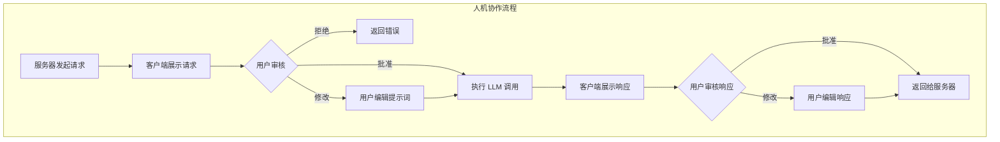

**关键原则:**

- 应该始终有人类参与审核采样请求
- 用户应能够查看和编辑提示词
- 生成的响应应经过人类审核后再交付

### 2. 能力声明（Capabilities）

客户端必须在初始化时声明支持 `sampling` 能力：

```json
{
  "capabilities": {
    "sampling": {}
  }
}
```

---

## 架构设计

### 整体架构图

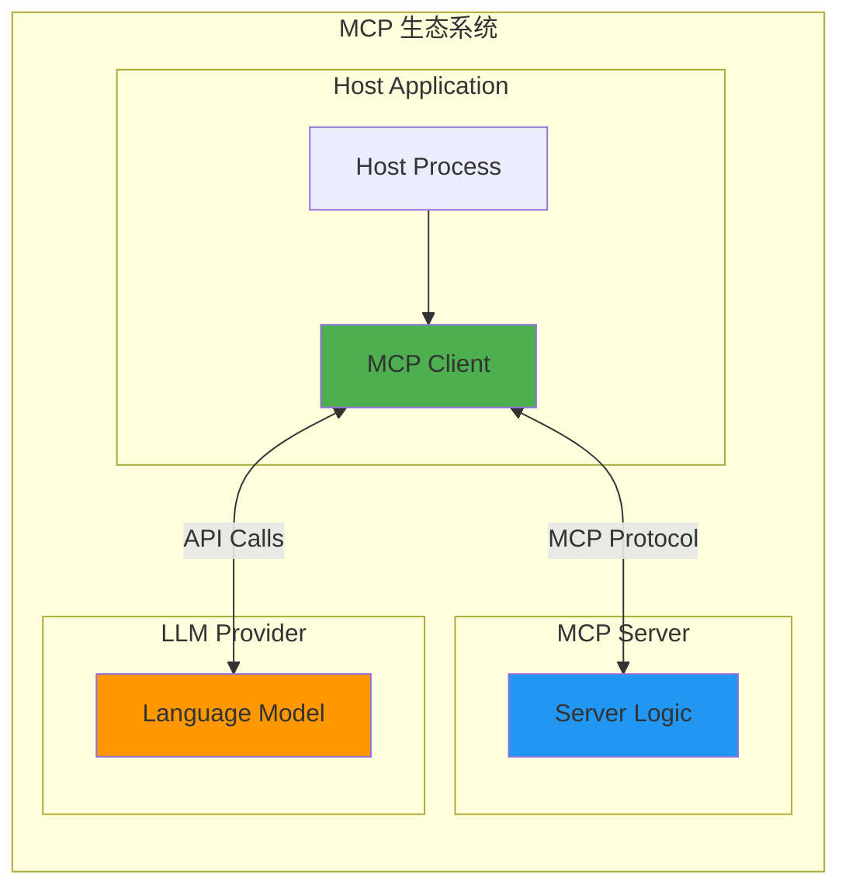

### 组件职责

| 组件                 | 职责                              |
| -------------------- | --------------------------------- |
| **MCP Server**       | 发起采样请求，提供业务逻辑上下文  |
| **MCP Client**       | 管理 LLM 访问，执行采样，控制权限 |
| **Host Application** | 提供用户界面，协调客户端行为      |
| **LLM Provider**     | 执行实际的语言模型推理            |

---

## 工作流程

### 完整流程图

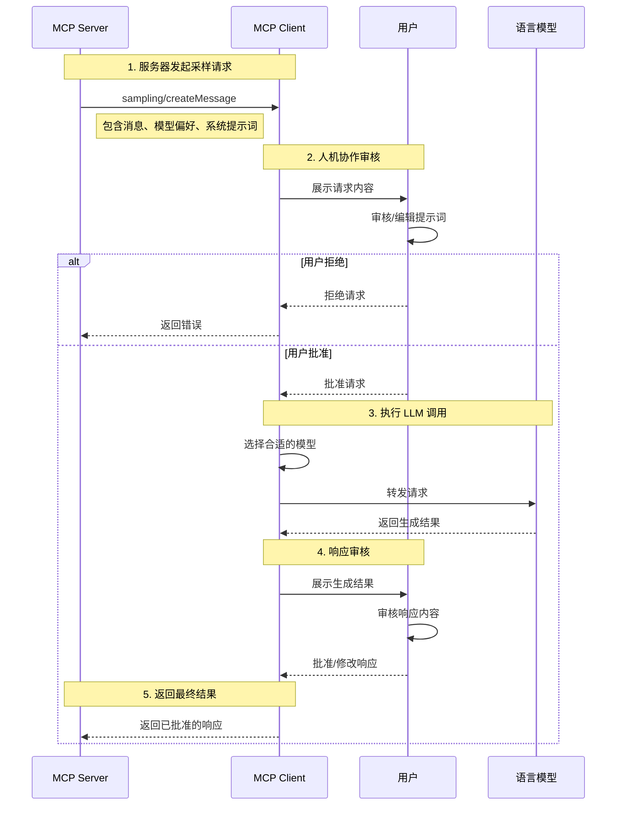

### 请求-响应流程

#### 1️⃣ 请求示例

```json
{
  "jsonrpc": "2.0",
  "id": 1,
  "method": "sampling/createMessage",
  "params": {
    "messages": [
      {
        "role": "user",
        "content": {
          "type": "text",
          "text": "What is the capital of France?"
        }
      }
    ],
    "modelPreferences": {
      "hints": [{ "name": "claude-3-sonnet" }],
      "intelligencePriority": 0.8,
      "speedPriority": 0.5
    },
    "systemPrompt": "You are a helpful assistant.",
    "maxTokens": 100
  }
}
```

#### 2️⃣ 响应示例

```json
{
  "jsonrpc": "2.0",
  "id": 1,
  "result": {
    "role": "assistant",
    "content": {
      "type": "text",
      "text": "The capital of France is Paris."
    },
    "model": "claude-3-sonnet-20240307",
    "stopReason": "endTurn"
  }
}
```

---

## 实现指南

### 数据类型详解

#### 消息内容类型

MCP Sampling 支持三种内容类型：

##### 1. 文本内容

```json
{
  "type": "text",
  "text": "The message content"
}
```

##### 2. 图像内容

```json
{
  "type": "image",
  "data": "base64-encoded-image-data",
  "mimeType": "image/jpeg"
}
```

##### 3. 音频内容

```json
{
  "type": "audio",
  "data": "base64-encoded-audio-data",
  "mimeType": "audio/wav"
}
```

#### 多模态消息示例

```json
{
  "messages": [
    {
      "role": "user",
      "content": {
        "type": "image",
        "data": "iVBORw0KGgoAAAANS...",
        "mimeType": "image/png"
      }
    },
    {
      "role": "user",
      "content": {
        "type": "text",
        "text": "What's in this image?"
      }
    }
  ]
}
```

---

## 模型选择机制

### 为什么需要抽象的模型选择？

不同的客户端可能使用不同的 AI 提供商，服务器不能简单地指定模型名称。MCP 通过**优先级系统**和**模型提示**的组合来解决这个问题。

### 模型选择决策流程

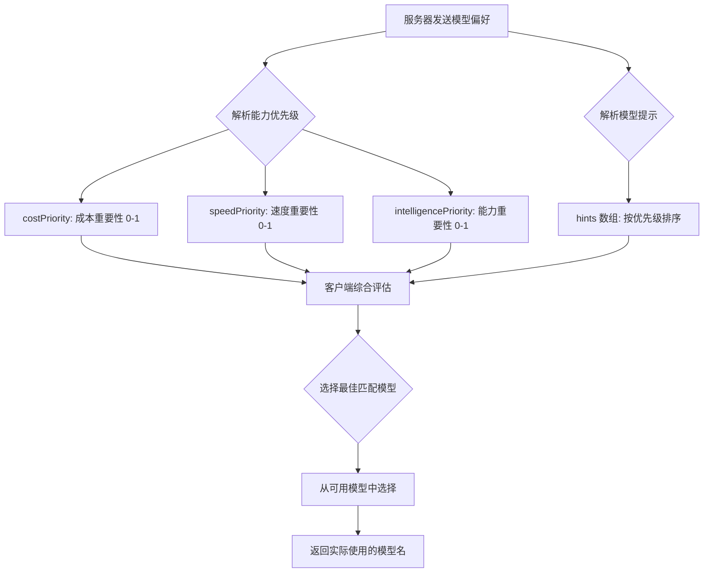

### 能力优先级

服务器通过三个归一化值（0-1）表达需求：

| 优先级                 | 含义           | 影响                           |
| ---------------------- | -------------- | ------------------------------ |
| `costPriority`         | 成本控制重要性 | 数值越高，倾向选择更便宜的模型 |
| `speedPriority`        | 低延迟重要性   | 数值越高，倾向选择更快速的模型 |
| `intelligencePriority` | 高级能力重要性 | 数值越高，倾向选择更强大的模型 |

### 模型提示（Hints）

```json
{
  "hints": [
    { "name": "claude-3-sonnet" }, // 优先选择 Sonnet 级别模型
    { "name": "claude" } // 退而求其次选择任何 Claude 模型
  ],
  "costPriority": 0.3, // 成本不太重要
  "speedPriority": 0.8, // 速度非常重要
  "intelligencePriority": 0.5 // 能力需求中等
}
```

**提示规则:**

- 提示被视为**子串匹配**，可以灵活匹配模型名称
- 多个提示按**偏好顺序**评估
- 客户端**可以**将提示映射到其他提供商的等效模型
- 提示是**建议性的**，客户端做最终选择

### 跨提供商映射示例

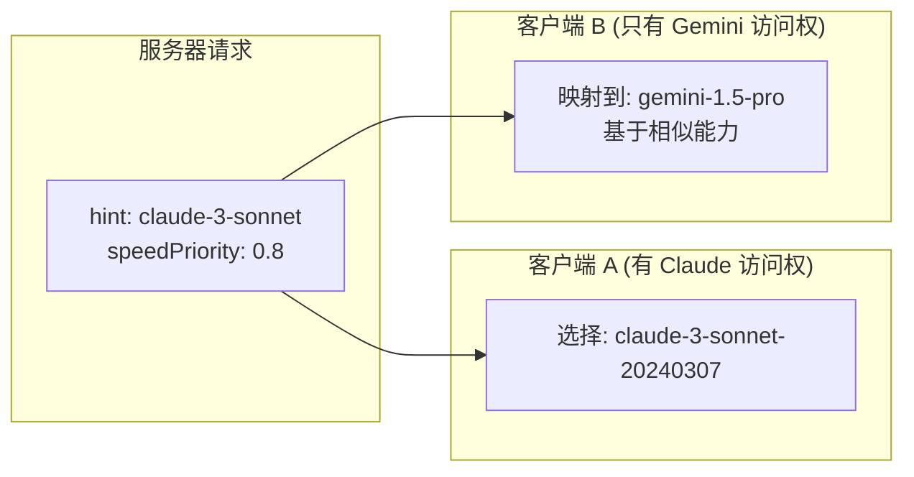

---

## 安全考虑

### 安全检查清单

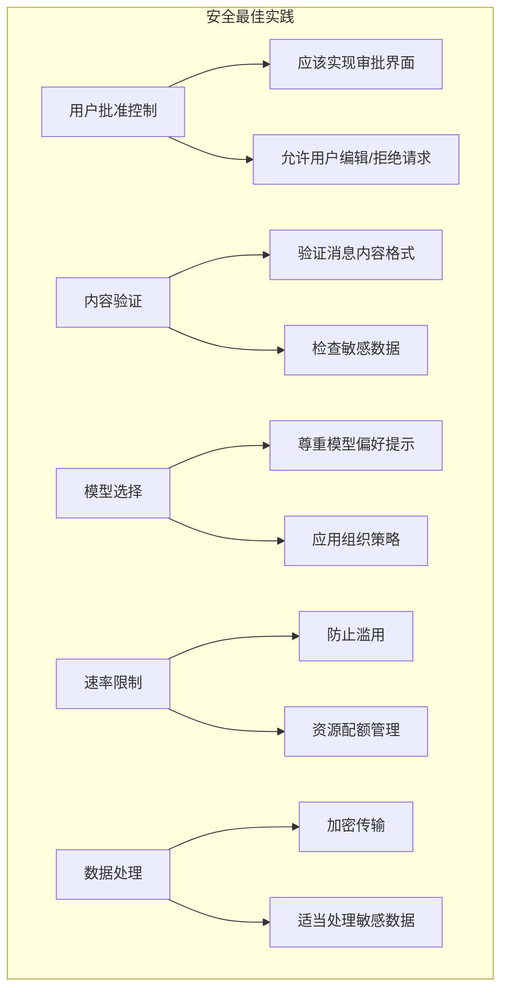

### 关键安全措施

1. **用户批准控制**

   - 客户端应该实现用户审批流程
   - 提供清晰的 UI 展示请求内容

2. **内容验证**

   - 双方应该验证消息内容的合法性
   - 检测和过滤恶意内容

3. **模型选择**

   - 客户端应该尊重模型偏好提示
   - 但保留最终选择权

4. **速率限制**

   - 客户端应该实现速率限制
   - 防止资源滥用

5. **敏感数据处理**
   - 双方必须适当处理敏感数据
   - 遵守隐私保护法规

---

## 实战示例

### 示例 1: 简单文本生成

**场景**: 服务器请求生成代码注释

```typescript
// 服务器端代码
async function requestCodeComments(code: string) {
  const response = await mcpClient.request({
    method: 'sampling/createMessage',
    params: {
      messages: [
        {
          role: 'user',
          content: {
            type: 'text',
            text: `请为以下代码添加详细注释:\n\n${code}`,
          },
        },
      ],
      modelPreferences: {
        hints: [{ name: 'claude-3-sonnet' }],
        intelligencePriority: 0.7,
        speedPriority: 0.5,
        costPriority: 0.3,
      },
      systemPrompt: '你是一个专业的代码审查助手，擅长编写清晰的代码注释。',
      maxTokens: 1000,
    },
  });

  return response.result.content.text;
}
```

### 示例 2: 多模态图像分析

**场景**: 分析上传的图表

```typescript
async function analyzeChart(imageBase64: string) {
  const response = await mcpClient.request({
    method: 'sampling/createMessage',
    params: {
      messages: [
        {
          role: 'user',
          content: {
            type: 'image',
            data: imageBase64,
            mimeType: 'image/png',
          },
        },
        {
          role: 'user',
          content: {
            type: 'text',
            text: '请分析这个图表中的趋势和关键发现',
          },
        },
      ],
      modelPreferences: {
        hints: [{ name: 'claude-3-opus' }],
        intelligencePriority: 0.9, // 需要高级理解能力
        speedPriority: 0.3,
        costPriority: 0.2,
      },
      maxTokens: 2000,
    },
  });

  return response.result.content.text;
}
```

### 示例 3: 对话式 Agent

**场景**: 实现多轮对话的客服 Agent

```typescript
class CustomerServiceAgent {
  private conversationHistory: Message[] = [];

  async chat(userMessage: string): Promise<string> {
    // 添加用户消息到历史
    this.conversationHistory.push({
      role: 'user',
      content: { type: 'text', text: userMessage },
    });

    // 请求 LLM 响应
    const response = await mcpClient.request({
      method: 'sampling/createMessage',
      params: {
        messages: this.conversationHistory,
        modelPreferences: {
          hints: [{ name: 'claude-3-sonnet' }],
          intelligencePriority: 0.6,
          speedPriority: 0.8, // 需要快速响应
          costPriority: 0.5,
        },
        systemPrompt: '你是一个友好且专业的客服代表，帮助用户解决问题。',
        maxTokens: 500,
      },
    });

    // 添加助手响应到历史
    const assistantMessage = response.result.content.text;
    this.conversationHistory.push({
      role: 'assistant',
      content: { type: 'text', text: assistantMessage },
    });

    return assistantMessage;
  }
}
```

### 示例 4: 错误处理

```typescript
async function robustSampling(prompt: string) {
  try {
    const response = await mcpClient.request({
      method: 'sampling/createMessage',
      params: {
        messages: [
          {
            role: 'user',
            content: { type: 'text', text: prompt },
          },
        ],
        modelPreferences: {
          hints: [{ name: 'claude-3-sonnet' }],
          intelligencePriority: 0.7,
          speedPriority: 0.5,
          costPriority: 0.5,
        },
        maxTokens: 1000,
      },
    });

    return response.result.content.text;
  } catch (error) {
    if (error.code === -1) {
      // 用户拒绝了请求
      console.log('用户拒绝了采样请求');
      return null;
    } else if (error.message.includes('rate limit')) {
      // 速率限制
      console.log('已达到速率限制，请稍后重试');
      throw new Error('RATE_LIMIT_EXCEEDED');
    } else {
      // 其他错误
      console.error('采样请求失败:', error);
      throw error;
    }
  }
}
```

### 错误响应示例

```json
{
  "jsonrpc": "2.0",
  "id": 1,
  "error": {
    "code": -1,
    "message": "User rejected sampling request"
  }
}
```

---

## 最佳实践

### ✅ DO（推荐做法）

1. **始终提供清晰的系统提示词**

   ```json
   {
     "systemPrompt": "You are a helpful coding assistant specializing in TypeScript."
   }
   ```

2. **合理设置 maxTokens**

   - 避免不必要的长响应
   - 控制成本和延迟

3. **使用多个 hints 作为降级选项**

   ```json
   {
     "hints": [{ "name": "claude-3-opus" }, { "name": "claude-3-sonnet" }, { "name": "claude" }]
   }
   ```

4. **根据场景调整优先级**
   - 实时对话: 高 `speedPriority`
   - 复杂分析: 高 `intelligencePriority`
   - 批量处理: 高 `costPriority`

### ❌ DON'T（避免做法）

1. **不要假设特定模型总是可用**

   - 使用 hints 而不是硬编码模型名

2. **不要跳过人机协作审核**

   - 始终给用户审核和修改的机会

3. **不要在请求中包含敏感信息**

   - 除非已确保适当的数据保护措施

4. **不要忽略错误处理**
   - 优雅地处理用户拒绝和系统错误

---

## 与其他 MCP 功能的集成

### 嵌套在 Tools 中使用

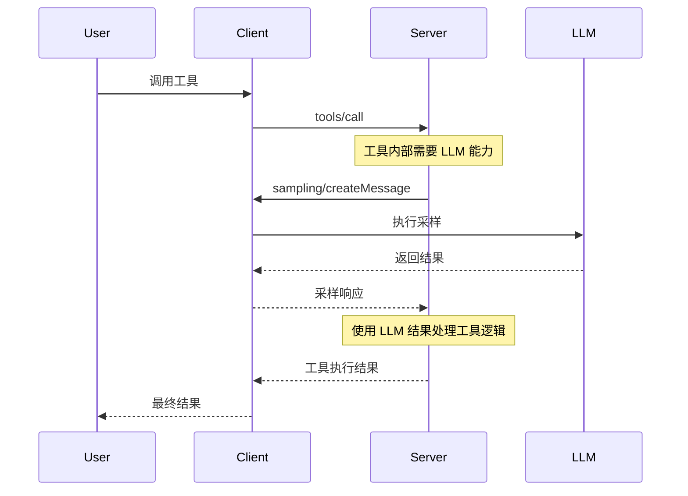

### 结合 Resources 使用

服务器可以在采样请求中包含来自 Resources 的上下文：

```typescript
async function analyzeResource(resourceUri: string) {
  // 1. 获取资源内容
  const resource = await getResource(resourceUri);

  // 2. 使用采样分析资源
  const analysis = await mcpClient.request({
    method: 'sampling/createMessage',
    params: {
      messages: [
        {
          role: 'user',
          content: {
            type: 'text',
            text: `分析以下文档内容:\n\n${resource.content}`,
          },
        },
      ],
      modelPreferences: {
        intelligencePriority: 0.8,
      },
    },
  });

  return analysis.result.content.text;
}
```

---

## 总结

MCP Sampling 提供了一种安全、灵活且标准化的方式，让服务器能够利用 LLM 能力而无需直接管理 API 密钥。通过人机协作、抽象的模型选择机制和多模态支持，它为构建智能的 Agent 系统提供了强大的基础。

### 关键要点

- 🔐 **安全第一**: 人机协作和权限控制
- 🎯 **灵活选择**: 基于优先级的模型选择
- 🔄 **可组合性**: 可嵌套在其他 MCP 功能中
- 📊 **多模态**: 支持文本、图像、音频
- 🛡️ **错误处理**: 优雅处理各种失败场景

## MCP Sampling 客户端支持现状与实现分析

### 支持现状概览

#### 📊 整体数据统计

根据 [MCP Availability](https://mcp-availability.com/) 的最新数据：

| MCP 特性        | 支持率  | 说明                        |
| --------------- | ------- | --------------------------- |
| **Tools**       | 100%    | 所有客户端都支持工具调用    |
| **Resources**   | 39%     | 约 40% 客户端支持资源访问   |
| **Prompts**     | 38%     | 约 38% 客户端支持提示词模板 |
| **Discovery**   | 19%     | 19% 支持工具动态发现        |
| **Sampling**    | **12%** | ⚠️ 仅 12% 支持采样功能      |
| **Elicitation** | 11%     | 11% 支持引导功能            |
| **Roots**       | 8%      | 8% 支持根目录管理           |

#### ⚠️ Sampling 支持现状

**Sampling 是 MCP 中支持度第二低的功能**（仅高于 Roots），这意味着：

- **大多数客户端尚未实现 Sampling**
- 服务器如果依赖 Sampling，需要评估客户端兼容性
- 这是一个快速发展的领域，支持度正在提升

---

### 主流客户端支持列表

#### ✅ 完全支持 Sampling（7/7 功能）

##### 1. **VS Code GitHub Copilot** ⭐️ 推荐

- **支持情况**: 完整支持所有 7 项 MCP 功能
- **配置示例**:

```json
{
  "chat.mcp.serverSampling": {
    "my-server": {
      "allowedModels": [
        "github.copilot-chat/gpt-4o",
        "github.copilot-chat/claude-sonnet-4",
        "github.copilot-chat/claude-3.7-sonnet",
        "github.copilot-chat/gemini-2.5-pro",
        "github.copilot-chat/o4-mini"
      ]
    }
  }
}
```

- **实现方式**: 需要在设置中明确启用采样功能并配置允许的模型
- **官网**: https://code.visualstudio.com/

##### 2. **fast-agent**

- **支持情况**: 完整支持，包括 Sampling
- **特点**:
  - 支持 Anthropic（Claude）和 OpenAI 全系列模型
  - 多模态支持（图像、PDF）
  - 端到端测试的 MCP 实现
- **GitHub**: https://github.com/evalstate/fast-agent

---

#### ✅ 高度支持 Sampling（6/7 功能）

##### 3. **AIQL TUUI**

- **支持情况**: 6/7 功能，包含 Sampling
- **特点**:
  - 原生跨平台桌面应用
  - 支持多 AI 提供商（Anthropic、OpenAI、Deepseek 等）
  - 可配置 Agent 和动态切换 LLM
  - 高级采样控制和多轮采样
- **GitHub**: https://github.com/AI-QL/tuui

##### 4. **mcp-use**

- **支持情况**: 6/7 功能
- **GitHub**: https://github.com/pietrozullo/mcp-use

##### 5. **Postman**

- **支持情况**: 6/7 功能
- **特点**: API 测试工具，集成 MCP Sampling
- **官网**: https://postman.com/downloads

##### 6. **VT Code**

- **支持情况**: 6/7 功能
- **GitHub**: https://github.com/vinhnx/vtcode

---

#### ⚠️ 中等支持（5/7 功能）

##### 7. **Cursor**

- **支持情况**: 5/7 功能，**不支持 Sampling** ❌
- **社区状态**: [正在讨论 Elicitation 支持](https://forum.cursor.com/t/mcp-elicitation-support-immediate-need/116516)
- **官网**: https://cursor.com

##### 8. **mcp-agent** (LastMile AI)

- **支持情况**: 5/7 功能
- **特点**:
  - 简单可组合的框架
  - 实现 OpenAI Swarm 多 Agent 模式
  - 模型无关设计
- **GitHub**: https://github.com/lastmile-ai/mcp-agent

##### 9. **Tambo**

- **支持情况**: 5/7 功能
- **官网**: https://tambo.co

---

#### ❌ 不支持 Sampling 的主流客户端

##### Claude 系列

| 客户端                 | 支持功能 | Sampling | 说明                                                                      |
| ---------------------- | -------- | -------- | ------------------------------------------------------------------------- |
| **Claude Desktop App** | 3/7      | ❌       | 官方桌面应用，**不支持 Sampling**                                         |
| **Claude.ai**          | 3/7      | ❌       | Web 版本                                                                  |
| **Claude Code**        | 4/7      | ❌       | [社区强烈呼吁支持](https://github.com/anthropics/claude-code/issues/1785) |

**重要提醒**:

> ⚠️ Claude 官方文档明确指出: "This feature of MCP is **not yet supported** in the Claude Desktop client."

**社区反馈**:

- 44 个 👍 支持在 Claude Code 中添加 Sampling
- 用户期望利用 Claude Max 订阅来处理采样请求
- 减少 MCP 服务器的 API 调用成本

##### 其他主流客户端

| 客户端              | 支持功能 | Sampling | 备注                                                            |
| ------------------- | -------- | -------- | --------------------------------------------------------------- |
| **Cline**           | 3/7      | ❌       | [正在讨论支持](https://github.com/cline/cline/discussions/4522) |
| **Continue**        | 3/7      | ❌       | VS Code 插件                                                    |
| **Windsurf Editor** | 2/7      | ❌       | Codeium 出品                                                    |
| **Zed**             | 2/7      | ❌       | 高性能编辑器                                                    |
| **ChatGPT**         | 1/7      | ❌       | OpenAI 官方产品                                                 |
| **Cursor**          | 5/7      | ❌       | 虽然支持多功能，但无 Sampling                                   |

---

### 实现方式分析

#### 1. VS Code GitHub Copilot 实现

**配置层面的实现**:

```json
// .vscode/settings.json 或用户设置
{
  // 启用 MCP 采样功能
  "chat.mcp.serverSampling": {
    "task-master-ai": {
      "allowedModels": [
        "github.copilot-chat/gpt-4.1",
        "github.copilot-chat/claude-3.7-sonnet",
        "github.copilot-chat/claude-3.7-sonnet-thought",
        "github.copilot-chat/claude-sonnet-4",
        "github.copilot-chat/gemini-2.5-pro",
        "github.copilot-chat/gpt-4o",
        "github.copilot-chat/o4-mini"
      ]
    }
  }
}
```

**实现特点**:

- ✅ 需要用户**显式配置**允许采样的服务器
- ✅ 支持**模型白名单**机制
- ✅ 与 GitHub Copilot 的模型生态深度集成
- ✅ 支持多种主流模型（GPT-4、Claude、Gemini）

**参考文档**:

- [VS Code MCP 完整规范支持博客](https://code.visualstudio.com/blogs/2025/06/12/full-mcp-spec-support)
- 社区配置示例: [Innovacion Mapplics 配置](https://github.com/jepeloa/innovacion.mapplics/blob/main/docs/resumen-configuracion-vscode-copilot.md)

---

#### 2. fast-agent 实现

**代码层面的实现**:

```python
from fastmcp import FastMCP, Context, schema

mcp = FastMCP("SamplingDemo")

class SentimentResult(schema.BaseModel):
    text: str
    sentiment: str

@mcp.tool
async def analyze_sentiment(text: str, ctx: Context) -> SentimentResult:
    """使用 LLM 分析文本情感"""

    # 构建采样请求
    prompt = (
        "Classify the following text as 'positive', 'negative', or 'neutral'. "
        "Return only one word.\n\n"
        f"Text: {text}"
    )

    # 调用客户端的采样接口
    resp = await ctx.sample(
        messages=prompt,
        temperature=0.0,
        max_tokens=8,
    )

    label = (resp.text or "").strip().lower()

    if label not in {"positive", "negative", "neutral"}:
        label = "neutral"

    return SentimentResult(text=text, sentiment=label)
```

**实现特点**:

- ✅ 使用 `ctx.sample()` API 请求客户端 LLM
- ✅ 支持异步调用
- ✅ 支持 Anthropic 和 OpenAI 模型
- ✅ 多模态支持（图像、PDF）

**架构优势**:

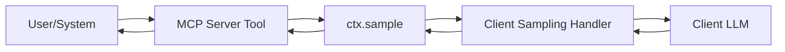

---

#### 3. AIQL TUUI 实现

**特点**:

- **动态 LLM 切换**: 运行时切换不同的 LLM API
- **高级采样控制**:
  - 修改采样参数（temperature、top_p 等）
  - 多轮采样支持
- **Agent 配置**: 可选择和自定义工具

**配置灵活性**:

```typescript
// 示例配置结构
{
  "agents": {
    "default": {
      "provider": "anthropic",
      "model": "claude-sonnet-4",
      "samplingConfig": {
        "temperature": 0.7,
        "maxTokens": 2000,
        "enableMultiRound": true
      }
    }
  }
}
```

---

#### 4. 客户端实现的关键组件

基于 MCP Python SDK 的标准实现：

```python
# 客户端必须实现 sampling handler
async def sampling_handler(
    messages: list,
    model: str = None,
    temperature: float = 0.7,
    max_tokens: int = 1000,
    **kwargs
) -> dict:
    """
    处理来自 MCP 服务器的采样请求

    Args:
        messages: 消息列表或单个字符串
        model: 模型名称（可选）
        temperature: 采样温度
        max_tokens: 最大 token 数

    Returns:
        包含 text 字段的响应字典
    """
    # 1. 可选：展示给用户审核
    user_approved = await show_to_user_for_approval(messages)
    if not user_approved:
        raise Exception("User rejected sampling request")

    # 2. 调用 LLM API
    response = await llm_client.create_completion(
        model=model or "default-model",
        messages=messages,
        temperature=temperature,
        max_tokens=max_tokens,
        **kwargs
    )

    # 3. 可选：响应审核
    final_response = await show_response_for_approval(response)

    return {
        "text": final_response,
        "model": model,
        "stopReason": "endTurn"
    }

# 注册 handler
mcp_client.register_sampling_handler(sampling_handler)
```

---

### 典型案例研究

#### 案例 1: Amazon Q CLI 的 Sampling PR

**背景**: Amazon Q CLI 正在开发 MCP Sampling 支持

**实现方式**:

- PR 正在进行中
- 计划支持服务器请求 LLM 推理
- 利用 AWS 基础设施

**参考**: [Cline 社区讨论](https://github.com/cline/cline/discussions/4522)

---

#### 案例 2: Grafana Tempo 2.9 的 MCP 支持

**背景**: Grafana Tempo 2.9 实验性支持 MCP Server

**用途**:

- 让 LLM 和 AI Agent 更容易理解服务间交互
- 调查和诊断问题
- 例如：让 Claude 列出 Tempo 中的所有服务

**实现特点**:

- 实验性功能
- 主要用于观察性场景
- **不包含 Sampling**，主要是 Tools 和 Resources

**参考**: [Grafana 博客](https://grafana.com/blog/2025/10/22/grafana-tempo-2-9-release-mcp-server-support-traceql-metrics-sampling-and-more/)

---

#### 案例 3: Claude Code 社区需求

**Issue**: [Support for MCP Sampling #1785](https://github.com/anthropics/claude-code/issues/1785)

**社区诉求**:

1. **减少成本**:

   - Claude Max 订阅用户希望服务器采样使用他们的订阅额度
   - 而不是额外支付 API 费用

2. **人机协作**:

   - 用户可以审核和修改采样请求
   - 审核 LLM 响应

3. **统一体验**:
   - 与主对话使用相同的 Claude 实例
   - 保持上下文一致性

**状态**:

- 44 个支持反应
- 尚未实现
- 社区高度期待

---

### 为什么支持度这么低？

#### 技术挑战

#### 1. **复杂的架构设计**

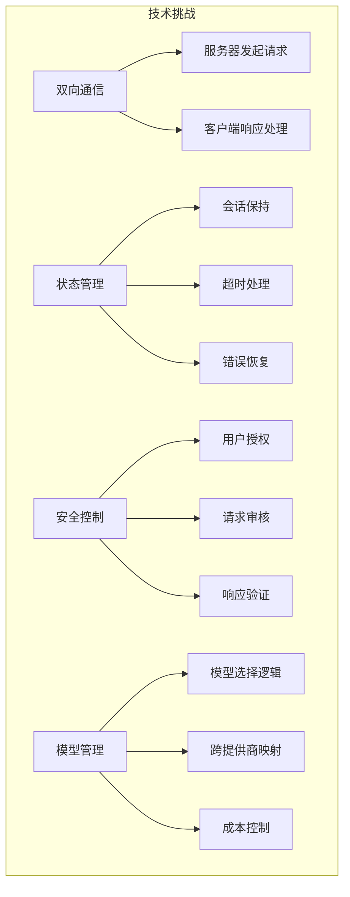

##### 2. **用户体验挑战**

- **人机协作流程**: 需要设计直观的审核界面
- **响应延迟**: 等待用户批准会增加延迟
- **中断用户**: 服务器采样可能打断用户工作流

##### 3. **成本和订阅模型**

- **订阅 vs API**: 如何计费采样请求？
  - 使用用户订阅额度？
  - 单独计费？
- **速率限制**: 如何防止滥用？

##### 4. **协议成熟度**

- Sampling 是相对**较新**的特性
- 规范还在迭代（2025-06-18 最新版本）
- 需要时间让客户端跟进

---

#### 产品决策因素

| 考虑因素       | 客户端立场                             |
| -------------- | -------------------------------------- |
| **开发优先级** | Tools > Resources > Prompts > Sampling |
| **用户需求**   | 大多数用户场景不需要 Sampling          |
| **成本控制**   | 不希望承担服务器发起的采样成本         |
| **安全顾虑**   | 担心服务器滥用 LLM 访问权限            |
| **实现复杂度** | Sampling 需要显著的工程投入            |

---

#### 市场现状

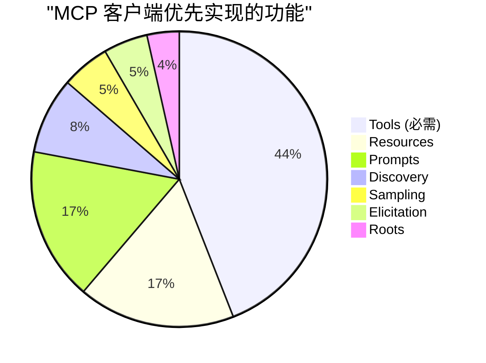

**结论**:

- Sampling 不是"必需"功能
- 客户端优先实现核心功能（Tools）
- 高级功能（Sampling）排在后面

---

### 未来趋势

#### 短期趋势（6-12 个月）

##### 1. **更多客户端将支持 Sampling**

**预期支持列表**:

- ✅ **Cline**: [讨论中](https://github.com/cline/cline/discussions/4522)
- ✅ **Cursor**: 社区呼声高
- ✅ **Amazon Q CLI**: PR 开发中
- ⏳ **Claude Code**: 社区强烈需求

##### 2. **MCP Inspector 引领**

- MCP Inspector 0.16.2 已支持 Elicitation
- 将推动其他客户端跟进
- 提供参考实现

##### 3. **标准化采样模式**

```typescript
// 预期的标准化 API
interface SamplingConfig {
  // 必需
  messages: Message[];
  maxTokens: number;

  // 模型选择
  modelPreferences?: {
    hints?: ModelHint[];
    costPriority?: number;
    speedPriority?: number;
    intelligencePriority?: number;
  };

  // 可选配置
  systemPrompt?: string;
  temperature?: number;
  includeContext?: 'none' | 'thisServer' | 'allServers';

  // 新增：结构化输出
  outputSchema?: JSONSchema;

  // 新增：工具调用
  tools?: Tool[];
  toolChoice?: 'auto' | 'none' | { name: string };
}
```

---

#### 中期趋势（1-2 年）

##### 1. **Sampling + Tools 的组合**

**SEP-1577 提案**:

- 允许采样请求中包含工具定义
- LLM 可以在采样中调用工具
- 实现更复杂的 Agent 行为

**示例场景**:

```
用户: "分析这个 PR 的影响"
Server -> Client Sampling: "分析 PR #123"
  ↓
LLM: 需要获取 PR 详情 [调用工具 get_pr_details]
  ↓
Client: 执行工具 -> 返回数据
  ↓
LLM: 生成分析报告
  ↓
Client -> Server: 返回报告
```

##### 2. **成本优化机制**

- **智能缓存**: 相似请求使用缓存
- **批处理**: 合并多个采样请求
- **优先级队列**: 根据重要性排队

##### 3. **增强的人机协作**

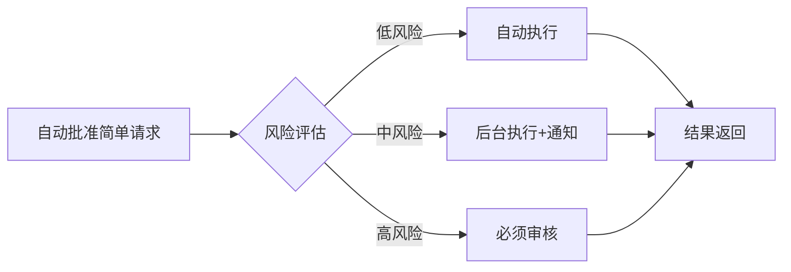

---

#### 长期愿景（2+ 年）

##### 1. **统一的 Agent 生态**

- **跨客户端兼容**: 一个 MCP 服务器可在任何客户端运行
- **标准化行为**: Sampling 行为一致
- **互操作性**: 不同提供商的模型无缝切换

##### 2. **智能采样路由**

```typescript
// 未来的智能路由
class SamplingRouter {
  async route(request: SamplingRequest): Promise<SamplingResponse> {
    // 1. 分析请求特征
    const features = this.analyzeRequest(request);

    // 2. 选择最优模型
    const model = this.selectOptimalModel(features, request.modelPreferences);

    // 3. 决定执行策略
    if (this.canCache(request)) {
      return this.getCached(request);
    }

    if (this.canBatch(request)) {
      return this.addToBatch(request);
    }

    return this.executeDirect(request, model);
  }
}
```

##### 3. **监管和合规**

- **审计日志**: 所有采样请求可追溯
- **隐私保护**: 敏感数据自动脱敏
- **合规检查**: 自动验证请求合规性

---

### 最佳实践建议

#### 对于 MCP 服务器开发者

##### ✅ DO（应该做）

1. **检查客户端能力**

```python
# 初始化时检查 Sampling 支持
async def check_sampling_support(client_capabilities):
    if "sampling" not in client_capabilities:
        logger.warning("Client does not support sampling")
        # 提供降级方案
        return False
    return True
```

2. **提供降级方案**

```python
@mcp.tool
async def analyze_text(text: str, ctx: Context):
    if hasattr(ctx, 'sample'):
        # 使用 Sampling
        result = await ctx.sample(messages=prompt)
    else:
        # 降级：使用本地方法或返回提示
        result = "This feature requires a client with sampling support"
    return result
```

3. **明确文档说明**

```markdown
## Requirements

- MCP Client with Sampling support
- Supported clients: VS Code GitHub Copilot, fast-agent, AIQL TUUI
- Not supported: Claude Desktop, Cursor, Cline
```

#### ❌ DON'T（不应该做）

1. **不要假设所有客户端都支持 Sampling**
2. **不要在 Sampling 不可用时崩溃**
3. **不要在文档中遗漏客户端兼容性信息**

---

#### 对于客户端开发者

##### 实现 Sampling 的路线图

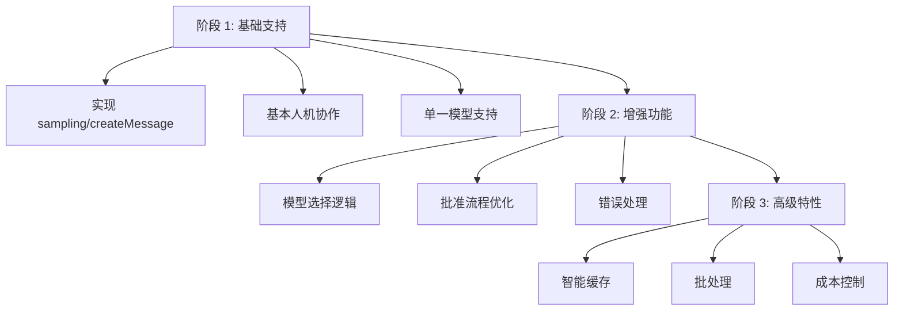

---

#### 对于用户

##### 选择客户端的建议

**如果需要 Sampling 功能**:

1. **首选**: VS Code + GitHub Copilot

   - ✅ 完整支持
   - ✅ 主流工具
   - ✅ 文档完善

2. **备选**: fast-agent

   - ✅ 完整支持
   - ✅ 多模型支持
   - ⚠️ 较新的工具

3. **实验性**: AIQL TUUI
   - ✅ 高级采样控制
   - ✅ 跨平台
   - ⚠️ 社区较小

**如果不需要 Sampling**:

- Claude Desktop: 适合日常对话
- Cursor: 适合编码
- Cline: VS Code 用户的选择

---

### 总结

#### 关键发现

1. **支持度低**: 只有 12% 的客户端支持 Sampling
2. **增长趋势**: 支持度正在快速提升
3. **领导者**: VS Code GitHub Copilot 是唯一完整支持的主流客户端
4. **缺席者**: Claude 系列产品尚未支持 Sampling

#### 行动建议

| 角色             | 建议                                 |
| ---------------- | ------------------------------------ |
| **服务器开发者** | 提供降级方案，明确兼容性文档         |
| **客户端开发者** | 考虑实现 Sampling，参考 VS Code 实现 |
| **用户**         | 根据需求选择客户端，关注更新         |
| **社区**         | 推动规范成熟，分享最佳实践           |

#### 展望

MCP Sampling 虽然目前支持度不高，但它是实现复杂 Agent 行为的关键能力。随着：

- ✅ 更多客户端加入支持
- ✅ 规范的成熟和标准化
- ✅ 成功案例的涌现
- ✅ 社区的推动

**Sampling 有望成为 MCP 生态的重要组成部分。**

---

### 参考资源

#### 官方文档

- [MCP Specification - Sampling](https://modelcontextprotocol.io/specification/2025-06-18/client/sampling)
- [VS Code MCP 博客](https://code.visualstudio.com/blogs/2025/06/12/full-mcp-spec-support)

#### 社区资源

- [MCP Availability 追踪](https://mcp-availability.com/)
- [MCP 客户端能力索引](https://github.com/apify/mcp-client-capabilities)

#### 相关讨论

- [Claude Code Sampling Feature Request](https://github.com/anthropics/claude-code/issues/1785)
- [Cline MCP 新特性讨论](https://github.com/cline/cline/discussions/4522)
- [Cursor Elicitation 支持](https://forum.cursor.com/t/mcp-elicitation-support-immediate-need/116516)

#### 实现参考

- [fast-agent GitHub](https://github.com/evalstate/fast-agent)
- [AIQL TUUI GitHub](https://github.com/AI-QL/tuui)
- [VS Code Copilot 配置示例](https://github.com/jepeloa/innovacion.mapplics/blob/main/docs/resumen-configuracion-vscode-copilot.md)

---

#### 进一步学习

- [MCP 官方规范](https://modelcontextprotocol.io/specification)
- [MCP TypeScript SDK](https://github.com/modelcontextprotocol/typescript-sdk)
- [MCP Python SDK](https://github.com/modelcontextprotocol/python-sdk)
- [MCP 社区示例](https://github.com/modelcontextprotocol/servers)

---
