# 以太坊架构完全指南

## 目录

- [什么是以太坊](#什么是以太坊)
- [整体架构](#整体架构)
- [核心组件详解](#核心组件详解)
- [节点类型与网络层](#节点类型与网络层)
- [状态与存储机制](#状态与存储机制)
- [共识机制](#共识机制)
- [实践练习](#实践练习)
- [参考资料](#参考资料)

---

## 什么是以太坊？

### 1. 简单定义

**以太坊的本质：**

```
以太坊 = 去中心化的世界计算机
       = 区块链 + 智能合约平台
       = 全球分布式状态机
       = 可编程的价值网络
```

**核心特点：**

- 🌐 **去中心化**：全球数千节点共同维护，无单点故障
- 💻 **图灵完备**：可以执行任意复杂的计算逻辑
- 🔒 **不可篡改**：一旦部署，代码和数据永久保存
- 🌍 **无需许可**：任何人都可以参与，无需批准
- 💰 **可编程货币**：原生支持智能合约和代币

### 2. 以太坊 vs 比特币

| 特性     | 比特币     | 以太坊             |
| -------- | ---------- | ------------------ |
| 主要用途 | 数字黄金   | 世界计算机         |
| 智能合约 | 有限       | 图灵完备           |
| 共识机制 | PoW        | PoS                |
| 区块时间 | ~10 分钟   | ~12 秒             |
| 编程语言 | Script     | Solidity, Vyper 等 |
| 应用场景 | 支付、储值 | DeFi, NFT, DApp 等 |

---

## 整体架构

### 1. 架构层级概览

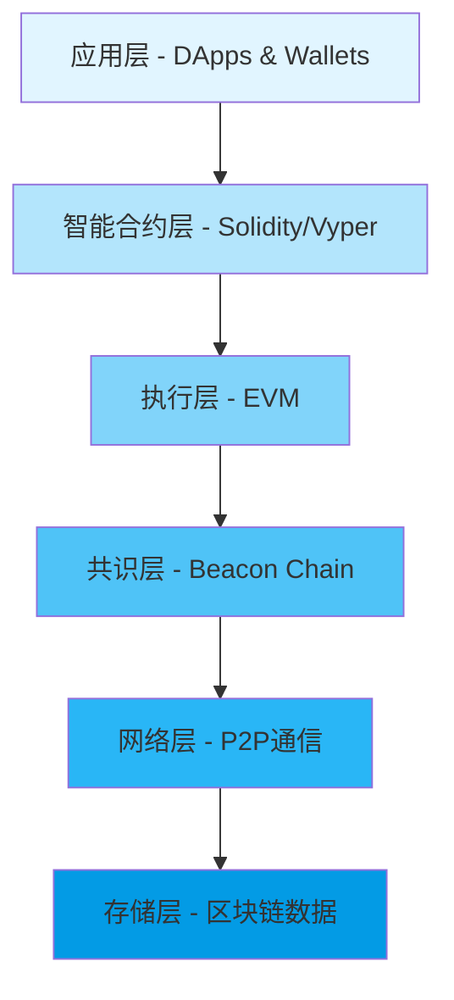

**层级说明：**

#### 应用层 (Application Layer)

```
用户直接接触的层面
├── DApps（去中心化应用）
│   ├── Uniswap（DEX）
│   ├── Aave（借贷）
│   └── OpenSea（NFT市场）
├── 钱包
│   ├── MetaMask
│   ├── Rainbow
│   └── Ledger
└── 开发工具
    ├── Hardhat
    ├── Foundry
    └── Remix IDE
```

#### 智能合约层 (Smart Contract Layer)

```
编程接口层
├── 高级语言
│   ├── Solidity（最流行）
│   ├── Vyper（安全导向）
│   └── Huff（低级优化）
├── 编译器
│   └── 源代码 → 字节码
└── 标准库
    ├── ERC-20（代币标准）
    ├── ERC-721（NFT标准）
    └── ERC-1155（多代币标准）
```

#### 执行层 (Execution Layer)

```
交易处理和状态管理
├── EVM（以太坊虚拟机）
├── 交易池（Mempool）
├── Gas计量
└── 状态转换
```

#### 共识层 (Consensus Layer)

```
区块验证和最终确定
├── 信标链（Beacon Chain）
├── PoS验证者
├── Slot/Epoch机制
└── 最终确定性
```

#### 网络层 (Networking Layer)

```
节点通信
├── P2P协议（devp2p/libp2p）
├── 节点发现
├── 区块传播
└── 交易广播
```

#### 存储层 (Storage Layer)

```
持久化数据
├── 区块链数据
├── 状态树
├── 交易历史
└── 收据日志
```

### 2. 以太坊 2.0 架构变化

#### The Merge 前后对比

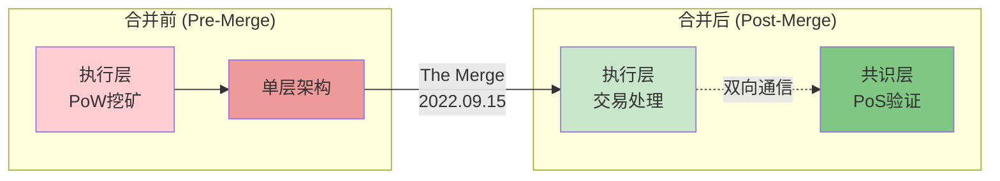

**关键改变：**

| 方面       | Merge 前          | Merge 后                   |
| ---------- | ----------------- | -------------------------- |
| 共识机制   | PoW（工作量证明） | PoS（权益证明）            |
| 能源消耗   | 高（~100 TWh/年） | 低（~0.01 TWh/年）⬇️99.95% |
| 区块时间   | ~13.5 秒（可变）  | ~12 秒（固定）             |
| 验证方式   | 算力竞争          | 质押 ETH 投票              |
| 环境影响   | 大                | 极小                       |
| 最终确定性 | ~6-30 分钟        | ~13 分钟（2 个 Epoch）     |

#### 双层架构详解

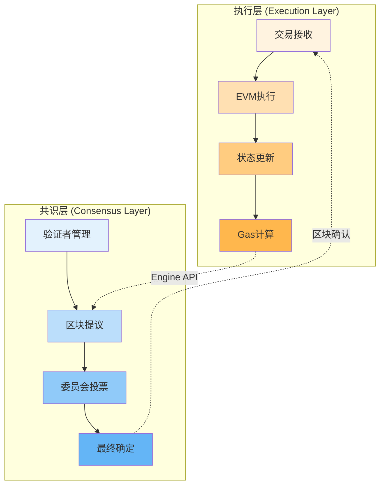

**Engine API（引擎 API）：**

- 连接执行层和共识层
- 传递区块提议
- 同步执行结果
- 协调最终确定性

---

## 核心组件详解

### 1. 账户系统

以太坊有两种账户类型，它们构成了整个网络的基础：

#### 账户类型对比

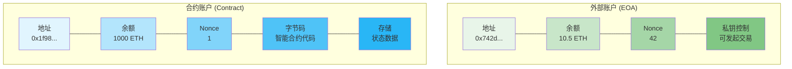

#### 外部账户 (EOA - Externally Owned Account)

```
组成部分：
├── Address: 0x742d35Cc6634C0532925a3b844Bc9e7595f0bEb
│   └── 由公钥通过Keccak-256哈希生成
├── Balance: 10.5 ETH
│   └── 当前持有的以太币数量
├── Nonce: 42
│   └── 已发送的交易计数（从0开始）
└── 由私钥控制
    └── 持有私钥 = 完全控制账户

特点：
✅ 可以主动发起交易
✅ 可以持有ETH和代币
✅ 没有可执行代码
✅ 由人类或程序控制（通过私钥）
✅ 创建账户免费（只需生成密钥对）
```

#### 合约账户 (Contract Account)

```
组成部分：
├── Address: 0x1f9840a85d5aF5bf1D1762F925BDADdC4201F984
│   └── 由创建者地址和nonce计算得出
├── Balance: 1000 ETH
│   └── 合约持有的以太币
├── Nonce: 1
│   └── 由该合约创建的合约数量
├── Code: 智能合约字节码
│   └── 不可更改的程序逻辑
└── Storage: 持久化存储空间
    └── 合约的状态变量

特点：
✅ 不能主动发起交易（被动触发）
✅ 可以持有ETH和代币
✅ 包含可执行代码
✅ 由代码逻辑控制
✅ 创建需要Gas费用
✅ 部署后代码不可更改（除非使用代理模式）
```

#### 账户交互流程

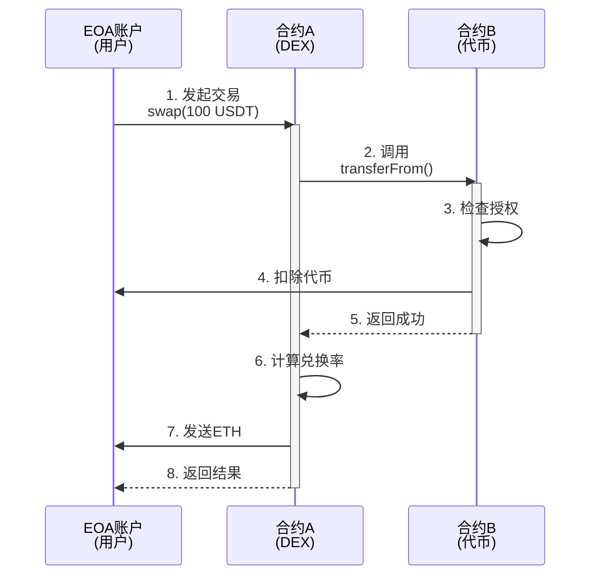

### 2. 交易结构

#### 完整的交易对象

```javascript
{
  // ===== 基本信息 =====
  from: "0x742d35Cc6634C0532925a3b844Bc9e7595f0bEb",
  // 交易发起者地址（EOA）

  to: "0x1f9840a85d5aF5bf1D1762F925BDADdC4201F984",
  // 接收者地址（EOA或合约），null则为创建合约

  value: "1000000000000000000", // 1 ETH in Wei
  // 转账金额（1 ETH = 10^18 Wei）

  nonce: 42,
  // 发送者的交易序号（防止重放攻击）

  // ===== Gas相关 (EIP-1559) =====
  gasLimit: 21000,
  // 愿意支付的最大gas数量

  maxFeePerGas: "100000000000", // 100 Gwei
  // 愿意支付的最高gas价格（基础费用+小费）

  maxPriorityFeePerGas: "2000000000", // 2 Gwei
  // 给验证者的小费（优先费）

  // ===== 数据 =====
  data: "0xa9059cbb000000000000000...",
  // 输入数据（合约调用的编码数据）
  // 简单转账时为 "0x"（空）

  // ===== 签名 (ECDSA) =====
  v: 28,
  // 恢复标识符（27或28，用于恢复公钥）

  r: "0x88ff6cf0fefd94db46111149ae4bfc179e9b94721fffd821d38d16464b3f71d0",
  // 签名的r值

  s: "0x45e0aff800961cfce805daef7016b9b675c137a6a41a548f7b60a3484c06a33a",
  // 签名的s值

  // ===== 元数据 =====
  type: 2,
  // 交易类型（0=传统, 1=访问列表, 2=EIP-1559）

  chainId: 1,
  // 链ID（1=主网, 5=Goerli, 11155111=Sepolia）
}
```

#### 交易类型演化

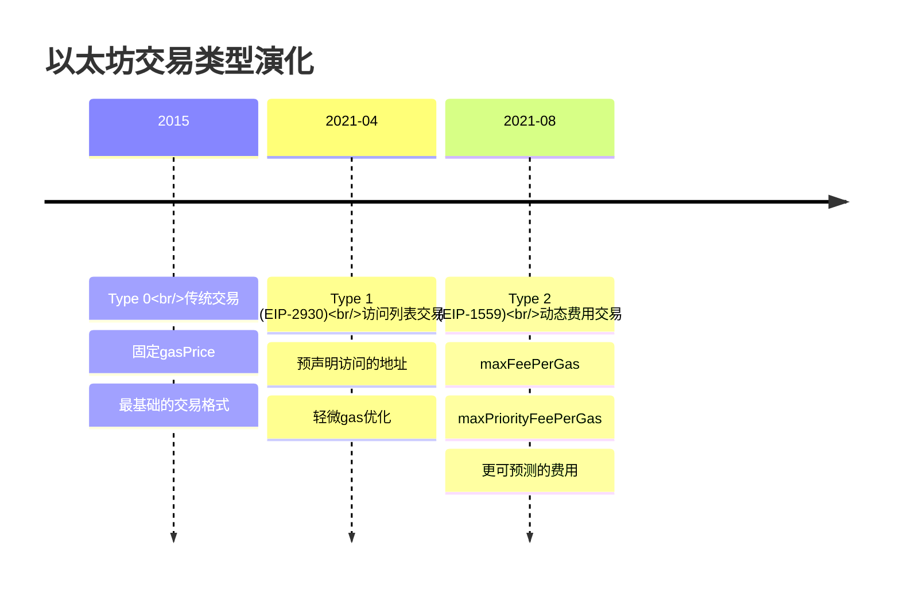

**Type 0: 传统交易（Legacy）**

```javascript
{
  gasPrice: "50000000000", // 固定价格
  // 问题：费用不可预测，容易过高或过低
}
```

**Type 1: 访问列表交易（EIP-2930）**

```javascript
{
  gasPrice: "50000000000",
  accessList: [
    {
      address: "0x...",
      storageKeys: ["0x0000...", "0x0001..."]
    }
  ]
  // 预先声明要访问的地址和存储槽
  // 可以节省一些gas（冷访问 → 热访问）
}
```

**Type 2: 动态费用交易（EIP-1559）**

```javascript
{
  maxFeePerGas: "100000000000",          // 最高愿意支付
  maxPriorityFeePerGas: "2000000000",    // 给验证者的小费
  // 实际支付 = min(baseFee + priorityFee, maxFee)
  // 多余的会退还
}
```

#### 交易生命周期

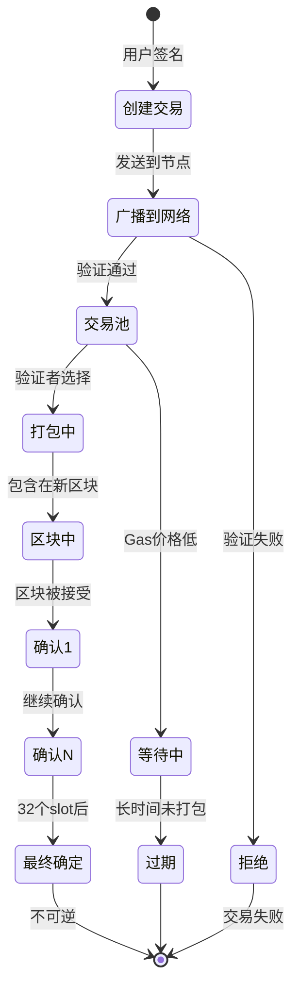

### 3. 区块结构

#### 区块的完整结构

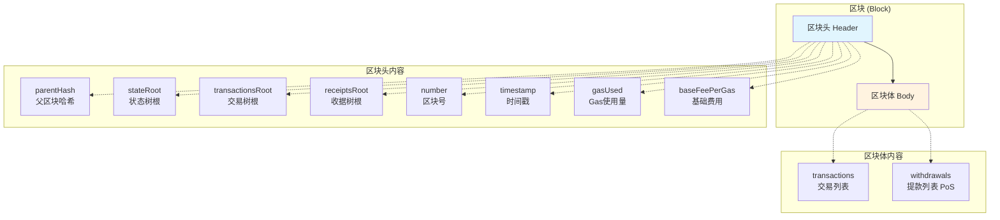

**区块头 (Block Header) 详解：**

```javascript
{
  // ===== 链接 =====
  parentHash: "0x1234...",
  // 父区块的哈希（形成链）

  // ===== 状态根 =====
  stateRoot: "0xabcd...",
  // 执行所有交易后的世界状态根哈希

  transactionsRoot: "0xef01...",
  // 区块内所有交易的Merkle树根

  receiptsRoot: "0x2345...",
  // 所有交易收据的Merkle树根

  // ===== 日志 =====
  logsBloom: "0x0000...",
  // 布隆过滤器（快速查找日志）

  // ===== 区块信息 =====
  number: 18000000,
  // 区块号（从0开始递增）

  timestamp: 1699999999,
  // Unix时间戳（秒）

  // ===== Gas =====
  gasLimit: 30000000,
  // 区块的Gas上限

  gasUsed: 15234567,
  // 实际使用的Gas

  baseFeePerGas: "30000000000", // 30 Gwei
  // EIP-1559基础费用

  // ===== PoS相关 =====
  difficulty: 0,
  // PoS后固定为0（PoW时代的难度）

  extraData: "0x...",
  // 额外数据（验证者可添加信息，最多32字节）

  // ===== 已弃用 (PoW时代) =====
  mixHash: "0x0000...",
  // PoW混合哈希（PoS后无意义）

  nonce: "0x0000000000000000",
  // PoW随机数（PoS后固定为0）
}
```

**区块体 (Block Body)：**

```javascript
{
  // 交易列表
  transactions: [
    {
      from: "0x742d...",
      to: "0x1f98...",
      value: "1000000000000000000",
      // ... 完整交易对象
    },
    // ... 更多交易
  ],

  // PoS提款（The Merge后新增）
  withdrawals: [
    {
      index: 12345,
      validatorIndex: 67890,
      address: "0x742d...",
      amount: "32000000000" // 32 ETH in Gwei
    },
    // ... 更多提款
  ]
}
```

#### 区块链结构

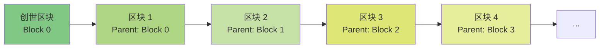

### 4. 世界状态 (World State)

#### 状态机概念

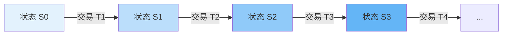

**示例：状态转换**

```
初始状态 S0:
├── Alice: 10 ETH
└── Bob: 5 ETH

交易 T1: Alice → Bob (5 ETH)
    ↓

新状态 S1:
├── Alice: 5 ETH
└── Bob: 10 ETH

交易 T2: Bob → Charlie (3 ETH)
    ↓

新状态 S2:
├── Alice: 5 ETH
├── Bob: 7 ETH
└── Charlie: 3 ETH
```

#### 账户状态结构

```javascript
// 每个账户的状态
AccountState = {
  nonce: 42,
  // 交易计数或创建的合约数

  balance: '10500000000000000000', // 10.5 ETH
  // 账户余额（以Wei为单位）

  storageRoot: '0x56e8...',
  // 该账户的存储树根哈希
  // EOA账户这个字段为空树根

  codeHash: '0xc5d2...',
  // 合约代码的哈希
  // EOA账户这个字段为空字符串的哈希
};
```

---

## 节点类型与网络层

### 1. 节点类型对比

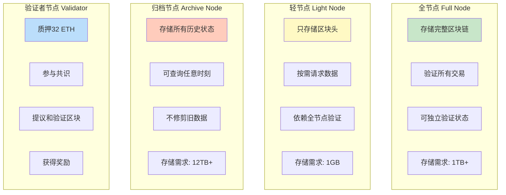

#### 详细对比表

| 特性         | 全节点      | 轻节点   | 归档节点   | 验证者节点  |
| ------------ | ----------- | -------- | ---------- | ----------- |
| **存储需求** | ~1TB        | ~1GB     | ~12TB      | ~2TB        |
| **内存需求** | 16GB        | 4GB      | 64GB+      | 32GB        |
| **同步时间** | 数小时      | 几分钟   | 数天       | 数小时      |
| **验证能力** | 完全验证    | 依赖他人 | 完全验证   | 完全验证    |
| **历史查询** | 最近 128 块 | 不支持   | 所有历史   | 最近 128 块 |
| **网络贡献** | 高          | 低       | 高         | 最高        |
| **适用场景** | DApp 后端   | 移动钱包 | 区块浏览器 | 质押收益    |
| **运营成本** | 中          | 低       | 高         | 中-高       |

### 2. 客户端实现

#### 执行层客户端生态

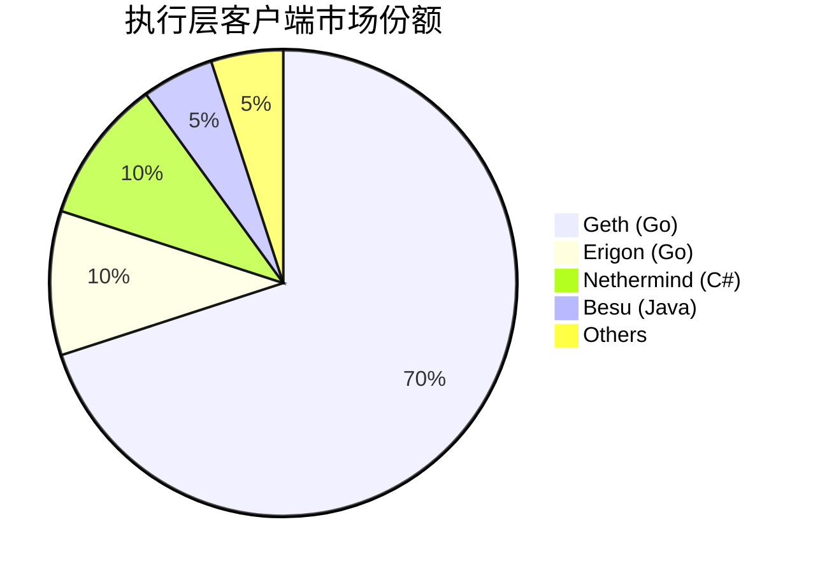

**主流执行层客户端：**

| 客户端         | 语言 | 优势                   | 劣势               |
| -------------- | ---- | ---------------------- | ------------------ |
| **Geth**       | Go   | 最成熟、最流行、文档全 | 同步慢、资源占用高 |
| **Erigon**     | Go   | 快速同步、低存储       | 较新、可能有 bug   |
| **Nethermind** | C#   | .NET 生态、企业支持    | 社区较小           |
| **Besu**       | Java | 企业级、隐私功能       | 资源占用高         |

#### 共识层客户端生态

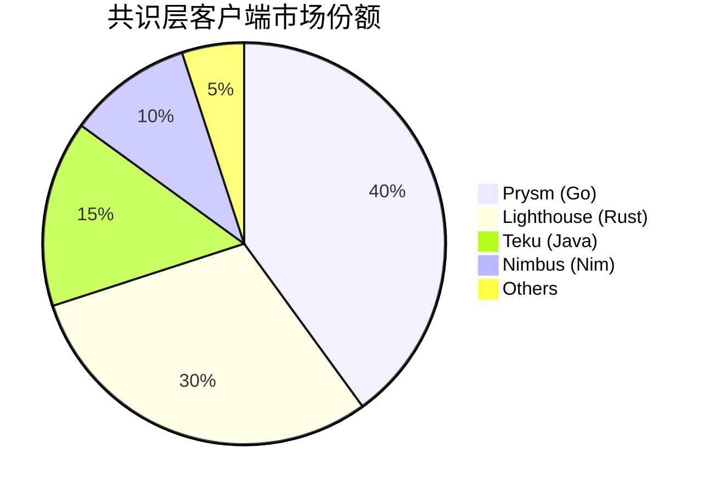

**主流共识层客户端：**

| 客户端         | 语言 | 优势             | 劣势                 |
| -------------- | ---- | ---------------- | -------------------- |
| **Prysm**      | Go   | 功能丰富、更新快 | 市场占比过高（风险） |
| **Lighthouse** | Rust | 性能优秀、安全   | 配置较复杂           |
| **Teku**       | Java | 企业支持、易用   | 资源占用高           |
| **Nimbus**     | Nim  | 轻量级、低资源   | 功能相对简单         |

#### 客户端多样性的重要性

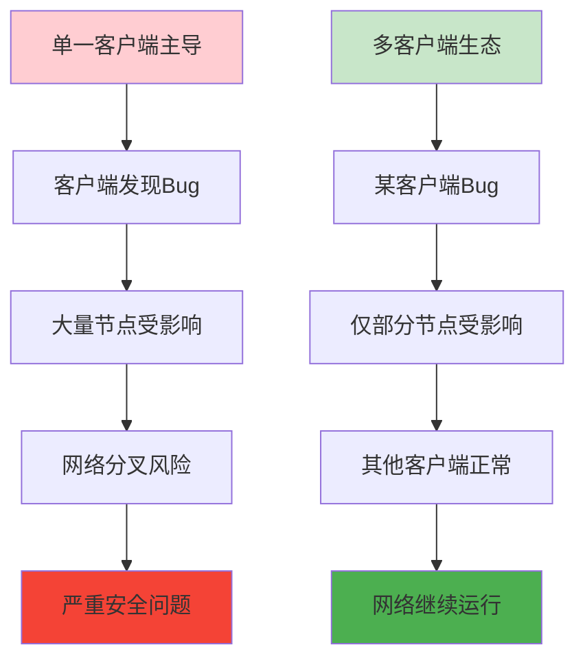

**历史教训：**

- 2016 年：Geth 和 Parity 对区块号的处理差异导致分叉
- 多客户端可以防止单点故障
- 目标：无单一客户端超过 33%份额

### 3. 网络层架构

#### P2P 网络拓扑

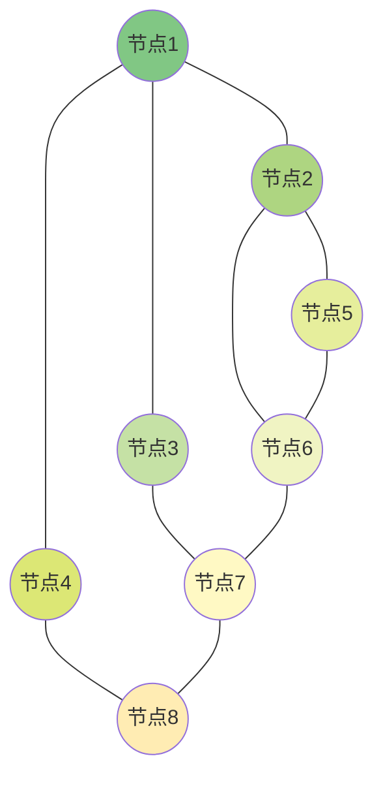

**特点：**

- 每个节点连接多个对等节点（通常 25-50 个）
- 无中心服务器
- 抗审查
- 高容错性

#### 网络协议栈

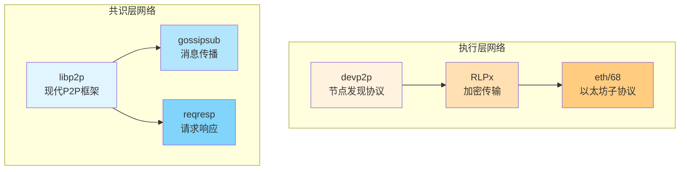

#### 交易传播流程

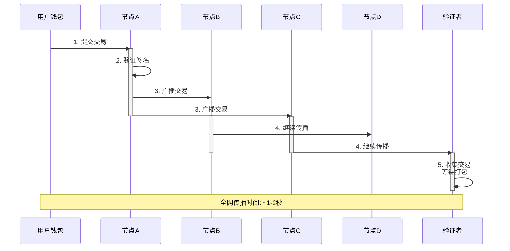

**传播过程详解：**

1. **交易验证**（每个节点）

   - 检查签名有效性
   - 验证 nonce 正确性
   - 确认余额充足
   - 检查 gas limit 合理

2. **广播策略**

   - 使用 gossip 协议
   - 每个节点转发给部分邻居
   - 使用哈希去重（不重复发送）
   - 优先传播高 gas price 交易

3. **区块传播**
   - 新区块产生后立即广播
   - 使用区块公告（announce）
   - 对等节点请求完整区块
   - 全网传播时间：~0.5-1 秒

---

## 状态与存储机制

### 1. 存储层次结构

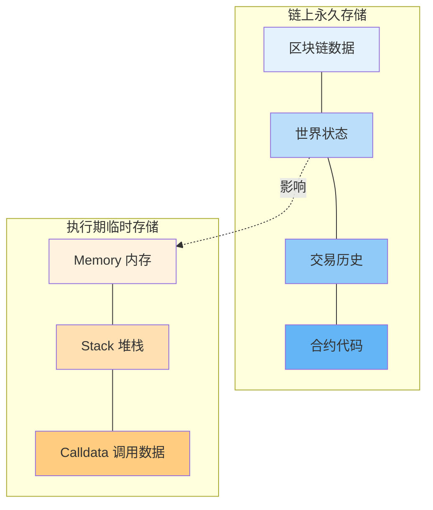

### 2. Merkle Patricia Trie（MPT）

#### 为什么使用 MPT？

**需求分析：**

```
✅ 快速查找 → Patricia Trie（前缀树）
✅ 高效验证 → Merkle Tree（哈希树）
✅ 节省空间 → 路径压缩
✅ 增量更新 → 仅修改路径

解决方案 = Merkle Tree + Patricia Trie
```

#### MPT 结构图

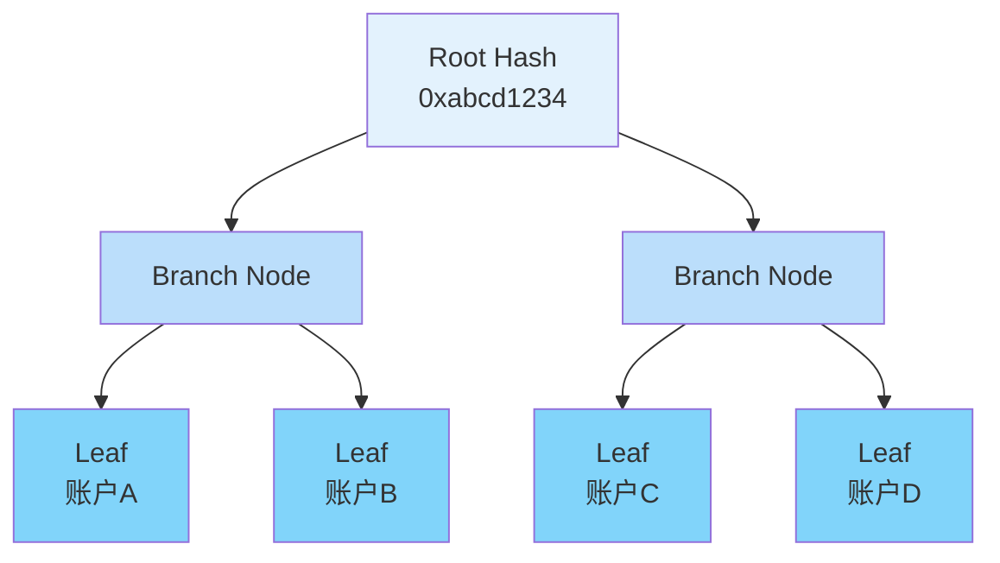

#### 三种 Trie 类型

**1. State Trie（状态树）**

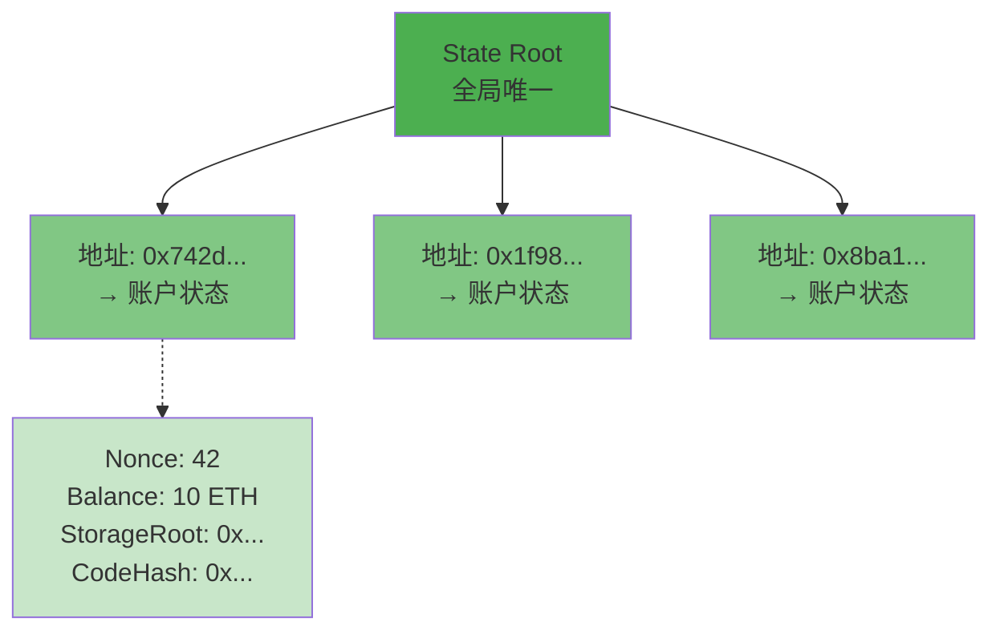

**2. Storage Trie（存储树）**

```mermaid
graph TB
    StorageRoot[Storage Root<br/>每个合约一个]

    Slot1[存储槽 0<br/>→ owner地址]
    Slot2[存储槽 1<br/>→ totalSupply]
    Slot3[存储槽 2<br/>→ balances映射]

    StorageRoot --> Slot1
    StorageRoot --> Slot2
    StorageRoot --> Slot3

    style StorageRoot fill:#2196f3
    style Slot1 fill:#64b5f6
    style Slot2 fill:#64b5f6
    style Slot3 fill:#64b5f6
```

**3. Transactions Trie（交易树）**

```mermaid
graph TB
    TxRoot[Transactions Root<br/>每个区块一个]

    Tx1[交易 0]
    Tx2[交易 1]
    Tx3[交易 2]
    TxN[交易 n...]

    TxRoot --> Tx1
    TxRoot --> Tx2
    TxRoot --> Tx3
    TxRoot --> TxN

    style TxRoot fill:#ff9800
    style Tx1 fill:#ffb74d
    style Tx2 fill:#ffb74d
    style Tx3 fill:#ffb74d
    style TxN fill:#ffb74d
```

#### MPT 的优势

**1. 高效验证（Merkle Proof）**

```
查询: "账户0x742d...的余额是多少?"

传统方式:
需要下载整个数据库 → 数TB

使用MPT:
只需要从根到叶的路径 → 几KB
```

```mermaid
graph LR
    A[验证者有<br/>State Root] --> B[请求账户数据<br/>+ Merkle Proof]
    B --> C[验证路径哈希]
    C --> D{匹配Root?}
    D -->|是| E[数据有效✓]
    D -->|否| F[数据无效✗]

    style A fill:#e3f2fd
    style E fill:#c8e6c9
    style F fill:#ffcdd2
```

**2. 增量更新**

```
修改一个账户:
只需要更新从根到该账户的路径
其他路径保持不变

例如:
账户A余额变化
→ 只更新3-4个节点
→ 而不是整棵树
```

### 3. 数据修剪（Pruning）

#### 状态增长问题

```mermaid
graph LR
    A[2015<br/>1GB] --> B[2018<br/>100GB]
    B --> C[2021<br/>400GB]
    C --> D[2024<br/>900GB+]

    style A fill:#c8e6c9
    style B fill:#fff9c4
    style C fill:#ffcc80
    style D fill:#ef9a9a
```

#### 修剪策略

**全节点修剪：**

```mermaid
graph TB
    A[保留最近128个区块的状态]
    B[修剪更早的中间状态]
    C[仍可验证新区块]
    D[存储空间: ~500GB]

    A --> B --> C --> D

    style A fill:#c8e6c9
    style D fill:#81c784
```

**归档节点（不修剪）：**

```mermaid
graph TB
    A[保留所有历史状态]
    B[每个区块的状态都可查询]
    C[用于区块浏览器、分析]
    D[存储空间: ~12TB+]

    A --> B --> C --> D

    style A fill:#ffcdd2
    style D fill:#f44336
```

**对比：**

| 特性     | 修剪节点    | 归档节点 |
| -------- | ----------- | -------- |
| 存储需求 | ~500GB      | ~12TB    |
| 历史查询 | 最近 128 块 | 所有历史 |
| 同步速度 | 快          | 慢       |
| 用途     | 日常使用    | 历史分析 |

---

## 共识机制

### 1. PoW 到 PoS 的演变

#### 历史时间线

```mermaid
timeline
    title 以太坊共识机制演变

    2015-07 : 主网启动<br/>PoW (Ethash)
            : 矿工竞争挖矿

    2020-12 : 信标链启动<br/>PoS并行运行
            : 验证者开始质押

    2022-09 : The Merge<br/>完全转向PoS
            : 能耗降低99.95%

    2023-04 : Shanghai升级<br/>支持提款
            : 质押ETH可取出
```

#### PoW vs PoS 对比

```mermaid
graph TB
    subgraph "PoW 工作量证明"
        POW1[算力竞争]
        POW2[能源密集]
        POW3[硬件军备竞赛]
        POW4[51%攻击成本=算力]

        POW1 --> POW2 --> POW3 --> POW4
    end

    subgraph "PoS 权益证明"
        POS1[质押竞争]
        POS2[能源友好]
        POS3[经济门槛]
        POS4[51%攻击成本=资本]

        POS1 --> POS2 --> POS3 --> POS4
    end

    style POW1 fill:#ffcdd2
    style POW2 fill:#ef9a9a
    style POW3 fill:#e57373
    style POW4 fill:#f44336
    style POS1 fill:#c8e6c9
    style POS2 fill:#a5d6a7
    style POS3 fill:#81c784
    style POS4 fill:#4caf50
```

**详细对比：**

| 特性           | PoW              | PoS                   |
| -------------- | ---------------- | --------------------- |
| **能源消耗**   | ~100 TWh/年      | ~0.01 TWh/年 ⬇️99.95% |
| **硬件需求**   | 专用矿机         | 普通服务器            |
| **参与门槛**   | 高（设备+电费）  | 中（32 ETH 质押）     |
| **区块时间**   | ~13.5 秒（可变） | ~12 秒（固定）        |
| **最终确定性** | ~6-30 分钟       | ~13 分钟（2 Epoch）   |
| **51%攻击**    | 需控制 51%算力   | 需控制 51%质押+被惩罚 |
| **环境影响**   | 巨大             | 极小                  |
| **中心化风险** | 矿池集中         | 大户集中（但可惩罚）  |

### 2. PoS 工作机制

#### Epoch 和 Slot

```mermaid
gantt
    title 1个Epoch = 32个Slots
    dateFormat YYYY-MM-DD HH:mm:ss
    axisFormat %M:%S

    section Slots
    Slot 0  : 2024-01-01 00:00:00, 12s
    Slot 1  : 2024-01-01 00:00:12, 12s
    Slot 2  : 2024-01-01 00:00:24, 12s
    Slot 3  : 2024-01-01 00:00:36, 12s
    ...     : 2024-01-01 00:00:48, 4m
    Slot 31 : 2024-01-01 00:06:12, 12s

    section Epoch
    Epoch 1 : 2024-01-01 00:00:00, 6m24s
```

**时间单位：**

```
1 Slot = 12秒
1 Epoch = 32 Slots = 384秒 ≈ 6.4分钟

每个Slot:
- 1个验证者被选为提议者（Proposer）
- 其他验证者组成委员会（Committee）投票
```

#### 验证者生命周期

```mermaid
stateDiagram-v2
    [*] --> 存入: 质押32 ETH
    存入 --> 激活队列: 等待激活
    激活队列 --> 活跃: 开始验证

    活跃 --> 提议者: 被选中提议区块
    活跃 --> 证明者: 委员会成员投票

    提议者 --> 活跃: 完成提议
    证明者 --> 活跃: 完成投票

    活跃 --> 退出队列: 主动退出
    活跃 --> Slashed: 恶意行为

    退出队列 --> 已退出: 等待期结束
    Slashed --> 已退出: 被惩罚

    已退出 --> [*]: 取回ETH
```

#### 区块提议过程

```mermaid
sequenceDiagram
    participant V1 as 提议者<br/>验证者1
    participant V2 as 证明者<br/>验证者2-N
    participant N as 网络
    participant BC as 区块链

    Note over V1: Slot N开始
    V1->>V1: 1. 选择交易
    V1->>V1: 2. 执行交易
    V1->>V1: 3. 构建区块
    V1->>N: 4. 广播区块

    N->>V2: 5. 分发区块
    activate V2
    V2->>V2: 6. 验证区块
    V2->>V2: 7. 投票(Attestation)
    V2->>N: 8. 广播投票
    deactivate V2

    N->>BC: 9. 收集投票

    alt 获得2/3+投票
        BC->>BC: 10. 区块被接受
        Note over BC: 状态更新
    else 投票不足
        BC->>BC: 11. 区块被拒绝
        Note over BC: 保持原状态
    end
```

### 3. 奖励与惩罚机制

#### 奖励结构

```mermaid
graph TB
    R[验证者奖励]

    R1[基础奖励<br/>每个Epoch]
    R2[提议者奖励<br/>成功提议区块]
    R3[同步委员会<br/>参与同步]
    R4[交易小费<br/>Priority Fee]

    R --> R1
    R --> R2
    R --> R3
    R --> R4

    style R fill:#c8e6c9
    style R1 fill:#81c784
    style R2 fill:#66bb6a
    style R3 fill:#4caf50
    style R4 fill:#43a047
```

**奖励详情：**

```
基础奖励 (Base Reward):
- 每个Epoch给所有活跃验证者
- 取决于总质押量
- 年化收益率: ~3-5%

提议者奖励 (Proposer Reward):
- 成功提议区块时获得
- 约为基础奖励的1/8
- 包含attestations的小费

同步委员会奖励:
- 随机选中参与同步委员会
- 额外奖励

交易小费 (Tips):
- EIP-1559的Priority Fee
- 完全归验证者所有
```

#### 惩罚机制

```mermaid
graph TB
    P[惩罚类型]

    P1[离线罚款<br/>Inactivity Leak]
    P2[错误证明<br/>Minor Penalty]
    P3[Slashing<br/>严重惩罚]

    P --> P1
    P --> P2
    P --> P3

    D1[轻微<br/>-少量奖励]
    D2[中等<br/>-基础奖励]
    D3[严重<br/>-大量质押甚至全部]

    P1 --> D1
    P2 --> D2
    P3 --> D3

    style P fill:#ffcdd2
    style P1 fill:#ef9a9a
    style P2 fill:#e57373
    style P3 fill:#f44336
    style D1 fill:#fff9c4
    style D2 fill:#ffcc80
    style D3 fill:#ff6f00
```

**Slashing 触发条件：**

```
1. 双重签名 (Double Signing):
   - 对同一Slot提议两个不同区块
   - 惩罚: 损失1 ETH + 被强制退出

2. 环绕投票 (Surround Vote):
   - 投票包围之前的投票
   - 试图改写历史
   - 惩罚: 损失至少1 ETH

3. 双重投票 (Double Vote):
   - 对同一目标进行两次不同投票
   - 惩罚: 损失至少1 ETH

严重情况:
- 如果同时有很多验证者被slash
- 相关惩罚会加重（最高可损失全部32 ETH）
```

### 4. 最终确定性

#### Casper FFG（友好的最终性工具）

```mermaid
graph LR
    B1[区块N] --> B2[区块N+1]
    B2 --> B3[区块N+2]

    B3 --> J1[Justified<br/>合理化]
    J1 --> J2[+1 Epoch]
    J2 --> F1[Finalized<br/>最终确定]

    style B1 fill:#e3f2fd
    style B2 fill:#bbdefb
    style B3 fill:#90caf9
    style J1 fill:#fff9c4
    style J2 fill:#ffcc80
    style F1 fill:#c8e6c9
```

**确定性流程：**

```
Slot N: 区块提议
    ↓
等待2/3+验证者投票
    ↓
Checkpoint N: Justified（合理化）
    ↓
等待下一个Epoch（32 slots）
    ↓
Checkpoint N+1: 也被Justified
    ↓
Checkpoint N: Finalized（最终确定）
    ↓
永久不可逆！

总时间: 约12.8分钟（2个Epoch）
```

#### 最终确定性可视化

```mermaid
gantt
    title 区块最终确定时间线
    dateFormat YYYY-MM-DD HH:mm:ss
    axisFormat %M:%S

    section 提议
    区块N提议     : 2024-01-01 00:00:00, 12s

    section Epoch 1
    收集投票      : 2024-01-01 00:00:12, 372s
    Justified     : 2024-01-01 00:06:24, 1s

    section Epoch 2
    继续确认      : 2024-01-01 00:06:25, 383s
    Finalized     : 2024-01-01 00:12:48, 1s
```

---

## 实践练习

### 练习 1：运行本地节点

**目标：** 体验节点同步过程

**步骤：**

```bash
# 1. 安装Geth（执行层客户端）
# macOS
brew install ethereum

# Ubuntu
sudo add-apt-repository ppa:ethereum/ethereum
sudo apt-get update
sudo apt-get install ethereum

# 2. 启动节点（Sepolia测试网）
geth --sepolia --http --http.api eth,net,web3

# 3. 检查同步状态
geth attach http://localhost:8545
> eth.syncing
> eth.blockNumber

# 4. 查看连接的节点
> admin.peers
```

### 练习 2：分析区块结构

**使用 Etherscan：**

1. 访问 https://etherscan.io/blocks
2. 点击最新区块
3. 观察区块信息：
   - Block Height（区块号）
   - Timestamp（时间戳）
   - Transactions（交易数）
   - Gas Used（Gas 使用）
   - Base Fee（基础费用）

**使用 Web3.js：**

```javascript
const Web3 = require('web3');
const web3 = new Web3('https://mainnet.infura.io/v3/YOUR_KEY');

// 获取最新区块
web3.eth.getBlock('latest').then(console.log);

// 获取指定区块
web3.eth.getBlock(18000000).then((block) => {
  console.log('区块号:', block.number);
  console.log('时间戳:', block.timestamp);
  console.log('交易数:', block.transactions.length);
  console.log('Gas使用:', block.gasUsed);
  console.log('矿工/验证者:', block.miner);
});
```

### 练习 3：探索状态树

**使用 Geth Debug API：**

```javascript
// 获取账户状态
geth attach http://localhost:8545

> debug.traceTransaction("0xTxHash", {tracer: "prestateTracer"})

// 查看Storage变化
> debug.storageRangeAt(
    "0xBlockHash",
    0, // transaction index
    "0xContractAddress",
    "0x0000000000000000000000000000000000000000000000000000000000000000",
    1024
)
```

### 练习 4：监控网络状态

**使用公开监控工具：**

1. **Ethernodes**

   - https://ethernodes.org/
   - 查看全球节点分布

2. **Etherscan Node Tracker**

   - https://etherscan.io/nodetracker
   - 客户端分布统计

3. **Beaconcha.in**
   - https://beaconcha.in/
   - PoS 验证者统计
   - Epoch 和 Slot 实时信息

---

## 参考资料

### 官方文档

1. **Ethereum.org - Architecture**

   - https://ethereum.org/en/developers/docs/ethereum-stack/
   - 完整技术栈文档

2. **Ethereum Yellow Paper**

   - https://ethereum.github.io/yellowpaper/paper.pdf
   - 以太坊技术规范

3. **Consensus Specs**

   - https://github.com/ethereum/consensus-specs
   - PoS 共识规范

4. **Execution Specs**
   - https://github.com/ethereum/execution-specs
   - 执行层规范

### 架构深入

5. **The Merge Documentation**

   - https://ethereum.org/en/roadmap/merge/
   - 合并技术详情

6. **State Trie Pruning**

   - https://blog.ethereum.org/2015/06/26/state-tree-pruning
   - 状态修剪原理

7. **Merkle Patricia Trie Specification**
   - https://ethereum.org/en/developers/docs/data-structures-and-encoding/patricia-merkle-trie/
   - MPT 详细说明

### 客户端资源

8. **Geth Documentation**

   - https://geth.ethereum.org/docs
   - Go-Ethereum 文档

9. **Erigon GitHub**

   - https://github.com/ledgerwatch/erigon
   - 高效客户端实现

10. **Prysm Documentation**

    - https://docs.prylabs.network/
    - 共识层客户端

11. **Lighthouse Book**
    - https://lighthouse-book.sigmaprime.io/
    - Rust 共识客户端

### 共识机制

12. **Proof of Stake FAQ**

    - https://eth2book.info/
    - PoS 常见问题

13. **Casper FFG Paper**

    - https://arxiv.org/abs/1710.09437
    - 最终性论文

14. **Gasper Paper**
    - https://arxiv.org/abs/2003.03052
    - 完整共识协议

### 网络层

15. **devp2p Specifications**

    - https://github.com/ethereum/devp2p
    - P2P 协议规范

16. **libp2p Documentation**
    - https://docs.libp2p.io/
    - 共识层网络库

### 工具和监控

17. **Ethernodes**

    - https://ethernodes.org/
    - 节点统计

18. **Beaconcha.in**

    - https://beaconcha.in/
    - 信标链浏览器

19. **Etherscan**

    - https://etherscan.io/
    - 区块链浏览器

20. **Grafana Dashboards**
    - https://github.com/ethereum/node-crawler/tree/master/dashboards
    - 节点监控面板

### 学习资源

21. **Mastering Ethereum**

    - https://github.com/ethereumbook/ethereumbook
    - 开源书籍

22. **Ethereum StackExchange**

    - https://ethereum.stackexchange.com/
    - 问答社区

23. **EthResearch**

    - https://ethresear.ch/
    - 研究论坛

24. **Week in Ethereum News**
    - https://weekinethereumnews.com/
    - 每周更新

### 视频教程

25. **Finematics - Ethereum 2.0**

    - https://www.youtube.com/c/Finematics
    - 动画解释

26. **Vitalik Buterin Talks**
    - https://www.youtube.com/@VitalikButerin
    - 创始人演讲

---

## 总结

### 核心要点

**以太坊架构的核心：**

```
✅ 双层架构
   - 执行层：处理交易和智能合约
   - 共识层：PoS验证和最终确定

✅ 两种账户
   - EOA：用户控制
   - 合约：代码控制

✅ 三种Trie
   - State Trie：全局状态
   - Storage Trie：合约存储
   - Transactions Trie：交易记录

✅ 四种节点
   - 全节点：完整验证
   - 轻节点：依赖验证
   - 归档节点：历史查询
   - 验证者：参与共识

✅ PoS共识
   - Slot/Epoch机制
   - 奖励和惩罚
   - 最终确定性
```

### 学习路径

**初学者：**

1. 理解账户和交易概念
2. 使用 Etherscan 查看区块
3. 运行轻节点体验
4. 了解 PoS 基本原理

**进阶：**

1. 深入 MPT 数据结构
2. 研究共识协议细节
3. 运行全节点
4. 参与测试网验证

**高级：**

1. 阅读以太坊黄皮书
2. 贡献客户端代码
3. 研究 MEV 和 Layer 2
4. 参与协议改进提案

### 未来展望

**以太坊路线图：**

```mermaid
timeline
    title 以太坊未来发展

    2024 : Dencun升级<br/>Blob交易
         : Layer 2成本降低

    2025-26 : Verkle树<br/>替代MPT
            : 更高效的状态存储

    2026-27 : 分片<br/>Sharding
            : 数据可用性分片

    2027+ : 单槽最终确定<br/>SSF
          : 更快的确认时间
```

**持续改进：**

- 降低验证者门槛（< 32 ETH）
- 提高吞吐量
- 优化存储效率
- 增强隐私功能

---

**恭喜完成学习！** 🎉

你现在应该对以太坊的整体架构有了深入理解。继续学习下一部分《EVM 工作原理》，深入了解智能合约的执行机制！

_最后更新：2025 年 11 月_
_祝你在区块链世界探索愉快！🚀_
