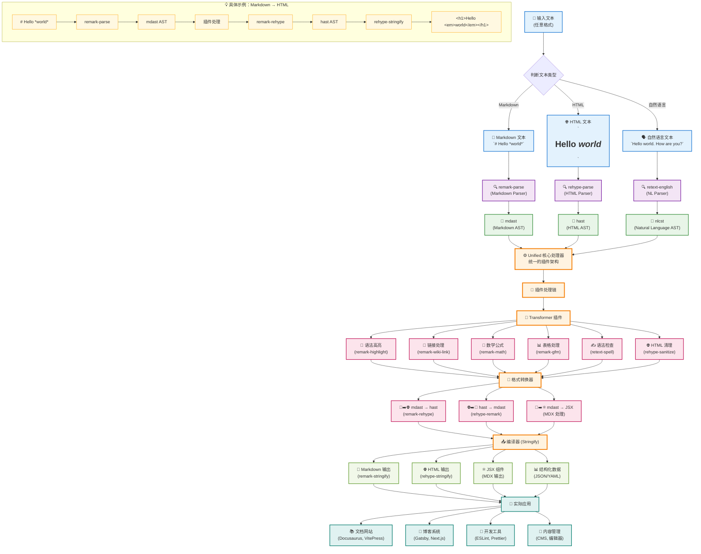

# unified

本文是 MDX 系列全解的第一篇的文章，主要介绍 unified 库，它是 MDX 系列文章的核心库，用于解析和转换 MDX 内容。

在整个MDX的体系中 他是底层基础设施, 不仅可以处理 markdown html 还是处理纯文本语言 或者其他内容 然后将它们转化成结构化语法。

在这个流程中 你不需要手动取处理 `syntax`跟`parser` 直接使用unified 提供的api 就可以完成这个过程。

具体的流程图如下所示

根据上面的流程图 分接下 整个生态系统

## 生态系统

解析器

- [rehype](https://unifiedjs.com/explore/project/rehypejs/rehype/) -- HTML
- [remark](https://unifiedjs.com/explore/project/remarkjs/remark/) -- Markdown
- [retext](https://unifiedjs.com/explore/project/retextjs/retext/) -- Natural Language

词法定义
- [esast](https://github.com/syntax-tree/esast) -- ECMAScript
- [mdast](https://github.com/syntax-tree/mdast) -- Markdown
- [hast](https://github.com/syntax-tree/hast) -- HTML
- [nlcst](https://github.com/syntax-tree/nlcst) -- Natural Language
- [unist](https://github.com/syntax-tree/unist) -- Universal Syntax Tree

## 工作流程

1. parser
2. transform
3. stringify
## 参考
- [官方文档](https://unifiedjs.com/learn/guide/introduction-to-unified/)