# unified

本文是 MDX 系列全解的第一篇的文章，主要介绍 unified 库，它是 MDX 系列文章的核心库，用于解析和转换 MDX 内容。

在整个MDX的体系中 他是底层基础设施, 不仅可以处理 markdown html 还是处理纯文本语言 或者其他内容 然后将它们转化成结构化语法。

在这个流程中 你不需要手动取处理 `syntax`跟`parser` 直接使用unified 提供的api 就可以完成这个过程。

具体的流程图如下所示

```mermaid
graph TD
    %% 输入阶段
    A["📄 输入文本<br/>(任意格式)"] --> B{判断文本类型}
    
    B -->|Markdown| MD["📝 Markdown 文本<br/>`# Hello *world*`"]
    B -->|HTML| HTML["🌐 HTML 文本<br/>`<h1>Hello <em>world</em></h1>`"]
    B -->|自然语言| NL["🗣️ 自然语言文本<br/>`Hello world. How are you?`"]
    
    %% 解析阶段 - 不同的 Parser
    MD --> P1["🔍 remark-parse<br/>(Markdown Parser)"]
    HTML --> P2["🔍 rehype-parse<br/>(HTML Parser)"]
    NL --> P3["🔍 retext-english<br/>(NL Parser)"]
    
    %% AST 生成
    P1 --> AST1["🌳 mdast<br/>(Markdown AST)"]
    P2 --> AST2["🌳 hast<br/>(HTML AST)"]
    P3 --> AST3["🌳 nlcst<br/>(Natural Language AST)"]
    
    %% Unified 核心处理
    AST1 --> CORE["⚙️ Unified 核心处理器<br/>统一的插件架构"]
    AST2 --> CORE
    AST3 --> CORE
    
    %% 插件处理阶段
    CORE --> PLUGINS["🧩 插件处理链"]
    
    PLUGINS --> TRANS["🔄 Transformer 插件"]
    TRANS --> T1["🎨 语法高亮<br/>(remark-highlight)"]
    TRANS --> T2["🔗 链接处理<br/>(remark-wiki-link)"]
    TRANS --> T3["📐 数学公式<br/>(remark-math)"]
    TRANS --> T4["📊 表格处理<br/>(remark-gfm)"]
    TRANS --> T5["✍️ 语法检查<br/>(retext-spell)"]
    TRANS --> T6["🌐 HTML 清理<br/>(rehype-sanitize)"]
    
    %% 转换阶段
    T1 --> CONVERT["🔄 格式转换器"]
    T2 --> CONVERT
    T3 --> CONVERT
    T4 --> CONVERT
    T5 --> CONVERT
    T6 --> CONVERT
    
    CONVERT --> C1["📝➡️🌐 mdast → hast<br/>(remark-rehype)"]
    CONVERT --> C2["🌐➡️📝 hast → mdast<br/>(rehype-remark)"]
    CONVERT --> C3["📝➡️⚛️ mdast → JSX<br/>(MDX 处理)"]
    
    %% 编译输出阶段
    C1 --> COMPILE["📤 编译器 (Stringify)"]
    C2 --> COMPILE
    C3 --> COMPILE
    
    COMPILE --> O1["📄 Markdown 输出<br/>(remark-stringify)"]
    COMPILE --> O2["🌐 HTML 输出<br/>(rehype-stringify)"]
    COMPILE --> O3["⚛️ JSX 组件<br/>(MDX 输出)"]
    COMPILE --> O4["📊 结构化数据<br/>(JSON/YAML)"]
    
    %% 实际应用
    O1 --> APP["🚀 实际应用"]
    O2 --> APP
    O3 --> APP
    O4 --> APP
    
    APP --> USE1["📚 文档网站<br/>(Docusaurus, VitePress)"]
    APP --> USE2["📝 博客系统<br/>(Gatsby, Next.js)"]
    APP --> USE3["🔧 开发工具<br/>(ESLint, Prettier)"]
    APP --> USE4["📖 内容管理<br/>(CMS, 编辑器)"]
    
    %% 具体示例流程
    subgraph example ["💡 具体示例：Markdown → HTML"]
        EX1["# Hello *world*"] --> EX2["remark-parse"]
        EX2 --> EX3["mdast AST"]
        EX3 --> EX4["插件处理"]
        EX4 --> EX5["remark-rehype"]
        EX5 --> EX6["hast AST"]
        EX6 --> EX7["rehype-stringify"]
        EX7 --> EX8["&lt;h1&gt;Hello &lt;em&gt;world&lt;/em&gt;&lt;/h1&gt;"]
    end
    
    %% 样式定义
    classDef inputStyle fill:#e3f2fd,stroke:#1976d2,stroke-width:2px
    classDef parserStyle fill:#f3e5f5,stroke:#7b1fa2,stroke-width:2px
    classDef astStyle fill:#e8f5e8,stroke:#388e3c,stroke-width:2px
    classDef coreStyle fill:#fff3e0,stroke:#f57c00,stroke-width:3px
    classDef pluginStyle fill:#fce4ec,stroke:#c2185b,stroke-width:2px
    classDef outputStyle fill:#f1f8e9,stroke:#689f38,stroke-width:2px
    classDef appStyle fill:#e0f2f1,stroke:#00796b,stroke-width:2px
    classDef exampleStyle fill:#fff8e1,stroke:#ffa000,stroke-width:1px
    
    class A,MD,HTML,NL inputStyle
    class P1,P2,P3 parserStyle
    class AST1,AST2,AST3 astStyle
    class CORE,PLUGINS,TRANS,CONVERT,COMPILE coreStyle
    class T1,T2,T3,T4,T5,T6,C1,C2,C3 pluginStyle
    class O1,O2,O3,O4 outputStyle
    class APP,USE1,USE2,USE3,USE4 appStyle
    class EX1,EX2,EX3,EX4,EX5,EX6,EX7,EX8 exampleStyle
```

根据上面的流程图 分接下 整个生态系统

## 生态系统

解析器

- [rehype](https://unifiedjs.com/explore/project/rehypejs/rehype/) -- HTML
- [remark](https://unifiedjs.com/explore/project/remarkjs/remark/) -- Markdown
- [retext](https://unifiedjs.com/explore/project/retextjs/retext/) -- Natural Language

词法定义
- [esast](https://github.com/syntax-tree/esast) -- ECMAScript
- [mdast](https://github.com/syntax-tree/mdast) -- Markdown
- [hast](https://github.com/syntax-tree/hast) -- HTML
- [nlcst](https://github.com/syntax-tree/nlcst) -- Natural Language
- [unist](https://github.com/syntax-tree/unist) -- Universal Syntax Tree

## 工作流程

1. parser
  - 将输入的文本转成对对应的AST树 比如markdown转成mdast  html转成hast 自然语言转成nlcst
2. transform
  - 对AST树进行转换 比如将mdast转换成hast 将hast转换成mdast 将自然语言转换成nlcst 将nlcst转换成自然语言
  - 在这个过程中 你可以使用插件来对AST树进行转换 比如使用remark-highlight来对mdast进行语法高亮 使用remark-wiki-link来对mdast进行链接处理 使用remark-math来对mdast进行数学公式处理 使用remark-gfm来对mdast进行表格处理 使用retext-spell来对nlcst进行语法检查 使用rehype-sanitize来对hast进行HTML清理
3. stringify
  - 将转换后的AST树转成对应的文本 比如将mdast转换成markdown 将hast转换成html 将自然语言转换成自然语言
  - 在这个过程中 你可以使用插件来对文本进行转换比如使用remark-stringify来对mdast进行markdown转换 使用rehype-stringify来对hast进行html转换 使用retext-stringify来对nlcst进行自然语言转换

## 插件

### 基础插件

- [remark-highlight](https://github.com/remarkjs/remark-highlight) -- 语法高亮
- [remark-wiki-link](https://github.com/remarkjs/remark-wiki-link) -- 链接处理
- [remark-math](https://github.com/remarkjs/remark-math) -- 数学公式处理
- [remark-gfm](https://github.com/remarkjs/remark-gfm) -- 表格处理
- [retext-spell](https://github.com/retextjs/retext-spell) -- 语法检查
- [rehype-sanitize](https://github.com/rehypejs/rehype-sanitize) -- HTML清理

### 转换插件

- [remark-rehype](https://github.com/remarkjs/remark-rehype) -- markdown转html
- [rehype-remark](https://github.com/rehypejs/rehype-remark) -- html转markdown
- [remark-retext](https://github.com/remarkjs/remark-retext) -- markdown转自然语言
- [rehype-retext](https://github.com/rehypejs/rehype-retext) -- html转自然语言

## 使用用例
因为 unified 整个流程可以转换不用的内容格式 因此除了在 markdown 到html 的转化外 还有完成一些较为复杂的集成用例。
这些都被做成了整个复杂的插件体系。

- [rehype-minify](https://github.com/rehypejs/rehype-minify) -- html压缩
- [rehype-react](https://github.com/rehypejs/rehype-react) -- html转react组件
- [rehype-starry-night](https://github.com/rehypejs/rehype-starry-night) -- html转starry-night组件 代码高亮展示
- [remark-gfm](https://github.com/remarkjs/remark-gfm) -- gfm支持
- [remark-directive](https://github.com/remarkjs/remark-directive) -- 指令支持
- [remark-lint](https://github.com/remarkjs/remark-gfm) 检查markdown 代码格式
- [remark-toc](https://github.com/remarkjs/remark-toc) -- 生成目录

其实还有一些关于 retext 格式的插件 后面如果有机会的话 我们继续讲解。 这期主要是关于 remark 插件体系 以及 rehype 插件系统

## 参考
- [官方文档](https://unifiedjs.com/learn/guide/introduction-to-unified/)