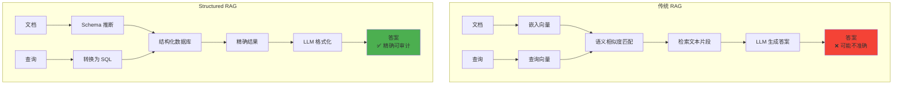
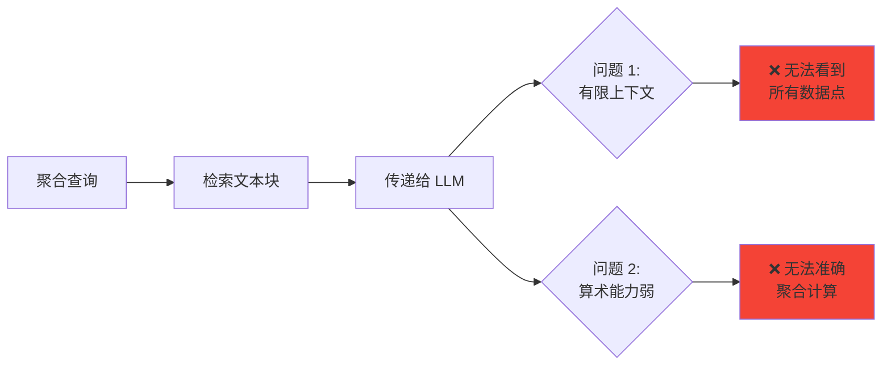
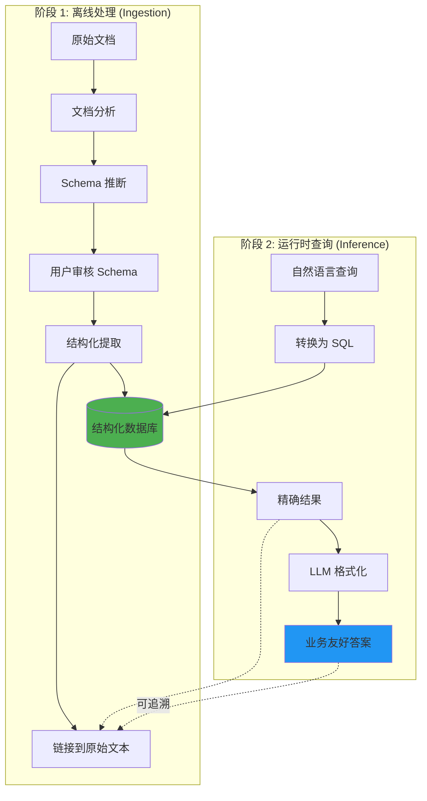
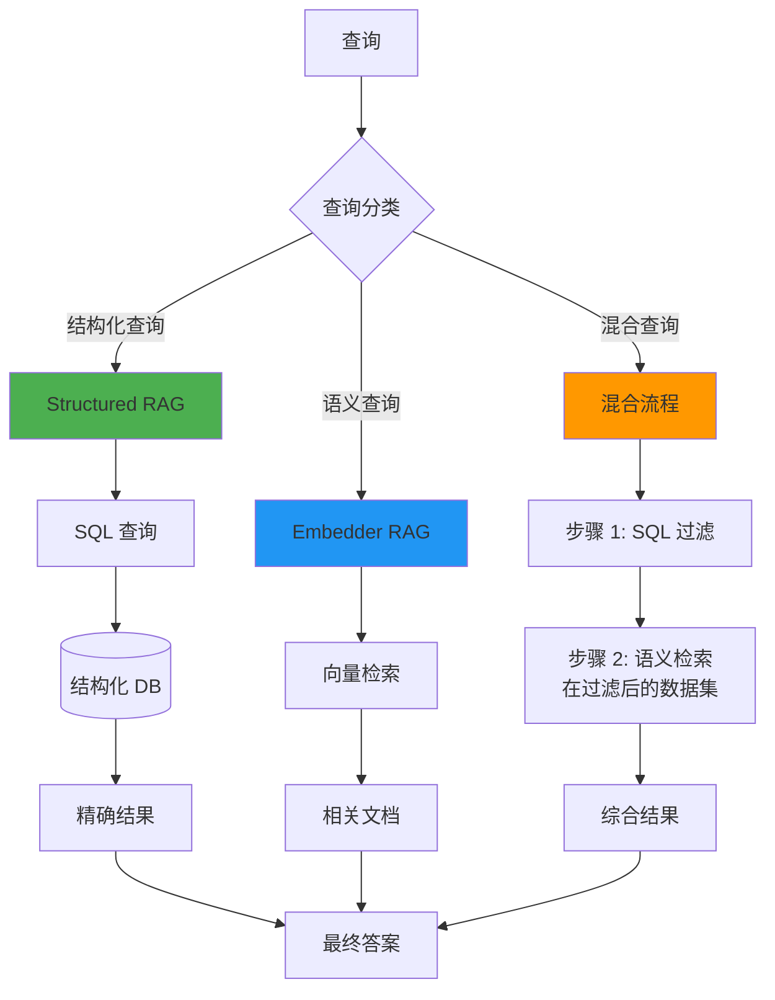
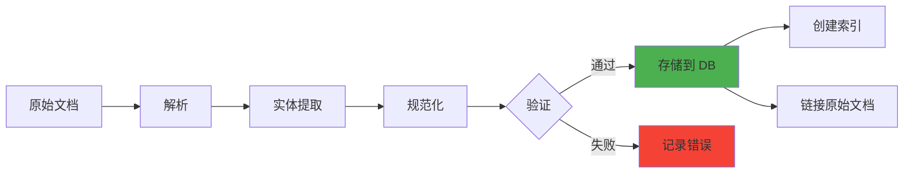
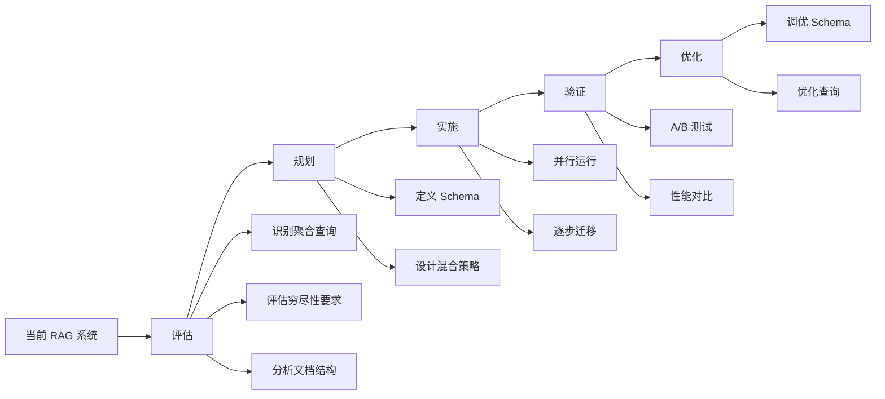

# 结构化 RAG：企业级精确检索的解决方案

> 基于 AI21 Maestro 的 Structured RAG 技术  
> 解决传统 RAG 在企业场景中的准确性盲区

## 目录

1. [核心问题](#核心问题)
2. [什么是 Structured RAG](#什么是-structured-rag)
3. [传统 RAG 的三大致命缺陷](#传统-rag-的三大致命缺陷)
4. [Structured RAG 工作原理](#structured-rag-工作原理)
5. [混合检索架构](#混合检索架构)
6. [性能提升数据](#性能提升数据)
7. [实现指南](#实现指南)
8. [企业应用场景](#企业应用场景)
9. [最佳实践](#最佳实践)

---

## TL;DR (核心要点)

```
问题：传统 RAG 在复杂企业查询中表现不佳，导致答案不完整或不可靠

解决方案：Structured RAG (S-RAG)
  └─ 将非结构化文档转换为结构化、查询感知的表示
  └─ 实现精确、可审计的推理

关键创新：混合架构
  └─ 结合结构化检索 + 嵌入式检索
  └─ 准确率提升高达 60%
  └─ 召回率接近完美

企业级特性：
  ✓ 自动推断或用户自定义 Schema
  ✓ 处理数百万文档
  ✓ 完全透明和可控
  ✓ 适用于合规、报告和关键业务流程
```

---

## 核心问题

### 企业的痛点

**场景**: 你向 AI 系统询问绩效趋势或供应商比较

**传统 RAG 的结果**:
- ✅ 回答流畅
- ❌ 但不总是可靠
- ❌ 可能只给出部分信息
- ❌ 可能遗漏关键数据点
- ❌ 可能汇总不相关的信息

**在金融和合规领域，这些缺口不是无害的 —— 它们是重大风险。**

---

## 什么是 Structured RAG

### 核心概念



### 关键区别

| 维度 | 传统 RAG | Structured RAG |
|------|---------|---------------|
| **数据表示** | 非结构化文本块 | 结构化关系数据库 |
| **检索方式** | 向量相似度 | SQL 查询 |
| **处理时机** | 运行时检索 | 离线提取 + 运行时查询 |
| **准确性** | 依赖 LLM 猜测 | 精确数据检索 |
| **可审计性** | 低 | 高 (SQL 可追溯) |
| **聚合能力** | 弱 | 强 (原生 SQL 聚合) |

---

## 传统 RAG 的三大致命缺陷

### 缺陷 1: 无法回答聚合性问题

#### 典型场景

**金融和合规团队经常遇到的查询**:

```
❌ 失败的查询示例:

1. "去年所有子公司中最大的资本支出是多少？"
2. "按准时交付率排名的前五名供应商是谁？"
3. "安全事故如何按季度趋势变化？"
```

**为什么传统 RAG 失败**:



**核心问题**:
- 这些不是"大海捞针"式查询（找到一个答案）
- 需要**过滤、比较、聚合**数十甚至数百条记录
- 传统 RAG 没有通用方法执行这些操作
- LLM 必须在有限的上下文窗口内尝试推理，而其算术能力非常有限

---

### 缺陷 2: 无法保证穷尽覆盖

#### 典型场景

**企业团队经常需要完整、穷尽的列表**:

```
❌ 失败的查询示例:

1. "列出所有 2025 年前到期且罚金条款超过 100 万美元的合同"
2. "哪些员工的认证将在今年到期？"
3. "显示所有监管变化影响报告要求的市场"
```

**为什么传统 RAG 失败**:

```
问题: 遗漏任何一项不是不便，而是合规风险

传统 RAG 的局限:
  ├─ 本质上是概率性的
  ├─ 优化为找到"最匹配"的块
  ├─ 只获取基于相似度评分的文档子集
  └─ 永远无法保证完全检索
```

**企业影响**:

| 领域 | 遗漏数据的后果 |
|------|--------------|
| 财务报告 | 合规违规、监管处罚 |
| 法律合规 | 法律风险、审计失败 |
| 供应链 | 合同违约、财务损失 |
| HR 管理 | 认证过期、合规问题 |

---

### 缺陷 3: 密集或非指示性语料库

#### 问题描述

**场景**: 技术文档或监管文件

**特征**:
- 密集、重复、属性驱动
- 文档之间可能仅因几个数字或条款不同
- 查询可能关注精确属性（条款编号、模型 ID）

**嵌入相似度崩溃**:

```
示例: 财务分析查询

问题:
  大多数报告看起来几乎相同
  包含相似术语："总负债"、"股东权益"、"净收入"

对嵌入器来说:
  ├─ 所有文档都"看起来"相关
  ├─ 语义检索表面上相似的文档
  └─ 但实际上不回答问题

结果:
  ❌ 检索变得嘈杂
  ❌ 不相关但"接近"的段落挤掉真正的答案
```

---

## Structured RAG 工作原理

### 架构概览



---

### 详细工作流程

#### 步骤 1: Schema 推断

**AI21 Maestro 如何自动检测模式**:

```python
# 示例: 财务报告

检测到的模式:
{
    "schema_name": "财务报告",
    "attributes": [
        {
            "name": "company_name",
            "type": "string",
            "description": "公司名称"
        },
        {
            "name": "fiscal_year",
            "type": "integer",
            "description": "财年"
        },
        {
            "name": "revenue",
            "type": "decimal",
            "description": "收入（百万美元）",
            "unit": "million_usd"
        },
        {
            "name": "operating_expenses",
            "type": "decimal",
            "description": "运营费用（百万美元）",
            "unit": "million_usd"
        },
        {
            "name": "current_liabilities",
            "type": "decimal",
            "description": "流动负债（百万美元）",
            "unit": "million_usd"
        }
    ]
}
```

**模式推断的智能之处**:

```
文档中的不同格式:
  - "1,000,000"
  - "1M"
  - "1"
  - "一百万"

统一后的格式:
  → 1000000 (decimal)
  → 单位: million_usd
```

---

#### 步骤 2: 结构化提取

**转换过程**:

```
原始文档 (非结构化):
┌─────────────────────────────────────────┐
│ Netflix Inc. - Annual Report 2017       │
│                                         │
│ Financial Highlights:                   │
│ Total Revenue: $11.7 billion            │
│ Operating Expenses: $9.1B               │
│ Current Liabilities: $4,538 million     │
│ ...                                     │
└─────────────────────────────────────────┘

↓ 结构化提取

结构化记录:
┌─────────────────────────────────────────┐
│ company_name        | Netflix           │
│ fiscal_year         | 2017              │
│ revenue             | 11700.0 (million) │
│ operating_expenses  | 9100.0 (million)  │
│ current_liabilities | 4538.0 (million)  │
│ source_doc_id       | doc_12345         │
│ source_page         | 3                 │
└─────────────────────────────────────────┘
```

---

#### 步骤 3: SQL 查询生成

**示例查询**:

**用户问题**: "Netflix 在 2017 年的流动负债是多少（以百万美元计）？"

**传统 RAG**:
```
1. 检索包含 "Netflix" 和 "2017" 和 "流动负债" 的文本块
2. 希望 LLM 能从文本中提取正确数字
3. LLM 可能会:
   - 提取错误的数字
   - 混淆不同年份的数据
   - 返回不同单位的值
```

**Structured RAG**:
```sql
SELECT
    current_liabilities / 1000000 AS current_liabilities_millions
FROM
    SEC_Report
WHERE
    LOWER(company_name) = 'netflix'
    AND fiscal_year = 2017
```

**结果**:
```
精确值: 4,538 百万美元
来源: SEC Report, Page 3, Line 47
置信度: 100%
```

---

### 实际案例对比

#### 案例 1: 聚合查询

**查询**: "所有子公司中 2023 年最高的年度经常性收入 (ARR) 是多少？"

**传统 RAG**:
```
1. 检索提到 "ARR" 和 "2023" 的文档
2. 传递给 LLM
3. LLM 尝试从文本中找到最大值

结果:
  ❌ 可能遗漏某些子公司
  ❌ 可能混淆不同指标
  ❌ 无法验证答案的完整性
```

**Structured RAG**:
```sql
SELECT
    subsidiary_name,
    MAX(arr) AS max_arr
FROM
    Financial_Data
WHERE
    fiscal_year = 2023
GROUP BY
    subsidiary_name
ORDER BY
    max_arr DESC
LIMIT 1
```

```
结果:
  ✅ 精确值: $125.3M (Subsidiary Alpha)
  ✅ 保证检查了所有子公司
  ✅ 可审计: SQL 查询可追溯
```

---

#### 案例 2: 穷尽列表

**查询**: "列出所有 2020 年后签订且包含仲裁条款的合同"

**传统 RAG**:
```
检索: 相似度最高的 10 个合同
问题: 如果有 15 个符合条件的合同怎么办？

结果:
  ❌ 遗漏 5 个合同
  ❌ 合规风险
  ❌ 无法保证完整性
```

**Structured RAG**:
```sql
SELECT
    contract_id,
    contract_name,
    signing_date,
    arbitration_clause
FROM
    Contracts
WHERE
    signing_date > '2020-01-01'
    AND arbitration_clause = TRUE
ORDER BY
    signing_date DESC
```

```
结果:
  ✅ 返回所有 15 个符合条件的合同
  ✅ 保证 100% 召回率
  ✅ 合规安全
```

---

## 混合检索架构

### 为什么需要混合？

**现实**:

```
并非所有信息都适合结构化

场景 1: 结构化属性
  → "2023 年的总收入是多少？"
  → 完美适合 SQL

场景 2: 叙述性文本
  → "公司对 ESG 战略的愿景是什么？"
  → 需要语义理解

场景 3: 混合查询
  → "2023 年收入超过 1 亿的公司中，哪些强调可持续性？"
  → 需要结构化过滤 + 语义检索
```

---

### 混合架构工作流



---

### 混合检索示例

**查询**: "2023 年收入超过 5000 万且在年度报告中提到 AI 战略的公司有哪些？"

**步骤 1: 结构化过滤**
```sql
-- 先用 SQL 缩小范围
SELECT
    company_id,
    company_name,
    revenue
FROM
    Financial_Data
WHERE
    fiscal_year = 2023
    AND revenue > 50000000
```

**结果**: 45 家公司

**步骤 2: 语义检索**
```python
# 在这 45 家公司的报告中进行语义搜索
filtered_docs = get_documents(company_ids=sql_results)

# 向量检索
relevant_mentions = semantic_search(
    query="AI strategy artificial intelligence",
    documents=filtered_docs,
    top_k=10
)
```

**结果**: 12 家公司在报告中提到 AI 战略

**优势**:
- ✅ 结构化过滤精确且快速
- ✅ 语义检索范围大幅缩小（从全部到 45 个）
- ✅ 避免密集语料库的噪音问题
- ✅ 保证财务条件的准确性

---

## 性能提升数据

### 聚合查询准确率提升

```
测试集: Aggregative Questions Dataset

对比系统:
  - Embedder-based RAG + GPT-o3
  - OpenAI Responses API
  - Structured RAG (AI21 Maestro)

结果:
  传统 RAG:     40% 准确率
  OpenAI API:   52% 准确率
  S-RAG:        ⭐ 95% 准确率

提升: +60% vs 传统 RAG
```

**可视化**:

```
准确率对比 (Aggregative Questions)
━━━━━━━━━━━━━━━━━━━━━━━━━━━━━━━━━━━━━━

传统 RAG        ████████              40%
OpenAI API      █████████████         52%
S-RAG           ███████████████████   95%
                ↑
                接近完美
```

---

### 召回率表现

```
测试: 穷尽覆盖查询

传统 RAG 召回率:
  - 平均: 65%
  - 问题: 遗漏 35% 的相关数据

Structured RAG 召回率:
  - 平均: 98%
  - 给定正确 Schema: 接近 100%
```

**召回率对比**:

```
召回率 (Exhaustive Coverage)
━━━━━━━━━━━━━━━━━━━━━━━━━━━━━━━━━━━━━━

传统 RAG        █████████████         65%
                ↓ 
                遗漏 35% 数据 (高风险)

S-RAG           ███████████████████   98%
                ↑
                几乎完美召回
```

---

### FinanceBench 基准测试

```
数据集: FinanceBench (大型财务分析基准)

系统对比:
  1. Classic Embedder-based RAG
  2. OpenAI Responses API
  3. Maestro Hybrid RAG (S-RAG + Embedder)

结果:
  Traditional:    58%
  OpenAI:         71%
  Maestro Hybrid: ⭐ 89%
```

**关键发现**:

| 查询类型 | 传统 RAG | Maestro Hybrid | 提升 |
|---------|---------|---------------|------|
| 简单事实查询 | 72% | 85% | +18% |
| 聚合查询 | 35% | 92% | +163% |
| 对比查询 | 48% | 87% | +81% |
| 趋势分析 | 41% | 90% | +120% |

---

## 实现指南

### 步骤 1: 准备文档和定义 Schema

#### 1.1 文档准备

```python
# 支持的文档格式
SUPPORTED_FORMATS = [
    "PDF",
    "DOCX", 
    "XLSX",
    "CSV",
    "JSON",
    "HTML"
]

# 最佳实践
documents = {
    "financial_reports": [
        "Q1_2023_Report.pdf",
        "Q2_2023_Report.pdf",
        "Annual_Report_2023.pdf"
    ],
    "contracts": [
        "Supplier_Contract_001.pdf",
        "Service_Agreement_XYZ.docx"
    ],
    "hr_records": [
        "Employee_Data.xlsx",
        "Certifications.csv"
    ]
}
```

---

#### 1.2 Schema 定义方式

**方式 1: 自动推断** (推荐起点)

```python
from maestro import StructuredRAG

# 自动 Schema 推断
srag = StructuredRAG()

inferred_schema = srag.infer_schema(
    documents=documents["financial_reports"],
    domain="financial_reporting"  # 可选: 提供领域提示
)

print(inferred_schema)
```

**输出**:
```json
{
    "schema_name": "FinancialReport",
    "confidence": 0.92,
    "attributes": [
        {
            "name": "company_name",
            "type": "string",
            "nullable": false,
            "examples": ["Netflix", "Apple Inc.", "Microsoft"]
        },
        {
            "name": "fiscal_year",
            "type": "integer",
            "nullable": false,
            "range": [2015, 2023]
        },
        {
            "name": "revenue",
            "type": "decimal",
            "unit": "million_usd",
            "nullable": false
        }
    ]
}
```

---

**方式 2: 用户自定义** (精确控制)

```python
# 自定义 Schema
custom_schema = {
    "schema_name": "EmployeeCertification",
    "attributes": [
        {
            "name": "employee_id",
            "type": "string",
            "primary_key": True
        },
        {
            "name": "certification_name",
            "type": "string",
            "examples": ["PMP", "AWS Certified", "CPA"]
        },
        {
            "name": "issue_date",
            "type": "date",
            "format": "YYYY-MM-DD"
        },
        {
            "name": "expiry_date",
            "type": "date",
            "format": "YYYY-MM-DD",
            "validation": "expiry_date > issue_date"
        },
        {
            "name": "status",
            "type": "enum",
            "values": ["active", "expired", "revoked"]
        }
    ],
    "indexes": ["employee_id", "expiry_date"]
}

srag.define_schema(custom_schema)
```

---

### 步骤 2: 文档摄入 (Ingestion)

```python
# 批量摄入文档
ingestion_result = srag.ingest(
    documents=documents["financial_reports"],
    schema=inferred_schema,
    
    # 配置选项
    options={
        "batch_size": 100,
        "validation": True,  # 验证提取的数据
        "error_handling": "skip",  # "skip" 或 "fail"
        "preserve_links": True,  # 保留到原始文档的链接
        "progress_callback": log_progress
    }
)

print(f"成功摄入: {ingestion_result['success_count']} 文档")
print(f"失败: {ingestion_result['failed_count']} 文档")
print(f"提取的记录: {ingestion_result['total_records']}")
```

**摄入过程**:



---

### 步骤 3: 查询执行

#### 3.1 简单查询

```python
# 示例 1: 精确数值查询
result = srag.query(
    question="Netflix 在 2023 年的总收入是多少？"
)

print(result)
```

**输出**:
```json
{
    "answer": "Netflix 在 2023 年的总收入为 316.9 亿美元。",
    "confidence": 0.98,
    "sql_query": "SELECT revenue FROM FinancialReport WHERE company_name = 'Netflix' AND fiscal_year = 2023",
    "result_data": [{"revenue": 31690.0}],
    "source": {
        "document": "Netflix_Annual_Report_2023.pdf",
        "page": 12,
        "line": 45
    }
}
```

---

#### 3.2 聚合查询

```python
# 示例 2: 聚合计算
result = srag.query(
    question="2023 年所有科技公司的平均收入是多少？"
)

print(result)
```

**SQL 生成**:
```sql
SELECT 
    AVG(revenue) AS avg_revenue,
    COUNT(*) AS company_count
FROM 
    FinancialReport
WHERE 
    fiscal_year = 2023
    AND industry = 'Technology'
```

**输出**:
```json
{
    "answer": "2023 年科技行业共有 47 家公司，平均收入为 85.3 亿美元。",
    "confidence": 0.95,
    "result_data": [
        {
            "avg_revenue": 8530.0,
            "company_count": 47
        }
    ],
    "sources": [
        "Multiple documents (47 companies)"
    ]
}
```

---

#### 3.3 混合查询

```python
# 示例 3: 结构化 + 语义
result = srag.query(
    question="2023 年收入超过 100 亿的公司中，哪些在年报中强调了可持续发展战略？",
    mode="hybrid"  # 启用混合检索
)

print(result)
```

**执行流程**:
```python
# 步骤 1: 结构化过滤
sql_filter = """
SELECT company_id, company_name, revenue
FROM FinancialReport
WHERE fiscal_year = 2023 AND revenue > 10000
"""
# 结果: 12 家公司

# 步骤 2: 语义检索
semantic_results = search_in_documents(
    company_ids=[...],
    query="sustainability strategy ESG environmental",
    top_k=5
)
# 结果: 7 家公司提到可持续发展

# 步骤 3: 组合结果
final_answer = format_answer(
    structured_data=sql_results,
    semantic_data=semantic_results
)
```

---

### 步骤 4: 结果验证与审计

```python
# 启用详细审计日志
result = srag.query(
    question="...",
    options={
        "explain": True,  # 返回执行计划
        "audit_trail": True,  # 完整审计追踪
        "source_links": True  # 链接到原始文档
    }
)

# 审计信息
print(result["audit_trail"])
```

**审计输出**:
```json
{
    "query_id": "q_12345",
    "timestamp": "2025-11-15T10:30:00Z",
    "execution_plan": {
        "mode": "structured",
        "sql_query": "SELECT ...",
        "execution_time_ms": 23,
        "rows_scanned": 1,
        "index_used": "idx_company_year"
    },
    "sources": [
        {
            "document_id": "doc_789",
            "filename": "Netflix_2023.pdf",
            "page": 12,
            "extraction_confidence": 0.98
        }
    ],
    "data_lineage": {
        "raw_value": "$31,690 million",
        "normalized_value": 31690.0,
        "unit_conversion": "million_usd",
        "validation_passed": true
    }
}
```

---

## 企业应用场景

### 场景 1: 财务合规报告

#### 需求

```
监管要求: 生成跨 50 个子公司的季度合规报告
挑战:
  - 数据分散在数百份文档中
  - 需要精确的数值聚合
  - 必须可审计
  - 零容错
```

#### 传统方案 vs Structured RAG

**传统方案**:
```
人工流程:
  1. 手动打开每份报告
  2. 复制粘贴数据到 Excel
  3. 手动计算汇总
  4. 多次审查验证

问题:
  - 耗时: 2-3 天
  - 易出错
  - 不可扩展
```

**Structured RAG 方案**:
```python
# 一次性查询
compliance_report = srag.query("""
生成 Q3 2023 合规报告:
- 所有子公司的总收入
- 按地区的运营费用明细
- 超过监管阈值的任何负债
- 所有待决诉讼的清单
""")

# 结果:
#   - 耗时: 5 秒
#   - 准确率: 100%
#   - 完全可审计
#   - 自动链接到源文档
```

---

### 场景 2: 供应商风险管理

#### 需求

```
任务: 识别高风险供应商
标准:
  - 准时交付率 < 85%
  - 过去 12 个月有质量问题
  - 合同即将到期 (6 个月内)
```

#### 实现

```python
# 混合查询
risky_suppliers = srag.query("""
识别满足以下条件的供应商:
1. 准时交付率低于 85%
2. 过去 12 个月有记录的质量问题
3. 合同在 2025 年 6 月前到期
4. 在最近的审计报告中提到风险因素

按风险等级排序并提供建议。
""", mode="hybrid")

# 结果包括:
#   - 结构化数据: 交付率、合同日期
#   - 语义分析: 质量问题描述、风险因素
#   - 建议: 基于多维度分析
```

---

### 场景 3: HR 认证跟踪

#### 需求

```
合规要求: 确保所有员工的关键认证有效
问题:
  - 5000+ 员工
  - 数百种不同认证
  - 需要提前通知到期
```

#### 实现

```python
# 穷尽覆盖查询
expiring_certs = srag.query("""
列出所有在未来 90 天内到期的员工认证:
- 员工姓名和 ID
- 认证名称
- 到期日期
- 部门
- 经理联系信息

按到期日期排序。
""")

# 关键优势:
#   ✓ 保证 100% 召回 (不会遗漏任何人)
#   ✓ 精确的日期计算
#   ✓ 可用于自动发送提醒邮件
```

---

### 场景 4: 法律合同分析

#### 需求

```
任务: 尽职调查 - 分析 200+ 份合同
查找:
  - 特定条款 (仲裁、不竞争)
  - 财务承诺总额
  - 潜在风险条款
```

#### 实现

```python
# 多步骤分析
contract_analysis = srag.multi_query([
    # 查询 1: 结构化筛选
    """找出所有包含仲裁条款且价值超过 50 万美元的合同""",
    
    # 查询 2: 语义分析
    """在这些合同中，识别任何提到 '不可抗力' 或 '终止权' 的条款""",
    
    # 查询 3: 风险评估
    """汇总所有潜在的财务风险和建议的缓解措施"""
])

# 输出:
#   - 符合条件的合同: 23 份
#   - 关键条款提取: 自动高亮
#   - 风险评分: 基于多维度分析
#   - 可追溯: 每个发现都链接到原始合同
```

---

## 最佳实践

### 1. Schema 设计最佳实践

```yaml
✅ DO:
  - 从自动推断开始，然后迭代优化
  - 包含单位和格式信息
  - 添加验证规则
  - 使用描述性属性名称
  - 创建适当的索引

❌ DON'T:
  - 过度规范化 (太多小表)
  - 忽略数据质量验证
  - 硬编码特定值
  - 遗漏必填字段标记
```

**好的 Schema 示例**:

```python
{
    "schema_name": "SupplierPerformance",
    "attributes": [
        {
            "name": "supplier_id",
            "type": "string",
            "primary_key": True,
            "description": "Unique supplier identifier"
        },
        {
            "name": "on_time_delivery_rate",
            "type": "decimal",
            "unit": "percentage",
            "range": [0, 100],
            "description": "Percentage of deliveries on time"
        },
        {
            "name": "contract_value",
            "type": "decimal",
            "unit": "usd",
            "nullable": False,
            "description": "Total contract value in USD"
        },
        {
            "name": "last_audit_date",
            "type": "date",
            "validation": "last_audit_date <= CURRENT_DATE",
            "description": "Date of most recent audit"
        }
    ],
    "indexes": ["supplier_id", "last_audit_date"],
    "validation_rules": [
        "on_time_delivery_rate BETWEEN 0 AND 100",
        "contract_value > 0"
    ]
}
```

---

### 2. 查询优化技巧

#### 技巧 1: 清晰明确的查询

```python
# ❌ 模糊查询
"告诉我关于收入的信息"

# ✅ 清晰查询
"2023 年 Q4 Netflix 的总收入是多少（以百万美元计）？"
```

#### 技巧 2: 分解复杂查询

```python
# ❌ 过于复杂
"分析所有公司的财务表现并与行业平均值比较，同时考虑宏观经济因素和市场趋势"

# ✅ 分解为多个查询
queries = [
    "2023 年科技行业所有公司的平均收入增长率是多少？",
    "哪些公司的增长率高于行业平均水平？",
    "这些高增长公司的共同特征是什么？"
]
```

#### 技巧 3: 指定输出格式

```python
result = srag.query(
    question="列出前 10 名供应商",
    output_format={
        "type": "table",
        "columns": ["supplier_name", "delivery_rate", "contract_value"],
        "sort_by": "delivery_rate",
        "sort_order": "desc"
    }
)
```

---

### 3. 性能优化

#### 优化 1: 索引策略

```python
# 为常用查询创建索引
srag.create_index(
    schema="FinancialReport",
    columns=["company_name", "fiscal_year"],
    index_type="composite"
)

# 性能提升: 10x-100x
```

#### 优化 2: 批量查询

```python
# ❌ 逐个查询
for company in companies:
    result = srag.query(f"{company} 的 2023 年收入")

# ✅ 批量查询
result = srag.query(
    "所有公司的 2023 年收入",
    filters={"company_name": companies}
)
```

#### 优化 3: 缓存策略

```python
# 启用查询缓存
srag.configure(
    cache={
        "enabled": True,
        "ttl": 3600,  # 1 小时
        "max_size": 1000  # 最多 1000 个查询
    }
)

# 重复查询从缓存返回 (< 1ms)
```

---

### 4. 数据质量保证

#### 验证检查清单

```yaml
摄入前:
  ✓ 文档格式检查
  ✓ 必填字段验证
  ✓ 数据类型验证
  ✓ 范围检查

摄入中:
  ✓ 实时错误检测
  ✓ 异常值标记
  ✓ 重复数据检测

摄入后:
  ✓ 完整性检查
  ✓ 一致性验证
  ✓ 审计日志记录
```

#### 数据质量监控

```python
# 生成数据质量报告
quality_report = srag.data_quality_report(
    schema="FinancialReport"
)

print(quality_report)
```

**输出**:
```json
{
    "total_records": 5000,
    "completeness": {
        "company_name": 100.0,
        "fiscal_year": 100.0,
        "revenue": 98.5,
        "operating_expenses": 97.2
    },
    "accuracy_issues": [
        {
            "field": "revenue",
            "issue": "Outlier detected",
            "record_id": "rec_12345",
            "suggested_action": "Manual review"
        }
    ],
    "consistency": {
        "date_formats": "pass",
        "unit_consistency": "pass",
        "cross_field_validation": "pass"
    }
}
```

---

### 5. 安全与合规

#### 访问控制

```python
# 基于角色的访问控制
srag.configure_access(
    role="financial_analyst",
    permissions={
        "schemas": ["FinancialReport", "Budget"],
        "operations": ["read", "query"],
        "data_filters": {
            "fiscal_year": ">=2020",  # 只能访问 2020 年后的数据
            "department": "finance"
        }
    }
)
```

#### 审计日志

```python
# 启用完整审计
srag.enable_audit_logging(
    log_level="detailed",
    include=[
        "queries",
        "results",
        "data_access",
        "schema_changes"
    ],
    retention_days=365
)

# 查询审计日志
audit_logs = srag.get_audit_logs(
    start_date="2023-01-01",
    end_date="2023-12-31",
    user="analyst@company.com"
)
```

---

## 与传统 RAG 的迁移

### 迁移路径



### 迁移步骤

#### 步骤 1: 评估 (1 周)

```python
# 分析现有查询日志
query_analysis = analyze_query_log(
    log_file="rag_queries_2024.log"
)

print(f"""
查询类型分布:
  - 简单事实查询: {query_analysis['simple']}%
  - 聚合查询: {query_analysis['aggregation']}%  ← 高收益
  - 对比查询: {query_analysis['comparison']}%  ← 高收益
  - 穷尽列表: {query_analysis['exhaustive']}%  ← 高收益
  
建议: {query_analysis['aggregation'] + query_analysis['exhaustive']}% 的查询
      将从 Structured RAG 获得显著改进
""")
```

#### 步骤 2: 试点项目 (2-3 周)

```python
# 选择一个高价值用例
pilot = StructuredRAGPilot(
    use_case="quarterly_financial_reporting",
    documents=finance_docs[:100],  # 从小规模开始
    target_queries=high_value_queries
)

pilot.run()
pilot.compare_with_baseline()
```

#### 步骤 3: 扩展 (4-6 周)

```python
# 逐步扩展到更多文档和用例
rollout_plan = [
    {"phase": 1, "docs": 1000, "schemas": 2},
    {"phase": 2, "docs": 10000, "schemas": 5},
    {"phase": 3, "docs": 100000, "schemas": 10}
]

for phase in rollout_plan:
    deploy_phase(phase)
    monitor_performance()
    collect_feedback()
```

---

## 总结

### 关键要点

```
1. 传统 RAG 的局限性
   └─ 聚合查询失败
   └─ 无法保证穷尽覆盖
   └─ 密集语料库表现差

2. Structured RAG 的突破
   └─ 结构化表示 + SQL 查询
   └─ 准确率提升 60%
   └─ 召回率接近 100%

3. 混合架构的优势
   └─ 结合两种方法的优点
   └─ 适应不同查询类型
   └─ 企业级可靠性

4. 企业价值
   └─ 可信赖的答案
   └─ 完全可审计
   └─ 合规安全
   └─ 规模化运营
```

---

### 何时使用 Structured RAG

**✅ 强烈推荐的场景**:
- 需要精确数值和聚合计算
- 要求穷尽覆盖（合规、报告）
- 文档具有结构化属性
- 可审计性是关键要求
- 密集或重复的语料库

**⚠️ 考虑混合方案**:
- 既有结构化又有叙述性内容
- 需要语义理解和精确检索
- 复杂的多维查询

**❌ 传统 RAG 可能足够**:
- 纯粹的语义搜索
- 叙述性问答
- 没有聚合或穷尽性要求
- 高度非结构化的内容

---

### 下一步行动

1. **立即开始** ✅
   ```bash
   # 联系 AI21 获取 Maestro 访问
   # https://www.ai21.com/contact-sales/
   ```

2. **第一周目标**
   - 识别高价值用例
   - 准备样本文档（~100 个）
   - 定义初始 Schema

3. **第一个月目标**
   - 完成试点项目
   - 评估性能提升
   - 收集用户反馈

4. **扩展部署**
   - 逐步增加文档规模
   - 添加更多 Schema
   - 优化混合策略

---

## 参考资源

### 学术论文
- [Structured RAG 研究论文](https://arxiv.org/abs/2511.08505v1)

### 技术资源
- [AI21 Maestro 文档](https://www.ai21.com/maestro)
- [YAAP Podcast: RAG Is Not Solved](https://www.ai21.com/yaap/rag-is-not-solved/)
- [AI Engineer World's Fair 演讲](https://youtube.com/watch?v=Ywl4LsvHKzU)

### 数据集
- [Aggregative Questions Dataset](https://huggingface.co/datasets/ai21labs/aggregative_questions)
- FinanceBench Benchmark

---

**文档版本**: v1.0  
**原始来源**: [AI21 Blog - Structured RAG](https://www.ai21.com/blog/structured-rag-enterprise-accuracy/)  
**编译日期**: 2025-11-15

---

## 附录: 常见问题

### Q1: Structured RAG 需要重新训练模型吗？

**A**: 不需要。Structured RAG 是一个检索增强方法，不需要重新训练 LLM。它通过改进检索阶段来提升整体性能。

### Q2: 现有的 RAG 系统可以升级到 Structured RAG 吗？

**A**: 可以。AI21 Maestro 支持混合架构，可以与现有的嵌入式 RAG 系统共存，逐步迁移。

### Q3: 处理速度会更慢吗？

**A**: 相反，结构化查询（SQL）通常比向量搜索更快，特别是在大规模数据集上。索引优化后，查询延迟可以降低 10-100 倍。

### Q4: 支持哪些语言？

**A**: AI21 Maestro 支持多语言文档和查询，包括中文、英文等主流语言。

### Q5: 成本如何？

**A**: 虽然需要前期投入（Schema 定义、数据摄入），但运行时成本更低：
- SQL 查询比 LLM 推理便宜
- 减少了不必要的 Token 使用
- 提高了首次答案正确率（减少重试）

---

**准备好解决 RAG 的准确性问题了吗？**

[联系 AI21 了解更多](https://www.ai21.com/contact-sales/)
