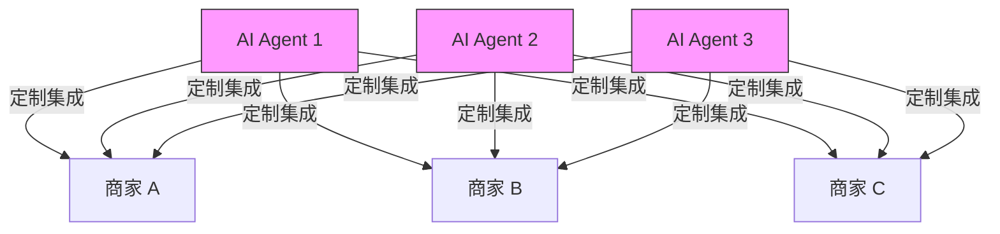
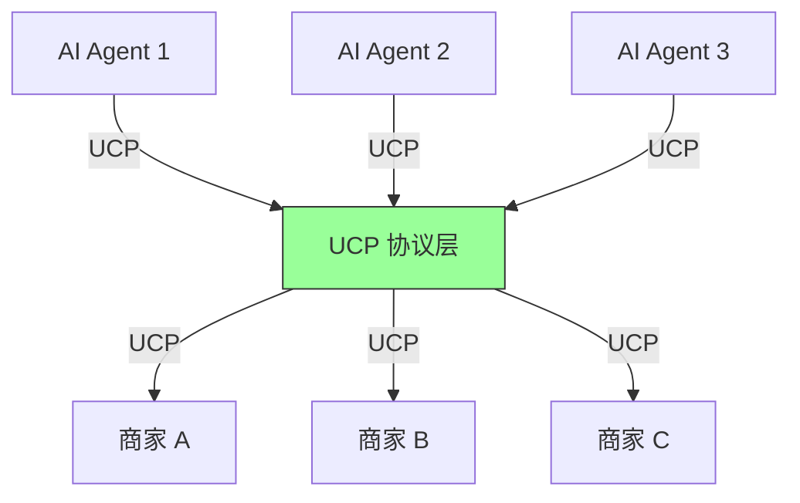
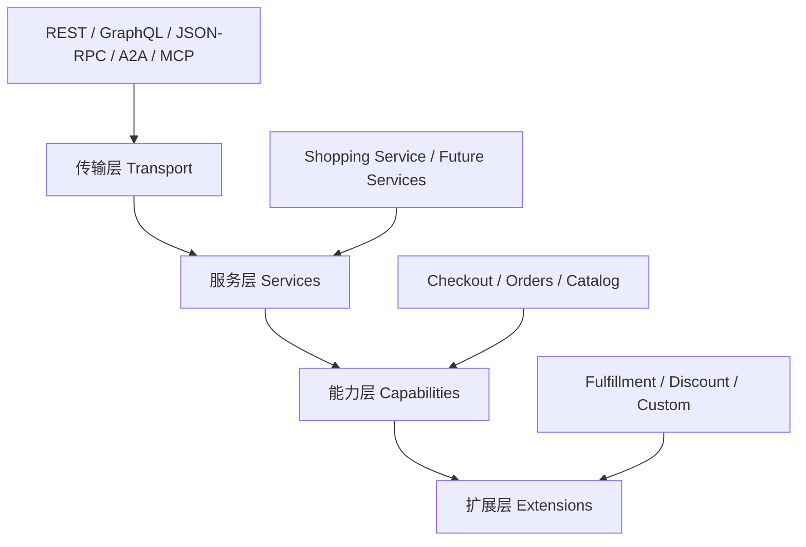
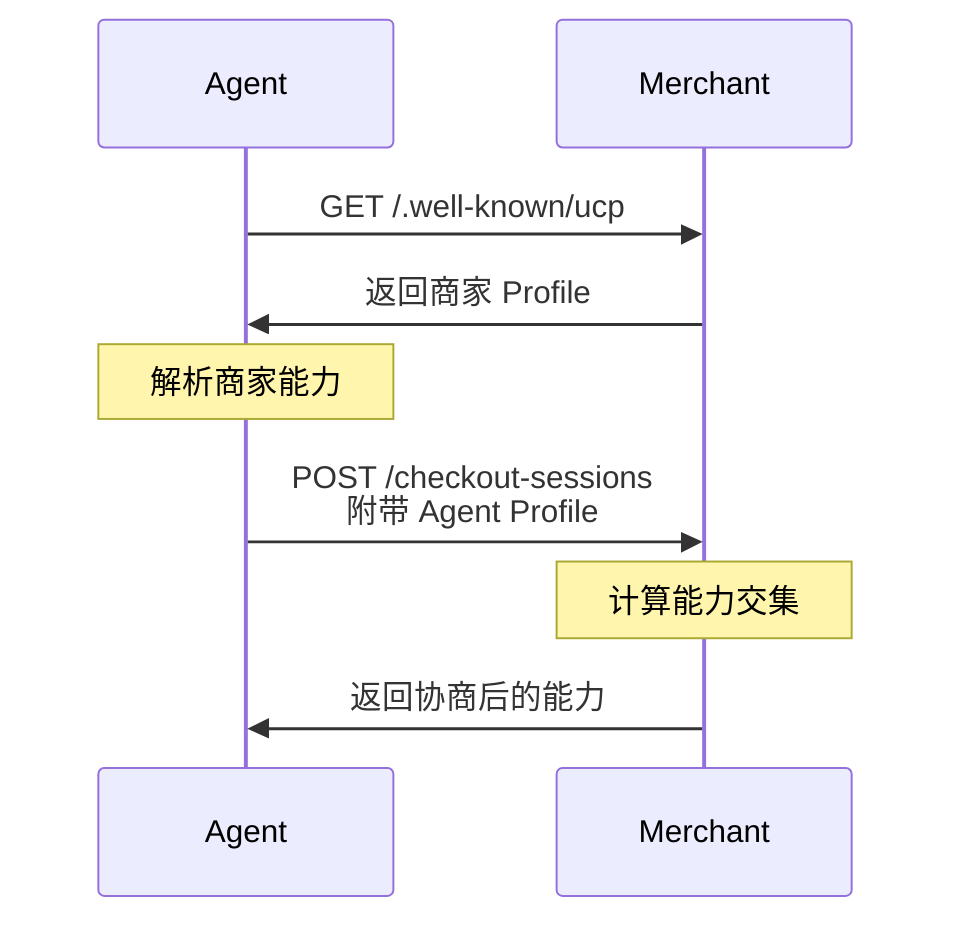
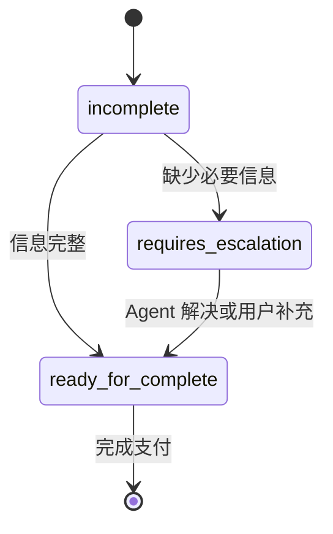
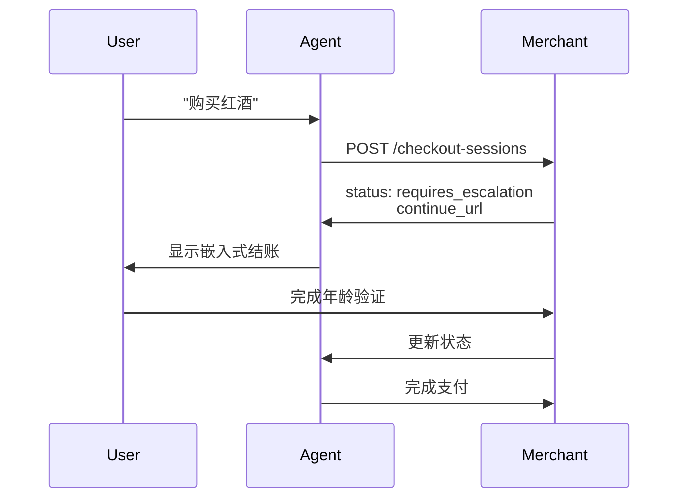
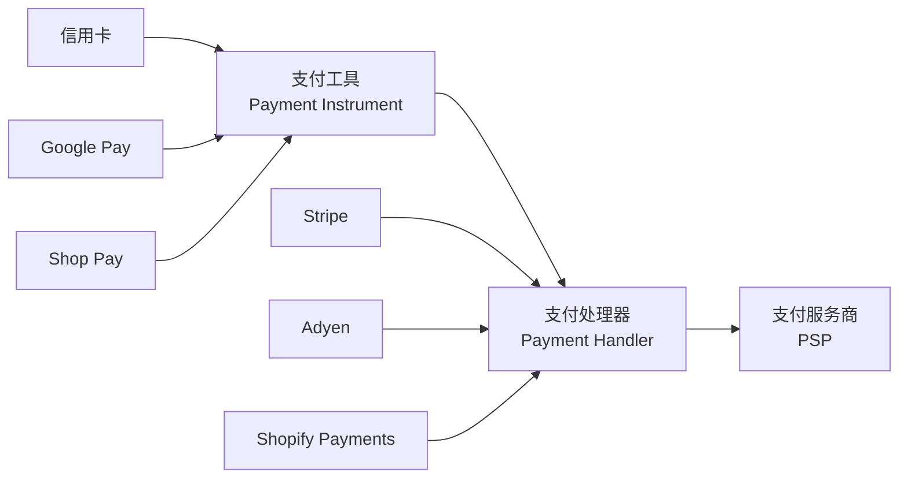
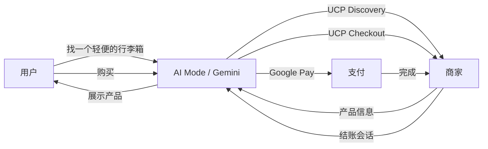
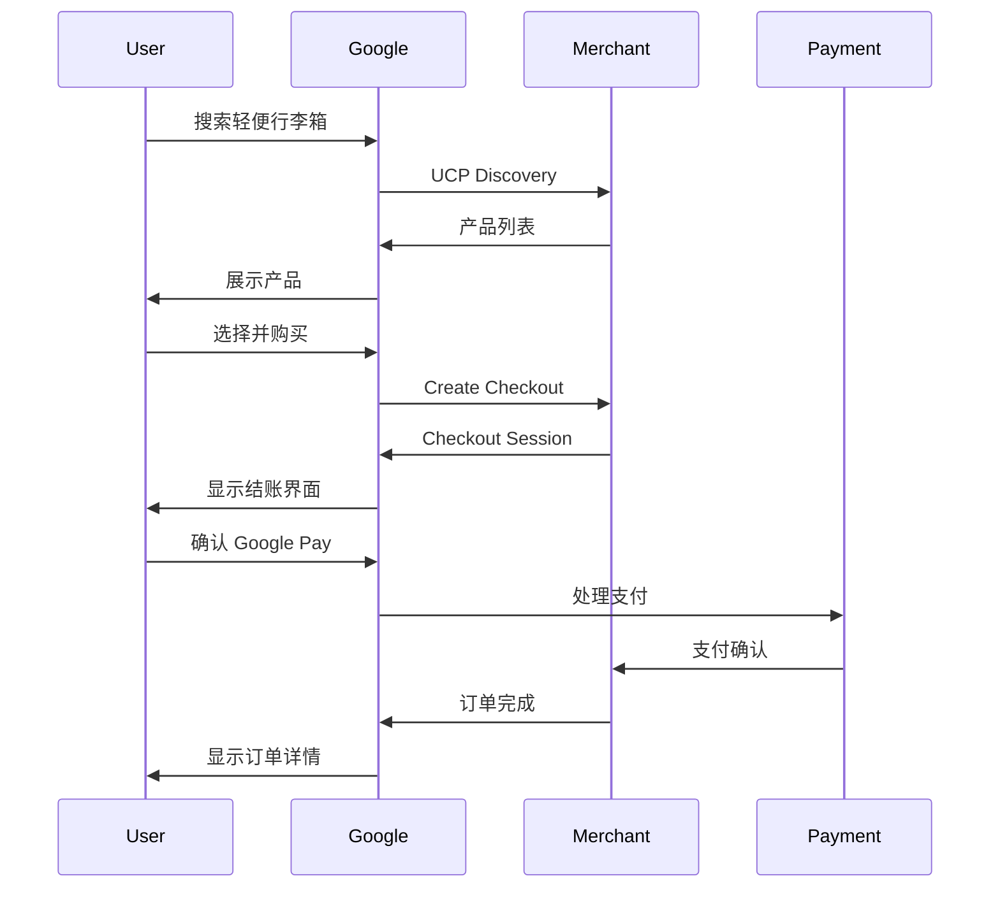
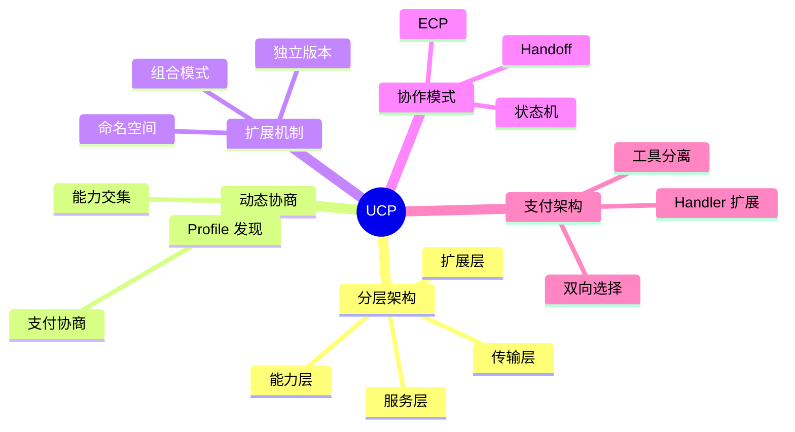

# Universal Commerce Protocol (UCP)：Shopify 与 Google 联合打造的 AI 电商标准

## 目录

1. [引言](#1-引言)
2. [UCP 核心概念](#2-ucp-核心概念)
3. [架构设计](#3-架构设计)
4. [能力与扩展系统](#4-能力与扩展系统)
5. [协作机制](#5-协作机制)
6. [支付架构](#6-支付架构)
7. [技术实现](#7-技术实现)
8. [Google 集成](#8-google-集成)
9. [最佳实践](#9-最佳实践)
10. [总结](#10-总结)

---

## 1. 引言

### 1.1 什么是 UCP

**Universal Commerce Protocol (UCP)** 是由 Shopify 和 Google 联合开发的开源标准协议，旨在为 **AI Agent 驱动的电商**（Agentic Commerce）提供统一的交互语言。

> **核心使命**: 让 AI Agent 能够发现、协商并与任何商家完成交易，无需为每个平台单独集成。

### 1.2 为什么需要 UCP

#### 传统电商集成的困境



**问题**：
- ❌ N × N 集成复杂度
- ❌ 每个 Agent 需要为每个商家定制
- ❌ 缺乏标准化，维护成本高
- ❌ 无法快速适应新的 AI 体验

#### UCP 的解决方案



**优势**：
- ✅ 单一集成点
- ✅ 标准化协议
- ✅ 动态能力协商
- ✅ 可扩展架构

### 1.3 生态系统支持

UCP 得到了全球 20+ 合作伙伴的支持：

**零售商**: Shopify, Etsy, Wayfair, Target, Walmart, Best Buy, Flipkart, Macy's, The Home Depot, Zalando

**支付提供商**: Adyen, American Express, Mastercard, Stripe, Visa

**技术平台**: Google (AI Mode in Search, Gemini)

---

## 2. UCP 核心概念

### 2.1 协议分层架构

UCP 采用分层设计，类似于 TCP/IP 协议栈：



**分层职责**：

| 层级 | 职责 | 示例 |
|------|------|------|
| **传输层** | 定义通信协议 | REST API, GraphQL, MCP |
| **服务层** | 定义核心交易原语 | Shopping Service |
| **能力层** | 定义主要功能领域 | Checkout, Orders, Catalog |
| **扩展层** | 领域特定增强 | Fulfillment, Discount, Loyalty |

### 2.2 核心原语

```typescript
// Shopping Service 核心原语
interface ShoppingService {
  // 结账会话
  checkoutSession: {
    id: string;
    lineItems: LineItem[];
    totals: Total[];
    status: CheckoutStatus;
  };
  
  // 行项目
  lineItem: {
    id: string;
    item: Product;
    quantity: number;
    totals: Total[];
  };
  
  // 消息
  messages: Message[];
  
  // 状态
  status: 'incomplete' | 'requires_escalation' | 'ready_for_complete';
}
```

### 2.3 能力发现与协商

UCP 的核心机制是**动态能力发现**和**双向协商**：



---

## 3. 架构设计

### 3.1 Profile 机制

#### 商家 Profile

商家在 `/.well-known/ucp` 发布其支持的能力：

```json
{
  "ucp": {
    "version": "2026-01-11",
    "services": {
      "dev.ucp.shopping": {
        "version": "2026-01-11",
        "spec": "https://ucp.dev/specs/shopping",
        "rest": {
          "schema": "https://ucp.dev/services/shopping/openapi.json",
          "endpoint": "https://merchant.example.com/"
        }
      }
    },
    "capabilities": [
      {
        "name": "dev.ucp.shopping.checkout",
        "version": "2026-01-11",
        "spec": "https://ucp.dev/specs/shopping/checkout"
      },
      {
        "name": "dev.ucp.shopping.discount",
        "version": "2026-01-11",
        "extends": "dev.ucp.shopping.checkout"
      },
      {
        "name": "com.loyaltyprovider.points",
        "version": "1.0.0",
        "extends": "dev.ucp.shopping.checkout"
      }
    ]
  },
  "payment": {
    "handlers": [
      {
        "id": "shop_pay",
        "name": "com.shopify.shop_pay",
        "version": "2026-01-11"
      },
      {
        "id": "google_pay",
        "name": "google.pay",
        "version": "2026-01-11"
      }
    ]
  }
}
```

#### Agent Profile

Agent 也声明其支持的能力：

```json
{
  "ucp": {
    "version": "2026-01-11",
    "capabilities": [
      {
        "name": "dev.ucp.shopping.checkout",
        "version": "2026-01-11"
      },
      {
        "name": "dev.ucp.shopping.discount",
        "version": "2026-01-11"
      }
    ]
  },
  "payment": {
    "handlers": [
      {
        "id": "google_pay",
        "name": "google.pay"
      }
    ]
  }
}
```

### 3.2 能力协商流程

```typescript
// 协商算法
function negotiateCapabilities(
  merchantProfile: Profile,
  agentProfile: Profile
): NegotiatedCapabilities {
  // 1. 计算能力交集
  const commonCapabilities = intersection(
    merchantProfile.capabilities,
    agentProfile.capabilities
  );
  
  // 2. 计算支付处理器交集
  const commonHandlers = intersection(
    merchantProfile.payment.handlers,
    agentProfile.payment.handlers
  );
  
  // 3. 返回协商结果
  return {
    capabilities: commonCapabilities,
    paymentHandlers: commonHandlers
  };
}
```

**示例**：

```
商家支持: [checkout, discount, fulfillment, loyalty]
Agent 支持: [checkout, discount]

协商结果: [checkout, discount]
```

### 3.3 命名空间管理

UCP 使用**反向域名命名**避免中心化审批：

```typescript
// 官方能力
dev.ucp.shopping.checkout       // 由 ucp.dev 管理
dev.ucp.shopping.discount       // 由 ucp.dev 管理

// 第三方扩展
com.shopify.shop_pay            // 由 shopify.com 管理
com.loyaltyprovider.points      // 由 loyaltyprovider.com 管理
com.stripe.payment              // 由 stripe.com 管理
```

**验证机制**：

```typescript
function validateCapability(capability: string): boolean {
  // 1. 解析命名空间
  const namespace = capability.split('.').slice(0, -1).reverse().join('.');
  
  // 2. 验证域名所有权
  const domain = namespace;
  const isOwned = verifyDomainOwnership(domain);
  
  return isOwned;
}
```

**优势**：
- ✅ 无需中心化审批
- ✅ 自由扩展
- ✅ 命名空间隔离
- ✅ 安全可验证

---

## 4. 能力与扩展系统

### 4.1 核心能力

#### Checkout 能力

```typescript
interface CheckoutCapability {
  name: 'dev.ucp.shopping.checkout';
  
  // 创建结账会话
  createSession(request: CheckoutRequest): Promise<CheckoutSession>;
  
  // 更新结账会话
  updateSession(id: string, updates: Partial<CheckoutRequest>): Promise<CheckoutSession>;
  
  // 完成结账
  completeSession(id: string, payment: PaymentInstrument): Promise<Order>;
}

interface CheckoutSession {
  id: string;
  lineItems: LineItem[];
  buyer: Buyer;
  status: 'incomplete' | 'requires_escalation' | 'ready_for_complete';
  currency: string;
  totals: Total[];
  payment: PaymentConfig;
}
```

#### Orders 能力

```typescript
interface OrdersCapability {
  name: 'dev.ucp.shopping.orders';
  
  // 获取订单
  getOrder(id: string): Promise<Order>;
  
  // 列出订单
  listOrders(filters: OrderFilters): Promise<Order[]>;
  
  // 取消订单
  cancelOrder(id: string): Promise<Order>;
}
```

### 4.2 扩展机制

扩展通过**组合**增强核心能力：

#### Fulfillment 扩展

```typescript
// 核心 Checkout Schema
interface CheckoutSession {
  id: string;
  lineItems: LineItem[];
  totals: Total[];
}

// Fulfillment 扩展
interface FulfillmentExtension {
  extends: 'dev.ucp.shopping.checkout';
  
  // 扩展字段
  fulfillmentGroups?: FulfillmentGroup[];
}

interface FulfillmentGroup {
  id: string;
  lineItems: string[];  // 引用 line item IDs
  options: FulfillmentOption[];
  selected?: string;
}

interface FulfillmentOption {
  id: string;
  type: 'shipping' | 'pickup' | 'delivery';
  provider: string;
  cost: number;
  estimatedDelivery?: DateRange;
}
```

**使用示例**：

```json
{
  "id": "checkout_123",
  "lineItems": [...],
  "totals": [...],
  
  // Fulfillment 扩展字段
  "fulfillmentGroups": [
    {
      "id": "group_1",
      "lineItems": ["item_1", "item_2"],
      "options": [
        {
          "id": "shipping_standard",
          "type": "shipping",
          "provider": "USPS",
          "cost": 500,
          "estimatedDelivery": {
            "start": "2026-01-25",
            "end": "2026-01-28"
          }
        },
        {
          "id": "pickup_store",
          "type": "pickup",
          "provider": "Store #123",
          "cost": 0
        }
      ],
      "selected": "shipping_standard"
    }
  ]
}
```

#### Discount 扩展

```typescript
interface DiscountExtension {
  extends: 'dev.ucp.shopping.checkout';
  
  discounts?: {
    codes?: string[];
    applied?: AppliedDiscount[];
  };
}

interface AppliedDiscount {
  code: string;
  title: string;
  amount: number;
  automatic: boolean;
  allocations: DiscountAllocation[];
}
```

### 4.3 版本管理

每个能力和扩展独立版本化：

```json
{
  "capabilities": [
    {
      "name": "dev.ucp.shopping.checkout",
      "version": "2026-01-11"
    },
    {
      "name": "dev.ucp.shopping.fulfillment",
      "version": "2026-01-15"  // 独立版本
    }
  ]
}
```

**优势**：
- ✅ 核心保持稳定
- ✅ 扩展独立演进
- ✅ 向后兼容
- ✅ 渐进式升级

---

## 5. 协作机制

### 5.1 Checkout 状态机



**状态说明**：

| 状态 | 含义 | Agent 行为 |
|------|------|-----------|
| `incomplete` | 缺少必要信息 | 尝试通过 API 补充 |
| `requires_escalation` | 需要用户介入 | 调用 `continue_url` 移交 |
| `ready_for_complete` | 可以完成 | 调用完成 API |

### 5.2 人机协作 (Handoff)

当 Agent 遇到无法处理的情况时，通过 `continue_url` 移交给用户：

```json
{
  "status": "requires_escalation",
  "messages": [
    {
      "type": "error",
      "text": "需要验证年龄以购买此商品"
    }
  ],
  "links": [
    {
      "rel": "continue",
      "href": "https://merchant.example.com/checkout/abc123"
    }
  ]
}
```

**Handoff 流程**：



### 5.3 Embedded Checkout Protocol (ECP)

ECP 使移交无缝衔接：

```typescript
// Agent 加载嵌入式结账
const iframe = document.createElement('iframe');
iframe.src = checkoutResponse.links.find(l => l.rel === 'continue').href;

// 建立 JSON-RPC 2.0 通道
const channel = new MessageChannel();
iframe.contentWindow.postMessage({
  type: 'init',
  port: channel.port2
}, '*', [channel.port2]);

// 双向通信
channel.port1.onmessage = (event) => {
  if (event.data.method === 'requestPayment') {
    // Agent 提供支付凭证
    const paymentInstrument = await getPaymentInstrument();
    channel.port1.postMessage({
      id: event.data.id,
      result: paymentInstrument
    });
  }
};
```

**ECP 能力**：
- ✅ 双向消息传递
- ✅ 支付凭证共享
- ✅ 地址信息共享
- ✅ PCI v4 合规
- ✅ 品牌定制

---

## 6. 支付架构

### 6.1 支付处理器 (Payment Handlers)

UCP 将**支付工具**（用户用什么支付）与**支付处理器**（谁处理支付）分离：



### 6.2 动态支付协商

```typescript
// Agent Profile
const agentProfile = {
  payment: {
    instruments: [
      {
        type: 'google_pay',
        schema: 'https://ucp.dev/schemas/gpay_instrument.json'
      },
      {
        type: 'card',
        schema: 'https://ucp.dev/schemas/card_instrument.json'
      }
    ]
  }
};

// Merchant Profile
const merchantProfile = {
  payment: {
    handlers: [
      {
        id: 'shop_pay',
        name: 'com.shopify.shop_pay',
        instrumentSchemas: ['https://shopify.dev/ucp/shop_pay/instrument.json']
      },
      {
        id: 'google_pay',
        name: 'google.pay',
        instrumentSchemas: ['https://ucp.dev/schemas/gpay_instrument.json']
      }
    ]
  }
};

// 协商结果
const negotiated = {
  availableHandlers: ['google_pay'],  // 双方都支持
  userChoice: 'google_pay'  // 用户选择
};
```

### 6.3 支付处理器扩展

任何支付提供商都可以发布自己的 Handler：

```typescript
// Stripe Handler 定义
interface StripeHandler {
  id: 'stripe';
  name: 'com.stripe.payment';
  version: '2026-01-11';
  spec: 'https://stripe.com/ucp/handler/spec';
  
  configSchema: {
    publishableKey: string;
    accountId: string;
  };
  
  instrumentSchemas: [
    'https://stripe.com/ucp/card_instrument.json',
    'https://stripe.com/ucp/bank_account_instrument.json'
  ];
}
```

**优势**：
- ✅ 无需协议升级
- ✅ 支付提供商自主发布
- ✅ 双向选择
- ✅ 动态协商

---

## 7. 技术实现

### 7.1 完整交互示例

#### 步骤 1: 发现商家能力

```bash
curl -X GET https://merchant.example.com/.well-known/ucp
```

**响应**：

```json
{
  "ucp": {
    "version": "2026-01-11",
    "capabilities": [
      {
        "name": "dev.ucp.shopping.checkout",
        "version": "2026-01-11"
      },
      {
        "name": "dev.ucp.shopping.discount",
        "version": "2026-01-11"
      }
    ]
  },
  "payment": {
    "handlers": [
      {
        "id": "shop_pay",
        "name": "com.shopify.shop_pay"
      },
      {
        "id": "google_pay",
        "name": "google.pay"
      }
    ]
  }
}
```

#### 步骤 2: 创建结账会话

```bash
curl -X POST https://merchant.example.com/checkout-sessions \
  -H 'Content-Type: application/json' \
  -H 'UCP-Agent: profile="https://agent.example/profile"' \
  -d '{
    "line_items": [
      {
        "item": {
          "id": "product_123",
          "title": "红玫瑰花束"
        },
        "quantity": 1
      }
    ],
    "buyer": {
      "full_name": "张三",
      "email": "zhang@example.com"
    },
    "currency": "USD"
  }'
```

**响应**：

```json
{
  "id": "checkout_abc123",
  "line_items": [
    {
      "id": "item_1",
      "item": {
        "id": "product_123",
        "title": "红玫瑰花束",
        "price": 3500
      },
      "quantity": 1,
      "totals": [
        { "type": "subtotal", "amount": 3500 },
        { "type": "total", "amount": 3500 }
      ]
    }
  ],
  "status": "ready_for_complete",
  "totals": [
    { "type": "subtotal", "amount": 3500 },
    { "type": "total", "amount": 3500 }
  ]
}
```

#### 步骤 3: 应用折扣

```bash
curl -X PUT https://merchant.example.com/checkout-sessions/checkout_abc123 \
  -H 'Content-Type: application/json' \
  -d '{
    "id": "checkout_abc123",
    "discounts": {
      "codes": ["10OFF"]
    }
  }'
```

**响应**：

```json
{
  "id": "checkout_abc123",
  "totals": [
    { "type": "subtotal", "amount": 3500 },
    { "type": "discount", "amount": 350 },
    { "type": "total", "amount": 3150 }
  ],
  "discounts": {
    "codes": ["10OFF"],
    "applied": [
      {
        "code": "10OFF",
        "title": "10% 折扣",
        "amount": 350,
        "automatic": false
      }
    ]
  }
}
```

### 7.2 Python SDK 示例

```python
from ucp import UCPClient, CheckoutRequest, LineItem

# 初始化客户端
client = UCPClient(
    merchant_url="https://merchant.example.com",
    agent_profile_url="https://agent.example/profile"
)

# 发现能力
capabilities = await client.discover_capabilities()
print(f"商家支持: {capabilities}")

# 创建结账
checkout = await client.create_checkout(
    CheckoutRequest(
        line_items=[
            LineItem(
                item={"id": "product_123", "title": "红玫瑰花束"},
                quantity=1
            )
        ],
        buyer={
            "full_name": "张三",
            "email": "zhang@example.com"
        },
        currency="USD"
    )
)

# 应用折扣
checkout = await client.update_checkout(
    checkout.id,
    discounts={"codes": ["10OFF"]}
)

print(f"最终价格: {checkout.totals.total}")
```

### 7.3 多传输支持

UCP 支持多种传输协议：

#### REST API

```typescript
// REST 绑定
POST /checkout-sessions
PUT /checkout-sessions/{id}
GET /checkout-sessions/{id}
```

#### Model Context Protocol (MCP)

```typescript
// MCP 工具定义
{
  "tools": [
    {
      "name": "create_checkout",
      "description": "创建结账会话",
      "inputSchema": {
        "type": "object",
        "properties": {
          "lineItems": { "type": "array" },
          "buyer": { "type": "object" }
        }
      }
    }
  ]
}
```

#### Agent2Agent (A2A)

```typescript
// A2A 消息
{
  "type": "request",
  "action": "checkout.create",
  "params": {
    "lineItems": [...],
    "buyer": {...}
  }
}
```

---

## 8. Google 集成

### 8.1 Google 实现

Google 构建了 UCP 的首个参考实现，支持：

- **AI Mode in Search**: 在搜索中直接购买
- **Gemini App**: 对话式购物体验
- **Google Pay**: 无缝支付集成



### 8.2 商家集成步骤

#### 1. Merchant Center 配置

```bash
# 前提条件
- 拥有 Merchant Center 账户
- 上传产品数据
- 产品符合结账要求
```

#### 2. UCP 端点实现

```typescript
// 实现 UCP 端点
app.get('/.well-known/ucp', (req, res) => {
  res.json({
    ucp: {
      version: '2026-01-11',
      services: {
        'dev.ucp.shopping': {
          version: '2026-01-11',
          rest: {
            endpoint: 'https://yourstore.com/ucp'
          }
        }
      },
      capabilities: [
        { name: 'dev.ucp.shopping.checkout' },
        { name: 'dev.ucp.shopping.discount' }
      ]
    },
    payment: {
      handlers: [
        {
          id: 'google_pay',
          name: 'google.pay',
          config: {
            merchantId: 'YOUR_MERCHANT_ID'
          }
        }
      ]
    }
  });
});
```

#### 3. 提交集成申请

```bash
# 步骤
1. 阅读 Google 集成指南
   https://developers.google.com/merchant/ucp

2. 完成 UCP 集成
   https://developers.google.com/merchant/ucp/guides/checkout

3. 提交商家兴趣表单

4. 等待审核
```

### 8.3 用户体验

**示例查询**: "Find a light-weight suitcase for an upcoming trip."



---

## 9. 最佳实践

### 9.1 能力设计原则

#### 1. 最小化核心，扩展增强

```typescript
// ✅ 好的设计
interface Checkout {
  // 核心字段
  id: string;
  lineItems: LineItem[];
  totals: Total[];
}

interface FulfillmentExtension extends Checkout {
  // 扩展字段
  fulfillmentGroups?: FulfillmentGroup[];
}

// ❌ 不好的设计
interface Checkout {
  id: string;
  lineItems: LineItem[];
  totals: Total[];
  fulfillmentGroups: FulfillmentGroup[];  // 不应在核心
  loyaltyPoints: number;  // 不应在核心
  giftWrap: GiftWrapOptions;  // 不应在核心
}
```

#### 2. 独立版本化

```json
{
  "capabilities": [
    {
      "name": "dev.ucp.shopping.checkout",
      "version": "2026-01-11"
    },
    {
      "name": "dev.ucp.shopping.fulfillment",
      "version": "2026-02-01"
    }
  ]
}
```

#### 3. 向后兼容

```typescript
// 添加新字段时使用可选
interface CheckoutV2 extends CheckoutV1 {
  // 新字段必须可选
  newField?: string;
}
```

### 9.2 安全实践

#### 1. 签名验证

```typescript
// 验证请求签名
app.use((req, res, next) => {
  const signature = req.headers['request-signature'];
  const requestId = req.headers['request-id'];
  
  if (!verifySignature(req.body, signature, requestId)) {
    return res.status(401).json({ error: 'Invalid signature' });
  }
  
  next();
});
```

#### 2. 幂等性

```typescript
// 使用幂等性键
app.post('/checkout-sessions', async (req, res) => {
  const idempotencyKey = req.headers['idempotency-key'];
  
  // 检查是否已处理
  const existing = await checkoutStore.getByIdempotencyKey(idempotencyKey);
  if (existing) {
    return res.json(existing);
  }
  
  // 创建新会话
  const checkout = await createCheckout(req.body);
  await checkoutStore.saveWithIdempotencyKey(checkout, idempotencyKey);
  
  res.json(checkout);
});
```

#### 3. 速率限制

```typescript
const rateLimit = require('express-rate-limit');

const limiter = rateLimit({
  windowMs: 60 * 1000,  // 1 分钟
  max: 100,  // 最多 100 次请求
  message: 'Too many requests'
});

app.use('/checkout-sessions', limiter);
```

### 9.3 性能优化

#### 1. 缓存 Profile

```typescript
// 缓存商家 Profile
const profileCache = new Map();

app.get('/.well-known/ucp', (req, res) => {
  const cached = profileCache.get('profile');
  if (cached && Date.now() - cached.timestamp < 3600000) {
    return res.json(cached.data);
  }
  
  const profile = generateProfile();
  profileCache.set('profile', {
    data: profile,
    timestamp: Date.now()
  });
  
  res.json(profile);
});
```

#### 2. 异步处理

```typescript
// 异步处理耗时操作
app.post('/checkout-sessions', async (req, res) => {
  // 快速创建会话
  const checkout = await createCheckoutSession(req.body);
  
  // 异步处理库存检查
  processInventoryCheck(checkout.id).catch(console.error);
  
  // 立即返回
  res.json(checkout);
});
```

### 9.4 错误处理

```typescript
// 标准错误响应
interface UCPError {
  error: {
    code: string;
    message: string;
    details?: any;
  };
}

// 错误处理中间件
app.use((err, req, res, next) => {
  const ucpError: UCPError = {
    error: {
      code: err.code || 'internal_error',
      message: err.message,
      details: err.details
    }
  };
  
  res.status(err.statusCode || 500).json(ucpError);
});
```

---

## 10. 总结

### 10.1 核心价值

UCP 为 AI 驱动的电商提供了：

1. **标准化**: 统一的协议语言
2. **可扩展**: 灵活的能力和扩展系统
3. **去中心化**: 反向域名命名，无需审批
4. **协作**: 人机协作的无缝移交
5. **开放**: 开源协议，社区驱动

### 10.2 技术亮点



### 10.3 未来展望

**短期**：
- 更多商家集成
- 更多 AI 平台支持
- 更丰富的扩展生态

**中期**：
- 跨垂直领域扩展（旅游、餐饮等）
- 更多传输协议支持
- 增强的安全特性

**长期**：
- 全球电商标准
- 完整的 AI 商务生态
- 去中心化商务网络

### 10.4 开发资源

**官方资源**：
- [UCP 规范](https://ucp.dev)
- [Shopify 文档](https://shopify.dev/docs/ucp)
- [Google 集成指南](https://developers.google.com/merchant/ucp)
- [GitHub 仓库](https://github.com/universal-commerce-protocol/ucp)

**示例代码**：
- [Python SDK](https://github.com/Universal-Commerce-Protocol/python-sdk)
- [示例服务器](https://github.com/Universal-Commerce-Protocol/samples)

**社区**：
- [Discord](https://discord.gg/ucp)
- [论坛](https://community.ucp.dev)

---

**结语**：

UCP 代表了电商协议设计的新范式。通过分层架构、动态协商和开放扩展，它为 AI 时代的商务交互提供了坚实的基础。无论你是商家、AI 平台还是支付提供商，UCP 都为你提供了参与下一代电商生态的标准化路径。

让我们一起构建 AI 驱动的商务未来！🚀
