# Universal Commerce Protocol (UCP)：Shopify 与 Google 联合打造的 AI 电商标准

## 目录

1. [引言](#1-引言)
2. [行业热议与社区声音](#2-行业热议与社区声音)
3. [UCP 核心概念](#3-ucp-核心概念)
4. [架构设计](#4-架构设计)
5. [能力与扩展系统](#5-能力与扩展系统)
6. [协作机制](#6-协作机制)
7. [支付架构](#7-支付架构)
8. [技术实现](#8-技术实现)
9. [Google 集成](#9-google-集成)
10. [最佳实践](#10-最佳实践)
11. [UCP vs ACP：双协议格局](#11-ucp-vs-acp双协议格局)
12. [生态与未来展望](#12-生态与未来展望)
13. [参考资源](#13-参考资源)

---

## 1. 引言

### 1.1 什么是 UCP

**Universal Commerce Protocol (UCP)** 是由 Shopify 和 Google 联合开发的开源标准协议，旨在为 **AI Agent 驱动的电商**（Agentic Commerce）提供统一的交互语言。

> **核心使命**: 让 AI Agent 能够发现、协商并与任何商家完成交易，无需为每个平台单独集成。

### 1.2 为什么需要 UCP

#### 传统电商集成的困境

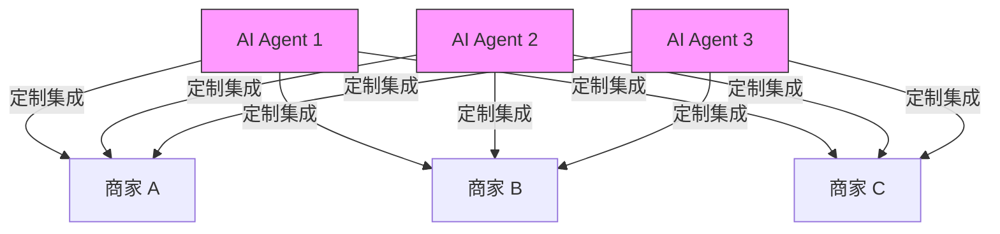
```mermaid
graph TD
    A[AI Agent 1] -->|定制集成| B[商家 A]
    A -->|定制集成| C[商家 B]
    A -->|定制集成| D[商家 C]
    
    E[AI Agent 2] -->|定制集成| B
    E -->|定制集成| C
    E -->|定制集成| D
    
    F[AI Agent 3] -->|定制集成| B
    F -->|定制集成| C
    F -->|定制集成| D
    
    style A fill:#f9f,stroke:#333
    style E fill:#f9f,stroke:#333
    style F fill:#f9f,stroke:#333
```

**问题**：
- ❌ N × N 集成复杂度
- ❌ 每个 Agent 需要为每个商家定制
- ❌ 缺乏标准化，维护成本高
- ❌ 无法快速适应新的 AI 体验

#### UCP 的解决方案

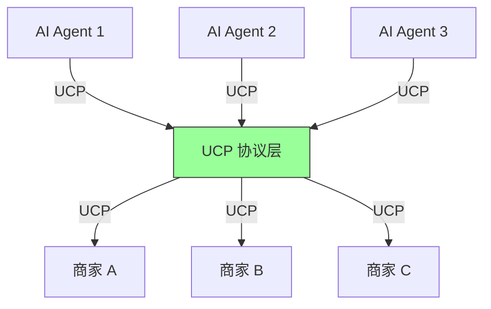
```mermaid
graph TD
    A[AI Agent 1] -->|UCP| G[UCP 协议层]
    E[AI Agent 2] -->|UCP| G
    F[AI Agent 3] -->|UCP| G
    
    G -->|UCP| B[商家 A]
    G -->|UCP| C[商家 B]
    G -->|UCP| D[商家 C]
    
    style G fill:#9f9,stroke:#333
```

**优势**：
- ✅ 单一集成点
- ✅ 标准化协议
- ✅ 动态能力协商
- ✅ 可扩展架构

### 1.3 生态系统支持

UCP 得到了全球 20+ 合作伙伴的支持：

**零售商**: Shopify, Etsy, Wayfair, Target, Walmart, Best Buy, Flipkart, Macy's, The Home Depot, Zalando

**支付提供商**: Adyen, American Express, Mastercard, Stripe, Visa

**技术平台**: Google (AI Mode in Search, Gemini)

---

## 2. 行业热议与社区声音

:::info{title="来源说明"}
以下内容整理自 Twitter/X 平台上的行业领袖、技术社区和开发者的公开分享，涵盖 UCP 发布后的多方观点与讨论。
:::

### 2.1 行业领袖发声

**Sundar Pichai（Google CEO）**

[Sundar Pichai](https://x.com/sundarpichai/status/2010382050570932299) 在 Twitter 上宣布：

> "AI agents will be a big part of how we shop in the not-so-distant future. To help lay the groundwork, we partnered with Shopify, Etsy, Wayfair, Target and Walmart to create the Universal Commerce Protocol, a new open standard for agents and systems to talk to each other across every step of the shopping journey."

**Tobi Lutke（Shopify CEO）**

[Tobi Lutke](https://x.com/tobi/status/2010372642843599064) 同步宣告：

> "Shopify is building the foundation for agentic commerce. Universal Commerce Protocol, which we co-developed with Google, is now live. UCP will make it faster for agents and retailers to integrate. It's open by default, so platforms and agents can use UCP to start transacting."

两位 CEO 同时在 Twitter 上发布，表明 UCP 是 Google 和 Shopify 的**战略级合作**，而非普通的技术发布。

### 2.2 技术社区深度分析

**Rohan Paul (@rohanpaul\_ai) — 技术解读**

[Rohan Paul](https://x.com/rohanpaul_ai/status/2010387693436563775) 对 UCP 进行了技术分析：

> "UCP is open-source and vendor-agnostic, meant to let an agent move from finding items to paying and getting support, without custom integrations everywhere."

他总结了 UCP 的核心技术特点：
- 用 "**Capabilities**"（能力模块）替代传统的集成方式
- 涵盖发现、结账、折扣、履约、身份关联、订单管理
- 商家在 `/.well-known/ucp` 发布 JSON 清单，Agent 自动发现端点
- 支持 REST、A2A、MCP 多种传输协议

**Shubham Saboo (@Saboo\_Shubham\_) — Shopify 工程解析**

[Shubham Saboo](https://x.com/Saboo_Shubham_/status/2010407346233921658) 分享了 Shopify 工程博客的技术深潜：

```typescript
// UCP 的核心理念：像 TCP/IP 一样分层
interface UCPLayeredArchitecture \{
    // 基础层：核心交易原语
    shoppingService: \{
        checkoutSession: CheckoutSession;
        lineItems: LineItem[];
        totals: Totals;
        status: StatusMessage;
    \};

    // 能力层：独立版本化的功能模块
    capabilities: \{
        checkout: Capability;   // 结账
        catalog: Capability;    // 产品发现/购物车
        orders: Capability;     // 订单管理
        identity: Capability;   // 身份关联
    \};

    // 扩展层：可选的领域特定插件
    extensions: \{
        loyalty: Extension;        // 积分
        discounts: Extension;      // 折扣
        subscriptions: Extension;  // 订阅
    \};
\}
```

### 2.3 协议对比讨论

**c4lvin — UCP vs ACP 深度对比**

[c4lvin](https://x.com/c4lvin/status/2010635334820995519) 发起了 UCP 与 ACP 的对比讨论：

> "ACP & UCP: What's the Difference? Google and Shopify made headlines by announcing UCP. Since both protocols address the same commerce layer, I noticed tweets comparing UCP to the Agentic Commerce Protocol (ACP), which OpenAI and Stripe launched."

他的核心观点：
- **ACP**：先通过 ChatGPT Instant Checkout 实现具体用例，再标准化。核心是 Stripe 的 Shared Payment Token (SPT)
- **UCP**：涵盖从产品发现到售后支持的完整商务旅程。采用"任何传输"哲学，不绑定特定 AI 平台
- **两者不一定是竞争关系** — ACP 追求基于 ChatGPT 平台的快速商业化，UCP 追求跨平台开放生态

**Ayush (@ay\_ushr) — 精辟总结**

[Ayush](https://x.com/ay_ushr/status/2010697251622965714) 给出了简洁的对比：

> "Stripe + OpenAI have ACP. Google + Shopify just launched UCP. Both are basically an MCP for AI agents to start a checkout session. UCP is more comprehensive — covers discovery, catalog, checkout, orders, returns, loyalty. ACP is checkout-only. But that's not really the point."

**Joseph Allen — 行业关注**

[Joseph Allen](https://x.com/j_g_allen/status/2010555891725058325) 强调了合作伙伴的重量级阵容：

> "Big development: Google today announced a new open standard, called the Universal Commerce Protocol (UCP) for AI agent-based shopping, developed with Shopify, Etsy, Wayfair, Target, and Walmart."

### 2.4 Google Cloud 官方确认

[Google Cloud Tech](https://x.com/GoogleCloudTech/status/2010754721171063011) 在 Twitter 上确认了 UCP 的协议兼容性：

> "We've launched the Universal Commerce Protocol (UCP), a new open standard for agentic commerce that works across the shopping journey! UCP is compatible with A2A, AP2, and MCP."

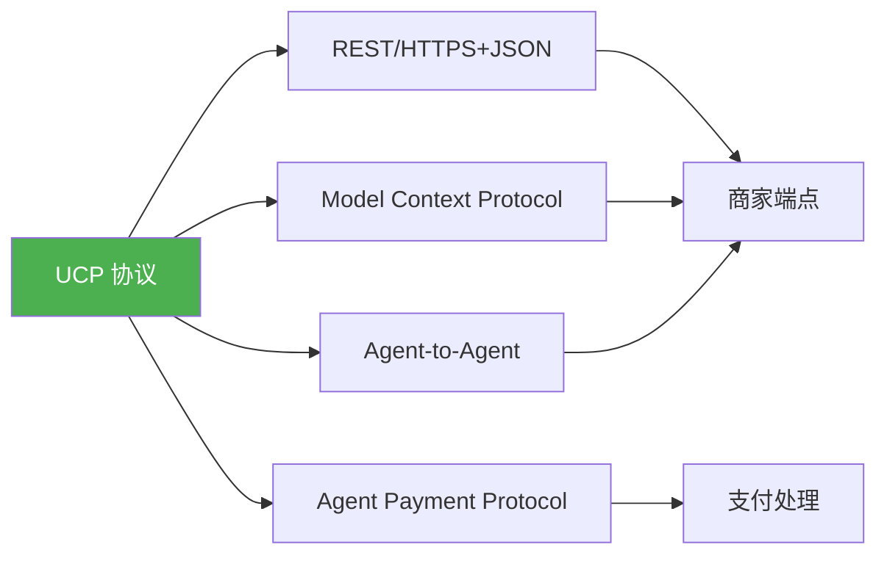
```mermaid
graph LR
    UCP[UCP 协议] --> REST[REST/HTTPS+JSON]
    UCP --> MCP[Model Context Protocol]
    UCP --> A2A[Agent-to-Agent]
    UCP --> AP2[Agent Payment Protocol]

    REST --> M[商家端点]
    MCP --> M
    A2A --> M
    AP2 --> PAY[支付处理]

    style UCP fill:#4CAF50,color:#fff
```

### 2.5 社区共识

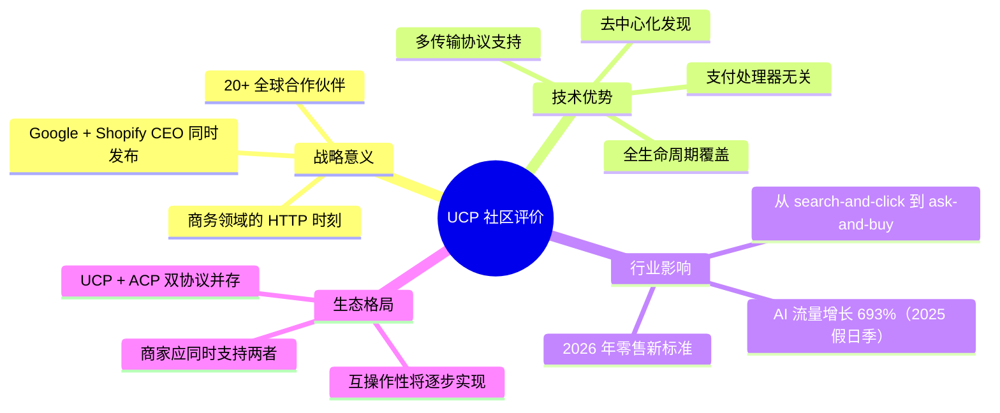
```mermaid
mindmap
  root((UCP 社区评价))
    战略意义
      Google + Shopify CEO 同时发布
      20+ 全球合作伙伴
      商务领域的 HTTP 时刻
    技术优势
      全生命周期覆盖
      去中心化发现
      多传输协议支持
      支付处理器无关
    行业影响
      从 search-and-click 到 ask-and-buy
      AI 流量增长 693%（2025 假日季）
      2026 年零售新标准
    生态格局
      UCP + ACP 双协议并存
      商家应同时支持两者
      互操作性将逐步实现
```

---

## 3. UCP 核心概念

### 3.1 协议分层架构

UCP 采用分层设计，类似于 TCP/IP 协议栈：

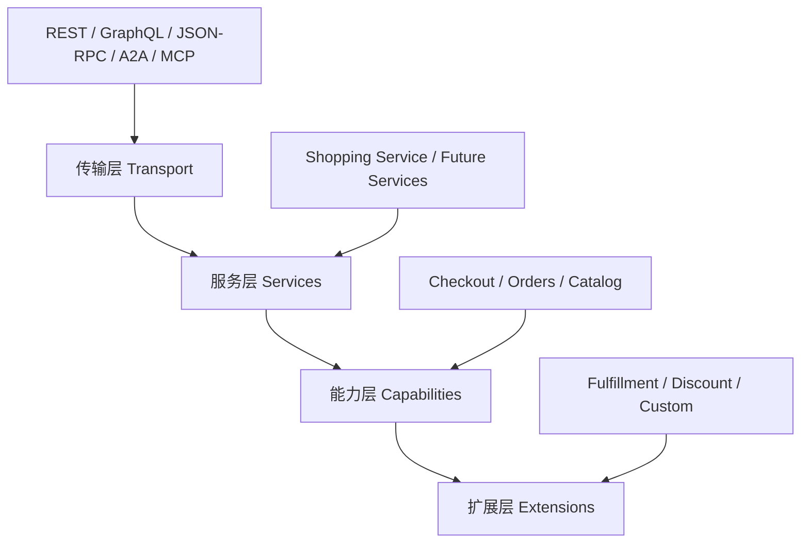
```mermaid
graph TD
    A[传输层 Transport] --> B[服务层 Services]
    B --> C[能力层 Capabilities]
    C --> D[扩展层 Extensions]
    
    A1[REST / GraphQL / JSON-RPC / A2A / MCP] --> A
    B1[Shopping Service / Future Services] --> B
    C1[Checkout / Orders / Catalog] --> C
    D1[Fulfillment / Discount / Custom] --> D
```

**分层职责**：

| 层级 | 职责 | 示例 |
|------|------|------|
| **传输层** | 定义通信协议 | REST API, GraphQL, MCP |
| **服务层** | 定义核心交易原语 | Shopping Service |
| **能力层** | 定义主要功能领域 | Checkout, Orders, Catalog |
| **扩展层** | 领域特定增强 | Fulfillment, Discount, Loyalty |

### 3.2 核心原语

```typescript
// Shopping Service 核心原语
interface ShoppingService {
  // 结账会话
  checkoutSession: {
    id: string;
    lineItems: LineItem[];
    totals: Total[];
    status: CheckoutStatus;
  };
  
  // 行项目
  lineItem: {
    id: string;
    item: Product;
    quantity: number;
    totals: Total[];
  };
  
  // 消息
  messages: Message[];
  
  // 状态
  status: 'incomplete' | 'requires_escalation' | 'ready_for_complete';
}
```

### 3.3 能力发现与协商

UCP 的核心机制是**动态能力发现**和**双向协商**：

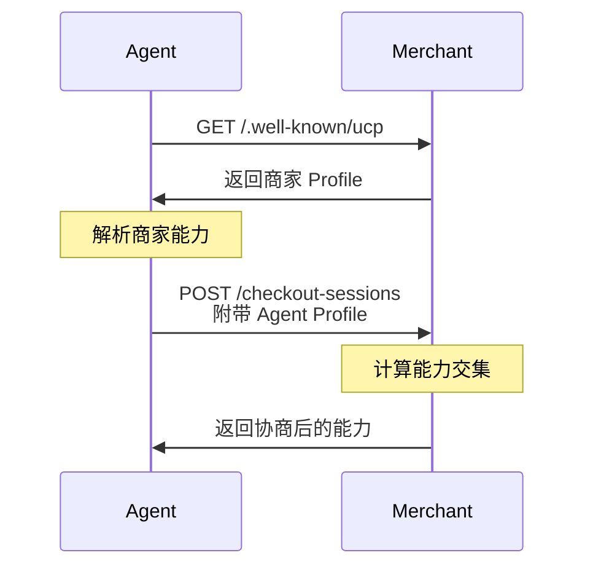
```mermaid
sequenceDiagram
    participant Agent
    participant Merchant
    
    Agent->>Merchant: GET /.well-known/ucp
    Merchant->>Agent: 返回商家 Profile
    
    Note over Agent: 解析商家能力
    
    Agent->>Merchant: POST /checkout-sessions<br/>附带 Agent Profile
    
    Note over Merchant: 计算能力交集
    
    Merchant->>Agent: 返回协商后的能力
```

---

## 4. 架构设计

### 4.1 Profile 机制

#### 商家 Profile

商家在 `/.well-known/ucp` 发布其支持的能力：

```json
{
  "ucp": {
    "version": "2026-01-11",
    "services": {
      "dev.ucp.shopping": {
        "version": "2026-01-11",
        "spec": "https://ucp.dev/specs/shopping",
        "rest": {
          "schema": "https://ucp.dev/services/shopping/openapi.json",
          "endpoint": "https://merchant.example.com/"
        }
      }
    },
    "capabilities": [
      {
        "name": "dev.ucp.shopping.checkout",
        "version": "2026-01-11",
        "spec": "https://ucp.dev/specs/shopping/checkout"
      },
      {
        "name": "dev.ucp.shopping.discount",
        "version": "2026-01-11",
        "extends": "dev.ucp.shopping.checkout"
      },
      {
        "name": "com.loyaltyprovider.points",
        "version": "1.0.0",
        "extends": "dev.ucp.shopping.checkout"
      }
    ]
  },
  "payment": {
    "handlers": [
      {
        "id": "shop_pay",
        "name": "com.shopify.shop_pay",
        "version": "2026-01-11"
      },
      {
        "id": "google_pay",
        "name": "google.pay",
        "version": "2026-01-11"
      }
    ]
  }
}
```

#### Agent Profile

Agent 也声明其支持的能力：

```json
{
  "ucp": {
    "version": "2026-01-11",
    "capabilities": [
      {
        "name": "dev.ucp.shopping.checkout",
        "version": "2026-01-11"
      },
      {
        "name": "dev.ucp.shopping.discount",
        "version": "2026-01-11"
      }
    ]
  },
  "payment": {
    "handlers": [
      {
        "id": "google_pay",
        "name": "google.pay"
      }
    ]
  }
}
```

### 4.2 能力协商流程

```typescript
// 协商算法
function negotiateCapabilities(
  merchantProfile: Profile,
  agentProfile: Profile
): NegotiatedCapabilities {
  // 1. 计算能力交集
  const commonCapabilities = intersection(
    merchantProfile.capabilities,
    agentProfile.capabilities
  );
  
  // 2. 计算支付处理器交集
  const commonHandlers = intersection(
    merchantProfile.payment.handlers,
    agentProfile.payment.handlers
  );
  
  // 3. 返回协商结果
  return {
    capabilities: commonCapabilities,
    paymentHandlers: commonHandlers
  };
}
```

**示例**：

```
商家支持: [checkout, discount, fulfillment, loyalty]
Agent 支持: [checkout, discount]

协商结果: [checkout, discount]
```

### 4.3 命名空间管理

UCP 使用**反向域名命名**避免中心化审批：

```typescript
// 官方能力
dev.ucp.shopping.checkout       // 由 ucp.dev 管理
dev.ucp.shopping.discount       // 由 ucp.dev 管理

// 第三方扩展
com.shopify.shop_pay            // 由 shopify.com 管理
com.loyaltyprovider.points      // 由 loyaltyprovider.com 管理
com.stripe.payment              // 由 stripe.com 管理
```

**验证机制**：

```typescript
function validateCapability(capability: string): boolean {
  // 1. 解析命名空间
  const namespace = capability.split('.').slice(0, -1).reverse().join('.');
  
  // 2. 验证域名所有权
  const domain = namespace;
  const isOwned = verifyDomainOwnership(domain);
  
  return isOwned;
}
```

**优势**：
- ✅ 无需中心化审批
- ✅ 自由扩展
- ✅ 命名空间隔离
- ✅ 安全可验证

---

## 5. 能力与扩展系统

### 5.1 核心能力

#### Checkout 能力

```typescript
interface CheckoutCapability {
  name: 'dev.ucp.shopping.checkout';
  
  // 创建结账会话
  createSession(request: CheckoutRequest): Promise<CheckoutSession>;
  
  // 更新结账会话
  updateSession(id: string, updates: Partial<CheckoutRequest>): Promise<CheckoutSession>;
  
  // 完成结账
  completeSession(id: string, payment: PaymentInstrument): Promise<Order>;
}

interface CheckoutSession {
  id: string;
  lineItems: LineItem[];
  buyer: Buyer;
  status: 'incomplete' | 'requires_escalation' | 'ready_for_complete';
  currency: string;
  totals: Total[];
  payment: PaymentConfig;
}
```

#### Orders 能力

```typescript
interface OrdersCapability {
  name: 'dev.ucp.shopping.orders';
  
  // 获取订单
  getOrder(id: string): Promise<Order>;
  
  // 列出订单
  listOrders(filters: OrderFilters): Promise<Order[]>;
  
  // 取消订单
  cancelOrder(id: string): Promise<Order>;
}
```

### 5.2 扩展机制

扩展通过**组合**增强核心能力：

#### Fulfillment 扩展

```typescript
// 核心 Checkout Schema
interface CheckoutSession {
  id: string;
  lineItems: LineItem[];
  totals: Total[];
}

// Fulfillment 扩展
interface FulfillmentExtension {
  extends: 'dev.ucp.shopping.checkout';
  
  // 扩展字段
  fulfillmentGroups?: FulfillmentGroup[];
}

interface FulfillmentGroup {
  id: string;
  lineItems: string[];  // 引用 line item IDs
  options: FulfillmentOption[];
  selected?: string;
}

interface FulfillmentOption {
  id: string;
  type: 'shipping' | 'pickup' | 'delivery';
  provider: string;
  cost: number;
  estimatedDelivery?: DateRange;
}
```

**使用示例**：

```json
{
  "id": "checkout_123",
  "lineItems": [...],
  "totals": [...],
  
  // Fulfillment 扩展字段
  "fulfillmentGroups": [
    {
      "id": "group_1",
      "lineItems": ["item_1", "item_2"],
      "options": [
        {
          "id": "shipping_standard",
          "type": "shipping",
          "provider": "USPS",
          "cost": 500,
          "estimatedDelivery": {
            "start": "2026-01-25",
            "end": "2026-01-28"
          }
        },
        {
          "id": "pickup_store",
          "type": "pickup",
          "provider": "Store #123",
          "cost": 0
        }
      ],
      "selected": "shipping_standard"
    }
  ]
}
```

#### Discount 扩展

```typescript
interface DiscountExtension {
  extends: 'dev.ucp.shopping.checkout';
  
  discounts?: {
    codes?: string[];
    applied?: AppliedDiscount[];
  };
}

interface AppliedDiscount {
  code: string;
  title: string;
  amount: number;
  automatic: boolean;
  allocations: DiscountAllocation[];
}
```

### 5.3 版本管理

每个能力和扩展独立版本化：

```json
{
  "capabilities": [
    {
      "name": "dev.ucp.shopping.checkout",
      "version": "2026-01-11"
    },
    {
      "name": "dev.ucp.shopping.fulfillment",
      "version": "2026-01-15"  // 独立版本
    }
  ]
}
```

**优势**：
- ✅ 核心保持稳定
- ✅ 扩展独立演进
- ✅ 向后兼容
- ✅ 渐进式升级

---

## 6. 协作机制

### 6.1 Checkout 状态机

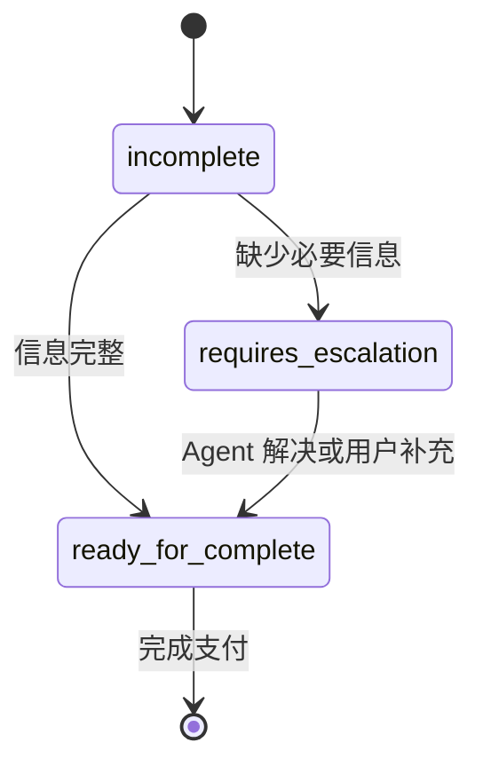
```mermaid
stateDiagram-v2
    [*] --> incomplete
    incomplete --> requires_escalation: 缺少必要信息
    incomplete --> ready_for_complete: 信息完整
    requires_escalation --> ready_for_complete: Agent 解决或用户补充
    ready_for_complete --> [*]: 完成支付
```

**状态说明**：

| 状态 | 含义 | Agent 行为 |
|------|------|-----------|
| `incomplete` | 缺少必要信息 | 尝试通过 API 补充 |
| `requires_escalation` | 需要用户介入 | 调用 `continue_url` 移交 |
| `ready_for_complete` | 可以完成 | 调用完成 API |

### 6.2 人机协作 (Handoff)

当 Agent 遇到无法处理的情况时，通过 `continue_url` 移交给用户：

```json
{
  "status": "requires_escalation",
  "messages": [
    {
      "type": "error",
      "text": "需要验证年龄以购买此商品"
    }
  ],
  "links": [
    {
      "rel": "continue",
      "href": "https://merchant.example.com/checkout/abc123"
    }
  ]
}
```

**Handoff 流程**：

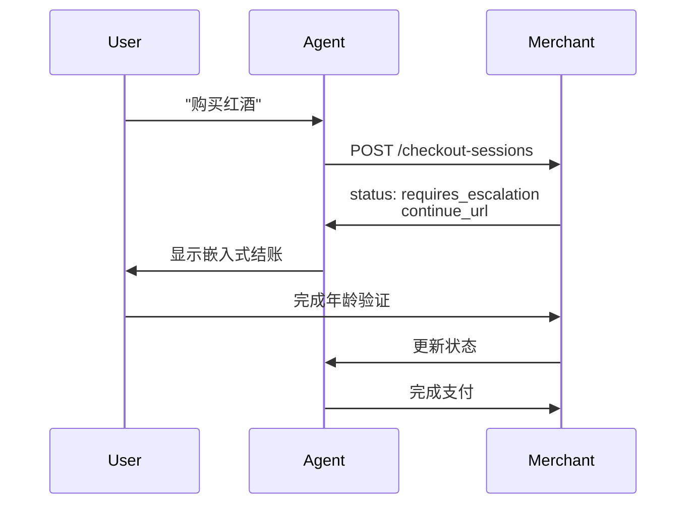
```mermaid
sequenceDiagram
    participant User
    participant Agent
    participant Merchant
    
    User->>Agent: "购买红酒"
    Agent->>Merchant: POST /checkout-sessions
    Merchant->>Agent: status: requires_escalation<br/>continue_url
    
    Agent->>User: 显示嵌入式结账
    User->>Merchant: 完成年龄验证
    Merchant->>Agent: 更新状态
    Agent->>Merchant: 完成支付
```

### 6.3 Embedded Checkout Protocol (ECP)

ECP 使移交无缝衔接：

```typescript
// Agent 加载嵌入式结账
const iframe = document.createElement('iframe');
iframe.src = checkoutResponse.links.find(l => l.rel === 'continue').href;

// 建立 JSON-RPC 2.0 通道
const channel = new MessageChannel();
iframe.contentWindow.postMessage({
  type: 'init',
  port: channel.port2
}, '*', [channel.port2]);

// 双向通信
channel.port1.onmessage = (event) => {
  if (event.data.method === 'requestPayment') {
    // Agent 提供支付凭证
    const paymentInstrument = await getPaymentInstrument();
    channel.port1.postMessage({
      id: event.data.id,
      result: paymentInstrument
    });
  }
};
```

**ECP 能力**：
- ✅ 双向消息传递
- ✅ 支付凭证共享
- ✅ 地址信息共享
- ✅ PCI v4 合规
- ✅ 品牌定制

---

## 7. 支付架构

### 7.1 支付处理器 (Payment Handlers)

UCP 将**支付工具**（用户用什么支付）与**支付处理器**（谁处理支付）分离：

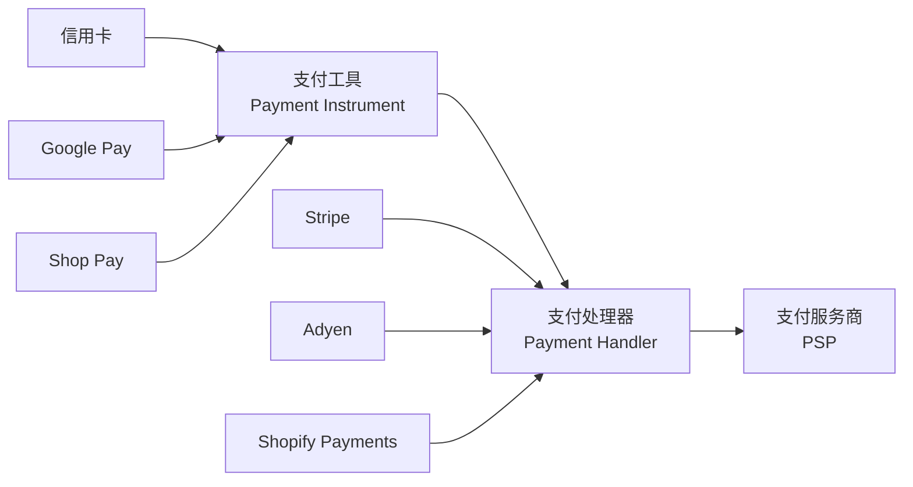
```mermaid
graph LR
    A[支付工具<br/>Payment Instrument] --> B[支付处理器<br/>Payment Handler]
    B --> C[支付服务商<br/>PSP]
    
    A1[信用卡] --> A
    A2[Google Pay] --> A
    A3[Shop Pay] --> A
    
    B1[Stripe] --> B
    B2[Adyen] --> B
    B3[Shopify Payments] --> B
```

### 7.2 动态支付协商

```typescript
// Agent Profile
const agentProfile = {
  payment: {
    instruments: [
      {
        type: 'google_pay',
        schema: 'https://ucp.dev/schemas/gpay_instrument.json'
      },
      {
        type: 'card',
        schema: 'https://ucp.dev/schemas/card_instrument.json'
      }
    ]
  }
};

// Merchant Profile
const merchantProfile = {
  payment: {
    handlers: [
      {
        id: 'shop_pay',
        name: 'com.shopify.shop_pay',
        instrumentSchemas: ['https://shopify.dev/ucp/shop_pay/instrument.json']
      },
      {
        id: 'google_pay',
        name: 'google.pay',
        instrumentSchemas: ['https://ucp.dev/schemas/gpay_instrument.json']
      }
    ]
  }
};

// 协商结果
const negotiated = {
  availableHandlers: ['google_pay'],  // 双方都支持
  userChoice: 'google_pay'  // 用户选择
};
```

### 7.3 支付处理器扩展

任何支付提供商都可以发布自己的 Handler：

```typescript
// Stripe Handler 定义
interface StripeHandler {
  id: 'stripe';
  name: 'com.stripe.payment';
  version: '2026-01-11';
  spec: 'https://stripe.com/ucp/handler/spec';
  
  configSchema: {
    publishableKey: string;
    accountId: string;
  };
  
  instrumentSchemas: [
    'https://stripe.com/ucp/card_instrument.json',
    'https://stripe.com/ucp/bank_account_instrument.json'
  ];
}
```

**优势**：
- ✅ 无需协议升级
- ✅ 支付提供商自主发布
- ✅ 双向选择
- ✅ 动态协商

---

## 8. 技术实现

### 8.1 完整交互示例

#### 步骤 1: 发现商家能力

```bash
curl -X GET https://merchant.example.com/.well-known/ucp
```

**响应**：

```json
{
  "ucp": {
    "version": "2026-01-11",
    "capabilities": [
      {
        "name": "dev.ucp.shopping.checkout",
        "version": "2026-01-11"
      },
      {
        "name": "dev.ucp.shopping.discount",
        "version": "2026-01-11"
      }
    ]
  },
  "payment": {
    "handlers": [
      {
        "id": "shop_pay",
        "name": "com.shopify.shop_pay"
      },
      {
        "id": "google_pay",
        "name": "google.pay"
      }
    ]
  }
}
```

#### 步骤 2: 创建结账会话

```bash
curl -X POST https://merchant.example.com/checkout-sessions \
  -H 'Content-Type: application/json' \
  -H 'UCP-Agent: profile="https://agent.example/profile"' \
  -d '{
    "line_items": [
      {
        "item": {
          "id": "product_123",
          "title": "红玫瑰花束"
        },
        "quantity": 1
      }
    ],
    "buyer": {
      "full_name": "张三",
      "email": "zhang@example.com"
    },
    "currency": "USD"
  }'
```

**响应**：

```json
{
  "id": "checkout_abc123",
  "line_items": [
    {
      "id": "item_1",
      "item": {
        "id": "product_123",
        "title": "红玫瑰花束",
        "price": 3500
      },
      "quantity": 1,
      "totals": [
        { "type": "subtotal", "amount": 3500 },
        { "type": "total", "amount": 3500 }
      ]
    }
  ],
  "status": "ready_for_complete",
  "totals": [
    { "type": "subtotal", "amount": 3500 },
    { "type": "total", "amount": 3500 }
  ]
}
```

#### 步骤 3: 应用折扣

```bash
curl -X PUT https://merchant.example.com/checkout-sessions/checkout_abc123 \
  -H 'Content-Type: application/json' \
  -d '{
    "id": "checkout_abc123",
    "discounts": {
      "codes": ["10OFF"]
    }
  }'
```

**响应**：

```json
{
  "id": "checkout_abc123",
  "totals": [
    { "type": "subtotal", "amount": 3500 },
    { "type": "discount", "amount": 350 },
    { "type": "total", "amount": 3150 }
  ],
  "discounts": {
    "codes": ["10OFF"],
    "applied": [
      {
        "code": "10OFF",
        "title": "10% 折扣",
        "amount": 350,
        "automatic": false
      }
    ]
  }
}
```

### 8.2 Python SDK 示例

```python
from ucp import UCPClient, CheckoutRequest, LineItem

# 初始化客户端
client = UCPClient(
    merchant_url="https://merchant.example.com",
    agent_profile_url="https://agent.example/profile"
)

# 发现能力
capabilities = await client.discover_capabilities()
print(f"商家支持: {capabilities}")

# 创建结账
checkout = await client.create_checkout(
    CheckoutRequest(
        line_items=[
            LineItem(
                item={"id": "product_123", "title": "红玫瑰花束"},
                quantity=1
            )
        ],
        buyer={
            "full_name": "张三",
            "email": "zhang@example.com"
        },
        currency="USD"
    )
)

# 应用折扣
checkout = await client.update_checkout(
    checkout.id,
    discounts={"codes": ["10OFF"]}
)

print(f"最终价格: {checkout.totals.total}")
```

### 8.3 多传输支持

UCP 支持多种传输协议：

#### REST API

```typescript
// REST 绑定
POST /checkout-sessions
PUT /checkout-sessions/{id}
GET /checkout-sessions/{id}
```

#### Model Context Protocol (MCP)

```typescript
// MCP 工具定义
{
  "tools": [
    {
      "name": "create_checkout",
      "description": "创建结账会话",
      "inputSchema": {
        "type": "object",
        "properties": {
          "lineItems": { "type": "array" },
          "buyer": { "type": "object" }
        }
      }
    }
  ]
}
```

#### Agent2Agent (A2A)

```typescript
// A2A 消息
{
  "type": "request",
  "action": "checkout.create",
  "params": {
    "lineItems": [...],
    "buyer": {...}
  }
}
```

---

## 9. Google 集成

### 9.1 Google 实现

Google 构建了 UCP 的首个参考实现，支持：

- **AI Mode in Search**: 在搜索中直接购买
- **Gemini App**: 对话式购物体验
- **Google Pay**: 无缝支付集成

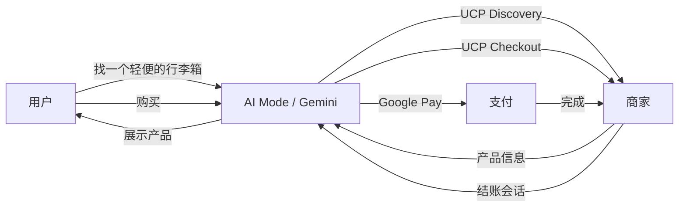
```mermaid
graph LR
    A[用户] -->|"找一个轻便的行李箱"| B[AI Mode / Gemini]
    B -->|UCP Discovery| C[商家]
    C -->|产品信息| B
    B -->|展示产品| A
    A -->|"购买"| B
    B -->|UCP Checkout| C
    C -->|结账会话| B
    B -->|Google Pay| D[支付]
    D -->|完成| C
```

### 9.2 商家集成步骤

#### 1. Merchant Center 配置

```bash
# 前提条件
- 拥有 Merchant Center 账户
- 上传产品数据
- 产品符合结账要求
```

#### 2. UCP 端点实现

```typescript
// 实现 UCP 端点
app.get('/.well-known/ucp', (req, res) => {
  res.json({
    ucp: {
      version: '2026-01-11',
      services: {
        'dev.ucp.shopping': {
          version: '2026-01-11',
          rest: {
            endpoint: 'https://yourstore.com/ucp'
          }
        }
      },
      capabilities: [
        { name: 'dev.ucp.shopping.checkout' },
        { name: 'dev.ucp.shopping.discount' }
      ]
    },
    payment: {
      handlers: [
        {
          id: 'google_pay',
          name: 'google.pay',
          config: {
            merchantId: 'YOUR_MERCHANT_ID'
          }
        }
      ]
    }
  });
});
```

#### 3. 提交集成申请

```bash
# 步骤
1. 阅读 Google 集成指南
   https://developers.google.com/merchant/ucp

2. 完成 UCP 集成
   https://developers.google.com/merchant/ucp/guides/checkout

3. 提交商家兴趣表单

4. 等待审核
```

### 9.3 用户体验

**示例查询**: "Find a light-weight suitcase for an upcoming trip."

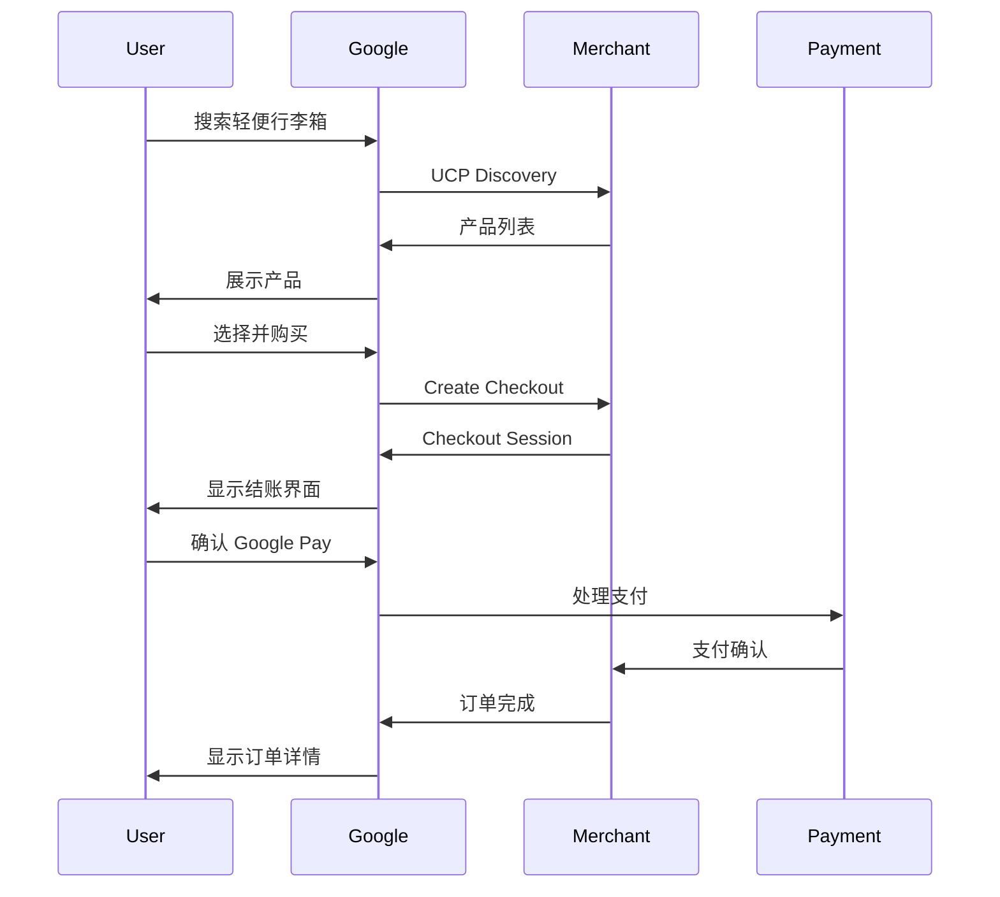
```mermaid
sequenceDiagram
    participant User
    participant Google
    participant Merchant
    participant Payment
    
    User->>Google: 搜索轻便行李箱
    Google->>Merchant: UCP Discovery
    Merchant->>Google: 产品列表
    Google->>User: 展示产品
    
    User->>Google: 选择并购买
    Google->>Merchant: Create Checkout
    Merchant->>Google: Checkout Session
    
    Google->>User: 显示结账界面
    User->>Google: 确认 Google Pay
    Google->>Payment: 处理支付
    Payment->>Merchant: 支付确认
    Merchant->>Google: 订单完成
    Google->>User: 显示订单详情
```

---

## 10. 最佳实践

### 10.1 能力设计原则

#### 1. 最小化核心，扩展增强

```typescript
// ✅ 好的设计
interface Checkout {
  // 核心字段
  id: string;
  lineItems: LineItem[];
  totals: Total[];
}

interface FulfillmentExtension extends Checkout {
  // 扩展字段
  fulfillmentGroups?: FulfillmentGroup[];
}

// ❌ 不好的设计
interface Checkout {
  id: string;
  lineItems: LineItem[];
  totals: Total[];
  fulfillmentGroups: FulfillmentGroup[];  // 不应在核心
  loyaltyPoints: number;  // 不应在核心
  giftWrap: GiftWrapOptions;  // 不应在核心
}
```

#### 2. 独立版本化

```json
{
  "capabilities": [
    {
      "name": "dev.ucp.shopping.checkout",
      "version": "2026-01-11"
    },
    {
      "name": "dev.ucp.shopping.fulfillment",
      "version": "2026-02-01"
    }
  ]
}
```

#### 3. 向后兼容

```typescript
// 添加新字段时使用可选
interface CheckoutV2 extends CheckoutV1 {
  // 新字段必须可选
  newField?: string;
}
```

### 10.2 安全实践

#### 1. 签名验证

```typescript
// 验证请求签名
app.use((req, res, next) => {
  const signature = req.headers['request-signature'];
  const requestId = req.headers['request-id'];
  
  if (!verifySignature(req.body, signature, requestId)) {
    return res.status(401).json({ error: 'Invalid signature' });
  }
  
  next();
});
```

#### 2. 幂等性

```typescript
// 使用幂等性键
app.post('/checkout-sessions', async (req, res) => {
  const idempotencyKey = req.headers['idempotency-key'];
  
  // 检查是否已处理
  const existing = await checkoutStore.getByIdempotencyKey(idempotencyKey);
  if (existing) {
    return res.json(existing);
  }
  
  // 创建新会话
  const checkout = await createCheckout(req.body);
  await checkoutStore.saveWithIdempotencyKey(checkout, idempotencyKey);
  
  res.json(checkout);
});
```

#### 3. 速率限制

```typescript
const rateLimit = require('express-rate-limit');

const limiter = rateLimit({
  windowMs: 60 * 1000,  // 1 分钟
  max: 100,  // 最多 100 次请求
  message: 'Too many requests'
});

app.use('/checkout-sessions', limiter);
```

### 10.3 性能优化

#### 1. 缓存 Profile

```typescript
// 缓存商家 Profile
const profileCache = new Map();

app.get('/.well-known/ucp', (req, res) => {
  const cached = profileCache.get('profile');
  if (cached && Date.now() - cached.timestamp < 3600000) {
    return res.json(cached.data);
  }
  
  const profile = generateProfile();
  profileCache.set('profile', {
    data: profile,
    timestamp: Date.now()
  });
  
  res.json(profile);
});
```

#### 2. 异步处理

```typescript
// 异步处理耗时操作
app.post('/checkout-sessions', async (req, res) => {
  // 快速创建会话
  const checkout = await createCheckoutSession(req.body);
  
  // 异步处理库存检查
  processInventoryCheck(checkout.id).catch(console.error);
  
  // 立即返回
  res.json(checkout);
});
```

### 10.4 错误处理

```typescript
// 标准错误响应
interface UCPError {
  error: {
    code: string;
    message: string;
    details?: any;
  };
}

// 错误处理中间件
app.use((err, req, res, next) => {
  const ucpError: UCPError = {
    error: {
      code: err.code || 'internal_error',
      message: err.message,
      details: err.details
    }
  };
  
  res.status(err.statusCode || 500).json(ucpError);
});
```

---

## 11. UCP vs ACP：双协议格局

:::warning{title="2026 年电商协议竞争"}
2026 年初，两大 AI 电商协议同时出现：Google + Shopify 的 **UCP** 和 OpenAI + Stripe 的 **ACP**。理解两者的差异和互补性，对商家至关重要。
:::

### 11.1 协议背景

| 维度 | UCP | ACP |
|------|-----|-----|
| **全称** | Universal Commerce Protocol | Agentic Commerce Protocol |
| **发起方** | Google + Shopify | OpenAI + Stripe |
| **发布时间** | 2026 年 1 月（NRF 大会） | 2025 年 9 月（公开），2026 年 2 月（广泛可用） |
| **协作方** | Etsy, Wayfair, Target, Walmart, 20+ 合作伙伴 | Microsoft Copilot, Anthropic, Perplexity, Vercel, Replit |
| **开源协议** | Apache 2.0 | Apache 2.0 |

### 11.2 架构哲学对比

**UCP：去中心化、全生命周期**

```
商家域名
  └── /.well-known/ucp    ← 任何 Agent 可自主发现
       ├── capabilities     ← 能力声明
       ├── extensions       ← 扩展声明
       └── payment_handlers ← 支付处理器

特点：
  • 商家自主托管 Profile
  • 无需平台审批
  • 支持 REST / MCP / A2A 多传输
  • 覆盖发现 → 结账 → 订单 → 售后全链路
```

**ACP：中心化、聚焦结账**

```
OpenAI 平台
  └── 商品目录（需审核入驻）
       ├── ChatGPT 展示
       └── Stripe SPT 支付

特点：
  • OpenAI 审核商家入驻
  • 紧耦合 ChatGPT 界面
  • 基于 Stripe Shared Payment Token
  • 聚焦结账/支付环节
```

### 11.3 关键差异详解

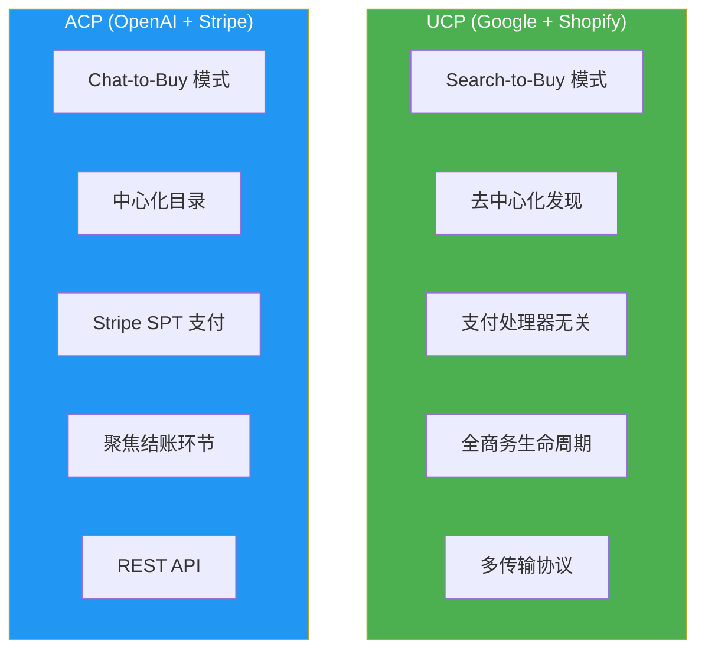
```mermaid
graph TB
    subgraph UCP["UCP (Google + Shopify)"]
        U1[Search-to-Buy 模式]
        U2[去中心化发现]
        U3[支付处理器无关]
        U4[全商务生命周期]
        U5[多传输协议]
    end

    subgraph ACP["ACP (OpenAI + Stripe)"]
        A1[Chat-to-Buy 模式]
        A2[中心化目录]
        A3[Stripe SPT 支付]
        A4[聚焦结账环节]
        A5[REST API]
    end

    style UCP fill:#4CAF50,color:#fff
    style ACP fill:#2196F3,color:#fff
```

| 维度 | UCP | ACP |
|------|-----|-----|
| **购物模式** | Search-to-Buy（搜索购买） | Chat-to-Buy（对话购买） |
| **发现机制** | 去中心化（`/.well-known/ucp`） | 中心化（OpenAI 审核） |
| **支付** | 处理器无关（Shop Pay, Google Pay, PayPal...） | Stripe 为中心（SPT） |
| **覆盖范围** | 发现 → 目录 → 结账 → 订单 → 退货 → 忠诚度 | 结账/交易 |
| **费用结构** | 仅支付处理费（~$3.20/$100） | 平台费 4% + 支付处理费（~$7.20/$100） |
| **传输协议** | REST, MCP, A2A | REST |
| **类比** | 开放高速公路系统 | 有开放大门的围墙花园 |

:::tip{title="$1M 月 GMV 的费用差异"}
以 $1M 月 GMV 计算，UCP（仅支付处理费）与 ACP（含平台费）的月费用差异可达 **$40,000** — 这是一个不可忽视的商业考量。
:::

### 11.4 商家策略：双协议并行

来自社区的共识建议：**同时支持两者**。

```typescript
// 双协议策略的商家架构
interface DualProtocolStrategy \{
    // UCP: 捕获搜索意图的顶部漏斗流量
    ucp: \{
        surface: 'Google AI Mode' | 'Gemini' | 'Any Agent';
        discovery: 'decentralized';  // /.well-known/ucp
        payment: 'processor-agnostic';
        coverage: 'full-lifecycle';
    \};

    // ACP: 捕获深层对话意图的底部漏斗流量
    acp: \{
        surface: 'ChatGPT' | 'Copilot';
        discovery: 'centralized';  // OpenAI 审核
        payment: 'stripe-spt';
        coverage: 'checkout-focused';
    \};
\}

// 实际案例：Etsy 同时出现在 UCP 和 ACP 合作伙伴列表中
// 双协议商家可获得多达 40% 的额外 Agent 流量
```

**实施路径：**
- **Shopify 商家**：通过 Agentic Storefronts 同时启用两者
- **Stripe 重度用户**：先启用 ACP（最快 1 行代码），再接入 UCP
- **Google Merchant Center 用户**：先启用 UCP（已有产品 Feed 基础），再接入 ACP
- **从 UCP 扩展到 ACP** 仅需额外 2-4 小时开发 + 审核等待时间

---

## 12. 生态与未来展望

### 12.1 市场数据

:::info{title="Agentic Commerce 已不再是理论"}
根据 Adobe 数据，2025 年假日季 AI 流量对零售商网站的增长达到了 **693%**。这意味着 Agent 驱动的商务已经从概念验证阶段进入了实际增长阶段。
:::

### 12.2 关键里程碑

```
2025.09 ──── OpenAI + Stripe 发布 ACP
    │
2026.01.11 ─ Google + Shopify 在 NRF 大会发布 UCP
    │         Sundar Pichai 和 Tobi Lutke 同时 Twitter 官宣
    │         20+ 全球合作伙伴
    │
2026.01 ──── Google AI Mode 结账在美国上线
    │         Shopify 商家可直接在 AI Mode 和 Gemini 中销售
    │
2026.02 ──── ACP 广泛可用
    │         Microsoft Copilot Checkout 发布
    │
2026 H2 ──── 全球扩展：印度、印尼、拉丁美洲
              PayPal 集成
```

### 12.3 Shopify Agentic Storefronts

Shopify 推出了 **Agentic Storefronts**，通过 Shopify Admin 集中管理所有 AI 渠道集成：

- **ChatGPT 集成**（通过 ACP）
- **Google AI Mode / Gemini 集成**（通过 UCP）
- **Microsoft Copilot 集成**
- **Shopify Catalog** 现向所有品牌开放，通过新的 Agentic 计划
- 品牌无需 Shopify 在线商店即可使用 Shopify 基础设施在 AI 渠道销售

来自 [Shopify CEO Tobi Lutke](https://www.shopify.com/news/ai-commerce-at-scale) 的评价：

> "This is one of the really exciting parts about agentic... It's really good at finding people who have specific interests and finding the product that is just perfect for them."

### 12.4 未来展望

**短期（2026）：**
- Google AI Mode 全球扩展
- 更多支付处理器接入（PayPal, BNPL 等）
- 更丰富的 UCP 扩展生态（忠诚度、订阅、礼品卡）

**中期（2026-2027）：**
- UCP 和 ACP 互操作性成熟
- 跨垂直领域扩展（旅游、餐饮、服务）
- `ucp.json` 成为商家的标配文件 — "2026 年最重要的文件"

**长期：**
- 从 "search and click" 到 "ask and buy" 的范式转移完成
- Agent 驱动的商务成为主流购物渠道
- 去中心化商务网络形成

---

## 13. 参考资源

**官方资源：**
- [UCP 规范](https://ucp.dev)
- [Shopify UCP 工程博客 - Building the Universal Commerce Protocol](https://shopify.engineering/ucp)
- [Google 开发者博客 - Under the Hood: UCP](https://developers.googleblog.com/under-the-hood-universal-commerce-protocol-ucp/)
- [Shopify 新闻 - AI Commerce at Scale](https://www.shopify.com/news/ai-commerce-at-scale)
- [Google 博客 - Agentic Commerce Tools](https://blog.google/products/ads-commerce/agentic-commerce-ai-tools-protocol-retailers-platforms/)
- [GitHub 仓库](https://github.com/universal-commerce-protocol/ucp)

**示例代码：**
- [Python SDK](https://github.com/Universal-Commerce-Protocol/python-sdk)
- [示例服务器](https://github.com/Universal-Commerce-Protocol/samples)

**新闻报道：**
- [TechCrunch - Google announces a new protocol to facilitate commerce using AI agents](https://techcrunch.com/2026/01/11/google-announces-a-new-protocol-to-facilitate-commerce-using-ai-agents/)
- [InfoQ - Google and Retail Leaders Launch UCP](https://www.infoq.com/news/2026/01/google-agentic-commerce-ucp/)
- [InfoQ - Google's UCP Powers Agentic Shopping](https://www.infoq.com/news/2026/01/google-ucp/)
- [American Banker - Google, Shopify unveil new agentic protocol](https://www.americanbanker.com/payments/news/google-shopify-unveil-new-agentic-protocol-for-retailers)
- [Constellation Research - Google launches agentic commerce tools](https://www.constellationr.com/blog-news/insights/google-launches-agentic-commerce-tools-universal-commerce-protocol-gemini)

**UCP vs ACP 分析：**
- [DEV Community - UCP vs ACP: A Technical Comparison](https://dev.to/ucptools/ucp-vs-acp-in-2026-a-technical-comparison-of-ai-commerce-protocols-50j7)
- [Medium - A Deep Dive into Agentic Shopping with UCP and ACP](https://medium.com/agenticshopping/a-deep-dive-into-agentic-shopping-with-googles-ucp-and-openai-s-acp-f12243c64913)
- [Atwix - UCP vs ACP: The Real Differences](https://www.atwix.com/ecommerce/ucp-vs-acp-differences/)
- [Presta - UCP vs ACP: Complete Guide to Agentic Commerce Protocols](https://wearepresta.com/ucp-vs-acp-the-complete-guide-to-agentic-commerce-protocols-in-2026/)
- [The AI Economy - The Protocol Behind Shopify and Google's AI Shopping Vision](https://theaieconomy.substack.com/p/shopify-google-ai-agents-commerce-protocol)

**实施指南：**
- [Presta - Shopify UCP Implementation Guide 2026](https://wearepresta.com/shopify-ucp-how-to-implement-2026-guide/)
- [FixMyStore - UCP Complete 2026 Guide](https://fixmystore.com/hub/blogs/universal-commerce-protocol-ucp-the-complete-2026-guide-for-shopify-developers-and-merchants/)
- [UCPHub - Universal Commerce Protocol for Shopify](https://ucphub.ai/universal-commerce-protocol-for-shopify-the-2026-implementation-guide/)
- [ECommerce Partners - UCP: How Shopify, Google & AI Are Reshaping Ecommerce](https://ecommercepartners.com/2026/02/04/universal-commerce-protocol-shopify-google-ai-ecommerce-guide/)
- [Goodie - Agentic Commerce Guide: Win Google UCP & OpenAI ACP](https://higoodie.com/blog/agentic-commerce-guide-ucp-acp)

**社区分享 (Twitter/X)：**
- [@sundarpichai - UCP 发布公告](https://x.com/sundarpichai/status/2010382050570932299)
- [@tobi - Shopify agentic commerce 公告](https://x.com/tobi/status/2010372642843599064)
- [@GoogleCloudTech - UCP 协议兼容性](https://x.com/GoogleCloudTech/status/2010754721171063011)
- [@rohanpaul\_ai - UCP 技术解读](https://x.com/rohanpaul_ai/status/2010387693436563775)
- [@c4lvin - UCP vs ACP 对比分析](https://x.com/c4lvin/status/2010635334820995519)
- [@ay\_ushr - UCP vs ACP 精辟总结](https://x.com/ay_ushr/status/2010697251622965714)
- [@j\_g\_allen - 行业关注](https://x.com/j_g_allen/status/2010555891725058325)
- [@Saboo\_Shubham\_ - Shopify 工程解析](https://x.com/Saboo_Shubham_/status/2010407346233921658)

**社区：**
- [Discord](https://discord.gg/ucp)
- [论坛](https://community.ucp.dev)

---

**结语**：

UCP 代表了电商协议设计的新范式 — 被社区称为**商务领域的 "HTTP 时刻"**。通过分层架构、动态协商和开放扩展，它为 AI 时代的商务交互提供了坚实的基础。与 ACP 形成互补的双协议格局，共同推动从 "search and click" 到 "ask and buy" 的行业转型。无论你是商家、AI 平台还是支付提供商，UCP 都为你提供了参与下一代电商生态的标准化路径。
